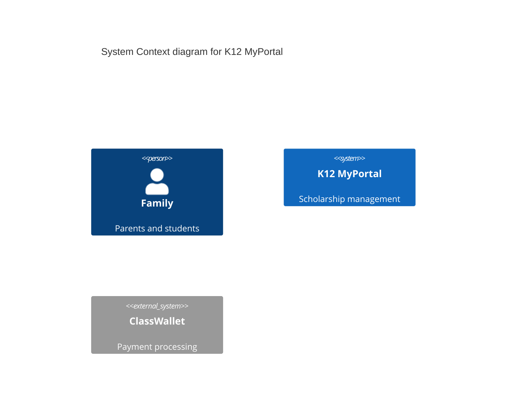

# K12 System Architecture Documentation Gap Analysis

**Date:** November 23, 2025  
**Purpose:** Compare Confluence "System Architecture" space with k12-Arch GitHub repository to identify documentation gaps and create implementation plan

---

## Executive Summary

The K12 project has a solid foundation in the k12-Arch GitHub repository with a well-structured wiki and documentation site (Nuxt). However, there are significant gaps between the detailed technical documentation available in Confluence and what's been captured in the GitHub repo. This analysis identifies:

1. **What's well documented** in GitHub
2. **What exists in Confluence** but not in GitHub
3. **Critical gaps** requiring immediate attention
4. **Recommended documentation structure** (ADRs, C4 diagrams, etc.)

---

## Current State: k12-Arch GitHub Repository

### Existing Documentation Structure

```
k12-Arch/
├── DOCUMENTATION_GUIDE.md      ✅ Comprehensive guide
├── MyPortal K12.md            ✅ Full Confluence export (714KB, 12,063 lines)
├── wiki/                      ✅ Organized markdown structure
│   ├── 01-project-overview/   ✅ Basic structure exists
│   ├── 02-architecture/       ✅ High-level architecture documented
│   ├── 05-development/        ✅ Development guide present
│   ├── Database-Schema-Documentation.md ✅ Detailed schema docs
│   └── TABLE_OF_CONTENTS.md   ✅ Navigation guide
├── k12-docs/                  ✅ Nuxt Content documentation site
│   └── (Interactive searchable docs)
└── sources/                   ✅ Source documents and images
```

### What's Well Documented in GitHub

1. **High-Level Architecture** (wiki/02-architecture/README.md)
   - ✅ System overview with ASCII diagrams
   - ✅ Hub & Spoke security model
   - ✅ Layered N-tier backend architecture
   - ✅ Frontend monorepo structure
   - ✅ Technology stack summary
   - ✅ External integrations overview

2. **Database Schema** (wiki/Database-Schema-Documentation.md)
   - ✅ Complete schema documentation with all tables
   - ✅ Relationships and foreign keys
   - ✅ Column definitions
   - ✅ Use cases and examples

3. **Project Overview** (wiki/01-project-overview/)
   - ✅ Project charter
   - ✅ Stakeholders
   - ✅ Timeline
   - ✅ Key statistics

4. **Documentation Infrastructure**
   - ✅ Searchable documentation site
   - ✅ Dark mode support
   - ✅ Table of contents generation
   - ✅ Markdown-based wiki

---

## Confluence "System Architecture" Pages (25 Total)

### Page Inventory

| # | Page Title | Depth | Status | Content Density |
|---|-----------|-------|--------|-----------------|
| 1 | **System Architecture** (Parent) | 0 | current | Empty (container) |
| 2 | Angular (Frontend) | 1 | current | Empty |
| 3 | ├─ Cross-Cutting Concerns | 2 | current | Empty |
| 4 | ├─ Application UI and Component Strategy | 2 | current | Unknown |
| 5 | Identity Provider (CIAM) Options Analysis | 1 | current | Unknown |
| 6 | Microsoft Entra ID Hub and Spoke Model | 1 | current | Critical |
| 7 | ├─ Entra Id Data Flow | 2 | current | Critical |
| 8 | ├─ App Registration Info | 2 | current | Critical |
| 9 | Entra Integration Research Findings | 1 | current | Unknown |
| 10 | Roles and Groups | 1 | current | Critical |
| 11 | ├─ K12 Account Creation | 2 | current | Unknown |
| 12 | ├─ Test User Accounts | 2 | current | Operational |
| 13 | ├─ Admin Roles & Permissions | 2 | current | Critical |
| 14 | ├─ Provider Roles and Permissions | 2 | current | Critical |
| 15 | ├─ Schools Roles and Permissions | 2 | current | Critical |
| 16 | ├─ Household Roles and Permissions | 2 | draft | Critical |
| 17 | Mapping Data from Enrollment Builder | 1 | current | Unknown |
| 18 | Design and Architecture for PandaDoc Integration | 1 | current | Integration |
| 19 | Requirements | 1 | current | Requirements |
| 20 | K12 Database | 1 | current | Documented |
| 21 | K12 - Domain Design | 1 | current | Unknown |
| 22 | ├─ Communication Matrix | 2 | current | Integration |
| 23 | ├─ Class Wallet Matrix | 2 | current | Integration |
| 24 | ├─ General Ledger (GL) Integration Matrix | 2 | current | Integration |
| 25 | **Standards and Practice** | 1 | current | ✅ **Has Content** |
| 26 | RDS Integration Solution Design | 1 | current | Integration |
| 27 | K12-Web-Enrollment | 1 | current | Unknown |
| 28 | Cross Team Technology Syncs | 1 | current | Operational |
| 29 | ├─ Workflows & Tasks | 2 | current | Whiteboard |
| 30 | ├─ Technology Leads Sync | 2 | current | Operational |
| 31 | ├─ K12 Developer Sync | 2 | current | Operational |
| 32 | **Rule Engine (.NET/C#)** | 1 | current | ✅ **Extensive** |
| 33 | ├─ Handling Rule Outcomes in NRules | 2 | current | Implementation |
| 34 | ├─ Rule Engine Selection Analysis | 2 | current | ADR-like |
| 35 | ├─ Business Logic Layer Introduction | 2 | current | Whiteboard |
| 36 | Workflows with Task(s) | 1 | draft | Unknown |
| 37 | Audit Logs | 1 | current | Unknown |
| 38 | Internal Runbook: Azure Defender for DevOps | 1 | current | Operational |
| 39 | K12Technology Roadmap | 1 | current | Strategic |
| 40 | ├─ Household & Student Management | 2 | current | Requirements |
| 41 | ├─ School Management | 2 | current | Requirements |
| 42 | ├─ Provider Management | 2 | current | Requirements |
| 43 | ├─ Admin Portal Operations | 2 | current | Requirements |
| 44 | ├─ Payment & Financial Systems | 2 | current | Requirements |
| 45 | ├─ Verification & Compliance | 2 | current | Requirements |
| 46 | Copilot Enterprise | 1 | current | Tooling |
| 47 | ├─ Copilot Integration | 2 | current | Tooling |
| 48 | ├─ GitHub Copilot Rollout Plan | 2 | current | Tooling |
| 49 | Cutover Planning | 1 | current | Operational |
| 50 | └─ Whiteboard (Cutover) | 2 | current | Whiteboard |

### Content Analysis

**High-Value Pages Retrieved:**
1. **Standards and Practice** - Frontend coding standards (alphabetization, Material Design, data-qa attributes)
2. **Rule Engine (.NET/C#)** - Comprehensive 20-page analysis comparing NRules, FluentValidation, Custom Pattern

---

## Critical Gaps: What's Missing in GitHub

### 1. Architecture Decision Records (ADRs) ❌

**Status:** MISSING ENTIRELY

**What Should Exist:**
- Why Dapper over Entity Framework for data access
- Why Azure Functions over App Service
- Why Nx monorepo for frontend
- Why Entra ID B2C over other CIAM options
- Why NRules for business rules engine
- Why Terraform over ARM/Bicep
- Why Angular 19 over React/Vue
- Why multi-schema database design

**Recommended Location:** `wiki/03-decisions/` or `wiki/adr/`

**Format:** Use ADR template:
```
# ADR-001: Title

**Status:** Accepted | Proposed | Deprecated
**Date:** YYYY-MM-DD
**Deciders:** Names
**Context:** What is the issue motivating this decision?
**Decision:** What decision was made?
**Consequences:** What becomes easier or more difficult?
**Alternatives Considered:** What other options were evaluated?
```

### 2. C4 Architecture Diagrams ❌

**Status:** ASCII diagrams exist, but not formal C4 models

**Missing C4 Levels:**

#### Level 1: System Context (Missing)
- External users (Families, Schools, Providers, SEAA staff)
- External systems (ClassWallet, SendGrid, PandaDoc, Melissa Data, NC DMV, NC DOR, NC DPI)
- K12 MyPortal system boundary

#### Level 2: Container Diagram (Partial)
- ✅ High-level mentioned in wiki/02-architecture
- ❌ No formal C4 container diagram with:
  - Angular SPA (Static Web App)
  - Azure Functions API
  - Azure SQL Database
  - ADLS Gen2
  - Azure APIM
  - SignalR Service
  - Entra ID B2C
  - Azure Blob Storage

#### Level 3: Component Diagrams (Missing)
- Backend component breakdown:
  - API Layer (Azure Functions)
  - Application Layer (Business Logic Apps)
  - Domain Layer (Models, Validators)
  - Infrastructure Layer (External Services)
  - Data Layer (Repositories)
- Frontend component breakdown:
  - Admin app components
  - Enrollment app components
  - Shared library structure

#### Level 4: Code Diagrams (Missing)
- Class diagrams for key domain models
- Sequence diagrams for critical flows (enrollment, authorization, payment)

**Recommended Location:** `wiki/02-architecture/c4-diagrams/`

**Tools to Use:**
- PlantUML (text-based, version controllable)
- Mermaid (already supported in GitHub markdown)
- Structurizr DSL (C4 model-specific)

### 3. Frontend Architecture Documentation ❌

**Status:** MINIMAL

**What's Missing:**
- Angular 19 architecture patterns
- Nx monorepo build strategies
- Shared library architecture
- Component design patterns
- State management approach
- Routing strategy across 4 apps
- Material Design + PrimeNG integration strategy
- Cross-cutting concerns implementation

**What Exists in Confluence:**
- ✅ "Standards and Practice" page (coding standards)
- ❌ "Angular (Frontend)" page is EMPTY
- ❌ "Cross-Cutting Concerns" page is EMPTY
- ? "Application UI and Component Strategy" (needs retrieval)

**Recommended Location:** `wiki/03-frontend/`

### 4. Security Architecture Deep Dive ❌

**Status:** HIGH-LEVEL ONLY

**What's in GitHub:**
- ✅ Hub & Spoke model overview
- ✅ High-level authorization flow
- ✅ Defense-in-depth layers

**What's Missing:**
- Detailed Entra ID configuration
- Custom security attributes implementation
- Administrative Units setup and delegation
- Row-level security (RLS) implementation in SQL
- APIM policies and JWT validation details
- SAS token generation and lifecycle
- MFA enforcement policies
- Audit logging architecture

**What Exists in Confluence:**
- "Microsoft Entra ID Hub and Spoke Model" (needs full review)
- "Entra Id Data Flow" 
- "App Registration Info"
- "Entra Integration Research Findings"
- "Roles and Groups" (with 5 sub-pages)

**Recommended Location:** `wiki/02-architecture/security/`

### 5. Integration Architecture Details ❌

**Status:** OVERVIEW ONLY

**What's in GitHub:**
- ✅ List of external integrations
- ✅ High-level integration points

**What's Missing:**
- PandaDoc integration architecture (Confluence has this)
- ClassWallet integration details with data flow
- SendGrid integration patterns
- Melissa Data API integration
- NC DMV/DOR integration approach
- Communication matrix (Confluence has this)
- Class Wallet matrix (Confluence has this)
- GL Integration matrix (Confluence has this)

**Recommended Location:** `wiki/02-architecture/integrations/`

### 6. Data Architecture ❌

**Status:** DATABASE SCHEMA ONLY

**What's in GitHub:**
- ✅ Complete database schema documentation

**What's Missing:**
- Data flow diagrams
- ETL/data migration strategy
- Data retention policies
- PII handling and masking
- ADLS Gen2 folder structure details
- Backup and recovery procedures
- Data sovereignty considerations (Azure Gov)

**Recommended Location:** `wiki/02-architecture/data/`

### 7. Business Rules Engine Documentation ❌

**Status:** ANALYSIS IN CONFLUENCE, NOT IN GITHUB

**What's in Confluence:**
- ✅ Comprehensive 20-page Rule Engine analysis
- ✅ NRules vs FluentValidation vs Custom Pattern comparison
- ✅ Code examples
- ✅ Architectural rationale

**What's in GitHub:**
- ❌ No mention of NRules
- ❌ No business rules documentation
- ❌ No decision record on rule engine selection

**Recommended Action:**
- Create ADR for rule engine selection
- Document NRules implementation patterns
- Include in backend architecture docs

**Recommended Location:** 
- `wiki/adr/ADR-005-nrules-business-rules-engine.md`
- `wiki/03-backend/business-rules.md`

### 8. Development Standards ❌

**Status:** MINIMAL

**What's in Confluence:**
- ✅ "Standards and Practice" page with frontend standards

**What's in GitHub:**
- ❌ No coding standards documentation
- ❌ No code review guidelines
- ❌ No Git workflow documentation
- ❌ No branch strategy

**Recommended Location:** `wiki/05-development/standards/`

### 9. Deployment Architecture ❌

**Status:** IaC EXISTS, ARCHITECTURE MISSING

**What's in GitHub:**
- ✅ Terraform code exists in separate repo
- ❌ No deployment architecture documentation
- ❌ No environment strategy documentation
- ❌ No CI/CD pipeline architecture

**What's Missing:**
- Environment topology (dev, test, staging, prod)
- Network architecture (VNets, NSGs, subnets)
- Azure DevOps pipeline architecture
- Deployment strategy (blue-green, canary, etc.)
- Infrastructure monitoring and observability

**Recommended Location:** `wiki/02-architecture/deployment/`

### 10. Technology Roadmap ❌

**Status:** IN CONFLUENCE, NOT IN GITHUB

**What's in Confluence:**
- "K12Technology Roadmap" page with 6 sub-pages covering:
  - Household & Student Management (15+ features)
  - School Management (20+ features)
  - Provider Management (12+ features)
  - Admin Portal Operations (30+ features)
  - Payment & Financial Systems (18+ features)
  - Verification & Compliance (15+ features)

**What's in GitHub:**
- ❌ No product roadmap
- ❌ No feature prioritization

**Recommended Action:**
- Migrate to GitHub for version control
- Consider markdown format for easier tracking

**Recommended Location:** `wiki/07-roadmap/`

---

## Documentation Priority Matrix

### Priority 1: CRITICAL (Do Immediately) 🔴

1. **ADRs for Key Technology Decisions**
   - Rule engine selection (NRules)
   - Data access pattern (Dapper over EF)
   - Frontend framework (Angular + Nx)
   - CIAM choice (Entra ID B2C)

2. **C4 Level 1 & 2 Diagrams**
   - System context
   - Container diagram

3. **Security Architecture Deep Dive**
   - Entra ID configuration
   - Custom security attributes
   - RLS implementation

4. **Business Rules Engine Documentation**
   - Migrate Confluence analysis
   - Implementation guide
   - Pattern examples

### Priority 2: HIGH (Do This Sprint) 🟠

5. **Frontend Architecture**
   - Nx monorepo strategy
   - Shared library patterns
   - Component architecture

6. **Integration Architecture Details**
   - PandaDoc integration
   - ClassWallet integration
   - Communication matrix

7. **Development Standards**
   - Migrate from Confluence
   - Expand with backend standards
   - Git workflow

8. **C4 Level 3 Diagrams**
   - Backend components
   - Frontend components

### Priority 3: MEDIUM (Next Sprint) 🟡

9. **Data Architecture**
   - Data flow diagrams
   - ADLS Gen2 structure
   - Data retention policies

10. **Deployment Architecture**
    - Environment topology
    - Network architecture
    - CI/CD pipeline

11. **Technology Roadmap**
    - Migrate from Confluence
    - Add technical dependencies

### Priority 4: LOW (Future) 🟢

12. **C4 Level 4 Diagrams**
    - Class diagrams
    - Sequence diagrams

13. **Operational Runbooks**
    - Migrate from Confluence
    - Add troubleshooting guides

14. **Role Definitions**
    - Detailed permission matrices
    - Account creation workflows

---

## Recommended Documentation Structure

### Proposed New Structure for k12-Arch/wiki/

```
wiki/
├── 01-project-overview/
│   └── README.md                          ✅ Exists
│
├── 02-architecture/
│   ├── README.md                          ✅ Exists (needs expansion)
│   ├── c4-diagrams/                       ❌ NEW
│   │   ├── 01-system-context.md
│   │   ├── 02-container-diagram.md
│   │   ├── 03-backend-components.md
│   │   ├── 03-frontend-components.md
│   │   └── 04-sequence-diagrams.md
│   ├── security/                          ❌ NEW
│   │   ├── entra-id-configuration.md
│   │   ├── authorization-model.md
│   │   ├── rls-implementation.md
│   │   └── audit-logging.md
│   ├── integrations/                      ❌ NEW
│   │   ├── classwalletintegration.md
│   │   ├── pandadoc-integration.md
│   │   ├── sendgrid-integration.md
│   │   ├── melissa-data-integration.md
│   │   └── nc-government-integrations.md
│   ├── data/                              ❌ NEW
│   │   ├── data-flows.md
│   │   ├── adls-gen2-structure.md
│   │   ├── data-retention.md
│   │   └── backup-recovery.md
│   └── deployment/                        ❌ NEW
│       ├── environment-topology.md
│       ├── network-architecture.md
│       └── cicd-pipelines.md
│
├── 03-frontend/                           ❌ NEW
│   ├── README.md
│   ├── nx-monorepo-architecture.md
│   ├── shared-library.md
│   ├── component-patterns.md
│   ├── state-management.md
│   └── routing-strategy.md
│
├── 04-backend/                            ❌ NEW
│   ├── README.md
│   ├── layered-architecture.md
│   ├── business-rules-engine.md
│   ├── api-design.md
│   └── data-access-patterns.md
│
├── 05-development/
│   ├── README.md                          ✅ Exists
│   └── standards/                         ❌ NEW
│       ├── frontend-standards.md
│       ├── backend-standards.md
│       ├── code-review-guidelines.md
│       └── git-workflow.md
│
├── 06-operations/
│   └── README.md                          ✅ Exists
│
├── 07-program-management/
│   └── README.md                          ✅ Exists
│
├── 08-roadmap/                            ❌ NEW
│   ├── README.md
│   ├── current-sprint.md
│   └── feature-roadmap.md
│
├── adr/                                   ❌ NEW (CRITICAL)
│   ├── README.md
│   ├── ADR-001-azure-government-cloud.md
│   ├── ADR-002-dapper-over-entity-framework.md
│   ├── ADR-003-entra-id-b2c-ciam.md
│   ├── ADR-004-nx-monorepo-frontend.md
│   ├── ADR-005-nrules-business-rules-engine.md
│   ├── ADR-006-terraform-iac.md
│   ├── ADR-007-angular-19-framework.md
│   └── ADR-008-multi-schema-database.md
│
├── Database-Schema-Documentation.md        ✅ Exists
├── README.md                              ✅ Exists
└── TABLE_OF_CONTENTS.md                   ✅ Exists (needs update)
```

---

## Action Plan: Next Steps

### Phase 1: Foundation (This Week)

1. **Create ADR Directory Structure**
   ```bash
   mkdir -p wiki/adr
   ```

2. **Write Critical ADRs** (8 total)
   - Start with ADR-005 (NRules) - content already in Confluence
   - ADR-002 (Dapper) - technical rationale needed
   - ADR-003 (Entra ID B2C) - analysis exists in Confluence
   - Others as time permits

3. **Create C4 System Context Diagram**
   - Use Mermaid or PlantUML
   - Show all external actors and systems
   - Place in `wiki/02-architecture/c4-diagrams/`

4. **Migrate Rule Engine Documentation**
   - Convert Confluence page to markdown
   - Create `wiki/04-backend/business-rules-engine.md`
   - Link to ADR-005

### Phase 2: High Priority (Next Week)

5. **Create C4 Container Diagram**
   - Detail all Azure services
   - Show data flows
   - Include technology choices

6. **Document Security Architecture**
   - Create `wiki/02-architecture/security/` directory
   - Write Entra ID configuration guide
   - Document RLS implementation

7. **Migrate Frontend Standards**
   - Convert Confluence "Standards and Practice"
   - Expand with architectural patterns
   - Create `wiki/03-frontend/` section

### Phase 3: Medium Priority (Following Sprint)

8. **Integration Architecture**
   - Document each external system
   - Create sequence diagrams
   - Detail error handling

9. **Frontend Architecture**
   - Nx monorepo patterns
   - Shared library strategy
   - Component architecture

10. **Deployment Architecture**
    - Environment diagrams
    - Network topology
    - CI/CD pipeline details

### Phase 4: Continuous Improvement

11. **Keep Documentation Current**
    - Update as decisions change
    - Add new ADRs for significant choices
    - Enhance diagrams as system evolves

12. **Regular Reviews**
    - Monthly architecture review
    - Quarterly ADR retrospective
    - Annual documentation audit

---

## Templates and Tools

### ADR Template

```markdown
# ADR-XXX: [Title]

**Status:** Proposed | Accepted | Deprecated | Superseded
**Date:** YYYY-MM-DD
**Deciders:** [List of people involved]
**Technical Story:** [Jira ticket or description]

## Context

[Describe the issue motivating this decision and any context that influences or constrains the decision]

## Decision

[Describe the change that we're proposing or have agreed to]

## Consequences

### Positive
- [What becomes easier or possible]

### Negative
- [What becomes more difficult]

### Neutral
- [What changes but is neither clearly positive nor negative]

## Alternatives Considered

### Option 1: [Name]
- **Pros:** 
- **Cons:** 
- **Reason for rejection:**

### Option 2: [Name]
- **Pros:**
- **Cons:**
- **Reason for rejection:**

## Technical Details

[Implementation notes, configuration examples, code snippets]

## Related Decisions

- [Links to related ADRs]

## References

- [External resources, documentation, research]
```

### C4 Diagram Tools

**Mermaid (Recommended for GitHub)**
- Built into GitHub Markdown
- Simple syntax
- Version controllable
- Example:


**PlantUML**
- More powerful
- C4 support via C4-PlantUML library
- Requires rendering step
- Better for complex diagrams

**Structurizr DSL**
- Purpose-built for C4
- Workspace-based
- Can generate multiple views
- Requires separate tool

### Documentation Site Updates

Update `k12-docs/content/` to match new wiki structure:
1. Add ADRs section with search
2. Create interactive diagrams section
3. Add breadcrumb navigation
4. Create dedicated sections for frontend/backend

---

## Metrics for Success

### Documentation Completeness

- [ ] 8 critical ADRs written
- [ ] 4 C4 diagram levels complete
- [ ] Security architecture fully documented
- [ ] All integration points documented
- [ ] Frontend architecture complete
- [ ] Backend architecture complete
- [ ] Development standards migrated

### Usage Metrics (via Nuxt docs site)

- Track page views
- Monitor search queries
- Collect feedback on usefulness
- Measure time to onboard new developers

### Quality Metrics

- Code review: Check that new features have ADRs
- Architecture review: Verify diagrams stay current
- Onboarding time: Measure reduction in new developer ramp-up

---

## Conclusion

The k12-Arch repository has a solid foundation with excellent structure and tooling (Nuxt docs site, wiki organization, database schema). However, there are critical gaps in:

1. **Architecture Decision Records** - None exist yet
2. **C4 Diagrams** - Only ASCII diagrams present
3. **Detailed Technical Architecture** - Security, integrations, frontend
4. **Business Rules Documentation** - Analysis in Confluence, not in GitHub

**Immediate Priority:** Create ADRs and C4 diagrams to establish architectural decision history and system visualization. This will provide the foundation for all other documentation efforts.

**Long-term Strategy:** Migrate high-value content from Confluence to GitHub while maintaining Confluence for operational/transient content (meeting notes, test accounts, etc.). Keep architecture and technical decisions in version-controlled markdown.

