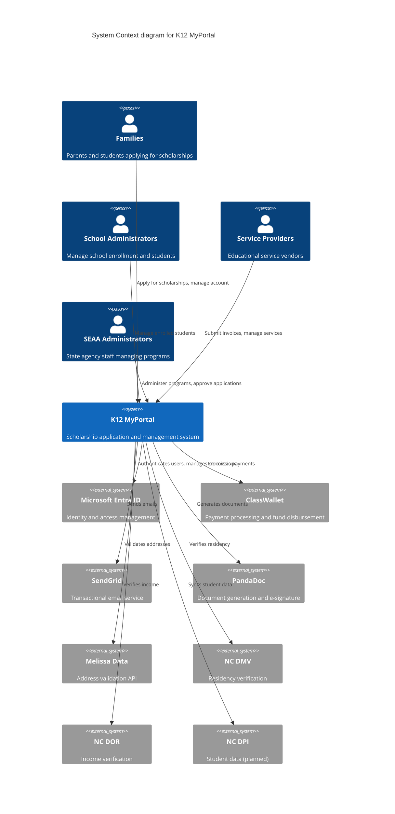
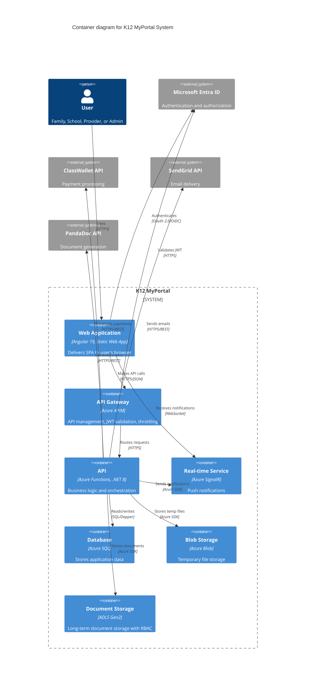
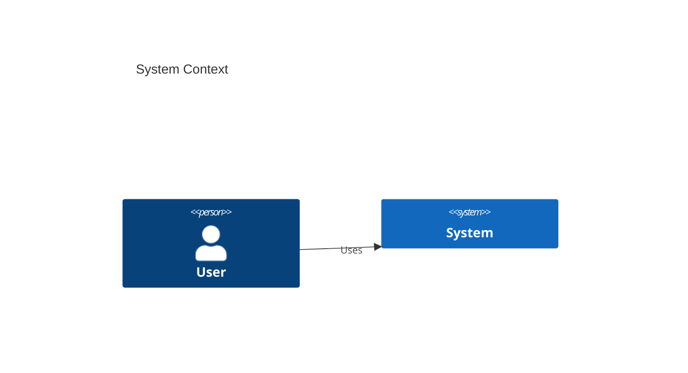

# K12 Architecture Documentation - Quick Start Guide

**Start Here**: Get critical documentation in place TODAY

---

## 🚀 30-Minute Quick Start

### Step 1: Create ADR Directory (2 minutes)

```bash
cd C:\Projects\CFI\K12\k12-Arch
mkdir wiki\adr
```

### Step 2: Create ADR README (5 minutes)

Create `wiki/adr/README.md`:

```markdown
# Architecture Decision Records (ADRs)

This directory contains records of architectural decisions made in the K12 MyPortal project.

## What is an ADR?

An Architecture Decision Record (ADR) captures an important architectural decision made along with its context and consequences.

## When to Write an ADR

Write an ADR when you make a significant decision about:
- Technology choices (frameworks, libraries, platforms)
- Architectural patterns (layering, data access, state management)
- Security approaches
- Integration strategies
- Development practices

## ADR Lifecycle

- **Proposed**: Under discussion
- **Accepted**: Decision made and implemented
- **Deprecated**: No longer followed
- **Superseded**: Replaced by another ADR

## Current ADRs

| ADR | Title | Status | Date |
|-----|-------|--------|------|
| [ADR-001](ADR-001-azure-government-cloud.md) | Azure Government Cloud Selection | Accepted | 2024-07-XX |
| [ADR-002](ADR-002-dapper-over-entity-framework.md) | Dapper for Data Access | Accepted | 2024-08-XX |
| [ADR-003](ADR-003-entra-id-b2c-ciam.md) | Entra ID B2C for CIAM | Accepted | 2024-07-XX |
| [ADR-004](ADR-004-nx-monorepo-frontend.md) | Nx Monorepo for Frontend | Accepted | 2024-08-XX |
| [ADR-005](ADR-005-nrules-business-rules.md) | NRules for Business Rules Engine | Accepted | 2024-11-XX |
| [ADR-006](ADR-006-terraform-iac.md) | Terraform for IaC | Accepted | 2024-07-XX |
| [ADR-007](ADR-007-angular-19-framework.md) | Angular 19 Framework | Accepted | 2024-08-XX |
| [ADR-008](ADR-008-multi-schema-database.md) | Multi-Schema Database Design | Accepted | 2024-07-XX |

## Template

See [ADR-template.md](ADR-template.md) for the standard format.
```

### Step 3: Create ADR Template (5 minutes)

Create `wiki/adr/ADR-template.md`:

```markdown
# ADR-XXX: [Short Title - Verb + Object]

**Status:** Proposed | Accepted | Deprecated | Superseded by [ADR-XXX]
**Date:** YYYY-MM-DD
**Deciders:** [Names]
**Technical Story:** [K12-XXXX] [Jira Link]

## Context and Problem Statement

[Describe the architectural challenge or decision that needs to be made.
What is the business or technical context? What forces are at play?]

## Decision Drivers

* [Driver 1 - e.g., Cost]
* [Driver 2 - e.g., Time to market]
* [Driver 3 - e.g., Developer experience]
* [Driver 4 - e.g., Compliance requirements]

## Considered Options

* [Option 1]
* [Option 2]  
* [Option 3]

## Decision Outcome

**Chosen option:** "[Option X]", because [justification].

### Consequences

#### Good
- [Positive consequence 1]
- [Positive consequence 2]

#### Bad
- [Negative consequence 1]
- [Negative consequence 2]

#### Neutral
- [Neutral point 1]

## Pros and Cons of the Options

### [Option 1]

* **Pro:** [Advantage]
* **Pro:** [Advantage]
* **Con:** [Disadvantage]
* **Con:** [Disadvantage]

### [Option 2]

* **Pro:** [Advantage]
* **Con:** [Disadvantage]

### [Option 3]

* **Pro:** [Advantage]
* **Con:** [Disadvantage]

## Technical Details

[Any implementation specifics, code examples, configuration details]

```language
// Code example
```

## Validation

[How will we know if this decision was correct? What metrics or outcomes?]

## Related Decisions

* [ADR-XXX] - Related decision
* [ADR-YYY] - Supersedes this

## References

* [Link to research]
* [Link to documentation]
* [Confluence page]
```

### Step 4: Write First ADR - NRules (15 minutes)

Create `wiki/adr/ADR-005-nrules-business-rules.md`:

```markdown
# ADR-005: NRules for Business Rules Engine

**Status:** Accepted
**Date:** 2024-11-XX
**Deciders:** CFI Architecture Team (Marty Flournory, Sumith Mathur), K12 Dev Team
**Technical Story:** Rules engine needed for complex business logic orchestration

## Context and Problem Statement

The K12 MyPortal application requires a sophisticated business rules engine to handle complex decision-making and orchestration within the Business Logic Layer (BLL). The system must:

- Coordinate business logic with rules to make determinations
- Proceed with specific actions based on rule evaluations
- Handle complex eligibility calculations
- Manage interdependent rules (Rule of Rules)
- Maintain all rules in C# source code (no external JSON/XML configuration)
- Support high testability and type safety

## Decision Drivers

* **Code-based rules**: All rules must be defined in C# source code for compile-time type safety
* **Orchestration support**: Must execute actions, not just validate
* **Composability**: Support complex rule correlation and dependencies
* **Developer experience**: Fluent API for readable rule definition
* **Testability**: Rules must be easily unit testable
* **Performance**: Handle high-volume, complex decision scenarios
* **Community support**: Active community and documentation

## Considered Options

1. **NRules** - Rete-based inference engine with Fluent C# API
2. **FluentValidation** - Validation framework (adapted for rules)
3. **Custom Rule Engine Pattern** - Hand-rolled Strategy/Specification pattern
4. **RulesEngine (Microsoft)** - JSON-based rules engine (rejected - violates requirement)

## Decision Outcome

**Chosen option:** "NRules", because it is the only solution that natively supports:
1. Complex fact correlation (Rule of Rules)
2. Action execution via Then() clause
3. Forward-chaining inference
4. Compile-time type safety
5. Rete algorithm optimization for complex scenarios

### Consequences

#### Good
- Native support for orchestration actions via Then() clause
- Efficient Rete algorithm for complex fact correlation
- Strongly-typed, compile-time validation
- Excellent composability for complex business logic
- MIT licensed, active community
- No external configuration files to manage

#### Bad
- Learning curve for Rete algorithm concepts
- Initial memory overhead for network creation
- Requires careful session management in stateless Azure environment
- Less mainstream than FluentValidation

#### Neutral
- Need to treat ISessionFactory as singleton
- Must create/dispose ISession per request
- Rules defined as C# classes (trade-off: less business-user-configurable, more reliable)

## Pros and Cons of the Options

### NRules (Chosen)

* **Pro:** Native Then() clause for action execution
* **Pro:** Rete algorithm optimized for complex pattern matching
* **Pro:** Forward-chaining supports "Rule of Rules"
* **Pro:** Fluent C# API with type safety
* **Pro:** Excellent for complex eligibility logic
* **Pro:** MIT licensed, open source
* **Con:** Learning curve for Rete concepts
* **Con:** Memory overhead for Rete network
* **Con:** Session management complexity in stateless environment

### FluentValidation

* **Pro:** Best-in-class Fluent API for validation
* **Pro:** Massive community (most popular .NET validation library)
* **Pro:** Excellent for input validation
* **Pro:** Highly testable
* **Con:** Designed for validation, not orchestration
* **Con:** No native action execution support
* **Con:** Sequential execution only (no inference)
* **Con:** Would require architectural workarounds for BLL orchestration

### Custom Rule Engine Pattern

* **Pro:** Complete control over execution order and logic
* **Pro:** Zero third-party dependencies
* **Pro:** Maximum testability (isolated classes)
* **Pro:** Simple for sequential policies
* **Con:** High boilerplate to implement
* **Con:** Manual management of rule dependencies
* **Con:** No Rete optimization for complex scenarios
* **Con:** Maintenance burden for core engine features

### RulesEngine (Microsoft) - REJECTED

* **Pro:** Powerful expression engine
* **Pro:** Dynamic rule modification without recompilation
* **Con:** ❌ Requires JSON configuration (violates requirement)
* **Con:** ❌ No compile-time type safety
* **Con:** ❌ Runtime expression parsing errors possible

## Technical Details

### NRules Implementation Pattern

```csharp
// Rule definition using Fluent API
public class EligibilityRule : Rule
{
    public override void Define()
    {
        Application application = default!;
        Household household = default!;
        
        When()
            .Match<Application>(() => application, 
                a => a.Status == ApplicationStatus.Submitted)
            .Match<Household>(() => household,
                h => h.Id == application.HouseholdId,
                h => h.Income < 100000);
        
        Then()
            .Do(ctx => 
            {
                application.SetEligible();
                ctx.Insert(new EligibilityDetermined(application.Id));
            });
    }
}

// Session management in Azure Functions
public class BusinessLogicService
{
    private readonly ISessionFactory _sessionFactory; // Singleton
    
    public async Task ProcessApplication(Application app)
    {
        using var session = _sessionFactory.CreateSession();
        session.Insert(app);
        session.Insert(app.Household);
        session.Fire(); // Execute matching rules
    }
}
```

### Layered Strategy

1. **FluentValidation**: Input validation at service boundary (DTOs)
2. **NRules**: Complex decision orchestration in BLL
3. **Custom Pattern**: Simple sequential policies (if needed)

## Validation

Success metrics:
- Rules are easily unit testable with high coverage (>90%)
- Complex eligibility logic is maintainable by team
- Performance acceptable for high-volume periods
- New rules can be added without modifying existing rules

## Related Decisions

* ADR-002 - Dapper for data access (impacts how facts are loaded)
* ADR-007 - .NET 8 and Azure Functions (impacts session management)

## References

* [Confluence: Rule Engine (.NET/C#)](https://cfi-nc.atlassian.net/wiki/spaces/KR/pages/4420075531)
* [NRules Official Documentation](https://nrules.net/)
* [NRules Fluent DSL](https://nrules.net/articles/fluent-rules-dsl.html)
* [Rete Algorithm Explanation](https://decisions.com/the-rete-algorithm-in-decisions-and-rule-net/)
```

---

## 🎨 C4 Diagrams - Quick Start (Next Priority)

### Step 1: Create C4 Directory (1 minute)

```bash
mkdir wiki\02-architecture\c4-diagrams
```

### Step 2: System Context Diagram (20 minutes)

Create `wiki/02-architecture/c4-diagrams/01-system-context.md`:

```markdown
# C4 Level 1: System Context Diagram

## K12 MyPortal System Context



## Key Relationships

### User Interactions

**Families (Parents/Students)**
- Apply for ESA+ and Opportunity Scholarship programs
- Upload required documents
- Manage student information
- Track application status
- Receive award notifications

**School Administrators**
- Manage school information
- Enroll and track students
- Submit attendance records
- View funding allocations

**Service Providers**
- Register services and products
- Submit invoices for payment
- Track approved services
- Manage provider staff

**SEAA Administrators**
- Configure program rules and policies
- Review and approve applications
- Manage statewide operations
- Generate compliance reports

### External System Integrations

**Microsoft Entra ID (Critical)**
- Hub & Spoke identity model
- Single sign-on (SSO)
- Custom security attributes for fine-grained access
- Administrative units for delegated administration
- Multi-factor authentication (MFA)

**ClassWallet (High Priority)**
- ESA+ payment disbursement
- Fund repository and tracking
- Invoice approval workflow
- Account balance queries
- Transaction reporting

**SendGrid (Medium Priority)**
- Application status notifications
- Award letters
- Renewal reminders
- System alerts
- Marketing communications

**PandaDoc (Medium Priority)**
- Provider agreement generation
- School contracts
- Compliance document creation
- E-signature workflow
- Document version control

**Melissa Data (Low Priority)**
- Real-time address validation
- Address standardization
- Geocoding for district verification

**NC DMV (Medium Priority)**
- Residency verification via driver's license
- Automated data lookup
- Compliance tracking

**NC DOR (Medium Priority)**
- Income verification
- Tax return validation
- Eligibility determination support

**NC DPI (Future)**
- Student enrollment data sync
- Academic records integration
- Statewide reporting

## Compliance and Governance

- **FedRAMP High**: Azure Government Cloud hosting
- **FERPA**: Student data protection
- **NIST 800-53**: Security control compliance
- **WCAG 2.1 AA**: Accessibility standards
- **NC State Records**: Retention policies

## System Boundaries

**In Scope:**
- Application processing (ESA+, Opportunity Scholarship)
- Award management and disbursement
- Document generation and storage
- User management and authentication
- Reporting and analytics

**Out of Scope:**
- Payment card processing (handled by ClassWallet)
- Email delivery infrastructure (handled by SendGrid)
- Document storage infrastructure (Azure-managed)
- Identity provider infrastructure (Entra ID-managed)

## Performance Requirements

- **Users**: 100,000+ concurrent during application periods
- **Applications**: 95,000+ annually
- **Availability**: 99.9% uptime
- **Response Time**: <2 seconds for API calls
- **Data Retention**: 7 years minimum
```

### Step 3: Container Diagram (30 minutes)

Create `wiki/02-architecture/c4-diagrams/02-container-diagram.md`:

```markdown
# C4 Level 2: Container Diagram

## K12 MyPortal Containers



## Container Details

### Web Application (Angular SPA)

**Technology:** 
- Angular 19.2.6
- Nx 21.4.1 monorepo
- TypeScript 5.7.3
- Angular Material + PrimeNG

**Applications:**
- Admin Portal (port 4200)
- Household Enrollment (port 4300)  
- Providers Portal (port 4500)
- Schools Portal (port 4600)

**Responsibilities:**
- User interface rendering
- Client-side routing
- Form validation
- State management
- API consumption

**Hosting:** Azure Static Web Apps

### API Gateway (Azure APIM)

**Technology:** Azure API Management

**Responsibilities:**
- JWT token validation
- API routing and versioning
- Rate limiting and throttling
- Request/response transformation
- API documentation (Swagger)
- IP filtering

**Security:**
- OAuth 2.0 token validation
- Client certificate validation
- CORS policy enforcement

### API (Azure Functions)

**Technology:**
- .NET 8
- Azure Functions v4
- Isolated worker process

**Architecture:**
- **API Layer**: HTTP Triggers (Admin.cs, Programs.cs, etc.)
- **Application Layer**: Business logic (AdminApp.cs, EnrollmentApp.cs)
- **Domain Layer**: Models, validators, enums
- **Infrastructure Layer**: External service integration
- **Data Layer**: Dapper repositories

**Key Functions:**
- Admin operations
- Enrollment processing
- Program management
- Award processing
- Communication handling

### Database (Azure SQL)

**Technology:** Azure SQL Database

**Schemas:**
- `dbo` - Core system tables
- `Enrollment` - Application data
- `Households` - Family information
- `Awards` - Award allocations
- `Comms` - Communications

**Security:**
- Row-Level Security (RLS)
- Dynamic data masking
- Transparent Data Encryption (TDE)
- Automated backups

### Blob Storage

**Technology:** Azure Blob Storage

**Purpose:** Temporary file uploads during application process

**Lifecycle:**
- Files uploaded to blob
- Processed and validated
- Moved to ADLS Gen2 for long-term storage
- Original blob deleted

### Document Storage (ADLS Gen2)

**Technology:** Azure Data Lake Storage Gen2

**Structure:**
```
/{application}/{legal-entity}/{userid}/{documentType}
/enrollment/lincoln-high/student123/apartmentleasingagreement
```

**Security:**
- Hierarchical access control (RBAC)
- SAS tokens (5-minute expiry)
- Encryption at rest

### Real-time Service (SignalR)

**Technology:** Azure SignalR Service

**Use Cases:**
- Application status updates
- Notification push
- Live dashboard updates
- Admin broadcast messages

## External System Integration

### Microsoft Entra ID

**Integration Type:** OAuth 2.0 / OpenID Connect

**Features:**
- Single Sign-On (SSO)
- Custom security attributes
- Administrative units
- B2C for external users

**Endpoints:**
- Authorization: `https://login.microsoftonline.us/{tenant}/oauth2/v2.0/authorize`
- Token: `https://login.microsoftonline.us/{tenant}/oauth2/v2.0/token`
- User Info: Microsoft Graph API

### ClassWallet API

**Integration Type:** REST API

**Key Endpoints:**
- POST `/disbursement` - Send funds
- GET `/balance` - Check account balance
- POST `/invoice` - Submit invoice
- GET `/transactions` - Query transactions

**Authentication:** API Key

### SendGrid API

**Integration Type:** REST API

**Use Cases:**
- Transactional emails
- Application confirmations
- Award notifications
- System alerts

**Authentication:** API Key

### PandaDoc API

**Integration Type:** REST API

**Use Cases:**
- Document generation
- E-signature workflow
- Template management

**Authentication:** OAuth 2.0

## Data Flow

### Application Submission Flow

```
User (Web) → APIM → API → Database
                    ↓
                  Blob Storage → ADLS Gen2
                    ↓
                  SignalR → User (Web)
                    ↓
                  SendGrid → User Email
```

### Award Processing Flow

```
Admin (Web) → APIM → API → Database
                           ↓
                      ClassWallet API
                           ↓
                      SignalR → User (Web)
                           ↓
                      SendGrid → User Email
```

## Deployment

**Azure Region:** US Gov Virginia

**Environments:**
- Development
- Testing
- Staging
- Production

**Infrastructure:** Terraform managed
```

---

## 📋 Next Quick Wins

### Security Architecture (1 hour)

Create `wiki/02-architecture/security/README.md` with:
- Entra ID Hub & Spoke details
- Custom security attributes schema
- RLS implementation
- Audit logging architecture

### Frontend Architecture (45 minutes)

Create `wiki/03-frontend/README.md` with:
- Nx monorepo structure
- Shared library patterns
- Routing strategy
- State management

### Integration Architecture (1 hour)

Create `wiki/02-architecture/integrations/` with individual files for:
- ClassWallet
- PandaDoc
- SendGrid
- NC Government systems

---

## 🎯 Prioritized Task List

### Today (Critical)
- [ ] Create ADR directory and README
- [ ] Write ADR-005 (NRules) - Content ready from Confluence
- [ ] Create C4 System Context diagram
- [ ] Update main README with ADR and C4 links

### This Week (High Priority)
- [ ] Write ADR-002 (Dapper)
- [ ] Write ADR-003 (Entra ID B2C)
- [ ] Create C4 Container diagram
- [ ] Start security architecture docs

### Next Week (Medium Priority)
- [ ] Remaining ADRs (4 more)
- [ ] Frontend architecture
- [ ] Integration details
- [ ] C4 Component diagrams

---

## 📝 Quick Reference

### ADR Naming Convention
```
ADR-XXX-short-descriptive-name.md

Examples:
ADR-001-azure-government-cloud.md
ADR-002-dapper-over-entity-framework.md
ADR-005-nrules-business-rules.md
```

### When to Write an ADR
- Chose a technology or framework
- Decided on an architectural pattern
- Made a security design choice
- Selected an integration approach
- Established a development practice

### C4 Diagram Tips
- Level 1: Focus on users and external systems
- Level 2: Show all containers (deployable units)
- Level 3: Zoom into one container, show components
- Level 4: Show code structure (classes, interfaces)

Use Mermaid for easy GitHub rendering:
````markdown

````

---

## 🔗 Resources

- [ADR GitHub Project](https://adr.github.io/)
- [C4 Model](https://c4model.com/)
- [Mermaid Live Editor](https://mermaid.live/)
- [PlantUML](https://plantuml.com/)
- Project Confluence: https://cfi-nc.atlassian.net/wiki/spaces/KR/pages/3338731526

---

**Ready to start? Begin with ADR-005 (NRules) - the content is already drafted above!**
```

Save this file to your k12-Arch repository and share with your team.
