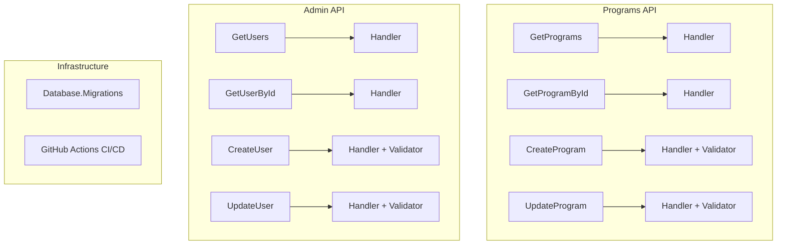

# Design - API Stubs and Infrastructure

## Architecture Overview

This design follows the existing **Vertical Slice Architecture** pattern established in the Enrollment API. Each feature is self-contained with all dependencies co-located.



---

## Component Design

### Programs API Structure

```
src/Api/K12.Api.Programs/
├── Features/
│   ├── GetPrograms/
│   │   ├── GetProgramsQuery.cs
│   │   ├── GetProgramsHandler.cs
│   │   └── GetProgramsEndpoint.cs
│   ├── GetProgramById/
│   │   ├── GetProgramByIdQuery.cs
│   │   ├── GetProgramByIdHandler.cs
│   │   └── GetProgramByIdEndpoint.cs
│   ├── CreateProgram/
│   │   ├── CreateProgramCommand.cs
│   │   ├── CreateProgramValidator.cs
│   │   ├── CreateProgramHandler.cs
│   │   └── CreateProgramEndpoint.cs
│   └── UpdateProgram/
│       ├── UpdateProgramCommand.cs
│       ├── UpdateProgramValidator.cs
│       ├── UpdateProgramHandler.cs
│       └── UpdateProgramEndpoint.cs
├── DependencyInjection.cs
└── Program.cs (update)
```

### Admin API Structure

```
src/Api/K12.Api.Admin/
├── Features/
│   ├── GetUsers/
│   │   ├── GetUsersQuery.cs
│   │   ├── GetUsersHandler.cs
│   │   └── GetUsersEndpoint.cs
│   ├── GetUserById/
│   │   ├── GetUserByIdQuery.cs
│   │   ├── GetUserByIdHandler.cs
│   │   └── GetUserByIdEndpoint.cs
│   ├── CreateUser/
│   │   ├── CreateUserCommand.cs
│   │   ├── CreateUserValidator.cs
│   │   ├── CreateUserHandler.cs
│   │   └── CreateUserEndpoint.cs
│   └── UpdateUser/
│       ├── UpdateUserCommand.cs
│       ├── UpdateUserValidator.cs
│       ├── UpdateUserHandler.cs
│       └── UpdateUserEndpoint.cs
├── DependencyInjection.cs
└── Program.cs (update)
```

### Infrastructure Structure

```
src/
├── Database.Migrations/
│   ├── Database.Migrations.csproj
│   ├── Program.cs
│   └── Scripts/
│       └── 001_InitialSchema.sql

.github/
└── workflows/
    └── ci-cd.yml
```

---

## Data Flow

### Query Flow (Read)

```
HTTP GET → Endpoint → MediatR → Handler → Dapr State/DB → DTO → Response
```

### Command Flow (Write)

```
HTTP POST/PUT → Endpoint → Mapster → Command → FluentValidation → Handler → Dapr State/DB → Event → Response
```

---

## Contracts (DTOs)

### Programs Contracts

```csharp
// src/Shared/K12.Contracts/Programs/
public record ProgramDto(Guid Id, string Name, string Description, bool IsActive);
public record CreateProgramRequest(string Name, string Description);
public record UpdateProgramRequest(string Name, string Description, bool IsActive);
```

### Admin Contracts

```csharp
// src/Shared/K12.Contracts/Admin/
public record UserDto(Guid Id, string Email, string DisplayName, bool IsActive);
public record CreateUserRequest(string Email, string DisplayName);
public record UpdateUserRequest(string DisplayName, bool IsActive);
```

---

## Stub Implementation Notes

All handlers will return **mock/stub data** for now:

- Queries return hardcoded sample data
- Commands return new GUIDs without actual persistence
- No database connections required for stubs
- Dapr state store used for demonstration purposes
