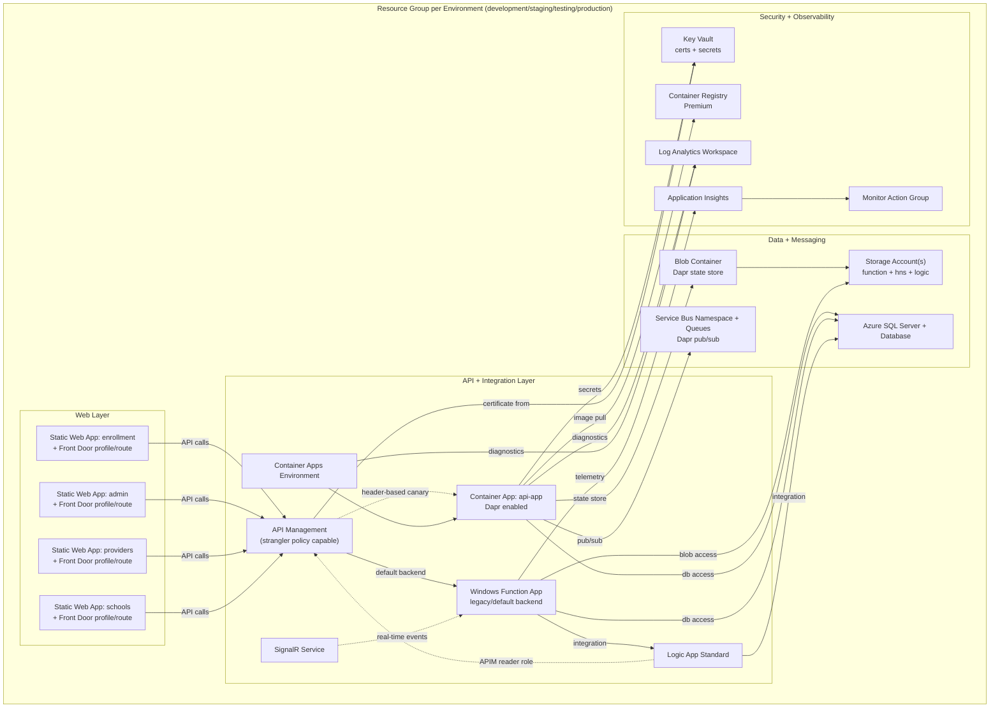
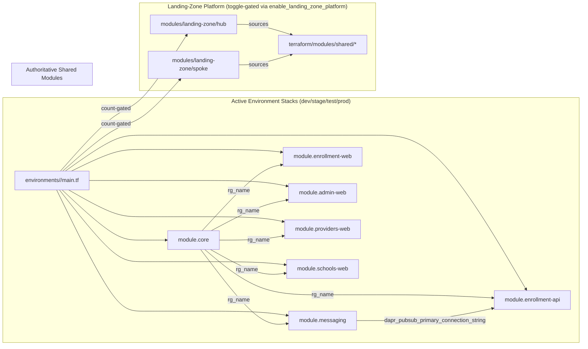
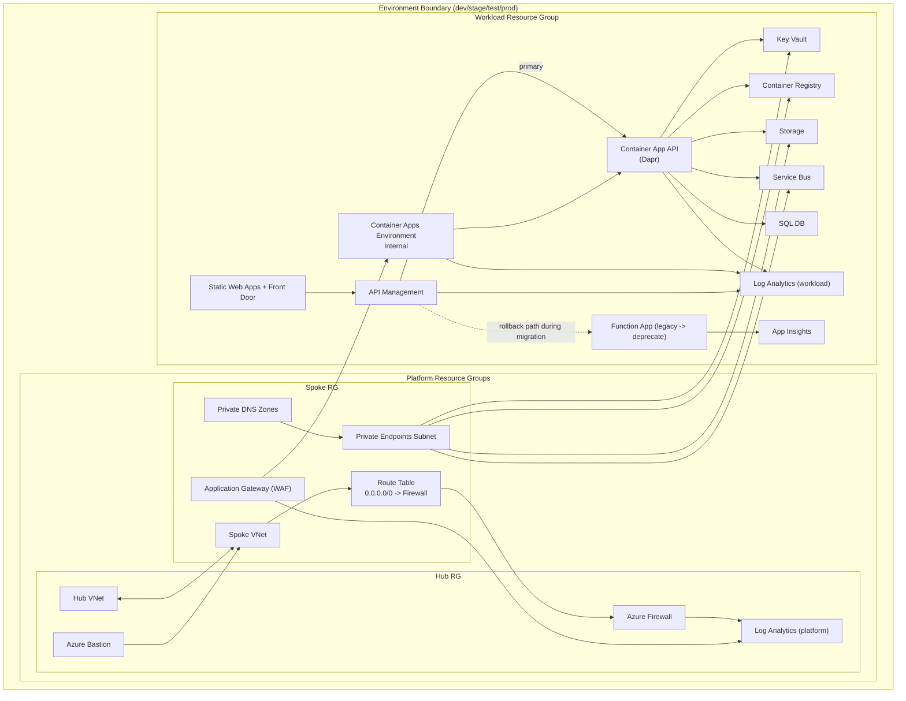

# ACA + Terraform Diagrams and Structure Review (2026-03-15)

## Scope

This review covers:

1. The **active Azure architecture** represented by `terraform/environments/*/main.tf` and current modules in `terraform/modules/*`.
2. The **Terraform module structure** including the canonical landing-zone modules under `terraform/modules/landing-zone/*` and shared platform modules under `terraform/modules/shared/*`. The reference accelerator content under `docs/aca-landing-zone-accelerator/scenarios` is non-authoritative.

---

## Azure architecture diagram (current active stack)



### Key architecture note

The APIM strangler resources are now defined but **toggle-gated**. When enabled with configured backend URLs/API name, APIM policy can route traffic to ACA by request header while preserving Function App as fallback/default.

---

## Terraform module dependency diagram (active + partial integration)



---

## Module/repo structure review

### What is solid

- `terraform/environments/{development,staging,testing,production}` is consistent and easy to reason about.
- Core app stack is modularized cleanly (`core`, `api-enrollment`, `web-enrollment`, `messaging`).
- Cross-module dependency is explicit and minimal (`messaging` output into `api-enrollment` for Dapr pub/sub).
- APIM strangler rollout is safely toggle-based rather than forcing cutover.

### Gaps and risks from partial accelerator integration

1. ~~**Two shared-module sources exist**~~ **RESOLVED**: `terraform/modules/shared/*` is the authoritative source. `docs/aca-landing-zone-accelerator/scenarios/*` is reference-only. CI guardrails enforce this.

2. ~~**Landing-zone modules are not part of active env graph**~~ **RESOLVED**: All environment roots (`development`, `staging`, `testing`, `production`) now wire `module.landing_zone_hub` and `module.landing_zone_spoke` from `terraform/modules/landing-zone/*`, gated by `enable_landing_zone_platform`.

3. ~~**Deep relative `source` paths are brittle**~~ **RESOLVED**: Canonical wrappers under `terraform/modules/landing-zone/*` use standard relative paths to `terraform/modules/shared/*`. Deprecated compatibility wrappers under `terraform/environments/development/modules/landing-zone/` are scheduled for removal (see PR-2b).

4. ~~**Landing-zone appears development-scoped only**~~ **RESOLVED**: All four environment roots have identical toggle-gated orchestration.

5. **Temporary Terraform logs appear in working tree frequently**
   - Plan/init/validate logs under `terraform/` can create noise and accidental commits.
   - Mitigated by `.gitignore` rules for `*.dryrun`, `tfplan*`, `*.log`.

---

## Recommended structure options

### ~~Option A (recommended)~~ **ADOPTED**: `terraform/modules/shared/*` is the single source of truth

- Landing-zone modules now source from `terraform/modules/shared/*`.
- `docs/aca-landing-zone-accelerator` is documentation/reference only.
- Environment roots orchestrate hub/spoke via toggle-gated module calls to `terraform/modules/landing-zone/*`.

### ~~Option B~~ Not selected

### ~~Option C~~ Not selected

---

## ~~Suggested next cleanup actions~~ Status (2026-03-15)

1. ~~Decide authoritative shared-module source (A or B).~~ **Done** — Option A adopted.
2. ~~Normalize module source paths.~~ **Done** — canonical wrappers use standard relative paths.
3. ~~If landing-zone is in-scope, add explicit env-level orchestration and toggle strategy.~~ **Done** — all envs wired.
4. ~~Add/extend `.gitignore` rules for Terraform runtime artifacts.~~ **Done**.
5. ~~Add a short `terraform/ARCHITECTURE.md`.~~ **Done** — see `terraform/ARCHITECTURE.md`.
6. **Remaining**: Remove deprecated compatibility wrappers at `terraform/environments/development/modules/landing-zone/` (scheduled PR-2b).

---

## Target-state architecture (after full integration)

This target state assumes Option A from above: `terraform/modules/shared/*` becomes the authoritative shared module set, and landing-zone orchestration is first-class in every environment.



### Target-state Terraform module graph

```mermaid
graph LR

  ROOT["environments/<env>/main.tf"]

  subgraph PLATFORM["Platform Orchestration"]
    LZ["module.landing-zone"]
    HUB["module.landing-zone-hub"]
    SPOKE["module.landing-zone-spoke"]
    SHARED["terraform/modules/shared/*"]
    LZ --> HUB
    LZ --> SPOKE
    HUB --> SHARED
    SPOKE --> SHARED
  end

  subgraph WORKLOAD["Workload Orchestration"]
    CORE["module.core"]
    MSG["module.messaging"]
    API["module.enrollment-api"]
    WEB["module.web-* (enrollment/admin/providers/schools)"]
  end

  ROOT --> LZ
  ROOT --> CORE
  ROOT --> MSG
  ROOT --> API
  ROOT --> WEB

  %% contract edges
  LZ -->|network, subnet, private endpoint contracts| API
  LZ -->|ingress contracts (AGW/APIM networking)| WEB
  CORE -->|rg + identity baseline| API
  CORE -->|rg + identity baseline| WEB
  MSG -->|pubsub connection output| API
```

---

## Plan: integrate landing zone correctly (phased)

### Phase 0 — Architecture lock (1-2 days)

- Choose authoritative shared modules: **`terraform/modules/shared/*`**.
- Freeze `docs/aca-landing-zone-accelerator/scenarios/*` as reference-only inputs.
- Define platform/workload module contracts (outputs/inputs): subnet IDs, PE DNS IDs, route table IDs, firewall IP, ingress endpoints.

**Exit criteria**
- Written contract doc approved.
- No unresolved ownership ambiguity for shared modules.

### Phase 1 — Module normalization (2-3 days)

- Create `terraform/modules/landing-zone/hub` and `terraform/modules/landing-zone/spoke` wrappers (or move current development landing-zone modules there).
- Replace deep relative `source` paths with local module paths rooted in `terraform/modules/*`.
- Remove duplicate capability drift by deprecating direct scenario module imports.

**Exit criteria**
- `grep` shows no `../../../../../../docs/aca-landing-zone-accelerator/.../modules` in active Terraform execution paths.

### Phase 2 — Environment orchestration wiring (2-4 days)

- Add `module "landing-zone"` to `environments/development/main.tf` first behind toggles:
  - `enable_landing_zone_platform`
  - `enable_private_networking`
  - `enable_internal_ingress`
- Wire outputs from landing-zone modules into workload modules incrementally.
- Repeat for staging/testing; production last.

**Exit criteria**
- `terraform validate` passes all envs.
- Dry-run plans succeed in dev/stage/test/prod with expected diffs.

### Phase 3 — Traffic migration completion (2-3 days)

- Keep APIM strangler enabled with staged headers and fallback.
- Shift default APIM backend from Function to ACA after SLO burn-in.
- Decommission Function dependencies once API parity is proven.

**Exit criteria**
- APIM default routes to ACA.
- Rollback tested.
- Function marked deprecated with removal window.

### Phase 4 — Hardening and cleanup (1-2 days)

- Add `.gitignore` entries for transient Terraform logs/plans.
- Add `terraform/ARCHITECTURE.md` with platform/workload boundaries.
- Add policy checks in CI to prevent reintroduction of scenario-relative module paths.

**Exit criteria**
- Clean git status after dry-runs.
- Architecture and guardrails documented.

---

## Recommended rollout strategy

Use **development -> staging -> testing -> production** promotion with dry-run gates at each step. For production, deploy platform primitives first, then flip APIM routing in controlled increments.

---

## Integration status: current vs target vs complete

| Environment | Current (before landing-zone execution) | Target (full integration design) | Complete now (2026-03-15 execution state) | Next gate |
|---|---|---|---|---|
| development | Workload modules only; landing-zone assets present but not root-orchestrated | Root-orchestrated landing-zone hub/spoke with contract-driven workload wiring | ✅ Root wiring complete with toggle-gated landing-zone orchestration and workload contract pass-through | Enable platform toggle in a controlled dry-run change window |
| staging | Workload modules only; no root landing-zone orchestration | Same as development with promotion-safe parity | ✅ Root wiring complete with parity to development pattern | Promotion soak + planned toggle enablement |
| testing | Workload modules only; no root landing-zone orchestration | Same as development with promotion-safe parity | ✅ Root wiring complete with parity to development pattern | End-to-end regression pass prior to production toggle trials |
| production | Workload modules only; safety-first defaults | Root-orchestrated platform with conservative toggles and rollback-safe APIM routing | ✅ Root wiring complete; conservative defaults remain toggle-gated and APIM strangler default remains rollback-safe | CAB-approved staged toggle enablement and APIM default backend switch review |

### APIM migration checkpoints (strangler path)

1. **Header-based canary enabled (safe mode)**
  - Keep default APIM backend on Function App.
  - Route only opted-in traffic to ACA using rollout header/value policy.
2. **Canary success criteria met**
  - ACA health endpoints stable (`/health/live`, `/health/ready`, `/health/startup`).
  - Error budget, latency, and dependency telemetry meet SLO targets through burn-in window.
3. **Default backend switch decision**
  - Change APIM default routing to ACA only after explicit approval.
  - Maintain immediate rollback policy path to Function backend.
4. **Rollback trigger and command path**
  - Trigger rollback on error-rate or latency regression beyond agreed threshold.
  - Rollback by restoring APIM policy default backend to Function and disabling canary header routing.

### Final verification command sequence (dry-run)

Run for each environment (`development`, `staging`, `testing`, `production`):

1. `terraform init -backend=false`
2. `terraform validate`
3. `terraform plan -refresh=false`
4. Confirm no module source references to `docs/aca-landing-zone-accelerator/scenarios/shared/terraform/modules` in active paths.

