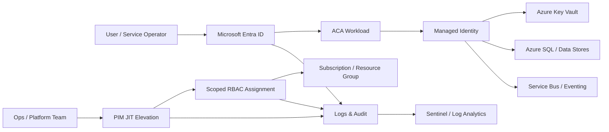

# Azure Container Apps Landing Zone Accelerator - Identity & Access Management

Identity is a core control plane for Azure Container Apps (ACA) workloads. This design area defines how user and workload identities are established, authorized, rotated, and audited across environments.

---
## Design Area Considerations

- Depending on your needs, the application running on ACA may have public access, private access (authenticated), or a mixed model where some endpoints are anonymous and others require authentication.

- Authentication and authorization for end users should be provided by Microsoft Entra ID (and Entra External ID / B2C when consumer identity is required).

- For workload-to-workload and workload-to-platform access, use [managed identity](https://learn.microsoft.com/azure/container-apps/managed-identity) instead of service principals whenever possible to avoid secret lifecycle overhead.

- Azure supports two managed identity patterns:
	- **System-assigned managed identity** (lifecycle tied to ACA resource)
	- **User-assigned managed identity** (standalone identity, reusable across resources)

- Identity design is coupled with environment strategy. App registrations, groups, and role assignments should be isolated by environment (`dev`, `test`, `prod`) to reduce blast radius.

- Production access should be just-in-time and audited via Privileged Identity Management (PIM) with clear approval policies and expiration windows.

---
## Target Identity Architecture



---
## Design Area Recommendations

### Identity Provider and App Registration Strategy

- If authentication is required, use Microsoft Entra ID or Entra External ID (B2C scenario) as identity provider.
- Use separate app registrations per environment (`dev`, `test`, `prod`) and avoid cross-environment token audiences.
- Keep API and client app registrations separate to enforce least privilege OAuth scopes.

### Workload Identity Strategy

- Prefer **system-assigned** managed identities for single-workload usage.
- Use **user-assigned** managed identities only when one identity must be shared by multiple ACA apps/jobs or when lifecycle decoupling is required.
- Never store platform credentials in app settings if managed identity is viable.

### Authorization and Least Privilege

- Use Azure built-in roles first; create custom roles only when built-ins are too broad.
- Assign RBAC at the narrowest scope possible (resource > resource group > subscription).
- Separate deployment identities from runtime identities.

### Production Access Control

- Limit production privileges to JIT elevation via PIM.
- Avoid standing privileged assignments in production.
- Require MFA and approval for sensitive role activation.

---
## Reference Access Model

| Persona / Identity | Scope | Minimum Role Example |
|---|---|---|
| ACA runtime identity | Key Vault | `Key Vault Secrets User` |
| ACA runtime identity | Storage account (read) | `Storage Blob Data Reader` |
| ACA deploy pipeline identity | Resource group | `Contributor` (or narrower custom role) |
| Security operations | Subscription (read) | `Security Reader` |
| Emergency admin (PIM) | Subscription | `Owner` (eligible, time-bound only) |

---
## Implementation Samples

### Bicep: System-Assigned Identity on ACA

```bicep
resource acaApp 'Microsoft.App/containerApps@2024-03-01' = {
	name: 'aca-enrollment-api-dev'
	location: resourceGroup().location
	identity: {
		type: 'SystemAssigned'
	}
	properties: {
		managedEnvironmentId: acaEnv.id
		configuration: {
			ingress: {
				external: false
				targetPort: 8080
			}
		}
		template: {
			containers: [
				{
					name: 'api'
					image: 'myacr.azurecr.io/enrollment-api:latest'
				}
			]
		}
	}
}
```

### Terraform: Least-Privilege Role Assignment for Runtime Identity

```hcl
resource "azurerm_role_assignment" "aca_kv_secrets_user" {
	scope                = azurerm_key_vault.main.id
	role_definition_name = "Key Vault Secrets User"
	principal_id         = azurerm_container_app.api.identity[0].principal_id
}
```

### Azure Policy: Require Managed Identity on ACA

```json
{
	"properties": {
		"displayName": "Container Apps must use managed identity",
		"policyType": "Custom",
		"mode": "Indexed",
		"policyRule": {
			"if": {
				"allOf": [
					{
						"field": "type",
						"equals": "Microsoft.App/containerApps"
					},
					{
						"field": "identity.type",
						"exists": "false"
					}
				]
			},
			"then": {
				"effect": "deny"
			}
		}
	}
}
```

---
## Operational Guardrails

- Review app registration credentials and secret expiration monthly.
- Run quarterly access reviews for privileged groups and service principals.
- Alert on high-risk sign-ins, privileged role activation, and role assignment drift.
- Require break-glass account governance (credential vaulting, monitored usage, emergency-only process).

---
## Validation Checklist

- [ ] Separate app registrations exist for each environment.
- [ ] All ACA workloads use managed identity (system- or user-assigned).
- [ ] Runtime identities have least-privilege role assignments.
- [ ] Production privileged roles are eligible-only via PIM.
- [ ] Identity events are flowing to central logging/SIEM.

## References

- [Managed identities in Azure Container Apps](https://learn.microsoft.com/azure/container-apps/managed-identity)
- [Managed identities for Azure resources](https://learn.microsoft.com/azure/active-directory/managed-identities-azure-resources/overview)
- [Azure built-in roles](https://learn.microsoft.com/azure/role-based-access-control/built-in-roles)
- [Microsoft Entra Privileged Identity Management](https://learn.microsoft.com/azure/active-directory/privileged-identity-management/pim-configure)