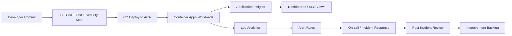

# Azure Container Apps Landing Zone Accelerator - Management & Operations

This design area defines the operating model for Azure Container Apps (ACA) workloads, including observability, scaling, reliability, release safety, and disaster recovery.

---
## Design Area Considerations

- Understand [ACA quotas and limits](https://learn.microsoft.com/azure/container-apps/quotas) before defining scale objectives.
- Isolate workloads at the correct layer (network, compute profile, data boundary, and operational ownership).
- Treat telemetry as a product requirement. Logging, metrics, and tracing must be designed before production rollout.
- Use health probes to enable automated remediation and safe rollout behavior.
- Define a scaling model that balances user experience and cost efficiency.
- Plan for business continuity with explicit recovery targets (RTO/RPO) and test evidence.
- Automate build, deploy, rollback, and validation to reduce manual change risk.

---
## Target Operating Model



---
## Design Area Recommendations

### Environment and Workload Isolation

- Create distinct ACA environments when full operational isolation is required.
- Do not use revisions as a tenant-isolation strategy.
- Use environment-level ownership boundaries for platform and application teams.

### Resource and Scaling Management

- Set explicit CPU/memory requests and limits for every container.
- Use KEDA-driven autoscaling where workload demand maps to queues, events, or concurrency.
- Tune min/max replicas by seasonality and criticality, not by defaults.

### Health, Telemetry, and Alerting

- Implement `startup`, `readiness`, and `liveness` probes for all workloads.
- Instrument end-to-end request traces and business-critical custom metrics.
- Define alert severity model with clear owner routing and runbook links.

### Resiliency and Disaster Recovery

- Enable zone redundancy for ACA and all critical dependencies where supported.
- Replicate state and artifacts across regions for DR scenarios.
- Validate DR procedures through recurring game-day exercises.

### Release Safety and Automation

- Use gated CI/CD with rollback criteria and environment promotion controls.
- Store container images in geo-replicated ACR.
- Require post-deploy health and SLO checks before promotion.

---
## Reliability & Operations Targets

| Objective | Target | Validation |
|---|---|---|
| Platform availability | 99.95% monthly | Synthetic checks + SLO report |
| API p95 latency | < 300 ms (standard paths) | Perf gates in CI |
| Incident MTTR (P1/P2 median) | < 45 minutes | Monthly incident report |
| DR recovery time (RTO) | < 30 minutes | Semi-annual DR drill |
| Data recovery point (RPO) | < 5 minutes | Replication validation |

---
## Implementation Samples

### ACA Health Probes (YAML)

```yaml
template:
  containers:
    - name: enrollment-api
      image: myacr.azurecr.io/enrollment-api:1.0.0
      probes:
        - type: Startup
          httpGet:
            path: /health/startup
            port: 8080
          initialDelaySeconds: 10
          periodSeconds: 5
        - type: Readiness
          httpGet:
            path: /health/ready
            port: 8080
          periodSeconds: 5
        - type: Liveness
          httpGet:
            path: /health/live
            port: 8080
          periodSeconds: 10
```

### KEDA Rule (Queue-Driven Scale)

```yaml
scale:
  minReplicas: 2
  maxReplicas: 50
  rules:
    - name: servicebus-scale
      custom:
        type: azure-servicebus
        metadata:
          queueName: enrollment-events
          messageCount: "25"
```

### KQL Alert Query (Error Spike)

```kusto
requests
| where timestamp > ago(5m)
| summarize total=count(), failed=countif(success == false) by cloud_RoleName
| extend errorRate = todouble(failed) / todouble(total)
| where total > 100 and errorRate > 0.02
```

### Pipeline Gate Example (YAML)

```yaml
- stage: verify
  jobs:
    - job: postdeploy_checks
      steps:
        - script: echo "Run smoke tests"
        - script: echo "Run SLO verification query"
        - script: echo "Fail stage when thresholds are breached"
```

---
## Operational Guardrails

- Every alert must map to an owner and runbook.
- No production deployment without rollback path and health check.
- SLO/error-budget review is mandatory in monthly operations cadence.
- DR rehearsal evidence must be retained and reviewed.

---
## Validation Checklist

- [ ] Probe coverage exists for all production workloads.
- [ ] Autoscaling rules are defined and tested under load.
- [ ] Dashboards exist for golden signals and business KPIs.
- [ ] P1/P2 alerts route to on-call and are tested.
- [ ] DR plan is documented, tested, and current.

## References

- [ACA quotas and limits](https://learn.microsoft.com/azure/container-apps/quotas)
- [ACA health probes](https://learn.microsoft.com/azure/container-apps/health-probes?tabs=arm-template)
- [ACA log monitoring](https://learn.microsoft.com/azure/container-apps/log-monitoring?tabs=bash)
- [ACA scaling](https://learn.microsoft.com/azure/container-apps/scale-app?pivots=azure-cli)
- [SLA for Azure Container Apps](https://azure.microsoft.com/support/legal/sla/container-apps/v1_0/)
- [Mission-critical design guidance](https://learn.microsoft.com/azure/architecture/framework/mission-critical/mission-critical-application-design)
