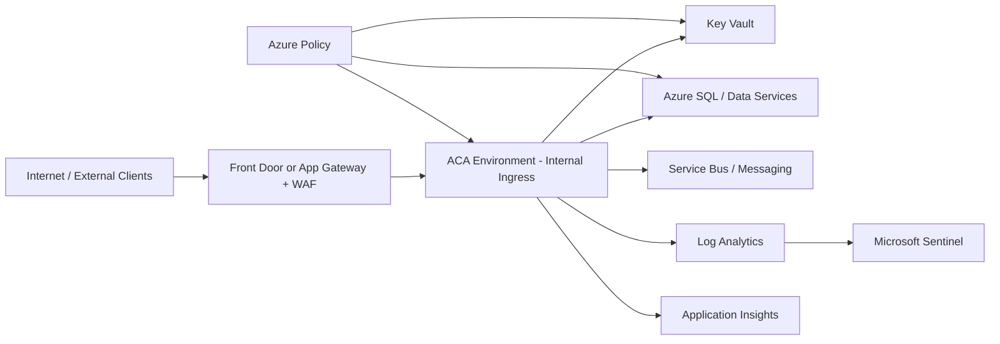
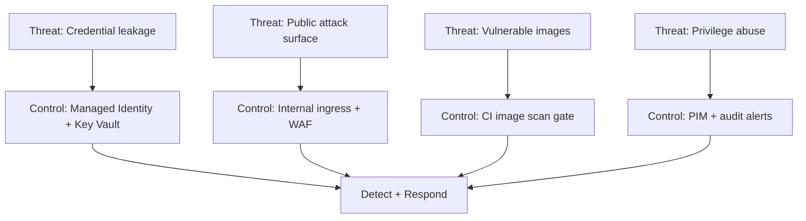

# Azure Container Apps Landing Zone Accelerator - Security

Security is a foundational design area for ACA landing zones and must be embedded across identity, network, runtime, data, and operations.

---
## Design Area Considerations

- Apply layered security controls from platform edge to application runtime.
- Use Microsoft Cloud Security Benchmark and Azure Landing Zone secure guidance as baseline control frameworks.
- Default to private/internal exposure for ACA workloads unless there is an explicit business requirement for external ingress.
- Centralize diagnostics, security events, and policy compliance telemetry for operational detection and audit.
- Treat software supply chain controls (build provenance, vulnerability scanning, image hygiene) as mandatory gates.

---
## Security Reference Architecture



---
## Design Area Recommendations

### Network and Boundary Security

- Prefer internal ACA environments with private ingress paths.
- For external workloads, place WAF-enabled edge services in front of ACA.
- Force outbound traffic through controlled egress paths (Azure Firewall/NVA) when required by policy.

### Identity and Secret Security

- Use managed identities for all workload-to-service access.
- Store secrets only in Key Vault and use references, not plaintext app settings.
- Enforce least privilege with narrow RBAC scopes.

### Runtime and Supply Chain Security

- Require signed, scanned container images before deployment.
- Block release on critical CVEs or failed policy checks.
- Keep base images current and remove unnecessary packages.

### Data Protection and Compliance

- Enforce encryption in transit (TLS) and at rest for all data paths.
- Use private endpoints for critical PaaS dependencies.
- Capture audit events for access, policy exceptions, and privileged operations.

### Detection and Response

- Centralize security telemetry in Log Analytics/Sentinel.
- Alert on risky sign-ins, policy drift, privileged role activation, and anomalous data access.
- Maintain incident playbooks and evidentiary trails for regulated environments.

---
## Control Mapping (Example)

| Security Domain | Control Pattern | Evidence Source |
|---|---|---|
| Identity | Managed identities + least privilege RBAC | Role assignments + sign-in logs |
| Secret Management | Key Vault references only | App config + Key Vault audit logs |
| Network | Internal ingress + private endpoints | NSG/route/policy state |
| Supply Chain | Image scan + policy gate | Pipeline artifacts + scan reports |
| Monitoring | Centralized security telemetry | Sentinel incidents + analytics queries |

---
## Implementation Samples

### Azure Policy: Deny Public Ingress ACA

```json
{
    "properties": {
        "displayName": "Container Apps must not allow public ingress",
        "policyType": "Custom",
        "mode": "Indexed",
        "policyRule": {
            "if": {
                "allOf": [
                    {
                        "field": "type",
                        "equals": "Microsoft.App/containerApps"
                    },
                    {
                        "field": "Microsoft.App/containerApps/configuration.ingress.external",
                        "equals": true
                    }
                ]
            },
            "then": {
                "effect": "deny"
            }
        }
    }
}
```

### Azure Policy: Require Key Vault Secret References

```json
{
    "properties": {
        "displayName": "Disallow inline secrets in ACA app settings",
        "policyType": "Custom",
        "mode": "Indexed",
        "policyRule": {
            "if": {
                "allOf": [
                    { "field": "type", "equals": "Microsoft.App/containerApps" },
                    { "field": "Microsoft.App/containerApps/template.containers[*].env[*].value", "exists": true }
                ]
            },
            "then": { "effect": "audit" }
        }
    }
}
```

### CI Security Gate (YAML)

```yaml
- stage: security
    jobs:
        - job: image_scan
            steps:
                - script: echo "Run container vulnerability scan"
                - script: echo "Fail on Critical/High findings"
        - job: policy_check
            steps:
                - script: echo "Validate IaC against policy baseline"
```

### KQL: Suspicious Privileged Activity

```kusto
AuditLogs
| where TimeGenerated > ago(24h)
| where OperationName has_any ("Add member to role", "Activate eligible assignment")
| project TimeGenerated, OperationName, InitiatedBy, TargetResources
| order by TimeGenerated desc
```

---
## Threat-to-Control Flow



---
## Validation Checklist

- [ ] ACA ingress model is justified and documented (internal by default).
- [ ] Managed identity is used for all supported resource access.
- [ ] Key Vault references are used instead of inline secrets.
- [ ] Security scan and policy gates block non-compliant deployments.
- [ ] Security telemetry is centralized and alerting is tested.

## References

- [Container Apps security profile](https://learn.microsoft.com/security/benchmark/azure/baselines/azure-container-apps-security-baseline)
- [Cloud Security Benchmark](https://learn.microsoft.com/security/benchmark/azure/overview)
- [Azure Landing Zone secure guidance](https://learn.microsoft.com/azure/cloud-adoption-framework/secure/)
- [Securing a custom VNET in Azure Container Apps](https://learn.microsoft.com/azure/container-apps/firewall-integration)
- [Secure outbound traffic for ACA](https://learn.microsoft.com/azure/container-apps/user-defined-routes)
  