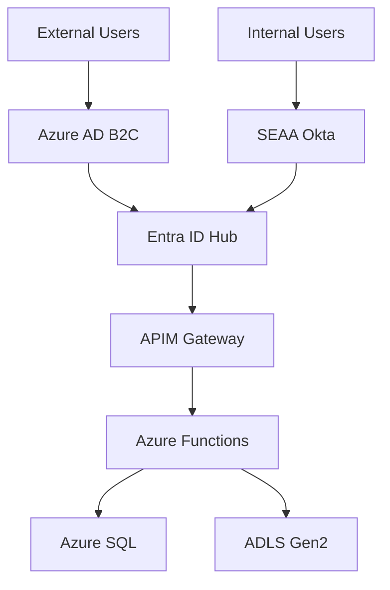

# K12 MyPortal Enterprise Architecture Documentation

Welcome to the enterprise architecture documentation for the North Carolina State Education Assistance Authority (SEAA) K-12 Scholarship Management System.

## Overview

The K12 MyPortal project is a comprehensive web-based system for administering the ESA+ Program and the Opportunity Scholarship in North Carolina. This modern system replaces the legacy Envision/MyPortal software and is designed to be fully operational for the 2026/2027 school year.

::alert{type="info"}
**Target Launch**: February 1, 2026
::

## Quick Stats

- **Users**: 100,000+ external users (families, schools, providers)
- **Applications**: 95,000+ annually
- **Architecture**: Azure cloud-native, microservices
- **Compliance**: FedRAMP High, NIST 800-53

## Documentation Sections

### 1. Project Overview
Learn about the project charter, governance, timeline, and key stakeholders.

[Explore Project Overview →](/project-overview)

### 2. System Architecture
Understand the high-level architecture, security model, and technology stack.

[Explore Architecture →](/architecture)

### 3. Development Guide
Get started with local development, testing, and deployment.

[Start Developing →](/development)

### 4. Operations
Production support, monitoring, and disaster recovery.

[Operations Guide →](/operations)

## Technology Stack

| Layer | Technology |
|-------|-----------|
| **Backend** | .NET 8, Azure Functions |
| **Frontend** | Angular 19, Nx Monorepo |
| **Database** | Azure SQL Server |
| **Identity** | Microsoft Entra ID B2C |
| **Infrastructure** | Terraform, Azure DevOps |

## Architecture Highlights

### Hub and Spoke Security Model

The system uses Microsoft Entra ID as the central identity hub with custom security attributes for fine-grained access control.



### Microservices Architecture

- **Admin Portal**: SEAA administrative functions
- **Household Portal**: Family enrollment and management
- **Providers Portal**: Service provider management
- **Schools Portal**: School administration

## Repository Structure

```
K12/
├── k12-api-enrollment/     # .NET 8 Azure Functions API
├── k12-web-enrollment/     # Angular 19 + Nx monorepo
├── k12-infra/              # Terraform infrastructure
└── k12-test-api-postman/   # API integration tests
```

## Getting Help

- **Technical Questions**: Contact CFI Architecture Team
- **Business Questions**: Contact SEAA Product Lead
- **Project Management**: Contact CFI/SEAA Project Managers

## External Resources

- [Confluence Space](https://cfi-nc.atlassian.net/wiki/spaces/KR)
- [Azure DevOps](https://dev.azure.com/CFI-AzureDevOps/K12)
- [Jira Board](https://cfi-nc.atlassian.net/jira/software/c/projects/K12)

---

*Last Updated: November 2025 • Maintained by K12 Technical Team*
