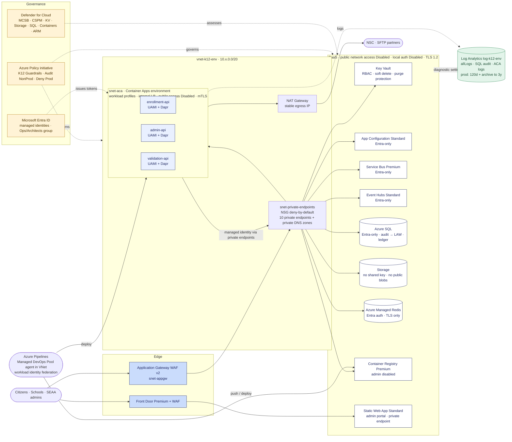
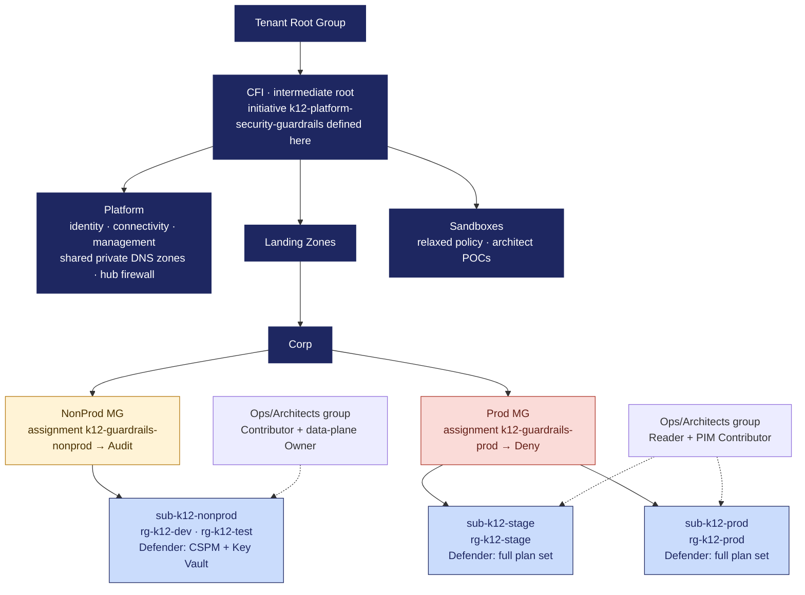
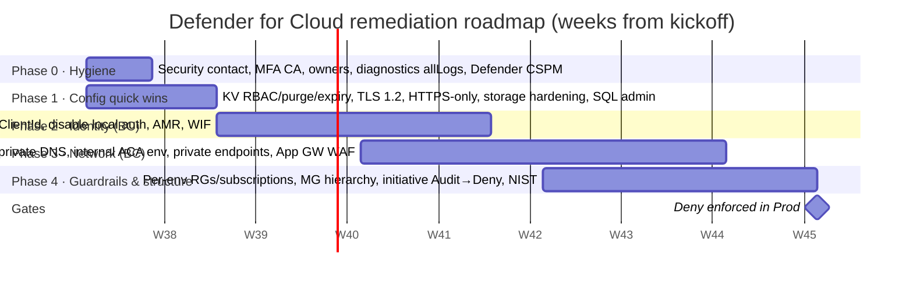

# K12 / NCSEAA Azure Platform — Defender for Cloud Remediation Plan

**Status:** DRAFT for architecture review (nothing in this package changes Azure)
**Author:** Architecture team (Ops/Architects)
**Audience:** DevOps leads, Architecture team, Security Office
**Date:** September 2026

> **Export received (commercial) 2026-09-07.** The Section 8 queries were executed read-only
> against subscription `K12 Azure`: secure score **12.9/27**, **245** unhealthy recommendations
> (65 High / 84 Medium / 96 Low). Step-1 of §0 is done for commercial; per-row Status/Count
> pruning of Section 5 is the next editing pass — the counts and the verified current state per
> resource type live in `../evidence/04-defender-findings-commercial.md` and
> `../evidence/05-plan-confirms-commercial.md`. Live facts that adjust Section 5 emphasis:
> Key Vault RBAC already on (5.2), Service Bus already Premium (5.6), no Event Hubs namespaces
> exist (5.7 dormant), no APIM exists (5.11 APIM row dormant), ACR admin already off (5.3),
> SignalR keys on ×4, App Config local auth on ×3, storage shared-key on ×10, 85 image-vuln
> recs, and the top High block is subscription identity hygiene (5.1). Root causes RC-1
> (shared subscription) and RC-5 (Containers/ARM plans off) are confirmed; RC-7 is larger than
> assumed. **Gov tenant export still pending.**

---

## 0. How to use this document

This plan was built **before** the Defender for Cloud export was available. It is therefore written as a **target-state baseline** for every resource type in the K12 platform (Container Apps, App Configuration, Redis, Dapr, Key Vault, Static Web Apps, Event Hubs, Service Bus, plus the Azure SQL, Storage, APIM, Functions, Event Grid and Logic Apps shown in the enrollment architecture diagram), not as a response to a specific findings list.

The catalog in Section 5 uses the **exact recommendation names Defender for Cloud emits**, so the Recommendations CSV export maps onto it row-for-row. The workflow is:

1. Export findings (Defender for Cloud → Recommendations → *Download CSV report*, or the Azure Resource Graph query in Section 8).
2. For each row in the export, find the matching recommendation in Section 5 and fill in the **Status / Count** column.
3. Delete catalog rows that do not appear in the export and are not part of the target-state decisions in Section 4.
4. Re-sequence Section 6 (phases) by the actual severity counts.

Everything in this plan treats the current deployment as **not canonical**: where the existing configuration conflicts with the Microsoft Cloud Security Benchmark, the benchmark wins and the deviation is called out as a decision for DevOps.

---

## 1. Which standard we should use (recommendation)

**Short answer: the Microsoft Cloud Security Benchmark (MCSB), enforced through Cloud Adoption Framework policy-driven governance, with the Well-Architected Framework Security pillar as the design lens.** These are not competing standards; they are three layers of the same Microsoft guidance.

| Layer | What it is | Why it matters here | Source |
|---|---|---|---|
| **MCSB** (assessment standard) | The default standard Defender for Cloud assigns to every subscription. Every recommendation and the Secure Score are computed from it. MCSB itself is built from CAF, WAF, CIS and NIST inputs. | The Defender findings *are* MCSB assessments. Remediating against MCSB is the only way to make the score and the compliance dashboard go green. Microsoft explicitly recommends MCSB over CIS for customers who want to maximize posture. | [Secure score](https://learn.microsoft.com/azure/defender-for-cloud/secure-score-security-controls) · [MCSB in Defender](https://learn.microsoft.com/azure/defender-for-cloud/concept-regulatory-compliance) · [MCSB overview](https://learn.microsoft.com/security/benchmark/azure/overview-mcsb-v1) · [Which benchmark?](https://learn.microsoft.com/azure/defender-for-cloud/faq-regulatory-compliance#how-do-i-know-which-benchmark-or-standard-to-use) |
| **Azure security baselines** (per service) | MCSB mapped onto each Azure service, feature by feature (e.g. *Azure security baseline for Event Hubs*, *…for Azure Container Apps*). | This is the authoritative "what does secure look like for Service Bus / Key Vault / Container Apps" — used for every row in Section 5. | [Baselines index](https://learn.microsoft.com/security/benchmark/azure/security-baselines-overview) |
| **CAF Azure landing zones** (governance standard) | Design principles: policy-driven governance, subscription democratization, environment separation. Ships a default policy baseline (ALZ policies). | This is the layer that was skipped. It is why findings accumulated: nothing prevented non-compliant resources from being created. Terry's note that "when we followed CAF we didn't have these issues" is exactly this — CAF's guardrails stop drift before Defender ever sees it. | [Design principles](https://learn.microsoft.com/azure/cloud-adoption-framework/ready/landing-zone/design-principles) · [Governance design area](https://learn.microsoft.com/azure/cloud-adoption-framework/ready/landing-zone/design-area/governance) · [Application environments](https://learn.microsoft.com/azure/cloud-adoption-framework/ready/landing-zone/design-area/management-application-environments) |
| **WAF Security pillar** (design standard) | Design principles + a 12-item design review checklist (SE:01–SE:12) + per-service architecture guides (e.g. *Architecture best practices for Azure Container Apps*). | Use for architecture reviews and ADRs. SE:01 literally says "establish a security baseline aligned to platform recommendations" — i.e. MCSB. | [Security checklist](https://learn.microsoft.com/azure/well-architected/security/checklist) · [Container Apps guide](https://learn.microsoft.com/azure/well-architected/service-guides/azure-container-apps) |
| **NIST SP 800-53 R5** (optional compliance overlay) | Available as an additional standard in the Defender regulatory compliance dashboard (requires a paid Defender plan). | NCSEAA is a state agency; if the Security Office or CFI audit policy maps to NIST, add it as a *reporting* overlay. Do **not** remediate against it directly — it maps to the same MCSB controls. | [Regulatory compliance standards](https://learn.microsoft.com/azure/defender-for-cloud/concept-regulatory-compliance-standards) |

**Practical decision for DevOps:** keep MCSB as the assigned standard (it already is), optionally enable **MCSB v2 (preview)** for the expanded Azure Policy mappings, and add NIST SP 800-53 R5 to the compliance dashboard for reporting once at least one Defender plan is enabled.

---

## 2. Why the findings exist (root cause, not blame)

| # | Structural cause | Effect in Defender | CAF / MCSB principle violated |
|---|---|---|---|
| RC-1 | **Dev, Test and Stage share one resource group ("development") in one subscription.** | The same recommendation fires three times per resource type; a stage config cannot be held to a stricter standard than dev; blast radius of a dev mistake includes stage. | CAF: *each application environment should ideally have its own subscription* and *separate groups and role assignments per environment* ([Application environments](https://learn.microsoft.com/azure/cloud-adoption-framework/ready/landing-zone/design-area/management-application-environments), [Identity & access](https://learn.microsoft.com/azure/cloud-adoption-framework/ready/landing-zone/design-area/identity-access-landing-zones#design-recommendations)). |
| RC-2 | **No Azure Policy guardrails at management-group scope.** Terraform and pipelines can create anything. | Every misconfiguration becomes a Defender finding *after* deployment instead of being denied *before* deployment. | CAF: *policy-driven governance* ([Design principles](https://learn.microsoft.com/azure/cloud-adoption-framework/ready/landing-zone/design-principles#policy-driven-governance)); WAF mission-critical guidance on policy-driven governance. |
| RC-3 | **Local authentication (SAS keys, access keys, connection strings) still in use** for Service Bus, Event Hubs, App Configuration, Redis, Storage. | "…should have local authentication methods disabled", "…should not use access keys", "…prevent shared key access" findings; secrets sprawl into App Config / pipeline variables. | MCSB IM-1 / IM-3 / PA-1: use Microsoft Entra ID and managed identities; treat `RootManageSharedAccessKey` as a root account. |
| RC-4 | **PaaS resources reachable from the public internet** (no private endpoints; public network access enabled). | The largest block of *Medium* findings ("…should use private link", "…should disable public network access", "Key Vault should have firewall enabled…"). | MCSB NS-2: secure cloud-native services with network controls; private endpoints for every service that supports them. |
| RC-5 | **Defender plans not enabled** (Key Vault, Storage, SQL, App Service/Serverless, Resource Manager, CSPM). | *High* "Microsoft Defender for X should be enabled" findings; no threat detection; no attack-path analysis; NIST overlay unavailable. | MCSB LT-1 / IR-2: enable threat detection for Azure services. |
| RC-6 | **Resource logs not routed to Log Analytics** on most services. | "Resource logs in X should be enabled" (*Low*), and the CFI audit-retention policy (3 years, 4 months online) cannot be met. | MCSB LT-3 / LT-6: enable logging for security investigation; retention. |
| RC-7 | **Subscription hygiene** — no security contact, MFA gaps on privileged accounts, owner count. | Cheap *High*/*Low* findings that cost nothing to fix. | MCSB IM-6, PA-4, IR-2. |

RC-1 and RC-2 are the ones that matter. Fixing individual findings without them means the same findings return with the next deployment.

---

## 3. Guiding decisions (proposed — need DevOps sign-off)

| ID | Decision | Rationale |
|---|---|---|
| D-1 | **Environment parity for security controls.** Dev/Test/Stage/Prod get the *same* network and identity architecture (internal Container Apps environment, private endpoints, Entra-only auth). Environments differ in **policy effect** (Audit vs Deny), **Defender plan cost tolerance**, **retention**, **zone redundancy** and **soft-delete retention** — not in whether the control exists. | WAF: test in production-like environments. Anything that only works with public endpoints in dev will break in prod. Cost delta is dominated by private endpoints (~1 per service per environment) and is small relative to a single incident. |
| D-2 | **Separate resource groups per environment now; separate subscriptions per environment as Phase 3.** Immediate: `rg-k12-dev`, `rg-k12-test`, `rg-k12-stage` (prod already separate). Target: `sub-k12-nonprod` (dev+test), `sub-k12-stage`, `sub-k12-prod` under `Landing Zones / Corp / NonProd` and `/ Prod` management groups. | CAF subscription and management-group design. Policy assignments live on the management groups, so the MG structure is a prerequisite for D-3. |
| D-3 | **One custom policy initiative ("K12 Platform Security Guardrails"), assigned twice:** `Audit` on NonProd MG, `Deny` on Stage/Prod MG. Deny is only turned on after the resources are compliant, so pipelines don't break. | CAF policy-driven governance; WAF policy-driven governance. Delivered in `terraform/platform-guardrails`. |
| D-4 | **Entra ID + managed identity everywhere; local auth disabled at the namespace/store level.** Dapr components use `azureClientId` (user-assigned identity) instead of connection strings. | MCSB IM-1/IM-3; service docs for Service Bus, Event Hubs, App Configuration, Redis, SQL, Storage. |
| D-5 | **Azure Cache for Redis → Azure Managed Redis (AMR)** for all new caches; migrate existing caches during Phase 2. | Azure Cache for Redis Basic/Standard/Premium retires **30 Sep 2028**; new-customer creation was blocked 1 Apr 2026 (existing customers can still create until retirement). AMR supports Entra auth, private endpoints, access-key disablement. ([What's new](https://learn.microsoft.com/azure/azure-cache-for-redis/cache-whats-new), [Advisor recommendation](https://learn.microsoft.com/azure/advisor/advisor-reference-operational-excellence-recommendations#azure-cache-for-redis)) |
| D-6 | **Container Apps: workload-profile environments, VNet-injected, internal, with a private endpoint for inbound and Application Gateway WAF / Front Door Premium in front for public apps.** Consumption-only environments do not support private endpoints or UDR. | [Secure your Container Apps deployment](https://learn.microsoft.com/azure/container-apps/secure-deployment#network-security), [Private endpoints](https://learn.microsoft.com/azure/container-apps/private-endpoints-with-dns), WAF service guide. |
| D-7 | **Log Analytics Workspace per environment as the single diagnostics sink**, `allLogs` category group on every resource. Prod: 120-day interactive retention + archive to satisfy CFI's 3-year / 4-months-online audit policy. Dev/Test: 30 days. | MCSB LT-3; CFI audit-log policy (project knowledge). Consistent with the Azure SQL Audit & Ledger design already agreed (LAW as audit sink). |
| D-8 | **Defender plans:** Defender CSPM, Key Vault, Storage (v2), Azure SQL, Resource Manager, App Service (if Functions/APIM front-ends remain), Containers (for ACR image scanning), APIs (if APIM is the public edge). Enabled on Prod and Stage first; Dev/Test after cost review. | MCSB LT-1; the *High* "Defender for X should be enabled" findings. |
| D-9 | **Accepted deviations are recorded as Defender for Cloud exemptions** with a justification and an expiry date, never by disabling the recommendation. | Keeps the compliance dashboard honest for the Security Office. |

---

## 4. Target state by environment

| Control | Dev | Test | Stage | Prod |
|---|---|---|---|---|
| Subscription / RG | `sub-k12-nonprod` / `rg-k12-dev` | `sub-k12-nonprod` / `rg-k12-test` | `sub-k12-stage` / `rg-k12-stage` | `sub-k12-prod` / `rg-k12-prod` |
| Management group | Landing Zones › Corp › NonProd | same | Landing Zones › Corp › Prod | same |
| Policy initiative effect | **Audit** | **Audit** | **Deny** | **Deny** |
| Public network access on PaaS | Disabled | Disabled | Disabled | Disabled |
| Private endpoints | Yes (all supported services) | Yes | Yes | Yes |
| Container Apps environment | Workload profiles, VNet-injected, **internal** | same | same | same + zone redundant |
| Public ingress path | App Gateway WAF (Detection) | App Gateway WAF (Detection) | App Gateway WAF (Prevention) | App Gateway WAF (Prevention) + DDoS Network Protection on the VNet |
| Authentication to PaaS | Entra ID + managed identity; local auth **off** | same | same | same |
| Key Vault | RBAC model, soft delete 7d, purge protection on, firewall deny | same | soft delete 90d | soft delete 90d |
| Secrets/keys expiry | Required (Policy Audit) | Required | Required (Deny) | Required (Deny) |
| Diagnostics → LAW | `allLogs`, 30d | 30d | 90d | 120d interactive + archive (3y) |
| Defender plans | CSPM (free tier ok) + Key Vault | CSPM + Key Vault | Full set (D-8) | Full set (D-8) |
| TLS minimum | 1.2 | 1.2 | 1.2 | 1.2 |
| Zone redundancy | No | No | No | Yes (ACA, Service Bus Premium, Event Hubs, SQL) |
| Human access (from RBAC proposal) | Ops/Architects: Contributor + data-plane Owner | Contributor + data-plane Owner | Reader + PIM Contributor | Reader + PIM Contributor (approval) |
| Pipeline identity | Workload identity federation (no secrets) — Contributor on RG only | same | same | same, plus approvals |

---

## 5. Remediation catalog (by resource type)

Column key — **Sev**: Defender severity. **MCSB**: primary control. **Fix**: file in `terraform/workload-baseline` or `platform-guardrails`. **Guardrail**: built-in Azure Policy definition ID included in the initiative. **Status / Count**: fill from the export.

### 5.1 Subscription, identity and Defender plans

| Defender recommendation | Sev | MCSB | Target state | Fix | Guardrail (policy ID) | Status / Count |
|---|---|---|---|---|---|---|
| Microsoft Defender for Key Vault should be enabled | High | LT-1 | Enabled on all subs | `defender_plans.tf` | `0e6763cc-5078-4e64-889d-ff4d9a839047` (AINE) | |
| Microsoft Defender for Storage should be enabled | High | LT-1 | Enabled (DefenderForStorageV2, malware scanning on prod) | `defender_plans.tf` | `640d2586-54d2-465f-877f-9ffc1d2109f4` | |
| Microsoft Defender for Azure SQL Database servers should be enabled / Defender for SQL should be enabled for unprotected Azure SQL servers | High | LT-1 | Enabled; VA express configuration | `defender_plans.tf` | `abfb4388-5bf4-4ad7-ba82-2cd2f41ceae9` | |
| Microsoft Defender for Containers should be enabled | High | LT-1 | Enabled (ACR image scanning; Container Apps posture via CSPM) | `defender_plans.tf` | `1c988dd6-ade4-430f-a608-2a3e5b0a6d38` | |
| Microsoft Defender for Resource Manager should be enabled | High | LT-1 | Enabled | `defender_plans.tf` | — | |
| Microsoft Defender for App Service should be enabled | High | LT-1 | Enabled where Functions / App Service remain | `defender_plans.tf` | — | |
| Subscriptions should have a contact email address for security issues | Low | IR-2 | Security Office distribution list + on-call | `defender_plans.tf` | `4f4f78b8-e367-4b10-a341-d9a4ad5cf1c7` | |
| Email notification for high severity alerts should be enabled | Low | IR-2 | Enabled | `defender_plans.tf` | `6e2593d9-add6-4083-9c9b-4b7d2188c899` | |
| Email notification to subscription owner for high severity alerts should be enabled | Low | IR-2 | Enabled | `defender_plans.tf` | `0b15565f-aa9e-48ba-8619-45960f2c314d` | |
| Accounts with owner / write / read permissions on Azure resources should be MFA enabled | High | IM-6 | Conditional Access policy requiring MFA for all Azure management; break-glass accounts excluded and monitored | Entra admin (DevOps) | — | |
| A maximum of 3 owners should be designated for your subscription / There should be more than one owner | High | PA-1 | 2 owners: break-glass + DevOps group via PIM | Entra admin | `4f11b553-…` / `09024ccc-…` | |
| Guest / blocked / deprecated accounts with permissions on Azure resources should be removed | High | IM-2 | Access review (Entra ID Governance) quarterly | Entra admin | `339353f6-…` | |
| Permissions of inactive identities in your Azure subscription should be revoked | Medium | PA-7 | Quarterly access review; CIEM in Defender CSPM | Entra admin | — | |

### 5.2 Azure Key Vault

Source: [Key Vault recommendations](https://learn.microsoft.com/azure/defender-for-cloud/recommendations-reference-keyvault) · [MCSB v2 DP-8](https://learn.microsoft.com/security/benchmark/azure/mcsb-v2-data-protection#dp-8-ensure-security-of-key-and-certificate-repository)

| Defender recommendation | Sev | MCSB | Target state | Fix | Guardrail (policy ID) | Status / Count |
|---|---|---|---|---|---|---|
| Role-Based Access Control should be used on Key Vault services | High | PA-7 | `rbac_authorization_enabled = true`; data-plane roles from the RBAC proposal | `key_vault.tf` | `12d4fa5e-1f9f-4c21-97a9-b99b3c6611b5` | |
| Key vaults should have soft delete enabled | High | DP-8 | On (cannot be disabled once on); 7d dev, 90d prod | `key_vault.tf` | `1e66c121-a66a-4b1f-9b83-0fd99bf0fc2d` | |
| Key vaults should have purge protection enabled | Medium | DP-8 | On everywhere; vault names carry a unique suffix so name reuse is not needed | `key_vault.tf` | `0b60c0b2-2dc2-4e1c-b5c9-abbed971de53` | |
| Key Vault secrets should have an expiration date / Key Vault keys should have an expiration date | High | DP-6 | Expiry set on every secret (≤ 1 year); Event Grid `SecretNearExpiry` → rotation | `key_vault.tf` (secret example) | `98728c90-…` / `152b15f7-…` | |
| Azure Key Vault should have firewall enabled or public network access disabled | Medium | NS-2 | `public_network_access_enabled = false`, `network_acls.default_action = Deny`, bypass AzureServices | `key_vault.tf` | `55615ac9-af46-4a59-874e-391cc3dfb490` | |
| Azure Key Vaults should use private link / Private endpoint should be configured for Key Vault | Medium | NS-2 | Private endpoint (`vault`) + `privatelink.vaultcore.azure.net` | `private_endpoints.tf` | `a6abeaec-4d90-4a02-805f-6b26c4d3fbe9` (AINE) | |
| Resource logs in Key Vault should be enabled | Low | LT-3 | Diagnostic setting → LAW, `allLogs` (AuditEvent) | `diagnostics.tf` | `cf820ca0-f99e-4f3e-84fb-66e913812d21` (AINE) | |
| Certificates should have the specified maximum validity period | Medium | DP-7 | ≤ 12 months | manual / cert policy | — | |

### 5.3 Azure Container Apps (environment, apps, Dapr, registry)

Source: [Secure your deployment](https://learn.microsoft.com/azure/container-apps/secure-deployment) · [Policy reference](https://learn.microsoft.com/azure/container-apps/policy-reference) · [WAF service guide](https://learn.microsoft.com/azure/well-architected/service-guides/azure-container-apps) · [Security baseline](https://learn.microsoft.com/security/benchmark/azure/baselines/azure-container-apps-security-baseline)

Note: Container Apps posture comes from **Defender CSPM serverless-container posture** rather than a dedicated plan; most of the items below surface as Azure Policy compliance in Defender's "Policy" recommendations.

| Recommendation / policy | Sev | MCSB | Target state | Fix | Guardrail (policy ID) | Status / Count |
|---|---|---|---|---|---|---|
| Container App environments should use network injection | Medium | NS-1 | Workload-profile env in dedicated `/27`+ subnet (delegated `Microsoft.App/environments`) | `container_apps.tf`, `network.tf` | `8b346db6-85af-419b-8557-92cee2c0f9bb` | |
| Container Apps environment should disable public network access | Medium | NS-2 | `internal_load_balancer_enabled = true`, `public_network_access = "Disabled"`, private endpoint `managedEnvironments` + `privatelink.<region>.azurecontainerapps.io` | `container_apps.tf`, `private_endpoints.tf` | `d074ddf8-01a5-4b5e-a2b8-964aed452c0a` | |
| Container Apps should disable external network access | Medium | NS-2 | `external_enabled = false` for every app; public apps exposed only via App Gateway WAF → private endpoint | `container_apps.tf` | `783ea2a8-b8fd-46be-896a-9ae79643a0b1` | |
| Container Apps should only be accessible over HTTPS | Medium | DP-3 | `allow_insecure_connections = false` | `container_apps.tf` | `0e80e269-43a4-4ae9-b5bc-178126b8a5cb` | |
| Managed Identity should be enabled for Container Apps | Medium | IM-3 | User-assigned identity per app (or per bounded context); used for ACR pull, Key Vault secret refs, Dapr components | `container_apps.tf`, `identity.tf` | `b874ab2d-72dd-47f1-8cb5-4a306478a4e7` | |
| Authentication should be enabled on Container Apps | Medium | IM-1 | Built-in auth (Entra) for browser-facing apps; APIs validate JWT (APIM or app-level) | app config / `container_apps.tf` | `2b585559-a78e-4cc4-b1aa-fb169d2f6b96` (AINE) | |
| Secrets stored in app secrets / env vars | — | DP-6 | `secret { key_vault_secret_id, identity }` references, no inline values | `container_apps.tf` | — | |
| Dapr components using connection strings / SAS | — | IM-3 | Component metadata uses `azureClientId` of the app's identity; no `secretKeyRef` to SAS | `container_apps.tf` (dapr component example) | — | |
| Registry pull uses admin user / password | — | IM-3 | ACR admin disabled; pull via managed identity (`AcrPull`) | `container_registry.tf` | `dc921057-6b28-4fbe-9b83-f7bec05db6c2` | |
| Container registries should not allow unrestricted network access / should use private link | Medium | NS-2 | Premium SKU, `public_network_access_enabled = false`, private endpoint `registry` | `container_registry.tf` | `d0793b48-…` / `e8eef0a8-…` | |
| Container registry images should have vulnerability findings resolved | High | PV-6 | Defender for Containers registry scanning + Trivy in MSDO (already in the AzD4D runbook); block on Critical | `defender_plans.tf` + pipeline | — | |
| Diagnostic settings for Container Apps environments | Low | LT-3 | `logs_destination = "log-analytics"` + diagnostic setting `allLogs` | `diagnostics.tf` | `6a664864-e2b5-413e-b930-f11caa132f16` (DINE) | |
| Egress control | — | NS-2 | UDR → Azure Firewall (prod/stage); NAT Gateway for stable egress IP (all) | `network.tf` (stub) | — | |

### 5.4 Azure App Configuration

Source: [Policy reference](https://learn.microsoft.com/azure/azure-app-configuration/policy-reference)

| Recommendation / policy | Sev | MCSB | Target state | Fix | Guardrail (policy ID) | Status / Count |
|---|---|---|---|---|---|---|
| App Configuration should use private link | Medium | NS-2 | Standard SKU (private link requires ≥ Standard), private endpoint `configurationStores` + `privatelink.azconfig.io` | `app_configuration.tf`, `private_endpoints.tf` | `ca610c1d-041c-4332-9d88-7ed3094967c7` (AINE) | |
| App Configuration should disable public network access | Medium | NS-2 | `public_network_access = "Disabled"` | `app_configuration.tf` | `3d9f5e4c-9947-4579-9539-2a7695fbc187` | |
| App Configuration stores should have local authentication methods disabled | Medium | IM-1 | `local_auth_enabled = false`; apps use `App Configuration Data Reader` via managed identity; Key Vault references resolved by the app identity | `app_configuration.tf` | `b08ab3ca-1062-4db3-8803-eec9cae605d6` | |
| App Configuration should use a SKU that supports private link | Medium | NS-2 | Standard | `app_configuration.tf` | `89c8a434-18f0-402c-8147-630a8dea54e0` | |
| Purge protection / soft delete | — | DP-8 | `purge_protection_enabled = true`, `soft_delete_retention_days = 7` | `app_configuration.tf` | — | |
| Secrets stored as plain key-values | — | DP-6 | Only Key Vault references (`{"uri":…}` content type) for secrets | governance / review | — | |

### 5.5 Redis (Azure Cache for Redis → Azure Managed Redis)

Source: [Policy reference](https://learn.microsoft.com/azure/azure-cache-for-redis/policy-reference) · [Retirement / what's new](https://learn.microsoft.com/azure/azure-cache-for-redis/cache-whats-new) · [Migration overview](https://learn.microsoft.com/azure/redis/migrate/migrate-basic-standard-premium-overview)

| Recommendation / policy | Sev | MCSB | Target state | Fix | Guardrail (policy ID) | Status / Count |
|---|---|---|---|---|---|---|
| Only secure connections to your Azure Cache for Redis should be enabled (Redis Cache should allow access only via SSL) | High | DP-3 | Non-SSL port off (existing); AMR `client_protocol = "Encrypted"` | `redis.tf` | `22bee202-a82f-4305-9a2a-6d7f44d4dedb` | |
| Azure Cache for Redis should disable public network access | Medium | NS-2 | `public_network_access = "Disabled"` (AMR) | `redis.tf` | `470baccb-7e51-4549-8b1a-3e5be069f663` | |
| Azure Cache for Redis should use private link | Medium | NS-2 | Private endpoint `redisEnterprise` + `privatelink.redis.azure.net` | `private_endpoints.tf` | `7803067c-7d34-46e3-8c79-0ca68fc4036d` (AINE) | |
| Azure Cache for Redis should not use access keys for authentication | Medium | IM-1 | AMR `access_keys_authentication_enabled = false`; Entra auth with data-access policy per app identity | `redis.tf` | `3827af20-8f80-4b15-8300-6db0873ec901` | |
| Azure Cache for Redis should reside within a virtual network | Medium | NS-2 | Superseded: Microsoft recommends private endpoints over VNet injection; exempt with justification if it fires on Premium caches | exemption | — | |
| Migrate to Azure Managed Redis (Advisor, High) | High | — | New caches = AMR (`azurerm_managed_redis`); migrate existing by Phase 2; hostname and port change (`<region>.redis.azure.net`, 10000) | `redis.tf` | — | |
| Dapr state store using Redis access key | — | IM-3 | Dapr `state.redis` with `useEntraID: true` and `azureClientId` | `container_apps.tf` (dapr example) | — | |

### 5.6 Azure Service Bus

Source: [Policy reference](https://learn.microsoft.com/azure/service-bus-messaging/policy-reference) · [Disable local auth](https://learn.microsoft.com/azure/service-bus-messaging/disable-local-authentication) · [Security baseline](https://learn.microsoft.com/security/benchmark/azure/baselines/service-bus-security-baseline)

| Recommendation / policy | Sev | MCSB | Target state | Fix | Guardrail (policy ID) | Status / Count |
|---|---|---|---|---|---|---|
| Azure Service Bus namespaces should have local authentication methods disabled | Medium | IM-1 | `local_auth_enabled = false`; apps use `Azure Service Bus Data Sender/Receiver` scoped to the entity | `service_bus.tf` | `cfb11c26-f069-4c14-8e36-56c394dae5af` | |
| Azure Service Bus namespaces should use private link | Medium | NS-2 | **Premium** SKU (private link requires Premium), private endpoint `namespace` + `privatelink.servicebus.windows.net` | `service_bus.tf`, `private_endpoints.tf` | `1c06e275-d63d-4540-b761-71f364c2111d` (AINE) | |
| Service Bus Namespaces should disable public network access | Medium | NS-2 | `public_network_access_enabled = false`; `network_rule_set.default_action = Deny`, trusted services allowed (Event Grid, etc.) | `service_bus.tf` | `cbd11fd3-3002-4907-b6c8-579f0e700e13` | |
| All authorization rules except RootManageSharedAccessKey should be removed from Service Bus namespace | Low | PA-1 | No custom namespace-level SAS rules; RBAC only | `service_bus.tf` | `a1817ec0-a368-432a-8057-8371e17ac6ee` | |
| Resource logs in Service Bus should be enabled | Low | LT-3 | Diagnostic setting `allLogs` → LAW | `diagnostics.tf` | `f8d36e2f-389b-4ee4-898d-21aeb69a0f45` (AINE) | |
| Minimum TLS | — | DP-3 | `minimum_tls_version = "1.2"` | `service_bus.tf` | — | |
| Dapr pub/sub using connection string | — | IM-3 | `pubsub.azure.servicebus.topics` with `namespaceName` + `azureClientId` | `container_apps.tf` (dapr example) | — | |

### 5.7 Azure Event Hubs

Source: [Policy reference](https://learn.microsoft.com/azure/event-hubs/policy-reference) · [Private endpoints](https://learn.microsoft.com/azure/event-hubs/private-link-service) · [Security baseline](https://learn.microsoft.com/security/benchmark/azure/baselines/event-hubs-security-baseline)

| Recommendation / policy | Sev | MCSB | Target state | Fix | Guardrail (policy ID) | Status / Count |
|---|---|---|---|---|---|---|
| Azure Event Hub namespaces should have local authentication methods disabled | Medium | IM-1 | `local_authentication_enabled = false`; `Azure Event Hubs Data Sender/Receiver` per consumer identity | `event_hub.tf` | `5d4e3c65-4873-47be-94f3-6f8b953a3598` | |
| Event Hub namespaces should use private link | Medium | NS-2 | Standard+ SKU (Basic has no private link), private endpoint `namespace` + `privatelink.servicebus.windows.net` | `event_hub.tf`, `private_endpoints.tf` | `b8564268-eb4a-4337-89be-a19db070c59d` (AINE) | |
| Event Hub Namespaces should disable public network access | Medium | NS-2 | `public_network_access_enabled = false`; `network_rulesets.default_action = Deny`, trusted services on | `event_hub.tf` | `0602787f-9896-402a-a6e1-39ee63ee435e` | |
| All authorization rules except RootManageSharedAccessKey should be removed from Event Hub namespace | Low | PA-1 | No namespace-level SAS rules | `event_hub.tf` | `b278e460-7cfc-4451-8294-cccc40a940d7` | |
| Authorization rules on the Event Hub instance should be defined | Low | PA-7 | Not applicable once local auth is off (RBAC only) — exempt with justification | exemption | `f4826e5f-6a27-407c-ae3e-9582eb39891d` | |
| Resource logs in Event Hub should be enabled | Low | LT-3 | Diagnostic setting `allLogs` → LAW | `diagnostics.tf` | `83a214f7-d01a-484b-91a9-ed54470c9a6a` (AINE) | |
| Capture / checkpoint storage using keys | — | IM-3 | Capture to Storage via managed identity; checkpoint store via identity | `event_hub.tf` | — | |

### 5.8 Azure Static Web Apps

No dedicated Defender recommendations today; controls come from the [security baseline](https://learn.microsoft.com/security/benchmark/azure/baselines/azure-static-web-apps-security-baseline) and WAF.

| Control | MCSB | Target state | Fix | Status / Count |
|---|---|---|---|---|
| Plan | — | **Standard** (required for private endpoints, custom auth, managed identity) | `static_web_app.tf` | |
| Public network access | NS-2 | Internal-only portals: `public_network_access_enabled = false` + private endpoint `staticSites` + `privatelink.azurestaticapps.net`; citizen-facing portals stay public behind Front Door Premium + WAF | `static_web_app.tf`, `private_endpoints.tf` | |
| Authentication | IM-1 | Entra ID (custom auth) for admin portals; route rules deny anonymous on `/admin/*` | `staticwebapp.config.json` | |
| Backend linking | NS-2 | Linked backend = Container App via APIM/App Gateway, not public FQDN | app config | |
| Secrets in app settings | DP-6 | Managed identity + Key Vault references | `static_web_app.tf` | |
| Preview environments | PV-2 | Disabled in prod (`preview_environments_enabled = false`) | `static_web_app.tf` | |

### 5.9 Azure SQL (enrollment / config / validation data stores)

Source: [Data recommendations](https://learn.microsoft.com/azure/defender-for-cloud/recommendations-reference-data)

| Defender recommendation | Sev | MCSB | Target state | Fix | Guardrail (policy ID) | Status / Count |
|---|---|---|---|---|---|---|
| SQL servers should have a Microsoft Entra administrator provisioned | High | IM-1 | Entra admin = `Ops/Architects` group (nonprod) / DBA group (prod) | `sql.tf` | `1f314764-cb73-4fc9-b863-8eca98ac36e9` (AINE) | |
| Azure SQL Database should have Microsoft Entra-only authentication enabled | Medium | IM-1 | `azuread_authentication_only = true`; app identities as contained users | `sql.tf` | `b3a22bc9-66de-45fb-98fa-00f5df42f41a` | |
| Public network access on Azure SQL Database should be disabled | Medium | NS-2 | `public_network_access_enabled = false` | `sql.tf` | `1b8ca024-1d5c-4dec-8995-b1a932b41780` | |
| Private endpoint connections on Azure SQL Database should be enabled | Medium | NS-2 | Private endpoint `sqlServer` + `privatelink.database.windows.net` | `private_endpoints.tf` | `7698e800-9299-47a6-b3b6-5a0fee576eed` | |
| Azure SQL Database should be running TLS version 1.2 or newer | Medium | DP-3 | `minimum_tls_version = "1.2"` | `sql.tf` | `32e6bbec-16b6-44c2-be37-c5b672d103cf` | |
| Auditing on SQL server should be enabled / Audit retention ≥ 90 days | Low | LT-3 | Extended auditing → LAW (`SQLSecurityAuditEvents`), consistent with the Audit & Ledger design | `sql.tf` | `a6fb4358-5bf4-4ad7-ba82-2cd2f41ce5e9` (AINE) | |
| SQL servers should have vulnerability assessment configured / SQL databases should have vulnerability findings resolved | High | PV-6 | Defender for SQL with express VA; findings triaged per AzD4D SLAs | `defender_plans.tf` | `feedbf84-6b99-488c-acc2-71c829aa5ffc` (AINE) | |
| Transparent Data Encryption on SQL databases should be enabled | Low | DP-4 | On (default) — verify on restored/copied DBs | `sql.tf` | — | |

### 5.10 Storage accounts (document blob store, Event Hubs capture, SFTP landing, Function storage)

| Defender recommendation | Sev | MCSB | Target state | Fix | Guardrail (policy ID) | Status / Count |
|---|---|---|---|---|---|---|
| Secure transfer to storage accounts should be enabled | High | DP-3 | `https_traffic_only_enabled = true`, `min_tls_version = TLS1_2` | `storage.tf` | `404c3081-a854-4457-ae30-26a93ef643f9` | |
| Storage account public access should be disallowed | Medium | NS-2 | `allow_nested_items_to_be_public = false` | `storage.tf` | `4fa4b6c0-31ca-4c0d-b10d-24b96f62a751` | |
| Storage accounts should prevent shared key access | Medium | IM-1 | `shared_access_key_enabled = false`, `default_to_oauth_authentication = true`; Functions on identity-based AzureWebJobsStorage | `storage.tf` | `8c6a50c6-9ffd-4ae7-986f-5fa6111f9a54` | |
| Storage accounts should restrict network access using virtual network rules / should disable public network access | Medium | NS-2 | `public_network_access_enabled = false`, `network_rules.default_action = Deny`, bypass AzureServices | `storage.tf` | `2a1a9cdf-…` / `b2982f36-…` | |
| Storage account should use a private link connection | Medium | NS-2 | Private endpoint `blob` (+ `file`/`queue`/`table` where used) + matching `privatelink.*.core.windows.net` zones | `private_endpoints.tf` | `6edd7eda-6dd8-40f7-810d-67160c639cd9` (AINE) | |
| Storage accounts should have the specified minimum TLS version | Medium | DP-3 | TLS 1.2 | `storage.tf` | `fe83a0eb-a853-422d-aac2-1bffd182c5d0` | |
| Storage accounts should prevent cross tenant object replication | Medium | DP-8 | `cross_tenant_replication_enabled = false` | `storage.tf` | `92a89a79-6c52-4a7e-a03f-61306fc49312` | |
| Microsoft Defender for Storage should be enabled | High | LT-1 | v2 with malware scanning on prod document store (SFTP landing zone especially) | `defender_plans.tf` | `640d2586-…` | |
| Soft delete / versioning (data protection) | — | BR-1 | Blob soft delete 30d, container soft delete 30d, versioning on document store | `storage.tf` | — | |

### 5.11 Other services in the enrollment diagram (if present in the export)

| Service | Key Defender recommendations (Sev) | Target state | Guardrail (policy ID) |
|---|---|---|---|
| **API Management** | APIs should use only encrypted protocols (High); calls to API backends should be authenticated (Medium); subscriptions should not be scoped to all APIs (Medium); secret named values should be stored in Key Vault (Medium); services should use a virtual network (Medium); direct management endpoint should not be enabled (Low); platform version should be stv2 | Developer/Premium or **Standard v2** with VNet integration + private endpoint; managed identity to backends; named values from Key Vault | `ee7495e7-…`, `c15dcc82-…`, `3aa03346-…`, `f1cc7827-…`, `ef619a2c-…`, `b741306c-…`, `1dc2fc00-…` |
| **Azure Functions (API listeners)** | Function apps should only be accessible over HTTPS; should use managed identity; latest TLS; remote debugging off; FTPS required (High); client certificates; authentication enabled; vulnerability findings resolved (High) | If Functions stay: Premium/Flex plan with VNet integration, private endpoints, identity-based storage; otherwise consolidate onto Container Apps (already the direction) | Defender App Service plan + built-ins in the "App Service" policy category |
| **Event Grid** | Azure Event Grid topics / domains should use private link (Medium); local auth disabled | Private endpoint + Entra auth for publishers; managed identity for delivery to Service Bus/Event Hubs | `4b90e17e-8448-49db-875e-bd83fb6f804f`, `9830b652-8523-49cc-b1b3-e17dce1127ca` |
| **Logic Apps (Standard)** | Resource logs should be enabled (Low); should use managed identity | Standard plan, VNet integrated, managed identity connectors | — |
| **Log Analytics** | Workspace public ingestion/query | Private Link Scope (AMPLS) for prod | — |

---

## 6. Phased roadmap

Effort is architecture-team estimate; **BC** = breaking change for applications or pipelines.

| Phase | Scope | Owner | Effort | BC? | Exit criteria |
|---|---|---|---|---|---|
| **0 — Hygiene (week 1)** | Security contact + email alerts; MFA Conditional Access for Azure management; owner count; remove guest/blocked accounts; enable Defender CSPM (free tier) so attack paths and exemptions work; diagnostics `allLogs` → LAW on every resource | DevOps (Entra + subscription), Architects (diagnostics TF) | 2–3 days | No | All *High* subscription findings closed; every resource has a diagnostic setting |
| **1 — Configuration quick wins (weeks 1–2)** | Key Vault RBAC/soft-delete/purge/firewall; secret expiry dates; TLS 1.2 everywhere; HTTPS-only + managed identity on Container Apps; non-SSL Redis port off; Storage secure transfer/no public blobs/cross-tenant off; App Config purge protection; SQL Entra admin | Architects (TF), app teams (secret expiry) | 3–5 days | Low (secret expiry needs rotation process) | All *High* config findings closed; Secure Score visibly up |
| **2 — Identity (weeks 2–5)** | Migrate every app and Dapr component to managed identity; then disable local auth on Service Bus, Event Hubs, App Configuration, Storage (shared key), SQL (Entra-only); new caches on Azure Managed Redis with Entra auth; ACR admin off; pipeline service connections → workload identity federation | App teams + Architects; DevOps for pipelines | 2–3 weeks | **Yes** — coordinate per bounded context; do dev → test → stage → prod | No SAS/keys in App Config, Key Vault or pipeline variables; `disableLocalAuth = true` on all namespaces/stores |
| **3 — Network (weeks 4–8)** | Per-environment VNet + private DNS zones; workload-profile Container Apps environments (internal + private endpoint); private endpoints for Key Vault, App Config, Service Bus (→ Premium), Event Hubs, SQL, Storage, AMR, ACR, Static Web Apps (internal portals); App Gateway WAF in front; disable public network access; pipeline agents that can reach private endpoints (Managed DevOps Pools or self-hosted in VNet) | Architects (design + TF), DevOps (VNet/DNS/agents), Network team (peering, firewall) | 3–4 weeks | **Yes** — new Container Apps environments are required (environment type and VNet cannot be changed in place); DNS resolution for pipeline agents and developer workstations (VPN / Private Resolver) | All *Medium* network findings closed; no PaaS resource answers on a public endpoint |
| **4 — Guardrails & structure (weeks 6–10)** | Split `development` RG into per-environment RGs; management-group hierarchy; move subscriptions; assign the K12 guardrail initiative (`Audit` NonProd, `Deny` Stage/Prod); DINE policies for diagnostics and private DNS; Defender full plan set on Stage/Prod; NIST 800-53 overlay in compliance dashboard; recurring access reviews | DevOps (MG/subscriptions/policy), Architects (initiative content), Security Office (NIST mapping) | 2–3 weeks | Low (Deny only after compliance) | Initiative shows 100% compliant in Prod; new non-compliant resources are denied; Secure Score ≥ 85% |

**Sequencing rule:** identity before network. Disabling public access while apps still use connection strings produces two simultaneous failure modes that are hard to debug. Do Phase 2 fully in an environment, then Phase 3 in that environment.

---

## 7. Breaking-change checklist for application teams

| Change | What breaks | What apps/pipelines must do |
|---|---|---|
| Local auth disabled (Service Bus, Event Hubs, App Config, Redis, Storage, SQL Entra-only) | Every connection string / SAS token / access key | Use `DefaultAzureCredential` / managed identity; request the data-plane role (Sender/Receiver/Data Reader/…) on the specific entity; Dapr components switch to `azureClientId` |
| Public network access disabled + private endpoints | Anything outside the VNet: hosted pipeline agents, developer laptops, Metabase/Cube.js if not in the VNet, Power Automate connectors | Pipeline agents in the VNet (Managed DevOps Pools); VPN / Private DNS Resolver for developers; move Metabase/Cube.js/Trino into the VNet or behind private endpoints; Power Automate via on-premises data gateway or VNet-integrated Logic Apps Standard |
| New internal Container Apps environment | Environment FQDNs and static IPs change; `*.azurecontainerapps.io` default domain is now private | Front public apps with App Gateway WAF / Front Door Premium; update DNS; re-point APIM backends |
| Service Bus Basic/Standard → Premium | Cost; some features (e.g. partitioning behaviour) differ | Validate message sizes/partition settings; Premium supports up to 100 MB messages |
| Redis → Azure Managed Redis | Hostname suffix and port (10000) change; access keys off | Update connection config; use Entra token auth (StackExchange.Redis `Microsoft.Azure.StackExchangeRedis` extension) |
| Key Vault secret expiry enforced | Secrets without `exp` fail policy (Deny in prod) | Set expiry on creation; subscribe to `SecretNearExpiry` for rotation |
| ACR admin user off | Pipelines using admin credentials | Push with workload identity federation service connection; pull with app managed identity (`AcrPull`) |

---

## 8. Verification queries (Azure Resource Graph — works with Reader)

Open findings by resource type and severity:

```kusto
securityresources
| where type == "microsoft.security/assessments"
| where properties.status.code == "Unhealthy"
| extend resourceId = tolower(tostring(properties.resourceDetails.Id)),
         severity   = tostring(properties.metadata.severity),
         rec        = tostring(properties.displayName)
| extend resourceType = extract(@"providers/([^/]+/[^/]+)", 1, resourceId)
| summarize count() by severity, resourceType, rec
| order by severity asc, count_ desc
```

Local-auth still enabled on messaging and configuration stores:

```kusto
resources
| where type in~ ("microsoft.servicebus/namespaces","microsoft.eventhub/namespaces",
                  "microsoft.appconfiguration/configurationstores")
| extend localAuthDisabled = tobool(properties.disableLocalAuth)
| where isnull(localAuthDisabled) or localAuthDisabled == false
| project name, type, resourceGroup, subscriptionId
```

PaaS resources still answering on a public endpoint:

```kusto
resources
| where type in~ ("microsoft.keyvault/vaults","microsoft.servicebus/namespaces","microsoft.eventhub/namespaces",
                  "microsoft.appconfiguration/configurationstores","microsoft.storage/storageaccounts",
                  "microsoft.sql/servers","microsoft.app/managedenvironments","microsoft.cache/redisenterprise")
| extend pna = tostring(coalesce(properties.publicNetworkAccess, properties.properties.publicNetworkAccess))
| where pna !~ "Disabled"
| project name, type, resourceGroup, pna
```

Policy compliance for the guardrail initiative (after Phase 4):

```kusto
policyresources
| where type == "microsoft.policyinsights/policystates"
| where properties.policySetDefinitionName =~ "k12-platform-security-guardrails"
| summarize count() by tostring(properties.complianceState), tostring(properties.policyDefinitionReferenceId)
```

---

## 9. What we need from DevOps

1. **Read-only export** of Defender recommendations (CSV) for all four environments — or run the Section 8 queries and share results — so Section 5 can be pruned to actual findings.
2. **Decision on D-1 through D-9** (30-minute review). D-2 (RGs/subscriptions/MGs) and D-3 (policy initiative) are DevOps-owned and gate Phase 4.
3. **Entra actions** for Phase 0: security contact, Conditional Access for Azure management, owner clean-up.
4. **Workload identity federation** service connections for Azure Pipelines (removes the last long-lived secrets) and **VNet-capable pipeline agents** for Phase 3.
5. **Contributor + data-plane roles for the Ops/Architects group on nonprod** (per the RBAC proposal already submitted) so the architecture team can validate each phase without DevOps time.

---

## 10. References (Microsoft Learn)

- Defender for Cloud — Secure score: https://learn.microsoft.com/azure/defender-for-cloud/secure-score-security-controls
- Defender for Cloud — MCSB: https://learn.microsoft.com/azure/defender-for-cloud/concept-regulatory-compliance
- Defender for Cloud — Regulatory compliance standards: https://learn.microsoft.com/azure/defender-for-cloud/concept-regulatory-compliance-standards
- Defender for Cloud — Which benchmark: https://learn.microsoft.com/azure/defender-for-cloud/faq-regulatory-compliance
- Defender for Cloud — Remediate recommendations: https://learn.microsoft.com/azure/defender-for-cloud/implement-security-recommendations
- Defender for Cloud — Key Vault recommendations: https://learn.microsoft.com/azure/defender-for-cloud/recommendations-reference-keyvault
- Defender for Cloud — Data recommendations: https://learn.microsoft.com/azure/defender-for-cloud/recommendations-reference-data
- Defender for Cloud — Identity & access recommendations: https://learn.microsoft.com/azure/defender-for-cloud/recommendations-reference-identity-access
- Defender for Cloud — Policy reference (MCSB initiative): https://learn.microsoft.com/azure/defender-for-cloud/policy-reference
- MCSB overview: https://learn.microsoft.com/security/benchmark/azure/overview-mcsb-v1
- MCSB v2 — Network security: https://learn.microsoft.com/security/benchmark/azure/mcsb-v2-network-security
- MCSB v2 — Data protection: https://learn.microsoft.com/security/benchmark/azure/mcsb-v2-data-protection
- Security baselines: Event Hubs https://learn.microsoft.com/security/benchmark/azure/baselines/event-hubs-security-baseline · Container Apps https://learn.microsoft.com/security/benchmark/azure/baselines/azure-container-apps-security-baseline
- CAF — Landing zone design principles: https://learn.microsoft.com/azure/cloud-adoption-framework/ready/landing-zone/design-principles
- CAF — Governance design area: https://learn.microsoft.com/azure/cloud-adoption-framework/ready/landing-zone/design-area/governance
- CAF — Application environments: https://learn.microsoft.com/azure/cloud-adoption-framework/ready/landing-zone/design-area/management-application-environments
- CAF — Identity & access for landing zones: https://learn.microsoft.com/azure/cloud-adoption-framework/ready/landing-zone/design-area/identity-access-landing-zones
- WAF — Security design review checklist: https://learn.microsoft.com/azure/well-architected/security/checklist
- WAF — Container Apps service guide: https://learn.microsoft.com/azure/well-architected/service-guides/azure-container-apps
- Container Apps — Secure your deployment: https://learn.microsoft.com/azure/container-apps/secure-deployment
- Container Apps — Private endpoints & DNS: https://learn.microsoft.com/azure/container-apps/private-endpoints-with-dns
- Container Apps — Policy reference: https://learn.microsoft.com/azure/container-apps/policy-reference
- Key Vault — Soft delete: https://learn.microsoft.com/azure/key-vault/general/soft-delete-overview · Private Link: https://learn.microsoft.com/azure/key-vault/general/private-link-service
- Service Bus — Disable local auth: https://learn.microsoft.com/azure/service-bus-messaging/disable-local-authentication · Policy reference: https://learn.microsoft.com/azure/service-bus-messaging/policy-reference
- Event Hubs — Private endpoints: https://learn.microsoft.com/azure/event-hubs/private-link-service · Policy reference: https://learn.microsoft.com/azure/event-hubs/policy-reference
- App Configuration — Policy reference: https://learn.microsoft.com/azure/azure-app-configuration/policy-reference
- Redis — What's new / retirement: https://learn.microsoft.com/azure/azure-cache-for-redis/cache-whats-new · Policy reference: https://learn.microsoft.com/azure/azure-cache-for-redis/policy-reference · Private Link: https://learn.microsoft.com/azure/azure-cache-for-redis/cache-private-link
- Azure Policy built-in definitions: https://learn.microsoft.com/azure/governance/policy/samples/built-in-policies

---

## 11. Diagrams (Mermaid — renders in GitHub, Confluence and the K12-Arch wiki)

Source files live in `diagrams/`. The same content is drawn natively in the DevOps deck.

### 11.1 Target-state security architecture (one environment)



### 11.2 Governance hierarchy and guardrail attachment points



### 11.3 Roadmap


