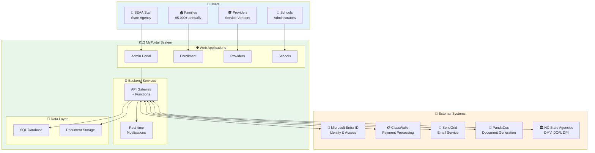
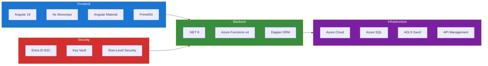
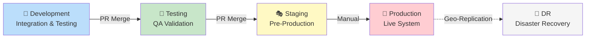
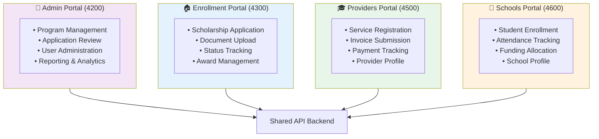
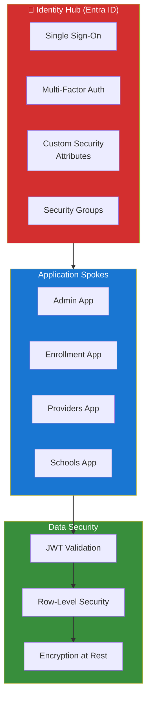
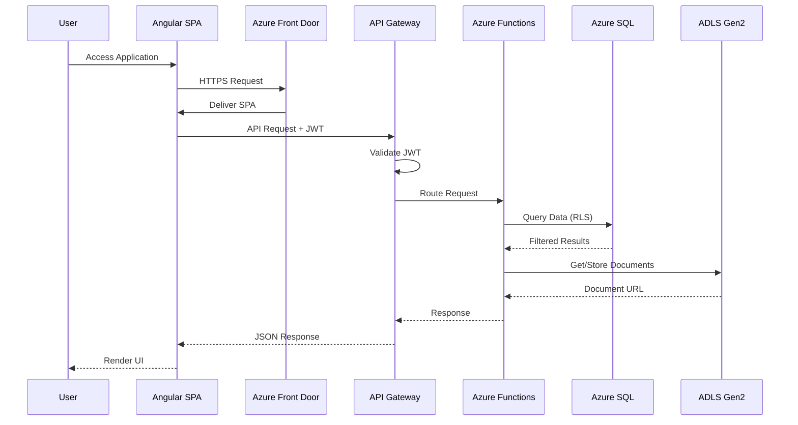

# K12 MyPortal Architecture Overview

## Executive Summary Diagram

## Technology Stack

## Environment Pipeline

## Four-App Architecture

## Security Architecture (Hub & Spoke)

## Data Flow Overview

## Key Metrics

| Metric | Target | Description |
|--------|--------|-------------|
| **Annual Applications** | 95,000+ | Scholarship applications processed |
| **Concurrent Users** | 10,000+ | Peak during application periods |
| **Availability** | 99.9% | Uptime SLA target |
| **Response Time** | < 2s | API response time |
| **Environments** | 4 | Dev → Test → Staging → Prod |
| **Azure Regions** | 2 | Primary (East US 2) + DR (Central US) |

## Quick Links

- [Detailed System Context (C4 Level 1)](01-system-context.md)
- [Container Diagram (C4 Level 2)](02-container-diagram.md)
- [Deployment Diagram](03-deployment-diagram.md)
- [Azure Infrastructure Details](./../azure-infrastructure.md)
- [Security Architecture](./../security/README.md)
