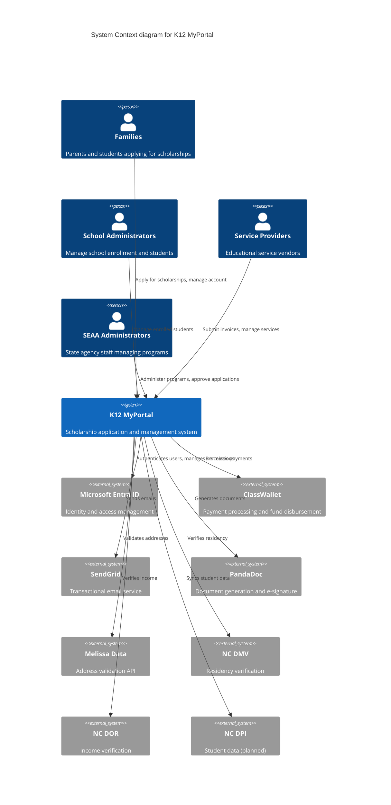

# C4 Level 1: System Context Diagram

## K12 MyPortal System Context

## Key Relationships

### User Interactions

**Families (Parents/Students)**
- Apply for ESA+ and Opportunity Scholarship programs
- Upload required documents
- Manage student information
- Track application status
- Receive award notifications

**School Administrators**
- Manage school information
- Enroll and track students
- Submit attendance records
- View funding allocations

**Service Providers**
- Register services and products
- Submit invoices for payment
- Track approved services
- Manage provider staff

**SEAA Administrators**
- Configure program rules and policies
- Review and approve applications
- Manage statewide operations
- Generate compliance reports

### External System Integrations

**Microsoft Entra ID (Critical)**
- Hub & Spoke identity model
- Single sign-on (SSO)
- Custom security attributes for fine-grained access
- Administrative units for delegated administration
- Multi-factor authentication (MFA)

**ClassWallet (High Priority)**
- ESA+ payment disbursement
- Fund repository and tracking
- Invoice approval workflow
- Account balance queries
- Transaction reporting

**SendGrid (Medium Priority)**
- Application status notifications
- Award letters
- Renewal reminders
- System alerts
- Marketing communications

**PandaDoc (Medium Priority)**
- Provider agreement generation
- School contracts
- Compliance document creation
- E-signature workflow
- Document version control

**Melissa Data (Low Priority)**
- Real-time address validation
- Address standardization
- Geocoding for district verification

**NC DMV (Medium Priority)**
- Residency verification via driver's license
- Automated data lookup
- Compliance tracking

**NC DOR (Medium Priority)**
- Income verification
- Tax return validation
- Eligibility determination support

**NC DPI (Future)**
- Student enrollment data sync
- Academic records integration
- Statewide reporting

## Compliance and Governance

- **FedRAMP High**: Azure Government Cloud hosting
- **FERPA**: Student data protection
- **NIST 800-53**: Security control compliance
- **WCAG 2.1 AA**: Accessibility standards
- **NC State Records**: Retention policies

## System Boundaries

**In Scope:**
- Application processing (ESA+, Opportunity Scholarship)
- Award management and disbursement
- Document generation and storage
- User management and authentication
- Reporting and analytics

**Out of Scope:**
- Payment card processing (handled by ClassWallet)
- Email delivery infrastructure (handled by SendGrid)
- Document storage infrastructure (Azure-managed)
- Identity provider infrastructure (Entra ID-managed)

## Performance Requirements

- **Users**: 100,000+ concurrent during application periods
- **Applications**: 95,000+ annually
- **Availability**: 99.9% uptime
- **Response Time**: <2 seconds for API calls
- **Data Retention**: 7 years minimum

## Related Documentation

- [Container Diagram (Level 2)](02-container-diagram.md)
- [System Architecture Overview](./../README.md)
- [Security Architecture](./../security/README.md)
- [Integration Architecture](./../integrations/README.md)
