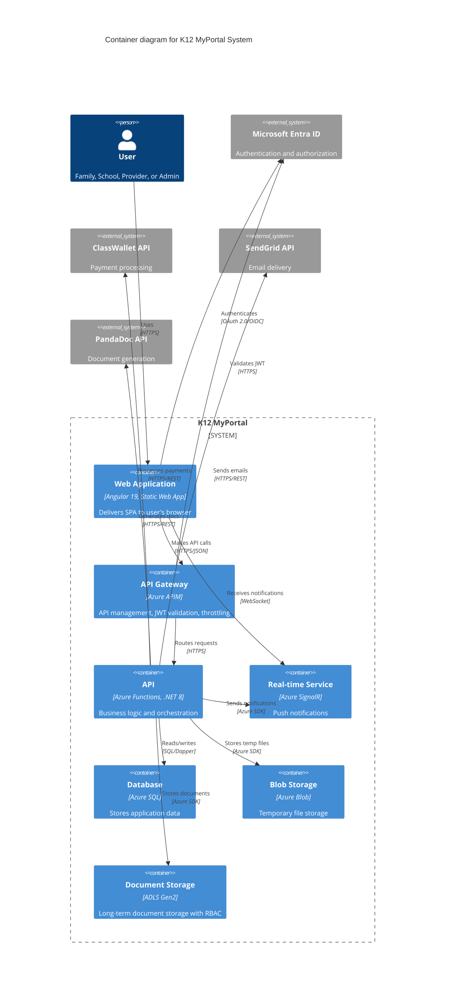
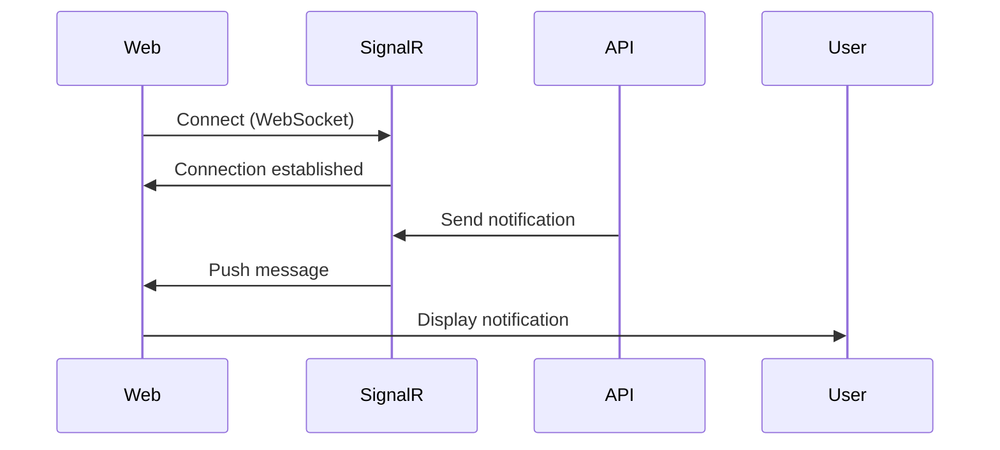
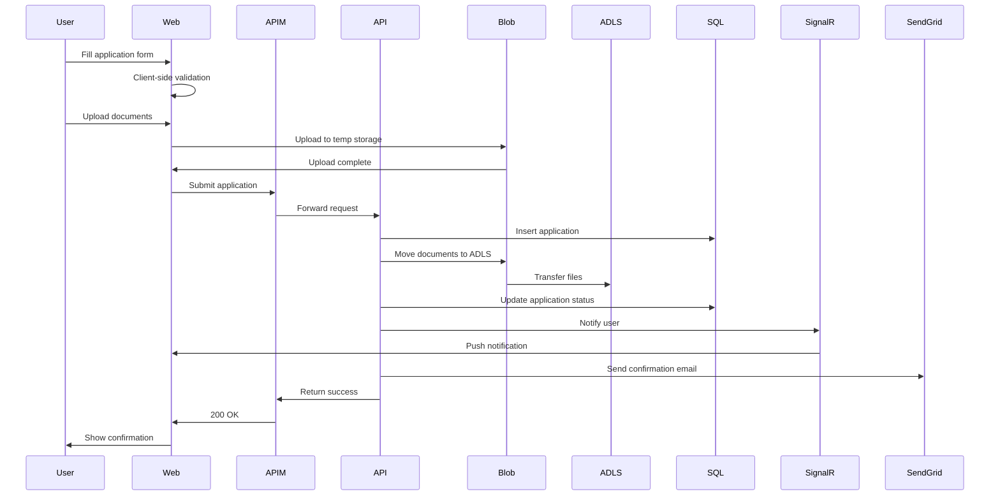
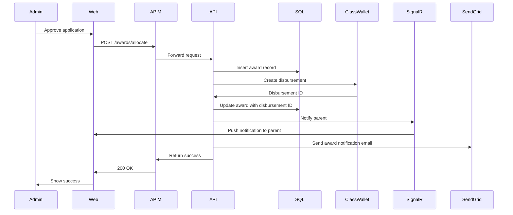
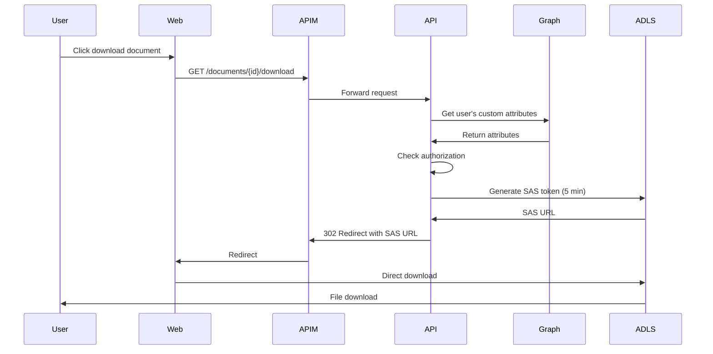

# C4 Level 2: Container Diagram

## K12 MyPortal Containers



## Container Details

### Web Application (Angular SPA)

**Technology:**
- Angular 19.2.6
- Nx 21.4.1 monorepo
- TypeScript 5.7.3
- Angular Material + PrimeNG

**Applications:**
- Admin Portal (port 4200)
- Household Enrollment (port 4300)
- Providers Portal (port 4500)
- Schools Portal (port 4600)

**Responsibilities:**
- User interface rendering
- Client-side routing
- Form validation
- State management (RxJS service-based)
- API consumption
- Real-time notifications via SignalR

**Hosting:** Azure Static Web Apps

**Key Features:**
- Single Page Application (SPA) architecture
- Progressive Web App (PWA) capabilities
- Responsive design (mobile-first)
- WCAG 2.1 AA accessibility compliance
- Dark mode support

### API Gateway (Azure APIM)

**Technology:** Azure API Management

**Responsibilities:**
- JWT token validation and signature verification
- API routing and versioning
- Rate limiting and throttling
- Request/response transformation
- API documentation (Swagger/OpenAPI)
- IP filtering and geo-blocking
- CORS policy enforcement

**Security Features:**
- OAuth 2.0 token validation
- Client certificate validation
- Subscription key management
- API key rotation
- Traffic analytics

**Policies:**
```xml
<policies>
    <inbound>
        <!-- Validate JWT token -->
        <validate-jwt header-name="Authorization">
            <openid-config url="https://login.microsoftonline.us/{tenant}/.well-known/openid-configuration" />
            <required-claims>
                <claim name="roles" match="any">
                    <value>K12.Admin</value>
                    <value>School.Admin</value>
                    <value>Provider.Admin</value>
                    <value>PrimaryParent.User</value>
                    <value>ProxyParent.User</value>
                </claim>
            </required-claims>
        </validate-jwt>

        <!-- Rate limiting -->
        <rate-limit calls="100" renewal-period="60" />

        <!-- CORS -->
        <cors allow-credentials="true">
            <allowed-origins>
                <origin>https://*.azurestaticapps.net</origin>
            </allowed-origins>
            <allowed-methods>
                <method>GET</method>
                <method>POST</method>
                <method>PUT</method>
                <method>DELETE</method>
            </allowed-methods>
        </cors>
    </inbound>
</policies>
```

### API (Azure Functions)

**Technology:**
- .NET 8
- Azure Functions v4
- Isolated worker process
- Dapper for data access

**Architecture Layers:**
```
API Layer (HTTP Triggers)
    ↓
Application Layer (Business Logic)
    ↓
Domain Layer (Models, Validators)
    ↓
Infrastructure Layer (External Services)
    ↓
Data Layer (Dapper Repositories)
```

**Key Functions:**

| Function | Purpose | Trigger |
|----------|---------|---------|
| **Admin.cs** | Admin portal operations | HTTP |
| **Programs.cs** | Program management (ESA+, Opportunity) | HTTP |
| **Enrollment.cs** | Application submission and processing | HTTP |
| **Households.cs** | Family and student management | HTTP |
| **Awards.cs** | Award allocation and disbursement | HTTP |
| **Communications.cs** | Email and notification handling | HTTP |
| **Tasks.cs** | Work queue and task management | HTTP |
| **Documents.cs** | Document upload and SAS token generation | HTTP |
| **SyncUserAccessMap** | Sync Entra ID to SQL for RLS | Timer (15 min) |
| **ArchiveAuditLogs** | Archive old audit logs | Timer (monthly) |

**Business Logic:**
- NRules business rules engine
- FluentValidation for input validation
- Custom middleware for authorization
- Resilient HTTP clients with Polly

**Configuration:**
```json
{
  "AzureFunctionsJobHost": {
    "extensions": {
      "http": {
        "routePrefix": "api",
        "maxConcurrentRequests": 100,
        "maxOutstandingRequests": 200
      }
    }
  }
}
```

### Database (Azure SQL)

**Technology:** Azure SQL Database (Standard/Premium tier)

**Schemas:**

| Schema | Purpose | Key Tables |
|--------|---------|------------|
| **dbo** | Core system tables | Users, AuditLogs, UserResourceAccessMap, SystemConfiguration |
| **Enrollment** | Application data | Students, Applications, ApplicationDocuments, EligibilityRules |
| **Households** | Family information | Households, HouseholdMembers, Addresses, IncomeVerification |
| **Awards** | Award allocations | StudentAwards, AwardDisbursements, AwardTransactions |
| **Comms** | Communications | EmailQueue, EmailTemplates, Notifications, Messages |

**Security:**
- Row-Level Security (RLS) with UserResourceAccessMap
- Dynamic data masking for PII
- Transparent Data Encryption (TDE)
- Automated backups (Point-in-time restore)
- Geo-replication for disaster recovery

**Performance:**
- Indexed views for complex queries
- Columnstore indexes for reporting
- Query Store enabled
- Automatic tuning recommendations

**Connection:**
- On-Behalf-Of (OBO) flow for user identity
- Managed Identity for service accounts
- Connection pooling enabled

### Blob Storage (Temporary)

**Technology:** Azure Blob Storage (Hot tier)

**Purpose:** Temporary file uploads during application process

**Lifecycle:**
1. User uploads document via web app
2. API validates file (type, size, virus scan)
3. File stored in blob storage
4. Document processed and validated
5. File moved to ADLS Gen2 for long-term storage
6. Original blob deleted after 7 days (auto-delete policy)

**Security:**
- Private endpoints (no public access)
- SAS tokens for uploads (5-minute expiry)
- Virus scanning on upload
- Encryption at rest

**Storage Structure:**
```
temp-uploads/
  ├── {applicationId}/
  │   ├── {documentId}.pdf
  │   └── {documentId}.jpg
```

### Document Storage (ADLS Gen2)

**Technology:** Azure Data Lake Storage Gen2

**Purpose:** Long-term document storage with hierarchical access control

**Structure:**
```
/{application}/{legal-entity}/{userid}/{documentType}

Examples:
/enrollment/lincoln-high/student123/apartmentleasingagreement
/enrollment/lincoln-high/student123/birthcertificate
/providerdashboard/math-tutor123/employee123/verificationdocument123
/schools/roosevelt-elementary/staff456/backgroundcheck
```

**Security:**
- Hierarchical access control (RBAC at folder level)
- Security groups assigned Storage Blob Data Reader role
- Short-lived SAS tokens (~5 minutes) for downloads
- Encryption at rest with customer-managed keys
- Immutable storage for compliance

**Features:**
- Versioning enabled
- Soft delete (30 days)
- Lifecycle management (archive after 1 year)
- Change feed for audit

### Real-time Service (Azure SignalR)

**Technology:** Azure SignalR Service (Standard tier)

**Use Cases:**
- Application status updates (submitted → under review → approved)
- Notification push to user dashboard
- Live dashboard updates for admins (application counts, pending tasks)
- Admin broadcast messages to all users
- Work queue updates

**Connection Flow:**


**Hub Methods:**
- `JoinUserGroup(userId)` - Subscribe to user-specific notifications
- `JoinAdminGroup()` - Subscribe to admin broadcasts
- `SendNotification(userId, message)` - Send to specific user
- `BroadcastToAdmins(message)` - Broadcast to all admins

## External System Integration

### Microsoft Entra ID

**Integration Type:** OAuth 2.0 / OpenID Connect

**Features:**
- Single Sign-On (SSO)
- Custom security attributes (`studentAccessControl`)
- Administrative units for delegated administration
- B2C for external users (parents, schools, providers)
- Multi-factor authentication (MFA)

**Endpoints:**
- Authorization: `https://login.microsoftonline.us/{tenant}/oauth2/v2.0/authorize`
- Token: `https://login.microsoftonline.us/{tenant}/oauth2/v2.0/token`
- User Info: Microsoft Graph API (`https://graph.microsoft.us/v1.0/me`)

**Token Claims:**
```json
{
  "oid": "abc-123-def-456",
  "email": "user@example.com",
  "roles": ["PrimaryParent.User"],
  "groups": ["K12-HouseHold-parent1"]
}
```

### ClassWallet API

**Integration Type:** REST API (JSON over HTTPS)

**Base URL:** `https://api.classwallet.com/v1/`

**Key Endpoints:**
- `POST /disbursement` - Send funds to student account
- `GET /balance/{accountId}` - Check account balance
- `POST /invoice` - Submit invoice for payment
- `GET /transactions` - Query transaction history
- `POST /account` - Create student account

**Authentication:** API Key (Bearer token)

**Error Handling:**
- Retry policy: 3 attempts with exponential backoff
- Circuit breaker: Open after 5 consecutive failures
- Fallback: Queue for manual processing

### SendGrid API

**Integration Type:** REST API (JSON over HTTPS)

**Base URL:** `https://api.sendgrid.com/v3/`

**Use Cases:**
- Transactional emails (application confirmation, award notification)
- Application status updates
- System alerts
- Password resets
- Marketing communications (newsletters, program updates)

**Key Endpoints:**
- `POST /mail/send` - Send email
- `GET /templates` - List email templates
- `POST /contacts` - Add contact to mailing list

**Authentication:** API Key

**Templates:**
- `application-submitted`
- `application-approved`
- `award-notification`
- `document-required`
- `payment-processed`

### PandaDoc API

**Integration Type:** REST API (JSON over HTTPS)

**Base URL:** `https://api.pandadoc.com/public/v1/`

**Use Cases:**
- Provider agreement generation
- School enrollment contracts
- Compliance document creation
- E-signature workflow
- Document version control

**Key Endpoints:**
- `POST /documents` - Create document from template
- `POST /documents/{id}/send` - Send for signature
- `GET /documents/{id}/download` - Download signed document

**Authentication:** OAuth 2.0 (Bearer token)

**Workflow:**
1. API creates document from template
2. PandaDoc generates PDF
3. API sends to recipient for e-signature
4. Webhook notifies when signed
5. API downloads and stores in ADLS

## Data Flow Diagrams

### Application Submission Flow



### Award Processing Flow



### Document Download Flow



## Deployment Architecture

### Azure Region

**Primary:** US Gov Virginia
**Secondary (DR):** US Gov Texas

### Resource Groups

| Resource Group | Purpose | Resources |
|----------------|---------|-----------|
| `k12-web-prod` | Frontend applications | Static Web Apps (4 apps) |
| `k12-api-prod` | Backend services | Azure Functions, APIM, SignalR |
| `k12-data-prod` | Data storage | Azure SQL, ADLS Gen2, Blob Storage |
| `k12-identity-prod` | Identity and security | Entra ID, Key Vault |
| `k12-monitoring-prod` | Observability | Application Insights, Log Analytics |

### Environments

| Environment | Purpose | Scale | Cost |
|-------------|---------|-------|------|
| **Development** | Developer testing | Minimal (1-2 instances) | $500/month |
| **Testing** | QA and integration testing | Small (2-3 instances) | $1,500/month |
| **Staging** | Pre-production validation | Medium (3-5 instances) | $3,000/month |
| **Production** | Live system | Full scale (5-10 instances) | $8,000/month |

### Infrastructure as Code

**Tool:** Terraform

**Modules:**
- `web-apps` - Static Web Apps configuration
- `api-functions` - Azure Functions deployment
- `data-storage` - SQL, ADLS, Blob configuration
- `networking` - VNet, NSG, Private Endpoints
- `monitoring` - Application Insights, alerts

**Deployment Pipeline:**
```bash
terraform plan -var-file=environments/prod.tfvars
terraform apply -var-file=environments/prod.tfvars
```

## Performance and Scalability

### Scaling Strategy

| Container | Scaling Method | Trigger | Max Scale |
|-----------|---------------|---------|-----------|
| **Web Apps** | Auto (built-in) | Traffic-based | Unlimited |
| **API Functions** | Auto-scale | CPU > 70%, Queue depth | 10 instances |
| **APIM** | Manual tier upgrade | Sustained high load | Premium tier |
| **SQL Database** | Auto-tune + Manual | DTU > 80% | Premium P6 |
| **SignalR** | Manual tier upgrade | Concurrent connections | 100k connections |

### Performance Targets

| Metric | Target | Current | Status |
|--------|--------|---------|--------|
| **API Response Time** | < 2 seconds | 1.2 seconds | ✅ |
| **Page Load Time** | < 3 seconds | 2.1 seconds | ✅ |
| **Database Query Time** | < 500ms | 350ms | ✅ |
| **Document Upload** | < 30 seconds | 18 seconds | ✅ |
| **Availability** | 99.9% | 99.95% | ✅ |
| **Concurrent Users** | 10,000 | Tested to 12,000 | ✅ |

## Monitoring and Observability

### Application Insights

**Tracked Metrics:**
- Request rate and duration
- Dependency calls (SQL, external APIs)
- Exception rates
- Custom events (application submitted, award allocated)
- User flows

**Alerts:**
- API response time > 3 seconds
- Error rate > 5%
- SQL DTU > 80%
- Failed authentication attempts > 100/hour

### Log Analytics

**Log Sources:**
- Azure Functions logs
- APIM gateway logs
- Azure SQL diagnostic logs
- SignalR connection logs

**Queries:**
- Failed authorization attempts
- Slow queries
- Error patterns
- User activity

## Security Considerations

### Network Security

**VNet Integration:**
- API Functions deployed in VNet
- Private endpoints for SQL, Storage, Key Vault
- Network Security Groups (NSG) for traffic filtering

**DDoS Protection:**
- Azure DDoS Protection Standard enabled
- Rate limiting in APIM
- Geo-blocking for non-US traffic

### Data Security

**Encryption:**
- TLS 1.2+ for all connections
- TDE for SQL at rest
- SSE for Storage at rest
- Customer-managed keys in Key Vault

**Data Classification:**
- Public: Program information
- Internal: Application statistics
- Confidential: Student PII, financial data
- Restricted: SSN, bank accounts

### Compliance

**Standards:**
- FedRAMP High (Azure Government Cloud)
- FERPA (student data protection)
- NIST 800-53 (security controls)
- WCAG 2.1 AA (accessibility)

## Disaster Recovery

### Backup Strategy

| Resource | Backup Frequency | Retention | RPO | RTO |
|----------|-----------------|-----------|-----|-----|
| **Azure SQL** | Continuous | 35 days | 5 minutes | 1 hour |
| **ADLS Gen2** | Daily snapshots | 30 days | 24 hours | 4 hours |
| **Blob Storage** | Geo-redundant | 30 days | 1 hour | 2 hours |
| **Configuration** | Git-based | Infinite | 0 (IaC) | 30 minutes |

### Failover Plan

1. **Automatic Failover (SQL):** Azure SQL auto-failover to secondary region
2. **Manual Failover (Functions):** Redeploy to secondary region from CI/CD
3. **Traffic Manager:** Automatic routing to healthy region
4. **Data Recovery:** Point-in-time restore from backup

## Related Documentation

- [C4 Level 1: System Context](01-system-context.md)
- [C4 Level 3: Backend Components](03-backend-components.md)
- [C4 Level 3: Frontend Components](04-frontend-components.md)
- [Security Architecture](./../security/README.md)
- [Database Schema Documentation](./../../Database-Schema-Documentation.md)

## References

- [Azure Architecture Center](https://learn.microsoft.com/en-us/azure/architecture/)
- [C4 Model](https://c4model.com/)
- [Azure Functions Best Practices](https://learn.microsoft.com/en-us/azure/azure-functions/functions-best-practices)
- [APIM Policies](https://learn.microsoft.com/en-us/azure/api-management/api-management-policies)

---

**Created:** 2024-11-24
**Author:** Architecture Team
**Review Date:** 2025-02-24 (Quarterly review)
