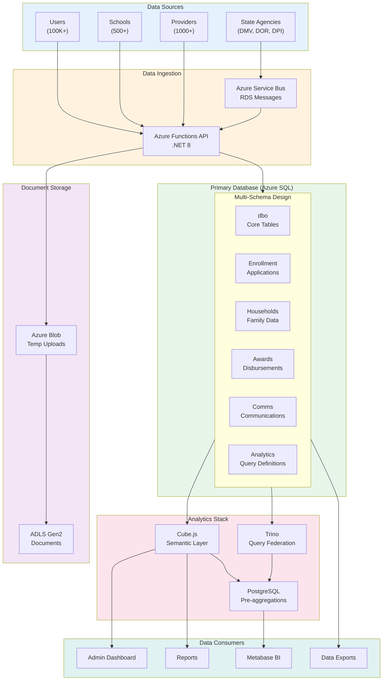
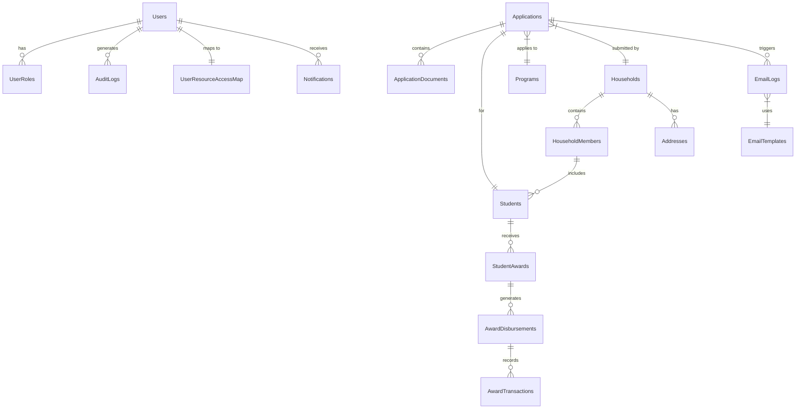
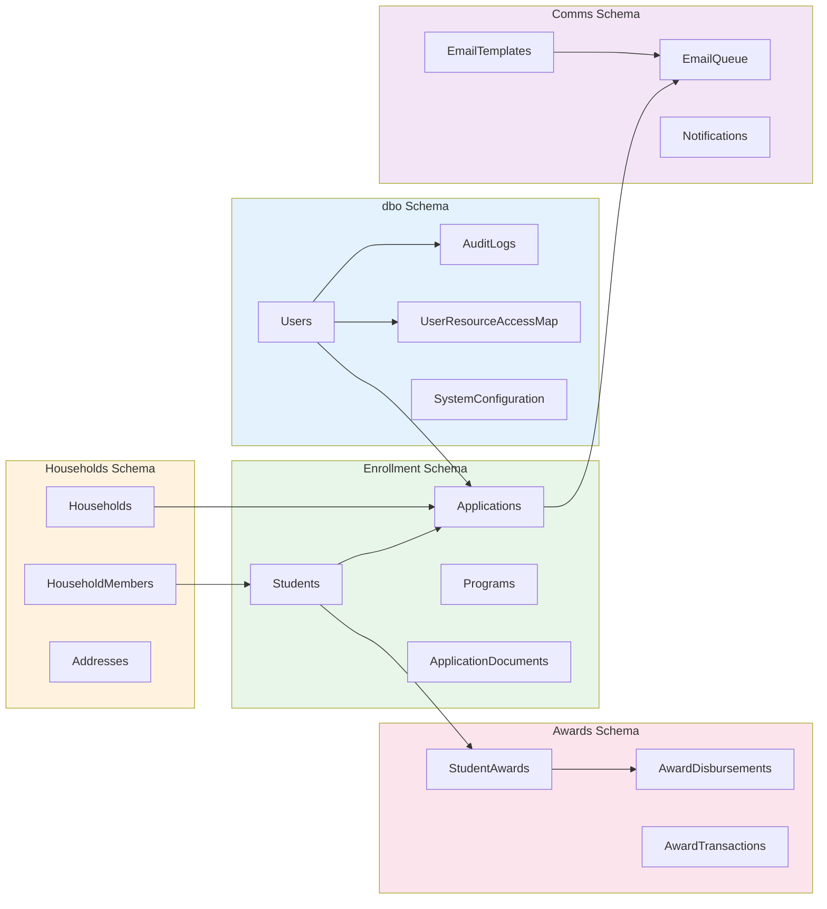
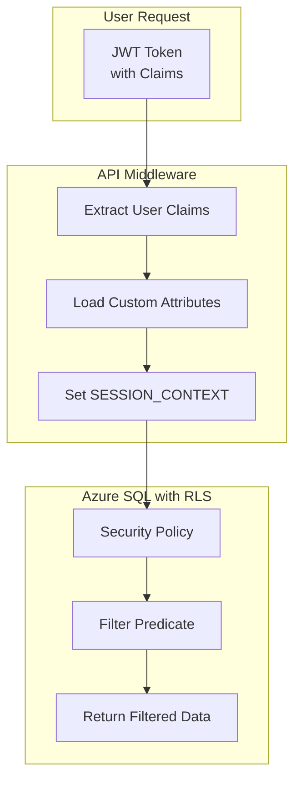
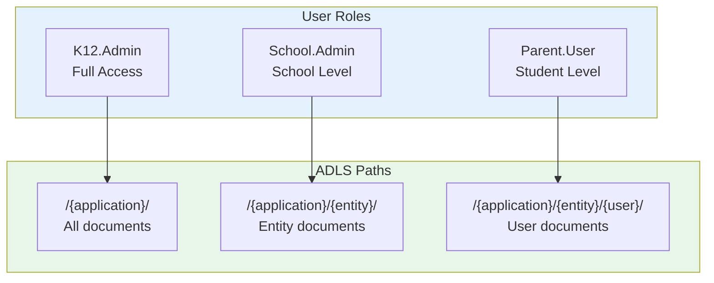
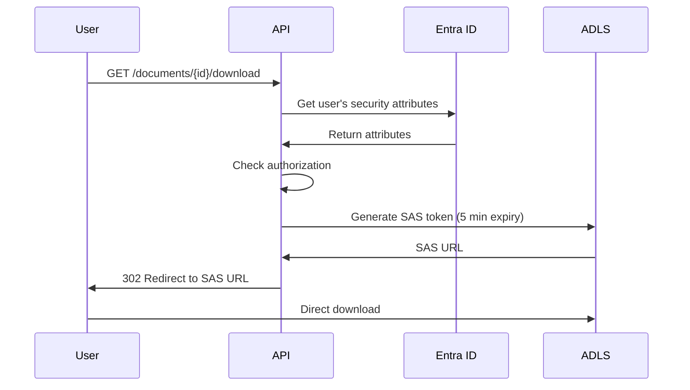
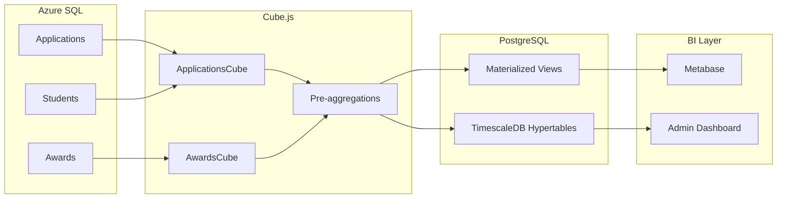

# C4 Data Architecture Diagram

## Overview

K12 MyPortal uses a **dual-database architecture** with Azure SQL as the primary transactional database and Azure PostgreSQL for analytics workloads.

## Data Flow Architecture



## Database Schema Architecture



## Azure SQL Multi-Schema Design

### Schema Overview

| Schema | Purpose | Key Tables | Row Count (Est.) |
|--------|---------|------------|------------------|
| **dbo** | Core system tables | Users, AuditLogs, SystemConfiguration | 500K+ |
| **Enrollment** | Application processing | Applications, Students, Programs | 1M+ |
| **Households** | Family information | Households, HouseholdMembers, Addresses | 500K+ |
| **Awards** | Award management | StudentAwards, Disbursements, Transactions | 2M+ |
| **Comms** | Communications | EmailQueue, Notifications, Templates | 5M+ |
| **Analytics** | Query definitions | QueryDefinition, QuerySnapshot, QuerySchedule | 1K |

### Schema Relationships



### Key Tables by Schema

#### dbo Schema (Core)

| Table | Purpose | Key Columns |
|-------|---------|-------------|
| `Users` | User accounts | UserId, EntraObjectId, Email, Role |
| `AuditLogs` | Audit trail | EventType, UserId, Timestamp, Details |
| `UserResourceAccessMap` | RLS authorization | UserId, ResourceType, ResourceId |
| `SystemConfiguration` | System settings | Key, Value, Environment |

#### Enrollment Schema

| Table | Purpose | Key Columns |
|-------|---------|-------------|
| `Applications` | Scholarship applications | ApplicationId, HouseholdId, ProgramId, Status |
| `Students` | Student records | StudentId, FirstName, LastName, DOB, EntraObjectId |
| `Programs` | ESA+, Opportunity | ProgramId, Name, YearId, Rules |
| `ApplicationDocuments` | Uploaded documents | DocumentId, ApplicationId, Type, BlobPath |
| `EligibilityRules` | Eligibility criteria | RuleId, ProgramId, Expression |

#### Households Schema

| Table | Purpose | Key Columns |
|-------|---------|-------------|
| `Households` | Family units | HouseholdId, PrimaryParentId, Status |
| `HouseholdMembers` | Family members | MemberId, HouseholdId, Relationship |
| `Addresses` | Physical addresses | AddressId, HouseholdId, Street, City, State, Zip |
| `IncomeVerification` | Income records | VerificationId, HouseholdId, Year, Amount |

#### Awards Schema

| Table | Purpose | Key Columns |
|-------|---------|-------------|
| `StudentAwards` | Award allocations | AwardId, StudentId, ProgramId, Amount, Year |
| `AwardDisbursements` | Payment events | DisbursementId, AwardId, ClassWalletId, Status |
| `AwardTransactions` | Transaction history | TransactionId, DisbursementId, Type, Amount |

#### Comms Schema

| Table | Purpose | Key Columns |
|-------|---------|-------------|
| `EmailQueue` | Outbound emails | EmailId, RecipientId, TemplateId, Status |
| `EmailTemplates` | Email templates | TemplateId, Name, Subject, Body |
| `Notifications` | In-app notifications | NotificationId, UserId, Message, Read |
| `Messages` | User messages | MessageId, SenderId, RecipientId, Content |

## Row-Level Security (RLS)



### RLS Implementation

```sql
-- Security policy for Students table
CREATE SECURITY POLICY StudentAccessPolicy
ADD FILTER PREDICATE dbo.fn_StudentAccessFilter(StudentId)
    ON Enrollment.Students;

-- Filter function
CREATE FUNCTION dbo.fn_StudentAccessFilter(@StudentId UNIQUEIDENTIFIER)
RETURNS TABLE
WITH SCHEMABINDING
AS
RETURN (
    SELECT 1 AS AccessGranted
    FROM dbo.UserResourceAccessMap m
    WHERE m.UserId = CAST(SESSION_CONTEXT(N'UserId') AS UNIQUEIDENTIFIER)
      AND m.ResourceType = 'Student'
      AND m.ResourceId = @StudentId
);
```

## Document Storage Architecture (ADLS Gen2)

### Hierarchical Structure

```
/{application}/{legal-entity}/{userid}/{documentType}

Examples:
/enrollment/lincoln-high/student123/birthcertificate
/enrollment/lincoln-high/student123/residencyproof
/providers/math-tutor-inc/emp456/backgroundcheck
/schools/roosevelt-elem/staff789/certification
```

### Access Control Model



### SAS Token Generation



## Analytics Data Architecture

### Primary vs Analytics Database

| Aspect | Azure SQL (Primary) | PostgreSQL (Analytics) |
|--------|---------------------|------------------------|
| **Purpose** | OLTP transactions | OLAP analytics |
| **Access** | Application API | Cube.js, Metabase |
| **Data** | Live operational data | Pre-aggregated snapshots |
| **Scale** | Vertical (DTU) | Horizontal (Citus) |
| **Extensions** | None | TimescaleDB, pg_trgm, pgvector |

### Cube.js Pre-aggregation Flow



### Cube.js Schema Example

```javascript
// cube/schema/Applications.js
cube('Applications', {
  sql: `SELECT * FROM Enrollment.Applications`,

  measures: {
    count: {
      type: 'count',
    },
    approved: {
      type: 'count',
      filters: [{ sql: `${CUBE}.Status = 'Approved'` }],
    },
    approvalRate: {
      type: 'number',
      sql: `${approved} / ${count} * 100`,
    },
  },

  dimensions: {
    status: {
      type: 'string',
      sql: 'Status',
    },
    program: {
      type: 'string',
      sql: 'ProgramName',
    },
    submittedDate: {
      type: 'time',
      sql: 'SubmittedAt',
    },
  },

  preAggregations: {
    dailyByProgram: {
      type: 'rollup',
      measures: [count, approved],
      dimensions: [program, status],
      timeDimension: submittedDate,
      granularity: 'day',
      partitionGranularity: 'month',
      refreshKey: {
        every: '1 hour',
      },
    },
  },
});
```

## Data Governance

### Data Classification

| Classification | Examples | Protection |
|----------------|----------|------------|
| **Public** | Program information, school names | None required |
| **Internal** | Application counts, statistics | Authentication required |
| **Confidential** | Student PII, addresses | Encryption + RLS |
| **Restricted** | SSN, bank accounts | Encryption + Masking + Audit |

### Data Retention

| Data Type | Retention Period | Archive Strategy |
|-----------|------------------|------------------|
| Applications | 7 years | Archive to cold storage |
| Audit Logs | 7 years | Partition by year |
| Documents | 7 years | Move to archive tier |
| Emails | 3 years | Purge after retention |
| Session Data | 90 days | Auto-delete |

### Backup Strategy

| Resource | Backup Type | Frequency | Retention |
|----------|-------------|-----------|-----------|
| Azure SQL | Automated | Continuous | 35 days (PITR) |
| ADLS Gen2 | Snapshot | Daily | 30 days |
| PostgreSQL | pg_dump | Daily | 30 days |
| Configuration | Git | On change | Infinite |

## Related Documentation

- [Container Diagram](02-container-diagram.md)
- [Security Architecture](./../security/README.md)
- [SEC-03: Row-Level Security](./../security/SEC-03-row-level-security.md)
- [ADR-002: Dapper over Entity Framework](./../../adr/ADR-002-dapper-over-entity-framework.md)
- [ADR-008: Multi-Schema Database Design](./../../adr/ADR-008-multi-schema-database.md)
- [QueryBuilder SDK Design](./../integrations/QueryBuilder/SDK-Design.md)

---

*Created: December 2025*
*Author: Architecture Team*
*Review Date: Q1 2026*
