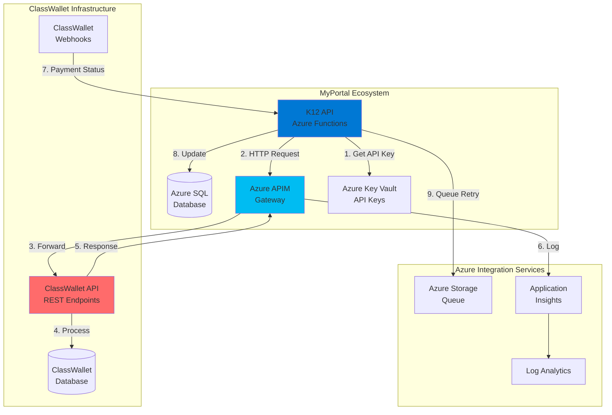
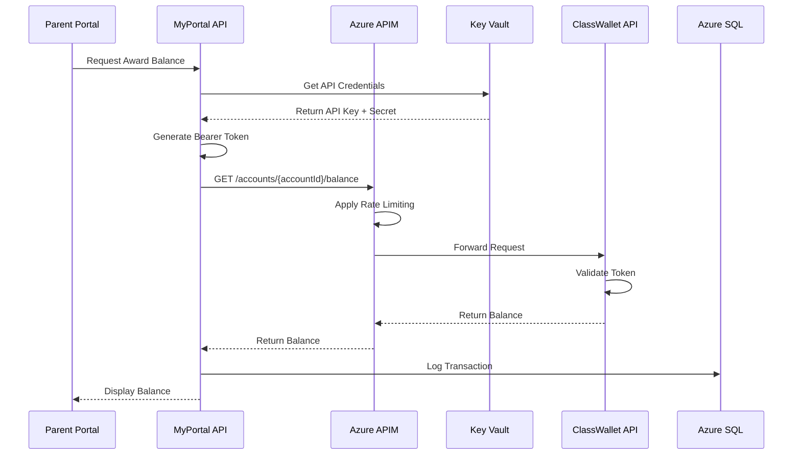
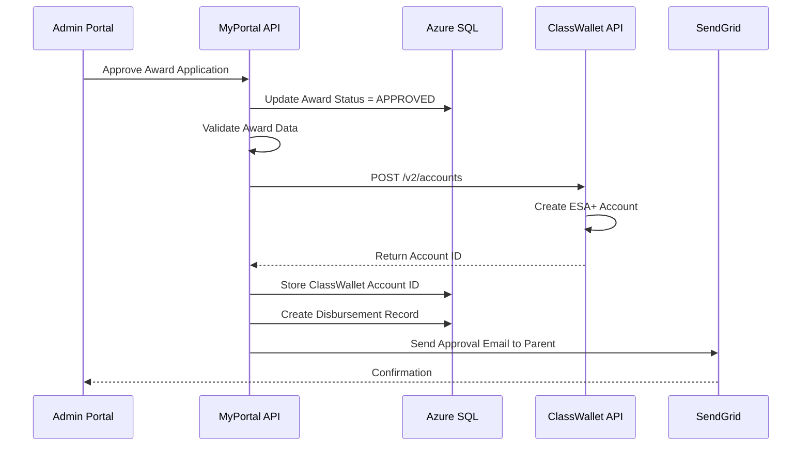
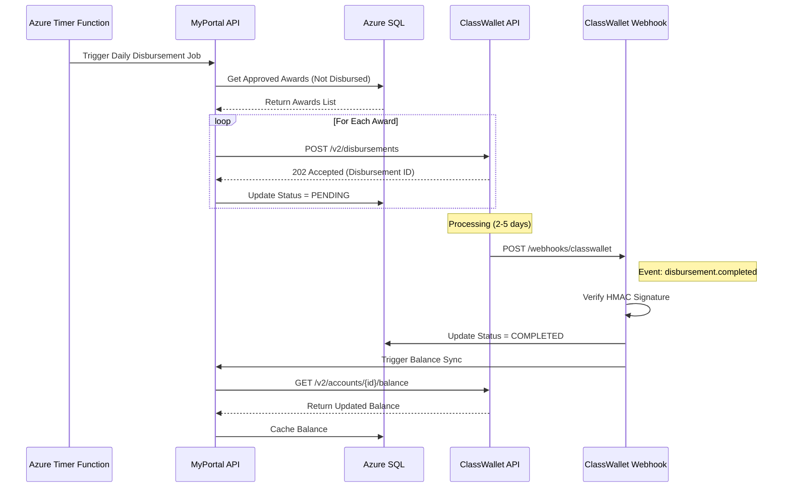
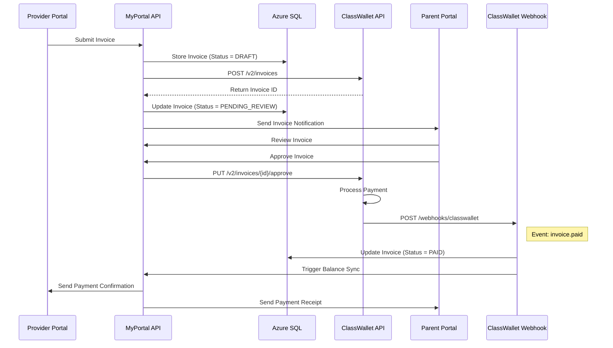
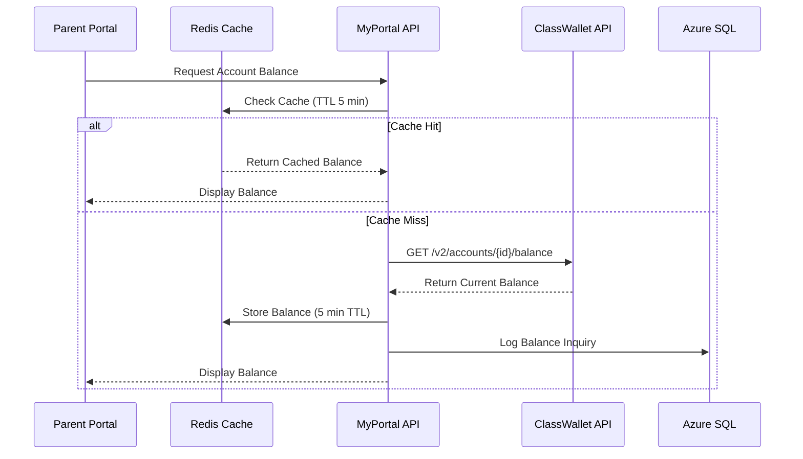
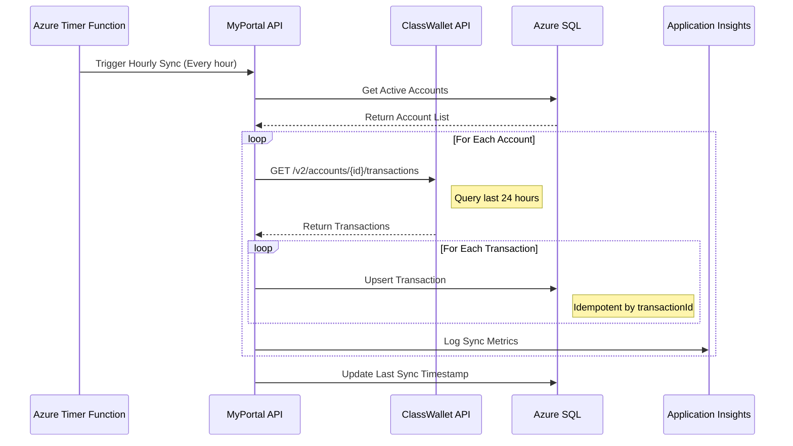

# INT-01: ClassWallet Integration

**Integration ID:** INT-01
**System:** ClassWallet Payment Processing
**Type:** External REST API
**Classification:** Critical Business Service
**Status:** Active (Production)
**Last Updated:** 2025-01-15

## Table of Contents

- [Overview](#overview)
- [Integration Architecture](#integration-architecture)
- [API Specifications](#api-specifications)
- [Data Flow](#data-flow)
- [Implementation](#implementation)
- [Error Handling](#error-handling)
- [Security](#security)
- [Monitoring & Logging](#monitoring--logging)
- [Testing Strategy](#testing-strategy)
- [Common Issues & Troubleshooting](#common-issues--troubleshooting)
- [References](#references)

---

## Overview

### Purpose

ClassWallet is the **primary payment processing and fund repository system** for the NC SEAA K-12 Scholarship Management System. It handles all financial transactions related to Education Savings Accounts (ESA+), including:

- **Fund Disbursement**: Transferring scholarship funds from state accounts to student ESA+ accounts
- **Payment Processing**: Managing payments from parents to education providers and schools
- **Invoice Management**: Processing provider invoices for services rendered
- **Balance Tracking**: Real-time balance queries for student accounts
- **Account Creation**: Automated creation of student ESA+ accounts
- **Transaction History**: Complete audit trail of all financial activities
- **Reconciliation**: Daily financial reconciliation with state funding sources

### Business Context

ClassWallet serves as the **fund repository** mandated by NC state law for ESA+ scholarship programs. All scholarship funds flow through ClassWallet to ensure:

1. **Compliance**: State-required financial controls and audit trails
2. **Transparency**: Parents and administrators can track fund usage
3. **Flexibility**: Parents can choose from approved providers/schools
4. **Security**: PCI-DSS compliant payment processing
5. **Reporting**: Real-time financial reporting to state agencies

### Integration Scope

| Feature | MyPortal Responsibility | ClassWallet Responsibility |
|---------|------------------------|----------------------------|
| Student Eligibility | Determine award amounts | N/A |
| Account Creation | Trigger account creation API | Create and manage accounts |
| Fund Disbursement | Submit disbursement requests | Process transfers |
| Invoice Submission | Provider portal for invoice entry | Invoice approval workflow |
| Payment Processing | N/A | Process payments to providers |
| Balance Inquiries | Display balances in parent portal | Maintain real-time balances |
| Transaction History | Display in MyPortal | Store complete history |
| Reconciliation | Validate disbursements | Daily reconciliation reports |

### Key Metrics

- **Transaction Volume**: ~15,000 disbursements per academic year
- **Average Award**: $7,500 per student
- **Total Fund Volume**: $112M annually (projected)
- **API Call Volume**: ~50,000 calls/month (500 req/min peak)
- **SLA Requirements**: 99.9% uptime, <2s response time
- **Reconciliation Frequency**: Daily at 11:00 PM EST

---

## Integration Architecture

### High-Level Architecture



### Component Responsibilities

#### MyPortal API Layer
- **API/Functions/ClassWalletFunctions.cs**: Azure Function HTTP triggers for ClassWallet operations
- **Application/Services/ClassWalletService.cs**: Business logic for payment operations
- **Infrastructure/HttpClients/ClassWalletClient.cs**: HTTP client with Polly resilience policies
- **Domain/Entities/Disbursement.cs**: Domain model for fund disbursements

#### ClassWallet API Layer
- **Base URL (Production)**: `https://api.classwallet.com/v2`
- **Base URL (Sandbox)**: `https://sandbox-api.classwallet.com/v2`
- **Authentication**: Bearer token (OAuth 2.0 Client Credentials)
- **Rate Limits**: 100 requests/minute per API key

### Network Flow



### Data Synchronization Strategy

MyPortal maintains a **cache** of ClassWallet data to reduce API calls and improve performance:

| Data Type | Sync Frequency | Cache Duration | Source of Truth |
|-----------|---------------|----------------|-----------------|
| Account Balances | Real-time on request | 5 minutes | ClassWallet |
| Transaction History | Hourly batch job | 24 hours | ClassWallet |
| Invoice Status | Webhook + hourly poll | Real-time | ClassWallet |
| Disbursement Status | Webhook + 15-min poll | Real-time | ClassWallet |

---

## API Specifications

### Authentication

ClassWallet uses **OAuth 2.0 Client Credentials Flow** for API authentication.

#### Token Request

```http
POST https://api.classwallet.com/v2/oauth/token
Content-Type: application/x-www-form-urlencoded

grant_type=client_credentials
&client_id={CLIENT_ID}
&client_secret={CLIENT_SECRET}
&scope=read:accounts write:disbursements read:transactions
```

#### Token Response

```json
{
  "access_token": "eyJhbGciOiJSUzI1NiIsInR5cCI6IkpXVCJ9...",
  "token_type": "Bearer",
  "expires_in": 3600,
  "scope": "read:accounts write:disbursements read:transactions"
}

```

**Token Caching**: Tokens are valid for 1 hour. MyPortal caches tokens for 55 minutes to avoid expiration.

### API Endpoints

#### 1. Create ESA+ Account

**Endpoint:** `POST /v2/accounts`

**Purpose:** Create a new ESA+ account for a student upon award approval.

**Request:**

```json
{
  "accountType": "ESA_PLUS",
  "studentId": "STU-2024-001234",
  "firstName": "Emily",
  "lastName": "Johnson",
  "dateOfBirth": "2010-03-15",
  "guardianEmail": "parent@example.com",
  "initialBalance": 0.00,
  "programCode": "NC_SEAA_K12",
  "schoolYear": "2024-2025",
  "metadata": {
    "applicationId": "APP-2024-005678",
    "awardId": "AWD-2024-009012",
    "householdId": "HH-2024-003456"
  }
}
```

**Response (201 Created):**

```json
{
  "accountId": "CW-ACC-7894561230",
  "accountNumber": "4000-1234-5678",
  "status": "ACTIVE",
  "createdAt": "2024-09-15T14:30:00Z",
  "balance": {
    "available": 0.00,
    "pending": 0.00,
    "total": 0.00
  },
  "links": {
    "self": "/v2/accounts/CW-ACC-7894561230",
    "transactions": "/v2/accounts/CW-ACC-7894561230/transactions"
  }
}
```

**Error Response (400 Bad Request):**

```json
{
  "error": "VALIDATION_ERROR",
  "message": "Student account already exists",
  "details": {
    "field": "studentId",
    "existingAccountId": "CW-ACC-7894561230"
  },
  "requestId": "req-abc-123-def-456"
}
```

#### 2. Submit Disbursement Request

**Endpoint:** `POST /v2/disbursements`

**Purpose:** Transfer funds from state account to student ESA+ account.

**Request:**

```json
{
  "sourceAccountId": "CW-ACC-STATE-NC-001",
  "destinationAccountId": "CW-ACC-7894561230",
  "amount": 7500.00,
  "currency": "USD",
  "disbursementType": "INITIAL_AWARD",
  "effectiveDate": "2024-09-20",
  "description": "2024-2025 Academic Year Award",
  "referenceId": "DISB-2024-001234",
  "metadata": {
    "awardId": "AWD-2024-009012",
    "studentId": "STU-2024-001234",
    "schoolYear": "2024-2025",
    "disbursementReason": "Initial award funding"
  },
  "notificationEmail": "parent@example.com"
}
```

**Response (202 Accepted):**

```json
{
  "disbursementId": "CW-DISB-9876543210",
  "status": "PENDING",
  "submittedAt": "2024-09-15T14:35:00Z",
  "estimatedCompletionTime": "2024-09-20T00:00:00Z",
  "trackingUrl": "/v2/disbursements/CW-DISB-9876543210"
}
```

**Status Values:**
- `PENDING`: Submitted, awaiting processing
- `PROCESSING`: Fund transfer in progress
- `COMPLETED`: Successfully transferred
- `FAILED`: Transfer failed (see error details)
- `CANCELLED`: Cancelled by administrator

#### 3. Get Account Balance

**Endpoint:** `GET /v2/accounts/{accountId}/balance`

**Purpose:** Retrieve current balance for student ESA+ account.

**Response (200 OK):**

```json
{
  "accountId": "CW-ACC-7894561230",
  "balance": {
    "available": 6245.50,
    "pending": 350.00,
    "reserved": 0.00,
    "total": 6595.50
  },
  "currency": "USD",
  "lastUpdated": "2024-11-15T09:20:15Z",
  "breakdown": {
    "initialAward": 7500.00,
    "additionalFunding": 0.00,
    "totalSpent": 904.50,
    "pendingInvoices": 350.00
  }
}
```

#### 4. Get Transaction History

**Endpoint:** `GET /v2/accounts/{accountId}/transactions`

**Query Parameters:**
- `startDate`: ISO 8601 date (e.g., `2024-09-01`)
- `endDate`: ISO 8601 date (e.g., `2024-11-15`)
- `transactionType`: Filter by type (`DISBURSEMENT`, `PAYMENT`, `REFUND`, `ADJUSTMENT`)
- `status`: Filter by status (`COMPLETED`, `PENDING`, `FAILED`)
- `page`: Page number (default: 1)
- `pageSize`: Results per page (default: 50, max: 200)

**Response (200 OK):**

```json
{
  "accountId": "CW-ACC-7894561230",
  "transactions": [
    {
      "transactionId": "CW-TXN-1234567890",
      "type": "PAYMENT",
      "amount": -125.00,
      "currency": "USD",
      "status": "COMPLETED",
      "transactionDate": "2024-11-10T10:15:30Z",
      "description": "Math tutoring services - October 2024",
      "merchant": {
        "providerId": "PRV-2024-000123",
        "providerName": "ABC Tutoring Services",
        "invoiceNumber": "INV-2024-10-0045"
      },
      "balance": {
        "beforeTransaction": 6370.50,
        "afterTransaction": 6245.50
      }
    },
    {
      "transactionId": "CW-TXN-0987654321",
      "type": "DISBURSEMENT",
      "amount": 7500.00,
      "currency": "USD",
      "status": "COMPLETED",
      "transactionDate": "2024-09-20T00:00:00Z",
      "description": "2024-2025 Academic Year Award",
      "referenceId": "DISB-2024-001234"
    }
  ],
  "pagination": {
    "page": 1,
    "pageSize": 50,
    "totalPages": 1,
    "totalRecords": 12
  }
}
```

#### 5. Submit Provider Invoice

**Endpoint:** `POST /v2/invoices`

**Purpose:** Provider submits invoice for services rendered to student.

**Request:**

```json
{
  "accountId": "CW-ACC-7894561230",
  "providerId": "PRV-2024-000123",
  "invoiceNumber": "INV-2024-11-0078",
  "invoiceDate": "2024-11-15",
  "dueDate": "2024-11-30",
  "amount": 350.00,
  "currency": "USD",
  "serviceCategory": "TUTORING",
  "lineItems": [
    {
      "description": "Math tutoring - November 2024",
      "quantity": 10,
      "unitPrice": 35.00,
      "amount": 350.00,
      "serviceDate": "2024-11-01 to 2024-11-15"
    }
  ],
  "attachments": [
    {
      "fileName": "invoice_INV-2024-11-0078.pdf",
      "fileUrl": "https://myportal.blob.core.usgovcloudapi.net/invoices/...",
      "fileType": "application/pdf"
    }
  ],
  "notifyGuardian": true,
  "guardianEmail": "parent@example.com"
}
```

**Response (201 Created):**

```json
{
  "invoiceId": "CW-INV-5555666677",
  "status": "PENDING_REVIEW",
  "submittedAt": "2024-11-15T14:30:00Z",
  "estimatedReviewTime": "2-3 business days",
  "reviewUrl": "/v2/invoices/CW-INV-5555666677"
}
```

**Invoice Status Workflow:**
1. `PENDING_REVIEW`: Submitted, awaiting parent/admin review
2. `APPROVED`: Parent approved, payment processing
3. `PAID`: Payment completed
4. `DISPUTED`: Parent disputed charges
5. `REJECTED`: Admin rejected invoice
6. `CANCELLED`: Provider cancelled

#### 6. Get Disbursement Status

**Endpoint:** `GET /v2/disbursements/{disbursementId}`

**Response (200 OK):**

```json
{
  "disbursementId": "CW-DISB-9876543210",
  "status": "COMPLETED",
  "sourceAccountId": "CW-ACC-STATE-NC-001",
  "destinationAccountId": "CW-ACC-7894561230",
  "amount": 7500.00,
  "currency": "USD",
  "submittedAt": "2024-09-15T14:35:00Z",
  "processedAt": "2024-09-20T08:15:22Z",
  "referenceId": "DISB-2024-001234",
  "confirmationNumber": "CW-CONF-ABC123DEF456"
}
```

### Webhook Notifications

ClassWallet sends **webhook notifications** for asynchronous events.

#### Webhook Configuration

**MyPortal Webhook Endpoint:** `https://k12-api.myportal.nc.gov/api/webhooks/classwallet`

**Authentication:** HMAC-SHA256 signature in `X-ClassWallet-Signature` header

**Events:**
- `disbursement.completed`
- `disbursement.failed`
- `invoice.approved`
- `invoice.paid`
- `invoice.disputed`
- `payment.completed`
- `payment.failed`

#### Webhook Payload Example

```json
{
  "eventId": "evt-webhook-123456",
  "eventType": "disbursement.completed",
  "timestamp": "2024-09-20T08:15:22Z",
  "data": {
    "disbursementId": "CW-DISB-9876543210",
    "accountId": "CW-ACC-7894561230",
    "amount": 7500.00,
    "status": "COMPLETED",
    "referenceId": "DISB-2024-001234"
  },
  "signature": "sha256=a3b2c1d4e5f6..."
}
```

#### Webhook Signature Verification

```csharp
public static bool VerifyWebhookSignature(string payload, string signature, string secret)
{
    var expectedSignature = $"sha256={ComputeHmacSha256(payload, secret)}";
    return signature.Equals(expectedSignature, StringComparison.OrdinalIgnoreCase);
}

private static string ComputeHmacSha256(string payload, string secret)
{
    using var hmac = new HMACSHA256(Encoding.UTF8.GetBytes(secret));
    var hash = hmac.ComputeHash(Encoding.UTF8.GetBytes(payload));
    return BitConverter.ToString(hash).Replace("-", "").ToLower();
}
```

---

## Data Flow

### 1. Account Creation Flow



### 2. Fund Disbursement Flow



### 3. Invoice Approval and Payment Flow



### 4. Balance Inquiry Flow



### 5. Transaction History Sync Flow



---

## Implementation

### C# Implementation with Azure Functions

#### 1. ClassWallet HTTP Client Configuration

**File:** `Infrastructure/HttpClients/ClassWalletClient.cs`

```csharp
using System;
using System.Net.Http;
using System.Net.Http.Headers;
using System.Text;
using System.Text.Json;
using System.Threading.Tasks;
using Microsoft.Extensions.Configuration;
using Microsoft.Extensions.Logging;
using Polly;
using Polly.CircuitBreaker;
using Polly.Retry;
using Polly.Timeout;

namespace K12.Infrastructure.HttpClients
{
    public class ClassWalletClient : IClassWalletClient
    {
        private readonly HttpClient _httpClient;
        private readonly IConfiguration _configuration;
        private readonly ILogger<ClassWalletClient> _logger;
        private readonly AsyncRetryPolicy<HttpResponseMessage> _retryPolicy;
        private readonly AsyncCircuitBreakerPolicy<HttpResponseMessage> _circuitBreakerPolicy;
        private readonly AsyncTimeoutPolicy<HttpResponseMessage> _timeoutPolicy;

        private string _cachedAccessToken;
        private DateTime _tokenExpirationTime;

        public ClassWalletClient(
            HttpClient httpClient,
            IConfiguration configuration,
            ILogger<ClassWalletClient> logger)
        {
            _httpClient = httpClient;
            _configuration = configuration;
            _logger = logger;

            // Base URL from configuration (supports multiple environments)
            var baseUrl = _configuration["ClassWallet:BaseUrl"];
            _httpClient.BaseAddress = new Uri(baseUrl);
            _httpClient.DefaultRequestHeaders.Accept.Add(
                new MediaTypeWithQualityHeaderValue("application/json"));

            // Configure resilience policies
            _retryPolicy = BuildRetryPolicy();
            _circuitBreakerPolicy = BuildCircuitBreakerPolicy();
            _timeoutPolicy = Policy.TimeoutAsync<HttpResponseMessage>(
                TimeSpan.FromSeconds(30),
                TimeoutStrategy.Optimistic);
        }

        /// <summary>
        /// Retry policy: Exponential backoff for transient failures
        /// </summary>
        private AsyncRetryPolicy<HttpResponseMessage> BuildRetryPolicy()
        {
            return Policy
                .HandleResult<HttpResponseMessage>(r =>
                    (int)r.StatusCode >= 500 ||
                    r.StatusCode == System.Net.HttpStatusCode.RequestTimeout ||
                    r.StatusCode == System.Net.HttpStatusCode.TooManyRequests)
                .WaitAndRetryAsync(
                    retryCount: 3,
                    sleepDurationProvider: retryAttempt =>
                        TimeSpan.FromSeconds(Math.Pow(2, retryAttempt)),
                    onRetry: (outcome, timespan, retryCount, context) =>
                    {
                        _logger.LogWarning(
                            "ClassWallet API retry {RetryCount} after {Delay}ms. Status: {StatusCode}",
                            retryCount,
                            timespan.TotalMilliseconds,
                            outcome.Result?.StatusCode);
                    });
        }

        /// <summary>
        /// Circuit breaker: Open circuit after 5 consecutive failures
        /// </summary>
        private AsyncCircuitBreakerPolicy<HttpResponseMessage> BuildCircuitBreakerPolicy()
        {
            return Policy
                .HandleResult<HttpResponseMessage>(r =>
                    (int)r.StatusCode >= 500)
                .CircuitBreakerAsync(
                    handledEventsAllowedBeforeBreaking: 5,
                    durationOfBreak: TimeSpan.FromMinutes(1),
                    onBreak: (outcome, duration) =>
                    {
                        _logger.LogError(
                            "ClassWallet API circuit breaker opened for {Duration}s",
                            duration.TotalSeconds);
                    },
                    onReset: () =>
                    {
                        _logger.LogInformation("ClassWallet API circuit breaker reset");
                    });
        }

        /// <summary>
        /// Get or refresh OAuth 2.0 access token
        /// </summary>
        private async Task<string> GetAccessTokenAsync()
        {
            // Return cached token if still valid (with 5-minute buffer)
            if (!string.IsNullOrEmpty(_cachedAccessToken) &&
                DateTime.UtcNow < _tokenExpirationTime.AddMinutes(-5))
            {
                return _cachedAccessToken;
            }

            _logger.LogInformation("Requesting new ClassWallet access token");

            var clientId = _configuration["ClassWallet:ClientId"];
            var clientSecret = _configuration["ClassWallet:ClientSecret"];

            var tokenRequest = new HttpRequestMessage(HttpMethod.Post, "/v2/oauth/token")
            {
                Content = new FormUrlEncodedContent(new[]
                {
                    new KeyValuePair<string, string>("grant_type", "client_credentials"),
                    new KeyValuePair<string, string>("client_id", clientId),
                    new KeyValuePair<string, string>("client_secret", clientSecret),
                    new KeyValuePair<string, string>("scope", "read:accounts write:disbursements read:transactions")
                })
            };

            var response = await _httpClient.SendAsync(tokenRequest);
            response.EnsureSuccessStatusCode();

            var tokenResponse = await JsonSerializer.DeserializeAsync<TokenResponse>(
                await response.Content.ReadAsStreamAsync());

            _cachedAccessToken = tokenResponse.AccessToken;
            _tokenExpirationTime = DateTime.UtcNow.AddSeconds(tokenResponse.ExpiresIn);

            _logger.LogInformation(
                "ClassWallet access token obtained, expires at {ExpirationTime}",
                _tokenExpirationTime);

            return _cachedAccessToken;
        }

        /// <summary>
        /// Create ESA+ account for student
        /// </summary>
        public async Task<CreateAccountResponse> CreateAccountAsync(CreateAccountRequest request)
        {
            var accessToken = await GetAccessTokenAsync();

            var httpRequest = new HttpRequestMessage(HttpMethod.Post, "/v2/accounts")
            {
                Headers = { Authorization = new AuthenticationHeaderValue("Bearer", accessToken) },
                Content = new StringContent(
                    JsonSerializer.Serialize(request),
                    Encoding.UTF8,
                    "application/json")
            };

            var policy = Policy.WrapAsync(_retryPolicy, _circuitBreakerPolicy, _timeoutPolicy);

            var response = await policy.ExecuteAsync(async () =>
            {
                var result = await _httpClient.SendAsync(httpRequest);

                if (!result.IsSuccessStatusCode)
                {
                    var errorContent = await result.Content.ReadAsStringAsync();
                    _logger.LogError(
                        "ClassWallet CreateAccount failed: {StatusCode} - {Error}",
                        result.StatusCode,
                        errorContent);
                }

                return result;
            });

            response.EnsureSuccessStatusCode();

            return await JsonSerializer.DeserializeAsync<CreateAccountResponse>(
                await response.Content.ReadAsStreamAsync());
        }

        /// <summary>
        /// Submit disbursement request
        /// </summary>
        public async Task<DisbursementResponse> SubmitDisbursementAsync(DisbursementRequest request)
        {
            var accessToken = await GetAccessTokenAsync();

            var httpRequest = new HttpRequestMessage(HttpMethod.Post, "/v2/disbursements")
            {
                Headers = { Authorization = new AuthenticationHeaderValue("Bearer", accessToken) },
                Content = new StringContent(
                    JsonSerializer.Serialize(request),
                    Encoding.UTF8,
                    "application/json")
            };

            var policy = Policy.WrapAsync(_retryPolicy, _circuitBreakerPolicy, _timeoutPolicy);

            var response = await policy.ExecuteAsync(async () =>
                await _httpClient.SendAsync(httpRequest));

            response.EnsureSuccessStatusCode();

            return await JsonSerializer.DeserializeAsync<DisbursementResponse>(
                await response.Content.ReadAsStreamAsync());
        }

        /// <summary>
        /// Get account balance
        /// </summary>
        public async Task<BalanceResponse> GetAccountBalanceAsync(string accountId)
        {
            var accessToken = await GetAccessTokenAsync();

            var httpRequest = new HttpRequestMessage(
                HttpMethod.Get,
                $"/v2/accounts/{accountId}/balance")
            {
                Headers = { Authorization = new AuthenticationHeaderValue("Bearer", accessToken) }
            };

            var policy = Policy.WrapAsync(_retryPolicy, _circuitBreakerPolicy, _timeoutPolicy);

            var response = await policy.ExecuteAsync(async () =>
                await _httpClient.SendAsync(httpRequest));

            response.EnsureSuccessStatusCode();

            return await JsonSerializer.DeserializeAsync<BalanceResponse>(
                await response.Content.ReadAsStreamAsync());
        }

        /// <summary>
        /// Get transaction history
        /// </summary>
        public async Task<TransactionHistoryResponse> GetTransactionHistoryAsync(
            string accountId,
            DateTime? startDate = null,
            DateTime? endDate = null,
            int page = 1,
            int pageSize = 50)
        {
            var accessToken = await GetAccessTokenAsync();

            var queryParams = new List<string>
            {
                $"page={page}",
                $"pageSize={pageSize}"
            };

            if (startDate.HasValue)
                queryParams.Add($"startDate={startDate.Value:yyyy-MM-dd}");

            if (endDate.HasValue)
                queryParams.Add($"endDate={endDate.Value:yyyy-MM-dd}");

            var queryString = string.Join("&", queryParams);
            var url = $"/v2/accounts/{accountId}/transactions?{queryString}";

            var httpRequest = new HttpRequestMessage(HttpMethod.Get, url)
            {
                Headers = { Authorization = new AuthenticationHeaderValue("Bearer", accessToken) }
            };

            var policy = Policy.WrapAsync(_retryPolicy, _circuitBreakerPolicy, _timeoutPolicy);

            var response = await policy.ExecuteAsync(async () =>
                await _httpClient.SendAsync(httpRequest));

            response.EnsureSuccessStatusCode();

            return await JsonSerializer.DeserializeAsync<TransactionHistoryResponse>(
                await response.Content.ReadAsStreamAsync());
        }

        /// <summary>
        /// Get disbursement status
        /// </summary>
        public async Task<DisbursementStatusResponse> GetDisbursementStatusAsync(string disbursementId)
        {
            var accessToken = await GetAccessTokenAsync();

            var httpRequest = new HttpRequestMessage(
                HttpMethod.Get,
                $"/v2/disbursements/{disbursementId}")
            {
                Headers = { Authorization = new AuthenticationHeaderValue("Bearer", accessToken) }
            };

            var policy = Policy.WrapAsync(_retryPolicy, _circuitBreakerPolicy, _timeoutPolicy);

            var response = await policy.ExecuteAsync(async () =>
                await _httpClient.SendAsync(httpRequest));

            response.EnsureSuccessStatusCode();

            return await JsonSerializer.DeserializeAsync<DisbursementStatusResponse>(
                await response.Content.ReadAsStreamAsync());
        }

        /// <summary>
        /// Submit provider invoice
        /// </summary>
        public async Task<InvoiceResponse> SubmitInvoiceAsync(InvoiceRequest request)
        {
            var accessToken = await GetAccessTokenAsync();

            var httpRequest = new HttpRequestMessage(HttpMethod.Post, "/v2/invoices")
            {
                Headers = { Authorization = new AuthenticationHeaderValue("Bearer", accessToken) },
                Content = new StringContent(
                    JsonSerializer.Serialize(request),
                    Encoding.UTF8,
                    "application/json")
            };

            var policy = Policy.WrapAsync(_retryPolicy, _circuitBreakerPolicy, _timeoutPolicy);

            var response = await policy.ExecuteAsync(async () =>
                await _httpClient.SendAsync(httpRequest));

            response.EnsureSuccessStatusCode();

            return await JsonSerializer.DeserializeAsync<InvoiceResponse>(
                await response.Content.ReadAsStreamAsync());
        }
    }

    // DTOs for request/response models

    public class TokenResponse
    {
        [JsonPropertyName("access_token")]
        public string AccessToken { get; set; }

        [JsonPropertyName("token_type")]
        public string TokenType { get; set; }

        [JsonPropertyName("expires_in")]
        public int ExpiresIn { get; set; }

        [JsonPropertyName("scope")]
        public string Scope { get; set; }
    }

    public class CreateAccountRequest
    {
        [JsonPropertyName("accountType")]
        public string AccountType { get; set; } = "ESA_PLUS";

        [JsonPropertyName("studentId")]
        public string StudentId { get; set; }

        [JsonPropertyName("firstName")]
        public string FirstName { get; set; }

        [JsonPropertyName("lastName")]
        public string LastName { get; set; }

        [JsonPropertyName("dateOfBirth")]
        public DateTime DateOfBirth { get; set; }

        [JsonPropertyName("guardianEmail")]
        public string GuardianEmail { get; set; }

        [JsonPropertyName("initialBalance")]
        public decimal InitialBalance { get; set; }

        [JsonPropertyName("programCode")]
        public string ProgramCode { get; set; } = "NC_SEAA_K12";

        [JsonPropertyName("schoolYear")]
        public string SchoolYear { get; set; }

        [JsonPropertyName("metadata")]
        public Dictionary<string, string> Metadata { get; set; }
    }

    public class CreateAccountResponse
    {
        [JsonPropertyName("accountId")]
        public string AccountId { get; set; }

        [JsonPropertyName("accountNumber")]
        public string AccountNumber { get; set; }

        [JsonPropertyName("status")]
        public string Status { get; set; }

        [JsonPropertyName("createdAt")]
        public DateTime CreatedAt { get; set; }

        [JsonPropertyName("balance")]
        public BalanceInfo Balance { get; set; }
    }

    public class BalanceInfo
    {
        [JsonPropertyName("available")]
        public decimal Available { get; set; }

        [JsonPropertyName("pending")]
        public decimal Pending { get; set; }

        [JsonPropertyName("total")]
        public decimal Total { get; set; }
    }

    public class DisbursementRequest
    {
        [JsonPropertyName("sourceAccountId")]
        public string SourceAccountId { get; set; }

        [JsonPropertyName("destinationAccountId")]
        public string DestinationAccountId { get; set; }

        [JsonPropertyName("amount")]
        public decimal Amount { get; set; }

        [JsonPropertyName("currency")]
        public string Currency { get; set; } = "USD";

        [JsonPropertyName("disbursementType")]
        public string DisbursementType { get; set; }

        [JsonPropertyName("effectiveDate")]
        public DateTime EffectiveDate { get; set; }

        [JsonPropertyName("description")]
        public string Description { get; set; }

        [JsonPropertyName("referenceId")]
        public string ReferenceId { get; set; }

        [JsonPropertyName("metadata")]
        public Dictionary<string, string> Metadata { get; set; }

        [JsonPropertyName("notificationEmail")]
        public string NotificationEmail { get; set; }
    }

    public class DisbursementResponse
    {
        [JsonPropertyName("disbursementId")]
        public string DisbursementId { get; set; }

        [JsonPropertyName("status")]
        public string Status { get; set; }

        [JsonPropertyName("submittedAt")]
        public DateTime SubmittedAt { get; set; }

        [JsonPropertyName("estimatedCompletionTime")]
        public DateTime EstimatedCompletionTime { get; set; }
    }
}
```

#### 2. Application Service Layer

**File:** `Application/Services/ClassWalletService.cs`

```csharp
using System;
using System.Threading.Tasks;
using K12.Domain.Entities;
using K12.Domain.Repositories;
using K12.Infrastructure.HttpClients;
using Microsoft.Extensions.Logging;

namespace K12.Application.Services
{
    public class ClassWalletService : IClassWalletService
    {
        private readonly IClassWalletClient _classWalletClient;
        private readonly IAwardRepository _awardRepository;
        private readonly IDisbursementRepository _disbursementRepository;
        private readonly ITransactionRepository _transactionRepository;
        private readonly ILogger<ClassWalletService> _logger;

        public ClassWalletService(
            IClassWalletClient classWalletClient,
            IAwardRepository awardRepository,
            IDisbursementRepository disbursementRepository,
            ITransactionRepository transactionRepository,
            ILogger<ClassWalletService> logger)
        {
            _classWalletClient = classWalletClient;
            _awardRepository = awardRepository;
            _disbursementRepository = disbursementRepository;
            _transactionRepository = transactionRepository;
            _logger = logger;
        }

        /// <summary>
        /// Create ClassWallet account when award is approved
        /// </summary>
        public async Task<string> CreateAccountForAwardAsync(int awardId)
        {
            var award = await _awardRepository.GetByIdAsync(awardId);

            if (award == null)
                throw new InvalidOperationException($"Award {awardId} not found");

            if (award.Status != AwardStatus.Approved)
                throw new InvalidOperationException($"Award {awardId} is not approved");

            if (!string.IsNullOrEmpty(award.ClassWalletAccountId))
            {
                _logger.LogWarning(
                    "Award {AwardId} already has ClassWallet account {AccountId}",
                    awardId,
                    award.ClassWalletAccountId);
                return award.ClassWalletAccountId;
            }

            _logger.LogInformation("Creating ClassWallet account for Award {AwardId}", awardId);

            var request = new CreateAccountRequest
            {
                StudentId = award.Student.StudentId,
                FirstName = award.Student.FirstName,
                LastName = award.Student.LastName,
                DateOfBirth = award.Student.DateOfBirth,
                GuardianEmail = award.Student.Household.PrimaryContact.Email,
                SchoolYear = award.SchoolYear,
                Metadata = new Dictionary<string, string>
                {
                    { "applicationId", award.Application.ApplicationId },
                    { "awardId", award.AwardId.ToString() },
                    { "householdId", award.Student.HouseholdId.ToString() }
                }
            };

            try
            {
                var response = await _classWalletClient.CreateAccountAsync(request);

                // Update award with ClassWallet account ID
                award.ClassWalletAccountId = response.AccountId;
                award.ClassWalletAccountNumber = response.AccountNumber;
                award.ClassWalletAccountCreatedAt = response.CreatedAt;

                await _awardRepository.UpdateAsync(award);

                _logger.LogInformation(
                    "Created ClassWallet account {AccountId} for Award {AwardId}",
                    response.AccountId,
                    awardId);

                return response.AccountId;
            }
            catch (Exception ex)
            {
                _logger.LogError(
                    ex,
                    "Failed to create ClassWallet account for Award {AwardId}",
                    awardId);
                throw;
            }
        }

        /// <summary>
        /// Submit disbursement for approved award
        /// </summary>
        public async Task<Disbursement> SubmitDisbursementAsync(int awardId)
        {
            var award = await _awardRepository.GetByIdAsync(awardId);

            if (award == null)
                throw new InvalidOperationException($"Award {awardId} not found");

            if (string.IsNullOrEmpty(award.ClassWalletAccountId))
                throw new InvalidOperationException($"Award {awardId} has no ClassWallet account");

            // Check if disbursement already exists
            var existingDisbursement = await _disbursementRepository
                .GetByAwardIdAsync(awardId);

            if (existingDisbursement != null &&
                existingDisbursement.Status != DisbursementStatus.Failed)
            {
                _logger.LogWarning(
                    "Disbursement already exists for Award {AwardId}: {DisbursementId}",
                    awardId,
                    existingDisbursement.DisbursementId);
                return existingDisbursement;
            }

            _logger.LogInformation(
                "Submitting disbursement for Award {AwardId}, Amount: {Amount}",
                awardId,
                award.AwardAmount);

            // Create disbursement record
            var disbursement = new Disbursement
            {
                AwardId = awardId,
                Amount = award.AwardAmount,
                Status = DisbursementStatus.Pending,
                RequestedAt = DateTime.UtcNow,
                ReferenceId = $"DISB-{award.SchoolYear}-{awardId:D6}"
            };

            await _disbursementRepository.CreateAsync(disbursement);

            var request = new DisbursementRequest
            {
                SourceAccountId = "CW-ACC-STATE-NC-001", // State funding account
                DestinationAccountId = award.ClassWalletAccountId,
                Amount = award.AwardAmount,
                DisbursementType = "INITIAL_AWARD",
                EffectiveDate = DateTime.UtcNow.AddDays(5), // 5-day settlement
                Description = $"{award.SchoolYear} Academic Year Award",
                ReferenceId = disbursement.ReferenceId,
                Metadata = new Dictionary<string, string>
                {
                    { "awardId", awardId.ToString() },
                    { "studentId", award.Student.StudentId },
                    { "schoolYear", award.SchoolYear }
                },
                NotificationEmail = award.Student.Household.PrimaryContact.Email
            };

            try
            {
                var response = await _classWalletClient.SubmitDisbursementAsync(request);

                // Update disbursement with ClassWallet disbursement ID
                disbursement.ClassWalletDisbursementId = response.DisbursementId;
                disbursement.EstimatedCompletionTime = response.EstimatedCompletionTime;

                await _disbursementRepository.UpdateAsync(disbursement);

                _logger.LogInformation(
                    "Submitted disbursement {DisbursementId} for Award {AwardId}",
                    response.DisbursementId,
                    awardId);

                return disbursement;
            }
            catch (Exception ex)
            {
                disbursement.Status = DisbursementStatus.Failed;
                disbursement.ErrorMessage = ex.Message;
                await _disbursementRepository.UpdateAsync(disbursement);

                _logger.LogError(
                    ex,
                    "Failed to submit disbursement for Award {AwardId}",
                    awardId);
                throw;
            }
        }

        /// <summary>
        /// Get account balance (with caching)
        /// </summary>
        public async Task<decimal> GetAccountBalanceAsync(string accountId)
        {
            // TODO: Implement Redis caching with 5-minute TTL

            var response = await _classWalletClient.GetAccountBalanceAsync(accountId);
            return response.Balance.Available;
        }

        /// <summary>
        /// Sync transaction history for account
        /// </summary>
        public async Task SyncTransactionHistoryAsync(string accountId)
        {
            var lastSyncTime = await _transactionRepository.GetLastSyncTimeAsync(accountId);
            var startDate = lastSyncTime ?? DateTime.UtcNow.AddDays(-30);

            _logger.LogInformation(
                "Syncing transaction history for account {AccountId} from {StartDate}",
                accountId,
                startDate);

            var response = await _classWalletClient.GetTransactionHistoryAsync(
                accountId,
                startDate,
                DateTime.UtcNow);

            foreach (var transaction in response.Transactions)
            {
                await _transactionRepository.UpsertAsync(new Transaction
                {
                    ClassWalletTransactionId = transaction.TransactionId,
                    AccountId = accountId,
                    Type = transaction.Type,
                    Amount = transaction.Amount,
                    Status = transaction.Status,
                    TransactionDate = transaction.TransactionDate,
                    Description = transaction.Description,
                    MerchantName = transaction.Merchant?.ProviderName
                });
            }

            await _transactionRepository.UpdateLastSyncTimeAsync(accountId, DateTime.UtcNow);

            _logger.LogInformation(
                "Synced {Count} transactions for account {AccountId}",
                response.Transactions.Count,
                accountId);
        }
    }
}
```

#### 3. Azure Function HTTP Triggers

**File:** `API/Functions/ClassWalletFunctions.cs`

```csharp
using System;
using System.Net;
using System.Threading.Tasks;
using K12.Application.Services;
using Microsoft.Azure.Functions.Worker;
using Microsoft.Azure.Functions.Worker.Http;
using Microsoft.Extensions.Logging;

namespace K12.API.Functions
{
    public class ClassWalletFunctions
    {
        private readonly IClassWalletService _classWalletService;
        private readonly ILogger<ClassWalletFunctions> _logger;

        public ClassWalletFunctions(
            IClassWalletService classWalletService,
            ILogger<ClassWalletFunctions> logger)
        {
            _classWalletService = classWalletService;
            _logger = logger;
        }

        /// <summary>
        /// Get account balance
        /// GET /api/classwallet/accounts/{accountId}/balance
        /// </summary>
        [Function("GetAccountBalance")]
        public async Task<HttpResponseData> GetAccountBalance(
            [HttpTrigger(AuthorizationLevel.Function, "get",
                Route = "classwallet/accounts/{accountId}/balance")]
            HttpRequestData req,
            string accountId)
        {
            try
            {
                var balance = await _classWalletService.GetAccountBalanceAsync(accountId);

                var response = req.CreateResponse(HttpStatusCode.OK);
                await response.WriteAsJsonAsync(new { accountId, balance });
                return response;
            }
            catch (Exception ex)
            {
                _logger.LogError(ex, "Error getting balance for account {AccountId}", accountId);

                var response = req.CreateResponse(HttpStatusCode.InternalServerError);
                await response.WriteAsJsonAsync(new { error = ex.Message });
                return response;
            }
        }

        /// <summary>
        /// Timer trigger: Daily disbursement processing
        /// Runs daily at 2:00 AM EST
        /// </summary>
        [Function("ProcessDisbursements")]
        public async Task ProcessDisbursements(
            [TimerTrigger("0 0 2 * * *")] TimerInfo timer,
            FunctionContext context)
        {
            var logger = context.GetLogger("ProcessDisbursements");
            logger.LogInformation("Starting daily disbursement processing");

            // Implementation: Query approved awards without disbursements
            // and submit to ClassWallet
        }

        /// <summary>
        /// Webhook endpoint for ClassWallet notifications
        /// POST /api/webhooks/classwallet
        /// </summary>
        [Function("ClassWalletWebhook")]
        public async Task<HttpResponseData> ClassWalletWebhook(
            [HttpTrigger(AuthorizationLevel.Function, "post",
                Route = "webhooks/classwallet")]
            HttpRequestData req)
        {
            // Verify HMAC signature
            // Process webhook event
            // Update database

            var response = req.CreateResponse(HttpStatusCode.OK);
            return response;
        }
    }
}
```

---

## Error Handling

### Retry Policies

MyPortal implements **Polly** resilience policies for ClassWallet API calls:

#### 1. Exponential Backoff Retry

```csharp
var retryPolicy = Policy
    .HandleResult<HttpResponseMessage>(r =>
        (int)r.StatusCode >= 500 ||
        r.StatusCode == HttpStatusCode.RequestTimeout ||
        r.StatusCode == HttpStatusCode.TooManyRequests)
    .WaitAndRetryAsync(
        retryCount: 3,
        sleepDurationProvider: retryAttempt =>
            TimeSpan.FromSeconds(Math.Pow(2, retryAttempt)), // 2s, 4s, 8s
        onRetry: (outcome, timespan, retryCount, context) =>
        {
            _logger.LogWarning(
                "Retry {RetryCount} after {Delay}ms",
                retryCount,
                timespan.TotalMilliseconds);
        });
```

**Retry Scenarios:**
- HTTP 5xx errors (server errors)
- HTTP 408 (request timeout)
- HTTP 429 (rate limit exceeded)

#### 2. Circuit Breaker

```csharp
var circuitBreakerPolicy = Policy
    .HandleResult<HttpResponseMessage>(r => (int)r.StatusCode >= 500)
    .CircuitBreakerAsync(
        handledEventsAllowedBeforeBreaking: 5,
        durationOfBreak: TimeSpan.FromMinutes(1),
        onBreak: (outcome, duration) =>
        {
            _logger.LogError("Circuit breaker opened for {Duration}s", duration.TotalSeconds);
            // Alert DevOps team
        },
        onReset: () =>
        {
            _logger.LogInformation("Circuit breaker reset");
        });
```

**Circuit Breaker States:**
- **Closed**: Normal operation
- **Open**: After 5 consecutive failures, stop calls for 1 minute
- **Half-Open**: After 1 minute, allow 1 test call

#### 3. Timeout Policy

```csharp
var timeoutPolicy = Policy.TimeoutAsync<HttpResponseMessage>(
    TimeSpan.FromSeconds(30),
    TimeoutStrategy.Optimistic);
```

**Timeout Settings:**
- API calls: 30 seconds
- Webhook processing: 10 seconds
- Batch operations: 5 minutes

### Error Response Handling

```csharp
public async Task<T> HandleApiCallAsync<T>(Func<Task<HttpResponseMessage>> apiCall)
{
    try
    {
        var response = await apiCall();

        if (!response.IsSuccessStatusCode)
        {
            var errorContent = await response.Content.ReadAsStringAsync();
            var error = JsonSerializer.Deserialize<ClassWalletError>(errorContent);

            switch (response.StatusCode)
            {
                case HttpStatusCode.BadRequest:
                    throw new ValidationException(error.Message, error.Details);

                case HttpStatusCode.Unauthorized:
                    // Token expired, refresh and retry
                    _cachedAccessToken = null;
                    return await HandleApiCallAsync<T>(apiCall);

                case HttpStatusCode.NotFound:
                    throw new NotFoundException(error.Message);

                case HttpStatusCode.TooManyRequests:
                    // Rate limit exceeded, wait and retry
                    var retryAfter = response.Headers.RetryAfter?.Delta ?? TimeSpan.FromSeconds(60);
                    await Task.Delay(retryAfter);
                    return await HandleApiCallAsync<T>(apiCall);

                case HttpStatusCode.InternalServerError:
                    throw new ExternalServiceException("ClassWallet API error", error);

                default:
                    throw new HttpRequestException($"Unexpected status: {response.StatusCode}");
            }
        }

        return await JsonSerializer.DeserializeAsync<T>(
            await response.Content.ReadAsStreamAsync());
    }
    catch (TaskCanceledException ex)
    {
        _logger.LogError(ex, "ClassWallet API timeout");
        throw new TimeoutException("ClassWallet API request timed out", ex);
    }
    catch (HttpRequestException ex)
    {
        _logger.LogError(ex, "ClassWallet API network error");
        throw new ExternalServiceException("ClassWallet API network error", ex);
    }
}
```

### Fallback Strategies

#### 1. Cached Balance Fallback

If ClassWallet API is unavailable, return cached balance with warning:

```csharp
public async Task<BalanceResponse> GetAccountBalanceWithFallbackAsync(string accountId)
{
    try
    {
        return await _classWalletClient.GetAccountBalanceAsync(accountId);
    }
    catch (Exception ex)
    {
        _logger.LogWarning(ex, "ClassWallet API unavailable, returning cached balance");

        var cachedBalance = await _cache.GetAsync<BalanceResponse>($"balance:{accountId}");

        if (cachedBalance != null)
        {
            cachedBalance.IsCached = true;
            cachedBalance.CacheTimestamp = await _cache.GetCacheTimeAsync($"balance:{accountId}");
            return cachedBalance;
        }

        throw new ServiceUnavailableException("ClassWallet API unavailable and no cached data");
    }
}
```

#### 2. Manual Disbursement Fallback

If automated disbursement fails, create manual task for admin:

```csharp
private async Task CreateManualDisbursementTaskAsync(Disbursement disbursement)
{
    await _taskRepository.CreateAsync(new ManualTask
    {
        Type = TaskType.ManualDisbursement,
        Priority = TaskPriority.High,
        AwardId = disbursement.AwardId,
        Description = $"Manual disbursement required for Award {disbursement.AwardId}",
        Reason = "Automated ClassWallet disbursement failed",
        AssignedTo = "FinanceTeam",
        DueDate = DateTime.UtcNow.AddDays(2)
    });

    // Send email notification to finance team
    await _emailService.SendAsync(new Email
    {
        To = "finance@myportal.nc.gov",
        Subject = "Manual Disbursement Required",
        Body = $"Award {disbursement.AwardId} requires manual disbursement processing."
    });
}
```

### Compensating Transactions

For failed disbursements, implement compensation logic:

```csharp
public async Task CompensateDisbursementAsync(int disbursementId)
{
    var disbursement = await _disbursementRepository.GetByIdAsync(disbursementId);

    if (disbursement.Status == DisbursementStatus.Failed)
    {
        // Roll back award status
        var award = await _awardRepository.GetByIdAsync(disbursement.AwardId);
        award.DisbursementStatus = DisbursementStatus.NotStarted;
        await _awardRepository.UpdateAsync(award);

        // Log compensation
        _logger.LogWarning(
            "Compensated failed disbursement {DisbursementId} for Award {AwardId}",
            disbursementId,
            disbursement.AwardId);
    }
}
```

---

## Security

### API Key Management

#### Azure Key Vault Storage

ClassWallet credentials are stored in **Azure Key Vault**:

```bash
# Key Vault secrets
classwallet-client-id          # OAuth client ID
classwallet-client-secret      # OAuth client secret
classwallet-webhook-secret     # HMAC webhook verification key
classwallet-base-url           # API base URL (env-specific)
```

#### Accessing Secrets in Code

```csharp
using Azure.Identity;
using Azure.Security.KeyVault.Secrets;

public class KeyVaultSecretProvider
{
    private readonly SecretClient _secretClient;

    public KeyVaultSecretProvider(IConfiguration configuration)
    {
        var keyVaultUrl = configuration["KeyVault:Url"];
        _secretClient = new SecretClient(
            new Uri(keyVaultUrl),
            new DefaultAzureCredential());
    }

    public async Task<string> GetSecretAsync(string secretName)
    {
        var secret = await _secretClient.GetSecretAsync(secretName);
        return secret.Value.Value;
    }
}
```

#### Credential Rotation

**Rotation Schedule:**
- Client secret: Every 90 days
- Webhook secret: Every 180 days

**Rotation Process:**
1. Generate new credentials in ClassWallet portal
2. Add new secrets to Key Vault with `-new` suffix
3. Update application configuration to use new secrets
4. Deploy and verify
5. Remove old secrets after 24-hour overlap

### Data Encryption

#### In Transit

- **TLS 1.2+**: All API calls use HTTPS with TLS 1.2 or higher
- **Certificate Pinning**: Production environment pins ClassWallet SSL certificate

```csharp
var handler = new HttpClientHandler
{
    ServerCertificateCustomValidationCallback = (message, cert, chain, errors) =>
    {
        // Pin ClassWallet certificate thumbprint
        var expectedThumbprint = _configuration["ClassWallet:CertThumbprint"];
        return cert.Thumbprint.Equals(expectedThumbprint, StringComparison.OrdinalIgnoreCase);
    }
};
```

#### At Rest

- **Azure SQL TDE**: Transparent Data Encryption for database
- **ADLS Gen2 Encryption**: Document storage encrypted with Microsoft-managed keys

### PCI-DSS Compliance

ClassWallet is **PCI-DSS Level 1 compliant**. MyPortal follows these guidelines:

1. **No Storage of Card Data**: MyPortal never stores credit card information
2. **Tokenization**: ClassWallet provides tokens for recurring payments
3. **Audit Logging**: All financial transactions logged with timestamps
4. **Access Controls**: Role-based access to financial functions

### Row-Level Security

Financial data access is restricted by custom security attributes:

```sql
-- Row-level security policy for disbursements
CREATE SECURITY POLICY DisbursementAccessPolicy
ADD FILTER PREDICATE dbo.fn_CheckDisbursementAccess(StudentId)
ON dbo.Disbursements
WITH (STATE = ON);

-- Security function checks Entra ID custom attributes
CREATE FUNCTION dbo.fn_CheckDisbursementAccess(@StudentId VARCHAR(50))
RETURNS TABLE
WITH SCHEMABINDING
AS RETURN
(
    SELECT 1 AS hasAccess
    WHERE USER_NAME() = 'dbo'
    OR EXISTS (
        SELECT 1 FROM dbo.UserStudentAccess
        WHERE UserId = USER_NAME()
        AND StudentId = @StudentId
        AND AccessType IN ('Parent', 'Guardian', 'Admin')
    )
);
```

### Webhook Security

#### HMAC Signature Verification

```csharp
public bool VerifyWebhookSignature(string payload, string signature, string secret)
{
    using var hmac = new HMACSHA256(Encoding.UTF8.GetBytes(secret));
    var hash = hmac.ComputeHash(Encoding.UTF8.GetBytes(payload));
    var expectedSignature = $"sha256={BitConverter.ToString(hash).Replace("-", "").ToLower()}";

    return signature.Equals(expectedSignature, StringComparison.OrdinalIgnoreCase);
}
```

#### Replay Attack Prevention

```csharp
public async Task<bool> IsWebhookReplayAsync(string eventId, DateTime timestamp)
{
    // Reject events older than 5 minutes
    if (DateTime.UtcNow - timestamp > TimeSpan.FromMinutes(5))
        return true;

    // Check if event ID already processed
    var exists = await _cache.ExistsAsync($"webhook:event:{eventId}");

    if (!exists)
    {
        await _cache.SetAsync($"webhook:event:{eventId}", "processed", TimeSpan.FromHours(24));
        return false;
    }

    return true; // Replay detected
}
```

---

## Monitoring & Logging

### Application Insights Metrics

#### Custom Metrics

```csharp
public class ClassWalletMetrics
{
    private readonly TelemetryClient _telemetryClient;

    public void TrackDisbursementSubmitted(decimal amount, string awardId)
    {
        var properties = new Dictionary<string, string>
        {
            { "awardId", awardId },
            { "amount", amount.ToString("F2") }
        };

        var metrics = new Dictionary<string, double>
        {
            { "disbursement_amount", (double)amount }
        };

        _telemetryClient.TrackEvent("Disbursement_Submitted", properties, metrics);
    }

    public void TrackApiCall(string endpoint, TimeSpan duration, bool success)
    {
        var properties = new Dictionary<string, string>
        {
            { "endpoint", endpoint },
            { "success", success.ToString() }
        };

        var metrics = new Dictionary<string, double>
        {
            { "duration_ms", duration.TotalMilliseconds }
        };

        _telemetryClient.TrackEvent("ClassWallet_API_Call", properties, metrics);
    }

    public void TrackCircuitBreakerOpened(string reason)
    {
        _telemetryClient.TrackEvent("ClassWallet_CircuitBreaker_Opened",
            new Dictionary<string, string> { { "reason", reason } });

        // Trigger alert
        _telemetryClient.TrackTrace(
            "ClassWallet API circuit breaker opened - service degraded",
            SeverityLevel.Error);
    }
}
```

#### KQL Queries for Monitoring

**Disbursement Success Rate (Last 24 Hours):**

```kusto
customEvents
| where timestamp > ago(24h)
| where name == "Disbursement_Submitted"
| summarize
    Total = count(),
    Success = countif(customDimensions.success == "true"),
    Failed = countif(customDimensions.success == "false")
| extend SuccessRate = (Success * 100.0) / Total
```

**API Response Time (P50, P95, P99):**

```kusto
customEvents
| where timestamp > ago(1h)
| where name == "ClassWallet_API_Call"
| extend duration = todouble(customMeasurements.duration_ms)
| summarize
    P50 = percentile(duration, 50),
    P95 = percentile(duration, 95),
    P99 = percentile(duration, 99),
    AvgDuration = avg(duration)
| render timechart
```

**Circuit Breaker Events:**

```kusto
customEvents
| where timestamp > ago(7d)
| where name == "ClassWallet_CircuitBreaker_Opened"
| project timestamp, reason = customDimensions.reason
| order by timestamp desc
```

### Alerts

#### 1. High Failure Rate Alert

```json
{
  "name": "ClassWallet - High Disbursement Failure Rate",
  "description": "Alert when disbursement failure rate exceeds 5% in 15 minutes",
  "severity": "Critical",
  "condition": {
    "query": "customEvents | where name == 'Disbursement_Submitted' | summarize FailureRate = (countif(customDimensions.success == 'false') * 100.0) / count()",
    "threshold": 5,
    "timeWindow": "PT15M"
  },
  "actions": [
    {
      "actionGroup": "DevOps-PagerDuty",
      "emailSubject": "CRITICAL: ClassWallet Integration Failing"
    }
  ]
}
```

#### 2. Circuit Breaker Alert

```json
{
  "name": "ClassWallet - Circuit Breaker Opened",
  "description": "Alert when circuit breaker opens (service degraded)",
  "severity": "Warning",
  "condition": {
    "query": "customEvents | where name == 'ClassWallet_CircuitBreaker_Opened'",
    "threshold": 1,
    "timeWindow": "PT5M"
  },
  "actions": [
    {
      "actionGroup": "DevOps-Slack",
      "message": "ClassWallet circuit breaker opened - investigate immediately"
    }
  ]
}
```

#### 3. Slow Response Time Alert

```json
{
  "name": "ClassWallet - Slow API Response",
  "description": "Alert when P95 response time exceeds 5 seconds",
  "severity": "Warning",
  "condition": {
    "query": "customEvents | where name == 'ClassWallet_API_Call' | summarize P95 = percentile(todouble(customMeasurements.duration_ms), 95)",
    "threshold": 5000,
    "timeWindow": "PT15M"
  }
}
```

### Structured Logging

```csharp
_logger.LogInformation(
    "ClassWallet disbursement submitted. " +
    "DisbursementId: {DisbursementId}, " +
    "AwardId: {AwardId}, " +
    "Amount: {Amount}, " +
    "Status: {Status}",
    disbursementId,
    awardId,
    amount,
    status);
```

### Log Retention

- **Application Insights**: 90 days (configurable to 730 days)
- **Log Analytics**: 30 days (hot tier), 365 days (archive tier)
- **Azure SQL Audit Logs**: 7 years (compliance requirement)

---

## Testing Strategy

### Unit Tests

```csharp
using Xunit;
using Moq;
using FluentAssertions;

public class ClassWalletServiceTests
{
    [Fact]
    public async Task CreateAccountForAward_ValidAward_ReturnsAccountId()
    {
        // Arrange
        var mockClient = new Mock<IClassWalletClient>();
        var mockAwardRepo = new Mock<IAwardRepository>();

        var award = new Award
        {
            AwardId = 123,
            Status = AwardStatus.Approved,
            Student = new Student { StudentId = "STU-001" }
        };

        mockAwardRepo.Setup(r => r.GetByIdAsync(123))
            .ReturnsAsync(award);

        mockClient.Setup(c => c.CreateAccountAsync(It.IsAny<CreateAccountRequest>()))
            .ReturnsAsync(new CreateAccountResponse
            {
                AccountId = "CW-ACC-123",
                Status = "ACTIVE"
            });

        var service = new ClassWalletService(mockClient.Object, mockAwardRepo.Object, null, null, null);

        // Act
        var accountId = await service.CreateAccountForAwardAsync(123);

        // Assert
        accountId.Should().Be("CW-ACC-123");
        award.ClassWalletAccountId.Should().Be("CW-ACC-123");
        mockAwardRepo.Verify(r => r.UpdateAsync(award), Times.Once);
    }

    [Fact]
    public async Task SubmitDisbursement_NoClassWalletAccount_ThrowsException()
    {
        // Arrange
        var mockAwardRepo = new Mock<IAwardRepository>();
        var award = new Award { AwardId = 123, ClassWalletAccountId = null };

        mockAwardRepo.Setup(r => r.GetByIdAsync(123)).ReturnsAsync(award);

        var service = new ClassWalletService(null, mockAwardRepo.Object, null, null, null);

        // Act & Assert
        await Assert.ThrowsAsync<InvalidOperationException>(
            async () => await service.SubmitDisbursementAsync(123));
    }
}
```

### Integration Tests

```csharp
[Collection("IntegrationTests")]
public class ClassWalletIntegrationTests : IClassFixture<TestServerFixture>
{
    private readonly TestServerFixture _fixture;

    public ClassWalletIntegrationTests(TestServerFixture fixture)
    {
        _fixture = fixture;
    }

    [Fact]
    public async Task CreateAccount_SandboxEnvironment_ReturnsValidAccount()
    {
        // Arrange
        var client = _fixture.CreateClassWalletClient("sandbox");

        var request = new CreateAccountRequest
        {
            StudentId = $"TEST-{Guid.NewGuid()}",
            FirstName = "Test",
            LastName = "Student",
            DateOfBirth = DateTime.Parse("2010-01-01"),
            GuardianEmail = "test@example.com",
            SchoolYear = "2024-2025"
        };

        // Act
        var response = await client.CreateAccountAsync(request);

        // Assert
        response.Should().NotBeNull();
        response.AccountId.Should().StartWith("CW-ACC-");
        response.Status.Should().Be("ACTIVE");
    }

    [Fact]
    public async Task SubmitDisbursement_SandboxEnvironment_ReturnsAccepted()
    {
        // Arrange
        var client = _fixture.CreateClassWalletClient("sandbox");
        var testAccountId = await CreateTestAccountAsync(client);

        var request = new DisbursementRequest
        {
            SourceAccountId = "CW-ACC-STATE-NC-SANDBOX",
            DestinationAccountId = testAccountId,
            Amount = 1000.00m,
            DisbursementType = "TEST",
            EffectiveDate = DateTime.UtcNow.AddDays(1),
            ReferenceId = $"TEST-DISB-{Guid.NewGuid()}"
        };

        // Act
        var response = await client.SubmitDisbursementAsync(request);

        // Assert
        response.Should().NotBeNull();
        response.Status.Should().Be("PENDING");
        response.DisbursementId.Should().StartWith("CW-DISB-");
    }
}
```

### Load Testing (JMeter/K6)

```javascript
// k6 load test script
import http from 'k6/http';
import { check, sleep } from 'k6';

export let options = {
    stages: [
        { duration: '2m', target: 100 }, // Ramp up to 100 users
        { duration: '5m', target: 100 }, // Stay at 100 users
        { duration: '2m', target: 200 }, // Ramp up to 200 users
        { duration: '5m', target: 200 }, // Stay at 200 users
        { duration: '2m', target: 0 },   // Ramp down to 0 users
    ],
    thresholds: {
        http_req_duration: ['p(95)<5000'], // 95% of requests must complete below 5s
        http_req_failed: ['rate<0.01'],    // Error rate must be below 1%
    },
};

export default function () {
    const accountId = 'CW-ACC-7894561230';
    const url = `https://k12-api.myportal.nc.gov/api/classwallet/accounts/${accountId}/balance`;

    const params = {
        headers: {
            'Authorization': 'Bearer ${__ENV.API_TOKEN}',
            'Content-Type': 'application/json',
        },
    };

    let response = http.get(url, params);

    check(response, {
        'status is 200': (r) => r.status === 200,
        'response time < 2s': (r) => r.timings.duration < 2000,
        'has balance': (r) => JSON.parse(r.body).balance !== undefined,
    });

    sleep(1);
}
```

### Chaos Engineering

```csharp
// Simulate ClassWallet API failures using Polly's chaos policies
public static IAsyncPolicy<HttpResponseMessage> GetChaosPolicy(double failureRate = 0.1)
{
    var chaosPolicy = MonkeyPolicy.InjectExceptionAsync(
        with => with
            .Fault(new HttpRequestException("Simulated ClassWallet failure"))
            .InjectionRate(failureRate)
            .Enabled()
    );

    return chaosPolicy;
}

// Use in testing environment
if (_environment.IsDevelopment())
{
    _httpClient = new HttpClient(new ChaosHandler(new HttpClientHandler()));
}
```

---

## Common Issues & Troubleshooting

### Issue 1: Token Expiration Errors

**Symptoms:**
- HTTP 401 Unauthorized responses
- Error: "Access token expired"

**Root Cause:**
Cached access token expired, not refreshed before API call.

**Resolution:**

```csharp
// Ensure token refresh logic includes buffer time
if (DateTime.UtcNow >= _tokenExpirationTime.AddMinutes(-5))
{
    _cachedAccessToken = null; // Force refresh
}
```

### Issue 2: Duplicate Account Creation

**Symptoms:**
- HTTP 400 Bad Request
- Error: "Student account already exists"

**Root Cause:**
Retry logic created duplicate account after timeout.

**Resolution:**

```csharp
// Idempotent account creation with database check
var existingAccount = await _awardRepository.GetClassWalletAccountIdAsync(awardId);
if (!string.IsNullOrEmpty(existingAccount))
{
    _logger.LogWarning("Account already exists: {AccountId}", existingAccount);
    return existingAccount;
}
```

### Issue 3: Disbursement Stuck in "PENDING"

**Symptoms:**
- Disbursement status remains "PENDING" for > 7 days
- No webhook received

**Root Cause:**
ClassWallet processing delay or webhook delivery failure.

**Resolution:**

```csharp
// Implement polling fallback for stale disbursements
public async Task CheckStaleDisbursementsAsync()
{
    var staleDisbursements = await _disbursementRepository
        .GetByStatusAsync(DisbursementStatus.Pending)
        .Where(d => d.RequestedAt < DateTime.UtcNow.AddDays(-7));

    foreach (var disbursement in staleDisbursements)
    {
        var status = await _classWalletClient.GetDisbursementStatusAsync(
            disbursement.ClassWalletDisbursementId);

        if (status.Status == "COMPLETED")
        {
            disbursement.Status = DisbursementStatus.Completed;
            await _disbursementRepository.UpdateAsync(disbursement);
        }
    }
}
```

### Issue 4: Rate Limiting (HTTP 429)

**Symptoms:**
- HTTP 429 Too Many Requests
- Error: "Rate limit exceeded: 100 requests/minute"

**Root Cause:**
Excessive API calls during peak hours.

**Resolution:**

```csharp
// Implement request throttling with Polly
var rateLimitPolicy = Policy.RateLimitAsync(
    numberOfExecutions: 90,
    perTimeSpan: TimeSpan.FromMinutes(1),
    maxBurst: 10);

// Use batching for transaction history sync
public async Task SyncTransactionsBatchAsync(List<string> accountIds)
{
    // Process in batches of 10 accounts
    var batches = accountIds.Chunk(10);

    foreach (var batch in batches)
    {
        var tasks = batch.Select(id => SyncTransactionHistoryAsync(id));
        await Task.WhenAll(tasks);

        await Task.Delay(TimeSpan.FromSeconds(1)); // Rate limit delay
    }
}
```

### Issue 5: Webhook Signature Verification Failures

**Symptoms:**
- Webhook requests rejected
- Error: "Invalid HMAC signature"

**Root Cause:**
- Secret key mismatch
- Timestamp skew between systems

**Resolution:**

```csharp
// Add timestamp tolerance for signature verification
public bool VerifyWebhookWithTimestamp(string payload, string signature, DateTime timestamp)
{
    // Allow 5-minute clock skew
    if (Math.Abs((DateTime.UtcNow - timestamp).TotalMinutes) > 5)
    {
        _logger.LogWarning("Webhook timestamp outside tolerance: {Timestamp}", timestamp);
        return false;
    }

    // Verify signature
    var computedSignature = ComputeHmacSha256(payload, _webhookSecret);
    return signature.Equals($"sha256={computedSignature}", StringComparison.OrdinalIgnoreCase);
}
```

### Issue 6: Balance Discrepancies

**Symptoms:**
- MyPortal balance doesn't match ClassWallet balance
- Parent reports incorrect balance

**Root Cause:**
- Cached balance not refreshed after transaction
- Webhook not processed

**Resolution:**

```csharp
// Invalidate cache after transaction events
public async Task OnTransactionCompletedAsync(string accountId)
{
    await _cache.RemoveAsync($"balance:{accountId}");

    // Force immediate balance refresh
    var freshBalance = await _classWalletClient.GetAccountBalanceAsync(accountId);
    await _cache.SetAsync($"balance:{accountId}", freshBalance, TimeSpan.FromMinutes(5));
}
```

### Debugging Checklist

When troubleshooting ClassWallet integration issues:

1. **Check Application Insights**
   - Review custom events for API calls
   - Check for circuit breaker opens
   - Analyze response times and error rates

2. **Verify Configuration**
   - Confirm correct base URL (sandbox vs production)
   - Validate API credentials in Key Vault
   - Check webhook endpoint is publicly accessible

3. **Test Network Connectivity**
   ```bash
   # Test from Azure Function
   curl -v https://api.classwallet.com/v2/health
   ```

4. **Review Database State**
   ```sql
   -- Check disbursement status distribution
   SELECT Status, COUNT(*) AS Count
   FROM Disbursements
   WHERE RequestedAt > DATEADD(day, -7, GETUTCDATE())
   GROUP BY Status;
   ```

5. **Enable Verbose Logging**
   ```json
   {
     "Logging": {
       "LogLevel": {
         "K12.Infrastructure.HttpClients.ClassWalletClient": "Debug"
       }
     }
   }
   ```

---

## References

### Official Documentation

- **ClassWallet API Documentation**: https://developers.classwallet.com/docs/api-reference
- **ClassWallet Webhook Guide**: https://developers.classwallet.com/docs/webhooks
- **ClassWallet Sandbox Environment**: https://sandbox.classwallet.com

### Internal Documentation

- **Confluence Page**: [ClassWallet Integration Specification](https://cfi-nc.atlassian.net/wiki/spaces/KR/pages/4350410805)
- **ADR-012**: [Payment Processing Architecture](./../../adr/ADR-012-payment-processing.md)
- **Security Documentation**: [Hub & Spoke Security Model](./../security/hub-spoke-security-model.md)

### Related Architecture Documents

- **Integration Architecture Overview**: `wiki/02-architecture/README.md`
- **API Gateway Configuration**: `wiki/02-architecture/api-gateway.md`
- **Database Schema**: `wiki/Database-Schema-Documentation.md` (Disbursements, Transactions tables)

### Azure DevOps

- **Pipeline**: [ClassWallet Integration Tests](https://dev.azure.com/CFI-AzureDevOps/K12/_build?definitionId=42)
- **Work Items**: [ClassWallet Epic](https://dev.azure.com/CFI-AzureDevOps/K12/_workitems/edit/1234)

### Support Contacts

- **ClassWallet Support**: support@classwallet.com
- **ClassWallet Technical Support**: 1-877-969-5536
- **MyPortal Integration Team**: integrations@myportal.nc.gov
- **On-Call Engineer**: PagerDuty rotation

---

**Document Version:** 1.0
**Last Reviewed:** 2025-01-15
**Next Review:** 2025-04-15
**Owner:** CFI Integration Team (Marty Flournory, Sumith Mathur)
