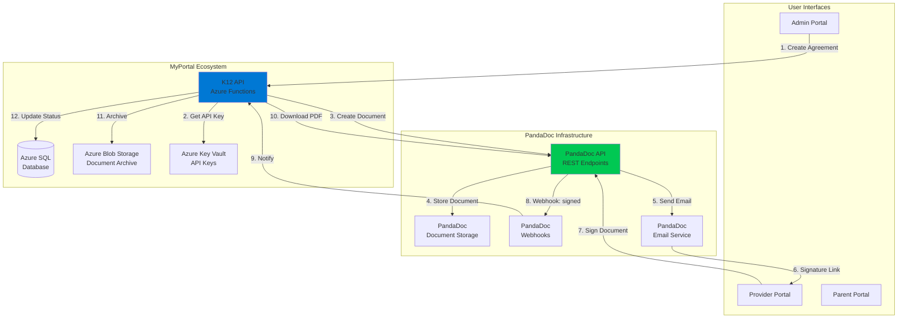
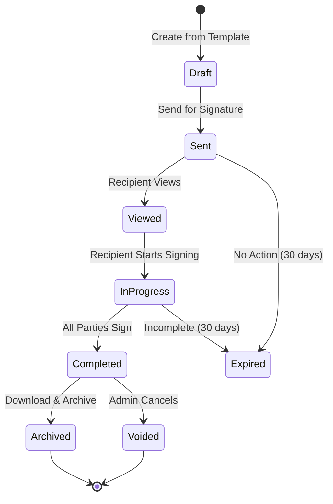
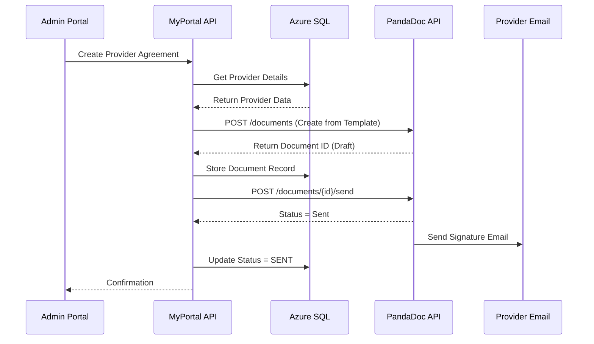
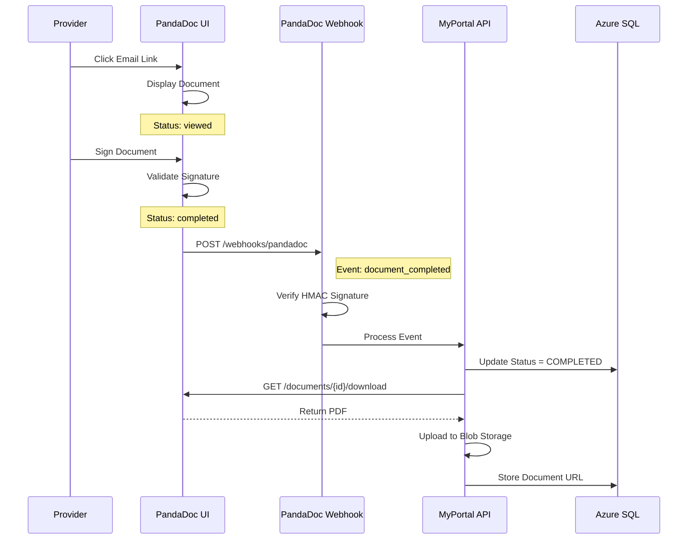
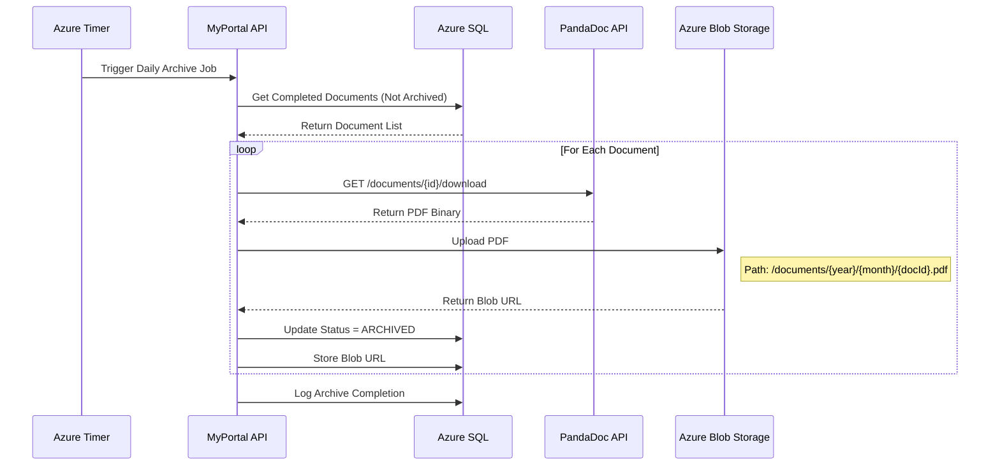
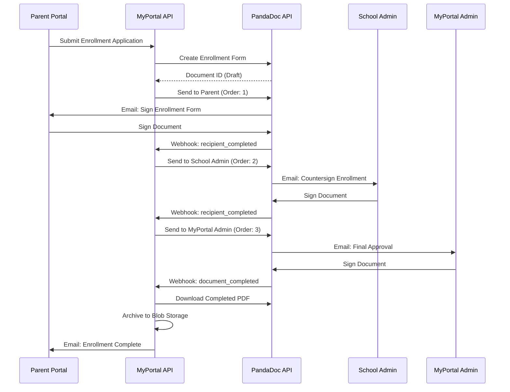

# INT-02: PandaDoc Integration

**Integration ID:** INT-02
**System:** PandaDoc Document Generation & E-Signature
**Type:** External REST API
**Classification:** Business Critical
**Status:** Active (Production)
**Last Updated:** 2025-01-15

## Table of Contents

- [Overview](#overview)
- [Integration Architecture](#integration-architecture)
- [API Specifications](#api-specifications)
- [Data Flow](#data-flow)
- [Implementation](#implementation)
- [Error Handling](#error-handling)
- [Security](#security)
- [Monitoring & Logging](#monitoring--logging)
- [Testing Strategy](#testing-strategy)
- [Common Issues & Troubleshooting](#common-issues--troubleshooting)
- [References](#references)

---

## Overview

### Purpose

PandaDoc is the **document generation and electronic signature platform** for the NC SEAA K-12 Scholarship Management System. It handles all legal document workflows including:

- **Provider Agreements**: Contracts between MyPortal and education service providers
- **School Contracts**: Agreements with participating private schools
- **Enrollment Forms**: Student enrollment documents with parent signatures
- **Award Letters**: Official scholarship award notifications
- **Compliance Documents**: Required state and federal forms
- **Template Management**: Centralized document template library
- **E-Signature Workflow**: Multi-party signature collection and tracking
- **Document Storage**: Secure storage of completed, signed documents
- **Audit Trail**: Complete history of document views, edits, and signatures

### Business Context

PandaDoc enables MyPortal to:

1. **Automate Document Generation**: Merge student/provider data into templates
2. **Streamline Signatures**: Collect electronic signatures from multiple parties
3. **Ensure Compliance**: Maintain legally binding audit trails (ESIGN Act compliant)
4. **Reduce Manual Work**: Eliminate paper-based processes
5. **Track Document Status**: Real-time visibility into signature workflow
6. **Version Control**: Maintain document versions and revision history

### Integration Scope

| Feature | MyPortal Responsibility | PandaDoc Responsibility |
|---------|------------------------|-------------------------|
| Template Design | Define data fields and layout | Render PDF with styling |
| Data Population | Provide merge data from database | Merge data into templates |
| Document Creation | Trigger document generation API | Create document instance |
| Signature Workflow | Define signer roles and order | Send emails, collect signatures |
| Status Tracking | Poll for status updates | Send webhook notifications |
| Document Download | Download completed PDFs | Store signed documents |
| Audit Trail | Display in MyPortal UI | Maintain detailed audit log |

### Key Metrics

- **Document Volume**: ~8,000 documents per academic year
- **Average Signature Time**: 2.3 days
- **Template Library**: 15 active templates
- **API Call Volume**: ~25,000 calls/month (300 req/min peak)
- **SLA Requirements**: 99.5% uptime, <3s response time
- **Storage**: 120 GB of signed documents annually

---

## Integration Architecture

### High-Level Architecture



### Component Responsibilities

#### MyPortal API Layer
- **API/Functions/PandaDocFunctions.cs**: Azure Function HTTP triggers
- **Application/Services/PandaDocService.cs**: Business logic for document operations
- **Infrastructure/HttpClients/PandaDocClient.cs**: HTTP client with resilience policies
- **Domain/Entities/Document.cs**: Domain model for documents

#### PandaDoc API Layer
- **Base URL (Production)**: `https://api.pandadoc.com/public/v1`
- **Authentication**: API Key in `Authorization` header
- **Rate Limits**: 60 requests/minute per API key (burst: 100)

### Document Lifecycle



### Data Synchronization Strategy

| Data Type | Sync Frequency | Cache Duration | Source of Truth |
|-----------|---------------|----------------|-----------------|
| Document Status | Webhook + 15-min poll | Real-time | PandaDoc |
| Template List | Daily batch | 24 hours | PandaDoc |
| Completed Documents | Immediate download | Permanent (Blob) | MyPortal |
| Audit Logs | On-demand | None | PandaDoc |

---

## API Specifications

### Authentication

PandaDoc uses **API Key authentication** with Bearer token.

#### API Key Configuration

```http
GET https://api.pandadoc.com/public/v1/documents
Authorization: API-Key {YOUR_API_KEY}
Content-Type: application/json
```

**Key Rotation:**
- Production key: Rotate every 90 days
- Sandbox key: Rotate every 180 days

### API Endpoints

#### 1. List Templates

**Endpoint:** `GET /public/v1/templates`

**Purpose:** Retrieve available document templates.

**Query Parameters:**
- `tag`: Filter by tag (e.g., `provider-agreement`, `enrollment-form`)
- `count`: Number of results (default: 50, max: 100)
- `page`: Page number

**Response (200 OK):**

```json
{
  "count": 15,
  "results": [
    {
      "id": "tmpl-provider-agreement-v3",
      "name": "Provider Agreement v3.0",
      "date_created": "2024-08-15T10:00:00Z",
      "date_modified": "2024-09-01T14:30:00Z",
      "version": "3.0",
      "tags": ["provider-agreement", "legal"],
      "fields": [
        {
          "name": "provider_name",
          "type": "text",
          "required": true
        },
        {
          "name": "provider_address",
          "type": "text",
          "required": true
        },
        {
          "name": "service_category",
          "type": "dropdown",
          "options": ["Tutoring", "Curriculum", "Therapy"],
          "required": true
        },
        {
          "name": "effective_date",
          "type": "date",
          "required": true
        }
      ]
    }
  ]
}
```

#### 2. Create Document from Template

**Endpoint:** `POST /public/v1/documents`

**Purpose:** Generate a new document from a template with merged data.

**Request:**

```json
{
  "name": "Provider Agreement - ABC Tutoring Services",
  "template_uuid": "tmpl-provider-agreement-v3",
  "folder_uuid": "fldr-providers-2024",
  "recipients": [
    {
      "email": "admin@myportal.nc.gov",
      "first_name": "System",
      "last_name": "Administrator",
      "role": "MyPortal Admin",
      "signing_order": 1
    },
    {
      "email": "owner@abctutoring.com",
      "first_name": "Jane",
      "last_name": "Smith",
      "role": "Provider Owner",
      "signing_order": 2
    }
  ],
  "fields": {
    "provider_name": {
      "value": "ABC Tutoring Services LLC"
    },
    "provider_tax_id": {
      "value": "XX-XXXXXXX"
    },
    "provider_address": {
      "value": "123 Main St, Raleigh, NC 27601"
    },
    "service_category": {
      "value": "Tutoring"
    },
    "effective_date": {
      "value": "2024-09-15"
    },
    "contract_term": {
      "value": "One Academic Year (2024-2025)"
    },
    "payment_terms": {
      "value": "Net 15 days after invoice approval"
    }
  },
  "tokens": [
    {
      "name": "provider_id",
      "value": "PRV-2024-000123"
    },
    {
      "name": "contract_id",
      "value": "CNTR-2024-000456"
    }
  ],
  "metadata": {
    "application_id": "APP-2024-001234",
    "provider_id": "PRV-2024-000123",
    "created_by": "admin@myportal.nc.gov",
    "environment": "production"
  },
  "tags": ["provider-agreement", "2024-2025"],
  "parse_form_fields": true
}
```

**Response (201 Created):**

```json
{
  "id": "doc-abc123def456ghi789",
  "name": "Provider Agreement - ABC Tutoring Services",
  "status": "document.draft",
  "date_created": "2024-11-15T14:30:00Z",
  "date_modified": "2024-11-15T14:30:00Z",
  "expiration_date": "2024-12-15T14:30:00Z",
  "version": 1,
  "uuid": "doc-abc123def456ghi789"
}
```

#### 3. Send Document for Signature

**Endpoint:** `POST /public/v1/documents/{document_id}/send`

**Purpose:** Send document to recipients for signature.

**Request:**

```json
{
  "message": "Please review and sign the Provider Agreement for the 2024-2025 academic year.",
  "subject": "Provider Agreement - Signature Required",
  "silent": false,
  "sender": {
    "email": "noreply@myportal.nc.gov",
    "first_name": "MyPortal",
    "last_name": "System"
  }
}
```

**Response (200 OK):**

```json
{
  "id": "doc-abc123def456ghi789",
  "status": "document.sent",
  "date_sent": "2024-11-15T14:35:00Z",
  "expiration_date": "2024-12-15T14:35:00Z"
}
```

#### 4. Get Document Status

**Endpoint:** `GET /public/v1/documents/{document_id}`

**Response (200 OK):**

```json
{
  "id": "doc-abc123def456ghi789",
  "name": "Provider Agreement - ABC Tutoring Services",
  "status": "document.completed",
  "date_created": "2024-11-15T14:30:00Z",
  "date_modified": "2024-11-17T10:15:00Z",
  "date_completed": "2024-11-17T10:15:00Z",
  "version": 1,
  "recipients": [
    {
      "email": "admin@myportal.nc.gov",
      "first_name": "System",
      "last_name": "Administrator",
      "role": "MyPortal Admin",
      "has_completed": true,
      "completed_at": "2024-11-16T09:00:00Z"
    },
    {
      "email": "owner@abctutoring.com",
      "first_name": "Jane",
      "last_name": "Smith",
      "role": "Provider Owner",
      "has_completed": true,
      "completed_at": "2024-11-17T10:15:00Z"
    }
  ],
  "metadata": {
    "provider_id": "PRV-2024-000123",
    "contract_id": "CNTR-2024-000456"
  }
}
```

**Status Values:**
- `document.draft`: Created, not sent
- `document.sent`: Sent to recipients
- `document.viewed`: At least one recipient viewed
- `document.waiting_approval`: Awaiting approval step
- `document.approved`: Approved, pending signatures
- `document.completed`: All parties signed
- `document.voided`: Cancelled by admin
- `document.declined`: Declined by recipient
- `document.expired`: Expiration date passed

#### 5. Download Completed Document

**Endpoint:** `GET /public/v1/documents/{document_id}/download`

**Purpose:** Download signed PDF document.

**Response (200 OK):**

```
Content-Type: application/pdf
Content-Disposition: attachment; filename="Provider_Agreement_ABC_Tutoring_signed.pdf"

[PDF Binary Data]
```

#### 6. Get Document Details

**Endpoint:** `GET /public/v1/documents/{document_id}/details`

**Purpose:** Get detailed information including field values and audit trail.

**Response (200 OK):**

```json
{
  "id": "doc-abc123def456ghi789",
  "name": "Provider Agreement - ABC Tutoring Services",
  "status": "document.completed",
  "fields": [
    {
      "name": "provider_name",
      "value": "ABC Tutoring Services LLC",
      "type": "text"
    },
    {
      "name": "service_category",
      "value": "Tutoring",
      "type": "dropdown"
    }
  ],
  "audit_trail": [
    {
      "event": "document_created",
      "timestamp": "2024-11-15T14:30:00Z",
      "user": "admin@myportal.nc.gov"
    },
    {
      "event": "document_sent",
      "timestamp": "2024-11-15T14:35:00Z",
      "user": "system"
    },
    {
      "event": "document_viewed",
      "timestamp": "2024-11-16T08:45:00Z",
      "user": "admin@myportal.nc.gov",
      "ip_address": "192.168.1.100"
    },
    {
      "event": "document_signed",
      "timestamp": "2024-11-16T09:00:00Z",
      "user": "admin@myportal.nc.gov",
      "ip_address": "192.168.1.100"
    },
    {
      "event": "document_viewed",
      "timestamp": "2024-11-17T09:30:00Z",
      "user": "owner@abctutoring.com",
      "ip_address": "72.45.123.89"
    },
    {
      "event": "document_signed",
      "timestamp": "2024-11-17T10:15:00Z",
      "user": "owner@abctutoring.com",
      "ip_address": "72.45.123.89"
    },
    {
      "event": "document_completed",
      "timestamp": "2024-11-17T10:15:00Z",
      "user": "system"
    }
  ]
}
```

#### 7. Void Document

**Endpoint:** `POST /public/v1/documents/{document_id}/void`

**Purpose:** Cancel a document and void all signatures.

**Request:**

```json
{
  "reason": "Contract terms changed, new version required"
}
```

**Response (200 OK):**

```json
{
  "id": "doc-abc123def456ghi789",
  "status": "document.voided",
  "date_voided": "2024-11-15T15:00:00Z"
}
```

### Webhook Notifications

PandaDoc sends **webhook notifications** for document events.

#### Webhook Configuration

**MyPortal Webhook Endpoint:** `https://k12-api.myportal.nc.gov/api/webhooks/pandadoc`

**Authentication:** Shared secret in `X-PandaDoc-Signature` header (HMAC-SHA256)

**Events:**
- `document_state_changed`: Status changed (sent, viewed, completed, etc.)
- `recipient_completed`: Individual recipient completed signing
- `document_completed`: All signatures collected
- `document_voided`: Document cancelled

#### Webhook Payload Example

```json
{
  "uuid": "webhook-event-123456",
  "event": "document_state_changed",
  "data": {
    "id": "doc-abc123def456ghi789",
    "status": "document.completed",
    "name": "Provider Agreement - ABC Tutoring Services",
    "date_completed": "2024-11-17T10:15:00Z",
    "metadata": {
      "provider_id": "PRV-2024-000123",
      "contract_id": "CNTR-2024-000456"
    }
  },
  "timestamp": "2024-11-17T10:15:05Z"
}
```

#### Webhook Signature Verification

```csharp
public static bool VerifyWebhookSignature(string payload, string signature, string secret)
{
    using var hmac = new HMACSHA256(Encoding.UTF8.GetBytes(secret));
    var hash = hmac.ComputeHash(Encoding.UTF8.GetBytes(payload));
    var expectedSignature = Convert.ToBase64String(hash);

    return signature.Equals(expectedSignature, StringComparison.Ordinal);
}
```

---

## Data Flow

### 1. Provider Agreement Creation Flow



### 2. E-Signature Collection Flow



### 3. Document Download and Archive Flow



### 4. Enrollment Form Multi-Party Signature Flow



---

## Implementation

### C# Implementation with Azure Functions

#### 1. PandaDoc HTTP Client Configuration

**File:** `Infrastructure/HttpClients/PandaDocClient.cs`

```csharp
using System;
using System.IO;
using System.Net.Http;
using System.Net.Http.Headers;
using System.Text;
using System.Text.Json;
using System.Threading.Tasks;
using Microsoft.Extensions.Configuration;
using Microsoft.Extensions.Logging;
using Polly;
using Polly.CircuitBreaker;
using Polly.Retry;

namespace K12.Infrastructure.HttpClients
{
    public class PandaDocClient : IPandaDocClient
    {
        private readonly HttpClient _httpClient;
        private readonly IConfiguration _configuration;
        private readonly ILogger<PandaDocClient> _logger;
        private readonly AsyncRetryPolicy<HttpResponseMessage> _retryPolicy;
        private readonly AsyncCircuitBreakerPolicy<HttpResponseMessage> _circuitBreakerPolicy;

        public PandaDocClient(
            HttpClient httpClient,
            IConfiguration configuration,
            ILogger<PandaDocClient> logger)
        {
            _httpClient = httpClient;
            _configuration = configuration;
            _logger = logger;

            var baseUrl = _configuration["PandaDoc:BaseUrl"];
            var apiKey = _configuration["PandaDoc:ApiKey"];

            _httpClient.BaseAddress = new Uri(baseUrl);
            _httpClient.DefaultRequestHeaders.Add("Authorization", $"API-Key {apiKey}");
            _httpClient.DefaultRequestHeaders.Accept.Add(
                new MediaTypeWithQualityHeaderValue("application/json"));

            _retryPolicy = BuildRetryPolicy();
            _circuitBreakerPolicy = BuildCircuitBreakerPolicy();
        }

        private AsyncRetryPolicy<HttpResponseMessage> BuildRetryPolicy()
        {
            return Policy
                .HandleResult<HttpResponseMessage>(r =>
                    (int)r.StatusCode >= 500 ||
                    r.StatusCode == System.Net.HttpStatusCode.RequestTimeout ||
                    r.StatusCode == System.Net.HttpStatusCode.TooManyRequests)
                .WaitAndRetryAsync(
                    retryCount: 3,
                    sleepDurationProvider: retryAttempt =>
                        TimeSpan.FromSeconds(Math.Pow(2, retryAttempt)),
                    onRetry: (outcome, timespan, retryCount, context) =>
                    {
                        _logger.LogWarning(
                            "PandaDoc API retry {RetryCount} after {Delay}ms",
                            retryCount,
                            timespan.TotalMilliseconds);
                    });
        }

        private AsyncCircuitBreakerPolicy<HttpResponseMessage> BuildCircuitBreakerPolicy()
        {
            return Policy
                .HandleResult<HttpResponseMessage>(r => (int)r.StatusCode >= 500)
                .CircuitBreakerAsync(
                    handledEventsAllowedBeforeBreaking: 5,
                    durationOfBreak: TimeSpan.FromMinutes(1),
                    onBreak: (outcome, duration) =>
                    {
                        _logger.LogError("PandaDoc circuit breaker opened");
                    },
                    onReset: () =>
                    {
                        _logger.LogInformation("PandaDoc circuit breaker reset");
                    });
        }

        /// <summary>
        /// List available templates
        /// </summary>
        public async Task<TemplateListResponse> ListTemplatesAsync(string tag = null)
        {
            var url = "/public/v1/templates";
            if (!string.IsNullOrEmpty(tag))
                url += $"?tag={tag}";

            var policy = Policy.WrapAsync(_retryPolicy, _circuitBreakerPolicy);

            var response = await policy.ExecuteAsync(async () =>
                await _httpClient.GetAsync(url));

            response.EnsureSuccessStatusCode();

            return await JsonSerializer.DeserializeAsync<TemplateListResponse>(
                await response.Content.ReadAsStreamAsync());
        }

        /// <summary>
        /// Create document from template
        /// </summary>
        public async Task<CreateDocumentResponse> CreateDocumentAsync(CreateDocumentRequest request)
        {
            var content = new StringContent(
                JsonSerializer.Serialize(request),
                Encoding.UTF8,
                "application/json");

            var policy = Policy.WrapAsync(_retryPolicy, _circuitBreakerPolicy);

            var response = await policy.ExecuteAsync(async () =>
                await _httpClient.PostAsync("/public/v1/documents", content));

            if (!response.IsSuccessStatusCode)
            {
                var errorContent = await response.Content.ReadAsStringAsync();
                _logger.LogError(
                    "PandaDoc CreateDocument failed: {StatusCode} - {Error}",
                    response.StatusCode,
                    errorContent);
            }

            response.EnsureSuccessStatusCode();

            return await JsonSerializer.DeserializeAsync<CreateDocumentResponse>(
                await response.Content.ReadAsStreamAsync());
        }

        /// <summary>
        /// Send document for signature
        /// </summary>
        public async Task<SendDocumentResponse> SendDocumentAsync(
            string documentId,
            SendDocumentRequest request)
        {
            var content = new StringContent(
                JsonSerializer.Serialize(request),
                Encoding.UTF8,
                "application/json");

            var policy = Policy.WrapAsync(_retryPolicy, _circuitBreakerPolicy);

            var response = await policy.ExecuteAsync(async () =>
                await _httpClient.PostAsync(
                    $"/public/v1/documents/{documentId}/send",
                    content));

            response.EnsureSuccessStatusCode();

            return await JsonSerializer.DeserializeAsync<SendDocumentResponse>(
                await response.Content.ReadAsStreamAsync());
        }

        /// <summary>
        /// Get document status
        /// </summary>
        public async Task<DocumentStatusResponse> GetDocumentStatusAsync(string documentId)
        {
            var policy = Policy.WrapAsync(_retryPolicy, _circuitBreakerPolicy);

            var response = await policy.ExecuteAsync(async () =>
                await _httpClient.GetAsync($"/public/v1/documents/{documentId}"));

            response.EnsureSuccessStatusCode();

            return await JsonSerializer.DeserializeAsync<DocumentStatusResponse>(
                await response.Content.ReadAsStreamAsync());
        }

        /// <summary>
        /// Get document details including field values and audit trail
        /// </summary>
        public async Task<DocumentDetailsResponse> GetDocumentDetailsAsync(string documentId)
        {
            var policy = Policy.WrapAsync(_retryPolicy, _circuitBreakerPolicy);

            var response = await policy.ExecuteAsync(async () =>
                await _httpClient.GetAsync($"/public/v1/documents/{documentId}/details"));

            response.EnsureSuccessStatusCode();

            return await JsonSerializer.DeserializeAsync<DocumentDetailsResponse>(
                await response.Content.ReadAsStreamAsync());
        }

        /// <summary>
        /// Download completed document as PDF
        /// </summary>
        public async Task<byte[]> DownloadDocumentAsync(string documentId)
        {
            var policy = Policy.WrapAsync(_retryPolicy, _circuitBreakerPolicy);

            var response = await policy.ExecuteAsync(async () =>
                await _httpClient.GetAsync($"/public/v1/documents/{documentId}/download"));

            response.EnsureSuccessStatusCode();

            return await response.Content.ReadAsByteArrayAsync();
        }

        /// <summary>
        /// Void document
        /// </summary>
        public async Task<VoidDocumentResponse> VoidDocumentAsync(
            string documentId,
            string reason)
        {
            var request = new { reason };
            var content = new StringContent(
                JsonSerializer.Serialize(request),
                Encoding.UTF8,
                "application/json");

            var policy = Policy.WrapAsync(_retryPolicy, _circuitBreakerPolicy);

            var response = await policy.ExecuteAsync(async () =>
                await _httpClient.PostAsync(
                    $"/public/v1/documents/{documentId}/void",
                    content));

            response.EnsureSuccessStatusCode();

            return await JsonSerializer.DeserializeAsync<VoidDocumentResponse>(
                await response.Content.ReadAsStreamAsync());
        }
    }

    // DTOs

    public class CreateDocumentRequest
    {
        [JsonPropertyName("name")]
        public string Name { get; set; }

        [JsonPropertyName("template_uuid")]
        public string TemplateUuid { get; set; }

        [JsonPropertyName("folder_uuid")]
        public string FolderUuid { get; set; }

        [JsonPropertyName("recipients")]
        public List<Recipient> Recipients { get; set; }

        [JsonPropertyName("fields")]
        public Dictionary<string, FieldValue> Fields { get; set; }

        [JsonPropertyName("tokens")]
        public List<Token> Tokens { get; set; }

        [JsonPropertyName("metadata")]
        public Dictionary<string, string> Metadata { get; set; }

        [JsonPropertyName("tags")]
        public List<string> Tags { get; set; }

        [JsonPropertyName("parse_form_fields")]
        public bool ParseFormFields { get; set; } = true;
    }

    public class Recipient
    {
        [JsonPropertyName("email")]
        public string Email { get; set; }

        [JsonPropertyName("first_name")]
        public string FirstName { get; set; }

        [JsonPropertyName("last_name")]
        public string LastName { get; set; }

        [JsonPropertyName("role")]
        public string Role { get; set; }

        [JsonPropertyName("signing_order")]
        public int SigningOrder { get; set; }
    }

    public class FieldValue
    {
        [JsonPropertyName("value")]
        public string Value { get; set; }
    }

    public class Token
    {
        [JsonPropertyName("name")]
        public string Name { get; set; }

        [JsonPropertyName("value")]
        public string Value { get; set; }
    }

    public class CreateDocumentResponse
    {
        [JsonPropertyName("id")]
        public string Id { get; set; }

        [JsonPropertyName("name")]
        public string Name { get; set; }

        [JsonPropertyName("status")]
        public string Status { get; set; }

        [JsonPropertyName("date_created")]
        public DateTime DateCreated { get; set; }

        [JsonPropertyName("uuid")]
        public string Uuid { get; set; }
    }

    public class SendDocumentRequest
    {
        [JsonPropertyName("message")]
        public string Message { get; set; }

        [JsonPropertyName("subject")]
        public string Subject { get; set; }

        [JsonPropertyName("silent")]
        public bool Silent { get; set; }

        [JsonPropertyName("sender")]
        public Sender Sender { get; set; }
    }

    public class Sender
    {
        [JsonPropertyName("email")]
        public string Email { get; set; }

        [JsonPropertyName("first_name")]
        public string FirstName { get; set; }

        [JsonPropertyName("last_name")]
        public string LastName { get; set; }
    }

    public class SendDocumentResponse
    {
        [JsonPropertyName("id")]
        public string Id { get; set; }

        [JsonPropertyName("status")]
        public string Status { get; set; }

        [JsonPropertyName("date_sent")]
        public DateTime DateSent { get; set; }
    }

    public class DocumentStatusResponse
    {
        [JsonPropertyName("id")]
        public string Id { get; set; }

        [JsonPropertyName("name")]
        public string Name { get; set; }

        [JsonPropertyName("status")]
        public string Status { get; set; }

        [JsonPropertyName("date_created")]
        public DateTime DateCreated { get; set; }

        [JsonPropertyName("date_modified")]
        public DateTime DateModified { get; set; }

        [JsonPropertyName("date_completed")]
        public DateTime? DateCompleted { get; set; }

        [JsonPropertyName("recipients")]
        public List<RecipientStatus> Recipients { get; set; }

        [JsonPropertyName("metadata")]
        public Dictionary<string, string> Metadata { get; set; }
    }

    public class RecipientStatus
    {
        [JsonPropertyName("email")]
        public string Email { get; set; }

        [JsonPropertyName("first_name")]
        public string FirstName { get; set; }

        [JsonPropertyName("last_name")]
        public string LastName { get; set; }

        [JsonPropertyName("role")]
        public string Role { get; set; }

        [JsonPropertyName("has_completed")]
        public bool HasCompleted { get; set; }

        [JsonPropertyName("completed_at")]
        public DateTime? CompletedAt { get; set; }
    }
}
```

#### 2. Application Service Layer

**File:** `Application/Services/PandaDocService.cs`

```csharp
using System;
using System.Threading.Tasks;
using Azure.Storage.Blobs;
using K12.Domain.Entities;
using K12.Domain.Repositories;
using K12.Infrastructure.HttpClients;
using Microsoft.Extensions.Configuration;
using Microsoft.Extensions.Logging;

namespace K12.Application.Services
{
    public class PandaDocService : IPandaDocService
    {
        private readonly IPandaDocClient _pandaDocClient;
        private readonly IDocumentRepository _documentRepository;
        private readonly IProviderRepository _providerRepository;
        private readonly BlobServiceClient _blobServiceClient;
        private readonly IConfiguration _configuration;
        private readonly ILogger<PandaDocService> _logger;

        public PandaDocService(
            IPandaDocClient pandaDocClient,
            IDocumentRepository documentRepository,
            IProviderRepository providerRepository,
            BlobServiceClient blobServiceClient,
            IConfiguration configuration,
            ILogger<PandaDocService> logger)
        {
            _pandaDocClient = pandaDocClient;
            _documentRepository = documentRepository;
            _providerRepository = providerRepository;
            _blobServiceClient = blobServiceClient;
            _configuration = configuration;
            _logger = logger;
        }

        /// <summary>
        /// Create provider agreement from template
        /// </summary>
        public async Task<Document> CreateProviderAgreementAsync(int providerId)
        {
            var provider = await _providerRepository.GetByIdAsync(providerId);

            if (provider == null)
                throw new InvalidOperationException($"Provider {providerId} not found");

            _logger.LogInformation(
                "Creating provider agreement for Provider {ProviderId}",
                providerId);

            var templateId = _configuration["PandaDoc:Templates:ProviderAgreement"];

            var request = new CreateDocumentRequest
            {
                Name = $"Provider Agreement - {provider.OrganizationName}",
                TemplateUuid = templateId,
                FolderUuid = _configuration["PandaDoc:Folders:Providers"],
                Recipients = new List<Recipient>
                {
                    new Recipient
                    {
                        Email = "admin@myportal.nc.gov",
                        FirstName = "System",
                        LastName = "Administrator",
                        Role = "MyPortal Admin",
                        SigningOrder = 1
                    },
                    new Recipient
                    {
                        Email = provider.PrimaryContact.Email,
                        FirstName = provider.PrimaryContact.FirstName,
                        LastName = provider.PrimaryContact.LastName,
                        Role = "Provider Owner",
                        SigningOrder = 2
                    }
                },
                Fields = new Dictionary<string, FieldValue>
                {
                    ["provider_name"] = new FieldValue { Value = provider.OrganizationName },
                    ["provider_tax_id"] = new FieldValue { Value = provider.TaxId },
                    ["provider_address"] = new FieldValue { Value = provider.Address.ToFullAddress() },
                    ["service_category"] = new FieldValue { Value = provider.ServiceCategory },
                    ["effective_date"] = new FieldValue { Value = DateTime.UtcNow.ToString("yyyy-MM-dd") },
                    ["contract_term"] = new FieldValue { Value = "One Academic Year" }
                },
                Metadata = new Dictionary<string, string>
                {
                    ["provider_id"] = provider.ProviderId.ToString(),
                    ["document_type"] = "provider_agreement",
                    ["created_by"] = "system"
                },
                Tags = new List<string> { "provider-agreement", "2024-2025" }
            };

            try
            {
                var response = await _pandaDocClient.CreateDocumentAsync(request);

                // Store document record in database
                var document = new Document
                {
                    DocumentType = DocumentType.ProviderAgreement,
                    ProviderId = providerId,
                    PandaDocDocumentId = response.Id,
                    DocumentName = response.Name,
                    Status = DocumentStatus.Draft,
                    CreatedAt = response.DateCreated,
                    CreatedBy = "system"
                };

                await _documentRepository.CreateAsync(document);

                _logger.LogInformation(
                    "Created PandaDoc document {DocumentId} for Provider {ProviderId}",
                    response.Id,
                    providerId);

                return document;
            }
            catch (Exception ex)
            {
                _logger.LogError(
                    ex,
                    "Failed to create provider agreement for Provider {ProviderId}",
                    providerId);
                throw;
            }
        }

        /// <summary>
        /// Send document for signature
        /// </summary>
        public async Task SendDocumentAsync(int documentId)
        {
            var document = await _documentRepository.GetByIdAsync(documentId);

            if (document == null)
                throw new InvalidOperationException($"Document {documentId} not found");

            if (document.Status != DocumentStatus.Draft)
                throw new InvalidOperationException($"Document {documentId} is not in draft status");

            _logger.LogInformation("Sending document {DocumentId} for signature", documentId);

            var request = new SendDocumentRequest
            {
                Subject = $"{document.DocumentName} - Signature Required",
                Message = "Please review and sign this document at your earliest convenience.",
                Silent = false,
                Sender = new Sender
                {
                    Email = "noreply@myportal.nc.gov",
                    FirstName = "MyPortal",
                    LastName = "System"
                }
            };

            try
            {
                var response = await _pandaDocClient.SendDocumentAsync(
                    document.PandaDocDocumentId,
                    request);

                document.Status = DocumentStatus.Sent;
                document.SentAt = response.DateSent;
                await _documentRepository.UpdateAsync(document);

                _logger.LogInformation(
                    "Sent document {DocumentId} for signature",
                    documentId);
            }
            catch (Exception ex)
            {
                _logger.LogError(ex, "Failed to send document {DocumentId}", documentId);
                throw;
            }
        }

        /// <summary>
        /// Download and archive completed document
        /// </summary>
        public async Task ArchiveCompletedDocumentAsync(int documentId)
        {
            var document = await _documentRepository.GetByIdAsync(documentId);

            if (document == null)
                throw new InvalidOperationException($"Document {documentId} not found");

            if (document.Status != DocumentStatus.Completed)
                throw new InvalidOperationException($"Document {documentId} is not completed");

            _logger.LogInformation("Archiving completed document {DocumentId}", documentId);

            try
            {
                // Download PDF from PandaDoc
                var pdfBytes = await _pandaDocClient.DownloadDocumentAsync(
                    document.PandaDocDocumentId);

                // Upload to Azure Blob Storage
                var containerClient = _blobServiceClient.GetBlobContainerClient("documents");
                await containerClient.CreateIfNotExistsAsync();

                var blobName = $"{DateTime.UtcNow:yyyy}/{DateTime.UtcNow:MM}/{document.PandaDocDocumentId}.pdf";
                var blobClient = containerClient.GetBlobClient(blobName);

                using var stream = new MemoryStream(pdfBytes);
                await blobClient.UploadAsync(stream, overwrite: true);

                // Update document record
                document.Status = DocumentStatus.Archived;
                document.ArchivedAt = DateTime.UtcNow;
                document.BlobUrl = blobClient.Uri.ToString();
                document.FileSize = pdfBytes.Length;

                await _documentRepository.UpdateAsync(document);

                _logger.LogInformation(
                    "Archived document {DocumentId} to {BlobUrl}",
                    documentId,
                    document.BlobUrl);
            }
            catch (Exception ex)
            {
                _logger.LogError(ex, "Failed to archive document {DocumentId}", documentId);
                throw;
            }
        }

        /// <summary>
        /// Sync document status from PandaDoc
        /// </summary>
        public async Task SyncDocumentStatusAsync(int documentId)
        {
            var document = await _documentRepository.GetByIdAsync(documentId);

            if (document == null)
                throw new InvalidOperationException($"Document {documentId} not found");

            var status = await _pandaDocClient.GetDocumentStatusAsync(
                document.PandaDocDocumentId);

            var mappedStatus = MapPandaDocStatus(status.Status);

            if (document.Status != mappedStatus)
            {
                document.Status = mappedStatus;
                document.LastModifiedAt = status.DateModified;

                if (mappedStatus == DocumentStatus.Completed && status.DateCompleted.HasValue)
                {
                    document.CompletedAt = status.DateCompleted.Value;
                }

                await _documentRepository.UpdateAsync(document);

                _logger.LogInformation(
                    "Updated document {DocumentId} status: {OldStatus} -> {NewStatus}",
                    documentId,
                    document.Status,
                    mappedStatus);
            }
        }

        private DocumentStatus MapPandaDocStatus(string pandaDocStatus)
        {
            return pandaDocStatus switch
            {
                "document.draft" => DocumentStatus.Draft,
                "document.sent" => DocumentStatus.Sent,
                "document.viewed" => DocumentStatus.Viewed,
                "document.completed" => DocumentStatus.Completed,
                "document.voided" => DocumentStatus.Voided,
                "document.declined" => DocumentStatus.Declined,
                "document.expired" => DocumentStatus.Expired,
                _ => DocumentStatus.Unknown
            };
        }
    }
}
```

#### 3. Azure Function HTTP Triggers

**File:** `API/Functions/PandaDocFunctions.cs`

```csharp
using System;
using System.IO;
using System.Net;
using System.Security.Cryptography;
using System.Text;
using System.Text.Json;
using System.Threading.Tasks;
using K12.Application.Services;
using Microsoft.Azure.Functions.Worker;
using Microsoft.Azure.Functions.Worker.Http;
using Microsoft.Extensions.Configuration;
using Microsoft.Extensions.Logging;

namespace K12.API.Functions
{
    public class PandaDocFunctions
    {
        private readonly IPandaDocService _pandaDocService;
        private readonly IConfiguration _configuration;
        private readonly ILogger<PandaDocFunctions> _logger;

        public PandaDocFunctions(
            IPandaDocService pandaDocService,
            IConfiguration configuration,
            ILogger<PandaDocFunctions> logger)
        {
            _pandaDocService = pandaDocService;
            _configuration = configuration;
            _logger = logger;
        }

        /// <summary>
        /// Create provider agreement
        /// POST /api/pandadoc/provider-agreements/{providerId}
        /// </summary>
        [Function("CreateProviderAgreement")]
        public async Task<HttpResponseData> CreateProviderAgreement(
            [HttpTrigger(AuthorizationLevel.Function, "post",
                Route = "pandadoc/provider-agreements/{providerId}")]
            HttpRequestData req,
            int providerId)
        {
            try
            {
                var document = await _pandaDocService.CreateProviderAgreementAsync(providerId);

                var response = req.CreateResponse(HttpStatusCode.Created);
                await response.WriteAsJsonAsync(document);
                return response;
            }
            catch (Exception ex)
            {
                _logger.LogError(ex, "Error creating provider agreement");
                var response = req.CreateResponse(HttpStatusCode.InternalServerError);
                await response.WriteAsJsonAsync(new { error = ex.Message });
                return response;
            }
        }

        /// <summary>
        /// Webhook endpoint for PandaDoc notifications
        /// POST /api/webhooks/pandadoc
        /// </summary>
        [Function("PandaDocWebhook")]
        public async Task<HttpResponseData> PandaDocWebhook(
            [HttpTrigger(AuthorizationLevel.Function, "post",
                Route = "webhooks/pandadoc")]
            HttpRequestData req)
        {
            try
            {
                // Read request body
                using var reader = new StreamReader(req.Body);
                var payload = await reader.ReadToEndAsync();

                // Verify HMAC signature
                var signature = req.Headers.GetValues("X-PandaDoc-Signature").FirstOrDefault();
                var webhookSecret = _configuration["PandaDoc:WebhookSecret"];

                if (!VerifySignature(payload, signature, webhookSecret))
                {
                    _logger.LogWarning("Invalid PandaDoc webhook signature");
                    return req.CreateResponse(HttpStatusCode.Unauthorized);
                }

                // Parse webhook payload
                var webhookEvent = JsonSerializer.Deserialize<PandaDocWebhookEvent>(payload);

                _logger.LogInformation(
                    "Received PandaDoc webhook: {Event}, Document: {DocumentId}",
                    webhookEvent.Event,
                    webhookEvent.Data.Id);

                // Process event based on type
                await ProcessWebhookEventAsync(webhookEvent);

                return req.CreateResponse(HttpStatusCode.OK);
            }
            catch (Exception ex)
            {
                _logger.LogError(ex, "Error processing PandaDoc webhook");
                return req.CreateResponse(HttpStatusCode.InternalServerError);
            }
        }

        /// <summary>
        /// Timer trigger: Archive completed documents daily
        /// </summary>
        [Function("ArchiveCompletedDocuments")]
        public async Task ArchiveCompletedDocuments(
            [TimerTrigger("0 0 3 * * *")] TimerInfo timer,
            FunctionContext context)
        {
            var logger = context.GetLogger("ArchiveCompletedDocuments");
            logger.LogInformation("Starting daily document archive job");

            // Implementation: Query completed documents and archive
        }

        private bool VerifySignature(string payload, string signature, string secret)
        {
            using var hmac = new HMACSHA256(Encoding.UTF8.GetBytes(secret));
            var hash = hmac.ComputeHash(Encoding.UTF8.GetBytes(payload));
            var expectedSignature = Convert.ToBase64String(hash);

            return signature.Equals(expectedSignature, StringComparison.Ordinal);
        }

        private async Task ProcessWebhookEventAsync(PandaDocWebhookEvent webhookEvent)
        {
            // Implementation based on event type
            switch (webhookEvent.Event)
            {
                case "document_state_changed":
                    if (webhookEvent.Data.Status == "document.completed")
                    {
                        // Trigger archive process
                        var documentId = await GetDocumentIdByPandaDocIdAsync(webhookEvent.Data.Id);
                        await _pandaDocService.ArchiveCompletedDocumentAsync(documentId);
                    }
                    break;

                case "recipient_completed":
                    // Log recipient completion
                    _logger.LogInformation("Recipient completed signing");
                    break;
            }
        }

        private async Task<int> GetDocumentIdByPandaDocIdAsync(string pandaDocId)
        {
            // Query database for document ID
            return 0; // Placeholder
        }
    }

    public class PandaDocWebhookEvent
    {
        [JsonPropertyName("event")]
        public string Event { get; set; }

        [JsonPropertyName("data")]
        public WebhookData Data { get; set; }
    }

    public class WebhookData
    {
        [JsonPropertyName("id")]
        public string Id { get; set; }

        [JsonPropertyName("status")]
        public string Status { get; set; }

        [JsonPropertyName("name")]
        public string Name { get; set; }
    }
}
```

---

## Error Handling

### Retry Policies

Same Polly-based approach as ClassWallet integration:

- **Exponential backoff**: 3 retries with 2s, 4s, 8s delays
- **Circuit breaker**: Open after 5 consecutive failures, 1-minute break
- **Timeout**: 30 seconds per request

### Common Error Scenarios

#### 1. Template Not Found

```csharp
catch (HttpRequestException ex) when (ex.StatusCode == HttpStatusCode.NotFound)
{
    _logger.LogError("PandaDoc template not found: {TemplateId}", templateId);
    throw new TemplateNotFoundException($"Template {templateId} not found in PandaDoc");
}
```

#### 2. Invalid Field Values

```csharp
catch (HttpRequestException ex) when (ex.StatusCode == HttpStatusCode.BadRequest)
{
    var errorResponse = await ParseErrorResponseAsync(ex);

    if (errorResponse.Type == "VALIDATION_ERROR")
    {
        throw new DocumentValidationException(
            $"Invalid field values: {string.Join(", ", errorResponse.InvalidFields)}");
    }
}
```

#### 3. Document Already Sent

```csharp
public async Task SendDocumentWithIdempotencyAsync(int documentId)
{
    var document = await _documentRepository.GetByIdAsync(documentId);

    if (document.Status == DocumentStatus.Sent ||
        document.Status == DocumentStatus.Completed)
    {
        _logger.LogWarning(
            "Document {DocumentId} already sent, skipping",
            documentId);
        return;
    }

    await _pandaDocClient.SendDocumentAsync(document.PandaDocDocumentId, request);
}
```

---

## Security

### API Key Management

- **Azure Key Vault**: Store API keys with 90-day rotation
- **RBAC**: Restrict access to PandaDoc functions to admin roles
- **Audit Logging**: Log all document creation and signature events

### Document Access Control

```csharp
public async Task<bool> CanUserAccessDocumentAsync(string userId, int documentId)
{
    var document = await _documentRepository.GetByIdAsync(documentId);

    // Check if user is admin
    if (await _authService.IsUserInRoleAsync(userId, "Admin"))
        return true;

    // Check if user is associated with provider/school
    if (document.ProviderId.HasValue)
    {
        var provider = await _providerRepository.GetByIdAsync(document.ProviderId.Value);
        return provider.ContactUserId == userId;
    }

    return false;
}
```

### PII Protection

- **Redact sensitive fields**: Tax IDs, SSNs masked in logs
- **Encryption at rest**: Azure Blob Storage encryption
- **TLS in transit**: All API calls over HTTPS

---

## Monitoring & Logging

### Application Insights Metrics

```csharp
public void TrackDocumentCreated(string documentType, string documentId)
{
    _telemetryClient.TrackEvent("Document_Created",
        new Dictionary<string, string>
        {
            { "documentType", documentType },
            { "documentId", documentId }
        });
}

public void TrackDocumentCompleted(string documentId, TimeSpan timeToComplete)
{
    _telemetryClient.TrackMetric("Document_Completion_Time",
        timeToComplete.TotalHours,
        new Dictionary<string, string>
        {
            { "documentId", documentId }
        });
}
```

### KQL Queries

**Average Signature Time:**

```kusto
customEvents
| where name == "Document_Completed"
| extend completionTime = todouble(customMeasurements.completion_time_hours)
| summarize AvgCompletionTime = avg(completionTime)
```

---

## Testing Strategy

### Unit Tests

```csharp
[Fact]
public async Task CreateProviderAgreement_ValidProvider_ReturnsDocument()
{
    // Arrange
    var mockClient = new Mock<IPandaDocClient>();
    var mockProviderRepo = new Mock<IProviderRepository>();

    var provider = new Provider
    {
        ProviderId = 123,
        OrganizationName = "ABC Tutoring"
    };

    mockProviderRepo.Setup(r => r.GetByIdAsync(123)).ReturnsAsync(provider);

    mockClient.Setup(c => c.CreateDocumentAsync(It.IsAny<CreateDocumentRequest>()))
        .ReturnsAsync(new CreateDocumentResponse
        {
            Id = "doc-123",
            Status = "document.draft"
        });

    var service = new PandaDocService(mockClient.Object, null, mockProviderRepo.Object, null, null, null);

    // Act
    var document = await service.CreateProviderAgreementAsync(123);

    // Assert
    document.Should().NotBeNull();
    document.PandaDocDocumentId.Should().Be("doc-123");
}
```

---

## Common Issues & Troubleshooting

### Issue 1: Document Stuck in "Draft"

**Resolution:** Check if `SendDocumentAsync` was called after creation.

### Issue 2: Signature Email Not Received

**Resolution:** Verify recipient email is valid and not bouncing. Check PandaDoc audit trail.

### Issue 3: Webhook Not Received

**Resolution:** Verify webhook endpoint is publicly accessible. Check HMAC signature secret.

---

## References

- **PandaDoc API Documentation**: https://developers.pandadoc.com/reference
- **Confluence Page**: [PandaDoc Integration Spec](https://cfi-nc.atlassian.net/wiki/spaces/KR/pages/4318101545)
- **Security Documentation**: `wiki/02-architecture/security/hub-spoke-security-model.md`

---

**Document Version:** 1.0
**Last Reviewed:** 2025-01-15
**Next Review:** 2025-04-15
**Owner:** CFI Integration Team
