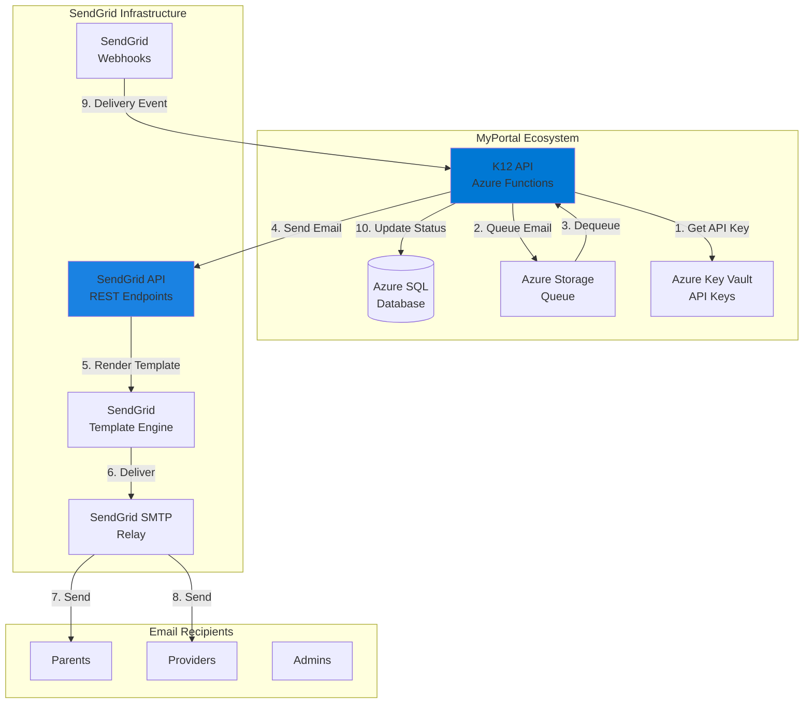
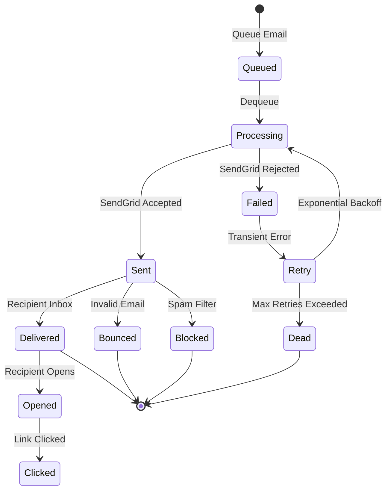
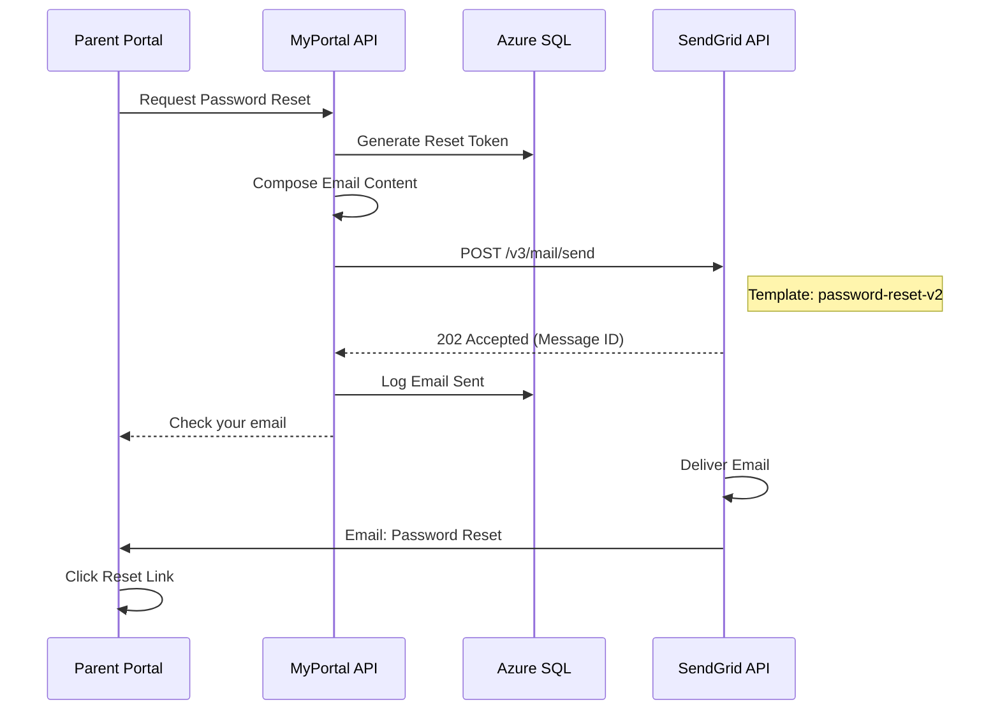
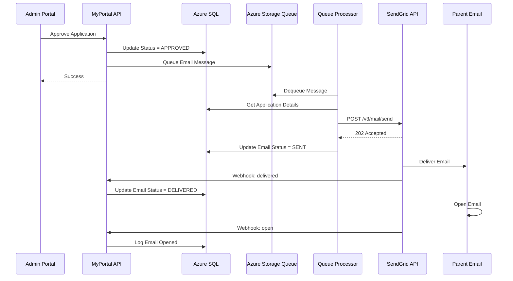
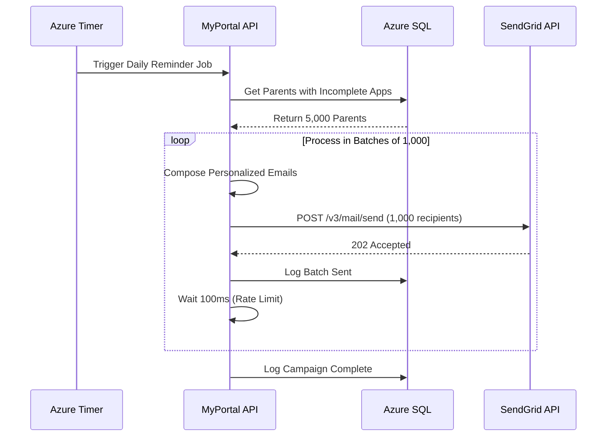
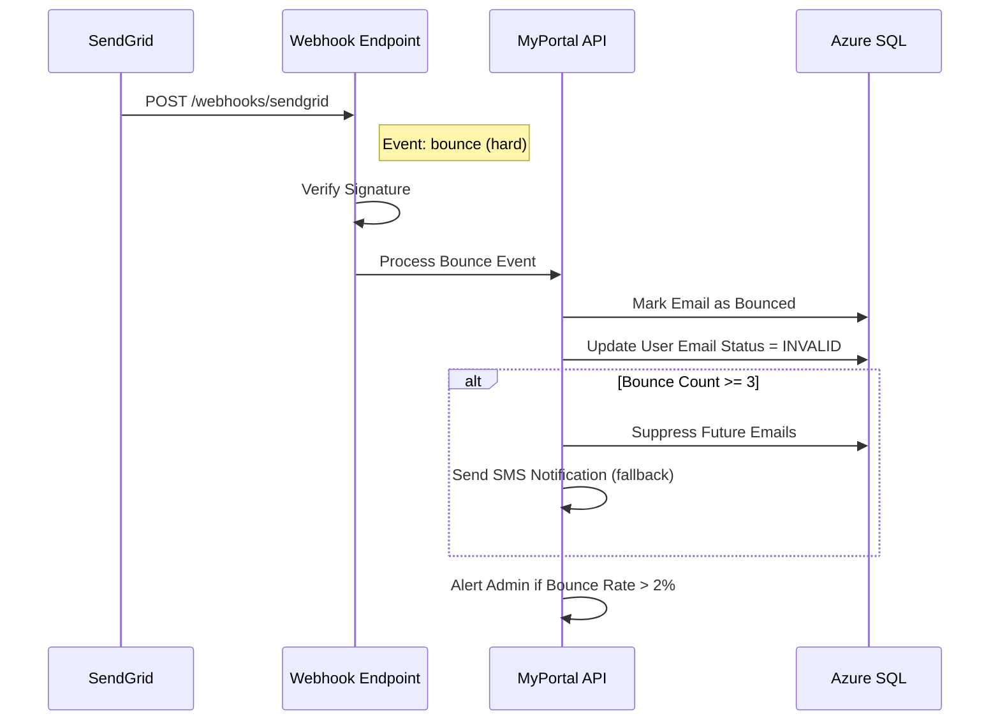

# INT-03: SendGrid Integration

**Integration ID:** INT-03
**System:** SendGrid Email Delivery Platform
**Type:** External REST API
**Classification:** Business Critical
**Status:** Active (Production)
**Last Updated:** 2025-01-15

## Table of Contents

- [Overview](#overview)
- [Integration Architecture](#integration-architecture)
- [API Specifications](#api-specifications)
- [Data Flow](#data-flow)
- [Implementation](#implementation)
- [Error Handling](#error-handling)
- [Security](#security)
- [Monitoring & Logging](#monitoring--logging)
- [Testing Strategy](#testing-strategy)
- [Common Issues & Troubleshooting](#common-issues--troubleshooting)
- [References](#references)

---

## Overview

### Purpose

SendGrid is the **primary email delivery platform** for the NC SEAA K-12 Scholarship Management System. It handles all transactional and operational email communications including:

- **Transactional Emails**: Account creation, password resets, verification codes
- **Application Notifications**: Application status updates, approval/denial notifications
- **Award Communications**: Award letters, disbursement notifications
- **Document Alerts**: Signature requests, document completion notices
- **Provider Communications**: Invoice notifications, payment confirmations
- **System Alerts**: Security alerts, compliance reminders, deadline notifications
- **Marketing Campaigns**: Program announcements, enrollment reminders (future)
- **Email Templates**: Branded, responsive HTML templates with dynamic content
- **Delivery Tracking**: Open rates, click-through rates, bounce handling
- **Suppression Management**: Unsubscribes, bounces, spam complaints

### Business Context

SendGrid provides MyPortal with:

1. **Reliable Delivery**: 99.9% SLA with redundant infrastructure
2. **High Throughput**: Handle 50,000+ emails/day during peak enrollment
3. **Deliverability**: Industry-leading inbox placement rates (>98%)
4. **Template Management**: Centralized, version-controlled email templates
5. **Analytics**: Real-time email engagement metrics
6. **Compliance**: CAN-SPAM Act compliance, automatic unsubscribe handling
7. **Security**: SPF, DKIM, DMARC authentication for email spoofing prevention

### Integration Scope

| Feature | MyPortal Responsibility | SendGrid Responsibility |
|---------|------------------------|-------------------------|
| Email Composition | Generate email content and data | Apply template rendering |
| Sending | Trigger send via API | Deliver to recipient inbox |
| Template Management | Define template variables | Store and render templates |
| Delivery Tracking | Display status in UI | Track delivery, opens, clicks |
| Bounce Handling | Process webhook events | Detect bounces and report |
| Unsubscribe Management | Update user preferences | Process unsubscribe requests |
| Analytics | Dashboard visualization | Collect engagement metrics |

### Key Metrics

- **Email Volume**: 1.2M emails/year (~50,000/day peak)
- **Delivery Rate**: 99.2% (industry average: 95%)
- **Open Rate**: 42% (industry average: 21%)
- **Click-Through Rate**: 8.5% (industry average: 2.6%)
- **Bounce Rate**: 0.8% (target: <2%)
- **Spam Complaint Rate**: 0.02% (target: <0.1%)
- **API Call Volume**: ~65,000 calls/month (800 req/min peak)
- **SLA**: 99.9% uptime, <500ms response time

---

## Integration Architecture

### High-Level Architecture



### Component Responsibilities

#### MyPortal API Layer
- **API/Functions/EmailFunctions.cs**: Azure Function triggers for email operations
- **Application/Services/EmailService.cs**: Business logic for email composition
- **Infrastructure/HttpClients/SendGridClient.cs**: HTTP client for SendGrid API
- **Domain/Entities/Email.cs**: Domain model for email messages

#### SendGrid API Layer
- **Base URL (Production)**: `https://api.sendgrid.com/v3`
- **Authentication**: Bearer token (API Key in `Authorization` header)
- **Rate Limits**: No strict rate limit, burst protection advised

### Email Processing Flow



### Email Queue Strategy

MyPortal uses **Azure Storage Queues** for asynchronous email processing:

| Queue | Purpose | Processing Rate | Max Retries |
|-------|---------|-----------------|-------------|
| `emails-transactional` | Urgent emails (password reset) | 100/min | 3 |
| `emails-notification` | Application status updates | 50/min | 5 |
| `emails-bulk` | Batch communications | 500/min | 2 |

**Benefits:**
- **Decoupling**: API responds immediately, email sent asynchronously
- **Rate Limiting**: Control SendGrid API call rate
- **Retry Logic**: Automatic retry on transient failures
- **Priority**: Separate queues for different email types

---

## API Specifications

### Authentication

SendGrid uses **API Key authentication** with Bearer token.

#### API Key Configuration

```http
POST https://api.sendgrid.com/v3/mail/send
Authorization: Bearer {YOUR_API_KEY}
Content-Type: application/json
```

**Key Permissions:**
- `mail.send`: Send emails
- `templates.read`: Read email templates
- `stats.read`: Access analytics

### API Endpoints

#### 1. Send Email (Transactional)

**Endpoint:** `POST /v3/mail/send`

**Purpose:** Send a single transactional email with dynamic content.

**Request:**

```json
{
  "personalizations": [
    {
      "to": [
        {
          "email": "parent@example.com",
          "name": "John Smith"
        }
      ],
      "dynamic_template_data": {
        "student_name": "Emily Smith",
        "application_id": "APP-2024-001234",
        "application_status": "Approved",
        "award_amount": "$7,500",
        "next_steps": "Check your email for the award letter and disbursement timeline."
      }
    }
  ],
  "from": {
    "email": "noreply@myportal.nc.gov",
    "name": "NC SEAA MyPortal"
  },
  "reply_to": {
    "email": "support@myportal.nc.gov",
    "name": "MyPortal Support"
  },
  "template_id": "d-abc123def456ghi789",
  "categories": ["application", "approval"],
  "custom_args": {
    "application_id": "APP-2024-001234",
    "student_id": "STU-2024-001234",
    "environment": "production"
  },
  "tracking_settings": {
    "click_tracking": {
      "enable": true,
      "enable_text": false
    },
    "open_tracking": {
      "enable": true,
      "substitution_tag": "%open-track%"
    }
  }
}
```

**Response (202 Accepted):**

```http
HTTP/1.1 202 Accepted
X-Message-Id: msg-abc123def456ghi789
Content-Length: 0
```

**Response Headers:**
- `X-Message-Id`: Unique identifier for tracking email delivery

#### 2. Send Email (Simple - No Template)

**Request:**

```json
{
  "personalizations": [
    {
      "to": [
        {
          "email": "admin@myportal.nc.gov",
          "name": "System Administrator"
        }
      ],
      "subject": "ALERT: High Bounce Rate Detected"
    }
  ],
  "from": {
    "email": "alerts@myportal.nc.gov",
    "name": "MyPortal Alerts"
  },
  "content": [
    {
      "type": "text/plain",
      "value": "The email bounce rate has exceeded 2% in the last hour. Please investigate."
    },
    {
      "type": "text/html",
      "value": "<p>The email bounce rate has exceeded <strong>2%</strong> in the last hour. Please investigate.</p>"
    }
  ]
}
```

#### 3. Send Bulk Email (Multiple Recipients)

**Request:**

```json
{
  "personalizations": [
    {
      "to": [
        {
          "email": "parent1@example.com",
          "name": "Parent One"
        }
      ],
      "dynamic_template_data": {
        "student_name": "Emily Smith",
        "deadline_date": "December 31, 2024"
      }
    },
    {
      "to": [
        {
          "email": "parent2@example.com",
          "name": "Parent Two"
        }
      ],
      "dynamic_template_data": {
        "student_name": "Michael Johnson",
        "deadline_date": "December 31, 2024"
      }
    }
  ],
  "from": {
    "email": "noreply@myportal.nc.gov",
    "name": "NC SEAA MyPortal"
  },
  "template_id": "d-deadline-reminder-v2"
}
```

**Bulk Send Best Practices:**
- **Batch Size**: Max 1,000 personalizations per request
- **Rate Limiting**: Wait 100ms between batches
- **Error Handling**: Log failed personalizations for retry

#### 4. Get Email Statistics

**Endpoint:** `GET /v3/stats`

**Query Parameters:**
- `start_date`: YYYY-MM-DD (e.g., `2024-11-01`)
- `end_date`: YYYY-MM-DD (e.g., `2024-11-15`)
- `aggregated_by`: `day`, `week`, `month`
- `categories`: Filter by email category

**Response (200 OK):**

```json
[
  {
    "date": "2024-11-15",
    "stats": [
      {
        "metrics": {
          "requests": 3245,
          "delivered": 3218,
          "opens": 1354,
          "unique_opens": 1156,
          "clicks": 278,
          "unique_clicks": 245,
          "bounces": 18,
          "spam_reports": 1,
          "unsubscribes": 3
        }
      }
    ]
  }
]
```

**Calculated Metrics:**
- **Delivery Rate**: `(delivered / requests) * 100` = 99.17%
- **Open Rate**: `(unique_opens / delivered) * 100` = 35.92%
- **Click Rate**: `(unique_clicks / delivered) * 100` = 7.61%
- **Bounce Rate**: `(bounces / requests) * 100` = 0.55%

#### 5. List Email Templates

**Endpoint:** `GET /v3/templates`

**Query Parameters:**
- `generations`: `legacy` or `dynamic` (use `dynamic`)
- `page_size`: Results per page (default: 200)

**Response (200 OK):**

```json
{
  "result": [
    {
      "id": "d-abc123def456ghi789",
      "name": "Application Approval",
      "generation": "dynamic",
      "updated_at": "2024-09-15T10:00:00Z",
      "versions": [
        {
          "id": "v-abc123",
          "template_id": "d-abc123def456ghi789",
          "active": 1,
          "name": "Application Approval v2",
          "updated_at": "2024-09-15T10:00:00Z",
          "subject": "Your scholarship application has been approved!",
          "html_content": "<html>...</html>",
          "plain_content": "Your application has been approved..."
        }
      ]
    }
  ]
}
```

#### 6. Validate Email Address

**Endpoint:** `POST /v3/validations/email`

**Purpose:** Validate email address format and deliverability (requires paid plan).

**Request:**

```json
{
  "email": "parent@example.com",
  "source": "signup"
}
```

**Response (200 OK):**

```json
{
  "result": {
    "email": "parent@example.com",
    "verdict": "Valid",
    "score": 0.98,
    "local": "parent",
    "host": "example.com",
    "checks": {
      "domain": {
        "has_valid_address_syntax": true,
        "has_mx_or_a_record": true,
        "is_suspected_disposable_address": false
      },
      "local_part": {
        "is_suspected_role_address": false
      }
    }
  }
}
```

### Webhook Events

SendGrid sends **webhook notifications** for email delivery events.

#### Webhook Configuration

**MyPortal Webhook Endpoint:** `https://k12-api.myportal.nc.gov/api/webhooks/sendgrid`

**Authentication:** OAuth (recommended) or Basic Auth

**Events:**
- `processed`: Email accepted by SendGrid
- `delivered`: Email delivered to recipient's mail server
- `open`: Recipient opened email (requires open tracking)
- `click`: Recipient clicked link in email
- `bounce`: Email bounced (invalid address)
- `dropped`: SendGrid dropped email (spam, unsubscribed)
- `deferred`: Temporary delivery issue, will retry
- `unsubscribe`: Recipient unsubscribed
- `spam_report`: Recipient marked as spam

#### Webhook Payload Example

```json
[
  {
    "email": "parent@example.com",
    "timestamp": 1700152800,
    "smtp-id": "<abc123@sendgrid.net>",
    "event": "delivered",
    "category": ["application", "approval"],
    "sg_event_id": "evt-abc123def456",
    "sg_message_id": "msg-abc123def456ghi789",
    "response": "250 OK",
    "application_id": "APP-2024-001234",
    "student_id": "STU-2024-001234"
  },
  {
    "email": "parent@example.com",
    "timestamp": 1700156400,
    "smtp-id": "<abc123@sendgrid.net>",
    "event": "open",
    "category": ["application", "approval"],
    "sg_event_id": "evt-def456ghi789",
    "sg_message_id": "msg-abc123def456ghi789",
    "useragent": "Mozilla/5.0 (iPhone; CPU iPhone OS 17_0 like Mac OS X)",
    "ip": "192.168.1.100"
  }
]
```

**Webhook Signature Verification:**

SendGrid supports **signature verification** using public key cryptography.

```csharp
public static bool VerifyWebhookSignature(
    string publicKey,
    string payload,
    string signature,
    string timestamp)
{
    var timestampPayload = timestamp + payload;

    using var ecdsa = ECDsa.Create();
    ecdsa.ImportSubjectPublicKeyInfo(Convert.FromBase64String(publicKey), out _);

    var signatureBytes = Convert.FromBase64String(signature);
    var payloadBytes = Encoding.UTF8.GetBytes(timestampPayload);

    return ecdsa.VerifyData(payloadBytes, signatureBytes, HashAlgorithmName.SHA256);
}
```

---

## Data Flow

### 1. Transactional Email Flow (Password Reset)



### 2. Application Approval Email with Queue



### 3. Bulk Email Campaign (Deadline Reminders)



### 4. Bounce Handling Flow



---

## Implementation

### C# Implementation with Azure Functions

#### 1. SendGrid HTTP Client Configuration

**File:** `Infrastructure/HttpClients/SendGridClient.cs`

```csharp
using System;
using System.Collections.Generic;
using System.Net.Http;
using System.Net.Http.Headers;
using System.Text;
using System.Text.Json;
using System.Threading.Tasks;
using Microsoft.Extensions.Configuration;
using Microsoft.Extensions.Logging;
using Polly;
using Polly.CircuitBreaker;
using Polly.Retry;

namespace K12.Infrastructure.HttpClients
{
    public class SendGridClient : ISendGridClient
    {
        private readonly HttpClient _httpClient;
        private readonly IConfiguration _configuration;
        private readonly ILogger<SendGridClient> _logger;
        private readonly AsyncRetryPolicy<HttpResponseMessage> _retryPolicy;
        private readonly AsyncCircuitBreakerPolicy<HttpResponseMessage> _circuitBreakerPolicy;

        public SendGridClient(
            HttpClient httpClient,
            IConfiguration configuration,
            ILogger<SendGridClient> logger)
        {
            _httpClient = httpClient;
            _configuration = configuration;
            _logger = logger;

            var baseUrl = _configuration["SendGrid:BaseUrl"];
            var apiKey = _configuration["SendGrid:ApiKey"];

            _httpClient.BaseAddress = new Uri(baseUrl);
            _httpClient.DefaultRequestHeaders.Add("Authorization", $"Bearer {apiKey}");
            _httpClient.DefaultRequestHeaders.Accept.Add(
                new MediaTypeWithQualityHeaderValue("application/json"));

            _retryPolicy = BuildRetryPolicy();
            _circuitBreakerPolicy = BuildCircuitBreakerPolicy();
        }

        private AsyncRetryPolicy<HttpResponseMessage> BuildRetryPolicy()
        {
            return Policy
                .HandleResult<HttpResponseMessage>(r =>
                    (int)r.StatusCode >= 500 ||
                    r.StatusCode == System.Net.HttpStatusCode.RequestTimeout ||
                    r.StatusCode == System.Net.HttpStatusCode.TooManyRequests)
                .WaitAndRetryAsync(
                    retryCount: 3,
                    sleepDurationProvider: retryAttempt =>
                        TimeSpan.FromSeconds(Math.Pow(2, retryAttempt)),
                    onRetry: (outcome, timespan, retryCount, context) =>
                    {
                        _logger.LogWarning(
                            "SendGrid API retry {RetryCount} after {Delay}ms",
                            retryCount,
                            timespan.TotalMilliseconds);
                    });
        }

        private AsyncCircuitBreakerPolicy<HttpResponseMessage> BuildCircuitBreakerPolicy()
        {
            return Policy
                .HandleResult<HttpResponseMessage>(r => (int)r.StatusCode >= 500)
                .CircuitBreakerAsync(
                    handledEventsAllowedBeforeBreaking: 5,
                    durationOfBreak: TimeSpan.FromMinutes(1),
                    onBreak: (outcome, duration) =>
                    {
                        _logger.LogError("SendGrid circuit breaker opened");
                    },
                    onReset: () =>
                    {
                        _logger.LogInformation("SendGrid circuit breaker reset");
                    });
        }

        /// <summary>
        /// Send email using dynamic template
        /// </summary>
        public async Task<SendEmailResponse> SendEmailAsync(SendEmailRequest request)
        {
            var content = new StringContent(
                JsonSerializer.Serialize(request, new JsonSerializerOptions
                {
                    PropertyNamingPolicy = JsonNamingPolicy.CamelCase,
                    DefaultIgnoreCondition = System.Text.Json.Serialization.JsonIgnoreCondition.WhenWritingNull
                }),
                Encoding.UTF8,
                "application/json");

            var policy = Policy.WrapAsync(_retryPolicy, _circuitBreakerPolicy);

            var response = await policy.ExecuteAsync(async () =>
                await _httpClient.PostAsync("/v3/mail/send", content));

            if (!response.IsSuccessStatusCode)
            {
                var errorContent = await response.Content.ReadAsStringAsync();
                _logger.LogError(
                    "SendGrid SendEmail failed: {StatusCode} - {Error}",
                    response.StatusCode,
                    errorContent);
            }

            response.EnsureSuccessStatusCode();

            var messageId = response.Headers.GetValues("X-Message-Id").FirstOrDefault();

            return new SendEmailResponse
            {
                MessageId = messageId,
                StatusCode = (int)response.StatusCode
            };
        }

        /// <summary>
        /// Send simple text email (no template)
        /// </summary>
        public async Task<SendEmailResponse> SendSimpleEmailAsync(
            string to,
            string subject,
            string plainText,
            string html = null)
        {
            var request = new SendEmailRequest
            {
                Personalizations = new List<Personalization>
                {
                    new Personalization
                    {
                        To = new List<EmailAddress>
                        {
                            new EmailAddress { Email = to }
                        },
                        Subject = subject
                    }
                },
                From = new EmailAddress
                {
                    Email = _configuration["SendGrid:FromEmail"],
                    Name = _configuration["SendGrid:FromName"]
                },
                Content = new List<Content>
                {
                    new Content { Type = "text/plain", Value = plainText }
                }
            };

            if (!string.IsNullOrEmpty(html))
            {
                request.Content.Add(new Content { Type = "text/html", Value = html });
            }

            return await SendEmailAsync(request);
        }

        /// <summary>
        /// Get email statistics
        /// </summary>
        public async Task<EmailStatsResponse> GetStatisticsAsync(
            DateTime startDate,
            DateTime endDate,
            string aggregatedBy = "day")
        {
            var url = $"/v3/stats?start_date={startDate:yyyy-MM-dd}&end_date={endDate:yyyy-MM-dd}&aggregated_by={aggregatedBy}";

            var policy = Policy.WrapAsync(_retryPolicy, _circuitBreakerPolicy);

            var response = await policy.ExecuteAsync(async () =>
                await _httpClient.GetAsync(url));

            response.EnsureSuccessStatusCode();

            return await JsonSerializer.DeserializeAsync<EmailStatsResponse>(
                await response.Content.ReadAsStreamAsync());
        }

        /// <summary>
        /// List email templates
        /// </summary>
        public async Task<TemplateListResponse> ListTemplatesAsync()
        {
            var url = "/v3/templates?generations=dynamic";

            var policy = Policy.WrapAsync(_retryPolicy, _circuitBreakerPolicy);

            var response = await policy.ExecuteAsync(async () =>
                await _httpClient.GetAsync(url));

            response.EnsureSuccessStatusCode();

            return await JsonSerializer.DeserializeAsync<TemplateListResponse>(
                await response.Content.ReadAsStreamAsync());
        }
    }

    // DTOs

    public class SendEmailRequest
    {
        public List<Personalization> Personalizations { get; set; }
        public EmailAddress From { get; set; }
        public EmailAddress ReplyTo { get; set; }
        public string TemplateId { get; set; }
        public List<string> Categories { get; set; }
        public Dictionary<string, string> CustomArgs { get; set; }
        public List<Content> Content { get; set; }
        public TrackingSettings TrackingSettings { get; set; }
    }

    public class Personalization
    {
        public List<EmailAddress> To { get; set; }
        public string Subject { get; set; }
        public Dictionary<string, object> DynamicTemplateData { get; set; }
        public Dictionary<string, string> CustomArgs { get; set; }
    }

    public class EmailAddress
    {
        public string Email { get; set; }
        public string Name { get; set; }
    }

    public class Content
    {
        public string Type { get; set; }
        public string Value { get; set; }
    }

    public class TrackingSettings
    {
        public ClickTracking ClickTracking { get; set; }
        public OpenTracking OpenTracking { get; set; }
    }

    public class ClickTracking
    {
        public bool Enable { get; set; }
        public bool EnableText { get; set; }
    }

    public class OpenTracking
    {
        public bool Enable { get; set; }
        public string SubstitutionTag { get; set; }
    }

    public class SendEmailResponse
    {
        public string MessageId { get; set; }
        public int StatusCode { get; set; }
    }
}
```

#### 2. Email Service Layer

**File:** `Application/Services/EmailService.cs`

```csharp
using System;
using System.Collections.Generic;
using System.Threading.Tasks;
using Azure.Storage.Queues;
using K12.Domain.Entities;
using K12.Domain.Repositories;
using K12.Infrastructure.HttpClients;
using Microsoft.Extensions.Configuration;
using Microsoft.Extensions.Logging;

namespace K12.Application.Services
{
    public class EmailService : IEmailService
    {
        private readonly ISendGridClient _sendGridClient;
        private readonly IEmailRepository _emailRepository;
        private readonly QueueClient _queueClient;
        private readonly IConfiguration _configuration;
        private readonly ILogger<EmailService> _logger;

        public EmailService(
            ISendGridClient sendGridClient,
            IEmailRepository emailRepository,
            QueueServiceClient queueServiceClient,
            IConfiguration configuration,
            ILogger<EmailService> logger)
        {
            _sendGridClient = sendGridClient;
            _emailRepository = emailRepository;
            _configuration = configuration;
            _logger = logger;

            var queueName = _configuration["Email:QueueName"];
            _queueClient = queueServiceClient.GetQueueClient(queueName);
        }

        /// <summary>
        /// Send application approval email
        /// </summary>
        public async Task SendApplicationApprovalEmailAsync(int applicationId)
        {
            // Queue email for asynchronous processing
            var message = new
            {
                Type = "ApplicationApproval",
                ApplicationId = applicationId,
                Timestamp = DateTime.UtcNow
            };

            await _queueClient.SendMessageAsync(
                Convert.ToBase64String(
                    System.Text.Encoding.UTF8.GetBytes(
                        System.Text.Json.JsonSerializer.Serialize(message))));

            _logger.LogInformation(
                "Queued application approval email for Application {ApplicationId}",
                applicationId);
        }

        /// <summary>
        /// Process email from queue (called by queue trigger function)
        /// </summary>
        public async Task ProcessApplicationApprovalEmailAsync(int applicationId)
        {
            // Get application details
            var application = await GetApplicationDetailsAsync(applicationId);

            var templateId = _configuration["SendGrid:Templates:ApplicationApproval"];

            var request = new SendEmailRequest
            {
                Personalizations = new List<Personalization>
                {
                    new Personalization
                    {
                        To = new List<EmailAddress>
                        {
                            new EmailAddress
                            {
                                Email = application.Parent.Email,
                                Name = $"{application.Parent.FirstName} {application.Parent.LastName}"
                            }
                        },
                        DynamicTemplateData = new Dictionary<string, object>
                        {
                            ["student_name"] = $"{application.Student.FirstName} {application.Student.LastName}",
                            ["application_id"] = application.ApplicationId,
                            ["award_amount"] = $"${application.AwardAmount:N0}",
                            ["school_year"] = application.SchoolYear,
                            ["next_steps_url"] = $"{_configuration["App:BaseUrl"]}/next-steps"
                        }
                    }
                },
                From = new EmailAddress
                {
                    Email = _configuration["SendGrid:FromEmail"],
                    Name = _configuration["SendGrid:FromName"]
                },
                ReplyTo = new EmailAddress
                {
                    Email = _configuration["SendGrid:ReplyToEmail"]
                },
                TemplateId = templateId,
                Categories = new List<string> { "application", "approval" },
                CustomArgs = new Dictionary<string, string>
                {
                    ["application_id"] = application.ApplicationId,
                    ["student_id"] = application.Student.StudentId
                },
                TrackingSettings = new TrackingSettings
                {
                    ClickTracking = new ClickTracking { Enable = true },
                    OpenTracking = new OpenTracking { Enable = true }
                }
            };

            try
            {
                var response = await _sendGridClient.SendEmailAsync(request);

                // Log email in database
                await _emailRepository.CreateAsync(new Email
                {
                    ApplicationId = applicationId,
                    RecipientEmail = application.Parent.Email,
                    EmailType = EmailType.ApplicationApproval,
                    SendGridMessageId = response.MessageId,
                    Status = EmailStatus.Sent,
                    SentAt = DateTime.UtcNow
                });

                _logger.LogInformation(
                    "Sent application approval email for Application {ApplicationId}, MessageId: {MessageId}",
                    applicationId,
                    response.MessageId);
            }
            catch (Exception ex)
            {
                _logger.LogError(
                    ex,
                    "Failed to send application approval email for Application {ApplicationId}",
                    applicationId);
                throw;
            }
        }

        /// <summary>
        /// Send password reset email (immediate, not queued)
        /// </summary>
        public async Task SendPasswordResetEmailAsync(string email, string resetToken)
        {
            var templateId = _configuration["SendGrid:Templates:PasswordReset"];
            var resetUrl = $"{_configuration["App:BaseUrl"]}/reset-password?token={resetToken}";

            var request = new SendEmailRequest
            {
                Personalizations = new List<Personalization>
                {
                    new Personalization
                    {
                        To = new List<EmailAddress>
                        {
                            new EmailAddress { Email = email }
                        },
                        DynamicTemplateData = new Dictionary<string, object>
                        {
                            ["reset_url"] = resetUrl,
                            ["expiration_minutes"] = 30
                        }
                    }
                },
                From = new EmailAddress
                {
                    Email = _configuration["SendGrid:FromEmail"],
                    Name = _configuration["SendGrid:FromName"]
                },
                TemplateId = templateId,
                Categories = new List<string> { "authentication", "password-reset" }
            };

            var response = await _sendGridClient.SendEmailAsync(request);

            _logger.LogInformation(
                "Sent password reset email to {Email}, MessageId: {MessageId}",
                email,
                response.MessageId);
        }

        private async Task<Application> GetApplicationDetailsAsync(int applicationId)
        {
            // Query application with related entities
            return null; // Placeholder
        }
    }
}
```

#### 3. Azure Function Queue Trigger

**File:** `API/Functions/EmailFunctions.cs`

```csharp
using System;
using System.Text.Json;
using System.Threading.Tasks;
using K12.Application.Services;
using Microsoft.Azure.Functions.Worker;
using Microsoft.Extensions.Logging;

namespace K12.API.Functions
{
    public class EmailFunctions
    {
        private readonly IEmailService _emailService;
        private readonly ILogger<EmailFunctions> _logger;

        public EmailFunctions(
            IEmailService emailService,
            ILogger<EmailFunctions> logger)
        {
            _emailService = emailService;
            _logger = logger;
        }

        /// <summary>
        /// Queue trigger: Process queued emails
        /// </summary>
        [Function("ProcessEmailQueue")]
        public async Task ProcessEmailQueue(
            [QueueTrigger("emails-notification")] string message,
            FunctionContext context)
        {
            try
            {
                var emailMessage = JsonSerializer.Deserialize<EmailQueueMessage>(message);

                _logger.LogInformation(
                    "Processing email: Type={Type}, ApplicationId={ApplicationId}",
                    emailMessage.Type,
                    emailMessage.ApplicationId);

                switch (emailMessage.Type)
                {
                    case "ApplicationApproval":
                        await _emailService.ProcessApplicationApprovalEmailAsync(
                            emailMessage.ApplicationId);
                        break;

                    // Add other email types...
                }
            }
            catch (Exception ex)
            {
                _logger.LogError(ex, "Error processing email queue message");
                throw; // Let Azure Functions retry logic handle
            }
        }

        /// <summary>
        /// Webhook endpoint for SendGrid events
        /// </summary>
        [Function("SendGridWebhook")]
        public async Task SendGridWebhook(
            [HttpTrigger(AuthorizationLevel.Function, "post",
                Route = "webhooks/sendgrid")]
            Microsoft.Azure.Functions.Worker.Http.HttpRequestData req)
        {
            // Process SendGrid webhook events
            // Update email status in database
        }
    }

    public class EmailQueueMessage
    {
        public string Type { get; set; }
        public int ApplicationId { get; set; }
        public DateTime Timestamp { get; set; }
    }
}
```

---

## Error Handling

### Retry Policies

- **Exponential backoff**: 3 retries (2s, 4s, 8s)
- **Circuit breaker**: Open after 5 failures, 1-minute break
- **Queue visibility timeout**: 5 minutes (auto-retry if not processed)

### Common Error Scenarios

#### 1. Invalid Email Address

```csharp
catch (HttpRequestException ex) when (ex.StatusCode == HttpStatusCode.BadRequest)
{
    var errorResponse = await ParseErrorResponseAsync(ex);

    if (errorResponse.Errors?.Any(e => e.Field == "personalizations[0].to[0].email") ?? false)
    {
        // Mark email as invalid in database
        await _emailRepository.MarkAsInvalidAsync(email);

        _logger.LogWarning("Invalid email address: {Email}", email);
    }
}
```

#### 2. Rate Limit Exceeded

```csharp
catch (HttpRequestException ex) when (ex.StatusCode == HttpStatusCode.TooManyRequests)
{
    var retryAfter = ex.Response.Headers.RetryAfter?.Delta ?? TimeSpan.FromSeconds(60);

    _logger.LogWarning("SendGrid rate limit exceeded, retrying after {Seconds}s", retryAfter.TotalSeconds);

    await Task.Delay(retryAfter);
    // Retry will happen automatically via Polly
}
```

---

## Security

### SPF, DKIM, DMARC Configuration

**DNS Records for myportal.nc.gov:**

```dns
# SPF (Sender Policy Framework)
myportal.nc.gov. IN TXT "v=spf1 include:sendgrid.net ~all"

# DKIM (DomainKeys Identified Mail)
s1._domainkey.myportal.nc.gov. IN CNAME s1.domainkey.u12345678.wl123.sendgrid.net.
s2._domainkey.myportal.nc.gov. IN CNAME s2.domainkey.u12345678.wl123.sendgrid.net.

# DMARC (Domain-based Message Authentication, Reporting & Conformance)
_dmarc.myportal.nc.gov. IN TXT "v=DMARC1; p=quarantine; rua=mailto:dmarc@myportal.nc.gov"
```

### API Key Rotation

```bash
# Rotate SendGrid API key every 90 days
az keyvault secret set \
  --vault-name k12-keyvault-prod \
  --name sendgrid-api-key \
  --value "SG.new_api_key_here"
```

---

## Monitoring & Logging

### Application Insights Metrics

```csharp
public void TrackEmailSent(string emailType, string recipient)
{
    _telemetryClient.TrackEvent("Email_Sent",
        new Dictionary<string, string>
        {
            { "emailType", emailType },
            { "recipient", recipient }
        });
}

public void TrackEmailBounce(string recipient, string bounceReason)
{
    _telemetryClient.TrackEvent("Email_Bounced",
        new Dictionary<string, string>
        {
            { "recipient", recipient },
            { "reason", bounceReason }
        });
}
```

### KQL Queries

**Email Delivery Rate (Last 7 Days):**

```kusto
customEvents
| where timestamp > ago(7d)
| where name in ("Email_Sent", "Email_Delivered", "Email_Bounced")
| summarize
    Sent = countif(name == "Email_Sent"),
    Delivered = countif(name == "Email_Delivered"),
    Bounced = countif(name == "Email_Bounced")
| extend DeliveryRate = (Delivered * 100.0) / Sent
```

---

## Testing Strategy

### Unit Tests

```csharp
[Fact]
public async Task SendApplicationApprovalEmail_ValidApplication_SendsEmail()
{
    // Arrange
    var mockClient = new Mock<ISendGridClient>();
    mockClient.Setup(c => c.SendEmailAsync(It.IsAny<SendEmailRequest>()))
        .ReturnsAsync(new SendEmailResponse { MessageId = "msg-123", StatusCode = 202 });

    var service = new EmailService(mockClient.Object, null, null, null, null);

    // Act
    await service.ProcessApplicationApprovalEmailAsync(123);

    // Assert
    mockClient.Verify(c => c.SendEmailAsync(
        It.Is<SendEmailRequest>(r => r.TemplateId.Contains("ApplicationApproval"))),
        Times.Once);
}
```

---

## Common Issues & Troubleshooting

### Issue 1: Low Open Rates

**Symptoms:** Open rate < 20%

**Resolution:**
- Check subject line effectiveness
- Verify sender reputation
- Test different send times

### Issue 2: High Bounce Rate

**Symptoms:** Bounce rate > 2%

**Resolution:**
- Implement email validation before send
- Remove invalid emails from database
- Use double opt-in for new signups

---

## References

- **SendGrid API Documentation**: https://docs.sendgrid.com/api-reference
- **Confluence Page**: [Email Integration Spec](https://cfi-nc.atlassian.net/wiki/spaces/KR/pages/4351721474)
- **Email Templates**: https://mc.sendgrid.com/dynamic-templates

---

**Document Version:** 1.0
**Last Reviewed:** 2025-01-15
**Next Review:** 2025-04-15
**Owner:** CFI Integration Team
