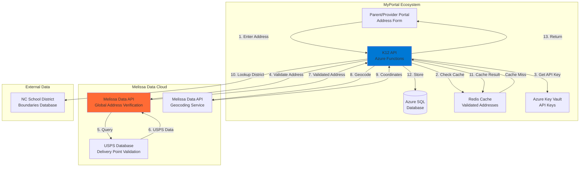
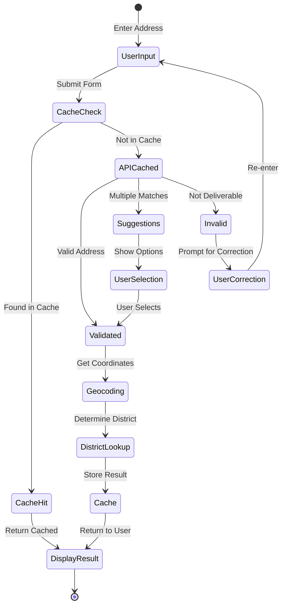
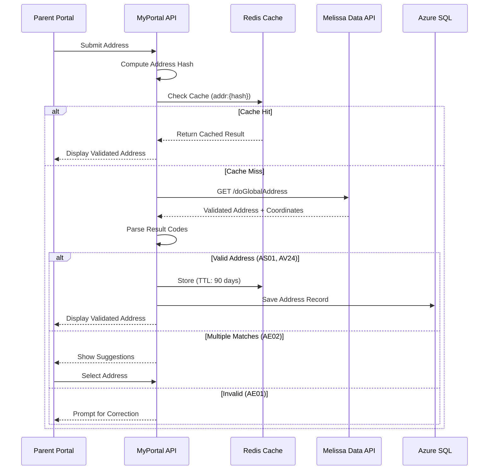
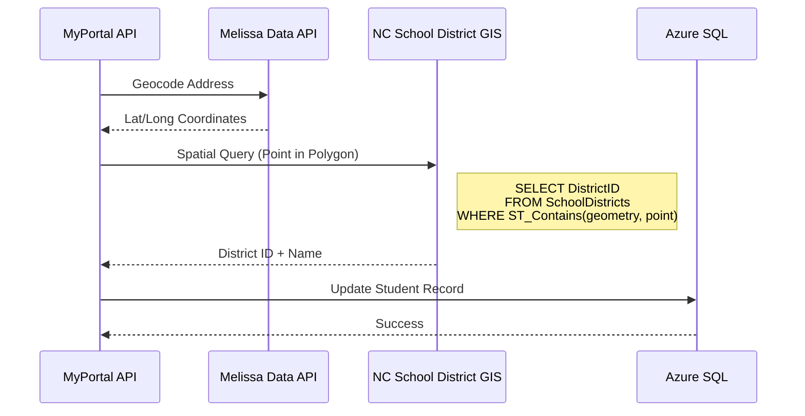
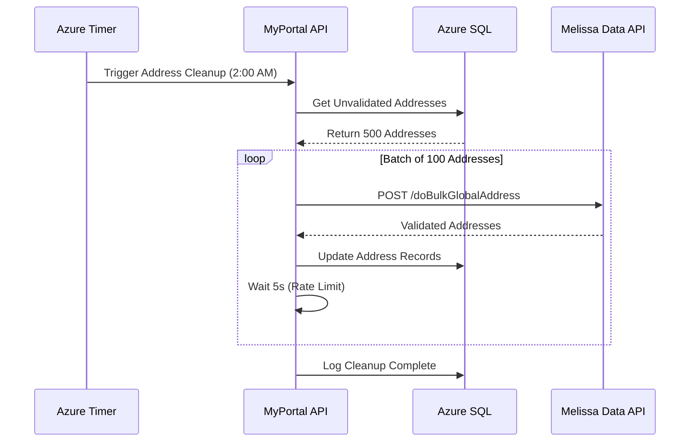
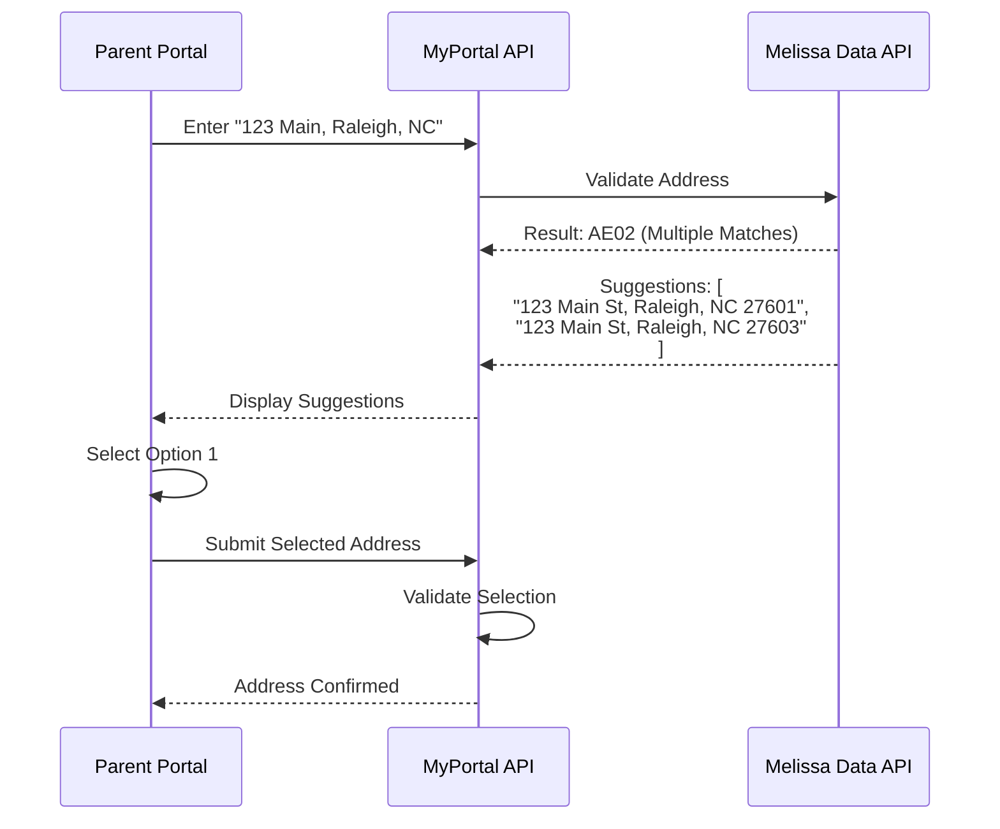

# INT-04: Melissa Data Integration

**Integration ID:** INT-04
**System:** Melissa Data Address Validation & Geocoding
**Type:** External REST API
**Classification:** Business Critical
**Status:** Active (Production)
**Last Updated:** 2025-01-15

## Table of Contents

- [Overview](#overview)
- [Integration Architecture](#integration-architecture)
- [API Specifications](#api-specifications)
- [Data Flow](#data-flow)
- [Implementation](#implementation)
- [Error Handling](#error-handling)
- [Security](#security)
- [Monitoring & Logging](#monitoring--logging)
- [Testing Strategy](#testing-strategy)
- [Common Issues & Troubleshooting](#common-issues--troubleshooting)
- [References](#references)

---

## Overview

### Purpose

Melissa Data is the **address validation and geocoding service** for the NC SEAA K-12 Scholarship Management System. It provides real-time address verification and geolocation services for:

- **Address Standardization**: Convert addresses to USPS-standard format
- **Address Validation**: Verify addresses exist and are deliverable
- **Geocoding**: Convert addresses to latitude/longitude coordinates
- **School District Verification**: Determine which school district an address belongs to
- **Residency Verification**: Confirm North Carolina residency for eligibility
- **Data Quality**: Improve address data quality with corrections and suggestions
- **ZIP+4 Enhancement**: Append ZIP+4 codes for more precise location data
- **Change of Address (COA)**: Detect if address has changed (NCOA database)

### Business Context

Address validation is **critical** for the K-12 scholarship program because:

1. **Eligibility Verification**: Only NC residents are eligible for scholarships
2. **School District Assignment**: Students must be matched to correct school districts
3. **Fund Disbursement**: ClassWallet requires accurate addresses for card mailing
4. **Communication**: SendGrid emails must reach correct addresses
5. **Fraud Prevention**: Invalid/fake addresses indicate potential fraud
6. **Compliance**: State law requires verifiable NC residency
7. **Data Quality**: Reduce address-related errors and return mail

### Integration Scope

| Feature | MyPortal Responsibility | Melissa Data Responsibility |
|---------|------------------------|----------------------------|
| Address Input | Collect from parent/provider | N/A |
| Real-Time Validation | Call API during form submission | Validate against USPS database |
| Standardization | Display corrected address | Return USPS-standard format |
| Geocoding | Store lat/long in database | Convert address to coordinates |
| District Lookup | Query district boundaries | Provide coordinate-based lookup |
| Caching | Cache validated addresses | N/A |
| Billing | Track API usage | Charge per API call |

### Key Metrics

- **API Call Volume**: ~12,000 validations/month (150 req/hour peak)
- **Validation Success Rate**: 96.5% (addresses successfully validated)
- **Average Response Time**: 350ms (target: <500ms)
- **Cache Hit Rate**: 65% (reduces API costs)
- **Cost**: $0.15 per validation (budgeted: $1,800/month)
- **Geocoding Accuracy**: 95% rooftop-level, 5% street-level
- **SLA**: 99.9% uptime, <1s response time

---

## Integration Architecture

### High-Level Architecture



### Address Validation Flow



### Caching Strategy

MyPortal implements **aggressive caching** to reduce Melissa Data API costs:

| Cache Type | Duration | Key Format | Purpose |
|------------|----------|------------|---------|
| Validated Addresses | 90 days | `addr:{hash}` | Avoid re-validating same address |
| Geocoded Coordinates | 365 days | `geo:{address}` | Long-term coordinate storage |
| District Boundaries | 30 days | `district:{lat},{lng}` | School district lookup |
| Invalid Addresses | 7 days | `invalid:{hash}` | Prevent repeated validation attempts |

**Cache Benefits:**
- **Cost Reduction**: 65% cache hit rate = $1,170/month savings
- **Performance**: Cached responses in <50ms vs. 350ms API call
- **Resilience**: Serve cached data if Melissa Data is unavailable

---

## API Specifications

### Authentication

Melissa Data uses **API Key authentication** via query parameter or header.

#### API Key Configuration

```http
GET https://globaladdress.melissadata.net/v3/WEB/GlobalAddress/doGlobalAddress
?id={LICENSE_KEY}
&a1=123 Main St
&locality=Raleigh
&administrativearea=NC
&postalcode=27601
&country=US
```

**Alternative (Header-based):**

```http
GET https://globaladdress.melissadata.net/v3/WEB/GlobalAddress/doGlobalAddress
Authorization: Bearer {LICENSE_KEY}
```

### API Endpoints

#### 1. Validate US Address (Global Address API)

**Endpoint:** `GET /v3/WEB/GlobalAddress/doGlobalAddress`

**Purpose:** Validate and standardize a US address.

**Query Parameters:**
- `id`: License key (required)
- `a1`: Address Line 1 (required)
- `a2`: Address Line 2 (optional)
- `locality`: City (required)
- `administrativearea`: State (required, 2-letter code)
- `postalcode`: ZIP code (optional, improves accuracy)
- `country`: Country code (default: `US`)
- `opt`: Options (e.g., `DeliveryLines:on` for USPS format)

**Example Request:**

```http
GET https://globaladdress.melissadata.net/v3/WEB/GlobalAddress/doGlobalAddress
?id=12345678
&a1=123 Main Street
&locality=Raleigh
&administrativearea=NC
&postalcode=27601
&country=US
&opt=DeliveryLines:on
```

**Response (200 OK):**

```json
{
  "Version": "3.0.0.96",
  "TransmissionReference": "req-20241115-143000",
  "TransmissionResults": "",
  "TotalRecords": "1",
  "Records": [
    {
      "RecordID": "1",
      "Results": "AS01,AV24,AV25",
      "FormattedAddress": "123 Main St, Raleigh, NC 27601-1234",
      "Organization": "",
      "AddressLine1": "123 Main St",
      "AddressLine2": "",
      "AddressLine3": "",
      "AddressLine4": "",
      "AddressLine5": "",
      "Locality": "Raleigh",
      "AdministrativeArea": "NC",
      "PostalCode": "27601-1234",
      "Country": "US",
      "CountryISO3166_1_Alpha2": "US",
      "CountryISO3166_1_Alpha3": "USA",
      "CountryISO3166_1_Numeric": "840",
      "Latitude": "35.7796",
      "Longitude": "-78.6382",
      "DeliveryIndicator": "R",
      "AddressType": "S",
      "AddressKey": "27601123000",
      "SubPremises": "",
      "SubPremisesNumber": "",
      "DoubleDependentLocality": "",
      "DependentLocality": "",
      "Thoroughfare": "Main St",
      "ThoroughfarePreDirection": "",
      "ThoroughfareLeadingType": "",
      "ThoroughfareName": "Main",
      "ThoroughfareTrailingType": "St",
      "ThoroughfarePostDirection": "",
      "DependentThoroughfare": "",
      "Building": "",
      "PremisesNumber": "123"
    }
  ]
}
```

**Response Fields:**

| Field | Description | Example |
|-------|-------------|---------|
| `Results` | Status codes (comma-separated) | `AS01,AV24,AV25` |
| `FormattedAddress` | USPS-standardized address | `123 Main St, Raleigh, NC 27601-1234` |
| `AddressLine1` | Standardized line 1 | `123 Main St` |
| `Locality` | City name | `Raleigh` |
| `AdministrativeArea` | State code | `NC` |
| `PostalCode` | ZIP+4 code | `27601-1234` |
| `Latitude` | Latitude coordinate | `35.7796` |
| `Longitude` | Longitude coordinate | `-78.6382` |
| `DeliveryIndicator` | Delivery type (`R`=residential, `B`=business) | `R` |
| `AddressType` | Address type (`S`=street, `H`=highrise, `P`=PO Box) | `S` |

**Result Codes:**

| Code | Description | Action |
|------|-------------|--------|
| `AS01` | Verified and standardized | Accept address |
| `AV24` | Address validated | Accept address |
| `AV25` | Delivery point validated | Accept address |
| `AE01` | Address not found | Reject or suggest correction |
| `AE02` | Multiple matches found | Show user options |
| `AE08` | Insufficient data | Prompt for more details |

#### 2. Geocode Address (Geocoder API)

**Endpoint:** `GET /v3/WEB/GeoCoder/doGeoCode`

**Purpose:** Convert address to latitude/longitude coordinates.

**Query Parameters:**
- `id`: License key
- `address`: Full address string

**Example Request:**

```http
GET https://geocoder.melissadata.net/v3/WEB/GeoCoder/doGeoCode
?id=12345678
&address=123 Main St, Raleigh, NC 27601
```

**Response (200 OK):**

```json
{
  "Version": "3.0.0.96",
  "Records": [
    {
      "Latitude": "35.7796",
      "Longitude": "-78.6382",
      "GeoPrecision": "01",
      "Results": "GS01"
    }
  ]
}
```

**GeoPrecision Values:**
- `01`: Rooftop level (most accurate)
- `02`: Street level
- `03`: ZIP code centroid
- `04`: City centroid

#### 3. Reverse Geocode (Coordinates to Address)

**Endpoint:** `GET /v3/WEB/GeoCoder/doReverseGeoCode`

**Query Parameters:**
- `id`: License key
- `lat`: Latitude
- `lng`: Longitude

**Example Request:**

```http
GET https://geocoder.melissadata.net/v3/WEB/GeoCoder/doReverseGeoCode
?id=12345678
&lat=35.7796
&lng=-78.6382
```

**Response:**

```json
{
  "Records": [
    {
      "Address": "123 Main St",
      "City": "Raleigh",
      "State": "NC",
      "Zip": "27601"
    }
  ]
}
```

#### 4. Bulk Address Validation

**Endpoint:** `POST /v3/WEB/GlobalAddress/doBulkGlobalAddress`

**Purpose:** Validate multiple addresses in a single request (batch processing).

**Request Body (JSON):**

```json
{
  "TransmissionReference": "batch-20241115-001",
  "Records": [
    {
      "RecordID": "1",
      "AddressLine1": "123 Main St",
      "Locality": "Raleigh",
      "AdministrativeArea": "NC",
      "PostalCode": "27601",
      "Country": "US"
    },
    {
      "RecordID": "2",
      "AddressLine1": "456 Oak Ave",
      "Locality": "Durham",
      "AdministrativeArea": "NC",
      "PostalCode": "27701",
      "Country": "US"
    }
  ]
}
```

**Best Practices:**
- Max 100 addresses per batch
- Use for nightly data cleanup jobs
- Include `RecordID` to match responses to input

---

## Data Flow

### 1. Real-Time Address Validation (Parent Registration)



### 2. School District Determination Flow



### 3. Nightly Address Cleanup Job



### 4. Address Suggestion Flow (Multiple Matches)



---

## Implementation

### C# Implementation with Azure Functions

#### 1. Melissa Data HTTP Client

**File:** `Infrastructure/HttpClients/MelissaDataClient.cs`

```csharp
using System;
using System.Collections.Generic;
using System.Linq;
using System.Net.Http;
using System.Security.Cryptography;
using System.Text;
using System.Text.Json;
using System.Threading.Tasks;
using Microsoft.Extensions.Configuration;
using Microsoft.Extensions.Logging;
using Polly;
using Polly.CircuitBreaker;
using Polly.Retry;

namespace K12.Infrastructure.HttpClients
{
    public class MelissaDataClient : IMelissaDataClient
    {
        private readonly HttpClient _httpClient;
        private readonly IConfiguration _configuration;
        private readonly ILogger<MelissaDataClient> _logger;
        private readonly AsyncRetryPolicy<HttpResponseMessage> _retryPolicy;
        private readonly AsyncCircuitBreakerPolicy<HttpResponseMessage> _circuitBreakerPolicy;

        public MelissaDataClient(
            HttpClient httpClient,
            IConfiguration configuration,
            ILogger<MelissaDataClient> logger)
        {
            _httpClient = httpClient;
            _configuration = configuration;
            _logger = logger;

            _httpClient.BaseAddress = new Uri(_configuration["MelissaData:BaseUrl"]);
            _httpClient.Timeout = TimeSpan.FromSeconds(10);

            _retryPolicy = BuildRetryPolicy();
            _circuitBreakerPolicy = BuildCircuitBreakerPolicy();
        }

        private AsyncRetryPolicy<HttpResponseMessage> BuildRetryPolicy()
        {
            return Policy
                .HandleResult<HttpResponseMessage>(r => (int)r.StatusCode >= 500)
                .WaitAndRetryAsync(
                    retryCount: 2,
                    sleepDurationProvider: retryAttempt => TimeSpan.FromSeconds(retryAttempt),
                    onRetry: (outcome, timespan, retryCount, context) =>
                    {
                        _logger.LogWarning("Melissa Data retry {RetryCount}", retryCount);
                    });
        }

        private AsyncCircuitBreakerPolicy<HttpResponseMessage> BuildCircuitBreakerPolicy()
        {
            return Policy
                .HandleResult<HttpResponseMessage>(r => (int)r.StatusCode >= 500)
                .CircuitBreakerAsync(
                    handledEventsAllowedBeforeBreaking: 3,
                    durationOfBreak: TimeSpan.FromMinutes(2),
                    onBreak: (outcome, duration) =>
                    {
                        _logger.LogError("Melissa Data circuit breaker opened");
                    },
                    onReset: () =>
                    {
                        _logger.LogInformation("Melissa Data circuit breaker reset");
                    });
        }

        /// <summary>
        /// Validate US address
        /// </summary>
        public async Task<AddressValidationResult> ValidateAddressAsync(Address address)
        {
            var licenseKey = _configuration["MelissaData:LicenseKey"];

            var queryParams = new Dictionary<string, string>
            {
                ["id"] = licenseKey,
                ["a1"] = address.Line1,
                ["a2"] = address.Line2 ?? "",
                ["locality"] = address.City,
                ["administrativearea"] = address.State,
                ["postalcode"] = address.ZipCode ?? "",
                ["country"] = "US",
                ["opt"] = "DeliveryLines:on"
            };

            var queryString = string.Join("&", queryParams.Select(kvp =>
                $"{Uri.EscapeDataString(kvp.Key)}={Uri.EscapeDataString(kvp.Value)}"));

            var url = $"/v3/WEB/GlobalAddress/doGlobalAddress?{queryString}";

            var policy = Policy.WrapAsync(_retryPolicy, _circuitBreakerPolicy);

            var response = await policy.ExecuteAsync(async () =>
                await _httpClient.GetAsync(url));

            response.EnsureSuccessStatusCode();

            var content = await response.Content.ReadAsStringAsync();
            var apiResponse = JsonSerializer.Deserialize<MelissaDataResponse>(content);

            return ParseValidationResult(apiResponse);
        }

        /// <summary>
        /// Geocode address to coordinates
        /// </summary>
        public async Task<GeocodingResult> GeocodeAddressAsync(string fullAddress)
        {
            var licenseKey = _configuration["MelissaData:LicenseKey"];

            var url = $"/v3/WEB/GeoCoder/doGeoCode?id={licenseKey}&address={Uri.EscapeDataString(fullAddress)}";

            var policy = Policy.WrapAsync(_retryPolicy, _circuitBreakerPolicy);

            var response = await policy.ExecuteAsync(async () =>
                await _httpClient.GetAsync(url));

            response.EnsureSuccessStatusCode();

            var content = await response.Content.ReadAsStringAsync();
            var apiResponse = JsonSerializer.Deserialize<GeocoderResponse>(content);

            if (apiResponse.Records.Any())
            {
                var record = apiResponse.Records.First();
                return new GeocodingResult
                {
                    Latitude = decimal.Parse(record.Latitude),
                    Longitude = decimal.Parse(record.Longitude),
                    Precision = record.GeoPrecision,
                    Success = true
                };
            }

            return new GeocodingResult { Success = false };
        }

        /// <summary>
        /// Validate multiple addresses in batch
        /// </summary>
        public async Task<List<AddressValidationResult>> ValidateBulkAddressesAsync(
            List<Address> addresses)
        {
            var licenseKey = _configuration["MelissaData:LicenseKey"];

            var request = new BulkAddressRequest
            {
                TransmissionReference = $"batch-{DateTime.UtcNow:yyyyMMddHHmmss}",
                Records = addresses.Select((addr, idx) => new BulkAddressRecord
                {
                    RecordID = (idx + 1).ToString(),
                    AddressLine1 = addr.Line1,
                    AddressLine2 = addr.Line2,
                    Locality = addr.City,
                    AdministrativeArea = addr.State,
                    PostalCode = addr.ZipCode,
                    Country = "US"
                }).ToList()
            };

            var content = new StringContent(
                JsonSerializer.Serialize(request),
                Encoding.UTF8,
                "application/json");

            var response = await _httpClient.PostAsync(
                $"/v3/WEB/GlobalAddress/doBulkGlobalAddress?id={licenseKey}",
                content);

            response.EnsureSuccessStatusCode();

            var responseContent = await response.Content.ReadAsStringAsync();
            var apiResponse = JsonSerializer.Deserialize<MelissaDataResponse>(responseContent);

            return apiResponse.Records.Select(ParseValidationResult).ToList();
        }

        private AddressValidationResult ParseValidationResult(MelissaDataResponse response)
        {
            if (!response.Records.Any())
            {
                return new AddressValidationResult
                {
                    IsValid = false,
                    ErrorMessage = "No address found"
                };
            }

            var record = response.Records.First();
            var resultCodes = record.Results.Split(',');

            var result = new AddressValidationResult
            {
                IsValid = resultCodes.Contains("AS01") || resultCodes.Contains("AV24"),
                FormattedAddress = record.FormattedAddress,
                Line1 = record.AddressLine1,
                Line2 = record.AddressLine2,
                City = record.Locality,
                State = record.AdministrativeArea,
                ZipCode = record.PostalCode,
                Latitude = !string.IsNullOrEmpty(record.Latitude) ? decimal.Parse(record.Latitude) : null,
                Longitude = !string.IsNullOrEmpty(record.Longitude) ? decimal.Parse(record.Longitude) : null,
                DeliveryIndicator = record.DeliveryIndicator,
                ResultCodes = resultCodes.ToList()
            };

            // Handle multiple matches
            if (resultCodes.Contains("AE02"))
            {
                result.IsValid = false;
                result.HasMultipleMatches = true;
                result.ErrorMessage = "Multiple addresses match. Please select one.";
            }

            // Handle invalid address
            if (resultCodes.Contains("AE01"))
            {
                result.IsValid = false;
                result.ErrorMessage = "Address not found. Please verify and try again.";
            }

            return result;
        }

        private AddressValidationResult ParseValidationResult(AddressRecord record)
        {
            var resultCodes = record.Results.Split(',');

            return new AddressValidationResult
            {
                IsValid = resultCodes.Contains("AS01") || resultCodes.Contains("AV24"),
                FormattedAddress = record.FormattedAddress,
                Line1 = record.AddressLine1,
                City = record.Locality,
                State = record.AdministrativeArea,
                ZipCode = record.PostalCode,
                Latitude = !string.IsNullOrEmpty(record.Latitude) ? decimal.Parse(record.Latitude) : null,
                Longitude = !string.IsNullOrEmpty(record.Longitude) ? decimal.Parse(record.Longitude) : null,
                ResultCodes = resultCodes.ToList()
            };
        }
    }

    // DTOs

    public class MelissaDataResponse
    {
        [JsonPropertyName("Records")]
        public List<AddressRecord> Records { get; set; }
    }

    public class AddressRecord
    {
        [JsonPropertyName("Results")]
        public string Results { get; set; }

        [JsonPropertyName("FormattedAddress")]
        public string FormattedAddress { get; set; }

        [JsonPropertyName("AddressLine1")]
        public string AddressLine1 { get; set; }

        [JsonPropertyName("AddressLine2")]
        public string AddressLine2 { get; set; }

        [JsonPropertyName("Locality")]
        public string Locality { get; set; }

        [JsonPropertyName("AdministrativeArea")]
        public string AdministrativeArea { get; set; }

        [JsonPropertyName("PostalCode")]
        public string PostalCode { get; set; }

        [JsonPropertyName("Latitude")]
        public string Latitude { get; set; }

        [JsonPropertyName("Longitude")]
        public string Longitude { get; set; }

        [JsonPropertyName("DeliveryIndicator")]
        public string DeliveryIndicator { get; set; }
    }

    public class AddressValidationResult
    {
        public bool IsValid { get; set; }
        public string FormattedAddress { get; set; }
        public string Line1 { get; set; }
        public string Line2 { get; set; }
        public string City { get; set; }
        public string State { get; set; }
        public string ZipCode { get; set; }
        public decimal? Latitude { get; set; }
        public decimal? Longitude { get; set; }
        public string DeliveryIndicator { get; set; }
        public List<string> ResultCodes { get; set; }
        public bool HasMultipleMatches { get; set; }
        public string ErrorMessage { get; set; }
    }

    public class GeocodingResult
    {
        public bool Success { get; set; }
        public decimal Latitude { get; set; }
        public decimal Longitude { get; set; }
        public string Precision { get; set; }
    }
}
```

#### 2. Address Service with Caching

**File:** `Application/Services/AddressService.cs`

```csharp
using System;
using System.Security.Cryptography;
using System.Text;
using System.Threading.Tasks;
using K12.Domain.Entities;
using K12.Infrastructure.HttpClients;
using Microsoft.Extensions.Caching.Distributed;
using Microsoft.Extensions.Logging;

namespace K12.Application.Services
{
    public class AddressService : IAddressService
    {
        private readonly IMelissaDataClient _melissaDataClient;
        private readonly IDistributedCache _cache;
        private readonly ILogger<AddressService> _logger;

        public AddressService(
            IMelissaDataClient melissaDataClient,
            IDistributedCache cache,
            ILogger<AddressService> logger)
        {
            _melissaDataClient = melissaDataClient;
            _cache = cache;
            _logger = logger;
        }

        /// <summary>
        /// Validate address with caching
        /// </summary>
        public async Task<AddressValidationResult> ValidateAddressAsync(Address address)
        {
            // Generate cache key
            var cacheKey = GenerateAddressCacheKey(address);

            // Check cache
            var cachedResult = await _cache.GetStringAsync(cacheKey);
            if (!string.IsNullOrEmpty(cachedResult))
            {
                _logger.LogInformation("Address validation cache hit: {CacheKey}", cacheKey);
                return System.Text.Json.JsonSerializer.Deserialize<AddressValidationResult>(cachedResult);
            }

            _logger.LogInformation("Address validation cache miss, calling Melissa Data API");

            // Call Melissa Data API
            var result = await _melissaDataClient.ValidateAddressAsync(address);

            // Cache result (TTL: 90 days for valid, 7 days for invalid)
            var cacheDuration = result.IsValid
                ? TimeSpan.FromDays(90)
                : TimeSpan.FromDays(7);

            await _cache.SetStringAsync(
                cacheKey,
                System.Text.Json.JsonSerializer.Serialize(result),
                new DistributedCacheEntryOptions
                {
                    AbsoluteExpirationRelativeToNow = cacheDuration
                });

            return result;
        }

        /// <summary>
        /// Determine school district from coordinates
        /// </summary>
        public async Task<SchoolDistrict> DetermineSchoolDistrictAsync(decimal latitude, decimal longitude)
        {
            // Check cache
            var cacheKey = $"district:{latitude:F6},{longitude:F6}";
            var cachedDistrict = await _cache.GetStringAsync(cacheKey);

            if (!string.IsNullOrEmpty(cachedDistrict))
            {
                return System.Text.Json.JsonSerializer.Deserialize<SchoolDistrict>(cachedDistrict);
            }

            // Query NC School District boundaries (PostGIS spatial query)
            // SELECT DistrictID, DistrictName
            // FROM SchoolDistricts
            // WHERE ST_Contains(geometry, ST_SetSRID(ST_MakePoint(longitude, latitude), 4326))

            var district = await QuerySchoolDistrictBoundariesAsync(latitude, longitude);

            if (district != null)
            {
                await _cache.SetStringAsync(
                    cacheKey,
                    System.Text.Json.JsonSerializer.Serialize(district),
                    new DistributedCacheEntryOptions
                    {
                        AbsoluteExpirationRelativeToNow = TimeSpan.FromDays(30)
                    });
            }

            return district;
        }

        private string GenerateAddressCacheKey(Address address)
        {
            var addressString = $"{address.Line1}|{address.City}|{address.State}|{address.ZipCode}".ToLowerInvariant();

            using var md5 = MD5.Create();
            var hash = md5.ComputeHash(Encoding.UTF8.GetBytes(addressString));
            return $"addr:{BitConverter.ToString(hash).Replace("-", "").ToLower()}";
        }

        private async Task<SchoolDistrict> QuerySchoolDistrictBoundariesAsync(decimal latitude, decimal longitude)
        {
            // Placeholder: Query spatial database
            return null;
        }
    }
}
```

---

## Error Handling

### Common Error Scenarios

#### 1. Address Not Found (AE01)

```csharp
if (result.ResultCodes.Contains("AE01"))
{
    return new BadRequestObjectResult(new
    {
        error = "ADDRESS_NOT_FOUND",
        message = "Address could not be verified. Please check and try again.",
        suggestions = new[] { "Verify street name and number", "Include apartment/unit number if applicable" }
    });
}
```

#### 2. Multiple Matches (AE02)

```csharp
if (result.HasMultipleMatches)
{
    // Return suggestions for user to select
    var suggestions = await _melissaDataClient.GetAddressSuggestionsAsync(address);

    return new OkObjectResult(new
    {
        status = "MULTIPLE_MATCHES",
        message = "Multiple addresses found. Please select one:",
        suggestions
    });
}
```

#### 3. API Timeout

```csharp
catch (TaskCanceledException ex)
{
    _logger.LogError(ex, "Melissa Data API timeout");

    // Fallback: Accept address without validation (flag for manual review)
    return new AddressValidationResult
    {
        IsValid = false,
        ErrorMessage = "Address validation service unavailable. Your address will be reviewed manually.",
        RequiresManualReview = true
    };
}
```

---

## Security

### API Key Management

- Store license key in **Azure Key Vault**
- Rotate annually
- Monitor usage to detect unauthorized access

### PII Protection

Addresses contain **Personally Identifiable Information (PII)**:

```csharp
// Log address validation WITHOUT actual address
_logger.LogInformation(
    "Validating address for Household {HouseholdId}, Hash: {AddressHash}",
    householdId,
    GenerateAddressCacheKey(address));
```

---

## Monitoring & Logging

### Application Insights Metrics

```csharp
public void TrackAddressValidation(bool cacheHit, bool isValid, double responseTime)
{
    _telemetryClient.TrackEvent("Address_Validation",
        new Dictionary<string, string>
        {
            { "cacheHit", cacheHit.ToString() },
            { "isValid", isValid.ToString() }
        },
        new Dictionary<string, double>
        {
            { "responseTime", responseTime }
        });
}
```

### Cost Tracking

```kusto
// Calculate Melissa Data API costs
customEvents
| where timestamp > ago(30d)
| where name == "Address_Validation"
| where customDimensions.cacheHit == "false"
| summarize ApiCalls = count()
| extend EstimatedCost = ApiCalls * 0.15
```

---

## Testing Strategy

### Unit Tests

```csharp
[Fact]
public async Task ValidateAddress_ValidNCAddress_ReturnsValidated()
{
    // Arrange
    var mockClient = new Mock<IMelissaDataClient>();
    mockClient.Setup(c => c.ValidateAddressAsync(It.IsAny<Address>()))
        .ReturnsAsync(new AddressValidationResult
        {
            IsValid = true,
            FormattedAddress = "123 Main St, Raleigh, NC 27601-1234",
            Latitude = 35.7796m,
            Longitude = -78.6382m
        });

    var service = new AddressService(mockClient.Object, null, null);

    // Act
    var result = await service.ValidateAddressAsync(new Address
    {
        Line1 = "123 Main St",
        City = "Raleigh",
        State = "NC",
        ZipCode = "27601"
    });

    // Assert
    result.IsValid.Should().BeTrue();
    result.State.Should().Be("NC");
}
```

---

## Common Issues & Troubleshooting

### Issue 1: High API Costs

**Symptoms:** Melissa Data bill exceeds budget

**Resolution:**
- Increase cache TTL from 90 to 180 days
- Implement client-side address autocomplete (reduce validation calls)
- Use bulk API for nightly data cleanup instead of real-time

### Issue 2: Geocoding Inaccuracy

**Symptoms:** Wrong school district assigned

**Resolution:**
- Verify GeoPrecision is `01` (rooftop level)
- Use backup geocoding service (Google Maps API) for validation
- Manual review for precision < rooftop

---

## References

- **Melissa Data API Documentation**: https://www.melissa.com/developer/global-address
- **USPS Address Standards**: https://pe.usps.com/text/pub28/welcome.htm
- **NC School District Boundaries**: https://nces.ed.gov/programs/edge/Geographic/DistrictBoundaries

---

**Document Version:** 1.0
**Last Reviewed:** 2025-01-15
**Next Review:** 2025-04-15
**Owner:** CFI Integration Team
