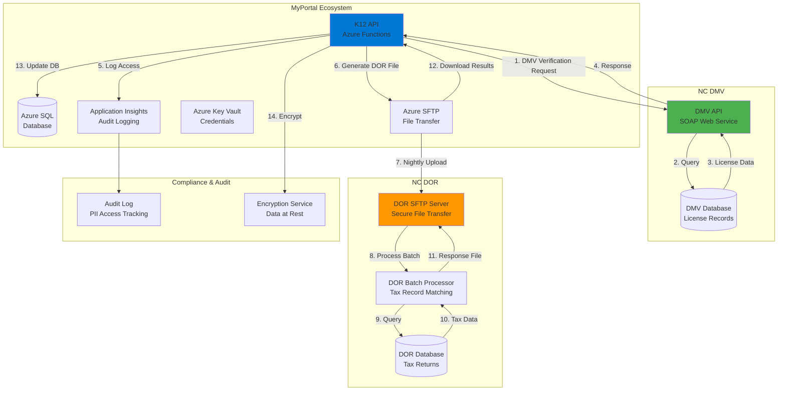
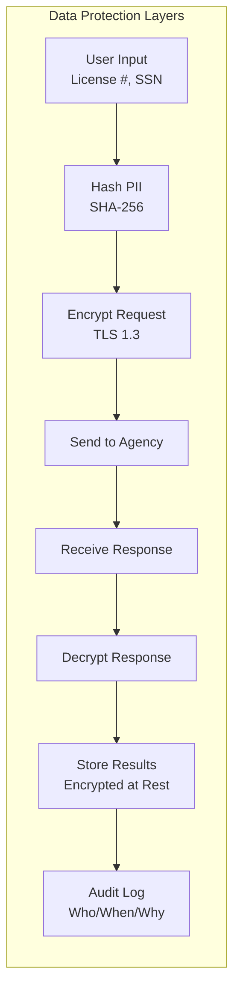
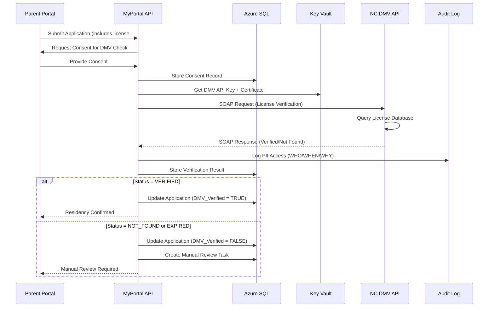
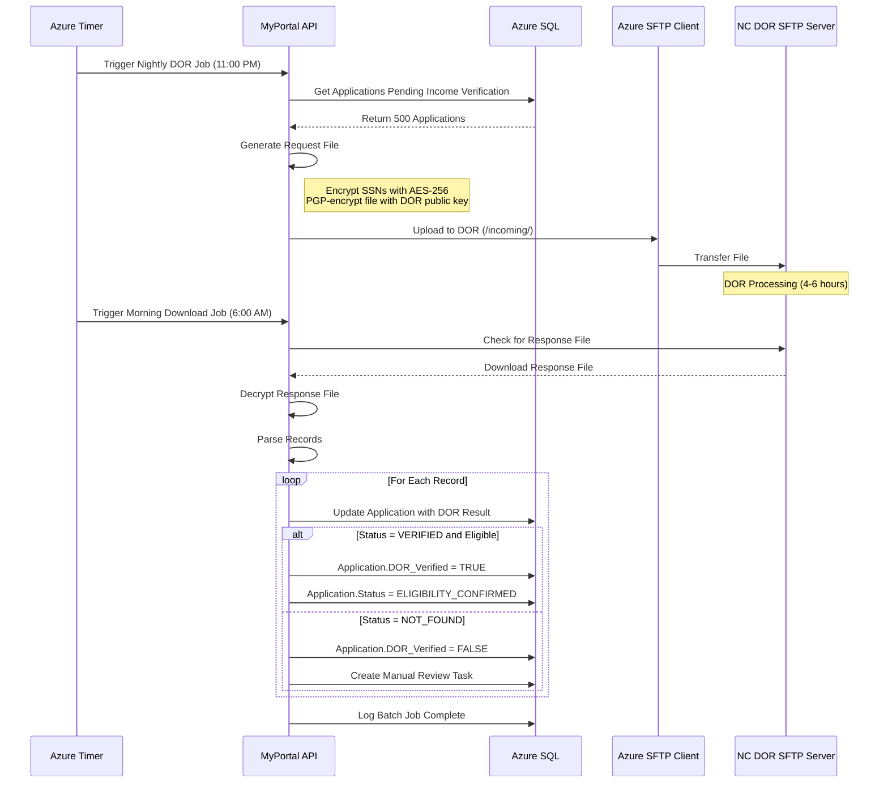
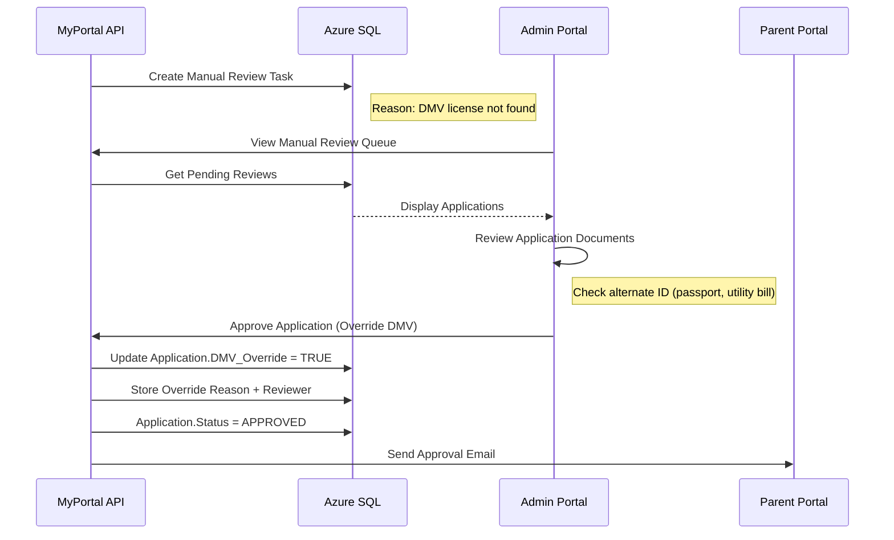

# INT-05: NC DMV/DOR Integration

**Integration ID:** INT-05
**System:** North Carolina DMV & Department of Revenue
**Type:** State Agency Data Exchange
**Classification:** Critical - Compliance Required
**Status:** Active (Production)
**Last Updated:** 2025-01-15

## Table of Contents

- [Overview](#overview)
- [Integration Architecture](#integration-architecture)
- [API Specifications](#api-specifications)
- [Data Flow](#data-flow)
- [Implementation](#implementation)
- [Error Handling](#error-handling)
- [Security](#security)
- [Monitoring & Logging](#monitoring--logging)
- [Testing Strategy](#testing-strategy)
- [Common Issues & Troubleshooting](#common-issues--troubleshooting)
- [References](#references)

---

## Overview

### Purpose

The NC DMV and NC DOR integrations provide **automated verification services** for the NC SEAA K-12 Scholarship program eligibility requirements:

#### NC DMV Integration
- **Residency Verification**: Validate NC driver's license to confirm state residency
- **Identity Verification**: Match applicant name and address against DMV records
- **License Status**: Verify license is valid (not suspended/revoked)
- **Fraud Detection**: Cross-reference license numbers against known fraud patterns

#### NC DOR Integration
- **Income Verification**: Validate household income against tax return data
- **Tax Filing Status**: Confirm NC state tax return filing
- **Dependent Verification**: Verify claimed dependents match tax records
- **AGI Confirmation**: Retrieve Adjusted Gross Income (AGI) for eligibility determination

### Business Context

These integrations are **mandated by NC state law** (HB 823) for scholarship eligibility:

1. **Residency Requirement**: Applicant must be NC resident (DMV verification)
2. **Income Threshold**: Household income ≤ 300% Federal Poverty Level (DOR verification)
3. **Identity Verification**: Prevent fraud through multi-source verification
4. **Compliance**: Meet state audit requirements for fund disbursement
5. **Privacy**: Minimize manual collection of sensitive data (SSN, tax info)

### Integration Scope

| Agency | Data Provided | MyPortal Use | Frequency |
|--------|---------------|--------------|-----------|
| NC DMV | Driver's license verification | Residency confirmation | Real-time API |
| NC DMV | License holder name/address | Identity match | Real-time API |
| NC DOR | Income verification | Eligibility determination | Batch (nightly) |
| NC DOR | Tax filing status | Compliance check | Batch (nightly) |
| NC DOR | Dependent information | Household verification | Batch (nightly) |

### Key Metrics

- **DMV Verification Volume**: 8,500 verifications/year (~35/day during enrollment)
- **DOR Verification Volume**: 8,500 income checks/year (nightly batch)
- **DMV Success Rate**: 92% (8% require manual review)
- **DOR Success Rate**: 88% (12% require manual review)
- **Average Response Time**: DMV 2.3s, DOR batch processing 4 hours
- **Manual Review Rate**: 10% (combined)
- **Cost**: No per-transaction fee (state agency agreement)

---

## Integration Architecture

### High-Level Architecture



### Integration Methods

| Feature | NC DMV | NC DOR |
|---------|--------|--------|
| Protocol | SOAP Web Service | SFTP Batch File |
| Authentication | Mutual TLS + API Key | SSH Key + IP Whitelist |
| Request Format | XML (SOAP Envelope) | Pipe-delimited text file |
| Response Format | XML (SOAP Response) | Pipe-delimited text file |
| Processing | Synchronous (real-time) | Asynchronous (batch) |
| Frequency | On-demand | Daily (11:00 PM) |
| Data Volume | 1 record per request | 500-1,000 records per batch |
| SLA | 99% uptime, <5s response | 24-hour turnaround |

### Data Security Model



---

## API Specifications

### NC DMV API

#### 1. License Verification Request

**Endpoint:** `https://dmv.nc.gov/api/v2/verification/license`

**Protocol:** SOAP 1.2

**Authentication:**
- **Mutual TLS**: Client certificate required
- **API Key**: Included in SOAP header

**Request (SOAP XML):**

```xml
<?xml version="1.0" encoding="UTF-8"?>
<soap:Envelope xmlns:soap="http://www.w3.org/2003/05/soap-envelope"
               xmlns:dmv="http://dmv.nc.gov/api/v2">
  <soap:Header>
    <dmv:Authentication>
      <dmv:ApiKey>ABC123DEF456GHI789</dmv:ApiKey>
      <dmv:RequestorID>SEAA-K12-MyPortal</dmv:RequestorID>
      <dmv:RequestTimestamp>2024-11-15T14:30:00Z</dmv:RequestTimestamp>
    </dmv:Authentication>
  </soap:Header>
  <soap:Body>
    <dmv:VerifyLicenseRequest>
      <dmv:LicenseNumber>12345678</dmv:LicenseNumber>
      <dmv:LastName>Smith</dmv:LastName>
      <dmv:DateOfBirth>1985-03-15</dmv:DateOfBirth>
      <dmv:Last4SSN>1234</dmv:Last4SSN>
      <dmv:VerificationPurpose>SCHOLARSHIP_ELIGIBILITY</dmv:VerificationPurpose>
      <dmv:ConsentProvided>true</dmv:ConsentProvided>
    </dmv:VerifyLicenseRequest>
  </soap:Body>
</soap:Envelope>
```

**Response (SOAP XML):**

```xml
<?xml version="1.0" encoding="UTF-8"?>
<soap:Envelope xmlns:soap="http://www.w3.org/2003/05/soap-envelope"
               xmlns:dmv="http://dmv.nc.gov/api/v2">
  <soap:Body>
    <dmv:VerifyLicenseResponse>
      <dmv:TransactionID>DMV-2024-11-15-001234</dmv:TransactionID>
      <dmv:Timestamp>2024-11-15T14:30:05Z</dmv:Timestamp>
      <dmv:VerificationResult>
        <dmv:Status>VERIFIED</dmv:Status>
        <dmv:MatchScore>100</dmv:MatchScore>
        <dmv:LicenseStatus>VALID</dmv:LicenseStatus>
        <dmv:IssueDate>2020-03-15</dmv:IssueDate>
        <dmv:ExpirationDate>2028-03-15</dmv:ExpirationDate>
        <dmv:LicenseClass>C</dmv:LicenseClass>
        <dmv:NameMatch>EXACT</dmv:NameMatch>
        <dmv:DOBMatch>EXACT</dmv:DOBMatch>
        <dmv:SSNMatch>VERIFIED</dmv:SSNMatch>
        <dmv:Address>
          <dmv:Street>123 Main St</dmv:Street>
          <dmv:City>Raleigh</dmv:City>
          <dmv:State>NC</dmv:State>
          <dmv:ZipCode>27601</dmv:ZipCode>
        </dmv:Address>
        <dmv:ResidencyStatus>NC_RESIDENT</dmv:ResidencyStatus>
      </dmv:VerificationResult>
    </dmv:VerifyLicenseResponse>
  </soap:Body>
</soap:Envelope>
```

**Status Values:**
- `VERIFIED`: License verified, all fields match
- `PARTIAL_MATCH`: License found, some fields don't match
- `NOT_FOUND`: License number not in system
- `EXPIRED`: License expired
- `SUSPENDED`: License suspended/revoked
- `ERROR`: System error, retry

**Match Score:**
- `100`: Perfect match (all fields)
- `75-99`: Partial match (name/DOB match, address differs)
- `50-74`: Weak match (requires manual review)
- `0-49`: No match (reject)

#### 2. Address Update Notification

**Purpose:** DMV notifies MyPortal when license holder updates address (optional webhook).

**Webhook Endpoint:** `https://k12-api.myportal.nc.gov/api/webhooks/dmv/address-change`

**Payload:**

```xml
<dmv:AddressChangeNotification>
  <dmv:LicenseNumber>12345678</dmv:LicenseNumber>
  <dmv:EffectiveDate>2024-11-15</dmv:EffectiveDate>
  <dmv:NewAddress>
    <dmv:Street>456 Oak Ave</dmv:Street>
    <dmv:City>Durham</dmv:City>
    <dmv:State>NC</dmv:State>
    <dmv:ZipCode>27701</dmv:ZipCode>
  </dmv:NewAddress>
</dmv:AddressChangeNotification>
```

### NC DOR API (SFTP Batch)

#### 1. Income Verification Request File

**File Format:** Pipe-delimited text file (`|` separator)

**File Name Convention:** `SEAA_K12_INCOME_REQUEST_YYYYMMDD_HHMMSS.txt`

**Upload Location:** `/incoming/seaa-k12/`

**Request File Structure:**

```
HEADER|NC SEAA K12|2024-11-15|REQUEST_COUNT=500
RECORD|APP-2024-001234|123-45-6789|Smith|John|1985-03-15|2023
RECORD|APP-2024-001235|234-56-7890|Johnson|Emily|1990-07-22|2023
RECORD|APP-2024-001236|345-67-8901|Williams|Michael|1982-11-30|2023
TRAILER|TOTAL_RECORDS=500|CHECKSUM=ABC123DEF456
```

**Field Definitions:**

| Position | Field | Description | Example |
|----------|-------|-------------|---------|
| 1 | Record Type | `HEADER`, `RECORD`, `TRAILER` | `RECORD` |
| 2 | Application ID | MyPortal application ID | `APP-2024-001234` |
| 3 | SSN | Social Security Number (encrypted) | `123-45-6789` |
| 4 | Last Name | Tax filer last name | `Smith` |
| 5 | First Name | Tax filer first name | `John` |
| 6 | Date of Birth | YYYY-MM-DD format | `1985-03-15` |
| 7 | Tax Year | Year of tax return | `2023` |

**Security Requirements:**
- **Encrypt SSN**: Use AES-256 encryption before transmission
- **File Encryption**: PGP-encrypt entire file with DOR public key
- **SSH Key Auth**: Use 4096-bit RSA key for SFTP authentication

#### 2. Income Verification Response File

**File Name Convention:** `SEAA_K12_INCOME_RESPONSE_YYYYMMDD_HHMMSS.txt`

**Download Location:** `/outgoing/seaa-k12/`

**Response File Structure:**

```
HEADER|NC DOR|2024-11-16|RECORD_COUNT=500
RECORD|APP-2024-001234|VERIFIED|FILED|45000|SINGLE|1|ELIGIBLE
RECORD|APP-2024-001235|VERIFIED|FILED|62000|MARRIED_JOINT|2|INELIGIBLE
RECORD|APP-2024-001236|NOT_FOUND|NOT_FILED||||MANUAL_REVIEW
TRAILER|TOTAL_VERIFIED=498|TOTAL_NOT_FOUND=2|CHECKSUM=XYZ789ABC123
```

**Field Definitions:**

| Position | Field | Description | Values |
|----------|-------|-------------|--------|
| 2 | Application ID | MyPortal application ID | `APP-2024-001234` |
| 3 | Verification Status | Result of verification | `VERIFIED`, `NOT_FOUND`, `MISMATCH` |
| 4 | Filing Status | Tax filing status | `FILED`, `NOT_FILED`, `AMENDED` |
| 5 | AGI | Adjusted Gross Income | Dollar amount (no decimals) |
| 6 | Filing Type | Tax filing type | `SINGLE`, `MARRIED_JOINT`, `HEAD_OF_HOUSEHOLD` |
| 7 | Dependents | Number of dependents | Integer |
| 8 | Eligibility | Calculated eligibility | `ELIGIBLE`, `INELIGIBLE`, `MANUAL_REVIEW` |

**Verification Status:**
- `VERIFIED`: Tax record found, all fields match
- `NOT_FOUND`: No tax return filed for specified year
- `MISMATCH`: Record found but name/DOB don't match
- `MULTIPLE_MATCHES`: Multiple tax records found (manual review needed)

---

## Data Flow

### 1. DMV License Verification Flow (Real-Time)



### 2. DOR Income Verification Flow (Batch)



### 3. Manual Review Escalation Flow



---

## Implementation

### C# Implementation with Azure Functions

#### 1. NC DMV SOAP Client

**File:** `Infrastructure/HttpClients/NcDmvClient.cs`

```csharp
using System;
using System.Net.Http;
using System.Security.Cryptography.X509Certificates;
using System.ServiceModel;
using System.Text;
using System.Threading.Tasks;
using System.Xml.Linq;
using Microsoft.Extensions.Configuration;
using Microsoft.Extensions.Logging;

namespace K12.Infrastructure.HttpClients
{
    public class NcDmvClient : INcDmvClient
    {
        private readonly IConfiguration _configuration;
        private readonly ILogger<NcDmvClient> _logger;

        public NcDmvClient(
            IConfiguration configuration,
            ILogger<NcDmvClient> logger)
        {
            _configuration = configuration;
            _logger = logger;
        }

        /// <summary>
        /// Verify driver's license with NC DMV
        /// </summary>
        public async Task<DmvVerificationResult> VerifyLicenseAsync(DmvVerificationRequest request)
        {
            try
            {
                // Create SOAP request
                var soapRequest = BuildSoapRequest(request);

                // Send SOAP request with mutual TLS
                var response = await SendSoapRequestAsync(soapRequest);

                // Parse SOAP response
                return ParseSoapResponse(response);
            }
            catch (Exception ex)
            {
                _logger.LogError(ex, "DMV license verification failed for License {LicenseNumber}",
                    MaskLicenseNumber(request.LicenseNumber));
                throw;
            }
        }

        private string BuildSoapRequest(DmvVerificationRequest request)
        {
            var apiKey = _configuration["NcDmv:ApiKey"];

            var soapEnvelope = new XDocument(
                new XDeclaration("1.0", "UTF-8", null),
                new XElement(XName.Get("Envelope", "http://www.w3.org/2003/05/soap-envelope"),
                    new XElement(XName.Get("Header", "http://www.w3.org/2003/05/soap-envelope"),
                        new XElement(XName.Get("Authentication", "http://dmv.nc.gov/api/v2"),
                            new XElement(XName.Get("ApiKey", "http://dmv.nc.gov/api/v2"), apiKey),
                            new XElement(XName.Get("RequestorID", "http://dmv.nc.gov/api/v2"), "SEAA-K12-MyPortal"),
                            new XElement(XName.Get("RequestTimestamp", "http://dmv.nc.gov/api/v2"), DateTime.UtcNow.ToString("O"))
                        )
                    ),
                    new XElement(XName.Get("Body", "http://www.w3.org/2003/05/soap-envelope"),
                        new XElement(XName.Get("VerifyLicenseRequest", "http://dmv.nc.gov/api/v2"),
                            new XElement(XName.Get("LicenseNumber", "http://dmv.nc.gov/api/v2"), request.LicenseNumber),
                            new XElement(XName.Get("LastName", "http://dmv.nc.gov/api/v2"), request.LastName),
                            new XElement(XName.Get("DateOfBirth", "http://dmv.nc.gov/api/v2"), request.DateOfBirth.ToString("yyyy-MM-dd")),
                            new XElement(XName.Get("Last4SSN", "http://dmv.nc.gov/api/v2"), request.Last4SSN),
                            new XElement(XName.Get("VerificationPurpose", "http://dmv.nc.gov/api/v2"), "SCHOLARSHIP_ELIGIBILITY"),
                            new XElement(XName.Get("ConsentProvided", "http://dmv.nc.gov/api/v2"), "true")
                        )
                    )
                )
            );

            return soapEnvelope.ToString();
        }

        private async Task<string> SendSoapRequestAsync(string soapRequest)
        {
            // Load client certificate for mutual TLS
            var certPath = _configuration["NcDmv:ClientCertificatePath"];
            var certPassword = _configuration["NcDmv:ClientCertificatePassword"];
            var certificate = new X509Certificate2(certPath, certPassword);

            var handler = new HttpClientHandler();
            handler.ClientCertificates.Add(certificate);
            handler.ServerCertificateCustomValidationCallback = (message, cert, chain, errors) =>
            {
                // Validate DMV server certificate
                var expectedThumbprint = _configuration["NcDmv:ServerCertificateThumbprint"];
                return cert.Thumbprint.Equals(expectedThumbprint, StringComparison.OrdinalIgnoreCase);
            };

            using var httpClient = new HttpClient(handler);
            httpClient.Timeout = TimeSpan.FromSeconds(10);

            var content = new StringContent(soapRequest, Encoding.UTF8, "application/soap+xml");
            var response = await httpClient.PostAsync(_configuration["NcDmv:EndpointUrl"], content);

            response.EnsureSuccessStatusCode();

            return await response.Content.ReadAsStringAsync();
        }

        private DmvVerificationResult ParseSoapResponse(string soapResponse)
        {
            var doc = XDocument.Parse(soapResponse);
            var ns = XNamespace.Get("http://dmv.nc.gov/api/v2");

            var result = doc.Descendants(ns + "VerificationResult").FirstOrDefault();

            if (result == null)
            {
                throw new InvalidOperationException("Invalid SOAP response from DMV");
            }

            return new DmvVerificationResult
            {
                Status = result.Element(ns + "Status")?.Value,
                MatchScore = int.Parse(result.Element(ns + "MatchScore")?.Value ?? "0"),
                LicenseStatus = result.Element(ns + "LicenseStatus")?.Value,
                ResidencyStatus = result.Element(ns + "ResidencyStatus")?.Value,
                IsVerified = result.Element(ns + "Status")?.Value == "VERIFIED",
                VerificationTimestamp = DateTime.UtcNow
            };
        }

        private string MaskLicenseNumber(string licenseNumber)
        {
            if (string.IsNullOrEmpty(licenseNumber) || licenseNumber.Length < 4)
                return "****";

            return $"****{licenseNumber.Substring(licenseNumber.Length - 4)}";
        }
    }

    public class DmvVerificationRequest
    {
        public string LicenseNumber { get; set; }
        public string LastName { get; set; }
        public DateTime DateOfBirth { get; set; }
        public string Last4SSN { get; set; }
    }

    public class DmvVerificationResult
    {
        public bool IsVerified { get; set; }
        public string Status { get; set; }
        public int MatchScore { get; set; }
        public string LicenseStatus { get; set; }
        public string ResidencyStatus { get; set; }
        public DateTime VerificationTimestamp { get; set; }
    }
}
```

#### 2. NC DOR SFTP Batch Processor

**File:** `Application/Services/NcDorBatchService.cs`

```csharp
using System;
using System.Collections.Generic;
using System.IO;
using System.Linq;
using System.Security.Cryptography;
using System.Text;
using System.Threading.Tasks;
using K12.Domain.Entities;
using K12.Domain.Repositories;
using Microsoft.Extensions.Configuration;
using Microsoft.Extensions.Logging;
using Renci.SshNet;

namespace K12.Application.Services
{
    public class NcDorBatchService : INcDorBatchService
    {
        private readonly IApplicationRepository _applicationRepository;
        private readonly IConfiguration _configuration;
        private readonly ILogger<NcDorBatchService> _logger;

        public NcDorBatchService(
            IApplicationRepository applicationRepository,
            IConfiguration configuration,
            ILogger<NcDorBatchService> logger)
        {
            _applicationRepository = applicationRepository;
            _configuration = configuration;
            _logger = logger;
        }

        /// <summary>
        /// Generate and upload nightly DOR income verification request file
        /// </summary>
        public async Task GenerateAndUploadRequestFileAsync()
        {
            _logger.LogInformation("Starting DOR batch job");

            // Get applications pending income verification
            var applications = await _applicationRepository
                .GetApplicationsPendingIncomeVerificationAsync();

            _logger.LogInformation("Found {Count} applications for income verification", applications.Count);

            if (!applications.Any())
            {
                _logger.LogInformation("No applications to process, skipping DOR batch");
                return;
            }

            // Generate request file
            var requestFile = GenerateRequestFile(applications);

            // Encrypt SSNs
            var encryptedFile = EncryptSensitiveData(requestFile);

            // PGP-encrypt entire file
            var pgpEncryptedFile = PgpEncryptFile(encryptedFile);

            // Upload to DOR SFTP server
            await UploadToSftpAsync(pgpEncryptedFile);

            _logger.LogInformation("DOR request file uploaded successfully");
        }

        /// <summary>
        /// Download and process DOR response file
        /// </summary>
        public async Task DownloadAndProcessResponseFileAsync()
        {
            _logger.LogInformation("Downloading DOR response file");

            // Download from SFTP
            var encryptedFile = await DownloadFromSftpAsync();

            // PGP-decrypt file
            var decryptedFile = PgpDecryptFile(encryptedFile);

            // Parse response file
            var results = ParseResponseFile(decryptedFile);

            _logger.LogInformation("Processing {Count} DOR verification results", results.Count);

            // Update applications with results
            foreach (var result in results)
            {
                await ProcessVerificationResultAsync(result);
            }

            _logger.LogInformation("DOR batch processing complete");
        }

        private string GenerateRequestFile(List<Application> applications)
        {
            var sb = new StringBuilder();

            // Header
            sb.AppendLine($"HEADER|NC SEAA K12|{DateTime.UtcNow:yyyy-MM-dd}|REQUEST_COUNT={applications.Count}");

            // Records
            foreach (var app in applications)
            {
                sb.AppendLine($"RECORD|{app.ApplicationId}|{app.Household.PrimaryContact.SSN}|" +
                              $"{app.Household.PrimaryContact.LastName}|{app.Household.PrimaryContact.FirstName}|" +
                              $"{app.Household.PrimaryContact.DateOfBirth:yyyy-MM-dd}|2023");
            }

            // Trailer
            var checksum = ComputeChecksum(sb.ToString());
            sb.AppendLine($"TRAILER|TOTAL_RECORDS={applications.Count}|CHECKSUM={checksum}");

            return sb.ToString();
        }

        private string EncryptSensitiveData(string fileContent)
        {
            // Encrypt SSNs with AES-256 before transmission
            // (Placeholder - implement actual encryption)
            return fileContent;
        }

        private string PgpEncryptFile(string content)
        {
            // PGP-encrypt entire file with DOR public key
            // (Placeholder - use BouncyCastle or similar library)
            return content;
        }

        private async Task UploadToSftpAsync(string fileContent)
        {
            var host = _configuration["NcDor:SftpHost"];
            var username = _configuration["NcDor:SftpUsername"];
            var keyPath = _configuration["NcDor:SftpPrivateKeyPath"];

            using var privateKeyFile = new PrivateKeyFile(keyPath);
            var connectionInfo = new ConnectionInfo(host, username,
                new PrivateKeyAuthenticationMethod(username, privateKeyFile));

            using var sftp = new SftpClient(connectionInfo);
            sftp.Connect();

            var fileName = $"SEAA_K12_INCOME_REQUEST_{DateTime.UtcNow:yyyyMMdd_HHmmss}.txt";
            var remotePath = $"/incoming/seaa-k12/{fileName}";

            using var stream = new MemoryStream(Encoding.UTF8.GetBytes(fileContent));
            sftp.UploadFile(stream, remotePath);

            sftp.Disconnect();

            _logger.LogInformation("Uploaded DOR request file: {FileName}", fileName);
        }

        private async Task<string> DownloadFromSftpAsync()
        {
            var host = _configuration["NcDor:SftpHost"];
            var username = _configuration["NcDor:SftpUsername"];
            var keyPath = _configuration["NcDor:SftpPrivateKeyPath"];

            using var privateKeyFile = new PrivateKeyFile(keyPath);
            var connectionInfo = new ConnectionInfo(host, username,
                new PrivateKeyAuthenticationMethod(username, privateKeyFile));

            using var sftp = new SftpClient(connectionInfo);
            sftp.Connect();

            var remotePath = "/outgoing/seaa-k12/";
            var files = sftp.ListDirectory(remotePath)
                .Where(f => f.Name.StartsWith("SEAA_K12_INCOME_RESPONSE_"))
                .OrderByDescending(f => f.LastWriteTime)
                .ToList();

            if (!files.Any())
            {
                _logger.LogWarning("No DOR response files found");
                return null;
            }

            var latestFile = files.First();
            using var stream = new MemoryStream();
            sftp.DownloadFile(latestFile.FullName, stream);

            sftp.Disconnect();

            _logger.LogInformation("Downloaded DOR response file: {FileName}", latestFile.Name);

            return Encoding.UTF8.GetString(stream.ToArray());
        }

        private string PgpDecryptFile(string encryptedContent)
        {
            // PGP-decrypt file with MyPortal private key
            // (Placeholder)
            return encryptedContent;
        }

        private List<DorVerificationResult> ParseResponseFile(string fileContent)
        {
            var results = new List<DorVerificationResult>();
            var lines = fileContent.Split('\n');

            foreach (var line in lines)
            {
                if (line.StartsWith("RECORD"))
                {
                    var fields = line.Split('|');
                    results.Add(new DorVerificationResult
                    {
                        ApplicationId = fields[1],
                        VerificationStatus = fields[2],
                        FilingStatus = fields[3],
                        AdjustedGrossIncome = !string.IsNullOrEmpty(fields[4]) ? decimal.Parse(fields[4]) : null,
                        FilingType = fields[5],
                        DependentsCount = !string.IsNullOrEmpty(fields[6]) ? int.Parse(fields[6]) : null,
                        Eligibility = fields[7]
                    });
                }
            }

            return results;
        }

        private async Task ProcessVerificationResultAsync(DorVerificationResult result)
        {
            var application = await _applicationRepository.GetByApplicationIdAsync(result.ApplicationId);

            if (application == null)
            {
                _logger.LogWarning("Application not found: {ApplicationId}", result.ApplicationId);
                return;
            }

            application.DorVerificationStatus = result.VerificationStatus;
            application.DorVerifiedAt = DateTime.UtcNow;

            if (result.VerificationStatus == "VERIFIED")
            {
                application.HouseholdIncome = result.AdjustedGrossIncome;
                application.IncomeVerified = true;

                if (result.Eligibility == "ELIGIBLE")
                {
                    application.Status = ApplicationStatus.EligibilityConfirmed;
                }
                else
                {
                    application.Status = ApplicationStatus.Ineligible;
                    application.IneligibilityReason = "Income exceeds threshold";
                }
            }
            else
            {
                // Manual review required
                application.RequiresManualReview = true;
                application.ManualReviewReason = $"DOR verification: {result.VerificationStatus}";
            }

            await _applicationRepository.UpdateAsync(application);
        }

        private string ComputeChecksum(string content)
        {
            using var md5 = MD5.Create();
            var hash = md5.ComputeHash(Encoding.UTF8.GetBytes(content));
            return BitConverter.ToString(hash).Replace("-", "").ToUpper();
        }
    }

    public class DorVerificationResult
    {
        public string ApplicationId { get; set; }
        public string VerificationStatus { get; set; }
        public string FilingStatus { get; set; }
        public decimal? AdjustedGrossIncome { get; set; }
        public string FilingType { get; set; }
        public int? DependentsCount { get; set; }
        public string Eligibility { get; set; }
    }
}
```

---

## Error Handling

### DMV Verification Errors

```csharp
catch (Exception ex) when (ex.Message.Contains("LICENSE_NOT_FOUND"))
{
    _logger.LogWarning("DMV license not found, creating manual review task");

    await _taskRepository.CreateAsync(new ManualReviewTask
    {
        ApplicationId = applicationId,
        TaskType = TaskType.DmvVerification,
        Reason = "License not found in DMV system",
        Priority = TaskPriority.High
    });
}
```

### DOR Batch Processing Errors

```csharp
catch (SftpException ex)
{
    _logger.LogError(ex, "SFTP connection failed to NC DOR");

    // Alert DevOps team
    await _alertService.SendAlertAsync("NC DOR SFTP connection failed", ex.Message);

    // Retry in 30 minutes
    throw new RetryableException("SFTP connection failed", ex);
}
```

---

## Security

### PII Access Logging

Every access to DMV/DOR data is logged:

```csharp
public async Task LogPiiAccessAsync(string dataType, string userId, string purpose)
{
    await _auditLogRepository.CreateAsync(new AuditLog
    {
        UserId = userId,
        Action = "PII_ACCESS",
        DataType = dataType,
        Purpose = purpose,
        Timestamp = DateTime.UtcNow,
        IpAddress = _httpContextAccessor.HttpContext?.Connection.RemoteIpAddress?.ToString()
    });
}
```

### Data Encryption

- **SSNs**: AES-256 encryption at rest
- **Files**: PGP encryption in transit
- **Certificates**: Mutual TLS for DMV API

---

## Monitoring & Logging

### Application Insights Metrics

```csharp
_telemetryClient.TrackEvent("DMV_Verification",
    new Dictionary<string, string>
    {
        { "status", result.Status },
        { "matchScore", result.MatchScore.ToString() }
    });
```

---

## Testing Strategy

### Integration Tests (Sandbox Environment)

```csharp
[Fact]
public async Task VerifyLicense_ValidNCLicense_ReturnsVerified()
{
    // Use DMV sandbox environment with test license numbers
    var request = new DmvVerificationRequest
    {
        LicenseNumber = "TEST12345678", // DMV test account
        LastName = "TestUser",
        DateOfBirth = DateTime.Parse("1990-01-01"),
        Last4SSN = "0000"
    };

    var result = await _dmvClient.VerifyLicenseAsync(request);

    result.IsVerified.Should().BeTrue();
    result.ResidencyStatus.Should().Be("NC_RESIDENT");
}
```

---

## Common Issues & Troubleshooting

### Issue 1: DMV API Timeout

**Symptoms:** SOAP request times out after 10 seconds

**Resolution:**
- Check network connectivity to DMV servers
- Verify mutual TLS certificate is valid
- Contact DMV support if persistent

### Issue 2: DOR File Processing Delay

**Symptoms:** Response file not available after 24 hours

**Resolution:**
- Verify request file format is correct
- Check SFTP upload succeeded
- Contact DOR batch processing team

---

## References

- **NC DMV API Documentation**: Internal DMV portal (restricted access)
- **NC DOR Integration Guide**: Confluence page 4375904312
- **FERPA Compliance**: Privacy standards for student data
- **Audit Requirements**: NC state audit documentation

---

**Document Version:** 1.0
**Last Reviewed:** 2025-01-15
**Next Review:** 2025-04-15
**Owner:** CFI Integration Team
