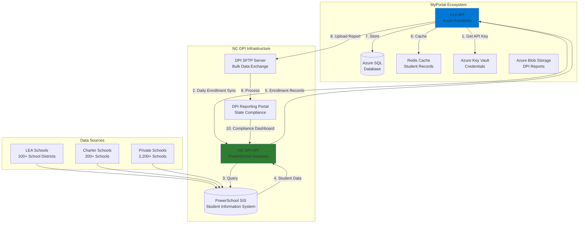
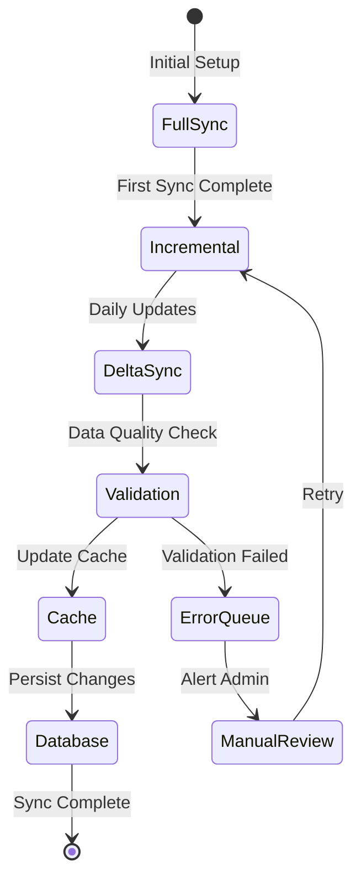
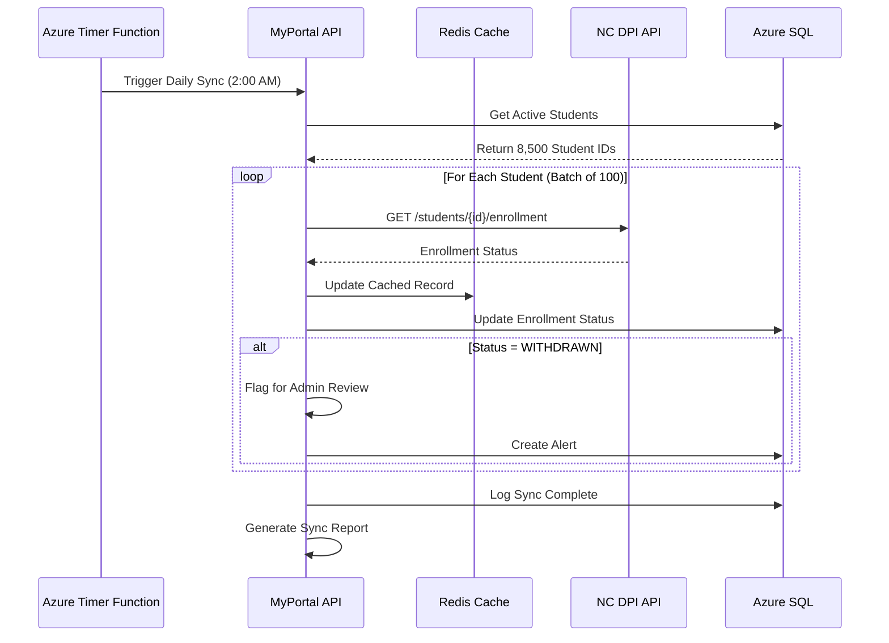
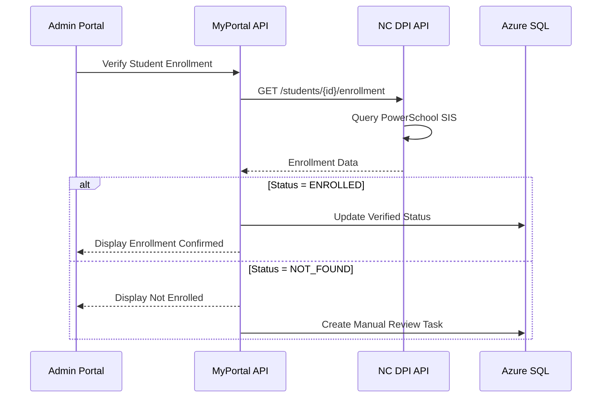
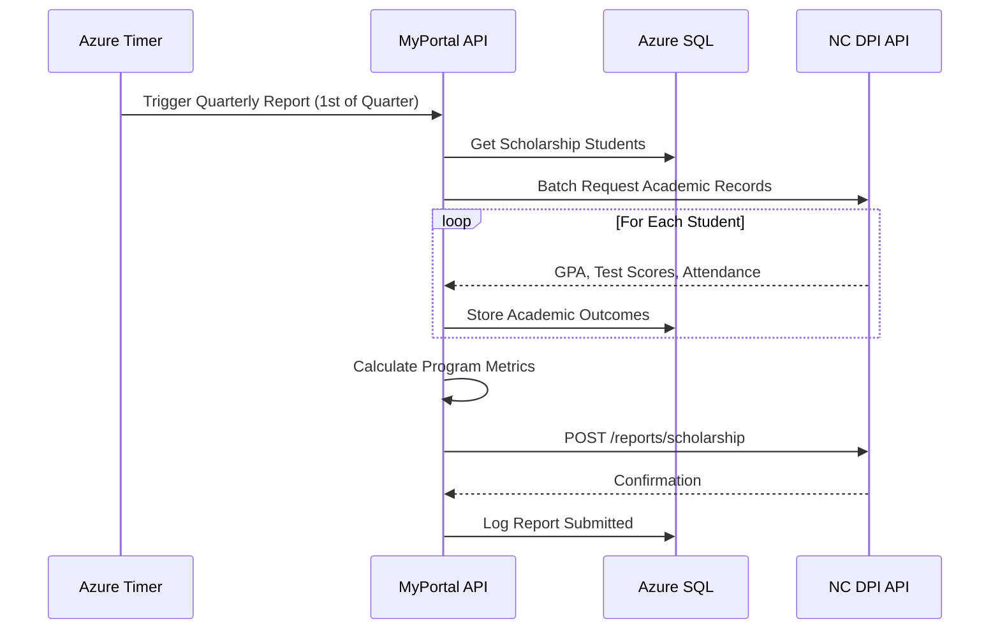

# INT-06: NC DPI Integration (Future)

**Integration ID:** INT-06
**System:** North Carolina Department of Public Instruction
**Type:** State Agency Data Exchange
**Classification:** Strategic - Future Implementation
**Status:** Planned (Phase 2 - 2025-2026)
**Last Updated:** 2025-01-15

## Table of Contents

- [Overview](#overview)
- [Integration Architecture](#integration-architecture)
- [API Specifications](#api-specifications)
- [Data Flow](#data-flow)
- [Implementation](#implementation)
- [Error Handling](#error-handling)
- [Security](#security)
- [Monitoring & Logging](#monitoring--logging)
- [Testing Strategy](#testing-strategy)
- [Roadmap & Milestones](#roadmap--milestones)
- [References](#references)

---

## Overview

### Purpose

The NC DPI (Department of Public Instruction) integration is a **planned future enhancement** that will provide automated student enrollment data exchange and academic records integration for the NC SEAA K-12 Scholarship program. This integration will enable:

- **Enrollment Verification**: Confirm student enrollment in participating schools
- **Academic Records**: Access student academic performance data
- **Attendance Tracking**: Monitor student attendance across school years
- **Statewide Reporting**: Automated reporting to DPI for state compliance
- **Data Quality**: Cross-reference student data with PowerSchool SIS
- **Outcome Metrics**: Track scholarship program effectiveness
- **Compliance**: Meet state reporting requirements under HB 823

### Business Context

The NC DPI integration addresses **long-term program goals**:

1. **Enrollment Validation**: Verify students are attending approved schools
2. **Outcome Tracking**: Measure academic improvement after scholarship award
3. **Fraud Prevention**: Detect duplicate enrollments or phantom students
4. **Policy Analysis**: Provide data for state legislature reporting
5. **Program Optimization**: Identify high-performing schools and providers
6. **Compliance**: Meet DPI reporting mandates (ESSA, FERPA)

### Current State vs. Future State

| Feature | Current State (Phase 1) | Future State (Phase 2 with DPI) |
|---------|------------------------|----------------------------------|
| Enrollment Verification | Manual (school submits attestation) | Automated (DPI PowerSchool sync) |
| Academic Records | Not collected | Automated (grades, test scores) |
| Attendance Data | Not tracked | Real-time attendance alerts |
| School Verification | Manual list maintenance | Automated (DPI school directory) |
| Statewide Reporting | Manual export/upload | Automated API submission |
| Data Latency | 30-60 days | Near real-time (24 hours) |

### Integration Scope

| Data Exchange | Direction | Frequency | Purpose |
|---------------|-----------|-----------|---------|
| Student Enrollment | DPI → MyPortal | Daily | Verify active enrollment |
| School Directory | DPI → MyPortal | Weekly | Update approved schools list |
| Academic Records | DPI → MyPortal | Quarterly | Track student outcomes |
| Scholarship Reporting | MyPortal → DPI | Monthly | State compliance reporting |
| Attendance Data | DPI → MyPortal | Daily | Monitor participation |

### Key Metrics (Projected)

- **Data Sync Volume**: 8,500 student records/day
- **School Directory**: 2,500+ participating schools
- **API Call Volume**: ~50,000 calls/month (600 req/hour peak)
- **Data Latency**: <24 hours (target: 4 hours)
- **Sync Frequency**: Daily at 2:00 AM EST
- **SLA**: 99.5% uptime, <3s response time
- **Cost**: No per-transaction fee (state agency agreement)

---

## Integration Architecture

### High-Level Architecture (Planned)



### Integration Methods (Planned)

| Method | Protocol | Use Case | Status |
|--------|----------|----------|--------|
| REST API | HTTPS/JSON | Real-time enrollment queries | Planned Q2 2025 |
| SFTP Batch | SSH/CSV | Bulk data exchange (nightly) | Planned Q3 2025 |
| SOAP Web Service | HTTPS/XML | Legacy system compatibility | Under evaluation |
| Webhook Notifications | HTTPS/JSON | Real-time enrollment changes | Planned Q4 2025 |

### Data Synchronization Strategy



---

## API Specifications

**Note:** These specifications are **preliminary** and subject to change based on DPI's final API design.

### Authentication (Planned)

#### OAuth 2.0 Client Credentials Flow

```http
POST https://api.dpi.nc.gov/oauth/token
Content-Type: application/x-www-form-urlencoded

grant_type=client_credentials
&client_id={CLIENT_ID}
&client_secret={CLIENT_SECRET}
&scope=student:read school:read attendance:read
```

**Response:**

```json
{
  "access_token": "eyJhbGciOiJSUzI1NiIsInR5cCI6IkpXVCJ9...",
  "token_type": "Bearer",
  "expires_in": 3600,
  "scope": "student:read school:read attendance:read"
}
```

### API Endpoints (Planned)

#### 1. Get Student Enrollment

**Endpoint:** `GET /api/v1/students/{state_student_id}/enrollment`

**Purpose:** Retrieve current enrollment status for a student.

**Request:**

```http
GET https://api.dpi.nc.gov/api/v1/students/NC123456789/enrollment
Authorization: Bearer {ACCESS_TOKEN}
X-Request-ID: req-20241115-143000
```

**Response (200 OK):**

```json
{
  "stateStudentId": "NC123456789",
  "enrollmentStatus": "ENROLLED",
  "currentSchool": {
    "schoolCode": "450-123",
    "schoolName": "Raleigh Charter High School",
    "districtCode": "450",
    "districtName": "Wake County Schools",
    "schoolType": "CHARTER"
  },
  "gradeLevel": "10",
  "enrollmentDate": "2024-08-15",
  "expectedGraduationYear": 2026,
  "fullTimeEquivalent": 1.0,
  "attendanceLastUpdated": "2024-11-15T08:00:00Z"
}
```

**Enrollment Status Values:**
- `ENROLLED`: Currently enrolled
- `WITHDRAWN`: Withdrawn from school
- `GRADUATED`: Graduated
- `TRANSFERRED`: Transferred to another school
- `NOT_FOUND`: No enrollment record

#### 2. Get Student Academic Records

**Endpoint:** `GET /api/v1/students/{state_student_id}/academics`

**Purpose:** Retrieve student grades and test scores.

**Query Parameters:**
- `school_year`: Academic year (e.g., `2024-2025`)
- `include_test_scores`: Include standardized test scores (default: `false`)

**Response (200 OK):**

```json
{
  "stateStudentId": "NC123456789",
  "schoolYear": "2024-2025",
  "gradeLevel": "10",
  "gpa": {
    "cumulative": 3.45,
    "current": 3.62,
    "scale": 4.0
  },
  "courses": [
    {
      "courseCode": "ENG-10-H",
      "courseName": "English 10 Honors",
      "creditHours": 1.0,
      "grade": "A",
      "numericGrade": 92,
      "term": "Fall 2024"
    },
    {
      "courseCode": "ALG-2",
      "courseName": "Algebra II",
      "creditHours": 1.0,
      "grade": "B+",
      "numericGrade": 87,
      "term": "Fall 2024"
    }
  ],
  "testScores": [
    {
      "testName": "NC End-of-Course - English II",
      "testDate": "2023-05-15",
      "score": 4,
      "scale": "1-5",
      "proficiencyLevel": "Proficient"
    }
  ],
  "attendanceRate": 96.5,
  "absenceDays": 6,
  "tardyCount": 3
}
```

#### 3. List Approved Schools

**Endpoint:** `GET /api/v1/schools`

**Purpose:** Retrieve list of DPI-approved schools eligible for scholarship program.

**Query Parameters:**
- `district_code`: Filter by district (e.g., `450`)
- `school_type`: Filter by type (`PUBLIC`, `CHARTER`, `PRIVATE`)
- `active_only`: Only return active schools (default: `true`)

**Response (200 OK):**

```json
{
  "count": 2500,
  "schools": [
    {
      "schoolCode": "450-123",
      "schoolName": "Raleigh Charter High School",
      "districtCode": "450",
      "districtName": "Wake County Schools",
      "schoolType": "CHARTER",
      "grades": ["9", "10", "11", "12"],
      "address": {
        "street": "123 Education Blvd",
        "city": "Raleigh",
        "state": "NC",
        "zipCode": "27601"
      },
      "principal": {
        "firstName": "Jane",
        "lastName": "Smith",
        "email": "principal@raleighcharter.org"
      },
      "activeStatus": true,
      "accreditationStatus": "ACCREDITED"
    }
  ]
}
```

#### 4. Submit Scholarship Report

**Endpoint:** `POST /api/v1/reports/scholarship`

**Purpose:** Submit monthly scholarship data to DPI for state compliance.

**Request:**

```json
{
  "reportingPeriod": "2024-11",
  "programName": "NC SEAA K-12 Scholarship",
  "reportDate": "2024-12-01",
  "statistics": {
    "totalApplications": 1250,
    "approvedApplications": 890,
    "totalAwardAmount": 6675000,
    "averageAward": 7500,
    "studentsServed": 890
  },
  "demographicBreakdown": {
    "byGrade": {
      "K": 45,
      "1": 52,
      "2": 58,
      "3": 61,
      "4": 67,
      "5": 72,
      "6": 78,
      "7": 82,
      "8": 85,
      "9": 90,
      "10": 87,
      "11": 75,
      "12": 38
    },
    "bySchoolType": {
      "PUBLIC": 120,
      "CHARTER": 345,
      "PRIVATE": 425
    }
  },
  "outcomes": {
    "enrollmentRetention": 94.5,
    "averageGpaIncrease": 0.23,
    "attendanceRateImprovement": 3.2
  }
}
```

**Response (201 Created):**

```json
{
  "reportId": "RPT-2024-11-001",
  "status": "SUBMITTED",
  "submissionTimestamp": "2024-12-01T10:30:00Z",
  "confirmationNumber": "DPI-CONF-ABC123"
}
```

#### 5. Get Student Attendance

**Endpoint:** `GET /api/v1/students/{state_student_id}/attendance`

**Purpose:** Retrieve student attendance records.

**Query Parameters:**
- `start_date`: Start date (YYYY-MM-DD)
- `end_date`: End date (YYYY-MM-DD)

**Response (200 OK):**

```json
{
  "stateStudentId": "NC123456789",
  "schoolYear": "2024-2025",
  "attendanceSummary": {
    "totalDays": 85,
    "presentDays": 82,
    "absentDays": 3,
    "tardyDays": 2,
    "attendanceRate": 96.5
  },
  "attendanceDetails": [
    {
      "date": "2024-11-10",
      "status": "PRESENT"
    },
    {
      "date": "2024-11-11",
      "status": "ABSENT",
      "reason": "Illness",
      "excused": true
    },
    {
      "date": "2024-11-12",
      "status": "TARDY",
      "minutesLate": 15
    }
  ]
}
```

### SFTP Batch Exchange (Alternative Method)

For bulk data exchange, DPI may provide **SFTP-based file transfer**:

#### Daily Enrollment File

**File Format:** CSV

**File Name:** `DPI_ENROLLMENT_YYYYMMDD.csv`

**File Structure:**

```csv
STATE_STUDENT_ID,SCHOOL_CODE,GRADE_LEVEL,ENROLLMENT_DATE,STATUS,LAST_UPDATED
NC123456789,450-123,10,2024-08-15,ENROLLED,2024-11-15 08:00:00
NC234567890,450-124,11,2024-08-15,ENROLLED,2024-11-15 08:00:00
NC345678901,320-045,9,2024-08-15,WITHDRAWN,2024-10-30 14:30:00
```

---

## Data Flow

### 1. Daily Enrollment Sync Flow (Planned)



### 2. Real-Time Enrollment Verification Flow (Planned)



### 3. Academic Outcomes Reporting Flow (Planned)



---

## Implementation

### C# Implementation (Planned)

#### 1. NC DPI API Client

**File:** `Infrastructure/HttpClients/NcDpiClient.cs`

```csharp
using System;
using System.Collections.Generic;
using System.Net.Http;
using System.Net.Http.Headers;
using System.Text;
using System.Text.Json;
using System.Threading.Tasks;
using Microsoft.Extensions.Configuration;
using Microsoft.Extensions.Logging;
using Polly;

namespace K12.Infrastructure.HttpClients
{
    public class NcDpiClient : INcDpiClient
    {
        private readonly HttpClient _httpClient;
        private readonly IConfiguration _configuration;
        private readonly ILogger<NcDpiClient> _logger;
        private readonly AsyncRetryPolicy<HttpResponseMessage> _retryPolicy;

        private string _cachedAccessToken;
        private DateTime _tokenExpirationTime;

        public NcDpiClient(
            HttpClient httpClient,
            IConfiguration configuration,
            ILogger<NcDpiClient> logger)
        {
            _httpClient = httpClient;
            _configuration = configuration;
            _logger = logger;

            _httpClient.BaseAddress = new Uri(_configuration["NcDpi:BaseUrl"]);
            _httpClient.DefaultRequestHeaders.Accept.Add(
                new MediaTypeWithQualityHeaderValue("application/json"));

            _retryPolicy = Policy
                .HandleResult<HttpResponseMessage>(r => (int)r.StatusCode >= 500)
                .WaitAndRetryAsync(
                    retryCount: 3,
                    sleepDurationProvider: retryAttempt => TimeSpan.FromSeconds(Math.Pow(2, retryAttempt)));
        }

        /// <summary>
        /// Get or refresh OAuth 2.0 access token
        /// </summary>
        private async Task<string> GetAccessTokenAsync()
        {
            if (!string.IsNullOrEmpty(_cachedAccessToken) &&
                DateTime.UtcNow < _tokenExpirationTime.AddMinutes(-5))
            {
                return _cachedAccessToken;
            }

            _logger.LogInformation("Requesting new NC DPI access token");

            var clientId = _configuration["NcDpi:ClientId"];
            var clientSecret = _configuration["NcDpi:ClientSecret"];

            var tokenRequest = new HttpRequestMessage(HttpMethod.Post, "/oauth/token")
            {
                Content = new FormUrlEncodedContent(new[]
                {
                    new KeyValuePair<string, string>("grant_type", "client_credentials"),
                    new KeyValuePair<string, string>("client_id", clientId),
                    new KeyValuePair<string, string>("client_secret", clientSecret),
                    new KeyValuePair<string, string>("scope", "student:read school:read attendance:read")
                })
            };

            var response = await _httpClient.SendAsync(tokenRequest);
            response.EnsureSuccessStatusCode();

            var tokenResponse = await JsonSerializer.DeserializeAsync<TokenResponse>(
                await response.Content.ReadAsStreamAsync());

            _cachedAccessToken = tokenResponse.AccessToken;
            _tokenExpirationTime = DateTime.UtcNow.AddSeconds(tokenResponse.ExpiresIn);

            return _cachedAccessToken;
        }

        /// <summary>
        /// Get student enrollment status
        /// </summary>
        public async Task<StudentEnrollmentResponse> GetStudentEnrollmentAsync(string stateStudentId)
        {
            var accessToken = await GetAccessTokenAsync();

            var request = new HttpRequestMessage(
                HttpMethod.Get,
                $"/api/v1/students/{stateStudentId}/enrollment");

            request.Headers.Authorization = new AuthenticationHeaderValue("Bearer", accessToken);

            var response = await _retryPolicy.ExecuteAsync(async () =>
                await _httpClient.SendAsync(request));

            if (response.StatusCode == System.Net.HttpStatusCode.NotFound)
            {
                return new StudentEnrollmentResponse
                {
                    EnrollmentStatus = "NOT_FOUND"
                };
            }

            response.EnsureSuccessStatusCode();

            return await JsonSerializer.DeserializeAsync<StudentEnrollmentResponse>(
                await response.Content.ReadAsStreamAsync());
        }

        /// <summary>
        /// Get student academic records
        /// </summary>
        public async Task<StudentAcademicResponse> GetStudentAcademicsAsync(
            string stateStudentId,
            string schoolYear)
        {
            var accessToken = await GetAccessTokenAsync();

            var request = new HttpRequestMessage(
                HttpMethod.Get,
                $"/api/v1/students/{stateStudentId}/academics?school_year={schoolYear}");

            request.Headers.Authorization = new AuthenticationHeaderValue("Bearer", accessToken);

            var response = await _retryPolicy.ExecuteAsync(async () =>
                await _httpClient.SendAsync(request));

            response.EnsureSuccessStatusCode();

            return await JsonSerializer.DeserializeAsync<StudentAcademicResponse>(
                await response.Content.ReadAsStreamAsync());
        }

        /// <summary>
        /// List approved schools
        /// </summary>
        public async Task<SchoolListResponse> ListApprovedSchoolsAsync(string schoolType = null)
        {
            var accessToken = await GetAccessTokenAsync();

            var url = "/api/v1/schools?active_only=true";
            if (!string.IsNullOrEmpty(schoolType))
                url += $"&school_type={schoolType}";

            var request = new HttpRequestMessage(HttpMethod.Get, url);
            request.Headers.Authorization = new AuthenticationHeaderValue("Bearer", accessToken);

            var response = await _retryPolicy.ExecuteAsync(async () =>
                await _httpClient.SendAsync(request));

            response.EnsureSuccessStatusCode();

            return await JsonSerializer.DeserializeAsync<SchoolListResponse>(
                await response.Content.ReadAsStreamAsync());
        }

        /// <summary>
        /// Submit scholarship report to DPI
        /// </summary>
        public async Task<ReportSubmissionResponse> SubmitScholarshipReportAsync(
            ScholarshipReportRequest report)
        {
            var accessToken = await GetAccessTokenAsync();

            var request = new HttpRequestMessage(HttpMethod.Post, "/api/v1/reports/scholarship")
            {
                Headers = { Authorization = new AuthenticationHeaderValue("Bearer", accessToken) },
                Content = new StringContent(
                    JsonSerializer.Serialize(report),
                    Encoding.UTF8,
                    "application/json")
            };

            var response = await _retryPolicy.ExecuteAsync(async () =>
                await _httpClient.SendAsync(request));

            response.EnsureSuccessStatusCode();

            return await JsonSerializer.DeserializeAsync<ReportSubmissionResponse>(
                await response.Content.ReadAsStreamAsync());
        }
    }

    // DTOs

    public class TokenResponse
    {
        [JsonPropertyName("access_token")]
        public string AccessToken { get; set; }

        [JsonPropertyName("expires_in")]
        public int ExpiresIn { get; set; }
    }

    public class StudentEnrollmentResponse
    {
        [JsonPropertyName("stateStudentId")]
        public string StateStudentId { get; set; }

        [JsonPropertyName("enrollmentStatus")]
        public string EnrollmentStatus { get; set; }

        [JsonPropertyName("currentSchool")]
        public School CurrentSchool { get; set; }

        [JsonPropertyName("gradeLevel")]
        public string GradeLevel { get; set; }

        [JsonPropertyName("enrollmentDate")]
        public DateTime? EnrollmentDate { get; set; }
    }

    public class School
    {
        [JsonPropertyName("schoolCode")]
        public string SchoolCode { get; set; }

        [JsonPropertyName("schoolName")]
        public string SchoolName { get; set; }

        [JsonPropertyName("schoolType")]
        public string SchoolType { get; set; }
    }

    public class StudentAcademicResponse
    {
        [JsonPropertyName("stateStudentId")]
        public string StateStudentId { get; set; }

        [JsonPropertyName("schoolYear")]
        public string SchoolYear { get; set; }

        [JsonPropertyName("gpa")]
        public GpaInfo Gpa { get; set; }

        [JsonPropertyName("attendanceRate")]
        public decimal AttendanceRate { get; set; }
    }

    public class GpaInfo
    {
        [JsonPropertyName("cumulative")]
        public decimal Cumulative { get; set; }

        [JsonPropertyName("current")]
        public decimal Current { get; set; }
    }
}
```

#### 2. DPI Sync Service

**File:** `Application/Services/NcDpiSyncService.cs`

```csharp
using System;
using System.Collections.Generic;
using System.Linq;
using System.Threading.Tasks;
using K12.Domain.Entities;
using K12.Domain.Repositories;
using K12.Infrastructure.HttpClients;
using Microsoft.Extensions.Caching.Distributed;
using Microsoft.Extensions.Logging;

namespace K12.Application.Services
{
    public class NcDpiSyncService : INcDpiSyncService
    {
        private readonly INcDpiClient _dpiClient;
        private readonly IStudentRepository _studentRepository;
        private readonly IDistributedCache _cache;
        private readonly ILogger<NcDpiSyncService> _logger;

        public NcDpiSyncService(
            INcDpiClient dpiClient,
            IStudentRepository studentRepository,
            IDistributedCache cache,
            ILogger<NcDpiSyncService> logger)
        {
            _dpiClient = dpiClient;
            _studentRepository = studentRepository;
            _cache = cache;
            _logger = logger;
        }

        /// <summary>
        /// Daily enrollment sync for all active students
        /// </summary>
        public async Task SyncDailyEnrollmentAsync()
        {
            _logger.LogInformation("Starting daily DPI enrollment sync");

            var students = await _studentRepository.GetActiveStudentsAsync();

            _logger.LogInformation("Syncing enrollment for {Count} students", students.Count);

            var successCount = 0;
            var failureCount = 0;

            // Process in batches to avoid overwhelming API
            var batches = students.Chunk(100);

            foreach (var batch in batches)
            {
                var tasks = batch.Select(async student =>
                {
                    try
                    {
                        var enrollment = await _dpiClient.GetStudentEnrollmentAsync(
                            student.StateStudentId);

                        await UpdateStudentEnrollmentAsync(student, enrollment);
                        successCount++;
                    }
                    catch (Exception ex)
                    {
                        _logger.LogError(ex, "Failed to sync enrollment for student {StudentId}",
                            student.StudentId);
                        failureCount++;
                    }
                });

                await Task.WhenAll(tasks);

                // Rate limiting delay between batches
                await Task.Delay(TimeSpan.FromSeconds(1));
            }

            _logger.LogInformation(
                "Daily DPI sync complete. Success: {SuccessCount}, Failures: {FailureCount}",
                successCount,
                failureCount);
        }

        /// <summary>
        /// Sync academic records for scholarship outcome tracking
        /// </summary>
        public async Task SyncQuarterlyAcademicsAsync(string schoolYear)
        {
            _logger.LogInformation("Starting quarterly academic sync for {SchoolYear}", schoolYear);

            var students = await _studentRepository.GetScholarshipStudentsAsync();

            foreach (var student in students)
            {
                try
                {
                    var academics = await _dpiClient.GetStudentAcademicsAsync(
                        student.StateStudentId,
                        schoolYear);

                    await UpdateStudentAcademicsAsync(student, academics);
                }
                catch (Exception ex)
                {
                    _logger.LogError(ex, "Failed to sync academics for student {StudentId}",
                        student.StudentId);
                }
            }

            _logger.LogInformation("Quarterly academic sync complete");
        }

        private async Task UpdateStudentEnrollmentAsync(
            Student student,
            StudentEnrollmentResponse enrollment)
        {
            student.DpiEnrollmentStatus = enrollment.EnrollmentStatus;
            student.DpiLastSyncedAt = DateTime.UtcNow;

            if (enrollment.EnrollmentStatus == "WITHDRAWN")
            {
                // Create alert for admin review
                _logger.LogWarning(
                    "Student {StudentId} withdrawn from school, flagging for review",
                    student.StudentId);

                // Implementation: Create admin task
            }

            await _studentRepository.UpdateAsync(student);

            // Cache enrollment status
            await _cache.SetStringAsync(
                $"enrollment:{student.StateStudentId}",
                System.Text.Json.JsonSerializer.Serialize(enrollment),
                new DistributedCacheEntryOptions
                {
                    AbsoluteExpirationRelativeToNow = TimeSpan.FromHours(24)
                });
        }

        private async Task UpdateStudentAcademicsAsync(
            Student student,
            StudentAcademicResponse academics)
        {
            student.CurrentGpa = academics.Gpa?.Current;
            student.CumulativeGpa = academics.Gpa?.Cumulative;
            student.AttendanceRate = academics.AttendanceRate;

            await _studentRepository.UpdateAsync(student);
        }
    }
}
```

---

## Error Handling

### API Unavailability

```csharp
catch (HttpRequestException ex) when (ex.StatusCode == HttpStatusCode.ServiceUnavailable)
{
    _logger.LogWarning("DPI API unavailable, skipping sync");

    // Use cached data
    var cachedEnrollment = await _cache.GetStringAsync($"enrollment:{stateStudentId}");

    if (!string.IsNullOrEmpty(cachedEnrollment))
    {
        return JsonSerializer.Deserialize<StudentEnrollmentResponse>(cachedEnrollment);
    }

    throw new ServiceUnavailableException("DPI API unavailable and no cached data");
}
```

---

## Security

### Data Privacy (FERPA Compliance)

- **Student Data Minimization**: Only request necessary fields
- **Access Logging**: Log all DPI API calls with WHO/WHEN/WHY
- **Encryption**: TLS 1.3 for all API calls
- **Data Retention**: Purge academic records after 7 years

### API Key Management

```bash
# Store DPI credentials in Azure Key Vault
az keyvault secret set \
  --vault-name k12-keyvault-prod \
  --name nc-dpi-client-id \
  --value "{CLIENT_ID}"

az keyvault secret set \
  --vault-name k12-keyvault-prod \
  --name nc-dpi-client-secret \
  --value "{CLIENT_SECRET}"
```

---

## Monitoring & Logging

### Application Insights Metrics

```csharp
public void TrackDpiSync(int studentCount, int successCount, int failureCount, double duration)
{
    _telemetryClient.TrackEvent("DPI_Daily_Sync",
        new Dictionary<string, string>
        {
            { "studentCount", studentCount.ToString() },
            { "successCount", successCount.ToString() },
            { "failureCount", failureCount.ToString() }
        },
        new Dictionary<string, double>
        {
            { "duration_seconds", duration }
        });
}
```

---

## Testing Strategy

### Mock DPI API for Development

```csharp
public class MockNcDpiClient : INcDpiClient
{
    public async Task<StudentEnrollmentResponse> GetStudentEnrollmentAsync(string stateStudentId)
    {
        // Return mock data for testing
        return new StudentEnrollmentResponse
        {
            StateStudentId = stateStudentId,
            EnrollmentStatus = "ENROLLED",
            CurrentSchool = new School
            {
                SchoolCode = "450-123",
                SchoolName = "Test Charter School",
                SchoolType = "CHARTER"
            },
            GradeLevel = "10",
            EnrollmentDate = DateTime.Parse("2024-08-15")
        };
    }
}
```

---

## Roadmap & Milestones

### Phase 2 Implementation Timeline

| Quarter | Milestone | Status |
|---------|-----------|--------|
| Q1 2025 | **Discovery & Planning** | Planned |
| | - Meet with DPI technical team | Not started |
| | - Review PowerSchool API capabilities | Not started |
| | - Define data sharing agreement | Not started |
| Q2 2025 | **Development** | Planned |
| | - Implement DPI API client | Not started |
| | - Build daily sync jobs | Not started |
| | - Create admin dashboards | Not started |
| Q3 2025 | **Testing & Pilot** | Planned |
| | - Integration testing with DPI sandbox | Not started |
| | - Pilot with 50 students | Not started |
| | - Security audit | Not started |
| Q4 2025 | **Production Rollout** | Planned |
| | - Phased rollout to all students | Not started |
| | - Train admin staff | Not started |
| | - Full production launch | Not started |

### Dependencies

1. **DPI API Availability**: DPI must complete PowerSchool API development
2. **Data Sharing Agreement**: Legal agreement between SEAA and DPI
3. **FERPA Compliance Review**: Ensure student data privacy
4. **Budget Approval**: Funding for Phase 2 development

### Risks & Mitigation

| Risk | Impact | Probability | Mitigation |
|------|--------|-------------|------------|
| DPI API delays | High | Medium | Build SFTP batch fallback |
| Data quality issues | Medium | High | Implement validation rules |
| FERPA non-compliance | Critical | Low | Legal review before launch |
| Performance issues | Medium | Medium | Implement caching and batching |

---

## References

### Internal Documentation

- **Phase 2 Planning Document**: Confluence page (TBD)
- **DPI Meeting Notes**: Shared drive `/DPI-Integration/`

### External Resources

- **PowerSchool API Documentation**: https://support.powerschool.com/developer
- **FERPA Guidelines**: https://www2.ed.gov/policy/gen/guid/fpco/ferpa/index.html
- **NC DPI Contact**: integration@dpi.nc.gov

---

**Document Version:** 1.0 (Draft)
**Last Reviewed:** 2025-01-15
**Next Review:** 2025-04-15
**Owner:** CFI Architecture Team
**Status:** Planning Phase - Subject to Change
