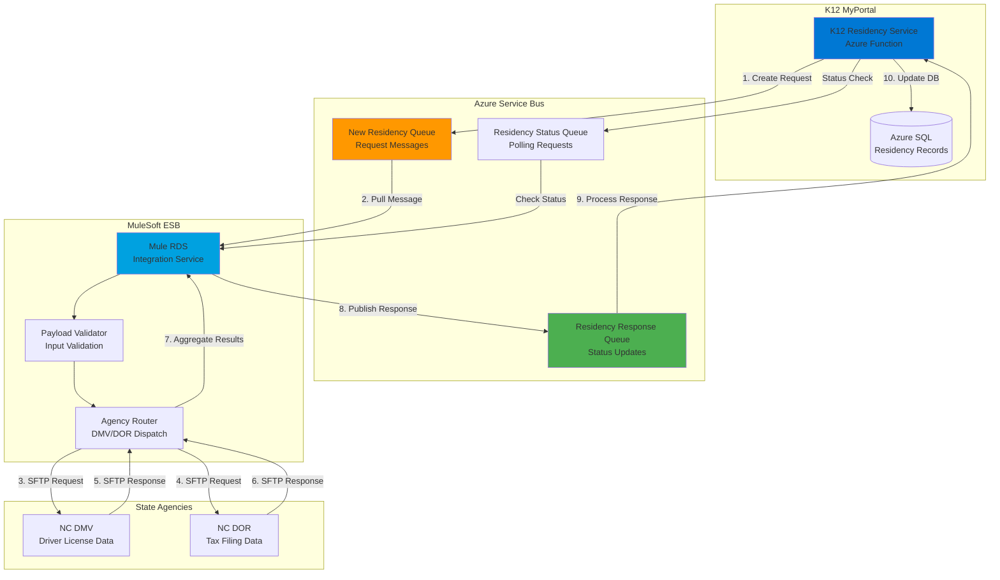
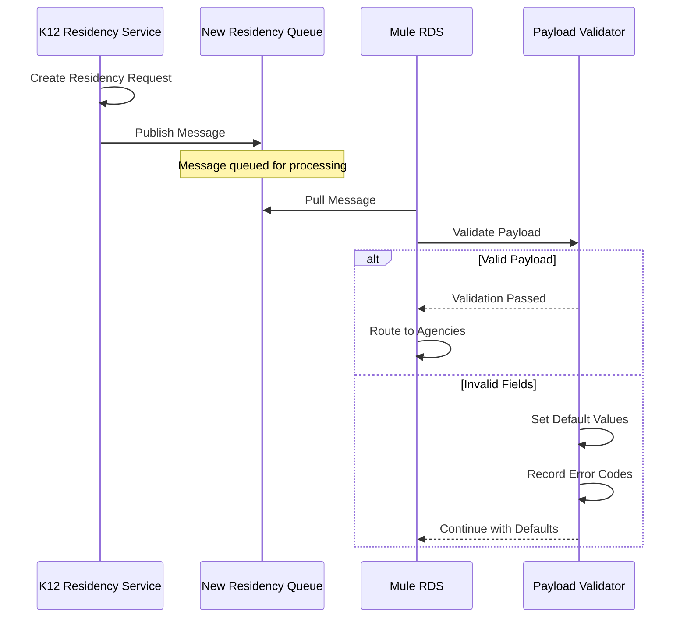
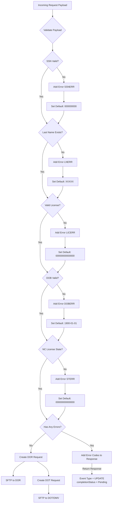
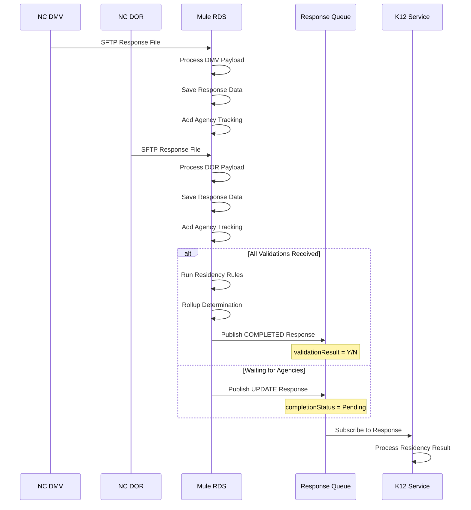
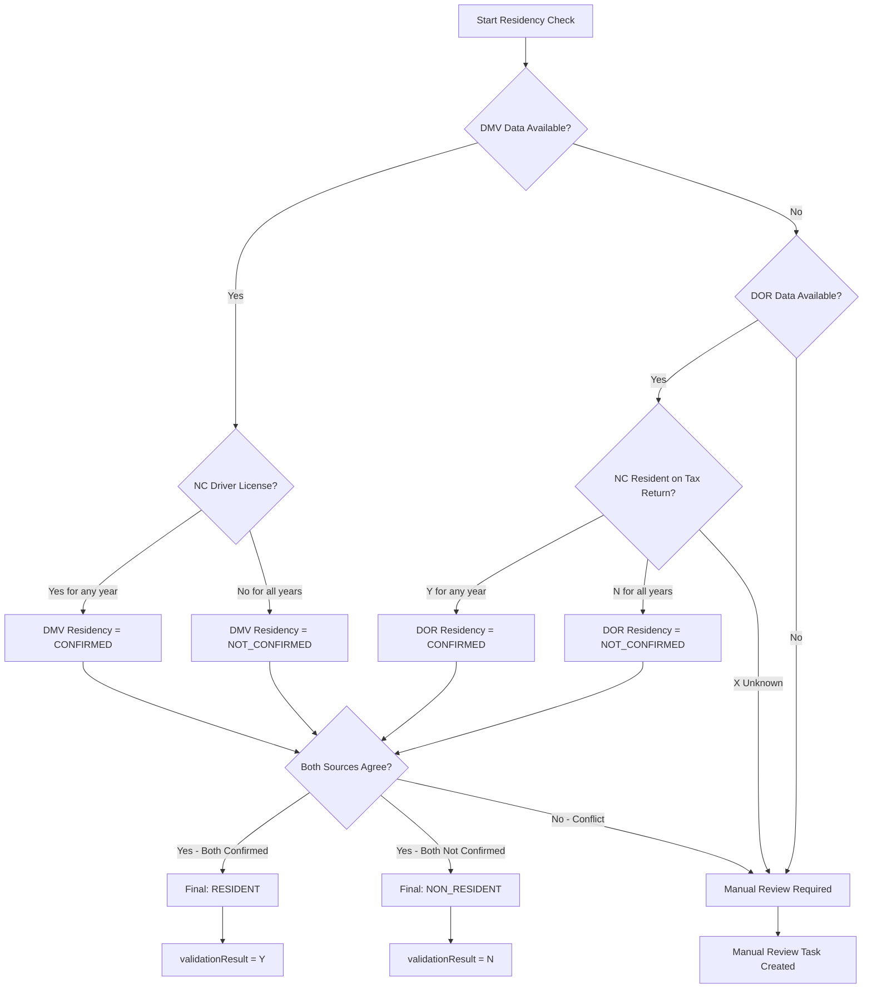

# INT-07: RDS Residency Determination Service Integration

**Integration ID:** INT-07
**System:** Residency Determination Service (RDS) via MuleSoft ESB
**Type:** State Agency Data Exchange (Asynchronous Message Queue)
**Classification:** Critical - Compliance Required
**Status:** In Development (K12-2964)
**Last Updated:** 2025-12-12

## Table of Contents

- [Overview](#overview)
- [Integration Architecture](#integration-architecture)
- [Message Flow Diagrams](#message-flow-diagrams)
- [API Specifications](#api-specifications)
- [Data Models](#data-models)
- [Validation Rules](#validation-rules)
- [Error Handling](#error-handling)
- [Security](#security)
- [MuleSoft Connectors](#mulesoft-connectors)
- [Implementation Guide](#implementation-guide)
- [Testing Strategy](#testing-strategy)
- [Implementation Timeline](#implementation-timeline)
- [Environment Configuration](#environment-configuration)
- [Data Retention Requirements](#data-retention-requirements)
- [References](#references)

---

## Overview

### Purpose

The Residency Determination Service (RDS) provides **automated residency verification** for NC SEAA K-12 Scholarship program eligibility through an asynchronous message queue architecture. Unlike the synchronous SOAP-based DMV integration (INT-05), RDS uses:

- **Azure Service Bus Queues** for reliable message delivery
- **MuleSoft ESB** for enterprise integration and routing
- **Multiple State Agency Sources** (DMV, DOR) via standardized message format
- **Asynchronous Processing** with status polling for eventual consistency

### Key Differences from INT-05 (Current Integration)

| Aspect | INT-05 (Current) | INT-07 (RDS - New) |
|--------|------------------|-------------------|
| **Protocol** | SOAP Web Service / SFTP Batch | Azure Queue + MuleSoft ESB |
| **Processing** | Synchronous (DMV) / Batch (DOR) | Fully Asynchronous |
| **Response Time** | 2-5 seconds (DMV), 24 hours (DOR) | Variable (minutes to days) |
| **Message Format** | XML (SOAP), Pipe-delimited | JSON |
| **Status Tracking** | N/A | Real-time via Response Queue |
| **Agency Aggregation** | Separate per agency | Unified RDS service |

### Business Context

RDS integration is **mandated by NC state law** for scholarship eligibility determination:

1. **Residency Verification**: Validate NC residency through multiple sources
2. **Identity Match**: Cross-reference applicant data against state agency records
3. **Fraud Prevention**: Detect inconsistencies across DMV and DOR data
4. **Compliance**: Meet state audit requirements with comprehensive tracking
5. **Efficiency**: Reduce manual review through automated multi-source validation

### Key Metrics

- **Expected Volume**: 95,000+ residency verifications/year
- **Processing Time**: 24-72 hours for complete validation
- **Success Rate Target**: 85% automated approval
- **Manual Review Rate**: 15% (complex cases)
- **Cost**: No per-transaction fee (state agency agreement)

### Source of Truth Architecture

> **Critical Design Decision:** K12 MyPortal is the **authoritative source of truth** for final residency determination. RDS returns **raw agency data** (DMV, DOR responses) to K12, which then applies SEAA-specific business rules to determine eligibility.

| Component | Responsibility | What It Does NOT Do |
|-----------|---------------|---------------------|
| **RDS (MuleSoft)** | Aggregate agency data, handle SFTP, validate payload format | Does NOT make final residency determination |
| **K12 MyPortal** | Apply SEAA business rules, determine Y/N, create review tasks | Does NOT communicate with agencies directly |

This separation ensures:
1. **Business rule flexibility**: SEAA can change residency criteria without RDS modifications
2. **Audit compliance**: Final determination audit trail is fully within K12
3. **Appeal support**: All raw data available in K12 for appeal review

See [ADR-013: RDS Asynchronous Integration Pattern](./../../adr/ADR-013-rds-async-integration-pattern.md) for the full architectural decision.

---

## Integration Architecture

### High-Level Architecture



### Component Responsibilities

| Component | Responsibility |
|-----------|---------------|
| **K12 Residency Service** | Create validation requests, process responses, update database |
| **New Residency Queue** | Buffer outgoing validation requests |
| **Response Queue** | Receive validation results from RDS |
| **Status Queue** | Handle status polling requests |
| **Mule RDS** | Route requests to agencies, aggregate responses |
| **Payload Validator** | Validate request data, apply defaults for invalid fields |
| **Agency Router** | Dispatch requests to DMV/DOR via SFTP |

---

## Message Flow Diagrams

### Flow 1: Request Submission



### Flow 2: Incoming Request Validation (Detailed)



### Flow 3: Agency Response Processing



---

## API Specifications

### Request Message Schema

**Queue:** `new-residency-queue`

```json
{
  "k12Id": "10000001982",
  "academicYear": "2025-2026",
  "batchId": "20251201",
  "firstName": "John",
  "lastName": "Smith",
  "ssn": "123456789",
  "dmvCustomerId": "0000100000",
  "dmvState": "NC",
  "dob": "1981-08-11",
  "validationDate": "2025-07-01",
  "timestamp": 1754933504000
}
```

**Field Definitions:**

| Field | Type | Required | Description |
|-------|------|----------|-------------|
| `k12Id` | string | Yes | K12 Parent ID (returned in response) |
| `academicYear` | string | Yes | Academic year for validation (e.g., "2025-2026") |
| `batchId` | string | Yes | Batch sequence number for tracking |
| `firstName` | string | Yes | Parent/Guardian first name |
| `lastName` | string | Yes | Parent/Guardian last name |
| `ssn` | string | Yes | Social Security Number (9 digits, no dashes) |
| `dmvCustomerId` | string | No | DMV customer ID (if known) |
| `dmvState` | string | Yes | License state (must be "NC" for eligibility) |
| `dob` | string | Yes | Date of birth (YYYY-MM-DD) |
| `validationDate` | string | Yes | Date for which validation runs |
| `timestamp` | number | Yes | Request timestamp (Unix epoch in ms) |

### Response Message Schema

**Queue:** `residency-response-queue`

```json
{
  "rds_id": 252,
  "k12Id": "465935137",
  "academicYear": "2025-2026",
  "batchId": "20250924",
  "requested": 1758807381893,
  "completed": 1760644795080,
  "completionStatus": "COMPLETE",
  "errorCodes": "SSNERR,LNERR,LICERR,DOBERR",
  "tracking": [
    {
      "source": "DMV",
      "complete": true,
      "hasAgencyErrors": null,
      "errorCodes": "SSNERR,LICERR,DOBERR",
      "sources": [
        {
          "requestedDate": 1758754325015,
          "responseDate": 1758901098385,
          "deceasedDate": null,
          "errorCode": "DOT06",
          "details": [
            {
              "date": "2025-10-08",
              "driverLicence": "N",
              "vehicleRegistered": "N"
            },
            {
              "date": "2024-10-08",
              "driverLicence": "N",
              "vehicleRegistered": "Y"
            }
          ]
        }
      ]
    },
    {
      "source": "DOR",
      "complete": true,
      "hasAgencyErrors": null,
      "errorCodes": "SSNERR,LNERR",
      "sources": [
        {
          "requestedDate": 1758754325015,
          "responseDate": 1758901407882,
          "year": "2024",
          "ncResident": "Y",
          "filingStatus": "5",
          "residencyIndicator": "N"
        },
        {
          "requestedDate": 1758754325015,
          "responseDate": 1758901407882,
          "year": "2023",
          "ncResident": "N",
          "filingStatus": "1",
          "residencyIndicator": "N"
        }
      ]
    }
  ]
}
```

### Response Field Definitions

| Field | Type | Description |
|-------|------|-------------|
| `rds_id` | number | RDS internal tracking ID |
| `k12Id` | string | Original K12 Parent ID |
| `academicYear` | string | Academic year validated |
| `batchId` | string | Original batch ID |
| `requested` | number | Request timestamp (epoch ms) |
| `completed` | number | Completion timestamp (epoch ms) |
| `completionStatus` | string | `PENDING` or `COMPLETE` |
| `errorCodes` | string | Comma-separated validation errors |
| `tracking` | array | Per-agency validation results |

### Completion Status Values

| Status | Description |
|--------|-------------|
| `PENDING` | Waiting for one or more agency responses |
| `COMPLETE` | All agencies responded, determination made |

### Error Codes

| Code | Description | Default Value Applied |
|------|-------------|----------------------|
| `SSNERR` | Invalid or missing SSN | `000000000` |
| `LNERR` | Invalid or missing last name | `XXXXX` |
| `LICERR` | Invalid license number | `00000000000000` |
| `DOBERR` | Invalid date of birth | `1900-01-01` |
| `STERR` | Invalid state (not NC) | `00000000000000` |

---

## Data Models

### DMV Response Details

```typescript
interface DmvResponseDetail {
  date: string;           // Validation date (YYYY-MM-DD)
  driverLicence: "Y" | "N";  // Has valid NC driver's license
  vehicleRegistered: "Y" | "N";  // Has NC-registered vehicle
}

interface DmvTracking {
  source: "DMV";
  complete: boolean;
  hasAgencyErrors: string | null;
  errorCodes: string;     // Comma-separated: SSNERR,LICERR,DOBERR,STERR
  sources: {
    requestedDate: number;   // Epoch ms
    responseDate: number;    // Epoch ms
    deceasedDate: string | null;  // YYYY-MM-DD if deceased
    errorCode: string;       // DMV-specific error (e.g., "DOT06")
    details: DmvResponseDetail[];  // Historical data points
  }[];
}
```

### DOR Response Details

```typescript
interface DorResponseDetail {
  requestedDate: number;   // Epoch ms
  responseDate: number;    // Epoch ms
  year: string;            // Tax year (e.g., "2024")
  ncResident: "Y" | "N" | "X";  // NC resident flag (X = unknown)
  filingStatus: string;    // Filing status code
  residencyIndicator: "Y" | "N" | "X";  // Residency determination
}

interface DorTracking {
  source: "DOR";
  complete: boolean;
  hasAgencyErrors: string | null;
  errorCodes: string;      // Comma-separated: SSNERR,LNERR
  sources: DorResponseDetail[];
}
```

### Filing Status Codes (DOR)

| Code | Description |
|------|-------------|
| `1` | Single |
| `2` | Married Filing Jointly |
| `3` | Married Filing Separately |
| `4` | Head of Household |
| `5` | Qualifying Widow(er) |
| `X` | Unknown/Not Filed |

### DPI Results (Future Integration)

```typescript
// DPI integration returns student-specific data
type DpiResult =
  | "currently_attending"
  | "graduated_from_high_school"
  | "homeless"
  | "student_found";

// Note: "m" (maybe) is treated as "not found"
```

---

## Validation Rules

### Residency Determination Logic

> **Important:** The following rules are applied by **K12 MyPortal**, not by RDS. RDS returns raw agency data; K12 is the source of truth for the final determination. See [Source of Truth Architecture](#source-of-truth-architecture).

The K12 Residency Rules Engine applies the following rules to raw agency data to determine NC residency:



### Validation Business Rules

1. **Valid NC Residency** (Auto-Approve):
   - NC driver's license active in current or prior year, AND
   - NC tax return filed showing resident status, AND
   - No conflicting data between sources

2. **Invalid Residency** (Auto-Reject):
   - No NC driver's license in any validation period, AND
   - Tax returns show non-resident status, AND
   - No vehicle registered in NC

3. **Manual Review Required**:
   - Conflicting data between DMV and DOR
   - Missing data from one or more agencies
   - Error codes present in response
   - `X` (unknown) values in DOR response

---

## Error Handling

### Queue Message Retry Policy

```yaml
# Azure Service Bus Configuration
retryPolicy:
  maxRetries: 3
  initialDelay: 30s
  maxDelay: 300s
  backoffMultiplier: 2
deadLetterQueue:
  enabled: true
  maxDeliveryCount: 5
```

### Error Response Handling

```csharp
public async Task ProcessRdsResponseAsync(RdsResponse response)
{
    if (!string.IsNullOrEmpty(response.ErrorCodes))
    {
        var errors = response.ErrorCodes.Split(',');

        foreach (var error in errors)
        {
            switch (error)
            {
                case "SSNERR":
                    await LogValidationError(response.K12Id, "SSN validation failed");
                    break;
                case "LNERR":
                    await LogValidationError(response.K12Id, "Last name mismatch");
                    break;
                case "LICERR":
                    await LogValidationError(response.K12Id, "License validation failed");
                    break;
                case "DOBERR":
                    await LogValidationError(response.K12Id, "Date of birth mismatch");
                    break;
                case "STERR":
                    await LogValidationError(response.K12Id, "Non-NC state");
                    break;
            }
        }

        // Create manual review task
        await CreateManualReviewTask(response.K12Id, response.ErrorCodes);
    }
}
```

---

## Security

### Data Protection

| Layer | Protection Mechanism |
|-------|---------------------|
| **Transit** | TLS 1.3 for queue connections |
| **At Rest** | Azure Service Bus encryption |
| **SSN Handling** | Never logged, masked in responses |
| **Audit Trail** | All requests/responses logged with timestamps |

### PII Handling

```csharp
// Mask SSN in logs
private string MaskSsn(string ssn)
    => string.IsNullOrEmpty(ssn) ? "***" : $"***-**-{ssn[^4..]}";

// Log with masked PII
_logger.LogInformation(
    "RDS request for K12ID: {K12Id}, SSN: {MaskedSsn}",
    request.K12Id,
    MaskSsn(request.Ssn));
```

---

## MuleSoft Connectors

Based on the K12-2964 attachments, the following MuleSoft connectors are used:

| Connector | Version | Purpose |
|-----------|---------|---------|
| Azure Data Lake Storage Connector | 1.0.7 | Document storage |
| Azure Cosmos DB Connector | 1.0.5 | Configuration data |
| Microsoft Azure Storage Connector | 3.0.0 | Queue message handling |
| Azure Event Hubs Connector | 1.2.0 | Event streaming |
| Azure Service Bus Connector | 3.4.3 | Request/Response queues |
| Azure Service Bus Management Connector | 1.0.3 | Queue management |
| Azure Key Vault Connector | 1.2.0 | Secrets management |
| Azure Key Vault Properties Provider | 2.1.2 | Configuration |

---

## Implementation Guide

### K12 Service Implementation

**File:** `CFIK12.Application/Services/RdsResidencyService.cs`

```csharp
using Azure.Messaging.ServiceBus;
using System.Text.Json;

public class RdsResidencyService : IRdsResidencyService
{
    private readonly ServiceBusClient _serviceBusClient;
    private readonly IResidencyRepository _repository;
    private readonly ILogger<RdsResidencyService> _logger;

    private const string RequestQueue = "new-residency-queue";
    private const string ResponseQueue = "residency-response-queue";

    public async Task<string> SubmitResidencyRequestAsync(
        string k12Id,
        ResidencyRequestDto request)
    {
        var message = new RdsRequestMessage
        {
            K12Id = k12Id,
            AcademicYear = request.AcademicYear,
            BatchId = DateTime.UtcNow.ToString("yyyyMMdd"),
            FirstName = request.FirstName,
            LastName = request.LastName,
            Ssn = request.Ssn,
            DmvCustomerId = request.DmvCustomerId,
            DmvState = request.DmvState,
            Dob = request.DateOfBirth.ToString("yyyy-MM-dd"),
            ValidationDate = request.ValidationDate.ToString("yyyy-MM-dd"),
            Timestamp = DateTimeOffset.UtcNow.ToUnixTimeMilliseconds()
        };

        await using var sender = _serviceBusClient.CreateSender(RequestQueue);

        var serviceBusMessage = new ServiceBusMessage(
            JsonSerializer.Serialize(message))
        {
            MessageId = Guid.NewGuid().ToString(),
            CorrelationId = k12Id,
            Subject = "ResidencyValidation"
        };

        await sender.SendMessageAsync(serviceBusMessage);

        _logger.LogInformation(
            "RDS request submitted for K12ID: {K12Id}, BatchId: {BatchId}",
            k12Id, message.BatchId);

        // Save pending record
        await _repository.CreatePendingValidationAsync(k12Id, message.BatchId);

        return message.BatchId;
    }

    public async Task ProcessResponseMessagesAsync(CancellationToken ct)
    {
        await using var processor = _serviceBusClient.CreateProcessor(
            ResponseQueue,
            new ServiceBusProcessorOptions
            {
                MaxConcurrentCalls = 10,
                AutoCompleteMessages = false
            });

        processor.ProcessMessageAsync += async args =>
        {
            var response = JsonSerializer.Deserialize<RdsResponse>(
                args.Message.Body.ToString());

            await ProcessRdsResponseAsync(response);
            await args.CompleteMessageAsync(args.Message);
        };

        processor.ProcessErrorAsync += args =>
        {
            _logger.LogError(args.Exception,
                "Error processing RDS response: {Source}",
                args.ErrorSource);
            return Task.CompletedTask;
        };

        await processor.StartProcessingAsync(ct);
    }

    private async Task ProcessRdsResponseAsync(RdsResponse response)
    {
        var validation = await _repository.GetByK12IdAndBatchAsync(
            response.K12Id, response.BatchId);

        if (validation == null)
        {
            _logger.LogWarning(
                "No pending validation found for K12ID: {K12Id}",
                response.K12Id);
            return;
        }

        validation.CompletionStatus = response.CompletionStatus;
        validation.ErrorCodes = response.ErrorCodes;
        validation.CompletedAt = response.Completed > 0
            ? DateTimeOffset.FromUnixTimeMilliseconds(response.Completed).DateTime
            : null;

        // Process tracking data
        foreach (var tracking in response.Tracking)
        {
            await ProcessAgencyTrackingAsync(validation.Id, tracking);
        }

        // Determine final result
        if (response.CompletionStatus == "COMPLETE")
        {
            validation.ResidencyResult = DetermineResidencyResult(response);

            if (string.IsNullOrEmpty(response.ErrorCodes))
            {
                validation.Status = ResidencyValidationStatus.Verified;
            }
            else
            {
                validation.Status = ResidencyValidationStatus.ManualReviewRequired;
                await CreateManualReviewTaskAsync(validation);
            }
        }

        await _repository.UpdateAsync(validation);
    }

    private ResidencyResult DetermineResidencyResult(RdsResponse response)
    {
        var dmvConfirmed = response.Tracking
            .FirstOrDefault(t => t.Source == "DMV")?.Sources
            .Any(s => s.Details?.Any(d => d.DriverLicence == "Y") == true) ?? false;

        var dorConfirmed = response.Tracking
            .FirstOrDefault(t => t.Source == "DOR")?.Sources
            .Any(s => s.NcResident == "Y") ?? false;

        if (dmvConfirmed && dorConfirmed)
            return ResidencyResult.Confirmed;

        if (!dmvConfirmed && !dorConfirmed)
            return ResidencyResult.NotConfirmed;

        return ResidencyResult.RequiresReview;
    }
}
```

---

## Testing Strategy

### Unit Tests

```csharp
[Fact]
public async Task SubmitResidencyRequest_ValidData_PublishesToQueue()
{
    // Arrange
    var request = new ResidencyRequestDto
    {
        FirstName = "John",
        LastName = "Smith",
        Ssn = "123456789",
        DmvState = "NC",
        DateOfBirth = new DateTime(1981, 8, 11),
        ValidationDate = DateTime.Today,
        AcademicYear = "2025-2026"
    };

    // Act
    var batchId = await _service.SubmitResidencyRequestAsync("K12-001", request);

    // Assert
    batchId.Should().NotBeNullOrEmpty();
    _mockSender.Verify(s => s.SendMessageAsync(
        It.Is<ServiceBusMessage>(m => m.CorrelationId == "K12-001"),
        default), Times.Once);
}

[Fact]
public void DetermineResidencyResult_BothSourcesConfirmed_ReturnsConfirmed()
{
    // Arrange
    var response = new RdsResponse
    {
        Tracking = new[]
        {
            new AgencyTracking
            {
                Source = "DMV",
                Sources = new[]
                {
                    new DmvSource { Details = new[] { new DmvDetail { DriverLicence = "Y" } } }
                }
            },
            new AgencyTracking
            {
                Source = "DOR",
                Sources = new[] { new DorSource { NcResident = "Y" } }
            }
        }
    };

    // Act
    var result = _service.DetermineResidencyResult(response);

    // Assert
    result.Should().Be(ResidencyResult.Confirmed);
}
```

### Integration Tests

```csharp
[Fact]
public async Task EndToEnd_ResidencyValidation_CompletesSuccessfully()
{
    // Submit request
    var batchId = await _service.SubmitResidencyRequestAsync("K12-TEST-001", _testRequest);

    // Simulate RDS response (in test environment)
    await SimulateRdsResponse(batchId, completionStatus: "COMPLETE");

    // Verify result
    var validation = await _repository.GetByK12IdAsync("K12-TEST-001");
    validation.Status.Should().Be(ResidencyValidationStatus.Verified);
}
```

---

## Implementation Timeline

### Project Epics

| Epic | Jira Reference | Status | Target |
|------|---------------|--------|--------|
| Enabler and RDS Integration | [K12-2964](https://cfi-nc.atlassian.net/browse/K12-2964) | Ready for BA | PI 2, PI 3 |
| RDS Integration Implementation | [K12-3844](https://cfi-nc.atlassian.net/browse/K12-3844) | Open | PI 4 |

### Roadmap Phases

| Phase | Activities | Status |
|-------|-----------|--------|
| **Phase 0: Discovery & Planning** | Schedule kickoff meeting, review MOUs with DOR/DMV, finalize architecture | Complete |
| **Phase 1: Proof of Concept (PoC)** | Set up sandbox access, implement basic authentication, test case creation/query | In Progress |
| **Phase 2: Adapter Development** | Build RDS Adapter microservice, implement retry/circuit breaker, add caching layer | Planned |
| **Phase 3: Integration Testing** | End-to-end testing, load testing, security penetration testing, UAT | Planned |
| **Phase 4: Pilot Deployment** | Deploy to production with feature flag (10% traffic) | Planned |
| **Phase 5: Full Rollout** | Enable integration for 100% of applications, establish ongoing monitoring | Planned |

### Operational Timeline

| Event | Schedule |
|-------|----------|
| DMV File Processing | Daily at 7:00 AM EST |
| DOR File Processing | Daily at 7:30 PM EST |
| Expected Response Time | 24-36 hours |
| Maximum Processing Deadline | 7 days |
| Peak Volume Period | February - April (application period) |

---

## Environment Configuration

### Environments

| Environment | Purpose | Service Bus Namespace |
|-------------|---------|----------------------|
| **Development/CI** | Developer testing, automated tests | `k12-sb-dev` |
| **Staging/UAT** | User acceptance testing | `k12-sb-staging` |
| **Production** | Live operations | `k12-sb-prod` |

### Queue Names (Per Environment)

| Queue | Purpose |
|-------|---------|
| `new-residency-queue` | Outbound validation requests |
| `residency-response-queue` | Inbound validation results |
| `residency-status-queue` | Status polling requests |

### Connection Management

**K12 (Queue Owner):**
- Connection strings stored in Azure Key Vault
- Managed Identity for Azure Function access
- SAS tokens for RDS (external) access

**RDS (External Consumer):**
- K12 must provide connection credentials per environment
- Firewall rules must allow RDS IP ranges
- Credentials rotated quarterly

### Required Configuration (for RDS/CFI)

For each environment, K12 must provide RDS with:
1. Service Bus connection string (Send/Listen permissions)
2. Queue names (may vary by environment)
3. Key Vault reference for credential rotation
4. Firewall whitelist requirements

---

## Data Retention Requirements

> **Status:** Requirements pending finalization with SEAA. The following items require SEAA input before implementation.

### Action Items Requiring SEAA Input

| Item | Question | Owner | Status |
|------|----------|-------|--------|
| **K12 Determination Retention** | How long must K12 retain the final residency determination (Y/N)? Must align with FERPA for student records. | SEAA/Jill | TBD |
| **Raw Agency PII Retention** | What is the retention period for raw DMV/DOR data (SSN, tax info)? This is HIGH sensitivity PII. | SEAA/Legal | TBD |
| **Audit Log Retention** | What is the mandated retention period for the full audit trail (request, responses, determination, appeals)? | SEAA/Compliance | TBD |
| **Data Deletion Policy** | Are there "right to be forgotten" or data minimization requirements? When/how should archived cases be purged? | SEAA/Legal | TBD |
| **Agency MOU Obligations** | What retention requirements exist in DOR and DMV data sharing agreements? | CFI/SEAA | TBD |

### Statutory Framework

Residency verification falls under **G.S. 115C-562.3**, which mandates electronic verification across state agencies. The technical specification must align with:

- **FERPA**: Family Educational Rights and Privacy Act guidelines for student records
- **NC Records Retention**: State guidelines for government records
- **DOR MOU**: Data sharing agreement with NC Department of Revenue
- **DMV MOU**: Data sharing agreement with NC Division of Motor Vehicles

### Current Audit Logging Requirements

Until retention periods are finalized, the following are logged:

| Data Type | What is Logged | PII Handling |
|-----------|---------------|--------------|
| Request | k12Id, academicYear, batchId, timestamp | SSN masked (***-**-1234) |
| Response | completionStatus, errorCodes, tracking data | Full data stored encrypted |
| Determination | Final Y/N, rule applied, reviewer (if manual) | Linked to k12Id |
| Appeals | Override reason, approver, timestamp | Full audit trail |

---

## References

- **ADR-013**: [RDS Asynchronous Integration Pattern](./../../adr/ADR-013-rds-async-integration-pattern.md) - Architecture Decision Record
- **K12-2964**: [Enabler and RDS Integration Epic](https://cfi-nc.atlassian.net/browse/K12-2964)
- **K12-3844**: [RDS Integration Implementation Epic](https://cfi-nc.atlassian.net/browse/K12-3844)
- **C4-05**: [RDS Integration Context Diagrams](./../c4-diagrams/05-rds-integration-context.md)
- **MuleSoft Documentation**: [MuleSoft Azure Connectors](https://docs.mulesoft.com/connectors/)
- **Azure Service Bus**: [Service Bus Messaging](https://docs.microsoft.com/azure/service-bus-messaging/)
- **INT-05**: [NC DMV/DOR Integration](INT-05-nc-dmv-dor-integration.md) (Legacy approach)
- **G.S. 115C-562.3**: [NC Residency Verification Statute](https://www.ncleg.gov/Laws/GeneralStatuteLookup/115C-562.3)
- **Melissa Data Result Codes**: https://wiki.melissadata.com/index.php?title=Result_Codes

---

**Document Version:** 1.0
**Last Reviewed:** 2025-12-12
**Next Review:** 2026-03-12
**Owner:** CFI Integration Team
