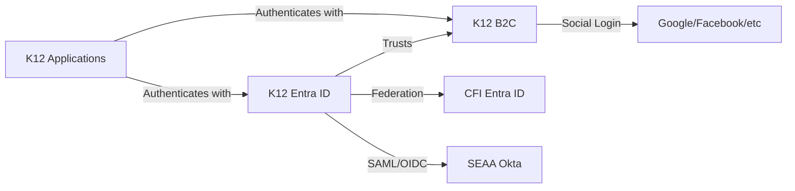
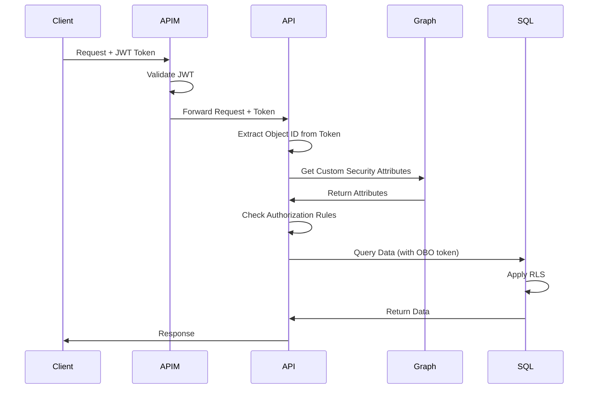

# SEC-01: Microsoft Entra ID Configuration Guide

**Status**: Final
**Last Updated**: 2024-11-24
**Owner**: CFI Architecture Team

## Overview

This document details the Microsoft Entra ID Hub and Spoke identity model for the K12 MyPortal system. It provides comprehensive configuration guidance for Azure Entra ID, custom security attributes, administrative units, application roles, and app registrations across all environments.

## Table of Contents

- [Hub and Spoke Architecture](#hub-and-spoke-architecture)
- [Identity Management Sources](#identity-management-sources)
- [Trust Relationships and Authentication Flow](#trust-relationships-and-authentication-flow)
- [Guiding Architectural Principles](#guiding-architectural-principles)
- [Step 1: Configure Azure Entra ID](#step-1-configure-azure-entra-id)
- [Step 2: Configure API Management (APIM)](#step-2-configure-api-management-apim)
- [Step 3: Build Unified Security Gateway](#step-3-build-unified-security-gateway)
- [Step 4: Defense-in-Depth](#step-4-defense-in-depth)
- [Application Registrations](#application-registrations)
- [Related Documentation](#related-documentation)

## Hub and Spoke Architecture

### What is the Hub and Spoke Model?

**Azure Entra ID acts as the Hub**, serving as the single source of truth for:
- Who users are (identity verification)
- What attributes they possess (custom security attributes)
- Which roles they hold (application roles)
- Which groups they belong to (security groups)

**Your APIs and Applications are the Spokes**, where:
- Business logic determines authorization decisions
- Access control is attribute-driven and context-aware
- Data access is governed by Hub-provided identity claims

### Why Hub and Spoke?

**1. Centralized Identity, Decentralized Administration**
- Entra ID is the single source of truth for "who is who"
- Daily user management is delegated to the institutions themselves
- Administrative units enable delegated administration at scale

**2. Attribute-Driven Authorization**
- Permissions are determined by the attributes and relationships of an identity
- No need to manage thousands of individual roles or access lists
- Fine-grained access control through custom security attributes

**3. Unified API Gateway**
- All applications access data through a single, secure API middleware
- Centralizes security logic, making it consistent, maintainable, and easy to monitor
- Contains all business and authorization logic, making it easy to update, test, and audit

**4. No Direct Data Access**
- Applications never access data directly
- All data access flows through the Hub and Spoke security model
- Defense-in-depth with multiple security layers

## Identity Management Sources

The K12 system integrates with multiple identity providers:

### Primary Identity Sources

| Identity Source | Purpose | User Types | Authentication Method |
|-----------------|---------|------------|----------------------|
| **K12 Entra ID** | Internal system identities | SEAA Admins, System Accounts | Azure AD Authentication |
| **K12 B2C Entra ID** | External user identities | Parents, School Admins, Provider Admins | B2C Social/Local Accounts |
| **CFI Entra ID** | CFI staff access | CFI Developers, Architects | Azure AD Federation |
| **SEAA Okta** | SEAA staff access | SEAA Employees | Okta SAML/OIDC |

### Trust Relationships



### Authentication Flow

1. **External Users** (parents, schools, providers) → K12 B2C Entra ID → K12 Entra ID
2. **SEAA Staff** → SEAA Okta → K12 Entra ID (federated)
3. **CFI Staff** → CFI Entra ID → K12 Entra ID (federated)
4. **System Accounts** → K12 Entra ID (direct)

## Guiding Architectural Principles

### 1. Centralized Identity, Decentralized Administration
Entra ID is the single source of truth for "who is who," but daily user management is delegated to the institutions themselves.

### 2. Attribute-Driven Authorization
Permissions are determined by the attributes and relationships of an identity, not by managing thousands of individual roles or access lists.

### 3. Unified API Gateway
All applications access data through a single, secure API middleware method that centralizes security logic, making it consistent, maintainable, and easy to monitor. It contains all business and authorization logic, making it easy to update, test, and audit.

### 4. No Direct Data Access
No application ever accesses data directly. All data access flows through the Hub and Spoke security model.

## Step 1: Configure Azure Entra ID

### Object Representation

**Students as Non-Loginable Identity Records**
- Students are represented as user objects in Entra ID
- They do not have login credentials or licenses
- They exist solely to carry custom security attributes
- This enables attribute-driven access control for student data

**Example Student Object:**
```json
{
  "displayName": "John Doe (Student)",
  "userPrincipalName": "student-12345@k12portal.nc.gov",
  "accountEnabled": false,
  "customSecurityAttributes": {
    "studentAccessControl": {
      "@odata.type": "microsoft.graph.customSecurityAttributeValue",
      "parentReadWrite": ["parent1-oid", "parent2-oid"],
      "proxyReadOnly": ["proxy1-oid"],
      "enrolledSchoolId": "school-group-oid",
      "enrolledVendorId": "vendor-group-oid"
    }
  }
}
```

### Custom Security Attributes

**Attribute Set: `studentAccessControl`**

| Attribute | Type | Cardinality | Description |
|-----------|------|-------------|-------------|
| `parentReadWrite` | String | Multi-value | Object ID(s) of primary parent(s) with full read/write access |
| `proxyReadOnly` | String | Multi-value | Object ID(s) of proxy parent(s) with read-only access |
| `enrolledSchoolId` | String | Single-value | Object ID of the Security Group representing the enrolled school |
| `enrolledVendorId` | String | Single-value | Object ID of the Security Group representing the enrolled tutor/vendor |

**How Custom Attributes Work:**
1. **Primary Parents** (`parentReadWrite`): Can view and modify student data, submit applications, manage documents
2. **Proxy Parents** (`proxyReadOnly`): Can view student data but cannot make changes (grandparents, guardians)
3. **Enrolled School** (`enrolledSchoolId`): School staff in the security group can access student records
4. **Enrolled Vendor** (`enrolledVendorId`): Approved vendors can access student service records

### Delegated Administration with Administrative Units

**Administrative Units (AUs)** enable scoped administration:

| Administrative Unit | Purpose | Scope | Assignable Roles |
|---------------------|---------|-------|------------------|
| **K12-Schools-AU** | School administration | All school admin users | User Administrator, Groups Administrator |
| **K12-Providers-AU** | Provider administration | All provider admin users | User Administrator, Groups Administrator |
| **K12-Households-AU** | Household administration | All parent/guardian users | User Administrator (limited) |

**Benefits:**
- Delegates user management to appropriate administrators
- Scoped permissions prevent cross-organizational access
- Reduces burden on global administrators

### Application Roles

**Defined Roles:**

| Role | Name | Description | Assigned To |
|------|------|-------------|-------------|
| **K12.Admin** | SEAA Administrator | Full system access, global operations | SEAA staff |
| **School.Admin** | School Administrator | School-scoped access and operations | School principals, staff |
| **Provider.Admin** | Provider Administrator | Provider-scoped access and operations | Educational service providers |
| **PrimaryParent.User** | Primary Parent | Read/write access to student data | Legal parents/guardians |
| **ProxyParent.User** | Proxy Parent | Read-only access to student data | Grandparents, relatives |

**Role Assignment:**
- Roles are assigned at the Entra ID application registration level
- Users can have multiple roles (e.g., K12.Admin + School.Admin)
- Roles are included in JWT tokens as claims

### Security Groups

**Group Naming Conventions:**

```
K12-admin-Global-admin                    (SEAA super admins)
K12-Admin-Scholarship-specialist          (SEAA scholarship staff)
K12-Provider-[businessname]               (Per-provider admin groups)
K12-School-HDMA-[schoolname]              (HDMA schools)
K12-School-nonHDMA-[schoolname]           (Non-HDMA schools)
K12-HouseHold-parent[N]                   (Per-household parent groups)
```

**Group Purpose:**
- **Admin Groups**: Fine-grained permission control for SEAA staff
- **Provider Groups**: Scope access to provider-specific data
- **School Groups**: Scope access to school-specific data and students
- **Household Groups**: Manage family relationships

## Step 2: Configure API Management (APIM)

**APIM Configuration Requirements:**

### JWT Token Validation
```xml
<policies>
    <inbound>
        <validate-jwt header-name="Authorization"
                      failed-validation-httpcode="401"
                      failed-validation-error-message="Unauthorized">
            <openid-config url="https://login.microsoftonline.us/{tenant}/.well-known/openid-configuration" />
            <required-claims>
                <claim name="aud" match="any">
                    <value>{api-client-id}</value>
                </claim>
                <claim name="roles" match="any">
                    <value>K12.Admin</value>
                    <value>School.Admin</value>
                    <value>Provider.Admin</value>
                    <value>PrimaryParent.User</value>
                    <value>ProxyParent.User</value>
                </claim>
            </required-claims>
        </validate-jwt>
    </inbound>
</policies>
```

### Endpoint Authorization

Use APIM policies to control what endpoints a request is allowed to call:

**Example: Lock down K12.Admin endpoints**
```xml
<choose>
    <when condition="@(context.Request.Url.Path.StartsWith("/admin/"))">
        <validate-jwt ...>
            <required-claims>
                <claim name="roles" match="all">
                    <value>K12.Admin</value>
                </claim>
            </required-claims>
        </validate-jwt>
    </when>
</choose>
```

## Step 3: Build Unified Security Gateway

**Authorization Logic Flow:**



### Authorization Middleware Implementation

**C# Pseudo-code:**

```csharp
public async Task<bool> AuthorizeStudentAccess(string userObjectId, string studentObjectId, AccessLevel requiredAccess)
{
    // 1. Get user's roles from JWT claims
    var userRoles = _httpContext.User.Claims
        .Where(c => c.Type == "roles")
        .Select(c => c.Value)
        .ToList();

    // 2. Global admins have full access
    if (userRoles.Contains("K12.Admin"))
        return true;

    // 3. Get student's custom security attributes from Graph API
    var studentAttributes = await _graphClient.Users[studentObjectId]
        .CustomSecurityAttributes
        .GetAsync();

    var accessControl = studentAttributes["studentAccessControl"];

    // 4. Check parent access
    if (userRoles.Contains("PrimaryParent.User"))
    {
        var parentIds = accessControl["parentReadWrite"] as string[];
        if (parentIds?.Contains(userObjectId) == true)
            return true; // Full access
    }

    if (userRoles.Contains("ProxyParent.User"))
    {
        var proxyIds = accessControl["proxyReadOnly"] as string[];
        if (proxyIds?.Contains(userObjectId) == true)
            return requiredAccess == AccessLevel.ReadOnly;
    }

    // 5. Check school access
    if (userRoles.Contains("School.Admin"))
    {
        var schoolGroupId = accessControl["enrolledSchoolId"] as string;
        var userGroups = await _graphClient.Users[userObjectId]
            .MemberOf
            .GetAsync();

        if (userGroups.Any(g => g.Id == schoolGroupId))
            return true;
    }

    // 6. Check vendor access
    if (userRoles.Contains("Provider.Admin"))
    {
        var vendorGroupId = accessControl["enrolledVendorId"] as string;
        var userGroups = await _graphClient.Users[userObjectId]
            .MemberOf
            .GetAsync();

        if (userGroups.Any(g => g.Id == vendorGroupId))
            return true;
    }

    return false; // No access
}
```

## Step 4: Defense-in-Depth

### Layer 1: APIM - JWT Token Validation
- Validates token signature and expiration
- Checks required claims and audience
- Rejects invalid or expired tokens

### Layer 2: API Gateway Middleware - Business Logic Authorization
- Calls Microsoft Graph API for custom security attributes
- Evaluates attribute-driven access rules
- Enforces role-based and relationship-based access control

### Layer 3: Azure SQL - Row-Level Security (RLS)
- Simple backstop layer (no complex business logic)
- Uses `UserResourceAccessMap` table synced from Entra ID
- Session context set via `sp_set_session_context`
- See [SEC-03: Row-Level Security Implementation](SEC-03-row-level-security.md)

### Layer 4: ADLS Gen2 - RBAC + SAS Tokens
- Hierarchical namespaces for RBAC
- Security groups assigned Storage Blob Data Reader role
- Short-lived SAS tokens (~5 minutes) generated by API
- See [SEC-03: Row-Level Security Implementation](SEC-03-row-level-security.md)

## Application Registrations

### Admin Portal

**Development**
- **App Registration**: k12-admin-dev
- **Roles**: K12.Admin
- **Redirect URI**: `https://kind-desert-05e4a9e0f-dev.eastus2.5.azurestaticapps.net/`

**Testing**
- **App Registration**: k12-admin-test
- **Roles**: K12.Admin
- **Redirect URI**: `https://kind-desert-05e4a9e0f-test.eastus2.5.azurestaticapps.net/`

**Staging**
- **App Registration**: k12-admin-staging
- **Roles**: K12.Admin
- **Redirect URI**: `https://kind-desert-05e4a9e0f-staging.eastus2.5.azurestaticapps.net/`

### Enrollment Portal

**Development**
- **App Registration**: k12-enrollment-dev
- **Roles**: K12.Admin, School.Admin, Provider.Admin, PrimaryParent.User, ProxyParent.User
- **Redirect URI**: `https://victorious-cliff-0c5f7690f-dev.eastus2.5.azurestaticapps.net/`

**Testing**
- **App Registration**: k12-enrollment-test
- **Roles**: K12.Admin, School.Admin, Provider.Admin, PrimaryParent.User, ProxyParent.User
- **Redirect URI**: `https://victorious-cliff-0c5f7690f-test.eastus2.5.azurestaticapps.net/`

**Staging**
- **App Registration**: k12-enrollment-staging
- **Roles**: K12.Admin, School.Admin, Provider.Admin, PrimaryParent.User, ProxyParent.User
- **Redirect URI**: `https://victorious-cliff-0c5f7690f-staging.eastus2.5.azurestaticapps.net/`

### School Portal

**Development**
- **App Registration**: k12-school-dev
- **Roles**: K12.Admin, School.Admin
- **Redirect URI**: `https://icy-mud-0f36f4e0f-dev.eastus2.5.azurestaticapps.net/`

**Testing**
- **App Registration**: k12-school-test
- **Roles**: K12.Admin, School.Admin
- **Redirect URI**: `https://icy-mud-0f36f4e0f-test.eastus2.5.azurestaticapps.net/`

**Staging**
- **App Registration**: k12-school-staging
- **Roles**: K12.Admin, School.Admin
- **Redirect URI**: `https://icy-mud-0f36f4e0f-staging.eastus2.5.azurestaticapps.net/`

### Provider Portal

**Development**
- **App Registration**: k12-provider-dev
- **Roles**: K12.Admin, Provider.Admin
- **Redirect URI**: `https://proud-tree-0d5e3a70f-dev.eastus2.5.azurestaticapps.net/`

**Testing**
- **App Registration**: k12-provider-test
- **Roles**: K12.Admin, Provider.Admin
- **Redirect URI**: `https://proud-tree-0d5e3a70f-test.eastus2.5.azurestaticapps.net/`

**Staging**
- **App Registration**: k12-provider-staging
- **Roles**: K12.Admin, Provider.Admin
- **Redirect URI**: `https://proud-tree-0d5e3a70f-staging.eastus2.5.azurestaticapps.net/`

## Configuration Checklist

Before deploying to each environment, verify:

- [ ] Azure Entra ID tenant configured
- [ ] Custom security attributes defined (`studentAccessControl` attribute set)
- [ ] Administrative units created and scoped
- [ ] Application roles defined in app registrations
- [ ] Security groups created with proper naming conventions
- [ ] App registrations configured with correct redirect URIs
- [ ] APIM policies configured for JWT validation
- [ ] API middleware implements authorization logic with Graph API calls
- [ ] Azure SQL RLS policies deployed
- [ ] ADLS Gen2 RBAC configured
- [ ] Test users created with appropriate attributes and roles

## Related Documentation

- [ADR-003: Entra ID B2C for CIAM](./../../adr/ADR-003-entra-id-b2c-ciam.md)
- [SEC-02: Authorization Model Documentation](SEC-02-authorization-model.md)
- [SEC-03: Row-Level Security Implementation](SEC-03-row-level-security.md)
- [SEC-04: Audit Logging Architecture](SEC-04-audit-logging.md)
- [System Architecture Overview](./../README.md)

## References

- [Microsoft Entra ID Documentation](https://learn.microsoft.com/en-us/entra/identity/)
- [Custom Security Attributes](https://learn.microsoft.com/en-us/entra/fundamentals/custom-security-attributes-overview)
- [Administrative Units](https://learn.microsoft.com/en-us/entra/identity/role-based-access-control/administrative-units)
- [Microsoft Graph API](https://learn.microsoft.com/en-us/graph/overview)

---

**Source**: Confluence pages 4053696597, 2548-2992
**Migrated**: 2024-11-24
**Migrated by**: Documentation Migrator Agent
