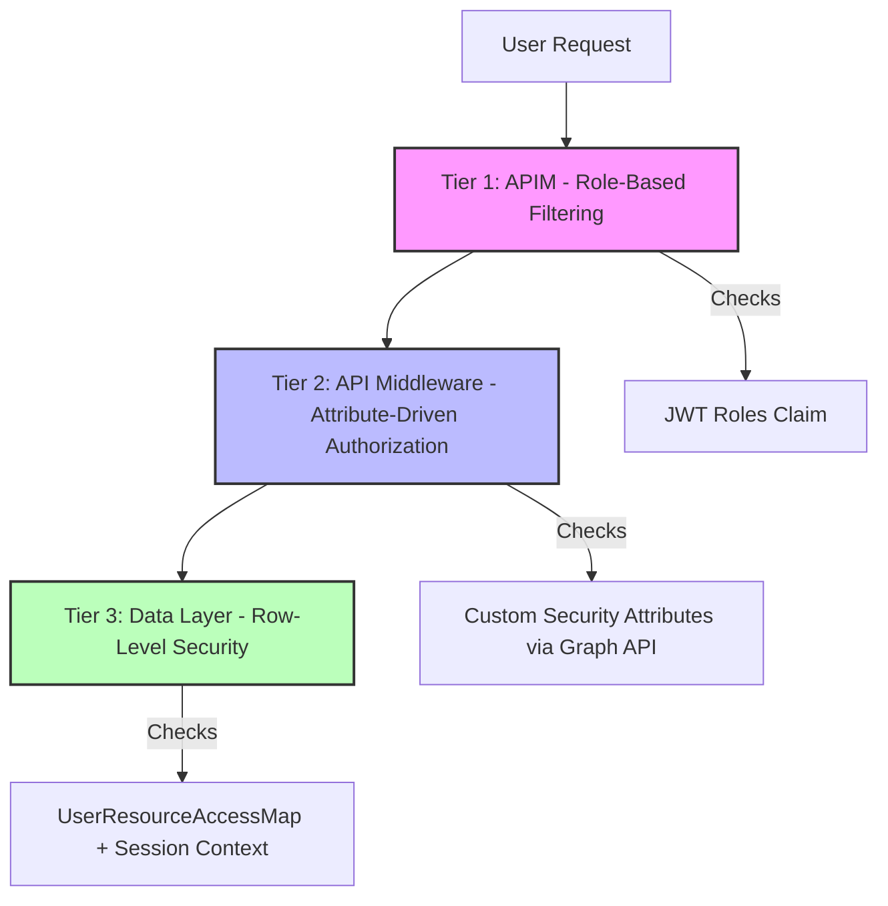
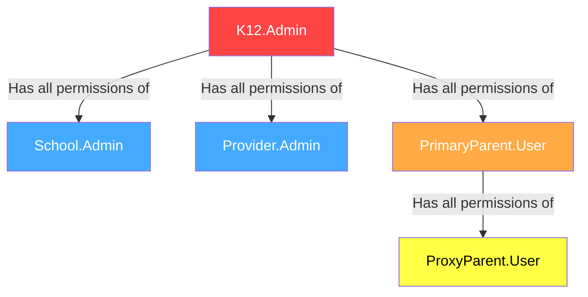
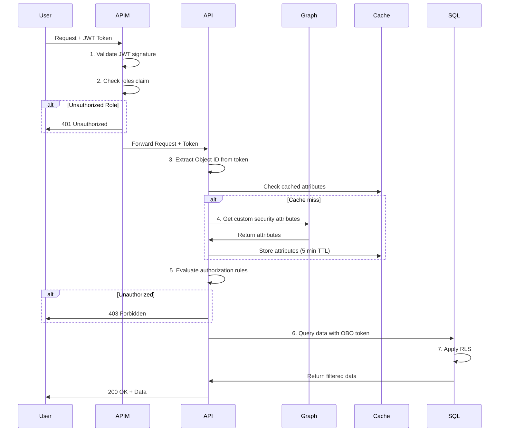

# SEC-02: Authorization Model Documentation

**Status**: Final
**Last Updated**: 2024-11-24
**Owner**: CFI Architecture Team

## Overview

This document defines the complete authorization model for the K12 MyPortal system, including application roles, security groups, user permissions, and the authorization decision flow. It provides detailed permission matrices for all user types across all applications.

## Table of Contents

- [Authorization Architecture](#authorization-architecture)
- [Application Roles](#application-roles)
- [Security Groups](#security-groups)
- [Permission Matrices](#permission-matrices)
- [Authorization Decision Flow](#authorization-decision-flow)
- [Test User Accounts](#test-user-accounts)
- [Related Documentation](#related-documentation)

## Authorization Architecture

### Three-Tier Authorization Model

The K12 system implements a three-tier authorization model:



**Tier 1: APIM (API Management)**
- Validates JWT token signature and expiration
- Filters requests based on application roles in JWT claims
- Rejects unauthorized requests before they reach the API

**Tier 2: API Middleware**
- Queries Microsoft Graph API for user's custom security attributes
- Evaluates attribute-driven access rules (parent relationships, school enrollment, vendor assignments)
- Enforces fine-grained authorization logic based on resource relationships

**Tier 3: Data Layer**
- Azure SQL Row-Level Security (RLS) as backstop
- ADLS Gen2 RBAC and SAS tokens for document access
- Prevents unauthorized data access even if middleware is bypassed

### Attribute-Driven Authorization

Unlike traditional role-based access control (RBAC), K12 uses **attribute-driven authorization**:

**Traditional RBAC Problem:**
```
User: Parent123
Roles: [Parent]
Question: Can Parent123 view Student456's records?
Answer: Unknown - role doesn't specify which students
```

**Attribute-Driven Solution:**
```
User: Parent123 (Object ID: abc-123)
Student: Student456 (Object ID: def-456)
Student456.customSecurityAttributes.studentAccessControl = {
  "parentReadWrite": ["abc-123", "xyz-789"],
  "proxyReadOnly": ["ghi-012"],
  "enrolledSchoolId": "school-group-001",
  "enrolledVendorId": "vendor-group-005"
}

Question: Can Parent123 view Student456's records?
Answer: YES - Parent123's Object ID is in Student456's parentReadWrite attribute
```

## Application Roles

### Role Definitions

| Role | Name | Scope | Description | Assigned To |
|------|------|-------|-------------|-------------|
| **K12.Admin** | SEAA Administrator | Global | Full system access, all resources, all operations | SEAA staff |
| **School.Admin** | School Administrator | School-scoped | Access to school's students, staff, and operations | School principals, office staff |
| **Provider.Admin** | Provider Administrator | Provider-scoped | Access to provider's services, invoices, and assigned students | Educational service providers |
| **PrimaryParent.User** | Primary Parent | Student-scoped | Read/write access to own children's data | Legal parents/guardians |
| **ProxyParent.User** | Proxy Parent | Student-scoped | Read-only access to own children's data | Grandparents, relatives, proxies |

### Role Hierarchy



### Role Assignment

**Roles are assigned at two levels:**

1. **Application Role Assignment** (Entra ID)
   - Configured in Azure portal per app registration
   - Included in JWT token as `roles` claim
   - Example: User assigned `K12.Admin` and `School.Admin` roles

2. **Security Group Membership** (Entra ID)
   - Provides additional scoping and permissions
   - Used for fine-grained access control within roles
   - Example: User in `K12-School-HDMA-LincolnHigh` group

## Security Groups

### Group Categories

#### Admin Groups

| Group Name | Purpose | Members | Permissions |
|------------|---------|---------|-------------|
| `K12-admin-Global-admin` | SEAA super administrators | SEAA leadership, system admins | All admin portal operations |
| `K12-Admin-Scholarship-specialist` | SEAA scholarship processors | SEAA program specialists | Work queue, applications, communications |

#### School Groups

| Group Name Pattern | Purpose | Members | Permissions |
|--------------------|---------|---------|-------------|
| `K12-School-HDMA-[schoolname]` | HDMA-participating schools | School admins for specific school | School-scoped student and operations access |
| `K12-School-nonHDMA-[schoolname]` | Non-HDMA schools | School admins for specific school | School-scoped student and operations access |

**Examples:**
- `K12-School-HDMA-LincolnHigh`
- `K12-School-nonHDMA-RooseveltElementary`

#### Provider Groups

| Group Name Pattern | Purpose | Members | Permissions |
|--------------------|---------|---------|-------------|
| `K12-Provider-[businessname]` | Service provider organization | Provider admins and staff | Provider-scoped access to invoices, services, students |

**Examples:**
- `K12-Provider-MathTutors`
- `K12-Provider-MusicAcademy`

#### Household Groups

| Group Name Pattern | Purpose | Members | Permissions |
|--------------------|---------|---------|-------------|
| `K12-HouseHold-parent[N]` | Family unit grouping | All parents/guardians in household | Shared access to household students |

**Examples:**
- `K12-HouseHold-parent1`
- `K12-HouseHold-parent2`

## Permission Matrices

### Admin Portal Permissions

| Feature | SEAA Super Admin | Scholarship Specialist |
|---------|------------------|----------------------|
| **Work Queue** | | |
| - View all applications | ✅ | ✅ |
| - Assign applications | ✅ | ✅ |
| - Review/approve applications | ✅ | ✅ |
| - Override decisions | ✅ | ❌ |
| **Message Queue** | | |
| - View all messages | ✅ | ✅ |
| - Respond to inquiries | ✅ | ✅ |
| - Escalate issues | ✅ | ✅ |
| **Provider Records** | | |
| - View provider applications | ✅ | ✅ |
| - Approve/reject providers | ✅ | ❌ |
| - Edit provider details | ✅ | ✅ |
| - Manage provider staff | ✅ | ❌ |
| **Tasks** | | |
| - Create tasks | ✅ | ✅ |
| - Assign tasks | ✅ | ✅ |
| - Complete tasks | ✅ | ✅ |
| - Delete tasks | ✅ | ❌ |
| **Task Types** | | |
| - Create task types | ✅ | ❌ |
| - Edit task types | ✅ | ❌ |
| - Delete task types | ✅ | ❌ |
| **Communications Center** | | |
| - View dashboard | ✅ | ✅ |
| - Send communications | ✅ | ✅ |
| - Manage templates | ✅ | ❌ |
| **Templates** | | |
| - Create templates | ✅ | ❌ |
| - Edit templates | ✅ | ✅ |
| - Delete templates | ✅ | ❌ |
| - Publish templates | ✅ | ❌ |

### Provider Portal Permissions

| Feature | Enrolling Provider | Enrolled Provider | Approved Provider |
|---------|-------------------|-------------------|-------------------|
| **Enrollment** | | | |
| - Create provider application | ✅ | ❌ | ❌ |
| - Submit documents | ✅ | ❌ | ❌ |
| - View application status | ✅ | ✅ | ✅ |
| **Work Queue** | | | |
| - View assigned tasks | ❌ | ✅ | ✅ |
| - Complete tasks | ❌ | ✅ | ✅ |
| **My Profile** | | | |
| - View profile | ✅ | ✅ | ✅ |
| - Edit profile | ✅ | ✅ | ✅ |
| - Upload documents | ✅ | ✅ | ✅ |
| **Messaging** | | | |
| - Send messages to admin | ✅ | ✅ | ✅ |
| - View message history | ✅ | ✅ | ✅ |
| **My Employees** | | | |
| - Add employees | ❌ | ✅ | ✅ |
| - Edit employee details | ❌ | ✅ | ✅ |
| - Remove employees | ❌ | ✅ | ✅ |
| **My Documents** | | | |
| - Upload documents | ✅ | ✅ | ✅ |
| - View documents | ✅ | ✅ | ✅ |
| - Delete documents | ✅ | ✅ | ✅ |
| **Payments** | | | |
| - View invoices | ❌ | ❌ | ✅ |
| - Submit invoices | ❌ | ❌ | ✅ |
| - Track payment status | ❌ | ❌ | ✅ |
| **Notifications** | | | |
| - Receive notifications | ✅ | ✅ | ✅ |
| - Manage preferences | ✅ | ✅ | ✅ |

### School Portal Permissions

| Feature | Authenticated User | Pending School | Approved HDMA School | Approved Non-HDMA School |
|---------|-------------------|----------------|---------------------|-------------------------|
| **Enrollment** | ✅ | ✅ | ❌ | ❌ |
| **Profile Management** | ✅ | ✅ | ✅ | ✅ |
| **Student Management** | ❌ | ❌ | ✅ | ✅ |
| **Document Upload** | ✅ | ✅ | ✅ | ✅ |
| **Reporting** | ❌ | ❌ | ✅ | ✅ |
| **HDMA Features** | ❌ | ❌ | ✅ | ❌ |

**Role Descriptions:**

**Authenticated User**
- Initial state after account creation
- Can complete enrollment application
- Limited access until approved

**Pending School**
- Enrollment submitted, awaiting admin review
- Can update enrollment information
- Cannot access student management features

**Approved HDMA School**
- Full access to school portal features
- Access to HDMA-specific features (homeschool designation)
- Can manage enrolled students

**Approved Non-HDMA School**
- Full access to school portal features
- Standard school operations
- Can manage enrolled students

### Enrollment Portal Permissions

| User Type | Create Application | View Own Applications | Edit Applications | Upload Documents | View Award Status |
|-----------|-------------------|----------------------|-------------------|------------------|-------------------|
| **Primary Parent** | ✅ | ✅ | ✅ | ✅ | ✅ |
| **Proxy Parent** | ❌ | ✅ | ❌ | ❌ | ✅ |
| **School Admin** | ❌ | ✅ (school students) | ✅ (school students) | ✅ | ✅ |
| **Provider Admin** | ❌ | ✅ (assigned students) | ❌ | ✅ (service docs) | ✅ |
| **K12 Admin** | ✅ | ✅ (all) | ✅ (all) | ✅ (all) | ✅ (all) |

## Authorization Decision Flow

### High-Level Flow



### Detailed Authorization Logic

**Example: Can user access student record?**

```csharp
public async Task<AuthorizationResult> AuthorizeStudentAccess(
    string userObjectId,
    string studentObjectId,
    AccessLevel requiredAccess)
{
    // Step 1: Get user's roles from JWT claims
    var userRoles = GetUserRoles();

    // Step 2: Global admins bypass all checks
    if (userRoles.Contains("K12.Admin"))
    {
        return AuthorizationResult.Allow("Global admin access");
    }

    // Step 3: Get student's custom security attributes
    var studentAttributes = await GetStudentAttributes(studentObjectId);
    var accessControl = studentAttributes["studentAccessControl"];

    // Step 4: Check primary parent access (read/write)
    if (userRoles.Contains("PrimaryParent.User"))
    {
        var parentIds = accessControl["parentReadWrite"] as string[];
        if (parentIds?.Contains(userObjectId) == true)
        {
            return AuthorizationResult.Allow("Primary parent relationship");
        }
    }

    // Step 5: Check proxy parent access (read-only)
    if (userRoles.Contains("ProxyParent.User"))
    {
        var proxyIds = accessControl["proxyReadOnly"] as string[];
        if (proxyIds?.Contains(userObjectId) == true)
        {
            if (requiredAccess == AccessLevel.ReadOnly)
            {
                return AuthorizationResult.Allow("Proxy parent relationship");
            }
            else
            {
                return AuthorizationResult.Deny("Proxy parent has read-only access");
            }
        }
    }

    // Step 6: Check school administrator access
    if (userRoles.Contains("School.Admin"))
    {
        var enrolledSchoolId = accessControl["enrolledSchoolId"] as string;
        var userGroups = await GetUserGroups(userObjectId);

        if (userGroups.Any(g => g.Id == enrolledSchoolId))
        {
            return AuthorizationResult.Allow("School administrator for enrolled school");
        }
    }

    // Step 7: Check provider administrator access
    if (userRoles.Contains("Provider.Admin"))
    {
        var enrolledVendorId = accessControl["enrolledVendorId"] as string;
        var userGroups = await GetUserGroups(userObjectId);

        if (userGroups.Any(g => g.Id == enrolledVendorId))
        {
            return AuthorizationResult.Allow("Provider administrator for assigned student");
        }
    }

    // Step 8: No matching authorization rule
    return AuthorizationResult.Deny("No relationship found");
}
```

### Caching Strategy

To optimize performance, the system caches:

**Custom Security Attributes**
- Cache duration: 5 minutes
- Cache key: `attributes:{userObjectId}`
- Invalidation: Manual (on attribute change) or TTL

**Group Memberships**
- Cache duration: 10 minutes
- Cache key: `groups:{userObjectId}`
- Invalidation: Manual (on group change) or TTL

**Application Roles**
- Cache duration: 60 minutes (roles change infrequently)
- Cache key: `roles:{userObjectId}`
- Invalidation: Manual (on role assignment) or TTL

## Test User Accounts

### Test Users by Role

| Display Name | Email | Role(s) | Group(s) | Service Principal ID |
|--------------|-------|---------|----------|----------------------|
| SEAA Admin | seaa-admin@k12portal.nc.gov | K12.Admin | K12-admin-Global-admin | [GUID] |
| SEAA Specialist | seaa-specialist@k12portal.nc.gov | K12.Admin | K12-Admin-Scholarship-specialist | [GUID] |
| Lincoln School Admin | lincoln-admin@k12portal.nc.gov | School.Admin | K12-School-HDMA-LincolnHigh | [GUID] |
| Math Tutor Admin | mathtutor-admin@k12portal.nc.gov | Provider.Admin | K12-Provider-MathTutors | [GUID] |
| Primary Parent 1 | parent1@example.com | PrimaryParent.User | K12-HouseHold-parent1 | [GUID] |
| Proxy Parent 1 | proxy1@example.com | ProxyParent.User | K12-HouseHold-parent1 | [GUID] |

### Student Test Objects

| Display Name | Object ID | parentReadWrite | proxyReadOnly | enrolledSchoolId | enrolledVendorId |
|--------------|-----------|-----------------|---------------|------------------|------------------|
| Student 001 | student-001-guid | [parent1-guid] | [proxy1-guid] | lincoln-school-guid | mathtutor-guid |
| Student 002 | student-002-guid | [parent2-guid] | [] | roosevelt-school-guid | null |

### Test Scenarios

**Scenario 1: Primary Parent Access**
```
User: parent1@example.com (parent1-guid)
Request: GET /students/student-001-guid
Expected: 200 OK (parentReadWrite relationship)
```

**Scenario 2: Proxy Parent Access (Read)**
```
User: proxy1@example.com (proxy1-guid)
Request: GET /students/student-001-guid
Expected: 200 OK (proxyReadOnly relationship)
```

**Scenario 3: Proxy Parent Access (Write)**
```
User: proxy1@example.com (proxy1-guid)
Request: PUT /students/student-001-guid
Expected: 403 Forbidden (proxy parent is read-only)
```

**Scenario 4: School Admin Access**
```
User: lincoln-admin@k12portal.nc.gov
Groups: [K12-School-HDMA-LincolnHigh (lincoln-school-guid)]
Request: GET /students/student-001-guid
Expected: 200 OK (enrolledSchoolId matches user's group)
```

**Scenario 5: Provider Admin Access**
```
User: mathtutor-admin@k12portal.nc.gov
Groups: [K12-Provider-MathTutors (mathtutor-guid)]
Request: GET /students/student-001-guid
Expected: 200 OK (enrolledVendorId matches user's group)
```

**Scenario 6: Unauthorized Access**
```
User: parent2@example.com (parent2-guid)
Request: GET /students/student-001-guid
Expected: 403 Forbidden (no relationship)
```

## Best Practices

### Authorization Logic

1. **Always check roles first**: Global admins should bypass attribute checks
2. **Cache aggressively**: Custom attributes don't change frequently
3. **Fail securely**: Deny access by default, allow only on explicit match
4. **Log authorization decisions**: Audit trail for compliance
5. **Use attribute-driven logic**: Avoid hardcoding user IDs or group IDs

### Performance Optimization

1. **Batch Graph API calls**: Request multiple attributes in one call
2. **Use distributed cache**: Redis or Azure Cache for Redis
3. **Implement cache warming**: Pre-load frequently accessed attributes
4. **Monitor cache hit rates**: Aim for >90% hit rate

### Security Considerations

1. **Validate token claims**: Never trust client-provided claims
2. **Check token expiration**: Reject expired tokens immediately
3. **Audit failed authorization**: Log and alert on repeated failures
4. **Review permissions regularly**: Periodic access reviews
5. **Principle of least privilege**: Grant minimum required permissions

## Related Documentation

- [SEC-01: Entra ID Configuration Guide](SEC-01-entra-id-configuration.md)
- [SEC-03: Row-Level Security Implementation](SEC-03-row-level-security.md)
- [SEC-04: Audit Logging Architecture](SEC-04-audit-logging.md)
- [ADR-003: Entra ID B2C for CIAM](./../../adr/ADR-003-entra-id-b2c-ciam.md)

## References

- [Microsoft Entra ID Roles](https://learn.microsoft.com/en-us/entra/identity/role-based-access-control/)
- [Custom Security Attributes](https://learn.microsoft.com/en-us/entra/fundamentals/custom-security-attributes-overview)
- [Microsoft Graph API - Users](https://learn.microsoft.com/en-us/graph/api/resources/user)

---

**Source**: Confluence pages 3141-3265 (Roles and Groups)
**Migrated**: 2024-11-24
**Migrated by**: Documentation Migrator Agent
