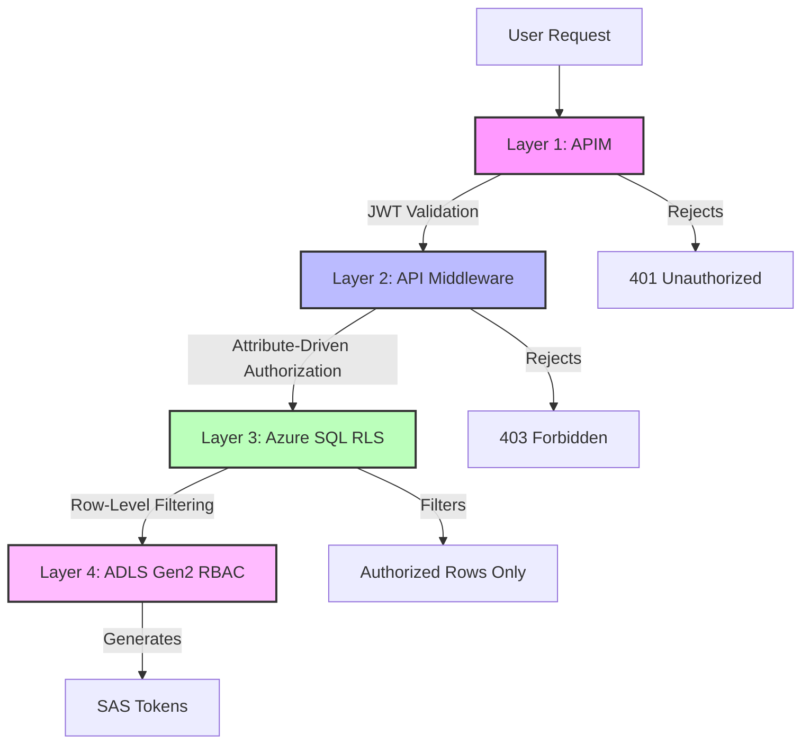
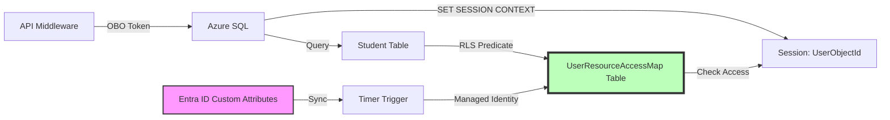
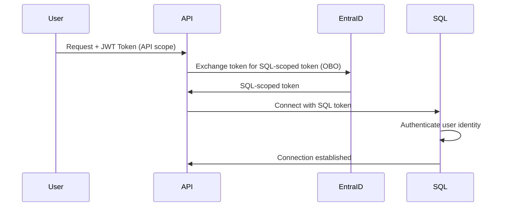

# SEC-03: Row-Level Security Implementation

**Status**: Final
**Last Updated**: 2024-11-24
**Owner**: CFI Architecture Team

## Overview

This document describes the implementation of defense-in-depth data security layers in the K12 MyPortal system. It covers Azure SQL Row-Level Security (RLS) and Azure Data Lake Storage Gen2 (ADLS Gen2) access control as backstop security mechanisms.

## Table of Contents

- [Defense-in-Depth Architecture](#defense-in-depth-architecture)
- [Azure SQL Row-Level Security](#azure-sql-row-level-security)
- [ADLS Gen2 Security](#adls-gen2-security)
- [On-Behalf-Of (OBO) Flow](#on-behalf-of-obo-flow)
- [Implementation Guide](#implementation-guide)
- [Testing and Validation](#testing-and-validation)
- [Related Documentation](#related-documentation)

## Defense-in-Depth Architecture

The K12 system implements a four-layer security model:



### Layer Responsibilities

| Layer | Technology | Purpose | Complexity |
|-------|-----------|---------|------------|
| **1. APIM** | Azure API Management | Validate JWT tokens, check application roles | Simple |
| **2. API Middleware** | .NET 8 Azure Functions | Attribute-driven authorization via Graph API | Complex |
| **3. Azure SQL RLS** | Row-Level Security | Simple backstop, no complex business logic | Simple |
| **4. ADLS Gen2** | Hierarchical RBAC + SAS | Document access control | Medium |

### Why RLS is a Backstop

**RLS acts as a simple safety net, NOT the primary security mechanism:**

- ✅ Prevents accidental direct database access
- ✅ Protects against middleware bugs or bypasses
- ✅ Simple predicate functions (no complex business logic)
- ✅ Entra ID remains the single source of truth
- ❌ Should NOT implement complex authorization rules
- ❌ Should NOT replace middleware authorization logic

## Azure SQL Row-Level Security

### Architecture



### UserResourceAccessMap Table

**Purpose**: Projection of Entra ID custom security attributes into SQL for RLS filtering

**Schema:**
```sql
CREATE TABLE dbo.UserResourceAccessMap (
    UserObjectId NVARCHAR(50) NOT NULL,      -- Entra ID Object ID
    ResourceType NVARCHAR(50) NOT NULL,      -- 'Student', 'School', 'Provider', etc.
    ResourceId NVARCHAR(50) NOT NULL,        -- Student ID, School ID, etc.
    AccessLevel NVARCHAR(20) NOT NULL,       -- 'ReadWrite', 'ReadOnly'
    SyncedAt DATETIME2 NOT NULL DEFAULT GETUTCDATE(),

    PRIMARY KEY (UserObjectId, ResourceType, ResourceId),
    INDEX IX_Resource (ResourceType, ResourceId),
    INDEX IX_User (UserObjectId)
);
```

**Example Data:**
```sql
-- Parent has read/write access to two students
INSERT INTO UserResourceAccessMap VALUES
('parent1-oid', 'Student', 'student-001', 'ReadWrite', '2024-11-24T10:00:00'),
('parent1-oid', 'Student', 'student-002', 'ReadWrite', '2024-11-24T10:00:00');

-- Proxy parent has read-only access to one student
INSERT INTO UserResourceAccessMap VALUES
('proxy1-oid', 'Student', 'student-001', 'ReadOnly', '2024-11-24T10:00:00');

-- School admin has access to all students at Lincoln High
INSERT INTO UserResourceAccessMap VALUES
('schooladmin1-oid', 'Student', 'student-001', 'ReadWrite', '2024-11-24T10:00:00'),
('schooladmin1-oid', 'Student', 'student-003', 'ReadWrite', '2024-11-24T10:00:00'),
('schooladmin1-oid', 'Student', 'student-004', 'ReadWrite', '2024-11-24T10:00:00');
```

### Synchronization Process

**Automated Sync via Timer Trigger:**

```csharp
[Function("SyncUserResourceAccessMap")]
public async Task SyncUserResourceAccessMap(
    [TimerTrigger("0 */15 * * * *")] TimerInfo timer, // Every 15 minutes
    FunctionContext context)
{
    _logger.LogInformation("Starting UserResourceAccessMap sync");

    // 1. Get all students from Entra ID
    var students = await _graphClient.Users
        .GetAsync(r => r.QueryParameters.Filter = "userType eq 'Member' AND accountEnabled eq false");

    var accessRecords = new List<UserResourceAccessRecord>();

    foreach (var student in students.Value)
    {
        // 2. Get custom security attributes for each student
        var attributes = await _graphClient.Users[student.Id]
            .CustomSecurityAttributes
            .GetAsync();

        if (attributes == null) continue;

        var accessControl = attributes["studentAccessControl"];
        if (accessControl == null) continue;

        // 3. Extract parent read/write access
        if (accessControl.TryGetValue("parentReadWrite", out var parentIds))
        {
            foreach (var parentId in (string[])parentIds)
            {
                accessRecords.Add(new UserResourceAccessRecord
                {
                    UserObjectId = parentId,
                    ResourceType = "Student",
                    ResourceId = student.Id,
                    AccessLevel = "ReadWrite"
                });
            }
        }

        // 4. Extract proxy read-only access
        if (accessControl.TryGetValue("proxyReadOnly", out var proxyIds))
        {
            foreach (var proxyId in (string[])proxyIds)
            {
                accessRecords.Add(new UserResourceAccessRecord
                {
                    UserObjectId = proxyId,
                    ResourceType = "Student",
                    ResourceId = student.Id,
                    AccessLevel = "ReadOnly"
                });
            }
        }

        // 5. Extract school enrollment
        if (accessControl.TryGetValue("enrolledSchoolId", out var schoolGroupId))
        {
            // Get all members of the school security group
            var schoolMembers = await _graphClient.Groups[schoolGroupId.ToString()]
                .Members
                .GetAsync();

            foreach (var member in schoolMembers.Value)
            {
                accessRecords.Add(new UserResourceAccessRecord
                {
                    UserObjectId = member.Id,
                    ResourceType = "Student",
                    ResourceId = student.Id,
                    AccessLevel = "ReadWrite"
                });
            }
        }

        // 6. Extract provider enrollment
        if (accessControl.TryGetValue("enrolledVendorId", out var vendorGroupId))
        {
            var vendorMembers = await _graphClient.Groups[vendorGroupId.ToString()]
                .Members
                .GetAsync();

            foreach (var member in vendorMembers.Value)
            {
                accessRecords.Add(new UserResourceAccessRecord
                {
                    UserObjectId = member.Id,
                    ResourceType = "Student",
                    ResourceId = student.Id,
                    AccessLevel = "ReadWrite"
                });
            }
        }
    }

    // 7. Bulk update SQL table (using Managed Identity)
    await BulkUpdateAccessMap(accessRecords);

    _logger.LogInformation($"Synced {accessRecords.Count} access records");
}
```

### RLS Security Policies

**Security Function:**
```sql
CREATE FUNCTION dbo.fn_StudentAccessPredicate(@StudentId NVARCHAR(50))
RETURNS TABLE
WITH SCHEMABINDING
AS
RETURN
    SELECT 1 AS AccessGranted
    WHERE
        -- Allow if user has access in UserResourceAccessMap
        EXISTS (
            SELECT 1
            FROM dbo.UserResourceAccessMap
            WHERE UserObjectId = CAST(SESSION_CONTEXT(N'UserObjectId') AS NVARCHAR(50))
              AND ResourceType = 'Student'
              AND ResourceId = @StudentId
        )
        OR
        -- Allow if K12.Admin role (global admin bypass)
        CAST(SESSION_CONTEXT(N'IsGlobalAdmin') AS BIT) = 1;
```

**Security Policy:**
```sql
CREATE SECURITY POLICY dbo.StudentAccessPolicy
ADD FILTER PREDICATE dbo.fn_StudentAccessPredicate(StudentId)
    ON Enrollment.Students
WITH (STATE = ON);
```

**Apply to Multiple Tables:**
```sql
-- Students table
ALTER SECURITY POLICY dbo.StudentAccessPolicy
ADD FILTER PREDICATE dbo.fn_StudentAccessPredicate(StudentId)
    ON Enrollment.Students;

-- Applications table
ALTER SECURITY POLICY dbo.StudentAccessPolicy
ADD FILTER PREDICATE dbo.fn_StudentAccessPredicate(StudentId)
    ON Enrollment.Applications;

-- Awards table
ALTER SECURITY POLICY dbo.StudentAccessPolicy
ADD FILTER PREDICATE dbo.fn_StudentAccessPredicate(StudentId)
    ON Awards.StudentAwards;

-- Documents table
ALTER SECURITY POLICY dbo.StudentAccessPolicy
ADD FILTER PREDICATE dbo.fn_StudentAccessPredicate(StudentId)
    ON dbo.Documents;
```

### Session Context Setup

**Setting Session Context in API:**

```csharp
public async Task<IActionResult> GetStudentData(string studentId)
{
    // 1. Extract user Object ID from JWT token
    var userObjectId = User.FindFirst("oid")?.Value;
    var isGlobalAdmin = User.IsInRole("K12.Admin") ? 1 : 0;

    // 2. Get OBO token for SQL access
    var sqlToken = await GetOnBehalfOfToken("https://database.windows.net/");

    // 3. Open SQL connection with OBO token
    using var connection = new SqlConnection(
        $"Server={_sqlServer};Database={_sqlDatabase};");
    connection.AccessToken = sqlToken;
    await connection.OpenAsync();

    // 4. Set session context
    using var contextCmd = new SqlCommand(
        "EXEC sp_set_session_context @key=N'UserObjectId', @value=@userObjectId; " +
        "EXEC sp_set_session_context @key=N'IsGlobalAdmin', @value=@isGlobalAdmin;",
        connection);
    contextCmd.Parameters.AddWithValue("@userObjectId", userObjectId);
    contextCmd.Parameters.AddWithValue("@isGlobalAdmin", isGlobalAdmin);
    await contextCmd.ExecuteNonQueryAsync();

    // 5. Query data (RLS automatically applied)
    using var dataCmd = new SqlCommand(
        "SELECT * FROM Enrollment.Students WHERE StudentId = @studentId",
        connection);
    dataCmd.Parameters.AddWithValue("@studentId", studentId);

    // If user doesn't have access, query returns no rows
    var result = await dataCmd.ExecuteReaderAsync();

    if (!result.HasRows)
    {
        return Forbid(); // No access
    }

    // Process and return data
    // ...
}
```

### SqlKata Decorator Pattern

**Automatically set session context for all queries:**

```csharp
public class RlsQueryFactory : QueryFactory
{
    private readonly IHttpContextAccessor _httpContextAccessor;

    public RlsQueryFactory(
        DbConnection connection,
        Compiler compiler,
        IHttpContextAccessor httpContextAccessor)
        : base(connection, compiler)
    {
        _httpContextAccessor = httpContextAccessor;
    }

    public override async Task<IEnumerable<T>> GetAsync<T>(Query query)
    {
        // Set session context before every query
        await SetSessionContext();
        return await base.GetAsync<T>(query);
    }

    private async Task SetSessionContext()
    {
        var userObjectId = _httpContextAccessor.HttpContext.User
            .FindFirst("oid")?.Value;
        var isGlobalAdmin = _httpContextAccessor.HttpContext.User
            .IsInRole("K12.Admin") ? 1 : 0;

        using var cmd = Connection.CreateCommand();
        cmd.CommandText =
            "EXEC sp_set_session_context @key=N'UserObjectId', @value=@userObjectId; " +
            "EXEC sp_set_session_context @key=N'IsGlobalAdmin', @value=@isGlobalAdmin;";

        var oidParam = cmd.CreateParameter();
        oidParam.ParameterName = "@userObjectId";
        oidParam.Value = userObjectId;
        cmd.Parameters.Add(oidParam);

        var adminParam = cmd.CreateParameter();
        adminParam.ParameterName = "@isGlobalAdmin";
        adminParam.Value = isGlobalAdmin;
        cmd.Parameters.Add(adminParam);

        await cmd.ExecuteNonQueryAsync();
    }
}
```

## ADLS Gen2 Security

### Hierarchical Structure

**Document Path Structure:**
```
/{application}/{legal-entity}/{userid}/{documentType}

Examples:
/enrollment/lincoln-high/student123/apartmentleasingagreement
/enrollment/lincoln-high/student123/birthcertificate
/providerdashboard/math-tutor123/employee123/verificationdocument123
```

**Benefits:**
- Hierarchical access control (RBAC at folder level)
- Easy to grant/revoke access to all documents for a legal entity
- Clear organization and discoverability

### Security Group Permissions

**RBAC Assignments:**

| Security Group | Role | Path | Access |
|----------------|------|------|--------|
| `K12-School-HDMA-LincolnHigh` | Storage Blob Data Reader | `/enrollment/lincoln-high/` | Read all student documents |
| `K12-Provider-MathTutors` | Storage Blob Data Reader | `/providerdashboard/math-tutor123/` | Read all provider documents |
| `K12-admin-Global-admin` | Storage Blob Data Contributor | `/` | Full access to all documents |

**Assigning RBAC:**
```bash
# Grant school read access to their students' documents
az role assignment create \
    --role "Storage Blob Data Reader" \
    --assignee-object-id <school-group-object-id> \
    --scope "/subscriptions/<sub>/resourceGroups/<rg>/providers/Microsoft.Storage/storageAccounts/<account>/blobServices/default/containers/enrollment/blobs/lincoln-high"
```

### SAS Token Generation

**Short-Lived Tokens for Secure Downloads:**

```csharp
public async Task<string> GenerateDocumentDownloadUrl(
    string documentPath,
    string userObjectId)
{
    // 1. Verify user has access to document
    var hasAccess = await AuthorizeDocumentAccess(userObjectId, documentPath);
    if (!hasAccess)
    {
        throw new UnauthorizedAccessException("User does not have access to this document");
    }

    // 2. Get blob client
    var blobServiceClient = new BlobServiceClient(
        new Uri($"https://{_storageAccount}.blob.core.windows.net/"),
        new DefaultAzureCredential());

    var containerClient = blobServiceClient.GetBlobContainerClient("documents");
    var blobClient = containerClient.GetBlobClient(documentPath);

    // 3. Generate SAS token (5 minute expiry)
    var sasBuilder = new BlobSasBuilder
    {
        BlobContainerName = "documents",
        BlobName = documentPath,
        Resource = "b", // Blob
        StartsOn = DateTimeOffset.UtcNow.AddMinutes(-5), // Account for clock skew
        ExpiresOn = DateTimeOffset.UtcNow.AddMinutes(5), // 5 minute expiry
    };

    sasBuilder.SetPermissions(BlobSasPermissions.Read);

    // 4. Generate SAS token using storage account key
    var sasToken = sasBuilder.ToSasQueryParameters(
        new StorageSharedKeyCredential(_storageAccount, _storageKey));

    // 5. Return full URL with SAS token
    return $"{blobClient.Uri}?{sasToken}";
}
```

**Usage in API:**
```csharp
[HttpGet("documents/{documentId}/download")]
public async Task<IActionResult> DownloadDocument(string documentId)
{
    var userObjectId = User.FindFirst("oid")?.Value;

    // Get document path from database
    var document = await _db.QueryFirstOrDefaultAsync<Document>(
        "SELECT * FROM dbo.Documents WHERE DocumentId = @documentId",
        new { documentId });

    if (document == null)
        return NotFound();

    // Generate SAS URL (includes authorization check)
    try
    {
        var downloadUrl = await GenerateDocumentDownloadUrl(
            document.BlobPath,
            userObjectId);

        // Return redirect to blob storage with SAS token
        return Redirect(downloadUrl);
    }
    catch (UnauthorizedAccessException)
    {
        return Forbid();
    }
}
```

### Document Access Control

**Permission Mapping:**

**Enrollment Application Documents:**
```
Path: /enrollment/{schoolId}/{studentId}/{documentType}

Access:
- Primary Parent (parentReadWrite): Read/Write
- Proxy Parent (proxyReadOnly): Read
- School Admin (enrolledSchoolId group member): Read/Write
- K12 Admin: Read/Write
```

**Provider Dashboard Documents:**
```
Path: /providerdashboard/{providerId}/{employeeId}/{documentType}

Access:
- Provider Admin (provider group member): Read/Write
- K12 Admin: Read/Write
```

## On-Behalf-Of (OBO) Flow

### What is OBO?

**On-Behalf-Of (OBO) flow** exchanges a user's access token for a new token scoped to Azure SQL:



**Benefits:**
- SQL knows the actual user identity (not service identity)
- RLS can filter based on user Object ID
- Audit logs capture actual user, not service principal
- Defense-in-depth: service account compromise doesn't bypass RLS

### Implementation

**Token Exchange:**
```csharp
public async Task<string> GetOnBehalfOfToken(string resource)
{
    // Get user's access token from request
    var userAccessToken = await _httpContext.GetTokenAsync("access_token");

    // Exchange for SQL-scoped token
    var app = ConfidentialClientApplicationBuilder
        .Create(_clientId)
        .WithClientSecret(_clientSecret)
        .WithAuthority(new Uri(_authority))
        .Build();

    var result = await app.AcquireTokenOnBehalfOf(
        new[] { $"{resource}/.default" },
        new UserAssertion(userAccessToken))
        .ExecuteAsync();

    return result.AccessToken;
}
```

**SQL Connection:**
```csharp
public async Task<SqlConnection> GetSqlConnection()
{
    // Get OBO token for SQL
    var sqlToken = await GetOnBehalfOfToken("https://database.windows.net/");

    // Create connection with token
    var connection = new SqlConnection(_connectionString);
    connection.AccessToken = sqlToken;

    await connection.OpenAsync();
    return connection;
}
```

## Implementation Guide

### Step 1: Setup UserResourceAccessMap

```sql
-- Create table
CREATE TABLE dbo.UserResourceAccessMap (
    UserObjectId NVARCHAR(50) NOT NULL,
    ResourceType NVARCHAR(50) NOT NULL,
    ResourceId NVARCHAR(50) NOT NULL,
    AccessLevel NVARCHAR(20) NOT NULL,
    SyncedAt DATETIME2 NOT NULL DEFAULT GETUTCDATE(),
    PRIMARY KEY (UserObjectId, ResourceType, ResourceId)
);

-- Lock down to Managed Identity only
DENY SELECT, INSERT, UPDATE, DELETE ON dbo.UserResourceAccessMap TO PUBLIC;
GRANT SELECT, INSERT, UPDATE, DELETE ON dbo.UserResourceAccessMap TO [k12-sync-managed-identity];
```

### Step 2: Create RLS Functions and Policies

```sql
-- Create security function
CREATE FUNCTION dbo.fn_StudentAccessPredicate(@StudentId NVARCHAR(50))
RETURNS TABLE WITH SCHEMABINDING
AS RETURN
    SELECT 1 AS AccessGranted
    WHERE EXISTS (
        SELECT 1 FROM dbo.UserResourceAccessMap
        WHERE UserObjectId = CAST(SESSION_CONTEXT(N'UserObjectId') AS NVARCHAR(50))
          AND ResourceType = 'Student'
          AND ResourceId = @StudentId
    ) OR CAST(SESSION_CONTEXT(N'IsGlobalAdmin') AS BIT) = 1;
GO

-- Create security policy
CREATE SECURITY POLICY dbo.StudentAccessPolicy
ADD FILTER PREDICATE dbo.fn_StudentAccessPredicate(StudentId) ON Enrollment.Students
WITH (STATE = ON);
```

### Step 3: Deploy Timer Trigger

Deploy the sync function to Azure Functions with:
- Managed Identity enabled
- SQL connection with Managed Identity authentication
- Graph API permissions: `User.Read.All`, `Group.Read.All`, `CustomSecAttributeAssignment.Read.All`

### Step 4: Configure ADLS Gen2 RBAC

```bash
# Enable hierarchical namespace
az storage account update \
    --name <account> \
    --resource-group <rg> \
    --enable-hierarchical-namespace true

# Assign school group read access
az role assignment create \
    --role "Storage Blob Data Reader" \
    --assignee-object-id <school-group-oid> \
    --scope "/subscriptions/<sub>/resourceGroups/<rg>/providers/Microsoft.Storage/storageAccounts/<account>"
```

### Step 5: Implement OBO in API

Add OBO token acquisition to all data access methods (see implementation examples above).

## Testing and Validation

### RLS Testing

**Test 1: Verify RLS blocks unauthorized access**
```sql
-- Set session context as Parent 1
EXEC sp_set_session_context @key=N'UserObjectId', @value='parent1-oid';
EXEC sp_set_session_context @key=N'IsGlobalAdmin', @value=0;

-- Query should return only students parent1 has access to
SELECT * FROM Enrollment.Students;
```

**Test 2: Verify global admin bypass**
```sql
-- Set session context as K12 Admin
EXEC sp_set_session_context @key=N'UserObjectId', @value='admin-oid';
EXEC sp_set_session_context @key=N'IsGlobalAdmin', @value=1;

-- Query should return ALL students
SELECT * FROM Enrollment.Students;
```

**Test 3: Verify sync is working**
```sql
-- Check sync timestamp
SELECT TOP 10 * FROM dbo.UserResourceAccessMap ORDER BY SyncedAt DESC;

-- Verify parent access
SELECT * FROM dbo.UserResourceAccessMap WHERE UserObjectId = 'parent1-oid';
```

### ADLS Gen2 Testing

**Test 1: Generate SAS token**
```csharp
var url = await GenerateDocumentDownloadUrl(
    "/enrollment/lincoln-high/student123/birthcertificate",
    "parent1-oid");

// URL should include SAS token
// Verify download works
```

**Test 2: Verify SAS expiration**
```csharp
// Wait 6 minutes
System.Threading.Thread.Sleep(360000);

// Try download - should fail with 403
```

**Test 3: Verify unauthorized access fails**
```csharp
// Try to access document user doesn't have access to
var url = await GenerateDocumentDownloadUrl(
    "/enrollment/lincoln-high/student456/birthcertificate",
    "parent1-oid"); // parent1 doesn't have access to student456

// Should throw UnauthorizedAccessException
```

## Best Practices

### RLS Best Practices

1. **Keep RLS simple**: No complex business logic in predicates
2. **Sync frequently**: 15-minute sync interval recommended
3. **Monitor sync failures**: Alert on sync errors
4. **Test with session context**: Always test RLS with actual session context
5. **Use OBO flow**: Don't use service principal for user queries

### ADLS Gen2 Best Practices

1. **Short SAS expiry**: 5 minutes maximum
2. **Read-only SAS**: Generate read-only SAS tokens when possible
3. **Hierarchical structure**: Use folders to scope RBAC assignments
4. **Monitor access**: Enable diagnostic logs for blob access
5. **Rotate keys regularly**: Rotate storage account keys quarterly

### Performance Optimization

1. **Index UserResourceAccessMap**: Ensure proper indexing on UserObjectId and ResourceId
2. **Cache Graph API calls**: Cache custom attributes for 5-10 minutes
3. **Batch sync updates**: Use bulk insert/update for sync
4. **CDN for documents**: Consider Azure CDN for frequently accessed documents

## Related Documentation

- [SEC-01: Entra ID Configuration Guide](SEC-01-entra-id-configuration.md)
- [SEC-02: Authorization Model Documentation](SEC-02-authorization-model.md)
- [SEC-04: Audit Logging Architecture](SEC-04-audit-logging.md)
- [Database Schema Documentation](./../../Database-Schema-Documentation.md)

## References

- [Azure SQL Row-Level Security](https://learn.microsoft.com/en-us/sql/relational-databases/security/row-level-security)
- [ADLS Gen2 Access Control](https://learn.microsoft.com/en-us/azure/storage/blobs/data-lake-storage-access-control)
- [On-Behalf-Of Flow](https://learn.microsoft.com/en-us/entra/identity-platform/v2-oauth2-on-behalf-of-flow)
- [SAS Tokens](https://learn.microsoft.com/en-us/azure/storage/common/storage-sas-overview)

---

**Source**: Confluence pages 2503-2533 (Hub and Spoke - Step 4)
**Migrated**: 2024-11-24
**Migrated by**: Documentation Migrator Agent
