# WF-01: Roster - To Be Certified Workflow

**Workflow ID:** WF-01
**Status:** Proposed
**Type:** Business Process Workflow
**Date:** 2025-12-11
**Author:** CFI Architecture Team
**Technical Story:** [K12-XXXX] Roster Certification Workflow

---

## Table of Contents

1. [Overview](#overview)
2. [Business Context](#business-context)
3. [Workflow Architecture](#workflow-architecture)
4. [Workflow States & Transitions](#workflow-states--transitions)
5. [Detailed Process Flow](#detailed-process-flow)
6. [Data Entities & Domain Model](#data-entities--domain-model)
7. [Event-Driven Architecture](#event-driven-architecture)
8. [Azure Durable Functions Design](#azure-durable-functions-design)
9. [API Endpoints (Proposed)](#api-endpoints-proposed)
10. [Business Rules & Validation](#business-rules--validation)
11. [Error Scenarios & Recovery](#error-scenarios--recovery)
12. [Notifications & Communications](#notifications--communications)
13. [Monitoring & Metrics](#monitoring--metrics)
14. [Security Considerations](#security-considerations)
15. [Testing Strategy](#testing-strategy)
16. [Implementation Challenges](#implementation-challenges)
17. [Proposed Database Schema](#proposed-database-schema)
18. [Related Workflows](#related-workflows)
19. [Related Documentation](#related-documentation)

---

## Overview

The **Roster - To Be Certified** workflow manages the transition of students from completed enrollment applications to school rosters, and orchestrates the certification process that determines whether students are officially enrolled and eligible for payment.

### Purpose

- Transition students who have completed all prerequisite workflows to school rosters
- Manage the certification window and certification determination process
- Coordinate notifications to households, schools, and administrators
- Trigger downstream payment workflows upon successful certification

### Scope

This workflow begins when:
- Application registration workflow is complete
- Award workflow is complete (award accepted)
- School selection/acceptance is complete

This workflow ends when:
- **Certified**: All students on roster have certification determined → Payment triggered
- **Incomplete**: Some students not certified after window closes → Restart school selection

---

## Business Context

### Problem Statement

When a household completes the enrollment application process (registration, school selection, award acceptance), the student(s) must be added to the school's roster and certified before payment can be processed. This requires:

1. Coordinating multiple completion signals from upstream workflows
2. Managing certification windows with time-based constraints
3. Handling partial certification scenarios (some students certified, others not)
4. Triggering appropriate downstream workflows based on outcomes

### Key Stakeholders

| Stakeholder | Role in Workflow |
|-------------|------------------|
| **Household/Parent** | Receives notifications, may need to restart school selection if not certified |
| **School Admin** | Reviews and certifies students on roster |
| **SEAA Admin** | Monitors certification progress, handles exceptions |
| **System** | Orchestrates workflow, manages state transitions |

### Success Criteria

- 100% of completed applications transition to roster within 24 hours
- Certification determination within defined certification window
- Zero payment processing before certification complete
- Complete audit trail of all state transitions

---

## Workflow Architecture

### High-Level Architecture

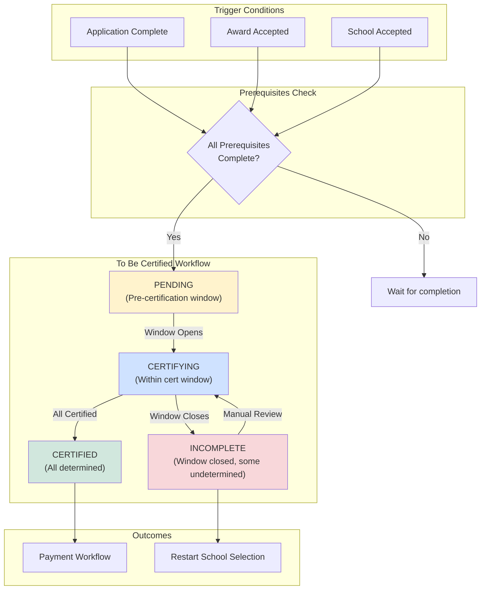

### Component Interactions

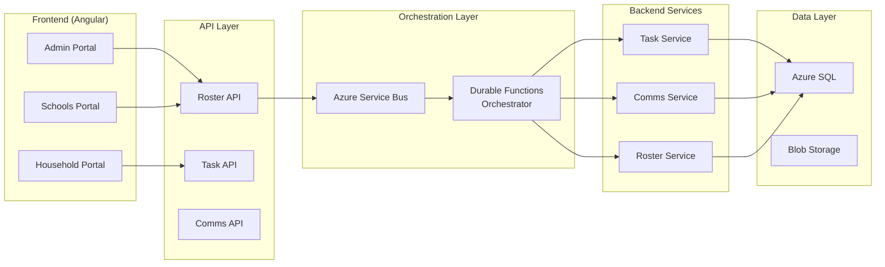

---

## Workflow States & Transitions

### State Machine Diagram

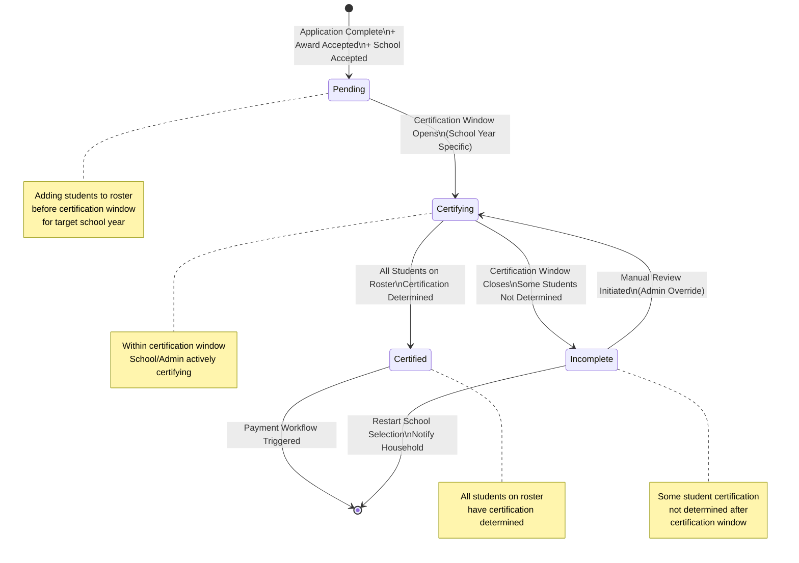

### State Definitions

| State | Description | Entry Conditions | Exit Conditions |
|-------|-------------|------------------|-----------------|
| **Pending** | Students added to roster, awaiting certification window | All prerequisites complete | Certification window opens |
| **Certifying** | Active certification in progress | Window opened | All certified OR window closes |
| **Certified** | All students have certification determined | All students certified | Payment triggered |
| **Incomplete** | Some students not certified after window | Window closed with undetermined | Manual review OR restart |

### State Transition Events

| Transition | Event | Trigger | Actions |
|------------|-------|---------|---------|
| `→ Pending` | `ROSTER_READY` | Prerequisites complete | Create roster entry, notify school |
| `Pending → Certifying` | `CERT_WINDOW_OPEN` | Scheduled timer | Enable certification UI, notify parties |
| `Certifying → Certified` | `ALL_CERTIFIED` | Last student certified | Send certified emails, trigger payment |
| `Certifying → Incomplete` | `WINDOW_CLOSED` | Scheduled timer | Send not-certified emails, flag for review |
| `Incomplete → Certifying` | `MANUAL_REVIEW` | Admin action | Reopen for certification |

---

## Detailed Process Flow

### 1. Application Complete → Roster Add

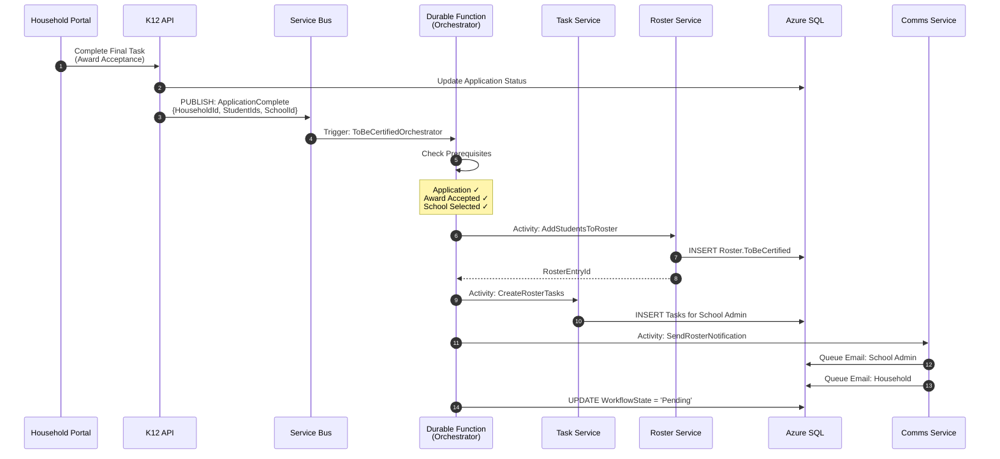

### 2. Certification Process Flow

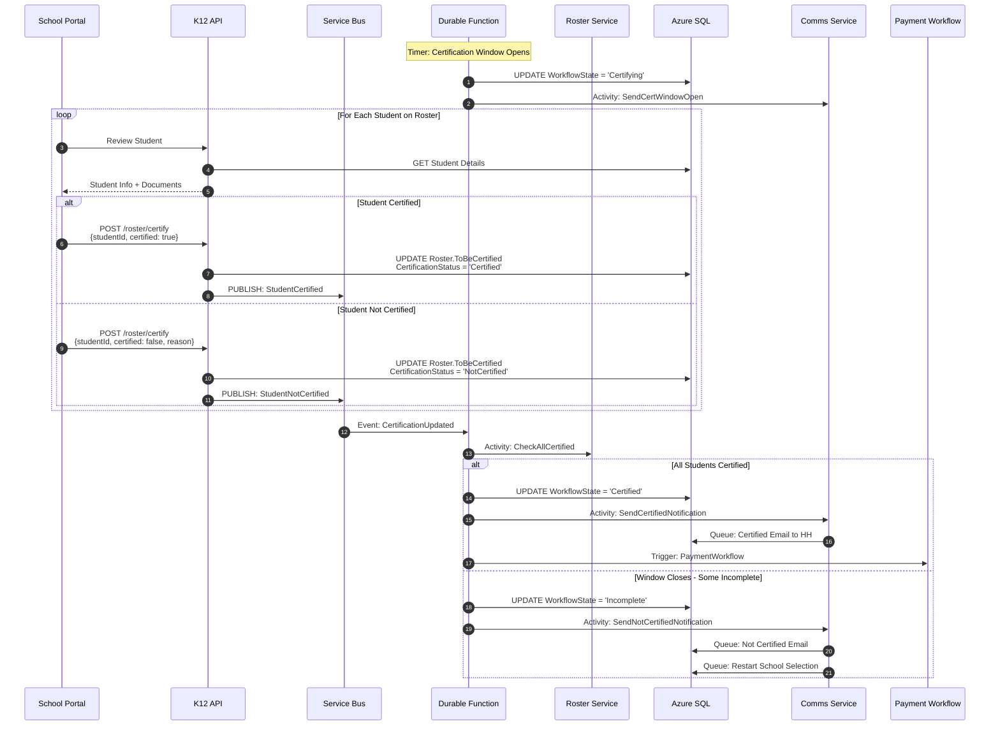

### 3. Certified → Payment Flow

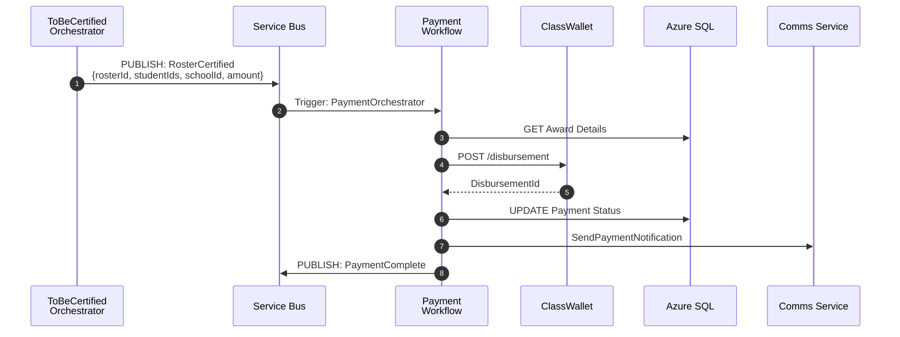

---

## Data Entities & Domain Model

### Entity Relationship Diagram

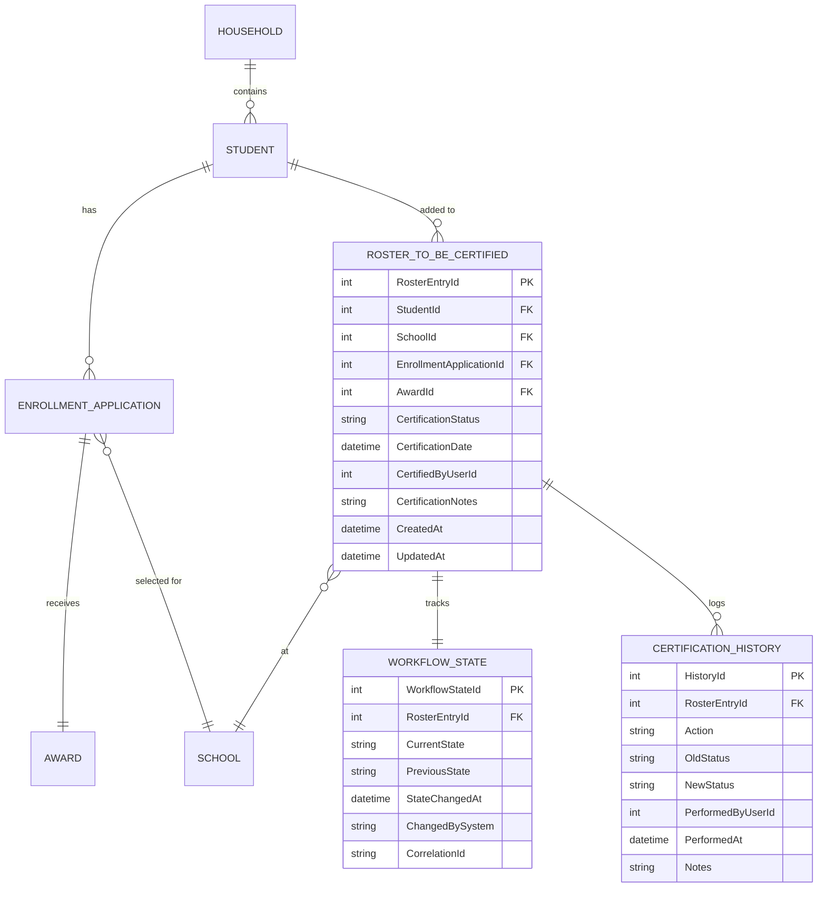

### Domain Model

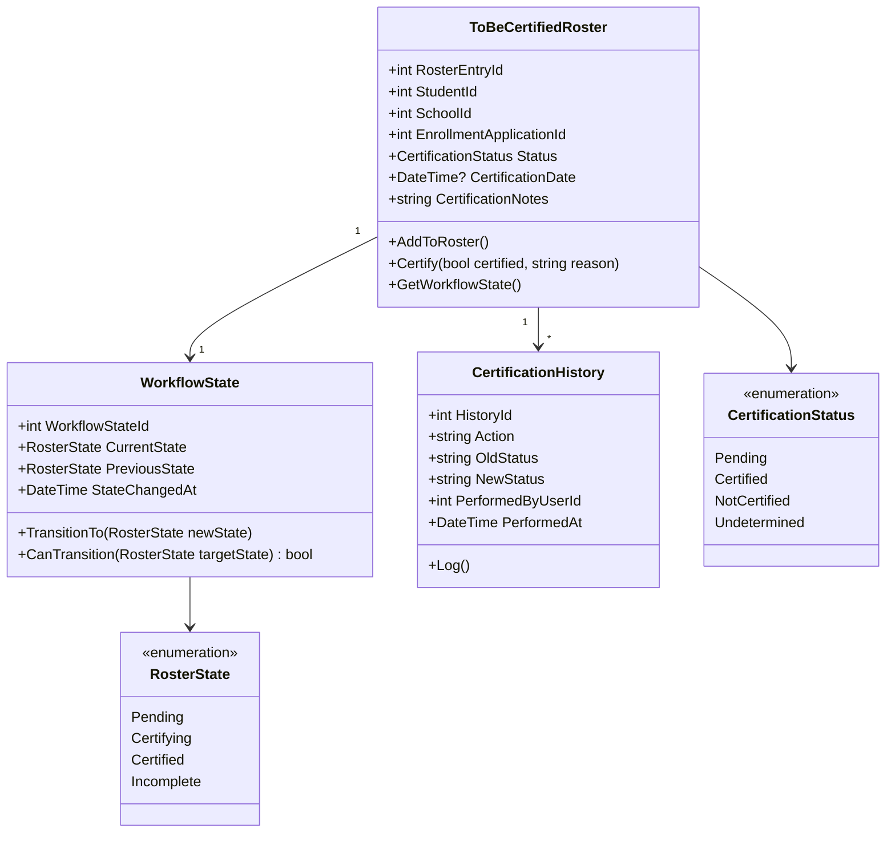

---

## Event-Driven Architecture

### Event Flow Diagram

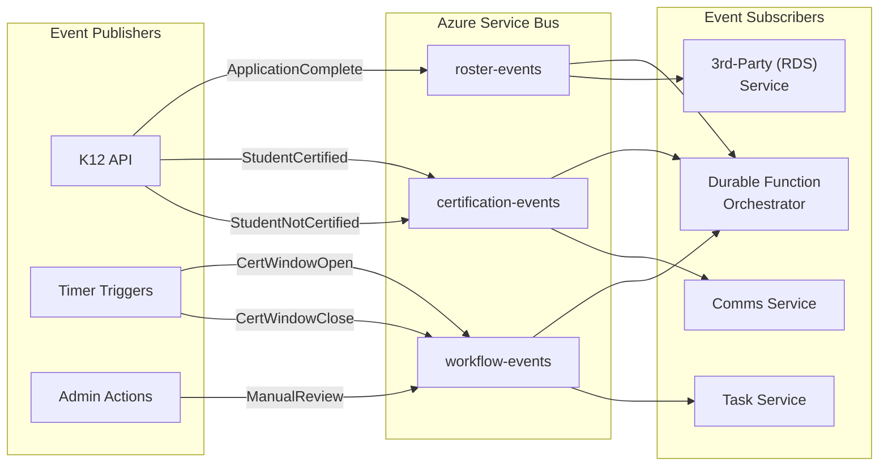

### Event Schemas

#### ApplicationComplete Event

```json
{
  "eventType": "ApplicationComplete",
  "eventVersion": "1.0",
  "correlationId": "guid",
  "timestamp": "2025-12-11T10:30:00Z",
  "payload": {
    "householdId": 12345,
    "studentIds": [1001, 1002],
    "schoolId": 500,
    "enrollmentApplicationId": 9999,
    "awardId": 8888,
    "fiscalYear": 2025,
    "programType": "OpportunityScholarship"
  }
}
```

#### StudentCertified Event

```json
{
  "eventType": "StudentCertified",
  "eventVersion": "1.0",
  "correlationId": "guid",
  "timestamp": "2025-12-11T14:00:00Z",
  "payload": {
    "rosterEntryId": 55555,
    "studentId": 1001,
    "schoolId": 500,
    "certificationStatus": "Certified",
    "certifiedByUserId": 2001,
    "certificationDate": "2025-12-11T14:00:00Z",
    "notes": null
  }
}
```

#### RosterCertified Event (Workflow Complete)

```json
{
  "eventType": "RosterCertified",
  "eventVersion": "1.0",
  "correlationId": "guid",
  "timestamp": "2025-12-11T15:00:00Z",
  "payload": {
    "rosterId": 55555,
    "householdId": 12345,
    "studentIds": [1001, 1002],
    "schoolId": 500,
    "totalAwardAmount": 5500.00,
    "disbursementEligible": true,
    "fiscalYear": 2025
  }
}
```

### Service Bus Configuration

| Topic | Subscriptions | Filter | Purpose |
|-------|---------------|--------|---------|
| `roster-events` | `orchestrator`, `rds-sync` | None | Roster lifecycle events |
| `certification-events` | `orchestrator`, `comms` | None | Certification actions |
| `workflow-events` | `orchestrator`, `task-service` | None | Workflow state changes |

---

## Azure Durable Functions Design

### Orchestrator Function

```csharp
[FunctionName("ToBeCertifiedOrchestrator")]
public static async Task<WorkflowResult> RunOrchestrator(
    [OrchestrationTrigger] IDurableOrchestrationContext context,
    ILogger log)
{
    var input = context.GetInput<ToBeCertifiedInput>();
    var workflowState = new WorkflowState { CurrentState = RosterState.Pending };

    // Step 1: Add students to roster
    var rosterEntryId = await context.CallActivityAsync<int>(
        "AddStudentsToRoster",
        input);

    // Step 2: Create tasks for school admin
    await context.CallActivityAsync(
        "CreateRosterTasks",
        new TaskInput { RosterEntryId = rosterEntryId, SchoolId = input.SchoolId });

    // Step 3: Send notifications
    await context.CallActivityAsync(
        "SendRosterNotification",
        new NotificationInput { RosterEntryId = rosterEntryId, Type = "RosterCreated" });

    // Step 4: Wait for certification window to open
    var certWindowOpen = await context.WaitForExternalEvent<bool>(
        "CertificationWindowOpen",
        GetCertWindowOpenDate(input.FiscalYear));

    workflowState.CurrentState = RosterState.Certifying;
    await context.CallActivityAsync("UpdateWorkflowState", workflowState);

    // Step 5: Wait for all certifications OR window close
    var certificationComplete = context.WaitForExternalEvent<CertificationResult>("AllCertified");
    var windowClose = context.CreateTimer(GetCertWindowCloseDate(input.FiscalYear), CancellationToken.None);

    var winner = await Task.WhenAny(certificationComplete, windowClose);

    if (winner == certificationComplete)
    {
        // All students certified
        workflowState.CurrentState = RosterState.Certified;
        await context.CallActivityAsync("UpdateWorkflowState", workflowState);

        await context.CallActivityAsync("SendCertifiedNotification", rosterEntryId);
        await context.CallActivityAsync("TriggerPaymentWorkflow", rosterEntryId);

        return new WorkflowResult { Success = true, FinalState = RosterState.Certified };
    }
    else
    {
        // Window closed - check for incomplete
        var status = await context.CallActivityAsync<CertificationStatus>(
            "CheckCertificationStatus",
            rosterEntryId);

        if (status == CertificationStatus.AllCertified)
        {
            workflowState.CurrentState = RosterState.Certified;
            await context.CallActivityAsync("TriggerPaymentWorkflow", rosterEntryId);
        }
        else
        {
            workflowState.CurrentState = RosterState.Incomplete;
            await context.CallActivityAsync("SendNotCertifiedNotification", rosterEntryId);
            await context.CallActivityAsync("InitiateSchoolReselection", input.HouseholdId);
        }

        await context.CallActivityAsync("UpdateWorkflowState", workflowState);
        return new WorkflowResult { Success = false, FinalState = workflowState.CurrentState };
    }
}
```

### Activity Functions

| Activity | Purpose | Input | Output |
|----------|---------|-------|--------|
| `AddStudentsToRoster` | Create roster entries in DB | `ToBeCertifiedInput` | `int` (RosterEntryId) |
| `CreateRosterTasks` | Create tasks for school admin | `TaskInput` | `void` |
| `SendRosterNotification` | Queue notification emails | `NotificationInput` | `void` |
| `UpdateWorkflowState` | Persist workflow state | `WorkflowState` | `void` |
| `CheckCertificationStatus` | Query certification progress | `int` (RosterEntryId) | `CertificationStatus` |
| `SendCertifiedNotification` | Send certified emails | `int` (RosterEntryId) | `void` |
| `SendNotCertifiedNotification` | Send not certified emails | `int` (RosterEntryId) | `void` |
| `TriggerPaymentWorkflow` | Start payment processing | `int` (RosterEntryId) | `void` |
| `InitiateSchoolReselection` | Restart school selection | `int` (HouseholdId) | `void` |

---

## API Endpoints (Proposed)

### Roster Management

| Method | Endpoint | Description | Auth |
|--------|----------|-------------|------|
| `POST` | `/api/roster/add` | Add students to roster | K12.Admin, System |
| `GET` | `/api/roster/{rosterId}` | Get roster details | School.Admin, K12.Admin |
| `GET` | `/api/roster/school/{schoolId}` | Get school's roster | School.Admin |
| `GET` | `/api/roster/pending` | Get pending certifications | School.Admin |

### Certification

| Method | Endpoint | Description | Auth |
|--------|----------|-------------|------|
| `POST` | `/api/roster/{rosterId}/certify` | Certify/reject student | School.Admin |
| `GET` | `/api/roster/{rosterId}/status` | Get certification status | School.Admin, K12.Admin |
| `POST` | `/api/roster/{rosterId}/review` | Initiate manual review | K12.Admin |

### Request/Response Examples

#### POST /api/roster/{rosterId}/certify

**Request:**
```json
{
  "studentId": 1001,
  "certified": true,
  "notes": "Documentation verified"
}
```

**Response (200 OK):**
```json
{
  "rosterEntryId": 55555,
  "studentId": 1001,
  "certificationStatus": "Certified",
  "certificationDate": "2025-12-11T14:00:00Z",
  "certifiedBy": "school.admin@lincoln.edu",
  "workflowState": "Certifying",
  "remainingUncertified": 1
}
```

---

## Business Rules & Validation

### Pre-Certification Rules

| Rule ID | Rule | Validation |
|---------|------|------------|
| BR-001 | All prerequisites must be complete | Application, Award, School selection |
| BR-002 | Student must not already be on roster | Check existing roster entries |
| BR-003 | School must be active and approved | School status = 'Active' |
| BR-004 | Award must be accepted | Award acceptance date not null |

### Certification Rules

| Rule ID | Rule | Validation |
|---------|------|------------|
| BR-010 | Certification only within window | Current date within cert window |
| BR-011 | Only school admin can certify | Role = School.Admin for school |
| BR-012 | Cannot re-certify completed | Status != 'Certified' already |
| BR-013 | Rejection requires reason | If certified = false, notes required |

### Post-Certification Rules

| Rule ID | Rule | Validation |
|---------|------|------------|
| BR-020 | Payment only after all certified | All students CertificationStatus = 'Certified' |
| BR-021 | Incomplete triggers reselection | Window closed + uncertified students |
| BR-022 | Manual review reopens window | K12.Admin can override window |

---

## Error Scenarios & Recovery

### Error Handling Matrix

| Error | Detection | Recovery | Notification |
|-------|-----------|----------|--------------|
| Prerequisites incomplete | Orchestrator check | Wait/retry | Log warning |
| Service Bus unavailable | Publish timeout | Retry with exponential backoff | Alert ops |
| Database write failure | Activity exception | Retry 3x, then escalate | Alert ops |
| Certification timeout | Timer expiry | Mark incomplete | Email HH + Admin |
| Payment failure | ClassWallet error | Retry, manual intervention | Alert ops |

### Compensating Transactions

```csharp
// If AddStudentsToRoster succeeds but CreateRosterTasks fails
try
{
    await context.CallActivityAsync("CreateRosterTasks", taskInput);
}
catch (Exception ex)
{
    // Compensate: Remove roster entry
    await context.CallActivityAsync("RemoveRosterEntry", rosterEntryId);
    throw;
}
```

### Retry Policies

```csharp
var retryOptions = new RetryOptions(
    firstRetryInterval: TimeSpan.FromSeconds(5),
    maxNumberOfAttempts: 3)
{
    BackoffCoefficient = 2.0,
    MaxRetryInterval = TimeSpan.FromMinutes(1)
};

await context.CallActivityWithRetryAsync("AddStudentsToRoster", retryOptions, input);
```

---

## Notifications & Communications

### Email Templates

| Template ID | Trigger | Recipients | Subject |
|-------------|---------|------------|---------|
| `ROSTER_ADDED` | Student added to roster | School Admin | "New Student Added to Roster" |
| `ROSTER_PENDING_HH` | Student added to roster | Household | "Your Application is Pending Certification" |
| `CERT_WINDOW_OPEN` | Window opens | School Admin | "Certification Window Now Open" |
| `STUDENT_CERTIFIED` | Student certified | Household | "Your Student Has Been Certified" |
| `STUDENT_NOT_CERTIFIED` | Student not certified | Household | "Action Required: Certification Issue" |
| `ALL_CERTIFIED` | All students certified | Household | "Congratulations! Enrollment Complete" |
| `RESTART_SELECTION` | Incomplete, restart | Household | "Please Select a New School" |

### Communication Flow

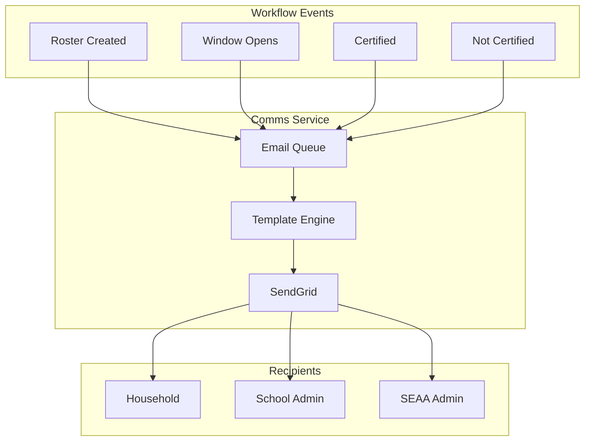

---

## Monitoring & Metrics

### Key Performance Indicators (KPIs)

| Metric | Target | Alert Threshold |
|--------|--------|-----------------|
| Roster creation latency | < 5 seconds | > 30 seconds |
| Certification completion rate | > 95% | < 90% |
| Payment trigger latency | < 1 minute | > 5 minutes |
| Workflow failure rate | < 1% | > 5% |
| Incomplete roster rate | < 5% | > 10% |

### Application Insights Queries

```kql
// Workflow completion times
customEvents
| where name == "WorkflowComplete"
| where customDimensions.workflowType == "ToBeCertified"
| summarize
    avgDuration = avg(todouble(customDimensions.durationMs)),
    p95Duration = percentile(todouble(customDimensions.durationMs), 95)
    by bin(timestamp, 1h)

// Certification status distribution
customEvents
| where name == "CertificationUpdated"
| summarize count() by tostring(customDimensions.certificationStatus)
| render piechart
```

### Alerts Configuration

```json
{
  "alertName": "ToBeCertified-HighFailureRate",
  "description": "High failure rate in To Be Certified workflow",
  "severity": 2,
  "evaluationFrequency": "PT5M",
  "windowSize": "PT15M",
  "criteria": {
    "query": "customEvents | where name == 'WorkflowFailed' | where customDimensions.workflowType == 'ToBeCertified' | count",
    "threshold": 5,
    "operator": "GreaterThan"
  },
  "actionGroup": "K12-Ops-Team"
}
```

---

## Security Considerations

### Authorization Matrix

| Action | K12.Admin | School.Admin | Household | System |
|--------|-----------|--------------|-----------|--------|
| View roster | Yes | Own school only | Own students | Yes |
| Add to roster | Yes | No | No | Yes |
| Certify student | Yes | Own school only | No | No |
| Manual review | Yes | No | No | No |
| Trigger payment | Yes | No | No | Yes |

### Data Protection

- **PII Handling**: Student data encrypted at rest and in transit
- **Audit Logging**: All certification actions logged with user ID
- **Row-Level Security**: SQL RLS ensures school isolation
- **Token Validation**: JWT validation for all API calls

### Compliance

- **FERPA**: Student education records protected
- **Audit Trail**: Complete history of all state changes
- **Data Retention**: Per NC state records retention policy

---

## Testing Strategy

### Unit Tests

```csharp
[TestClass]
public class ToBeCertifiedOrchestratorTests
{
    [TestMethod]
    public async Task Orchestrator_AllPrerequisitesComplete_CreatesRosterEntry()
    {
        // Arrange
        var context = new Mock<IDurableOrchestrationContext>();
        var input = new ToBeCertifiedInput { /* ... */ };

        // Act
        await ToBeCertifiedOrchestrator.RunOrchestrator(context.Object, Mock.Of<ILogger>());

        // Assert
        context.Verify(c => c.CallActivityAsync<int>("AddStudentsToRoster", It.IsAny<object>()), Times.Once);
    }
}
```

### Integration Tests

```csharp
[TestClass]
public class RosterApiIntegrationTests
{
    [TestMethod]
    public async Task CertifyStudent_ValidRequest_UpdatesStatus()
    {
        // Arrange
        var client = _factory.CreateClient();
        var request = new CertifyRequest { StudentId = 1001, Certified = true };

        // Act
        var response = await client.PostAsJsonAsync("/api/roster/55555/certify", request);

        // Assert
        response.EnsureSuccessStatusCode();
        var result = await response.Content.ReadFromJsonAsync<CertifyResponse>();
        Assert.AreEqual("Certified", result.CertificationStatus);
    }
}
```

### End-to-End Test Scenarios

| Scenario | Steps | Expected Outcome |
|----------|-------|------------------|
| Happy Path | Complete app → Add roster → Certify → Payment | Payment triggered |
| Partial Certification | Complete app → Add roster → Certify 1 of 2 → Window closes | Incomplete state, restart triggered |
| Manual Review | Incomplete → Admin review → Certify remaining | Certified, payment triggered |

---

## Implementation Challenges

### Identified Challenges (From Source Materials)

| Challenge | Description | Proposed Solution |
|-----------|-------------|-------------------|
| No direct INSERT | Cannot insert directly to database; must announce events | Use Service Bus + event handlers |
| EB API validation | Registration data needs validation before EB table inserts | Add FluentValidation layer |
| Robust data validation | Need comprehensive validation across all inputs | Centralized validation service |
| WF completion detection | Need to know when workflow is complete | Durable Functions orchestration state |
| Event ordering | Events may arrive out of order | Correlation IDs + event versioning |

### Technical Debt Considerations

- Consider saga pattern for complex compensating transactions
- Evaluate Temporal.io for more complex workflow needs
- Plan for horizontal scaling of Durable Functions

---

## Proposed Database Schema

### New Tables

#### Roster.ToBeCertified

```sql
CREATE TABLE [Roster].[ToBeCertified] (
    [RosterEntryId] INT IDENTITY(1,1) PRIMARY KEY,
    [StudentId] INT NOT NULL,
    [SchoolId] INT NOT NULL,
    [EnrollmentApplicationId] INT NOT NULL,
    [AwardId] INT NOT NULL,
    [FiscalYear] INT NOT NULL,
    [CertificationStatus] NVARCHAR(50) NOT NULL DEFAULT 'Pending',
    [CertificationDate] DATETIME2 NULL,
    [CertifiedByUserId] INT NULL,
    [CertificationNotes] NVARCHAR(MAX) NULL,
    [CreatedAt] DATETIME2 NOT NULL DEFAULT GETUTCDATE(),
    [UpdatedAt] DATETIME2 NOT NULL DEFAULT GETUTCDATE(),

    CONSTRAINT [FK_ToBeCertified_Student] FOREIGN KEY ([StudentId])
        REFERENCES [Households].[Student]([StudentId]),
    CONSTRAINT [FK_ToBeCertified_School] FOREIGN KEY ([SchoolId])
        REFERENCES [dbo].[School]([SchoolId]),
    CONSTRAINT [FK_ToBeCertified_Application] FOREIGN KEY ([EnrollmentApplicationId])
        REFERENCES [Enrollment].[Application]([ApplicationId]),
    CONSTRAINT [FK_ToBeCertified_Award] FOREIGN KEY ([AwardId])
        REFERENCES [Awards].[Award]([AwardId])
);

CREATE INDEX [IX_ToBeCertified_School] ON [Roster].[ToBeCertified]([SchoolId]);
CREATE INDEX [IX_ToBeCertified_Status] ON [Roster].[ToBeCertified]([CertificationStatus]);
CREATE INDEX [IX_ToBeCertified_FiscalYear] ON [Roster].[ToBeCertified]([FiscalYear]);
```

#### Roster.WorkflowState

```sql
CREATE TABLE [Roster].[WorkflowState] (
    [WorkflowStateId] INT IDENTITY(1,1) PRIMARY KEY,
    [RosterEntryId] INT NOT NULL,
    [CurrentState] NVARCHAR(50) NOT NULL,
    [PreviousState] NVARCHAR(50) NULL,
    [StateChangedAt] DATETIME2 NOT NULL DEFAULT GETUTCDATE(),
    [ChangedBySystem] NVARCHAR(100) NOT NULL,
    [CorrelationId] UNIQUEIDENTIFIER NOT NULL,

    CONSTRAINT [FK_WorkflowState_Roster] FOREIGN KEY ([RosterEntryId])
        REFERENCES [Roster].[ToBeCertified]([RosterEntryId])
);

CREATE INDEX [IX_WorkflowState_Roster] ON [Roster].[WorkflowState]([RosterEntryId]);
CREATE INDEX [IX_WorkflowState_Correlation] ON [Roster].[WorkflowState]([CorrelationId]);
```

#### Roster.CertificationHistory

```sql
CREATE TABLE [Roster].[CertificationHistory] (
    [HistoryId] INT IDENTITY(1,1) PRIMARY KEY,
    [RosterEntryId] INT NOT NULL,
    [Action] NVARCHAR(50) NOT NULL,
    [OldStatus] NVARCHAR(50) NULL,
    [NewStatus] NVARCHAR(50) NOT NULL,
    [PerformedByUserId] INT NULL,
    [PerformedAt] DATETIME2 NOT NULL DEFAULT GETUTCDATE(),
    [Notes] NVARCHAR(MAX) NULL,

    CONSTRAINT [FK_CertHistory_Roster] FOREIGN KEY ([RosterEntryId])
        REFERENCES [Roster].[ToBeCertified]([RosterEntryId])
);

CREATE INDEX [IX_CertHistory_Roster] ON [Roster].[CertificationHistory]([RosterEntryId]);
CREATE INDEX [IX_CertHistory_Date] ON [Roster].[CertificationHistory]([PerformedAt]);
```

### Schema Migration Notes

1. Create `Roster` schema if not exists
2. Foreign keys reference existing tables in `Households`, `Enrollment`, `Awards`, `dbo` schemas
3. Consider adding RLS policies for school isolation
4. Add audit triggers for compliance

---

## Related Workflows

### Workflow Dependency Diagram

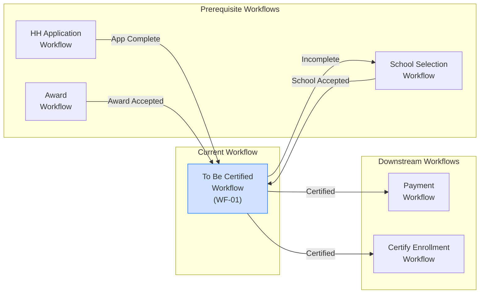

### Related Workflow Summary

| Workflow | Relationship | Data Exchange |
|----------|--------------|---------------|
| **HH Application** | Prerequisite | HouseholdId, StudentIds, ApplicationId |
| **Award** | Prerequisite | AwardId, AwardAmount, AcceptanceDate |
| **School Selection** | Prerequisite | SchoolId, SelectionDate |
| **Payment** | Downstream | RosterId, AwardAmount, DisbursementEligible |
| **Certify Enrollment** | Downstream | RosterId, CertificationStatus |

---

## Related Documentation

### Internal Documentation

- [System Architecture](./../README.md)
- [Azure Infrastructure](./../azure-infrastructure.md)
- [C4 Architecture Diagrams](./../c4-diagrams)
- [ADR-012: Roster Workflow Orchestration](./../../adr/ADR-012-roster-workflow-orchestration.md)
- [Security Architecture](./../security)

### External References

- [Confluence: Roster - To Be Certified Workflow](https://cfi-nc.atlassian.net/wiki/spaces/KR/pages/4523982849)
- [Azure Durable Functions Documentation](https://docs.microsoft.com/en-us/azure/azure-functions/durable/)
- [Azure Service Bus Documentation](https://docs.microsoft.com/en-us/azure/service-bus-messaging/)

### Source Materials

- `sources/KR-Roster - To Be Certified Workflow-111225-164316.pdf`
- `sources/wf tasks.png`

---

## Document Metadata

| Field | Value |
|-------|-------|
| **Version** | 1.0 |
| **Status** | Proposed |
| **Created** | 2025-12-11 |
| **Last Updated** | 2025-12-11 |
| **Author** | CFI Architecture Team |
| **Reviewers** | Pending |
| **Next Review** | TBD |

---

*For workflow questions, contact the CFI Architecture team (Marty Flournory, Sumith Mathur).*
