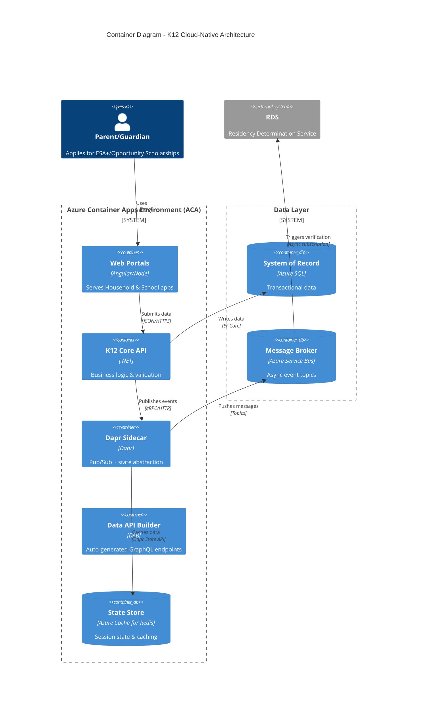
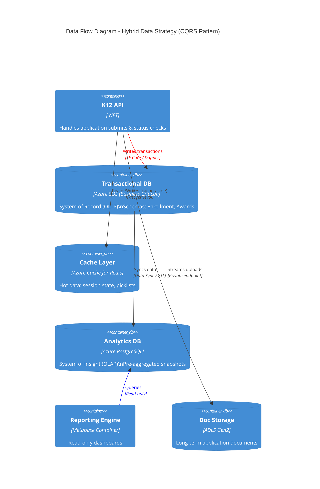
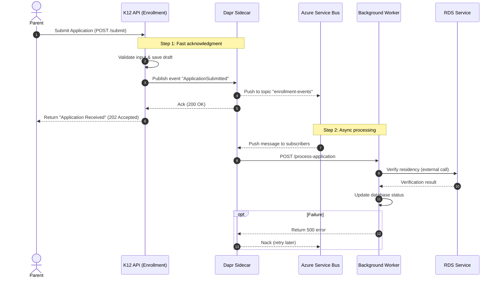
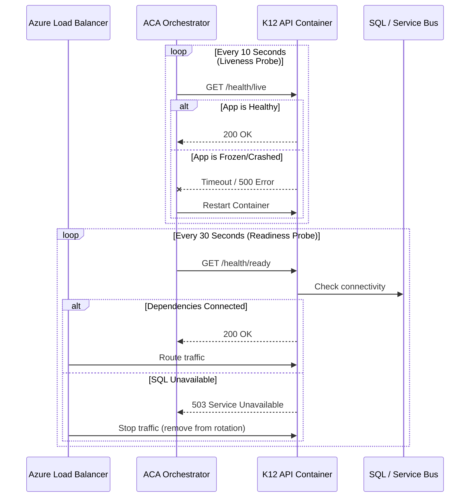

# K12 Cloud-Native Architecture (Consolidated)

This document consolidates the cloud-native architecture artifacts in this folder into a single, consistent narrative.

## Contents

- [Executive Summary](#executive-summary)
- [Architecture Overview (C4 Container)](#architecture-overview-c4-container)
- [Key Decisions (ADRs)](#key-decisions-adrs)
  - [Compute: Azure Container Apps](#compute-azure-container-apps)
  - [Data: Hybrid Data Strategy (Polyglot Persistence)](#data-hybrid-data-strategy-polyglot-persistence)
  - [Communication: Event-Driven (Dapr + Service Bus)](#communication-event-driven-dapr--service-bus)
  - [DevOps: CI/CD + Infrastructure as Code](#devops-cicd--infrastructure-as-code)
  - [Resiliency & Observability](#resiliency--observability)
- [Reference (Diagrams & Tables)](#reference-diagrams--tables)
  - [Architecture Pillars Mapping](#architecture-pillars-mapping)
  - [Data Flow Diagram (Hybrid Data Strategy)](#data-flow-diagram-hybrid-data-strategy)
  - [Async Event Flow Diagram (Dapr Pub/Sub)](#async-event-flow-diagram-dapr-pubsub)
  - [CI/CD Pipeline Diagram](#cicd-pipeline-diagram)
  - [Health Checks & Self-Healing Diagram](#health-checks--self-healing-diagram)
  - [Dapr Pub/Sub Component Example](#dapr-pubsub-component-example)
  - [Data Schema Strategy Table](#data-schema-strategy-table)
  - [Environment Strategy Matrix](#environment-strategy-matrix)
  - [Observability Strategy Matrix](#observability-strategy-matrix)
  - [Resiliency Policies (Polly)](#resiliency-policies-polly)
- [Appendix: Artifact Files](#appendix-artifact-files)

## Executive Summary

The K12 modernization architecture adopts cloud-native patterns to support enrollment spikes, reduce operational overhead, and improve resiliency.

- **Hosting:** Azure Container Apps (ACA) for serverless containers with autoscaling.
- **Data:** Hybrid data strategy to separate transactional writes from analytical reads.
- **Integration:** Event-driven communication for slow/external work (e.g., residency verification) via Dapr Pub/Sub and Azure Service Bus.
- **Delivery:** Immutable infrastructure via Terraform; build/release/run separation in CI/CD.
- **Operations:** Health probes, centralized telemetry (Azure Monitor + Application Insights), and resiliency policies (Polly).

## Architecture Overview (C4 Container)



## Key Decisions (ADRs)

### Compute: Azure Container Apps

**Decision**
- Use **Azure Container Apps (ACA)** instead of managing raw Kubernetes (AKS) to reduce operational overhead while retaining autoscaling and Dapr integration.

**Rationale**
- Supports bursty traffic (open enrollment) with KEDA-based scaling.
- Simplifies platform operations (no cluster management) while enabling modern cloud-native patterns.

### Data: Hybrid Data Strategy (Polyglot Persistence)

**Decision**
- Use **Azure SQL** as the transactional **System of Record (OLTP)**.
- Provide **read-optimized analytics** to avoid reporting contention with high-velocity writes.
- Use **Redis** for hot data (sessions/picklists) to reduce load on SQL.

**Key tradeoff**
- Reporting becomes **eventually consistent** relative to transactional updates.

### Communication: Event-Driven (Dapr + Service Bus)

**Decision**
- Publish domain events (e.g., `ApplicationSubmitted`) via **Dapr Pub/Sub**.
- Use **Azure Service Bus** topics for asynchronous processing.

**Rationale**
- Keeps API latency low (fast acknowledge) while pushing slow work to background processing.
- Avoids vendor lock-in in application code (Dapr abstracts broker SDKs).

### DevOps: CI/CD + Infrastructure as Code

**Decision**
- Adopt **Terraform** for provisioning and managing Azure resources.
- Separate **Build (CI)**, **Infrastructure (IaC)**, and **Deploy (CD)** stages.

**Rationale**
- Prevent configuration drift and improve repeatability.
- Enables environment parity and safer promotions.

### Resiliency & Observability

**Decision**
- Use **liveness** and **readiness** probes for self-healing and safe traffic routing.
- Centralize logs/metrics/traces in **Azure Monitor + Application Insights**.
- Use **Polly** policies (retry/circuit-breaker/timeout) for transient fault handling.

## Reference (Diagrams & Tables)

### Architecture Pillars Mapping

| Architecture layer | Concept | K12 implementation decision |
|---|---|---|
| Compute & hosting | Move from VMs/IaaS to PaaS/serverless to decouple code from hardware | Azure Container Apps (ACA) over AKS to reduce overhead while retaining autoscaling and Dapr support |
| Data systems | Separate Systems of Record (relational) from Systems of Insight (analytics) | Hybrid data strategy: Azure SQL (Business Critical) for OLTP; read-optimized analytics for insight (e.g., PostgreSQL + Metabase) |
| Communication | Use event-driven messaging (pub/sub) to decouple services | Azure Service Bus for async flows; Dapr Pub/Sub abstracts broker SDKs from .NET code |
| Security | Zero Trust and identity-based perimeters (identity as the new firewall) | Entra ID (Gov) hub; managed identities for service-to-service auth (avoid secrets in app config) |

### Data Flow Diagram (Hybrid Data Strategy)



### Async Event Flow Diagram (Dapr Pub/Sub)



### CI/CD Pipeline Diagram

```mermaid
flowchart LR
  subgraph S1 [Build Stage (CI)]
    direction TB
    Push[Git Push] --> Test[Unit Tests & Security Scan]
    Test --> Build[Build .NET/Angular Apps]
    Build --> Docker[Build & Push Container Images]
    Docker --> ACR[(Azure Container Registry)]
  end

  subgraph S2 [Infrastructure Stage (IaC)]
    direction TB
    TF_Plan[Terraform Plan] --> TF_Gate{Manual Approval?}
    TF_Gate -- Yes --> TF_Apply[Terraform Apply]
    TF_Apply --> Resources[Provision Azure Resources\n(SQL, Service Bus, ACA Env)]
  end

  subgraph S3 [Deployment Stage (CD)]
    direction TB
    Deploy[Deploy ACA Revisions] --> Smoke[Smoke Tests]
    Smoke --> Swap[Traffic Swap]
  end

  S1 --> S2
  S2 --> S3

  style TF_Apply fill:#f96,stroke:#333,stroke-width:2px
  style ACR fill:#bbf,stroke:#333,stroke-width:2px
```

### Health Checks & Self-Healing Diagram



### Dapr Pub/Sub Component Example

This shows the Dapr pub/sub component wiring for Azure Service Bus in production, with a local-dev swap (e.g., Redis) as needed.

```yaml
apiVersion: dapr.io/v1alpha1
kind: Component
metadata:
  name: k12-pubsub
spec:
  type: pubsub.azure.servicebus # Switch to 'pubsub.redis' in local dev
  version: v1
  metadata:
    - name: connectionString
      value: "Endpoint=sb://k12-bus.servicebus.windows.net..."
```

### Data Schema Strategy Table

| Schema | Purpose | Key tables | Est. volume |
|---|---|---|---|
| dbo | Core identity & system config | Users, AuditLogs, SystemConfiguration | 500K+ rows |
| Enrollment | High-velocity application data | Applications, Students, Programs, EligibilityRules | 1M+ rows |
| Households | Family units & profiles | Households, HouseholdMembers, Addresses | 500K+ rows |
| Awards | Financial calculations | StudentAwards, Disbursements, Transactions | 2M+ rows |
| Comms | Notification logs | EmailQueue, Notifications, Messages | 5M+ rows |

### Environment Strategy Matrix

| Environment | Purpose | Scale strategy | Cost target |
|---|---|---|---|
| Development | Developer inner-loop, rapid iteration | Minimal (1-2 instances), Serverless SQL | ~$500/mo |
| Testing | QA, automated integration tests | Small (2-3 instances), Standard SQL | ~$1,500/mo |
| Staging | Pre-prod validation, load testing | Medium (3-5 instances), production-like data | ~$3,000/mo |
| Production | Live traffic, DR enabled | Full scale (autoscale), Business Critical SQL | ~$8,000/mo |

### Observability Strategy Matrix

| Component | Tool | Metric / log type | Retention |
|---|---|---|---|
| Application logs | Application Insights | Exception traces, request duration, custom events (e.g., "ApplicationSubmitted") | 90 days |
| Container logs | Log Analytics | stdout/stderr from ACA, system events | 30 days |
| Infrastructure | Azure Monitor | CPU/memory usage, network I/O, SQL DTU consumption | 90 days |
| Distributed tracing | App Insights Map | End-to-end correlation (Frontend → API → SQL) | 90 days |

### Resiliency Policies (Polly)

| Policy type | Target | Configuration | Behavior |
|---|---|---|---|
| Retry | Azure SQL, Service Bus | 3 retries, exponential backoff | If a connection fails, wait 2s/4s/8s, then retry. |
| Circuit breaker | External APIs (RDS, ClassWallet) | Break after 5 consecutive failures | Stop trying for 30s to prevent resource exhaustion. |
| Timeout | All HTTP requests | 10 seconds (strict) | Prevent slow external services from hanging API threads. |

## Appendix: Artifact Files

These original files contain the detailed artifacts and can be referenced individually:

- [background-modernization-strategy-start.md](background-modernization-strategy-start.md)
- [background-azure-architecture-framework.md](background-azure-architecture-framework.md)
- [pointer-container-diagram.md](pointer-container-diagram.md)
- [pointer-hybrid-data-strategy.md](pointer-hybrid-data-strategy.md)
- [pointer-async-event-flows-dapr.md](pointer-async-event-flows-dapr.md)
- [pointer-devops-iac-cicd.md](pointer-devops-iac-cicd.md)
- [pointer-resiliency-observability.md](pointer-resiliency-observability.md)
