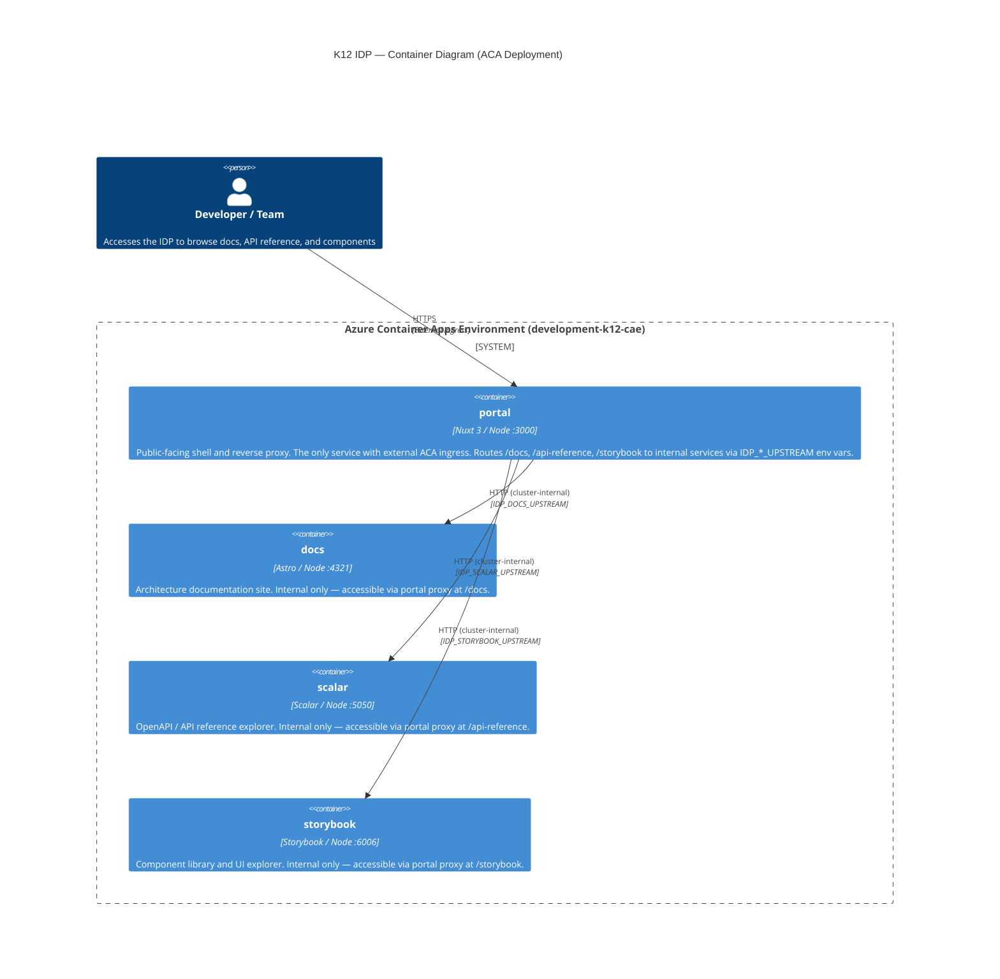

# C4 Container Diagram — K12 Internal Developer Portal (IDP)

Level: C4 Container (Level 2)
Status: Current
Date: 2026-02-20
Reflects: `K12.Idp.AppHost` commit `f26c323`

> Live architecture diagram: https://app.eraser.io/workspace/R1aql8dqEXvHoaF8UJvA

## Overview

The K12 IDP is a four-service Node application cluster deployed to a single Azure Container Apps Environment. It is orchestrated locally and for deployment by `.NET Aspire AppHost`. Only `portal` is exposed externally; the other three services are internal to the ACA cluster.

## Container Diagram



## Service Reference

| Container   | Technology        | Port | ACA Ingress | Route            | Dockerfile                                  |
|-------------|-------------------|------|-------------|------------------|---------------------------------------------|
| `portal`    | Nuxt 3 + Node     | 3000 | External    | `/`              | `tools/wiki/apps/portal/Dockerfile`         |
| `docs`      | Astro + Node      | 4321 | Internal    | `/docs`          | `tools/wiki/apps/docs/Dockerfile`           |
| `scalar`    | Scalar + Node     | 5050 | Internal    | `/api-reference` | `tools/wiki/apps/scalar/Dockerfile`         |
| `storybook` | Storybook + Node  | 6006 | Internal    | `/storybook`     | `tools/wiki/apps/storybook/Dockerfile`      |

## Aspire Service Wiring

`.NET Aspire AppHost` (`K12.Idp.AppHost`) orchestrates all four containers. In local development, Aspire resolves service endpoints to `localhost:<port>`. In ACA, it resolves to cluster-internal service URLs. The `portal` container receives all upstream URLs as environment variables injected at runtime:

```
IDP_DOCS_UPSTREAM      = http://docs:4321       (ACA internal)
IDP_SCALAR_UPSTREAM    = http://scalar:5050     (ACA internal)
IDP_STORYBOOK_UPSTREAM = http://storybook:6006  (ACA internal)
```

## Traffic Flow

```
External User
    │
    ▼  HTTPS (public ingress)
 [portal :3000]
    ├──► GET /docs/*           → [docs :4321]       (Astro documentation)
    ├──► GET /api-reference/*  → [scalar :5050]     (OpenAPI explorer)
    └──► GET /storybook/*      → [storybook :6006]  (Component library)
```

## Health Checks

All four services expose `GET /` as their health check endpoint, used by both Aspire (local readiness) and ACA (liveness/readiness probes).

## Local Development

```bash
# Start all four IDP services via Aspire
dotnet run --project cloud-native-scaffold/src/K12.Idp.AppHost

# Services available at:
# portal    → http://localhost:3000
# docs      → http://localhost:4321
# scalar    → http://localhost:5050
# storybook → http://localhost:6006
# Aspire Dashboard → http://localhost:18888
```

## Out of Scope (this topology)

The following are managed by separate AppHost projects and are not part of this IDP cluster:

- Enrollment API, Programs API, Admin API (backend domain services)
- Dapr sidecars and components
- Azure SQL, PostgreSQL, Redis
- Azure Service Bus, SignalR
- Authentication / Entra ID flows

## Related

- [ADR-016: IDP Aspire ACA Orchestration](../../04-decisions/accepted/ADR-016-idp-aspire-aca-orchestration.md)
- [ADR-002: Aspire Nx Multi-App](../../04-decisions/accepted/ADR-002-aspire-nx-multi-app.md)
- [ASPIRE-01: AppHost Setup](../aspire/ASPIRE-01-apphost-setup.md)
- [CONT-02: ACA Environment Design](../container-apps/CONT-02-environment-design.md)
