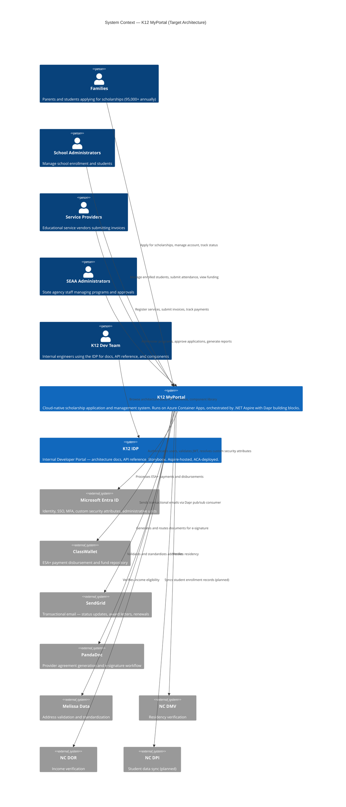

# C4 Level 1: System Context — Target Architecture

**Status:** Proposed
**Date:** 2026-02-20
**Reflects:** Cloud-native target state (ACA + Aspire + Dapr)

## Overview

The target K12 MyPortal retains the same user personas and external integrations as today, but the internal platform migrates from Azure Functions + Static Web Apps to a fully containerised stack on Azure Container Apps (ACA), orchestrated by .NET Aspire with Dapr building blocks.

## System Context Diagram

## What Changed vs Current Architecture

| Dimension | Current | Target |
|-----------|---------|--------|
| **Hosting** | Azure Functions + Static Web Apps | Azure Container Apps (ACA) |
| **Orchestration** | Manual / docker-compose | .NET Aspire AppHost |
| **Service mesh** | None | Dapr sidecars (mTLS, pub/sub, state, secrets) |
| **API model** | Monolithic Functions file | 3 vertical-slice APIs (Enrollment, Programs, Admin) |
| **Scaling** | Function consumption plan | KEDA event-driven autoscaling |
| **Deployment** | Azure Pipelines → Functions | `azd up` → Aspire-generated ACA manifests |
| **Developer tooling** | None | K12 IDP (portal, docs, scalar, storybook on ACA) |
| **Analytics** | None | Trino + CubeJS query engine (planned) |

## External Integrations (Unchanged at System Boundary)

- **Entra ID** — still the identity hub; custom `studentAccessControl` attributes preserved
- **ClassWallet** — same REST API; called via resilient HTTP client from Enrollment API
- **SendGrid** — same API; email dispatch triggered via Dapr pub/sub events
- **PandaDoc** — same API; document generation triggered by domain events
- **NC DMV / DOR / DPI** — same verification flows; called from domain handlers

## Compliance (Unchanged)

FedRAMP High · FERPA · NIST 800-53 · WCAG 2.1 AA

## Performance Targets

| Metric | Target |
|--------|--------|
| Annual applications | 95,000+ |
| Peak concurrent users | 10,000+ |
| API response time | < 2 s |
| Availability SLA | 99.9% |
| Environments | 4 (Dev → Test → Staging → Prod) |
| Primary region | East US 2 |
| DR region | Central US (Production) |

## Related

- [Current: System Context](../../02-current-architecture/c4-diagrams/01-system-context.md)
- [C4-PROP-02: Container Diagram](C4-PROP-02-container-diagram.md)
- [ADR-003: API to Azure Container Apps](../../04-decisions/accepted/ADR-003-api-to-azure-container-apps.md)
- [ADR-016: IDP Aspire ACA Orchestration](../../04-decisions/accepted/ADR-016-idp-aspire-aca-orchestration.md)