# C4 Level 2: Container Diagram — Target Architecture

**Status:** Proposed
**Date:** 2026-02-20
**Reflects:** ACA + Aspire + Dapr cloud-native target state

> Eraser.io live diagram: https://app.eraser.io/workspace/EaOArMrArNTXG6hF09zO

## Overview

The target container topology replaces the monolithic Azure Functions API with three domain-scoped vertical-slice APIs, each with a Dapr sidecar. All containers run in a shared Azure Container Apps Environment per tier. The Angular SPAs are served from ACA containers rather than Static Web Apps.

## Container Diagram

```mermaid
C4Container
    title Container Diagram — K12 MyPortal (Target Architecture)

    Person(user, "User", "Family, School, Provider, or Admin")

    System_Ext(entra,       "Microsoft Entra ID", "Identity and access management")
    System_Ext(classwallet, "ClassWallet",         "Payment processing")
    System_Ext(sendgrid,    "SendGrid",             "Email delivery")
    System_Ext(pandadoc,    "PandaDoc",             "Document generation")

    System_Boundary(k12, "K12 MyPortal — Azure Container Apps Environment") {

        Container(frontdoor, "Azure Front Door",    "CDN + WAF",           "Global entry, TLS termination, WAF policies, CDN caching")
        Container(apim,      "API Management",      "Azure APIM",          "JWT validation, rate limiting, routing, versioning")

        Container(enrollment_web, "Enrollment SPA", "Angular 19 / ACA",   "Household enrollment portal — served from ACA container")
        Container(admin_web,      "Admin SPA",      "Angular 19 / ACA",   "SEAA admin portal — served from ACA container")
        Container(providers_web,  "Providers SPA",  "Angular 19 / ACA",   "Service provider portal — served from ACA container")
        Container(schools_web,    "Schools SPA",    "Angular 19 / ACA",   "School administrator portal — served from ACA container")

        Container(enrollment_api, "Enrollment API", ".NET 10 / ACA :5001", "Vertical-slice API: application submission, households, awards. Dapr sidecar attached.")
        Container(programs_api,   "Programs API",   ".NET 10 / ACA :5002", "Vertical-slice API: program config, eligibility rules, scholarship types. Dapr sidecar attached.")
        Container(admin_api,      "Admin API",      ".NET 10 / ACA :5003", "Vertical-slice API: user management, reporting, admin ops. Dapr sidecar attached.")

        Container(dapr,    "Dapr Sidecars",     "Dapr",          "mTLS service-to-service, pub/sub (Service Bus), state (Redis), secrets (Key Vault)")
        Container(signalr, "Real-time Service", "Azure SignalR",  "WebSocket push — application status, admin notifications")

        ContainerDb(sql,   "Database",           "Azure SQL",           "Primary transactional store — Enrollment, Households, Awards, Programs, Admin schemas")
        ContainerDb(redis, "Cache / State Store", "Azure Cache Redis",  "Dapr state store, session cache")
        ContainerDb(bus,   "Message Bus",        "Azure Service Bus",   "Dapr pub/sub: EnrollmentCreated, AwardAllocated, DocumentUploaded events")
        ContainerDb(blob,  "Temp Storage",       "Azure Blob Storage",  "Temporary file uploads — 7-day lifecycle auto-delete")
        ContainerDb(adls,  "Document Store",     "ADLS Gen2",           "Long-term document storage with hierarchical RBAC")
        ContainerDb(kv,    "Secrets",            "Azure Key Vault",     "Connection strings, API keys, certs — accessed via Dapr secrets building block")
        ContainerDb(acr,   "Container Registry", "Azure ACR",           "Immutable SHA-tagged images for all services")
    }

    Rel(user, frontdoor, "HTTPS")
    Rel(frontdoor, enrollment_web, "Serves SPA")
    Rel(frontdoor, admin_web,      "Serves SPA")
    Rel(frontdoor, providers_web,  "Serves SPA")
    Rel(frontdoor, schools_web,    "Serves SPA")
    Rel(frontdoor, apim,           "Proxies API traffic")

    Rel(enrollment_web, apim,  "API calls", "HTTPS/JSON")
    Rel(admin_web,      apim,  "API calls", "HTTPS/JSON")
    Rel(providers_web,  apim,  "API calls", "HTTPS/JSON")
    Rel(schools_web,    apim,  "API calls", "HTTPS/JSON")
    Rel(enrollment_web, entra, "Authenticates", "OAuth 2.0/OIDC")
    Rel(apim,           entra, "Validates JWT", "HTTPS")

    Rel(apim, enrollment_api, "Routes /enrollment/*")
    Rel(apim, programs_api,   "Routes /programs/*")
    Rel(apim, admin_api,      "Routes /admin/*")

    Rel(enrollment_api, dapr, "State, pub/sub, secrets")
    Rel(programs_api,   dapr, "State, pub/sub, secrets")
    Rel(admin_api,      dapr, "State, pub/sub, secrets")

    Rel(dapr, sql,   "Reads/writes via Dapper", "TCP/SQL")
    Rel(dapr, redis, "State store",             "Redis protocol")
    Rel(dapr, bus,   "Pub/sub events",          "AMQP")
    Rel(dapr, kv,    "Secrets",                 "HTTPS")

    Rel(enrollment_api, blob,    "Temp file uploads",   "Azure SDK")
    Rel(enrollment_api, adls,    "Document storage",    "Azure SDK")
    Rel(enrollment_api, signalr, "Push notifications",  "Azure SDK")
    Rel(signalr, enrollment_web, "Real-time updates",   "WebSocket")

    Rel(enrollment_api, classwallet, "Payments",              "HTTPS/REST")
    Rel(enrollment_api, sendgrid,    "Email via pub/sub",     "Dapr pub/sub → consumer")
    Rel(enrollment_api, pandadoc,    "Document generation",   "HTTPS/REST")

    Rel(acr, enrollment_api, "Supplies image")
    Rel(acr, programs_api,   "Supplies image")
    Rel(acr, admin_api,      "Supplies image")
```

## Container Reference

| Container | Technology | Port | KEDA Scaling | Notes |
|-----------|-----------|------|-------------|-------|
| Front Door | Azure CDN + WAF | 443 | Global | WAF policy, geo-routing |
| APIM | Azure APIM | 443 | Manual tier | JWT validation, throttling |
| Enrollment SPA | Angular 19 / ACA | 80 | HTTP-based | Replaces Static Web App |
| Admin SPA | Angular 19 / ACA | 80 | HTTP-based | |
| Providers SPA | Angular 19 / ACA | 80 | HTTP-based | |
| Schools SPA | Angular 19 / ACA | 80 | HTTP-based | |
| Enrollment API | .NET 10 ACA | 5001 | HTTP (50 concurrent) | Vertical slice |
| Programs API | .NET 10 ACA | 5002 | HTTP (50 concurrent) | Vertical slice |
| Admin API | .NET 10 ACA | 5003 | HTTP (50 concurrent) | Vertical slice |
| Dapr Sidecars | Dapr | 3500/3501 | 1:1 with APIs | mTLS, pub/sub, state, secrets |
| SignalR | Azure SignalR | — | Managed | Real-time push |
| Azure SQL | SQL Database | 1433 | Serverless option | Multi-schema |
| Redis | Azure Cache Redis | 6380 | Fixed | Dapr state + session cache |
| Service Bus | Azure Service Bus | AMQP | Managed | Dapr pub/sub backend |
| Blob Storage | Azure Blob | — | Managed | Temp uploads, 7-day lifecycle |
| ADLS Gen2 | Azure Data Lake | — | Managed | Long-term docs, hierarchical RBAC |
| Key Vault | Azure Key Vault | — | Managed | Dapr secrets building block |
| Container Registry | Azure ACR | — | Managed | SHA-tagged immutable images |

## Dapr Building Blocks in Use

| Block | Component | Used By |
|-------|-----------|---------|
| **pub/sub** | Azure Service Bus | All APIs — domain event dispatch |
| **state** | Azure Redis | Enrollment API — session state |
| **secrets** | Azure Key Vault | All APIs — connection strings, API keys |
| **service invocation** | mTLS | API-to-API calls (Admin → Enrollment) |

## Comparison: Current vs Target

| Concern | Current | Target |
|---------|---------|--------|
| Frontend | Azure Static Web Apps (4) | ACA containers (4) |
| API execution | Azure Functions (consumption) | .NET 10 ACA (3 APIs) |
| Service mesh | None | Dapr sidecars |
| Messaging | Direct HTTP | Dapr pub/sub → Service Bus |
| State | SQL only | SQL + Redis (hot state) |
| Secrets | App settings / Key Vault SDK | Dapr secrets building block |
| Scaling | Functions auto-scale | KEDA event-driven |
| Observability | App Insights SDK | OpenTelemetry → App Insights |

## Related

- [Current: Container Diagram](../../02-current-architecture/c4-diagrams/02-container-diagram.md)
- [C4-PROP-01: System Context](C4-PROP-01-system-context.md)
- [C4-PROP-03: Component Diagrams](C4-PROP-03-component-diagrams.md)
- [C4-PROP-04: Deployment Diagram](C4-PROP-04-deployment-diagram.md)
- [ADR-004: Dapr Sidecars and Components](../../04-decisions/accepted/ADR-004-dapr-sidecars-and-components.md)
- [CONT-02: Container Apps Environment Design](../container-apps/CONT-02-environment-design.md)