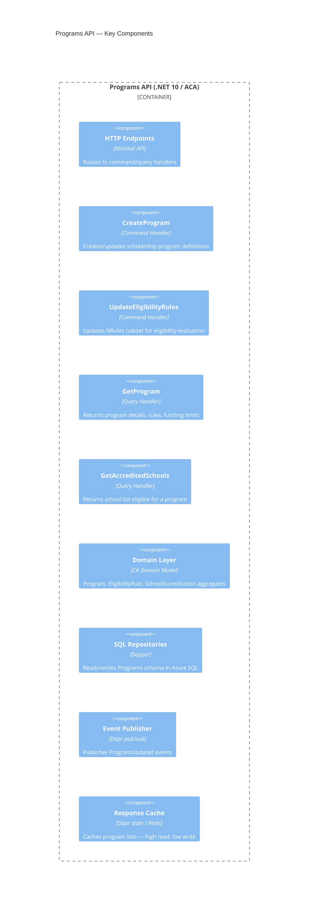
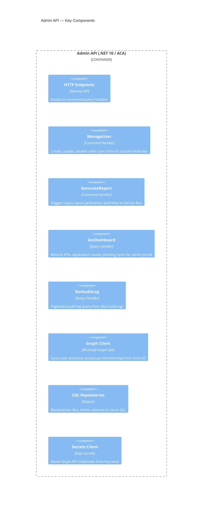

# C4 Level 3: Component Diagrams — Target Architecture

**Status:** Proposed
**Date:** 2026-02-20
**Reflects:** Vertical-slice API internal structure (.NET 10 / Aspire)

## Overview

Each of the three APIs (Enrollment, Programs, Admin) follows the same **vertical-slice architecture** internally. This document covers the Enrollment API in full (most complex) with summary views for Programs and Admin.

---

## Enrollment API — Component Diagram

```mermaid
C4Component
    title Enrollment API — Internal Components

    Container_Boundary(enrollment_api, "Enrollment API (.NET 10 / ACA)") {

        Component(http_in,     "HTTP Endpoints",        "ASP.NET Core Minimal API", "Routes HTTP requests from APIM to command/query handlers")
        Component(cmd_sub,     "SubmitApplication",     "CQRS Command Handler",     "Validates and persists application. Publishes EnrollmentCreated event.")
        Component(cmd_awd,     "AllocateAward",         "CQRS Command Handler",     "Allocates award to approved application. Calls ClassWallet. Publishes AwardAllocated.")
        Component(cmd_doc,     "UploadDocument",        "CQRS Command Handler",     "Validates file, writes to Blob Storage, moves to ADLS, updates document record.")
        Component(qry_app,     "GetApplication",        "CQRS Query Handler",       "Returns application record with status and documents. RLS applied via UserResourceAccessMap.")
        Component(qry_list,    "ListApplications",      "CQRS Query Handler",       "Paged application list with filtering. Uses read replica where available.")
        Component(domain,      "Domain Layer",          "C# Domain Model",          "Application, Household, Student, Award aggregates. Domain events. Invariant enforcement.")
        Component(rules,       "Business Rules Engine", "NRules",                   "Eligibility rules: income thresholds, residency, school accreditation. Loaded from SQL.")
        Component(validators,  "Validators",            "FluentValidation",         "Request-level validation: required fields, formats, file types, size limits.")
        Component(sql_repo,    "SQL Repositories",      "Dapper",                   "Read/write Azure SQL — Enrollment, Households, Awards, dbo schemas. OBO identity for RLS.")
        Component(dapr_pub,    "Event Publisher",       "Dapr pub/sub client",      "Publishes domain events to Service Bus topics via Dapr sidecar.")
        Component(dapr_sec,    "Secrets Client",        "Dapr secrets client",      "Reads connection strings and API keys from Key Vault via Dapr sidecar.")
        Component(dapr_sta,    "State Client",          "Dapr state client",        "Session state and idempotency keys stored in Redis via Dapr sidecar.")
        Component(blob_svc,    "Blob Service",          "Azure Storage SDK",        "Temp upload orchestration, SAS token generation (5-min expiry), lifecycle to ADLS.")
        Component(signalr_svc, "SignalR Notifier",      "Azure SignalR SDK",        "Sends real-time status push to connected browser sessions.")
        Component(ext_http,    "External HTTP Clients", "HttpClient + Polly",       "ClassWallet (payments), PandaDoc (documents), Melissa (addresses). Retry + circuit breaker.")
        Component(otel,        "OpenTelemetry",         "OTEL SDK",                 "Traces, metrics, logs — exported to App Insights via OTLP.")
    }

    ContainerDb(sql,     "Azure SQL",       "Database")
    ContainerDb(redis,   "Redis",           "State Store")
    ContainerDb(bus,     "Service Bus",     "Pub/Sub")
    ContainerDb(kv,      "Key Vault",       "Secrets")
    ContainerDb(blob,    "Blob Storage",    "Temp Files")
    ContainerDb(adls,    "ADLS Gen2",       "Documents")
    ContainerDb(signalr, "Azure SignalR",   "Real-time")

    System_Ext(classwallet, "ClassWallet", "Payments")
    System_Ext(pandadoc,    "PandaDoc",    "Documents")
    System_Ext(melissa,     "Melissa",     "Address Validation")

    Rel(http_in,  cmd_sub,     "Dispatch")
    Rel(http_in,  cmd_awd,     "Dispatch")
    Rel(http_in,  cmd_doc,     "Dispatch")
    Rel(http_in,  qry_app,     "Dispatch")
    Rel(http_in,  qry_list,    "Dispatch")

    Rel(cmd_sub,  validators,  "Validate")
    Rel(cmd_sub,  rules,       "Evaluate eligibility")
    Rel(cmd_sub,  domain,      "Create Application aggregate")
    Rel(cmd_sub,  sql_repo,    "Persist")
    Rel(cmd_sub,  dapr_pub,    "Publish EnrollmentCreated")
    Rel(cmd_sub,  signalr_svc, "Notify user")

    Rel(cmd_awd,  domain,      "Update Award aggregate")
    Rel(cmd_awd,  sql_repo,    "Persist")
    Rel(cmd_awd,  ext_http,    "ClassWallet disbursement")
    Rel(cmd_awd,  dapr_pub,    "Publish AwardAllocated")

    Rel(cmd_doc,  validators,  "Validate file")
    Rel(cmd_doc,  blob_svc,    "Store temp / move to ADLS")
    Rel(cmd_doc,  sql_repo,    "Update document record")

    Rel(qry_app,  sql_repo,    "Read (RLS-enforced)")
    Rel(qry_list, sql_repo,    "Read paged (RLS-enforced)")

    Rel(sql_repo,    sql,        "SQL / Dapper")
    Rel(dapr_pub,    bus,        "Publish topic")
    Rel(dapr_sec,    kv,         "Read secrets")
    Rel(dapr_sta,    redis,      "Read/write state")
    Rel(blob_svc,    blob,       "Temp upload")
    Rel(blob_svc,    adls,       "Long-term store")
    Rel(signalr_svc, signalr,   "Push")
    Rel(ext_http,    classwallet,"REST")
    Rel(ext_http,    pandadoc,   "REST")
    Rel(ext_http,    melissa,    "REST")
```



---

## Programs API — Component Summary

Read-heavy API for scholarship program configuration and eligibility rules.



---

## Admin API — Component Summary

Operations tooling for SEAA staff: user management, reporting, system administration.



---

## Cross-Cutting Components (All APIs via K12.ServiceDefaults)

These are registered automatically in every API's DI container via `K12.ServiceDefaults`:

| Component | Technology | Purpose |
|-----------|-----------|---------|
| `OpenTelemetry` | OTEL SDK | Traces, metrics, logs → App Insights via OTLP |
| `HealthChecks` | ASP.NET Core | `/health/live` + `/health/ready` on port 8081 |
| `Resilience Pipelines` | Microsoft.Extensions.Http.Resilience | Retry + circuit breaker on all outbound HTTP |
| `Managed Identity` | Azure.Identity | `DefaultAzureCredential` for all Azure SDK calls |
| `Dapr Client` | Dapr .NET SDK | Injected via `AddDaprClient()` |
| `FluentValidation` | FluentValidation | Registered globally via `AddValidatorsFromAssembly()` |
| `NRules Engine` | NRules | Loaded once at startup; rules refreshed on `ProgramUpdated` event |

---

## Vertical Slice Feature Structure

Each feature is fully self-contained — no shared service layer:

```
Features/
  SubmitApplication/
    SubmitApplicationCommand.cs          ← Request DTO + IRequest
    SubmitApplicationCommandHandler.cs   ← Business logic + persistence
    SubmitApplicationValidator.cs        ← FluentValidation rules
    SubmitApplicationEndpoint.cs         ← Minimal API route registration
  GetApplication/
    GetApplicationQuery.cs
    GetApplicationQueryHandler.cs
    GetApplicationEndpoint.cs
```

Cross-slice reads go via the API — not shared repositories. Each slice owns its SQL queries, validation, and event publishing.

## Related

- [C4-PROP-02: Container Diagram](C4-PROP-02-container-diagram.md)
- [C4-PROP-04: Deployment Diagram](C4-PROP-04-deployment-diagram.md)
- [Current: Backend Components](../../02-current-architecture/c4-diagrams/03-backend-components.md)
- [ADR-004: Dapr Sidecars](../../04-decisions/accepted/ADR-004-dapr-sidecars-and-components.md)
- [cloud-native-scaffold ARCHITECTURE.md](../../../../cloud-native-scaffold/docs/ARCHITECTURE.md)