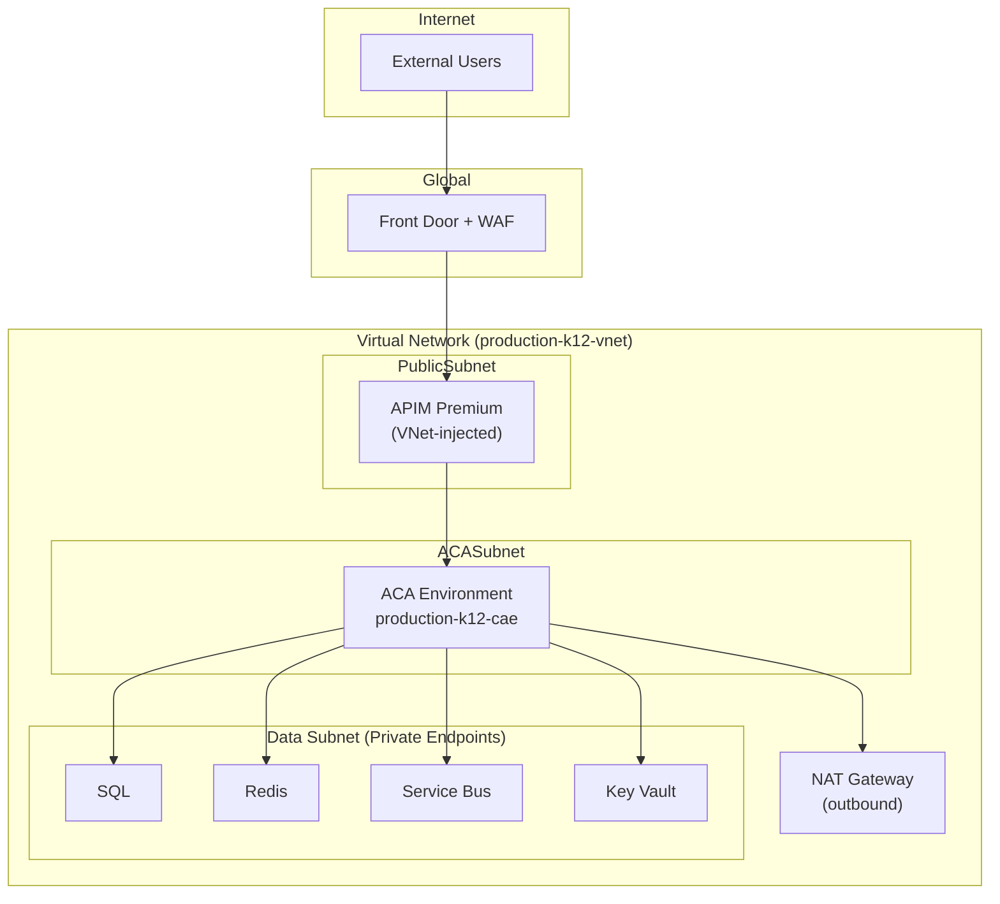

# C4 Level 4: Deployment Diagram — Target Architecture

**Status:** Proposed
**Date:** 2026-02-20
**Reflects:** ACA deployment topology generated from .NET Aspire AppHost

## Overview

The target deployment replaces per-service Azure Pipelines deployments with `azd up` driven by Aspire-generated ACA manifests. All services land in a shared Container Apps Environment per tier (dev/test/staging/prod).

## Deployment Diagram

```mermaid
C4Deployment
    title Deployment Diagram — K12 MyPortal (Target Architecture)

    Deployment_Node(azure, "Microsoft Azure") {

        Deployment_Node(global, "Global") {
            Container(frontdoor, "Azure Front Door + WAF", "CDN / WAF",  "Global entry, TLS, WAF, geo-routing")
            Container(acr,       "Azure Container Registry","ACR",        "{env}k12acr — immutable SHA-tagged images per environment")
            Container(entra,     "Microsoft Entra ID",      "Identity",   "SSO, JWT, custom attributes, OBO flow")
        }

        Deployment_Node(eus2, "East US 2 (Primary)") {

            Deployment_Node(dev_env, "development-k12-cae (Dev)") {
                Container(dev_apim,     "API Management",    "APIM Dev SKU",  "development-api-enrollment — no SLA")
                Container(dev_apis,     "3 Vertical APIs",   ".NET 10 ACA",   "1 min / 5 max replicas — HTTP trigger (50 concurrent)")
                Container(dev_spas,     "Angular SPAs (4x)", "ACA",           "1 replica each")
                ContainerDb(dev_sql,    "Azure SQL",         "SQL Database",  "development-api-enrollment — Basic/Standard")
                ContainerDb(dev_redis,  "Azure Redis",       "Cache",         "Basic C0 tier")
                ContainerDb(dev_bus,    "Service Bus",       "Namespace",     "Standard tier")
            }

            Deployment_Node(test_env, "testing-k12-cae (Test)") {
                Container(test_apim,    "API Management",    "APIM Dev SKU",  "testing-api-enrollment")
                Container(test_apis,    "3 Vertical APIs",   ".NET 10 ACA",   "1 min / 3 max replicas")
                ContainerDb(test_sql,   "Azure SQL",         "SQL Database",  "Standard S2 tier")
            }

            Deployment_Node(stg_env, "staging-k12-cae (Staging)") {
                Container(stg_apim,     "API Management",    "APIM Standard", "staging-api-enrollment — SLA backed")
                Container(stg_apis,     "3 Vertical APIs",   ".NET 10 ACA",   "2 min replicas — zone-redundant")
                ContainerDb(stg_sql,    "Azure SQL",         "SQL Database",  "Premium P1 — zone-redundant")
            }

            Deployment_Node(prod_env, "production-k12-cae (Production)") {
                Container(prod_apim,    "API Management",    "APIM Premium",  "Premium — AZ-enabled, private endpoint")
                Container(prod_enroll,  "Enrollment API",    ".NET 10 ACA",   "2 min / 10 max — zone-redundant, KEDA")
                Container(prod_prog,    "Programs API",      ".NET 10 ACA",   "2 min / 5 max — zone-redundant")
                Container(prod_admin,   "Admin API",         ".NET 10 ACA",   "2 min / 5 max — zone-redundant")
                Container(prod_spas,    "Angular SPAs (4x)", "ACA",           "2 replicas — zone-redundant")
                ContainerDb(prod_sql,   "Azure SQL",         "SQL Database",  "Premium P4 — zone-redundant")
                ContainerDb(prod_redis, "Azure Redis",       "Cache",         "Premium P1 — zone-redundant")
                ContainerDb(prod_bus,   "Service Bus",       "Namespace",     "Premium — private endpoint")
                ContainerDb(prod_kv,    "Key Vault",         "Key Vault",     "Premium — private endpoint, Defender enabled")
            }
        }

        Deployment_Node(cus, "Central US (DR — Production Only)") {
            Container(dr_apis,  "3 Vertical APIs",   ".NET 10 ACA",  "Warm standby — 1 replica each")
            ContainerDb(dr_sql, "Azure SQL Replica", "Geo-Replica",  "Continuous geo-replication from primary")
        }
    }

    Rel(frontdoor, dev_apim,   "Routes /dev/*")
    Rel(frontdoor, stg_apim,   "Routes /staging/*")
    Rel(frontdoor, prod_apim,  "Routes /* (production)")
    Rel(prod_sql,  dr_sql,     "Geo-replication")
    Rel(acr,       dev_apis,   "Pulls images")
    Rel(acr,       prod_enroll,"Pulls images")
```

## Environment Tier Summary

| Tier | ACA Environment | APIM SKU | API Min Replicas | SQL Tier | Zone-Redundant |
|------|----------------|---------|-----------------|---------|---------------|
| **Dev** | development-k12-cae | Developer (no SLA) | 1 | Basic/Standard | No |
| **Test** | testing-k12-cae | Developer | 1 | Standard S2 | No |
| **Staging** | staging-k12-cae | Standard | 2 | Premium P1 | Yes |
| **Production** | production-k12-cae | Premium | 2 | Premium P4 | Yes |
| **DR** | dr-k12-cae | — | 1 warm standby | Geo-replica | — |

## Deployment Pipeline

```mermaid
flowchart LR
    push["Git push /\nPull Request"]
    ci["Azure Pipelines\nbuild + test"]
    img["Docker image\n→ ACR\n{branch}-{gitsha}"]
    aspire["aspire publish\n→ ACA manifests"]
    dev["Deploy\nDevelopment"]
    test["Deploy\nTesting"]
    gate1["Manual approval"]
    stg["Deploy\nStaging"]
    gate2["Manual approval\n(prod release)"]
    prod["Deploy\nProduction"]

    push --> ci --> img --> aspire
    aspire --> dev
    dev -->|"Green tests"| test
    test --> gate1 --> stg
    stg --> gate2 --> prod

    style prod fill:#ffcdd2
    style gate1 fill:#fff9c4
    style gate2 fill:#fff9c4
```



### Image Tagging

| Branch | Tag Format | Example |
|--------|-----------|---------|
| `main` | `{gitsha}` | `abc1234` |
| `development` | `development-{gitsha}` | `development-abc1234` |
| Feature | `{branch}-{gitsha}` | `feature-login-abc1234` |
| **Never** | `:latest` | Prohibited |

## ACA Manifest Generation

```bash
# Generate manifests from Aspire AppHost
cd cloud-native-scaffold/src/K12.AppHost
aspire publish --output-path ../../aspire-output/

# Deploy to Azure
azd up --environment development
```

> **Never edit `aspire-output/`** — regenerated on every `aspire publish`.

## Infrastructure Layers

| Layer | Tool | Manages |
|-------|------|---------|
| ACA service definitions | Aspire + azd | Topology, env vars, scaling, health probes |
| Azure infrastructure | Bicep (Aspire-generated) | ACA envs, SQL, Redis, Service Bus, ACR, Key Vault |
| Platform networking | Terraform (planned) | VNet, NSG, private endpoints, DNS |
| GitOps manifests | ACA YAML | Stored in `ops-apps/aca/` — validated by pipeline |

## Production Networking



## Observability Stack

| Signal | Source | Destination |
|--------|--------|------------|
| Traces | OTEL SDK (all APIs) | App Insights via OTLP |
| Metrics | OTEL SDK + KEDA | App Insights + Azure Monitor |
| Logs | Container stdout | Log Analytics (ACA-managed) |
| Health | `/health/live` + `/health/ready` :8081 | ACA liveness/readiness probes |
| Availability | App Insights ping tests | Azure Monitor alerts |

## Related

- [C4-PROP-02: Container Diagram](C4-PROP-02-container-diagram.md)
- [C4-PROP-03: Component Diagrams](C4-PROP-03-component-diagrams.md)
- [Current: Deployment Diagram](../../02-current-architecture/c4-diagrams/03-deployment-diagram.md)
- [ASPIRE-05: Deployment with azd](../aspire/ASPIRE-05-deployment-azd.md)
- [CONT-08: Observability](../container-apps/CONT-08-observability.md)
- [ADR-006: Pipelines ACA Deployment](../../04-decisions/accepted/ADR-006-pipelines-aca-deployment.md)