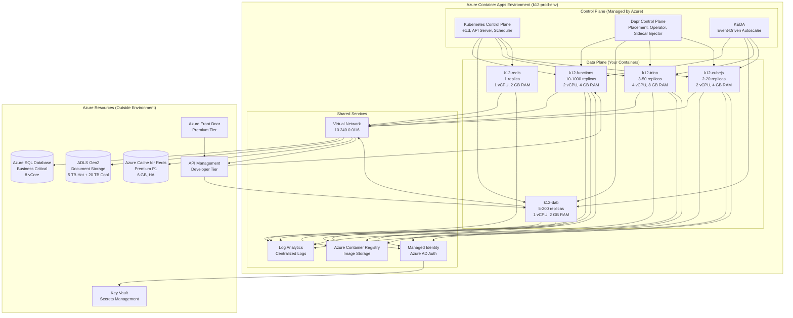
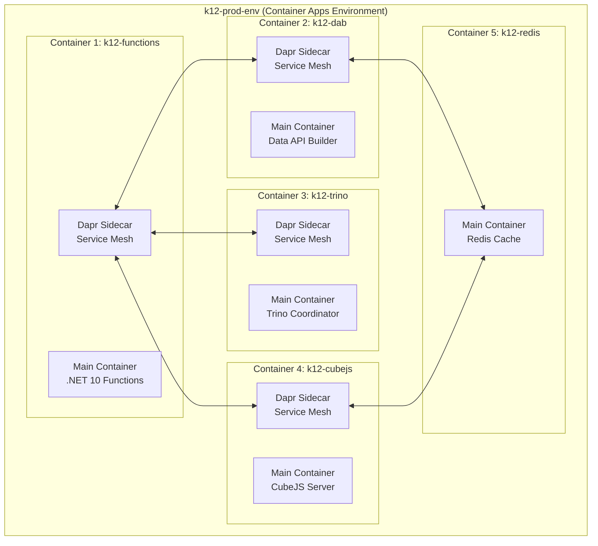

# CONT-02: Container Apps Environment Design

**Status:** 📋 Proposed - Week 1 Deliverable
**Date:** 2025-11-24
**Owner:** CFI Architecture Team
**Target Audience:** Infrastructure Engineers, DevOps Teams, Enterprise Architects

---

## Executive Summary

This document describes the **Azure Container Apps Environment** design for K12 MyPortal. The environment is the **shared infrastructure layer** that hosts all containers (Functions, DAB, Trino, CubeJS, Redis) with unified networking, observability, and service mesh capabilities.

### Key Concept

**Environment = Kubernetes Cluster (Managed for You)**

Azure Container Apps Environment is a **fully managed Kubernetes cluster** where you don't manage:
- Control plane upgrades
- Node pools
- etcd backups
- Certificate rotation
- Ingress controllers

You **only deploy containers** and Azure handles the rest.

---

## What is a Container Apps Environment?

### Definition

A **Container Apps Environment** is a **secure boundary** around a group of container apps that share:

1. **Virtual Network (VNET)** - Private networking for inter-container communication
2. **Log Analytics Workspace** - Centralized logging and monitoring
3. **Dapr Control Plane** - Service mesh for mTLS, pub/sub, state management
4. **Managed Identity** - Secure authentication to Azure resources
5. **Workload Profiles** - CPU/memory configurations (Consumption vs Dedicated)

### Environment as Shared Infrastructure



---

## Environment-Level Resources

### 1. Virtual Network (VNET) Integration

**Purpose:** Secure, private networking for all containers

**Configuration:**
```bash
# Create VNET for Container Apps
az network vnet create \
  --name k12-prod-vnet \
  --resource-group k12-prod-rg \
  --location eastus \
  --address-prefix 10.240.0.0/16

# Create subnet for Container Apps environment (delegated)
az network vnet subnet create \
  --name containerapp-subnet \
  --resource-group k12-prod-rg \
  --vnet-name k12-prod-vnet \
  --address-prefix 10.240.0.0/21 \
  --delegations Microsoft.App/environments
```

**VNET Address Space:**
```
10.240.0.0/16 (65,536 IPs total)
├── 10.240.0.0/21 (2,048 IPs) → Container Apps environment subnet
├── 10.240.8.0/21 (2,048 IPs) → Azure SQL private endpoint subnet
├── 10.240.16.0/21 (2,048 IPs) → ADLS Gen2 private endpoint subnet
├── 10.240.24.0/21 (2,048 IPs) → Redis private endpoint subnet
└── 10.240.32.0/19 (8,192 IPs) → Reserved for future expansion
```

**Why VNET Integration?**
- ✅ Private communication between containers (no public internet)
- ✅ Private endpoints for Azure SQL, ADLS Gen2, Redis (data never leaves Azure backbone)
- ✅ Network Security Groups (NSGs) for ingress/egress control
- ✅ Azure Firewall integration for outbound traffic filtering

### 2. Log Analytics Workspace

**Purpose:** Centralized logging for all containers, Dapr, and KEDA

**Configuration:**
```bash
# Create Log Analytics workspace
az monitor log-analytics workspace create \
  --name k12-prod-logs \
  --resource-group k12-prod-rg \
  --location eastus \
  --retention-time 90

# Get workspace ID and key
LOG_ANALYTICS_WORKSPACE_ID=$(az monitor log-analytics workspace show \
  --name k12-prod-logs \
  --resource-group k12-prod-rg \
  --query customerId -o tsv)

LOG_ANALYTICS_WORKSPACE_KEY=$(az monitor log-analytics workspace get-shared-keys \
  --name k12-prod-logs \
  --resource-group k12-prod-rg \
  --query primarySharedKey -o tsv)
```

**What Gets Logged:**
- Container stdout/stderr (application logs)
- Dapr logs (service invocation, pub/sub, state management)
- KEDA logs (scaling events)
- Container Apps platform logs (ingress, revisions, replicas)
- System logs (Kubernetes events, node health)

**Sample Log Query (KQL):**
```kql
// Find all errors in last 24 hours
ContainerAppConsoleLogs_CL
| where TimeGenerated > ago(24h)
| where Log_s contains "ERROR"
| project TimeGenerated, ContainerAppName_s, Log_s
| order by TimeGenerated desc

// Analyze HTTP request latency
ContainerAppConsoleLogs_CL
| where TimeGenerated > ago(1h)
| where Log_s contains "HTTP GET"
| extend duration = extract("duration=(\\d+)ms", 1, Log_s)
| summarize p50=percentile(toint(duration), 50),
            p95=percentile(toint(duration), 95),
            p99=percentile(toint(duration), 99)
    by bin(TimeGenerated, 5m)
```

### 3. Dapr Control Plane

**Purpose:** Service mesh for mTLS encryption, pub/sub, service discovery, state management

**Auto-Configured Components:**
- **Placement Service** - Manages actor placement (not used in K12, but available)
- **Operator** - Manages Dapr component updates (state stores, pub/sub)
- **Sidecar Injector** - Injects Dapr sidecar into each container replica

**Configuration:**
```bash
# Dapr is enabled at environment creation
az containerapp env create \
  --name k12-prod-env \
  --resource-group k12-prod-rg \
  --location eastus \
  --infrastructure-subnet-resource-id $SUBNET_ID \
  --logs-workspace-id $LOG_ANALYTICS_WORKSPACE_ID \
  --logs-workspace-key $LOG_ANALYTICS_WORKSPACE_KEY \
  --dapr-instrumentation-key $APP_INSIGHTS_INSTRUMENTATION_KEY
```

**Dapr Components (Defined in Environment):**

**State Store (Redis):**
```yaml
apiVersion: dapr.io/v1alpha1
kind: Component
metadata:
  name: statestore
  namespace: k12-prod-env
spec:
  type: state.redis
  version: v1
  metadata:
    - name: redisHost
      value: k12-prod-redis.redis.cache.windows.net:6380
    - name: redisPassword
      secretKeyRef:
        name: redis-password
        key: password
    - name: enableTLS
      value: true
```

**Pub/Sub (Azure Service Bus):**
```yaml
apiVersion: dapr.io/v1alpha1
kind: Component
metadata:
  name: pubsub
  namespace: k12-prod-env
spec:
  type: pubsub.azure.servicebus
  version: v1
  metadata:
    - name: connectionString
      secretKeyRef:
        name: servicebus-connection
        key: connectionString
```

### 4. Managed Identity

**Purpose:** Passwordless authentication to Azure resources (SQL, ADLS, Key Vault, ACR)

**System-Assigned Identity (Auto-Created):**
```bash
# Environment gets managed identity automatically
az containerapp env show \
  --name k12-prod-env \
  --resource-group k12-prod-rg \
  --query identity.principalId -o tsv

# Output: 12345678-abcd-1234-abcd-1234567890ab
```

**Grant Permissions:**
```bash
# Grant environment identity access to Azure Container Registry
az role assignment create \
  --assignee $MANAGED_IDENTITY_PRINCIPAL_ID \
  --role AcrPull \
  --scope /subscriptions/$SUBSCRIPTION_ID/resourceGroups/k12-prod-rg/providers/Microsoft.ContainerRegistry/registries/k12acr

# Grant environment identity access to Key Vault
az role assignment create \
  --assignee $MANAGED_IDENTITY_PRINCIPAL_ID \
  --role "Key Vault Secrets User" \
  --scope /subscriptions/$SUBSCRIPTION_ID/resourceGroups/k12-prod-rg/providers/Microsoft.KeyVault/vaults/k12-prod-kv

# Grant environment identity access to Azure SQL
az sql server ad-admin create \
  --resource-group k12-prod-rg \
  --server-name k12-prod-sql \
  --display-name k12-prod-env-identity \
  --object-id $MANAGED_IDENTITY_PRINCIPAL_ID
```

---

## Workload Profiles

### What are Workload Profiles?

**Workload Profiles** define the CPU/memory configurations available in the environment:

1. **Consumption Profile** - Pay-per-use, serverless pricing (default)
2. **Dedicated Profiles** - Reserved VMs for predictable performance

### Consumption Profile (Recommended for K12)

**Characteristics:**
- ✅ **Pay-per-use** - Billed per vCPU-second and GB-second
- ✅ **Auto-scaling** - 0 to 1000 instances automatically
- ✅ **No minimum cost** - If replicas = 0, cost = $0
- ✅ **Flexible sizing** - Choose any CPU/memory combination (0.25 vCPU to 4 vCPU)

**Cost Example:**
```
k12-functions:
- Configuration: 2 vCPU, 4 GB RAM
- Min replicas: 10 (always running)
- Peak replicas: 1000 (during load)
- Average replicas: 50

Idle Cost (10 replicas × 24 hours):
10 replicas × 2 vCPU × $0.000012/vCPU-sec × 86400 sec/day = $20.74/day
10 replicas × 4 GB × $0.0000013/GB-sec × 86400 sec/day = $4.49/day
Total idle: $25.23/day = $757/month

Peak Cost (1000 replicas × 2 hours during enrollment):
1000 replicas × 2 vCPU × $0.000012/vCPU-sec × 7200 sec = $172.80
1000 replicas × 4 GB × $0.0000013/GB-sec × 7200 sec = $37.44
Total peak: $210.24 per 2-hour window

Monthly Total (30 days):
Idle: $757/month
Peak (10 windows): $2,102
Total: $2,859/month for k12-functions
```

### Dedicated Profile (Optional for Guaranteed Performance)

**Characteristics:**
- ⚠️ **Reserved VMs** - Pay for capacity even if not used
- ✅ **Predictable performance** - No "noisy neighbor" issues
- ✅ **Custom VM sizes** - D4, D8, D16, E4, E8 series

**When to Use:**
- Production workloads requiring guaranteed CPU/memory
- Compliance requirements (dedicated hardware)
- Cost optimization (if usage is consistently high)

**Cost Example:**
```
Dedicated D4 Profile (4 vCPU, 16 GB RAM):
- 3 nodes × $0.25/hour × 730 hours/month = $547.50/month
- Supports 20-30 container replicas (2 vCPU, 4 GB each)
```

**Recommendation for K12:** Start with **Consumption profile** for cost efficiency, migrate to Dedicated if performance issues arise.

---

## Multi-Container Deployment

### 5 Containers in Single Environment



### Benefits of Multi-Container Environment

1. **Shared Networking** - Containers communicate via `http://k12-dab` (service discovery)
2. **Shared Dapr** - mTLS encryption between all containers (zero configuration)
3. **Shared Observability** - All logs go to same Log Analytics workspace
4. **Cost Efficiency** - Single VNET, single Log Analytics, shared managed identity
5. **Simplified Deployment** - `azd up` deploys all 5 containers together

### Service Discovery Example

**From k12-functions, call k12-dab:**
```csharp
// NO hardcoded URLs! Dapr service discovery
var httpClient = new HttpClient();
var response = await httpClient.GetAsync("http://k12-dab/api/students/12345");

// Dapr automatically:
// 1. Resolves "k12-dab" to container IP address
// 2. Encrypts request with mTLS
// 3. Retries on failure (circuit breaker)
// 4. Traces request (distributed tracing)
```

**Dapr Service Invocation (Behind the Scenes):**
```bash
# Dapr sidecar in k12-functions intercepts HTTP call
POST http://localhost:3500/v1.0/invoke/k12-dab/method/api/students/12345

# Dapr resolves k12-dab to 10.240.0.15:80
# Encrypts with mTLS certificate
# Sends request to k12-dab Dapr sidecar
# k12-dab Dapr sidecar forwards to main container
```

---

## Networking Architecture

### Ingress Configuration

**External Ingress (Public Internet Access):**
```bash
az containerapp create \
  --name k12-functions \
  --environment k12-prod-env \
  --ingress external \
  --target-port 80
```

**URL:** `https://k12-functions.azurecontainerapps.io`

**Internal Ingress (VNET-Only Access):**
```bash
az containerapp create \
  --name k12-redis \
  --environment k12-prod-env \
  --ingress internal \
  --target-port 6379
```

**URL:** `http://k12-redis.internal.azurecontainerapps.io` (only accessible from VNET)

### Ingress Flow

```
┌──────────────────────────────────────────────────────────────┐
│  External User Request                                       │
│  https://myportal.nc.gov/api/students                        │
└────────────────────────┬─────────────────────────────────────┘
                         ↓
┌──────────────────────────────────────────────────────────────┐
│  Azure Front Door (Premium)                                  │
│  - WAF (SQL injection, XSS protection)                       │
│  - DDoS protection                                           │
│  - SSL termination                                           │
└────────────────────────┬─────────────────────────────────────┘
                         ↓
┌──────────────────────────────────────────────────────────────┐
│  Azure API Management (Developer Tier)                       │
│  - JWT validation (Entra ID)                                 │
│  - Rate limiting (100 req/min per user)                      │
│  - Request transformation                                    │
└────────────────────────┬─────────────────────────────────────┘
                         ↓
┌──────────────────────────────────────────────────────────────┐
│  Container Apps Environment (VNET)                           │
│  ┌────────────────────────────────────────────────────────┐ │
│  │ Ingress Controller (Managed)                           │ │
│  │ - Routes traffic to k12-functions                      │ │
│  │ - SSL (internal)                                       │ │
│  └──────────────────────┬─────────────────────────────────┘ │
│                         ↓                                    │
│  ┌────────────────────────────────────────────────────────┐ │
│  │ k12-functions (10-1000 replicas)                       │ │
│  │ - Load balanced across replicas                        │ │
│  │ - Health probes (liveness, readiness)                  │ │
│  └────────────────────────────────────────────────────────┘ │
└──────────────────────────────────────────────────────────────┘
```

### Private Endpoints

**Azure SQL Private Endpoint:**
```bash
# Create private endpoint for Azure SQL
az network private-endpoint create \
  --name k12-sql-pe \
  --resource-group k12-prod-rg \
  --vnet-name k12-prod-vnet \
  --subnet sql-subnet \
  --private-connection-resource-id /subscriptions/$SUB_ID/resourceGroups/k12-prod-rg/providers/Microsoft.Sql/servers/k12-prod-sql \
  --group-id sqlServer \
  --connection-name k12-sql-connection
```

**Benefit:** Azure SQL traffic never leaves Azure backbone (no public internet exposure)

---

## Observability

### Application Insights Integration

**Environment-Level Configuration:**
```bash
az containerapp env create \
  --name k12-prod-env \
  --resource-group k12-prod-rg \
  --dapr-instrumentation-key $APP_INSIGHTS_INSTRUMENTATION_KEY
```

**What This Enables:**
- Automatic distributed tracing (Dapr → App Insights)
- Request/response telemetry
- Dependency tracking (SQL, Redis, HTTP calls)
- Exception logging

**Sample Distributed Trace:**
```
Operation: POST /api/applications
├── k12-functions (150ms)
│   ├── EntraAuthenticationMiddleware (25ms)
│   ├── ApplicationService.ValidateEligibility (50ms)
│   │   ├── SQL: SELECT FROM Enrollment.Students (12ms)
│   │   └── Dapr: Call k12-dab /api/households (18ms)
│   ├── NRules: EligibilityRules.Execute (45ms)
│   └── SQL: INSERT INTO Enrollment.Applications (10ms)
```

### Log Analytics Queries

**Container Health:**
```kql
ContainerAppSystemLogs_CL
| where TimeGenerated > ago(1h)
| where Type_s == "ReplicaWarning"
| summarize count() by ContainerAppName_s, Reason_s
| order by count_ desc
```

**Scaling Events:**
```kql
ContainerAppSystemLogs_CL
| where Type_s == "ScalingEvent"
| project TimeGenerated, ContainerAppName_s, Replicas_d, Reason_s
| order by TimeGenerated desc
```

### Prometheus Metrics

**Environment Exposes Metrics Endpoint:**
```
https://k12-prod-env.azurecontainerapps.io/metrics
```

**Sample Metrics:**
```promql
# Request rate
rate(http_requests_total[5m])

# Error rate
rate(http_requests_total{status=~"5.."}[5m]) / rate(http_requests_total[5m])

# Replica count
containerapp_replicas{app="k12-functions"}

# CPU usage
containerapp_cpu_usage_seconds_total{app="k12-functions"}
```

---

## Security

### Defense-in-Depth Layers

```
Layer 1: Azure Front Door
- WAF (SQL injection, XSS, OWASP Top 10)
- DDoS protection (Layer 7)
- Geo-filtering (block non-US traffic)

Layer 2: API Management
- JWT validation (Entra ID)
- Rate limiting (per user, per IP)
- IP whitelisting (for admin endpoints)

Layer 3: Container Apps Environment
- VNET isolation (no direct public internet access)
- Network Security Groups (NSGs)
- Dapr mTLS (all inter-container traffic encrypted)

Layer 4: Container-Level
- Managed identity (no connection strings in code)
- Key Vault integration (secrets)
- Row-Level Security (SQL filters data by user)

Layer 5: Data Layer
- Azure SQL Firewall (only VNET allowed)
- ADLS Gen2 RBAC (no public access)
- Redis private endpoint (VNET only)
```

### Managed Identity Flow

```
┌────────────────────────────────────────────────────────────┐
│  k12-functions container needs Azure SQL access            │
└─────────────────────────┬──────────────────────────────────┘
                          ↓
┌────────────────────────────────────────────────────────────┐
│  Container uses managed identity (no password)             │
│  var credential = new DefaultAzureCredential();            │
│  var token = await credential.GetTokenAsync(               │
│      new TokenRequestContext(                              │
│          new[] { "https://database.windows.net/.default" } │
│      ));                                                   │
└─────────────────────────┬──────────────────────────────────┘
                          ↓
┌────────────────────────────────────────────────────────────┐
│  Azure AD issues JWT token for managed identity           │
│  Token: eyJ0eXAiOiJKV1QiLCJhbGc...                         │
│  Scopes: https://database.windows.net/.default             │
│  Valid for: 1 hour                                         │
└─────────────────────────┬──────────────────────────────────┘
                          ↓
┌────────────────────────────────────────────────────────────┐
│  Container connects to Azure SQL with token                │
│  SqlConnection connection = new SqlConnection(             │
│      "Server=k12-prod.database.windows.net;Database=K12;"  │
│  );                                                        │
│  connection.AccessToken = token.Token;                     │
│  await connection.OpenAsync();                             │
└────────────────────────────────────────────────────────────┘
```

**Benefits:**
- No connection strings in code or environment variables
- Automatic token rotation (1-hour expiry, auto-renewed)
- Centralized access management (Azure AD)
- Audit trail (who accessed what, when)

---

## Cost Model

### Environment Cost Breakdown

| Component | Configuration | Monthly Cost |
|-----------|--------------|--------------|
| **Environment Infrastructure** | VNET, Control Plane, Dapr | **$0** (free) |
| **k12-functions** | 2 vCPU, 4 GB, 10-1000 replicas | $1,200 |
| **k12-dab** | 1 vCPU, 2 GB, 5-200 replicas | $480 |
| **k12-trino** | 4 vCPU, 8 GB, 3-50 replicas | $960 |
| **k12-cubejs** | 2 vCPU, 4 GB, 2-20 replicas | $480 |
| **k12-redis** | 1 vCPU, 2 GB, 1 replica | $120 |
| **Log Analytics** | 100 GB/month | $230 |
| **Application Insights** | 100 GB/month | $230 |
| **TOTAL (Compute + Observability)** | | **$3,700/month** |

**Additional Azure Resources (Outside Environment):**
- Azure SQL: $1,450/month
- ADLS Gen2: $350/month
- Azure Cache for Redis: $245/month
- Azure Front Door: $420/month
- API Management: $50/month

**Grand Total:** $6,955/month

### Cost Optimization Strategies

1. **Scale to Zero Non-Critical Containers**
   ```bash
   # Set min-replicas=0 for dev/test environments
   az containerapp update \
     --name k12-dab \
     --resource-group k12-dev-rg \
     --min-replicas 0  # Scale to zero when idle
   ```

2. **Reserved Capacity for Predictable Workloads**
   ```bash
   # Use Dedicated profile for k12-functions (if usage is 24/7)
   az containerapp env workload-profile add \
     --name k12-prod-env \
     --resource-group k12-prod-rg \
     --workload-profile-type D4 \
     --workload-profile-name dedicated-profile \
     --min-nodes 3 \
     --max-nodes 10
   ```

3. **Optimize Log Retention**
   ```bash
   # Reduce Log Analytics retention to 30 days (save 60% on storage)
   az monitor log-analytics workspace update \
     --name k12-prod-logs \
     --resource-group k12-prod-rg \
     --retention-time 30
   ```

---

## Multi-Environment Strategy

### Environment Per Stage

| Environment | Purpose | Configuration | Monthly Cost |
|-------------|---------|--------------|--------------|
| **k12-dev-env** | Developer testing | Min 0 replicas, scale to zero | $150 |
| **k12-test-env** | QA testing, automation | Min 2 replicas | $600 |
| **k12-staging-env** | Pre-production validation | Min 5 replicas | $1,200 |
| **k12-prod-env** | Production (single region) | Min 10 replicas | $3,700 |
| **k12-prod-secondary-env** | Multi-region HA (East US 2) | Min 10 replicas | $3,700 |

**Total (All Environments):** $9,350/month

### Promotion Flow

```
Developer Laptop (Aspire F5)
    ↓
Commit to main branch
    ↓
GitHub Actions CI/CD
    ↓
┌────────────────────────────────────────┐
│ Deploy to k12-dev-env                  │
│ - Automated smoke tests (Postman)      │
│ - 5 minutes                             │
└───────────────┬────────────────────────┘
                ↓ (Manual approval)
┌────────────────────────────────────────┐
│ Deploy to k12-test-env                 │
│ - Full integration tests (Newman)      │
│ - Load tests (K6)                       │
│ - 30 minutes                            │
└───────────────┬────────────────────────┘
                ↓ (QA sign-off)
┌────────────────────────────────────────┐
│ Deploy to k12-staging-env              │
│ - Production-like environment           │
│ - UAT (User Acceptance Testing)         │
│ - 1-2 days                              │
└───────────────┬────────────────────────┘
                ↓ (Product Owner approval)
┌────────────────────────────────────────┐
│ Deploy to k12-prod-env (10% traffic)   │
│ - Blue-green deployment                 │
│ - Monitor for 24 hours                  │
└───────────────┬────────────────────────┘
                ↓ (Success metrics met)
┌────────────────────────────────────────┐
│ Promote to 100% traffic                │
└────────────────────────────────────────┘
```

---

## Related Decisions

- [ADR-PROP-001: Container Functions on Container Apps](../07-adr-proposed/ADR-PROP-001-container-functions.md) - Why containerization
- [CONT-01: Container Functions Architecture](CONT-01-container-functions-architecture.md) - Functions container details
- [CONT-06: Dapr Service Mesh](CONT-06-dapr-integration.md) - Dapr components and configuration
- [ASPIRE-01: AppHost Setup](../02-aspire/ASPIRE-01-apphost-setup.md) - Local multi-container development

---

## References

### Microsoft Documentation

- [Container Apps Environments](https://learn.microsoft.com/en-us/azure/container-apps/environment)
- [VNET Integration](https://learn.microsoft.com/en-us/azure/container-apps/vnet-custom)
- [Workload Profiles](https://learn.microsoft.com/en-us/azure/container-apps/workload-profiles-overview)
- [Managed Identity](https://learn.microsoft.com/en-us/azure/container-apps/managed-identity)
- [Dapr Components](https://learn.microsoft.com/en-us/azure/container-apps/dapr-overview)
- [Observability](https://learn.microsoft.com/en-us/azure/container-apps/observability)

### Tutorials

- [Create Environment with VNET](https://learn.microsoft.com/en-us/azure/container-apps/vnet-custom-internal)
- [Configure Dapr State Store](https://learn.microsoft.com/en-us/azure/container-apps/dapr-state-stores)
- [Multi-Container Communication](https://learn.microsoft.com/en-us/azure/container-apps/communicate-between-microservices)

---

**Document Status:** 📋 Week 1 Deliverable - Ready for Leadership Review
**Last Updated:** 2025-11-24
**Next Review:** After infrastructure provisioning (Week 3)
