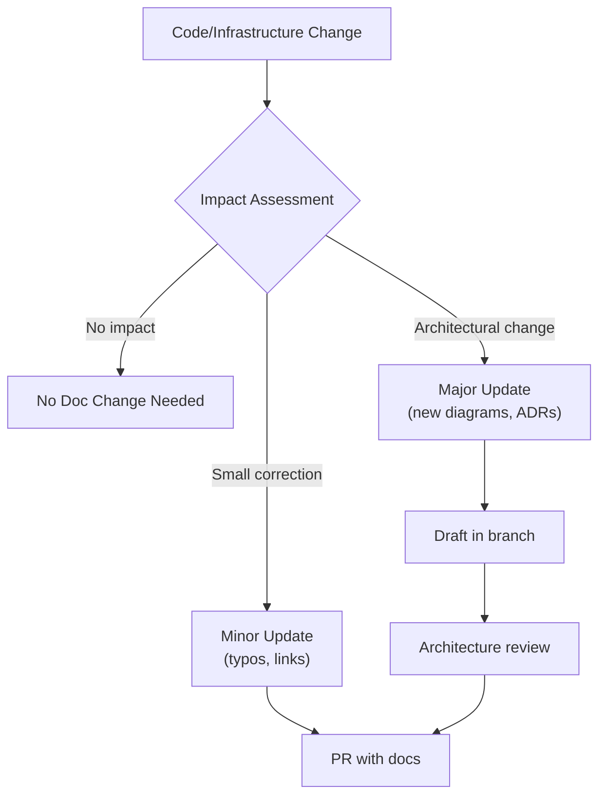

# Architecture Documentation Maintenance Guide

## Overview

This guide establishes processes for maintaining architecture documentation quality, accuracy, and relevance for K12 MyPortal.

## Documentation Review Schedule

### Quarterly Reviews

| Document Category | Review Months | Reviewer | Checklist |
|-------------------|---------------|----------|-----------|
| C4 Diagrams | Mar, Jun, Sep, Dec | Architecture Team | Accuracy, completeness, styling |
| ADRs | On change only | Technical Lead | Status updates, superseded decisions |
| Security Docs | Jun, Dec | Security Team | Compliance, new threats |
| Integration Docs | Quarterly | Integration Lead | API changes, new integrations |
| Proposed Architecture | Weekly during dev | Architecture Team | Progress, blockers |

### Annual Reviews

- **Full documentation audit** (January)
- **Stakeholder feedback collection** (July)
- **Technology refresh assessment** (October)

## Change Management Process

### 1. Identify Documentation Impact

When implementing changes, assess documentation impact:



### 2. Documentation Change Categories

| Category | Examples | Process |
|----------|----------|---------|
| **Typo/Minor** | Spelling, broken links | Direct PR |
| **Clarification** | Improved explanations | PR + 1 reviewer |
| **New Section** | Additional diagrams, sections | PR + Architecture review |
| **ADR** | New decision record | Draft → Team review → Accept |
| **Major Restructure** | New categories, reorganization | RFC + Team approval |

### 3. Pull Request Checklist

For documentation changes, verify:

- [ ] All Mermaid diagrams render correctly
- [ ] Internal links are valid
- [ ] External links are accessible
- [ ] Code examples are syntactically correct
- [ ] Tables are properly formatted
- [ ] Dates are updated (Last Updated)
- [ ] Related documents are cross-linked
- [ ] Glossary terms are defined

## Documentation Standards

### File Naming Conventions

```
# C4 Diagrams
XX-[diagram-type].md
Example: 01-system-context.md, 06-backend-component-diagram.md

# Security Documents
SEC-XX-[topic].md
Example: SEC-01-entra-id-configuration.md

# Integration Documents
INT-XX-[system]-integration.md
Example: INT-07-rds-residency-determination-service.md

# Workflow Documents
WF-XX-[workflow-name].md
Example: WF-01-roster-to-be-certified.md

# ADRs
ADR-XXX-[short-title].md
Example: ADR-013-rds-async-integration-pattern.md

# Proposed Architecture
[CATEGORY]-XX-[topic].md
Example: CONT-01-container-functions-architecture.md
```

### Document Structure Template

```markdown
# [Title]

## Overview
[Brief description - 2-3 sentences]

## [Main Sections]
[Content with diagrams, tables, code examples]

## Related Documentation
- [Link 1](path/to/doc.md)
- [Link 2](path/to/doc.md)

---

*Created: [Date]*
*Author: [Team/Person]*
*Review Date: [Next Review Date]*
```

### Mermaid Diagram Standards

```mermaid
%%{init: {"theme": "default"}}%%

%% Use consistent styling
%% - Blue (#e3f2fd) for user-facing components
%% - Green (#e8f5e9) for backend services
%% - Orange (#fff3e0) for data stores
%% - Pink (#fce4ec) for external systems
%% - Purple (#f3e5f5) for security components
```

## Quality Metrics

### Documentation Health Dashboard

Track these metrics monthly:

| Metric | Target | Measurement Method |
|--------|--------|-------------------|
| **Coverage** | 100% components documented | Manual audit |
| **Freshness** | <90 days since review | Automated check on "Last Updated" |
| **Link Health** | 0 broken links | Markdown lint tool |
| **Diagram Validity** | 100% render | CI pipeline check |
| **ADR Completeness** | All decisions documented | Architecture review |

### Automation Tools

```yaml
# .github/workflows/docs-validation.yml
name: Documentation Validation

on:
  pull_request:
    paths:
      - 'wiki/**/*.md'

jobs:
  validate:
    runs-on: ubuntu-latest
    steps:
      - uses: actions/checkout@v4

      - name: Lint Markdown
        uses: davidanson/markdownlint-cli2-action@v14

      - name: Check Links
        uses: lycheeverse/lychee-action@v1
        with:
          args: --verbose --no-progress 'wiki/**/*.md'

      - name: Validate Mermaid
        run: |
          npm install -g @mermaid-js/mermaid-cli
          find wiki -name "*.md" -exec mmdc -i {} -o /dev/null \;
```

## Stakeholder Communication

### Documentation Updates Notification

When significant documentation changes are made:

1. **Teams Channel**: Post summary in #k12-architecture
2. **Email**: Notify stakeholders for major changes
3. **Confluence**: Update cross-references
4. **Sprint Review**: Highlight documentation updates

### Feedback Collection

```markdown
## Documentation Feedback

We continuously improve our documentation. Please provide feedback:

- **Issues**: Create Jira ticket with label "documentation"
- **Quick Fixes**: Submit PR directly
- **Suggestions**: Email architecture team

Feedback reviewed: Weekly
```

## Roles and Responsibilities

### Architecture Team

- **Primary**: Overall documentation quality and accuracy
- **Tasks**: Review PRs, quarterly audits, ADR maintenance
- **Contact**: Marty Flournory, Sumith Mathur

### Development Team

- **Primary**: Keep code-related docs current
- **Tasks**: Update when implementing features
- **Contact**: Tech Leads

### Security Team

- **Primary**: Security documentation accuracy
- **Tasks**: Bi-annual security doc review
- **Contact**: CFI Security Team

### Product Team

- **Primary**: Business process documentation
- **Tasks**: Validate workflow documentation
- **Contact**: SEAA Product Lead

## Emergency Documentation Updates

For urgent documentation fixes (security issues, critical errors):

1. **Immediate**: Create PR with "URGENT" label
2. **Review**: Get approval from any Architecture team member
3. **Merge**: Merge immediately after approval
4. **Notify**: Alert team in Slack/Teams
5. **Follow-up**: Create ticket for any related updates

## Documentation Tools

### Recommended Tools

| Purpose | Tool | Notes |
|---------|------|-------|
| **Editing** | VS Code + Markdown Preview | Real-time preview |
| **Diagrams** | Mermaid Live Editor | Test diagrams before commit |
| **Link Checking** | lychee | Fast, reliable link checker |
| **Spell Check** | cSpell | Code-aware spell checking |
| **Formatting** | Prettier | Consistent markdown formatting |

### VS Code Extensions

```json
{
  "recommendations": [
    "bierner.markdown-mermaid",
    "davidanson.vscode-markdownlint",
    "streetsidesoftware.code-spell-checker",
    "yzhang.markdown-all-in-one"
  ]
}
```

## Templates

### New C4 Diagram Template

```markdown
# C4 Level X: [Diagram Name]

## Overview

[2-3 sentence description of what this diagram shows]

## Diagram

\`\`\`mermaid
C4[Context|Container|Component|Deployment]
    title [Diagram Title]

    %% Define elements

    %% Define relationships
\`\`\`

## Key Elements

| Element | Type | Description |
|---------|------|-------------|
| [Name] | [Type] | [Description] |

## Related Documentation

- [Link](path)

---

*Created: YYYY-MM-DD*
*Author: Architecture Team*
*Review Date: [Quarterly]*
```

### New ADR Template

See [ADR-template.md](../adr/ADR-template.md) for the standard ADR format.

## Appendix: Documentation Inventory

### Current Documentation Status

| Category | Count | Status | Last Audit |
|----------|-------|--------|------------|
| C4 Diagrams | 8 | Current | Dec 2025 |
| Security Docs | 5 | Current | Dec 2025 |
| Integration Docs | 7 | Current | Dec 2025 |
| ADRs (Accepted) | 13 | Current | Dec 2025 |
| ADRs (Proposed) | 8 | In Review | Dec 2025 |
| Workflow Docs | 2 | Current | Dec 2025 |
| Development Guide | 1 | Current | Nov 2025 |

### Documentation Backlog

| Document | Priority | Target Date | Owner |
|----------|----------|-------------|-------|
| Threat Model | P1 | Q1 2026 | Security Team |
| Performance Testing Guide | P2 | Q1 2026 | Dev Team |
| Runbook (Operations) | P1 | Q1 2026 | Ops Team |
| API Reference (complete) | P2 | Q2 2026 | Dev Team |

---

*Last Updated: December 2025*
*Owner: Architecture Team*
