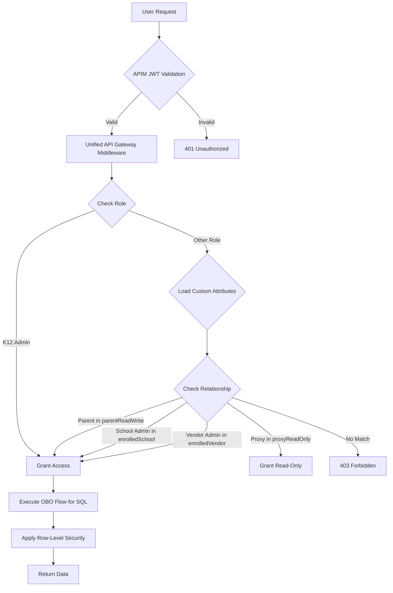

# System Architecture

## High-Level Architecture

The K12 MyPortal system follows a modern, cloud-native architecture pattern built on Azure Government Cloud to meet FedRAMP compliance requirements.

### Architecture Diagram

```
┌─────────────────────────────────────────────────────────────────────┐
│                        External Users                                │
│  (Families, Schools, Providers - 100,000+ users)                   │
└────────────────┬───────────────────────────────────┬────────────────┘
                 │                                   │
         ┌───────▼────────┐                 ┌────────▼───────┐
         │  Azure AD B2C  │                 │  SEAA Okta     │
         │  (Public Cloud)│                 │  (Internal)    │
         └───────┬────────┘                 └────────┬───────┘
                 │                                   │
                 └───────────────┬───────────────────┘
                                 │ Trust Relationship
                    ┌────────────▼──────────────┐
                    │   Azure Entra ID (Hub)    │
                    │   Identity & Access Mgmt  │
                    │   (Azure Gov Cloud)       │
                    └────────────┬──────────────┘
                                 │
┌────────────────────────────────┼────────────────────────────────┐
│                    Azure API Management (APIM)                   │
│                    JWT Validation & Routing                      │
└────────────────────────────────┬────────────────────────────────┘
                                 │
         ┌───────────────────────┼───────────────────────┐
         │                       │                       │
┌────────▼─────────┐   ┌────────▼─────────┐   ┌────────▼─────────┐
│  Angular Apps    │   │  Azure Functions │   │  SignalR Service │
│  (Static Web App)│   │  (.NET 8 API)    │   │  (Real-time)     │
│                  │   │                  │   │                  │
│ • Admin Portal   │   │ • Enrollment API │   │ • Notifications  │
│ • Household      │   │ • Programs API   │   │ • Live Updates   │
│ • Providers      │   │ • Admin API      │   │                  │
│ • Schools        │   │ • Tasks API      │   │                  │
└──────────────────┘   └────────┬─────────┘   └──────────────────┘
                                │
                  ┌─────────────┼─────────────┐
                  │             │             │
         ┌────────▼────┐  ┌────▼─────┐  ┌────▼──────────┐
         │  Azure SQL  │  │  Blob    │  │  ADLS Gen2    │
         │  Database   │  │  Storage │  │  (Documents)  │
         │             │  │          │  │               │
         │  • dbo      │  │ • Docs   │  │ • Hierarchical│
         │  • Enrollment│ │ • Images │  │ • RBAC/SAS    │
         │  • Households│ │          │  │               │
         │  • Awards   │  │          │  │               │
         │  • Comms    │  │          │  │               │
         └─────────────┘  └──────────┘  └───────────────┘
```

### External Integrations

```
┌──────────────────────────────────────────────────────────┐
│                  External Services                        │
├──────────────────────────────────────────────────────────┤
│  • ClassWallet       - Payment services & fund repository│
│  • SendGrid          - Email notifications               │
│  • PandaDoc          - Document generation & e-signature │
│  • Microsoft Graph   - Azure AD integration              │
│  • Melissa Data      - Address validation (API)          │
│  • RDS (MuleSoft)    - Residency determination service   │
│    └─ NC DMV         - Driver license verification       │
│    └─ NC DOR         - Tax filing verification           │
│    └─ NC DPI         - Student data (future)             │
└──────────────────────────────────────────────────────────┘
```

#### RDS Integration (INT-07)

The Residency Determination Service (RDS) provides automated NC residency verification via Azure Service Bus queues and MuleSoft ESB:

- **K12 → RDS**: Request messages with parent SSN, DOB, license info
- **RDS → Agencies**: SFTP file exchange with DMV/DOR (daily batch)
- **RDS → K12**: Response messages with raw agency data
- **K12 Decision**: K12 is the **source of truth** for final residency determination

See [INT-07: RDS Integration](integrations/INT-07-rds-residency-determination-service.md) and [ADR-013](../adr/ADR-013-rds-async-integration-pattern.md) for details.

## Architectural Patterns

### 1. Layered N-Tier Architecture (Backend)

The backend follows clean architecture principles with clear separation of concerns:

```
┌─────────────────────────────────────────────┐
│  API Layer (Azure Functions - HTTP Triggers)│
│  Files: API/Admin.cs, API/Programs.cs, etc.│
└─────────────────┬───────────────────────────┘
                  │
┌─────────────────▼───────────────────────────┐
│  Middleware Layer                           │
│  • GlobalErrorHandlingMiddleware            │
│  • EntraAuthenticationMiddleware            │
└─────────────────┬───────────────────────────┘
                  │
┌─────────────────▼───────────────────────────┐
│  Application Layer (Business Logic)         │
│  Files: CFIK12.Application/*App.cs          │
│  • AdminApp.cs (57KB - complex workflows)   │
│  • EnrollmentApp.cs                         │
│  • ProgramsApp.cs                           │
└─────────────────┬───────────────────────────┘
                  │
┌─────────────────▼───────────────────────────┐
│  Infrastructure Layer (External Services)   │
│  CFIK12.Infrastructure/                     │
│  • BlobStorage, SignalR                     │
│  • SendGrid, PandaDoc                       │
└─────────────────┬───────────────────────────┘
                  │
┌─────────────────▼───────────────────────────┐
│  Domain Layer (Models, Validators, Enums)   │
│  CFIK12.Domain/                             │
│  • Entity models (from EF generation)       │
│  • FluentValidation validators              │
└─────────────────┬───────────────────────────┘
                  │
┌─────────────────▼───────────────────────────┐
│  Data Layer (Repository Pattern)            │
│  • Dapper micro-ORM for queries             │
│  • SQL stored procedures                    │
└─────────────────┬───────────────────────────┘
                  │
┌─────────────────▼───────────────────────────┐
│  Azure SQL Database                         │
│  Multi-schema design                        │
└─────────────────────────────────────────────┘
```

**Key Points**:
- **Entity Framework**: Used ONLY for model generation (not for data access)
- **Dapper**: Micro-ORM for all SQL queries (performance)
- **AutoMapper**: Object-to-object mapping
- **FluentValidation**: Input validation
- **Dependency Injection**: Configured in `Enrollment/Program.cs`

### 2. Frontend Monorepo Architecture (Nx)

```
k12-web-enrollment/
├── apps/
│   ├── admin/           (Port 4200 - Administrative portal)
│   ├── enrollment/      (Port 4300 - Household enrollment)
│   ├── providers/       (Port 4500 - Provider management)
│   └── schools/         (Port 4600 - School management)
├── projects/
│   └── shared/          (Shared library - MUST build first)
│       ├── components/  (Reusable UI)
│       ├── services/    (HTTP, state management)
│       ├── guards/      (Route protection)
│       ├── interceptors/(HTTP middleware)
│       └── models/      (TypeScript types/enums)
└── nx.json              (Nx workspace configuration)
```

**Critical Workflow**:
1. Build shared library: `npm run build:shared`
2. Any change to shared library requires rebuild + dev server restart
3. Each app has independent routing via `app.routes.ts`
4. Shared state management using RxJS

## Hub and Spoke Security Model

### Identity Hub (Microsoft Entra ID)

The system uses a **Hub and Spoke** architecture for identity and access management:

**Hub**: Azure Entra ID serves as the central identity authority
**Spokes**: Azure SQL, ADLS Gen2, Azure Functions

### Key Components

#### 1. Object Representation
- **Users**: Students, Parents, School Admins, Vendor Admins
  - Students: `accountEnabled: false` (non-loginable identity records)
- **Groups**: Security groups for each school/provider (e.g., `K12-School-LincolnHigh`)

#### 2. Custom Security Attributes

Attribute Set: `studentAccessControl`
- `parentReadWrite` (multi-value): Primary parent Object IDs
- `proxyReadOnly` (multi-value): Proxy parent Object IDs
- `enrolledSchoolId` (single-value): School security group ID
- `enrolledVendorId` (single-value): Vendor security group ID

#### 3. Application Roles
- `K12.Admin` - SEAA administrators (full access)
- `School.Admin` - School staff
- `Vendor.Admin` - Service provider staff
- `PrimaryParent.User` - Primary household parents
- `ProxyParent.User` - Proxy parents (limited access)

#### 4. Administrative Units (AUs)

Enable delegated administration to minimize IT workload:
- Each school has an AU (e.g., "AU - Northwood High")
- School administrators manage their own staff (password resets, group membership)
- Scoped roles prevent cross-school access

### Authorization Flow



### Defense-in-Depth

1. **APIM**: JWT validation, endpoint authorization
2. **API Middleware**: Business logic authorization (custom attributes)
3. **Azure SQL RLS**: Row-level security as backstop
4. **ADLS Gen2**: RBAC + SAS tokens for documents

## Data Architecture

### Database Strategy

The K12 MyPortal platform uses a **dual-database architecture** with clear separation of concerns:

| Database | Type | Purpose | Use Case |
|----------|------|---------|----------|
| **Azure SQL** | Primary | All transactional data | Enrollment, programs, users, awards |
| **Azure PostgreSQL** | Analytics Only | Cube.js → Metabase sync | Pre-aggregated analytics data |

> **Important:** Azure SQL (SQL Server) is the **primary database** for all application data. PostgreSQL is used **exclusively** for the QueryBuilder analytics pipeline to sync pre-aggregated data to Metabase. See [ADR-010 Option 6](adr/ADR-010-embedded-analytics-components.md#option-6-custom-angular--cubejs--postgresql-recommended-evolution) for details.

### Azure SQL Schema (Primary Database)

Azure SQL Server with multi-schema design:

| Schema | Purpose | Key Tables |
|--------|---------|------------|
| `dbo` | Core tables | Users, Configuration |
| `Enrollment` | Enrollment management | Applications, Sessions, Programs |
| `Households` | Household data | Household, Members, Addresses |
| `Awards` | Awards system | AwardAllocations, Disbursements |
| `Comms` | Communications | Messages, Templates, Logs |
| `Analytics` | Query definitions (NEW) | QueryDefinition, QuerySnapshot, QuerySchedule |

**Important**:
- Models generated via Entity Framework (`efg generate`)
- Data access via Dapper (NOT Entity Framework)
- Be cautious with `efg generate` - may not reflect all dev work

### Azure PostgreSQL (Analytics Only)

Azure PostgreSQL Flexible Server is used **only** for the QueryBuilder analytics pipeline:

```
┌──────────────────┐     ┌──────────────────┐     ┌──────────────────┐
│   Azure SQL      │     │   Cube.js        │     │ Azure PostgreSQL │
│   (Primary)      │────▶│   Semantic Layer │────▶│  (Analytics)     │
│                  │     │   Sync           │     │                  │
│ • Enrollment     │     │ • Pre-aggregations│    │ • TimescaleDB    │
│ • Programs       │     │ • Materialized   │     │ • pg_trgm        │
│ • Awards         │     │   views          │     │ • pgvector       │
└──────────────────┘     └──────────────────┘     └──────────────────┘
                                                           │
                                                           ▼
                                                  ┌──────────────────┐
                                                  │   Metabase       │
                                                  │   (Optional BI)  │
                                                  └──────────────────┘
```

**PostgreSQL Extensions:**
- `TimescaleDB` - Time-series optimization for enrollment trends
- `pg_trgm` - Fuzzy search for query builder autocomplete
- `pgvector` - AI/semantic search (future)

See: [QueryBuilder SDK Design](integrations/QueryBuilder/SDK-Design.md) for implementation details.

### Document Storage (ADLS Gen2)

Hierarchical structure for access control:

```
/{application}/{legal-entity}/{userid}/{documentType}

Examples:
/enrollment/lincoln-high/student123/apartmentleasingagreement
/providerdashboard/math-tutor123/employee123/verificationdocument
```

Access control:
- Parents: Access at `{userid}` level
- Schools/Vendors: Access at `{legal-entity}` level
- K12.Admin: Access at `{application}` level
- SAS tokens: Short-lived (5 min) for secure downloads

## Integration Architecture

### ClassWallet Integration

**Purpose**: Payment services and funds repository for ESA+ program

**Integration Points**:
- Disbursement API (send funds to schools/vendors/wallets)
- Product approval workflow
- Invoice submission and approval
- Account balance queries

**Data Flow**:
```
K12 API → ClassWallet API → Financial Institutions
         ↓
    Parent Portal ← ClassWallet Portal (potential SSO integration)
```

### SendGrid Integration

**Purpose**: Transactional email and notifications

**Use Cases**:
- Application submission confirmations
- Award notifications
- Task reminders
- Renewal notices
- Admin alerts

### PandaDoc Integration

**Purpose**: Document generation and e-signature

**Use Cases**:
- Provider agreements
- School contracts
- Compliance documents
- Legal agreements

## Infrastructure as Code

**Terraform** manages all Azure resources:

```
k12-infra/terraform/
├── environments/     (dev, testing, staging, production)
│   ├── development/
│   ├── testing/
│   └── production/
├── modules/          (reusable infrastructure components)
│   ├── core/         (shared resources: DNS, IAM, images)
│   ├── api/          (Azure Functions)
│   ├── web/          (Static Web Apps)
│   ├── data/         (SQL, Storage)
│   └── networking/   (VNet, NSG, APIM)
└── docs/             (templates and guides)
```

**Key Principles**:
- One environment = one directory
- Modules for each subsystem
- State stored in Azure Storage (remote backend)
- Plan → Review → Apply workflow

## Non-Functional Requirements

### Performance
- **Availability**: 99.9% uptime
- **Scalability**: 100,000+ concurrent users
- **Response Time**: <2 seconds for API calls
- **Throughput**: Handle 95,000+ applications in 30-day period

### Security
- **FedRAMP High**: Azure Government Cloud compliance
- **NIST 800-53**: Control families implementation
- **Encryption**: At-rest and in-transit (TLS 1.2+)
- **MFA**: Required for all administrative users
- **Audit Logging**: Complete transaction history

### Compliance
- **WCAG 2.1 Level AA**: Accessibility standards
- **FERPA**: Student data protection
- **NC Records Retention**: Follow state guidelines
- **SOC 2**: Cloud provider certifications

### Disaster Recovery
- **RPO**: 4 hours (Recovery Point Objective)
- **RTO**: 8 hours (Recovery Time Objective)
- **Backup**: Daily automated backups with 30-day retention
- **Geo-Redundancy**: Multi-region Azure deployment

## Technology Stack Summary

| Component | Technology | Rationale |
|-----------|-----------|-----------|
| **Cloud Platform** | Azure Government | FedRAMP compliance |
| **API Backend** | Azure Functions (.NET 8) | Serverless, cost-effective |
| **Data Access** | Dapper | Performance over EF |
| **Frontend** | Angular 19 + Nx | Modern SPA, monorepo benefits |
| **Primary Database** | Azure SQL | Enterprise features, RLS |
| **Analytics Database** | Azure PostgreSQL Flexible Server | Cube.js/Metabase sync only |
| **Identity** | Entra ID + B2C | Native Azure integration |
| **API Gateway** | Azure APIM | Centralized security, throttling |
| **File Storage** | ADLS Gen2 | Hierarchical access control |
| **IaC** | Terraform | Multi-cloud, declarative |
| **CI/CD** | Azure DevOps | Integrated with Azure |
| **Container Orchestration** | .NET Aspire | Local dev + deployment automation |
| **Container Registry** | Azure Container Registry | Container image storage |
| **Analytics Containers** | Azure Container Apps | Cube.js, Trino, Metabase |
| **Semantic Layer** | Cube.js | Pre-aggregations, caching |
| **Query Federation** | Trino | Multi-source SQL |

> **Proposed Architecture Update:** The future-state architecture migrates ALL services to **Azure Container Apps** (not App Service) with **Dapr** providing abstractions for all cross-cutting concerns. See [Proposed Architecture](../09-proposed-architecture/README.md) for details including:
> - Azure Container Apps as the hosting platform
> - Dapr for service invocation, state, pub/sub, secrets, configuration, workflows, and jobs
> - .NET Aspire for local development with identical behavior to production

## Business Workflows

The K12 MyPortal system includes several orchestrated business workflows:

- [Workflows Documentation](workflows/README.md) - Index of all workflow documentation
- [WF-01: Roster - To Be Certified](workflows/WF-01-roster-to-be-certified.md) - Student roster certification workflow

## Related Documentation

- [Identity Provider (CIAM) Analysis](https://cfi-nc.atlassian.net/wiki/spaces/KR/pages/4032725075)
- [Microsoft Entra ID Hub and Spoke Model](https://cfi-nc.atlassian.net/wiki/spaces/KR/pages/4053696597)
- [Infrastructure README](../../../k12-infra/terraform/README.md)
- [API Backend README](../../../k12-api-enrollment/README.md)
- [Frontend README](../../../k12-web-enrollment/README.md)

---

*For architecture questions, contact the CFI Architecture team (Marty Flournory, Sumith Mathur).*
