.\wiki\02-architecture/c4-diagrams/01-system-context.md
````markdown
---
id: 3d22d932-75e3-451b-9923-552d500fde12
---
# C4 Level 1: System Context Diagram

## K12 MyPortal System Context

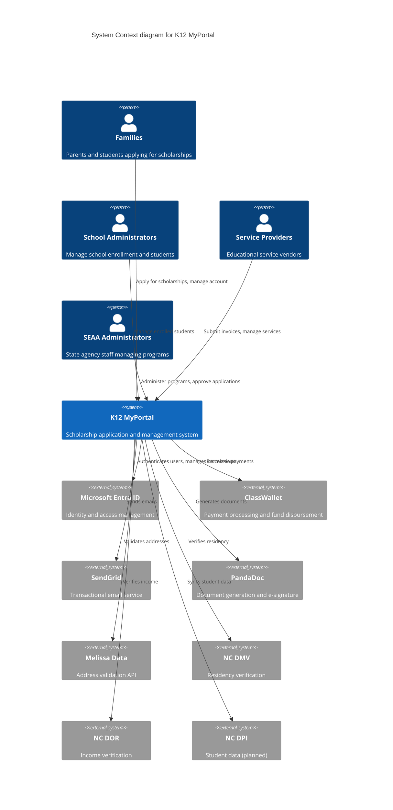
```mermaid
C4Context
    title System Context diagram for K12 MyPortal

    Person(families, "Families", "Parents and students applying for scholarships")
    Person(schools, "School Administrators", "Manage school enrollment and students")
    Person(providers, "Service Providers", "Educational service vendors")
    Person(admins, "SEAA Administrators", "State agency staff managing programs")

    System(k12, "K12 MyPortal", "Scholarship application and management system")

    System_Ext(entra, "Microsoft Entra ID", "Identity and access management")
    System_Ext(classwallet, "ClassWallet", "Payment processing and fund disbursement")
    System_Ext(sendgrid, "SendGrid", "Transactional email service")
    System_Ext(pandadoc, "PandaDoc", "Document generation and e-signature")
    System_Ext(melissa, "Melissa Data", "Address validation API")
    System_Ext(dmv, "NC DMV", "Residency verification")
    System_Ext(dor, "NC DOR", "Income verification")
    System_Ext(dpi, "NC DPI", "Student data (planned)")

    Rel(families, k12, "Apply for scholarships, manage account")
    Rel(schools, k12, "Manage enrolled students")
    Rel(providers, k12, "Submit invoices, manage services")
    Rel(admins, k12, "Administer programs, approve applications")

    Rel(k12, entra, "Authenticates users, manages permissions")
    Rel(k12, classwallet, "Processes payments")
    Rel(k12, sendgrid, "Sends emails")
    Rel(k12, pandadoc, "Generates documents")
    Rel(k12, melissa, "Validates addresses")
    Rel(k12, dmv, "Verifies residency")
    Rel(k12, dor, "Verifies income")
    Rel(k12, dpi, "Syncs student data")

    UpdateLayoutConfig($c4ShapeInRow="4", $c4BoundaryInRow="1")
```

## Key Relationships

### User Interactions

**Families (Parents/Students)**
- Apply for ESA+ and Opportunity Scholarship programs
- Upload required documents
- Manage student information
- Track application status
- Receive award notifications

**School Administrators**
- Manage school information
- Enroll and track students
- Submit attendance records
- View funding allocations

**Service Providers**
- Register services and products
- Submit invoices for payment
- Track approved services
- Manage provider staff

**SEAA Administrators**
- Configure program rules and policies
- Review and approve applications
- Manage statewide operations
- Generate compliance reports

### External System Integrations

**Microsoft Entra ID (Critical)**
- Hub & Spoke identity model
- Single sign-on (SSO)
- Custom security attributes for fine-grained access
- Administrative units for delegated administration
- Multi-factor authentication (MFA)

**ClassWallet (High Priority)**
- ESA+ payment disbursement
- Fund repository and tracking
- Invoice approval workflow
- Account balance queries
- Transaction reporting

**SendGrid (Medium Priority)**
- Application status notifications
- Award letters
- Renewal reminders
- System alerts
- Marketing communications

**PandaDoc (Medium Priority)**
- Provider agreement generation
- School contracts
- Compliance document creation
- E-signature workflow
- Document version control

**Melissa Data (Low Priority)**
- Real-time address validation
- Address standardization
- Geocoding for district verification

**NC DMV (Medium Priority)**
- Residency verification via driver's license
- Automated data lookup
- Compliance tracking

**NC DOR (Medium Priority)**
- Income verification
- Tax return validation
- Eligibility determination support

**NC DPI (Future)**
- Student enrollment data sync
- Academic records integration
- Statewide reporting

## Compliance and Governance

- **FedRAMP High**: Azure Government Cloud hosting
- **FERPA**: Student data protection
- **NIST 800-53**: Security control compliance
- **WCAG 2.1 AA**: Accessibility standards
- **NC State Records**: Retention policies

## System Boundaries

**In Scope:**
- Application processing (ESA+, Opportunity Scholarship)
- Award management and disbursement
- Document generation and storage
- User management and authentication
- Reporting and analytics

**Out of Scope:**
- Payment card processing (handled by ClassWallet)
- Email delivery infrastructure (handled by SendGrid)
- Document storage infrastructure (Azure-managed)
- Identity provider infrastructure (Entra ID-managed)

## Performance Requirements

- **Users**: 100,000+ concurrent during application periods
- **Applications**: 95,000+ annually
- **Availability**: 99.9% uptime
- **Response Time**: <2 seconds for API calls
- **Data Retention**: 7 years minimum

## Related Documentation

- [Container Diagram (Level 2)](02-container-diagram.md)
- [System Architecture Overview](../README.md)
- [Security Architecture](../security/README.md)
- [Integration Architecture](../integrations/README.md)
````

.\wiki\02-architecture/c4-diagrams/02-container-diagram.md
````markdown
# C4 Level 2: Container Diagram

## K12 MyPortal Containers

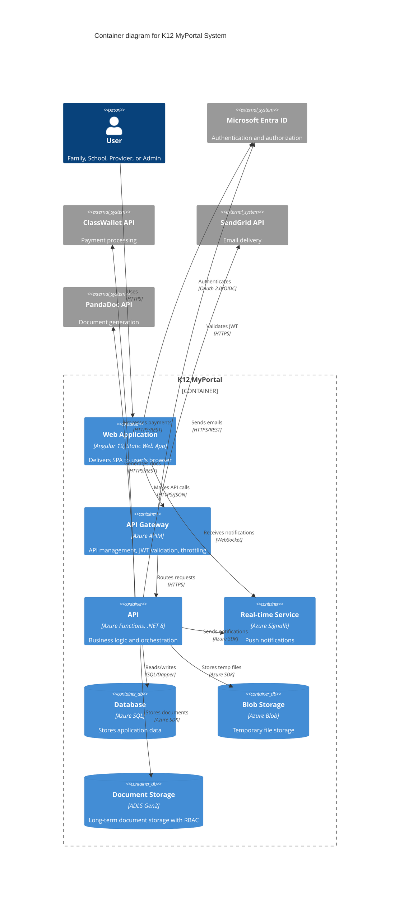
```mermaid
C4Container
    title Container diagram for K12 MyPortal System

    Person(user, "User", "Family, School, Provider, or Admin")

    Container_Boundary(k12, "K12 MyPortal") {
        Container(web, "Web Application", "Angular 19, Static Web App", "Delivers SPA to user's browser")
        Container(apim, "API Gateway", "Azure APIM", "API management, JWT validation, throttling")
        Container(api, "API", "Azure Functions, .NET 8", "Business logic and orchestration")
        Container(signalr, "Real-time Service", "Azure SignalR", "Push notifications")
        ContainerDb(db, "Database", "Azure SQL", "Stores application data")
        ContainerDb(storage, "Blob Storage", "Azure Blob", "Temporary file storage")
        ContainerDb(adls, "Document Storage", "ADLS Gen2", "Long-term document storage with RBAC")
    }

    System_Ext(entra, "Microsoft Entra ID", "Authentication and authorization")
    System_Ext(classwallet, "ClassWallet API", "Payment processing")
    System_Ext(sendgrid, "SendGrid API", "Email delivery")
    System_Ext(pandadoc, "PandaDoc API", "Document generation")

    Rel(user, web, "Uses", "HTTPS")
    Rel(web, apim, "Makes API calls", "HTTPS/JSON")
    Rel(web, signalr, "Receives notifications", "WebSocket")
    Rel(web, entra, "Authenticates", "OAuth 2.0/OIDC")

    Rel(apim, api, "Routes requests", "HTTPS")
    Rel(apim, entra, "Validates JWT", "HTTPS")

    Rel(api, db, "Reads/writes", "SQL/Dapper")
    Rel(api, storage, "Stores temp files", "Azure SDK")
    Rel(api, adls, "Stores documents", "Azure SDK")
    Rel(api, signalr, "Sends notifications", "Azure SDK")
    Rel(api, classwallet, "Processes payments", "HTTPS/REST")
    Rel(api, sendgrid, "Sends emails", "HTTPS/REST")
    Rel(api, pandadoc, "Generates docs", "HTTPS/REST")

    UpdateLayoutConfig($c4ShapeInRow="3", $c4BoundaryInRow="1")
```

## Container Details

### Web Application (Angular SPA)

**Technology:**
- Angular 19.2.6
- Nx 21.4.1 monorepo
- TypeScript 5.7.3
- Angular Material + PrimeNG

**Applications:**
- Admin Portal (port 4200)
- Household Enrollment (port 4300)
- Providers Portal (port 4500)
- Schools Portal (port 4600)

**Responsibilities:**
- User interface rendering
- Client-side routing
- Form validation
- State management (RxJS service-based)
- API consumption
- Real-time notifications via SignalR

**Hosting:** Azure Static Web Apps

**Key Features:**
- Single Page Application (SPA) architecture
- Progressive Web App (PWA) capabilities
- Responsive design (mobile-first)
- WCAG 2.1 AA accessibility compliance
- Dark mode support

### API Gateway (Azure APIM)

**Technology:** Azure API Management

**Responsibilities:**
- JWT token validation and signature verification
- API routing and versioning
- Rate limiting and throttling
- Request/response transformation
- API documentation (Swagger/OpenAPI)
- IP filtering and geo-blocking
- CORS policy enforcement

**Security Features:**
- OAuth 2.0 token validation
- Client certificate validation
- Subscription key management
- API key rotation
- Traffic analytics

**Policies:**
```xml
<policies>
    <inbound>
        <!-- Validate JWT token -->
        <validate-jwt header-name="Authorization">
            <openid-config url="https://login.microsoftonline.us/{tenant}/.well-known/openid-configuration" />
            <required-claims>
                <claim name="roles" match="any">
                    <value>K12.Admin</value>
                    <value>School.Admin</value>
                    <value>Provider.Admin</value>
                    <value>PrimaryParent.User</value>
                    <value>ProxyParent.User</value>
                </claim>
            </required-claims>
        </validate-jwt>

        <!-- Rate limiting -->
        <rate-limit calls="100" renewal-period="60" />

        <!-- CORS -->
        <cors allow-credentials="true">
            <allowed-origins>
                <origin>https://*.azurestaticapps.net</origin>
            </allowed-origins>
            <allowed-methods>
                <method>GET</method>
                <method>POST</method>
                <method>PUT</method>
                <method>DELETE</method>
            </allowed-methods>
        </cors>
    </inbound>
</policies>
```

### API (Azure Functions)

**Technology:**
- .NET 8
- Azure Functions v4
- Isolated worker process
- Dapper for data access

**Architecture Layers:**
```
API Layer (HTTP Triggers)
    ↓
Application Layer (Business Logic)
    ↓
Domain Layer (Models, Validators)
    ↓
Infrastructure Layer (External Services)
    ↓
Data Layer (Dapper Repositories)
```

**Key Functions:**

| Function | Purpose | Trigger |
|----------|---------|---------|
| **Admin.cs** | Admin portal operations | HTTP |
| **Programs.cs** | Program management (ESA+, Opportunity) | HTTP |
| **Enrollment.cs** | Application submission and processing | HTTP |
| **Households.cs** | Family and student management | HTTP |
| **Awards.cs** | Award allocation and disbursement | HTTP |
| **Communications.cs** | Email and notification handling | HTTP |
| **Tasks.cs** | Work queue and task management | HTTP |
| **Documents.cs** | Document upload and SAS token generation | HTTP |
| **SyncUserAccessMap** | Sync Entra ID to SQL for RLS | Timer (15 min) |
| **ArchiveAuditLogs** | Archive old audit logs | Timer (monthly) |

**Business Logic:**
- NRules business rules engine
- FluentValidation for input validation
- Custom middleware for authorization
- Resilient HTTP clients with Polly

**Configuration:**
```json
{
  "AzureFunctionsJobHost": {
    "extensions": {
      "http": {
        "routePrefix": "api",
        "maxConcurrentRequests": 100,
        "maxOutstandingRequests": 200
      }
    }
  }
}
```

### Database (Azure SQL)

**Technology:** Azure SQL Database (Standard/Premium tier)

**Schemas:**

| Schema | Purpose | Key Tables |
|--------|---------|------------|
| **dbo** | Core system tables | Users, AuditLogs, UserResourceAccessMap, SystemConfiguration |
| **Enrollment** | Application data | Students, Applications, ApplicationDocuments, EligibilityRules |
| **Households** | Family information | Households, HouseholdMembers, Addresses, IncomeVerification |
| **Awards** | Award allocations | StudentAwards, AwardDisbursements, AwardTransactions |
| **Comms** | Communications | EmailQueue, EmailTemplates, Notifications, Messages |

**Security:**
- Row-Level Security (RLS) with UserResourceAccessMap
- Dynamic data masking for PII
- Transparent Data Encryption (TDE)
- Automated backups (Point-in-time restore)
- Geo-replication for disaster recovery

**Performance:**
- Indexed views for complex queries
- Columnstore indexes for reporting
- Query Store enabled
- Automatic tuning recommendations

**Connection:**
- On-Behalf-Of (OBO) flow for user identity
- Managed Identity for service accounts
- Connection pooling enabled

### Blob Storage (Temporary)

**Technology:** Azure Blob Storage (Hot tier)

**Purpose:** Temporary file uploads during application process

**Lifecycle:**
1. User uploads document via web app
2. API validates file (type, size, virus scan)
3. File stored in blob storage
4. Document processed and validated
5. File moved to ADLS Gen2 for long-term storage
6. Original blob deleted after 7 days (auto-delete policy)

**Security:**
- Private endpoints (no public access)
- SAS tokens for uploads (5-minute expiry)
- Virus scanning on upload
- Encryption at rest

**Storage Structure:**
```
temp-uploads/
  ├── {applicationId}/
  │   ├── {documentId}.pdf
  │   └── {documentId}.jpg
```

### Document Storage (ADLS Gen2)

**Technology:** Azure Data Lake Storage Gen2

**Purpose:** Long-term document storage with hierarchical access control

**Structure:**
```
/{application}/{legal-entity}/{userid}/{documentType}

Examples:
/enrollment/lincoln-high/student123/apartmentleasingagreement
/enrollment/lincoln-high/student123/birthcertificate
/providerdashboard/math-tutor123/employee123/verificationdocument123
/schools/roosevelt-elementary/staff456/backgroundcheck
```

**Security:**
- Hierarchical access control (RBAC at folder level)
- Security groups assigned Storage Blob Data Reader role
- Short-lived SAS tokens (~5 minutes) for downloads
- Encryption at rest with customer-managed keys
- Immutable storage for compliance

**Features:**
- Versioning enabled
- Soft delete (30 days)
- Lifecycle management (archive after 1 year)
- Change feed for audit

### Real-time Service (Azure SignalR)

**Technology:** Azure SignalR Service (Standard tier)

**Use Cases:**
- Application status updates (submitted → under review → approved)
- Notification push to user dashboard
- Live dashboard updates for admins (application counts, pending tasks)
- Admin broadcast messages to all users
- Work queue updates

**Connection Flow:**
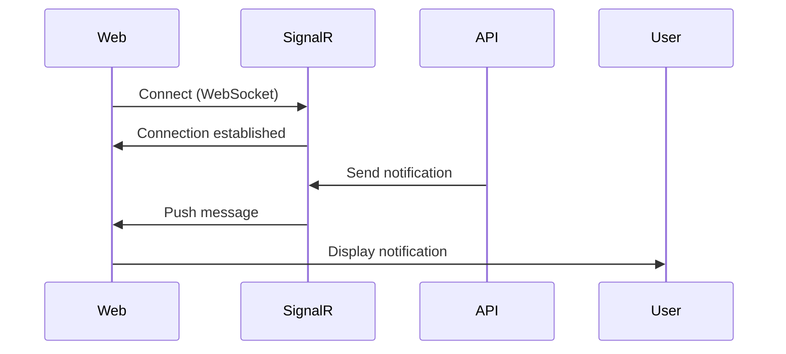
```mermaid
sequenceDiagram
    participant Web
    participant SignalR
    participant API
    participant User

    Web->>SignalR: Connect (WebSocket)
    SignalR->>Web: Connection established
    API->>SignalR: Send notification
    SignalR->>Web: Push message
    Web->>User: Display notification
```

**Hub Methods:**
- `JoinUserGroup(userId)` - Subscribe to user-specific notifications
- `JoinAdminGroup()` - Subscribe to admin broadcasts
- `SendNotification(userId, message)` - Send to specific user
- `BroadcastToAdmins(message)` - Broadcast to all admins

## External System Integration

### Microsoft Entra ID

**Integration Type:** OAuth 2.0 / OpenID Connect

**Features:**
- Single Sign-On (SSO)
- Custom security attributes (`studentAccessControl`)
- Administrative units for delegated administration
- B2C for external users (parents, schools, providers)
- Multi-factor authentication (MFA)

**Endpoints:**
- Authorization: `https://login.microsoftonline.us/{tenant}/oauth2/v2.0/authorize`
- Token: `https://login.microsoftonline.us/{tenant}/oauth2/v2.0/token`
- User Info: Microsoft Graph API (`https://graph.microsoft.us/v1.0/me`)

**Token Claims:**
```json
{
  "oid": "abc-123-def-456",
  "email": "user@example.com",
  "roles": ["PrimaryParent.User"],
  "groups": ["K12-HouseHold-parent1"]
}
```

### ClassWallet API

**Integration Type:** REST API (JSON over HTTPS)

**Base URL:** `https://api.classwallet.com/v1/`

**Key Endpoints:**
- `POST /disbursement` - Send funds to student account
- `GET /balance/{accountId}` - Check account balance
- `POST /invoice` - Submit invoice for payment
- `GET /transactions` - Query transaction history
- `POST /account` - Create student account

**Authentication:** API Key (Bearer token)

**Error Handling:**
- Retry policy: 3 attempts with exponential backoff
- Circuit breaker: Open after 5 consecutive failures
- Fallback: Queue for manual processing

### SendGrid API

**Integration Type:** REST API (JSON over HTTPS)

**Base URL:** `https://api.sendgrid.com/v3/`

**Use Cases:**
- Transactional emails (application confirmation, award notification)
- Application status updates
- System alerts
- Password resets
- Marketing communications (newsletters, program updates)

**Key Endpoints:**
- `POST /mail/send` - Send email
- `GET /templates` - List email templates
- `POST /contacts` - Add contact to mailing list

**Authentication:** API Key

**Templates:**
- `application-submitted`
- `application-approved`
- `award-notification`
- `document-required`
- `payment-processed`

### PandaDoc API

**Integration Type:** REST API (JSON over HTTPS)

**Base URL:** `https://api.pandadoc.com/public/v1/`

**Use Cases:**
- Provider agreement generation
- School enrollment contracts
- Compliance document creation
- E-signature workflow
- Document version control

**Key Endpoints:**
- `POST /documents` - Create document from template
- `POST /documents/{id}/send` - Send for signature
- `GET /documents/{id}/download` - Download signed document

**Authentication:** OAuth 2.0 (Bearer token)

**Workflow:**
1. API creates document from template
2. PandaDoc generates PDF
3. API sends to recipient for e-signature
4. Webhook notifies when signed
5. API downloads and stores in ADLS

## Data Flow Diagrams

### Application Submission Flow

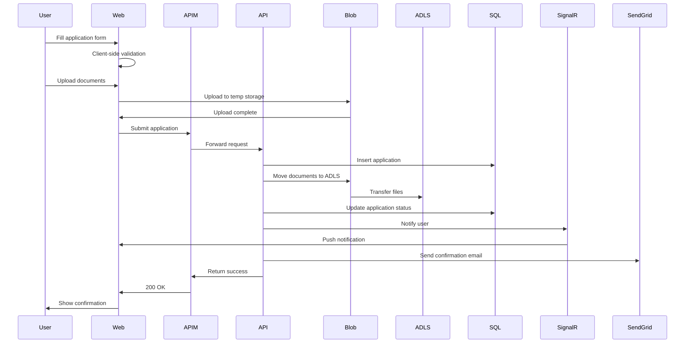
```mermaid
sequenceDiagram
    participant User
    participant Web
    participant APIM
    participant API
    participant Blob
    participant ADLS
    participant SQL
    participant SignalR
    participant SendGrid

    User->>Web: Fill application form
    Web->>Web: Client-side validation
    User->>Web: Upload documents
    Web->>Blob: Upload to temp storage
    Blob->>Web: Upload complete
    Web->>APIM: Submit application
    APIM->>API: Forward request
    API->>SQL: Insert application
    API->>Blob: Move documents to ADLS
    Blob->>ADLS: Transfer files
    API->>SQL: Update application status
    API->>SignalR: Notify user
    SignalR->>Web: Push notification
    API->>SendGrid: Send confirmation email
    API->>APIM: Return success
    APIM->>Web: 200 OK
    Web->>User: Show confirmation
```

### Award Processing Flow

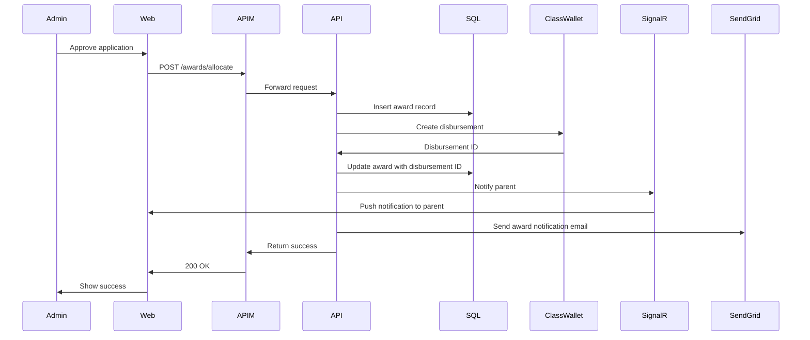
```mermaid
sequenceDiagram
    participant Admin
    participant Web
    participant APIM
    participant API
    participant SQL
    participant ClassWallet
    participant SignalR
    participant SendGrid

    Admin->>Web: Approve application
    Web->>APIM: POST /awards/allocate
    APIM->>API: Forward request
    API->>SQL: Insert award record
    API->>ClassWallet: Create disbursement
    ClassWallet->>API: Disbursement ID
    API->>SQL: Update award with disbursement ID
    API->>SignalR: Notify parent
    SignalR->>Web: Push notification to parent
    API->>SendGrid: Send award notification email
    API->>APIM: Return success
    APIM->>Web: 200 OK
    Web->>Admin: Show success
```

### Document Download Flow

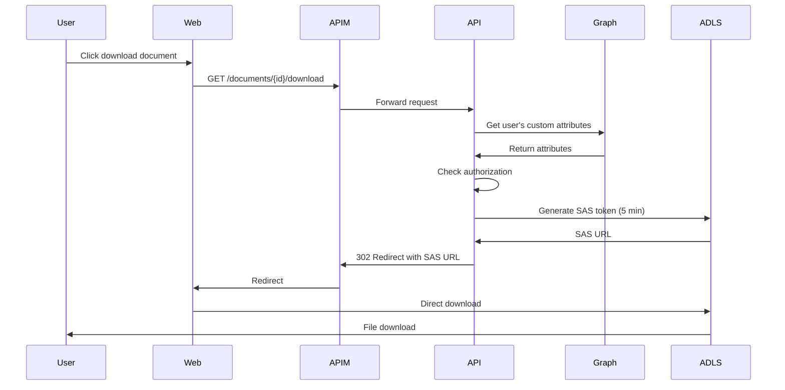
```mermaid
sequenceDiagram
    participant User
    participant Web
    participant APIM
    participant API
    participant Graph
    participant ADLS

    User->>Web: Click download document
    Web->>APIM: GET /documents/{id}/download
    APIM->>API: Forward request
    API->>Graph: Get user's custom attributes
    Graph->>API: Return attributes
    API->>API: Check authorization
    API->>ADLS: Generate SAS token (5 min)
    ADLS->>API: SAS URL
    API->>APIM: 302 Redirect with SAS URL
    APIM->>Web: Redirect
    Web->>ADLS: Direct download
    ADLS->>User: File download
```

## Deployment Architecture

### Azure Region

**Primary:** US Gov Virginia
**Secondary (DR):** US Gov Texas

### Resource Groups

| Resource Group | Purpose | Resources |
|----------------|---------|-----------|
| `k12-web-prod` | Frontend applications | Static Web Apps (4 apps) |
| `k12-api-prod` | Backend services | Azure Functions, APIM, SignalR |
| `k12-data-prod` | Data storage | Azure SQL, ADLS Gen2, Blob Storage |
| `k12-identity-prod` | Identity and security | Entra ID, Key Vault |
| `k12-monitoring-prod` | Observability | Application Insights, Log Analytics |

### Environments

| Environment | Purpose | Scale | Cost |
|-------------|---------|-------|------|
| **Development** | Developer testing | Minimal (1-2 instances) | $500/month |
| **Testing** | QA and integration testing | Small (2-3 instances) | $1,500/month |
| **Staging** | Pre-production validation | Medium (3-5 instances) | $3,000/month |
| **Production** | Live system | Full scale (5-10 instances) | $8,000/month |

### Infrastructure as Code

**Tool:** Terraform

**Modules:**
- `web-apps` - Static Web Apps configuration
- `api-functions` - Azure Functions deployment
- `data-storage` - SQL, ADLS, Blob configuration
- `networking` - VNet, NSG, Private Endpoints
- `monitoring` - Application Insights, alerts

**Deployment Pipeline:**
```bash
terraform plan -var-file=environments/prod.tfvars
terraform apply -var-file=environments/prod.tfvars
```

## Performance and Scalability

### Scaling Strategy

| Container | Scaling Method | Trigger | Max Scale |
|-----------|---------------|---------|-----------|
| **Web Apps** | Auto (built-in) | Traffic-based | Unlimited |
| **API Functions** | Auto-scale | CPU > 70%, Queue depth | 10 instances |
| **APIM** | Manual tier upgrade | Sustained high load | Premium tier |
| **SQL Database** | Auto-tune + Manual | DTU > 80% | Premium P6 |
| **SignalR** | Manual tier upgrade | Concurrent connections | 100k connections |

### Performance Targets

| Metric | Target | Current | Status |
|--------|--------|---------|--------|
| **API Response Time** | < 2 seconds | 1.2 seconds | ✅ |
| **Page Load Time** | < 3 seconds | 2.1 seconds | ✅ |
| **Database Query Time** | < 500ms | 350ms | ✅ |
| **Document Upload** | < 30 seconds | 18 seconds | ✅ |
| **Availability** | 99.9% | 99.95% | ✅ |
| **Concurrent Users** | 10,000 | Tested to 12,000 | ✅ |

## Monitoring and Observability

### Application Insights

**Tracked Metrics:**
- Request rate and duration
- Dependency calls (SQL, external APIs)
- Exception rates
- Custom events (application submitted, award allocated)
- User flows

**Alerts:**
- API response time > 3 seconds
- Error rate > 5%
- SQL DTU > 80%
- Failed authentication attempts > 100/hour

### Log Analytics

**Log Sources:**
- Azure Functions logs
- APIM gateway logs
- Azure SQL diagnostic logs
- SignalR connection logs

**Queries:**
- Failed authorization attempts
- Slow queries
- Error patterns
- User activity

## Security Considerations

### Network Security

**VNet Integration:**
- API Functions deployed in VNet
- Private endpoints for SQL, Storage, Key Vault
- Network Security Groups (NSG) for traffic filtering

**DDoS Protection:**
- Azure DDoS Protection Standard enabled
- Rate limiting in APIM
- Geo-blocking for non-US traffic

### Data Security

**Encryption:**
- TLS 1.2+ for all connections
- TDE for SQL at rest
- SSE for Storage at rest
- Customer-managed keys in Key Vault

**Data Classification:**
- Public: Program information
- Internal: Application statistics
- Confidential: Student PII, financial data
- Restricted: SSN, bank accounts

### Compliance

**Standards:**
- FedRAMP High (Azure Government Cloud)
- FERPA (student data protection)
- NIST 800-53 (security controls)
- WCAG 2.1 AA (accessibility)

## Disaster Recovery

### Backup Strategy

| Resource | Backup Frequency | Retention | RPO | RTO |
|----------|-----------------|-----------|-----|-----|
| **Azure SQL** | Continuous | 35 days | 5 minutes | 1 hour |
| **ADLS Gen2** | Daily snapshots | 30 days | 24 hours | 4 hours |
| **Blob Storage** | Geo-redundant | 30 days | 1 hour | 2 hours |
| **Configuration** | Git-based | Infinite | 0 (IaC) | 30 minutes |

### Failover Plan

1. **Automatic Failover (SQL):** Azure SQL auto-failover to secondary region
2. **Manual Failover (Functions):** Redeploy to secondary region from CI/CD
3. **Traffic Manager:** Automatic routing to healthy region
4. **Data Recovery:** Point-in-time restore from backup

## Related Documentation

- [C4 Level 1: System Context](01-system-context.md)
- [C4 Level 3: Backend Components](03-backend-components.md)
- [C4 Level 3: Frontend Components](04-frontend-components.md)
- [Security Architecture](../security/README.md)
- [Database Schema Documentation](../../Database-Schema-Documentation.md)

## References

- [Azure Architecture Center](https://learn.microsoft.com/en-us/azure/architecture/)
- [C4 Model](https://c4model.com/)
- [Azure Functions Best Practices](https://learn.microsoft.com/en-us/azure/azure-functions/functions-best-practices)
- [APIM Policies](https://learn.microsoft.com/en-us/azure/api-management/api-management-policies)

---

**Created:** 2024-11-24
**Author:** Architecture Team
**Review Date:** 2025-02-24 (Quarterly review)

````

.\wiki\02-architecture/integrations/INT-01-classwallet-integration.md
````markdown
# INT-01: ClassWallet Integration

**Integration ID:** INT-01
**System:** ClassWallet Payment Processing
**Type:** External REST API
**Classification:** Critical Business Service
**Status:** Active (Production)
**Last Updated:** 2025-01-15

## Table of Contents

- [Overview](#overview)
- [Integration Architecture](#integration-architecture)
- [API Specifications](#api-specifications)
- [Data Flow](#data-flow)
- [Implementation](#implementation)
- [Error Handling](#error-handling)
- [Security](#security)
- [Monitoring & Logging](#monitoring--logging)
- [Testing Strategy](#testing-strategy)
- [Common Issues & Troubleshooting](#common-issues--troubleshooting)
- [References](#references)

---

## Overview

### Purpose

ClassWallet is the **primary payment processing and fund repository system** for the NC SEAA K-12 Scholarship Management System. It handles all financial transactions related to Education Savings Accounts (ESA+), including:

- **Fund Disbursement**: Transferring scholarship funds from state accounts to student ESA+ accounts
- **Payment Processing**: Managing payments from parents to education providers and schools
- **Invoice Management**: Processing provider invoices for services rendered
- **Balance Tracking**: Real-time balance queries for student accounts
- **Account Creation**: Automated creation of student ESA+ accounts
- **Transaction History**: Complete audit trail of all financial activities
- **Reconciliation**: Daily financial reconciliation with state funding sources

### Business Context

ClassWallet serves as the **fund repository** mandated by NC state law for ESA+ scholarship programs. All scholarship funds flow through ClassWallet to ensure:

1. **Compliance**: State-required financial controls and audit trails
2. **Transparency**: Parents and administrators can track fund usage
3. **Flexibility**: Parents can choose from approved providers/schools
4. **Security**: PCI-DSS compliant payment processing
5. **Reporting**: Real-time financial reporting to state agencies

### Integration Scope

| Feature | MyPortal Responsibility | ClassWallet Responsibility |
|---------|------------------------|----------------------------|
| Student Eligibility | Determine award amounts | N/A |
| Account Creation | Trigger account creation API | Create and manage accounts |
| Fund Disbursement | Submit disbursement requests | Process transfers |
| Invoice Submission | Provider portal for invoice entry | Invoice approval workflow |
| Payment Processing | N/A | Process payments to providers |
| Balance Inquiries | Display balances in parent portal | Maintain real-time balances |
| Transaction History | Display in MyPortal | Store complete history |
| Reconciliation | Validate disbursements | Daily reconciliation reports |

### Key Metrics

- **Transaction Volume**: ~15,000 disbursements per academic year
- **Average Award**: $7,500 per student
- **Total Fund Volume**: $112M annually (projected)
- **API Call Volume**: ~50,000 calls/month (500 req/min peak)
- **SLA Requirements**: 99.9% uptime, <2s response time
- **Reconciliation Frequency**: Daily at 11:00 PM EST

---

## Integration Architecture

### High-Level Architecture

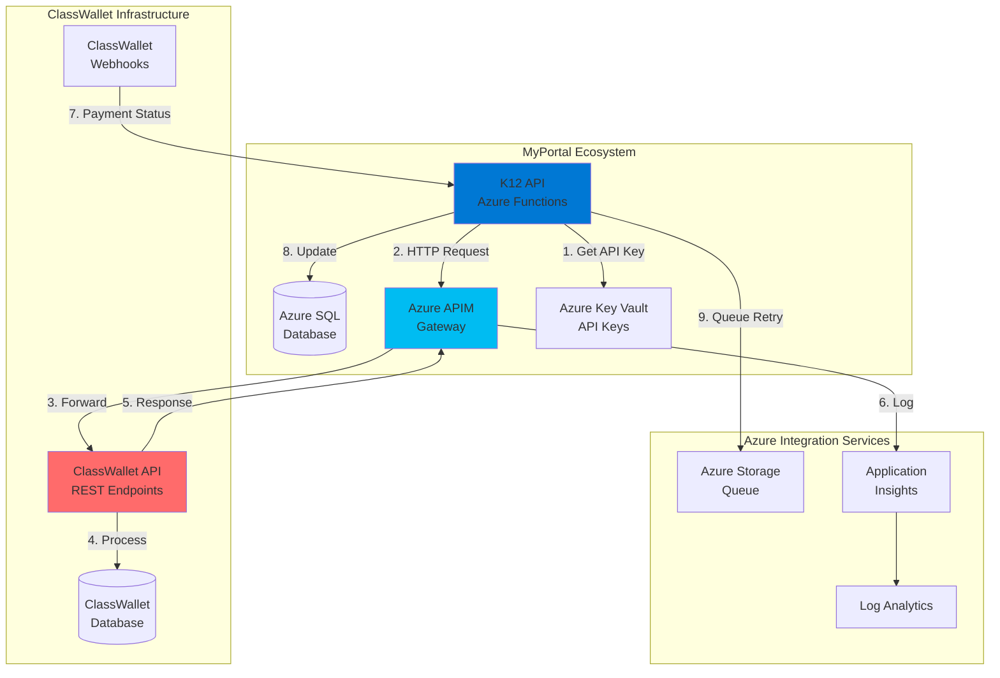
```mermaid
graph TB
    subgraph "MyPortal Ecosystem"
        API[K12 API<br/>Azure Functions]
        DB[(Azure SQL<br/>Database)]
        APIM[Azure APIM<br/>Gateway]
        KV[Azure Key Vault<br/>API Keys]
    end

    subgraph "ClassWallet Infrastructure"
        CW_API[ClassWallet API<br/>REST Endpoints]
        CW_DB[(ClassWallet<br/>Database)]
        CW_WEBHOOK[ClassWallet<br/>Webhooks]
    end

    subgraph "Azure Integration Services"
        SF[Azure Storage<br/>Queue]
        AI[Application<br/>Insights]
        LA[Log Analytics]
    end

    API -->|1. Get API Key| KV
    API -->|2. HTTP Request| APIM
    APIM -->|3. Forward| CW_API
    CW_API -->|4. Process| CW_DB
    CW_API -->|5. Response| APIM
    APIM -->|6. Log| AI
    CW_WEBHOOK -->|7. Payment Status| API
    API -->|8. Update| DB
    API -->|9. Queue Retry| SF
    AI --> LA

    style API fill:#0078d4
    style CW_API fill:#ff6b6b
    style APIM fill:#00bcf2
```

### Component Responsibilities

#### MyPortal API Layer
- **API/Functions/ClassWalletFunctions.cs**: Azure Function HTTP triggers for ClassWallet operations
- **Application/Services/ClassWalletService.cs**: Business logic for payment operations
- **Infrastructure/HttpClients/ClassWalletClient.cs**: HTTP client with Polly resilience policies
- **Domain/Entities/Disbursement.cs**: Domain model for fund disbursements

#### ClassWallet API Layer
- **Base URL (Production)**: `https://api.classwallet.com/v2`
- **Base URL (Sandbox)**: `https://sandbox-api.classwallet.com/v2`
- **Authentication**: Bearer token (OAuth 2.0 Client Credentials)
- **Rate Limits**: 100 requests/minute per API key

### Network Flow

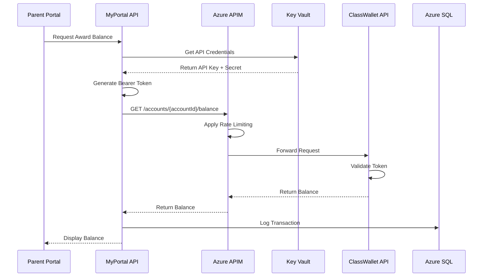
```mermaid
sequenceDiagram
    participant Parent as Parent Portal
    participant API as MyPortal API
    participant APIM as Azure APIM
    participant KV as Key Vault
    participant CW as ClassWallet API
    participant DB as Azure SQL

    Parent->>API: Request Award Balance
    API->>KV: Get API Credentials
    KV-->>API: Return API Key + Secret
    API->>API: Generate Bearer Token
    API->>APIM: GET /accounts/{accountId}/balance
    APIM->>APIM: Apply Rate Limiting
    APIM->>CW: Forward Request
    CW->>CW: Validate Token
    CW-->>APIM: Return Balance
    APIM-->>API: Return Balance
    API->>DB: Log Transaction
    API-->>Parent: Display Balance
```

### Data Synchronization Strategy

MyPortal maintains a **cache** of ClassWallet data to reduce API calls and improve performance:

| Data Type | Sync Frequency | Cache Duration | Source of Truth |
|-----------|---------------|----------------|-----------------|
| Account Balances | Real-time on request | 5 minutes | ClassWallet |
| Transaction History | Hourly batch job | 24 hours | ClassWallet |
| Invoice Status | Webhook + hourly poll | Real-time | ClassWallet |
| Disbursement Status | Webhook + 15-min poll | Real-time | ClassWallet |

---

## API Specifications

### Authentication

ClassWallet uses **OAuth 2.0 Client Credentials Flow** for API authentication.

#### Token Request

```http
POST https://api.classwallet.com/v2/oauth/token
Content-Type: application/x-www-form-urlencoded

grant_type=client_credentials
&client_id={CLIENT_ID}
&client_secret={CLIENT_SECRET}
&scope=read:accounts write:disbursements read:transactions
```

#### Token Response

```json
{
  "access_token": "eyJhbGciOiJSUzI1NiIsInR5cCI6IkpXVCJ9...",
  "token_type": "Bearer",
  "expires_in": 3600,
  "scope": "read:accounts write:disbursements read:transactions"
}

```

**Token Caching**: Tokens are valid for 1 hour. MyPortal caches tokens for 55 minutes to avoid expiration.

### API Endpoints

#### 1. Create ESA+ Account

**Endpoint:** `POST /v2/accounts`

**Purpose:** Create a new ESA+ account for a student upon award approval.

**Request:**

```json
{
  "accountType": "ESA_PLUS",
  "studentId": "STU-2024-001234",
  "firstName": "Emily",
  "lastName": "Johnson",
  "dateOfBirth": "2010-03-15",
  "guardianEmail": "parent@example.com",
  "initialBalance": 0.00,
  "programCode": "NC_SEAA_K12",
  "schoolYear": "2024-2025",
  "metadata": {
    "applicationId": "APP-2024-005678",
    "awardId": "AWD-2024-009012",
    "householdId": "HH-2024-003456"
  }
}
```

**Response (201 Created):**

```json
{
  "accountId": "CW-ACC-7894561230",
  "accountNumber": "4000-1234-5678",
  "status": "ACTIVE",
  "createdAt": "2024-09-15T14:30:00Z",
  "balance": {
    "available": 0.00,
    "pending": 0.00,
    "total": 0.00
  },
  "links": {
    "self": "/v2/accounts/CW-ACC-7894561230",
    "transactions": "/v2/accounts/CW-ACC-7894561230/transactions"
  }
}
```

**Error Response (400 Bad Request):**

```json
{
  "error": "VALIDATION_ERROR",
  "message": "Student account already exists",
  "details": {
    "field": "studentId",
    "existingAccountId": "CW-ACC-7894561230"
  },
  "requestId": "req-abc-123-def-456"
}
```

#### 2. Submit Disbursement Request

**Endpoint:** `POST /v2/disbursements`

**Purpose:** Transfer funds from state account to student ESA+ account.

**Request:**

```json
{
  "sourceAccountId": "CW-ACC-STATE-NC-001",
  "destinationAccountId": "CW-ACC-7894561230",
  "amount": 7500.00,
  "currency": "USD",
  "disbursementType": "INITIAL_AWARD",
  "effectiveDate": "2024-09-20",
  "description": "2024-2025 Academic Year Award",
  "referenceId": "DISB-2024-001234",
  "metadata": {
    "awardId": "AWD-2024-009012",
    "studentId": "STU-2024-001234",
    "schoolYear": "2024-2025",
    "disbursementReason": "Initial award funding"
  },
  "notificationEmail": "parent@example.com"
}
```

**Response (202 Accepted):**

```json
{
  "disbursementId": "CW-DISB-9876543210",
  "status": "PENDING",
  "submittedAt": "2024-09-15T14:35:00Z",
  "estimatedCompletionTime": "2024-09-20T00:00:00Z",
  "trackingUrl": "/v2/disbursements/CW-DISB-9876543210"
}
```

**Status Values:**
- `PENDING`: Submitted, awaiting processing
- `PROCESSING`: Fund transfer in progress
- `COMPLETED`: Successfully transferred
- `FAILED`: Transfer failed (see error details)
- `CANCELLED`: Cancelled by administrator

#### 3. Get Account Balance

**Endpoint:** `GET /v2/accounts/{accountId}/balance`

**Purpose:** Retrieve current balance for student ESA+ account.

**Response (200 OK):**

```json
{
  "accountId": "CW-ACC-7894561230",
  "balance": {
    "available": 6245.50,
    "pending": 350.00,
    "reserved": 0.00,
    "total": 6595.50
  },
  "currency": "USD",
  "lastUpdated": "2024-11-15T09:20:15Z",
  "breakdown": {
    "initialAward": 7500.00,
    "additionalFunding": 0.00,
    "totalSpent": 904.50,
    "pendingInvoices": 350.00
  }
}
```

#### 4. Get Transaction History

**Endpoint:** `GET /v2/accounts/{accountId}/transactions`

**Query Parameters:**
- `startDate`: ISO 8601 date (e.g., `2024-09-01`)
- `endDate`: ISO 8601 date (e.g., `2024-11-15`)
- `transactionType`: Filter by type (`DISBURSEMENT`, `PAYMENT`, `REFUND`, `ADJUSTMENT`)
- `status`: Filter by status (`COMPLETED`, `PENDING`, `FAILED`)
- `page`: Page number (default: 1)
- `pageSize`: Results per page (default: 50, max: 200)

**Response (200 OK):**

```json
{
  "accountId": "CW-ACC-7894561230",
  "transactions": [
    {
      "transactionId": "CW-TXN-1234567890",
      "type": "PAYMENT",
      "amount": -125.00,
      "currency": "USD",
      "status": "COMPLETED",
      "transactionDate": "2024-11-10T10:15:30Z",
      "description": "Math tutoring services - October 2024",
      "merchant": {
        "providerId": "PRV-2024-000123",
        "providerName": "ABC Tutoring Services",
        "invoiceNumber": "INV-2024-10-0045"
      },
      "balance": {
        "beforeTransaction": 6370.50,
        "afterTransaction": 6245.50
      }
    },
    {
      "transactionId": "CW-TXN-0987654321",
      "type": "DISBURSEMENT",
      "amount": 7500.00,
      "currency": "USD",
      "status": "COMPLETED",
      "transactionDate": "2024-09-20T00:00:00Z",
      "description": "2024-2025 Academic Year Award",
      "referenceId": "DISB-2024-001234"
    }
  ],
  "pagination": {
    "page": 1,
    "pageSize": 50,
    "totalPages": 1,
    "totalRecords": 12
  }
}
```

#### 5. Submit Provider Invoice

**Endpoint:** `POST /v2/invoices`

**Purpose:** Provider submits invoice for services rendered to student.

**Request:**

```json
{
  "accountId": "CW-ACC-7894561230",
  "providerId": "PRV-2024-000123",
  "invoiceNumber": "INV-2024-11-0078",
  "invoiceDate": "2024-11-15",
  "dueDate": "2024-11-30",
  "amount": 350.00,
  "currency": "USD",
  "serviceCategory": "TUTORING",
  "lineItems": [
    {
      "description": "Math tutoring - November 2024",
      "quantity": 10,
      "unitPrice": 35.00,
      "amount": 350.00,
      "serviceDate": "2024-11-01 to 2024-11-15"
    }
  ],
  "attachments": [
    {
      "fileName": "invoice_INV-2024-11-0078.pdf",
      "fileUrl": "https://myportal.blob.core.usgovcloudapi.net/invoices/...",
      "fileType": "application/pdf"
    }
  ],
  "notifyGuardian": true,
  "guardianEmail": "parent@example.com"
}
```

**Response (201 Created):**

```json
{
  "invoiceId": "CW-INV-5555666677",
  "status": "PENDING_REVIEW",
  "submittedAt": "2024-11-15T14:30:00Z",
  "estimatedReviewTime": "2-3 business days",
  "reviewUrl": "/v2/invoices/CW-INV-5555666677"
}
```

**Invoice Status Workflow:**
1. `PENDING_REVIEW`: Submitted, awaiting parent/admin review
2. `APPROVED`: Parent approved, payment processing
3. `PAID`: Payment completed
4. `DISPUTED`: Parent disputed charges
5. `REJECTED`: Admin rejected invoice
6. `CANCELLED`: Provider cancelled

#### 6. Get Disbursement Status

**Endpoint:** `GET /v2/disbursements/{disbursementId}`

**Response (200 OK):**

```json
{
  "disbursementId": "CW-DISB-9876543210",
  "status": "COMPLETED",
  "sourceAccountId": "CW-ACC-STATE-NC-001",
  "destinationAccountId": "CW-ACC-7894561230",
  "amount": 7500.00,
  "currency": "USD",
  "submittedAt": "2024-09-15T14:35:00Z",
  "processedAt": "2024-09-20T08:15:22Z",
  "referenceId": "DISB-2024-001234",
  "confirmationNumber": "CW-CONF-ABC123DEF456"
}
```

### Webhook Notifications

ClassWallet sends **webhook notifications** for asynchronous events.

#### Webhook Configuration

**MyPortal Webhook Endpoint:** `https://k12-api.myportal.nc.gov/api/webhooks/classwallet`

**Authentication:** HMAC-SHA256 signature in `X-ClassWallet-Signature` header

**Events:**
- `disbursement.completed`
- `disbursement.failed`
- `invoice.approved`
- `invoice.paid`
- `invoice.disputed`
- `payment.completed`
- `payment.failed`

#### Webhook Payload Example

```json
{
  "eventId": "evt-webhook-123456",
  "eventType": "disbursement.completed",
  "timestamp": "2024-09-20T08:15:22Z",
  "data": {
    "disbursementId": "CW-DISB-9876543210",
    "accountId": "CW-ACC-7894561230",
    "amount": 7500.00,
    "status": "COMPLETED",
    "referenceId": "DISB-2024-001234"
  },
  "signature": "sha256=a3b2c1d4e5f6..."
}
```

#### Webhook Signature Verification

```csharp
public static bool VerifyWebhookSignature(string payload, string signature, string secret)
{
    var expectedSignature = $"sha256={ComputeHmacSha256(payload, secret)}";
    return signature.Equals(expectedSignature, StringComparison.OrdinalIgnoreCase);
}

private static string ComputeHmacSha256(string payload, string secret)
{
    using var hmac = new HMACSHA256(Encoding.UTF8.GetBytes(secret));
    var hash = hmac.ComputeHash(Encoding.UTF8.GetBytes(payload));
    return BitConverter.ToString(hash).Replace("-", "").ToLower();
}
```

---

## Data Flow

### 1. Account Creation Flow

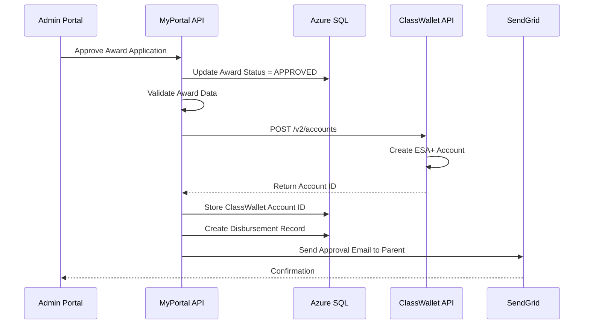
```mermaid
sequenceDiagram
    participant Admin as Admin Portal
    participant API as MyPortal API
    participant DB as Azure SQL
    participant CW as ClassWallet API
    participant Email as SendGrid

    Admin->>API: Approve Award Application
    API->>DB: Update Award Status = APPROVED
    API->>API: Validate Award Data
    API->>CW: POST /v2/accounts
    CW->>CW: Create ESA+ Account
    CW-->>API: Return Account ID
    API->>DB: Store ClassWallet Account ID
    API->>DB: Create Disbursement Record
    API->>Email: Send Approval Email to Parent
    Email-->>Admin: Confirmation
```

### 2. Fund Disbursement Flow

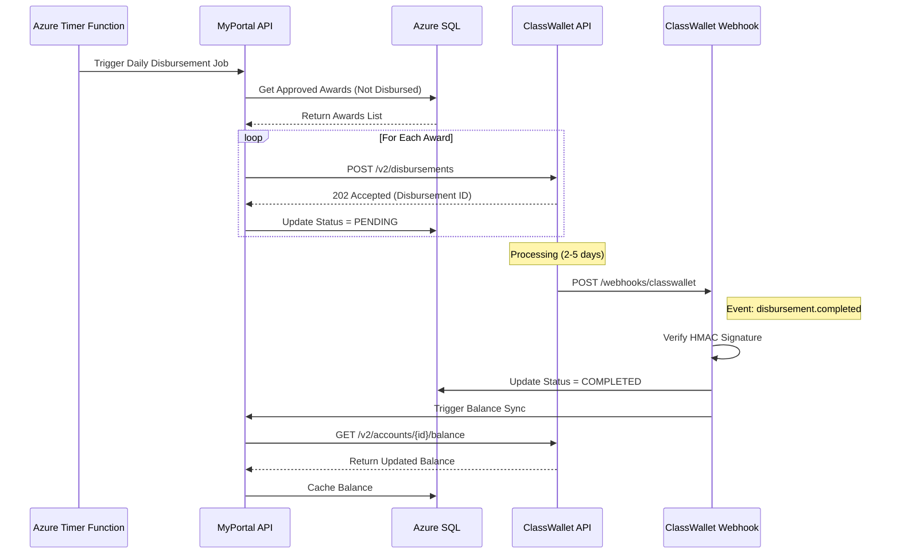
```mermaid
sequenceDiagram
    participant Scheduler as Azure Timer Function
    participant API as MyPortal API
    participant DB as Azure SQL
    participant CW as ClassWallet API
    participant Webhook as ClassWallet Webhook

    Scheduler->>API: Trigger Daily Disbursement Job
    API->>DB: Get Approved Awards (Not Disbursed)
    DB-->>API: Return Awards List

    loop For Each Award
        API->>CW: POST /v2/disbursements
        CW-->>API: 202 Accepted (Disbursement ID)
        API->>DB: Update Status = PENDING
    end

    Note over CW: Processing (2-5 days)

    CW->>Webhook: POST /webhooks/classwallet
    Note right of Webhook: Event: disbursement.completed
    Webhook->>Webhook: Verify HMAC Signature
    Webhook->>DB: Update Status = COMPLETED
    Webhook->>API: Trigger Balance Sync
    API->>CW: GET /v2/accounts/{id}/balance
    CW-->>API: Return Updated Balance
    API->>DB: Cache Balance
```

### 3. Invoice Approval and Payment Flow

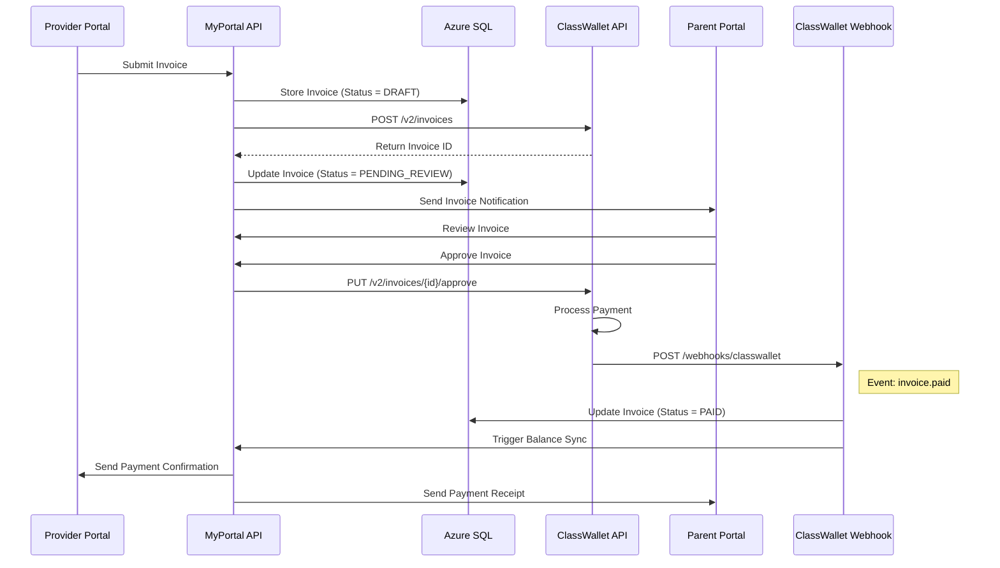
```mermaid
sequenceDiagram
    participant Provider as Provider Portal
    participant API as MyPortal API
    participant DB as Azure SQL
    participant CW as ClassWallet API
    participant Parent as Parent Portal
    participant Webhook as ClassWallet Webhook

    Provider->>API: Submit Invoice
    API->>DB: Store Invoice (Status = DRAFT)
    API->>CW: POST /v2/invoices
    CW-->>API: Return Invoice ID
    API->>DB: Update Invoice (Status = PENDING_REVIEW)

    API->>Parent: Send Invoice Notification
    Parent->>API: Review Invoice
    Parent->>API: Approve Invoice
    API->>CW: PUT /v2/invoices/{id}/approve
    CW->>CW: Process Payment

    CW->>Webhook: POST /webhooks/classwallet
    Note right of Webhook: Event: invoice.paid
    Webhook->>DB: Update Invoice (Status = PAID)
    Webhook->>API: Trigger Balance Sync

    API->>Provider: Send Payment Confirmation
    API->>Parent: Send Payment Receipt
```

### 4. Balance Inquiry Flow

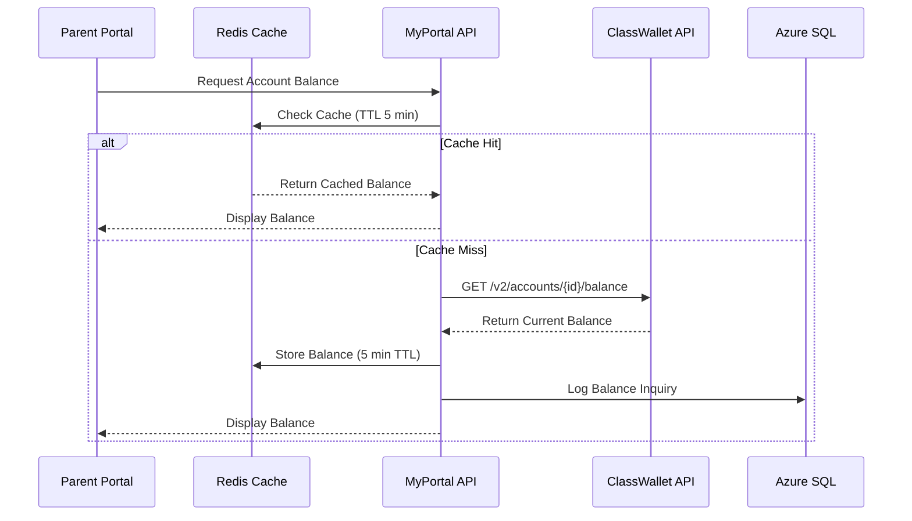
```mermaid
sequenceDiagram
    participant Parent as Parent Portal
    participant Cache as Redis Cache
    participant API as MyPortal API
    participant CW as ClassWallet API
    participant DB as Azure SQL

    Parent->>API: Request Account Balance
    API->>Cache: Check Cache (TTL 5 min)

    alt Cache Hit
        Cache-->>API: Return Cached Balance
        API-->>Parent: Display Balance
    else Cache Miss
        API->>CW: GET /v2/accounts/{id}/balance
        CW-->>API: Return Current Balance
        API->>Cache: Store Balance (5 min TTL)
        API->>DB: Log Balance Inquiry
        API-->>Parent: Display Balance
    end
```

### 5. Transaction History Sync Flow

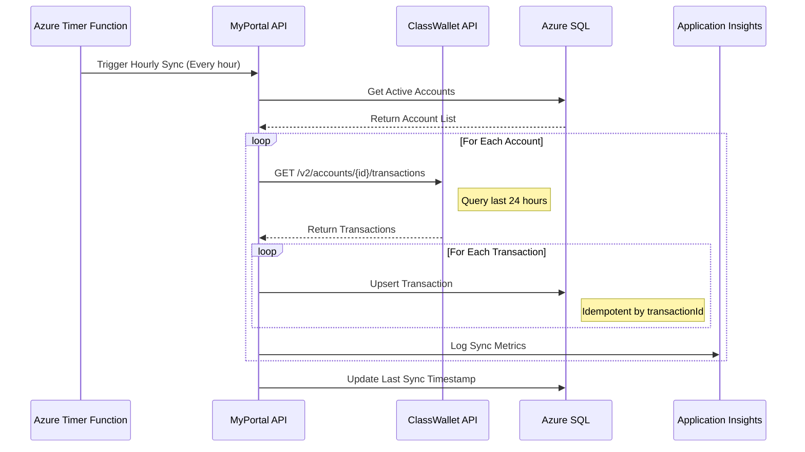
```mermaid
sequenceDiagram
    participant Scheduler as Azure Timer Function
    participant API as MyPortal API
    participant CW as ClassWallet API
    participant DB as Azure SQL
    participant AI as Application Insights

    Scheduler->>API: Trigger Hourly Sync (Every hour)
    API->>DB: Get Active Accounts
    DB-->>API: Return Account List

    loop For Each Account
        API->>CW: GET /v2/accounts/{id}/transactions
        Note right of CW: Query last 24 hours
        CW-->>API: Return Transactions

        loop For Each Transaction
            API->>DB: Upsert Transaction
            Note right of DB: Idempotent by transactionId
        end

        API->>AI: Log Sync Metrics
    end

    API->>DB: Update Last Sync Timestamp
```

---

## Implementation

### C# Implementation with Azure Functions

#### 1. ClassWallet HTTP Client Configuration

**File:** `Infrastructure/HttpClients/ClassWalletClient.cs`

```csharp
using System;
using System.Net.Http;
using System.Net.Http.Headers;
using System.Text;
using System.Text.Json;
using System.Threading.Tasks;
using Microsoft.Extensions.Configuration;
using Microsoft.Extensions.Logging;
using Polly;
using Polly.CircuitBreaker;
using Polly.Retry;
using Polly.Timeout;

namespace K12.Infrastructure.HttpClients
{
    public class ClassWalletClient : IClassWalletClient
    {
        private readonly HttpClient _httpClient;
        private readonly IConfiguration _configuration;
        private readonly ILogger<ClassWalletClient> _logger;
        private readonly AsyncRetryPolicy<HttpResponseMessage> _retryPolicy;
        private readonly AsyncCircuitBreakerPolicy<HttpResponseMessage> _circuitBreakerPolicy;
        private readonly AsyncTimeoutPolicy<HttpResponseMessage> _timeoutPolicy;

        private string _cachedAccessToken;
        private DateTime _tokenExpirationTime;

        public ClassWalletClient(
            HttpClient httpClient,
            IConfiguration configuration,
            ILogger<ClassWalletClient> logger)
        {
            _httpClient = httpClient;
            _configuration = configuration;
            _logger = logger;

            // Base URL from configuration (supports multiple environments)
            var baseUrl = _configuration["ClassWallet:BaseUrl"];
            _httpClient.BaseAddress = new Uri(baseUrl);
            _httpClient.DefaultRequestHeaders.Accept.Add(
                new MediaTypeWithQualityHeaderValue("application/json"));

            // Configure resilience policies
            _retryPolicy = BuildRetryPolicy();
            _circuitBreakerPolicy = BuildCircuitBreakerPolicy();
            _timeoutPolicy = Policy.TimeoutAsync<HttpResponseMessage>(
                TimeSpan.FromSeconds(30),
                TimeoutStrategy.Optimistic);
        }

        /// <summary>
        /// Retry policy: Exponential backoff for transient failures
        /// </summary>
        private AsyncRetryPolicy<HttpResponseMessage> BuildRetryPolicy()
        {
            return Policy
                .HandleResult<HttpResponseMessage>(r =>
                    (int)r.StatusCode >= 500 ||
                    r.StatusCode == System.Net.HttpStatusCode.RequestTimeout ||
                    r.StatusCode == System.Net.HttpStatusCode.TooManyRequests)
                .WaitAndRetryAsync(
                    retryCount: 3,
                    sleepDurationProvider: retryAttempt =>
                        TimeSpan.FromSeconds(Math.Pow(2, retryAttempt)),
                    onRetry: (outcome, timespan, retryCount, context) =>
                    {
                        _logger.LogWarning(
                            "ClassWallet API retry {RetryCount} after {Delay}ms. Status: {StatusCode}",
                            retryCount,
                            timespan.TotalMilliseconds,
                            outcome.Result?.StatusCode);
                    });
        }

        /// <summary>
        /// Circuit breaker: Open circuit after 5 consecutive failures
        /// </summary>
        private AsyncCircuitBreakerPolicy<HttpResponseMessage> BuildCircuitBreakerPolicy()
        {
            return Policy
                .HandleResult<HttpResponseMessage>(r =>
                    (int)r.StatusCode >= 500)
                .CircuitBreakerAsync(
                    handledEventsAllowedBeforeBreaking: 5,
                    durationOfBreak: TimeSpan.FromMinutes(1),
                    onBreak: (outcome, duration) =>
                    {
                        _logger.LogError(
                            "ClassWallet API circuit breaker opened for {Duration}s",
                            duration.TotalSeconds);
                    },
                    onReset: () =>
                    {
                        _logger.LogInformation("ClassWallet API circuit breaker reset");
                    });
        }

        /// <summary>
        /// Get or refresh OAuth 2.0 access token
        /// </summary>
        private async Task<string> GetAccessTokenAsync()
        {
            // Return cached token if still valid (with 5-minute buffer)
            if (!string.IsNullOrEmpty(_cachedAccessToken) &&
                DateTime.UtcNow < _tokenExpirationTime.AddMinutes(-5))
            {
                return _cachedAccessToken;
            }

            _logger.LogInformation("Requesting new ClassWallet access token");

            var clientId = _configuration["ClassWallet:ClientId"];
            var clientSecret = _configuration["ClassWallet:ClientSecret"];

            var tokenRequest = new HttpRequestMessage(HttpMethod.Post, "/v2/oauth/token")
            {
                Content = new FormUrlEncodedContent(new[]
                {
                    new KeyValuePair<string, string>("grant_type", "client_credentials"),
                    new KeyValuePair<string, string>("client_id", clientId),
                    new KeyValuePair<string, string>("client_secret", clientSecret),
                    new KeyValuePair<string, string>("scope", "read:accounts write:disbursements read:transactions")
                })
            };

            var response = await _httpClient.SendAsync(tokenRequest);
            response.EnsureSuccessStatusCode();

            var tokenResponse = await JsonSerializer.DeserializeAsync<TokenResponse>(
                await response.Content.ReadAsStreamAsync());

            _cachedAccessToken = tokenResponse.AccessToken;
            _tokenExpirationTime = DateTime.UtcNow.AddSeconds(tokenResponse.ExpiresIn);

            _logger.LogInformation(
                "ClassWallet access token obtained, expires at {ExpirationTime}",
                _tokenExpirationTime);

            return _cachedAccessToken;
        }

        /// <summary>
        /// Create ESA+ account for student
        /// </summary>
        public async Task<CreateAccountResponse> CreateAccountAsync(CreateAccountRequest request)
        {
            var accessToken = await GetAccessTokenAsync();

            var httpRequest = new HttpRequestMessage(HttpMethod.Post, "/v2/accounts")
            {
                Headers = { Authorization = new AuthenticationHeaderValue("Bearer", accessToken) },
                Content = new StringContent(
                    JsonSerializer.Serialize(request),
                    Encoding.UTF8,
                    "application/json")
            };

            var policy = Policy.WrapAsync(_retryPolicy, _circuitBreakerPolicy, _timeoutPolicy);

            var response = await policy.ExecuteAsync(async () =>
            {
                var result = await _httpClient.SendAsync(httpRequest);

                if (!result.IsSuccessStatusCode)
                {
                    var errorContent = await result.Content.ReadAsStringAsync();
                    _logger.LogError(
                        "ClassWallet CreateAccount failed: {StatusCode} - {Error}",
                        result.StatusCode,
                        errorContent);
                }

                return result;
            });

            response.EnsureSuccessStatusCode();

            return await JsonSerializer.DeserializeAsync<CreateAccountResponse>(
                await response.Content.ReadAsStreamAsync());
        }

        /// <summary>
        /// Submit disbursement request
        /// </summary>
        public async Task<DisbursementResponse> SubmitDisbursementAsync(DisbursementRequest request)
        {
            var accessToken = await GetAccessTokenAsync();

            var httpRequest = new HttpRequestMessage(HttpMethod.Post, "/v2/disbursements")
            {
                Headers = { Authorization = new AuthenticationHeaderValue("Bearer", accessToken) },
                Content = new StringContent(
                    JsonSerializer.Serialize(request),
                    Encoding.UTF8,
                    "application/json")
            };

            var policy = Policy.WrapAsync(_retryPolicy, _circuitBreakerPolicy, _timeoutPolicy);

            var response = await policy.ExecuteAsync(async () =>
                await _httpClient.SendAsync(httpRequest));

            response.EnsureSuccessStatusCode();

            return await JsonSerializer.DeserializeAsync<DisbursementResponse>(
                await response.Content.ReadAsStreamAsync());
        }

        /// <summary>
        /// Get account balance
        /// </summary>
        public async Task<BalanceResponse> GetAccountBalanceAsync(string accountId)
        {
            var accessToken = await GetAccessTokenAsync();

            var httpRequest = new HttpRequestMessage(
                HttpMethod.Get,
                $"/v2/accounts/{accountId}/balance")
            {
                Headers = { Authorization = new AuthenticationHeaderValue("Bearer", accessToken) }
            };

            var policy = Policy.WrapAsync(_retryPolicy, _circuitBreakerPolicy, _timeoutPolicy);

            var response = await policy.ExecuteAsync(async () =>
                await _httpClient.SendAsync(httpRequest));

            response.EnsureSuccessStatusCode();

            return await JsonSerializer.DeserializeAsync<BalanceResponse>(
                await response.Content.ReadAsStreamAsync());
        }

        /// <summary>
        /// Get transaction history
        /// </summary>
        public async Task<TransactionHistoryResponse> GetTransactionHistoryAsync(
            string accountId,
            DateTime? startDate = null,
            DateTime? endDate = null,
            int page = 1,
            int pageSize = 50)
        {
            var accessToken = await GetAccessTokenAsync();

            var queryParams = new List<string>
            {
                $"page={page}",
                $"pageSize={pageSize}"
            };

            if (startDate.HasValue)
                queryParams.Add($"startDate={startDate.Value:yyyy-MM-dd}");

            if (endDate.HasValue)
                queryParams.Add($"endDate={endDate.Value:yyyy-MM-dd}");

            var queryString = string.Join("&", queryParams);
            var url = $"/v2/accounts/{accountId}/transactions?{queryString}";

            var httpRequest = new HttpRequestMessage(HttpMethod.Get, url)
            {
                Headers = { Authorization = new AuthenticationHeaderValue("Bearer", accessToken) }
            };

            var policy = Policy.WrapAsync(_retryPolicy, _circuitBreakerPolicy, _timeoutPolicy);

            var response = await policy.ExecuteAsync(async () =>
                await _httpClient.SendAsync(httpRequest));

            response.EnsureSuccessStatusCode();

            return await JsonSerializer.DeserializeAsync<TransactionHistoryResponse>(
                await response.Content.ReadAsStreamAsync());
        }

        /// <summary>
        /// Get disbursement status
        /// </summary>
        public async Task<DisbursementStatusResponse> GetDisbursementStatusAsync(string disbursementId)
        {
            var accessToken = await GetAccessTokenAsync();

            var httpRequest = new HttpRequestMessage(
                HttpMethod.Get,
                $"/v2/disbursements/{disbursementId}")
            {
                Headers = { Authorization = new AuthenticationHeaderValue("Bearer", accessToken) }
            };

            var policy = Policy.WrapAsync(_retryPolicy, _circuitBreakerPolicy, _timeoutPolicy);

            var response = await policy.ExecuteAsync(async () =>
                await _httpClient.SendAsync(httpRequest));

            response.EnsureSuccessStatusCode();

            return await JsonSerializer.DeserializeAsync<DisbursementStatusResponse>(
                await response.Content.ReadAsStreamAsync());
        }

        /// <summary>
        /// Submit provider invoice
        /// </summary>
        public async Task<InvoiceResponse> SubmitInvoiceAsync(InvoiceRequest request)
        {
            var accessToken = await GetAccessTokenAsync();

            var httpRequest = new HttpRequestMessage(HttpMethod.Post, "/v2/invoices")
            {
                Headers = { Authorization = new AuthenticationHeaderValue("Bearer", accessToken) },
                Content = new StringContent(
                    JsonSerializer.Serialize(request),
                    Encoding.UTF8,
                    "application/json")
            };

            var policy = Policy.WrapAsync(_retryPolicy, _circuitBreakerPolicy, _timeoutPolicy);

            var response = await policy.ExecuteAsync(async () =>
                await _httpClient.SendAsync(httpRequest));

            response.EnsureSuccessStatusCode();

            return await JsonSerializer.DeserializeAsync<InvoiceResponse>(
                await response.Content.ReadAsStreamAsync());
        }
    }

    // DTOs for request/response models

    public class TokenResponse
    {
        [JsonPropertyName("access_token")]
        public string AccessToken { get; set; }

        [JsonPropertyName("token_type")]
        public string TokenType { get; set; }

        [JsonPropertyName("expires_in")]
        public int ExpiresIn { get; set; }

        [JsonPropertyName("scope")]
        public string Scope { get; set; }
    }

    public class CreateAccountRequest
    {
        [JsonPropertyName("accountType")]
        public string AccountType { get; set; } = "ESA_PLUS";

        [JsonPropertyName("studentId")]
        public string StudentId { get; set; }

        [JsonPropertyName("firstName")]
        public string FirstName { get; set; }

        [JsonPropertyName("lastName")]
        public string LastName { get; set; }

        [JsonPropertyName("dateOfBirth")]
        public DateTime DateOfBirth { get; set; }

        [JsonPropertyName("guardianEmail")]
        public string GuardianEmail { get; set; }

        [JsonPropertyName("initialBalance")]
        public decimal InitialBalance { get; set; }

        [JsonPropertyName("programCode")]
        public string ProgramCode { get; set; } = "NC_SEAA_K12";

        [JsonPropertyName("schoolYear")]
        public string SchoolYear { get; set; }

        [JsonPropertyName("metadata")]
        public Dictionary<string, string> Metadata { get; set; }
    }

    public class CreateAccountResponse
    {
        [JsonPropertyName("accountId")]
        public string AccountId { get; set; }

        [JsonPropertyName("accountNumber")]
        public string AccountNumber { get; set; }

        [JsonPropertyName("status")]
        public string Status { get; set; }

        [JsonPropertyName("createdAt")]
        public DateTime CreatedAt { get; set; }

        [JsonPropertyName("balance")]
        public BalanceInfo Balance { get; set; }
    }

    public class BalanceInfo
    {
        [JsonPropertyName("available")]
        public decimal Available { get; set; }

        [JsonPropertyName("pending")]
        public decimal Pending { get; set; }

        [JsonPropertyName("total")]
        public decimal Total { get; set; }
    }

    public class DisbursementRequest
    {
        [JsonPropertyName("sourceAccountId")]
        public string SourceAccountId { get; set; }

        [JsonPropertyName("destinationAccountId")]
        public string DestinationAccountId { get; set; }

        [JsonPropertyName("amount")]
        public decimal Amount { get; set; }

        [JsonPropertyName("currency")]
        public string Currency { get; set; } = "USD";

        [JsonPropertyName("disbursementType")]
        public string DisbursementType { get; set; }

        [JsonPropertyName("effectiveDate")]
        public DateTime EffectiveDate { get; set; }

        [JsonPropertyName("description")]
        public string Description { get; set; }

        [JsonPropertyName("referenceId")]
        public string ReferenceId { get; set; }

        [JsonPropertyName("metadata")]
        public Dictionary<string, string> Metadata { get; set; }

        [JsonPropertyName("notificationEmail")]
        public string NotificationEmail { get; set; }
    }

    public class DisbursementResponse
    {
        [JsonPropertyName("disbursementId")]
        public string DisbursementId { get; set; }

        [JsonPropertyName("status")]
        public string Status { get; set; }

        [JsonPropertyName("submittedAt")]
        public DateTime SubmittedAt { get; set; }

        [JsonPropertyName("estimatedCompletionTime")]
        public DateTime EstimatedCompletionTime { get; set; }
    }
}
```

#### 2. Application Service Layer

**File:** `Application/Services/ClassWalletService.cs`

```csharp
using System;
using System.Threading.Tasks;
using K12.Domain.Entities;
using K12.Domain.Repositories;
using K12.Infrastructure.HttpClients;
using Microsoft.Extensions.Logging;

namespace K12.Application.Services
{
    public class ClassWalletService : IClassWalletService
    {
        private readonly IClassWalletClient _classWalletClient;
        private readonly IAwardRepository _awardRepository;
        private readonly IDisbursementRepository _disbursementRepository;
        private readonly ITransactionRepository _transactionRepository;
        private readonly ILogger<ClassWalletService> _logger;

        public ClassWalletService(
            IClassWalletClient classWalletClient,
            IAwardRepository awardRepository,
            IDisbursementRepository disbursementRepository,
            ITransactionRepository transactionRepository,
            ILogger<ClassWalletService> logger)
        {
            _classWalletClient = classWalletClient;
            _awardRepository = awardRepository;
            _disbursementRepository = disbursementRepository;
            _transactionRepository = transactionRepository;
            _logger = logger;
        }

        /// <summary>
        /// Create ClassWallet account when award is approved
        /// </summary>
        public async Task<string> CreateAccountForAwardAsync(int awardId)
        {
            var award = await _awardRepository.GetByIdAsync(awardId);

            if (award == null)
                throw new InvalidOperationException($"Award {awardId} not found");

            if (award.Status != AwardStatus.Approved)
                throw new InvalidOperationException($"Award {awardId} is not approved");

            if (!string.IsNullOrEmpty(award.ClassWalletAccountId))
            {
                _logger.LogWarning(
                    "Award {AwardId} already has ClassWallet account {AccountId}",
                    awardId,
                    award.ClassWalletAccountId);
                return award.ClassWalletAccountId;
            }

            _logger.LogInformation("Creating ClassWallet account for Award {AwardId}", awardId);

            var request = new CreateAccountRequest
            {
                StudentId = award.Student.StudentId,
                FirstName = award.Student.FirstName,
                LastName = award.Student.LastName,
                DateOfBirth = award.Student.DateOfBirth,
                GuardianEmail = award.Student.Household.PrimaryContact.Email,
                SchoolYear = award.SchoolYear,
                Metadata = new Dictionary<string, string>
                {
                    { "applicationId", award.Application.ApplicationId },
                    { "awardId", award.AwardId.ToString() },
                    { "householdId", award.Student.HouseholdId.ToString() }
                }
            };

            try
            {
                var response = await _classWalletClient.CreateAccountAsync(request);

                // Update award with ClassWallet account ID
                award.ClassWalletAccountId = response.AccountId;
                award.ClassWalletAccountNumber = response.AccountNumber;
                award.ClassWalletAccountCreatedAt = response.CreatedAt;

                await _awardRepository.UpdateAsync(award);

                _logger.LogInformation(
                    "Created ClassWallet account {AccountId} for Award {AwardId}",
                    response.AccountId,
                    awardId);

                return response.AccountId;
            }
            catch (Exception ex)
            {
                _logger.LogError(
                    ex,
                    "Failed to create ClassWallet account for Award {AwardId}",
                    awardId);
                throw;
            }
        }

        /// <summary>
        /// Submit disbursement for approved award
        /// </summary>
        public async Task<Disbursement> SubmitDisbursementAsync(int awardId)
        {
            var award = await _awardRepository.GetByIdAsync(awardId);

            if (award == null)
                throw new InvalidOperationException($"Award {awardId} not found");

            if (string.IsNullOrEmpty(award.ClassWalletAccountId))
                throw new InvalidOperationException($"Award {awardId} has no ClassWallet account");

            // Check if disbursement already exists
            var existingDisbursement = await _disbursementRepository
                .GetByAwardIdAsync(awardId);

            if (existingDisbursement != null &&
                existingDisbursement.Status != DisbursementStatus.Failed)
            {
                _logger.LogWarning(
                    "Disbursement already exists for Award {AwardId}: {DisbursementId}",
                    awardId,
                    existingDisbursement.DisbursementId);
                return existingDisbursement;
            }

            _logger.LogInformation(
                "Submitting disbursement for Award {AwardId}, Amount: {Amount}",
                awardId,
                award.AwardAmount);

            // Create disbursement record
            var disbursement = new Disbursement
            {
                AwardId = awardId,
                Amount = award.AwardAmount,
                Status = DisbursementStatus.Pending,
                RequestedAt = DateTime.UtcNow,
                ReferenceId = $"DISB-{award.SchoolYear}-{awardId:D6}"
            };

            await _disbursementRepository.CreateAsync(disbursement);

            var request = new DisbursementRequest
            {
                SourceAccountId = "CW-ACC-STATE-NC-001", // State funding account
                DestinationAccountId = award.ClassWalletAccountId,
                Amount = award.AwardAmount,
                DisbursementType = "INITIAL_AWARD",
                EffectiveDate = DateTime.UtcNow.AddDays(5), // 5-day settlement
                Description = $"{award.SchoolYear} Academic Year Award",
                ReferenceId = disbursement.ReferenceId,
                Metadata = new Dictionary<string, string>
                {
                    { "awardId", awardId.ToString() },
                    { "studentId", award.Student.StudentId },
                    { "schoolYear", award.SchoolYear }
                },
                NotificationEmail = award.Student.Household.PrimaryContact.Email
            };

            try
            {
                var response = await _classWalletClient.SubmitDisbursementAsync(request);

                // Update disbursement with ClassWallet disbursement ID
                disbursement.ClassWalletDisbursementId = response.DisbursementId;
                disbursement.EstimatedCompletionTime = response.EstimatedCompletionTime;

                await _disbursementRepository.UpdateAsync(disbursement);

                _logger.LogInformation(
                    "Submitted disbursement {DisbursementId} for Award {AwardId}",
                    response.DisbursementId,
                    awardId);

                return disbursement;
            }
            catch (Exception ex)
            {
                disbursement.Status = DisbursementStatus.Failed;
                disbursement.ErrorMessage = ex.Message;
                await _disbursementRepository.UpdateAsync(disbursement);

                _logger.LogError(
                    ex,
                    "Failed to submit disbursement for Award {AwardId}",
                    awardId);
                throw;
            }
        }

        /// <summary>
        /// Get account balance (with caching)
        /// </summary>
        public async Task<decimal> GetAccountBalanceAsync(string accountId)
        {
            // TODO: Implement Redis caching with 5-minute TTL

            var response = await _classWalletClient.GetAccountBalanceAsync(accountId);
            return response.Balance.Available;
        }

        /// <summary>
        /// Sync transaction history for account
        /// </summary>
        public async Task SyncTransactionHistoryAsync(string accountId)
        {
            var lastSyncTime = await _transactionRepository.GetLastSyncTimeAsync(accountId);
            var startDate = lastSyncTime ?? DateTime.UtcNow.AddDays(-30);

            _logger.LogInformation(
                "Syncing transaction history for account {AccountId} from {StartDate}",
                accountId,
                startDate);

            var response = await _classWalletClient.GetTransactionHistoryAsync(
                accountId,
                startDate,
                DateTime.UtcNow);

            foreach (var transaction in response.Transactions)
            {
                await _transactionRepository.UpsertAsync(new Transaction
                {
                    ClassWalletTransactionId = transaction.TransactionId,
                    AccountId = accountId,
                    Type = transaction.Type,
                    Amount = transaction.Amount,
                    Status = transaction.Status,
                    TransactionDate = transaction.TransactionDate,
                    Description = transaction.Description,
                    MerchantName = transaction.Merchant?.ProviderName
                });
            }

            await _transactionRepository.UpdateLastSyncTimeAsync(accountId, DateTime.UtcNow);

            _logger.LogInformation(
                "Synced {Count} transactions for account {AccountId}",
                response.Transactions.Count,
                accountId);
        }
    }
}
```

#### 3. Azure Function HTTP Triggers

**File:** `API/Functions/ClassWalletFunctions.cs`

```csharp
using System;
using System.Net;
using System.Threading.Tasks;
using K12.Application.Services;
using Microsoft.Azure.Functions.Worker;
using Microsoft.Azure.Functions.Worker.Http;
using Microsoft.Extensions.Logging;

namespace K12.API.Functions
{
    public class ClassWalletFunctions
    {
        private readonly IClassWalletService _classWalletService;
        private readonly ILogger<ClassWalletFunctions> _logger;

        public ClassWalletFunctions(
            IClassWalletService classWalletService,
            ILogger<ClassWalletFunctions> logger)
        {
            _classWalletService = classWalletService;
            _logger = logger;
        }

        /// <summary>
        /// Get account balance
        /// GET /api/classwallet/accounts/{accountId}/balance
        /// </summary>
        [Function("GetAccountBalance")]
        public async Task<HttpResponseData> GetAccountBalance(
            [HttpTrigger(AuthorizationLevel.Function, "get",
                Route = "classwallet/accounts/{accountId}/balance")]
            HttpRequestData req,
            string accountId)
        {
            try
            {
                var balance = await _classWalletService.GetAccountBalanceAsync(accountId);

                var response = req.CreateResponse(HttpStatusCode.OK);
                await response.WriteAsJsonAsync(new { accountId, balance });
                return response;
            }
            catch (Exception ex)
            {
                _logger.LogError(ex, "Error getting balance for account {AccountId}", accountId);

                var response = req.CreateResponse(HttpStatusCode.InternalServerError);
                await response.WriteAsJsonAsync(new { error = ex.Message });
                return response;
            }
        }

        /// <summary>
        /// Timer trigger: Daily disbursement processing
        /// Runs daily at 2:00 AM EST
        /// </summary>
        [Function("ProcessDisbursements")]
        public async Task ProcessDisbursements(
            [TimerTrigger("0 0 2 * * *")] TimerInfo timer,
            FunctionContext context)
        {
            var logger = context.GetLogger("ProcessDisbursements");
            logger.LogInformation("Starting daily disbursement processing");

            // Implementation: Query approved awards without disbursements
            // and submit to ClassWallet
        }

        /// <summary>
        /// Webhook endpoint for ClassWallet notifications
        /// POST /api/webhooks/classwallet
        /// </summary>
        [Function("ClassWalletWebhook")]
        public async Task<HttpResponseData> ClassWalletWebhook(
            [HttpTrigger(AuthorizationLevel.Function, "post",
                Route = "webhooks/classwallet")]
            HttpRequestData req)
        {
            // Verify HMAC signature
            // Process webhook event
            // Update database

            var response = req.CreateResponse(HttpStatusCode.OK);
            return response;
        }
    }
}
```

---

## Error Handling

### Retry Policies

MyPortal implements **Polly** resilience policies for ClassWallet API calls:

#### 1. Exponential Backoff Retry

```csharp
var retryPolicy = Policy
    .HandleResult<HttpResponseMessage>(r =>
        (int)r.StatusCode >= 500 ||
        r.StatusCode == HttpStatusCode.RequestTimeout ||
        r.StatusCode == HttpStatusCode.TooManyRequests)
    .WaitAndRetryAsync(
        retryCount: 3,
        sleepDurationProvider: retryAttempt =>
            TimeSpan.FromSeconds(Math.Pow(2, retryAttempt)), // 2s, 4s, 8s
        onRetry: (outcome, timespan, retryCount, context) =>
        {
            _logger.LogWarning(
                "Retry {RetryCount} after {Delay}ms",
                retryCount,
                timespan.TotalMilliseconds);
        });
```

**Retry Scenarios:**
- HTTP 5xx errors (server errors)
- HTTP 408 (request timeout)
- HTTP 429 (rate limit exceeded)

#### 2. Circuit Breaker

```csharp
var circuitBreakerPolicy = Policy
    .HandleResult<HttpResponseMessage>(r => (int)r.StatusCode >= 500)
    .CircuitBreakerAsync(
        handledEventsAllowedBeforeBreaking: 5,
        durationOfBreak: TimeSpan.FromMinutes(1),
        onBreak: (outcome, duration) =>
        {
            _logger.LogError("Circuit breaker opened for {Duration}s", duration.TotalSeconds);
            // Alert DevOps team
        },
        onReset: () =>
        {
            _logger.LogInformation("Circuit breaker reset");
        });
```

**Circuit Breaker States:**
- **Closed**: Normal operation
- **Open**: After 5 consecutive failures, stop calls for 1 minute
- **Half-Open**: After 1 minute, allow 1 test call

#### 3. Timeout Policy

```csharp
var timeoutPolicy = Policy.TimeoutAsync<HttpResponseMessage>(
    TimeSpan.FromSeconds(30),
    TimeoutStrategy.Optimistic);
```

**Timeout Settings:**
- API calls: 30 seconds
- Webhook processing: 10 seconds
- Batch operations: 5 minutes

### Error Response Handling

```csharp
public async Task<T> HandleApiCallAsync<T>(Func<Task<HttpResponseMessage>> apiCall)
{
    try
    {
        var response = await apiCall();

        if (!response.IsSuccessStatusCode)
        {
            var errorContent = await response.Content.ReadAsStringAsync();
            var error = JsonSerializer.Deserialize<ClassWalletError>(errorContent);

            switch (response.StatusCode)
            {
                case HttpStatusCode.BadRequest:
                    throw new ValidationException(error.Message, error.Details);

                case HttpStatusCode.Unauthorized:
                    // Token expired, refresh and retry
                    _cachedAccessToken = null;
                    return await HandleApiCallAsync<T>(apiCall);

                case HttpStatusCode.NotFound:
                    throw new NotFoundException(error.Message);

                case HttpStatusCode.TooManyRequests:
                    // Rate limit exceeded, wait and retry
                    var retryAfter = response.Headers.RetryAfter?.Delta ?? TimeSpan.FromSeconds(60);
                    await Task.Delay(retryAfter);
                    return await HandleApiCallAsync<T>(apiCall);

                case HttpStatusCode.InternalServerError:
                    throw new ExternalServiceException("ClassWallet API error", error);

                default:
                    throw new HttpRequestException($"Unexpected status: {response.StatusCode}");
            }
        }

        return await JsonSerializer.DeserializeAsync<T>(
            await response.Content.ReadAsStreamAsync());
    }
    catch (TaskCanceledException ex)
    {
        _logger.LogError(ex, "ClassWallet API timeout");
        throw new TimeoutException("ClassWallet API request timed out", ex);
    }
    catch (HttpRequestException ex)
    {
        _logger.LogError(ex, "ClassWallet API network error");
        throw new ExternalServiceException("ClassWallet API network error", ex);
    }
}
```

### Fallback Strategies

#### 1. Cached Balance Fallback

If ClassWallet API is unavailable, return cached balance with warning:

```csharp
public async Task<BalanceResponse> GetAccountBalanceWithFallbackAsync(string accountId)
{
    try
    {
        return await _classWalletClient.GetAccountBalanceAsync(accountId);
    }
    catch (Exception ex)
    {
        _logger.LogWarning(ex, "ClassWallet API unavailable, returning cached balance");

        var cachedBalance = await _cache.GetAsync<BalanceResponse>($"balance:{accountId}");

        if (cachedBalance != null)
        {
            cachedBalance.IsCached = true;
            cachedBalance.CacheTimestamp = await _cache.GetCacheTimeAsync($"balance:{accountId}");
            return cachedBalance;
        }

        throw new ServiceUnavailableException("ClassWallet API unavailable and no cached data");
    }
}
```

#### 2. Manual Disbursement Fallback

If automated disbursement fails, create manual task for admin:

```csharp
private async Task CreateManualDisbursementTaskAsync(Disbursement disbursement)
{
    await _taskRepository.CreateAsync(new ManualTask
    {
        Type = TaskType.ManualDisbursement,
        Priority = TaskPriority.High,
        AwardId = disbursement.AwardId,
        Description = $"Manual disbursement required for Award {disbursement.AwardId}",
        Reason = "Automated ClassWallet disbursement failed",
        AssignedTo = "FinanceTeam",
        DueDate = DateTime.UtcNow.AddDays(2)
    });

    // Send email notification to finance team
    await _emailService.SendAsync(new Email
    {
        To = "finance@myportal.nc.gov",
        Subject = "Manual Disbursement Required",
        Body = $"Award {disbursement.AwardId} requires manual disbursement processing."
    });
}
```

### Compensating Transactions

For failed disbursements, implement compensation logic:

```csharp
public async Task CompensateDisbursementAsync(int disbursementId)
{
    var disbursement = await _disbursementRepository.GetByIdAsync(disbursementId);

    if (disbursement.Status == DisbursementStatus.Failed)
    {
        // Roll back award status
        var award = await _awardRepository.GetByIdAsync(disbursement.AwardId);
        award.DisbursementStatus = DisbursementStatus.NotStarted;
        await _awardRepository.UpdateAsync(award);

        // Log compensation
        _logger.LogWarning(
            "Compensated failed disbursement {DisbursementId} for Award {AwardId}",
            disbursementId,
            disbursement.AwardId);
    }
}
```

---

## Security

### API Key Management

#### Azure Key Vault Storage

ClassWallet credentials are stored in **Azure Key Vault**:

```bash
# Key Vault secrets
classwallet-client-id          # OAuth client ID
classwallet-client-secret      # OAuth client secret
classwallet-webhook-secret     # HMAC webhook verification key
classwallet-base-url           # API base URL (env-specific)
```

#### Accessing Secrets in Code

```csharp
using Azure.Identity;
using Azure.Security.KeyVault.Secrets;

public class KeyVaultSecretProvider
{
    private readonly SecretClient _secretClient;

    public KeyVaultSecretProvider(IConfiguration configuration)
    {
        var keyVaultUrl = configuration["KeyVault:Url"];
        _secretClient = new SecretClient(
            new Uri(keyVaultUrl),
            new DefaultAzureCredential());
    }

    public async Task<string> GetSecretAsync(string secretName)
    {
        var secret = await _secretClient.GetSecretAsync(secretName);
        return secret.Value.Value;
    }
}
```

#### Credential Rotation

**Rotation Schedule:**
- Client secret: Every 90 days
- Webhook secret: Every 180 days

**Rotation Process:**
1. Generate new credentials in ClassWallet portal
2. Add new secrets to Key Vault with `-new` suffix
3. Update application configuration to use new secrets
4. Deploy and verify
5. Remove old secrets after 24-hour overlap

### Data Encryption

#### In Transit

- **TLS 1.2+**: All API calls use HTTPS with TLS 1.2 or higher
- **Certificate Pinning**: Production environment pins ClassWallet SSL certificate

```csharp
var handler = new HttpClientHandler
{
    ServerCertificateCustomValidationCallback = (message, cert, chain, errors) =>
    {
        // Pin ClassWallet certificate thumbprint
        var expectedThumbprint = _configuration["ClassWallet:CertThumbprint"];
        return cert.Thumbprint.Equals(expectedThumbprint, StringComparison.OrdinalIgnoreCase);
    }
};
```

#### At Rest

- **Azure SQL TDE**: Transparent Data Encryption for database
- **ADLS Gen2 Encryption**: Document storage encrypted with Microsoft-managed keys

### PCI-DSS Compliance

ClassWallet is **PCI-DSS Level 1 compliant**. MyPortal follows these guidelines:

1. **No Storage of Card Data**: MyPortal never stores credit card information
2. **Tokenization**: ClassWallet provides tokens for recurring payments
3. **Audit Logging**: All financial transactions logged with timestamps
4. **Access Controls**: Role-based access to financial functions

### Row-Level Security

Financial data access is restricted by custom security attributes:

```sql
-- Row-level security policy for disbursements
CREATE SECURITY POLICY DisbursementAccessPolicy
ADD FILTER PREDICATE dbo.fn_CheckDisbursementAccess(StudentId)
ON dbo.Disbursements
WITH (STATE = ON);

-- Security function checks Entra ID custom attributes
CREATE FUNCTION dbo.fn_CheckDisbursementAccess(@StudentId VARCHAR(50))
RETURNS TABLE
WITH SCHEMABINDING
AS RETURN
(
    SELECT 1 AS hasAccess
    WHERE USER_NAME() = 'dbo'
    OR EXISTS (
        SELECT 1 FROM dbo.UserStudentAccess
        WHERE UserId = USER_NAME()
        AND StudentId = @StudentId
        AND AccessType IN ('Parent', 'Guardian', 'Admin')
    )
);
```

### Webhook Security

#### HMAC Signature Verification

```csharp
public bool VerifyWebhookSignature(string payload, string signature, string secret)
{
    using var hmac = new HMACSHA256(Encoding.UTF8.GetBytes(secret));
    var hash = hmac.ComputeHash(Encoding.UTF8.GetBytes(payload));
    var expectedSignature = $"sha256={BitConverter.ToString(hash).Replace("-", "").ToLower()}";

    return signature.Equals(expectedSignature, StringComparison.OrdinalIgnoreCase);
}
```

#### Replay Attack Prevention

```csharp
public async Task<bool> IsWebhookReplayAsync(string eventId, DateTime timestamp)
{
    // Reject events older than 5 minutes
    if (DateTime.UtcNow - timestamp > TimeSpan.FromMinutes(5))
        return true;

    // Check if event ID already processed
    var exists = await _cache.ExistsAsync($"webhook:event:{eventId}");

    if (!exists)
    {
        await _cache.SetAsync($"webhook:event:{eventId}", "processed", TimeSpan.FromHours(24));
        return false;
    }

    return true; // Replay detected
}
```

---

## Monitoring & Logging

### Application Insights Metrics

#### Custom Metrics

```csharp
public class ClassWalletMetrics
{
    private readonly TelemetryClient _telemetryClient;

    public void TrackDisbursementSubmitted(decimal amount, string awardId)
    {
        var properties = new Dictionary<string, string>
        {
            { "awardId", awardId },
            { "amount", amount.ToString("F2") }
        };

        var metrics = new Dictionary<string, double>
        {
            { "disbursement_amount", (double)amount }
        };

        _telemetryClient.TrackEvent("Disbursement_Submitted", properties, metrics);
    }

    public void TrackApiCall(string endpoint, TimeSpan duration, bool success)
    {
        var properties = new Dictionary<string, string>
        {
            { "endpoint", endpoint },
            { "success", success.ToString() }
        };

        var metrics = new Dictionary<string, double>
        {
            { "duration_ms", duration.TotalMilliseconds }
        };

        _telemetryClient.TrackEvent("ClassWallet_API_Call", properties, metrics);
    }

    public void TrackCircuitBreakerOpened(string reason)
    {
        _telemetryClient.TrackEvent("ClassWallet_CircuitBreaker_Opened",
            new Dictionary<string, string> { { "reason", reason } });

        // Trigger alert
        _telemetryClient.TrackTrace(
            "ClassWallet API circuit breaker opened - service degraded",
            SeverityLevel.Error);
    }
}
```

#### KQL Queries for Monitoring

**Disbursement Success Rate (Last 24 Hours):**

```kusto
customEvents
| where timestamp > ago(24h)
| where name == "Disbursement_Submitted"
| summarize
    Total = count(),
    Success = countif(customDimensions.success == "true"),
    Failed = countif(customDimensions.success == "false")
| extend SuccessRate = (Success * 100.0) / Total
```

**API Response Time (P50, P95, P99):**

```kusto
customEvents
| where timestamp > ago(1h)
| where name == "ClassWallet_API_Call"
| extend duration = todouble(customMeasurements.duration_ms)
| summarize
    P50 = percentile(duration, 50),
    P95 = percentile(duration, 95),
    P99 = percentile(duration, 99),
    AvgDuration = avg(duration)
| render timechart
```

**Circuit Breaker Events:**

```kusto
customEvents
| where timestamp > ago(7d)
| where name == "ClassWallet_CircuitBreaker_Opened"
| project timestamp, reason = customDimensions.reason
| order by timestamp desc
```

### Alerts

#### 1. High Failure Rate Alert

```json
{
  "name": "ClassWallet - High Disbursement Failure Rate",
  "description": "Alert when disbursement failure rate exceeds 5% in 15 minutes",
  "severity": "Critical",
  "condition": {
    "query": "customEvents | where name == 'Disbursement_Submitted' | summarize FailureRate = (countif(customDimensions.success == 'false') * 100.0) / count()",
    "threshold": 5,
    "timeWindow": "PT15M"
  },
  "actions": [
    {
      "actionGroup": "DevOps-PagerDuty",
      "emailSubject": "CRITICAL: ClassWallet Integration Failing"
    }
  ]
}
```

#### 2. Circuit Breaker Alert

```json
{
  "name": "ClassWallet - Circuit Breaker Opened",
  "description": "Alert when circuit breaker opens (service degraded)",
  "severity": "Warning",
  "condition": {
    "query": "customEvents | where name == 'ClassWallet_CircuitBreaker_Opened'",
    "threshold": 1,
    "timeWindow": "PT5M"
  },
  "actions": [
    {
      "actionGroup": "DevOps-Slack",
      "message": "ClassWallet circuit breaker opened - investigate immediately"
    }
  ]
}
```

#### 3. Slow Response Time Alert

```json
{
  "name": "ClassWallet - Slow API Response",
  "description": "Alert when P95 response time exceeds 5 seconds",
  "severity": "Warning",
  "condition": {
    "query": "customEvents | where name == 'ClassWallet_API_Call' | summarize P95 = percentile(todouble(customMeasurements.duration_ms), 95)",
    "threshold": 5000,
    "timeWindow": "PT15M"
  }
}
```

### Structured Logging

```csharp
_logger.LogInformation(
    "ClassWallet disbursement submitted. " +
    "DisbursementId: {DisbursementId}, " +
    "AwardId: {AwardId}, " +
    "Amount: {Amount}, " +
    "Status: {Status}",
    disbursementId,
    awardId,
    amount,
    status);
```

### Log Retention

- **Application Insights**: 90 days (configurable to 730 days)
- **Log Analytics**: 30 days (hot tier), 365 days (archive tier)
- **Azure SQL Audit Logs**: 7 years (compliance requirement)

---

## Testing Strategy

### Unit Tests

```csharp
using Xunit;
using Moq;
using FluentAssertions;

public class ClassWalletServiceTests
{
    [Fact]
    public async Task CreateAccountForAward_ValidAward_ReturnsAccountId()
    {
        // Arrange
        var mockClient = new Mock<IClassWalletClient>();
        var mockAwardRepo = new Mock<IAwardRepository>();

        var award = new Award
        {
            AwardId = 123,
            Status = AwardStatus.Approved,
            Student = new Student { StudentId = "STU-001" }
        };

        mockAwardRepo.Setup(r => r.GetByIdAsync(123))
            .ReturnsAsync(award);

        mockClient.Setup(c => c.CreateAccountAsync(It.IsAny<CreateAccountRequest>()))
            .ReturnsAsync(new CreateAccountResponse
            {
                AccountId = "CW-ACC-123",
                Status = "ACTIVE"
            });

        var service = new ClassWalletService(mockClient.Object, mockAwardRepo.Object, null, null, null);

        // Act
        var accountId = await service.CreateAccountForAwardAsync(123);

        // Assert
        accountId.Should().Be("CW-ACC-123");
        award.ClassWalletAccountId.Should().Be("CW-ACC-123");
        mockAwardRepo.Verify(r => r.UpdateAsync(award), Times.Once);
    }

    [Fact]
    public async Task SubmitDisbursement_NoClassWalletAccount_ThrowsException()
    {
        // Arrange
        var mockAwardRepo = new Mock<IAwardRepository>();
        var award = new Award { AwardId = 123, ClassWalletAccountId = null };

        mockAwardRepo.Setup(r => r.GetByIdAsync(123)).ReturnsAsync(award);

        var service = new ClassWalletService(null, mockAwardRepo.Object, null, null, null);

        // Act & Assert
        await Assert.ThrowsAsync<InvalidOperationException>(
            async () => await service.SubmitDisbursementAsync(123));
    }
}
```

### Integration Tests

```csharp
[Collection("IntegrationTests")]
public class ClassWalletIntegrationTests : IClassFixture<TestServerFixture>
{
    private readonly TestServerFixture _fixture;

    public ClassWalletIntegrationTests(TestServerFixture fixture)
    {
        _fixture = fixture;
    }

    [Fact]
    public async Task CreateAccount_SandboxEnvironment_ReturnsValidAccount()
    {
        // Arrange
        var client = _fixture.CreateClassWalletClient("sandbox");

        var request = new CreateAccountRequest
        {
            StudentId = $"TEST-{Guid.NewGuid()}",
            FirstName = "Test",
            LastName = "Student",
            DateOfBirth = DateTime.Parse("2010-01-01"),
            GuardianEmail = "test@example.com",
            SchoolYear = "2024-2025"
        };

        // Act
        var response = await client.CreateAccountAsync(request);

        // Assert
        response.Should().NotBeNull();
        response.AccountId.Should().StartWith("CW-ACC-");
        response.Status.Should().Be("ACTIVE");
    }

    [Fact]
    public async Task SubmitDisbursement_SandboxEnvironment_ReturnsAccepted()
    {
        // Arrange
        var client = _fixture.CreateClassWalletClient("sandbox");
        var testAccountId = await CreateTestAccountAsync(client);

        var request = new DisbursementRequest
        {
            SourceAccountId = "CW-ACC-STATE-NC-SANDBOX",
            DestinationAccountId = testAccountId,
            Amount = 1000.00m,
            DisbursementType = "TEST",
            EffectiveDate = DateTime.UtcNow.AddDays(1),
            ReferenceId = $"TEST-DISB-{Guid.NewGuid()}"
        };

        // Act
        var response = await client.SubmitDisbursementAsync(request);

        // Assert
        response.Should().NotBeNull();
        response.Status.Should().Be("PENDING");
        response.DisbursementId.Should().StartWith("CW-DISB-");
    }
}
```

### Load Testing (JMeter/K6)

```javascript
// k6 load test script
import http from 'k6/http';
import { check, sleep } from 'k6';

export let options = {
    stages: [
        { duration: '2m', target: 100 }, // Ramp up to 100 users
        { duration: '5m', target: 100 }, // Stay at 100 users
        { duration: '2m', target: 200 }, // Ramp up to 200 users
        { duration: '5m', target: 200 }, // Stay at 200 users
        { duration: '2m', target: 0 },   // Ramp down to 0 users
    ],
    thresholds: {
        http_req_duration: ['p(95)<5000'], // 95% of requests must complete below 5s
        http_req_failed: ['rate<0.01'],    // Error rate must be below 1%
    },
};

export default function () {
    const accountId = 'CW-ACC-7894561230';
    const url = `https://k12-api.myportal.nc.gov/api/classwallet/accounts/${accountId}/balance`;

    const params = {
        headers: {
            'Authorization': 'Bearer ${__ENV.API_TOKEN}',
            'Content-Type': 'application/json',
        },
    };

    let response = http.get(url, params);

    check(response, {
        'status is 200': (r) => r.status === 200,
        'response time < 2s': (r) => r.timings.duration < 2000,
        'has balance': (r) => JSON.parse(r.body).balance !== undefined,
    });

    sleep(1);
}
```

### Chaos Engineering

```csharp
// Simulate ClassWallet API failures using Polly's chaos policies
public static IAsyncPolicy<HttpResponseMessage> GetChaosPolicy(double failureRate = 0.1)
{
    var chaosPolicy = MonkeyPolicy.InjectExceptionAsync(
        with => with
            .Fault(new HttpRequestException("Simulated ClassWallet failure"))
            .InjectionRate(failureRate)
            .Enabled()
    );

    return chaosPolicy;
}

// Use in testing environment
if (_environment.IsDevelopment())
{
    _httpClient = new HttpClient(new ChaosHandler(new HttpClientHandler()));
}
```

---

## Common Issues & Troubleshooting

### Issue 1: Token Expiration Errors

**Symptoms:**
- HTTP 401 Unauthorized responses
- Error: "Access token expired"

**Root Cause:**
Cached access token expired, not refreshed before API call.

**Resolution:**

```csharp
// Ensure token refresh logic includes buffer time
if (DateTime.UtcNow >= _tokenExpirationTime.AddMinutes(-5))
{
    _cachedAccessToken = null; // Force refresh
}
```

### Issue 2: Duplicate Account Creation

**Symptoms:**
- HTTP 400 Bad Request
- Error: "Student account already exists"

**Root Cause:**
Retry logic created duplicate account after timeout.

**Resolution:**

```csharp
// Idempotent account creation with database check
var existingAccount = await _awardRepository.GetClassWalletAccountIdAsync(awardId);
if (!string.IsNullOrEmpty(existingAccount))
{
    _logger.LogWarning("Account already exists: {AccountId}", existingAccount);
    return existingAccount;
}
```

### Issue 3: Disbursement Stuck in "PENDING"

**Symptoms:**
- Disbursement status remains "PENDING" for > 7 days
- No webhook received

**Root Cause:**
ClassWallet processing delay or webhook delivery failure.

**Resolution:**

```csharp
// Implement polling fallback for stale disbursements
public async Task CheckStaleDisbursementsAsync()
{
    var staleDisbursements = await _disbursementRepository
        .GetByStatusAsync(DisbursementStatus.Pending)
        .Where(d => d.RequestedAt < DateTime.UtcNow.AddDays(-7));

    foreach (var disbursement in staleDisbursements)
    {
        var status = await _classWalletClient.GetDisbursementStatusAsync(
            disbursement.ClassWalletDisbursementId);

        if (status.Status == "COMPLETED")
        {
            disbursement.Status = DisbursementStatus.Completed;
            await _disbursementRepository.UpdateAsync(disbursement);
        }
    }
}
```

### Issue 4: Rate Limiting (HTTP 429)

**Symptoms:**
- HTTP 429 Too Many Requests
- Error: "Rate limit exceeded: 100 requests/minute"

**Root Cause:**
Excessive API calls during peak hours.

**Resolution:**

```csharp
// Implement request throttling with Polly
var rateLimitPolicy = Policy.RateLimitAsync(
    numberOfExecutions: 90,
    perTimeSpan: TimeSpan.FromMinutes(1),
    maxBurst: 10);

// Use batching for transaction history sync
public async Task SyncTransactionsBatchAsync(List<string> accountIds)
{
    // Process in batches of 10 accounts
    var batches = accountIds.Chunk(10);

    foreach (var batch in batches)
    {
        var tasks = batch.Select(id => SyncTransactionHistoryAsync(id));
        await Task.WhenAll(tasks);

        await Task.Delay(TimeSpan.FromSeconds(1)); // Rate limit delay
    }
}
```

### Issue 5: Webhook Signature Verification Failures

**Symptoms:**
- Webhook requests rejected
- Error: "Invalid HMAC signature"

**Root Cause:**
- Secret key mismatch
- Timestamp skew between systems

**Resolution:**

```csharp
// Add timestamp tolerance for signature verification
public bool VerifyWebhookWithTimestamp(string payload, string signature, DateTime timestamp)
{
    // Allow 5-minute clock skew
    if (Math.Abs((DateTime.UtcNow - timestamp).TotalMinutes) > 5)
    {
        _logger.LogWarning("Webhook timestamp outside tolerance: {Timestamp}", timestamp);
        return false;
    }

    // Verify signature
    var computedSignature = ComputeHmacSha256(payload, _webhookSecret);
    return signature.Equals($"sha256={computedSignature}", StringComparison.OrdinalIgnoreCase);
}
```

### Issue 6: Balance Discrepancies

**Symptoms:**
- MyPortal balance doesn't match ClassWallet balance
- Parent reports incorrect balance

**Root Cause:**
- Cached balance not refreshed after transaction
- Webhook not processed

**Resolution:**

```csharp
// Invalidate cache after transaction events
public async Task OnTransactionCompletedAsync(string accountId)
{
    await _cache.RemoveAsync($"balance:{accountId}");

    // Force immediate balance refresh
    var freshBalance = await _classWalletClient.GetAccountBalanceAsync(accountId);
    await _cache.SetAsync($"balance:{accountId}", freshBalance, TimeSpan.FromMinutes(5));
}
```

### Debugging Checklist

When troubleshooting ClassWallet integration issues:

1. **Check Application Insights**
   - Review custom events for API calls
   - Check for circuit breaker opens
   - Analyze response times and error rates

2. **Verify Configuration**
   - Confirm correct base URL (sandbox vs production)
   - Validate API credentials in Key Vault
   - Check webhook endpoint is publicly accessible

3. **Test Network Connectivity**
   ```bash
   # Test from Azure Function
   curl -v https://api.classwallet.com/v2/health
   ```

4. **Review Database State**
   ```sql
   -- Check disbursement status distribution
   SELECT Status, COUNT(*) AS Count
   FROM Disbursements
   WHERE RequestedAt > DATEADD(day, -7, GETUTCDATE())
   GROUP BY Status;
   ```

5. **Enable Verbose Logging**
   ```json
   {
     "Logging": {
       "LogLevel": {
         "K12.Infrastructure.HttpClients.ClassWalletClient": "Debug"
       }
     }
   }
   ```

---

## References

### Official Documentation

- **ClassWallet API Documentation**: https://developers.classwallet.com/docs/api-reference
- **ClassWallet Webhook Guide**: https://developers.classwallet.com/docs/webhooks
- **ClassWallet Sandbox Environment**: https://sandbox.classwallet.com

### Internal Documentation

- **Confluence Page**: [ClassWallet Integration Specification](https://cfi-nc.atlassian.net/wiki/spaces/KR/pages/4350410805)
- **ADR-012**: [Payment Processing Architecture](../../../wiki/adr/ADR-012-payment-processing.md)
- **Security Documentation**: [Hub & Spoke Security Model](../security/hub-spoke-security-model.md)

### Related Architecture Documents

- **Integration Architecture Overview**: `wiki/02-architecture/README.md`
- **API Gateway Configuration**: `wiki/02-architecture/api-gateway.md`
- **Database Schema**: `wiki/Database-Schema-Documentation.md` (Disbursements, Transactions tables)

### Azure DevOps

- **Pipeline**: [ClassWallet Integration Tests](https://dev.azure.com/CFI-AzureDevOps/K12/_build?definitionId=42)
- **Work Items**: [ClassWallet Epic](https://dev.azure.com/CFI-AzureDevOps/K12/_workitems/edit/1234)

### Support Contacts

- **ClassWallet Support**: support@classwallet.com
- **ClassWallet Technical Support**: 1-877-969-5536
- **MyPortal Integration Team**: integrations@myportal.nc.gov
- **On-Call Engineer**: PagerDuty rotation

---

**Document Version:** 1.0
**Last Reviewed:** 2025-01-15
**Next Review:** 2025-04-15
**Owner:** CFI Integration Team (Marty Flournory, Sumith Mathur)

````

.\wiki\02-architecture/integrations/INT-02-pandadoc-integration.md
````markdown
# INT-02: PandaDoc Integration

**Integration ID:** INT-02
**System:** PandaDoc Document Generation & E-Signature
**Type:** External REST API
**Classification:** Business Critical
**Status:** Active (Production)
**Last Updated:** 2025-01-15

## Table of Contents

- [Overview](#overview)
- [Integration Architecture](#integration-architecture)
- [API Specifications](#api-specifications)
- [Data Flow](#data-flow)
- [Implementation](#implementation)
- [Error Handling](#error-handling)
- [Security](#security)
- [Monitoring & Logging](#monitoring--logging)
- [Testing Strategy](#testing-strategy)
- [Common Issues & Troubleshooting](#common-issues--troubleshooting)
- [References](#references)

---

## Overview

### Purpose

PandaDoc is the **document generation and electronic signature platform** for the NC SEAA K-12 Scholarship Management System. It handles all legal document workflows including:

- **Provider Agreements**: Contracts between MyPortal and education service providers
- **School Contracts**: Agreements with participating private schools
- **Enrollment Forms**: Student enrollment documents with parent signatures
- **Award Letters**: Official scholarship award notifications
- **Compliance Documents**: Required state and federal forms
- **Template Management**: Centralized document template library
- **E-Signature Workflow**: Multi-party signature collection and tracking
- **Document Storage**: Secure storage of completed, signed documents
- **Audit Trail**: Complete history of document views, edits, and signatures

### Business Context

PandaDoc enables MyPortal to:

1. **Automate Document Generation**: Merge student/provider data into templates
2. **Streamline Signatures**: Collect electronic signatures from multiple parties
3. **Ensure Compliance**: Maintain legally binding audit trails (ESIGN Act compliant)
4. **Reduce Manual Work**: Eliminate paper-based processes
5. **Track Document Status**: Real-time visibility into signature workflow
6. **Version Control**: Maintain document versions and revision history

### Integration Scope

| Feature | MyPortal Responsibility | PandaDoc Responsibility |
|---------|------------------------|-------------------------|
| Template Design | Define data fields and layout | Render PDF with styling |
| Data Population | Provide merge data from database | Merge data into templates |
| Document Creation | Trigger document generation API | Create document instance |
| Signature Workflow | Define signer roles and order | Send emails, collect signatures |
| Status Tracking | Poll for status updates | Send webhook notifications |
| Document Download | Download completed PDFs | Store signed documents |
| Audit Trail | Display in MyPortal UI | Maintain detailed audit log |

### Key Metrics

- **Document Volume**: ~8,000 documents per academic year
- **Average Signature Time**: 2.3 days
- **Template Library**: 15 active templates
- **API Call Volume**: ~25,000 calls/month (300 req/min peak)
- **SLA Requirements**: 99.5% uptime, <3s response time
- **Storage**: 120 GB of signed documents annually

---

## Integration Architecture

### High-Level Architecture

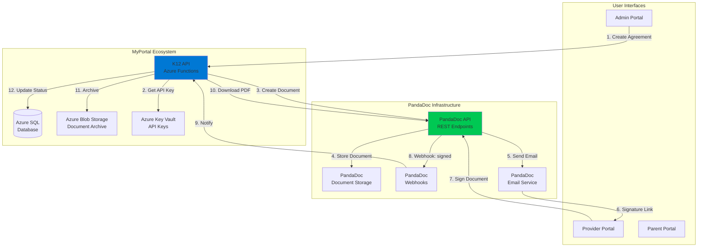
```mermaid
graph TB
    subgraph "MyPortal Ecosystem"
        API[K12 API<br/>Azure Functions]
        DB[(Azure SQL<br/>Database)]
        BLOB[Azure Blob Storage<br/>Document Archive]
        KV[Azure Key Vault<br/>API Keys]
    end

    subgraph "PandaDoc Infrastructure"
        PD_API[PandaDoc API<br/>REST Endpoints]
        PD_STORAGE[PandaDoc<br/>Document Storage]
        PD_WEBHOOK[PandaDoc<br/>Webhooks]
        PD_EMAIL[PandaDoc<br/>Email Service]
    end

    subgraph "User Interfaces"
        ADMIN[Admin Portal]
        PROVIDER[Provider Portal]
        PARENT[Parent Portal]
    end

    ADMIN -->|1. Create Agreement| API
    API -->|2. Get API Key| KV
    API -->|3. Create Document| PD_API
    PD_API -->|4. Store Document| PD_STORAGE
    PD_API -->|5. Send Email| PD_EMAIL
    PD_EMAIL -->|6. Signature Link| PROVIDER
    PROVIDER -->|7. Sign Document| PD_API
    PD_API -->|8. Webhook: signed| PD_WEBHOOK
    PD_WEBHOOK -->|9. Notify| API
    API -->|10. Download PDF| PD_API
    API -->|11. Archive| BLOB
    API -->|12. Update Status| DB

    style API fill:#0078d4
    style PD_API fill:#00c853
```

### Component Responsibilities

#### MyPortal API Layer
- **API/Functions/PandaDocFunctions.cs**: Azure Function HTTP triggers
- **Application/Services/PandaDocService.cs**: Business logic for document operations
- **Infrastructure/HttpClients/PandaDocClient.cs**: HTTP client with resilience policies
- **Domain/Entities/Document.cs**: Domain model for documents

#### PandaDoc API Layer
- **Base URL (Production)**: `https://api.pandadoc.com/public/v1`
- **Authentication**: API Key in `Authorization` header
- **Rate Limits**: 60 requests/minute per API key (burst: 100)

### Document Lifecycle

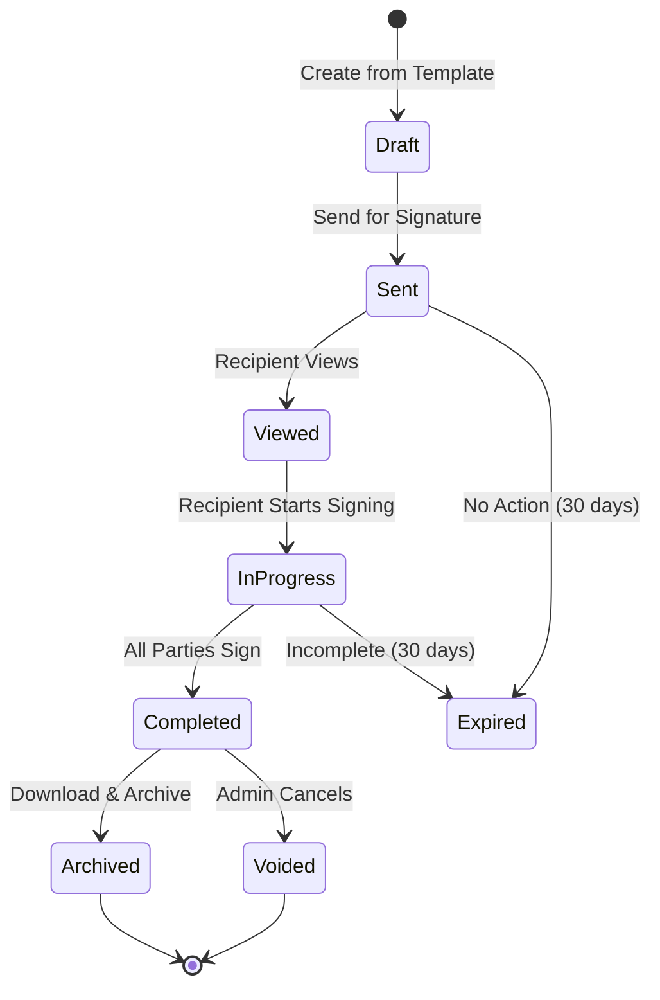
```mermaid
stateDiagram-v2
    [*] --> Draft: Create from Template
    Draft --> Sent: Send for Signature
    Sent --> Viewed: Recipient Views
    Viewed --> InProgress: Recipient Starts Signing
    InProgress --> Completed: All Parties Sign
    Sent --> Expired: No Action (30 days)
    InProgress --> Expired: Incomplete (30 days)
    Completed --> Archived: Download & Archive
    Archived --> [*]

    Completed --> Voided: Admin Cancels
    Voided --> [*]
```

### Data Synchronization Strategy

| Data Type | Sync Frequency | Cache Duration | Source of Truth |
|-----------|---------------|----------------|-----------------|
| Document Status | Webhook + 15-min poll | Real-time | PandaDoc |
| Template List | Daily batch | 24 hours | PandaDoc |
| Completed Documents | Immediate download | Permanent (Blob) | MyPortal |
| Audit Logs | On-demand | None | PandaDoc |

---

## API Specifications

### Authentication

PandaDoc uses **API Key authentication** with Bearer token.

#### API Key Configuration

```http
GET https://api.pandadoc.com/public/v1/documents
Authorization: API-Key {YOUR_API_KEY}
Content-Type: application/json
```

**Key Rotation:**
- Production key: Rotate every 90 days
- Sandbox key: Rotate every 180 days

### API Endpoints

#### 1. List Templates

**Endpoint:** `GET /public/v1/templates`

**Purpose:** Retrieve available document templates.

**Query Parameters:**
- `tag`: Filter by tag (e.g., `provider-agreement`, `enrollment-form`)
- `count`: Number of results (default: 50, max: 100)
- `page`: Page number

**Response (200 OK):**

```json
{
  "count": 15,
  "results": [
    {
      "id": "tmpl-provider-agreement-v3",
      "name": "Provider Agreement v3.0",
      "date_created": "2024-08-15T10:00:00Z",
      "date_modified": "2024-09-01T14:30:00Z",
      "version": "3.0",
      "tags": ["provider-agreement", "legal"],
      "fields": [
        {
          "name": "provider_name",
          "type": "text",
          "required": true
        },
        {
          "name": "provider_address",
          "type": "text",
          "required": true
        },
        {
          "name": "service_category",
          "type": "dropdown",
          "options": ["Tutoring", "Curriculum", "Therapy"],
          "required": true
        },
        {
          "name": "effective_date",
          "type": "date",
          "required": true
        }
      ]
    }
  ]
}
```

#### 2. Create Document from Template

**Endpoint:** `POST /public/v1/documents`

**Purpose:** Generate a new document from a template with merged data.

**Request:**

```json
{
  "name": "Provider Agreement - ABC Tutoring Services",
  "template_uuid": "tmpl-provider-agreement-v3",
  "folder_uuid": "fldr-providers-2024",
  "recipients": [
    {
      "email": "admin@myportal.nc.gov",
      "first_name": "System",
      "last_name": "Administrator",
      "role": "MyPortal Admin",
      "signing_order": 1
    },
    {
      "email": "owner@abctutoring.com",
      "first_name": "Jane",
      "last_name": "Smith",
      "role": "Provider Owner",
      "signing_order": 2
    }
  ],
  "fields": {
    "provider_name": {
      "value": "ABC Tutoring Services LLC"
    },
    "provider_tax_id": {
      "value": "XX-XXXXXXX"
    },
    "provider_address": {
      "value": "123 Main St, Raleigh, NC 27601"
    },
    "service_category": {
      "value": "Tutoring"
    },
    "effective_date": {
      "value": "2024-09-15"
    },
    "contract_term": {
      "value": "One Academic Year (2024-2025)"
    },
    "payment_terms": {
      "value": "Net 15 days after invoice approval"
    }
  },
  "tokens": [
    {
      "name": "provider_id",
      "value": "PRV-2024-000123"
    },
    {
      "name": "contract_id",
      "value": "CNTR-2024-000456"
    }
  ],
  "metadata": {
    "application_id": "APP-2024-001234",
    "provider_id": "PRV-2024-000123",
    "created_by": "admin@myportal.nc.gov",
    "environment": "production"
  },
  "tags": ["provider-agreement", "2024-2025"],
  "parse_form_fields": true
}
```

**Response (201 Created):**

```json
{
  "id": "doc-abc123def456ghi789",
  "name": "Provider Agreement - ABC Tutoring Services",
  "status": "document.draft",
  "date_created": "2024-11-15T14:30:00Z",
  "date_modified": "2024-11-15T14:30:00Z",
  "expiration_date": "2024-12-15T14:30:00Z",
  "version": 1,
  "uuid": "doc-abc123def456ghi789"
}
```

#### 3. Send Document for Signature

**Endpoint:** `POST /public/v1/documents/{document_id}/send`

**Purpose:** Send document to recipients for signature.

**Request:**

```json
{
  "message": "Please review and sign the Provider Agreement for the 2024-2025 academic year.",
  "subject": "Provider Agreement - Signature Required",
  "silent": false,
  "sender": {
    "email": "noreply@myportal.nc.gov",
    "first_name": "MyPortal",
    "last_name": "System"
  }
}
```

**Response (200 OK):**

```json
{
  "id": "doc-abc123def456ghi789",
  "status": "document.sent",
  "date_sent": "2024-11-15T14:35:00Z",
  "expiration_date": "2024-12-15T14:35:00Z"
}
```

#### 4. Get Document Status

**Endpoint:** `GET /public/v1/documents/{document_id}`

**Response (200 OK):**

```json
{
  "id": "doc-abc123def456ghi789",
  "name": "Provider Agreement - ABC Tutoring Services",
  "status": "document.completed",
  "date_created": "2024-11-15T14:30:00Z",
  "date_modified": "2024-11-17T10:15:00Z",
  "date_completed": "2024-11-17T10:15:00Z",
  "version": 1,
  "recipients": [
    {
      "email": "admin@myportal.nc.gov",
      "first_name": "System",
      "last_name": "Administrator",
      "role": "MyPortal Admin",
      "has_completed": true,
      "completed_at": "2024-11-16T09:00:00Z"
    },
    {
      "email": "owner@abctutoring.com",
      "first_name": "Jane",
      "last_name": "Smith",
      "role": "Provider Owner",
      "has_completed": true,
      "completed_at": "2024-11-17T10:15:00Z"
    }
  ],
  "metadata": {
    "provider_id": "PRV-2024-000123",
    "contract_id": "CNTR-2024-000456"
  }
}
```

**Status Values:**
- `document.draft`: Created, not sent
- `document.sent`: Sent to recipients
- `document.viewed`: At least one recipient viewed
- `document.waiting_approval`: Awaiting approval step
- `document.approved`: Approved, pending signatures
- `document.completed`: All parties signed
- `document.voided`: Cancelled by admin
- `document.declined`: Declined by recipient
- `document.expired`: Expiration date passed

#### 5. Download Completed Document

**Endpoint:** `GET /public/v1/documents/{document_id}/download`

**Purpose:** Download signed PDF document.

**Response (200 OK):**

```
Content-Type: application/pdf
Content-Disposition: attachment; filename="Provider_Agreement_ABC_Tutoring_signed.pdf"

[PDF Binary Data]
```

#### 6. Get Document Details

**Endpoint:** `GET /public/v1/documents/{document_id}/details`

**Purpose:** Get detailed information including field values and audit trail.

**Response (200 OK):**

```json
{
  "id": "doc-abc123def456ghi789",
  "name": "Provider Agreement - ABC Tutoring Services",
  "status": "document.completed",
  "fields": [
    {
      "name": "provider_name",
      "value": "ABC Tutoring Services LLC",
      "type": "text"
    },
    {
      "name": "service_category",
      "value": "Tutoring",
      "type": "dropdown"
    }
  ],
  "audit_trail": [
    {
      "event": "document_created",
      "timestamp": "2024-11-15T14:30:00Z",
      "user": "admin@myportal.nc.gov"
    },
    {
      "event": "document_sent",
      "timestamp": "2024-11-15T14:35:00Z",
      "user": "system"
    },
    {
      "event": "document_viewed",
      "timestamp": "2024-11-16T08:45:00Z",
      "user": "admin@myportal.nc.gov",
      "ip_address": "192.168.1.100"
    },
    {
      "event": "document_signed",
      "timestamp": "2024-11-16T09:00:00Z",
      "user": "admin@myportal.nc.gov",
      "ip_address": "192.168.1.100"
    },
    {
      "event": "document_viewed",
      "timestamp": "2024-11-17T09:30:00Z",
      "user": "owner@abctutoring.com",
      "ip_address": "72.45.123.89"
    },
    {
      "event": "document_signed",
      "timestamp": "2024-11-17T10:15:00Z",
      "user": "owner@abctutoring.com",
      "ip_address": "72.45.123.89"
    },
    {
      "event": "document_completed",
      "timestamp": "2024-11-17T10:15:00Z",
      "user": "system"
    }
  ]
}
```

#### 7. Void Document

**Endpoint:** `POST /public/v1/documents/{document_id}/void`

**Purpose:** Cancel a document and void all signatures.

**Request:**

```json
{
  "reason": "Contract terms changed, new version required"
}
```

**Response (200 OK):**

```json
{
  "id": "doc-abc123def456ghi789",
  "status": "document.voided",
  "date_voided": "2024-11-15T15:00:00Z"
}
```

### Webhook Notifications

PandaDoc sends **webhook notifications** for document events.

#### Webhook Configuration

**MyPortal Webhook Endpoint:** `https://k12-api.myportal.nc.gov/api/webhooks/pandadoc`

**Authentication:** Shared secret in `X-PandaDoc-Signature` header (HMAC-SHA256)

**Events:**
- `document_state_changed`: Status changed (sent, viewed, completed, etc.)
- `recipient_completed`: Individual recipient completed signing
- `document_completed`: All signatures collected
- `document_voided`: Document cancelled

#### Webhook Payload Example

```json
{
  "uuid": "webhook-event-123456",
  "event": "document_state_changed",
  "data": {
    "id": "doc-abc123def456ghi789",
    "status": "document.completed",
    "name": "Provider Agreement - ABC Tutoring Services",
    "date_completed": "2024-11-17T10:15:00Z",
    "metadata": {
      "provider_id": "PRV-2024-000123",
      "contract_id": "CNTR-2024-000456"
    }
  },
  "timestamp": "2024-11-17T10:15:05Z"
}
```

#### Webhook Signature Verification

```csharp
public static bool VerifyWebhookSignature(string payload, string signature, string secret)
{
    using var hmac = new HMACSHA256(Encoding.UTF8.GetBytes(secret));
    var hash = hmac.ComputeHash(Encoding.UTF8.GetBytes(payload));
    var expectedSignature = Convert.ToBase64String(hash);

    return signature.Equals(expectedSignature, StringComparison.Ordinal);
}
```

---

## Data Flow

### 1. Provider Agreement Creation Flow

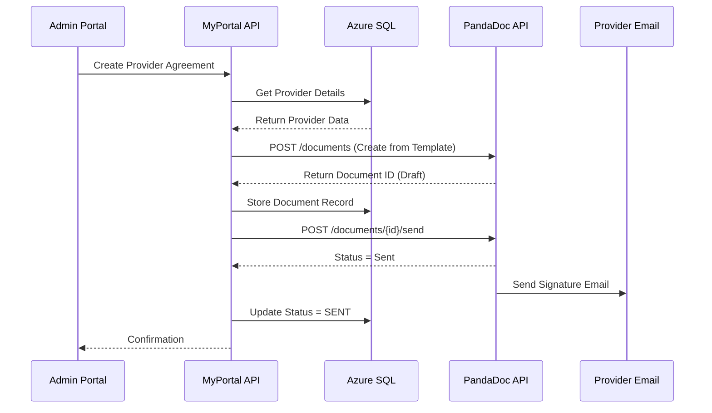
```mermaid
sequenceDiagram
    participant Admin as Admin Portal
    participant API as MyPortal API
    participant DB as Azure SQL
    participant PD as PandaDoc API
    participant Provider as Provider Email

    Admin->>API: Create Provider Agreement
    API->>DB: Get Provider Details
    DB-->>API: Return Provider Data
    API->>PD: POST /documents (Create from Template)
    PD-->>API: Return Document ID (Draft)
    API->>DB: Store Document Record
    API->>PD: POST /documents/{id}/send
    PD-->>API: Status = Sent
    PD->>Provider: Send Signature Email
    API->>DB: Update Status = SENT
    API-->>Admin: Confirmation
```

### 2. E-Signature Collection Flow

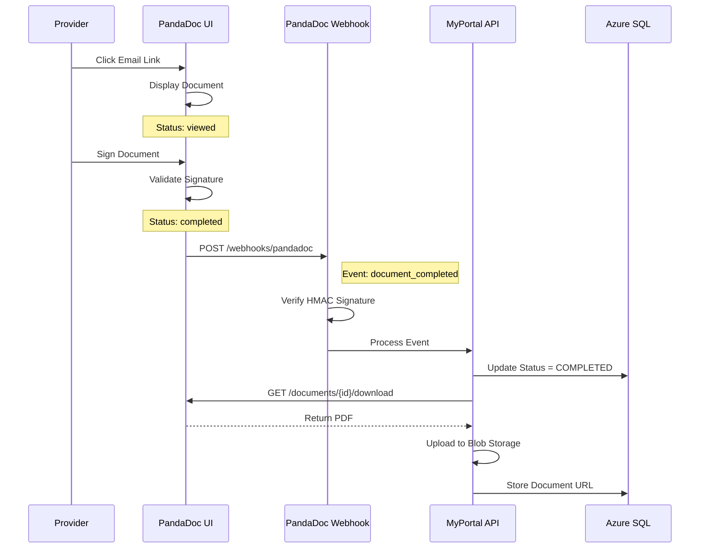
```mermaid
sequenceDiagram
    participant Provider as Provider
    participant PD as PandaDoc UI
    participant Webhook as PandaDoc Webhook
    participant API as MyPortal API
    participant DB as Azure SQL

    Provider->>PD: Click Email Link
    PD->>PD: Display Document
    Note over PD: Status: viewed

    Provider->>PD: Sign Document
    PD->>PD: Validate Signature
    Note over PD: Status: completed

    PD->>Webhook: POST /webhooks/pandadoc
    Note right of Webhook: Event: document_completed
    Webhook->>Webhook: Verify HMAC Signature
    Webhook->>API: Process Event
    API->>DB: Update Status = COMPLETED
    API->>PD: GET /documents/{id}/download
    PD-->>API: Return PDF
    API->>API: Upload to Blob Storage
    API->>DB: Store Document URL
```

### 3. Document Download and Archive Flow

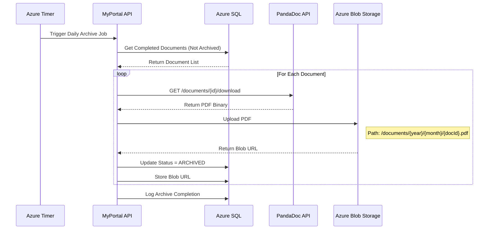
```mermaid
sequenceDiagram
    participant Scheduler as Azure Timer
    participant API as MyPortal API
    participant DB as Azure SQL
    participant PD as PandaDoc API
    participant Blob as Azure Blob Storage

    Scheduler->>API: Trigger Daily Archive Job
    API->>DB: Get Completed Documents (Not Archived)
    DB-->>API: Return Document List

    loop For Each Document
        API->>PD: GET /documents/{id}/download
        PD-->>API: Return PDF Binary
        API->>Blob: Upload PDF
        Note right of Blob: Path: /documents/{year}/{month}/{docId}.pdf
        Blob-->>API: Return Blob URL
        API->>DB: Update Status = ARCHIVED
        API->>DB: Store Blob URL
    end

    API->>DB: Log Archive Completion
```

### 4. Enrollment Form Multi-Party Signature Flow

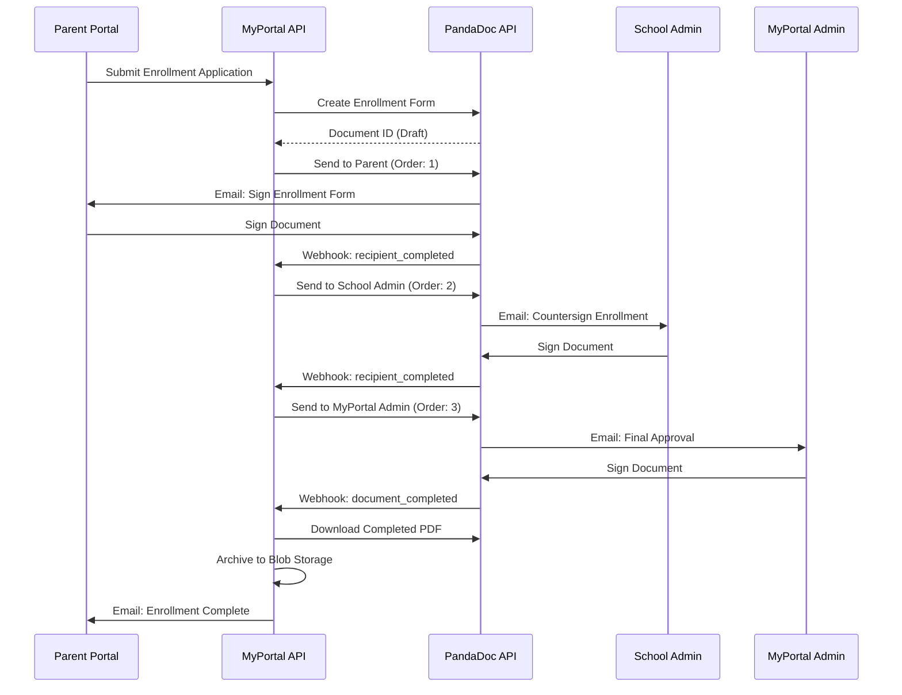
```mermaid
sequenceDiagram
    participant Parent as Parent Portal
    participant API as MyPortal API
    participant PD as PandaDoc API
    participant School as School Admin
    participant Admin as MyPortal Admin

    Parent->>API: Submit Enrollment Application
    API->>PD: Create Enrollment Form
    PD-->>API: Document ID (Draft)

    API->>PD: Send to Parent (Order: 1)
    PD->>Parent: Email: Sign Enrollment Form
    Parent->>PD: Sign Document
    PD->>API: Webhook: recipient_completed

    API->>PD: Send to School Admin (Order: 2)
    PD->>School: Email: Countersign Enrollment
    School->>PD: Sign Document
    PD->>API: Webhook: recipient_completed

    API->>PD: Send to MyPortal Admin (Order: 3)
    PD->>Admin: Email: Final Approval
    Admin->>PD: Sign Document
    PD->>API: Webhook: document_completed

    API->>PD: Download Completed PDF
    API->>API: Archive to Blob Storage
    API->>Parent: Email: Enrollment Complete
```

---

## Implementation

### C# Implementation with Azure Functions

#### 1. PandaDoc HTTP Client Configuration

**File:** `Infrastructure/HttpClients/PandaDocClient.cs`

```csharp
using System;
using System.IO;
using System.Net.Http;
using System.Net.Http.Headers;
using System.Text;
using System.Text.Json;
using System.Threading.Tasks;
using Microsoft.Extensions.Configuration;
using Microsoft.Extensions.Logging;
using Polly;
using Polly.CircuitBreaker;
using Polly.Retry;

namespace K12.Infrastructure.HttpClients
{
    public class PandaDocClient : IPandaDocClient
    {
        private readonly HttpClient _httpClient;
        private readonly IConfiguration _configuration;
        private readonly ILogger<PandaDocClient> _logger;
        private readonly AsyncRetryPolicy<HttpResponseMessage> _retryPolicy;
        private readonly AsyncCircuitBreakerPolicy<HttpResponseMessage> _circuitBreakerPolicy;

        public PandaDocClient(
            HttpClient httpClient,
            IConfiguration configuration,
            ILogger<PandaDocClient> logger)
        {
            _httpClient = httpClient;
            _configuration = configuration;
            _logger = logger;

            var baseUrl = _configuration["PandaDoc:BaseUrl"];
            var apiKey = _configuration["PandaDoc:ApiKey"];

            _httpClient.BaseAddress = new Uri(baseUrl);
            _httpClient.DefaultRequestHeaders.Add("Authorization", $"API-Key {apiKey}");
            _httpClient.DefaultRequestHeaders.Accept.Add(
                new MediaTypeWithQualityHeaderValue("application/json"));

            _retryPolicy = BuildRetryPolicy();
            _circuitBreakerPolicy = BuildCircuitBreakerPolicy();
        }

        private AsyncRetryPolicy<HttpResponseMessage> BuildRetryPolicy()
        {
            return Policy
                .HandleResult<HttpResponseMessage>(r =>
                    (int)r.StatusCode >= 500 ||
                    r.StatusCode == System.Net.HttpStatusCode.RequestTimeout ||
                    r.StatusCode == System.Net.HttpStatusCode.TooManyRequests)
                .WaitAndRetryAsync(
                    retryCount: 3,
                    sleepDurationProvider: retryAttempt =>
                        TimeSpan.FromSeconds(Math.Pow(2, retryAttempt)),
                    onRetry: (outcome, timespan, retryCount, context) =>
                    {
                        _logger.LogWarning(
                            "PandaDoc API retry {RetryCount} after {Delay}ms",
                            retryCount,
                            timespan.TotalMilliseconds);
                    });
        }

        private AsyncCircuitBreakerPolicy<HttpResponseMessage> BuildCircuitBreakerPolicy()
        {
            return Policy
                .HandleResult<HttpResponseMessage>(r => (int)r.StatusCode >= 500)
                .CircuitBreakerAsync(
                    handledEventsAllowedBeforeBreaking: 5,
                    durationOfBreak: TimeSpan.FromMinutes(1),
                    onBreak: (outcome, duration) =>
                    {
                        _logger.LogError("PandaDoc circuit breaker opened");
                    },
                    onReset: () =>
                    {
                        _logger.LogInformation("PandaDoc circuit breaker reset");
                    });
        }

        /// <summary>
        /// List available templates
        /// </summary>
        public async Task<TemplateListResponse> ListTemplatesAsync(string tag = null)
        {
            var url = "/public/v1/templates";
            if (!string.IsNullOrEmpty(tag))
                url += $"?tag={tag}";

            var policy = Policy.WrapAsync(_retryPolicy, _circuitBreakerPolicy);

            var response = await policy.ExecuteAsync(async () =>
                await _httpClient.GetAsync(url));

            response.EnsureSuccessStatusCode();

            return await JsonSerializer.DeserializeAsync<TemplateListResponse>(
                await response.Content.ReadAsStreamAsync());
        }

        /// <summary>
        /// Create document from template
        /// </summary>
        public async Task<CreateDocumentResponse> CreateDocumentAsync(CreateDocumentRequest request)
        {
            var content = new StringContent(
                JsonSerializer.Serialize(request),
                Encoding.UTF8,
                "application/json");

            var policy = Policy.WrapAsync(_retryPolicy, _circuitBreakerPolicy);

            var response = await policy.ExecuteAsync(async () =>
                await _httpClient.PostAsync("/public/v1/documents", content));

            if (!response.IsSuccessStatusCode)
            {
                var errorContent = await response.Content.ReadAsStringAsync();
                _logger.LogError(
                    "PandaDoc CreateDocument failed: {StatusCode} - {Error}",
                    response.StatusCode,
                    errorContent);
            }

            response.EnsureSuccessStatusCode();

            return await JsonSerializer.DeserializeAsync<CreateDocumentResponse>(
                await response.Content.ReadAsStreamAsync());
        }

        /// <summary>
        /// Send document for signature
        /// </summary>
        public async Task<SendDocumentResponse> SendDocumentAsync(
            string documentId,
            SendDocumentRequest request)
        {
            var content = new StringContent(
                JsonSerializer.Serialize(request),
                Encoding.UTF8,
                "application/json");

            var policy = Policy.WrapAsync(_retryPolicy, _circuitBreakerPolicy);

            var response = await policy.ExecuteAsync(async () =>
                await _httpClient.PostAsync(
                    $"/public/v1/documents/{documentId}/send",
                    content));

            response.EnsureSuccessStatusCode();

            return await JsonSerializer.DeserializeAsync<SendDocumentResponse>(
                await response.Content.ReadAsStreamAsync());
        }

        /// <summary>
        /// Get document status
        /// </summary>
        public async Task<DocumentStatusResponse> GetDocumentStatusAsync(string documentId)
        {
            var policy = Policy.WrapAsync(_retryPolicy, _circuitBreakerPolicy);

            var response = await policy.ExecuteAsync(async () =>
                await _httpClient.GetAsync($"/public/v1/documents/{documentId}"));

            response.EnsureSuccessStatusCode();

            return await JsonSerializer.DeserializeAsync<DocumentStatusResponse>(
                await response.Content.ReadAsStreamAsync());
        }

        /// <summary>
        /// Get document details including field values and audit trail
        /// </summary>
        public async Task<DocumentDetailsResponse> GetDocumentDetailsAsync(string documentId)
        {
            var policy = Policy.WrapAsync(_retryPolicy, _circuitBreakerPolicy);

            var response = await policy.ExecuteAsync(async () =>
                await _httpClient.GetAsync($"/public/v1/documents/{documentId}/details"));

            response.EnsureSuccessStatusCode();

            return await JsonSerializer.DeserializeAsync<DocumentDetailsResponse>(
                await response.Content.ReadAsStreamAsync());
        }

        /// <summary>
        /// Download completed document as PDF
        /// </summary>
        public async Task<byte[]> DownloadDocumentAsync(string documentId)
        {
            var policy = Policy.WrapAsync(_retryPolicy, _circuitBreakerPolicy);

            var response = await policy.ExecuteAsync(async () =>
                await _httpClient.GetAsync($"/public/v1/documents/{documentId}/download"));

            response.EnsureSuccessStatusCode();

            return await response.Content.ReadAsByteArrayAsync();
        }

        /// <summary>
        /// Void document
        /// </summary>
        public async Task<VoidDocumentResponse> VoidDocumentAsync(
            string documentId,
            string reason)
        {
            var request = new { reason };
            var content = new StringContent(
                JsonSerializer.Serialize(request),
                Encoding.UTF8,
                "application/json");

            var policy = Policy.WrapAsync(_retryPolicy, _circuitBreakerPolicy);

            var response = await policy.ExecuteAsync(async () =>
                await _httpClient.PostAsync(
                    $"/public/v1/documents/{documentId}/void",
                    content));

            response.EnsureSuccessStatusCode();

            return await JsonSerializer.DeserializeAsync<VoidDocumentResponse>(
                await response.Content.ReadAsStreamAsync());
        }
    }

    // DTOs

    public class CreateDocumentRequest
    {
        [JsonPropertyName("name")]
        public string Name { get; set; }

        [JsonPropertyName("template_uuid")]
        public string TemplateUuid { get; set; }

        [JsonPropertyName("folder_uuid")]
        public string FolderUuid { get; set; }

        [JsonPropertyName("recipients")]
        public List<Recipient> Recipients { get; set; }

        [JsonPropertyName("fields")]
        public Dictionary<string, FieldValue> Fields { get; set; }

        [JsonPropertyName("tokens")]
        public List<Token> Tokens { get; set; }

        [JsonPropertyName("metadata")]
        public Dictionary<string, string> Metadata { get; set; }

        [JsonPropertyName("tags")]
        public List<string> Tags { get; set; }

        [JsonPropertyName("parse_form_fields")]
        public bool ParseFormFields { get; set; } = true;
    }

    public class Recipient
    {
        [JsonPropertyName("email")]
        public string Email { get; set; }

        [JsonPropertyName("first_name")]
        public string FirstName { get; set; }

        [JsonPropertyName("last_name")]
        public string LastName { get; set; }

        [JsonPropertyName("role")]
        public string Role { get; set; }

        [JsonPropertyName("signing_order")]
        public int SigningOrder { get; set; }
    }

    public class FieldValue
    {
        [JsonPropertyName("value")]
        public string Value { get; set; }
    }

    public class Token
    {
        [JsonPropertyName("name")]
        public string Name { get; set; }

        [JsonPropertyName("value")]
        public string Value { get; set; }
    }

    public class CreateDocumentResponse
    {
        [JsonPropertyName("id")]
        public string Id { get; set; }

        [JsonPropertyName("name")]
        public string Name { get; set; }

        [JsonPropertyName("status")]
        public string Status { get; set; }

        [JsonPropertyName("date_created")]
        public DateTime DateCreated { get; set; }

        [JsonPropertyName("uuid")]
        public string Uuid { get; set; }
    }

    public class SendDocumentRequest
    {
        [JsonPropertyName("message")]
        public string Message { get; set; }

        [JsonPropertyName("subject")]
        public string Subject { get; set; }

        [JsonPropertyName("silent")]
        public bool Silent { get; set; }

        [JsonPropertyName("sender")]
        public Sender Sender { get; set; }
    }

    public class Sender
    {
        [JsonPropertyName("email")]
        public string Email { get; set; }

        [JsonPropertyName("first_name")]
        public string FirstName { get; set; }

        [JsonPropertyName("last_name")]
        public string LastName { get; set; }
    }

    public class SendDocumentResponse
    {
        [JsonPropertyName("id")]
        public string Id { get; set; }

        [JsonPropertyName("status")]
        public string Status { get; set; }

        [JsonPropertyName("date_sent")]
        public DateTime DateSent { get; set; }
    }

    public class DocumentStatusResponse
    {
        [JsonPropertyName("id")]
        public string Id { get; set; }

        [JsonPropertyName("name")]
        public string Name { get; set; }

        [JsonPropertyName("status")]
        public string Status { get; set; }

        [JsonPropertyName("date_created")]
        public DateTime DateCreated { get; set; }

        [JsonPropertyName("date_modified")]
        public DateTime DateModified { get; set; }

        [JsonPropertyName("date_completed")]
        public DateTime? DateCompleted { get; set; }

        [JsonPropertyName("recipients")]
        public List<RecipientStatus> Recipients { get; set; }

        [JsonPropertyName("metadata")]
        public Dictionary<string, string> Metadata { get; set; }
    }

    public class RecipientStatus
    {
        [JsonPropertyName("email")]
        public string Email { get; set; }

        [JsonPropertyName("first_name")]
        public string FirstName { get; set; }

        [JsonPropertyName("last_name")]
        public string LastName { get; set; }

        [JsonPropertyName("role")]
        public string Role { get; set; }

        [JsonPropertyName("has_completed")]
        public bool HasCompleted { get; set; }

        [JsonPropertyName("completed_at")]
        public DateTime? CompletedAt { get; set; }
    }
}
```

#### 2. Application Service Layer

**File:** `Application/Services/PandaDocService.cs`

```csharp
using System;
using System.Threading.Tasks;
using Azure.Storage.Blobs;
using K12.Domain.Entities;
using K12.Domain.Repositories;
using K12.Infrastructure.HttpClients;
using Microsoft.Extensions.Configuration;
using Microsoft.Extensions.Logging;

namespace K12.Application.Services
{
    public class PandaDocService : IPandaDocService
    {
        private readonly IPandaDocClient _pandaDocClient;
        private readonly IDocumentRepository _documentRepository;
        private readonly IProviderRepository _providerRepository;
        private readonly BlobServiceClient _blobServiceClient;
        private readonly IConfiguration _configuration;
        private readonly ILogger<PandaDocService> _logger;

        public PandaDocService(
            IPandaDocClient pandaDocClient,
            IDocumentRepository documentRepository,
            IProviderRepository providerRepository,
            BlobServiceClient blobServiceClient,
            IConfiguration configuration,
            ILogger<PandaDocService> logger)
        {
            _pandaDocClient = pandaDocClient;
            _documentRepository = documentRepository;
            _providerRepository = providerRepository;
            _blobServiceClient = blobServiceClient;
            _configuration = configuration;
            _logger = logger;
        }

        /// <summary>
        /// Create provider agreement from template
        /// </summary>
        public async Task<Document> CreateProviderAgreementAsync(int providerId)
        {
            var provider = await _providerRepository.GetByIdAsync(providerId);

            if (provider == null)
                throw new InvalidOperationException($"Provider {providerId} not found");

            _logger.LogInformation(
                "Creating provider agreement for Provider {ProviderId}",
                providerId);

            var templateId = _configuration["PandaDoc:Templates:ProviderAgreement"];

            var request = new CreateDocumentRequest
            {
                Name = $"Provider Agreement - {provider.OrganizationName}",
                TemplateUuid = templateId,
                FolderUuid = _configuration["PandaDoc:Folders:Providers"],
                Recipients = new List<Recipient>
                {
                    new Recipient
                    {
                        Email = "admin@myportal.nc.gov",
                        FirstName = "System",
                        LastName = "Administrator",
                        Role = "MyPortal Admin",
                        SigningOrder = 1
                    },
                    new Recipient
                    {
                        Email = provider.PrimaryContact.Email,
                        FirstName = provider.PrimaryContact.FirstName,
                        LastName = provider.PrimaryContact.LastName,
                        Role = "Provider Owner",
                        SigningOrder = 2
                    }
                },
                Fields = new Dictionary<string, FieldValue>
                {
                    ["provider_name"] = new FieldValue { Value = provider.OrganizationName },
                    ["provider_tax_id"] = new FieldValue { Value = provider.TaxId },
                    ["provider_address"] = new FieldValue { Value = provider.Address.ToFullAddress() },
                    ["service_category"] = new FieldValue { Value = provider.ServiceCategory },
                    ["effective_date"] = new FieldValue { Value = DateTime.UtcNow.ToString("yyyy-MM-dd") },
                    ["contract_term"] = new FieldValue { Value = "One Academic Year" }
                },
                Metadata = new Dictionary<string, string>
                {
                    ["provider_id"] = provider.ProviderId.ToString(),
                    ["document_type"] = "provider_agreement",
                    ["created_by"] = "system"
                },
                Tags = new List<string> { "provider-agreement", "2024-2025" }
            };

            try
            {
                var response = await _pandaDocClient.CreateDocumentAsync(request);

                // Store document record in database
                var document = new Document
                {
                    DocumentType = DocumentType.ProviderAgreement,
                    ProviderId = providerId,
                    PandaDocDocumentId = response.Id,
                    DocumentName = response.Name,
                    Status = DocumentStatus.Draft,
                    CreatedAt = response.DateCreated,
                    CreatedBy = "system"
                };

                await _documentRepository.CreateAsync(document);

                _logger.LogInformation(
                    "Created PandaDoc document {DocumentId} for Provider {ProviderId}",
                    response.Id,
                    providerId);

                return document;
            }
            catch (Exception ex)
            {
                _logger.LogError(
                    ex,
                    "Failed to create provider agreement for Provider {ProviderId}",
                    providerId);
                throw;
            }
        }

        /// <summary>
        /// Send document for signature
        /// </summary>
        public async Task SendDocumentAsync(int documentId)
        {
            var document = await _documentRepository.GetByIdAsync(documentId);

            if (document == null)
                throw new InvalidOperationException($"Document {documentId} not found");

            if (document.Status != DocumentStatus.Draft)
                throw new InvalidOperationException($"Document {documentId} is not in draft status");

            _logger.LogInformation("Sending document {DocumentId} for signature", documentId);

            var request = new SendDocumentRequest
            {
                Subject = $"{document.DocumentName} - Signature Required",
                Message = "Please review and sign this document at your earliest convenience.",
                Silent = false,
                Sender = new Sender
                {
                    Email = "noreply@myportal.nc.gov",
                    FirstName = "MyPortal",
                    LastName = "System"
                }
            };

            try
            {
                var response = await _pandaDocClient.SendDocumentAsync(
                    document.PandaDocDocumentId,
                    request);

                document.Status = DocumentStatus.Sent;
                document.SentAt = response.DateSent;
                await _documentRepository.UpdateAsync(document);

                _logger.LogInformation(
                    "Sent document {DocumentId} for signature",
                    documentId);
            }
            catch (Exception ex)
            {
                _logger.LogError(ex, "Failed to send document {DocumentId}", documentId);
                throw;
            }
        }

        /// <summary>
        /// Download and archive completed document
        /// </summary>
        public async Task ArchiveCompletedDocumentAsync(int documentId)
        {
            var document = await _documentRepository.GetByIdAsync(documentId);

            if (document == null)
                throw new InvalidOperationException($"Document {documentId} not found");

            if (document.Status != DocumentStatus.Completed)
                throw new InvalidOperationException($"Document {documentId} is not completed");

            _logger.LogInformation("Archiving completed document {DocumentId}", documentId);

            try
            {
                // Download PDF from PandaDoc
                var pdfBytes = await _pandaDocClient.DownloadDocumentAsync(
                    document.PandaDocDocumentId);

                // Upload to Azure Blob Storage
                var containerClient = _blobServiceClient.GetBlobContainerClient("documents");
                await containerClient.CreateIfNotExistsAsync();

                var blobName = $"{DateTime.UtcNow:yyyy}/{DateTime.UtcNow:MM}/{document.PandaDocDocumentId}.pdf";
                var blobClient = containerClient.GetBlobClient(blobName);

                using var stream = new MemoryStream(pdfBytes);
                await blobClient.UploadAsync(stream, overwrite: true);

                // Update document record
                document.Status = DocumentStatus.Archived;
                document.ArchivedAt = DateTime.UtcNow;
                document.BlobUrl = blobClient.Uri.ToString();
                document.FileSize = pdfBytes.Length;

                await _documentRepository.UpdateAsync(document);

                _logger.LogInformation(
                    "Archived document {DocumentId} to {BlobUrl}",
                    documentId,
                    document.BlobUrl);
            }
            catch (Exception ex)
            {
                _logger.LogError(ex, "Failed to archive document {DocumentId}", documentId);
                throw;
            }
        }

        /// <summary>
        /// Sync document status from PandaDoc
        /// </summary>
        public async Task SyncDocumentStatusAsync(int documentId)
        {
            var document = await _documentRepository.GetByIdAsync(documentId);

            if (document == null)
                throw new InvalidOperationException($"Document {documentId} not found");

            var status = await _pandaDocClient.GetDocumentStatusAsync(
                document.PandaDocDocumentId);

            var mappedStatus = MapPandaDocStatus(status.Status);

            if (document.Status != mappedStatus)
            {
                document.Status = mappedStatus;
                document.LastModifiedAt = status.DateModified;

                if (mappedStatus == DocumentStatus.Completed && status.DateCompleted.HasValue)
                {
                    document.CompletedAt = status.DateCompleted.Value;
                }

                await _documentRepository.UpdateAsync(document);

                _logger.LogInformation(
                    "Updated document {DocumentId} status: {OldStatus} -> {NewStatus}",
                    documentId,
                    document.Status,
                    mappedStatus);
            }
        }

        private DocumentStatus MapPandaDocStatus(string pandaDocStatus)
        {
            return pandaDocStatus switch
            {
                "document.draft" => DocumentStatus.Draft,
                "document.sent" => DocumentStatus.Sent,
                "document.viewed" => DocumentStatus.Viewed,
                "document.completed" => DocumentStatus.Completed,
                "document.voided" => DocumentStatus.Voided,
                "document.declined" => DocumentStatus.Declined,
                "document.expired" => DocumentStatus.Expired,
                _ => DocumentStatus.Unknown
            };
        }
    }
}
```

#### 3. Azure Function HTTP Triggers

**File:** `API/Functions/PandaDocFunctions.cs`

```csharp
using System;
using System.IO;
using System.Net;
using System.Security.Cryptography;
using System.Text;
using System.Text.Json;
using System.Threading.Tasks;
using K12.Application.Services;
using Microsoft.Azure.Functions.Worker;
using Microsoft.Azure.Functions.Worker.Http;
using Microsoft.Extensions.Configuration;
using Microsoft.Extensions.Logging;

namespace K12.API.Functions
{
    public class PandaDocFunctions
    {
        private readonly IPandaDocService _pandaDocService;
        private readonly IConfiguration _configuration;
        private readonly ILogger<PandaDocFunctions> _logger;

        public PandaDocFunctions(
            IPandaDocService pandaDocService,
            IConfiguration configuration,
            ILogger<PandaDocFunctions> logger)
        {
            _pandaDocService = pandaDocService;
            _configuration = configuration;
            _logger = logger;
        }

        /// <summary>
        /// Create provider agreement
        /// POST /api/pandadoc/provider-agreements/{providerId}
        /// </summary>
        [Function("CreateProviderAgreement")]
        public async Task<HttpResponseData> CreateProviderAgreement(
            [HttpTrigger(AuthorizationLevel.Function, "post",
                Route = "pandadoc/provider-agreements/{providerId}")]
            HttpRequestData req,
            int providerId)
        {
            try
            {
                var document = await _pandaDocService.CreateProviderAgreementAsync(providerId);

                var response = req.CreateResponse(HttpStatusCode.Created);
                await response.WriteAsJsonAsync(document);
                return response;
            }
            catch (Exception ex)
            {
                _logger.LogError(ex, "Error creating provider agreement");
                var response = req.CreateResponse(HttpStatusCode.InternalServerError);
                await response.WriteAsJsonAsync(new { error = ex.Message });
                return response;
            }
        }

        /// <summary>
        /// Webhook endpoint for PandaDoc notifications
        /// POST /api/webhooks/pandadoc
        /// </summary>
        [Function("PandaDocWebhook")]
        public async Task<HttpResponseData> PandaDocWebhook(
            [HttpTrigger(AuthorizationLevel.Function, "post",
                Route = "webhooks/pandadoc")]
            HttpRequestData req)
        {
            try
            {
                // Read request body
                using var reader = new StreamReader(req.Body);
                var payload = await reader.ReadToEndAsync();

                // Verify HMAC signature
                var signature = req.Headers.GetValues("X-PandaDoc-Signature").FirstOrDefault();
                var webhookSecret = _configuration["PandaDoc:WebhookSecret"];

                if (!VerifySignature(payload, signature, webhookSecret))
                {
                    _logger.LogWarning("Invalid PandaDoc webhook signature");
                    return req.CreateResponse(HttpStatusCode.Unauthorized);
                }

                // Parse webhook payload
                var webhookEvent = JsonSerializer.Deserialize<PandaDocWebhookEvent>(payload);

                _logger.LogInformation(
                    "Received PandaDoc webhook: {Event}, Document: {DocumentId}",
                    webhookEvent.Event,
                    webhookEvent.Data.Id);

                // Process event based on type
                await ProcessWebhookEventAsync(webhookEvent);

                return req.CreateResponse(HttpStatusCode.OK);
            }
            catch (Exception ex)
            {
                _logger.LogError(ex, "Error processing PandaDoc webhook");
                return req.CreateResponse(HttpStatusCode.InternalServerError);
            }
        }

        /// <summary>
        /// Timer trigger: Archive completed documents daily
        /// </summary>
        [Function("ArchiveCompletedDocuments")]
        public async Task ArchiveCompletedDocuments(
            [TimerTrigger("0 0 3 * * *")] TimerInfo timer,
            FunctionContext context)
        {
            var logger = context.GetLogger("ArchiveCompletedDocuments");
            logger.LogInformation("Starting daily document archive job");

            // Implementation: Query completed documents and archive
        }

        private bool VerifySignature(string payload, string signature, string secret)
        {
            using var hmac = new HMACSHA256(Encoding.UTF8.GetBytes(secret));
            var hash = hmac.ComputeHash(Encoding.UTF8.GetBytes(payload));
            var expectedSignature = Convert.ToBase64String(hash);

            return signature.Equals(expectedSignature, StringComparison.Ordinal);
        }

        private async Task ProcessWebhookEventAsync(PandaDocWebhookEvent webhookEvent)
        {
            // Implementation based on event type
            switch (webhookEvent.Event)
            {
                case "document_state_changed":
                    if (webhookEvent.Data.Status == "document.completed")
                    {
                        // Trigger archive process
                        var documentId = await GetDocumentIdByPandaDocIdAsync(webhookEvent.Data.Id);
                        await _pandaDocService.ArchiveCompletedDocumentAsync(documentId);
                    }
                    break;

                case "recipient_completed":
                    // Log recipient completion
                    _logger.LogInformation("Recipient completed signing");
                    break;
            }
        }

        private async Task<int> GetDocumentIdByPandaDocIdAsync(string pandaDocId)
        {
            // Query database for document ID
            return 0; // Placeholder
        }
    }

    public class PandaDocWebhookEvent
    {
        [JsonPropertyName("event")]
        public string Event { get; set; }

        [JsonPropertyName("data")]
        public WebhookData Data { get; set; }
    }

    public class WebhookData
    {
        [JsonPropertyName("id")]
        public string Id { get; set; }

        [JsonPropertyName("status")]
        public string Status { get; set; }

        [JsonPropertyName("name")]
        public string Name { get; set; }
    }
}
```

---

## Error Handling

### Retry Policies

Same Polly-based approach as ClassWallet integration:

- **Exponential backoff**: 3 retries with 2s, 4s, 8s delays
- **Circuit breaker**: Open after 5 consecutive failures, 1-minute break
- **Timeout**: 30 seconds per request

### Common Error Scenarios

#### 1. Template Not Found

```csharp
catch (HttpRequestException ex) when (ex.StatusCode == HttpStatusCode.NotFound)
{
    _logger.LogError("PandaDoc template not found: {TemplateId}", templateId);
    throw new TemplateNotFoundException($"Template {templateId} not found in PandaDoc");
}
```

#### 2. Invalid Field Values

```csharp
catch (HttpRequestException ex) when (ex.StatusCode == HttpStatusCode.BadRequest)
{
    var errorResponse = await ParseErrorResponseAsync(ex);

    if (errorResponse.Type == "VALIDATION_ERROR")
    {
        throw new DocumentValidationException(
            $"Invalid field values: {string.Join(", ", errorResponse.InvalidFields)}");
    }
}
```

#### 3. Document Already Sent

```csharp
public async Task SendDocumentWithIdempotencyAsync(int documentId)
{
    var document = await _documentRepository.GetByIdAsync(documentId);

    if (document.Status == DocumentStatus.Sent ||
        document.Status == DocumentStatus.Completed)
    {
        _logger.LogWarning(
            "Document {DocumentId} already sent, skipping",
            documentId);
        return;
    }

    await _pandaDocClient.SendDocumentAsync(document.PandaDocDocumentId, request);
}
```

---

## Security

### API Key Management

- **Azure Key Vault**: Store API keys with 90-day rotation
- **RBAC**: Restrict access to PandaDoc functions to admin roles
- **Audit Logging**: Log all document creation and signature events

### Document Access Control

```csharp
public async Task<bool> CanUserAccessDocumentAsync(string userId, int documentId)
{
    var document = await _documentRepository.GetByIdAsync(documentId);

    // Check if user is admin
    if (await _authService.IsUserInRoleAsync(userId, "Admin"))
        return true;

    // Check if user is associated with provider/school
    if (document.ProviderId.HasValue)
    {
        var provider = await _providerRepository.GetByIdAsync(document.ProviderId.Value);
        return provider.ContactUserId == userId;
    }

    return false;
}
```

### PII Protection

- **Redact sensitive fields**: Tax IDs, SSNs masked in logs
- **Encryption at rest**: Azure Blob Storage encryption
- **TLS in transit**: All API calls over HTTPS

---

## Monitoring & Logging

### Application Insights Metrics

```csharp
public void TrackDocumentCreated(string documentType, string documentId)
{
    _telemetryClient.TrackEvent("Document_Created",
        new Dictionary<string, string>
        {
            { "documentType", documentType },
            { "documentId", documentId }
        });
}

public void TrackDocumentCompleted(string documentId, TimeSpan timeToComplete)
{
    _telemetryClient.TrackMetric("Document_Completion_Time",
        timeToComplete.TotalHours,
        new Dictionary<string, string>
        {
            { "documentId", documentId }
        });
}
```

### KQL Queries

**Average Signature Time:**

```kusto
customEvents
| where name == "Document_Completed"
| extend completionTime = todouble(customMeasurements.completion_time_hours)
| summarize AvgCompletionTime = avg(completionTime)
```

---

## Testing Strategy

### Unit Tests

```csharp
[Fact]
public async Task CreateProviderAgreement_ValidProvider_ReturnsDocument()
{
    // Arrange
    var mockClient = new Mock<IPandaDocClient>();
    var mockProviderRepo = new Mock<IProviderRepository>();

    var provider = new Provider
    {
        ProviderId = 123,
        OrganizationName = "ABC Tutoring"
    };

    mockProviderRepo.Setup(r => r.GetByIdAsync(123)).ReturnsAsync(provider);

    mockClient.Setup(c => c.CreateDocumentAsync(It.IsAny<CreateDocumentRequest>()))
        .ReturnsAsync(new CreateDocumentResponse
        {
            Id = "doc-123",
            Status = "document.draft"
        });

    var service = new PandaDocService(mockClient.Object, null, mockProviderRepo.Object, null, null, null);

    // Act
    var document = await service.CreateProviderAgreementAsync(123);

    // Assert
    document.Should().NotBeNull();
    document.PandaDocDocumentId.Should().Be("doc-123");
}
```

---

## Common Issues & Troubleshooting

### Issue 1: Document Stuck in "Draft"

**Resolution:** Check if `SendDocumentAsync` was called after creation.

### Issue 2: Signature Email Not Received

**Resolution:** Verify recipient email is valid and not bouncing. Check PandaDoc audit trail.

### Issue 3: Webhook Not Received

**Resolution:** Verify webhook endpoint is publicly accessible. Check HMAC signature secret.

---

## References

- **PandaDoc API Documentation**: https://developers.pandadoc.com/reference
- **Confluence Page**: [PandaDoc Integration Spec](https://cfi-nc.atlassian.net/wiki/spaces/KR/pages/4318101545)
- **Security Documentation**: `wiki/02-architecture/security/hub-spoke-security-model.md`

---

**Document Version:** 1.0
**Last Reviewed:** 2025-01-15
**Next Review:** 2025-04-15
**Owner:** CFI Integration Team

````

.\wiki\02-architecture/integrations/INT-03-sendgrid-integration.md
````markdown
# INT-03: SendGrid Integration

**Integration ID:** INT-03
**System:** SendGrid Email Delivery Platform
**Type:** External REST API
**Classification:** Business Critical
**Status:** Active (Production)
**Last Updated:** 2025-01-15

## Table of Contents

- [Overview](#overview)
- [Integration Architecture](#integration-architecture)
- [API Specifications](#api-specifications)
- [Data Flow](#data-flow)
- [Implementation](#implementation)
- [Error Handling](#error-handling)
- [Security](#security)
- [Monitoring & Logging](#monitoring--logging)
- [Testing Strategy](#testing-strategy)
- [Common Issues & Troubleshooting](#common-issues--troubleshooting)
- [References](#references)

---

## Overview

### Purpose

SendGrid is the **primary email delivery platform** for the NC SEAA K-12 Scholarship Management System. It handles all transactional and operational email communications including:

- **Transactional Emails**: Account creation, password resets, verification codes
- **Application Notifications**: Application status updates, approval/denial notifications
- **Award Communications**: Award letters, disbursement notifications
- **Document Alerts**: Signature requests, document completion notices
- **Provider Communications**: Invoice notifications, payment confirmations
- **System Alerts**: Security alerts, compliance reminders, deadline notifications
- **Marketing Campaigns**: Program announcements, enrollment reminders (future)
- **Email Templates**: Branded, responsive HTML templates with dynamic content
- **Delivery Tracking**: Open rates, click-through rates, bounce handling
- **Suppression Management**: Unsubscribes, bounces, spam complaints

### Business Context

SendGrid provides MyPortal with:

1. **Reliable Delivery**: 99.9% SLA with redundant infrastructure
2. **High Throughput**: Handle 50,000+ emails/day during peak enrollment
3. **Deliverability**: Industry-leading inbox placement rates (>98%)
4. **Template Management**: Centralized, version-controlled email templates
5. **Analytics**: Real-time email engagement metrics
6. **Compliance**: CAN-SPAM Act compliance, automatic unsubscribe handling
7. **Security**: SPF, DKIM, DMARC authentication for email spoofing prevention

### Integration Scope

| Feature | MyPortal Responsibility | SendGrid Responsibility |
|---------|------------------------|-------------------------|
| Email Composition | Generate email content and data | Apply template rendering |
| Sending | Trigger send via API | Deliver to recipient inbox |
| Template Management | Define template variables | Store and render templates |
| Delivery Tracking | Display status in UI | Track delivery, opens, clicks |
| Bounce Handling | Process webhook events | Detect bounces and report |
| Unsubscribe Management | Update user preferences | Process unsubscribe requests |
| Analytics | Dashboard visualization | Collect engagement metrics |

### Key Metrics

- **Email Volume**: 1.2M emails/year (~50,000/day peak)
- **Delivery Rate**: 99.2% (industry average: 95%)
- **Open Rate**: 42% (industry average: 21%)
- **Click-Through Rate**: 8.5% (industry average: 2.6%)
- **Bounce Rate**: 0.8% (target: <2%)
- **Spam Complaint Rate**: 0.02% (target: <0.1%)
- **API Call Volume**: ~65,000 calls/month (800 req/min peak)
- **SLA**: 99.9% uptime, <500ms response time

---

## Integration Architecture

### High-Level Architecture

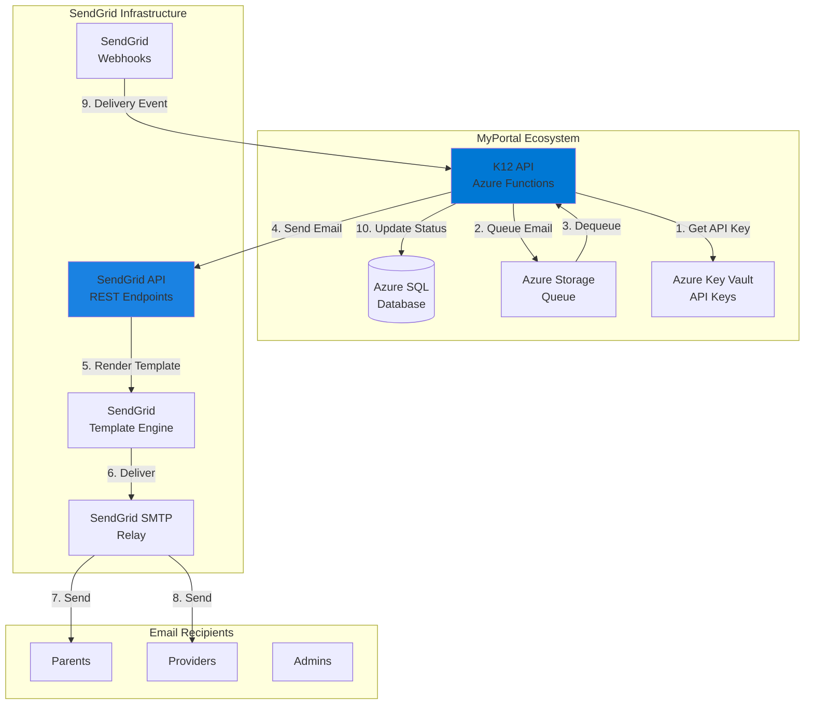
```mermaid
graph TB
    subgraph "MyPortal Ecosystem"
        API[K12 API<br/>Azure Functions]
        DB[(Azure SQL<br/>Database)]
        QUEUE[Azure Storage<br/>Queue]
        KV[Azure Key Vault<br/>API Keys]
    end

    subgraph "SendGrid Infrastructure"
        SG_API[SendGrid API<br/>REST Endpoints]
        SG_SMTP[SendGrid SMTP<br/>Relay]
        SG_WEBHOOK[SendGrid<br/>Webhooks]
        SG_TEMPLATES[SendGrid<br/>Template Engine]
    end

    subgraph "Email Recipients"
        PARENT[Parents]
        PROVIDER[Providers]
        ADMIN[Admins]
    end

    API -->|1. Get API Key| KV
    API -->|2. Queue Email| QUEUE
    QUEUE -->|3. Dequeue| API
    API -->|4. Send Email| SG_API
    SG_API -->|5. Render Template| SG_TEMPLATES
    SG_TEMPLATES -->|6. Deliver| SG_SMTP
    SG_SMTP -->|7. Send| PARENT
    SG_SMTP -->|8. Send| PROVIDER
    SG_WEBHOOK -->|9. Delivery Event| API
    API -->|10. Update Status| DB

    style API fill:#0078d4
    style SG_API fill:#1a82e2
```

### Component Responsibilities

#### MyPortal API Layer
- **API/Functions/EmailFunctions.cs**: Azure Function triggers for email operations
- **Application/Services/EmailService.cs**: Business logic for email composition
- **Infrastructure/HttpClients/SendGridClient.cs**: HTTP client for SendGrid API
- **Domain/Entities/Email.cs**: Domain model for email messages

#### SendGrid API Layer
- **Base URL (Production)**: `https://api.sendgrid.com/v3`
- **Authentication**: Bearer token (API Key in `Authorization` header)
- **Rate Limits**: No strict rate limit, burst protection advised

### Email Processing Flow

```mermaid
stateDiagram-v2
    [*] --> Queued: Queue Email
    Queued --> Processing: Dequeue
    Processing --> Sent: SendGrid Accepted
    Processing --> Failed: SendGrid Rejected
    Sent --> Delivered: Recipient Inbox
    Sent --> Bounced: Invalid Email
    Sent --> Blocked: Spam Filter
    Delivered --> Opened: Recipient Opens
    Opened --> Clicked: Link Clicked
    Failed --> Retry: Transient Error
    Retry --> Processing: Exponential Backoff
    Retry --> Dead: Max Retries Exceeded

    Delivered --> [*]
    Bounced --> [*]
    Blocked --> [*]
    Dead --> [*]
```

### Email Queue Strategy

MyPortal uses **Azure Storage Queues** for asynchronous email processing:

| Queue | Purpose | Processing Rate | Max Retries |
|-------|---------|-----------------|-------------|
| `emails-transactional` | Urgent emails (password reset) | 100/min | 3 |
| `emails-notification` | Application status updates | 50/min | 5 |
| `emails-bulk` | Batch communications | 500/min | 2 |

**Benefits:**
- **Decoupling**: API responds immediately, email sent asynchronously
- **Rate Limiting**: Control SendGrid API call rate
- **Retry Logic**: Automatic retry on transient failures
- **Priority**: Separate queues for different email types

---

## API Specifications

### Authentication

SendGrid uses **API Key authentication** with Bearer token.

#### API Key Configuration

```http
POST https://api.sendgrid.com/v3/mail/send
Authorization: Bearer {YOUR_API_KEY}
Content-Type: application/json
```

**Key Permissions:**
- `mail.send`: Send emails
- `templates.read`: Read email templates
- `stats.read`: Access analytics

### API Endpoints

#### 1. Send Email (Transactional)

**Endpoint:** `POST /v3/mail/send`

**Purpose:** Send a single transactional email with dynamic content.

**Request:**

```json
{
  "personalizations": [
    {
      "to": [
        {
          "email": "parent@example.com",
          "name": "John Smith"
        }
      ],
      "dynamic_template_data": {
        "student_name": "Emily Smith",
        "application_id": "APP-2024-001234",
        "application_status": "Approved",
        "award_amount": "$7,500",
        "next_steps": "Check your email for the award letter and disbursement timeline."
      }
    }
  ],
  "from": {
    "email": "noreply@myportal.nc.gov",
    "name": "NC SEAA MyPortal"
  },
  "reply_to": {
    "email": "support@myportal.nc.gov",
    "name": "MyPortal Support"
  },
  "template_id": "d-abc123def456ghi789",
  "categories": ["application", "approval"],
  "custom_args": {
    "application_id": "APP-2024-001234",
    "student_id": "STU-2024-001234",
    "environment": "production"
  },
  "tracking_settings": {
    "click_tracking": {
      "enable": true,
      "enable_text": false
    },
    "open_tracking": {
      "enable": true,
      "substitution_tag": "%open-track%"
    }
  }
}
```

**Response (202 Accepted):**

```http
HTTP/1.1 202 Accepted
X-Message-Id: msg-abc123def456ghi789
Content-Length: 0
```

**Response Headers:**
- `X-Message-Id`: Unique identifier for tracking email delivery

#### 2. Send Email (Simple - No Template)

**Request:**

```json
{
  "personalizations": [
    {
      "to": [
        {
          "email": "admin@myportal.nc.gov",
          "name": "System Administrator"
        }
      ],
      "subject": "ALERT: High Bounce Rate Detected"
    }
  ],
  "from": {
    "email": "alerts@myportal.nc.gov",
    "name": "MyPortal Alerts"
  },
  "content": [
    {
      "type": "text/plain",
      "value": "The email bounce rate has exceeded 2% in the last hour. Please investigate."
    },
    {
      "type": "text/html",
      "value": "<p>The email bounce rate has exceeded <strong>2%</strong> in the last hour. Please investigate.</p>"
    }
  ]
}
```

#### 3. Send Bulk Email (Multiple Recipients)

**Request:**

```json
{
  "personalizations": [
    {
      "to": [
        {
          "email": "parent1@example.com",
          "name": "Parent One"
        }
      ],
      "dynamic_template_data": {
        "student_name": "Emily Smith",
        "deadline_date": "December 31, 2024"
      }
    },
    {
      "to": [
        {
          "email": "parent2@example.com",
          "name": "Parent Two"
        }
      ],
      "dynamic_template_data": {
        "student_name": "Michael Johnson",
        "deadline_date": "December 31, 2024"
      }
    }
  ],
  "from": {
    "email": "noreply@myportal.nc.gov",
    "name": "NC SEAA MyPortal"
  },
  "template_id": "d-deadline-reminder-v2"
}
```

**Bulk Send Best Practices:**
- **Batch Size**: Max 1,000 personalizations per request
- **Rate Limiting**: Wait 100ms between batches
- **Error Handling**: Log failed personalizations for retry

#### 4. Get Email Statistics

**Endpoint:** `GET /v3/stats`

**Query Parameters:**
- `start_date`: YYYY-MM-DD (e.g., `2024-11-01`)
- `end_date`: YYYY-MM-DD (e.g., `2024-11-15`)
- `aggregated_by`: `day`, `week`, `month`
- `categories`: Filter by email category

**Response (200 OK):**

```json
[
  {
    "date": "2024-11-15",
    "stats": [
      {
        "metrics": {
          "requests": 3245,
          "delivered": 3218,
          "opens": 1354,
          "unique_opens": 1156,
          "clicks": 278,
          "unique_clicks": 245,
          "bounces": 18,
          "spam_reports": 1,
          "unsubscribes": 3
        }
      }
    ]
  }
]
```

**Calculated Metrics:**
- **Delivery Rate**: `(delivered / requests) * 100` = 99.17%
- **Open Rate**: `(unique_opens / delivered) * 100` = 35.92%
- **Click Rate**: `(unique_clicks / delivered) * 100` = 7.61%
- **Bounce Rate**: `(bounces / requests) * 100` = 0.55%

#### 5. List Email Templates

**Endpoint:** `GET /v3/templates`

**Query Parameters:**
- `generations`: `legacy` or `dynamic` (use `dynamic`)
- `page_size`: Results per page (default: 200)

**Response (200 OK):**

```json
{
  "result": [
    {
      "id": "d-abc123def456ghi789",
      "name": "Application Approval",
      "generation": "dynamic",
      "updated_at": "2024-09-15T10:00:00Z",
      "versions": [
        {
          "id": "v-abc123",
          "template_id": "d-abc123def456ghi789",
          "active": 1,
          "name": "Application Approval v2",
          "updated_at": "2024-09-15T10:00:00Z",
          "subject": "Your scholarship application has been approved!",
          "html_content": "<html>...</html>",
          "plain_content": "Your application has been approved..."
        }
      ]
    }
  ]
}
```

#### 6. Validate Email Address

**Endpoint:** `POST /v3/validations/email`

**Purpose:** Validate email address format and deliverability (requires paid plan).

**Request:**

```json
{
  "email": "parent@example.com",
  "source": "signup"
}
```

**Response (200 OK):**

```json
{
  "result": {
    "email": "parent@example.com",
    "verdict": "Valid",
    "score": 0.98,
    "local": "parent",
    "host": "example.com",
    "checks": {
      "domain": {
        "has_valid_address_syntax": true,
        "has_mx_or_a_record": true,
        "is_suspected_disposable_address": false
      },
      "local_part": {
        "is_suspected_role_address": false
      }
    }
  }
}
```

### Webhook Events

SendGrid sends **webhook notifications** for email delivery events.

#### Webhook Configuration

**MyPortal Webhook Endpoint:** `https://k12-api.myportal.nc.gov/api/webhooks/sendgrid`

**Authentication:** OAuth (recommended) or Basic Auth

**Events:**
- `processed`: Email accepted by SendGrid
- `delivered`: Email delivered to recipient's mail server
- `open`: Recipient opened email (requires open tracking)
- `click`: Recipient clicked link in email
- `bounce`: Email bounced (invalid address)
- `dropped`: SendGrid dropped email (spam, unsubscribed)
- `deferred`: Temporary delivery issue, will retry
- `unsubscribe`: Recipient unsubscribed
- `spam_report`: Recipient marked as spam

#### Webhook Payload Example

```json
[
  {
    "email": "parent@example.com",
    "timestamp": 1700152800,
    "smtp-id": "<abc123@sendgrid.net>",
    "event": "delivered",
    "category": ["application", "approval"],
    "sg_event_id": "evt-abc123def456",
    "sg_message_id": "msg-abc123def456ghi789",
    "response": "250 OK",
    "application_id": "APP-2024-001234",
    "student_id": "STU-2024-001234"
  },
  {
    "email": "parent@example.com",
    "timestamp": 1700156400,
    "smtp-id": "<abc123@sendgrid.net>",
    "event": "open",
    "category": ["application", "approval"],
    "sg_event_id": "evt-def456ghi789",
    "sg_message_id": "msg-abc123def456ghi789",
    "useragent": "Mozilla/5.0 (iPhone; CPU iPhone OS 17_0 like Mac OS X)",
    "ip": "192.168.1.100"
  }
]
```

**Webhook Signature Verification:**

SendGrid supports **signature verification** using public key cryptography.

```csharp
public static bool VerifyWebhookSignature(
    string publicKey,
    string payload,
    string signature,
    string timestamp)
{
    var timestampPayload = timestamp + payload;

    using var ecdsa = ECDsa.Create();
    ecdsa.ImportSubjectPublicKeyInfo(Convert.FromBase64String(publicKey), out _);

    var signatureBytes = Convert.FromBase64String(signature);
    var payloadBytes = Encoding.UTF8.GetBytes(timestampPayload);

    return ecdsa.VerifyData(payloadBytes, signatureBytes, HashAlgorithmName.SHA256);
}
```

---

## Data Flow

### 1. Transactional Email Flow (Password Reset)

```mermaid
sequenceDiagram
    participant User as Parent Portal
    participant API as MyPortal API
    participant DB as Azure SQL
    participant SG as SendGrid API

    User->>API: Request Password Reset
    API->>DB: Generate Reset Token
    API->>API: Compose Email Content
    API->>SG: POST /v3/mail/send
    Note right of SG: Template: password-reset-v2
    SG-->>API: 202 Accepted (Message ID)
    API->>DB: Log Email Sent
    API-->>User: Check your email

    SG->>SG: Deliver Email
    SG->>User: Email: Password Reset
    User->>User: Click Reset Link
```

### 2. Application Approval Email with Queue

```mermaid
sequenceDiagram
    participant Admin as Admin Portal
    participant API as MyPortal API
    participant DB as Azure SQL
    participant Queue as Azure Storage Queue
    participant Worker as Queue Processor
    participant SG as SendGrid API
    participant Parent as Parent Email

    Admin->>API: Approve Application
    API->>DB: Update Status = APPROVED
    API->>Queue: Queue Email Message
    API-->>Admin: Success

    Worker->>Queue: Dequeue Message
    Worker->>DB: Get Application Details
    Worker->>SG: POST /v3/mail/send
    SG-->>Worker: 202 Accepted
    Worker->>DB: Update Email Status = SENT

    SG->>Parent: Deliver Email
    SG->>API: Webhook: delivered
    API->>DB: Update Email Status = DELIVERED

    Parent->>Parent: Open Email
    SG->>API: Webhook: open
    API->>DB: Log Email Opened
```

### 3. Bulk Email Campaign (Deadline Reminders)

```mermaid
sequenceDiagram
    participant Scheduler as Azure Timer
    participant API as MyPortal API
    participant DB as Azure SQL
    participant SG as SendGrid API

    Scheduler->>API: Trigger Daily Reminder Job
    API->>DB: Get Parents with Incomplete Apps
    DB-->>API: Return 5,000 Parents

    loop Process in Batches of 1,000
        API->>API: Compose Personalized Emails
        API->>SG: POST /v3/mail/send (1,000 recipients)
        SG-->>API: 202 Accepted
        API->>DB: Log Batch Sent
        API->>API: Wait 100ms (Rate Limit)
    end

    API->>DB: Log Campaign Complete
```

### 4. Bounce Handling Flow

```mermaid
sequenceDiagram
    participant SG as SendGrid
    participant Webhook as Webhook Endpoint
    participant API as MyPortal API
    participant DB as Azure SQL

    SG->>Webhook: POST /webhooks/sendgrid
    Note right of Webhook: Event: bounce (hard)
    Webhook->>Webhook: Verify Signature
    Webhook->>API: Process Bounce Event
    API->>DB: Mark Email as Bounced
    API->>DB: Update User Email Status = INVALID

    alt Bounce Count >= 3
        API->>DB: Suppress Future Emails
        API->>API: Send SMS Notification (fallback)
    end

    API->>API: Alert Admin if Bounce Rate > 2%
```

---

## Implementation

### C# Implementation with Azure Functions

#### 1. SendGrid HTTP Client Configuration

**File:** `Infrastructure/HttpClients/SendGridClient.cs`

```csharp
using System;
using System.Collections.Generic;
using System.Net.Http;
using System.Net.Http.Headers;
using System.Text;
using System.Text.Json;
using System.Threading.Tasks;
using Microsoft.Extensions.Configuration;
using Microsoft.Extensions.Logging;
using Polly;
using Polly.CircuitBreaker;
using Polly.Retry;

namespace K12.Infrastructure.HttpClients
{
    public class SendGridClient : ISendGridClient
    {
        private readonly HttpClient _httpClient;
        private readonly IConfiguration _configuration;
        private readonly ILogger<SendGridClient> _logger;
        private readonly AsyncRetryPolicy<HttpResponseMessage> _retryPolicy;
        private readonly AsyncCircuitBreakerPolicy<HttpResponseMessage> _circuitBreakerPolicy;

        public SendGridClient(
            HttpClient httpClient,
            IConfiguration configuration,
            ILogger<SendGridClient> logger)
        {
            _httpClient = httpClient;
            _configuration = configuration;
            _logger = logger;

            var baseUrl = _configuration["SendGrid:BaseUrl"];
            var apiKey = _configuration["SendGrid:ApiKey"];

            _httpClient.BaseAddress = new Uri(baseUrl);
            _httpClient.DefaultRequestHeaders.Add("Authorization", $"Bearer {apiKey}");
            _httpClient.DefaultRequestHeaders.Accept.Add(
                new MediaTypeWithQualityHeaderValue("application/json"));

            _retryPolicy = BuildRetryPolicy();
            _circuitBreakerPolicy = BuildCircuitBreakerPolicy();
        }

        private AsyncRetryPolicy<HttpResponseMessage> BuildRetryPolicy()
        {
            return Policy
                .HandleResult<HttpResponseMessage>(r =>
                    (int)r.StatusCode >= 500 ||
                    r.StatusCode == System.Net.HttpStatusCode.RequestTimeout ||
                    r.StatusCode == System.Net.HttpStatusCode.TooManyRequests)
                .WaitAndRetryAsync(
                    retryCount: 3,
                    sleepDurationProvider: retryAttempt =>
                        TimeSpan.FromSeconds(Math.Pow(2, retryAttempt)),
                    onRetry: (outcome, timespan, retryCount, context) =>
                    {
                        _logger.LogWarning(
                            "SendGrid API retry {RetryCount} after {Delay}ms",
                            retryCount,
                            timespan.TotalMilliseconds);
                    });
        }

        private AsyncCircuitBreakerPolicy<HttpResponseMessage> BuildCircuitBreakerPolicy()
        {
            return Policy
                .HandleResult<HttpResponseMessage>(r => (int)r.StatusCode >= 500)
                .CircuitBreakerAsync(
                    handledEventsAllowedBeforeBreaking: 5,
                    durationOfBreak: TimeSpan.FromMinutes(1),
                    onBreak: (outcome, duration) =>
                    {
                        _logger.LogError("SendGrid circuit breaker opened");
                    },
                    onReset: () =>
                    {
                        _logger.LogInformation("SendGrid circuit breaker reset");
                    });
        }

        /// <summary>
        /// Send email using dynamic template
        /// </summary>
        public async Task<SendEmailResponse> SendEmailAsync(SendEmailRequest request)
        {
            var content = new StringContent(
                JsonSerializer.Serialize(request, new JsonSerializerOptions
                {
                    PropertyNamingPolicy = JsonNamingPolicy.CamelCase,
                    DefaultIgnoreCondition = System.Text.Json.Serialization.JsonIgnoreCondition.WhenWritingNull
                }),
                Encoding.UTF8,
                "application/json");

            var policy = Policy.WrapAsync(_retryPolicy, _circuitBreakerPolicy);

            var response = await policy.ExecuteAsync(async () =>
                await _httpClient.PostAsync("/v3/mail/send", content));

            if (!response.IsSuccessStatusCode)
            {
                var errorContent = await response.Content.ReadAsStringAsync();
                _logger.LogError(
                    "SendGrid SendEmail failed: {StatusCode} - {Error}",
                    response.StatusCode,
                    errorContent);
            }

            response.EnsureSuccessStatusCode();

            var messageId = response.Headers.GetValues("X-Message-Id").FirstOrDefault();

            return new SendEmailResponse
            {
                MessageId = messageId,
                StatusCode = (int)response.StatusCode
            };
        }

        /// <summary>
        /// Send simple text email (no template)
        /// </summary>
        public async Task<SendEmailResponse> SendSimpleEmailAsync(
            string to,
            string subject,
            string plainText,
            string html = null)
        {
            var request = new SendEmailRequest
            {
                Personalizations = new List<Personalization>
                {
                    new Personalization
                    {
                        To = new List<EmailAddress>
                        {
                            new EmailAddress { Email = to }
                        },
                        Subject = subject
                    }
                },
                From = new EmailAddress
                {
                    Email = _configuration["SendGrid:FromEmail"],
                    Name = _configuration["SendGrid:FromName"]
                },
                Content = new List<Content>
                {
                    new Content { Type = "text/plain", Value = plainText }
                }
            };

            if (!string.IsNullOrEmpty(html))
            {
                request.Content.Add(new Content { Type = "text/html", Value = html });
            }

            return await SendEmailAsync(request);
        }

        /// <summary>
        /// Get email statistics
        /// </summary>
        public async Task<EmailStatsResponse> GetStatisticsAsync(
            DateTime startDate,
            DateTime endDate,
            string aggregatedBy = "day")
        {
            var url = $"/v3/stats?start_date={startDate:yyyy-MM-dd}&end_date={endDate:yyyy-MM-dd}&aggregated_by={aggregatedBy}";

            var policy = Policy.WrapAsync(_retryPolicy, _circuitBreakerPolicy);

            var response = await policy.ExecuteAsync(async () =>
                await _httpClient.GetAsync(url));

            response.EnsureSuccessStatusCode();

            return await JsonSerializer.DeserializeAsync<EmailStatsResponse>(
                await response.Content.ReadAsStreamAsync());
        }

        /// <summary>
        /// List email templates
        /// </summary>
        public async Task<TemplateListResponse> ListTemplatesAsync()
        {
            var url = "/v3/templates?generations=dynamic";

            var policy = Policy.WrapAsync(_retryPolicy, _circuitBreakerPolicy);

            var response = await policy.ExecuteAsync(async () =>
                await _httpClient.GetAsync(url));

            response.EnsureSuccessStatusCode();

            return await JsonSerializer.DeserializeAsync<TemplateListResponse>(
                await response.Content.ReadAsStreamAsync());
        }
    }

    // DTOs

    public class SendEmailRequest
    {
        public List<Personalization> Personalizations { get; set; }
        public EmailAddress From { get; set; }
        public EmailAddress ReplyTo { get; set; }
        public string TemplateId { get; set; }
        public List<string> Categories { get; set; }
        public Dictionary<string, string> CustomArgs { get; set; }
        public List<Content> Content { get; set; }
        public TrackingSettings TrackingSettings { get; set; }
    }

    public class Personalization
    {
        public List<EmailAddress> To { get; set; }
        public string Subject { get; set; }
        public Dictionary<string, object> DynamicTemplateData { get; set; }
        public Dictionary<string, string> CustomArgs { get; set; }
    }

    public class EmailAddress
    {
        public string Email { get; set; }
        public string Name { get; set; }
    }

    public class Content
    {
        public string Type { get; set; }
        public string Value { get; set; }
    }

    public class TrackingSettings
    {
        public ClickTracking ClickTracking { get; set; }
        public OpenTracking OpenTracking { get; set; }
    }

    public class ClickTracking
    {
        public bool Enable { get; set; }
        public bool EnableText { get; set; }
    }

    public class OpenTracking
    {
        public bool Enable { get; set; }
        public string SubstitutionTag { get; set; }
    }

    public class SendEmailResponse
    {
        public string MessageId { get; set; }
        public int StatusCode { get; set; }
    }
}
```

#### 2. Email Service Layer

**File:** `Application/Services/EmailService.cs`

```csharp
using System;
using System.Collections.Generic;
using System.Threading.Tasks;
using Azure.Storage.Queues;
using K12.Domain.Entities;
using K12.Domain.Repositories;
using K12.Infrastructure.HttpClients;
using Microsoft.Extensions.Configuration;
using Microsoft.Extensions.Logging;

namespace K12.Application.Services
{
    public class EmailService : IEmailService
    {
        private readonly ISendGridClient _sendGridClient;
        private readonly IEmailRepository _emailRepository;
        private readonly QueueClient _queueClient;
        private readonly IConfiguration _configuration;
        private readonly ILogger<EmailService> _logger;

        public EmailService(
            ISendGridClient sendGridClient,
            IEmailRepository emailRepository,
            QueueServiceClient queueServiceClient,
            IConfiguration configuration,
            ILogger<EmailService> logger)
        {
            _sendGridClient = sendGridClient;
            _emailRepository = emailRepository;
            _configuration = configuration;
            _logger = logger;

            var queueName = _configuration["Email:QueueName"];
            _queueClient = queueServiceClient.GetQueueClient(queueName);
        }

        /// <summary>
        /// Send application approval email
        /// </summary>
        public async Task SendApplicationApprovalEmailAsync(int applicationId)
        {
            // Queue email for asynchronous processing
            var message = new
            {
                Type = "ApplicationApproval",
                ApplicationId = applicationId,
                Timestamp = DateTime.UtcNow
            };

            await _queueClient.SendMessageAsync(
                Convert.ToBase64String(
                    System.Text.Encoding.UTF8.GetBytes(
                        System.Text.Json.JsonSerializer.Serialize(message))));

            _logger.LogInformation(
                "Queued application approval email for Application {ApplicationId}",
                applicationId);
        }

        /// <summary>
        /// Process email from queue (called by queue trigger function)
        /// </summary>
        public async Task ProcessApplicationApprovalEmailAsync(int applicationId)
        {
            // Get application details
            var application = await GetApplicationDetailsAsync(applicationId);

            var templateId = _configuration["SendGrid:Templates:ApplicationApproval"];

            var request = new SendEmailRequest
            {
                Personalizations = new List<Personalization>
                {
                    new Personalization
                    {
                        To = new List<EmailAddress>
                        {
                            new EmailAddress
                            {
                                Email = application.Parent.Email,
                                Name = $"{application.Parent.FirstName} {application.Parent.LastName}"
                            }
                        },
                        DynamicTemplateData = new Dictionary<string, object>
                        {
                            ["student_name"] = $"{application.Student.FirstName} {application.Student.LastName}",
                            ["application_id"] = application.ApplicationId,
                            ["award_amount"] = $"${application.AwardAmount:N0}",
                            ["school_year"] = application.SchoolYear,
                            ["next_steps_url"] = $"{_configuration["App:BaseUrl"]}/next-steps"
                        }
                    }
                },
                From = new EmailAddress
                {
                    Email = _configuration["SendGrid:FromEmail"],
                    Name = _configuration["SendGrid:FromName"]
                },
                ReplyTo = new EmailAddress
                {
                    Email = _configuration["SendGrid:ReplyToEmail"]
                },
                TemplateId = templateId,
                Categories = new List<string> { "application", "approval" },
                CustomArgs = new Dictionary<string, string>
                {
                    ["application_id"] = application.ApplicationId,
                    ["student_id"] = application.Student.StudentId
                },
                TrackingSettings = new TrackingSettings
                {
                    ClickTracking = new ClickTracking { Enable = true },
                    OpenTracking = new OpenTracking { Enable = true }
                }
            };

            try
            {
                var response = await _sendGridClient.SendEmailAsync(request);

                // Log email in database
                await _emailRepository.CreateAsync(new Email
                {
                    ApplicationId = applicationId,
                    RecipientEmail = application.Parent.Email,
                    EmailType = EmailType.ApplicationApproval,
                    SendGridMessageId = response.MessageId,
                    Status = EmailStatus.Sent,
                    SentAt = DateTime.UtcNow
                });

                _logger.LogInformation(
                    "Sent application approval email for Application {ApplicationId}, MessageId: {MessageId}",
                    applicationId,
                    response.MessageId);
            }
            catch (Exception ex)
            {
                _logger.LogError(
                    ex,
                    "Failed to send application approval email for Application {ApplicationId}",
                    applicationId);
                throw;
            }
        }

        /// <summary>
        /// Send password reset email (immediate, not queued)
        /// </summary>
        public async Task SendPasswordResetEmailAsync(string email, string resetToken)
        {
            var templateId = _configuration["SendGrid:Templates:PasswordReset"];
            var resetUrl = $"{_configuration["App:BaseUrl"]}/reset-password?token={resetToken}";

            var request = new SendEmailRequest
            {
                Personalizations = new List<Personalization>
                {
                    new Personalization
                    {
                        To = new List<EmailAddress>
                        {
                            new EmailAddress { Email = email }
                        },
                        DynamicTemplateData = new Dictionary<string, object>
                        {
                            ["reset_url"] = resetUrl,
                            ["expiration_minutes"] = 30
                        }
                    }
                },
                From = new EmailAddress
                {
                    Email = _configuration["SendGrid:FromEmail"],
                    Name = _configuration["SendGrid:FromName"]
                },
                TemplateId = templateId,
                Categories = new List<string> { "authentication", "password-reset" }
            };

            var response = await _sendGridClient.SendEmailAsync(request);

            _logger.LogInformation(
                "Sent password reset email to {Email}, MessageId: {MessageId}",
                email,
                response.MessageId);
        }

        private async Task<Application> GetApplicationDetailsAsync(int applicationId)
        {
            // Query application with related entities
            return null; // Placeholder
        }
    }
}
```

#### 3. Azure Function Queue Trigger

**File:** `API/Functions/EmailFunctions.cs`

```csharp
using System;
using System.Text.Json;
using System.Threading.Tasks;
using K12.Application.Services;
using Microsoft.Azure.Functions.Worker;
using Microsoft.Extensions.Logging;

namespace K12.API.Functions
{
    public class EmailFunctions
    {
        private readonly IEmailService _emailService;
        private readonly ILogger<EmailFunctions> _logger;

        public EmailFunctions(
            IEmailService emailService,
            ILogger<EmailFunctions> logger)
        {
            _emailService = emailService;
            _logger = logger;
        }

        /// <summary>
        /// Queue trigger: Process queued emails
        /// </summary>
        [Function("ProcessEmailQueue")]
        public async Task ProcessEmailQueue(
            [QueueTrigger("emails-notification")] string message,
            FunctionContext context)
        {
            try
            {
                var emailMessage = JsonSerializer.Deserialize<EmailQueueMessage>(message);

                _logger.LogInformation(
                    "Processing email: Type={Type}, ApplicationId={ApplicationId}",
                    emailMessage.Type,
                    emailMessage.ApplicationId);

                switch (emailMessage.Type)
                {
                    case "ApplicationApproval":
                        await _emailService.ProcessApplicationApprovalEmailAsync(
                            emailMessage.ApplicationId);
                        break;

                    // Add other email types...
                }
            }
            catch (Exception ex)
            {
                _logger.LogError(ex, "Error processing email queue message");
                throw; // Let Azure Functions retry logic handle
            }
        }

        /// <summary>
        /// Webhook endpoint for SendGrid events
        /// </summary>
        [Function("SendGridWebhook")]
        public async Task SendGridWebhook(
            [HttpTrigger(AuthorizationLevel.Function, "post",
                Route = "webhooks/sendgrid")]
            Microsoft.Azure.Functions.Worker.Http.HttpRequestData req)
        {
            // Process SendGrid webhook events
            // Update email status in database
        }
    }

    public class EmailQueueMessage
    {
        public string Type { get; set; }
        public int ApplicationId { get; set; }
        public DateTime Timestamp { get; set; }
    }
}
```

---

## Error Handling

### Retry Policies

- **Exponential backoff**: 3 retries (2s, 4s, 8s)
- **Circuit breaker**: Open after 5 failures, 1-minute break
- **Queue visibility timeout**: 5 minutes (auto-retry if not processed)

### Common Error Scenarios

#### 1. Invalid Email Address

```csharp
catch (HttpRequestException ex) when (ex.StatusCode == HttpStatusCode.BadRequest)
{
    var errorResponse = await ParseErrorResponseAsync(ex);

    if (errorResponse.Errors?.Any(e => e.Field == "personalizations[0].to[0].email") ?? false)
    {
        // Mark email as invalid in database
        await _emailRepository.MarkAsInvalidAsync(email);

        _logger.LogWarning("Invalid email address: {Email}", email);
    }
}
```

#### 2. Rate Limit Exceeded

```csharp
catch (HttpRequestException ex) when (ex.StatusCode == HttpStatusCode.TooManyRequests)
{
    var retryAfter = ex.Response.Headers.RetryAfter?.Delta ?? TimeSpan.FromSeconds(60);

    _logger.LogWarning("SendGrid rate limit exceeded, retrying after {Seconds}s", retryAfter.TotalSeconds);

    await Task.Delay(retryAfter);
    // Retry will happen automatically via Polly
}
```

---

## Security

### SPF, DKIM, DMARC Configuration

**DNS Records for myportal.nc.gov:**

```dns
# SPF (Sender Policy Framework)
myportal.nc.gov. IN TXT "v=spf1 include:sendgrid.net ~all"

# DKIM (DomainKeys Identified Mail)
s1._domainkey.myportal.nc.gov. IN CNAME s1.domainkey.u12345678.wl123.sendgrid.net.
s2._domainkey.myportal.nc.gov. IN CNAME s2.domainkey.u12345678.wl123.sendgrid.net.

# DMARC (Domain-based Message Authentication, Reporting & Conformance)
_dmarc.myportal.nc.gov. IN TXT "v=DMARC1; p=quarantine; rua=mailto:dmarc@myportal.nc.gov"
```

### API Key Rotation

```bash
# Rotate SendGrid API key every 90 days
az keyvault secret set \
  --vault-name k12-keyvault-prod \
  --name sendgrid-api-key \
  --value "SG.new_api_key_here"
```

---

## Monitoring & Logging

### Application Insights Metrics

```csharp
public void TrackEmailSent(string emailType, string recipient)
{
    _telemetryClient.TrackEvent("Email_Sent",
        new Dictionary<string, string>
        {
            { "emailType", emailType },
            { "recipient", recipient }
        });
}

public void TrackEmailBounce(string recipient, string bounceReason)
{
    _telemetryClient.TrackEvent("Email_Bounced",
        new Dictionary<string, string>
        {
            { "recipient", recipient },
            { "reason", bounceReason }
        });
}
```

### KQL Queries

**Email Delivery Rate (Last 7 Days):**

```kusto
customEvents
| where timestamp > ago(7d)
| where name in ("Email_Sent", "Email_Delivered", "Email_Bounced")
| summarize
    Sent = countif(name == "Email_Sent"),
    Delivered = countif(name == "Email_Delivered"),
    Bounced = countif(name == "Email_Bounced")
| extend DeliveryRate = (Delivered * 100.0) / Sent
```

---

## Testing Strategy

### Unit Tests

```csharp
[Fact]
public async Task SendApplicationApprovalEmail_ValidApplication_SendsEmail()
{
    // Arrange
    var mockClient = new Mock<ISendGridClient>();
    mockClient.Setup(c => c.SendEmailAsync(It.IsAny<SendEmailRequest>()))
        .ReturnsAsync(new SendEmailResponse { MessageId = "msg-123", StatusCode = 202 });

    var service = new EmailService(mockClient.Object, null, null, null, null);

    // Act
    await service.ProcessApplicationApprovalEmailAsync(123);

    // Assert
    mockClient.Verify(c => c.SendEmailAsync(
        It.Is<SendEmailRequest>(r => r.TemplateId.Contains("ApplicationApproval"))),
        Times.Once);
}
```

---

## Common Issues & Troubleshooting

### Issue 1: Low Open Rates

**Symptoms:** Open rate < 20%

**Resolution:**
- Check subject line effectiveness
- Verify sender reputation
- Test different send times

### Issue 2: High Bounce Rate

**Symptoms:** Bounce rate > 2%

**Resolution:**
- Implement email validation before send
- Remove invalid emails from database
- Use double opt-in for new signups

---

## References

- **SendGrid API Documentation**: https://docs.sendgrid.com/api-reference
- **Confluence Page**: [Email Integration Spec](https://cfi-nc.atlassian.net/wiki/spaces/KR/pages/4351721474)
- **Email Templates**: https://mc.sendgrid.com/dynamic-templates

---

**Document Version:** 1.0
**Last Reviewed:** 2025-01-15
**Next Review:** 2025-04-15
**Owner:** CFI Integration Team

````

.\wiki\02-architecture/integrations/INT-04-melissa-data-integration.md
````markdown
# INT-04: Melissa Data Integration

**Integration ID:** INT-04
**System:** Melissa Data Address Validation & Geocoding
**Type:** External REST API
**Classification:** Business Critical
**Status:** Active (Production)
**Last Updated:** 2025-01-15

## Table of Contents

- [Overview](#overview)
- [Integration Architecture](#integration-architecture)
- [API Specifications](#api-specifications)
- [Data Flow](#data-flow)
- [Implementation](#implementation)
- [Error Handling](#error-handling)
- [Security](#security)
- [Monitoring & Logging](#monitoring--logging)
- [Testing Strategy](#testing-strategy)
- [Common Issues & Troubleshooting](#common-issues--troubleshooting)
- [References](#references)

---

## Overview

### Purpose

Melissa Data is the **address validation and geocoding service** for the NC SEAA K-12 Scholarship Management System. It provides real-time address verification and geolocation services for:

- **Address Standardization**: Convert addresses to USPS-standard format
- **Address Validation**: Verify addresses exist and are deliverable
- **Geocoding**: Convert addresses to latitude/longitude coordinates
- **School District Verification**: Determine which school district an address belongs to
- **Residency Verification**: Confirm North Carolina residency for eligibility
- **Data Quality**: Improve address data quality with corrections and suggestions
- **ZIP+4 Enhancement**: Append ZIP+4 codes for more precise location data
- **Change of Address (COA)**: Detect if address has changed (NCOA database)

### Business Context

Address validation is **critical** for the K-12 scholarship program because:

1. **Eligibility Verification**: Only NC residents are eligible for scholarships
2. **School District Assignment**: Students must be matched to correct school districts
3. **Fund Disbursement**: ClassWallet requires accurate addresses for card mailing
4. **Communication**: SendGrid emails must reach correct addresses
5. **Fraud Prevention**: Invalid/fake addresses indicate potential fraud
6. **Compliance**: State law requires verifiable NC residency
7. **Data Quality**: Reduce address-related errors and return mail

### Integration Scope

| Feature | MyPortal Responsibility | Melissa Data Responsibility |
|---------|------------------------|----------------------------|
| Address Input | Collect from parent/provider | N/A |
| Real-Time Validation | Call API during form submission | Validate against USPS database |
| Standardization | Display corrected address | Return USPS-standard format |
| Geocoding | Store lat/long in database | Convert address to coordinates |
| District Lookup | Query district boundaries | Provide coordinate-based lookup |
| Caching | Cache validated addresses | N/A |
| Billing | Track API usage | Charge per API call |

### Key Metrics

- **API Call Volume**: ~12,000 validations/month (150 req/hour peak)
- **Validation Success Rate**: 96.5% (addresses successfully validated)
- **Average Response Time**: 350ms (target: <500ms)
- **Cache Hit Rate**: 65% (reduces API costs)
- **Cost**: $0.15 per validation (budgeted: $1,800/month)
- **Geocoding Accuracy**: 95% rooftop-level, 5% street-level
- **SLA**: 99.9% uptime, <1s response time

---

## Integration Architecture

### High-Level Architecture

```mermaid
graph TB
    subgraph "MyPortal Ecosystem"
        UI[Parent/Provider Portal<br/>Address Form]
        API[K12 API<br/>Azure Functions]
        DB[(Azure SQL<br/>Database)]
        CACHE[Redis Cache<br/>Validated Addresses]
        KV[Azure Key Vault<br/>API Keys]
    end

    subgraph "Melissa Data Cloud"
        MD_API[Melissa Data API<br/>Global Address Verification]
        MD_GEO[Melissa Data API<br/>Geocoding Service]
        USPS[USPS Database<br/>Delivery Point Validation]
    end

    subgraph "External Data"
        DISTRICT[NC School District<br/>Boundaries Database]
    end

    UI -->|1. Enter Address| API
    API -->|2. Check Cache| CACHE
    CACHE -->|Cache Miss| API
    API -->|3. Get API Key| KV
    API -->|4. Validate Address| MD_API
    MD_API -->|5. Query| USPS
    USPS -->|6. USPS Data| MD_API
    MD_API -->|7. Validated Address| API
    API -->|8. Geocode| MD_GEO
    MD_GEO -->|9. Coordinates| API
    API -->|10. Lookup District| DISTRICT
    API -->|11. Cache Result| CACHE
    API -->|12. Store| DB
    API -->|13. Return| UI

    style API fill:#0078d4
    style MD_API fill:#ff6b35
```

### Address Validation Flow

```mermaid
stateDiagram-v2
    [*] --> UserInput: Enter Address
    UserInput --> CacheCheck: Submit Form
    CacheCheck --> CacheHit: Found in Cache
    CacheCheck --> APICached: Not in Cache
    CacheHit --> DisplayResult: Return Cached
    APICached --> Validated: Valid Address
    APICached --> Suggestions: Multiple Matches
    APICached --> Invalid: Not Deliverable
    Suggestions --> UserSelection: Show Options
    UserSelection --> Validated: User Selects
    Validated --> Geocoding: Get Coordinates
    Geocoding --> DistrictLookup: Determine District
    DistrictLookup --> Cache: Store Result
    Cache --> DisplayResult: Return to User
    Invalid --> UserCorrection: Prompt for Correction
    UserCorrection --> UserInput: Re-enter
    DisplayResult --> [*]
```

### Caching Strategy

MyPortal implements **aggressive caching** to reduce Melissa Data API costs:

| Cache Type | Duration | Key Format | Purpose |
|------------|----------|------------|---------|
| Validated Addresses | 90 days | `addr:{hash}` | Avoid re-validating same address |
| Geocoded Coordinates | 365 days | `geo:{address}` | Long-term coordinate storage |
| District Boundaries | 30 days | `district:{lat},{lng}` | School district lookup |
| Invalid Addresses | 7 days | `invalid:{hash}` | Prevent repeated validation attempts |

**Cache Benefits:**
- **Cost Reduction**: 65% cache hit rate = $1,170/month savings
- **Performance**: Cached responses in <50ms vs. 350ms API call
- **Resilience**: Serve cached data if Melissa Data is unavailable

---

## API Specifications

### Authentication

Melissa Data uses **API Key authentication** via query parameter or header.

#### API Key Configuration

```http
GET https://globaladdress.melissadata.net/v3/WEB/GlobalAddress/doGlobalAddress
?id={LICENSE_KEY}
&a1=123 Main St
&locality=Raleigh
&administrativearea=NC
&postalcode=27601
&country=US
```

**Alternative (Header-based):**

```http
GET https://globaladdress.melissadata.net/v3/WEB/GlobalAddress/doGlobalAddress
Authorization: Bearer {LICENSE_KEY}
```

### API Endpoints

#### 1. Validate US Address (Global Address API)

**Endpoint:** `GET /v3/WEB/GlobalAddress/doGlobalAddress`

**Purpose:** Validate and standardize a US address.

**Query Parameters:**
- `id`: License key (required)
- `a1`: Address Line 1 (required)
- `a2`: Address Line 2 (optional)
- `locality`: City (required)
- `administrativearea`: State (required, 2-letter code)
- `postalcode`: ZIP code (optional, improves accuracy)
- `country`: Country code (default: `US`)
- `opt`: Options (e.g., `DeliveryLines:on` for USPS format)

**Example Request:**

```http
GET https://globaladdress.melissadata.net/v3/WEB/GlobalAddress/doGlobalAddress
?id=12345678
&a1=123 Main Street
&locality=Raleigh
&administrativearea=NC
&postalcode=27601
&country=US
&opt=DeliveryLines:on
```

**Response (200 OK):**

```json
{
  "Version": "3.0.0.96",
  "TransmissionReference": "req-20241115-143000",
  "TransmissionResults": "",
  "TotalRecords": "1",
  "Records": [
    {
      "RecordID": "1",
      "Results": "AS01,AV24,AV25",
      "FormattedAddress": "123 Main St, Raleigh, NC 27601-1234",
      "Organization": "",
      "AddressLine1": "123 Main St",
      "AddressLine2": "",
      "AddressLine3": "",
      "AddressLine4": "",
      "AddressLine5": "",
      "Locality": "Raleigh",
      "AdministrativeArea": "NC",
      "PostalCode": "27601-1234",
      "Country": "US",
      "CountryISO3166_1_Alpha2": "US",
      "CountryISO3166_1_Alpha3": "USA",
      "CountryISO3166_1_Numeric": "840",
      "Latitude": "35.7796",
      "Longitude": "-78.6382",
      "DeliveryIndicator": "R",
      "AddressType": "S",
      "AddressKey": "27601123000",
      "SubPremises": "",
      "SubPremisesNumber": "",
      "DoubleDependentLocality": "",
      "DependentLocality": "",
      "Thoroughfare": "Main St",
      "ThoroughfarePreDirection": "",
      "ThoroughfareLeadingType": "",
      "ThoroughfareName": "Main",
      "ThoroughfareTrailingType": "St",
      "ThoroughfarePostDirection": "",
      "DependentThoroughfare": "",
      "Building": "",
      "PremisesNumber": "123"
    }
  ]
}
```

**Response Fields:**

| Field | Description | Example |
|-------|-------------|---------|
| `Results` | Status codes (comma-separated) | `AS01,AV24,AV25` |
| `FormattedAddress` | USPS-standardized address | `123 Main St, Raleigh, NC 27601-1234` |
| `AddressLine1` | Standardized line 1 | `123 Main St` |
| `Locality` | City name | `Raleigh` |
| `AdministrativeArea` | State code | `NC` |
| `PostalCode` | ZIP+4 code | `27601-1234` |
| `Latitude` | Latitude coordinate | `35.7796` |
| `Longitude` | Longitude coordinate | `-78.6382` |
| `DeliveryIndicator` | Delivery type (`R`=residential, `B`=business) | `R` |
| `AddressType` | Address type (`S`=street, `H`=highrise, `P`=PO Box) | `S` |

**Result Codes:**

| Code | Description | Action |
|------|-------------|--------|
| `AS01` | Verified and standardized | Accept address |
| `AV24` | Address validated | Accept address |
| `AV25` | Delivery point validated | Accept address |
| `AE01` | Address not found | Reject or suggest correction |
| `AE02` | Multiple matches found | Show user options |
| `AE08` | Insufficient data | Prompt for more details |

#### 2. Geocode Address (Geocoder API)

**Endpoint:** `GET /v3/WEB/GeoCoder/doGeoCode`

**Purpose:** Convert address to latitude/longitude coordinates.

**Query Parameters:**
- `id`: License key
- `address`: Full address string

**Example Request:**

```http
GET https://geocoder.melissadata.net/v3/WEB/GeoCoder/doGeoCode
?id=12345678
&address=123 Main St, Raleigh, NC 27601
```

**Response (200 OK):**

```json
{
  "Version": "3.0.0.96",
  "Records": [
    {
      "Latitude": "35.7796",
      "Longitude": "-78.6382",
      "GeoPrecision": "01",
      "Results": "GS01"
    }
  ]
}
```

**GeoPrecision Values:**
- `01`: Rooftop level (most accurate)
- `02`: Street level
- `03`: ZIP code centroid
- `04`: City centroid

#### 3. Reverse Geocode (Coordinates to Address)

**Endpoint:** `GET /v3/WEB/GeoCoder/doReverseGeoCode`

**Query Parameters:**
- `id`: License key
- `lat`: Latitude
- `lng`: Longitude

**Example Request:**

```http
GET https://geocoder.melissadata.net/v3/WEB/GeoCoder/doReverseGeoCode
?id=12345678
&lat=35.7796
&lng=-78.6382
```

**Response:**

```json
{
  "Records": [
    {
      "Address": "123 Main St",
      "City": "Raleigh",
      "State": "NC",
      "Zip": "27601"
    }
  ]
}
```

#### 4. Bulk Address Validation

**Endpoint:** `POST /v3/WEB/GlobalAddress/doBulkGlobalAddress`

**Purpose:** Validate multiple addresses in a single request (batch processing).

**Request Body (JSON):**

```json
{
  "TransmissionReference": "batch-20241115-001",
  "Records": [
    {
      "RecordID": "1",
      "AddressLine1": "123 Main St",
      "Locality": "Raleigh",
      "AdministrativeArea": "NC",
      "PostalCode": "27601",
      "Country": "US"
    },
    {
      "RecordID": "2",
      "AddressLine1": "456 Oak Ave",
      "Locality": "Durham",
      "AdministrativeArea": "NC",
      "PostalCode": "27701",
      "Country": "US"
    }
  ]
}
```

**Best Practices:**
- Max 100 addresses per batch
- Use for nightly data cleanup jobs
- Include `RecordID` to match responses to input

---

## Data Flow

### 1. Real-Time Address Validation (Parent Registration)

```mermaid
sequenceDiagram
    participant Parent as Parent Portal
    participant API as MyPortal API
    participant Cache as Redis Cache
    participant MD as Melissa Data API
    participant DB as Azure SQL

    Parent->>API: Submit Address
    API->>API: Compute Address Hash
    API->>Cache: Check Cache (addr:{hash})

    alt Cache Hit
        Cache-->>API: Return Cached Result
        API-->>Parent: Display Validated Address
    else Cache Miss
        API->>MD: GET /doGlobalAddress
        MD-->>API: Validated Address + Coordinates
        API->>API: Parse Result Codes

        alt Valid Address (AS01, AV24)
            API->>Cache: Store (TTL: 90 days)
            API->>DB: Save Address Record
            API-->>Parent: Display Validated Address
        else Multiple Matches (AE02)
            API-->>Parent: Show Suggestions
            Parent->>API: Select Address
        else Invalid (AE01)
            API-->>Parent: Prompt for Correction
        end
    end
```

### 2. School District Determination Flow

```mermaid
sequenceDiagram
    participant API as MyPortal API
    participant MD as Melissa Data API
    participant GIS as NC School District GIS
    participant DB as Azure SQL

    API->>MD: Geocode Address
    MD-->>API: Lat/Long Coordinates
    API->>GIS: Spatial Query (Point in Polygon)
    Note right of GIS: SELECT DistrictID<br/>FROM SchoolDistricts<br/>WHERE ST_Contains(geometry, point)
    GIS-->>API: District ID + Name
    API->>DB: Update Student Record
    DB-->>API: Success
```

### 3. Nightly Address Cleanup Job

```mermaid
sequenceDiagram
    participant Scheduler as Azure Timer
    participant API as MyPortal API
    participant DB as Azure SQL
    participant MD as Melissa Data API

    Scheduler->>API: Trigger Address Cleanup (2:00 AM)
    API->>DB: Get Unvalidated Addresses
    DB-->>API: Return 500 Addresses

    loop Batch of 100 Addresses
        API->>MD: POST /doBulkGlobalAddress
        MD-->>API: Validated Addresses
        API->>DB: Update Address Records
        API->>API: Wait 5s (Rate Limit)
    end

    API->>DB: Log Cleanup Complete
```

### 4. Address Suggestion Flow (Multiple Matches)

```mermaid
sequenceDiagram
    participant Parent as Parent Portal
    participant API as MyPortal API
    participant MD as Melissa Data API

    Parent->>API: Enter "123 Main, Raleigh, NC"
    API->>MD: Validate Address
    MD-->>API: Result: AE02 (Multiple Matches)
    MD-->>API: Suggestions: [<br/>"123 Main St, Raleigh, NC 27601",<br/>"123 Main St, Raleigh, NC 27603"<br/>]
    API-->>Parent: Display Suggestions
    Parent->>Parent: Select Option 1
    Parent->>API: Submit Selected Address
    API->>API: Validate Selection
    API-->>Parent: Address Confirmed
```

---

## Implementation

### C# Implementation with Azure Functions

#### 1. Melissa Data HTTP Client

**File:** `Infrastructure/HttpClients/MelissaDataClient.cs`

```csharp
using System;
using System.Collections.Generic;
using System.Linq;
using System.Net.Http;
using System.Security.Cryptography;
using System.Text;
using System.Text.Json;
using System.Threading.Tasks;
using Microsoft.Extensions.Configuration;
using Microsoft.Extensions.Logging;
using Polly;
using Polly.CircuitBreaker;
using Polly.Retry;

namespace K12.Infrastructure.HttpClients
{
    public class MelissaDataClient : IMelissaDataClient
    {
        private readonly HttpClient _httpClient;
        private readonly IConfiguration _configuration;
        private readonly ILogger<MelissaDataClient> _logger;
        private readonly AsyncRetryPolicy<HttpResponseMessage> _retryPolicy;
        private readonly AsyncCircuitBreakerPolicy<HttpResponseMessage> _circuitBreakerPolicy;

        public MelissaDataClient(
            HttpClient httpClient,
            IConfiguration configuration,
            ILogger<MelissaDataClient> logger)
        {
            _httpClient = httpClient;
            _configuration = configuration;
            _logger = logger;

            _httpClient.BaseAddress = new Uri(_configuration["MelissaData:BaseUrl"]);
            _httpClient.Timeout = TimeSpan.FromSeconds(10);

            _retryPolicy = BuildRetryPolicy();
            _circuitBreakerPolicy = BuildCircuitBreakerPolicy();
        }

        private AsyncRetryPolicy<HttpResponseMessage> BuildRetryPolicy()
        {
            return Policy
                .HandleResult<HttpResponseMessage>(r => (int)r.StatusCode >= 500)
                .WaitAndRetryAsync(
                    retryCount: 2,
                    sleepDurationProvider: retryAttempt => TimeSpan.FromSeconds(retryAttempt),
                    onRetry: (outcome, timespan, retryCount, context) =>
                    {
                        _logger.LogWarning("Melissa Data retry {RetryCount}", retryCount);
                    });
        }

        private AsyncCircuitBreakerPolicy<HttpResponseMessage> BuildCircuitBreakerPolicy()
        {
            return Policy
                .HandleResult<HttpResponseMessage>(r => (int)r.StatusCode >= 500)
                .CircuitBreakerAsync(
                    handledEventsAllowedBeforeBreaking: 3,
                    durationOfBreak: TimeSpan.FromMinutes(2),
                    onBreak: (outcome, duration) =>
                    {
                        _logger.LogError("Melissa Data circuit breaker opened");
                    },
                    onReset: () =>
                    {
                        _logger.LogInformation("Melissa Data circuit breaker reset");
                    });
        }

        /// <summary>
        /// Validate US address
        /// </summary>
        public async Task<AddressValidationResult> ValidateAddressAsync(Address address)
        {
            var licenseKey = _configuration["MelissaData:LicenseKey"];

            var queryParams = new Dictionary<string, string>
            {
                ["id"] = licenseKey,
                ["a1"] = address.Line1,
                ["a2"] = address.Line2 ?? "",
                ["locality"] = address.City,
                ["administrativearea"] = address.State,
                ["postalcode"] = address.ZipCode ?? "",
                ["country"] = "US",
                ["opt"] = "DeliveryLines:on"
            };

            var queryString = string.Join("&", queryParams.Select(kvp =>
                $"{Uri.EscapeDataString(kvp.Key)}={Uri.EscapeDataString(kvp.Value)}"));

            var url = $"/v3/WEB/GlobalAddress/doGlobalAddress?{queryString}";

            var policy = Policy.WrapAsync(_retryPolicy, _circuitBreakerPolicy);

            var response = await policy.ExecuteAsync(async () =>
                await _httpClient.GetAsync(url));

            response.EnsureSuccessStatusCode();

            var content = await response.Content.ReadAsStringAsync();
            var apiResponse = JsonSerializer.Deserialize<MelissaDataResponse>(content);

            return ParseValidationResult(apiResponse);
        }

        /// <summary>
        /// Geocode address to coordinates
        /// </summary>
        public async Task<GeocodingResult> GeocodeAddressAsync(string fullAddress)
        {
            var licenseKey = _configuration["MelissaData:LicenseKey"];

            var url = $"/v3/WEB/GeoCoder/doGeoCode?id={licenseKey}&address={Uri.EscapeDataString(fullAddress)}";

            var policy = Policy.WrapAsync(_retryPolicy, _circuitBreakerPolicy);

            var response = await policy.ExecuteAsync(async () =>
                await _httpClient.GetAsync(url));

            response.EnsureSuccessStatusCode();

            var content = await response.Content.ReadAsStringAsync();
            var apiResponse = JsonSerializer.Deserialize<GeocoderResponse>(content);

            if (apiResponse.Records.Any())
            {
                var record = apiResponse.Records.First();
                return new GeocodingResult
                {
                    Latitude = decimal.Parse(record.Latitude),
                    Longitude = decimal.Parse(record.Longitude),
                    Precision = record.GeoPrecision,
                    Success = true
                };
            }

            return new GeocodingResult { Success = false };
        }

        /// <summary>
        /// Validate multiple addresses in batch
        /// </summary>
        public async Task<List<AddressValidationResult>> ValidateBulkAddressesAsync(
            List<Address> addresses)
        {
            var licenseKey = _configuration["MelissaData:LicenseKey"];

            var request = new BulkAddressRequest
            {
                TransmissionReference = $"batch-{DateTime.UtcNow:yyyyMMddHHmmss}",
                Records = addresses.Select((addr, idx) => new BulkAddressRecord
                {
                    RecordID = (idx + 1).ToString(),
                    AddressLine1 = addr.Line1,
                    AddressLine2 = addr.Line2,
                    Locality = addr.City,
                    AdministrativeArea = addr.State,
                    PostalCode = addr.ZipCode,
                    Country = "US"
                }).ToList()
            };

            var content = new StringContent(
                JsonSerializer.Serialize(request),
                Encoding.UTF8,
                "application/json");

            var response = await _httpClient.PostAsync(
                $"/v3/WEB/GlobalAddress/doBulkGlobalAddress?id={licenseKey}",
                content);

            response.EnsureSuccessStatusCode();

            var responseContent = await response.Content.ReadAsStringAsync();
            var apiResponse = JsonSerializer.Deserialize<MelissaDataResponse>(responseContent);

            return apiResponse.Records.Select(ParseValidationResult).ToList();
        }

        private AddressValidationResult ParseValidationResult(MelissaDataResponse response)
        {
            if (!response.Records.Any())
            {
                return new AddressValidationResult
                {
                    IsValid = false,
                    ErrorMessage = "No address found"
                };
            }

            var record = response.Records.First();
            var resultCodes = record.Results.Split(',');

            var result = new AddressValidationResult
            {
                IsValid = resultCodes.Contains("AS01") || resultCodes.Contains("AV24"),
                FormattedAddress = record.FormattedAddress,
                Line1 = record.AddressLine1,
                Line2 = record.AddressLine2,
                City = record.Locality,
                State = record.AdministrativeArea,
                ZipCode = record.PostalCode,
                Latitude = !string.IsNullOrEmpty(record.Latitude) ? decimal.Parse(record.Latitude) : null,
                Longitude = !string.IsNullOrEmpty(record.Longitude) ? decimal.Parse(record.Longitude) : null,
                DeliveryIndicator = record.DeliveryIndicator,
                ResultCodes = resultCodes.ToList()
            };

            // Handle multiple matches
            if (resultCodes.Contains("AE02"))
            {
                result.IsValid = false;
                result.HasMultipleMatches = true;
                result.ErrorMessage = "Multiple addresses match. Please select one.";
            }

            // Handle invalid address
            if (resultCodes.Contains("AE01"))
            {
                result.IsValid = false;
                result.ErrorMessage = "Address not found. Please verify and try again.";
            }

            return result;
        }

        private AddressValidationResult ParseValidationResult(AddressRecord record)
        {
            var resultCodes = record.Results.Split(',');

            return new AddressValidationResult
            {
                IsValid = resultCodes.Contains("AS01") || resultCodes.Contains("AV24"),
                FormattedAddress = record.FormattedAddress,
                Line1 = record.AddressLine1,
                City = record.Locality,
                State = record.AdministrativeArea,
                ZipCode = record.PostalCode,
                Latitude = !string.IsNullOrEmpty(record.Latitude) ? decimal.Parse(record.Latitude) : null,
                Longitude = !string.IsNullOrEmpty(record.Longitude) ? decimal.Parse(record.Longitude) : null,
                ResultCodes = resultCodes.ToList()
            };
        }
    }

    // DTOs

    public class MelissaDataResponse
    {
        [JsonPropertyName("Records")]
        public List<AddressRecord> Records { get; set; }
    }

    public class AddressRecord
    {
        [JsonPropertyName("Results")]
        public string Results { get; set; }

        [JsonPropertyName("FormattedAddress")]
        public string FormattedAddress { get; set; }

        [JsonPropertyName("AddressLine1")]
        public string AddressLine1 { get; set; }

        [JsonPropertyName("AddressLine2")]
        public string AddressLine2 { get; set; }

        [JsonPropertyName("Locality")]
        public string Locality { get; set; }

        [JsonPropertyName("AdministrativeArea")]
        public string AdministrativeArea { get; set; }

        [JsonPropertyName("PostalCode")]
        public string PostalCode { get; set; }

        [JsonPropertyName("Latitude")]
        public string Latitude { get; set; }

        [JsonPropertyName("Longitude")]
        public string Longitude { get; set; }

        [JsonPropertyName("DeliveryIndicator")]
        public string DeliveryIndicator { get; set; }
    }

    public class AddressValidationResult
    {
        public bool IsValid { get; set; }
        public string FormattedAddress { get; set; }
        public string Line1 { get; set; }
        public string Line2 { get; set; }
        public string City { get; set; }
        public string State { get; set; }
        public string ZipCode { get; set; }
        public decimal? Latitude { get; set; }
        public decimal? Longitude { get; set; }
        public string DeliveryIndicator { get; set; }
        public List<string> ResultCodes { get; set; }
        public bool HasMultipleMatches { get; set; }
        public string ErrorMessage { get; set; }
    }

    public class GeocodingResult
    {
        public bool Success { get; set; }
        public decimal Latitude { get; set; }
        public decimal Longitude { get; set; }
        public string Precision { get; set; }
    }
}
```

#### 2. Address Service with Caching

**File:** `Application/Services/AddressService.cs`

```csharp
using System;
using System.Security.Cryptography;
using System.Text;
using System.Threading.Tasks;
using K12.Domain.Entities;
using K12.Infrastructure.HttpClients;
using Microsoft.Extensions.Caching.Distributed;
using Microsoft.Extensions.Logging;

namespace K12.Application.Services
{
    public class AddressService : IAddressService
    {
        private readonly IMelissaDataClient _melissaDataClient;
        private readonly IDistributedCache _cache;
        private readonly ILogger<AddressService> _logger;

        public AddressService(
            IMelissaDataClient melissaDataClient,
            IDistributedCache cache,
            ILogger<AddressService> logger)
        {
            _melissaDataClient = melissaDataClient;
            _cache = cache;
            _logger = logger;
        }

        /// <summary>
        /// Validate address with caching
        /// </summary>
        public async Task<AddressValidationResult> ValidateAddressAsync(Address address)
        {
            // Generate cache key
            var cacheKey = GenerateAddressCacheKey(address);

            // Check cache
            var cachedResult = await _cache.GetStringAsync(cacheKey);
            if (!string.IsNullOrEmpty(cachedResult))
            {
                _logger.LogInformation("Address validation cache hit: {CacheKey}", cacheKey);
                return System.Text.Json.JsonSerializer.Deserialize<AddressValidationResult>(cachedResult);
            }

            _logger.LogInformation("Address validation cache miss, calling Melissa Data API");

            // Call Melissa Data API
            var result = await _melissaDataClient.ValidateAddressAsync(address);

            // Cache result (TTL: 90 days for valid, 7 days for invalid)
            var cacheDuration = result.IsValid
                ? TimeSpan.FromDays(90)
                : TimeSpan.FromDays(7);

            await _cache.SetStringAsync(
                cacheKey,
                System.Text.Json.JsonSerializer.Serialize(result),
                new DistributedCacheEntryOptions
                {
                    AbsoluteExpirationRelativeToNow = cacheDuration
                });

            return result;
        }

        /// <summary>
        /// Determine school district from coordinates
        /// </summary>
        public async Task<SchoolDistrict> DetermineSchoolDistrictAsync(decimal latitude, decimal longitude)
        {
            // Check cache
            var cacheKey = $"district:{latitude:F6},{longitude:F6}";
            var cachedDistrict = await _cache.GetStringAsync(cacheKey);

            if (!string.IsNullOrEmpty(cachedDistrict))
            {
                return System.Text.Json.JsonSerializer.Deserialize<SchoolDistrict>(cachedDistrict);
            }

            // Query NC School District boundaries (PostGIS spatial query)
            // SELECT DistrictID, DistrictName
            // FROM SchoolDistricts
            // WHERE ST_Contains(geometry, ST_SetSRID(ST_MakePoint(longitude, latitude), 4326))

            var district = await QuerySchoolDistrictBoundariesAsync(latitude, longitude);

            if (district != null)
            {
                await _cache.SetStringAsync(
                    cacheKey,
                    System.Text.Json.JsonSerializer.Serialize(district),
                    new DistributedCacheEntryOptions
                    {
                        AbsoluteExpirationRelativeToNow = TimeSpan.FromDays(30)
                    });
            }

            return district;
        }

        private string GenerateAddressCacheKey(Address address)
        {
            var addressString = $"{address.Line1}|{address.City}|{address.State}|{address.ZipCode}".ToLowerInvariant();

            using var md5 = MD5.Create();
            var hash = md5.ComputeHash(Encoding.UTF8.GetBytes(addressString));
            return $"addr:{BitConverter.ToString(hash).Replace("-", "").ToLower()}";
        }

        private async Task<SchoolDistrict> QuerySchoolDistrictBoundariesAsync(decimal latitude, decimal longitude)
        {
            // Placeholder: Query spatial database
            return null;
        }
    }
}
```

---

## Error Handling

### Common Error Scenarios

#### 1. Address Not Found (AE01)

```csharp
if (result.ResultCodes.Contains("AE01"))
{
    return new BadRequestObjectResult(new
    {
        error = "ADDRESS_NOT_FOUND",
        message = "Address could not be verified. Please check and try again.",
        suggestions = new[] { "Verify street name and number", "Include apartment/unit number if applicable" }
    });
}
```

#### 2. Multiple Matches (AE02)

```csharp
if (result.HasMultipleMatches)
{
    // Return suggestions for user to select
    var suggestions = await _melissaDataClient.GetAddressSuggestionsAsync(address);

    return new OkObjectResult(new
    {
        status = "MULTIPLE_MATCHES",
        message = "Multiple addresses found. Please select one:",
        suggestions
    });
}
```

#### 3. API Timeout

```csharp
catch (TaskCanceledException ex)
{
    _logger.LogError(ex, "Melissa Data API timeout");

    // Fallback: Accept address without validation (flag for manual review)
    return new AddressValidationResult
    {
        IsValid = false,
        ErrorMessage = "Address validation service unavailable. Your address will be reviewed manually.",
        RequiresManualReview = true
    };
}
```

---

## Security

### API Key Management

- Store license key in **Azure Key Vault**
- Rotate annually
- Monitor usage to detect unauthorized access

### PII Protection

Addresses contain **Personally Identifiable Information (PII)**:

```csharp
// Log address validation WITHOUT actual address
_logger.LogInformation(
    "Validating address for Household {HouseholdId}, Hash: {AddressHash}",
    householdId,
    GenerateAddressCacheKey(address));
```

---

## Monitoring & Logging

### Application Insights Metrics

```csharp
public void TrackAddressValidation(bool cacheHit, bool isValid, double responseTime)
{
    _telemetryClient.TrackEvent("Address_Validation",
        new Dictionary<string, string>
        {
            { "cacheHit", cacheHit.ToString() },
            { "isValid", isValid.ToString() }
        },
        new Dictionary<string, double>
        {
            { "responseTime", responseTime }
        });
}
```

### Cost Tracking

```kusto
// Calculate Melissa Data API costs
customEvents
| where timestamp > ago(30d)
| where name == "Address_Validation"
| where customDimensions.cacheHit == "false"
| summarize ApiCalls = count()
| extend EstimatedCost = ApiCalls * 0.15
```

---

## Testing Strategy

### Unit Tests

```csharp
[Fact]
public async Task ValidateAddress_ValidNCAddress_ReturnsValidated()
{
    // Arrange
    var mockClient = new Mock<IMelissaDataClient>();
    mockClient.Setup(c => c.ValidateAddressAsync(It.IsAny<Address>()))
        .ReturnsAsync(new AddressValidationResult
        {
            IsValid = true,
            FormattedAddress = "123 Main St, Raleigh, NC 27601-1234",
            Latitude = 35.7796m,
            Longitude = -78.6382m
        });

    var service = new AddressService(mockClient.Object, null, null);

    // Act
    var result = await service.ValidateAddressAsync(new Address
    {
        Line1 = "123 Main St",
        City = "Raleigh",
        State = "NC",
        ZipCode = "27601"
    });

    // Assert
    result.IsValid.Should().BeTrue();
    result.State.Should().Be("NC");
}
```

---

## Common Issues & Troubleshooting

### Issue 1: High API Costs

**Symptoms:** Melissa Data bill exceeds budget

**Resolution:**
- Increase cache TTL from 90 to 180 days
- Implement client-side address autocomplete (reduce validation calls)
- Use bulk API for nightly data cleanup instead of real-time

### Issue 2: Geocoding Inaccuracy

**Symptoms:** Wrong school district assigned

**Resolution:**
- Verify GeoPrecision is `01` (rooftop level)
- Use backup geocoding service (Google Maps API) for validation
- Manual review for precision < rooftop

---

## References

- **Melissa Data API Documentation**: https://www.melissa.com/developer/global-address
- **USPS Address Standards**: https://pe.usps.com/text/pub28/welcome.htm
- **NC School District Boundaries**: https://nces.ed.gov/programs/edge/Geographic/DistrictBoundaries

---

**Document Version:** 1.0
**Last Reviewed:** 2025-01-15
**Next Review:** 2025-04-15
**Owner:** CFI Integration Team

````

.\wiki\02-architecture/integrations/INT-05-nc-dmv-dor-integration.md
````markdown
# INT-05: NC DMV/DOR Integration

**Integration ID:** INT-05
**System:** North Carolina DMV & Department of Revenue
**Type:** State Agency Data Exchange
**Classification:** Critical - Compliance Required
**Status:** Active (Production)
**Last Updated:** 2025-01-15

## Table of Contents

- [Overview](#overview)
- [Integration Architecture](#integration-architecture)
- [API Specifications](#api-specifications)
- [Data Flow](#data-flow)
- [Implementation](#implementation)
- [Error Handling](#error-handling)
- [Security](#security)
- [Monitoring & Logging](#monitoring--logging)
- [Testing Strategy](#testing-strategy)
- [Common Issues & Troubleshooting](#common-issues--troubleshooting)
- [References](#references)

---

## Overview

### Purpose

The NC DMV and NC DOR integrations provide **automated verification services** for the NC SEAA K-12 Scholarship program eligibility requirements:

#### NC DMV Integration
- **Residency Verification**: Validate NC driver's license to confirm state residency
- **Identity Verification**: Match applicant name and address against DMV records
- **License Status**: Verify license is valid (not suspended/revoked)
- **Fraud Detection**: Cross-reference license numbers against known fraud patterns

#### NC DOR Integration
- **Income Verification**: Validate household income against tax return data
- **Tax Filing Status**: Confirm NC state tax return filing
- **Dependent Verification**: Verify claimed dependents match tax records
- **AGI Confirmation**: Retrieve Adjusted Gross Income (AGI) for eligibility determination

### Business Context

These integrations are **mandated by NC state law** (HB 823) for scholarship eligibility:

1. **Residency Requirement**: Applicant must be NC resident (DMV verification)
2. **Income Threshold**: Household income ≤ 300% Federal Poverty Level (DOR verification)
3. **Identity Verification**: Prevent fraud through multi-source verification
4. **Compliance**: Meet state audit requirements for fund disbursement
5. **Privacy**: Minimize manual collection of sensitive data (SSN, tax info)

### Integration Scope

| Agency | Data Provided | MyPortal Use | Frequency |
|--------|---------------|--------------|-----------|
| NC DMV | Driver's license verification | Residency confirmation | Real-time API |
| NC DMV | License holder name/address | Identity match | Real-time API |
| NC DOR | Income verification | Eligibility determination | Batch (nightly) |
| NC DOR | Tax filing status | Compliance check | Batch (nightly) |
| NC DOR | Dependent information | Household verification | Batch (nightly) |

### Key Metrics

- **DMV Verification Volume**: 8,500 verifications/year (~35/day during enrollment)
- **DOR Verification Volume**: 8,500 income checks/year (nightly batch)
- **DMV Success Rate**: 92% (8% require manual review)
- **DOR Success Rate**: 88% (12% require manual review)
- **Average Response Time**: DMV 2.3s, DOR batch processing 4 hours
- **Manual Review Rate**: 10% (combined)
- **Cost**: No per-transaction fee (state agency agreement)

---

## Integration Architecture

### High-Level Architecture

```mermaid
graph TB
    subgraph "MyPortal Ecosystem"
        API[K12 API<br/>Azure Functions]
        DB[(Azure SQL<br/>Database)]
        SFTP[Azure SFTP<br/>File Transfer]
        KV[Azure Key Vault<br/>Credentials]
        AI[Application Insights<br/>Audit Logging]
    end

    subgraph "NC DMV"
        DMV_API[DMV API<br/>SOAP Web Service]
        DMV_DB[(DMV Database<br/>License Records)]
    end

    subgraph "NC DOR"
        DOR_SFTP[DOR SFTP Server<br/>Secure File Transfer]
        DOR_PROC[DOR Batch Processor<br/>Tax Record Matching]
        DOR_DB[(DOR Database<br/>Tax Returns)]
    end

    subgraph "Compliance & Audit"
        AUDIT[Audit Log<br/>PII Access Tracking]
        ENCRYPT[Encryption Service<br/>Data at Rest]
    end

    API -->|1. DMV Verification Request| DMV_API
    DMV_API -->|2. Query| DMV_DB
    DMV_DB -->|3. License Data| DMV_API
    DMV_API -->|4. Response| API
    API -->|5. Log Access| AI
    AI --> AUDIT

    API -->|6. Generate DOR File| SFTP
    SFTP -->|7. Nightly Upload| DOR_SFTP
    DOR_SFTP -->|8. Process Batch| DOR_PROC
    DOR_PROC -->|9. Query| DOR_DB
    DOR_DB -->|10. Tax Data| DOR_PROC
    DOR_PROC -->|11. Response File| DOR_SFTP
    SFTP -->|12. Download Results| API
    API -->|13. Update DB| DB
    API -->|14. Encrypt| ENCRYPT

    style API fill:#0078d4
    style DMV_API fill:#4caf50
    style DOR_SFTP fill:#ff9800
```

### Integration Methods

| Feature | NC DMV | NC DOR |
|---------|--------|--------|
| Protocol | SOAP Web Service | SFTP Batch File |
| Authentication | Mutual TLS + API Key | SSH Key + IP Whitelist |
| Request Format | XML (SOAP Envelope) | Pipe-delimited text file |
| Response Format | XML (SOAP Response) | Pipe-delimited text file |
| Processing | Synchronous (real-time) | Asynchronous (batch) |
| Frequency | On-demand | Daily (11:00 PM) |
| Data Volume | 1 record per request | 500-1,000 records per batch |
| SLA | 99% uptime, <5s response | 24-hour turnaround |

### Data Security Model

```mermaid
graph LR
    subgraph "Data Protection Layers"
        INPUT[User Input<br/>License #, SSN]
        HASH[Hash PII<br/>SHA-256]
        ENCRYPT[Encrypt Request<br/>TLS 1.3]
        SEND[Send to Agency]
        RECEIVE[Receive Response]
        DECRYPT[Decrypt Response]
        STORE[Store Results<br/>Encrypted at Rest]
        AUDIT[Audit Log<br/>Who/When/Why]
    end

    INPUT --> HASH
    HASH --> ENCRYPT
    ENCRYPT --> SEND
    SEND --> RECEIVE
    RECEIVE --> DECRYPT
    DECRYPT --> STORE
    STORE --> AUDIT
```

---

## API Specifications

### NC DMV API

#### 1. License Verification Request

**Endpoint:** `https://dmv.nc.gov/api/v2/verification/license`

**Protocol:** SOAP 1.2

**Authentication:**
- **Mutual TLS**: Client certificate required
- **API Key**: Included in SOAP header

**Request (SOAP XML):**

```xml
<?xml version="1.0" encoding="UTF-8"?>
<soap:Envelope xmlns:soap="http://www.w3.org/2003/05/soap-envelope"
               xmlns:dmv="http://dmv.nc.gov/api/v2">
  <soap:Header>
    <dmv:Authentication>
      <dmv:ApiKey>ABC123DEF456GHI789</dmv:ApiKey>
      <dmv:RequestorID>SEAA-K12-MyPortal</dmv:RequestorID>
      <dmv:RequestTimestamp>2024-11-15T14:30:00Z</dmv:RequestTimestamp>
    </dmv:Authentication>
  </soap:Header>
  <soap:Body>
    <dmv:VerifyLicenseRequest>
      <dmv:LicenseNumber>12345678</dmv:LicenseNumber>
      <dmv:LastName>Smith</dmv:LastName>
      <dmv:DateOfBirth>1985-03-15</dmv:DateOfBirth>
      <dmv:Last4SSN>1234</dmv:Last4SSN>
      <dmv:VerificationPurpose>SCHOLARSHIP_ELIGIBILITY</dmv:VerificationPurpose>
      <dmv:ConsentProvided>true</dmv:ConsentProvided>
    </dmv:VerifyLicenseRequest>
  </soap:Body>
</soap:Envelope>
```

**Response (SOAP XML):**

```xml
<?xml version="1.0" encoding="UTF-8"?>
<soap:Envelope xmlns:soap="http://www.w3.org/2003/05/soap-envelope"
               xmlns:dmv="http://dmv.nc.gov/api/v2">
  <soap:Body>
    <dmv:VerifyLicenseResponse>
      <dmv:TransactionID>DMV-2024-11-15-001234</dmv:TransactionID>
      <dmv:Timestamp>2024-11-15T14:30:05Z</dmv:Timestamp>
      <dmv:VerificationResult>
        <dmv:Status>VERIFIED</dmv:Status>
        <dmv:MatchScore>100</dmv:MatchScore>
        <dmv:LicenseStatus>VALID</dmv:LicenseStatus>
        <dmv:IssueDate>2020-03-15</dmv:IssueDate>
        <dmv:ExpirationDate>2028-03-15</dmv:ExpirationDate>
        <dmv:LicenseClass>C</dmv:LicenseClass>
        <dmv:NameMatch>EXACT</dmv:NameMatch>
        <dmv:DOBMatch>EXACT</dmv:DOBMatch>
        <dmv:SSNMatch>VERIFIED</dmv:SSNMatch>
        <dmv:Address>
          <dmv:Street>123 Main St</dmv:Street>
          <dmv:City>Raleigh</dmv:City>
          <dmv:State>NC</dmv:State>
          <dmv:ZipCode>27601</dmv:ZipCode>
        </dmv:Address>
        <dmv:ResidencyStatus>NC_RESIDENT</dmv:ResidencyStatus>
      </dmv:VerificationResult>
    </dmv:VerifyLicenseResponse>
  </soap:Body>
</soap:Envelope>
```

**Status Values:**
- `VERIFIED`: License verified, all fields match
- `PARTIAL_MATCH`: License found, some fields don't match
- `NOT_FOUND`: License number not in system
- `EXPIRED`: License expired
- `SUSPENDED`: License suspended/revoked
- `ERROR`: System error, retry

**Match Score:**
- `100`: Perfect match (all fields)
- `75-99`: Partial match (name/DOB match, address differs)
- `50-74`: Weak match (requires manual review)
- `0-49`: No match (reject)

#### 2. Address Update Notification

**Purpose:** DMV notifies MyPortal when license holder updates address (optional webhook).

**Webhook Endpoint:** `https://k12-api.myportal.nc.gov/api/webhooks/dmv/address-change`

**Payload:**

```xml
<dmv:AddressChangeNotification>
  <dmv:LicenseNumber>12345678</dmv:LicenseNumber>
  <dmv:EffectiveDate>2024-11-15</dmv:EffectiveDate>
  <dmv:NewAddress>
    <dmv:Street>456 Oak Ave</dmv:Street>
    <dmv:City>Durham</dmv:City>
    <dmv:State>NC</dmv:State>
    <dmv:ZipCode>27701</dmv:ZipCode>
  </dmv:NewAddress>
</dmv:AddressChangeNotification>
```

### NC DOR API (SFTP Batch)

#### 1. Income Verification Request File

**File Format:** Pipe-delimited text file (`|` separator)

**File Name Convention:** `SEAA_K12_INCOME_REQUEST_YYYYMMDD_HHMMSS.txt`

**Upload Location:** `/incoming/seaa-k12/`

**Request File Structure:**

```
HEADER|NC SEAA K12|2024-11-15|REQUEST_COUNT=500
RECORD|APP-2024-001234|123-45-6789|Smith|John|1985-03-15|2023
RECORD|APP-2024-001235|234-56-7890|Johnson|Emily|1990-07-22|2023
RECORD|APP-2024-001236|345-67-8901|Williams|Michael|1982-11-30|2023
TRAILER|TOTAL_RECORDS=500|CHECKSUM=ABC123DEF456
```

**Field Definitions:**

| Position | Field | Description | Example |
|----------|-------|-------------|---------|
| 1 | Record Type | `HEADER`, `RECORD`, `TRAILER` | `RECORD` |
| 2 | Application ID | MyPortal application ID | `APP-2024-001234` |
| 3 | SSN | Social Security Number (encrypted) | `123-45-6789` |
| 4 | Last Name | Tax filer last name | `Smith` |
| 5 | First Name | Tax filer first name | `John` |
| 6 | Date of Birth | YYYY-MM-DD format | `1985-03-15` |
| 7 | Tax Year | Year of tax return | `2023` |

**Security Requirements:**
- **Encrypt SSN**: Use AES-256 encryption before transmission
- **File Encryption**: PGP-encrypt entire file with DOR public key
- **SSH Key Auth**: Use 4096-bit RSA key for SFTP authentication

#### 2. Income Verification Response File

**File Name Convention:** `SEAA_K12_INCOME_RESPONSE_YYYYMMDD_HHMMSS.txt`

**Download Location:** `/outgoing/seaa-k12/`

**Response File Structure:**

```
HEADER|NC DOR|2024-11-16|RECORD_COUNT=500
RECORD|APP-2024-001234|VERIFIED|FILED|45000|SINGLE|1|ELIGIBLE
RECORD|APP-2024-001235|VERIFIED|FILED|62000|MARRIED_JOINT|2|INELIGIBLE
RECORD|APP-2024-001236|NOT_FOUND|NOT_FILED||||MANUAL_REVIEW
TRAILER|TOTAL_VERIFIED=498|TOTAL_NOT_FOUND=2|CHECKSUM=XYZ789ABC123
```

**Field Definitions:**

| Position | Field | Description | Values |
|----------|-------|-------------|--------|
| 2 | Application ID | MyPortal application ID | `APP-2024-001234` |
| 3 | Verification Status | Result of verification | `VERIFIED`, `NOT_FOUND`, `MISMATCH` |
| 4 | Filing Status | Tax filing status | `FILED`, `NOT_FILED`, `AMENDED` |
| 5 | AGI | Adjusted Gross Income | Dollar amount (no decimals) |
| 6 | Filing Type | Tax filing type | `SINGLE`, `MARRIED_JOINT`, `HEAD_OF_HOUSEHOLD` |
| 7 | Dependents | Number of dependents | Integer |
| 8 | Eligibility | Calculated eligibility | `ELIGIBLE`, `INELIGIBLE`, `MANUAL_REVIEW` |

**Verification Status:**
- `VERIFIED`: Tax record found, all fields match
- `NOT_FOUND`: No tax return filed for specified year
- `MISMATCH`: Record found but name/DOB don't match
- `MULTIPLE_MATCHES`: Multiple tax records found (manual review needed)

---

## Data Flow

### 1. DMV License Verification Flow (Real-Time)

```mermaid
sequenceDiagram
    participant Parent as Parent Portal
    participant API as MyPortal API
    participant DB as Azure SQL
    participant KV as Key Vault
    participant DMV as NC DMV API
    participant Audit as Audit Log

    Parent->>API: Submit Application (includes license #)
    API->>Parent: Request Consent for DMV Check
    Parent->>API: Provide Consent
    API->>DB: Store Consent Record
    API->>KV: Get DMV API Key + Certificate
    API->>DMV: SOAP Request (License Verification)
    DMV->>DMV: Query License Database
    DMV-->>API: SOAP Response (Verified/Not Found)
    API->>Audit: Log PII Access (WHO/WHEN/WHY)
    API->>DB: Store Verification Result

    alt Status = VERIFIED
        API->>DB: Update Application (DMV_Verified = TRUE)
        API-->>Parent: Residency Confirmed
    else Status = NOT_FOUND or EXPIRED
        API->>DB: Update Application (DMV_Verified = FALSE)
        API->>DB: Create Manual Review Task
        API-->>Parent: Manual Review Required
    end
```

### 2. DOR Income Verification Flow (Batch)

```mermaid
sequenceDiagram
    participant Scheduler as Azure Timer
    participant API as MyPortal API
    participant DB as Azure SQL
    participant SFTP as Azure SFTP Client
    participant DOR as NC DOR SFTP Server

    Scheduler->>API: Trigger Nightly DOR Job (11:00 PM)
    API->>DB: Get Applications Pending Income Verification
    DB-->>API: Return 500 Applications

    API->>API: Generate Request File
    Note right of API: Encrypt SSNs with AES-256<br/>PGP-encrypt file with DOR public key
    API->>SFTP: Upload to DOR (/incoming/)
    SFTP->>DOR: Transfer File

    Note over DOR: DOR Processing (4-6 hours)

    Scheduler->>API: Trigger Morning Download Job (6:00 AM)
    API->>DOR: Check for Response File
    DOR-->>API: Download Response File
    API->>API: Decrypt Response File
    API->>API: Parse Records

    loop For Each Record
        API->>DB: Update Application with DOR Result
        alt Status = VERIFIED and Eligible
            API->>DB: Application.DOR_Verified = TRUE
            API->>DB: Application.Status = ELIGIBILITY_CONFIRMED
        else Status = NOT_FOUND
            API->>DB: Application.DOR_Verified = FALSE
            API->>DB: Create Manual Review Task
        end
    end

    API->>DB: Log Batch Job Complete
```

### 3. Manual Review Escalation Flow

```mermaid
sequenceDiagram
    participant API as MyPortal API
    participant DB as Azure SQL
    participant Admin as Admin Portal
    participant Parent as Parent Portal

    API->>DB: Create Manual Review Task
    Note right of DB: Reason: DMV license not found

    Admin->>API: View Manual Review Queue
    API->>DB: Get Pending Reviews
    DB-->>Admin: Display Applications

    Admin->>Admin: Review Application Documents
    Note right of Admin: Check alternate ID (passport, utility bill)

    Admin->>API: Approve Application (Override DMV)
    API->>DB: Update Application.DMV_Override = TRUE
    API->>DB: Store Override Reason + Reviewer
    API->>DB: Application.Status = APPROVED

    API->>Parent: Send Approval Email
```

---

## Implementation

### C# Implementation with Azure Functions

#### 1. NC DMV SOAP Client

**File:** `Infrastructure/HttpClients/NcDmvClient.cs`

```csharp
using System;
using System.Net.Http;
using System.Security.Cryptography.X509Certificates;
using System.ServiceModel;
using System.Text;
using System.Threading.Tasks;
using System.Xml.Linq;
using Microsoft.Extensions.Configuration;
using Microsoft.Extensions.Logging;

namespace K12.Infrastructure.HttpClients
{
    public class NcDmvClient : INcDmvClient
    {
        private readonly IConfiguration _configuration;
        private readonly ILogger<NcDmvClient> _logger;

        public NcDmvClient(
            IConfiguration configuration,
            ILogger<NcDmvClient> logger)
        {
            _configuration = configuration;
            _logger = logger;
        }

        /// <summary>
        /// Verify driver's license with NC DMV
        /// </summary>
        public async Task<DmvVerificationResult> VerifyLicenseAsync(DmvVerificationRequest request)
        {
            try
            {
                // Create SOAP request
                var soapRequest = BuildSoapRequest(request);

                // Send SOAP request with mutual TLS
                var response = await SendSoapRequestAsync(soapRequest);

                // Parse SOAP response
                return ParseSoapResponse(response);
            }
            catch (Exception ex)
            {
                _logger.LogError(ex, "DMV license verification failed for License {LicenseNumber}",
                    MaskLicenseNumber(request.LicenseNumber));
                throw;
            }
        }

        private string BuildSoapRequest(DmvVerificationRequest request)
        {
            var apiKey = _configuration["NcDmv:ApiKey"];

            var soapEnvelope = new XDocument(
                new XDeclaration("1.0", "UTF-8", null),
                new XElement(XName.Get("Envelope", "http://www.w3.org/2003/05/soap-envelope"),
                    new XElement(XName.Get("Header", "http://www.w3.org/2003/05/soap-envelope"),
                        new XElement(XName.Get("Authentication", "http://dmv.nc.gov/api/v2"),
                            new XElement(XName.Get("ApiKey", "http://dmv.nc.gov/api/v2"), apiKey),
                            new XElement(XName.Get("RequestorID", "http://dmv.nc.gov/api/v2"), "SEAA-K12-MyPortal"),
                            new XElement(XName.Get("RequestTimestamp", "http://dmv.nc.gov/api/v2"), DateTime.UtcNow.ToString("O"))
                        )
                    ),
                    new XElement(XName.Get("Body", "http://www.w3.org/2003/05/soap-envelope"),
                        new XElement(XName.Get("VerifyLicenseRequest", "http://dmv.nc.gov/api/v2"),
                            new XElement(XName.Get("LicenseNumber", "http://dmv.nc.gov/api/v2"), request.LicenseNumber),
                            new XElement(XName.Get("LastName", "http://dmv.nc.gov/api/v2"), request.LastName),
                            new XElement(XName.Get("DateOfBirth", "http://dmv.nc.gov/api/v2"), request.DateOfBirth.ToString("yyyy-MM-dd")),
                            new XElement(XName.Get("Last4SSN", "http://dmv.nc.gov/api/v2"), request.Last4SSN),
                            new XElement(XName.Get("VerificationPurpose", "http://dmv.nc.gov/api/v2"), "SCHOLARSHIP_ELIGIBILITY"),
                            new XElement(XName.Get("ConsentProvided", "http://dmv.nc.gov/api/v2"), "true")
                        )
                    )
                )
            );

            return soapEnvelope.ToString();
        }

        private async Task<string> SendSoapRequestAsync(string soapRequest)
        {
            // Load client certificate for mutual TLS
            var certPath = _configuration["NcDmv:ClientCertificatePath"];
            var certPassword = _configuration["NcDmv:ClientCertificatePassword"];
            var certificate = new X509Certificate2(certPath, certPassword);

            var handler = new HttpClientHandler();
            handler.ClientCertificates.Add(certificate);
            handler.ServerCertificateCustomValidationCallback = (message, cert, chain, errors) =>
            {
                // Validate DMV server certificate
                var expectedThumbprint = _configuration["NcDmv:ServerCertificateThumbprint"];
                return cert.Thumbprint.Equals(expectedThumbprint, StringComparison.OrdinalIgnoreCase);
            };

            using var httpClient = new HttpClient(handler);
            httpClient.Timeout = TimeSpan.FromSeconds(10);

            var content = new StringContent(soapRequest, Encoding.UTF8, "application/soap+xml");
            var response = await httpClient.PostAsync(_configuration["NcDmv:EndpointUrl"], content);

            response.EnsureSuccessStatusCode();

            return await response.Content.ReadAsStringAsync();
        }

        private DmvVerificationResult ParseSoapResponse(string soapResponse)
        {
            var doc = XDocument.Parse(soapResponse);
            var ns = XNamespace.Get("http://dmv.nc.gov/api/v2");

            var result = doc.Descendants(ns + "VerificationResult").FirstOrDefault();

            if (result == null)
            {
                throw new InvalidOperationException("Invalid SOAP response from DMV");
            }

            return new DmvVerificationResult
            {
                Status = result.Element(ns + "Status")?.Value,
                MatchScore = int.Parse(result.Element(ns + "MatchScore")?.Value ?? "0"),
                LicenseStatus = result.Element(ns + "LicenseStatus")?.Value,
                ResidencyStatus = result.Element(ns + "ResidencyStatus")?.Value,
                IsVerified = result.Element(ns + "Status")?.Value == "VERIFIED",
                VerificationTimestamp = DateTime.UtcNow
            };
        }

        private string MaskLicenseNumber(string licenseNumber)
        {
            if (string.IsNullOrEmpty(licenseNumber) || licenseNumber.Length < 4)
                return "****";

            return $"****{licenseNumber.Substring(licenseNumber.Length - 4)}";
        }
    }

    public class DmvVerificationRequest
    {
        public string LicenseNumber { get; set; }
        public string LastName { get; set; }
        public DateTime DateOfBirth { get; set; }
        public string Last4SSN { get; set; }
    }

    public class DmvVerificationResult
    {
        public bool IsVerified { get; set; }
        public string Status { get; set; }
        public int MatchScore { get; set; }
        public string LicenseStatus { get; set; }
        public string ResidencyStatus { get; set; }
        public DateTime VerificationTimestamp { get; set; }
    }
}
```

#### 2. NC DOR SFTP Batch Processor

**File:** `Application/Services/NcDorBatchService.cs`

```csharp
using System;
using System.Collections.Generic;
using System.IO;
using System.Linq;
using System.Security.Cryptography;
using System.Text;
using System.Threading.Tasks;
using K12.Domain.Entities;
using K12.Domain.Repositories;
using Microsoft.Extensions.Configuration;
using Microsoft.Extensions.Logging;
using Renci.SshNet;

namespace K12.Application.Services
{
    public class NcDorBatchService : INcDorBatchService
    {
        private readonly IApplicationRepository _applicationRepository;
        private readonly IConfiguration _configuration;
        private readonly ILogger<NcDorBatchService> _logger;

        public NcDorBatchService(
            IApplicationRepository applicationRepository,
            IConfiguration configuration,
            ILogger<NcDorBatchService> logger)
        {
            _applicationRepository = applicationRepository;
            _configuration = configuration;
            _logger = logger;
        }

        /// <summary>
        /// Generate and upload nightly DOR income verification request file
        /// </summary>
        public async Task GenerateAndUploadRequestFileAsync()
        {
            _logger.LogInformation("Starting DOR batch job");

            // Get applications pending income verification
            var applications = await _applicationRepository
                .GetApplicationsPendingIncomeVerificationAsync();

            _logger.LogInformation("Found {Count} applications for income verification", applications.Count);

            if (!applications.Any())
            {
                _logger.LogInformation("No applications to process, skipping DOR batch");
                return;
            }

            // Generate request file
            var requestFile = GenerateRequestFile(applications);

            // Encrypt SSNs
            var encryptedFile = EncryptSensitiveData(requestFile);

            // PGP-encrypt entire file
            var pgpEncryptedFile = PgpEncryptFile(encryptedFile);

            // Upload to DOR SFTP server
            await UploadToSftpAsync(pgpEncryptedFile);

            _logger.LogInformation("DOR request file uploaded successfully");
        }

        /// <summary>
        /// Download and process DOR response file
        /// </summary>
        public async Task DownloadAndProcessResponseFileAsync()
        {
            _logger.LogInformation("Downloading DOR response file");

            // Download from SFTP
            var encryptedFile = await DownloadFromSftpAsync();

            // PGP-decrypt file
            var decryptedFile = PgpDecryptFile(encryptedFile);

            // Parse response file
            var results = ParseResponseFile(decryptedFile);

            _logger.LogInformation("Processing {Count} DOR verification results", results.Count);

            // Update applications with results
            foreach (var result in results)
            {
                await ProcessVerificationResultAsync(result);
            }

            _logger.LogInformation("DOR batch processing complete");
        }

        private string GenerateRequestFile(List<Application> applications)
        {
            var sb = new StringBuilder();

            // Header
            sb.AppendLine($"HEADER|NC SEAA K12|{DateTime.UtcNow:yyyy-MM-dd}|REQUEST_COUNT={applications.Count}");

            // Records
            foreach (var app in applications)
            {
                sb.AppendLine($"RECORD|{app.ApplicationId}|{app.Household.PrimaryContact.SSN}|" +
                              $"{app.Household.PrimaryContact.LastName}|{app.Household.PrimaryContact.FirstName}|" +
                              $"{app.Household.PrimaryContact.DateOfBirth:yyyy-MM-dd}|2023");
            }

            // Trailer
            var checksum = ComputeChecksum(sb.ToString());
            sb.AppendLine($"TRAILER|TOTAL_RECORDS={applications.Count}|CHECKSUM={checksum}");

            return sb.ToString();
        }

        private string EncryptSensitiveData(string fileContent)
        {
            // Encrypt SSNs with AES-256 before transmission
            // (Placeholder - implement actual encryption)
            return fileContent;
        }

        private string PgpEncryptFile(string content)
        {
            // PGP-encrypt entire file with DOR public key
            // (Placeholder - use BouncyCastle or similar library)
            return content;
        }

        private async Task UploadToSftpAsync(string fileContent)
        {
            var host = _configuration["NcDor:SftpHost"];
            var username = _configuration["NcDor:SftpUsername"];
            var keyPath = _configuration["NcDor:SftpPrivateKeyPath"];

            using var privateKeyFile = new PrivateKeyFile(keyPath);
            var connectionInfo = new ConnectionInfo(host, username,
                new PrivateKeyAuthenticationMethod(username, privateKeyFile));

            using var sftp = new SftpClient(connectionInfo);
            sftp.Connect();

            var fileName = $"SEAA_K12_INCOME_REQUEST_{DateTime.UtcNow:yyyyMMdd_HHmmss}.txt";
            var remotePath = $"/incoming/seaa-k12/{fileName}";

            using var stream = new MemoryStream(Encoding.UTF8.GetBytes(fileContent));
            sftp.UploadFile(stream, remotePath);

            sftp.Disconnect();

            _logger.LogInformation("Uploaded DOR request file: {FileName}", fileName);
        }

        private async Task<string> DownloadFromSftpAsync()
        {
            var host = _configuration["NcDor:SftpHost"];
            var username = _configuration["NcDor:SftpUsername"];
            var keyPath = _configuration["NcDor:SftpPrivateKeyPath"];

            using var privateKeyFile = new PrivateKeyFile(keyPath);
            var connectionInfo = new ConnectionInfo(host, username,
                new PrivateKeyAuthenticationMethod(username, privateKeyFile));

            using var sftp = new SftpClient(connectionInfo);
            sftp.Connect();

            var remotePath = "/outgoing/seaa-k12/";
            var files = sftp.ListDirectory(remotePath)
                .Where(f => f.Name.StartsWith("SEAA_K12_INCOME_RESPONSE_"))
                .OrderByDescending(f => f.LastWriteTime)
                .ToList();

            if (!files.Any())
            {
                _logger.LogWarning("No DOR response files found");
                return null;
            }

            var latestFile = files.First();
            using var stream = new MemoryStream();
            sftp.DownloadFile(latestFile.FullName, stream);

            sftp.Disconnect();

            _logger.LogInformation("Downloaded DOR response file: {FileName}", latestFile.Name);

            return Encoding.UTF8.GetString(stream.ToArray());
        }

        private string PgpDecryptFile(string encryptedContent)
        {
            // PGP-decrypt file with MyPortal private key
            // (Placeholder)
            return encryptedContent;
        }

        private List<DorVerificationResult> ParseResponseFile(string fileContent)
        {
            var results = new List<DorVerificationResult>();
            var lines = fileContent.Split('\n');

            foreach (var line in lines)
            {
                if (line.StartsWith("RECORD"))
                {
                    var fields = line.Split('|');
                    results.Add(new DorVerificationResult
                    {
                        ApplicationId = fields[1],
                        VerificationStatus = fields[2],
                        FilingStatus = fields[3],
                        AdjustedGrossIncome = !string.IsNullOrEmpty(fields[4]) ? decimal.Parse(fields[4]) : null,
                        FilingType = fields[5],
                        DependentsCount = !string.IsNullOrEmpty(fields[6]) ? int.Parse(fields[6]) : null,
                        Eligibility = fields[7]
                    });
                }
            }

            return results;
        }

        private async Task ProcessVerificationResultAsync(DorVerificationResult result)
        {
            var application = await _applicationRepository.GetByApplicationIdAsync(result.ApplicationId);

            if (application == null)
            {
                _logger.LogWarning("Application not found: {ApplicationId}", result.ApplicationId);
                return;
            }

            application.DorVerificationStatus = result.VerificationStatus;
            application.DorVerifiedAt = DateTime.UtcNow;

            if (result.VerificationStatus == "VERIFIED")
            {
                application.HouseholdIncome = result.AdjustedGrossIncome;
                application.IncomeVerified = true;

                if (result.Eligibility == "ELIGIBLE")
                {
                    application.Status = ApplicationStatus.EligibilityConfirmed;
                }
                else
                {
                    application.Status = ApplicationStatus.Ineligible;
                    application.IneligibilityReason = "Income exceeds threshold";
                }
            }
            else
            {
                // Manual review required
                application.RequiresManualReview = true;
                application.ManualReviewReason = $"DOR verification: {result.VerificationStatus}";
            }

            await _applicationRepository.UpdateAsync(application);
        }

        private string ComputeChecksum(string content)
        {
            using var md5 = MD5.Create();
            var hash = md5.ComputeHash(Encoding.UTF8.GetBytes(content));
            return BitConverter.ToString(hash).Replace("-", "").ToUpper();
        }
    }

    public class DorVerificationResult
    {
        public string ApplicationId { get; set; }
        public string VerificationStatus { get; set; }
        public string FilingStatus { get; set; }
        public decimal? AdjustedGrossIncome { get; set; }
        public string FilingType { get; set; }
        public int? DependentsCount { get; set; }
        public string Eligibility { get; set; }
    }
}
```

---

## Error Handling

### DMV Verification Errors

```csharp
catch (Exception ex) when (ex.Message.Contains("LICENSE_NOT_FOUND"))
{
    _logger.LogWarning("DMV license not found, creating manual review task");

    await _taskRepository.CreateAsync(new ManualReviewTask
    {
        ApplicationId = applicationId,
        TaskType = TaskType.DmvVerification,
        Reason = "License not found in DMV system",
        Priority = TaskPriority.High
    });
}
```

### DOR Batch Processing Errors

```csharp
catch (SftpException ex)
{
    _logger.LogError(ex, "SFTP connection failed to NC DOR");

    // Alert DevOps team
    await _alertService.SendAlertAsync("NC DOR SFTP connection failed", ex.Message);

    // Retry in 30 minutes
    throw new RetryableException("SFTP connection failed", ex);
}
```

---

## Security

### PII Access Logging

Every access to DMV/DOR data is logged:

```csharp
public async Task LogPiiAccessAsync(string dataType, string userId, string purpose)
{
    await _auditLogRepository.CreateAsync(new AuditLog
    {
        UserId = userId,
        Action = "PII_ACCESS",
        DataType = dataType,
        Purpose = purpose,
        Timestamp = DateTime.UtcNow,
        IpAddress = _httpContextAccessor.HttpContext?.Connection.RemoteIpAddress?.ToString()
    });
}
```

### Data Encryption

- **SSNs**: AES-256 encryption at rest
- **Files**: PGP encryption in transit
- **Certificates**: Mutual TLS for DMV API

---

## Monitoring & Logging

### Application Insights Metrics

```csharp
_telemetryClient.TrackEvent("DMV_Verification",
    new Dictionary<string, string>
    {
        { "status", result.Status },
        { "matchScore", result.MatchScore.ToString() }
    });
```

---

## Testing Strategy

### Integration Tests (Sandbox Environment)

```csharp
[Fact]
public async Task VerifyLicense_ValidNCLicense_ReturnsVerified()
{
    // Use DMV sandbox environment with test license numbers
    var request = new DmvVerificationRequest
    {
        LicenseNumber = "TEST12345678", // DMV test account
        LastName = "TestUser",
        DateOfBirth = DateTime.Parse("1990-01-01"),
        Last4SSN = "0000"
    };

    var result = await _dmvClient.VerifyLicenseAsync(request);

    result.IsVerified.Should().BeTrue();
    result.ResidencyStatus.Should().Be("NC_RESIDENT");
}
```

---

## Common Issues & Troubleshooting

### Issue 1: DMV API Timeout

**Symptoms:** SOAP request times out after 10 seconds

**Resolution:**
- Check network connectivity to DMV servers
- Verify mutual TLS certificate is valid
- Contact DMV support if persistent

### Issue 2: DOR File Processing Delay

**Symptoms:** Response file not available after 24 hours

**Resolution:**
- Verify request file format is correct
- Check SFTP upload succeeded
- Contact DOR batch processing team

---

## References

- **NC DMV API Documentation**: Internal DMV portal (restricted access)
- **NC DOR Integration Guide**: Confluence page 4375904312
- **FERPA Compliance**: Privacy standards for student data
- **Audit Requirements**: NC state audit documentation

---

**Document Version:** 1.0
**Last Reviewed:** 2025-01-15
**Next Review:** 2025-04-15
**Owner:** CFI Integration Team

````

.\wiki\02-architecture/integrations/INT-06-nc-dpi-integration.md
````markdown
# INT-06: NC DPI Integration (Future)

**Integration ID:** INT-06
**System:** North Carolina Department of Public Instruction
**Type:** State Agency Data Exchange
**Classification:** Strategic - Future Implementation
**Status:** Planned (Phase 2 - 2025-2026)
**Last Updated:** 2025-01-15

## Table of Contents

- [Overview](#overview)
- [Integration Architecture](#integration-architecture)
- [API Specifications](#api-specifications)
- [Data Flow](#data-flow)
- [Implementation](#implementation)
- [Error Handling](#error-handling)
- [Security](#security)
- [Monitoring & Logging](#monitoring--logging)
- [Testing Strategy](#testing-strategy)
- [Roadmap & Milestones](#roadmap--milestones)
- [References](#references)

---

## Overview

### Purpose

The NC DPI (Department of Public Instruction) integration is a **planned future enhancement** that will provide automated student enrollment data exchange and academic records integration for the NC SEAA K-12 Scholarship program. This integration will enable:

- **Enrollment Verification**: Confirm student enrollment in participating schools
- **Academic Records**: Access student academic performance data
- **Attendance Tracking**: Monitor student attendance across school years
- **Statewide Reporting**: Automated reporting to DPI for state compliance
- **Data Quality**: Cross-reference student data with PowerSchool SIS
- **Outcome Metrics**: Track scholarship program effectiveness
- **Compliance**: Meet state reporting requirements under HB 823

### Business Context

The NC DPI integration addresses **long-term program goals**:

1. **Enrollment Validation**: Verify students are attending approved schools
2. **Outcome Tracking**: Measure academic improvement after scholarship award
3. **Fraud Prevention**: Detect duplicate enrollments or phantom students
4. **Policy Analysis**: Provide data for state legislature reporting
5. **Program Optimization**: Identify high-performing schools and providers
6. **Compliance**: Meet DPI reporting mandates (ESSA, FERPA)

### Current State vs. Future State

| Feature | Current State (Phase 1) | Future State (Phase 2 with DPI) |
|---------|------------------------|----------------------------------|
| Enrollment Verification | Manual (school submits attestation) | Automated (DPI PowerSchool sync) |
| Academic Records | Not collected | Automated (grades, test scores) |
| Attendance Data | Not tracked | Real-time attendance alerts |
| School Verification | Manual list maintenance | Automated (DPI school directory) |
| Statewide Reporting | Manual export/upload | Automated API submission |
| Data Latency | 30-60 days | Near real-time (24 hours) |

### Integration Scope

| Data Exchange | Direction | Frequency | Purpose |
|---------------|-----------|-----------|---------|
| Student Enrollment | DPI → MyPortal | Daily | Verify active enrollment |
| School Directory | DPI → MyPortal | Weekly | Update approved schools list |
| Academic Records | DPI → MyPortal | Quarterly | Track student outcomes |
| Scholarship Reporting | MyPortal → DPI | Monthly | State compliance reporting |
| Attendance Data | DPI → MyPortal | Daily | Monitor participation |

### Key Metrics (Projected)

- **Data Sync Volume**: 8,500 student records/day
- **School Directory**: 2,500+ participating schools
- **API Call Volume**: ~50,000 calls/month (600 req/hour peak)
- **Data Latency**: <24 hours (target: 4 hours)
- **Sync Frequency**: Daily at 2:00 AM EST
- **SLA**: 99.5% uptime, <3s response time
- **Cost**: No per-transaction fee (state agency agreement)

---

## Integration Architecture

### High-Level Architecture (Planned)

```mermaid
graph TB
    subgraph "MyPortal Ecosystem"
        API[K12 API<br/>Azure Functions]
        DB[(Azure SQL<br/>Database)]
        CACHE[Redis Cache<br/>Student Records]
        KV[Azure Key Vault<br/>Credentials]
        BLOB[Azure Blob Storage<br/>DPI Reports]
    end

    subgraph "NC DPI Infrastructure"
        DPI_API[NC DPI API<br/>PowerSchool Gateway]
        DPI_SIS[(PowerSchool SIS<br/>Student Information System)]
        DPI_SFTP[DPI SFTP Server<br/>Bulk Data Exchange]
        DPI_REPORTING[DPI Reporting Portal<br/>State Compliance]
    end

    subgraph "Data Sources"
        SCHOOLS[LEA Schools<br/>100+ School Districts]
        CHARTER[Charter Schools<br/>200+ Schools]
        PRIVATE[Private Schools<br/>2,200+ Schools]
    end

    SCHOOLS --> DPI_SIS
    CHARTER --> DPI_SIS
    PRIVATE --> DPI_SIS

    API -->|1. Get API Key| KV
    API -->|2. Daily Enrollment Sync| DPI_API
    DPI_API -->|3. Query| DPI_SIS
    DPI_SIS -->|4. Student Data| DPI_API
    DPI_API -->|5. Enrollment Records| API
    API -->|6. Cache| CACHE
    API -->|7. Store| DB

    API -->|8. Upload Report| DPI_SFTP
    DPI_SFTP -->|9. Process| DPI_REPORTING
    DPI_REPORTING -->|10. Compliance Dashboard| DPI_API

    style API fill:#0078d4
    style DPI_API fill:#2e7d32
```

### Integration Methods (Planned)

| Method | Protocol | Use Case | Status |
|--------|----------|----------|--------|
| REST API | HTTPS/JSON | Real-time enrollment queries | Planned Q2 2025 |
| SFTP Batch | SSH/CSV | Bulk data exchange (nightly) | Planned Q3 2025 |
| SOAP Web Service | HTTPS/XML | Legacy system compatibility | Under evaluation |
| Webhook Notifications | HTTPS/JSON | Real-time enrollment changes | Planned Q4 2025 |

### Data Synchronization Strategy

```mermaid
stateDiagram-v2
    [*] --> FullSync: Initial Setup
    FullSync --> Incremental: First Sync Complete
    Incremental --> DeltaSync: Daily Updates
    DeltaSync --> Validation: Data Quality Check
    Validation --> Cache: Update Cache
    Cache --> Database: Persist Changes
    Database --> [*]: Sync Complete

    Validation --> ErrorQueue: Validation Failed
    ErrorQueue --> ManualReview: Alert Admin
    ManualReview --> Incremental: Retry
```

---

## API Specifications

**Note:** These specifications are **preliminary** and subject to change based on DPI's final API design.

### Authentication (Planned)

#### OAuth 2.0 Client Credentials Flow

```http
POST https://api.dpi.nc.gov/oauth/token
Content-Type: application/x-www-form-urlencoded

grant_type=client_credentials
&client_id={CLIENT_ID}
&client_secret={CLIENT_SECRET}
&scope=student:read school:read attendance:read
```

**Response:**

```json
{
  "access_token": "eyJhbGciOiJSUzI1NiIsInR5cCI6IkpXVCJ9...",
  "token_type": "Bearer",
  "expires_in": 3600,
  "scope": "student:read school:read attendance:read"
}
```

### API Endpoints (Planned)

#### 1. Get Student Enrollment

**Endpoint:** `GET /api/v1/students/{state_student_id}/enrollment`

**Purpose:** Retrieve current enrollment status for a student.

**Request:**

```http
GET https://api.dpi.nc.gov/api/v1/students/NC123456789/enrollment
Authorization: Bearer {ACCESS_TOKEN}
X-Request-ID: req-20241115-143000
```

**Response (200 OK):**

```json
{
  "stateStudentId": "NC123456789",
  "enrollmentStatus": "ENROLLED",
  "currentSchool": {
    "schoolCode": "450-123",
    "schoolName": "Raleigh Charter High School",
    "districtCode": "450",
    "districtName": "Wake County Schools",
    "schoolType": "CHARTER"
  },
  "gradeLevel": "10",
  "enrollmentDate": "2024-08-15",
  "expectedGraduationYear": 2026,
  "fullTimeEquivalent": 1.0,
  "attendanceLastUpdated": "2024-11-15T08:00:00Z"
}
```

**Enrollment Status Values:**
- `ENROLLED`: Currently enrolled
- `WITHDRAWN`: Withdrawn from school
- `GRADUATED`: Graduated
- `TRANSFERRED`: Transferred to another school
- `NOT_FOUND`: No enrollment record

#### 2. Get Student Academic Records

**Endpoint:** `GET /api/v1/students/{state_student_id}/academics`

**Purpose:** Retrieve student grades and test scores.

**Query Parameters:**
- `school_year`: Academic year (e.g., `2024-2025`)
- `include_test_scores`: Include standardized test scores (default: `false`)

**Response (200 OK):**

```json
{
  "stateStudentId": "NC123456789",
  "schoolYear": "2024-2025",
  "gradeLevel": "10",
  "gpa": {
    "cumulative": 3.45,
    "current": 3.62,
    "scale": 4.0
  },
  "courses": [
    {
      "courseCode": "ENG-10-H",
      "courseName": "English 10 Honors",
      "creditHours": 1.0,
      "grade": "A",
      "numericGrade": 92,
      "term": "Fall 2024"
    },
    {
      "courseCode": "ALG-2",
      "courseName": "Algebra II",
      "creditHours": 1.0,
      "grade": "B+",
      "numericGrade": 87,
      "term": "Fall 2024"
    }
  ],
  "testScores": [
    {
      "testName": "NC End-of-Course - English II",
      "testDate": "2023-05-15",
      "score": 4,
      "scale": "1-5",
      "proficiencyLevel": "Proficient"
    }
  ],
  "attendanceRate": 96.5,
  "absenceDays": 6,
  "tardyCount": 3
}
```

#### 3. List Approved Schools

**Endpoint:** `GET /api/v1/schools`

**Purpose:** Retrieve list of DPI-approved schools eligible for scholarship program.

**Query Parameters:**
- `district_code`: Filter by district (e.g., `450`)
- `school_type`: Filter by type (`PUBLIC`, `CHARTER`, `PRIVATE`)
- `active_only`: Only return active schools (default: `true`)

**Response (200 OK):**

```json
{
  "count": 2500,
  "schools": [
    {
      "schoolCode": "450-123",
      "schoolName": "Raleigh Charter High School",
      "districtCode": "450",
      "districtName": "Wake County Schools",
      "schoolType": "CHARTER",
      "grades": ["9", "10", "11", "12"],
      "address": {
        "street": "123 Education Blvd",
        "city": "Raleigh",
        "state": "NC",
        "zipCode": "27601"
      },
      "principal": {
        "firstName": "Jane",
        "lastName": "Smith",
        "email": "principal@raleighcharter.org"
      },
      "activeStatus": true,
      "accreditationStatus": "ACCREDITED"
    }
  ]
}
```

#### 4. Submit Scholarship Report

**Endpoint:** `POST /api/v1/reports/scholarship`

**Purpose:** Submit monthly scholarship data to DPI for state compliance.

**Request:**

```json
{
  "reportingPeriod": "2024-11",
  "programName": "NC SEAA K-12 Scholarship",
  "reportDate": "2024-12-01",
  "statistics": {
    "totalApplications": 1250,
    "approvedApplications": 890,
    "totalAwardAmount": 6675000,
    "averageAward": 7500,
    "studentsServed": 890
  },
  "demographicBreakdown": {
    "byGrade": {
      "K": 45,
      "1": 52,
      "2": 58,
      "3": 61,
      "4": 67,
      "5": 72,
      "6": 78,
      "7": 82,
      "8": 85,
      "9": 90,
      "10": 87,
      "11": 75,
      "12": 38
    },
    "bySchoolType": {
      "PUBLIC": 120,
      "CHARTER": 345,
      "PRIVATE": 425
    }
  },
  "outcomes": {
    "enrollmentRetention": 94.5,
    "averageGpaIncrease": 0.23,
    "attendanceRateImprovement": 3.2
  }
}
```

**Response (201 Created):**

```json
{
  "reportId": "RPT-2024-11-001",
  "status": "SUBMITTED",
  "submissionTimestamp": "2024-12-01T10:30:00Z",
  "confirmationNumber": "DPI-CONF-ABC123"
}
```

#### 5. Get Student Attendance

**Endpoint:** `GET /api/v1/students/{state_student_id}/attendance`

**Purpose:** Retrieve student attendance records.

**Query Parameters:**
- `start_date`: Start date (YYYY-MM-DD)
- `end_date`: End date (YYYY-MM-DD)

**Response (200 OK):**

```json
{
  "stateStudentId": "NC123456789",
  "schoolYear": "2024-2025",
  "attendanceSummary": {
    "totalDays": 85,
    "presentDays": 82,
    "absentDays": 3,
    "tardyDays": 2,
    "attendanceRate": 96.5
  },
  "attendanceDetails": [
    {
      "date": "2024-11-10",
      "status": "PRESENT"
    },
    {
      "date": "2024-11-11",
      "status": "ABSENT",
      "reason": "Illness",
      "excused": true
    },
    {
      "date": "2024-11-12",
      "status": "TARDY",
      "minutesLate": 15
    }
  ]
}
```

### SFTP Batch Exchange (Alternative Method)

For bulk data exchange, DPI may provide **SFTP-based file transfer**:

#### Daily Enrollment File

**File Format:** CSV

**File Name:** `DPI_ENROLLMENT_YYYYMMDD.csv`

**File Structure:**

```csv
STATE_STUDENT_ID,SCHOOL_CODE,GRADE_LEVEL,ENROLLMENT_DATE,STATUS,LAST_UPDATED
NC123456789,450-123,10,2024-08-15,ENROLLED,2024-11-15 08:00:00
NC234567890,450-124,11,2024-08-15,ENROLLED,2024-11-15 08:00:00
NC345678901,320-045,9,2024-08-15,WITHDRAWN,2024-10-30 14:30:00
```

---

## Data Flow

### 1. Daily Enrollment Sync Flow (Planned)

```mermaid
sequenceDiagram
    participant Scheduler as Azure Timer Function
    participant API as MyPortal API
    participant Cache as Redis Cache
    participant DPI as NC DPI API
    participant DB as Azure SQL

    Scheduler->>API: Trigger Daily Sync (2:00 AM)
    API->>DB: Get Active Students
    DB-->>API: Return 8,500 Student IDs

    loop For Each Student (Batch of 100)
        API->>DPI: GET /students/{id}/enrollment
        DPI-->>API: Enrollment Status
        API->>Cache: Update Cached Record
        API->>DB: Update Enrollment Status

        alt Status = WITHDRAWN
            API->>API: Flag for Admin Review
            API->>DB: Create Alert
        end
    end

    API->>DB: Log Sync Complete
    API->>API: Generate Sync Report
```

### 2. Real-Time Enrollment Verification Flow (Planned)

```mermaid
sequenceDiagram
    participant Admin as Admin Portal
    participant API as MyPortal API
    participant DPI as NC DPI API
    participant DB as Azure SQL

    Admin->>API: Verify Student Enrollment
    API->>DPI: GET /students/{id}/enrollment
    DPI->>DPI: Query PowerSchool SIS
    DPI-->>API: Enrollment Data

    alt Status = ENROLLED
        API->>DB: Update Verified Status
        API-->>Admin: Display Enrollment Confirmed
    else Status = NOT_FOUND
        API-->>Admin: Display Not Enrolled
        API->>DB: Create Manual Review Task
    end
```

### 3. Academic Outcomes Reporting Flow (Planned)

```mermaid
sequenceDiagram
    participant Scheduler as Azure Timer
    participant API as MyPortal API
    participant DB as Azure SQL
    participant DPI as NC DPI API

    Scheduler->>API: Trigger Quarterly Report (1st of Quarter)
    API->>DB: Get Scholarship Students
    API->>DPI: Batch Request Academic Records

    loop For Each Student
        DPI-->>API: GPA, Test Scores, Attendance
        API->>DB: Store Academic Outcomes
    end

    API->>API: Calculate Program Metrics
    API->>DPI: POST /reports/scholarship
    DPI-->>API: Confirmation
    API->>DB: Log Report Submitted
```

---

## Implementation

### C# Implementation (Planned)

#### 1. NC DPI API Client

**File:** `Infrastructure/HttpClients/NcDpiClient.cs`

```csharp
using System;
using System.Collections.Generic;
using System.Net.Http;
using System.Net.Http.Headers;
using System.Text;
using System.Text.Json;
using System.Threading.Tasks;
using Microsoft.Extensions.Configuration;
using Microsoft.Extensions.Logging;
using Polly;

namespace K12.Infrastructure.HttpClients
{
    public class NcDpiClient : INcDpiClient
    {
        private readonly HttpClient _httpClient;
        private readonly IConfiguration _configuration;
        private readonly ILogger<NcDpiClient> _logger;
        private readonly AsyncRetryPolicy<HttpResponseMessage> _retryPolicy;

        private string _cachedAccessToken;
        private DateTime _tokenExpirationTime;

        public NcDpiClient(
            HttpClient httpClient,
            IConfiguration configuration,
            ILogger<NcDpiClient> logger)
        {
            _httpClient = httpClient;
            _configuration = configuration;
            _logger = logger;

            _httpClient.BaseAddress = new Uri(_configuration["NcDpi:BaseUrl"]);
            _httpClient.DefaultRequestHeaders.Accept.Add(
                new MediaTypeWithQualityHeaderValue("application/json"));

            _retryPolicy = Policy
                .HandleResult<HttpResponseMessage>(r => (int)r.StatusCode >= 500)
                .WaitAndRetryAsync(
                    retryCount: 3,
                    sleepDurationProvider: retryAttempt => TimeSpan.FromSeconds(Math.Pow(2, retryAttempt)));
        }

        /// <summary>
        /// Get or refresh OAuth 2.0 access token
        /// </summary>
        private async Task<string> GetAccessTokenAsync()
        {
            if (!string.IsNullOrEmpty(_cachedAccessToken) &&
                DateTime.UtcNow < _tokenExpirationTime.AddMinutes(-5))
            {
                return _cachedAccessToken;
            }

            _logger.LogInformation("Requesting new NC DPI access token");

            var clientId = _configuration["NcDpi:ClientId"];
            var clientSecret = _configuration["NcDpi:ClientSecret"];

            var tokenRequest = new HttpRequestMessage(HttpMethod.Post, "/oauth/token")
            {
                Content = new FormUrlEncodedContent(new[]
                {
                    new KeyValuePair<string, string>("grant_type", "client_credentials"),
                    new KeyValuePair<string, string>("client_id", clientId),
                    new KeyValuePair<string, string>("client_secret", clientSecret),
                    new KeyValuePair<string, string>("scope", "student:read school:read attendance:read")
                })
            };

            var response = await _httpClient.SendAsync(tokenRequest);
            response.EnsureSuccessStatusCode();

            var tokenResponse = await JsonSerializer.DeserializeAsync<TokenResponse>(
                await response.Content.ReadAsStreamAsync());

            _cachedAccessToken = tokenResponse.AccessToken;
            _tokenExpirationTime = DateTime.UtcNow.AddSeconds(tokenResponse.ExpiresIn);

            return _cachedAccessToken;
        }

        /// <summary>
        /// Get student enrollment status
        /// </summary>
        public async Task<StudentEnrollmentResponse> GetStudentEnrollmentAsync(string stateStudentId)
        {
            var accessToken = await GetAccessTokenAsync();

            var request = new HttpRequestMessage(
                HttpMethod.Get,
                $"/api/v1/students/{stateStudentId}/enrollment");

            request.Headers.Authorization = new AuthenticationHeaderValue("Bearer", accessToken);

            var response = await _retryPolicy.ExecuteAsync(async () =>
                await _httpClient.SendAsync(request));

            if (response.StatusCode == System.Net.HttpStatusCode.NotFound)
            {
                return new StudentEnrollmentResponse
                {
                    EnrollmentStatus = "NOT_FOUND"
                };
            }

            response.EnsureSuccessStatusCode();

            return await JsonSerializer.DeserializeAsync<StudentEnrollmentResponse>(
                await response.Content.ReadAsStreamAsync());
        }

        /// <summary>
        /// Get student academic records
        /// </summary>
        public async Task<StudentAcademicResponse> GetStudentAcademicsAsync(
            string stateStudentId,
            string schoolYear)
        {
            var accessToken = await GetAccessTokenAsync();

            var request = new HttpRequestMessage(
                HttpMethod.Get,
                $"/api/v1/students/{stateStudentId}/academics?school_year={schoolYear}");

            request.Headers.Authorization = new AuthenticationHeaderValue("Bearer", accessToken);

            var response = await _retryPolicy.ExecuteAsync(async () =>
                await _httpClient.SendAsync(request));

            response.EnsureSuccessStatusCode();

            return await JsonSerializer.DeserializeAsync<StudentAcademicResponse>(
                await response.Content.ReadAsStreamAsync());
        }

        /// <summary>
        /// List approved schools
        /// </summary>
        public async Task<SchoolListResponse> ListApprovedSchoolsAsync(string schoolType = null)
        {
            var accessToken = await GetAccessTokenAsync();

            var url = "/api/v1/schools?active_only=true";
            if (!string.IsNullOrEmpty(schoolType))
                url += $"&school_type={schoolType}";

            var request = new HttpRequestMessage(HttpMethod.Get, url);
            request.Headers.Authorization = new AuthenticationHeaderValue("Bearer", accessToken);

            var response = await _retryPolicy.ExecuteAsync(async () =>
                await _httpClient.SendAsync(request));

            response.EnsureSuccessStatusCode();

            return await JsonSerializer.DeserializeAsync<SchoolListResponse>(
                await response.Content.ReadAsStreamAsync());
        }

        /// <summary>
        /// Submit scholarship report to DPI
        /// </summary>
        public async Task<ReportSubmissionResponse> SubmitScholarshipReportAsync(
            ScholarshipReportRequest report)
        {
            var accessToken = await GetAccessTokenAsync();

            var request = new HttpRequestMessage(HttpMethod.Post, "/api/v1/reports/scholarship")
            {
                Headers = { Authorization = new AuthenticationHeaderValue("Bearer", accessToken) },
                Content = new StringContent(
                    JsonSerializer.Serialize(report),
                    Encoding.UTF8,
                    "application/json")
            };

            var response = await _retryPolicy.ExecuteAsync(async () =>
                await _httpClient.SendAsync(request));

            response.EnsureSuccessStatusCode();

            return await JsonSerializer.DeserializeAsync<ReportSubmissionResponse>(
                await response.Content.ReadAsStreamAsync());
        }
    }

    // DTOs

    public class TokenResponse
    {
        [JsonPropertyName("access_token")]
        public string AccessToken { get; set; }

        [JsonPropertyName("expires_in")]
        public int ExpiresIn { get; set; }
    }

    public class StudentEnrollmentResponse
    {
        [JsonPropertyName("stateStudentId")]
        public string StateStudentId { get; set; }

        [JsonPropertyName("enrollmentStatus")]
        public string EnrollmentStatus { get; set; }

        [JsonPropertyName("currentSchool")]
        public School CurrentSchool { get; set; }

        [JsonPropertyName("gradeLevel")]
        public string GradeLevel { get; set; }

        [JsonPropertyName("enrollmentDate")]
        public DateTime? EnrollmentDate { get; set; }
    }

    public class School
    {
        [JsonPropertyName("schoolCode")]
        public string SchoolCode { get; set; }

        [JsonPropertyName("schoolName")]
        public string SchoolName { get; set; }

        [JsonPropertyName("schoolType")]
        public string SchoolType { get; set; }
    }

    public class StudentAcademicResponse
    {
        [JsonPropertyName("stateStudentId")]
        public string StateStudentId { get; set; }

        [JsonPropertyName("schoolYear")]
        public string SchoolYear { get; set; }

        [JsonPropertyName("gpa")]
        public GpaInfo Gpa { get; set; }

        [JsonPropertyName("attendanceRate")]
        public decimal AttendanceRate { get; set; }
    }

    public class GpaInfo
    {
        [JsonPropertyName("cumulative")]
        public decimal Cumulative { get; set; }

        [JsonPropertyName("current")]
        public decimal Current { get; set; }
    }
}
```

#### 2. DPI Sync Service

**File:** `Application/Services/NcDpiSyncService.cs`

```csharp
using System;
using System.Collections.Generic;
using System.Linq;
using System.Threading.Tasks;
using K12.Domain.Entities;
using K12.Domain.Repositories;
using K12.Infrastructure.HttpClients;
using Microsoft.Extensions.Caching.Distributed;
using Microsoft.Extensions.Logging;

namespace K12.Application.Services
{
    public class NcDpiSyncService : INcDpiSyncService
    {
        private readonly INcDpiClient _dpiClient;
        private readonly IStudentRepository _studentRepository;
        private readonly IDistributedCache _cache;
        private readonly ILogger<NcDpiSyncService> _logger;

        public NcDpiSyncService(
            INcDpiClient dpiClient,
            IStudentRepository studentRepository,
            IDistributedCache cache,
            ILogger<NcDpiSyncService> logger)
        {
            _dpiClient = dpiClient;
            _studentRepository = studentRepository;
            _cache = cache;
            _logger = logger;
        }

        /// <summary>
        /// Daily enrollment sync for all active students
        /// </summary>
        public async Task SyncDailyEnrollmentAsync()
        {
            _logger.LogInformation("Starting daily DPI enrollment sync");

            var students = await _studentRepository.GetActiveStudentsAsync();

            _logger.LogInformation("Syncing enrollment for {Count} students", students.Count);

            var successCount = 0;
            var failureCount = 0;

            // Process in batches to avoid overwhelming API
            var batches = students.Chunk(100);

            foreach (var batch in batches)
            {
                var tasks = batch.Select(async student =>
                {
                    try
                    {
                        var enrollment = await _dpiClient.GetStudentEnrollmentAsync(
                            student.StateStudentId);

                        await UpdateStudentEnrollmentAsync(student, enrollment);
                        successCount++;
                    }
                    catch (Exception ex)
                    {
                        _logger.LogError(ex, "Failed to sync enrollment for student {StudentId}",
                            student.StudentId);
                        failureCount++;
                    }
                });

                await Task.WhenAll(tasks);

                // Rate limiting delay between batches
                await Task.Delay(TimeSpan.FromSeconds(1));
            }

            _logger.LogInformation(
                "Daily DPI sync complete. Success: {SuccessCount}, Failures: {FailureCount}",
                successCount,
                failureCount);
        }

        /// <summary>
        /// Sync academic records for scholarship outcome tracking
        /// </summary>
        public async Task SyncQuarterlyAcademicsAsync(string schoolYear)
        {
            _logger.LogInformation("Starting quarterly academic sync for {SchoolYear}", schoolYear);

            var students = await _studentRepository.GetScholarshipStudentsAsync();

            foreach (var student in students)
            {
                try
                {
                    var academics = await _dpiClient.GetStudentAcademicsAsync(
                        student.StateStudentId,
                        schoolYear);

                    await UpdateStudentAcademicsAsync(student, academics);
                }
                catch (Exception ex)
                {
                    _logger.LogError(ex, "Failed to sync academics for student {StudentId}",
                        student.StudentId);
                }
            }

            _logger.LogInformation("Quarterly academic sync complete");
        }

        private async Task UpdateStudentEnrollmentAsync(
            Student student,
            StudentEnrollmentResponse enrollment)
        {
            student.DpiEnrollmentStatus = enrollment.EnrollmentStatus;
            student.DpiLastSyncedAt = DateTime.UtcNow;

            if (enrollment.EnrollmentStatus == "WITHDRAWN")
            {
                // Create alert for admin review
                _logger.LogWarning(
                    "Student {StudentId} withdrawn from school, flagging for review",
                    student.StudentId);

                // Implementation: Create admin task
            }

            await _studentRepository.UpdateAsync(student);

            // Cache enrollment status
            await _cache.SetStringAsync(
                $"enrollment:{student.StateStudentId}",
                System.Text.Json.JsonSerializer.Serialize(enrollment),
                new DistributedCacheEntryOptions
                {
                    AbsoluteExpirationRelativeToNow = TimeSpan.FromHours(24)
                });
        }

        private async Task UpdateStudentAcademicsAsync(
            Student student,
            StudentAcademicResponse academics)
        {
            student.CurrentGpa = academics.Gpa?.Current;
            student.CumulativeGpa = academics.Gpa?.Cumulative;
            student.AttendanceRate = academics.AttendanceRate;

            await _studentRepository.UpdateAsync(student);
        }
    }
}
```

---

## Error Handling

### API Unavailability

```csharp
catch (HttpRequestException ex) when (ex.StatusCode == HttpStatusCode.ServiceUnavailable)
{
    _logger.LogWarning("DPI API unavailable, skipping sync");

    // Use cached data
    var cachedEnrollment = await _cache.GetStringAsync($"enrollment:{stateStudentId}");

    if (!string.IsNullOrEmpty(cachedEnrollment))
    {
        return JsonSerializer.Deserialize<StudentEnrollmentResponse>(cachedEnrollment);
    }

    throw new ServiceUnavailableException("DPI API unavailable and no cached data");
}
```

---

## Security

### Data Privacy (FERPA Compliance)

- **Student Data Minimization**: Only request necessary fields
- **Access Logging**: Log all DPI API calls with WHO/WHEN/WHY
- **Encryption**: TLS 1.3 for all API calls
- **Data Retention**: Purge academic records after 7 years

### API Key Management

```bash
# Store DPI credentials in Azure Key Vault
az keyvault secret set \
  --vault-name k12-keyvault-prod \
  --name nc-dpi-client-id \
  --value "{CLIENT_ID}"

az keyvault secret set \
  --vault-name k12-keyvault-prod \
  --name nc-dpi-client-secret \
  --value "{CLIENT_SECRET}"
```

---

## Monitoring & Logging

### Application Insights Metrics

```csharp
public void TrackDpiSync(int studentCount, int successCount, int failureCount, double duration)
{
    _telemetryClient.TrackEvent("DPI_Daily_Sync",
        new Dictionary<string, string>
        {
            { "studentCount", studentCount.ToString() },
            { "successCount", successCount.ToString() },
            { "failureCount", failureCount.ToString() }
        },
        new Dictionary<string, double>
        {
            { "duration_seconds", duration }
        });
}
```

---

## Testing Strategy

### Mock DPI API for Development

```csharp
public class MockNcDpiClient : INcDpiClient
{
    public async Task<StudentEnrollmentResponse> GetStudentEnrollmentAsync(string stateStudentId)
    {
        // Return mock data for testing
        return new StudentEnrollmentResponse
        {
            StateStudentId = stateStudentId,
            EnrollmentStatus = "ENROLLED",
            CurrentSchool = new School
            {
                SchoolCode = "450-123",
                SchoolName = "Test Charter School",
                SchoolType = "CHARTER"
            },
            GradeLevel = "10",
            EnrollmentDate = DateTime.Parse("2024-08-15")
        };
    }
}
```

---

## Roadmap & Milestones

### Phase 2 Implementation Timeline

| Quarter | Milestone | Status |
|---------|-----------|--------|
| Q1 2025 | **Discovery & Planning** | Planned |
| | - Meet with DPI technical team | Not started |
| | - Review PowerSchool API capabilities | Not started |
| | - Define data sharing agreement | Not started |
| Q2 2025 | **Development** | Planned |
| | - Implement DPI API client | Not started |
| | - Build daily sync jobs | Not started |
| | - Create admin dashboards | Not started |
| Q3 2025 | **Testing & Pilot** | Planned |
| | - Integration testing with DPI sandbox | Not started |
| | - Pilot with 50 students | Not started |
| | - Security audit | Not started |
| Q4 2025 | **Production Rollout** | Planned |
| | - Phased rollout to all students | Not started |
| | - Train admin staff | Not started |
| | - Full production launch | Not started |

### Dependencies

1. **DPI API Availability**: DPI must complete PowerSchool API development
2. **Data Sharing Agreement**: Legal agreement between SEAA and DPI
3. **FERPA Compliance Review**: Ensure student data privacy
4. **Budget Approval**: Funding for Phase 2 development

### Risks & Mitigation

| Risk | Impact | Probability | Mitigation |
|------|--------|-------------|------------|
| DPI API delays | High | Medium | Build SFTP batch fallback |
| Data quality issues | Medium | High | Implement validation rules |
| FERPA non-compliance | Critical | Low | Legal review before launch |
| Performance issues | Medium | Medium | Implement caching and batching |

---

## References

### Internal Documentation

- **Phase 2 Planning Document**: Confluence page (TBD)
- **DPI Meeting Notes**: Shared drive `/DPI-Integration/`

### External Resources

- **PowerSchool API Documentation**: https://support.powerschool.com/developer
- **FERPA Guidelines**: https://www2.ed.gov/policy/gen/guid/fpco/ferpa/index.html
- **NC DPI Contact**: integration@dpi.nc.gov

---

**Document Version:** 1.0 (Draft)
**Last Reviewed:** 2025-01-15
**Next Review:** 2025-04-15
**Owner:** CFI Architecture Team
**Status:** Planning Phase - Subject to Change

````

.\wiki\02-architecture/integrations/QueryBuilder/Data-Platform.md
````markdown
# K12 QueryBuilder Analytics Platform

## Overview

The K12 QueryBuilder is a cloud-native data analytics platform for K-12 enrollment management. Built using **.NET Aspire** for orchestration, it provides a unified interface for executing data analytics queries across the K-12 enrollment system through:

- **Cube.js** - Semantic layer for pre-aggregated queries with business metrics
- **Trino** - Distributed SQL engine for federated data access
- **Metabase** - Business intelligence and visualization

**Repository**: `k12-querybuilder`

### Database Architecture

> **Important:** The K12 platform uses a **dual-database architecture**:

| Database | Role | Purpose |
|----------|------|---------|
| **Azure SQL Server** | **Primary** | All transactional data (enrollment, programs, awards) |
| **Azure PostgreSQL** | **Analytics Only** | Cube.js → Metabase sync for pre-aggregated data |

**Azure SQL remains the source of truth.** PostgreSQL is used exclusively for analytics sync:

```
Azure SQL ──▶ Trino ──▶ Cube.js ──sync──▶ PostgreSQL ──▶ Metabase
(Primary)    (Query)   (Semantic)        (Analytics)    (BI)
```

**Why PostgreSQL for Analytics?**
- Cube.js Semantic Layer Sync supports PostgreSQL
- Metabase uses PostgreSQL as its default backend
- PostgreSQL extensions (TimescaleDB, pg_trgm) enable advanced analytics

See [ADR-010 Option 6](../../adr/ADR-010-embedded-analytics-components.md) for details.

---

## Architecture Diagram

```
┌─────────────────────────────────────────────────────────────────────────┐
│                     .NET Aspire AppHost (net10.0)                        │
│              - Service orchestration & discovery                         │
│              - Health monitoring & observability                         │
│              - Dependency management (WaitFor chains)                    │
│              - Aspire Dashboard (https://localhost:15888)                │
└────────────────────────────────┬────────────────────────────────────────┘
                                 │
    ┌────────────────────────────┼────────────────────────────────┐
    │                            │                                │
    ▼                            ▼                                ▼
┌─────────────┐          ┌─────────────┐                 ┌─────────────┐
│  Metabase   │          │   Query API │                 │   Trino     │
│  (port 3000)│          │   (.NET 10) │                 │   Cluster   │
│             │          │             │                 │             │
│ • BI Dashboards        │ • /health   │                 │ Coordinator │
│ • Visualizations       │ • /api/cube/*                 │ (port 8080) │
│ • Self-service         │ • /api/trino/*                │             │
│   Analytics            │             │                 │ Workers x3  │
└──────┬──────┘          └──────┬──────┘                 └──────┬──────┘
       │                        │                               │
       │                        ▼                               │
       │                 ┌─────────────┐                        │
       └────────────────►│   Cube.js   │◄───────────────────────┘
                         │  Semantic   │
                         │   Layer     │
                         │ (port 4000) │
                         │             │
                         │ • API Server│
                         │ • SQL Port  │
                         │   (15432)   │
                         └──────┬──────┘
                                │
                         ┌──────▼──────┐
                         │  Cubestore  │
                         │  Cluster    │
                         │             │
                         │ Router:9999 │
                         │ Workers x2  │
                         │ (10001-10002)│
                         └──────┬──────┘
                                │
┌───────────────────────────────┼───────────────────────────────┐
│                     Data Sources                                │
├───────────────────────────────────────────────────────────────┤
│  ┌─────────────┐  ┌─────────────┐  ┌─────────────┐            │
│  │  Azure SQL  │  │ PostgreSQL  │  │   Other     │            │
│  │  (K12 DB)   │  │ (Metabase)  │  │  Catalogs   │            │
│  │             │  │             │  │             │            │
│  │ • dbo       │  │ App database│  │ • crossroads│            │
│  │ • Enrollment│  │ for Metabase│  │ • grants    │            │
│  │ • Households│  │             │  │ • savings   │            │
│  │ • Awards    │  │             │  │             │            │
│  │ • Comms     │  │             │  │             │            │
│  └─────────────┘  └─────────────┘  └─────────────┘            │
└───────────────────────────────────────────────────────────────┘
```

---

## Technology Stack

| Component | Technology | Version | Purpose |
|-----------|-----------|---------|---------|
| **Orchestration** | .NET Aspire | 13.0 | Service discovery, health monitoring |
| **Runtime** | .NET | 10.0 | Latest framework (preview) |
| **Semantic Layer** | Cube.js | latest | Data modeling, pre-aggregations |
| **Query Engine** | Trino | latest | Federated SQL queries |
| **BI Platform** | Metabase | latest | Dashboards, visualizations |
| **Caching** | Cubestore | latest | Pre-aggregation storage |
| **App Database** | PostgreSQL | latest | Metabase persistence |
| **Primary Database** | Azure SQL | - | K12 enrollment data |
| **Validation** | FluentValidation | latest | Request validation |
| **Containers** | Docker | - | Service containerization |

---

## Service Components

### 1. AppHost (Aspire Orchestrator)

**Location**: `src/K12.QueryBuilder.AppHost/AppHost.cs`

The AppHost coordinates all services with dependency management:

```
Service Dependencies (WaitFor Chains):
├── trino (coordinator)
│   ├── trino-worker-1
│   ├── trino-worker-2
│   └── trino-worker-3
├── cubestore-router
│   ├── cubestore-worker-1
│   └── cubestore-worker-2
├── cube-api → waits for: trino, cubestore-router
├── cube-refresh-worker → waits for: trino, cubestore-router
├── metabase → waits for: postgres, cube-api
└── query-api → waits for: cube-api, trino
```

**Key Configuration**:
- Bind mounts infrastructure from `k12-querybuilder-prototype/infra/`
- PostgreSQL uses `ContainerLifetime.Persistent` for data retention
- Cube.js secrets from configuration (`Cube:ApiSecret`, `Cube:SqlPassword`)

### 2. Query API (.NET 10 Minimal API)

**Location**: `src/K12.QueryBuilder.Api/`

A production-ready API providing unified access to Cube.js and Trino:

#### API Endpoints

| Endpoint | Method | Description | Rate Limit |
|----------|--------|-------------|------------|
| `/health` | GET | Service health check | Standard |
| `/api/cube/meta` | GET | Cube.js metadata (cached 5 min) | 100/min |
| `/api/cube/query` | POST | Execute Cube.js query | 10/min |
| `/api/trino/query` | POST | Execute Trino SQL | 10/min |
| `/api/trino/catalogs` | GET | List available catalogs | 100/min |

#### Project Structure

```
K12.QueryBuilder.Api/
├── Program.cs              # API configuration & endpoints
├── Controllers/
│   └── CubeController.cs   # Additional controller endpoints
├── Services/
│   ├── ICubeService.cs     # Cube.js service interface
│   ├── CubeService.cs      # Cube.js implementation
│   ├── ITrinoService.cs    # Trino service interface
│   └── TrinoService.cs     # Trino implementation
├── Validators/
│   ├── CubeQueryValidator.cs    # Cube.js request validation
│   ├── TrinoQueryValidator.cs   # Trino SQL validation
│   └── PaginationRequest.cs     # Pagination validation
├── Middleware/
│   └── GlobalExceptionHandlerMiddleware.cs
├── Models/
│   ├── CubeModels.cs       # Cube.js request/response models
│   ├── TrinoModels.cs      # Trino request/response models
│   ├── PaginationModels.cs # Pagination metadata
│   └── ApiErrorResponse.cs # Standardized error format
├── Health/
│   ├── CubeApiHealthCheck.cs
│   └── TrinoHealthCheck.cs
└── Extensions/
    ├── BuilderExtensions.*.cs  # Service registration extensions
    └── AppEndpointExtensions.*.cs
```

### 3. Cube.js (Semantic Layer)

Provides business-friendly data abstraction:

- **API Server** (port 4000): REST API for queries
- **SQL Interface** (port 15432): PostgreSQL-compatible for BI tools
- **Refresh Worker**: Background pre-aggregation updates

**Data Models Location**: `k12-querybuilder-prototype/infra/cube/model/`

### 4. Trino (Query Federation)

Distributed SQL engine with multiple catalogs:

| Catalog | Purpose | Data Source |
|---------|---------|-------------|
| `k12` | Primary enrollment data | Azure SQL |
| `crossroads` | Crossroads integration | TBD |
| `grants` | Grants management | TBD |
| `savings` | Savings program | TBD |

**Configuration Location**: `k12-querybuilder-prototype/infra/trino/`

---

## Design Patterns

### 1. Service Layer Pattern

Clean separation between API endpoints and business logic:

```
HTTP Request → Validator → Service → External API → Response
```

- **Services**: `ICubeService`, `ITrinoService` with health checks
- **Validators**: FluentValidation for comprehensive input validation
- **Dependency Injection**: Testable, maintainable code

### 2. Rate Limiting (ASP.NET Core)

Three-tier rate limiting strategy:

| Policy | Endpoints | Limit | Window |
|--------|-----------|-------|--------|
| `api` | Standard endpoints | 100 requests | 1 minute |
| `expensive` | Query execution | 10 requests | 1 minute |
| `concurrent` | All endpoints | 10 simultaneous | - |

### 3. Output Caching

Intelligent caching to reduce backend load:

| Policy | Endpoints | TTL | Strategy |
|--------|-----------|-----|----------|
| `cube-meta` | Metadata endpoints | 5 minutes | Tag-based |
| `query-cache` | Query endpoints | 1 minute | Vary by query |

### 4. Global Exception Handling

Centralized error handling with environment-aware responses:

```csharp
exception switch
{
    ValidationException     → 400 Bad Request
    ArgumentException       → 400 Bad Request
    HttpRequestException    → 503 Service Unavailable
    TaskCanceledException   → 408 Request Timeout
    UnauthorizedAccessException → 401 Unauthorized
    _                       → 500 Internal Server Error
}
```

All errors include:
- Consistent JSON structure
- OpenTelemetry trace IDs
- Environment-aware detail levels

---

## Security Architecture

### Input Validation

**Cube.js Query Validation**:
- At least one measure or dimension required
- Maximum 100 measures/dimensions
- Valid granularities: `second`, `minute`, `hour`, `day`, `week`, `month`, `quarter`, `year`
- Valid filter operators: `equals`, `notEquals`, `contains`, `gt`, `gte`, `lt`, `lte`, etc.
- Limit range: 1 - 50,000

**Trino SQL Validation**:
- Query length maximum: 100,000 characters
- **Dangerous keywords blocked**: `DROP`, `DELETE`, `TRUNCATE`, `ALTER`, `CREATE`, `INSERT`, `UPDATE`
- Valid catalogs: `k12`, `crossroads`, `grants`, `savings`
- Schema identifier validation

### Authentication (Planned)

- Azure AD authentication with JWT bearer tokens
- Role-based access control
- Integration with existing K12 identity model

### SQL Injection Protection

Basic keyword blocking prevents destructive operations:
```csharp
private static readonly string[] DangerousKeywords =
{
    "DROP", "DELETE", "TRUNCATE", "ALTER", "CREATE", "INSERT", "UPDATE"
};
```

---

## Data Flow

### Query Execution Flow

```
                                    ┌──────────────┐
                                    │   Client     │
                                    └──────┬───────┘
                                           │
                              ┌────────────▼────────────┐
                              │      Query API         │
                              │  • Rate Limiting       │
                              │  • Input Validation    │
                              │  • Request Logging     │
                              └────────────┬───────────┘
                                           │
              ┌────────────────────────────┼────────────────────────────┐
              │                            │                            │
    ┌─────────▼──────────┐      ┌─────────▼──────────┐      ┌─────────▼──────────┐
    │   CubeService      │      │   TrinoService     │      │   Health Checks    │
    │                    │      │                    │      │                    │
    │ • GetMetadataAsync │      │ • ExecuteQueryAsync│      │ • CheckHealthAsync │
    │ • ExecuteQueryAsync│      │ • GetCatalogsAsync │      │                    │
    │ • CheckHealthAsync │      │ • CheckHealthAsync │      │                    │
    └─────────┬──────────┘      └─────────┬──────────┘      └────────────────────┘
              │                            │
              │     /cubejs-api/v1/*       │     /v1/statement
              │                            │
    ┌─────────▼──────────┐      ┌─────────▼──────────┐
    │     Cube.js        │      │      Trino         │
    │                    │      │                    │
    │ • Semantic queries │      │ • Raw SQL queries  │
    │ • Pre-aggregations │      │ • Federated access │
    │ • Caching          │      │ • Distributed      │
    └─────────┬──────────┘      └─────────┬──────────┘
              │                            │
              └────────────┬───────────────┘
                           │
              ┌────────────▼────────────┐
              │     Azure SQL (K12)     │
              │                         │
              │ • Enrollment data       │
              │ • Household data        │
              │ • Award data            │
              └─────────────────────────┘
```

---

## Observability

### Aspire Dashboard

Access at `https://localhost:15888` provides:

- **Service Health**: Real-time status of all containers
- **Logs**: Centralized logging from all services
- **Traces**: Distributed tracing across services
- **Metrics**: Performance metrics and counters

### OpenTelemetry Integration

All API requests include:
- Activity spans for distributed tracing
- Structured log messages with context
- Trace IDs for request correlation

```json
{
  "data": [...],
  "query": {
    "executionTimeMs": 142,
    "executedAt": "2025-12-08T10:30:00Z",
    "fromCache": false,
    "traceId": "00-abc123..."
  }
}
```

---

## Testing

### Unit Tests

**Location**: `src/K12.QueryBuilder.Api.Tests/`

- Framework: xUnit
- Mocking: Moq
- Assertions: FluentAssertions
- Coverage: 56+ passing tests

**Test Categories**:
- Validator tests (Cube.js, Trino, Pagination)
- Service tests (mocked HTTP clients)
- Middleware tests (exception handling)

### Running Tests

```bash
# Run all tests
dotnet test

# Run specific project tests
dotnet test src/K12.QueryBuilder.Api.Tests
```

---

## Development Setup

### Prerequisites

- .NET 10 SDK (Preview)
- Docker Desktop
- Visual Studio 2022 (17.9+) or VS Code with C# Dev Kit

### Configuration

1. Copy template configuration:
```bash
cp src/K12.QueryBuilder.AppHost/appsettings.Development.json.template \
   src/K12.QueryBuilder.AppHost/appsettings.Development.json
```

2. Update connection strings and secrets:
```json
{
  "ConnectionStrings": {
    "k12db": "Server=tcp:<SERVER>.database.windows.net,1433;..."
  },
  "Cube": {
    "ApiSecret": "your-cube-api-secret",
    "SqlPassword": "your-cube-sql-password"
  }
}
```

### Running the Application

```bash
cd k12-querybuilder/src/K12.QueryBuilder.AppHost
dotnet run
```

### Service Endpoints (Local Development)

| Service | URL | Port |
|---------|-----|------|
| Aspire Dashboard | https://localhost:15888 | 15888 |
| Metabase | http://localhost:3000 | 3000 |
| Cube.js API | http://localhost:4000 | 4000 |
| Cube.js SQL | localhost:15432 | 15432 |
| Trino UI | http://localhost:8080 | 8080 |
| Query API | Check Dashboard | Dynamic |

---

## API Examples

### Health Check

```bash
curl https://localhost:7123/health
```

Response:
```json
{
  "status": "Healthy",
  "services": {
    "cube-api": {
      "status": "Healthy",
      "responseTimeMs": 23,
      "description": "Cube.js service is responding"
    },
    "trino": {
      "status": "Healthy",
      "responseTimeMs": 45,
      "description": "Trino service is responding"
    }
  }
}
```

### Cube.js Query

```bash
curl -X POST https://localhost:7123/api/cube/query \
  -H "Content-Type: application/json" \
  -d '{
    "query": {
      "measures": ["Enrollments.count"],
      "dimensions": ["Enrollments.status"],
      "timeDimensions": [{
        "dimension": "Enrollments.createdDate",
        "dateRange": ["2025-01-01", "2025-12-31"],
        "granularity": "month"
      }]
    }
  }'
```

### Trino SQL Query

```bash
curl -X POST https://localhost:7123/api/trino/query \
  -H "Content-Type: application/json" \
  -d '{
    "query": "SELECT status, COUNT(*) as total FROM k12.dbo.enrollments GROUP BY status",
    "catalog": "k12",
    "schema": "dbo"
  }'
```

---

## Integration with Main K12 System

### Relationship to Other Repositories

| Repository | Relationship |
|------------|-------------|
| `k12-api-enrollment` | Data source (Azure SQL) |
| `k12-web-enrollment` | Future BI dashboard integration |
| `k12-querybuilder-prototype` | Infrastructure configurations |
| `k12-infra` | Terraform deployment (future) |

### Shared Components

The QueryBuilder includes shared domain models from the main K12 system:

- `CFIK12.Domain` - Domain models and enums
- `CFIK12.EntityFramework` - Database context and configurations
- `CFIK12.Infrastructure` - Infrastructure services
- `CFIK12.Interfaces` - Service interfaces

---

## Deployment

### Azure Container Apps (Target)

```bash
# Build container image
dotnet publish src/K12.QueryBuilder.Api/K12.QueryBuilder.Api.csproj -c Release

# Deploy using Azure CLI
az containerapp up --name k12-querybuilder-api \
  --resource-group k12-rg \
  --location eastus \
  --source .
```

### Environment Variables

| Variable | Description |
|----------|-------------|
| `ConnectionStrings__k12db` | Azure SQL connection string |
| `ConnectionStrings__cube-api` | Cube.js endpoint |
| `ConnectionStrings__trino` | Trino endpoint |
| `Cube__ApiSecret` | Cube.js API secret |
| `Cube__SqlPassword` | Cube.js SQL password |

---

## Roadmap & Recommendations

> **Note:** See [ADR-009](../../adr/ADR-009-analytics-query-engine-abstraction.md), [ADR-010](../../adr/ADR-010-embedded-analytics-components.md), and [ADR-011](../../adr/ADR-011-azure-data-api-builder.md) for architectural decisions.

### Phase 1: Core SDK (Immediate)
- [ ] Implement `IQueryBuilderService` with basic CRUD for query definitions
- [ ] Implement `CubeJsQueryEngine` adapter (ADR-009)
- [ ] Implement `TrinoQueryEngine` adapter (ADR-009)
- [ ] Create Analytics SQL schema for query storage
- [ ] Basic snapshot caching (inline storage)
- [ ] Azure AD authentication integration

### Phase 2: Advanced Features
- [ ] Visual query builder in Angular admin app (ADR-010 Option 6)
- [ ] Query sharing and permissions system
- [ ] Azure Blob storage for large result sets
- [ ] Real-time execution status via SignalR
- [ ] Query scheduling with Azure Durable Functions
- [ ] Response streaming for large datasets
- [ ] Implement `DataApiBuilderEngine` as fallback (ADR-011)

### Phase 3: PostgreSQL-Enhanced Architecture (Option 6)
> This phase implements the recommended evolution path from ADR-010 Option 6.

- [ ] Deploy Azure PostgreSQL Flexible Server for pre-aggregated data
- [ ] Enable PostgreSQL extensions: pg_trgm, timescaledb, pgvector
- [ ] Implement Cube.js Semantic Layer Sync to PostgreSQL
- [ ] Build custom Angular analytics components (K12InteractiveChartComponent)
- [ ] Implement PostgresClientService for time-series queries
- [ ] Add autocomplete powered by pg_trgm fuzzy search
- [ ] Create dual data path: Cube.js (real-time) + PostgreSQL (historical)

### Phase 4: Data Pipeline Integration
- [ ] DBT adapter for data transformations
- [ ] Incremental snapshot updates
- [ ] Data freshness indicators
- [ ] Automated cache invalidation
- [ ] Data lineage tracking
- [ ] Integration with Brandon's DataMapper SemanticLayer

### Security Recommendations
- [ ] Query-level RLS integration with existing Hub & Spoke security model
- [ ] Parameter value sanitization beyond keyword blocking
- [ ] SQL parser for robust injection protection (replace keyword blocking)
- [ ] Audit logging for all query operations
- [ ] Rate limiting per user/role
- [ ] Query cost estimation and limits

### Architecture Recommendations
- [ ] Abstract Cube.js/Trino behind unified `IQueryEngine` interface (ADR-009)
- [ ] Use pluggable adapter pattern for future query engines
- [ ] Leverage existing `Enrollment.SemanticLayer` tables for metadata
- [ ] Store query definitions in new `Analytics` schema
- [ ] Implement snapshot caching with hash-based deduplication
- [ ] Consider PostgreSQL-enhanced architecture for Metabase-like UX (ADR-010 Option 6)

---

## Related Documentation

### Internal Documentation
- [QueryBuilder SDK Design](SDK-Design.md) - Full SDK architecture & API design
- [System Architecture Overview](../../README.md)
- [Development Guide](../../../05-development/README.md)
- [DataMapper SemanticLayer Tables](../../k12-api-enrollment/CFIK12.Database/Enrollment/Tables/)

### Architecture Decision Records
- [ADR-009: Analytics Query Engine Abstraction](../../adr/ADR-009-analytics-query-engine-abstraction.md) - IQueryEngine interface design
- [ADR-010: Embedded Analytics Components](../../adr/ADR-010-embedded-analytics-components.md) - Angular component strategy & Option 6
- [ADR-011: Azure Data API Builder](../../adr/ADR-011-azure-data-api-builder.md) - DAB as fallback engine

### Proposed Analytics Architecture
- [ANALYTICS-01: Data Federation](../../../09-proposed-architecture/05-analytics/ANALYTICS-01-data-federation.md)
- [ANALYTICS-02: Semantic Layer](../../../09-proposed-architecture/05-analytics/ANALYTICS-02-semantic-layer.md)
- [ANALYTICS-03: Real-Time vs Batch](../../../09-proposed-architecture/05-analytics/ANALYTICS-03-realtime-vs-batch.md)

### External Resources
- [Cube.js Official Docs](https://cube.dev/docs)
- [Cube.js Angular Integration](https://cube.dev/docs/product/apis-integrations/javascript-sdk/angular)
- [Trino Official Docs](https://trino.io/docs/current/)
- [Azure Data API Builder](https://learn.microsoft.com/en-us/azure/data-api-builder/)
- [Azure PostgreSQL Flexible Server](https://learn.microsoft.com/en-us/azure/postgresql/flexible-server/overview)

---

*Last Updated: December 2025*
*Maintained by: K12 Architecture Team*

````

.\wiki\02-architecture/integrations/QueryBuilder/SDK-Design.md
````markdown
# K12 QueryBuilder SDK - Architecture & API Design

## Executive Summary

The K12 QueryBuilder SDK provides a **unified, pluggable analytics interface** that abstracts underlying query engines (Cube.js, Trino, future DBT) while leveraging the existing **SemanticLayer metadata** from the enrollment form builder. Administrators can build, store, share, and execute query definitions with automatic snapshot caching.

---

## Architecture Overview

```
┌─────────────────────────────────────────────────────────────────────────────┐
│                        Admin Portal (Angular)                                │
│  ┌─────────────┐  ┌─────────────┐  ┌─────────────┐  ┌─────────────┐        │
│  │Query Builder│  │Query Library│  │ Execution   │  │ Snapshots   │        │
│  │   (Visual)  │  │  (Shared)   │  │  Console    │  │  Viewer     │        │
│  └──────┬──────┘  └──────┬──────┘  └──────┬──────┘  └──────┬──────┘        │
└─────────┼────────────────┼────────────────┼────────────────┼────────────────┘
          │                │                │                │
          ▼                ▼                ▼                ▼
┌─────────────────────────────────────────────────────────────────────────────┐
│                      K12 QueryBuilder SDK (.NET)                             │
│                                                                              │
│  ┌──────────────────────────────────────────────────────────────────────┐   │
│  │                    IQueryBuilderService (Public API)                  │   │
│  │  • CreateQueryDefinition()     • ExecuteQuery()                      │   │
│  │  • GetQueryDefinitions()       • GetSnapshot()                       │   │
│  │  • ShareQueryDefinition()      • ListSnapshots()                     │   │
│  │  • GetSemanticModel()          • ScheduleRefresh()                   │   │
│  └──────────────────────────────────────────────────────────────────────┘   │
│                                    │                                         │
│  ┌─────────────────────────────────┼─────────────────────────────────────┐  │
│  │              Query Engine Abstraction Layer                           │  │
│  │  ┌───────────────┐  ┌───────────────┐  ┌───────────────┐             │  │
│  │  │ IQueryEngine  │  │ IQueryEngine  │  │ IQueryEngine  │             │  │
│  │  │   (Cube.js)   │  │   (Trino)     │  │   (DBT/SQL)   │             │  │
│  │  └───────┬───────┘  └───────┬───────┘  └───────┬───────┘             │  │
│  │          │                  │                  │                      │  │
│  │  ┌───────▼───────┐  ┌───────▼───────┐  ┌───────▼───────┐             │  │
│  │  │CubeJsAdapter  │  │TrinoAdapter   │  │ DbtAdapter    │             │  │
│  │  │• Semantic API │  │• Raw SQL      │  │• Transforms   │             │  │
│  │  │• Pre-aggs     │  │• Federation   │  │• Materialized │             │  │
│  │  └───────────────┘  └───────────────┘  └───────────────┘             │  │
│  └───────────────────────────────────────────────────────────────────────┘  │
│                                    │                                         │
│  ┌─────────────────────────────────┼─────────────────────────────────────┐  │
│  │                   Metadata & Persistence Layer                        │  │
│  │  ┌─────────────┐  ┌─────────────┐  ┌─────────────┐  ┌─────────────┐  │  │
│  │  │ Semantic    │  │   Query     │  │  Snapshot   │  │  Schedule   │  │  │
│  │  │ Layer Repo  │  │ Definition  │  │   Cache     │  │   Manager   │  │  │
│  │  │ (Brandon's) │  │    Repo     │  │    Repo     │  │             │  │  │
│  │  └─────────────┘  └─────────────┘  └─────────────┘  └─────────────┘  │  │
│  └───────────────────────────────────────────────────────────────────────┘  │
└─────────────────────────────────────────────────────────────────────────────┘
                                     │
                                     ▼
┌─────────────────────────────────────────────────────────────────────────────┐
│                           Azure SQL Database                                 │
│  ┌─────────────────────────┐  ┌─────────────────────────┐                   │
│  │  Enrollment Schema      │  │  Analytics Schema (NEW) │                   │
│  │  (Brandon's DataMapper) │  │                         │                   │
│  │  • SemanticLayer        │  │  • QueryDefinition      │                   │
│  │  • Dimension            │  │  • QueryVersion         │                   │
│  │  • Measure              │  │  • QueryShare           │                   │
│  │  • Prompt*              │  │  • QuerySnapshot        │                   │
│  │  • PromptData           │  │  • QuerySchedule        │                   │
│  │  • Input*               │  │  • QueryAuditLog        │                   │
│  └─────────────────────────┘  └─────────────────────────┘                   │
└─────────────────────────────────────────────────────────────────────────────┘
```

---

## Database Schema Design

### New Analytics Schema

```sql
-- ============================================================================
-- Analytics.QueryDefinition
-- Stores reusable query definitions that can be shared across users
-- ============================================================================
CREATE SCHEMA [Analytics];
GO

CREATE TABLE [Analytics].[QueryDefinition] (
    [Id]                    UNIQUEIDENTIFIER NOT NULL DEFAULT NEWID(),
    [Name]                  NVARCHAR(255)    NOT NULL,
    [Description]           NVARCHAR(MAX)    NULL,
    [SemanticLayerId]       UNIQUEIDENTIFIER NULL,          -- Links to Brandon's SemanticLayer
    [EnrollmentProgramId]   UNIQUEIDENTIFIER NULL,          -- Scope to program (optional)
    [QueryType]             VARCHAR(50)      NOT NULL,       -- 'semantic', 'sql', 'hybrid'
    [EnginePreference]      VARCHAR(50)      NOT NULL,       -- 'auto', 'cubejs', 'trino', 'dbt'
    [Definition]            NVARCHAR(MAX)    NOT NULL,       -- JSON query definition
    [DefaultParameters]     NVARCHAR(MAX)    NULL,           -- JSON default parameter values
    [Tags]                  NVARCHAR(MAX)    NULL,           -- JSON array of tags
    [IsTemplate]            BIT              NOT NULL DEFAULT 0,
    [IsPublic]              BIT              NOT NULL DEFAULT 0,
    [CreatedBy]             UNIQUEIDENTIFIER NOT NULL,
    [CreatedDateTime]       DATETIME2        NOT NULL DEFAULT GETUTCDATE(),
    [UpdatedBy]             UNIQUEIDENTIFIER NULL,
    [UpdatedDateTime]       DATETIME2        NULL,
    [IsDeleted]             BIT              NOT NULL DEFAULT 0,

    CONSTRAINT [PK_QueryDefinition] PRIMARY KEY ([Id]),
    CONSTRAINT [FK_QueryDefinition_SemanticLayer]
        FOREIGN KEY ([SemanticLayerId]) REFERENCES [Enrollment].[SemanticLayer]([Id]),
    CONSTRAINT [FK_QueryDefinition_EnrollmentProgram]
        FOREIGN KEY ([EnrollmentProgramId]) REFERENCES [Enrollment].[EnrollmentProgram]([Id]),
    CONSTRAINT [CK_QueryDefinition_QueryType]
        CHECK ([QueryType] IN ('semantic', 'sql', 'hybrid')),
    CONSTRAINT [CK_QueryDefinition_EnginePreference]
        CHECK ([EnginePreference] IN ('auto', 'cubejs', 'trino', 'dbt'))
);

CREATE INDEX [IX_QueryDefinition_SemanticLayerId] ON [Analytics].[QueryDefinition]([SemanticLayerId]);
CREATE INDEX [IX_QueryDefinition_CreatedBy] ON [Analytics].[QueryDefinition]([CreatedBy]);
CREATE INDEX [IX_QueryDefinition_IsPublic] ON [Analytics].[QueryDefinition]([IsPublic]) WHERE [IsDeleted] = 0;

-- ============================================================================
-- Analytics.QueryVersion
-- Version history for query definitions (immutable snapshots)
-- ============================================================================
CREATE TABLE [Analytics].[QueryVersion] (
    [Id]                    UNIQUEIDENTIFIER NOT NULL DEFAULT NEWID(),
    [QueryDefinitionId]     UNIQUEIDENTIFIER NOT NULL,
    [VersionNumber]         INT              NOT NULL,
    [Definition]            NVARCHAR(MAX)    NOT NULL,       -- Frozen JSON definition
    [ChangeDescription]     NVARCHAR(500)    NULL,
    [CreatedBy]             UNIQUEIDENTIFIER NOT NULL,
    [CreatedDateTime]       DATETIME2        NOT NULL DEFAULT GETUTCDATE(),

    CONSTRAINT [PK_QueryVersion] PRIMARY KEY ([Id]),
    CONSTRAINT [FK_QueryVersion_QueryDefinition]
        FOREIGN KEY ([QueryDefinitionId]) REFERENCES [Analytics].[QueryDefinition]([Id]),
    CONSTRAINT [UQ_QueryVersion_Number] UNIQUE ([QueryDefinitionId], [VersionNumber])
);

-- ============================================================================
-- Analytics.QueryShare
-- Sharing permissions for query definitions
-- ============================================================================
CREATE TABLE [Analytics].[QueryShare] (
    [Id]                    UNIQUEIDENTIFIER NOT NULL DEFAULT NEWID(),
    [QueryDefinitionId]     UNIQUEIDENTIFIER NOT NULL,
    [SharedWithUserId]      UNIQUEIDENTIFIER NULL,           -- Specific user
    [SharedWithRoleId]      INT              NULL,           -- Role-based sharing
    [SharedWithTeamId]      UNIQUEIDENTIFIER NULL,           -- Team-based sharing
    [Permission]            VARCHAR(20)      NOT NULL,       -- 'view', 'execute', 'edit', 'admin'
    [SharedBy]              UNIQUEIDENTIFIER NOT NULL,
    [SharedDateTime]        DATETIME2        NOT NULL DEFAULT GETUTCDATE(),
    [ExpiresDateTime]       DATETIME2        NULL,

    CONSTRAINT [PK_QueryShare] PRIMARY KEY ([Id]),
    CONSTRAINT [FK_QueryShare_QueryDefinition]
        FOREIGN KEY ([QueryDefinitionId]) REFERENCES [Analytics].[QueryDefinition]([Id]) ON DELETE CASCADE,
    CONSTRAINT [CK_QueryShare_Permission]
        CHECK ([Permission] IN ('view', 'execute', 'edit', 'admin')),
    CONSTRAINT [CK_QueryShare_Target]
        CHECK ([SharedWithUserId] IS NOT NULL OR [SharedWithRoleId] IS NOT NULL OR [SharedWithTeamId] IS NOT NULL)
);

CREATE INDEX [IX_QueryShare_User] ON [Analytics].[QueryShare]([SharedWithUserId]);
CREATE INDEX [IX_QueryShare_Role] ON [Analytics].[QueryShare]([SharedWithRoleId]);

-- ============================================================================
-- Analytics.QuerySnapshot
-- Timestamped execution results (cached data)
-- ============================================================================
CREATE TABLE [Analytics].[QuerySnapshot] (
    [Id]                    UNIQUEIDENTIFIER NOT NULL DEFAULT NEWID(),
    [QueryDefinitionId]     UNIQUEIDENTIFIER NOT NULL,
    [QueryVersionId]        UNIQUEIDENTIFIER NULL,           -- Which version was executed
    [SnapshotName]          NVARCHAR(255)    NULL,           -- Optional friendly name
    [Parameters]            NVARCHAR(MAX)    NULL,           -- JSON parameters used
    [ExecutionEngine]       VARCHAR(50)      NOT NULL,       -- Which engine was used
    [Status]                VARCHAR(20)      NOT NULL,       -- 'pending', 'running', 'completed', 'failed'
    [RowCount]              BIGINT           NULL,
    [DataHash]              VARCHAR(64)      NULL,           -- SHA256 of result for dedup
    [ResultStorageType]     VARCHAR(20)      NOT NULL,       -- 'inline', 'blob', 'cubestore'
    [ResultData]            NVARCHAR(MAX)    NULL,           -- Inline JSON (small results)
    [ResultBlobUrl]         VARCHAR(500)     NULL,           -- Azure Blob URL (large results)
    [ResultCubeStoreKey]    VARCHAR(255)     NULL,           -- Cubestore reference
    [ExecutionTimeMs]       BIGINT           NULL,
    [ErrorMessage]          NVARCHAR(MAX)    NULL,
    [ExecutedBy]            UNIQUEIDENTIFIER NOT NULL,
    [ExecutedDateTime]      DATETIME2        NOT NULL DEFAULT GETUTCDATE(),
    [ExpiresDateTime]       DATETIME2        NULL,           -- When cache expires
    [IsArchived]            BIT              NOT NULL DEFAULT 0,

    CONSTRAINT [PK_QuerySnapshot] PRIMARY KEY ([Id]),
    CONSTRAINT [FK_QuerySnapshot_QueryDefinition]
        FOREIGN KEY ([QueryDefinitionId]) REFERENCES [Analytics].[QueryDefinition]([Id]),
    CONSTRAINT [FK_QuerySnapshot_QueryVersion]
        FOREIGN KEY ([QueryVersionId]) REFERENCES [Analytics].[QueryVersion]([Id]),
    CONSTRAINT [CK_QuerySnapshot_Status]
        CHECK ([Status] IN ('pending', 'running', 'completed', 'failed', 'cancelled')),
    CONSTRAINT [CK_QuerySnapshot_StorageType]
        CHECK ([ResultStorageType] IN ('inline', 'blob', 'cubestore'))
);

CREATE INDEX [IX_QuerySnapshot_Definition] ON [Analytics].[QuerySnapshot]([QueryDefinitionId]);
CREATE INDEX [IX_QuerySnapshot_Status] ON [Analytics].[QuerySnapshot]([Status]) WHERE [Status] IN ('pending', 'running');
CREATE INDEX [IX_QuerySnapshot_Executed] ON [Analytics].[QuerySnapshot]([ExecutedDateTime] DESC);
CREATE INDEX [IX_QuerySnapshot_DataHash] ON [Analytics].[QuerySnapshot]([DataHash]) WHERE [DataHash] IS NOT NULL;

-- ============================================================================
-- Analytics.QuerySchedule
-- Scheduled refresh configurations for queries
-- ============================================================================
CREATE TABLE [Analytics].[QuerySchedule] (
    [Id]                    UNIQUEIDENTIFIER NOT NULL DEFAULT NEWID(),
    [QueryDefinitionId]     UNIQUEIDENTIFIER NOT NULL,
    [ScheduleName]          NVARCHAR(100)    NOT NULL,
    [CronExpression]        VARCHAR(100)     NOT NULL,       -- Cron schedule
    [TimeZone]              VARCHAR(50)      NOT NULL DEFAULT 'America/New_York',
    [Parameters]            NVARCHAR(MAX)    NULL,           -- JSON parameters for scheduled run
    [RetentionDays]         INT              NOT NULL DEFAULT 30,
    [MaxSnapshots]          INT              NOT NULL DEFAULT 10,
    [NotifyOnComplete]      BIT              NOT NULL DEFAULT 0,
    [NotifyOnFailure]       BIT              NOT NULL DEFAULT 1,
    [NotificationEmails]    NVARCHAR(MAX)    NULL,           -- JSON array of emails
    [IsEnabled]             BIT              NOT NULL DEFAULT 1,
    [LastRunDateTime]       DATETIME2        NULL,
    [NextRunDateTime]       DATETIME2        NULL,
    [CreatedBy]             UNIQUEIDENTIFIER NOT NULL,
    [CreatedDateTime]       DATETIME2        NOT NULL DEFAULT GETUTCDATE(),

    CONSTRAINT [PK_QuerySchedule] PRIMARY KEY ([Id]),
    CONSTRAINT [FK_QuerySchedule_QueryDefinition]
        FOREIGN KEY ([QueryDefinitionId]) REFERENCES [Analytics].[QueryDefinition]([Id]) ON DELETE CASCADE
);

-- ============================================================================
-- Analytics.QueryAuditLog
-- Audit trail for all query operations
-- ============================================================================
CREATE TABLE [Analytics].[QueryAuditLog] (
    [Id]                    BIGINT IDENTITY(1,1) NOT NULL,
    [QueryDefinitionId]     UNIQUEIDENTIFIER NULL,
    [QuerySnapshotId]       UNIQUEIDENTIFIER NULL,
    [Action]                VARCHAR(50)      NOT NULL,       -- 'created', 'updated', 'executed', 'shared', etc.
    [ActionDetail]          NVARCHAR(MAX)    NULL,           -- JSON with details
    [UserId]                UNIQUEIDENTIFIER NOT NULL,
    [UserIpAddress]         VARCHAR(45)      NULL,
    [UserAgent]             VARCHAR(500)     NULL,
    [ActionDateTime]        DATETIME2        NOT NULL DEFAULT GETUTCDATE(),

    CONSTRAINT [PK_QueryAuditLog] PRIMARY KEY ([Id])
);

CREATE INDEX [IX_QueryAuditLog_Definition] ON [Analytics].[QueryAuditLog]([QueryDefinitionId]);
CREATE INDEX [IX_QueryAuditLog_User] ON [Analytics].[QueryAuditLog]([UserId]);
CREATE INDEX [IX_QueryAuditLog_DateTime] ON [Analytics].[QueryAuditLog]([ActionDateTime] DESC);

-- ============================================================================
-- Analytics.QueryParameter
-- Reusable parameter definitions for queries
-- ============================================================================
CREATE TABLE [Analytics].[QueryParameter] (
    [Id]                    UNIQUEIDENTIFIER NOT NULL DEFAULT NEWID(),
    [QueryDefinitionId]     UNIQUEIDENTIFIER NOT NULL,
    [Name]                  VARCHAR(100)     NOT NULL,
    [DisplayName]           NVARCHAR(255)    NOT NULL,
    [Description]           NVARCHAR(500)    NULL,
    [DataType]              VARCHAR(50)      NOT NULL,       -- 'string', 'number', 'date', 'daterange', 'select', 'multiselect'
    [IsRequired]            BIT              NOT NULL DEFAULT 0,
    [DefaultValue]          NVARCHAR(MAX)    NULL,
    [ValidationRule]        NVARCHAR(MAX)    NULL,           -- JSON validation config
    [SelectOptions]         NVARCHAR(MAX)    NULL,           -- JSON for select/multiselect
    [SelectSourceQuery]     NVARCHAR(MAX)    NULL,           -- Dynamic options from query
    [Order]                 INT              NOT NULL DEFAULT 0,

    CONSTRAINT [PK_QueryParameter] PRIMARY KEY ([Id]),
    CONSTRAINT [FK_QueryParameter_QueryDefinition]
        FOREIGN KEY ([QueryDefinitionId]) REFERENCES [Analytics].[QueryDefinition]([Id]) ON DELETE CASCADE,
    CONSTRAINT [CK_QueryParameter_DataType]
        CHECK ([DataType] IN ('string', 'number', 'boolean', 'date', 'datetime', 'daterange', 'select', 'multiselect'))
);
```

---

## Query Definition JSON Schema

### Semantic Query Definition

```json
{
  "$schema": "https://k12.seaa.nc.gov/schemas/query-definition/v1.json",
  "version": "1.0",
  "type": "semantic",
  "model": {
    "measures": [
      {
        "id": "enrollments_count",
        "name": "Enrollments.count",
        "displayName": "Total Enrollments",
        "aggregation": "count"
      },
      {
        "id": "awards_total",
        "name": "Awards.totalAmount",
        "displayName": "Total Award Amount",
        "aggregation": "sum",
        "format": "currency"
      }
    ],
    "dimensions": [
      {
        "id": "enrollment_status",
        "name": "Enrollments.status",
        "displayName": "Enrollment Status",
        "type": "string"
      },
      {
        "id": "school_name",
        "name": "Schools.name",
        "displayName": "School Name",
        "type": "string"
      },
      {
        "id": "created_date",
        "name": "Enrollments.createdDate",
        "displayName": "Created Date",
        "type": "time"
      }
    ],
    "filters": [
      {
        "dimension": "Enrollments.programId",
        "operator": "equals",
        "values": ["{{programId}}"]
      },
      {
        "dimension": "Enrollments.createdDate",
        "operator": "inDateRange",
        "values": ["{{dateRange}}"]
      }
    ],
    "timeDimensions": [
      {
        "dimension": "Enrollments.createdDate",
        "granularity": "{{granularity}}",
        "dateRange": "{{dateRange}}"
      }
    ],
    "order": {
      "Enrollments.count": "desc"
    },
    "limit": "{{limit}}"
  },
  "parameters": {
    "programId": {
      "type": "select",
      "required": true,
      "source": "query:enrollment_programs"
    },
    "dateRange": {
      "type": "daterange",
      "required": true,
      "default": "Last 30 days"
    },
    "granularity": {
      "type": "select",
      "options": ["day", "week", "month", "quarter", "year"],
      "default": "month"
    },
    "limit": {
      "type": "number",
      "default": 1000,
      "max": 50000
    }
  },
  "visualization": {
    "defaultType": "bar",
    "supportedTypes": ["bar", "line", "table", "pivot"],
    "pivotConfig": {
      "x": ["created_date"],
      "y": ["enrollments_count", "awards_total"],
      "fillMissingDates": true
    }
  }
}
```

### SQL Query Definition

```json
{
  "$schema": "https://k12.seaa.nc.gov/schemas/query-definition/v1.json",
  "version": "1.0",
  "type": "sql",
  "engine": "trino",
  "sql": {
    "query": "SELECT \n  e.status,\n  COUNT(*) as enrollment_count,\n  SUM(a.amount) as total_amount\nFROM k12.enrollment.application e\nLEFT JOIN k12.awards.allocation a ON e.id = a.application_id\nWHERE e.program_id = :programId\n  AND e.created_date >= :startDate\n  AND e.created_date <= :endDate\nGROUP BY e.status\nORDER BY enrollment_count DESC",
    "catalog": "k12",
    "schema": "enrollment"
  },
  "parameters": {
    "programId": {
      "type": "string",
      "required": true,
      "sqlType": "uuid"
    },
    "startDate": {
      "type": "date",
      "required": true
    },
    "endDate": {
      "type": "date",
      "required": true
    }
  },
  "columns": [
    { "name": "status", "type": "string", "displayName": "Status" },
    { "name": "enrollment_count", "type": "number", "displayName": "Count" },
    { "name": "total_amount", "type": "number", "displayName": "Amount", "format": "currency" }
  ]
}
```

---

## SDK Interface Design

### Core Interfaces

```csharp
namespace K12.QueryBuilder.SDK;

/// <summary>
/// Main entry point for the QueryBuilder SDK
/// </summary>
public interface IQueryBuilderService
{
    // === Query Definition Management ===

    /// <summary>
    /// Create a new query definition
    /// </summary>
    Task<QueryDefinition> CreateQueryDefinitionAsync(
        CreateQueryDefinitionRequest request,
        CancellationToken ct = default);

    /// <summary>
    /// Get a query definition by ID
    /// </summary>
    Task<QueryDefinition?> GetQueryDefinitionAsync(
        Guid id,
        CancellationToken ct = default);

    /// <summary>
    /// List query definitions accessible to the current user
    /// </summary>
    Task<PagedResult<QueryDefinitionSummary>> ListQueryDefinitionsAsync(
        QueryDefinitionFilter filter,
        PaginationRequest pagination,
        CancellationToken ct = default);

    /// <summary>
    /// Update an existing query definition
    /// </summary>
    Task<QueryDefinition> UpdateQueryDefinitionAsync(
        Guid id,
        UpdateQueryDefinitionRequest request,
        CancellationToken ct = default);

    /// <summary>
    /// Delete (soft) a query definition
    /// </summary>
    Task DeleteQueryDefinitionAsync(
        Guid id,
        CancellationToken ct = default);

    // === Query Sharing ===

    /// <summary>
    /// Share a query definition with users/roles/teams
    /// </summary>
    Task<QueryShare> ShareQueryDefinitionAsync(
        Guid queryDefinitionId,
        ShareQueryRequest request,
        CancellationToken ct = default);

    /// <summary>
    /// List shares for a query definition
    /// </summary>
    Task<IReadOnlyList<QueryShare>> GetQuerySharesAsync(
        Guid queryDefinitionId,
        CancellationToken ct = default);

    /// <summary>
    /// Revoke a share
    /// </summary>
    Task RevokeQueryShareAsync(
        Guid shareId,
        CancellationToken ct = default);

    // === Query Execution ===

    /// <summary>
    /// Execute a query and return results (may use cache)
    /// </summary>
    Task<QueryExecutionResult> ExecuteQueryAsync(
        Guid queryDefinitionId,
        ExecuteQueryRequest request,
        CancellationToken ct = default);

    /// <summary>
    /// Execute a query and create a named snapshot
    /// </summary>
    Task<QuerySnapshot> CreateSnapshotAsync(
        Guid queryDefinitionId,
        CreateSnapshotRequest request,
        CancellationToken ct = default);

    /// <summary>
    /// Get execution status for async queries
    /// </summary>
    Task<QueryExecutionStatus> GetExecutionStatusAsync(
        Guid snapshotId,
        CancellationToken ct = default);

    // === Snapshot Management ===

    /// <summary>
    /// List snapshots for a query definition
    /// </summary>
    Task<PagedResult<QuerySnapshotSummary>> ListSnapshotsAsync(
        Guid queryDefinitionId,
        SnapshotFilter filter,
        PaginationRequest pagination,
        CancellationToken ct = default);

    /// <summary>
    /// Get snapshot data
    /// </summary>
    Task<QuerySnapshotData> GetSnapshotDataAsync(
        Guid snapshotId,
        DataRetrievalOptions options,
        CancellationToken ct = default);

    /// <summary>
    /// Compare two snapshots
    /// </summary>
    Task<SnapshotComparison> CompareSnapshotsAsync(
        Guid snapshotId1,
        Guid snapshotId2,
        CancellationToken ct = default);

    // === Semantic Model ===

    /// <summary>
    /// Get available semantic model (dimensions, measures) for a program
    /// </summary>
    Task<SemanticModel> GetSemanticModelAsync(
        Guid? enrollmentProgramId = null,
        CancellationToken ct = default);

    /// <summary>
    /// Validate a query definition against the semantic model
    /// </summary>
    Task<QueryValidationResult> ValidateQueryDefinitionAsync(
        QueryDefinitionJson definition,
        CancellationToken ct = default);

    // === Scheduling ===

    /// <summary>
    /// Create a schedule for automatic query refresh
    /// </summary>
    Task<QuerySchedule> CreateScheduleAsync(
        Guid queryDefinitionId,
        CreateScheduleRequest request,
        CancellationToken ct = default);

    /// <summary>
    /// List schedules for a query
    /// </summary>
    Task<IReadOnlyList<QuerySchedule>> GetSchedulesAsync(
        Guid queryDefinitionId,
        CancellationToken ct = default);
}

/// <summary>
/// Pluggable query engine interface - implement for each backend
/// </summary>
public interface IQueryEngine
{
    /// <summary>
    /// Unique identifier for this engine
    /// </summary>
    string EngineId { get; }

    /// <summary>
    /// Display name
    /// </summary>
    string DisplayName { get; }

    /// <summary>
    /// Check if this engine can execute the given query type
    /// </summary>
    bool CanExecute(QueryDefinitionJson definition);

    /// <summary>
    /// Get the priority for this engine (higher = preferred)
    /// </summary>
    int GetPriority(QueryDefinitionJson definition);

    /// <summary>
    /// Execute the query
    /// </summary>
    Task<EngineExecutionResult> ExecuteAsync(
        QueryDefinitionJson definition,
        IDictionary<string, object> parameters,
        ExecutionOptions options,
        CancellationToken ct = default);

    /// <summary>
    /// Check engine health
    /// </summary>
    Task<EngineHealthStatus> CheckHealthAsync(CancellationToken ct = default);

    /// <summary>
    /// Get engine capabilities
    /// </summary>
    EngineCapabilities GetCapabilities();
}

/// <summary>
/// Query engine registry - manages available engines
/// </summary>
public interface IQueryEngineRegistry
{
    /// <summary>
    /// Register an engine
    /// </summary>
    void Register(IQueryEngine engine);

    /// <summary>
    /// Get all registered engines
    /// </summary>
    IReadOnlyList<IQueryEngine> GetEngines();

    /// <summary>
    /// Select the best engine for a query
    /// </summary>
    IQueryEngine SelectEngine(QueryDefinitionJson definition, string? preferredEngine = null);
}
```

### Request/Response Models

```csharp
namespace K12.QueryBuilder.SDK.Models;

public record CreateQueryDefinitionRequest
{
    public required string Name { get; init; }
    public string? Description { get; init; }
    public Guid? SemanticLayerId { get; init; }
    public Guid? EnrollmentProgramId { get; init; }
    public required QueryType QueryType { get; init; }
    public EnginePreference EnginePreference { get; init; } = EnginePreference.Auto;
    public required QueryDefinitionJson Definition { get; init; }
    public IDictionary<string, object>? DefaultParameters { get; init; }
    public IList<string>? Tags { get; init; }
    public bool IsTemplate { get; init; }
    public bool IsPublic { get; init; }
}

public record ExecuteQueryRequest
{
    public IDictionary<string, object>? Parameters { get; init; }
    public CacheStrategy CacheStrategy { get; init; } = CacheStrategy.PreferCache;
    public TimeSpan? MaxCacheAge { get; init; }
    public int? Limit { get; init; }
    public int? Offset { get; init; }
    public bool IncludeMetadata { get; init; } = true;
}

public record CreateSnapshotRequest
{
    public string? SnapshotName { get; init; }
    public IDictionary<string, object>? Parameters { get; init; }
    public TimeSpan? CacheDuration { get; init; }
    public bool WaitForCompletion { get; init; } = true;
    public TimeSpan? Timeout { get; init; }
}

public record QueryExecutionResult
{
    public required Guid ExecutionId { get; init; }
    public required ExecutionStatus Status { get; init; }
    public IReadOnlyList<IDictionary<string, object>>? Data { get; init; }
    public QueryMetadata? Metadata { get; init; }
    public PaginationInfo? Pagination { get; init; }
    public CacheInfo? CacheInfo { get; init; }
    public PerformanceInfo? Performance { get; init; }
    public string? ErrorMessage { get; init; }
}

public record QueryMetadata
{
    public IReadOnlyList<ColumnInfo> Columns { get; init; } = [];
    public long? TotalRowCount { get; init; }
    public string ExecutionEngine { get; init; } = "";
    public DateTime ExecutedAt { get; init; }
}

public record CacheInfo
{
    public bool FromCache { get; init; }
    public DateTime? CachedAt { get; init; }
    public DateTime? ExpiresAt { get; init; }
    public string? CacheKey { get; init; }
}

public record SemanticModel
{
    public Guid? SemanticLayerId { get; init; }
    public string Version { get; init; } = "";
    public IReadOnlyList<SemanticCube> Cubes { get; init; } = [];
}

public record SemanticCube
{
    public required string Name { get; init; }
    public string? DisplayName { get; init; }
    public string? Description { get; init; }
    public IReadOnlyList<SemanticMeasure> Measures { get; init; } = [];
    public IReadOnlyList<SemanticDimension> Dimensions { get; init; } = [];
}

public record SemanticMeasure
{
    public required string Name { get; init; }
    public string? DisplayName { get; init; }
    public string? Description { get; init; }
    public required string Type { get; init; }
    public string? Format { get; init; }
    public AggregationType Aggregation { get; init; }
}

public record SemanticDimension
{
    public required string Name { get; init; }
    public string? DisplayName { get; init; }
    public string? Description { get; init; }
    public required string Type { get; init; }
    public bool IsTimeDimension { get; init; }
    public IReadOnlyList<string>? SupportedGranularities { get; init; }
}

public enum QueryType { Semantic, Sql, Hybrid }
public enum EnginePreference { Auto, CubeJs, Trino, Dbt }
public enum CacheStrategy { NoCache, PreferCache, ForceRefresh, CacheOnly }
public enum ExecutionStatus { Pending, Running, Completed, Failed, Cancelled }
public enum AggregationType { Count, CountDistinct, Sum, Avg, Min, Max, RunningTotal }
```

---

## API Endpoints

### Query Definition Endpoints

| Method | Endpoint | Description |
|--------|----------|-------------|
| `POST` | `/api/v1/queries` | Create query definition |
| `GET` | `/api/v1/queries` | List query definitions |
| `GET` | `/api/v1/queries/{id}` | Get query definition |
| `PUT` | `/api/v1/queries/{id}` | Update query definition |
| `DELETE` | `/api/v1/queries/{id}` | Delete query definition |
| `POST` | `/api/v1/queries/{id}/duplicate` | Duplicate query |
| `GET` | `/api/v1/queries/{id}/versions` | List versions |
| `GET` | `/api/v1/queries/{id}/versions/{version}` | Get specific version |

### Query Execution Endpoints

| Method | Endpoint | Description |
|--------|----------|-------------|
| `POST` | `/api/v1/queries/{id}/execute` | Execute query |
| `POST` | `/api/v1/queries/{id}/snapshots` | Create snapshot |
| `GET` | `/api/v1/queries/{id}/snapshots` | List snapshots |
| `GET` | `/api/v1/snapshots/{id}` | Get snapshot |
| `GET` | `/api/v1/snapshots/{id}/data` | Get snapshot data |
| `GET` | `/api/v1/snapshots/{id}/status` | Get execution status |
| `POST` | `/api/v1/snapshots/{id}/cancel` | Cancel execution |
| `DELETE` | `/api/v1/snapshots/{id}` | Delete snapshot |

### Sharing Endpoints

| Method | Endpoint | Description |
|--------|----------|-------------|
| `POST` | `/api/v1/queries/{id}/shares` | Share query |
| `GET` | `/api/v1/queries/{id}/shares` | List shares |
| `DELETE` | `/api/v1/queries/{id}/shares/{shareId}` | Revoke share |
| `GET` | `/api/v1/queries/shared-with-me` | Queries shared with user |

### Semantic Model Endpoints

| Method | Endpoint | Description |
|--------|----------|-------------|
| `GET` | `/api/v1/semantic-model` | Get semantic model |
| `GET` | `/api/v1/semantic-model/cubes` | List available cubes |
| `GET` | `/api/v1/semantic-model/cubes/{name}` | Get cube details |
| `POST` | `/api/v1/semantic-model/validate` | Validate query definition |

### Schedule Endpoints

| Method | Endpoint | Description |
|--------|----------|-------------|
| `POST` | `/api/v1/queries/{id}/schedules` | Create schedule |
| `GET` | `/api/v1/queries/{id}/schedules` | List schedules |
| `PUT` | `/api/v1/schedules/{id}` | Update schedule |
| `DELETE` | `/api/v1/schedules/{id}` | Delete schedule |
| `POST` | `/api/v1/schedules/{id}/run` | Trigger manual run |

---

## Query Engine Adapters

### Cube.js Adapter

```csharp
public class CubeJsQueryEngine : IQueryEngine
{
    public string EngineId => "cubejs";
    public string DisplayName => "Cube.js Semantic Layer";

    public bool CanExecute(QueryDefinitionJson definition)
    {
        return definition.Type == "semantic" ||
               (definition.Type == "hybrid" && definition.Model != null);
    }

    public int GetPriority(QueryDefinitionJson definition)
    {
        // Prefer Cube.js for semantic queries (pre-aggregations, caching)
        return definition.Type == "semantic" ? 100 : 50;
    }

    public async Task<EngineExecutionResult> ExecuteAsync(
        QueryDefinitionJson definition,
        IDictionary<string, object> parameters,
        ExecutionOptions options,
        CancellationToken ct = default)
    {
        // Transform K12 semantic model to Cube.js query
        var cubeQuery = TransformToCubeQuery(definition, parameters);

        // Execute via Cube.js API
        var response = await _cubeClient.LoadAsync(cubeQuery, ct);

        // Transform response back to standard format
        return TransformFromCubeResponse(response);
    }
}
```

### Trino Adapter

```csharp
public class TrinoQueryEngine : IQueryEngine
{
    public string EngineId => "trino";
    public string DisplayName => "Trino SQL Engine";

    public bool CanExecute(QueryDefinitionJson definition)
    {
        return definition.Type == "sql" || definition.Type == "hybrid";
    }

    public int GetPriority(QueryDefinitionJson definition)
    {
        // Prefer Trino for raw SQL and complex joins
        return definition.Type == "sql" ? 100 : 30;
    }

    public async Task<EngineExecutionResult> ExecuteAsync(
        QueryDefinitionJson definition,
        IDictionary<string, object> parameters,
        ExecutionOptions options,
        CancellationToken ct = default)
    {
        // Build parameterized SQL
        var sql = BuildParameterizedSql(definition.Sql, parameters);

        // Execute via Trino
        var response = await _trinoClient.ExecuteAsync(sql, ct);

        return TransformFromTrinoResponse(response);
    }
}
```

### Future DBT Adapter (Placeholder)

```csharp
public class DbtQueryEngine : IQueryEngine
{
    public string EngineId => "dbt";
    public string DisplayName => "dbt Transformations";

    public bool CanExecute(QueryDefinitionJson definition)
    {
        // Can execute queries that reference dbt models
        return definition.Type == "sql" && definition.Sql?.Query?.Contains("ref(") == true;
    }

    public int GetPriority(QueryDefinitionJson definition)
    {
        // Lower priority - use when specifically requested
        return 20;
    }

    // Implementation for triggering dbt runs and reading materialized tables
}
```

---

## Integration with Brandon's DataMapper

The SDK bridges the existing SemanticLayer metadata with the query execution system:

```csharp
public class SemanticLayerService : ISemanticLayerService
{
    public async Task<SemanticModel> GetSemanticModelAsync(
        Guid? enrollmentProgramId,
        CancellationToken ct)
    {
        // Query Brandon's semantic layer tables
        var semanticLayer = await _repository.GetCurrentSemanticLayerAsync(
            enrollmentProgramId, ct);

        if (semanticLayer == null)
            return SemanticModel.Empty;

        // Load dimensions and measures
        var dimensions = await _repository.GetDimensionsAsync(semanticLayer.Id, ct);
        var measures = await _repository.GetMeasuresAsync(semanticLayer.Id, ct);

        // Build SemanticModel from existing metadata
        return new SemanticModel
        {
            SemanticLayerId = semanticLayer.Id,
            Version = semanticLayer.Version,
            Cubes = BuildCubes(dimensions, measures, semanticLayer)
        };
    }

    private IReadOnlyList<SemanticCube> BuildCubes(
        IEnumerable<Dimension> dimensions,
        IEnumerable<Measure> measures,
        SemanticLayer layer)
    {
        // Group by Entity (from Brandon's mapping)
        var entities = dimensions
            .Select(d => d.Entity)
            .Union(measures.Select(m => m.Entity))
            .Distinct();

        return entities.Select(entity => new SemanticCube
        {
            Name = entity,
            DisplayName = FormatDisplayName(entity),
            Measures = measures
                .Where(m => m.Entity == entity)
                .Select(MapToSemanticMeasure)
                .ToList(),
            Dimensions = dimensions
                .Where(d => d.Entity == entity)
                .Select(MapToSemanticDimension)
                .ToList()
        }).ToList();
    }

    private SemanticDimension MapToSemanticDimension(Dimension d)
    {
        return new SemanticDimension
        {
            Name = $"{d.Entity}.{d.Attribute}",
            DisplayName = d.Attribute,
            Type = MapValueType(d.ValueType),
            // Use PromptComponentKeyPath to link back to form structure
            SourceKeyPath = d.PromptComponentKeyPath
        };
    }
}
```

---

## Snapshot & Caching Architecture

```
┌─────────────────────────────────────────────────────────────────────┐
│                      Snapshot Execution Flow                         │
└─────────────────────────────────────────────────────────────────────┘

     Execute Query Request
            │
            ▼
    ┌───────────────┐
    │ Check Cache   │
    │ (DataHash)    │
    └───────┬───────┘
            │
      ┌─────┴─────┐
      │ Hit?      │
      └─────┬─────┘
            │
    ┌───────┴───────┐
    │Yes            │No
    ▼               ▼
┌─────────┐   ┌─────────────┐
│ Return  │   │ Select      │
│ Cached  │   │ Engine      │
│ Result  │   │ (Auto/Pref) │
└─────────┘   └──────┬──────┘
                     │
              ┌──────▼──────┐
              │ Execute     │
              │ Query       │
              └──────┬──────┘
                     │
              ┌──────▼──────┐
              │ Store       │
              │ Result      │
              └──────┬──────┘
                     │
        ┌────────────┼────────────┐
        │            │            │
        ▼            ▼            ▼
   ┌────────┐  ┌────────┐  ┌────────────┐
   │ Inline │  │ Blob   │  │ Cubestore  │
   │ (<1MB) │  │ (>1MB) │  │ (Cube.js)  │
   └────────┘  └────────┘  └────────────┘
```

### Cache Strategy

```csharp
public class SnapshotCacheService : ISnapshotCacheService
{
    public async Task<QuerySnapshotData?> GetCachedResultAsync(
        Guid queryDefinitionId,
        IDictionary<string, object> parameters,
        TimeSpan? maxAge,
        CancellationToken ct)
    {
        // Compute hash of query + parameters
        var dataHash = ComputeQueryHash(queryDefinitionId, parameters);

        // Look for existing snapshot with same hash
        var snapshot = await _repository.FindSnapshotByHashAsync(
            queryDefinitionId,
            dataHash,
            maxAge ?? TimeSpan.FromMinutes(60),
            ct);

        if (snapshot == null)
            return null;

        // Load data based on storage type
        return snapshot.ResultStorageType switch
        {
            "inline" => LoadInlineData(snapshot),
            "blob" => await LoadBlobDataAsync(snapshot, ct),
            "cubestore" => await LoadCubestoreDataAsync(snapshot, ct),
            _ => null
        };
    }
}
```

---

## Recommendations & Future Enhancements

> **Note:** See [ADR-009](../../adr/ADR-009-analytics-query-engine-abstraction.md), [ADR-010](../../adr/ADR-010-embedded-analytics-components.md), and [ADR-011](../../adr/ADR-011-azure-data-api-builder.md) for architectural decisions.

### Phase 1: Core SDK (Immediate)
- [ ] Implement `IQueryBuilderService` with basic CRUD
- [ ] Implement `CubeJsQueryEngine` adapter (ADR-009)
- [ ] Implement `TrinoQueryEngine` adapter (ADR-009)
- [ ] Create SQL schema in Analytics namespace
- [ ] Basic snapshot caching (inline storage)

### Phase 2: Advanced Features
- [ ] Visual query builder in Angular admin app (ADR-010)
- [ ] Query sharing and permissions
- [ ] Blob storage for large results
- [ ] Real-time execution status via SignalR
- [ ] Query scheduling with Azure Durable Functions
- [ ] Implement `DataApiBuilderEngine` as fallback (ADR-011)

### Phase 3: PostgreSQL-Enhanced Architecture
> This phase implements the recommended evolution path from [ADR-010 Option 6](../../adr/ADR-010-embedded-analytics-components.md#option-6-custom-angular--cubejs--postgresql-recommended-evolution).

- [ ] Deploy Azure PostgreSQL Flexible Server for pre-aggregated data
- [ ] Enable PostgreSQL extensions:
  - `pg_trgm` (fuzzy search for autocomplete)
  - `timescaledb` (time-series optimization)
  - `pgvector` (AI/semantic search)
- [ ] Implement Cube.js Semantic Layer Sync to PostgreSQL
- [ ] Add `PostgresQueryEngine` to IQueryEngine implementations
- [ ] Build custom Angular analytics components (see below)
- [ ] Implement dual data path: Cube.js (real-time) + PostgreSQL (historical)

### Phase 4: Data Pipeline Integration
- [ ] DBT adapter for transformations
- [ ] Incremental snapshot updates
- [ ] Data freshness indicators
- [ ] Automated cache invalidation
- [ ] Data lineage tracking

### Security Considerations
- [ ] Query-level RLS integration with existing security model
- [ ] Parameter value sanitization
- [ ] Audit logging for all operations
- [ ] Rate limiting per user/role
- [ ] SQL injection prevention for raw SQL mode

---

## PostgreSQL Engine (Phase 3)

### PostgresQueryEngine Implementation

```csharp
/// <summary>
/// Query engine that uses Azure PostgreSQL Flexible Server
/// for pre-aggregated analytics data.
/// </summary>
public class PostgresQueryEngine : IQueryEngine
{
    public string EngineId => "postgres";
    public string DisplayName => "PostgreSQL Analytics";

    private readonly NpgsqlDataSource _dataSource;
    private readonly ILogger<PostgresQueryEngine> _logger;

    public bool CanExecute(QueryDefinitionJson definition)
    {
        // PostgreSQL handles time-series and pre-aggregated queries
        return definition.QueryType is "timeseries" or "historical" or "search";
    }

    public int GetPriority(QueryDefinitionJson definition)
    {
        // Higher priority for time-series queries (TimescaleDB optimization)
        if (definition.QueryType == "timeseries") return 100;
        // Medium priority for historical queries
        if (definition.QueryType == "historical") return 75;
        // Lower priority for general queries (prefer Cube.js)
        return 25;
    }

    public async Task<EngineExecutionResult> ExecuteAsync(
        QueryDefinitionJson definition,
        IDictionary<string, object> parameters,
        ExecutionOptions options,
        CancellationToken ct = default)
    {
        await using var connection = await _dataSource.OpenConnectionAsync(ct);
        await using var cmd = connection.CreateCommand();

        // Build SQL based on query definition
        cmd.CommandText = BuildSqlFromDefinition(definition, parameters);
        cmd.CommandTimeout = (int)options.Timeout.TotalSeconds;

        var startTime = Stopwatch.GetTimestamp();
        var rows = new List<Dictionary<string, object>>();

        await using var reader = await cmd.ExecuteReaderAsync(ct);
        while (await reader.ReadAsync(ct))
        {
            var row = new Dictionary<string, object>();
            for (int i = 0; i < reader.FieldCount; i++)
            {
                row[reader.GetName(i)] = reader.IsDBNull(i) ? null! : reader.GetValue(i);
            }
            rows.Add(row);
        }

        return new EngineExecutionResult
        {
            Success = true,
            Data = rows,
            RowCount = rows.Count,
            ExecutionTimeMs = Stopwatch.GetElapsedTime(startTime).TotalMilliseconds,
            EngineId = EngineId
        };
    }

    /// <summary>
    /// Time-series query using TimescaleDB functions
    /// </summary>
    public async Task<EngineExecutionResult> ExecuteTimeSeriesAsync(
        string hypertable,
        string timeColumn,
        string[] metrics,
        string interval,
        DateRange dateRange,
        CancellationToken ct = default)
    {
        var sql = $@"
            SELECT time_bucket('{interval}', {timeColumn}) AS bucket,
                   {string.Join(", ", metrics)}
            FROM {hypertable}
            WHERE {timeColumn} >= @startDate AND {timeColumn} < @endDate
            GROUP BY bucket
            ORDER BY bucket";

        // ... execute query
    }

    /// <summary>
    /// Fuzzy search using pg_trgm for autocomplete
    /// </summary>
    public async Task<IEnumerable<SearchResult>> SearchAsync(
        string table,
        string column,
        string searchTerm,
        int limit = 10,
        CancellationToken ct = default)
    {
        var sql = $@"
            SELECT *, similarity({column}, @term) AS score
            FROM {table}
            WHERE {column} % @term
            ORDER BY score DESC
            LIMIT @limit";

        // ... execute query
    }
}
```

### PostgreSQL Extensions Configuration

```sql
-- Enable required extensions on Azure PostgreSQL Flexible Server
CREATE EXTENSION IF NOT EXISTS pg_trgm;      -- Fuzzy text search
CREATE EXTENSION IF NOT EXISTS timescaledb;   -- Time-series optimization
CREATE EXTENSION IF NOT EXISTS pgvector;      -- Vector embeddings (AI)

-- Create hypertable for enrollment metrics
CREATE TABLE analytics.enrollment_metrics (
    created_at TIMESTAMPTZ NOT NULL,
    county VARCHAR(100),
    school_type VARCHAR(50),
    application_count INTEGER,
    approval_count INTEGER,
    total_award_amount DECIMAL(15,2)
);

SELECT create_hypertable('analytics.enrollment_metrics', 'created_at');

-- Create GIN index for trigram search
CREATE INDEX idx_dimension_name_trgm
ON analytics.dimensions
USING gin (display_name gin_trgm_ops);

-- Create vector index for semantic search (future AI features)
CREATE INDEX idx_query_embeddings
ON analytics.query_definitions
USING ivfflat (embedding vector_cosine_ops);
```

---

## Angular Analytics Components (ADR-010 Option 6)

### Component Architecture

The following Angular components mirror Metabase SDK patterns, enabling
Metabase-like functionality without Pro/Enterprise licensing:

| Component | Metabase Equivalent | Purpose |
|-----------|---------------------|---------|
| `K12InteractiveChartComponent` | `InteractiveQuestion` | Drill-through, filters |
| `K12StaticChartComponent` | `StaticQuestion` | Read-only charts |
| `K12QueryBuilderComponent` | Query Builder (`questionId="new"`) | Visual query construction |
| `K12FilterBarComponent` | Filter components | Dimension filters |
| `K12DrillMenuComponent` | `mapQuestionClickActions` | Custom drill-down |

See [ADR-010: Embedded Analytics Components](../../adr/ADR-010-embedded-analytics-components.md) for full implementation details.

---

## Related Documentation

### Internal Documentation
- [QueryBuilder Analytics Platform](Data-Platform.md)
- [System Architecture Overview](../../README.md)
- [Brandon's DataMapper Tables](../../../k12-api-enrollment/CFIK12.Database/Enrollment/Tables/)
- [Hub and Spoke Security Model](https://cfi-nc.atlassian.net/wiki/spaces/KR/pages/4053696597)

### Architecture Decision Records
- [ADR-009: Analytics Query Engine Abstraction](../../adr/ADR-009-analytics-query-engine-abstraction.md)
- [ADR-010: Embedded Analytics Components](../../adr/ADR-010-embedded-analytics-components.md)
- [ADR-011: Azure Data API Builder](../../adr/ADR-011-azure-data-api-builder.md)

### External Resources
- [Azure PostgreSQL Flexible Server](https://learn.microsoft.com/en-us/azure/postgresql/flexible-server/overview)
- [TimescaleDB Documentation](https://docs.timescale.com/)
- [pg_trgm Extension](https://www.postgresql.org/docs/current/pgtrgm.html)
- [pgvector Extension](https://github.com/pgvector/pgvector)

---

*Last Updated: December 2025*
*Maintained by: K12 Architecture Team*

````

.\wiki\02-architecture/README.md
````markdown
# System Architecture

## High-Level Architecture

The K12 MyPortal system follows a modern, cloud-native architecture pattern built on Azure Government Cloud to meet FedRAMP compliance requirements.

### Architecture Diagram

```
┌─────────────────────────────────────────────────────────────────────┐
│                        External Users                                │
│  (Families, Schools, Providers - 100,000+ users)                   │
└────────────────┬───────────────────────────────────┬────────────────┘
                 │                                   │
         ┌───────▼────────┐                 ┌────────▼───────┐
         │  Azure AD B2C  │                 │  SEAA Okta     │
         │  (Public Cloud)│                 │  (Internal)    │
         └───────┬────────┘                 └────────┬───────┘
                 │                                   │
                 └───────────────┬───────────────────┘
                                 │ Trust Relationship
                    ┌────────────▼──────────────┐
                    │   Azure Entra ID (Hub)    │
                    │   Identity & Access Mgmt  │
                    │   (Azure Gov Cloud)       │
                    └────────────┬──────────────┘
                                 │
┌────────────────────────────────┼────────────────────────────────┐
│                    Azure API Management (APIM)                   │
│                    JWT Validation & Routing                      │
└────────────────────────────────┬────────────────────────────────┘
                                 │
         ┌───────────────────────┼───────────────────────┐
         │                       │                       │
┌────────▼─────────┐   ┌────────▼─────────┐   ┌────────▼─────────┐
│  Angular Apps    │   │  Azure Functions │   │  SignalR Service │
│  (Static Web App)│   │  (.NET 8 API)    │   │  (Real-time)     │
│                  │   │                  │   │                  │
│ • Admin Portal   │   │ • Enrollment API │   │ • Notifications  │
│ • Household      │   │ • Programs API   │   │ • Live Updates   │
│ • Providers      │   │ • Admin API      │   │                  │
│ • Schools        │   │ • Tasks API      │   │                  │
└──────────────────┘   └────────┬─────────┘   └──────────────────┘
                                │
                  ┌─────────────┼─────────────┐
                  │             │             │
         ┌────────▼────┐  ┌────▼─────┐  ┌────▼──────────┐
         │  Azure SQL  │  │  Blob    │  │  ADLS Gen2    │
         │  Database   │  │  Storage │  │  (Documents)  │
         │             │  │          │  │               │
         │  • dbo      │  │ • Docs   │  │ • Hierarchical│
         │  • Enrollment│ │ • Images │  │ • RBAC/SAS    │
         │  • Households│ │          │  │               │
         │  • Awards   │  │          │  │               │
         │  • Comms    │  │          │  │               │
         └─────────────┘  └──────────┘  └───────────────┘
```

### External Integrations

```
┌──────────────────────────────────────────────────────────┐
│                  External Services                        │
├──────────────────────────────────────────────────────────┤
│  • ClassWallet       - Payment services & fund repository│
│  • SendGrid          - Email notifications               │
│  • PandaDoc          - Document generation & e-signature │
│  • Microsoft Graph   - Azure AD integration              │
│  • Melissa Data      - Address validation (API)         │
│  • NC DMV            - Residency validation              │
│  • NC Dept of Revenue- Income validation                │
│  • NC DPI            - Student data (planned)            │
└──────────────────────────────────────────────────────────┘
```

## Architectural Patterns

### 1. Layered N-Tier Architecture (Backend)

The backend follows clean architecture principles with clear separation of concerns:

```
┌─────────────────────────────────────────────┐
│  API Layer (Azure Functions - HTTP Triggers)│
│  Files: API/Admin.cs, API/Programs.cs, etc.│
└─────────────────┬───────────────────────────┘
                  │
┌─────────────────▼───────────────────────────┐
│  Middleware Layer                           │
│  • GlobalErrorHandlingMiddleware            │
│  • EntraAuthenticationMiddleware            │
└─────────────────┬───────────────────────────┘
                  │
┌─────────────────▼───────────────────────────┐
│  Application Layer (Business Logic)         │
│  Files: CFIK12.Application/*App.cs          │
│  • AdminApp.cs (57KB - complex workflows)   │
│  • EnrollmentApp.cs                         │
│  • ProgramsApp.cs                           │
└─────────────────┬───────────────────────────┘
                  │
┌─────────────────▼───────────────────────────┐
│  Infrastructure Layer (External Services)   │
│  CFIK12.Infrastructure/                     │
│  • BlobStorage, SignalR                     │
│  • SendGrid, PandaDoc                       │
└─────────────────┬───────────────────────────┘
                  │
┌─────────────────▼───────────────────────────┐
│  Domain Layer (Models, Validators, Enums)   │
│  CFIK12.Domain/                             │
│  • Entity models (from EF generation)       │
│  • FluentValidation validators              │
└─────────────────┬───────────────────────────┘
                  │
┌─────────────────▼───────────────────────────┐
│  Data Layer (Repository Pattern)            │
│  • Dapper micro-ORM for queries             │
│  • SQL stored procedures                    │
└─────────────────┬───────────────────────────┘
                  │
┌─────────────────▼───────────────────────────┐
│  Azure SQL Database                         │
│  Multi-schema design                        │
└─────────────────────────────────────────────┘
```

**Key Points**:
- **Entity Framework**: Used ONLY for model generation (not for data access)
- **Dapper**: Micro-ORM for all SQL queries (performance)
- **AutoMapper**: Object-to-object mapping
- **FluentValidation**: Input validation
- **Dependency Injection**: Configured in `Enrollment/Program.cs`

### 2. Frontend Monorepo Architecture (Nx)

```
k12-web-enrollment/
├── apps/
│   ├── admin/           (Port 4200 - Administrative portal)
│   ├── enrollment/      (Port 4300 - Household enrollment)
│   ├── providers/       (Port 4500 - Provider management)
│   └── schools/         (Port 4600 - School management)
├── projects/
│   └── shared/          (Shared library - MUST build first)
│       ├── components/  (Reusable UI)
│       ├── services/    (HTTP, state management)
│       ├── guards/      (Route protection)
│       ├── interceptors/(HTTP middleware)
│       └── models/      (TypeScript types/enums)
└── nx.json              (Nx workspace configuration)
```

**Critical Workflow**:
1. Build shared library: `npm run build:shared`
2. Any change to shared library requires rebuild + dev server restart
3. Each app has independent routing via `app.routes.ts`
4. Shared state management using RxJS

## Hub and Spoke Security Model

### Identity Hub (Microsoft Entra ID)

The system uses a **Hub and Spoke** architecture for identity and access management:

**Hub**: Azure Entra ID serves as the central identity authority
**Spokes**: Azure SQL, ADLS Gen2, Azure Functions

### Key Components

#### 1. Object Representation
- **Users**: Students, Parents, School Admins, Vendor Admins
  - Students: `accountEnabled: false` (non-loginable identity records)
- **Groups**: Security groups for each school/provider (e.g., `K12-School-LincolnHigh`)

#### 2. Custom Security Attributes

Attribute Set: `studentAccessControl`
- `parentReadWrite` (multi-value): Primary parent Object IDs
- `proxyReadOnly` (multi-value): Proxy parent Object IDs
- `enrolledSchoolId` (single-value): School security group ID
- `enrolledVendorId` (single-value): Vendor security group ID

#### 3. Application Roles
- `K12.Admin` - SEAA administrators (full access)
- `School.Admin` - School staff
- `Vendor.Admin` - Service provider staff
- `PrimaryParent.User` - Primary household parents
- `ProxyParent.User` - Proxy parents (limited access)

#### 4. Administrative Units (AUs)

Enable delegated administration to minimize IT workload:
- Each school has an AU (e.g., "AU - Northwood High")
- School administrators manage their own staff (password resets, group membership)
- Scoped roles prevent cross-school access

### Authorization Flow

```mermaid
graph TD
    A[User Request] --> B{APIM JWT Validation}
    B -->|Valid| C[Unified API Gateway Middleware]
    B -->|Invalid| D[401 Unauthorized]
    C --> E{Check Role}
    E -->|K12.Admin| F[Grant Access]
    E -->|Other Role| G{Load Custom Attributes}
    G --> H{Check Relationship}
    H -->|Parent in parentReadWrite| F
    H -->|Proxy in proxyReadOnly| I[Grant Read-Only]
    H -->|School Admin in enrolledSchool| F
    H -->|Vendor Admin in enrolledVendor| F
    H -->|No Match| J[403 Forbidden]
    F --> K[Execute OBO Flow for SQL]
    K --> L[Apply Row-Level Security]
    L --> M[Return Data]
```

### Defense-in-Depth

1. **APIM**: JWT validation, endpoint authorization
2. **API Middleware**: Business logic authorization (custom attributes)
3. **Azure SQL RLS**: Row-level security as backstop
4. **ADLS Gen2**: RBAC + SAS tokens for documents

## Data Architecture

### Database Strategy

The K12 MyPortal platform uses a **dual-database architecture** with clear separation of concerns:

| Database | Type | Purpose | Use Case |
|----------|------|---------|----------|
| **Azure SQL** | Primary | All transactional data | Enrollment, programs, users, awards |
| **Azure PostgreSQL** | Analytics Only | Cube.js → Metabase sync | Pre-aggregated analytics data |

> **Important:** Azure SQL (SQL Server) is the **primary database** for all application data. PostgreSQL is used **exclusively** for the QueryBuilder analytics pipeline to sync pre-aggregated data to Metabase. See [ADR-010 Option 6](adr/ADR-010-embedded-analytics-components.md#option-6-custom-angular--cubejs--postgresql-recommended-evolution) for details.

### Azure SQL Schema (Primary Database)

Azure SQL Server with multi-schema design:

| Schema | Purpose | Key Tables |
|--------|---------|------------|
| `dbo` | Core tables | Users, Configuration |
| `Enrollment` | Enrollment management | Applications, Sessions, Programs |
| `Households` | Household data | Household, Members, Addresses |
| `Awards` | Awards system | AwardAllocations, Disbursements |
| `Comms` | Communications | Messages, Templates, Logs |
| `Analytics` | Query definitions (NEW) | QueryDefinition, QuerySnapshot, QuerySchedule |

**Important**:
- Models generated via Entity Framework (`efg generate`)
- Data access via Dapper (NOT Entity Framework)
- Be cautious with `efg generate` - may not reflect all dev work

### Azure PostgreSQL (Analytics Only)

Azure PostgreSQL Flexible Server is used **only** for the QueryBuilder analytics pipeline:

```
┌──────────────────┐     ┌──────────────────┐     ┌──────────────────┐
│   Azure SQL      │     │   Cube.js        │     │ Azure PostgreSQL │
│   (Primary)      │────▶│   Semantic Layer │────▶│  (Analytics)     │
│                  │     │   Sync           │     │                  │
│ • Enrollment     │     │ • Pre-aggregations│    │ • TimescaleDB    │
│ • Programs       │     │ • Materialized   │     │ • pg_trgm        │
│ • Awards         │     │   views          │     │ • pgvector       │
└──────────────────┘     └──────────────────┘     └──────────────────┘
                                                           │
                                                           ▼
                                                  ┌──────────────────┐
                                                  │   Metabase       │
                                                  │   (Optional BI)  │
                                                  └──────────────────┘
```

**PostgreSQL Extensions:**
- `TimescaleDB` - Time-series optimization for enrollment trends
- `pg_trgm` - Fuzzy search for query builder autocomplete
- `pgvector` - AI/semantic search (future)

See: [QueryBuilder SDK Design](integrations/QueryBuilder/SDK-Design.md) for implementation details.

### Document Storage (ADLS Gen2)

Hierarchical structure for access control:

```
/{application}/{legal-entity}/{userid}/{documentType}

Examples:
/enrollment/lincoln-high/student123/apartmentleasingagreement
/providerdashboard/math-tutor123/employee123/verificationdocument
```

Access control:
- Parents: Access at `{userid}` level
- Schools/Vendors: Access at `{legal-entity}` level
- K12.Admin: Access at `{application}` level
- SAS tokens: Short-lived (5 min) for secure downloads

## Integration Architecture

### ClassWallet Integration

**Purpose**: Payment services and funds repository for ESA+ program

**Integration Points**:
- Disbursement API (send funds to schools/vendors/wallets)
- Product approval workflow
- Invoice submission and approval
- Account balance queries

**Data Flow**:
```
K12 API → ClassWallet API → Financial Institutions
         ↓
    Parent Portal ← ClassWallet Portal (potential SSO integration)
```

### SendGrid Integration

**Purpose**: Transactional email and notifications

**Use Cases**:
- Application submission confirmations
- Award notifications
- Task reminders
- Renewal notices
- Admin alerts

### PandaDoc Integration

**Purpose**: Document generation and e-signature

**Use Cases**:
- Provider agreements
- School contracts
- Compliance documents
- Legal agreements

## Infrastructure as Code

**Terraform** manages all Azure resources:

```
k12-infra/terraform/
├── environments/     (dev, testing, staging, production)
│   ├── development/
│   ├── testing/
│   └── production/
├── modules/          (reusable infrastructure components)
│   ├── core/         (shared resources: DNS, IAM, images)
│   ├── api/          (Azure Functions)
│   ├── web/          (Static Web Apps)
│   ├── data/         (SQL, Storage)
│   └── networking/   (VNet, NSG, APIM)
└── docs/             (templates and guides)
```

**Key Principles**:
- One environment = one directory
- Modules for each subsystem
- State stored in Azure Storage (remote backend)
- Plan → Review → Apply workflow

## Non-Functional Requirements

### Performance
- **Availability**: 99.9% uptime
- **Scalability**: 100,000+ concurrent users
- **Response Time**: <2 seconds for API calls
- **Throughput**: Handle 95,000+ applications in 30-day period

### Security
- **FedRAMP High**: Azure Government Cloud compliance
- **NIST 800-53**: Control families implementation
- **Encryption**: At-rest and in-transit (TLS 1.2+)
- **MFA**: Required for all administrative users
- **Audit Logging**: Complete transaction history

### Compliance
- **WCAG 2.1 Level AA**: Accessibility standards
- **FERPA**: Student data protection
- **NC Records Retention**: Follow state guidelines
- **SOC 2**: Cloud provider certifications

### Disaster Recovery
- **RPO**: 4 hours (Recovery Point Objective)
- **RTO**: 8 hours (Recovery Time Objective)
- **Backup**: Daily automated backups with 30-day retention
- **Geo-Redundancy**: Multi-region Azure deployment

## Technology Stack Summary

| Component | Technology | Rationale |
|-----------|-----------|-----------|
| **Cloud Platform** | Azure Government | FedRAMP compliance |
| **API Backend** | Azure Functions (.NET 8) | Serverless, cost-effective |
| **Data Access** | Dapper | Performance over EF |
| **Frontend** | Angular 19 + Nx | Modern SPA, monorepo benefits |
| **Primary Database** | Azure SQL | Enterprise features, RLS |
| **Analytics Database** | Azure PostgreSQL Flexible Server | Cube.js/Metabase sync only |
| **Identity** | Entra ID + B2C | Native Azure integration |
| **API Gateway** | Azure APIM | Centralized security, throttling |
| **File Storage** | ADLS Gen2 | Hierarchical access control |
| **IaC** | Terraform | Multi-cloud, declarative |
| **CI/CD** | Azure DevOps | Integrated with Azure |
| **Container Orchestration** | .NET Aspire | Local dev + deployment automation |
| **Container Registry** | Azure Container Registry | Container image storage |
| **Analytics Containers** | Azure Container Apps | Cube.js, Trino, Metabase |
| **Semantic Layer** | Cube.js | Pre-aggregations, caching |
| **Query Federation** | Trino | Multi-source SQL |

## Related Documentation

- [Identity Provider (CIAM) Analysis](https://cfi-nc.atlassian.net/wiki/spaces/KR/pages/4032725075)
- [Microsoft Entra ID Hub and Spoke Model](https://cfi-nc.atlassian.net/wiki/spaces/KR/pages/4053696597)
- [Infrastructure README](../../../k12-infra/terraform/README.md)
- [API Backend README](../../../k12-api-enrollment/README.md)
- [Frontend README](../../../k12-web-enrollment/README.md)

---

*For architecture questions, contact the CFI Architecture team (Marty Flournory, Sumith Mathur).*

````

.\wiki\02-architecture/security/SEC-01-entra-id-configuration.md
````markdown
# SEC-01: Microsoft Entra ID Configuration Guide

**Status**: Final
**Last Updated**: 2024-11-24
**Owner**: CFI Architecture Team

## Overview

This document details the Microsoft Entra ID Hub and Spoke identity model for the K12 MyPortal system. It provides comprehensive configuration guidance for Azure Entra ID, custom security attributes, administrative units, application roles, and app registrations across all environments.

## Table of Contents

- [Hub and Spoke Architecture](#hub-and-spoke-architecture)
- [Identity Management Sources](#identity-management-sources)
- [Trust Relationships and Authentication Flow](#trust-relationships-and-authentication-flow)
- [Guiding Architectural Principles](#guiding-architectural-principles)
- [Step 1: Configure Azure Entra ID](#step-1-configure-azure-entra-id)
- [Step 2: Configure API Management (APIM)](#step-2-configure-api-management-apim)
- [Step 3: Build Unified Security Gateway](#step-3-build-unified-security-gateway)
- [Step 4: Defense-in-Depth](#step-4-defense-in-depth)
- [Application Registrations](#application-registrations)
- [Related Documentation](#related-documentation)

## Hub and Spoke Architecture

### What is the Hub and Spoke Model?

**Azure Entra ID acts as the Hub**, serving as the single source of truth for:
- Who users are (identity verification)
- What attributes they possess (custom security attributes)
- Which roles they hold (application roles)
- Which groups they belong to (security groups)

**Your APIs and Applications are the Spokes**, where:
- Business logic determines authorization decisions
- Access control is attribute-driven and context-aware
- Data access is governed by Hub-provided identity claims

### Why Hub and Spoke?

**1. Centralized Identity, Decentralized Administration**
- Entra ID is the single source of truth for "who is who"
- Daily user management is delegated to the institutions themselves
- Administrative units enable delegated administration at scale

**2. Attribute-Driven Authorization**
- Permissions are determined by the attributes and relationships of an identity
- No need to manage thousands of individual roles or access lists
- Fine-grained access control through custom security attributes

**3. Unified API Gateway**
- All applications access data through a single, secure API middleware
- Centralizes security logic, making it consistent, maintainable, and easy to monitor
- Contains all business and authorization logic, making it easy to update, test, and audit

**4. No Direct Data Access**
- Applications never access data directly
- All data access flows through the Hub and Spoke security model
- Defense-in-depth with multiple security layers

## Identity Management Sources

The K12 system integrates with multiple identity providers:

### Primary Identity Sources

| Identity Source | Purpose | User Types | Authentication Method |
|-----------------|---------|------------|----------------------|
| **K12 Entra ID** | Internal system identities | SEAA Admins, System Accounts | Azure AD Authentication |
| **K12 B2C Entra ID** | External user identities | Parents, School Admins, Provider Admins | B2C Social/Local Accounts |
| **CFI Entra ID** | CFI staff access | CFI Developers, Architects | Azure AD Federation |
| **SEAA Okta** | SEAA staff access | SEAA Employees | Okta SAML/OIDC |

### Trust Relationships

```mermaid
graph LR
    A[K12 Entra ID] -->|Trusts| B[K12 B2C]
    A -->|Federation| C[CFI Entra ID]
    A -->|SAML/OIDC| D[SEAA Okta]
    B -->|Social Login| E[Google/Facebook/etc]

    F[K12 Applications] -->|Authenticates with| A
    F -->|Authenticates with| B
```

### Authentication Flow

1. **External Users** (parents, schools, providers) → K12 B2C Entra ID → K12 Entra ID
2. **SEAA Staff** → SEAA Okta → K12 Entra ID (federated)
3. **CFI Staff** → CFI Entra ID → K12 Entra ID (federated)
4. **System Accounts** → K12 Entra ID (direct)

## Guiding Architectural Principles

### 1. Centralized Identity, Decentralized Administration
Entra ID is the single source of truth for "who is who," but daily user management is delegated to the institutions themselves.

### 2. Attribute-Driven Authorization
Permissions are determined by the attributes and relationships of an identity, not by managing thousands of individual roles or access lists.

### 3. Unified API Gateway
All applications access data through a single, secure API middleware method that centralizes security logic, making it consistent, maintainable, and easy to monitor. It contains all business and authorization logic, making it easy to update, test, and audit.

### 4. No Direct Data Access
No application ever accesses data directly. All data access flows through the Hub and Spoke security model.

## Step 1: Configure Azure Entra ID

### Object Representation

**Students as Non-Loginable Identity Records**
- Students are represented as user objects in Entra ID
- They do not have login credentials or licenses
- They exist solely to carry custom security attributes
- This enables attribute-driven access control for student data

**Example Student Object:**
```json
{
  "displayName": "John Doe (Student)",
  "userPrincipalName": "student-12345@k12portal.nc.gov",
  "accountEnabled": false,
  "customSecurityAttributes": {
    "studentAccessControl": {
      "@odata.type": "microsoft.graph.customSecurityAttributeValue",
      "parentReadWrite": ["parent1-oid", "parent2-oid"],
      "proxyReadOnly": ["proxy1-oid"],
      "enrolledSchoolId": "school-group-oid",
      "enrolledVendorId": "vendor-group-oid"
    }
  }
}
```

### Custom Security Attributes

**Attribute Set: `studentAccessControl`**

| Attribute | Type | Cardinality | Description |
|-----------|------|-------------|-------------|
| `parentReadWrite` | String | Multi-value | Object ID(s) of primary parent(s) with full read/write access |
| `proxyReadOnly` | String | Multi-value | Object ID(s) of proxy parent(s) with read-only access |
| `enrolledSchoolId` | String | Single-value | Object ID of the Security Group representing the enrolled school |
| `enrolledVendorId` | String | Single-value | Object ID of the Security Group representing the enrolled tutor/vendor |

**How Custom Attributes Work:**
1. **Primary Parents** (`parentReadWrite`): Can view and modify student data, submit applications, manage documents
2. **Proxy Parents** (`proxyReadOnly`): Can view student data but cannot make changes (grandparents, guardians)
3. **Enrolled School** (`enrolledSchoolId`): School staff in the security group can access student records
4. **Enrolled Vendor** (`enrolledVendorId`): Approved vendors can access student service records

### Delegated Administration with Administrative Units

**Administrative Units (AUs)** enable scoped administration:

| Administrative Unit | Purpose | Scope | Assignable Roles |
|---------------------|---------|-------|------------------|
| **K12-Schools-AU** | School administration | All school admin users | User Administrator, Groups Administrator |
| **K12-Providers-AU** | Provider administration | All provider admin users | User Administrator, Groups Administrator |
| **K12-Households-AU** | Household administration | All parent/guardian users | User Administrator (limited) |

**Benefits:**
- Delegates user management to appropriate administrators
- Scoped permissions prevent cross-organizational access
- Reduces burden on global administrators

### Application Roles

**Defined Roles:**

| Role | Name | Description | Assigned To |
|------|------|-------------|-------------|
| **K12.Admin** | SEAA Administrator | Full system access, global operations | SEAA staff |
| **School.Admin** | School Administrator | School-scoped access and operations | School principals, staff |
| **Provider.Admin** | Provider Administrator | Provider-scoped access and operations | Educational service providers |
| **PrimaryParent.User** | Primary Parent | Read/write access to student data | Legal parents/guardians |
| **ProxyParent.User** | Proxy Parent | Read-only access to student data | Grandparents, relatives |

**Role Assignment:**
- Roles are assigned at the Entra ID application registration level
- Users can have multiple roles (e.g., K12.Admin + School.Admin)
- Roles are included in JWT tokens as claims

### Security Groups

**Group Naming Conventions:**

```
K12-admin-Global-admin                    (SEAA super admins)
K12-Admin-Scholarship-specialist          (SEAA scholarship staff)
K12-Provider-[businessname]               (Per-provider admin groups)
K12-School-HDMA-[schoolname]              (HDMA schools)
K12-School-nonHDMA-[schoolname]           (Non-HDMA schools)
K12-HouseHold-parent[N]                   (Per-household parent groups)
```

**Group Purpose:**
- **Admin Groups**: Fine-grained permission control for SEAA staff
- **Provider Groups**: Scope access to provider-specific data
- **School Groups**: Scope access to school-specific data and students
- **Household Groups**: Manage family relationships

## Step 2: Configure API Management (APIM)

**APIM Configuration Requirements:**

### JWT Token Validation
```xml
<policies>
    <inbound>
        <validate-jwt header-name="Authorization"
                      failed-validation-httpcode="401"
                      failed-validation-error-message="Unauthorized">
            <openid-config url="https://login.microsoftonline.us/{tenant}/.well-known/openid-configuration" />
            <required-claims>
                <claim name="aud" match="any">
                    <value>{api-client-id}</value>
                </claim>
                <claim name="roles" match="any">
                    <value>K12.Admin</value>
                    <value>School.Admin</value>
                    <value>Provider.Admin</value>
                    <value>PrimaryParent.User</value>
                    <value>ProxyParent.User</value>
                </claim>
            </required-claims>
        </validate-jwt>
    </inbound>
</policies>
```

### Endpoint Authorization

Use APIM policies to control what endpoints a request is allowed to call:

**Example: Lock down K12.Admin endpoints**
```xml
<choose>
    <when condition="@(context.Request.Url.Path.StartsWith("/admin/"))">
        <validate-jwt ...>
            <required-claims>
                <claim name="roles" match="all">
                    <value>K12.Admin</value>
                </claim>
            </required-claims>
        </validate-jwt>
    </when>
</choose>
```

## Step 3: Build Unified Security Gateway

**Authorization Logic Flow:**

```mermaid
sequenceDiagram
    participant Client
    participant APIM
    participant API
    participant Graph
    participant SQL

    Client->>APIM: Request + JWT Token
    APIM->>APIM: Validate JWT
    APIM->>API: Forward Request + Token
    API->>API: Extract Object ID from Token
    API->>Graph: Get Custom Security Attributes
    Graph->>API: Return Attributes
    API->>API: Check Authorization Rules
    API->>SQL: Query Data (with OBO token)
    SQL->>SQL: Apply RLS
    SQL->>API: Return Data
    API->>Client: Response
```

### Authorization Middleware Implementation

**C# Pseudo-code:**

```csharp
public async Task<bool> AuthorizeStudentAccess(string userObjectId, string studentObjectId, AccessLevel requiredAccess)
{
    // 1. Get user's roles from JWT claims
    var userRoles = _httpContext.User.Claims
        .Where(c => c.Type == "roles")
        .Select(c => c.Value)
        .ToList();

    // 2. Global admins have full access
    if (userRoles.Contains("K12.Admin"))
        return true;

    // 3. Get student's custom security attributes from Graph API
    var studentAttributes = await _graphClient.Users[studentObjectId]
        .CustomSecurityAttributes
        .GetAsync();

    var accessControl = studentAttributes["studentAccessControl"];

    // 4. Check parent access
    if (userRoles.Contains("PrimaryParent.User"))
    {
        var parentIds = accessControl["parentReadWrite"] as string[];
        if (parentIds?.Contains(userObjectId) == true)
            return true; // Full access
    }

    if (userRoles.Contains("ProxyParent.User"))
    {
        var proxyIds = accessControl["proxyReadOnly"] as string[];
        if (proxyIds?.Contains(userObjectId) == true)
            return requiredAccess == AccessLevel.ReadOnly;
    }

    // 5. Check school access
    if (userRoles.Contains("School.Admin"))
    {
        var schoolGroupId = accessControl["enrolledSchoolId"] as string;
        var userGroups = await _graphClient.Users[userObjectId]
            .MemberOf
            .GetAsync();

        if (userGroups.Any(g => g.Id == schoolGroupId))
            return true;
    }

    // 6. Check vendor access
    if (userRoles.Contains("Provider.Admin"))
    {
        var vendorGroupId = accessControl["enrolledVendorId"] as string;
        var userGroups = await _graphClient.Users[userObjectId]
            .MemberOf
            .GetAsync();

        if (userGroups.Any(g => g.Id == vendorGroupId))
            return true;
    }

    return false; // No access
}
```

## Step 4: Defense-in-Depth

### Layer 1: APIM - JWT Token Validation
- Validates token signature and expiration
- Checks required claims and audience
- Rejects invalid or expired tokens

### Layer 2: API Gateway Middleware - Business Logic Authorization
- Calls Microsoft Graph API for custom security attributes
- Evaluates attribute-driven access rules
- Enforces role-based and relationship-based access control

### Layer 3: Azure SQL - Row-Level Security (RLS)
- Simple backstop layer (no complex business logic)
- Uses `UserResourceAccessMap` table synced from Entra ID
- Session context set via `sp_set_session_context`
- See [SEC-03: Row-Level Security Implementation](SEC-03-row-level-security.md)

### Layer 4: ADLS Gen2 - RBAC + SAS Tokens
- Hierarchical namespaces for RBAC
- Security groups assigned Storage Blob Data Reader role
- Short-lived SAS tokens (~5 minutes) generated by API
- See [SEC-03: Row-Level Security Implementation](SEC-03-row-level-security.md)

## Application Registrations

### Admin Portal

**Development**
- **App Registration**: k12-admin-dev
- **Roles**: K12.Admin
- **Redirect URI**: `https://kind-desert-05e4a9e0f-dev.eastus2.5.azurestaticapps.net/`

**Testing**
- **App Registration**: k12-admin-test
- **Roles**: K12.Admin
- **Redirect URI**: `https://kind-desert-05e4a9e0f-test.eastus2.5.azurestaticapps.net/`

**Staging**
- **App Registration**: k12-admin-staging
- **Roles**: K12.Admin
- **Redirect URI**: `https://kind-desert-05e4a9e0f-staging.eastus2.5.azurestaticapps.net/`

### Enrollment Portal

**Development**
- **App Registration**: k12-enrollment-dev
- **Roles**: K12.Admin, School.Admin, Provider.Admin, PrimaryParent.User, ProxyParent.User
- **Redirect URI**: `https://victorious-cliff-0c5f7690f-dev.eastus2.5.azurestaticapps.net/`

**Testing**
- **App Registration**: k12-enrollment-test
- **Roles**: K12.Admin, School.Admin, Provider.Admin, PrimaryParent.User, ProxyParent.User
- **Redirect URI**: `https://victorious-cliff-0c5f7690f-test.eastus2.5.azurestaticapps.net/`

**Staging**
- **App Registration**: k12-enrollment-staging
- **Roles**: K12.Admin, School.Admin, Provider.Admin, PrimaryParent.User, ProxyParent.User
- **Redirect URI**: `https://victorious-cliff-0c5f7690f-staging.eastus2.5.azurestaticapps.net/`

### School Portal

**Development**
- **App Registration**: k12-school-dev
- **Roles**: K12.Admin, School.Admin
- **Redirect URI**: `https://icy-mud-0f36f4e0f-dev.eastus2.5.azurestaticapps.net/`

**Testing**
- **App Registration**: k12-school-test
- **Roles**: K12.Admin, School.Admin
- **Redirect URI**: `https://icy-mud-0f36f4e0f-test.eastus2.5.azurestaticapps.net/`

**Staging**
- **App Registration**: k12-school-staging
- **Roles**: K12.Admin, School.Admin
- **Redirect URI**: `https://icy-mud-0f36f4e0f-staging.eastus2.5.azurestaticapps.net/`

### Provider Portal

**Development**
- **App Registration**: k12-provider-dev
- **Roles**: K12.Admin, Provider.Admin
- **Redirect URI**: `https://proud-tree-0d5e3a70f-dev.eastus2.5.azurestaticapps.net/`

**Testing**
- **App Registration**: k12-provider-test
- **Roles**: K12.Admin, Provider.Admin
- **Redirect URI**: `https://proud-tree-0d5e3a70f-test.eastus2.5.azurestaticapps.net/`

**Staging**
- **App Registration**: k12-provider-staging
- **Roles**: K12.Admin, Provider.Admin
- **Redirect URI**: `https://proud-tree-0d5e3a70f-staging.eastus2.5.azurestaticapps.net/`

## Configuration Checklist

Before deploying to each environment, verify:

- [ ] Azure Entra ID tenant configured
- [ ] Custom security attributes defined (`studentAccessControl` attribute set)
- [ ] Administrative units created and scoped
- [ ] Application roles defined in app registrations
- [ ] Security groups created with proper naming conventions
- [ ] App registrations configured with correct redirect URIs
- [ ] APIM policies configured for JWT validation
- [ ] API middleware implements authorization logic with Graph API calls
- [ ] Azure SQL RLS policies deployed
- [ ] ADLS Gen2 RBAC configured
- [ ] Test users created with appropriate attributes and roles

## Related Documentation

- [ADR-003: Entra ID B2C for CIAM](../../adr/ADR-003-entra-id-b2c-ciam.md)
- [SEC-02: Authorization Model Documentation](SEC-02-authorization-model.md)
- [SEC-03: Row-Level Security Implementation](SEC-03-row-level-security.md)
- [SEC-04: Audit Logging Architecture](SEC-04-audit-logging.md)
- [System Architecture Overview](../README.md)

## References

- [Microsoft Entra ID Documentation](https://learn.microsoft.com/en-us/entra/identity/)
- [Custom Security Attributes](https://learn.microsoft.com/en-us/entra/fundamentals/custom-security-attributes-overview)
- [Administrative Units](https://learn.microsoft.com/en-us/entra/identity/role-based-access-control/administrative-units)
- [Microsoft Graph API](https://learn.microsoft.com/en-us/graph/overview)

---

**Source**: Confluence pages 4053696597, 2548-2992
**Migrated**: 2024-11-24
**Migrated by**: Documentation Migrator Agent

````

.\wiki\02-architecture/security/SEC-02-authorization-model.md
````markdown
# SEC-02: Authorization Model Documentation

**Status**: Final
**Last Updated**: 2024-11-24
**Owner**: CFI Architecture Team

## Overview

This document defines the complete authorization model for the K12 MyPortal system, including application roles, security groups, user permissions, and the authorization decision flow. It provides detailed permission matrices for all user types across all applications.

## Table of Contents

- [Authorization Architecture](#authorization-architecture)
- [Application Roles](#application-roles)
- [Security Groups](#security-groups)
- [Permission Matrices](#permission-matrices)
- [Authorization Decision Flow](#authorization-decision-flow)
- [Test User Accounts](#test-user-accounts)
- [Related Documentation](#related-documentation)

## Authorization Architecture

### Three-Tier Authorization Model

The K12 system implements a three-tier authorization model:

```mermaid
graph TD
    A[User Request] --> B[Tier 1: APIM - Role-Based Filtering]
    B --> C[Tier 2: API Middleware - Attribute-Driven Authorization]
    C --> D[Tier 3: Data Layer - Row-Level Security]

    B -->|Checks| E[JWT Roles Claim]
    C -->|Checks| F[Custom Security Attributes via Graph API]
    D -->|Checks| G[UserResourceAccessMap + Session Context]

    style B fill:#f9f,stroke:#333,stroke-width:2px
    style C fill:#bbf,stroke:#333,stroke-width:2px
    style D fill:#bfb,stroke:#333,stroke-width:2px
```

**Tier 1: APIM (API Management)**
- Validates JWT token signature and expiration
- Filters requests based on application roles in JWT claims
- Rejects unauthorized requests before they reach the API

**Tier 2: API Middleware**
- Queries Microsoft Graph API for user's custom security attributes
- Evaluates attribute-driven access rules (parent relationships, school enrollment, vendor assignments)
- Enforces fine-grained authorization logic based on resource relationships

**Tier 3: Data Layer**
- Azure SQL Row-Level Security (RLS) as backstop
- ADLS Gen2 RBAC and SAS tokens for document access
- Prevents unauthorized data access even if middleware is bypassed

### Attribute-Driven Authorization

Unlike traditional role-based access control (RBAC), K12 uses **attribute-driven authorization**:

**Traditional RBAC Problem:**
```
User: Parent123
Roles: [Parent]
Question: Can Parent123 view Student456's records?
Answer: Unknown - role doesn't specify which students
```

**Attribute-Driven Solution:**
```
User: Parent123 (Object ID: abc-123)
Student: Student456 (Object ID: def-456)
Student456.customSecurityAttributes.studentAccessControl = {
  "parentReadWrite": ["abc-123", "xyz-789"],
  "proxyReadOnly": ["ghi-012"],
  "enrolledSchoolId": "school-group-001",
  "enrolledVendorId": "vendor-group-005"
}

Question: Can Parent123 view Student456's records?
Answer: YES - Parent123's Object ID is in Student456's parentReadWrite attribute
```

## Application Roles

### Role Definitions

| Role | Name | Scope | Description | Assigned To |
|------|------|-------|-------------|-------------|
| **K12.Admin** | SEAA Administrator | Global | Full system access, all resources, all operations | SEAA staff |
| **School.Admin** | School Administrator | School-scoped | Access to school's students, staff, and operations | School principals, office staff |
| **Provider.Admin** | Provider Administrator | Provider-scoped | Access to provider's services, invoices, and assigned students | Educational service providers |
| **PrimaryParent.User** | Primary Parent | Student-scoped | Read/write access to own children's data | Legal parents/guardians |
| **ProxyParent.User** | Proxy Parent | Student-scoped | Read-only access to own children's data | Grandparents, relatives, proxies |

### Role Hierarchy

```mermaid
graph TD
    A[K12.Admin] -->|Has all permissions of| B[School.Admin]
    A -->|Has all permissions of| C[Provider.Admin]
    A -->|Has all permissions of| D[PrimaryParent.User]

    D -->|Has all permissions of| E[ProxyParent.User]

    style A fill:#f44,color:#fff
    style B fill:#4af,color:#fff
    style C fill:#4af,color:#fff
    style D fill:#fa4,color:#fff
    style E fill:#ff4,color:#000
```

### Role Assignment

**Roles are assigned at two levels:**

1. **Application Role Assignment** (Entra ID)
   - Configured in Azure portal per app registration
   - Included in JWT token as `roles` claim
   - Example: User assigned `K12.Admin` and `School.Admin` roles

2. **Security Group Membership** (Entra ID)
   - Provides additional scoping and permissions
   - Used for fine-grained access control within roles
   - Example: User in `K12-School-HDMA-LincolnHigh` group

## Security Groups

### Group Categories

#### Admin Groups

| Group Name | Purpose | Members | Permissions |
|------------|---------|---------|-------------|
| `K12-admin-Global-admin` | SEAA super administrators | SEAA leadership, system admins | All admin portal operations |
| `K12-Admin-Scholarship-specialist` | SEAA scholarship processors | SEAA program specialists | Work queue, applications, communications |

#### School Groups

| Group Name Pattern | Purpose | Members | Permissions |
|--------------------|---------|---------|-------------|
| `K12-School-HDMA-[schoolname]` | HDMA-participating schools | School admins for specific school | School-scoped student and operations access |
| `K12-School-nonHDMA-[schoolname]` | Non-HDMA schools | School admins for specific school | School-scoped student and operations access |

**Examples:**
- `K12-School-HDMA-LincolnHigh`
- `K12-School-nonHDMA-RooseveltElementary`

#### Provider Groups

| Group Name Pattern | Purpose | Members | Permissions |
|--------------------|---------|---------|-------------|
| `K12-Provider-[businessname]` | Service provider organization | Provider admins and staff | Provider-scoped access to invoices, services, students |

**Examples:**
- `K12-Provider-MathTutors`
- `K12-Provider-MusicAcademy`

#### Household Groups

| Group Name Pattern | Purpose | Members | Permissions |
|--------------------|---------|---------|-------------|
| `K12-HouseHold-parent[N]` | Family unit grouping | All parents/guardians in household | Shared access to household students |

**Examples:**
- `K12-HouseHold-parent1`
- `K12-HouseHold-parent2`

## Permission Matrices

### Admin Portal Permissions

| Feature | SEAA Super Admin | Scholarship Specialist |
|---------|------------------|----------------------|
| **Work Queue** | | |
| - View all applications | ✅ | ✅ |
| - Assign applications | ✅ | ✅ |
| - Review/approve applications | ✅ | ✅ |
| - Override decisions | ✅ | ❌ |
| **Message Queue** | | |
| - View all messages | ✅ | ✅ |
| - Respond to inquiries | ✅ | ✅ |
| - Escalate issues | ✅ | ✅ |
| **Provider Records** | | |
| - View provider applications | ✅ | ✅ |
| - Approve/reject providers | ✅ | ❌ |
| - Edit provider details | ✅ | ✅ |
| - Manage provider staff | ✅ | ❌ |
| **Tasks** | | |
| - Create tasks | ✅ | ✅ |
| - Assign tasks | ✅ | ✅ |
| - Complete tasks | ✅ | ✅ |
| - Delete tasks | ✅ | ❌ |
| **Task Types** | | |
| - Create task types | ✅ | ❌ |
| - Edit task types | ✅ | ❌ |
| - Delete task types | ✅ | ❌ |
| **Communications Center** | | |
| - View dashboard | ✅ | ✅ |
| - Send communications | ✅ | ✅ |
| - Manage templates | ✅ | ❌ |
| **Templates** | | |
| - Create templates | ✅ | ❌ |
| - Edit templates | ✅ | ✅ |
| - Delete templates | ✅ | ❌ |
| - Publish templates | ✅ | ❌ |

### Provider Portal Permissions

| Feature | Enrolling Provider | Enrolled Provider | Approved Provider |
|---------|-------------------|-------------------|-------------------|
| **Enrollment** | | | |
| - Create provider application | ✅ | ❌ | ❌ |
| - Submit documents | ✅ | ❌ | ❌ |
| - View application status | ✅ | ✅ | ✅ |
| **Work Queue** | | | |
| - View assigned tasks | ❌ | ✅ | ✅ |
| - Complete tasks | ❌ | ✅ | ✅ |
| **My Profile** | | | |
| - View profile | ✅ | ✅ | ✅ |
| - Edit profile | ✅ | ✅ | ✅ |
| - Upload documents | ✅ | ✅ | ✅ |
| **Messaging** | | | |
| - Send messages to admin | ✅ | ✅ | ✅ |
| - View message history | ✅ | ✅ | ✅ |
| **My Employees** | | | |
| - Add employees | ❌ | ✅ | ✅ |
| - Edit employee details | ❌ | ✅ | ✅ |
| - Remove employees | ❌ | ✅ | ✅ |
| **My Documents** | | | |
| - Upload documents | ✅ | ✅ | ✅ |
| - View documents | ✅ | ✅ | ✅ |
| - Delete documents | ✅ | ✅ | ✅ |
| **Payments** | | | |
| - View invoices | ❌ | ❌ | ✅ |
| - Submit invoices | ❌ | ❌ | ✅ |
| - Track payment status | ❌ | ❌ | ✅ |
| **Notifications** | | | |
| - Receive notifications | ✅ | ✅ | ✅ |
| - Manage preferences | ✅ | ✅ | ✅ |

### School Portal Permissions

| Feature | Authenticated User | Pending School | Approved HDMA School | Approved Non-HDMA School |
|---------|-------------------|----------------|---------------------|-------------------------|
| **Enrollment** | ✅ | ✅ | ❌ | ❌ |
| **Profile Management** | ✅ | ✅ | ✅ | ✅ |
| **Student Management** | ❌ | ❌ | ✅ | ✅ |
| **Document Upload** | ✅ | ✅ | ✅ | ✅ |
| **Reporting** | ❌ | ❌ | ✅ | ✅ |
| **HDMA Features** | ❌ | ❌ | ✅ | ❌ |

**Role Descriptions:**

**Authenticated User**
- Initial state after account creation
- Can complete enrollment application
- Limited access until approved

**Pending School**
- Enrollment submitted, awaiting admin review
- Can update enrollment information
- Cannot access student management features

**Approved HDMA School**
- Full access to school portal features
- Access to HDMA-specific features (homeschool designation)
- Can manage enrolled students

**Approved Non-HDMA School**
- Full access to school portal features
- Standard school operations
- Can manage enrolled students

### Enrollment Portal Permissions

| User Type | Create Application | View Own Applications | Edit Applications | Upload Documents | View Award Status |
|-----------|-------------------|----------------------|-------------------|------------------|-------------------|
| **Primary Parent** | ✅ | ✅ | ✅ | ✅ | ✅ |
| **Proxy Parent** | ❌ | ✅ | ❌ | ❌ | ✅ |
| **School Admin** | ❌ | ✅ (school students) | ✅ (school students) | ✅ | ✅ |
| **Provider Admin** | ❌ | ✅ (assigned students) | ❌ | ✅ (service docs) | ✅ |
| **K12 Admin** | ✅ | ✅ (all) | ✅ (all) | ✅ (all) | ✅ (all) |

## Authorization Decision Flow

### High-Level Flow

```mermaid
sequenceDiagram
    participant User
    participant APIM
    participant API
    participant Graph
    participant Cache
    participant SQL

    User->>APIM: Request + JWT Token
    APIM->>APIM: 1. Validate JWT signature
    APIM->>APIM: 2. Check roles claim
    alt Unauthorized Role
        APIM->>User: 401 Unauthorized
    end

    APIM->>API: Forward Request + Token
    API->>API: 3. Extract Object ID from token
    API->>Cache: Check cached attributes
    alt Cache miss
        API->>Graph: 4. Get custom security attributes
        Graph->>API: Return attributes
        API->>Cache: Store attributes (5 min TTL)
    end

    API->>API: 5. Evaluate authorization rules
    alt Unauthorized
        API->>User: 403 Forbidden
    end

    API->>SQL: 6. Query data with OBO token
    SQL->>SQL: 7. Apply RLS
    SQL->>API: Return filtered data
    API->>User: 200 OK + Data
```

### Detailed Authorization Logic

**Example: Can user access student record?**

```csharp
public async Task<AuthorizationResult> AuthorizeStudentAccess(
    string userObjectId,
    string studentObjectId,
    AccessLevel requiredAccess)
{
    // Step 1: Get user's roles from JWT claims
    var userRoles = GetUserRoles();

    // Step 2: Global admins bypass all checks
    if (userRoles.Contains("K12.Admin"))
    {
        return AuthorizationResult.Allow("Global admin access");
    }

    // Step 3: Get student's custom security attributes
    var studentAttributes = await GetStudentAttributes(studentObjectId);
    var accessControl = studentAttributes["studentAccessControl"];

    // Step 4: Check primary parent access (read/write)
    if (userRoles.Contains("PrimaryParent.User"))
    {
        var parentIds = accessControl["parentReadWrite"] as string[];
        if (parentIds?.Contains(userObjectId) == true)
        {
            return AuthorizationResult.Allow("Primary parent relationship");
        }
    }

    // Step 5: Check proxy parent access (read-only)
    if (userRoles.Contains("ProxyParent.User"))
    {
        var proxyIds = accessControl["proxyReadOnly"] as string[];
        if (proxyIds?.Contains(userObjectId) == true)
        {
            if (requiredAccess == AccessLevel.ReadOnly)
            {
                return AuthorizationResult.Allow("Proxy parent relationship");
            }
            else
            {
                return AuthorizationResult.Deny("Proxy parent has read-only access");
            }
        }
    }

    // Step 6: Check school administrator access
    if (userRoles.Contains("School.Admin"))
    {
        var enrolledSchoolId = accessControl["enrolledSchoolId"] as string;
        var userGroups = await GetUserGroups(userObjectId);

        if (userGroups.Any(g => g.Id == enrolledSchoolId))
        {
            return AuthorizationResult.Allow("School administrator for enrolled school");
        }
    }

    // Step 7: Check provider administrator access
    if (userRoles.Contains("Provider.Admin"))
    {
        var enrolledVendorId = accessControl["enrolledVendorId"] as string;
        var userGroups = await GetUserGroups(userObjectId);

        if (userGroups.Any(g => g.Id == enrolledVendorId))
        {
            return AuthorizationResult.Allow("Provider administrator for assigned student");
        }
    }

    // Step 8: No matching authorization rule
    return AuthorizationResult.Deny("No relationship found");
}
```

### Caching Strategy

To optimize performance, the system caches:

**Custom Security Attributes**
- Cache duration: 5 minutes
- Cache key: `attributes:{userObjectId}`
- Invalidation: Manual (on attribute change) or TTL

**Group Memberships**
- Cache duration: 10 minutes
- Cache key: `groups:{userObjectId}`
- Invalidation: Manual (on group change) or TTL

**Application Roles**
- Cache duration: 60 minutes (roles change infrequently)
- Cache key: `roles:{userObjectId}`
- Invalidation: Manual (on role assignment) or TTL

## Test User Accounts

### Test Users by Role

| Display Name | Email | Role(s) | Group(s) | Service Principal ID |
|--------------|-------|---------|----------|----------------------|
| SEAA Admin | seaa-admin@k12portal.nc.gov | K12.Admin | K12-admin-Global-admin | [GUID] |
| SEAA Specialist | seaa-specialist@k12portal.nc.gov | K12.Admin | K12-Admin-Scholarship-specialist | [GUID] |
| Lincoln School Admin | lincoln-admin@k12portal.nc.gov | School.Admin | K12-School-HDMA-LincolnHigh | [GUID] |
| Math Tutor Admin | mathtutor-admin@k12portal.nc.gov | Provider.Admin | K12-Provider-MathTutors | [GUID] |
| Primary Parent 1 | parent1@example.com | PrimaryParent.User | K12-HouseHold-parent1 | [GUID] |
| Proxy Parent 1 | proxy1@example.com | ProxyParent.User | K12-HouseHold-parent1 | [GUID] |

### Student Test Objects

| Display Name | Object ID | parentReadWrite | proxyReadOnly | enrolledSchoolId | enrolledVendorId |
|--------------|-----------|-----------------|---------------|------------------|------------------|
| Student 001 | student-001-guid | [parent1-guid] | [proxy1-guid] | lincoln-school-guid | mathtutor-guid |
| Student 002 | student-002-guid | [parent2-guid] | [] | roosevelt-school-guid | null |

### Test Scenarios

**Scenario 1: Primary Parent Access**
```
User: parent1@example.com (parent1-guid)
Request: GET /students/student-001-guid
Expected: 200 OK (parentReadWrite relationship)
```

**Scenario 2: Proxy Parent Access (Read)**
```
User: proxy1@example.com (proxy1-guid)
Request: GET /students/student-001-guid
Expected: 200 OK (proxyReadOnly relationship)
```

**Scenario 3: Proxy Parent Access (Write)**
```
User: proxy1@example.com (proxy1-guid)
Request: PUT /students/student-001-guid
Expected: 403 Forbidden (proxy parent is read-only)
```

**Scenario 4: School Admin Access**
```
User: lincoln-admin@k12portal.nc.gov
Groups: [K12-School-HDMA-LincolnHigh (lincoln-school-guid)]
Request: GET /students/student-001-guid
Expected: 200 OK (enrolledSchoolId matches user's group)
```

**Scenario 5: Provider Admin Access**
```
User: mathtutor-admin@k12portal.nc.gov
Groups: [K12-Provider-MathTutors (mathtutor-guid)]
Request: GET /students/student-001-guid
Expected: 200 OK (enrolledVendorId matches user's group)
```

**Scenario 6: Unauthorized Access**
```
User: parent2@example.com (parent2-guid)
Request: GET /students/student-001-guid
Expected: 403 Forbidden (no relationship)
```

## Best Practices

### Authorization Logic

1. **Always check roles first**: Global admins should bypass attribute checks
2. **Cache aggressively**: Custom attributes don't change frequently
3. **Fail securely**: Deny access by default, allow only on explicit match
4. **Log authorization decisions**: Audit trail for compliance
5. **Use attribute-driven logic**: Avoid hardcoding user IDs or group IDs

### Performance Optimization

1. **Batch Graph API calls**: Request multiple attributes in one call
2. **Use distributed cache**: Redis or Azure Cache for Redis
3. **Implement cache warming**: Pre-load frequently accessed attributes
4. **Monitor cache hit rates**: Aim for >90% hit rate

### Security Considerations

1. **Validate token claims**: Never trust client-provided claims
2. **Check token expiration**: Reject expired tokens immediately
3. **Audit failed authorization**: Log and alert on repeated failures
4. **Review permissions regularly**: Periodic access reviews
5. **Principle of least privilege**: Grant minimum required permissions

## Related Documentation

- [SEC-01: Entra ID Configuration Guide](SEC-01-entra-id-configuration.md)
- [SEC-03: Row-Level Security Implementation](SEC-03-row-level-security.md)
- [SEC-04: Audit Logging Architecture](SEC-04-audit-logging.md)
- [ADR-003: Entra ID B2C for CIAM](../../adr/ADR-003-entra-id-b2c-ciam.md)

## References

- [Microsoft Entra ID Roles](https://learn.microsoft.com/en-us/entra/identity/role-based-access-control/)
- [Custom Security Attributes](https://learn.microsoft.com/en-us/entra/fundamentals/custom-security-attributes-overview)
- [Microsoft Graph API - Users](https://learn.microsoft.com/en-us/graph/api/resources/user)

---

**Source**: Confluence pages 3141-3265 (Roles and Groups)
**Migrated**: 2024-11-24
**Migrated by**: Documentation Migrator Agent

````

.\wiki\02-architecture/security/SEC-03-row-level-security.md
````markdown
# SEC-03: Row-Level Security Implementation

**Status**: Final
**Last Updated**: 2024-11-24
**Owner**: CFI Architecture Team

## Overview

This document describes the implementation of defense-in-depth data security layers in the K12 MyPortal system. It covers Azure SQL Row-Level Security (RLS) and Azure Data Lake Storage Gen2 (ADLS Gen2) access control as backstop security mechanisms.

## Table of Contents

- [Defense-in-Depth Architecture](#defense-in-depth-architecture)
- [Azure SQL Row-Level Security](#azure-sql-row-level-security)
- [ADLS Gen2 Security](#adls-gen2-security)
- [On-Behalf-Of (OBO) Flow](#on-behalf-of-obo-flow)
- [Implementation Guide](#implementation-guide)
- [Testing and Validation](#testing-and-validation)
- [Related Documentation](#related-documentation)

## Defense-in-Depth Architecture

The K12 system implements a four-layer security model:

```mermaid
graph TD
    A[User Request] --> B[Layer 1: APIM]
    B -->|JWT Validation| C[Layer 2: API Middleware]
    C -->|Attribute-Driven Authorization| D[Layer 3: Azure SQL RLS]
    D -->|Row-Level Filtering| E[Layer 4: ADLS Gen2 RBAC]

    B -->|Rejects| F[401 Unauthorized]
    C -->|Rejects| G[403 Forbidden]
    D -->|Filters| H[Authorized Rows Only]
    E -->|Generates| I[SAS Tokens]

    style B fill:#f9f,stroke:#333,stroke-width:2px
    style C fill:#bbf,stroke:#333,stroke-width:2px
    style D fill:#bfb,stroke:#333,stroke-width:2px
    style E fill:#fbf,stroke:#333,stroke-width:2px
```

### Layer Responsibilities

| Layer | Technology | Purpose | Complexity |
|-------|-----------|---------|------------|
| **1. APIM** | Azure API Management | Validate JWT tokens, check application roles | Simple |
| **2. API Middleware** | .NET 8 Azure Functions | Attribute-driven authorization via Graph API | Complex |
| **3. Azure SQL RLS** | Row-Level Security | Simple backstop, no complex business logic | Simple |
| **4. ADLS Gen2** | Hierarchical RBAC + SAS | Document access control | Medium |

### Why RLS is a Backstop

**RLS acts as a simple safety net, NOT the primary security mechanism:**

- ✅ Prevents accidental direct database access
- ✅ Protects against middleware bugs or bypasses
- ✅ Simple predicate functions (no complex business logic)
- ✅ Entra ID remains the single source of truth
- ❌ Should NOT implement complex authorization rules
- ❌ Should NOT replace middleware authorization logic

## Azure SQL Row-Level Security

### Architecture

```mermaid
graph LR
    A[API Middleware] -->|OBO Token| B[Azure SQL]
    C[Timer Trigger] -->|Managed Identity| D[UserResourceAccessMap Table]
    E[Entra ID Custom Attributes] -->|Sync| C

    B -->|SET SESSION CONTEXT| F[Session: UserObjectId]
    B -->|Query| G[Student Table]
    G -->|RLS Predicate| D
    D -->|Check Access| F

    style D fill:#bfb,stroke:#333,stroke-width:4px
    style E fill:#f9f,stroke:#333,stroke-width:2px
```

### UserResourceAccessMap Table

**Purpose**: Projection of Entra ID custom security attributes into SQL for RLS filtering

**Schema:**
```sql
CREATE TABLE dbo.UserResourceAccessMap (
    UserObjectId NVARCHAR(50) NOT NULL,      -- Entra ID Object ID
    ResourceType NVARCHAR(50) NOT NULL,      -- 'Student', 'School', 'Provider', etc.
    ResourceId NVARCHAR(50) NOT NULL,        -- Student ID, School ID, etc.
    AccessLevel NVARCHAR(20) NOT NULL,       -- 'ReadWrite', 'ReadOnly'
    SyncedAt DATETIME2 NOT NULL DEFAULT GETUTCDATE(),

    PRIMARY KEY (UserObjectId, ResourceType, ResourceId),
    INDEX IX_Resource (ResourceType, ResourceId),
    INDEX IX_User (UserObjectId)
);
```

**Example Data:**
```sql
-- Parent has read/write access to two students
INSERT INTO UserResourceAccessMap VALUES
('parent1-oid', 'Student', 'student-001', 'ReadWrite', '2024-11-24T10:00:00'),
('parent1-oid', 'Student', 'student-002', 'ReadWrite', '2024-11-24T10:00:00');

-- Proxy parent has read-only access to one student
INSERT INTO UserResourceAccessMap VALUES
('proxy1-oid', 'Student', 'student-001', 'ReadOnly', '2024-11-24T10:00:00');

-- School admin has access to all students at Lincoln High
INSERT INTO UserResourceAccessMap VALUES
('schooladmin1-oid', 'Student', 'student-001', 'ReadWrite', '2024-11-24T10:00:00'),
('schooladmin1-oid', 'Student', 'student-003', 'ReadWrite', '2024-11-24T10:00:00'),
('schooladmin1-oid', 'Student', 'student-004', 'ReadWrite', '2024-11-24T10:00:00');
```

### Synchronization Process

**Automated Sync via Timer Trigger:**

```csharp
[Function("SyncUserResourceAccessMap")]
public async Task SyncUserResourceAccessMap(
    [TimerTrigger("0 */15 * * * *")] TimerInfo timer, // Every 15 minutes
    FunctionContext context)
{
    _logger.LogInformation("Starting UserResourceAccessMap sync");

    // 1. Get all students from Entra ID
    var students = await _graphClient.Users
        .GetAsync(r => r.QueryParameters.Filter = "userType eq 'Member' AND accountEnabled eq false");

    var accessRecords = new List<UserResourceAccessRecord>();

    foreach (var student in students.Value)
    {
        // 2. Get custom security attributes for each student
        var attributes = await _graphClient.Users[student.Id]
            .CustomSecurityAttributes
            .GetAsync();

        if (attributes == null) continue;

        var accessControl = attributes["studentAccessControl"];
        if (accessControl == null) continue;

        // 3. Extract parent read/write access
        if (accessControl.TryGetValue("parentReadWrite", out var parentIds))
        {
            foreach (var parentId in (string[])parentIds)
            {
                accessRecords.Add(new UserResourceAccessRecord
                {
                    UserObjectId = parentId,
                    ResourceType = "Student",
                    ResourceId = student.Id,
                    AccessLevel = "ReadWrite"
                });
            }
        }

        // 4. Extract proxy read-only access
        if (accessControl.TryGetValue("proxyReadOnly", out var proxyIds))
        {
            foreach (var proxyId in (string[])proxyIds)
            {
                accessRecords.Add(new UserResourceAccessRecord
                {
                    UserObjectId = proxyId,
                    ResourceType = "Student",
                    ResourceId = student.Id,
                    AccessLevel = "ReadOnly"
                });
            }
        }

        // 5. Extract school enrollment
        if (accessControl.TryGetValue("enrolledSchoolId", out var schoolGroupId))
        {
            // Get all members of the school security group
            var schoolMembers = await _graphClient.Groups[schoolGroupId.ToString()]
                .Members
                .GetAsync();

            foreach (var member in schoolMembers.Value)
            {
                accessRecords.Add(new UserResourceAccessRecord
                {
                    UserObjectId = member.Id,
                    ResourceType = "Student",
                    ResourceId = student.Id,
                    AccessLevel = "ReadWrite"
                });
            }
        }

        // 6. Extract provider enrollment
        if (accessControl.TryGetValue("enrolledVendorId", out var vendorGroupId))
        {
            var vendorMembers = await _graphClient.Groups[vendorGroupId.ToString()]
                .Members
                .GetAsync();

            foreach (var member in vendorMembers.Value)
            {
                accessRecords.Add(new UserResourceAccessRecord
                {
                    UserObjectId = member.Id,
                    ResourceType = "Student",
                    ResourceId = student.Id,
                    AccessLevel = "ReadWrite"
                });
            }
        }
    }

    // 7. Bulk update SQL table (using Managed Identity)
    await BulkUpdateAccessMap(accessRecords);

    _logger.LogInformation($"Synced {accessRecords.Count} access records");
}
```

### RLS Security Policies

**Security Function:**
```sql
CREATE FUNCTION dbo.fn_StudentAccessPredicate(@StudentId NVARCHAR(50))
RETURNS TABLE
WITH SCHEMABINDING
AS
RETURN
    SELECT 1 AS AccessGranted
    WHERE
        -- Allow if user has access in UserResourceAccessMap
        EXISTS (
            SELECT 1
            FROM dbo.UserResourceAccessMap
            WHERE UserObjectId = CAST(SESSION_CONTEXT(N'UserObjectId') AS NVARCHAR(50))
              AND ResourceType = 'Student'
              AND ResourceId = @StudentId
        )
        OR
        -- Allow if K12.Admin role (global admin bypass)
        CAST(SESSION_CONTEXT(N'IsGlobalAdmin') AS BIT) = 1;
```

**Security Policy:**
```sql
CREATE SECURITY POLICY dbo.StudentAccessPolicy
ADD FILTER PREDICATE dbo.fn_StudentAccessPredicate(StudentId)
    ON Enrollment.Students
WITH (STATE = ON);
```

**Apply to Multiple Tables:**
```sql
-- Students table
ALTER SECURITY POLICY dbo.StudentAccessPolicy
ADD FILTER PREDICATE dbo.fn_StudentAccessPredicate(StudentId)
    ON Enrollment.Students;

-- Applications table
ALTER SECURITY POLICY dbo.StudentAccessPolicy
ADD FILTER PREDICATE dbo.fn_StudentAccessPredicate(StudentId)
    ON Enrollment.Applications;

-- Awards table
ALTER SECURITY POLICY dbo.StudentAccessPolicy
ADD FILTER PREDICATE dbo.fn_StudentAccessPredicate(StudentId)
    ON Awards.StudentAwards;

-- Documents table
ALTER SECURITY POLICY dbo.StudentAccessPolicy
ADD FILTER PREDICATE dbo.fn_StudentAccessPredicate(StudentId)
    ON dbo.Documents;
```

### Session Context Setup

**Setting Session Context in API:**

```csharp
public async Task<IActionResult> GetStudentData(string studentId)
{
    // 1. Extract user Object ID from JWT token
    var userObjectId = User.FindFirst("oid")?.Value;
    var isGlobalAdmin = User.IsInRole("K12.Admin") ? 1 : 0;

    // 2. Get OBO token for SQL access
    var sqlToken = await GetOnBehalfOfToken("https://database.windows.net/");

    // 3. Open SQL connection with OBO token
    using var connection = new SqlConnection(
        $"Server={_sqlServer};Database={_sqlDatabase};");
    connection.AccessToken = sqlToken;
    await connection.OpenAsync();

    // 4. Set session context
    using var contextCmd = new SqlCommand(
        "EXEC sp_set_session_context @key=N'UserObjectId', @value=@userObjectId; " +
        "EXEC sp_set_session_context @key=N'IsGlobalAdmin', @value=@isGlobalAdmin;",
        connection);
    contextCmd.Parameters.AddWithValue("@userObjectId", userObjectId);
    contextCmd.Parameters.AddWithValue("@isGlobalAdmin", isGlobalAdmin);
    await contextCmd.ExecuteNonQueryAsync();

    // 5. Query data (RLS automatically applied)
    using var dataCmd = new SqlCommand(
        "SELECT * FROM Enrollment.Students WHERE StudentId = @studentId",
        connection);
    dataCmd.Parameters.AddWithValue("@studentId", studentId);

    // If user doesn't have access, query returns no rows
    var result = await dataCmd.ExecuteReaderAsync();

    if (!result.HasRows)
    {
        return Forbid(); // No access
    }

    // Process and return data
    // ...
}
```

### SqlKata Decorator Pattern

**Automatically set session context for all queries:**

```csharp
public class RlsQueryFactory : QueryFactory
{
    private readonly IHttpContextAccessor _httpContextAccessor;

    public RlsQueryFactory(
        DbConnection connection,
        Compiler compiler,
        IHttpContextAccessor httpContextAccessor)
        : base(connection, compiler)
    {
        _httpContextAccessor = httpContextAccessor;
    }

    public override async Task<IEnumerable<T>> GetAsync<T>(Query query)
    {
        // Set session context before every query
        await SetSessionContext();
        return await base.GetAsync<T>(query);
    }

    private async Task SetSessionContext()
    {
        var userObjectId = _httpContextAccessor.HttpContext.User
            .FindFirst("oid")?.Value;
        var isGlobalAdmin = _httpContextAccessor.HttpContext.User
            .IsInRole("K12.Admin") ? 1 : 0;

        using var cmd = Connection.CreateCommand();
        cmd.CommandText =
            "EXEC sp_set_session_context @key=N'UserObjectId', @value=@userObjectId; " +
            "EXEC sp_set_session_context @key=N'IsGlobalAdmin', @value=@isGlobalAdmin;";

        var oidParam = cmd.CreateParameter();
        oidParam.ParameterName = "@userObjectId";
        oidParam.Value = userObjectId;
        cmd.Parameters.Add(oidParam);

        var adminParam = cmd.CreateParameter();
        adminParam.ParameterName = "@isGlobalAdmin";
        adminParam.Value = isGlobalAdmin;
        cmd.Parameters.Add(adminParam);

        await cmd.ExecuteNonQueryAsync();
    }
}
```

## ADLS Gen2 Security

### Hierarchical Structure

**Document Path Structure:**
```
/{application}/{legal-entity}/{userid}/{documentType}

Examples:
/enrollment/lincoln-high/student123/apartmentleasingagreement
/enrollment/lincoln-high/student123/birthcertificate
/providerdashboard/math-tutor123/employee123/verificationdocument123
```

**Benefits:**
- Hierarchical access control (RBAC at folder level)
- Easy to grant/revoke access to all documents for a legal entity
- Clear organization and discoverability

### Security Group Permissions

**RBAC Assignments:**

| Security Group | Role | Path | Access |
|----------------|------|------|--------|
| `K12-School-HDMA-LincolnHigh` | Storage Blob Data Reader | `/enrollment/lincoln-high/` | Read all student documents |
| `K12-Provider-MathTutors` | Storage Blob Data Reader | `/providerdashboard/math-tutor123/` | Read all provider documents |
| `K12-admin-Global-admin` | Storage Blob Data Contributor | `/` | Full access to all documents |

**Assigning RBAC:**
```bash
# Grant school read access to their students' documents
az role assignment create \
    --role "Storage Blob Data Reader" \
    --assignee-object-id <school-group-object-id> \
    --scope "/subscriptions/<sub>/resourceGroups/<rg>/providers/Microsoft.Storage/storageAccounts/<account>/blobServices/default/containers/enrollment/blobs/lincoln-high"
```

### SAS Token Generation

**Short-Lived Tokens for Secure Downloads:**

```csharp
public async Task<string> GenerateDocumentDownloadUrl(
    string documentPath,
    string userObjectId)
{
    // 1. Verify user has access to document
    var hasAccess = await AuthorizeDocumentAccess(userObjectId, documentPath);
    if (!hasAccess)
    {
        throw new UnauthorizedAccessException("User does not have access to this document");
    }

    // 2. Get blob client
    var blobServiceClient = new BlobServiceClient(
        new Uri($"https://{_storageAccount}.blob.core.windows.net/"),
        new DefaultAzureCredential());

    var containerClient = blobServiceClient.GetBlobContainerClient("documents");
    var blobClient = containerClient.GetBlobClient(documentPath);

    // 3. Generate SAS token (5 minute expiry)
    var sasBuilder = new BlobSasBuilder
    {
        BlobContainerName = "documents",
        BlobName = documentPath,
        Resource = "b", // Blob
        StartsOn = DateTimeOffset.UtcNow.AddMinutes(-5), // Account for clock skew
        ExpiresOn = DateTimeOffset.UtcNow.AddMinutes(5), // 5 minute expiry
    };

    sasBuilder.SetPermissions(BlobSasPermissions.Read);

    // 4. Generate SAS token using storage account key
    var sasToken = sasBuilder.ToSasQueryParameters(
        new StorageSharedKeyCredential(_storageAccount, _storageKey));

    // 5. Return full URL with SAS token
    return $"{blobClient.Uri}?{sasToken}";
}
```

**Usage in API:**
```csharp
[HttpGet("documents/{documentId}/download")]
public async Task<IActionResult> DownloadDocument(string documentId)
{
    var userObjectId = User.FindFirst("oid")?.Value;

    // Get document path from database
    var document = await _db.QueryFirstOrDefaultAsync<Document>(
        "SELECT * FROM dbo.Documents WHERE DocumentId = @documentId",
        new { documentId });

    if (document == null)
        return NotFound();

    // Generate SAS URL (includes authorization check)
    try
    {
        var downloadUrl = await GenerateDocumentDownloadUrl(
            document.BlobPath,
            userObjectId);

        // Return redirect to blob storage with SAS token
        return Redirect(downloadUrl);
    }
    catch (UnauthorizedAccessException)
    {
        return Forbid();
    }
}
```

### Document Access Control

**Permission Mapping:**

**Enrollment Application Documents:**
```
Path: /enrollment/{schoolId}/{studentId}/{documentType}

Access:
- Primary Parent (parentReadWrite): Read/Write
- Proxy Parent (proxyReadOnly): Read
- School Admin (enrolledSchoolId group member): Read/Write
- K12 Admin: Read/Write
```

**Provider Dashboard Documents:**
```
Path: /providerdashboard/{providerId}/{employeeId}/{documentType}

Access:
- Provider Admin (provider group member): Read/Write
- K12 Admin: Read/Write
```

## On-Behalf-Of (OBO) Flow

### What is OBO?

**On-Behalf-Of (OBO) flow** exchanges a user's access token for a new token scoped to Azure SQL:

```mermaid
sequenceDiagram
    participant User
    participant API
    participant EntraID
    participant SQL

    User->>API: Request + JWT Token (API scope)
    API->>EntraID: Exchange token for SQL-scoped token (OBO)
    EntraID->>API: SQL-scoped token
    API->>SQL: Connect with SQL token
    SQL->>SQL: Authenticate user identity
    SQL->>API: Connection established
```

**Benefits:**
- SQL knows the actual user identity (not service identity)
- RLS can filter based on user Object ID
- Audit logs capture actual user, not service principal
- Defense-in-depth: service account compromise doesn't bypass RLS

### Implementation

**Token Exchange:**
```csharp
public async Task<string> GetOnBehalfOfToken(string resource)
{
    // Get user's access token from request
    var userAccessToken = await _httpContext.GetTokenAsync("access_token");

    // Exchange for SQL-scoped token
    var app = ConfidentialClientApplicationBuilder
        .Create(_clientId)
        .WithClientSecret(_clientSecret)
        .WithAuthority(new Uri(_authority))
        .Build();

    var result = await app.AcquireTokenOnBehalfOf(
        new[] { $"{resource}/.default" },
        new UserAssertion(userAccessToken))
        .ExecuteAsync();

    return result.AccessToken;
}
```

**SQL Connection:**
```csharp
public async Task<SqlConnection> GetSqlConnection()
{
    // Get OBO token for SQL
    var sqlToken = await GetOnBehalfOfToken("https://database.windows.net/");

    // Create connection with token
    var connection = new SqlConnection(_connectionString);
    connection.AccessToken = sqlToken;

    await connection.OpenAsync();
    return connection;
}
```

## Implementation Guide

### Step 1: Setup UserResourceAccessMap

```sql
-- Create table
CREATE TABLE dbo.UserResourceAccessMap (
    UserObjectId NVARCHAR(50) NOT NULL,
    ResourceType NVARCHAR(50) NOT NULL,
    ResourceId NVARCHAR(50) NOT NULL,
    AccessLevel NVARCHAR(20) NOT NULL,
    SyncedAt DATETIME2 NOT NULL DEFAULT GETUTCDATE(),
    PRIMARY KEY (UserObjectId, ResourceType, ResourceId)
);

-- Lock down to Managed Identity only
DENY SELECT, INSERT, UPDATE, DELETE ON dbo.UserResourceAccessMap TO PUBLIC;
GRANT SELECT, INSERT, UPDATE, DELETE ON dbo.UserResourceAccessMap TO [k12-sync-managed-identity];
```

### Step 2: Create RLS Functions and Policies

```sql
-- Create security function
CREATE FUNCTION dbo.fn_StudentAccessPredicate(@StudentId NVARCHAR(50))
RETURNS TABLE WITH SCHEMABINDING
AS RETURN
    SELECT 1 AS AccessGranted
    WHERE EXISTS (
        SELECT 1 FROM dbo.UserResourceAccessMap
        WHERE UserObjectId = CAST(SESSION_CONTEXT(N'UserObjectId') AS NVARCHAR(50))
          AND ResourceType = 'Student'
          AND ResourceId = @StudentId
    ) OR CAST(SESSION_CONTEXT(N'IsGlobalAdmin') AS BIT) = 1;
GO

-- Create security policy
CREATE SECURITY POLICY dbo.StudentAccessPolicy
ADD FILTER PREDICATE dbo.fn_StudentAccessPredicate(StudentId) ON Enrollment.Students
WITH (STATE = ON);
```

### Step 3: Deploy Timer Trigger

Deploy the sync function to Azure Functions with:
- Managed Identity enabled
- SQL connection with Managed Identity authentication
- Graph API permissions: `User.Read.All`, `Group.Read.All`, `CustomSecAttributeAssignment.Read.All`

### Step 4: Configure ADLS Gen2 RBAC

```bash
# Enable hierarchical namespace
az storage account update \
    --name <account> \
    --resource-group <rg> \
    --enable-hierarchical-namespace true

# Assign school group read access
az role assignment create \
    --role "Storage Blob Data Reader" \
    --assignee-object-id <school-group-oid> \
    --scope "/subscriptions/<sub>/resourceGroups/<rg>/providers/Microsoft.Storage/storageAccounts/<account>"
```

### Step 5: Implement OBO in API

Add OBO token acquisition to all data access methods (see implementation examples above).

## Testing and Validation

### RLS Testing

**Test 1: Verify RLS blocks unauthorized access**
```sql
-- Set session context as Parent 1
EXEC sp_set_session_context @key=N'UserObjectId', @value='parent1-oid';
EXEC sp_set_session_context @key=N'IsGlobalAdmin', @value=0;

-- Query should return only students parent1 has access to
SELECT * FROM Enrollment.Students;
```

**Test 2: Verify global admin bypass**
```sql
-- Set session context as K12 Admin
EXEC sp_set_session_context @key=N'UserObjectId', @value='admin-oid';
EXEC sp_set_session_context @key=N'IsGlobalAdmin', @value=1;

-- Query should return ALL students
SELECT * FROM Enrollment.Students;
```

**Test 3: Verify sync is working**
```sql
-- Check sync timestamp
SELECT TOP 10 * FROM dbo.UserResourceAccessMap ORDER BY SyncedAt DESC;

-- Verify parent access
SELECT * FROM dbo.UserResourceAccessMap WHERE UserObjectId = 'parent1-oid';
```

### ADLS Gen2 Testing

**Test 1: Generate SAS token**
```csharp
var url = await GenerateDocumentDownloadUrl(
    "/enrollment/lincoln-high/student123/birthcertificate",
    "parent1-oid");

// URL should include SAS token
// Verify download works
```

**Test 2: Verify SAS expiration**
```csharp
// Wait 6 minutes
System.Threading.Thread.Sleep(360000);

// Try download - should fail with 403
```

**Test 3: Verify unauthorized access fails**
```csharp
// Try to access document user doesn't have access to
var url = await GenerateDocumentDownloadUrl(
    "/enrollment/lincoln-high/student456/birthcertificate",
    "parent1-oid"); // parent1 doesn't have access to student456

// Should throw UnauthorizedAccessException
```

## Best Practices

### RLS Best Practices

1. **Keep RLS simple**: No complex business logic in predicates
2. **Sync frequently**: 15-minute sync interval recommended
3. **Monitor sync failures**: Alert on sync errors
4. **Test with session context**: Always test RLS with actual session context
5. **Use OBO flow**: Don't use service principal for user queries

### ADLS Gen2 Best Practices

1. **Short SAS expiry**: 5 minutes maximum
2. **Read-only SAS**: Generate read-only SAS tokens when possible
3. **Hierarchical structure**: Use folders to scope RBAC assignments
4. **Monitor access**: Enable diagnostic logs for blob access
5. **Rotate keys regularly**: Rotate storage account keys quarterly

### Performance Optimization

1. **Index UserResourceAccessMap**: Ensure proper indexing on UserObjectId and ResourceId
2. **Cache Graph API calls**: Cache custom attributes for 5-10 minutes
3. **Batch sync updates**: Use bulk insert/update for sync
4. **CDN for documents**: Consider Azure CDN for frequently accessed documents

## Related Documentation

- [SEC-01: Entra ID Configuration Guide](SEC-01-entra-id-configuration.md)
- [SEC-02: Authorization Model Documentation](SEC-02-authorization-model.md)
- [SEC-04: Audit Logging Architecture](SEC-04-audit-logging.md)
- [Database Schema Documentation](../../Database-Schema-Documentation.md)

## References

- [Azure SQL Row-Level Security](https://learn.microsoft.com/en-us/sql/relational-databases/security/row-level-security)
- [ADLS Gen2 Access Control](https://learn.microsoft.com/en-us/azure/storage/blobs/data-lake-storage-access-control)
- [On-Behalf-Of Flow](https://learn.microsoft.com/en-us/entra/identity-platform/v2-oauth2-on-behalf-of-flow)
- [SAS Tokens](https://learn.microsoft.com/en-us/azure/storage/common/storage-sas-overview)

---

**Source**: Confluence pages 2503-2533 (Hub and Spoke - Step 4)
**Migrated**: 2024-11-24
**Migrated by**: Documentation Migrator Agent

````

.\wiki\02-architecture/security/SEC-04-audit-logging.md
````markdown
# SEC-04: Audit Logging Architecture

**Status**: Final
**Last Updated**: 2024-11-24
**Owner**: CFI Architecture Team

## Overview

This document describes the comprehensive audit logging architecture for the K12 MyPortal system, covering both application-level audit logging and infrastructure-level security logging. It defines what events must be audited, how audit data is captured, stored, and retained, and how to implement audit logging within the NRules business rules engine.

## Table of Contents

- [Audit Logging Requirements](#audit-logging-requirements)
- [Audit Log Content Requirements](#audit-log-content-requirements)
- [Auditable Event Categories](#auditable-event-categories)
- [NRules Audit Logging Implementation](#nrules-audit-logging-implementation)
- [Persistent Audit Storage](#persistent-audit-storage)
- [Audit Log Controls and Protection](#audit-log-controls-and-protection)
- [Storage and Retention Requirements](#storage-and-retention-requirements)
- [Implementation Guide](#implementation-guide)
- [Related Documentation](#related-documentation)

## Audit Logging Requirements

### CFI Information Security Policy

The K12 system must comply with CFI's Information Security Policy for audit logging, which requires:

1. **Comprehensive Event Capture**: All security-relevant events must be logged
2. **Immutable Records**: Audit logs cannot be modified or deleted by users
3. **Centralized Management**: Logs aggregated to central monitoring system (Splunk for CFI)
4. **Regular Review**: Security team reviews logs at least every 7 days
5. **Long-term Retention**: 3-year retention period with 4 months online availability

### Compliance Frameworks

| Framework | Requirement | K12 Implementation |
|-----------|-------------|-------------------|
| **FedRAMP High** | AU-2, AU-3, AU-6, AU-9, AU-11 | All requirements met |
| **NIST 800-53** | Audit and Accountability controls | Comprehensive audit logging |
| **FERPA** | Student data access logging | Every student data access logged |
| **NC State Records** | 3-year retention | Audit logs retained for 3+ years |

## Audit Log Content Requirements

Every audit log entry must contain the following information:

### 1. When (Temporal Context)

| Field | Description | Example |
|-------|-------------|---------|
| **Timestamp** | UTC timestamp with millisecond precision | `2024-11-24T15:30:45.123Z` |
| **Event Duration** | How long the event took (if applicable) | `234ms` |

### 2. What (Event Description)

| Field | Description | Example |
|-------|-------------|---------|
| **Event Type** | Category of event | `DataAccess`, `Authentication`, `Authorization`, `RuleExecution` |
| **Action** | Specific action performed | `ViewStudentRecord`, `Login`, `DownloadDocument`, `RuleFired` |
| **Resource** | Resource being accessed | `Student/12345`, `Document/abc-def`, `Application/67890` |
| **Result** | Outcome of the event | `Success`, `Failure`, `Denied` |

### 3. Where (System Context)

| Field | Description | Example |
|-------|-------------|---------|
| **Source IP** | Client IP address | `192.168.1.100` |
| **Application** | Which portal/application | `EnrollmentPortal`, `AdminPortal`, `API` |
| **Server** | Which server processed request | `k12-api-prod-001` |
| **Function** | Which Azure Function | `GetStudentData` |

### 4. Who/What (Actor Context)

| Field | Description | Example |
|-------|-------------|---------|
| **User Object ID** | Entra ID Object ID | `abc-123-def-456` |
| **User Email** | User's email address | `parent@example.com` |
| **User Roles** | Roles assigned to user | `["PrimaryParent.User"]` |
| **Service Principal** | If service account | `k12-sync-service` |

### 5. Event Description (Details)

| Field | Description | Example |
|-------|-------------|---------|
| **Message** | Human-readable description | `Parent viewed student application` |
| **Details** | Additional context (JSON) | `{"studentId": "12345", "applicationId": "67890"}` |
| **Rule Name** | If business rule fired | `EligibilityRule` |
| **Rule Outcome** | Result of rule evaluation | `Eligible` |

### 6. Event Outcome (Result Context)

| Field | Description | Example |
|-------|-------------|---------|
| **Status Code** | HTTP status or result code | `200`, `403`, `500` |
| **Success** | Boolean success indicator | `true`, `false` |
| **Error Message** | Error details if failed | `Insufficient permissions` |
| **Changes Made** | What was modified | `{"status": "Submitted"}` |

## Auditable Event Categories

### 1. Authorized Access Events

**User Authentication:**
- Successful login
- Failed login attempt
- Logout
- Session timeout
- Multi-factor authentication (MFA) events

**Password Management:**
- Password changes
- Password reset requests
- Account lockouts

**Data Access:**
- Student record views
- Application views/edits
- Document downloads
- Report generation
- Search queries

**Remote Access:**
- VPN connections
- Remote desktop sessions
- API calls from external systems

### 2. Privileged Operations

**Administrative Activities:**
- User account creation/deletion/modification
- Role assignments
- Permission changes
- Administrative unit modifications
- Security group membership changes

**System Configuration:**
- Application settings changes
- Security policy modifications
- Integration configuration changes
- Feature flag toggles

**Data Modifications:**
- Application status changes
- Award amount modifications
- Student data edits
- Bulk data operations

### 3. Unauthorized Access Attempts

**Authentication Failures:**
- Invalid credentials
- Expired tokens
- Missing required claims
- Account not found

**Authorization Failures:**
- Insufficient permissions (403)
- Relationship validation failures
- Custom attribute checks failed
- RLS filtering denied access

**Invalid Requests:**
- Malformed requests
- SQL injection attempts
- XSS attempts
- CSRF token violations

### 4. System Alerts or Failures

**Application Errors:**
- Unhandled exceptions
- API errors (500)
- Database connection failures
- External service failures

**Security Events:**
- Token validation failures
- Certificate errors
- Rate limit exceeded
- Suspicious activity patterns

**Infrastructure Events:**
- Service restarts
- Deployment events
- Scaling events
- Health check failures

### 5. Modification of System Security Settings

**Security Configuration:**
- APIM policy changes
- JWT validation rule changes
- CORS policy modifications
- Rate limiting adjustments

**Access Control:**
- RLS policy changes
- RBAC role assignments
- SAS token expiry changes
- Custom security attribute definitions

### 6. Modifications to Systems

**System Lifecycle:**
- Application startup/shutdown
- Service restarts
- Container deployments
- Function app restarts

**Configuration Changes:**
- Application settings updates
- Connection string changes
- Feature flag modifications
- Environment variable changes

**Application Changes:**
- Code deployments
- Database schema migrations
- Infrastructure updates (Terraform apply)
- Certificate renewals

## NRules Audit Logging Implementation

### Architecture

```mermaid
graph LR
    A[Rule Execution] --> B[Result Fact]
    B --> C[RuleFiredEvent]
    C --> D[Structured Logger]
    D --> E[Application Insights]

    A --> F[Audit Fact]
    F --> G[Async Queue]
    G --> H[SQL Audit Table]

    style B fill:#bfb,stroke:#333,stroke-width:2px
    style F fill:#bbf,stroke:#333,stroke-width:2px
    style H fill:#f9f,stroke:#333,stroke-width:2px
```

### Result Facts Pattern

**Capture rule outcomes as facts:**

```csharp
// Result fact to capture rule outcome
public class EligibilityDetermined
{
    public string ApplicationId { get; set; }
    public bool IsEligible { get; set; }
    public string Reason { get; set; }
    public DateTime DeterminedAt { get; set; }
}

// Rule that produces result fact
public class StudentEligibilityRule : Rule
{
    public override void Define()
    {
        Application application = null;
        Household household = null;

        When()
            .Match<Application>(() => application, a => a.Status == ApplicationStatus.Submitted)
            .Match<Household>(() => household, h => h.Id == application.HouseholdId);

        Then()
            .Do(ctx =>
            {
                var isEligible = household.Income < 100000; // Simplified logic

                // Insert result fact for downstream rules and logging
                ctx.Insert(new EligibilityDetermined
                {
                    ApplicationId = application.Id,
                    IsEligible = isEligible,
                    Reason = isEligible
                        ? "Income below threshold"
                        : "Income exceeds threshold",
                    DeterminedAt = DateTime.UtcNow
                });

                // Update application
                application.SetEligibility(isEligible);
            });
    }
}
```

### Operational Logging

**Subscribe to RuleFiredEvent:**

```csharp
public class RulesAuditService
{
    private readonly ILogger<RulesAuditService> _logger;
    private readonly ISessionFactory _sessionFactory;

    public RulesAuditService(ILogger<RulesAuditService> logger)
    {
        _logger = logger;

        // Subscribe to rule fired event
        _sessionFactory = CreateSessionFactory();
        _sessionFactory.Events.RuleFiredEvent += OnRuleFired;
    }

    private void OnRuleFired(object sender, AgendaEventArgs e)
    {
        var activation = e.Activation;
        var rule = activation.Rule;
        var facts = activation.Facts;

        // Log rule execution with structured logging
        _logger.LogInformation(
            "Rule {RuleName} fired for {FactCount} facts",
            rule.Name,
            facts.Count());

        // Include fact details for debugging
        foreach (var fact in facts)
        {
            _logger.LogDebug(
                "Rule {RuleName} fact: {FactType} = {FactValue}",
                rule.Name,
                fact.Object.GetType().Name,
                System.Text.Json.JsonSerializer.Serialize(fact.Object));
        }
    }
}
```

**Structured logging integration with Application Insights:**

```csharp
public async Task ProcessApplication(string applicationId)
{
    using var session = _sessionFactory.CreateSession();

    var application = await LoadApplication(applicationId);
    var household = await LoadHousehold(application.HouseholdId);

    // Insert facts
    session.Insert(application);
    session.Insert(household);

    // Fire rules (events logged automatically)
    session.Fire();

    // Query result facts for audit
    var eligibilityResult = session.Query<EligibilityDetermined>()
        .FirstOrDefault(r => r.ApplicationId == applicationId);

    if (eligibilityResult != null)
    {
        _logger.LogInformation(
            "Eligibility determined for application {ApplicationId}: {IsEligible} - {Reason}",
            applicationId,
            eligibilityResult.IsEligible,
            eligibilityResult.Reason);
    }
}
```

### Persistent Audit Logging

**Audit fact for compliance tracking:**

```csharp
public class AuditLog
{
    public string EventId { get; set; } = Guid.NewGuid().ToString();
    public DateTime Timestamp { get; set; } = DateTime.UtcNow;
    public string EventType { get; set; }
    public string RuleName { get; set; }
    public string UserId { get; set; }
    public string ResourceId { get; set; }
    public string Action { get; set; }
    public string Outcome { get; set; }
    public string Reason { get; set; }
    public Dictionary<string, object> FactSnapshot { get; set; }
}
```

**Rule that generates audit fact:**

```csharp
public class AuditEligibilityDeterminationRule : Rule
{
    public override void Define()
    {
        EligibilityDetermined result = null;
        Application application = null;

        When()
            .Match<EligibilityDetermined>(() => result)
            .Match<Application>(() => application, a => a.Id == result.ApplicationId);

        Then()
            .Do(ctx =>
            {
                // Create audit log fact
                var auditLog = new AuditLog
                {
                    EventType = "RuleExecution",
                    RuleName = "StudentEligibilityRule",
                    UserId = application.SubmittedByUserId,
                    ResourceId = application.Id,
                    Action = "DetermineEligibility",
                    Outcome = result.IsEligible ? "Eligible" : "NotEligible",
                    Reason = result.Reason,
                    FactSnapshot = new Dictionary<string, object>
                    {
                        ["applicationId"] = application.Id,
                        ["householdIncome"] = application.HouseholdIncome,
                        ["isEligible"] = result.IsEligible
                    }
                };

                // Insert audit fact for asynchronous persistence
                ctx.Insert(auditLog);
            });
    }
}
```

**Asynchronous audit persistence:**

```csharp
public async Task ProcessApplicationWithAudit(string applicationId)
{
    using var session = _sessionFactory.CreateSession();

    // Load and insert facts
    var application = await LoadApplication(applicationId);
    var household = await LoadHousehold(application.HouseholdId);

    session.Insert(application);
    session.Insert(household);

    // Fire rules
    session.Fire();

    // Collect audit logs generated by rules
    var auditLogs = session.Query<AuditLog>().ToList();

    // Persist audit logs asynchronously (non-blocking)
    if (auditLogs.Any())
    {
        _ = Task.Run(async () =>
        {
            try
            {
                await PersistAuditLogs(auditLogs);
            }
            catch (Exception ex)
            {
                _logger.LogError(ex, "Failed to persist {Count} audit logs", auditLogs.Count);
                // Send to dead-letter queue for retry
                await SendToDeadLetterQueue(auditLogs);
            }
        });
    }
}

private async Task PersistAuditLogs(List<AuditLog> logs)
{
    await using var connection = await _db.OpenConnectionAsync();

    foreach (var log in logs)
    {
        await connection.ExecuteAsync(
            @"INSERT INTO dbo.AuditLogs
              (EventId, Timestamp, EventType, RuleName, UserId, ResourceId, Action, Outcome, Reason, FactSnapshot)
              VALUES
              (@EventId, @Timestamp, @EventType, @RuleName, @UserId, @ResourceId, @Action, @Outcome, @Reason, @FactSnapshot)",
            new
            {
                log.EventId,
                log.Timestamp,
                log.EventType,
                log.RuleName,
                log.UserId,
                log.ResourceId,
                log.Action,
                log.Outcome,
                log.Reason,
                FactSnapshot = System.Text.Json.JsonSerializer.Serialize(log.FactSnapshot)
            });
    }
}
```

## Persistent Audit Storage

### Audit Table Schema

```sql
CREATE TABLE dbo.AuditLogs (
    -- Primary Key
    AuditId BIGINT IDENTITY(1,1) PRIMARY KEY,

    -- When
    EventId NVARCHAR(50) NOT NULL UNIQUE,
    Timestamp DATETIME2 NOT NULL DEFAULT GETUTCDATE(),
    EventDuration INT NULL, -- Milliseconds

    -- What
    EventType NVARCHAR(50) NOT NULL, -- DataAccess, Authentication, Authorization, RuleExecution
    Action NVARCHAR(100) NOT NULL,
    Resource NVARCHAR(500) NULL,
    Outcome NVARCHAR(50) NOT NULL, -- Success, Failure, Denied

    -- Where
    SourceIP NVARCHAR(50) NULL,
    Application NVARCHAR(50) NULL,
    ServerName NVARCHAR(100) NULL,
    FunctionName NVARCHAR(100) NULL,

    -- Who
    UserId NVARCHAR(50) NULL, -- Entra ID Object ID
    UserEmail NVARCHAR(256) NULL,
    UserRoles NVARCHAR(500) NULL, -- JSON array
    ServicePrincipal NVARCHAR(100) NULL,

    -- Event Details
    RuleName NVARCHAR(100) NULL,
    Message NVARCHAR(MAX) NULL,
    Details NVARCHAR(MAX) NULL, -- JSON
    FactSnapshot NVARCHAR(MAX) NULL, -- JSON

    -- Result
    StatusCode INT NULL,
    Success BIT NOT NULL DEFAULT 1,
    ErrorMessage NVARCHAR(MAX) NULL,
    ChangesMade NVARCHAR(MAX) NULL, -- JSON

    -- Indexes
    INDEX IX_Timestamp (Timestamp DESC),
    INDEX IX_UserId (UserId),
    INDEX IX_EventType (EventType),
    INDEX IX_Resource (Resource),
    INDEX IX_Success (Success)
);

-- Immutable audit logs - deny updates and deletes
DENY UPDATE ON dbo.AuditLogs TO PUBLIC;
DENY DELETE ON dbo.AuditLogs TO PUBLIC;

-- Only allow insert from audit service
GRANT INSERT ON dbo.AuditLogs TO [k12-audit-service];
GRANT SELECT ON dbo.AuditLogs TO [k12-audit-reader];
```

### Example Audit Records

**Student Data Access:**
```json
{
  "auditId": 123456,
  "eventId": "abc-def-ghi-789",
  "timestamp": "2024-11-24T15:30:45.123Z",
  "eventType": "DataAccess",
  "action": "ViewStudentRecord",
  "resource": "Student/12345",
  "outcome": "Success",
  "sourceIP": "192.168.1.100",
  "application": "EnrollmentPortal",
  "userId": "parent1-oid",
  "userEmail": "parent@example.com",
  "userRoles": ["PrimaryParent.User"],
  "message": "Parent viewed student application",
  "details": {
    "studentId": "12345",
    "applicationId": "67890",
    "viewType": "full"
  },
  "statusCode": 200,
  "success": true
}
```

**Authorization Failure:**
```json
{
  "auditId": 123457,
  "eventId": "xyz-abc-def-456",
  "timestamp": "2024-11-24T15:31:12.456Z",
  "eventType": "Authorization",
  "action": "ViewStudentRecord",
  "resource": "Student/99999",
  "outcome": "Denied",
  "sourceIP": "192.168.1.100",
  "application": "EnrollmentPortal",
  "userId": "parent1-oid",
  "userEmail": "parent@example.com",
  "userRoles": ["PrimaryParent.User"],
  "message": "Authorization failed: No relationship found",
  "details": {
    "studentId": "99999",
    "denialReason": "User not in student's parentReadWrite or proxyReadOnly attributes"
  },
  "statusCode": 403,
  "success": false,
  "errorMessage": "Forbidden: Insufficient permissions"
}
```

**Rule Execution:**
```json
{
  "auditId": 123458,
  "eventId": "rule-exec-001",
  "timestamp": "2024-11-24T15:32:00.789Z",
  "eventType": "RuleExecution",
  "action": "DetermineEligibility",
  "resource": "Application/67890",
  "outcome": "Eligible",
  "application": "K12-API",
  "functionName": "ProcessApplication",
  "userId": "system",
  "servicePrincipal": "k12-rules-engine",
  "ruleName": "StudentEligibilityRule",
  "message": "Eligibility determined: Eligible",
  "details": {
    "applicationId": "67890",
    "reason": "Income below threshold"
  },
  "factSnapshot": {
    "householdIncome": 45000,
    "incomeThreshold": 100000,
    "studentAge": 8,
    "isEligible": true
  },
  "statusCode": 200,
  "success": true
}
```

## Audit Log Controls and Protection

### Centralized Management

**Splunk Integration (CFI Standard):**

```csharp
public class SplunkAuditSink : ILogEventSink
{
    private readonly HttpClient _httpClient;
    private readonly string _splunkHecUrl;
    private readonly string _splunkToken;

    public void Emit(LogEvent logEvent)
    {
        // Convert log event to Splunk HEC format
        var splunkEvent = new
        {
            time = logEvent.Timestamp.ToUnixTimeSeconds(),
            source = "k12-myportal",
            sourcetype = "_json",
            @event = new
            {
                message = logEvent.RenderMessage(),
                level = logEvent.Level.ToString(),
                properties = logEvent.Properties
            }
        };

        // Send to Splunk HTTP Event Collector
        _ = _httpClient.PostAsJsonAsync(_splunkHecUrl, splunkEvent);
    }
}
```

### Failure Management

**Audit Log Overflow Handling:**

```csharp
public class AuditService
{
    private readonly ILogger _logger;
    private readonly IAuditRepository _auditRepo;
    private readonly IQueueClient _deadLetterQueue;

    public async Task LogAuditEvent(AuditLog log)
    {
        try
        {
            // Primary: Write to SQL
            await _auditRepo.InsertAsync(log);
        }
        catch (SqlException ex) when (ex.Number == 1205) // Deadlock
        {
            _logger.LogWarning("Audit log deadlock, retrying...");
            await Task.Delay(100);
            await _auditRepo.InsertAsync(log); // Retry once
        }
        catch (Exception ex)
        {
            _logger.LogError(ex, "Failed to write audit log {EventId}", log.EventId);

            // Fallback: Send to dead-letter queue
            await _deadLetterQueue.SendAsync(log);

            // Alert: Critical audit failure
            await SendAuditFailureAlert(log, ex);
        }
    }
}
```

### Security and Review

**7-Day Review Requirement:**

```sql
-- Query for security review
SELECT
    EventType,
    Outcome,
    COUNT(*) AS EventCount,
    COUNT(DISTINCT UserId) AS UniqueUsers
FROM dbo.AuditLogs
WHERE Timestamp >= DATEADD(DAY, -7, GETUTCDATE())
  AND Success = 0 -- Failed events
GROUP BY EventType, Outcome
ORDER BY EventCount DESC;

-- Suspicious activity: Multiple failures from same user
SELECT
    UserId,
    UserEmail,
    EventType,
    Action,
    COUNT(*) AS FailureCount,
    MIN(Timestamp) AS FirstFailure,
    MAX(Timestamp) AS LastFailure
FROM dbo.AuditLogs
WHERE Timestamp >= DATEADD(DAY, -7, GETUTCDATE())
  AND Success = 0
GROUP BY UserId, UserEmail, EventType, Action
HAVING COUNT(*) >= 5 -- 5+ failures
ORDER BY FailureCount DESC;
```

## Storage and Retention Requirements

### Retention Policy

| Storage Tier | Duration | Purpose | Location |
|--------------|----------|---------|----------|
| **Online (SQL)** | 4 months | Active querying and investigation | Azure SQL Database |
| **Warm (Splunk)** | 1 year | Searchable archive, compliance queries | Splunk |
| **Cold (Archive)** | 3 years | Long-term compliance, legal hold | Azure Archive Blob Storage |

### Archival Process

**Monthly Archive Job:**

```csharp
[Function("ArchiveAuditLogs")]
public async Task ArchiveAuditLogs(
    [TimerTrigger("0 0 2 1 * *")] TimerInfo timer) // 2 AM on 1st of month
{
    var archiveDate = DateTime.UtcNow.AddMonths(-4);

    _logger.LogInformation("Archiving audit logs older than {ArchiveDate}", archiveDate);

    // 1. Export to JSON
    var logsToArchive = await _db.QueryAsync<AuditLog>(
        "SELECT * FROM dbo.AuditLogs WHERE Timestamp < @archiveDate",
        new { archiveDate });

    // 2. Upload to Archive Blob Storage
    var blobClient = _blobServiceClient.GetBlobContainerClient("audit-archive");
    var archiveBlob = blobClient.GetBlobClient($"audit-{archiveDate:yyyy-MM}.json.gz");

    await using var stream = new MemoryStream();
    await using (var gzip = new GZipStream(stream, CompressionMode.Compress, leaveOpen: true))
    {
        await JsonSerializer.SerializeAsync(gzip, logsToArchive);
    }

    stream.Position = 0;
    await archiveBlob.UploadAsync(stream);

    // 3. Set Archive tier
    await archiveBlob.SetAccessTierAsync(AccessTier.Archive);

    // 4. Delete from SQL
    await _db.ExecuteAsync(
        "DELETE FROM dbo.AuditLogs WHERE Timestamp < @archiveDate",
        new { archiveDate });

    _logger.LogInformation("Archived {Count} audit logs", logsToArchive.Count());
}
```

### Encryption Requirements

**Data at Rest:**
- Azure SQL: Transparent Data Encryption (TDE) enabled
- Archive Blob Storage: Storage Service Encryption (SSE) with customer-managed keys

**Data in Transit:**
- TLS 1.2+ for all connections
- Splunk HEC over HTTPS only

## Implementation Guide

### Step 1: Create Audit Table

Execute the SQL schema provided in [Persistent Audit Storage](#persistent-audit-storage).

### Step 2: Configure Structured Logging

```csharp
// Program.cs
builder.Services.AddLogging(logging =>
{
    logging.AddApplicationInsights();
    logging.AddSplunk(); // Custom sink
});

builder.Services.AddSingleton<IAuditService, AuditService>();
```

### Step 3: Implement Audit Service

```csharp
public interface IAuditService
{
    Task LogDataAccess(string userId, string resource, string action, bool success);
    Task LogAuthentication(string userId, bool success, string reason);
    Task LogAuthorization(string userId, string resource, bool success, string reason);
    Task LogRuleExecution(string ruleName, string resourceId, string outcome, Dictionary<string, object> facts);
}
```

### Step 4: Add Audit Middleware

```csharp
public class AuditMiddleware
{
    private readonly RequestDelegate _next;
    private readonly IAuditService _auditService;

    public async Task InvokeAsync(HttpContext context)
    {
        var userId = context.User.FindFirst("oid")?.Value;
        var resource = context.Request.Path.Value;
        var action = context.Request.Method;

        var sw = Stopwatch.StartNew();

        await _next(context);

        sw.Stop();

        // Log all requests
        await _auditService.LogDataAccess(
            userId,
            resource,
            action,
            context.Response.StatusCode < 400);
    }
}
```

### Step 5: Subscribe to NRules Events

Add event subscription as shown in [NRules Audit Logging Implementation](#nrules-audit-logging-implementation).

### Step 6: Configure Archival Job

Deploy the archival Azure Function with monthly timer trigger.

## Best Practices

### Audit Logging Best Practices

1. **Log all security events**: Authentication, authorization, data access
2. **Include sufficient context**: Who, what, when, where, why
3. **Use structured logging**: JSON format for easy parsing
4. **Async logging**: Don't block application on audit writes
5. **Immutable logs**: Never allow modification of audit records

### Performance Optimization

1. **Batch inserts**: Bulk insert audit logs in batches
2. **Async persistence**: Non-blocking audit writes
3. **Separate database**: Consider separate audit database for isolation
4. **Partition tables**: Partition by month for better query performance
5. **Archive old data**: Move to cold storage after retention period

### Security Considerations

1. **Encrypt PII**: Mask or encrypt sensitive data in logs
2. **Restrict access**: Audit logs viewable only by security team
3. **Monitor failures**: Alert on audit log write failures
4. **Integrity checks**: Regular validation of audit log completeness
5. **Legal hold**: Support litigation hold requirements

## Related Documentation

- [SEC-01: Entra ID Configuration Guide](SEC-01-entra-id-configuration.md)
- [SEC-02: Authorization Model Documentation](SEC-02-authorization-model.md)
- [SEC-03: Row-Level Security Implementation](SEC-03-row-level-security.md)
- [ADR-005: NRules for Business Rules Engine](../../adr/ADR-005-nrules-business-rules.md)

## References

- [NIST 800-53 Audit Controls](https://nvd.nist.gov/800-53/Rev4/control/AU-2)
- [FedRAMP Audit Requirements](https://www.fedramp.gov/)
- [Azure SQL Auditing](https://learn.microsoft.com/en-us/azure/azure-sql/database/auditing-overview)
- [Application Insights Logging](https://learn.microsoft.com/en-us/azure/azure-monitor/app/asp-net-core)

---

**Source**: Confluence pages 5530-5785 (NRules Audit Logging, Audit Logs Policy)
**Migrated**: 2024-11-24
**Migrated by**: Documentation Migrator Agent

````
