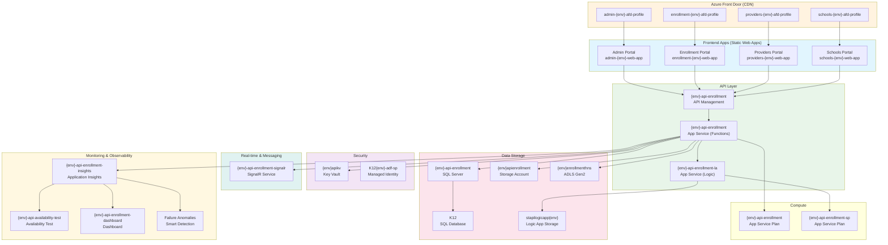
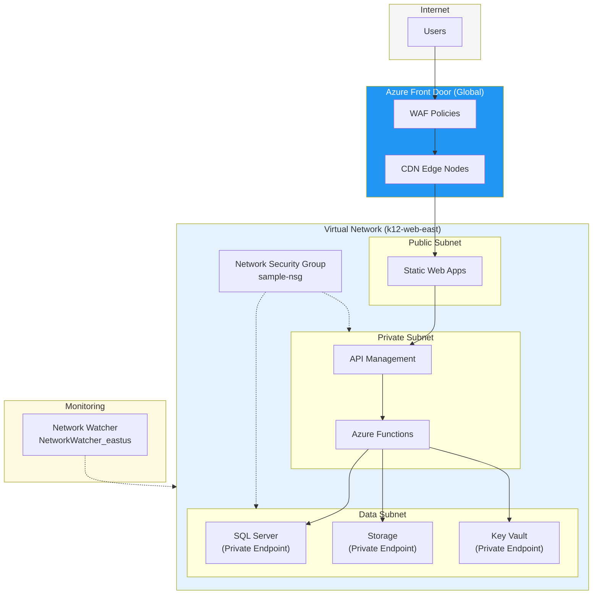
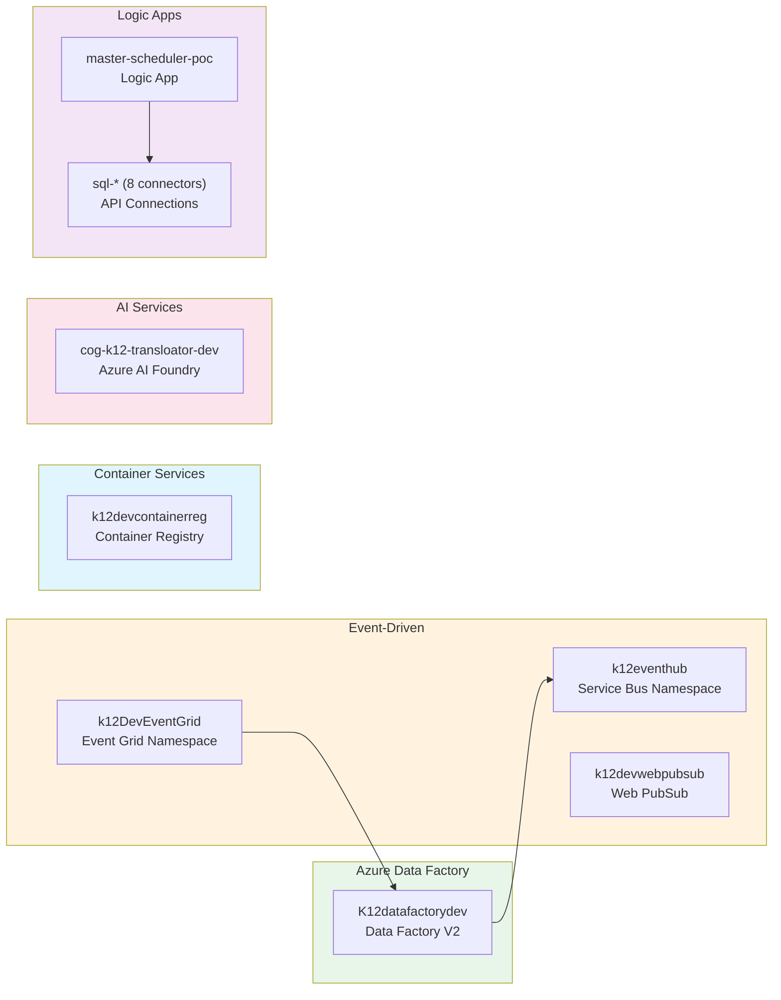
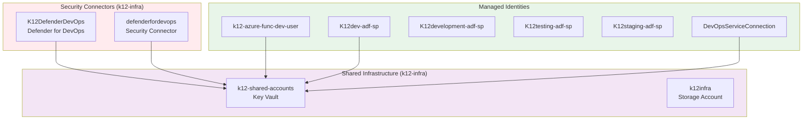

# C4 Deployment Diagram

## Azure Infrastructure Deployment

This diagram shows the actual Azure resources deployed for the K12 MyPortal system based on the Azure Resource Graph export.

```mermaid
C4Deployment
    title Deployment Diagram for K12 MyPortal

    Deployment_Node(azure, "Microsoft Azure", "Cloud Platform") {
        Deployment_Node(eus2, "East US 2", "Primary Region") {
            Deployment_Node(frontend, "Frontend Tier") {
                Container(admin_swa, "Admin Portal", "Static Web App", "admin-{env}-web-app")
                Container(enrollment_swa, "Enrollment Portal", "Static Web App", "enrollment-{env}-web-app")
                Container(providers_swa, "Providers Portal", "Static Web App", "providers-{env}-web-app")
                Container(schools_swa, "Schools Portal", "Static Web App", "schools-{env}-web-app")
            }

            Deployment_Node(edge, "Edge/CDN Tier") {
                Container(admin_fd, "Admin Front Door", "Azure Front Door", "admin-{env}-afd-profile")
                Container(enrollment_fd, "Enrollment Front Door", "Azure Front Door", "enrollment-{env}-afd-profile")
                Container(providers_fd, "Providers Front Door", "Azure Front Door", "providers-{env}-afd-profile")
                Container(schools_fd, "Schools Front Door", "Azure Front Door", "schools-{env}-afd-profile")
            }

            Deployment_Node(api, "API Tier") {
                Container(apim, "API Gateway", "API Management", "{env}-api-enrollment")
                Container(func, "API Functions", "App Service", "{env}-api-enrollment")
                Container(logic, "Logic App", "App Service", "{env}-api-enrollment-la")
            }

            Deployment_Node(data, "Data Tier") {
                ContainerDb(sql, "Database", "SQL Server", "{env}-api-enrollment + K12 DB")
                ContainerDb(blob, "Blob Storage", "Storage Account", "{env}apienrollment")
                ContainerDb(adls, "Document Lake", "Storage Account HNS", "{env}enrollmenthns")
            }

            Deployment_Node(integration, "Integration Tier") {
                Container(signalr, "Real-time Hub", "SignalR", "{env}-api-enrollment-signalr")
                ContainerDb(kv, "Secrets", "Key Vault", "{env}apikv")
            }

            Deployment_Node(monitoring, "Observability") {
                Container(ai, "Telemetry", "App Insights", "{env}-api-enrollment-insights")
                Container(la, "Logs", "Log Analytics", "managed-{env}-*-ws")
            }
        }

        Deployment_Node(cus, "Central US", "DR Region - Production Only") {
            Container(func_dr, "API Functions DR", "App Service", "app-k12-site-prd-dr")
            ContainerDb(sql_dr, "Database Replica", "SQL Server", "sql-k12-site-shared-dr")
        }

        Deployment_Node(global, "Global") {
            Container(entra, "Identity", "Entra ID B2C", "Authentication & Authorization")
        }
    }

    Rel(admin_fd, admin_swa, "Routes to")
    Rel(enrollment_fd, enrollment_swa, "Routes to")
    Rel(providers_fd, providers_swa, "Routes to")
    Rel(schools_fd, schools_swa, "Routes to")
    Rel(admin_swa, apim, "API calls")
    Rel(apim, func, "Routes requests")
    Rel(func, sql, "Reads/Writes")
    Rel(func, blob, "Temp files")
    Rel(func, adls, "Documents")
    Rel(func, signalr, "Push notifications")
    Rel(func, kv, "Secrets")
    Rel(sql, sql_dr, "Geo-replication")
```

## Environment Resource Map

### Per-Environment Resources (Dev/Test/Staging)



### Production-Specific Architecture (k12-cms)

```mermaid
flowchart TB
    subgraph Global["Global Services"]
        fd["fd-k12-site-shared<br/>Front Door + WAF"]
        comm["K12-CMS-Communication<br/>Communication Service"]
        email["K12-Email<br/>Email Service"]
        domain["ncseaa.edu<br/>Email Domain"]
    end

    subgraph EastUS2["East US 2 (Primary)"]
        subgraph ProdApps["Production Applications"]
            app_prd["app-k12-site-prd<br/>App Service"]
            app_stg["app-k12-site-stg<br/>Staging Slot"]
            warmup["app-k12-site-prd/warmup<br/>Warmup Slot"]
        end

        subgraph ProdData["Production Data"]
            sql_prd["sql-k12-site-shared<br/>SQL Server"]
            pool["sqlep-k12-site-shared<br/>Elastic Pool"]
            db_prd["sqldb-k12-site-prd<br/>Production DB"]
            db_stg["sqldb-k12-site-stg<br/>Staging DB"]
        end

        subgraph ProdStorage["Storage"]
            st_data["stk12data<br/>Storage Account"]
            st_audit["sqlauditk12cms<br/>Audit Storage"]
        end

        subgraph ProdCompute["Compute"]
            plan_shared["plan-k12-site-shared<br/>App Service Plan"]
        end

        subgraph ProdMonitor["Monitoring"]
            ai_prd["app-k12-site-prd<br/>Application Insights"]
            la_prd["la-k12-site-shared<br/>Log Analytics"]
        end
    end

    subgraph CentralUS["Central US (DR)"]
        subgraph DRApps["DR Applications"]
            app_dr["app-k12-site-prd-dr<br/>App Service (DR)"]
        end

        subgraph DRData["DR Data"]
            sql_dr["sql-k12-site-shared-dr<br/>SQL Server (DR)"]
            db_dr["sqldb-k12-site-prd<br/>DB Replica"]
        end

        subgraph DRCompute["Compute"]
            plan_dr["plan-k12-site-prd-dr<br/>App Service Plan"]
        end

        subgraph DRMonitor["Monitoring"]
            ai_dr["app-k12-site-prd-dr<br/>Application Insights"]
            la_dr["cf6841bb-*-K12-CMS-CUS<br/>Log Analytics"]
        end
    end

    subgraph Alerts["Alert Management"]
        ag_smart["Application Insights Smart Detection<br/>Action Group"]
        ag_ops["Notify_Netsupport<br/>Action Group"]
        alert_admin["K12 Admin Actions<br/>Activity Alert"]
        alert_down["K12 Prod Down<br/>Activity Alert"]
        alert_health["K12-CMS Production Resource Health<br/>Health Alert"]
    end

    fd --> app_prd
    fd --> app_dr

    app_prd --> plan_shared
    app_stg --> plan_shared
    warmup --> plan_shared

    app_prd --> sql_prd
    sql_prd --> pool
    pool --> db_prd
    pool --> db_stg

    app_prd --> st_data
    sql_prd --> st_audit

    app_prd --> ai_prd
    ai_prd --> la_prd

    app_dr --> plan_dr
    app_dr --> sql_dr
    sql_dr --> db_dr
    app_dr --> ai_dr
    ai_dr --> la_dr

    sql_prd -.->|Geo-Replication| sql_dr

    ai_prd --> ag_smart
    ai_prd --> ag_ops
    ai_dr --> ag_ops

    comm --> email
    email --> domain

    style Global fill:#e3f2fd
    style EastUS2 fill:#e8f5e9
    style CentralUS fill:#fff3e0
    style Alerts fill:#ffebee
```



## Resource Count Summary

| Resource Type | Development | Testing | Staging | Production | Total |
|--------------|-------------|---------|---------|------------|-------|
| **Static Web Apps** | 4 | 4 | 4 | 0* | 12 |
| **Front Door Profiles** | 4 | 4 | 4 | 1 | 13 |
| **App Services** | 2 | 2 | 2 | 4 | 10 |
| **App Service Plans** | 2 | 2 | 2 | 2 | 8 |
| **API Management** | 1 | 1 | 1 | 0 | 3 |
| **SQL Servers** | 1 | 1 | 1 | 2 | 5 |
| **SQL Databases** | 4 | 4 | 2 | 5 | 15 |
| **Storage Accounts** | 3 | 3 | 4 | 2 | 12 |
| **Key Vaults** | 1 | 1 | 1 | 0** | 3 |
| **SignalR Services** | 2 | 1 | 1 | 0 | 4 |
| **Application Insights** | 2 | 4 | 2 | 4 | 12 |
| **Log Analytics** | 1 | 1 | 1 | 4 | 7 |

*Production uses Front Door for web delivery
**Production uses shared Key Vault (k12-shared-accounts)

## Network Topology



## Additional Development Resources

### Data Integration (Development Only)



## Security Infrastructure



## Related Documentation

- [Azure Infrastructure Documentation](../azure-infrastructure.md)
- [System Context Diagram](01-system-context.md)
- [Container Diagram](02-container-diagram.md)
- [Security Architecture](../security/README.md)
