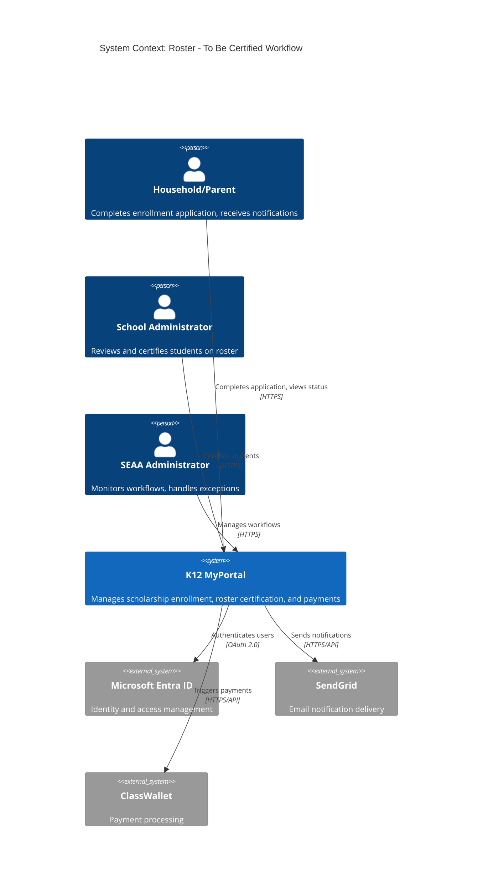
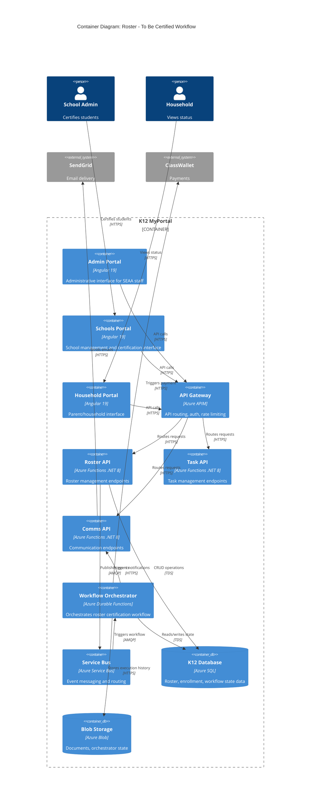
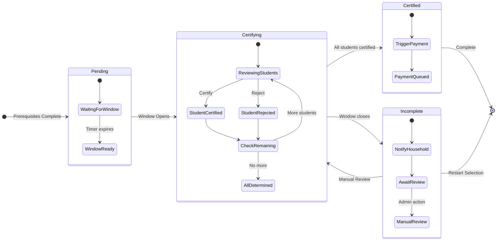
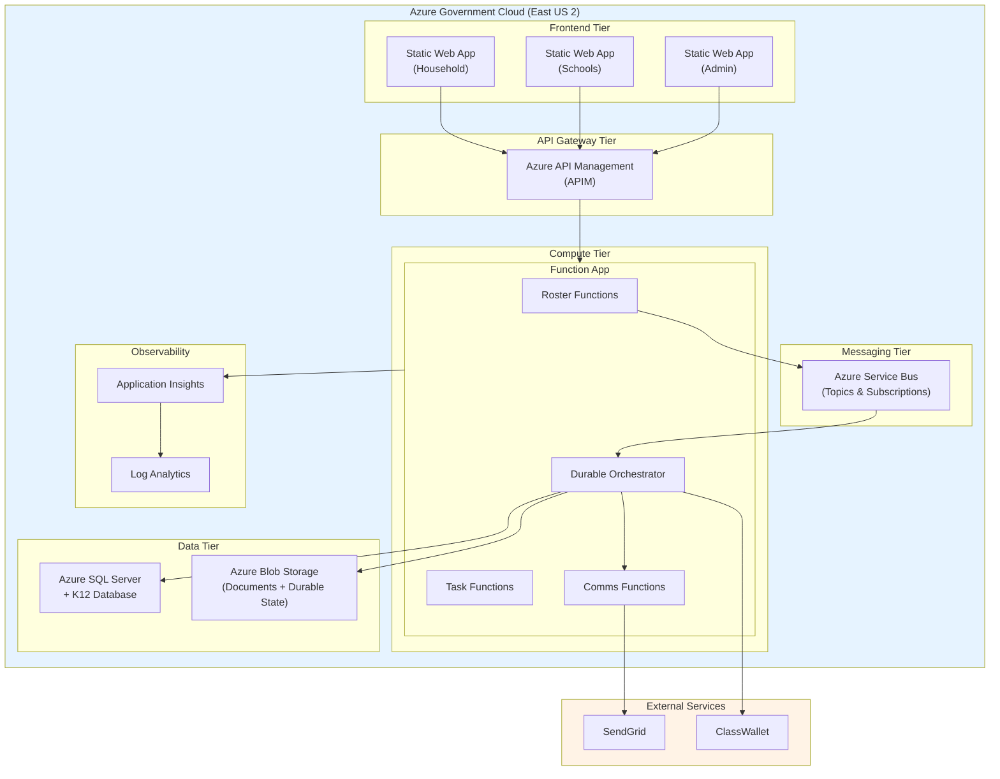
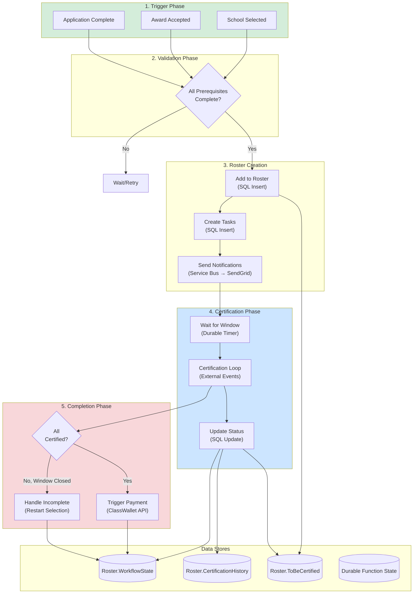

# C4 Diagrams: Roster - To Be Certified Workflow

This document provides C4 model diagrams for the Roster - To Be Certified workflow, showing the system context, container interactions, and deployment view.

---

## Table of Contents

1. [System Context (C4 Level 1)](#system-context-c4-level-1)
2. [Container Diagram (C4 Level 2)](#container-diagram-c4-level-2)
3. [Workflow State Diagram](#workflow-state-diagram)
4. [Deployment View](#deployment-view)
5. [Data Flow Diagram](#data-flow-diagram)

---

## System Context (C4 Level 1)

The Roster - To Be Certified workflow operates within the K12 MyPortal ecosystem, interacting with users and external systems.

### Context Description

| Element | Description |
|---------|-------------|
| **Household/Parent** | End users who complete enrollment applications and receive certification status notifications |
| **School Administrator** | School staff who review student information and certify enrollment on the roster |
| **SEAA Administrator** | State administrators who monitor workflow progress and handle exceptions |
| **K12 MyPortal** | The main system orchestrating enrollment, certification, and payment workflows |
| **Microsoft Entra ID** | External identity provider for authentication and authorization |
| **SendGrid** | External email service for notification delivery |
| **ClassWallet** | External payment processor triggered after successful certification |

---

## Container Diagram (C4 Level 2)

The workflow involves multiple containers within the K12 MyPortal system.

### Container Responsibilities

| Container | Technology | Responsibility |
|-----------|------------|----------------|
| **Admin Portal** | Angular 19 | SEAA staff interface for workflow monitoring |
| **Schools Portal** | Angular 19 | School admin interface for certification |
| **Household Portal** | Angular 19 | Parent interface for status viewing |
| **API Gateway** | Azure APIM | Request routing, authentication, rate limiting |
| **Roster API** | Azure Functions | Roster CRUD operations, event publishing |
| **Task API** | Azure Functions | Task management for certification process |
| **Comms API** | Azure Functions | Notification management |
| **Workflow Orchestrator** | Durable Functions | Long-running workflow orchestration |
| **Service Bus** | Azure Service Bus | Async event messaging |
| **K12 Database** | Azure SQL | Persistent data storage |
| **Blob Storage** | Azure Blob | Document and state storage |

---

## Workflow State Diagram

Visual representation of the workflow states and transitions.

### State Descriptions

| State | Duration | Actions |
|-------|----------|---------|
| **Pending** | Days to weeks | Students added to roster, waiting for certification window |
| **Certifying** | 1-4 weeks | Active certification period, school admins review students |
| **Certified** | Minutes | All certified, trigger payment workflow |
| **Incomplete** | Variable | Some not certified, await manual review or restart |

---

## Deployment View

Azure resources supporting the workflow.

### Resource Mapping

| Resource | Azure Service | SKU/Tier |
|----------|--------------|----------|
| Function App | Azure Functions | Consumption/Premium |
| Durable Functions | Azure Durable Functions | Uses Function App |
| Service Bus | Azure Service Bus | Standard |
| SQL Database | Azure SQL | S2/S3 |
| Blob Storage | Azure Blob | Standard LRS |
| API Management | Azure APIM | Developer/Standard |
| Application Insights | Azure Monitor | Per-GB |

---

## Data Flow Diagram

Complete data flow through the workflow.

### Data Flow Summary

| Phase | Source | Destination | Data |
|-------|--------|-------------|------|
| Trigger | API | Service Bus | ApplicationComplete event |
| Roster Creation | Orchestrator | Azure SQL | Roster entry, tasks |
| Notifications | Orchestrator | SendGrid | Email templates |
| Certification | School Portal | Azure SQL | Certification status |
| Payment | Orchestrator | ClassWallet | Payment request |

---

## Related Documentation

- [WF-01: Roster - To Be Certified Workflow](../workflows/WF-01-roster-to-be-certified.md)
- [ADR-012: Durable Functions for Orchestration](../../adr/ADR-012-roster-workflow-orchestration.md)
- [System Architecture Overview](../README.md)
- [Azure Infrastructure](../azure-infrastructure.md)
- [C4 Level 1: System Context](01-system-context.md)
- [C4 Level 2: Container Diagram](02-container-diagram.md)

---

*Generated: 2025-12-11 | Author: CFI Architecture Team*
