# C4 Diagrams: RDS Integration Architecture

**Document ID:** C4-05
**Subject:** Residency Determination Service (RDS) Integration
**Last Updated:** 2025-12-12

## Table of Contents

- [Level 1: System Context](#level-1-system-context)
- [Level 2: Container Diagram](#level-2-container-diagram)
- [Level 3: Component Diagram](#level-3-component-diagram)
- [Sequence Diagrams](#sequence-diagrams)
- [Data Flow Diagrams](#data-flow-diagrams)

---

## Source of Truth Architecture

> **Critical Design Decision:** K12 MyPortal is the **authoritative source of truth** for final residency determination. RDS aggregates raw agency data (DMV, DOR) but does NOT make the final Y/N decision. K12 applies SEAA business rules to the raw data.

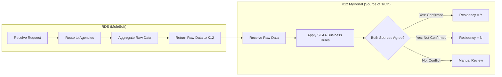

See [ADR-013: RDS Asynchronous Integration Pattern](../../adr/ADR-013-rds-async-integration-pattern.md) for the full architectural decision.

---

## Level 1: System Context

### RDS Integration Context Diagram

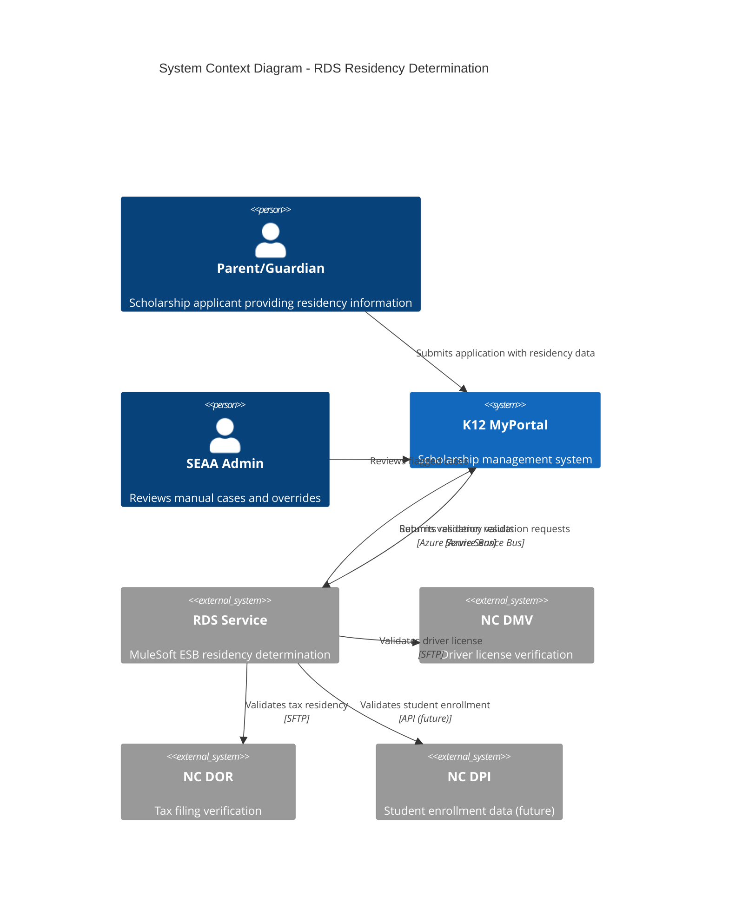

### Context Description

| Actor/System | Description | Interaction |
|--------------|-------------|-------------|
| **Parent/Guardian** | Scholarship applicant | Provides SSN, DOB, license info during enrollment |
| **SEAA Admin** | State agency administrator | Reviews cases with validation errors |
| **K12 MyPortal** | Primary scholarship platform | Orchestrates validation requests/responses |
| **RDS Service** | MuleSoft integration layer | Routes requests to state agencies |
| **NC DMV** | Dept of Motor Vehicles | Provides driver license/vehicle registration data |
| **NC DOR** | Dept of Revenue | Provides tax filing/residency status |
| **NC DPI** | Dept of Public Instruction | Student enrollment verification (future) |

---

## Level 2: Container Diagram

### RDS Integration Containers

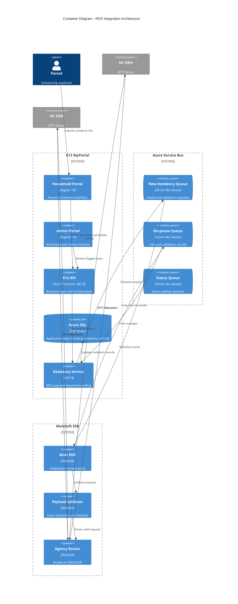

### Container Responsibilities

| Container | Technology | Responsibility |
|-----------|-----------|---------------|
| **Household Portal** | Angular 19 | Collect residency data from parents |
| **Admin Portal** | Angular 19 | Manual review interface for flagged cases |
| **K12 API** | Azure Functions | HTTP endpoints, business logic |
| **Azure SQL** | SQL Server | Persist validation requests/results |
| **Residency Service** | .NET 8 | Queue message handling |
| **New Residency Queue** | Service Bus | Buffer outbound requests |
| **Response Queue** | Service Bus | Receive validation results |
| **Mule RDS** | MuleSoft | ESB orchestration |
| **Payload Validator** | MuleSoft | Input validation, default handling |
| **Agency Router** | MuleSoft | Route to DMV/DOR via SFTP |

---

## Level 3: Component Diagram

### K12 Residency Service Components

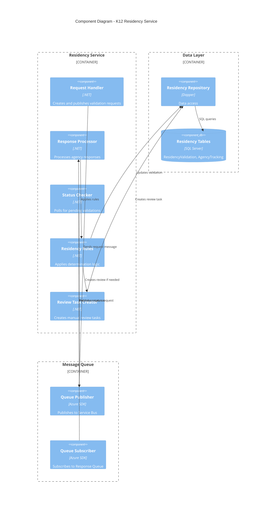

### MuleSoft RDS Components

> **Note:** RDS does NOT determine residency. It aggregates raw agency data and returns it to K12. The "Response Aggregator" combines data but does NOT apply business rules - that happens in K12.

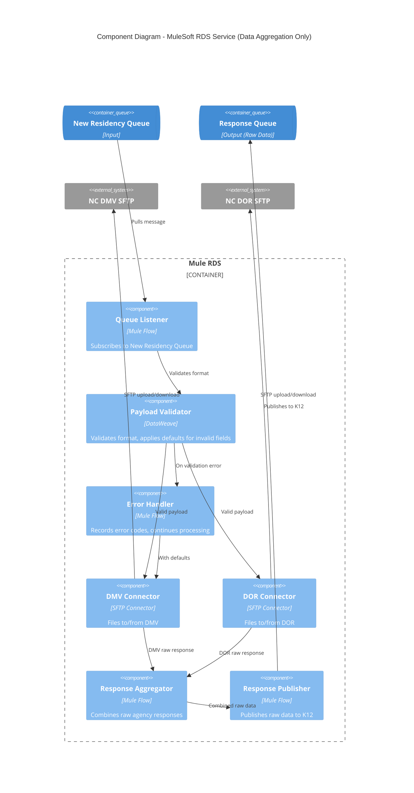

---

## Sequence Diagrams

### Successful Residency Validation Flow

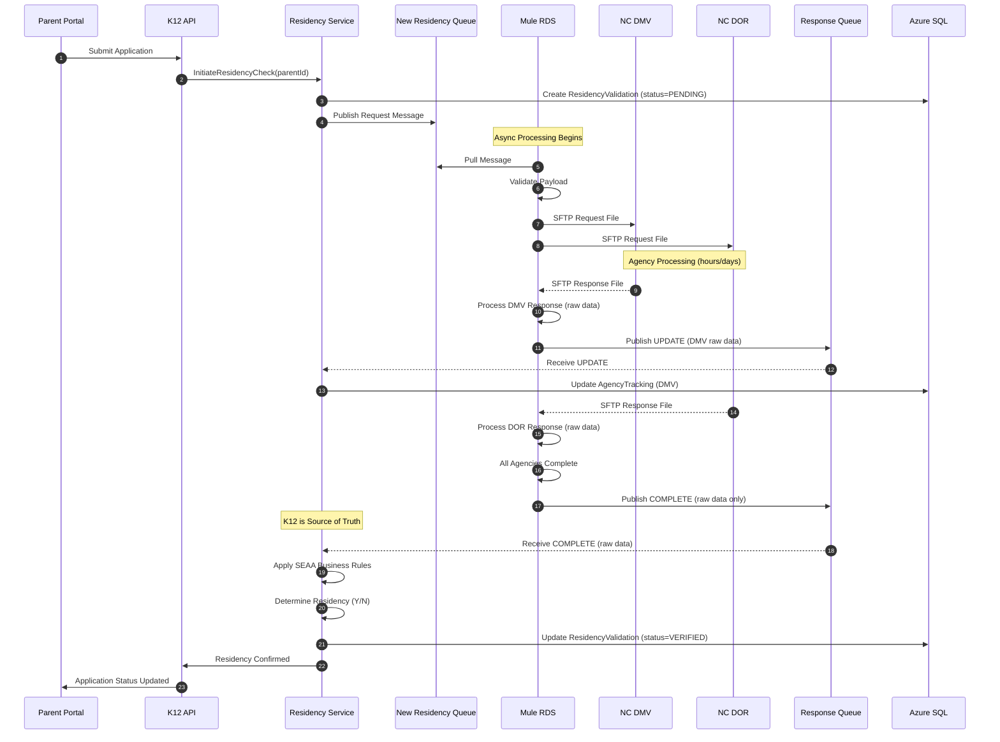

### Validation with Errors (Manual Review)

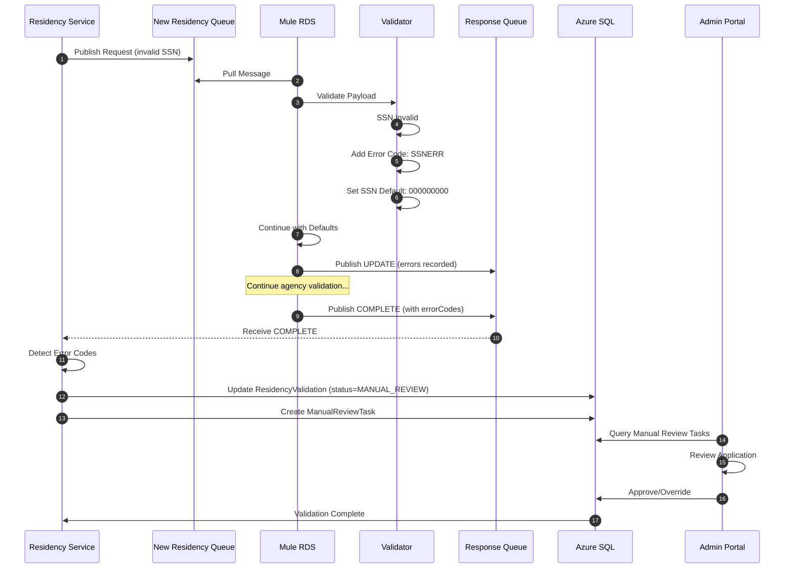

---

## Data Flow Diagrams

### Request Data Flow

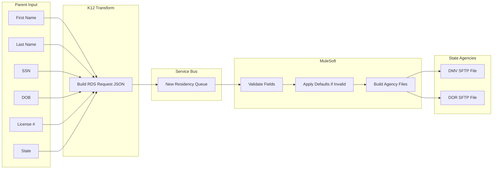

### Response Data Flow

> **Note:** The diagram below shows that K12 (not MuleSoft) applies the residency business rules. MuleSoft only aggregates raw data.

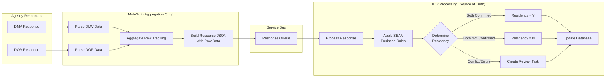

### Database Entity Relationships

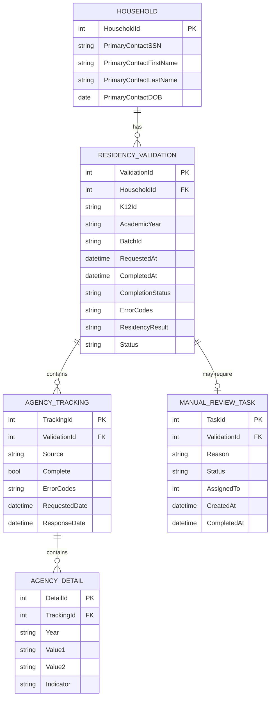

---

## Deployment View

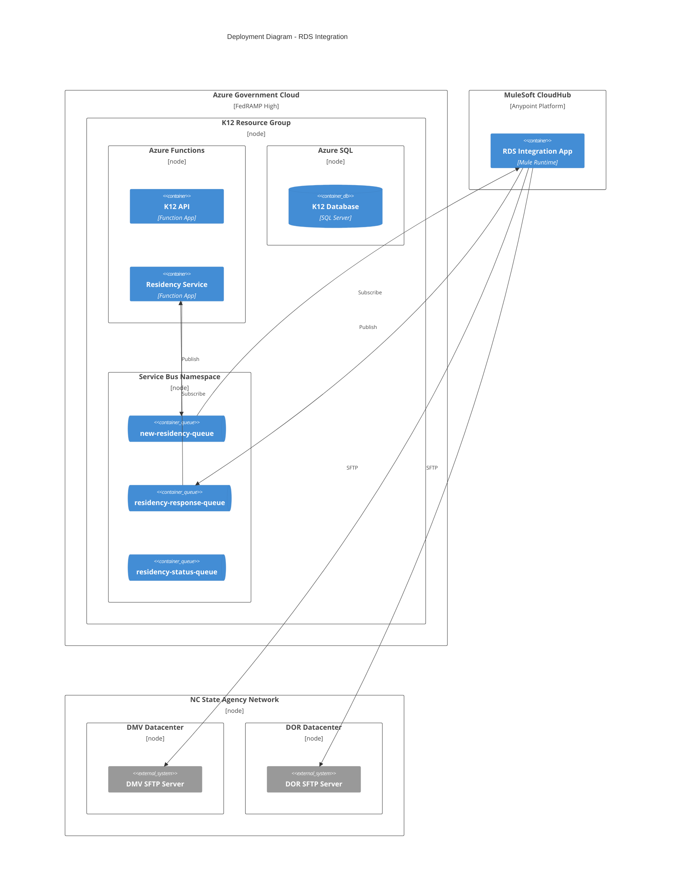

---

## Related Documentation

- [INT-07: RDS Integration](../integrations/INT-07-rds-residency-determination-service.md)
- [INT-05: NC DMV/DOR Integration](../integrations/INT-05-nc-dmv-dor-integration.md) (Legacy)
- [02-Container Diagram](02-container-diagram.md)
- [ADR-013: RDS Integration Pattern](../../adr/ADR-013-rds-async-integration-pattern.md)

---

**Document Version:** 1.0
**Last Reviewed:** 2025-12-12
**Owner:** CFI Architecture Team
