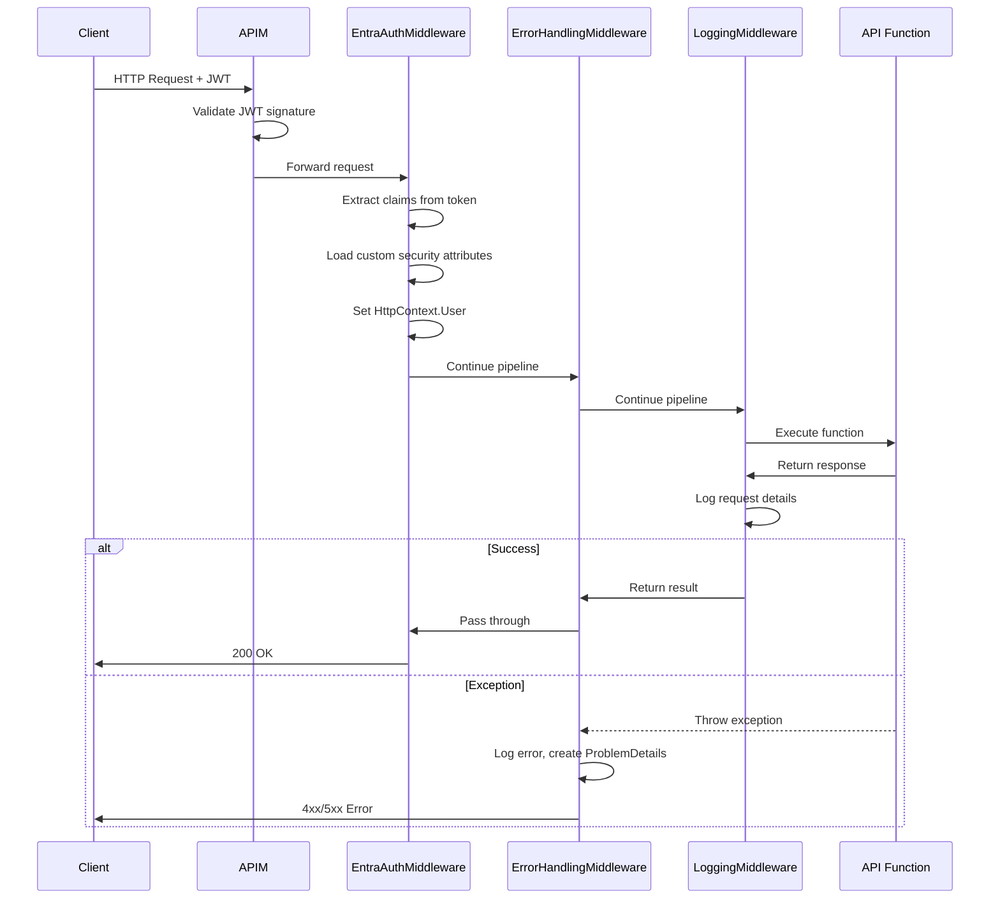
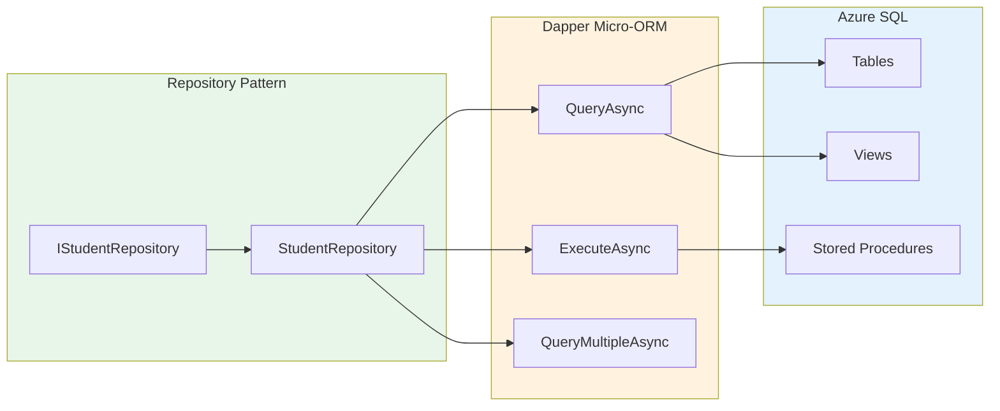
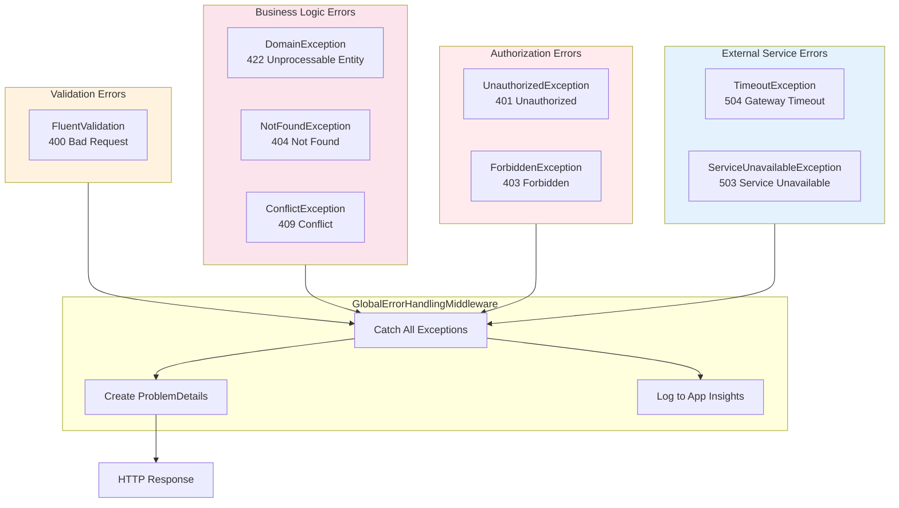

# C4 Level 3: Backend Component Diagram

## API Backend Components

```mermaid
C4Component
    title Component Diagram for K12 MyPortal API Backend

    Container_Boundary(api, "Azure Functions API (.NET 8)") {
        Component(admin, "Admin API", "HTTP Trigger", "Administrative operations, user management, program configuration")
        Component(programs, "Programs API", "HTTP Trigger", "Program management, ESA+, Opportunity Scholarship")
        Component(enrollment, "Enrollment API", "HTTP Trigger", "Application submission, status tracking")
        Component(households, "Households API", "HTTP Trigger", "Family management, student records")
        Component(awards, "Awards API", "HTTP Trigger", "Award allocation, disbursement tracking")
        Component(tasks, "Tasks API", "HTTP Trigger", "Work queue, task assignment")
        Component(comms, "Communications API", "HTTP Trigger", "Email, notifications, messages")
        Component(docs, "Documents API", "HTTP Trigger", "Upload, download, SAS generation")
        Component(signalr_hub, "SignalR Hub", "HTTP Trigger", "Real-time connection management")

        Component(middleware, "Middleware", ".NET Middleware", "Authentication, error handling, logging")
        Component(admin_app, "AdminApp", "Application Layer", "Admin business logic (57KB)")
        Component(enrollment_app, "EnrollmentApp", "Application Layer", "Enrollment business logic")
        Component(programs_app, "ProgramsApp", "Application Layer", "Program business logic")

        Component(validators, "Validators", "FluentValidation", "Input validation rules")
        Component(rules_engine, "Rules Engine", "NRules", "Business rules evaluation")
        Component(mappers, "Mappers", "AutoMapper", "Object-to-object mapping")

        Component(repositories, "Repositories", "Dapper", "Data access layer")
        Component(blob_service, "BlobService", "Azure SDK", "Blob storage operations")
        Component(adls_service, "ADLSService", "Azure SDK", "Document lake operations")
        Component(graph_service, "GraphService", "Microsoft Graph", "Entra ID operations")
        Component(email_service, "EmailService", "SendGrid SDK", "Email delivery")
        Component(pandadoc_service, "PandaDocService", "HTTP Client", "Document generation")
        Component(classwallet_service, "ClassWalletService", "HTTP Client", "Payment operations")
    }

    ContainerDb(sql, "Azure SQL", "SQL Server", "Application database")
    ContainerDb(blob, "Blob Storage", "Azure Blob", "Temporary files")
    ContainerDb(adls, "ADLS Gen2", "Data Lake", "Document storage")

    System_Ext(entra, "Microsoft Entra ID", "Identity provider")
    System_Ext(sendgrid, "SendGrid", "Email service")
    System_Ext(pandadoc, "PandaDoc", "Document service")
    System_Ext(classwallet, "ClassWallet", "Payment service")
    System_Ext(signalr, "Azure SignalR", "Real-time service")

    Rel(admin, middleware, "Uses")
    Rel(programs, middleware, "Uses")
    Rel(enrollment, middleware, "Uses")

    Rel(admin, admin_app, "Calls")
    Rel(enrollment, enrollment_app, "Calls")
    Rel(programs, programs_app, "Calls")

    Rel(admin_app, validators, "Uses")
    Rel(admin_app, rules_engine, "Uses")
    Rel(admin_app, mappers, "Uses")
    Rel(admin_app, repositories, "Uses")

    Rel(repositories, sql, "Queries", "SQL/Dapper")
    Rel(blob_service, blob, "Read/Write", "Azure SDK")
    Rel(adls_service, adls, "Read/Write", "Azure SDK")
    Rel(graph_service, entra, "API calls", "HTTPS/Graph")
    Rel(email_service, sendgrid, "Send email", "HTTPS/REST")
    Rel(pandadoc_service, pandadoc, "Generate docs", "HTTPS/REST")
    Rel(classwallet_service, classwallet, "Payments", "HTTPS/REST")
    Rel(signalr_hub, signalr, "Push", "Azure SDK")
```



## Layered Architecture

```mermaid
flowchart TB
    subgraph Presentation["Presentation Layer (API/)"]
        http["HTTP Triggers"]
        timer["Timer Triggers"]
        signalr["SignalR Hub"]
    end

    subgraph Middleware["Middleware Layer"]
        auth["EntraAuthenticationMiddleware"]
        error["GlobalErrorHandlingMiddleware"]
        logging["LoggingMiddleware"]
    end

    subgraph Application["Application Layer (CFIK12.Application/)"]
        admin_app["AdminApp"]
        enrollment_app["EnrollmentApp"]
        programs_app["ProgramsApp"]
        households_app["HouseholdsApp"]
        awards_app["AwardsApp"]
        tasks_app["TasksApp"]
    end

    subgraph Domain["Domain Layer (CFIK12.Domain/)"]
        entities["Entities"]
        validators["FluentValidation"]
        enums["Enums"]
        dtos["DTOs"]
    end

    subgraph Infrastructure["Infrastructure Layer (CFIK12.Infrastructure/)"]
        blob["BlobStorageService"]
        signalr_svc["SignalRService"]
        sendgrid["SendGridService"]
        pandadoc["PandaDocService"]
        graph["MicrosoftGraphService"]
    end

    subgraph Data["Data Layer (Repository Pattern)"]
        repos["Repositories"]
        dapper["Dapper"]
    end

    subgraph External["External Systems"]
        sql["Azure SQL"]
        storage["Azure Storage"]
        ext_services["External APIs"]
    end

    http --> auth
    timer --> auth
    auth --> error
    error --> logging
    logging --> Application

    Application --> Domain
    Application --> Infrastructure
    Application --> Data

    Data --> dapper
    dapper --> sql

    Infrastructure --> storage
    Infrastructure --> ext_services

    style Presentation fill:#e3f2fd
    style Middleware fill:#fff3e0
    style Application fill:#e8f5e9
    style Domain fill:#fce4ec
    style Infrastructure fill:#f3e5f5
    style Data fill:#e0f2f1
    style External fill:#f5f5f5
```

## Component Responsibilities

### API Layer (HTTP Triggers)

| Component | File | Size | Responsibilities |
|-----------|------|------|------------------|
| **Admin.cs** | `API/Admin.cs` | ~15KB | User management, system configuration, reporting |
| **Programs.cs** | `API/Programs.cs` | ~41KB | Program CRUD, rules configuration, eligibility |
| **Enrollment.cs** | `API/Enrollment.cs` | ~20KB | Application submission, document upload |
| **Tasks.cs** | `API/Tasks.cs` | ~33KB | Work queue management, task assignment |
| **Communications.cs** | `API/Communications.cs` | ~26KB | Email templates, notification management |
| **Households.cs** | `API/Households.cs` | ~18KB | Family management, student records |
| **Awards.cs** | `API/Awards.cs` | ~12KB | Award allocation, disbursement |
| **Documents.cs** | `API/Documents.cs` | ~8KB | SAS token generation, download handling |

### Application Layer

| Component | File | Size | Responsibilities |
|-----------|------|------|------------------|
| **AdminApp** | `CFIK12.Application/AdminApp.cs` | ~57KB | Complex admin workflows, approval processes |
| **EnrollmentApp** | `CFIK12.Application/EnrollmentApp.cs` | ~25KB | Enrollment business logic, validation |
| **ProgramsApp** | `CFIK12.Application/ProgramsApp.cs` | ~30KB | Program configuration, eligibility rules |
| **HouseholdsApp** | `CFIK12.Application/HouseholdsApp.cs` | ~15KB | Family management logic |
| **AwardsApp** | `CFIK12.Application/AwardsApp.cs` | ~12KB | Award calculation, disbursement |

### Middleware Layer



### Domain Layer

**Entities (EF-generated)**
```
CFIK12.Domain/
├── Entities/
│   ├── Student.cs
│   ├── Application.cs
│   ├── Household.cs
│   ├── Award.cs
│   ├── Program.cs
│   └── ... (100+ entities)
├── Validators/
│   ├── StudentValidator.cs
│   ├── ApplicationValidator.cs
│   └── ...
├── Enums/
│   ├── ApplicationStatus.cs
│   ├── AwardType.cs
│   └── ...
└── DTOs/
    ├── StudentDto.cs
    ├── ApplicationDto.cs
    └── ...
```

### Infrastructure Layer

| Service | External System | Purpose |
|---------|-----------------|---------|
| **BlobStorageService** | Azure Blob Storage | Temporary file uploads |
| **ADLSService** | Azure Data Lake Gen2 | Document storage with RBAC |
| **SignalRService** | Azure SignalR | Real-time notifications |
| **SendGridService** | SendGrid API | Email delivery |
| **PandaDocService** | PandaDoc API | Document generation |
| **ClassWalletService** | ClassWallet API | Payment processing |
| **MicrosoftGraphService** | Microsoft Graph | Entra ID operations |

### Data Layer (Repository Pattern)



**Key Repository Methods:**
```csharp
public interface IStudentRepository
{
    Task<Student?> GetByIdAsync(Guid id);
    Task<IEnumerable<Student>> GetByHouseholdAsync(Guid householdId);
    Task<Guid> CreateAsync(Student student);
    Task UpdateAsync(Student student);
    Task DeleteAsync(Guid id);
}
```

## Dependency Injection Configuration

The DI container is configured in `Enrollment/Program.cs`:

```csharp
var host = new HostBuilder()
    .ConfigureFunctionsWorkerDefaults(worker =>
    {
        worker.UseMiddleware<EntraAuthenticationMiddleware>();
        worker.UseMiddleware<GlobalErrorHandlingMiddleware>();
    })
    .ConfigureServices((context, services) =>
    {
        // Application Services
        services.AddScoped<IAdminApp, AdminApp>();
        services.AddScoped<IEnrollmentApp, EnrollmentApp>();
        services.AddScoped<IProgramsApp, ProgramsApp>();

        // Infrastructure Services
        services.AddScoped<IBlobStorageService, BlobStorageService>();
        services.AddScoped<ISignalRService, SignalRService>();
        services.AddScoped<ISendGridService, SendGridService>();

        // Repositories
        services.AddScoped<IStudentRepository, StudentRepository>();
        services.AddScoped<IApplicationRepository, ApplicationRepository>();

        // Validators
        services.AddValidatorsFromAssemblyContaining<StudentValidator>();

        // AutoMapper
        services.AddAutoMapper(typeof(MappingProfile));

        // NRules
        services.AddSingleton<IRulesEngine, RulesEngine>();

        // HTTP Clients with Polly
        services.AddHttpClient<IClassWalletClient, ClassWalletClient>()
            .AddTransientHttpErrorPolicy(p => p.WaitAndRetryAsync(3, _ => TimeSpan.FromSeconds(2)));
    })
    .Build();
```

## Error Handling Strategy



## Related Documentation

- [Container Diagram](02-container-diagram.md)
- [System Context](01-system-context.md)
- [Security Architecture](../security/README.md)
- [ADR-002: Dapper for Data Access](../../adr/ADR-002-dapper-over-entity-framework.md)
- [ADR-005: NRules Business Rules Engine](../../adr/ADR-005-nrules-business-rules.md)

---

*Created: December 2025*
*Author: Architecture Team*
*Review Date: Q1 2026*
