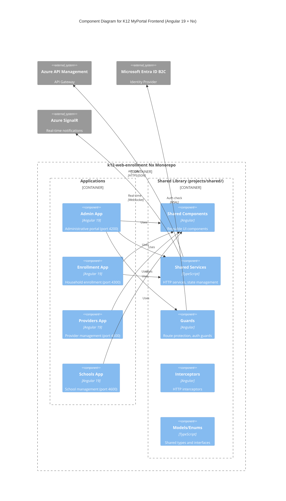
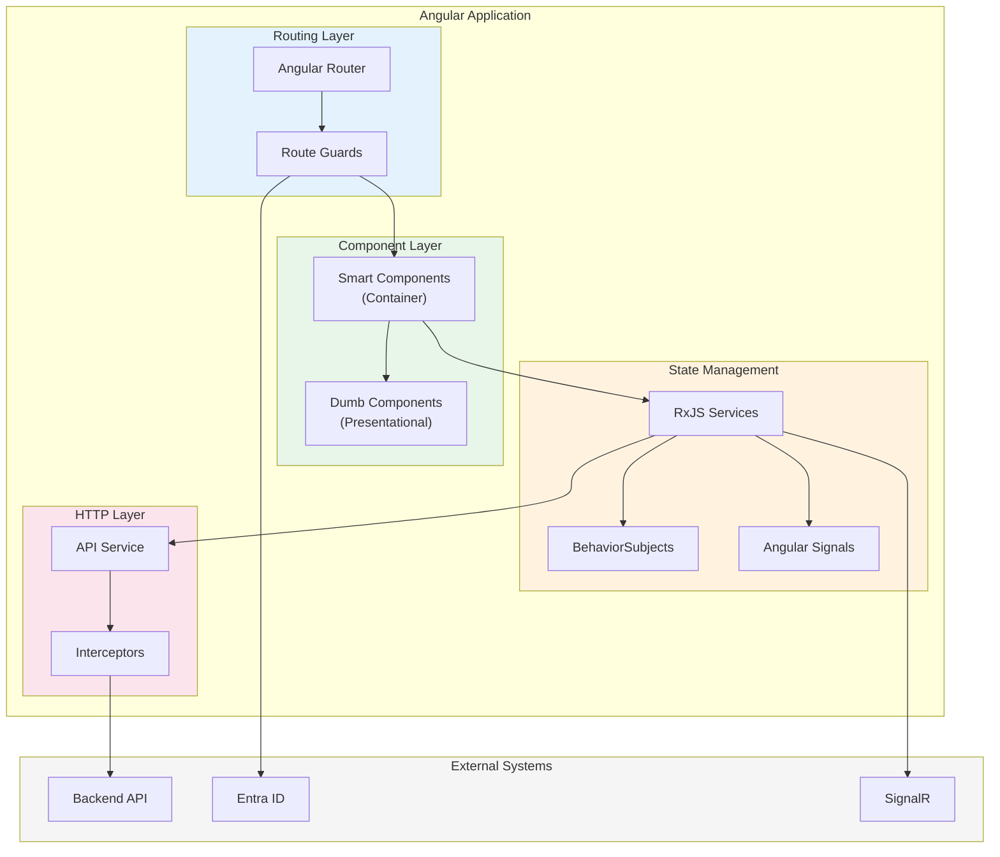
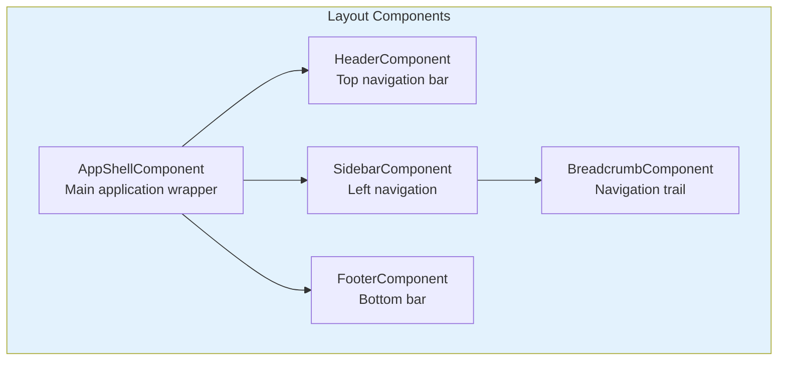
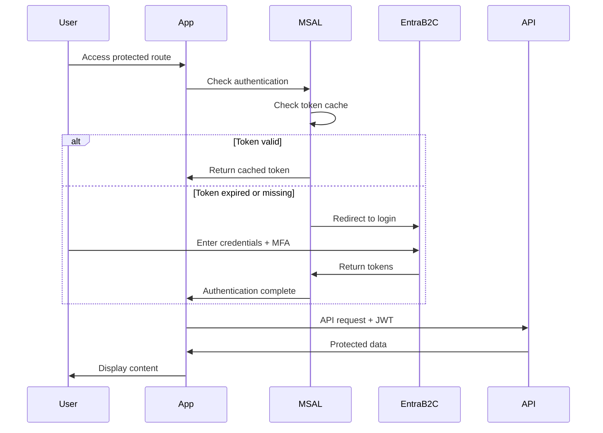
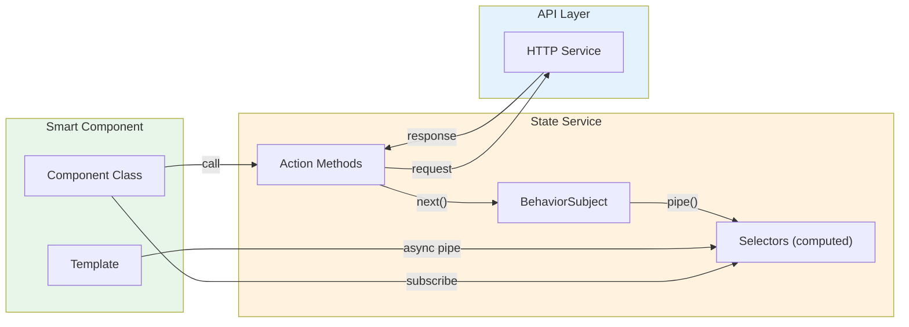
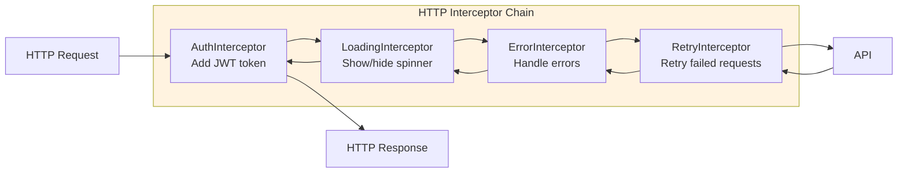
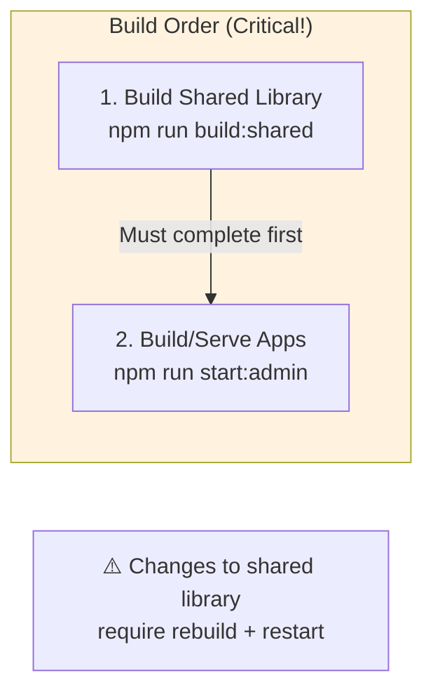

# C4 Level 3: Frontend Component Diagram

## Angular Nx Monorepo Architecture



## Monorepo Structure

```
k12-web-enrollment/
├── apps/
│   ├── admin/                    # Admin Portal (4200)
│   │   ├── src/
│   │   │   ├── app/
│   │   │   │   ├── app.routes.ts
│   │   │   │   ├── app.config.ts
│   │   │   │   ├── app.component.ts
│   │   │   │   └── features/     # Feature modules
│   │   │   │       ├── dashboard/
│   │   │   │       ├── programs/
│   │   │   │       ├── applications/
│   │   │   │       ├── users/
│   │   │   │       └── reports/
│   │   │   └── environments/
│   │   └── project.json
│   │
│   ├── enrollment/               # Household Enrollment (4300)
│   │   └── src/app/features/
│   │       ├── application/
│   │       ├── documents/
│   │       ├── household/
│   │       └── status/
│   │
│   ├── providers/                # Provider Portal (4500)
│   │   └── src/app/features/
│   │       ├── dashboard/
│   │       ├── services/
│   │       ├── invoices/
│   │       └── staff/
│   │
│   └── schools/                  # School Portal (4600)
│       └── src/app/features/
│           ├── dashboard/
│           ├── students/
│           ├── enrollment/
│           └── funding/
│
├── projects/
│   └── shared/                   # Shared Library
│       ├── components/           # Reusable UI components
│       │   ├── layout/
│       │   ├── forms/
│       │   ├── tables/
│       │   └── dialogs/
│       ├── services/             # HTTP and state services
│       │   ├── api.service.ts
│       │   ├── auth.service.ts
│       │   ├── signalr.service.ts
│       │   └── state/
│       ├── guards/               # Route guards
│       │   ├── auth.guard.ts
│       │   ├── role.guard.ts
│       │   └── unsaved-changes.guard.ts
│       ├── interceptors/         # HTTP interceptors
│       │   ├── auth.interceptor.ts
│       │   ├── error.interceptor.ts
│       │   └── loading.interceptor.ts
│       ├── models/               # TypeScript interfaces
│       │   ├── student.model.ts
│       │   ├── application.model.ts
│       │   └── ...
│       ├── enums/                # Enumerations
│       │   ├── application-status.enum.ts
│       │   └── ...
│       └── public-api.ts         # Library exports
│
├── nx.json                       # Nx workspace configuration
├── package.json                  # Dependencies
└── tsconfig.base.json            # TypeScript configuration
```

## Application Architecture Pattern



## Shared Components Library

### Layout Components



| Component | Purpose | Used By |
|-----------|---------|---------|
| `AppShellComponent` | Main layout wrapper with header/sidebar/content | All apps |
| `HeaderComponent` | Top navigation, user menu, notifications | All apps |
| `SidebarComponent` | Left navigation menu (configurable per app) | All apps |
| `BreadcrumbComponent` | Navigation breadcrumb trail | All apps |
| `FooterComponent` | Footer with links, version info | All apps |

### Form Components

| Component | Purpose | Features |
|-----------|---------|----------|
| `FormFieldComponent` | Wrapper for form inputs | Validation display, labels |
| `DatePickerComponent` | Date selection | Min/max dates, format |
| `FileUploadComponent` | Document upload | Drag & drop, preview |
| `AddressFormComponent` | Address entry | Auto-complete (Melissa) |
| `PhoneInputComponent` | Phone number entry | Formatting, validation |
| `SSNInputComponent` | SSN entry | Masking, validation |

### Table Components

| Component | Purpose | Features |
|-----------|---------|----------|
| `DataTableComponent` | Data grid | Sorting, filtering, pagination |
| `ActionColumnComponent` | Row actions | Edit, delete, view buttons |
| `StatusChipComponent` | Status display | Color-coded chips |
| `ExportButtonComponent` | Data export | CSV, Excel, PDF |

### Dialog Components

| Component | Purpose | Features |
|-----------|---------|----------|
| `ConfirmDialogComponent` | Confirmation modal | Yes/No actions |
| `AlertDialogComponent` | Alert messages | Info, warning, error |
| `FormDialogComponent` | Modal forms | Configurable fields |
| `ViewDialogComponent` | Read-only details | Data display |

## Shared Services

### API Service

```typescript
// projects/shared/services/api.service.ts
@Injectable({ providedIn: 'root' })
export class ApiService {
  private readonly baseUrl = environment.apiUrl;

  constructor(private http: HttpClient) {}

  // Generic CRUD operations
  get<T>(endpoint: string, params?: HttpParams): Observable<T> {
    return this.http.get<T>(`${this.baseUrl}/${endpoint}`, { params });
  }

  post<T>(endpoint: string, body: unknown): Observable<T> {
    return this.http.post<T>(`${this.baseUrl}/${endpoint}`, body);
  }

  put<T>(endpoint: string, body: unknown): Observable<T> {
    return this.http.put<T>(`${this.baseUrl}/${endpoint}`, body);
  }

  delete<T>(endpoint: string): Observable<T> {
    return this.http.delete<T>(`${this.baseUrl}/${endpoint}`);
  }
}
```

### Auth Service (MSAL Integration)



### SignalR Service

```typescript
// projects/shared/services/signalr.service.ts
@Injectable({ providedIn: 'root' })
export class SignalRService {
  private hubConnection: HubConnection;
  private notifications$ = new BehaviorSubject<Notification[]>([]);

  readonly notifications = this.notifications$.asObservable();

  async connect(userId: string): Promise<void> {
    this.hubConnection = new HubConnectionBuilder()
      .withUrl(`${environment.signalRUrl}`, {
        accessTokenFactory: () => this.authService.getAccessToken()
      })
      .withAutomaticReconnect()
      .build();

    this.hubConnection.on('ReceiveNotification', (notification: Notification) => {
      const current = this.notifications$.value;
      this.notifications$.next([notification, ...current]);
    });

    await this.hubConnection.start();
    await this.hubConnection.invoke('JoinUserGroup', userId);
  }
}
```

### State Management Pattern



**Example State Service:**

```typescript
// projects/shared/services/state/applications.state.ts
interface ApplicationsState {
  applications: Application[];
  selectedId: string | null;
  loading: boolean;
  error: string | null;
}

@Injectable({ providedIn: 'root' })
export class ApplicationsStateService {
  private state$ = new BehaviorSubject<ApplicationsState>({
    applications: [],
    selectedId: null,
    loading: false,
    error: null
  });

  // Selectors
  readonly applications$ = this.state$.pipe(map(s => s.applications));
  readonly selected$ = this.state$.pipe(
    map(s => s.applications.find(a => a.id === s.selectedId))
  );
  readonly loading$ = this.state$.pipe(map(s => s.loading));

  // Actions
  loadApplications(): void {
    this.updateState({ loading: true, error: null });
    this.api.get<Application[]>('applications').pipe(
      tap(applications => this.updateState({ applications, loading: false })),
      catchError(error => {
        this.updateState({ loading: false, error: error.message });
        return EMPTY;
      })
    ).subscribe();
  }

  selectApplication(id: string): void {
    this.updateState({ selectedId: id });
  }

  private updateState(partial: Partial<ApplicationsState>): void {
    this.state$.next({ ...this.state$.value, ...partial });
  }
}
```

## Guards and Interceptors

### Auth Guard

```typescript
// projects/shared/guards/auth.guard.ts
export const authGuard: CanActivateFn = (route, state) => {
  const authService = inject(AuthService);
  const router = inject(Router);

  if (authService.isAuthenticated()) {
    return true;
  }

  return router.createUrlTree(['/login'], {
    queryParams: { returnUrl: state.url }
  });
};
```

### Role Guard

```typescript
// projects/shared/guards/role.guard.ts
export const roleGuard: CanActivateFn = (route, state) => {
  const authService = inject(AuthService);
  const requiredRoles = route.data['roles'] as string[];

  const userRoles = authService.getUserRoles();
  const hasRole = requiredRoles.some(role => userRoles.includes(role));

  if (hasRole) {
    return true;
  }

  return inject(Router).createUrlTree(['/forbidden']);
};
```

### HTTP Interceptors



| Interceptor | Purpose | Implementation |
|-------------|---------|----------------|
| `AuthInterceptor` | Add JWT Bearer token to requests | Inject token from MSAL |
| `LoadingInterceptor` | Show loading spinner during requests | Emit to loading service |
| `ErrorInterceptor` | Handle HTTP errors globally | Show toast notifications |
| `RetryInterceptor` | Retry failed requests | Exponential backoff |

## Application-Specific Features

### Admin Portal (4200)

| Feature Module | Purpose |
|----------------|---------|
| `DashboardModule` | System overview, metrics, alerts |
| `ProgramsModule` | Program management, configuration |
| `ApplicationsModule` | Application review, approval |
| `UsersModule` | User management, roles |
| `ReportsModule` | Reporting, analytics |
| `TasksModule` | Work queue management |
| `SettingsModule` | System configuration |

### Enrollment Portal (4300)

| Feature Module | Purpose |
|----------------|---------|
| `ApplicationModule` | Application wizard |
| `DocumentsModule` | Document upload |
| `HouseholdModule` | Family management |
| `StatusModule` | Application status tracking |
| `AwardsModule` | Award information |

### Providers Portal (4500)

| Feature Module | Purpose |
|----------------|---------|
| `DashboardModule` | Provider overview |
| `ServicesModule` | Service management |
| `InvoicesModule` | Invoice submission |
| `StaffModule` | Staff management |
| `StudentsModule` | Assigned students |

### Schools Portal (4600)

| Feature Module | Purpose |
|----------------|---------|
| `DashboardModule` | School overview |
| `StudentsModule` | Student enrollment |
| `AttendanceModule` | Attendance tracking |
| `FundingModule` | Funding allocation |
| `StaffModule` | Staff management |

## Build Configuration

### Nx Project Configuration

```json
// apps/admin/project.json
{
  "name": "admin",
  "projectType": "application",
  "targets": {
    "build": {
      "executor": "@angular-devkit/build-angular:browser",
      "options": {
        "outputPath": "dist/apps/admin",
        "index": "apps/admin/src/index.html",
        "main": "apps/admin/src/main.ts"
      },
      "configurations": {
        "development": {
          "optimization": false,
          "sourceMap": true
        },
        "production": {
          "optimization": true,
          "sourceMap": false,
          "budgets": [
            { "type": "initial", "maximumWarning": "500kb", "maximumError": "1mb" }
          ]
        }
      }
    },
    "serve": {
      "executor": "@angular-devkit/build-angular:dev-server",
      "options": {
        "port": 4200
      }
    }
  },
  "implicitDependencies": ["shared"]
}
```

### Critical Build Workflow



**Commands:**
```bash
# Always build shared first
npm run build:shared

# Then start individual apps
npm run start:admin      # https://localhost:4200
npm run start:enrollment # http://localhost:4300
npm run start:providers  # http://localhost:4500
npm run start:schools    # http://localhost:4600
```

## Technology Stack

| Technology | Version | Purpose |
|------------|---------|---------|
| **Angular** | 19.2.6 | Component framework |
| **Nx** | 21.4.1 | Monorepo management |
| **TypeScript** | 5.7.3 | Type safety |
| **Angular Material** | 19.2.9 | UI components |
| **PrimeNG** | 17.18.9 | Additional UI components |
| **RxJS** | 7.8.1 | Reactive programming |
| **MSAL Angular** | 4.0.12 | Entra ID authentication |
| **SignalR** | 8.x | Real-time communication |
| **Jest** | 29.7.0 | Unit testing |
| **Cypress** | 13.x | E2E testing |

## Related Documentation

- [Container Diagram](02-container-diagram.md)
- [Backend Component Diagram](06-backend-component-diagram.md)
- [ADR-004: Nx Monorepo for Frontend](../../adr/ADR-004-nx-monorepo-frontend.md)
- [ADR-007: Angular 19 Framework](../../adr/ADR-007-angular-19-framework.md)
- [Development Guide](../../05-development/README.md)

---

*Created: December 2025*
*Author: Architecture Team*
*Review Date: Q1 2026*
