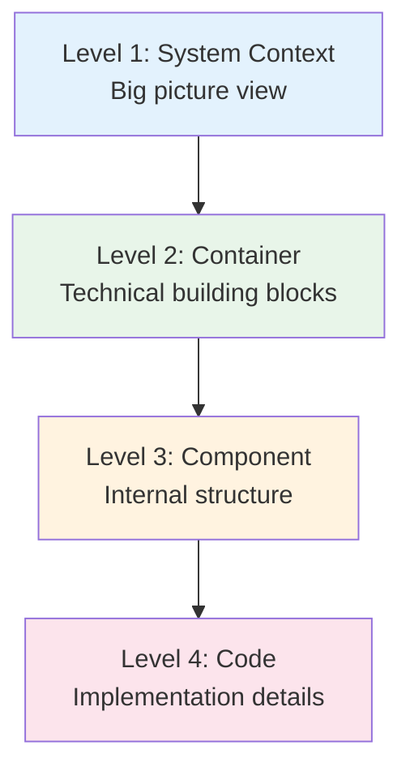
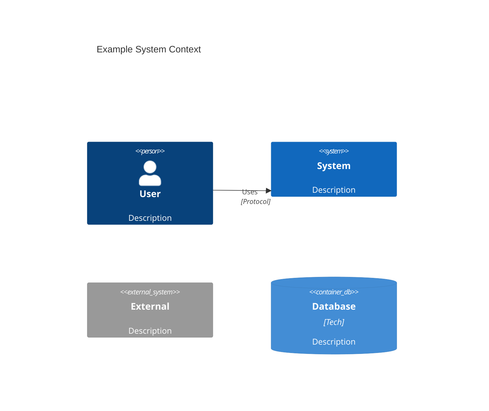

# C4 Architecture Diagrams

This directory contains C4 Model architecture diagrams for K12 MyPortal, providing multiple levels of abstraction for understanding the system.

## C4 Model Overview

The [C4 Model](https://c4model.com/) provides a hierarchical set of abstractions:

## Diagram Index

### Core Diagrams

| Level | Diagram | Description |
|-------|---------|-------------|
| Overview | [00-architecture-overview.md](00-architecture-overview.md) | Executive summary with key diagrams |
| 1 | [01-system-context.md](01-system-context.md) | K12 system and external actors/systems |
| 2 | [02-container-diagram.md](02-container-diagram.md) | Major technical building blocks |
| 2 | [03-deployment-diagram.md](03-deployment-diagram.md) | Azure infrastructure and deployments |

### Component Diagrams (Level 3)

| Diagram | Description |
|---------|-------------|
| [06-backend-component-diagram.md](06-backend-component-diagram.md) | .NET 8 API architecture, layers, and services |
| [07-frontend-component-diagram.md](07-frontend-component-diagram.md) | Angular 19 Nx monorepo structure |
| [08-data-architecture-diagram.md](08-data-architecture-diagram.md) | Database schemas, storage, and data flows |

### Domain-Specific Diagrams

| Diagram | Description |
|---------|-------------|
| [04-roster-workflow-context.md](04-roster-workflow-context.md) | Roster "To Be Certified" workflow |
| [05-rds-integration-context.md](05-rds-integration-context.md) | RDS residency determination integration |

## Quick Navigation

### By Audience

| Audience | Start Here |
|----------|------------|
| **Executives** | [00-architecture-overview.md](00-architecture-overview.md) |
| **Enterprise Architects** | [01-system-context.md](01-system-context.md) → [02-container-diagram.md](02-container-diagram.md) |
| **Backend Developers** | [06-backend-component-diagram.md](06-backend-component-diagram.md) |
| **Frontend Developers** | [07-frontend-component-diagram.md](07-frontend-component-diagram.md) |
| **Database Administrators** | [08-data-architecture-diagram.md](08-data-architecture-diagram.md) |
| **DevOps Engineers** | [03-deployment-diagram.md](03-deployment-diagram.md) |

### By Topic

| Topic | Relevant Diagrams |
|-------|-------------------|
| **Overall Architecture** | 00, 01, 02 |
| **Security** | 01 (context), 02 (auth flows), [../security/](../security/) |
| **Data** | 08 (data architecture), 02 (databases) |
| **APIs** | 06 (backend components), 02 (API gateway) |
| **Frontend** | 07 (frontend components), 02 (SPA container) |
| **Infrastructure** | 03 (deployment), 02 (containers) |
| **Integrations** | 01 (external systems), 05 (RDS) |
| **Workflows** | 04 (roster), 05 (RDS) |

## Diagram Standards

### Mermaid C4 Syntax

All diagrams use Mermaid with C4 extensions:

### Color Conventions

| Element Type | Color | Hex Code |
|--------------|-------|----------|
| Users/Actors | Blue | `#e3f2fd` |
| Internal Systems | Green | `#e8f5e9` |
| External Systems | Orange | `#fff3e0` |
| Databases | Pink | `#fce4ec` |
| Security | Purple | `#f3e5f5` |
| Monitoring | Yellow | `#fff8e1` |

### Relationship Labels

Use descriptive verb phrases for relationships:
- `"Authenticates via"` not `"Auth"`
- `"Reads/Writes data"` not `"Uses"`
- `"Sends email"` not `"Email"`

## Related Documentation

- [Architecture Overview](../README.md)
- [Security Architecture](../security/README.md)
- [Integration Architecture](../integrations/README.md)
- [ADRs](../../adr/README.md)
- [Proposed Architecture](../../09-proposed-architecture/README.md)

---

*Last Updated: December 2025*
