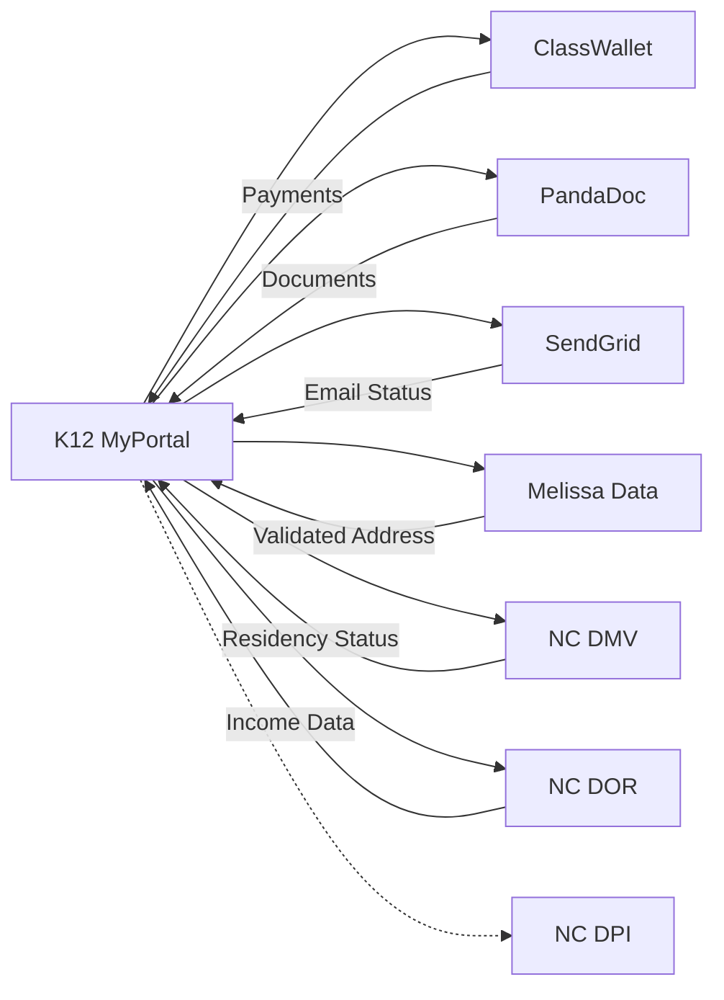

# Integration Architecture

This directory contains documentation for all external system integrations in the K12 MyPortal system.

## Overview

K12 MyPortal integrates with multiple external services to provide:
- Payment processing and fund management
- Document generation and e-signatures
- Email communications
- Address and identity verification
- State agency data exchange

## Integration Documents

| Document | Description | Status |
|----------|-------------|--------|
| [INT-01: ClassWallet](INT-01-classwallet-integration.md) | Payment services, fund repository, OAuth 2.0 | Complete |
| [INT-02: PandaDoc](INT-02-pandadoc-integration.md) | Document generation, e-signatures, 15 templates | Complete |
| [INT-03: SendGrid](INT-03-sendgrid-integration.md) | Transactional email, 1.2M emails/year | Complete |
| [INT-04: Melissa Data](INT-04-melissa-data-integration.md) | Address validation, geocoding, USPS standardization | Complete |
| [INT-05: NC DMV/DOR](INT-05-nc-dmv-dor-integration.md) | Residency & income verification, PGP encryption | Complete |
| [INT-06: NC DPI](INT-06-nc-dpi-integration.md) | Student data sync (planned Phase 2), FERPA | Complete |

### Analytics Platform (QueryBuilder)

| Document | Description | Status |
|----------|-------------|--------|
| [QueryBuilder Data Platform](QueryBuilder/Data-Platform.md) | .NET Aspire, Cube.js, Trino, Metabase | Complete |
| [QueryBuilder SDK Design](QueryBuilder/SDK-Design.md) | Pluggable query engine, API design | Complete |

## Integration Architecture Patterns

### Common Patterns
All integrations follow these resilience patterns:

```csharp
// Polly retry policy with exponential backoff
var retryPolicy = Policy
    .Handle<HttpRequestException>()
    .WaitAndRetryAsync(3,
        retryAttempt => TimeSpan.FromSeconds(Math.Pow(2, retryAttempt)));

// Circuit breaker for external services
var circuitBreaker = Policy
    .Handle<HttpRequestException>()
    .CircuitBreakerAsync(5, TimeSpan.FromMinutes(1));
```

### Authentication Methods

| Integration | Auth Method | Notes |
|-------------|-------------|-------|
| ClassWallet | OAuth 2.0 | Client credentials flow |
| PandaDoc | API Key | Header-based |
| SendGrid | API Key | Bearer token |
| Melissa Data | API Key | Query parameter |
| NC DMV | Certificate | SOAP WS-Security |
| NC DOR | SFTP | SSH keys + PGP |

### Data Flow Summary



## Integration Health Monitoring

All integrations are monitored via:
- **Application Insights** - Request tracking, dependency health
- **Azure Monitor** - Alerts for failures
- **Log Analytics** - Query for integration errors

## Related Documentation

- [ADR-001: Azure Government Cloud](../../adr/ADR-001-azure-government-cloud.md) - Compliance requirements
- [Security Architecture](../security/README.md) - Authentication patterns
- [System Architecture Overview](../README.md)

## Integration Contacts

- **ClassWallet Support**: [ClassWallet Portal](https://classwallet.com)
- **PandaDoc Support**: [PandaDoc API Docs](https://developers.pandadoc.com)
- **SendGrid Support**: [SendGrid Dashboard](https://app.sendgrid.com)
- **NC DMV/DOR**: State liaison contacts (internal only)

---

*Last Updated: December 2025*
