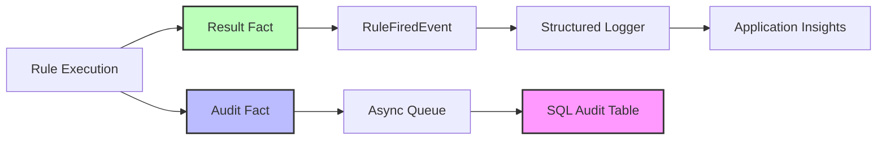

# SEC-04: Audit Logging Architecture

**Status**: Final
**Last Updated**: 2024-11-24
**Owner**: CFI Architecture Team

## Overview

This document describes the comprehensive audit logging architecture for the K12 MyPortal system, covering both application-level audit logging and infrastructure-level security logging. It defines what events must be audited, how audit data is captured, stored, and retained, and how to implement audit logging within the NRules business rules engine.

## Table of Contents

- [Audit Logging Requirements](#audit-logging-requirements)
- [Audit Log Content Requirements](#audit-log-content-requirements)
- [Auditable Event Categories](#auditable-event-categories)
- [NRules Audit Logging Implementation](#nrules-audit-logging-implementation)
- [Persistent Audit Storage](#persistent-audit-storage)
- [Audit Log Controls and Protection](#audit-log-controls-and-protection)
- [Storage and Retention Requirements](#storage-and-retention-requirements)
- [Implementation Guide](#implementation-guide)
- [Related Documentation](#related-documentation)

## Audit Logging Requirements

### CFI Information Security Policy

The K12 system must comply with CFI's Information Security Policy for audit logging, which requires:

1. **Comprehensive Event Capture**: All security-relevant events must be logged
2. **Immutable Records**: Audit logs cannot be modified or deleted by users
3. **Centralized Management**: Logs aggregated to central monitoring system (Splunk for CFI)
4. **Regular Review**: Security team reviews logs at least every 7 days
5. **Long-term Retention**: 3-year retention period with 4 months online availability

### Compliance Frameworks

| Framework | Requirement | K12 Implementation |
|-----------|-------------|-------------------|
| **FedRAMP High** | AU-2, AU-3, AU-6, AU-9, AU-11 | All requirements met |
| **NIST 800-53** | Audit and Accountability controls | Comprehensive audit logging |
| **FERPA** | Student data access logging | Every student data access logged |
| **NC State Records** | 3-year retention | Audit logs retained for 3+ years |

## Audit Log Content Requirements

Every audit log entry must contain the following information:

### 1. When (Temporal Context)

| Field | Description | Example |
|-------|-------------|---------|
| **Timestamp** | UTC timestamp with millisecond precision | `2024-11-24T15:30:45.123Z` |
| **Event Duration** | How long the event took (if applicable) | `234ms` |

### 2. What (Event Description)

| Field | Description | Example |
|-------|-------------|---------|
| **Event Type** | Category of event | `DataAccess`, `Authentication`, `Authorization`, `RuleExecution` |
| **Action** | Specific action performed | `ViewStudentRecord`, `Login`, `DownloadDocument`, `RuleFired` |
| **Resource** | Resource being accessed | `Student/12345`, `Document/abc-def`, `Application/67890` |
| **Result** | Outcome of the event | `Success`, `Failure`, `Denied` |

### 3. Where (System Context)

| Field | Description | Example |
|-------|-------------|---------|
| **Source IP** | Client IP address | `192.168.1.100` |
| **Application** | Which portal/application | `EnrollmentPortal`, `AdminPortal`, `API` |
| **Server** | Which server processed request | `k12-api-prod-001` |
| **Function** | Which Azure Function | `GetStudentData` |

### 4. Who/What (Actor Context)

| Field | Description | Example |
|-------|-------------|---------|
| **User Object ID** | Entra ID Object ID | `abc-123-def-456` |
| **User Email** | User's email address | `parent@example.com` |
| **User Roles** | Roles assigned to user | `["PrimaryParent.User"]` |
| **Service Principal** | If service account | `k12-sync-service` |

### 5. Event Description (Details)

| Field | Description | Example |
|-------|-------------|---------|
| **Message** | Human-readable description | `Parent viewed student application` |
| **Details** | Additional context (JSON) | `{"studentId": "12345", "applicationId": "67890"}` |
| **Rule Name** | If business rule fired | `EligibilityRule` |
| **Rule Outcome** | Result of rule evaluation | `Eligible` |

### 6. Event Outcome (Result Context)

| Field | Description | Example |
|-------|-------------|---------|
| **Status Code** | HTTP status or result code | `200`, `403`, `500` |
| **Success** | Boolean success indicator | `true`, `false` |
| **Error Message** | Error details if failed | `Insufficient permissions` |
| **Changes Made** | What was modified | `{"status": "Submitted"}` |

## Auditable Event Categories

### 1. Authorized Access Events

**User Authentication:**
- Successful login
- Failed login attempt
- Logout
- Session timeout
- Multi-factor authentication (MFA) events

**Password Management:**
- Password changes
- Password reset requests
- Account lockouts

**Data Access:**
- Student record views
- Application views/edits
- Document downloads
- Report generation
- Search queries

**Remote Access:**
- VPN connections
- Remote desktop sessions
- API calls from external systems

### 2. Privileged Operations

**Administrative Activities:**
- User account creation/deletion/modification
- Role assignments
- Permission changes
- Administrative unit modifications
- Security group membership changes

**System Configuration:**
- Application settings changes
- Security policy modifications
- Integration configuration changes
- Feature flag toggles

**Data Modifications:**
- Application status changes
- Award amount modifications
- Student data edits
- Bulk data operations

### 3. Unauthorized Access Attempts

**Authentication Failures:**
- Invalid credentials
- Expired tokens
- Missing required claims
- Account not found

**Authorization Failures:**
- Insufficient permissions (403)
- Relationship validation failures
- Custom attribute checks failed
- RLS filtering denied access

**Invalid Requests:**
- Malformed requests
- SQL injection attempts
- XSS attempts
- CSRF token violations

### 4. System Alerts or Failures

**Application Errors:**
- Unhandled exceptions
- API errors (500)
- Database connection failures
- External service failures

**Security Events:**
- Token validation failures
- Certificate errors
- Rate limit exceeded
- Suspicious activity patterns

**Infrastructure Events:**
- Service restarts
- Deployment events
- Scaling events
- Health check failures

### 5. Modification of System Security Settings

**Security Configuration:**
- APIM policy changes
- JWT validation rule changes
- CORS policy modifications
- Rate limiting adjustments

**Access Control:**
- RLS policy changes
- RBAC role assignments
- SAS token expiry changes
- Custom security attribute definitions

### 6. Modifications to Systems

**System Lifecycle:**
- Application startup/shutdown
- Service restarts
- Container deployments
- Function app restarts

**Configuration Changes:**
- Application settings updates
- Connection string changes
- Feature flag modifications
- Environment variable changes

**Application Changes:**
- Code deployments
- Database schema migrations
- Infrastructure updates (Terraform apply)
- Certificate renewals

## NRules Audit Logging Implementation

### Architecture



### Result Facts Pattern

**Capture rule outcomes as facts:**

```csharp
// Result fact to capture rule outcome
public class EligibilityDetermined
{
    public string ApplicationId { get; set; }
    public bool IsEligible { get; set; }
    public string Reason { get; set; }
    public DateTime DeterminedAt { get; set; }
}

// Rule that produces result fact
public class StudentEligibilityRule : Rule
{
    public override void Define()
    {
        Application application = null;
        Household household = null;

        When()
            .Match<Application>(() => application, a => a.Status == ApplicationStatus.Submitted)
            .Match<Household>(() => household, h => h.Id == application.HouseholdId);

        Then()
            .Do(ctx =>
            {
                var isEligible = household.Income < 100000; // Simplified logic

                // Insert result fact for downstream rules and logging
                ctx.Insert(new EligibilityDetermined
                {
                    ApplicationId = application.Id,
                    IsEligible = isEligible,
                    Reason = isEligible
                        ? "Income below threshold"
                        : "Income exceeds threshold",
                    DeterminedAt = DateTime.UtcNow
                });

                // Update application
                application.SetEligibility(isEligible);
            });
    }
}
```

### Operational Logging

**Subscribe to RuleFiredEvent:**

```csharp
public class RulesAuditService
{
    private readonly ILogger<RulesAuditService> _logger;
    private readonly ISessionFactory _sessionFactory;

    public RulesAuditService(ILogger<RulesAuditService> logger)
    {
        _logger = logger;

        // Subscribe to rule fired event
        _sessionFactory = CreateSessionFactory();
        _sessionFactory.Events.RuleFiredEvent += OnRuleFired;
    }

    private void OnRuleFired(object sender, AgendaEventArgs e)
    {
        var activation = e.Activation;
        var rule = activation.Rule;
        var facts = activation.Facts;

        // Log rule execution with structured logging
        _logger.LogInformation(
            "Rule {RuleName} fired for {FactCount} facts",
            rule.Name,
            facts.Count());

        // Include fact details for debugging
        foreach (var fact in facts)
        {
            _logger.LogDebug(
                "Rule {RuleName} fact: {FactType} = {FactValue}",
                rule.Name,
                fact.Object.GetType().Name,
                System.Text.Json.JsonSerializer.Serialize(fact.Object));
        }
    }
}
```

**Structured logging integration with Application Insights:**

```csharp
public async Task ProcessApplication(string applicationId)
{
    using var session = _sessionFactory.CreateSession();

    var application = await LoadApplication(applicationId);
    var household = await LoadHousehold(application.HouseholdId);

    // Insert facts
    session.Insert(application);
    session.Insert(household);

    // Fire rules (events logged automatically)
    session.Fire();

    // Query result facts for audit
    var eligibilityResult = session.Query<EligibilityDetermined>()
        .FirstOrDefault(r => r.ApplicationId == applicationId);

    if (eligibilityResult != null)
    {
        _logger.LogInformation(
            "Eligibility determined for application {ApplicationId}: {IsEligible} - {Reason}",
            applicationId,
            eligibilityResult.IsEligible,
            eligibilityResult.Reason);
    }
}
```

### Persistent Audit Logging

**Audit fact for compliance tracking:**

```csharp
public class AuditLog
{
    public string EventId { get; set; } = Guid.NewGuid().ToString();
    public DateTime Timestamp { get; set; } = DateTime.UtcNow;
    public string EventType { get; set; }
    public string RuleName { get; set; }
    public string UserId { get; set; }
    public string ResourceId { get; set; }
    public string Action { get; set; }
    public string Outcome { get; set; }
    public string Reason { get; set; }
    public Dictionary<string, object> FactSnapshot { get; set; }
}
```

**Rule that generates audit fact:**

```csharp
public class AuditEligibilityDeterminationRule : Rule
{
    public override void Define()
    {
        EligibilityDetermined result = null;
        Application application = null;

        When()
            .Match<EligibilityDetermined>(() => result)
            .Match<Application>(() => application, a => a.Id == result.ApplicationId);

        Then()
            .Do(ctx =>
            {
                // Create audit log fact
                var auditLog = new AuditLog
                {
                    EventType = "RuleExecution",
                    RuleName = "StudentEligibilityRule",
                    UserId = application.SubmittedByUserId,
                    ResourceId = application.Id,
                    Action = "DetermineEligibility",
                    Outcome = result.IsEligible ? "Eligible" : "NotEligible",
                    Reason = result.Reason,
                    FactSnapshot = new Dictionary<string, object>
                    {
                        ["applicationId"] = application.Id,
                        ["householdIncome"] = application.HouseholdIncome,
                        ["isEligible"] = result.IsEligible
                    }
                };

                // Insert audit fact for asynchronous persistence
                ctx.Insert(auditLog);
            });
    }
}
```

**Asynchronous audit persistence:**

```csharp
public async Task ProcessApplicationWithAudit(string applicationId)
{
    using var session = _sessionFactory.CreateSession();

    // Load and insert facts
    var application = await LoadApplication(applicationId);
    var household = await LoadHousehold(application.HouseholdId);

    session.Insert(application);
    session.Insert(household);

    // Fire rules
    session.Fire();

    // Collect audit logs generated by rules
    var auditLogs = session.Query<AuditLog>().ToList();

    // Persist audit logs asynchronously (non-blocking)
    if (auditLogs.Any())
    {
        _ = Task.Run(async () =>
        {
            try
            {
                await PersistAuditLogs(auditLogs);
            }
            catch (Exception ex)
            {
                _logger.LogError(ex, "Failed to persist {Count} audit logs", auditLogs.Count);
                // Send to dead-letter queue for retry
                await SendToDeadLetterQueue(auditLogs);
            }
        });
    }
}

private async Task PersistAuditLogs(List<AuditLog> logs)
{
    await using var connection = await _db.OpenConnectionAsync();

    foreach (var log in logs)
    {
        await connection.ExecuteAsync(
            @"INSERT INTO dbo.AuditLogs
              (EventId, Timestamp, EventType, RuleName, UserId, ResourceId, Action, Outcome, Reason, FactSnapshot)
              VALUES
              (@EventId, @Timestamp, @EventType, @RuleName, @UserId, @ResourceId, @Action, @Outcome, @Reason, @FactSnapshot)",
            new
            {
                log.EventId,
                log.Timestamp,
                log.EventType,
                log.RuleName,
                log.UserId,
                log.ResourceId,
                log.Action,
                log.Outcome,
                log.Reason,
                FactSnapshot = System.Text.Json.JsonSerializer.Serialize(log.FactSnapshot)
            });
    }
}
```

## Persistent Audit Storage

### Audit Table Schema

```sql
CREATE TABLE dbo.AuditLogs (
    -- Primary Key
    AuditId BIGINT IDENTITY(1,1) PRIMARY KEY,

    -- When
    EventId NVARCHAR(50) NOT NULL UNIQUE,
    Timestamp DATETIME2 NOT NULL DEFAULT GETUTCDATE(),
    EventDuration INT NULL, -- Milliseconds

    -- What
    EventType NVARCHAR(50) NOT NULL, -- DataAccess, Authentication, Authorization, RuleExecution
    Action NVARCHAR(100) NOT NULL,
    Resource NVARCHAR(500) NULL,
    Outcome NVARCHAR(50) NOT NULL, -- Success, Failure, Denied

    -- Where
    SourceIP NVARCHAR(50) NULL,
    Application NVARCHAR(50) NULL,
    ServerName NVARCHAR(100) NULL,
    FunctionName NVARCHAR(100) NULL,

    -- Who
    UserId NVARCHAR(50) NULL, -- Entra ID Object ID
    UserEmail NVARCHAR(256) NULL,
    UserRoles NVARCHAR(500) NULL, -- JSON array
    ServicePrincipal NVARCHAR(100) NULL,

    -- Event Details
    RuleName NVARCHAR(100) NULL,
    Message NVARCHAR(MAX) NULL,
    Details NVARCHAR(MAX) NULL, -- JSON
    FactSnapshot NVARCHAR(MAX) NULL, -- JSON

    -- Result
    StatusCode INT NULL,
    Success BIT NOT NULL DEFAULT 1,
    ErrorMessage NVARCHAR(MAX) NULL,
    ChangesMade NVARCHAR(MAX) NULL, -- JSON

    -- Indexes
    INDEX IX_Timestamp (Timestamp DESC),
    INDEX IX_UserId (UserId),
    INDEX IX_EventType (EventType),
    INDEX IX_Resource (Resource),
    INDEX IX_Success (Success)
);

-- Immutable audit logs - deny updates and deletes
DENY UPDATE ON dbo.AuditLogs TO PUBLIC;
DENY DELETE ON dbo.AuditLogs TO PUBLIC;

-- Only allow insert from audit service
GRANT INSERT ON dbo.AuditLogs TO [k12-audit-service];
GRANT SELECT ON dbo.AuditLogs TO [k12-audit-reader];
```

### Example Audit Records

**Student Data Access:**
```json
{
  "auditId": 123456,
  "eventId": "abc-def-ghi-789",
  "timestamp": "2024-11-24T15:30:45.123Z",
  "eventType": "DataAccess",
  "action": "ViewStudentRecord",
  "resource": "Student/12345",
  "outcome": "Success",
  "sourceIP": "192.168.1.100",
  "application": "EnrollmentPortal",
  "userId": "parent1-oid",
  "userEmail": "parent@example.com",
  "userRoles": ["PrimaryParent.User"],
  "message": "Parent viewed student application",
  "details": {
    "studentId": "12345",
    "applicationId": "67890",
    "viewType": "full"
  },
  "statusCode": 200,
  "success": true
}
```

**Authorization Failure:**
```json
{
  "auditId": 123457,
  "eventId": "xyz-abc-def-456",
  "timestamp": "2024-11-24T15:31:12.456Z",
  "eventType": "Authorization",
  "action": "ViewStudentRecord",
  "resource": "Student/99999",
  "outcome": "Denied",
  "sourceIP": "192.168.1.100",
  "application": "EnrollmentPortal",
  "userId": "parent1-oid",
  "userEmail": "parent@example.com",
  "userRoles": ["PrimaryParent.User"],
  "message": "Authorization failed: No relationship found",
  "details": {
    "studentId": "99999",
    "denialReason": "User not in student's parentReadWrite or proxyReadOnly attributes"
  },
  "statusCode": 403,
  "success": false,
  "errorMessage": "Forbidden: Insufficient permissions"
}
```

**Rule Execution:**
```json
{
  "auditId": 123458,
  "eventId": "rule-exec-001",
  "timestamp": "2024-11-24T15:32:00.789Z",
  "eventType": "RuleExecution",
  "action": "DetermineEligibility",
  "resource": "Application/67890",
  "outcome": "Eligible",
  "application": "K12-API",
  "functionName": "ProcessApplication",
  "userId": "system",
  "servicePrincipal": "k12-rules-engine",
  "ruleName": "StudentEligibilityRule",
  "message": "Eligibility determined: Eligible",
  "details": {
    "applicationId": "67890",
    "reason": "Income below threshold"
  },
  "factSnapshot": {
    "householdIncome": 45000,
    "incomeThreshold": 100000,
    "studentAge": 8,
    "isEligible": true
  },
  "statusCode": 200,
  "success": true
}
```

## Audit Log Controls and Protection

### Centralized Management

**Splunk Integration (CFI Standard):**

```csharp
public class SplunkAuditSink : ILogEventSink
{
    private readonly HttpClient _httpClient;
    private readonly string _splunkHecUrl;
    private readonly string _splunkToken;

    public void Emit(LogEvent logEvent)
    {
        // Convert log event to Splunk HEC format
        var splunkEvent = new
        {
            time = logEvent.Timestamp.ToUnixTimeSeconds(),
            source = "k12-myportal",
            sourcetype = "_json",
            @event = new
            {
                message = logEvent.RenderMessage(),
                level = logEvent.Level.ToString(),
                properties = logEvent.Properties
            }
        };

        // Send to Splunk HTTP Event Collector
        _ = _httpClient.PostAsJsonAsync(_splunkHecUrl, splunkEvent);
    }
}
```

### Failure Management

**Audit Log Overflow Handling:**

```csharp
public class AuditService
{
    private readonly ILogger _logger;
    private readonly IAuditRepository _auditRepo;
    private readonly IQueueClient _deadLetterQueue;

    public async Task LogAuditEvent(AuditLog log)
    {
        try
        {
            // Primary: Write to SQL
            await _auditRepo.InsertAsync(log);
        }
        catch (SqlException ex) when (ex.Number == 1205) // Deadlock
        {
            _logger.LogWarning("Audit log deadlock, retrying...");
            await Task.Delay(100);
            await _auditRepo.InsertAsync(log); // Retry once
        }
        catch (Exception ex)
        {
            _logger.LogError(ex, "Failed to write audit log {EventId}", log.EventId);

            // Fallback: Send to dead-letter queue
            await _deadLetterQueue.SendAsync(log);

            // Alert: Critical audit failure
            await SendAuditFailureAlert(log, ex);
        }
    }
}
```

### Security and Review

**7-Day Review Requirement:**

```sql
-- Query for security review
SELECT
    EventType,
    Outcome,
    COUNT(*) AS EventCount,
    COUNT(DISTINCT UserId) AS UniqueUsers
FROM dbo.AuditLogs
WHERE Timestamp >= DATEADD(DAY, -7, GETUTCDATE())
  AND Success = 0 -- Failed events
GROUP BY EventType, Outcome
ORDER BY EventCount DESC;

-- Suspicious activity: Multiple failures from same user
SELECT
    UserId,
    UserEmail,
    EventType,
    Action,
    COUNT(*) AS FailureCount,
    MIN(Timestamp) AS FirstFailure,
    MAX(Timestamp) AS LastFailure
FROM dbo.AuditLogs
WHERE Timestamp >= DATEADD(DAY, -7, GETUTCDATE())
  AND Success = 0
GROUP BY UserId, UserEmail, EventType, Action
HAVING COUNT(*) >= 5 -- 5+ failures
ORDER BY FailureCount DESC;
```

## Storage and Retention Requirements

### Retention Policy

| Storage Tier | Duration | Purpose | Location |
|--------------|----------|---------|----------|
| **Online (SQL)** | 4 months | Active querying and investigation | Azure SQL Database |
| **Warm (Splunk)** | 1 year | Searchable archive, compliance queries | Splunk |
| **Cold (Archive)** | 3 years | Long-term compliance, legal hold | Azure Archive Blob Storage |

### Archival Process

**Monthly Archive Job:**

```csharp
[Function("ArchiveAuditLogs")]
public async Task ArchiveAuditLogs(
    [TimerTrigger("0 0 2 1 * *")] TimerInfo timer) // 2 AM on 1st of month
{
    var archiveDate = DateTime.UtcNow.AddMonths(-4);

    _logger.LogInformation("Archiving audit logs older than {ArchiveDate}", archiveDate);

    // 1. Export to JSON
    var logsToArchive = await _db.QueryAsync<AuditLog>(
        "SELECT * FROM dbo.AuditLogs WHERE Timestamp < @archiveDate",
        new { archiveDate });

    // 2. Upload to Archive Blob Storage
    var blobClient = _blobServiceClient.GetBlobContainerClient("audit-archive");
    var archiveBlob = blobClient.GetBlobClient($"audit-{archiveDate:yyyy-MM}.json.gz");

    await using var stream = new MemoryStream();
    await using (var gzip = new GZipStream(stream, CompressionMode.Compress, leaveOpen: true))
    {
        await JsonSerializer.SerializeAsync(gzip, logsToArchive);
    }

    stream.Position = 0;
    await archiveBlob.UploadAsync(stream);

    // 3. Set Archive tier
    await archiveBlob.SetAccessTierAsync(AccessTier.Archive);

    // 4. Delete from SQL
    await _db.ExecuteAsync(
        "DELETE FROM dbo.AuditLogs WHERE Timestamp < @archiveDate",
        new { archiveDate });

    _logger.LogInformation("Archived {Count} audit logs", logsToArchive.Count());
}
```

### Encryption Requirements

**Data at Rest:**
- Azure SQL: Transparent Data Encryption (TDE) enabled
- Archive Blob Storage: Storage Service Encryption (SSE) with customer-managed keys

**Data in Transit:**
- TLS 1.2+ for all connections
- Splunk HEC over HTTPS only

## Implementation Guide

### Step 1: Create Audit Table

Execute the SQL schema provided in [Persistent Audit Storage](#persistent-audit-storage).

### Step 2: Configure Structured Logging

```csharp
// Program.cs
builder.Services.AddLogging(logging =>
{
    logging.AddApplicationInsights();
    logging.AddSplunk(); // Custom sink
});

builder.Services.AddSingleton<IAuditService, AuditService>();
```

### Step 3: Implement Audit Service

```csharp
public interface IAuditService
{
    Task LogDataAccess(string userId, string resource, string action, bool success);
    Task LogAuthentication(string userId, bool success, string reason);
    Task LogAuthorization(string userId, string resource, bool success, string reason);
    Task LogRuleExecution(string ruleName, string resourceId, string outcome, Dictionary<string, object> facts);
}
```

### Step 4: Add Audit Middleware

```csharp
public class AuditMiddleware
{
    private readonly RequestDelegate _next;
    private readonly IAuditService _auditService;

    public async Task InvokeAsync(HttpContext context)
    {
        var userId = context.User.FindFirst("oid")?.Value;
        var resource = context.Request.Path.Value;
        var action = context.Request.Method;

        var sw = Stopwatch.StartNew();

        await _next(context);

        sw.Stop();

        // Log all requests
        await _auditService.LogDataAccess(
            userId,
            resource,
            action,
            context.Response.StatusCode < 400);
    }
}
```

### Step 5: Subscribe to NRules Events

Add event subscription as shown in [NRules Audit Logging Implementation](#nrules-audit-logging-implementation).

### Step 6: Configure Archival Job

Deploy the archival Azure Function with monthly timer trigger.

## Best Practices

### Audit Logging Best Practices

1. **Log all security events**: Authentication, authorization, data access
2. **Include sufficient context**: Who, what, when, where, why
3. **Use structured logging**: JSON format for easy parsing
4. **Async logging**: Don't block application on audit writes
5. **Immutable logs**: Never allow modification of audit records

### Performance Optimization

1. **Batch inserts**: Bulk insert audit logs in batches
2. **Async persistence**: Non-blocking audit writes
3. **Separate database**: Consider separate audit database for isolation
4. **Partition tables**: Partition by month for better query performance
5. **Archive old data**: Move to cold storage after retention period

### Security Considerations

1. **Encrypt PII**: Mask or encrypt sensitive data in logs
2. **Restrict access**: Audit logs viewable only by security team
3. **Monitor failures**: Alert on audit log write failures
4. **Integrity checks**: Regular validation of audit log completeness
5. **Legal hold**: Support litigation hold requirements

## Related Documentation

- [SEC-01: Entra ID Configuration Guide](SEC-01-entra-id-configuration.md)
- [SEC-02: Authorization Model Documentation](SEC-02-authorization-model.md)
- [SEC-03: Row-Level Security Implementation](SEC-03-row-level-security.md)
- [ADR-005: NRules for Business Rules Engine](../../adr/ADR-005-nrules-business-rules.md)

## References

- [NIST 800-53 Audit Controls](https://nvd.nist.gov/800-53/Rev4/control/AU-2)
- [FedRAMP Audit Requirements](https://www.fedramp.gov/)
- [Azure SQL Auditing](https://learn.microsoft.com/en-us/azure/azure-sql/database/auditing-overview)
- [Application Insights Logging](https://learn.microsoft.com/en-us/azure/azure-monitor/app/asp-net-core)

---

**Source**: Confluence pages 5530-5785 (NRules Audit Logging, Audit Logs Policy)
**Migrated**: 2024-11-24
**Migrated by**: Documentation Migrator Agent
