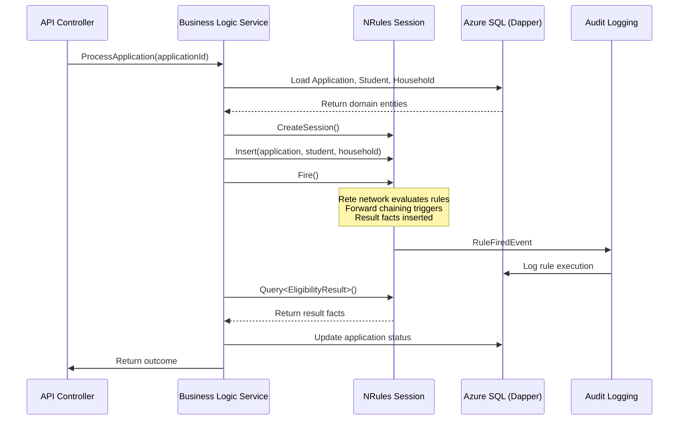

# RULES-01: NRules Implementation Guide

**Status**: Final
**Last Updated**: 2024-11-24
**Owner**: CFI Architecture Team

## Overview

This document provides a comprehensive implementation guide for NRules, the business rules engine selected for the K12 MyPortal system. NRules enables sophisticated business logic orchestration within the Application Layer using a declarative, type-safe approach.

### What is NRules?

NRules is a production-quality, open-source rules engine for .NET that implements the Rete algorithm for efficient pattern matching. Unlike simple validation frameworks, NRules is designed for:

- **Complex decision-making**: Orchestrating interdependent business rules
- **Action execution**: Not just validation, but performing operations based on rule outcomes
- **Forward-chaining inference**: Rules can trigger other rules (Rule of Rules pattern)
- **Efficient pattern matching**: Rete algorithm optimizes complex fact correlation

### Why NRules for K12 MyPortal?

The K12 system requires sophisticated business logic to handle:

- **Eligibility determination**: Complex income thresholds, priority tiers, special circumstances
- **Award calculation**: Multi-tiered award amounts based on Federal Poverty Level (FPL) calculations
- **Application workflow**: State transitions, document validation, approval processes
- **Lottery assignment**: Priority groups, waitlist management, tie-breaking rules
- **Compliance validation**: FERPA, FedRAMP, state regulations

See [ADR-005](../../adr/ADR-005-nrules-business-rules.md) for the full decision rationale.

## Table of Contents

- [Architecture](#architecture)
- [Core Concepts](#core-concepts)
- [Implementation Patterns](#implementation-patterns)
- [Example Rules](#example-rules)
- [Session Management in Azure Functions](#session-management-in-azure-functions)
- [Testing Strategies](#testing-strategies)
- [Best Practices](#best-practices)
- [Common Patterns](#common-patterns)
- [Integration](#integration)
- [Performance Tuning](#performance-tuning)
- [Troubleshooting](#troubleshooting)

---

## Architecture

### How NRules Fits in the Application Layer

NRules operates within the Business Logic Layer (BLL) of the K12 MyPortal architecture:

```
┌─────────────────────────────────────────────────────────────┐
│  API Layer (Azure Functions - HTTP Triggers)                │
│  - EnrollmentController.cs                                  │
│  - ApplicationsController.cs                                │
└────────────────────┬────────────────────────────────────────┘
                     │
┌────────────────────▼────────────────────────────────────────┐
│  Middleware Layer                                           │
│  - EntraAuthenticationMiddleware                            │
│  - GlobalErrorHandlingMiddleware                            │
└────────────────────┬────────────────────────────────────────┘
                     │
┌────────────────────▼────────────────────────────────────────┐
│  Application Layer (Business Logic)                         │
│                                                              │
│  ┌─────────────────────────────────────────────────────┐   │
│  │  NRules Rules Engine                                │   │
│  │                                                      │   │
│  │  ISessionFactory (Singleton)                        │   │
│  │      │                                              │   │
│  │      ├── EligibilityRules/                          │   │
│  │      │   ├── IncomeEligibilityRule                  │   │
│  │      │   ├── AgeEligibilityRule                     │   │
│  │      │   └── PriorityTierRule                       │   │
│  │      │                                              │   │
│  │      ├── AwardRules/                                │   │
│  │      │   ├── ESABaseAwardRule                       │   │
│  │      │   ├── ESAEnhancedAwardRule                   │   │
│  │      │   └── OSTieredAwardRule                      │   │
│  │      │                                              │   │
│  │      ├── DocumentRules/                             │   │
│  │      │   ├── RequiredDocumentRule                   │   │
│  │      │   └── DocumentExpirationRule                 │   │
│  │      │                                              │   │
│  │      └── WorkflowRules/                             │   │
│  │          ├── ApplicationSubmissionRule              │   │
│  │          └── ApplicationApprovalRule                │   │
│  │                                                      │   │
│  │  ISession (Per Request)                             │   │
│  │      ├── Insert Facts                               │   │
│  │      ├── Fire Rules                                 │   │
│  │      └── Query Results                              │   │
│  └─────────────────────────────────────────────────────┘   │
│                                                              │
│  Application Services:                                      │
│  - EnrollmentApp.cs                                         │
│  - ApplicationProcessingService.cs                          │
│  - AwardCalculationService.cs                               │
└────────────────────┬────────────────────────────────────────┘
                     │
┌────────────────────▼────────────────────────────────────────┐
│  Data Layer (Dapper)                                        │
│  - Load facts from Azure SQL                                │
│  - Persist rule outcomes                                    │
└─────────────────────────────────────────────────────────────┘
```

### Data Flow



---

## Core Concepts

### 1. Facts (Domain Objects)

Facts are the domain objects that rules operate on. In K12 MyPortal, facts are typically loaded from the database using Dapper.

**Example Facts:**

```csharp
// Domain entities from CFIK12.Domain
public class Application
{
    public Guid Id { get; set; }
    public Guid StudentId { get; set; }
    public Guid HouseholdId { get; set; }
    public int ProgramTypeId { get; set; } // 1 = ESA, 2 = OS
    public DateTime ApplicationDate { get; set; }
    public ApplicationStatus Status { get; set; }
    public bool Completed { get; set; }
}

public class Student
{
    public Guid Id { get; set; }
    public string FirstName { get; set; }
    public string LastName { get; set; }
    public DateTime DateOfBirth { get; set; }
    public int? GradeLevel { get; set; }
    public bool HasIEP { get; set; }
    public bool HasDisability { get; set; }
}

public class Household
{
    public Guid Id { get; set; }
    public decimal AnnualIncome { get; set; }
    public int HouseholdSize { get; set; }
    public string County { get; set; }
    public bool MilitaryFamily { get; set; }
}

public class LotterySettings
{
    public Guid Id { get; set; }
    public int AcademicYearId { get; set; }
    public decimal Tier1Threshold { get; set; }
    public decimal Tier1AwardAmount { get; set; }
    public decimal Tier2Threshold { get; set; }
    public decimal Tier2AwardAmount { get; set; }
    // ... additional tiers
}

// Enums
public enum ApplicationStatus
{
    Draft = 0,
    Submitted = 1,
    UnderReview = 2,
    Approved = 3,
    Denied = 4,
    Awarded = 5
}
```

### 2. Rules (Business Logic)

Rules define the business logic using NRules' fluent DSL. A rule has three parts:

1. **When()**: Pattern matching conditions (what facts to look for)
2. **Then()**: Actions to execute when conditions are met
3. **Optional: Priority()**: Execution order when multiple rules match

**Simple Rule Example:**

```csharp
using NRules.Fluent.Dsl;

public class AgeEligibilityRule : Rule
{
    public override void Define()
    {
        // Declare fact variables
        Application application = default!;
        Student student = default!;

        When()
            .Match<Application>(() => application,
                a => a.Status == ApplicationStatus.Submitted)
            .Match<Student>(() => student,
                s => s.Id == application.StudentId);

        Then()
            .Do(ctx =>
            {
                // Calculate age
                var age = CalculateAge(student.DateOfBirth);

                // Check eligibility (5-18 years old for K12)
                var isEligible = age >= 5 && age <= 18;

                // Insert result fact
                ctx.Insert(new AgeEligibilityResult
                {
                    ApplicationId = application.Id,
                    StudentId = student.Id,
                    Age = age,
                    IsEligible = isEligible,
                    Reason = isEligible
                        ? "Student age is within eligible range (5-18)"
                        : $"Student age ({age}) is outside eligible range"
                });
            });
    }

    private int CalculateAge(DateTime birthDate)
    {
        var today = DateTime.Today;
        var age = today.Year - birthDate.Year;
        if (birthDate.Date > today.AddYears(-age)) age--;
        return age;
    }
}
```

### 3. Session (Execution Context)

The session is where facts are inserted and rules are fired. Sessions are **stateful** but should be **short-lived** in Azure Functions.

```csharp
// Create session (from singleton ISessionFactory)
using var session = _sessionFactory.CreateSession();

// Insert facts
session.Insert(application);
session.Insert(student);
session.Insert(household);

// Fire all matching rules
session.Fire();

// Query result facts
var eligibilityResult = session.Query<EligibilityResult>().FirstOrDefault();
```

### 4. Agenda (Rule Execution Order)

The agenda is NRules' internal queue of rule activations. When multiple rules match, they are ordered by:

1. **Priority** (higher priority first)
2. **Specificity** (more specific patterns first)
3. **Recency** (newer facts first)

```csharp
public class HighPriorityRule : Rule
{
    public override void Define()
    {
        Priority(100); // Execute before lower priority rules

        Application application = default!;

        When()
            .Match<Application>(() => application);

        Then()
            .Do(ctx => { /* ... */ });
    }
}
```

### 5. Forward Chaining

Forward chaining means rules can insert new facts that trigger other rules. This enables "Rule of Rules" patterns.

```csharp
// Step 1: Income eligibility rule produces result fact
public class IncomeEligibilityRule : Rule
{
    public override void Define()
    {
        Application application = default!;
        Household household = default!;

        When()
            .Match<Application>(() => application)
            .Match<Household>(() => household, h => h.Id == application.HouseholdId);

        Then()
            .Do(ctx =>
            {
                var isEligible = household.AnnualIncome < 100000;

                // Insert result fact (triggers next rule)
                ctx.Insert(new IncomeEligibilityResult
                {
                    ApplicationId = application.Id,
                    IsEligible = isEligible,
                    HouseholdIncome = household.AnnualIncome
                });
            });
    }
}

// Step 2: Overall eligibility rule correlates multiple result facts
public class OverallEligibilityRule : Rule
{
    public override void Define()
    {
        AgeEligibilityResult ageResult = default!;
        IncomeEligibilityResult incomeResult = default!;

        When()
            .Match<AgeEligibilityResult>(() => ageResult)
            .Match<IncomeEligibilityResult>(() => incomeResult,
                r => r.ApplicationId == ageResult.ApplicationId);

        Then()
            .Do(ctx =>
            {
                var overallEligible = ageResult.IsEligible && incomeResult.IsEligible;

                ctx.Insert(new OverallEligibilityResult
                {
                    ApplicationId = ageResult.ApplicationId,
                    IsEligible = overallEligible,
                    Reasons = new List<string>
                    {
                        ageResult.Reason,
                        incomeResult.Reason
                    }
                });
            });
    }
}
```

### 6. Rete Algorithm Basics

The Rete algorithm is the core of NRules' efficiency. It:

1. **Compiles rules into a network** of nodes (alpha network for single-fact tests, beta network for multi-fact joins)
2. **Caches partial matches** to avoid re-evaluating unchanged facts
3. **Incrementally updates** the network as facts are inserted/retracted

**Why it matters:**
- Handles 100+ rules efficiently
- Complex fact correlation (joining Application + Student + Household + Settings) is fast
- Memory overhead for network creation (trade-off for execution speed)

**Visualization:**

```
Facts Inserted:
  Application(id=1, status=Submitted)
  Student(id=100, age=10)
  Household(id=50, income=45000)

Rete Network:
  Alpha Nodes (single-fact tests):
    ├── ApplicationNode: status == Submitted ✓
    ├── StudentNode: age >= 5 && age <= 18 ✓
    └── HouseholdNode: income < 100000 ✓

  Beta Nodes (join tests):
    ├── Join(Application, Student): studentId == student.Id ✓
    └── Join(Application, Household): householdId == household.Id ✓

  Activation: EligibilityRule → Agenda
```

---

## Implementation Patterns

### Pattern 1: Singleton ISessionFactory

**Critical:** ISessionFactory must be a singleton to avoid re-compiling the Rete network on every request.

```csharp
// Startup.cs or Program.cs (Azure Functions)
public class Startup : FunctionsStartup
{
    public override void Configure(IFunctionsHostBuilder builder)
    {
        // Register ISessionFactory as Singleton
        builder.Services.AddSingleton<ISessionFactory>(provider =>
        {
            var repository = new RuleRepository();

            // Load rules from assembly
            repository.Load(x => x.From(typeof(EligibilityRule).Assembly));

            // Compile rules into Rete network
            var factory = repository.Compile();

            // Subscribe to events for audit logging
            var logger = provider.GetRequiredService<ILogger<Startup>>();
            factory.Events.RuleFiredEvent += (sender, args) =>
            {
                logger.LogInformation(
                    "Rule fired: {RuleName} for {FactCount} facts",
                    args.Activation.Rule.Name,
                    args.Activation.Facts.Count());
            };

            return factory;
        });

        // Register scoped services
        builder.Services.AddScoped<IApplicationProcessingService, ApplicationProcessingService>();
    }
}
```

### Pattern 2: Session Per Request

Create a new session for each request to ensure isolation between concurrent requests.

```csharp
public class ApplicationProcessingService : IApplicationProcessingService
{
    private readonly ISessionFactory _sessionFactory;
    private readonly IApplicationRepository _applicationRepo;
    private readonly ILogger<ApplicationProcessingService> _logger;

    public ApplicationProcessingService(
        ISessionFactory sessionFactory,
        IApplicationRepository applicationRepo,
        ILogger<ApplicationProcessingService> logger)
    {
        _sessionFactory = sessionFactory;
        _applicationRepo = applicationRepo;
        _logger = logger;
    }

    public async Task<EligibilityResult> DetermineEligibility(Guid applicationId)
    {
        // Load facts from database
        var application = await _applicationRepo.GetByIdAsync(applicationId);
        var student = await _applicationRepo.GetStudentAsync(application.StudentId);
        var household = await _applicationRepo.GetHouseholdAsync(application.HouseholdId);
        var settings = await _applicationRepo.GetLotterySettingsAsync(application.AcademicYearId);

        // Create session (per request)
        using var session = _sessionFactory.CreateSession();

        // Insert facts
        session.Insert(application);
        session.Insert(student);
        session.Insert(household);
        session.Insert(settings);

        // Fire rules
        session.Fire();

        // Query result facts
        var result = session.Query<OverallEligibilityResult>()
            .FirstOrDefault(r => r.ApplicationId == applicationId);

        if (result == null)
        {
            throw new InvalidOperationException(
                $"No eligibility result produced for application {applicationId}");
        }

        return new EligibilityResult
        {
            IsEligible = result.IsEligible,
            Reasons = result.Reasons
        };
    }
}
```

### Pattern 3: Rule Organization (by Domain/Feature)

Organize rules into logical folders by domain area:

```
CFIK12.BusinessRules/
├── Eligibility/
│   ├── AgeEligibilityRule.cs
│   ├── IncomeEligibilityRule.cs
│   ├── PriorityTierRule.cs
│   └── OverallEligibilityRule.cs
├── Awards/
│   ├── ESABaseAwardRule.cs
│   ├── ESAEnhancedAwardRule.cs
│   ├── OSTier1AwardRule.cs
│   ├── OSTier2AwardRule.cs
│   └── AwardCalculationRule.cs
├── Documents/
│   ├── RequiredDocumentRule.cs
│   ├── DocumentExpirationRule.cs
│   └── DocumentValidationRule.cs
├── Workflow/
│   ├── ApplicationSubmissionRule.cs
│   ├── ApplicationApprovalRule.cs
│   └── LotteryAssignmentRule.cs
└── Facts/ (Result fact types)
    ├── EligibilityResults.cs
    ├── AwardResults.cs
    └── WorkflowResults.cs
```

### Pattern 4: Result Facts Pattern

Always produce result facts for:
1. **Auditability**: Track rule outcomes
2. **Composability**: Enable downstream rules to react
3. **Testability**: Assert on result facts in tests

```csharp
// Result fact for eligibility determination
public class OverallEligibilityResult
{
    public Guid ApplicationId { get; set; }
    public bool IsEligible { get; set; }
    public List<string> Reasons { get; set; } = new();
    public DateTime DeterminedAt { get; set; } = DateTime.UtcNow;
}

// Result fact for award calculation
public class AwardCalculationResult
{
    public Guid ApplicationId { get; set; }
    public decimal AwardAmount { get; set; }
    public string AwardTier { get; set; } // "Tier1", "Enhanced", etc.
    public string Reason { get; set; }
}

// Result fact for document validation
public class DocumentValidationResult
{
    public Guid ApplicationId { get; set; }
    public bool AllDocumentsValid { get; set; }
    public List<string> MissingDocuments { get; set; } = new();
    public List<string> ExpiredDocuments { get; set; } = new();
}
```

### Pattern 5: Audit Logging Integration

Integrate with the audit logging system ([SEC-04](../../02-architecture/security/SEC-04-audit-logging.md)) to track rule execution.

```csharp
// Subscribe to rule fired event
factory.Events.RuleFiredEvent += (sender, args) =>
{
    var activation = args.Activation;
    var rule = activation.Rule;
    var facts = activation.Facts.Select(f => f.Object).ToList();

    // Create audit log entry
    var auditLog = new AuditLog
    {
        EventType = "RuleExecution",
        RuleName = rule.Name,
        Action = "RuleFired",
        Outcome = "Success",
        FactSnapshot = facts.ToDictionary(
            f => f.GetType().Name,
            f => JsonSerializer.Serialize(f))
    };

    // Async persistence (non-blocking)
    _ = Task.Run(() => _auditService.LogAsync(auditLog));
};

// Subscribe to rule failed event
factory.Events.RuleActionFailedEvent += (sender, args) =>
{
    _logger.LogError(args.Exception,
        "Rule {RuleName} failed: {Message}",
        args.Activation.Rule.Name,
        args.Exception.Message);

    // Create audit log for failure
    var auditLog = new AuditLog
    {
        EventType = "RuleExecution",
        RuleName = args.Activation.Rule.Name,
        Action = "RuleFired",
        Outcome = "Failure",
        ErrorMessage = args.Exception.Message
    };

    _ = Task.Run(() => _auditService.LogAsync(auditLog));
};
```

---

## Example Rules

### Example 1: Eligibility Determination

**Scenario:** Determine if a student is eligible for the OS (Opportunity Scholarship) program based on income and age.

```csharp
public class OSIncomeEligibilityRule : Rule
{
    public override void Define()
    {
        Application application = default!;
        Household household = default!;
        LotterySettings settings = default!;

        When()
            .Match<Application>(() => application,
                a => a.ProgramTypeId == 2, // OS program
                a => a.Status == ApplicationStatus.Submitted)
            .Match<Household>(() => household,
                h => h.Id == application.HouseholdId)
            .Match<LotterySettings>(() => settings,
                s => s.AcademicYearId == application.AcademicYearId);

        Then()
            .Do(ctx =>
            {
                // Calculate FPL threshold based on household size
                var fplThreshold = CalculateFPLThreshold(
                    household.HouseholdSize,
                    settings.BaseFPLAmount,
                    settings.HouseholdIncrement);

                // Check if income is below 215% FPL
                var incomeLimit = fplThreshold * 2.15m;
                var isEligible = household.AnnualIncome <= incomeLimit;

                // Insert result fact
                ctx.Insert(new IncomeEligibilityResult
                {
                    ApplicationId = application.Id,
                    IsEligible = isEligible,
                    HouseholdIncome = household.AnnualIncome,
                    IncomeLimit = incomeLimit,
                    FPLPercentage = (household.AnnualIncome / fplThreshold) * 100,
                    Reason = isEligible
                        ? $"Income ${household.AnnualIncome:N0} is below limit ${incomeLimit:N0} (215% FPL)"
                        : $"Income ${household.AnnualIncome:N0} exceeds limit ${incomeLimit:N0} (215% FPL)"
                });

                ctx.Logger().Info(
                    "Income eligibility determined for application {0}: {1}",
                    application.Id,
                    isEligible ? "Eligible" : "Not Eligible");
            });
    }

    private decimal CalculateFPLThreshold(int householdSize, decimal baseFPL, decimal increment)
    {
        // FPL = Base + (HouseholdSize - 1) * Increment
        return baseFPL + ((householdSize - 1) * increment);
    }
}
```

### Example 2: Award Calculation

**Scenario:** Calculate the award amount for an OS application based on income tier.

```csharp
public class OSTieredAwardCalculationRule : Rule
{
    public override void Define()
    {
        Application application = default!;
        IncomeEligibilityResult incomeResult = default!;
        Household household = default!;
        LotterySettings settings = default!;

        When()
            .Match<Application>(() => application,
                a => a.ProgramTypeId == 2) // OS program
            .Match<IncomeEligibilityResult>(() => incomeResult,
                r => r.ApplicationId == application.Id,
                r => r.IsEligible == true)
            .Match<Household>(() => household,
                h => h.Id == application.HouseholdId)
            .Match<LotterySettings>(() => settings,
                s => s.AcademicYearId == application.AcademicYearId);

        Then()
            .Do(ctx =>
            {
                // Determine tier and award amount
                var (tier, amount) = DetermineTierAndAmount(
                    incomeResult.FPLPercentage,
                    settings);

                // Insert award calculation result
                ctx.Insert(new AwardCalculationResult
                {
                    ApplicationId = application.Id,
                    AwardAmount = amount,
                    AwardTier = tier,
                    FPLPercentage = incomeResult.FPLPercentage,
                    Reason = $"Household income is at {incomeResult.FPLPercentage:F1}% FPL, qualifies for {tier}"
                });

                ctx.Logger().Info(
                    "Award calculated for application {0}: {1} = ${2:N2}",
                    application.Id,
                    tier,
                    amount);
            });
    }

    private (string Tier, decimal Amount) DetermineTierAndAmount(
        decimal fplPercentage,
        LotterySettings settings)
    {
        // Tier 1: 0-133% FPL
        if (fplPercentage <= 133)
            return ("Tier1", settings.Tier1AwardAmount);

        // Tier 2: 134-150% FPL
        if (fplPercentage <= 150)
            return ("Tier2", settings.Tier2AwardAmount);

        // Tier 3: 151-175% FPL
        if (fplPercentage <= 175)
            return ("Tier3", settings.Tier3AwardAmount);

        // Tier 4: 176-215% FPL
        if (fplPercentage <= 215)
            return ("Tier4", settings.Tier4AwardAmount);

        // Should not reach here if eligibility rule worked correctly
        return ("None", 0m);
    }
}
```

### Example 3: Document Validation

**Scenario:** Validate that all required documents are uploaded and not expired.

```csharp
public class RequiredDocumentValidationRule : Rule
{
    public override void Define()
    {
        Application application = default!;
        List<Document> documents = default!;

        When()
            .Match<Application>(() => application,
                a => a.Status == ApplicationStatus.Submitted)
            .Match<List<Document>>(() => documents,
                d => d.Any(doc => doc.ApplicationId == application.Id));

        Then()
            .Do(ctx =>
            {
                // Define required document types for OS program
                var requiredDocTypes = new[]
                {
                    "ProofOfIncome",
                    "ProofOfResidency",
                    "StudentBirthCertificate"
                };

                // Check for missing documents
                var uploadedTypes = documents.Select(d => d.DocumentType).ToHashSet();
                var missingDocs = requiredDocTypes
                    .Where(type => !uploadedTypes.Contains(type))
                    .ToList();

                // Check for expired documents
                var expiredDocs = documents
                    .Where(d => d.ExpirationDate.HasValue && d.ExpirationDate < DateTime.UtcNow)
                    .Select(d => d.DocumentType)
                    .ToList();

                var allValid = !missingDocs.Any() && !expiredDocs.Any();

                // Insert result fact
                ctx.Insert(new DocumentValidationResult
                {
                    ApplicationId = application.Id,
                    AllDocumentsValid = allValid,
                    MissingDocuments = missingDocs,
                    ExpiredDocuments = expiredDocs
                });

                if (!allValid)
                {
                    ctx.Logger().Warn(
                        "Document validation failed for application {0}: Missing={1}, Expired={2}",
                        application.Id,
                        string.Join(", ", missingDocs),
                        string.Join(", ", expiredDocs));
                }
            });
    }
}
```

### Example 4: Application Workflow State Transition

**Scenario:** Automatically approve an application if all validation checks pass.

```csharp
public class AutoApprovalRule : Rule
{
    public override void Define()
    {
        Priority(50); // Higher priority to run after validation rules

        Application application = default!;
        OverallEligibilityResult eligibilityResult = default!;
        DocumentValidationResult documentResult = default!;

        When()
            .Match<Application>(() => application,
                a => a.Status == ApplicationStatus.UnderReview)
            .Match<OverallEligibilityResult>(() => eligibilityResult,
                e => e.ApplicationId == application.Id,
                e => e.IsEligible == true)
            .Match<DocumentValidationResult>(() => documentResult,
                d => d.ApplicationId == application.Id,
                d => d.AllDocumentsValid == true);

        Then()
            .Do(ctx =>
            {
                // Update application status
                application.Status = ApplicationStatus.Approved;
                application.ApprovedDate = DateTime.UtcNow;

                // Insert workflow result fact
                ctx.Insert(new WorkflowTransitionResult
                {
                    ApplicationId = application.Id,
                    FromStatus = ApplicationStatus.UnderReview,
                    ToStatus = ApplicationStatus.Approved,
                    TransitionReason = "All eligibility and document validation checks passed",
                    TransitionedAt = DateTime.UtcNow
                });

                ctx.Logger().Info(
                    "Application {0} auto-approved",
                    application.Id);
            });
    }
}
```

---

## Session Management in Azure Functions

### Stateless Environment Challenges

Azure Functions are **stateless** by default, meaning:
- No shared memory between invocations
- Each request starts fresh
- Sessions cannot be reused across requests

**Implications for NRules:**
- Create new `ISession` for each request
- Keep `ISessionFactory` as singleton (expensive to create)
- Avoid long-lived sessions (memory leaks)

### Session Lifecycle Best Practices

```csharp
[Function("ProcessApplication")]
public async Task<IActionResult> ProcessApplication(
    [HttpTrigger(AuthorizationLevel.Function, "post")] HttpRequest req,
    ILogger log)
{
    var applicationId = Guid.Parse(req.Query["applicationId"]);

    // 1. Load facts (from Dapper)
    var application = await _db.GetApplicationAsync(applicationId);
    var student = await _db.GetStudentAsync(application.StudentId);
    var household = await _db.GetHouseholdAsync(application.HouseholdId);

    // 2. Create session (short-lived, scoped to this request)
    using var session = _sessionFactory.CreateSession();

    try
    {
        // 3. Insert facts
        session.Insert(application);
        session.Insert(student);
        session.Insert(household);

        // 4. Fire rules
        session.Fire();

        // 5. Query results
        var eligibilityResult = session.Query<OverallEligibilityResult>()
            .FirstOrDefault(r => r.ApplicationId == applicationId);

        // 6. Persist outcomes (outside of session)
        if (eligibilityResult != null)
        {
            await _db.UpdateApplicationEligibilityAsync(
                applicationId,
                eligibilityResult.IsEligible,
                eligibilityResult.Reasons);
        }

        return new OkObjectResult(eligibilityResult);
    }
    finally
    {
        // Session disposed automatically (using statement)
        log.LogInformation("Session disposed for application {ApplicationId}", applicationId);
    }
}
```

### Performance Optimization

**1. Lazy Load Facts**

Only load facts that are needed:

```csharp
// Bad: Load all related data upfront
var application = await _db.GetApplicationWithAllRelatedDataAsync(applicationId);

// Good: Load only what rules need
var application = await _db.GetApplicationAsync(applicationId);
var student = await _db.GetStudentAsync(application.StudentId);
// Only load household if income eligibility check is needed
```

**2. Batch Processing**

Process multiple applications in a single session for batch jobs:

```csharp
[Function("BatchProcessApplications")]
public async Task BatchProcessApplications(
    [TimerTrigger("0 0 2 * * *")] TimerInfo timer) // 2 AM daily
{
    var pendingApplications = await _db.GetPendingApplicationsAsync();

    using var session = _sessionFactory.CreateSession();

    foreach (var application in pendingApplications)
    {
        var student = await _db.GetStudentAsync(application.StudentId);
        var household = await _db.GetHouseholdAsync(application.HouseholdId);

        session.Insert(application);
        session.Insert(student);
        session.Insert(household);
    }

    // Fire all rules once (efficient with Rete algorithm)
    session.Fire();

    // Query and persist results
    var results = session.Query<OverallEligibilityResult>().ToList();
    await _db.BulkUpdateEligibilityAsync(results);
}
```

**3. Fact Indexing**

Use `[Tag]` attribute to enable efficient fact queries:

```csharp
using NRules.Fluent.Dsl;

public class Application
{
    [Tag("ApplicationId")]
    public Guid Id { get; set; }

    // ...
}

// Query with tag (faster)
var application = session.Query<Application>()
    .Where("ApplicationId", applicationId)
    .FirstOrDefault();
```

---

## Testing Strategies

### Unit Testing Rules

Test rules in isolation using test fact builders:

```csharp
using NRules;
using NRules.Fluent;
using Xunit;

public class IncomeEligibilityRuleTests
{
    private readonly ISessionFactory _sessionFactory;

    public IncomeEligibilityRuleTests()
    {
        // Arrange: Compile rules for testing
        var repository = new RuleRepository();
        repository.Load(x => x.From(typeof(OSIncomeEligibilityRule).Assembly));
        _sessionFactory = repository.Compile();
    }

    [Fact]
    public void IncomeEligibilityRule_WhenIncomeBelowThreshold_ShouldBeEligible()
    {
        // Arrange
        var application = new Application
        {
            Id = Guid.NewGuid(),
            ProgramTypeId = 2, // OS
            Status = ApplicationStatus.Submitted,
            HouseholdId = Guid.NewGuid(),
            AcademicYearId = 1
        };

        var household = new Household
        {
            Id = application.HouseholdId,
            AnnualIncome = 40000, // Below threshold
            HouseholdSize = 3
        };

        var settings = new LotterySettings
        {
            AcademicYearId = 1,
            BaseFPLAmount = 20000,
            HouseholdIncrement = 5000
        };

        using var session = _sessionFactory.CreateSession();

        // Act
        session.Insert(application);
        session.Insert(household);
        session.Insert(settings);
        session.Fire();

        // Assert
        var result = session.Query<IncomeEligibilityResult>().FirstOrDefault();
        Assert.NotNull(result);
        Assert.True(result.IsEligible);
        Assert.Equal(application.Id, result.ApplicationId);
        Assert.Contains("below limit", result.Reason, StringComparison.OrdinalIgnoreCase);
    }

    [Fact]
    public void IncomeEligibilityRule_WhenIncomeAboveThreshold_ShouldNotBeEligible()
    {
        // Arrange
        var application = new Application
        {
            Id = Guid.NewGuid(),
            ProgramTypeId = 2,
            Status = ApplicationStatus.Submitted,
            HouseholdId = Guid.NewGuid(),
            AcademicYearId = 1
        };

        var household = new Household
        {
            Id = application.HouseholdId,
            AnnualIncome = 150000, // Above threshold
            HouseholdSize = 3
        };

        var settings = new LotterySettings
        {
            AcademicYearId = 1,
            BaseFPLAmount = 20000,
            HouseholdIncrement = 5000
        };

        using var session = _sessionFactory.CreateSession();

        // Act
        session.Insert(application);
        session.Insert(household);
        session.Insert(settings);
        session.Fire();

        // Assert
        var result = session.Query<IncomeEligibilityResult>().FirstOrDefault();
        Assert.NotNull(result);
        Assert.False(result.IsEligible);
        Assert.Contains("exceeds limit", result.Reason, StringComparison.OrdinalIgnoreCase);
    }
}
```

### Integration Testing

Test rule interaction with real database:

```csharp
public class ApplicationProcessingIntegrationTests : IClassFixture<DatabaseFixture>
{
    private readonly IApplicationProcessingService _service;
    private readonly DatabaseFixture _fixture;

    public ApplicationProcessingIntegrationTests(DatabaseFixture fixture)
    {
        _fixture = fixture;

        // Setup with real dependencies
        var sessionFactory = CreateSessionFactory();
        var repository = new ApplicationRepository(_fixture.ConnectionString);
        _service = new ApplicationProcessingService(sessionFactory, repository, Mock.Of<ILogger>());
    }

    [Fact]
    public async Task DetermineEligibility_WithRealData_ShouldProduceCorrectResult()
    {
        // Arrange: Seed test data
        var applicationId = await _fixture.SeedTestApplication(
            income: 45000,
            householdSize: 4,
            studentAge: 10);

        // Act
        var result = await _service.DetermineEligibility(applicationId);

        // Assert
        Assert.True(result.IsEligible);
        Assert.Contains("Income", result.Reasons[0]);
    }
}
```

### Test Fact Builders

Use builder pattern for cleaner test setup:

```csharp
public class ApplicationBuilder
{
    private Application _application = new()
    {
        Id = Guid.NewGuid(),
        ProgramTypeId = 2,
        Status = ApplicationStatus.Submitted,
        HouseholdId = Guid.NewGuid(),
        AcademicYearId = 1
    };

    public ApplicationBuilder WithProgramType(int programTypeId)
    {
        _application.ProgramTypeId = programTypeId;
        return this;
    }

    public ApplicationBuilder WithStatus(ApplicationStatus status)
    {
        _application.Status = status;
        return this;
    }

    public Application Build() => _application;
}

public class HouseholdBuilder
{
    private Household _household = new()
    {
        Id = Guid.NewGuid(),
        AnnualIncome = 50000,
        HouseholdSize = 3
    };

    public HouseholdBuilder WithIncome(decimal income)
    {
        _household.AnnualIncome = income;
        return this;
    }

    public HouseholdBuilder WithSize(int size)
    {
        _household.HouseholdSize = size;
        return this;
    }

    public Household Build() => _household;
}

// Usage in tests
[Fact]
public void Test_WithBuilders()
{
    var application = new ApplicationBuilder()
        .WithProgramType(2)
        .WithStatus(ApplicationStatus.Submitted)
        .Build();

    var household = new HouseholdBuilder()
        .WithIncome(40000)
        .WithSize(4)
        .Build();

    // ... test logic
}
```

---

## Best Practices

### Rule Naming Conventions

Follow consistent naming patterns:

```csharp
// Pattern: {Domain}{Concept}{Action}Rule
public class OSIncomeEligibilityRule : Rule { }
public class ESAEnhancedAwardCalculationRule : Rule { }
public class DocumentExpirationValidationRule : Rule { }
public class ApplicationAutoApprovalWorkflowRule : Rule { }

// Avoid: Generic or vague names
// Bad: CheckRule, ValidateRule, ProcessRule
```

### Fact Design

**Keep facts immutable where possible:**

```csharp
// Good: Immutable fact
public record IncomeEligibilityResult
{
    public Guid ApplicationId { get; init; }
    public bool IsEligible { get; init; }
    public decimal HouseholdIncome { get; init; }
    public string Reason { get; init; }
}

// Bad: Mutable fact (can cause Rete network invalidation)
public class IncomeEligibilityResult
{
    public bool IsEligible { get; set; }
    // If IsEligible changes after insert, Rete network must recompute
}
```

**Use separate result fact types:**

```csharp
// Good: Specific result types
public class AgeEligibilityResult { }
public class IncomeEligibilityResult { }
public class OverallEligibilityResult { }

// Bad: Generic result type with flags
public class EligibilityResult
{
    public bool AgeEligible { get; set; }
    public bool IncomeEligible { get; set; }
    public bool OverallEligible { get; set; }
}
```

### Performance Considerations

**1. Minimize fact modifications**

Updating a fact triggers Rete network re-evaluation:

```csharp
// Bad: Modify fact after insert
session.Insert(application);
application.Status = ApplicationStatus.Approved; // Triggers re-evaluation

// Good: Insert final state
application.Status = ApplicationStatus.Approved;
session.Insert(application);
```

**2. Use specific patterns**

More specific patterns reduce candidate matches:

```csharp
// Bad: Too broad
When()
    .Match<Application>(() => application);

// Good: Specific constraints
When()
    .Match<Application>(() => application,
        a => a.ProgramTypeId == 2,
        a => a.Status == ApplicationStatus.Submitted,
        a => a.AcademicYearId == currentYearId);
```

**3. Avoid unnecessary rule firing**

Use filters to prevent rules from firing when not needed:

```csharp
// Add guard condition
When()
    .Match<Application>(() => application,
        a => !session.Query<EligibilityResult>()
            .Any(r => r.ApplicationId == a.Id)); // Only fire if result doesn't exist
```

### Debugging Tips

**1. Enable rule tracing**

```csharp
// Subscribe to all events for debugging
factory.Events.RuleFiredEvent += (s, e) =>
    Console.WriteLine($"FIRED: {e.Activation.Rule.Name}");

factory.Events.RuleActionFailedEvent += (s, e) =>
    Console.WriteLine($"FAILED: {e.Activation.Rule.Name} - {e.Exception.Message}");

factory.Events.FactInsertedEvent += (s, e) =>
    Console.WriteLine($"INSERTED: {e.Fact.Object.GetType().Name}");
```

**2. Use ILogger in rules**

```csharp
Then()
    .Do(ctx =>
    {
        ctx.Logger().Info("Processing application {0}", application.Id);

        // Business logic

        ctx.Logger().Debug("Eligibility result: {0}", isEligible);
    });
```

**3. Inspect session state**

```csharp
// Query all facts in session
var allFacts = session.Query<object>().ToList();
Console.WriteLine($"Session contains {allFacts.Count} facts:");
foreach (var fact in allFacts)
{
    Console.WriteLine($"  - {fact.GetType().Name}");
}
```

**4. Unit test individual rules**

Isolate rules during development:

```csharp
// Load only specific rule
var repository = new RuleRepository();
repository.Load(x => x.From(typeof(OSIncomeEligibilityRule)));
var factory = repository.Compile();
```

---

## Common Patterns

### Pattern 1: Rule of Rules (Meta-Rules)

Use result facts to chain rules:

```csharp
// Step 1: Individual validation rules
public class AgeValidationRule : Rule { /* ... */ }
public class IncomeValidationRule : Rule { /* ... */ }
public class DocumentValidationRule : Rule { /* ... */ }

// Step 2: Meta-rule combines all validations
public class OverallValidationMetaRule : Rule
{
    public override void Define()
    {
        Priority(100); // Run after all validation rules

        Application application = default!;
        AgeValidationResult ageResult = default!;
        IncomeValidationResult incomeResult = default!;
        DocumentValidationResult docResult = default!;

        When()
            .Match<Application>(() => application)
            .Match<AgeValidationResult>(() => ageResult,
                r => r.ApplicationId == application.Id)
            .Match<IncomeValidationResult>(() => incomeResult,
                r => r.ApplicationId == application.Id)
            .Match<DocumentValidationResult>(() => docResult,
                r => r.ApplicationId == application.Id);

        Then()
            .Do(ctx =>
            {
                var allValid = ageResult.IsValid
                    && incomeResult.IsValid
                    && docResult.IsValid;

                ctx.Insert(new OverallValidationResult
                {
                    ApplicationId = application.Id,
                    IsValid = allValid,
                    ValidationResults = new()
                    {
                        ageResult,
                        incomeResult,
                        docResult
                    }
                });
            });
    }
}
```

### Pattern 2: Conditional Rule Execution

Enable/disable rules based on feature flags or configuration:

```csharp
public class ConditionalEligibilityRule : Rule
{
    public override void Define()
    {
        Application application = default!;
        FeatureFlags featureFlags = default!;

        When()
            .Match<Application>(() => application)
            .Match<FeatureFlags>(() => featureFlags,
                f => f.IsEnabled("EnhancedEligibility")); // Only fire if feature enabled

        Then()
            .Do(ctx =>
            {
                // Enhanced eligibility logic
            });
    }
}
```

### Pattern 3: Priority-Based Execution

Control execution order with priorities:

```csharp
public class HighPriorityValidationRule : Rule
{
    public override void Define()
    {
        Priority(100); // High priority

        // ... validation logic
    }
}

public class MediumPriorityBusinessRule : Rule
{
    public override void Define()
    {
        Priority(50); // Medium priority

        // ... business logic
    }
}

public class LowPriorityAuditRule : Rule
{
    public override void Define()
    {
        Priority(10); // Low priority

        // ... audit logging
    }
}
```

### Pattern 4: Dynamic Fact Insertion

Rules can insert facts that trigger other rules:

```csharp
public class LotteryNumberAssignmentRule : Rule
{
    public override void Define()
    {
        Application application = default!;

        When()
            .Match<Application>(() => application,
                a => a.Status == ApplicationStatus.Approved);

        Then()
            .Do(ctx =>
            {
                // Assign lottery number
                var lotteryNumber = GenerateLotteryNumber();

                // Insert new fact (triggers LotteryNotificationRule)
                ctx.Insert(new LotteryNumberAssigned
                {
                    ApplicationId = application.Id,
                    LotteryNumber = lotteryNumber,
                    AssignedAt = DateTime.UtcNow
                });
            });
    }
}

public class LotteryNotificationRule : Rule
{
    public override void Define()
    {
        LotteryNumberAssigned assignment = default!;
        Application application = default!;

        When()
            .Match<LotteryNumberAssigned>(() => assignment)
            .Match<Application>(() => application,
                a => a.Id == assignment.ApplicationId);

        Then()
            .Do(ctx =>
            {
                // Send notification
                ctx.Insert(new SendNotificationCommand
                {
                    UserId = application.UserId,
                    NotificationType = "LotteryNumberAssigned",
                    Data = new { assignment.LotteryNumber }
                });
            });
    }
}
```

### Pattern 5: Fact Aggregation

Aggregate data from multiple facts:

```csharp
public class HouseholdTotalIncomeRule : Rule
{
    public override void Define()
    {
        Household household = default!;
        IEnumerable<IncomeSource> incomeSources = default!;

        When()
            .Match<Household>(() => household)
            .Query(() => incomeSources, x => x
                .Match<IncomeSource>(s => s.HouseholdId == household.Id)
                .Collect());

        Then()
            .Do(ctx =>
            {
                var totalIncome = incomeSources.Sum(s => s.AnnualAmount);

                ctx.Insert(new HouseholdTotalIncome
                {
                    HouseholdId = household.Id,
                    TotalIncome = totalIncome,
                    SourceCount = incomeSources.Count()
                });
            });
    }
}
```

---

## Integration

### Loading Facts from Dapper

Efficiently load facts from Azure SQL using Dapper:

```csharp
public class ApplicationRepository : IApplicationRepository
{
    private readonly IDbConnectionFactory _dbFactory;

    public async Task<ApplicationFacts> LoadApplicationFactsAsync(Guid applicationId)
    {
        await using var connection = await _dbFactory.OpenConnectionAsync();

        // Load primary fact
        var application = await connection.QueryFirstOrDefaultAsync<Application>(
            @"SELECT * FROM Awards.Applications WHERE Id = @ApplicationId",
            new { ApplicationId = applicationId });

        if (application == null)
            throw new NotFoundException($"Application {applicationId} not found");

        // Load related facts in parallel
        var studentTask = connection.QueryFirstOrDefaultAsync<Student>(
            @"SELECT * FROM Households.Student WHERE Id = @StudentId",
            new { application.StudentId });

        var householdTask = connection.QueryFirstOrDefaultAsync<Household>(
            @"SELECT * FROM Households.Household WHERE Id = @HouseholdId",
            new { application.HouseholdId });

        var settingsTask = connection.QueryFirstOrDefaultAsync<LotterySettings>(
            @"SELECT * FROM Awards.OSLotterySettings WHERE AcademicYearId = @AcademicYearId",
            new { application.AcademicYearId });

        var documentsTask = connection.QueryAsync<Document>(
            @"SELECT * FROM dbo.Documents WHERE ApplicationId = @ApplicationId",
            new { ApplicationId = applicationId });

        await Task.WhenAll(studentTask, householdTask, settingsTask, documentsTask);

        return new ApplicationFacts
        {
            Application = application,
            Student = await studentTask,
            Household = await householdTask,
            Settings = await settingsTask,
            Documents = (await documentsTask).ToList()
        };
    }
}
```

### Audit Logging (Reference SEC-04)

Integrate with the audit logging system:

```csharp
public class RulesAuditService
{
    private readonly IAuditService _auditService;
    private readonly ILogger<RulesAuditService> _logger;

    public void ConfigureAuditLogging(ISessionFactory sessionFactory)
    {
        // Subscribe to rule fired event
        sessionFactory.Events.RuleFiredEvent += async (sender, args) =>
        {
            var activation = args.Activation;
            var rule = activation.Rule;
            var facts = activation.Facts.Select(f => f.Object).ToList();

            // Extract application ID from facts
            var applicationId = ExtractApplicationId(facts);

            // Create audit log
            var auditLog = new AuditLog
            {
                EventType = "RuleExecution",
                RuleName = rule.Name,
                ResourceId = applicationId?.ToString(),
                Action = "RuleFired",
                Outcome = "Success",
                Message = $"Rule {rule.Name} executed successfully",
                FactSnapshot = facts.ToDictionary(
                    f => f.GetType().Name,
                    f => JsonSerializer.Serialize(f, new JsonSerializerOptions
                    {
                        WriteIndented = false,
                        DefaultIgnoreCondition = JsonIgnoreCondition.WhenWritingNull
                    }))
            };

            // Async audit persistence (non-blocking)
            await _auditService.LogAsync(auditLog);
        };

        // Subscribe to rule failed event
        sessionFactory.Events.RuleActionFailedEvent += async (sender, args) =>
        {
            var activation = args.Activation;
            var facts = activation.Facts.Select(f => f.Object).ToList();
            var applicationId = ExtractApplicationId(facts);

            var auditLog = new AuditLog
            {
                EventType = "RuleExecution",
                RuleName = activation.Rule.Name,
                ResourceId = applicationId?.ToString(),
                Action = "RuleFired",
                Outcome = "Failure",
                Success = false,
                ErrorMessage = args.Exception.Message,
                Message = $"Rule {activation.Rule.Name} failed: {args.Exception.Message}"
            };

            await _auditService.LogAsync(auditLog);

            _logger.LogError(args.Exception,
                "Rule {RuleName} failed for application {ApplicationId}",
                activation.Rule.Name,
                applicationId);
        };
    }

    private Guid? ExtractApplicationId(List<object> facts)
    {
        // Try to find Application fact
        var application = facts.OfType<Application>().FirstOrDefault();
        if (application != null)
            return application.Id;

        // Try to find result fact with ApplicationId
        var resultWithId = facts.FirstOrDefault(f =>
        {
            var prop = f.GetType().GetProperty("ApplicationId");
            return prop?.PropertyType == typeof(Guid);
        });

        if (resultWithId != null)
        {
            var prop = resultWithId.GetType().GetProperty("ApplicationId");
            return (Guid?)prop?.GetValue(resultWithId);
        }

        return null;
    }
}
```

### Error Handling

Implement comprehensive error handling:

```csharp
public class ApplicationProcessingService : IApplicationProcessingService
{
    public async Task<EligibilityResult> DetermineEligibility(Guid applicationId)
    {
        try
        {
            // Load facts
            var facts = await _repository.LoadApplicationFactsAsync(applicationId);

            // Create session
            using var session = _sessionFactory.CreateSession();

            // Insert facts
            session.Insert(facts.Application);
            session.Insert(facts.Student);
            session.Insert(facts.Household);
            session.Insert(facts.Settings);
            facts.Documents.ForEach(d => session.Insert(d));

            // Fire rules with timeout
            var cts = new CancellationTokenSource(TimeSpan.FromSeconds(30));
            var fireTask = Task.Run(() => session.Fire(), cts.Token);
            await fireTask;

            // Query results
            var result = session.Query<OverallEligibilityResult>()
                .FirstOrDefault(r => r.ApplicationId == applicationId);

            if (result == null)
            {
                throw new BusinessRuleException(
                    $"No eligibility result produced for application {applicationId}. " +
                    "Check that all required rules are loaded and facts are valid.");
            }

            return MapToEligibilityResult(result);
        }
        catch (OperationCanceledException)
        {
            _logger.LogError("Rule execution timed out for application {ApplicationId}", applicationId);
            throw new BusinessRuleException("Rule execution timed out");
        }
        catch (RuleLhsExpressionEvaluationException ex)
        {
            _logger.LogError(ex,
                "Rule condition evaluation failed for application {ApplicationId}",
                applicationId);
            throw new BusinessRuleException("Rule condition evaluation failed", ex);
        }
        catch (RuleRhsExpressionEvaluationException ex)
        {
            _logger.LogError(ex,
                "Rule action execution failed for application {ApplicationId}",
                applicationId);
            throw new BusinessRuleException("Rule action execution failed", ex);
        }
        catch (Exception ex)
        {
            _logger.LogError(ex,
                "Unexpected error during rule processing for application {ApplicationId}",
                applicationId);
            throw;
        }
    }
}
```

---

## Performance Tuning

### 1. Rete Network Optimization

**Minimize rule compilation time:**

```csharp
// Compile once at startup (singleton)
public class Startup : FunctionsStartup
{
    public override void Configure(IFunctionsHostBuilder builder)
    {
        builder.Services.AddSingleton<ISessionFactory>(provider =>
        {
            var sw = Stopwatch.StartNew();

            var repository = new RuleRepository();
            repository.Load(x => x.From(typeof(EligibilityRule).Assembly));

            var factory = repository.Compile();

            sw.Stop();
            provider.GetRequiredService<ILogger<Startup>>()
                .LogInformation("Rules compiled in {ElapsedMs}ms", sw.ElapsedMilliseconds);

            return factory;
        });
    }
}
```

**Profile rule execution:**

```csharp
var sw = Stopwatch.StartNew();
session.Fire();
sw.Stop();

_logger.LogInformation(
    "Fired rules in {ElapsedMs}ms for application {ApplicationId}",
    sw.ElapsedMilliseconds,
    applicationId);

// Alert if execution is slow
if (sw.ElapsedMilliseconds > 1000)
{
    _logger.LogWarning(
        "Slow rule execution detected: {ElapsedMs}ms for application {ApplicationId}",
        sw.ElapsedMilliseconds,
        applicationId);
}
```

### 2. Fact Indexing

Enable efficient fact queries:

```csharp
// Add indexing hints to domain models
public class Application
{
    [Tag("ApplicationId")] // Enable fast lookup
    public Guid Id { get; set; }

    [Tag("StudentId")]
    public Guid StudentId { get; set; }

    [Tag("Status")]
    public ApplicationStatus Status { get; set; }
}

// Query with tags (faster than LINQ filter)
var application = session.Query<Application>()
    .Where("ApplicationId", applicationId)
    .FirstOrDefault();
```

### 3. Rule Compilation Caching

Cache compiled rules between deployments:

```csharp
// TODO: Implement rule cache (future enhancement)
// Store compiled Rete network in Redis/Blob Storage
// Load on startup to skip compilation
// Invalidate cache when rules change
```

### 4. Batch Processing

Process multiple applications efficiently:

```csharp
public async Task<List<EligibilityResult>> BatchDetermineEligibility(
    List<Guid> applicationIds)
{
    // Load all facts in parallel
    var factsTask = applicationIds.Select(id =>
        _repository.LoadApplicationFactsAsync(id));
    var allFacts = await Task.WhenAll(factsTask);

    // Create single session for all applications
    using var session = _sessionFactory.CreateSession();

    // Insert all facts (Rete network handles correlation efficiently)
    foreach (var facts in allFacts)
    {
        session.Insert(facts.Application);
        session.Insert(facts.Student);
        session.Insert(facts.Household);
        session.Insert(facts.Settings);
        facts.Documents.ForEach(d => session.Insert(d));
    }

    // Fire once for all applications
    session.Fire();

    // Query results for all applications
    var results = session.Query<OverallEligibilityResult>().ToList();

    return results.Select(MapToEligibilityResult).ToList();
}
```

### 5. Memory Management

Monitor memory usage:

```csharp
public class SessionMetrics
{
    public long MemoryBeforeMB { get; set; }
    public long MemoryAfterMB { get; set; }
    public int FactCount { get; set; }
    public int RulesFired { get; set; }
}

public SessionMetrics ExecuteWithMetrics(Action<ISession> action)
{
    var metrics = new SessionMetrics();

    // Force GC before measurement
    GC.Collect();
    GC.WaitForPendingFinalizers();
    metrics.MemoryBeforeMB = GC.GetTotalMemory(false) / 1024 / 1024;

    using var session = _sessionFactory.CreateSession();

    // Track rule fired count
    int rulesFired = 0;
    session.Events.RuleFiredEvent += (s, e) => rulesFired++;

    // Execute
    action(session);

    metrics.FactCount = session.Query<object>().Count();
    metrics.RulesFired = rulesFired;

    metrics.MemoryAfterMB = GC.GetTotalMemory(false) / 1024 / 1024;

    _logger.LogInformation(
        "Session metrics: {FactCount} facts, {RulesFired} rules, {MemoryDelta}MB memory",
        metrics.FactCount,
        metrics.RulesFired,
        metrics.MemoryAfterMB - metrics.MemoryBeforeMB);

    return metrics;
}
```

---

## Troubleshooting

### Common Issues

#### Issue 1: Rules Not Firing

**Symptom:** Session.Fire() completes but no result facts are produced.

**Possible Causes:**
1. Fact patterns don't match
2. Rule conditions evaluate to false
3. Missing required facts
4. Rule not loaded into repository

**Solution:**

```csharp
// Enable detailed logging
factory.Events.FactInsertedEvent += (s, e) =>
    Console.WriteLine($"INSERTED: {e.Fact.Object.GetType().Name}");

factory.Events.RuleFiredEvent += (s, e) =>
    Console.WriteLine($"FIRED: {e.Activation.Rule.Name}");

factory.Events.ConditionFailedEvent += (s, e) =>
    Console.WriteLine($"CONDITION FAILED: {e.Activation.Rule.Name} - {e.Exception?.Message}");

// Inspect session after firing
var allFacts = session.Query<object>().ToList();
Console.WriteLine($"Session contains {allFacts.Count} facts:");
foreach (var fact in allFacts)
    Console.WriteLine($"  - {fact.GetType().Name}: {JsonSerializer.Serialize(fact)}");
```

#### Issue 2: Infinite Rule Loop

**Symptom:** Session.Fire() never completes, hangs indefinitely.

**Possible Causes:**
1. Rule inserts fact that triggers itself
2. Circular rule dependencies (Rule A → Rule B → Rule A)

**Solution:**

```csharp
// Add max iterations limit
session.Fire(maxIterations: 100);

// Add guard conditions to prevent re-firing
When()
    .Match<Application>(() => application)
    .Not<EligibilityResult>(r => r.ApplicationId == application.Id); // Only fire if result doesn't exist
```

#### Issue 3: Rule Action Exception

**Symptom:** RuleRhsExpressionEvaluationException thrown.

**Possible Causes:**
1. Null reference in Then() clause
2. Unhandled exception in business logic
3. Invalid type conversion

**Solution:**

```csharp
// Add null checks
Then()
    .Do(ctx =>
    {
        if (household == null)
        {
            ctx.Logger().Error("Household is null for application {0}", application.Id);
            return;
        }

        try
        {
            // Business logic
        }
        catch (Exception ex)
        {
            ctx.Logger().Error("Error in rule: {0}", ex.Message);
            throw; // Re-throw to trigger RuleActionFailedEvent
        }
    });
```

#### Issue 4: Memory Leak

**Symptom:** Memory usage grows over time, not released after sessions disposed.

**Possible Causes:**
1. Session not disposed properly
2. Event handlers not unsubscribed
3. Large fact objects retained in closure

**Solution:**

```csharp
// Always use 'using' statement
using var session = _sessionFactory.CreateSession();

// Avoid capturing large objects in closures
Then()
    .Do(ctx =>
    {
        // Bad: Captures entire household object
        var largeData = household.SomeExpensiveCollection.ToList();

        // Good: Extract only what you need
        var income = household.AnnualIncome;
        var size = household.HouseholdSize;
    });
```

#### Issue 5: Performance Degradation

**Symptom:** Rule execution becomes slower over time.

**Possible Causes:**
1. Too many facts inserted (N+1 queries)
2. Complex rule patterns without indexes
3. Expensive computations in Then() clause

**Solution:**

```csharp
// Profile slow rules
var sw = Stopwatch.StartNew();
session.Events.RuleFiredEvent += (s, e) =>
{
    var elapsed = sw.ElapsedMilliseconds;
    if (elapsed > 100) // Slow rule threshold
    {
        _logger.LogWarning(
            "Slow rule detected: {RuleName} took {ElapsedMs}ms",
            e.Activation.Rule.Name,
            elapsed);
    }
    sw.Restart();
};

session.Fire();

// Optimize: Move expensive computation outside of rules
var expensiveResult = await ComputeExpensiveDataAsync();
session.Insert(expensiveResult); // Insert pre-computed fact
```

---

## Related Documentation

- [ADR-005: NRules for Business Rules Engine](../../adr/ADR-005-nrules-business-rules.md)
- [ADR-002: Dapper over Entity Framework](../../adr/ADR-002-dapper-over-entity-framework.md)
- [SEC-04: Audit Logging Architecture](../../02-architecture/security/SEC-04-audit-logging.md)
- [Database Schema Documentation](../../Database-Schema-Documentation.md)
- [System Architecture Overview](../../02-architecture/README.md)

## References

### Official NRules Documentation
- [NRules Official Documentation](https://nrules.net/)
- [NRules Fluent DSL](https://nrules.net/articles/fluent-rules-dsl.html)
- [NRules GitHub Repository](https://github.com/NRules/NRules)
- [NRules API Reference](https://nrules.net/api/index.html)

### Rete Algorithm Resources
- [Rete Algorithm Explanation](https://decisions.com/the-rete-algorithm-in-decisions-and-rule-net/)
- [Rete: A Fast Algorithm for Pattern Matching (Original Paper)](https://cis.temple.edu/~giorgio/cis587/readings/rete.html)

### Confluence Source
- [Rule Engine (.NET/C#)](https://cfi-nc.atlassian.net/wiki/spaces/KR/pages/4420075531)

---

**Source**: Confluence page 4420075531 (Rule Engine .NET/C#), ADR-005, SEC-04
**Created**: 2024-11-24
**Author**: Documentation Migrator Agent
