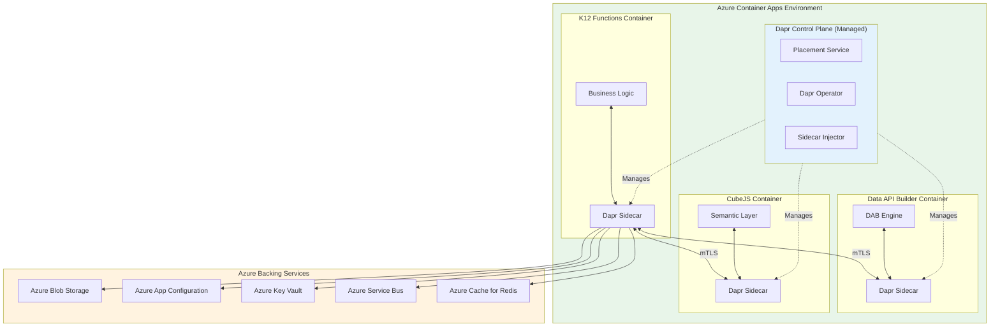
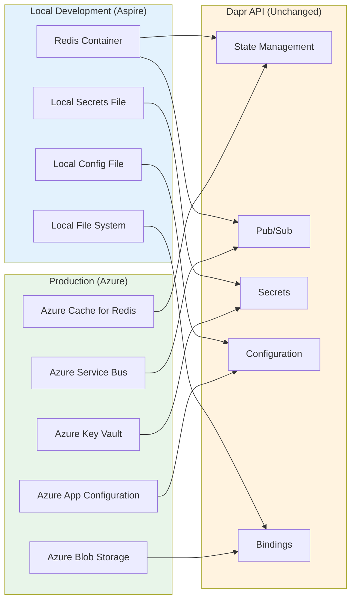
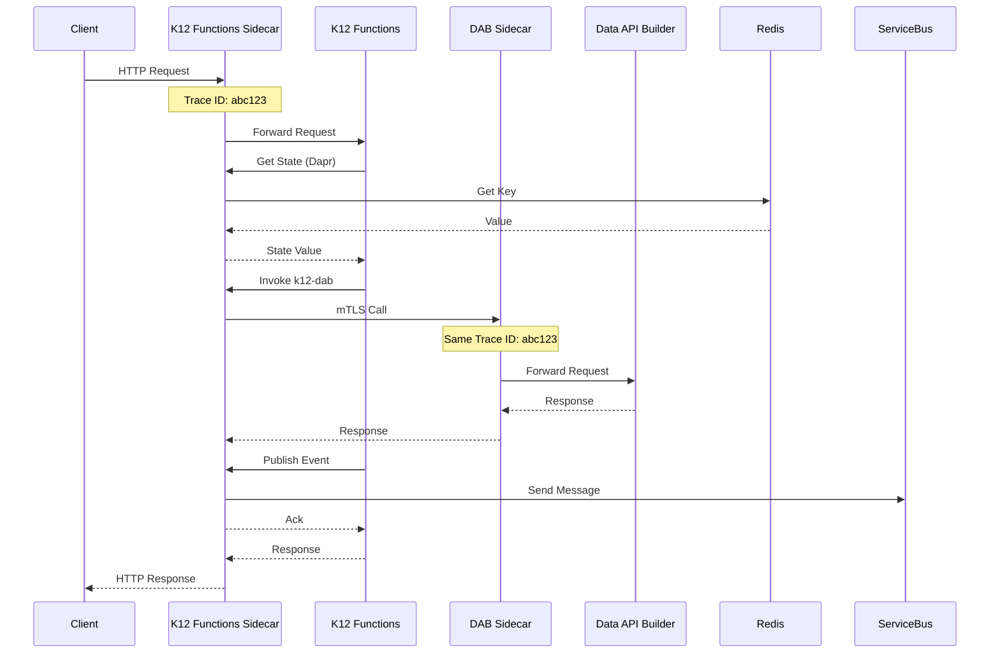

# CONT-06: Dapr Service Mesh Integration

**Status:** Proposed - Week 5 Deliverable
**Owner:** CFI Architecture Team
**Last Updated:** December 2025

## Overview

This document provides comprehensive guidance on using Dapr (Distributed Application Runtime) as the abstraction layer for all cross-cutting concerns in K12 MyPortal. Dapr is built into Azure Container Apps and provides a consistent programming model for local development (via Aspire) and production deployment.

## Architecture Diagram



## All 8 Dapr Building Blocks

K12 MyPortal uses all 8 Dapr building blocks for cross-cutting concerns:

| # | Building Block | Purpose | K12 Use Case |
|---|---------------|---------|--------------|
| 1 | **Service Invocation** | Service-to-service calls with mTLS | API-to-API communication |
| 2 | **State Management** | Distributed state storage | Session cache, temp data |
| 3 | **Pub/Sub** | Async messaging | RDS integration, events |
| 4 | **Bindings** | External system connections | Blob storage, email |
| 5 | **Secrets** | Secure secret access | API keys, connection strings |
| 6 | **Configuration** | Dynamic configuration | Feature flags, settings |
| 7 | **Workflows** | Long-running orchestration | Roster certification |
| 8 | **Jobs** | Scheduled tasks | Daily cleanup, reports |

## Local vs Production Component Mapping



## Component Configurations

### 1. Service Invocation

Service invocation requires no explicit component configuration. Dapr automatically provides:
- mTLS encryption between services
- Automatic retries with exponential backoff
- Circuit breaker on repeated failures
- Load balancing across replicas

**Calling a Service:**
```csharp
// HTTP-based invocation
var client = DaprClient.CreateInvokeHttpClient("k12-dab");
var students = await client.GetFromJsonAsync<List<Student>>("/api/students");

// gRPC-based invocation
var response = await daprClient.InvokeMethodAsync<GetStudentRequest, Student>(
    "k12-functions",
    "GetStudent",
    new GetStudentRequest { StudentId = studentId });
```

**Container Apps Configuration:**
```bicep
resource containerApp 'Microsoft.App/containerApps@2023-05-01' = {
  properties: {
    configuration: {
      dapr: {
        enabled: true
        appId: 'k12-functions'
        appPort: 8080
        appProtocol: 'http'
      }
    }
  }
}
```

### 2. State Management

**Local Component (Redis):**
```yaml
# components/statestore.yaml
apiVersion: dapr.io/v1alpha1
kind: Component
metadata:
  name: statestore
spec:
  type: state.redis
  version: v1
  metadata:
    - name: redisHost
      value: localhost:6379
    - name: redisPassword
      value: ""
    - name: actorStateStore
      value: "true"
    - name: keyPrefix
      value: k12
```

**Production Component (Azure Cache for Redis):**
```yaml
apiVersion: dapr.io/v1alpha1
kind: Component
metadata:
  name: statestore
spec:
  type: state.redis
  version: v1
  metadata:
    - name: redisHost
      secretKeyRef:
        name: redis-connection
        key: host
    - name: redisPassword
      secretKeyRef:
        name: redis-connection
        key: password
    - name: enableTLS
      value: "true"
    - name: actorStateStore
      value: "true"
    - name: keyPrefix
      value: k12
scopes:
  - k12-functions
  - k12-dab
```

**Usage:**
```csharp
// Save state
await daprClient.SaveStateAsync("statestore", $"session:{userId}", sessionData);

// Get state
var session = await daprClient.GetStateAsync<UserSession>("statestore", $"session:{userId}");

// Save with TTL
await daprClient.SaveStateAsync("statestore", $"cache:{key}", data,
    metadata: new Dictionary<string, string> { ["ttlInSeconds"] = "3600" });

// Transactional operations
var ops = new List<StateTransactionRequest>
{
    new StateTransactionRequest("key1", JsonSerializer.SerializeToUtf8Bytes(value1), StateOperationType.Upsert),
    new StateTransactionRequest("key2", null, StateOperationType.Delete)
};
await daprClient.ExecuteStateTransactionAsync("statestore", ops);
```

### 3. Pub/Sub

**Local Component (Redis Streams):**
```yaml
# components/pubsub.yaml
apiVersion: dapr.io/v1alpha1
kind: Component
metadata:
  name: pubsub
spec:
  type: pubsub.redis
  version: v1
  metadata:
    - name: redisHost
      value: localhost:6379
    - name: consumerID
      value: k12-consumer
```

**Production Component (Azure Service Bus):**
```yaml
apiVersion: dapr.io/v1alpha1
kind: Component
metadata:
  name: pubsub
spec:
  type: pubsub.azure.servicebus.topics
  version: v1
  metadata:
    - name: connectionString
      secretKeyRef:
        name: servicebus-connection
        key: connectionString
    - name: consumerID
      value: k12-consumer
    - name: maxDeliveryCount
      value: "5"
    - name: lockDurationInSec
      value: "60"
    - name: maxConcurrentHandlers
      value: "10"
scopes:
  - k12-functions
```

**Publishing Events:**
```csharp
// Publish to topic
await daprClient.PublishEventAsync("pubsub", "k12.roster.events", new RosterCertifiedEvent
{
    EventId = Guid.NewGuid(),
    EventType = "RosterCertified",
    SchoolId = schoolId,
    StudentIds = certifiedStudents,
    CertifiedAt = DateTime.UtcNow,
    CertifiedBy = userId
});
```

**Subscribing to Events:**
```csharp
[ApiController]
[Route("[controller]")]
public class EventsController : ControllerBase
{
    [Topic("pubsub", "k12.roster.events")]
    [HttpPost("roster-certified")]
    public async Task<IActionResult> HandleRosterCertified(
        [FromBody] CloudEvent<RosterCertifiedEvent> cloudEvent)
    {
        var evt = cloudEvent.Data;
        _logger.LogInformation("Processing roster certification for school {SchoolId}", evt.SchoolId);

        // Process event...

        return Ok();
    }
}
```

### 4. Bindings

**Local Component (Local Storage):**
```yaml
# components/documents-binding.yaml
apiVersion: dapr.io/v1alpha1
kind: Component
metadata:
  name: documents
spec:
  type: bindings.localstorage
  version: v1
  metadata:
    - name: rootPath
      value: ./local-documents
```

**Production Component (Azure Blob Storage):**
```yaml
apiVersion: dapr.io/v1alpha1
kind: Component
metadata:
  name: documents
spec:
  type: bindings.azure.blobstorage
  version: v1
  metadata:
    - name: storageAccount
      value: k12documents
    - name: storageAccessKey
      secretKeyRef:
        name: blob-storage
        key: accessKey
    - name: container
      value: enrollment-documents
    - name: decodeBase64
      value: "true"
scopes:
  - k12-functions
```

**Email Binding (SendGrid):**
```yaml
apiVersion: dapr.io/v1alpha1
kind: Component
metadata:
  name: email
spec:
  type: bindings.twilio.sendgrid
  version: v1
  metadata:
    - name: apiKey
      secretKeyRef:
        name: sendgrid
        key: apiKey
    - name: emailFrom
      value: noreply@ncseaa.edu
    - name: emailFromName
      value: NC SEAA K12 Portal
scopes:
  - k12-functions
```

**Usage:**
```csharp
// Upload document
await daprClient.InvokeBindingAsync("documents", "create", documentBytes,
    new Dictionary<string, string>
    {
        ["blobName"] = $"{applicationId}/{documentType}.pdf",
        ["contentType"] = "application/pdf"
    });

// Download document
var response = await daprClient.InvokeBindingAsync<byte[]>("documents", "get", null,
    new Dictionary<string, string>
    {
        ["blobName"] = $"{applicationId}/{documentType}.pdf"
    });

// Send email
await daprClient.InvokeBindingAsync("email", "create", new
{
    emailTo = parentEmail,
    subject = "Your K12 Application Update",
    body = emailBody
});
```

### 5. Secrets

**Local Component:**
```yaml
# components/secrets.yaml
apiVersion: dapr.io/v1alpha1
kind: Component
metadata:
  name: secrets
spec:
  type: secretstores.local.file
  version: v1
  metadata:
    - name: secretsFile
      value: ./secrets/local-secrets.json
    - name: nestedSeparator
      value: ":"
```

**Local Secrets File (./secrets/local-secrets.json):**
```json
{
  "sendgrid-api-key": "SG.local-dev-key",
  "classwallet-api-key": "cw-local-dev-key",
  "redis-connection": {
    "host": "localhost:6379",
    "password": ""
  },
  "sql-connection": {
    "connectionString": "Server=localhost;Database=K12;..."
  }
}
```

**Production Component (Azure Key Vault):**
```yaml
apiVersion: dapr.io/v1alpha1
kind: Component
metadata:
  name: secrets
spec:
  type: secretstores.azure.keyvault
  version: v1
  metadata:
    - name: vaultName
      value: k12-keyvault-prod
    - name: azureClientId
      value: "{managed-identity-client-id}"
auth:
  secretStore: kubernetes
```

**Usage:**
```csharp
// Get single secret
var secret = await daprClient.GetSecretAsync("secrets", "sendgrid-api-key");
var apiKey = secret["sendgrid-api-key"];

// Get bulk secrets (not supported by all stores)
var allSecrets = await daprClient.GetBulkSecretAsync("secrets");

// Use in configuration
builder.Configuration.AddDaprSecretStore("secrets", new DaprClientBuilder().Build());
```

### 6. Configuration

**Local Component:**
```yaml
# components/config.yaml
apiVersion: dapr.io/v1alpha1
kind: Component
metadata:
  name: config
spec:
  type: configuration.local.file
  version: v1
  metadata:
    - name: configFile
      value: ./config/local-config.json
```

**Local Config File (./config/local-config.json):**
```json
{
  "feature-flags": {
    "new-enrollment-flow": "true",
    "enable-analytics": "false"
  },
  "enrollment-settings": {
    "max-students-per-household": "10",
    "application-deadline": "2026-06-30"
  }
}
```

**Production Component (Azure App Configuration):**
```yaml
apiVersion: dapr.io/v1alpha1
kind: Component
metadata:
  name: config
spec:
  type: configuration.azure.appconfig
  version: v1
  metadata:
    - name: host
      value: k12-appconfig.azconfig.io
    - name: connectionString
      secretKeyRef:
        name: appconfig
        key: connectionString
    - name: maxRetries
      value: "3"
    - name: subscribePollInterval
      value: "30s"
scopes:
  - k12-functions
```

**Usage:**
```csharp
// Get configuration items
var config = await daprClient.GetConfiguration("config",
    new[] { "feature-flags:new-enrollment-flow", "enrollment-settings:max-students-per-household" });

var isEnabled = config.Items["feature-flags:new-enrollment-flow"].Value == "true";
var maxStudents = int.Parse(config.Items["enrollment-settings:max-students-per-household"].Value);

// Subscribe to configuration changes
var subscriptionId = await daprClient.SubscribeConfiguration("config",
    new[] { "feature-flags" },
    (id, items) =>
    {
        foreach (var item in items)
        {
            _logger.LogInformation("Config changed: {Key} = {Value}", item.Key, item.Value);
            // Update local cache or trigger refresh
        }
    });

// Unsubscribe when done
await daprClient.UnsubscribeConfiguration("config", subscriptionId);
```

### 7. Workflows

**Workflow Definition:**
```csharp
public class RosterCertificationWorkflow : Workflow<RosterInput, RosterResult>
{
    public override async Task<RosterResult> RunAsync(WorkflowContext context, RosterInput input)
    {
        // Step 1: Validate school exists
        var school = await context.CallActivityAsync<School>(
            nameof(ValidateSchoolActivity), input.SchoolId);

        // Step 2: Get students for certification
        var students = await context.CallActivityAsync<List<Student>>(
            nameof(GetStudentsForCertificationActivity), input.SchoolId);

        // Step 3: Notify school admin
        await context.CallActivityAsync(
            nameof(NotifySchoolAdminActivity),
            new NotifyInput { SchoolId = input.SchoolId, StudentCount = students.Count });

        // Step 4: Wait for certification (with timeout)
        bool certified;
        try
        {
            certified = await context.WaitForExternalEventAsync<bool>(
                "certification-completed",
                TimeSpan.FromDays(14));
        }
        catch (TaskCanceledException)
        {
            // Timeout - escalate
            await context.CallActivityAsync(
                nameof(EscalateUncertifiedActivity), input.SchoolId);
            return new RosterResult { Success = false, Reason = "Certification timeout" };
        }

        if (!certified)
        {
            return new RosterResult { Success = false, Reason = "Certification declined" };
        }

        // Step 5: Process certified students (fan-out)
        var tasks = students.Select(s => context.CallActivityAsync(
            nameof(ProcessStudentActivity), s.Id)).ToList();

        await Task.WhenAll(tasks);

        // Step 6: Generate report
        var report = await context.CallActivityAsync<CertificationReport>(
            nameof(GenerateReportActivity), input.SchoolId);

        return new RosterResult { Success = true, Report = report };
    }
}
```

**Activity Definitions:**
```csharp
public class RosterActivities
{
    [Activity]
    public async Task<School> ValidateSchoolActivity(string schoolId)
    {
        // Validate school exists and is active
        return await _schoolRepository.GetByIdAsync(schoolId);
    }

    [Activity]
    public async Task<List<Student>> GetStudentsForCertificationActivity(string schoolId)
    {
        return await _studentRepository.GetBySchoolAsync(schoolId);
    }

    [Activity]
    public async Task NotifySchoolAdminActivity(NotifyInput input)
    {
        await _notificationService.SendAsync(input.SchoolId,
            $"Please certify {input.StudentCount} students for the current enrollment period.");
    }

    [Activity]
    public async Task ProcessStudentActivity(string studentId)
    {
        await _certificationService.ProcessStudentAsync(studentId);
    }
}
```

**Starting and Managing Workflows:**
```csharp
// Start workflow
var workflowId = await daprClient.StartWorkflowAsync(
    "dapr",
    nameof(RosterCertificationWorkflow),
    $"roster-{schoolId}-{DateTime.UtcNow:yyyyMM}",
    new RosterInput { SchoolId = schoolId });

// Get workflow status
var status = await daprClient.GetWorkflowAsync("dapr", workflowId);

// Send external event (certification submitted)
await daprClient.RaiseWorkflowEventAsync(
    "dapr", workflowId, "certification-completed", true);

// Terminate workflow
await daprClient.TerminateWorkflowAsync("dapr", workflowId);
```

### 8. Jobs (Scheduled Tasks)

**Cron Binding Component:**
```yaml
# components/audit-cleanup-job.yaml
apiVersion: dapr.io/v1alpha1
kind: Component
metadata:
  name: audit-cleanup-job
spec:
  type: bindings.cron
  version: v1
  metadata:
    - name: schedule
      value: "0 0 2 * * *"  # Daily at 2 AM
    - name: route
      value: /jobs/audit-cleanup
scopes:
  - k12-functions
```

**Job Handler:**
```csharp
[ApiController]
[Route("jobs")]
public class JobsController : ControllerBase
{
    private readonly IAuditService _auditService;
    private readonly ILogger<JobsController> _logger;

    [HttpPost("audit-cleanup")]
    public async Task<IActionResult> AuditCleanup()
    {
        _logger.LogInformation("Starting scheduled audit cleanup job");

        var archivedCount = await _auditService.ArchiveOldLogsAsync(
            olderThan: TimeSpan.FromDays(90));
        var purgedCount = await _auditService.PurgeArchivedLogsAsync(
            olderThan: TimeSpan.FromDays(365));

        _logger.LogInformation("Audit cleanup complete. Archived: {Archived}, Purged: {Purged}",
            archivedCount, purgedCount);

        return Ok(new { Archived = archivedCount, Purged = purgedCount });
    }

    [HttpPost("enrollment-reminder")]
    public async Task<IActionResult> EnrollmentReminder()
    {
        _logger.LogInformation("Starting enrollment reminder job");

        var reminders = await _notificationService.SendEnrollmentRemindersAsync();

        return Ok(new { RemindersSent = reminders });
    }
}
```

**Multiple Job Components:**
```yaml
# Daily audit cleanup
---
apiVersion: dapr.io/v1alpha1
kind: Component
metadata:
  name: job-audit-cleanup
spec:
  type: bindings.cron
  version: v1
  metadata:
    - name: schedule
      value: "0 0 2 * * *"
    - name: route
      value: /jobs/audit-cleanup

# Weekly enrollment reminder (Monday 9 AM)
---
apiVersion: dapr.io/v1alpha1
kind: Component
metadata:
  name: job-enrollment-reminder
spec:
  type: bindings.cron
  version: v1
  metadata:
    - name: schedule
      value: "0 0 9 * * 1"
    - name: route
      value: /jobs/enrollment-reminder

# Monthly report generation (1st of month, 6 AM)
---
apiVersion: dapr.io/v1alpha1
kind: Component
metadata:
  name: job-monthly-report
spec:
  type: bindings.cron
  version: v1
  metadata:
    - name: schedule
      value: "0 0 6 1 * *"
    - name: route
      value: /jobs/monthly-report
```

## Aspire AppHost Configuration

Complete Aspire configuration with all Dapr building blocks:

```csharp
// K12.AppHost/Program.cs
var builder = DistributedApplication.CreateBuilder(args);

// Infrastructure
var redis = builder.AddRedis("redis")
    .WithDataVolume("redis-data");

var postgres = builder.AddPostgres("postgres")
    .WithDataVolume("postgres-data")
    .AddDatabase("K12");

// Add Dapr
builder.AddDapr(options =>
{
    options.DaprGrpcPort = 50001;
    options.DaprHttpPort = 3500;
    options.EnableTelemetry = true;
});

// State Store
builder.AddDaprStateStore("statestore", "state.redis", options =>
{
    options.Metadata.Add("redisHost", redis.Resource.ConnectionStringExpression);
    options.Metadata.Add("keyPrefix", "k12");
    options.Metadata.Add("actorStateStore", "true");
});

// Pub/Sub
builder.AddDaprPubSub("pubsub", "pubsub.redis", options =>
{
    options.Metadata.Add("redisHost", redis.Resource.ConnectionStringExpression);
    options.Metadata.Add("consumerID", "k12-local");
});

// Secrets (local file)
builder.AddDaprSecretStore("secrets", "secretstores.local.file", options =>
{
    options.Metadata.Add("secretsFile", "./secrets/local-secrets.json");
});

// Configuration (local file)
builder.AddDaprConfiguration("config", "configuration.local.file", options =>
{
    options.Metadata.Add("configFile", "./config/local-config.json");
});

// Document binding (local storage)
builder.AddDaprBinding("documents", "bindings.localstorage", options =>
{
    options.Metadata.Add("rootPath", "./local-documents");
});

// Services with Dapr sidecars
var functions = builder.AddProject<K12_Functions>("k12-functions")
    .WithDaprSidecar("k12-functions")
    .WithReference(postgres)
    .WithReference(redis);

var dab = builder.AddContainer("k12-dab", "mcr.microsoft.com/azure-databases/data-api-builder")
    .WithDaprSidecar("k12-dab")
    .WithReference(postgres);

var cubejs = builder.AddContainer("k12-cubejs", "cubejs/cube:latest")
    .WithDaprSidecar("k12-cubejs")
    .WithReference(postgres);

builder.Build().Run();
```

## Resilience Policies

Dapr provides built-in resilience that can be configured:

```yaml
# components/resiliency.yaml
apiVersion: dapr.io/v1alpha1
kind: Resiliency
metadata:
  name: k12-resiliency
spec:
  policies:
    retries:
      defaultRetry:
        policy: constant
        duration: 1s
        maxRetries: 3

      longRetry:
        policy: exponential
        maxInterval: 30s
        maxRetries: 5

    circuitBreakers:
      defaultCB:
        maxRequests: 1
        interval: 30s
        timeout: 60s
        trip: consecutiveFailures >= 5

    timeouts:
      defaultTimeout: 30s
      longTimeout: 120s

  targets:
    apps:
      k12-dab:
        retry: defaultRetry
        circuitBreaker: defaultCB
        timeout: defaultTimeout

      k12-functions:
        retry: longRetry
        timeout: longTimeout

    components:
      pubsub:
        outbound:
          retry: longRetry
          circuitBreaker: defaultCB
```

## Observability

All Dapr calls automatically emit OpenTelemetry traces:



## Related Documentation

- [ADR-PROP-006: Dapr for Cross-Cutting Concerns](../07-adr-proposed/ADR-PROP-006-dapr.md)
- [ADR-PROP-001: Container Functions on Container Apps](../07-adr-proposed/ADR-PROP-001-container-functions.md)
- [ADR-PROP-002: .NET Aspire Orchestration](../07-adr-proposed/ADR-PROP-002-aspire.md)
- [ASPIRE-01: AppHost Setup](../02-aspire/ASPIRE-01-apphost-setup.md)
- [CONT-02: Environment Design](CONT-02-environment-design.md)

## References

- [Dapr Documentation](https://docs.dapr.io/)
- [Dapr on Azure Container Apps](https://learn.microsoft.com/en-us/azure/container-apps/dapr-overview)
- [Dapr Building Blocks](https://docs.dapr.io/concepts/building-blocks-concept/)
- [Dapr Workflows](https://docs.dapr.io/developing-applications/building-blocks/workflow/)
- [.NET Aspire Dapr Integration](https://learn.microsoft.com/en-us/dotnet/aspire/frameworks/dapr)

---

*Last Updated: December 2025*
