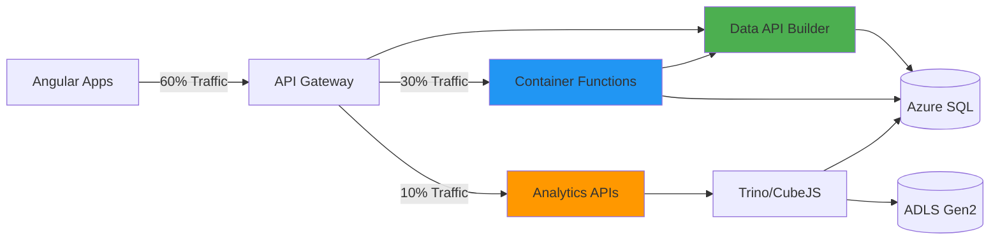

# API-01: Data API Builder Implementation Guide

**Status:** Proposed
**Last Updated:** 2025-11-24
**Target Audience:** Backend Developers, DevOps Engineers
**Related ADRs:** [ADR-PROP-003](../../adr/ADR-PROP-003-data-api-builder.md)

## Overview

This guide provides complete implementation instructions for Data API Builder (DAB) as the primary data access layer for the K12 MyPortal system. DAB handles **60% of API traffic** - all simple CRUD operations for core entities.

### Why Data API Builder?

- **Zero-code CRUD APIs**: Auto-generated REST and GraphQL endpoints from database schema
- **GraphQL Relationships**: Single-request complex queries (eliminating N+1 problems)
- **Claims-Based Authorization**: DAB policy enforcement using JWT claims
- **Performance**: Sub-50ms p95 latency for simple operations
- **Developer Productivity**: Eliminates boilerplate repository/controller code

### Architecture Position



## Installation

### Prerequisites

- .NET 8 SDK
- Azure SQL database (K12 schema)
- Redis Cache (optional, recommended for production)
- Docker (for containerized deployment)

### DAB CLI Installation

```bash
# Install DAB CLI globally
dotnet tool install -g Microsoft.DataApiBuilder

# Verify installation
dab --version
# Expected: 1.2.10 or higher
```

### Initialize DAB Project

```bash
# Create DAB configuration directory
mkdir c:/Projects/CFI/K12/k12-api-dab
cd c:/Projects/CFI/K12/k12-api-dab

# Initialize with Azure SQL
dab init \
  --database-type mssql \
  --connection-string "@env('DAB_SQL_CONNECTION_STRING')" \
  --host-mode production \
  --cors-origin "https://myportal.k12.nc.gov,https://admin.myportal.k12.nc.gov" \
  --set-session-context true
```

## Configuration Schema

### Complete `dab-config.json`

Create `c:/Projects/CFI/K12/k12-api-dab/dab-config.json`:

```json
{
  "$schema": "https://github.com/Azure/data-api-builder/releases/latest/download/dab.draft.schema.json",
  "data-source": {
    "database-type": "mssql",
    "connection-string": "@env('DAB_SQL_CONNECTION_STRING')",
    "options": {
      "set-session-context": true
    }
  },
  "runtime": {
    "rest": {
      "enabled": true,
      "path": "/api",
      "request-body-strict": true
    },
    "graphql": {
      "enabled": true,
      "path": "/graphql",
      "allow-introspection": true
    },
    "host": {
      "mode": "production",
      "cors": {
        "origins": [
          "https://myportal.k12.nc.gov",
          "https://admin.myportal.k12.nc.gov",
          "https://enrollment.myportal.k12.nc.gov",
          "https://providers.myportal.k12.nc.gov",
          "https://schools.myportal.k12.nc.gov"
        ],
        "allow-credentials": true
      },
      "authentication": {
        "provider": "AzureAD",
        "jwt": {
          "audience": "api://k12-myportal-api",
          "issuer": "https://login.microsoftonline.com/{tenant-id}/v2.0"
        }
      }
    },
    "cache": {
      "enabled": true,
      "ttl-seconds": 900
    }
  },
  "entities": {
    "Student": {
      "source": {
        "object": "dbo.Students",
        "type": "table",
        "key-fields": ["StudentId"]
      },
      "graphql": {
        "enabled": true,
        "type": {
          "singular": "Student",
          "plural": "Students"
        }
      },
      "rest": {
        "enabled": true,
        "path": "/students"
      },
      "permissions": [
        {
          "role": "anonymous",
          "actions": []
        },
        {
          "role": "authenticated",
          "actions": [
            {
              "action": "read",
              "fields": {
                "include": ["*"],
                "exclude": ["SSN", "InternalNotes"]
              }
            },
            {
              "action": "create",
              "fields": {
                "include": ["*"],
                "exclude": ["StudentId", "CreatedDate", "ModifiedDate"]
              }
            },
            {
              "action": "update",
              "fields": {
                "include": ["*"],
                "exclude": ["StudentId", "CreatedDate"]
              }
            }
          ]
        },
        {
          "role": "admin",
          "actions": [
            {
              "action": "*"
            }
          ]
        }
      ],
      "relationships": {
        "household": {
          "cardinality": "many",
          "target.entity": "Household",
          "source.fields": ["HouseholdId"],
          "target.fields": ["HouseholdId"],
          "linking.object": null
        },
        "applications": {
          "cardinality": "many",
          "target.entity": "Application",
          "source.fields": ["StudentId"],
          "target.fields": ["StudentId"]
        },
        "awards": {
          "cardinality": "many",
          "target.entity": "Award",
          "source.fields": ["StudentId"],
          "target.fields": ["StudentId"]
        }
      },
      "mappings": {
        "StudentId": "student_id",
        "FirstName": "first_name",
        "LastName": "last_name",
        "DateOfBirth": "date_of_birth",
        "HouseholdId": "household_id",
        "EnrollmentStatus": "enrollment_status",
        "CreatedDate": "created_date",
        "ModifiedDate": "modified_date"
      }
    },
    "Application": {
      "source": {
        "object": "Enrollment.Applications",
        "type": "table",
        "key-fields": ["ApplicationId"]
      },
      "graphql": {
        "enabled": true,
        "type": {
          "singular": "Application",
          "plural": "Applications"
        }
      },
      "rest": {
        "enabled": true,
        "path": "/applications"
      },
      "permissions": [
        {
          "role": "anonymous",
          "actions": []
        },
        {
          "role": "authenticated",
          "actions": [
            {
              "action": "read",
              "fields": {
                "include": ["*"]
              }
            },
            {
              "action": "create",
              "fields": {
                "include": ["*"],
                "exclude": ["ApplicationId", "CreatedDate", "ModifiedDate"]
              }
            },
            {
              "action": "update",
              "fields": {
                "include": ["Status", "SchoolId", "ProviderId", "ModifiedBy"],
                "exclude": ["ApplicationId", "StudentId", "CreatedDate"]
              }
            }
          ]
        },
        {
          "role": "admin",
          "actions": [
            {
              "action": "*"
            }
          ]
        }
      ],
      "relationships": {
        "student": {
          "cardinality": "one",
          "target.entity": "Student",
          "source.fields": ["StudentId"],
          "target.fields": ["StudentId"]
        },
        "school": {
          "cardinality": "one",
          "target.entity": "School",
          "source.fields": ["SchoolId"],
          "target.fields": ["SchoolId"]
        },
        "provider": {
          "cardinality": "one",
          "target.entity": "Provider",
          "source.fields": ["ProviderId"],
          "target.fields": ["ProviderId"]
        },
        "awards": {
          "cardinality": "many",
          "target.entity": "Award",
          "source.fields": ["ApplicationId"],
          "target.fields": ["ApplicationId"]
        },
        "documents": {
          "cardinality": "many",
          "target.entity": "Document",
          "source.fields": ["ApplicationId"],
          "target.fields": ["ApplicationId"]
        }
      },
      "mappings": {
        "ApplicationId": "application_id",
        "StudentId": "student_id",
        "SchoolId": "school_id",
        "ProviderId": "provider_id",
        "Status": "status",
        "ApplicationType": "application_type",
        "SubmittedDate": "submitted_date",
        "CreatedDate": "created_date",
        "ModifiedDate": "modified_date"
      }
    },
    "Household": {
      "source": {
        "object": "Households.Households",
        "type": "table",
        "key-fields": ["HouseholdId"]
      },
      "graphql": {
        "enabled": true,
        "type": {
          "singular": "Household",
          "plural": "Households"
        }
      },
      "rest": {
        "enabled": true,
        "path": "/households"
      },
      "permissions": [
        {
          "role": "anonymous",
          "actions": []
        },
        {
          "role": "authenticated",
          "actions": [
            {
              "action": "read",
              "fields": {
                "include": ["*"],
                "exclude": ["TaxDocumentPath", "IncomeVerificationNotes"]
              }
            },
            {
              "action": "create",
              "fields": {
                "include": ["*"],
                "exclude": ["HouseholdId", "CreatedDate", "ModifiedDate"]
              }
            },
            {
              "action": "update",
              "fields": {
                "include": ["*"],
                "exclude": ["HouseholdId", "CreatedDate"]
              }
            }
          ]
        },
        {
          "role": "admin",
          "actions": [
            {
              "action": "*"
            }
          ]
        }
      ],
      "relationships": {
        "students": {
          "cardinality": "many",
          "target.entity": "Student",
          "source.fields": ["HouseholdId"],
          "target.fields": ["HouseholdId"]
        },
        "primaryContact": {
          "cardinality": "one",
          "target.entity": "Contact",
          "source.fields": ["PrimaryContactId"],
          "target.fields": ["ContactId"]
        },
        "members": {
          "cardinality": "many",
          "target.entity": "HouseholdMember",
          "source.fields": ["HouseholdId"],
          "target.fields": ["HouseholdId"]
        }
      },
      "mappings": {
        "HouseholdId": "household_id",
        "PrimaryContactId": "primary_contact_id",
        "HouseholdSize": "household_size",
        "AnnualIncome": "annual_income",
        "IncomeVerificationStatus": "income_verification_status",
        "CreatedDate": "created_date",
        "ModifiedDate": "modified_date"
      }
    },
    "School": {
      "source": {
        "object": "dbo.Schools",
        "type": "table",
        "key-fields": ["SchoolId"]
      },
      "graphql": {
        "enabled": true,
        "type": {
          "singular": "School",
          "plural": "Schools"
        }
      },
      "rest": {
        "enabled": true,
        "path": "/schools"
      },
      "permissions": [
        {
          "role": "anonymous",
          "actions": [
            {
              "action": "read",
              "fields": {
                "include": ["SchoolId", "SchoolName", "DistrictId", "City", "County", "IsActive", "AccreditationStatus"]
              }
            }
          ]
        },
        {
          "role": "authenticated",
          "actions": [
            {
              "action": "read",
              "fields": {
                "include": ["*"]
              }
            }
          ]
        },
        {
          "role": "admin",
          "actions": [
            {
              "action": "*"
            }
          ]
        }
      ],
      "relationships": {
        "district": {
          "cardinality": "one",
          "target.entity": "District",
          "source.fields": ["DistrictId"],
          "target.fields": ["DistrictId"]
        },
        "applications": {
          "cardinality": "many",
          "target.entity": "Application",
          "source.fields": ["SchoolId"],
          "target.fields": ["SchoolId"]
        }
      },
      "mappings": {
        "SchoolId": "school_id",
        "SchoolName": "school_name",
        "DistrictId": "district_id",
        "City": "city",
        "County": "county",
        "IsActive": "is_active",
        "AccreditationStatus": "accreditation_status"
      }
    },
    "Provider": {
      "source": {
        "object": "dbo.Providers",
        "type": "table",
        "key-fields": ["ProviderId"]
      },
      "graphql": {
        "enabled": true,
        "type": {
          "singular": "Provider",
          "plural": "Providers"
        }
      },
      "rest": {
        "enabled": true,
        "path": "/providers"
      },
      "permissions": [
        {
          "role": "anonymous",
          "actions": [
            {
              "action": "read",
              "fields": {
                "include": ["ProviderId", "ProviderName", "Category", "IsActive"]
              }
            }
          ]
        },
        {
          "role": "authenticated",
          "actions": [
            {
              "action": "read",
              "fields": {
                "include": ["*"]
              }
            }
          ]
        },
        {
          "role": "admin",
          "actions": [
            {
              "action": "*"
            }
          ]
        }
      ],
      "relationships": {
        "products": {
          "cardinality": "many",
          "target.entity": "Product",
          "source.fields": ["ProviderId"],
          "target.fields": ["ProviderId"]
        },
        "applications": {
          "cardinality": "many",
          "target.entity": "Application",
          "source.fields": ["ProviderId"],
          "target.fields": ["ProviderId"]
        }
      },
      "mappings": {
        "ProviderId": "provider_id",
        "ProviderName": "provider_name",
        "Category": "category",
        "IsActive": "is_active"
      }
    },
    "Award": {
      "source": {
        "object": "Awards.Awards",
        "type": "table",
        "key-fields": ["AwardId"]
      },
      "graphql": {
        "enabled": true,
        "type": {
          "singular": "Award",
          "plural": "Awards"
        }
      },
      "rest": {
        "enabled": true,
        "path": "/awards"
      },
      "permissions": [
        {
          "role": "anonymous",
          "actions": []
        },
        {
          "role": "authenticated",
          "actions": [
            {
              "action": "read",
              "fields": {
                "include": ["*"]
              }
            },
            {
              "action": "create",
              "fields": {
                "include": ["*"],
                "exclude": ["AwardId", "CreatedDate", "ModifiedDate"]
              }
            }
          ]
        },
        {
          "role": "admin",
          "actions": [
            {
              "action": "*"
            }
          ]
        }
      ],
      "relationships": {
        "application": {
          "cardinality": "one",
          "target.entity": "Application",
          "source.fields": ["ApplicationId"],
          "target.fields": ["ApplicationId"]
        },
        "student": {
          "cardinality": "one",
          "target.entity": "Student",
          "source.fields": ["StudentId"],
          "target.fields": ["StudentId"]
        },
        "disbursements": {
          "cardinality": "many",
          "target.entity": "Disbursement",
          "source.fields": ["AwardId"],
          "target.fields": ["AwardId"]
        }
      },
      "mappings": {
        "AwardId": "award_id",
        "ApplicationId": "application_id",
        "StudentId": "student_id",
        "AwardAmount": "award_amount",
        "AwardYear": "award_year",
        "Status": "status",
        "ClassWalletAccountId": "classwallet_account_id",
        "CreatedDate": "created_date",
        "ModifiedDate": "modified_date"
      }
    },
    "District": {
      "source": {
        "object": "dbo.Districts",
        "type": "table",
        "key-fields": ["DistrictId"]
      },
      "graphql": {
        "enabled": true,
        "type": {
          "singular": "District",
          "plural": "Districts"
        }
      },
      "rest": {
        "enabled": true,
        "path": "/districts"
      },
      "permissions": [
        {
          "role": "anonymous",
          "actions": [
            {
              "action": "read"
            }
          ]
        },
        {
          "role": "authenticated",
          "actions": [
            {
              "action": "read"
            }
          ]
        },
        {
          "role": "admin",
          "actions": [
            {
              "action": "*"
            }
          ]
        }
      ],
      "relationships": {
        "schools": {
          "cardinality": "many",
          "target.entity": "School",
          "source.fields": ["DistrictId"],
          "target.fields": ["DistrictId"]
        }
      },
      "mappings": {
        "DistrictId": "district_id",
        "DistrictName": "district_name",
        "County": "county"
      }
    },
    "Contact": {
      "source": {
        "object": "Households.Contacts",
        "type": "table",
        "key-fields": ["ContactId"]
      },
      "graphql": {
        "enabled": true,
        "type": {
          "singular": "Contact",
          "plural": "Contacts"
        }
      },
      "rest": {
        "enabled": true,
        "path": "/contacts"
      },
      "permissions": [
        {
          "role": "anonymous",
          "actions": []
        },
        {
          "role": "authenticated",
          "actions": [
            {
              "action": "*",
              "fields": {
                "include": ["*"]
              }
            }
          ]
        },
        {
          "role": "admin",
          "actions": [
            {
              "action": "*"
            }
          ]
        }
      ],
      "mappings": {
        "ContactId": "contact_id",
        "FirstName": "first_name",
        "LastName": "last_name",
        "Email": "email",
        "Phone": "phone"
      }
    },
    "Product": {
      "source": {
        "object": "dbo.Products",
        "type": "table",
        "key-fields": ["ProductId"]
      },
      "graphql": {
        "enabled": true,
        "type": {
          "singular": "Product",
          "plural": "Products"
        }
      },
      "rest": {
        "enabled": true,
        "path": "/products"
      },
      "permissions": [
        {
          "role": "anonymous",
          "actions": [
            {
              "action": "read",
              "fields": {
                "include": ["ProductId", "ProductName", "ProviderId", "Category", "Price", "IsActive"]
              }
            }
          ]
        },
        {
          "role": "authenticated",
          "actions": [
            {
              "action": "read"
            }
          ]
        },
        {
          "role": "admin",
          "actions": [
            {
              "action": "*"
            }
          ]
        }
      ],
      "relationships": {
        "provider": {
          "cardinality": "one",
          "target.entity": "Provider",
          "source.fields": ["ProviderId"],
          "target.fields": ["ProviderId"]
        }
      },
      "mappings": {
        "ProductId": "product_id",
        "ProductName": "product_name",
        "ProviderId": "provider_id",
        "Category": "category",
        "Price": "price",
        "IsActive": "is_active"
      }
    },
    "Document": {
      "source": {
        "object": "dbo.Documents",
        "type": "table",
        "key-fields": ["DocumentId"]
      },
      "graphql": {
        "enabled": true,
        "type": {
          "singular": "Document",
          "plural": "Documents"
        }
      },
      "rest": {
        "enabled": true,
        "path": "/documents"
      },
      "permissions": [
        {
          "role": "anonymous",
          "actions": []
        },
        {
          "role": "authenticated",
          "actions": [
            {
              "action": "*"
            }
          ]
        },
        {
          "role": "admin",
          "actions": [
            {
              "action": "*"
            }
          ]
        }
      ],
      "relationships": {
        "application": {
          "cardinality": "one",
          "target.entity": "Application",
          "source.fields": ["ApplicationId"],
          "target.fields": ["ApplicationId"]
        }
      },
      "mappings": {
        "DocumentId": "document_id",
        "ApplicationId": "application_id",
        "DocumentType": "document_type",
        "BlobPath": "blob_path",
        "UploadedDate": "uploaded_date"
      }
    },
    "Disbursement": {
      "source": {
        "object": "Awards.Disbursements",
        "type": "table",
        "key-fields": ["DisbursementId"]
      },
      "graphql": {
        "enabled": true,
        "type": {
          "singular": "Disbursement",
          "plural": "Disbursements"
        }
      },
      "rest": {
        "enabled": true,
        "path": "/disbursements"
      },
      "permissions": [
        {
          "role": "anonymous",
          "actions": []
        },
        {
          "role": "authenticated",
          "actions": [
            {
              "action": "read"
            }
          ]
        },
        {
          "role": "admin",
          "actions": [
            {
              "action": "*"
            }
          ]
        }
      ],
      "relationships": {
        "award": {
          "cardinality": "one",
          "target.entity": "Award",
          "source.fields": ["AwardId"],
          "target.fields": ["AwardId"]
        }
      },
      "mappings": {
        "DisbursementId": "disbursement_id",
        "AwardId": "award_id",
        "Amount": "amount",
        "DisbursementDate": "disbursement_date",
        "ClassWalletTransactionId": "classwallet_transaction_id"
      }
    },
    "HouseholdMember": {
      "source": {
        "object": "Households.HouseholdMembers",
        "type": "table",
        "key-fields": ["MemberId"]
      },
      "graphql": {
        "enabled": true,
        "type": {
          "singular": "HouseholdMember",
          "plural": "HouseholdMembers"
        }
      },
      "rest": {
        "enabled": true,
        "path": "/household-members"
      },
      "permissions": [
        {
          "role": "anonymous",
          "actions": []
        },
        {
          "role": "authenticated",
          "actions": [
            {
              "action": "*"
            }
          ]
        },
        {
          "role": "admin",
          "actions": [
            {
              "action": "*"
            }
          ]
        }
      ],
      "relationships": {
        "household": {
          "cardinality": "one",
          "target.entity": "Household",
          "source.fields": ["HouseholdId"],
          "target.fields": ["HouseholdId"]
        }
      },
      "mappings": {
        "MemberId": "member_id",
        "HouseholdId": "household_id",
        "FirstName": "first_name",
        "LastName": "last_name",
        "Relationship": "relationship"
      }
    }
  }
}
```

## Claims-Based Authorization (Application Layer)

### DAB Policy Configuration

DAB enforces authorization using JWT claims **before** executing SQL queries (no database RLS):

```json
{
  "entities": {
    "Student": {
      "source": "Enrollment.Students",
      "permissions": [
        {
          "role": "Admin",
          "actions": ["create", "read", "update", "delete"]
        },
        {
          "role": "Household",
          "actions": ["read"],
          "policy": {
            "database": "@item.HouseholdId eq @claims.householdId"
          }
        }
      ]
    },
    "Application": {
      "source": "Enrollment.Applications",
      "permissions": [
        {
          "role": "Admin",
          "actions": ["*"]
        },
        {
          "role": "Household",
          "actions": ["create", "read", "update"],
          "policy": {
            "database": "@item.HouseholdId eq @claims.householdId"
          }
        },
        {
          "role": "Provider",
          "actions": ["read"],
          "policy": {
            "database": "@item.ProviderId eq @claims.providerId"
          }
        }
      ]
    }
  }
}
```

**How It Works:**
1. DAB validates JWT token (Entra ID)
2. Extracts claims from token (`householdId`, `providerId`, `role`)
3. Applies policy filter **in DAB layer** before SQL execution
4. Generates SQL with WHERE clause: `WHERE HouseholdId = 'guid-from-claims'`

**Benefits:**
- ✅ No SQL session context required
- ✅ Works with GraphQL and REST
- ✅ Filters applied before database query (performance optimization)
- ✅ Portable (can add MongoDB, Cosmos DB sources later)

## REST API Endpoints

DAB auto-generates RESTful endpoints:

### Students

```bash
# GET all students (filtered by DAB claims policy)
GET /api/students
Authorization: Bearer <JWT-token-with-claims>

# GET student by ID
GET /api/students/student_id/{id}

# GET students with filter
GET /api/students?$filter=enrollment_status eq 'Active'

# GET students with pagination
GET /api/students?$top=20&$skip=0

# POST create student
POST /api/students
Content-Type: application/json

{
  "first_name": "John",
  "last_name": "Doe",
  "date_of_birth": "2010-05-15",
  "household_id": "12345-guid",
  "enrollment_status": "Active"
}

# PUT update student
PUT /api/students/student_id/{id}
Content-Type: application/json

{
  "enrollment_status": "Inactive"
}

# DELETE student (soft delete recommended)
DELETE /api/students/student_id/{id}
```

### Applications

```bash
# GET applications for authenticated user (DAB claims policy enforced)
GET /api/applications
Authorization: Bearer <JWT-token-with-claims>

# GET application with related data
GET /api/applications?$expand=student,school,provider,awards

# POST create application
POST /api/applications
Content-Type: application/json

{
  "student_id": "12345-guid",
  "school_id": "67890-guid",
  "application_type": "NewEnrollment",
  "status": "Draft"
}

# PUT update application status
PUT /api/applications/application_id/{id}
Content-Type: application/json

{
  "status": "Submitted",
  "submitted_date": "2025-11-24T10:30:00Z"
}
```

### Schools (Public Read)

```bash
# GET all active schools (anonymous access allowed)
GET /api/schools?$filter=is_active eq true

# GET schools by county
GET /api/schools?$filter=county eq 'Wake'

# GET school with district
GET /api/schools/school_id/{id}?$expand=district
```

## GraphQL Schema

DAB auto-generates complete GraphQL schema with relationships:

```graphql
type Student {
  student_id: ID!
  first_name: String!
  last_name: String!
  date_of_birth: Date!
  household_id: ID!
  enrollment_status: String!
  created_date: DateTime!
  modified_date: DateTime

  # Relationships
  household: Household
  applications: [Application!]
  awards: [Award!]
}

type Application {
  application_id: ID!
  student_id: ID!
  school_id: ID
  provider_id: ID
  status: String!
  application_type: String!
  submitted_date: DateTime
  created_date: DateTime!
  modified_date: DateTime

  # Relationships
  student: Student!
  school: School
  provider: Provider
  awards: [Award!]
  documents: [Document!]
}

type Household {
  household_id: ID!
  primary_contact_id: ID!
  household_size: Int!
  annual_income: Decimal
  income_verification_status: String
  created_date: DateTime!
  modified_date: DateTime

  # Relationships
  students: [Student!]
  primaryContact: Contact!
  members: [HouseholdMember!]
}

type School {
  school_id: ID!
  school_name: String!
  district_id: ID!
  city: String
  county: String
  is_active: Boolean!
  accreditation_status: String

  # Relationships
  district: District!
  applications: [Application!]
}

type Award {
  award_id: ID!
  application_id: ID!
  student_id: ID!
  award_amount: Decimal!
  award_year: Int!
  status: String!
  classwallet_account_id: String
  created_date: DateTime!
  modified_date: DateTime

  # Relationships
  application: Application!
  student: Student!
  disbursements: [Disbursement!]
}

type Query {
  students(filter: StudentFilterInput, orderBy: StudentOrderByInput, first: Int, after: String): StudentConnection!
  student_by_pk(student_id: ID!): Student

  applications(filter: ApplicationFilterInput, orderBy: ApplicationOrderByInput, first: Int, after: String): ApplicationConnection!
  application_by_pk(application_id: ID!): Application

  households(filter: HouseholdFilterInput, orderBy: HouseholdOrderByInput, first: Int, after: String): HouseholdConnection!
  household_by_pk(household_id: ID!): Household

  schools(filter: SchoolFilterInput, orderBy: SchoolOrderByInput, first: Int, after: String): SchoolConnection!
  school_by_pk(school_id: ID!): School

  awards(filter: AwardFilterInput, orderBy: AwardOrderByInput, first: Int, after: String): AwardConnection!
  award_by_pk(award_id: ID!): Award
}

type Mutation {
  createStudent(item: CreateStudentInput!): Student
  updateStudent(student_id: ID!, item: UpdateStudentInput!): Student
  deleteStudent(student_id: ID!): Student

  createApplication(item: CreateApplicationInput!): Application
  updateApplication(application_id: ID!, item: UpdateApplicationInput!): Application
  deleteApplication(application_id: ID!): Application

  createHousehold(item: CreateHouseholdInput!): Household
  updateHousehold(household_id: ID!, item: UpdateHouseholdInput!): Household
}
```

## GraphQL Query Examples

### Enrollment Dashboard (5-Table Join)

```graphql
query EnrollmentDashboard($studentId: ID!) {
  student_by_pk(student_id: $studentId) {
    student_id
    first_name
    last_name
    enrollment_status

    household {
      household_id
      household_size
      annual_income
      income_verification_status

      primaryContact {
        first_name
        last_name
        email
        phone
      }
    }

    applications(filter: { status: { neq: "Cancelled" } }) {
      application_id
      status
      application_type
      submitted_date

      school {
        school_name
        city
        accreditation_status
      }

      provider {
        provider_name
        category
      }

      awards {
        award_id
        award_amount
        award_year
        status

        disbursements {
          amount
          disbursement_date
          classwallet_transaction_id
        }
      }

      documents {
        document_id
        document_type
        uploaded_date
      }
    }

    awards(filter: { status: { eq: "Active" } }) {
      award_id
      award_amount
      award_year
      status
      classwallet_account_id
    }
  }
}
```

**Response (Single Request):**
```json
{
  "data": {
    "student_by_pk": {
      "student_id": "12345-guid",
      "first_name": "John",
      "last_name": "Doe",
      "enrollment_status": "Active",
      "household": {
        "household_id": "67890-guid",
        "household_size": 4,
        "annual_income": 45000.00,
        "income_verification_status": "Verified",
        "primaryContact": {
          "first_name": "Jane",
          "last_name": "Doe",
          "email": "jane.doe@example.com",
          "phone": "919-555-1234"
        }
      },
      "applications": [
        {
          "application_id": "app-001",
          "status": "Approved",
          "application_type": "NewEnrollment",
          "submitted_date": "2025-09-15T14:30:00Z",
          "school": {
            "school_name": "Raleigh Charter Academy",
            "city": "Raleigh",
            "accreditation_status": "Accredited"
          },
          "provider": null,
          "awards": [
            {
              "award_id": "award-001",
              "award_amount": 5000.00,
              "award_year": 2025,
              "status": "Active",
              "disbursements": [
                {
                  "amount": 2500.00,
                  "disbursement_date": "2025-10-01T00:00:00Z",
                  "classwallet_transaction_id": "txn-12345"
                },
                {
                  "amount": 2500.00,
                  "disbursement_date": "2026-01-15T00:00:00Z",
                  "classwallet_transaction_id": "txn-67890"
                }
              ]
            }
          ],
          "documents": [
            {
              "document_id": "doc-001",
              "document_type": "BirthCertificate",
              "uploaded_date": "2025-09-10T10:00:00Z"
            },
            {
              "document_id": "doc-002",
              "document_type": "ProofOfResidency",
              "uploaded_date": "2025-09-10T10:05:00Z"
            }
          ]
        }
      ],
      "awards": [
        {
          "award_id": "award-001",
          "award_amount": 5000.00,
          "award_year": 2025,
          "status": "Active",
          "classwallet_account_id": "cw-account-12345"
        }
      ]
    }
  }
}
```

**Performance:** <100ms (single database query with JOINs)

### Filter Active Applications by School

```graphql
query ActiveApplicationsBySchool($schoolId: ID!) {
  applications(
    filter: {
      school_id: { eq: $schoolId }
      status: { in: ["Submitted", "UnderReview", "Approved"] }
    }
    orderBy: { submitted_date: DESC }
    first: 50
  ) {
    items {
      application_id
      status
      submitted_date
      student {
        first_name
        last_name
        enrollment_status
      }
      school {
        school_name
      }
    }
    pageInfo {
      hasNextPage
      endCursor
    }
  }
}
```

## Redis Caching Configuration

### Docker Compose Setup

```yaml
version: '3.8'
services:
  redis:
    image: redis:7-alpine
    ports:
      - "6379:6379"
    command: redis-server --maxmemory 256mb --maxmemory-policy allkeys-lru
    volumes:
      - redis-data:/data
    networks:
      - k12-network

  dab:
    image: mcr.microsoft.com/data-api-builder:latest
    ports:
      - "5000:5000"
    environment:
      - DAB_SQL_CONNECTION_STRING=${SQL_CONNECTION_STRING}
      - ASPNETCORE_ENVIRONMENT=Production
    volumes:
      - ./dab-config.json:/App/dab-config.json
    depends_on:
      - redis
    networks:
      - k12-network

volumes:
  redis-data:

networks:
  k12-network:
```

### Cache Strategy

- **Read-Heavy Entities** (15-min TTL):
  - Schools
  - Districts
  - Providers
  - Products
- **Moderate Entities** (5-min TTL):
  - Applications (status updates)
  - Awards (balance changes)
- **No Cache**:
  - Mutations (create/update/delete)
  - User-specific data (Students, Households with RLS)

## Deployment

### Dockerfile

Create `c:/Projects/CFI/K12/k12-api-dab/Dockerfile`:

```dockerfile
FROM mcr.microsoft.com/data-api-builder:1.2.10

WORKDIR /App

# Copy DAB configuration
COPY dab-config.json ./dab-config.json

# Expose port
EXPOSE 5000

# Health check
HEALTHCHECK --interval=30s --timeout=3s --start-period=5s --retries=3 \
  CMD curl -f http://localhost:5000/health || exit 1

# Start DAB
ENTRYPOINT ["dotnet", "Azure.DataApiBuilder.Service.dll", \
  "--ConfigFileName", "dab-config.json"]
```

### Azure Container Apps Configuration

```bash
# Create Container App
az containerapp create \
  --name k12-dab-api \
  --resource-group rg-k12-myportal-prod \
  --environment k12-containerapp-env \
  --image mcr.microsoft.com/data-api-builder:1.2.10 \
  --target-port 5000 \
  --ingress external \
  --min-replicas 2 \
  --max-replicas 10 \
  --cpu 1.0 \
  --memory 2.0Gi \
  --secrets \
    sql-connection-string="${SQL_CONNECTION_STRING}" \
  --env-vars \
    DAB_SQL_CONNECTION_STRING=secretref:sql-connection-string \
    ASPNETCORE_ENVIRONMENT=Production

# Enable autoscaling
az containerapp update \
  --name k12-dab-api \
  --resource-group rg-k12-myportal-prod \
  --scale-rule-name http-scale \
  --scale-rule-type http \
  --scale-rule-http-concurrency 100

# Enable Application Insights
az containerapp update \
  --name k12-dab-api \
  --resource-group rg-k12-myportal-prod \
  --enable-app-insights \
  --app-insights-key "${APPINSIGHTS_INSTRUMENTATION_KEY}"
```

## Testing

### Postman Collection

Create `c:/Projects/CFI/K12/k12-api-dab/tests/dab-api.postman_collection.json`:

```json
{
  "info": {
    "name": "K12 DAB API Tests",
    "schema": "https://schema.getpostman.com/json/collection/v2.1.0/collection.json"
  },
  "auth": {
    "type": "bearer",
    "bearer": [
      {
        "key": "token",
        "value": "{{jwt_token}}",
        "type": "string"
      }
    ]
  },
  "item": [
    {
      "name": "Students",
      "item": [
        {
          "name": "GET All Students",
          "request": {
            "method": "GET",
            "url": "{{base_url}}/api/students"
          },
          "event": [
            {
              "listen": "test",
              "script": {
                "exec": [
                  "pm.test('Status is 200', () => pm.response.to.have.status(200));",
                  "pm.test('Response has students array', () => {",
                  "  const json = pm.response.json();",
                  "  pm.expect(json.value).to.be.an('array');",
                  "});",
                  "pm.test('Response time < 50ms', () => pm.expect(pm.response.responseTime).to.be.below(50));"
                ]
              }
            }
          ]
        },
        {
          "name": "GET Student by ID",
          "request": {
            "method": "GET",
            "url": "{{base_url}}/api/students/student_id/{{student_id}}"
          }
        },
        {
          "name": "POST Create Student",
          "request": {
            "method": "POST",
            "url": "{{base_url}}/api/students",
            "header": [
              {
                "key": "Content-Type",
                "value": "application/json"
              }
            ],
            "body": {
              "mode": "raw",
              "raw": "{\n  \"first_name\": \"Test\",\n  \"last_name\": \"Student\",\n  \"date_of_birth\": \"2010-01-01\",\n  \"household_id\": \"{{household_id}}\",\n  \"enrollment_status\": \"Active\"\n}"
            }
          }
        }
      ]
    },
    {
      "name": "GraphQL",
      "item": [
        {
          "name": "Enrollment Dashboard Query",
          "request": {
            "method": "POST",
            "url": "{{base_url}}/graphql",
            "header": [
              {
                "key": "Content-Type",
                "value": "application/json"
              }
            ],
            "body": {
              "mode": "raw",
              "raw": "{\n  \"query\": \"query EnrollmentDashboard($studentId: ID!) { student_by_pk(student_id: $studentId) { student_id first_name last_name household { household_id primaryContact { email } } applications { application_id status school { school_name } awards { award_amount } } } }\",\n  \"variables\": {\n    \"studentId\": \"{{student_id}}\"\n  }\n}"
            }
          },
          "event": [
            {
              "listen": "test",
              "script": {
                "exec": [
                  "pm.test('GraphQL query successful', () => {",
                  "  const json = pm.response.json();",
                  "  pm.expect(json.errors).to.be.undefined;",
                  "  pm.expect(json.data.student_by_pk).to.not.be.null;",
                  "});",
                  "pm.test('Response time < 100ms', () => pm.expect(pm.response.responseTime).to.be.below(100));"
                ]
              }
            }
          ]
        }
      ]
    }
  ]
}
```

### Integration Tests

Create `c:/Projects/CFI/K12/k12-api-dab/tests/integration-tests.sh`:

```bash
#!/bin/bash

# DAB Integration Tests
BASE_URL="https://k12-dab-api.azurecontainerapps.io"
JWT_TOKEN="${DAB_TEST_JWT_TOKEN}"

echo "=== DAB Integration Tests ==="

# Test 1: Health Check
echo "Test 1: Health Check"
curl -s "${BASE_URL}/health" | jq .

# Test 2: GET Students (Authenticated)
echo "Test 2: GET Students"
RESPONSE=$(curl -s -H "Authorization: Bearer ${JWT_TOKEN}" "${BASE_URL}/api/students")
echo "$RESPONSE" | jq '.value | length'

# Test 3: POST Create Student
echo "Test 3: POST Create Student"
NEW_STUDENT=$(curl -s -X POST \
  -H "Authorization: Bearer ${JWT_TOKEN}" \
  -H "Content-Type: application/json" \
  -d '{
    "first_name": "Integration",
    "last_name": "Test",
    "date_of_birth": "2010-01-01",
    "household_id": "test-household-id",
    "enrollment_status": "Active"
  }' \
  "${BASE_URL}/api/students")

STUDENT_ID=$(echo "$NEW_STUDENT" | jq -r '.student_id')
echo "Created student: $STUDENT_ID"

# Test 4: GraphQL Query
echo "Test 4: GraphQL Enrollment Dashboard"
GRAPHQL_RESPONSE=$(curl -s -X POST \
  -H "Authorization: Bearer ${JWT_TOKEN}" \
  -H "Content-Type: application/json" \
  -d "{
    \"query\": \"query { student_by_pk(student_id: \\\"$STUDENT_ID\\\") { student_id first_name } }\"
  }" \
  "${BASE_URL}/graphql")

echo "$GRAPHQL_RESPONSE" | jq .

# Test 5: Performance Test (100 concurrent requests)
echo "Test 5: Performance Test"
ab -n 1000 -c 100 -H "Authorization: Bearer ${JWT_TOKEN}" \
  "${BASE_URL}/api/schools" | grep "Time per request"

# Cleanup
echo "Cleanup: Delete test student"
curl -s -X DELETE \
  -H "Authorization: Bearer ${JWT_TOKEN}" \
  "${BASE_URL}/api/students/student_id/${STUDENT_ID}"

echo "=== Tests Complete ==="
```

## Performance Benchmarks

### Target Latencies

| Operation | Target p95 | Target p99 |
|-----------|-----------|-----------|
| Simple GET (by ID) | <50ms | <100ms |
| List with filter | <100ms | <200ms |
| GraphQL join (3 tables) | <100ms | <200ms |
| GraphQL join (5 tables) | <150ms | <300ms |
| POST/PUT | <100ms | <200ms |

### Load Testing

```bash
# Install Apache Bench
# Windows: choco install apache-httpd
# Linux: sudo apt-get install apache2-utils

# Test 1: Simple GET (1000 requests, 100 concurrent)
ab -n 1000 -c 100 \
  -H "Authorization: Bearer ${JWT_TOKEN}" \
  https://k12-dab-api.azurecontainerapps.io/api/schools

# Expected:
# Requests per second: >500 RPS
# Time per request (mean): <200ms
# Time per request (p95): <50ms

# Test 2: GraphQL Complex Query
ab -n 500 -c 50 \
  -p graphql-query.json \
  -T application/json \
  -H "Authorization: Bearer ${JWT_TOKEN}" \
  https://k12-dab-api.azurecontainerapps.io/graphql

# Expected:
# Requests per second: >200 RPS
# Time per request (p95): <150ms
```

## Monitoring

### Application Insights Queries

```kusto
// Average response time by endpoint
requests
| where timestamp > ago(1h)
| where url contains "k12-dab-api"
| summarize
    avg_duration = avg(duration),
    p50 = percentile(duration, 50),
    p95 = percentile(duration, 95),
    p99 = percentile(duration, 99),
    request_count = count()
  by name
| order by request_count desc

// GraphQL vs REST performance
requests
| where timestamp > ago(1h)
| extend api_type = iff(url contains "/graphql", "GraphQL", "REST")
| summarize
    avg_duration = avg(duration),
    p95 = percentile(duration, 95)
  by api_type

// Cache hit rate
dependencies
| where timestamp > ago(1h)
| where type == "Redis"
| summarize
    hits = countif(success == true),
    misses = countif(success == false)
| extend hit_rate = (hits * 100.0) / (hits + misses)
```

## Troubleshooting

### Common Issues

#### 1. RLS Not Enforcing

**Symptom:** Users see data they shouldn't
**Solution:**
```bash
# Verify set-session-context is enabled in dab-config.json
cat dab-config.json | jq '.["data-source"].options["set-session-context"]'
# Should return: true

# Test SQL session context
sqlcmd -S ${SQL_SERVER} -d K12_MyPortal -Q "SELECT SESSION_CONTEXT(N'UserId')"
```

#### 2. Slow GraphQL Queries

**Symptom:** GraphQL queries >500ms
**Solution:**
```sql
-- Check for missing indexes
SELECT
    OBJECT_NAME(ius.object_id) AS table_name,
    ius.user_seeks,
    ius.user_scans,
    ius.last_user_seek
FROM sys.dm_db_index_usage_stats ius
WHERE database_id = DB_ID('K12_MyPortal')
  AND ius.user_seeks > 1000
ORDER BY ius.user_seeks DESC;

-- Add composite indexes for common joins
CREATE NONCLUSTERED INDEX IX_Applications_StudentId_Status
ON Enrollment.Applications (StudentId, Status)
INCLUDE (ApplicationId, SchoolId, SubmittedDate);
```

#### 3. Cache Staleness

**Symptom:** Users see outdated data
**Solution:**
```bash
# Reduce TTL for frequently updated entities
# Update dab-config.json:
{
  "runtime": {
    "cache": {
      "enabled": true,
      "ttl-seconds": 300  # 5 minutes instead of 15
    }
  }
}

# Or disable cache for specific entities
# Set cache: false in entity configuration
```

## Next Steps

1. **Deploy Functions** - [API-02: Container Functions Business Logic](./API-02-functions-business-logic.md)
2. **Setup Analytics** - [API-03: Analytics APIs (Trino + CubeJS)](./API-03-analytics-apis.md)
3. **Configure API Gateway** - Route 60% traffic to DAB, 30% to Functions, 10% to Analytics
4. **Performance Tuning** - Load testing, index optimization, cache tuning

## References

- [ADR-PROP-003: Data API Builder Decision](../../adr/ADR-PROP-003-data-api-builder.md)
- [Architecture Overview](../../02-architecture/README.md)
- [Database Schema](../../Database-Schema-Documentation.md)
- [Security Model](../../02-architecture/security/hub-spoke-security-model.md)
- [DAB Official Docs](https://learn.microsoft.com/azure/data-api-builder/)
