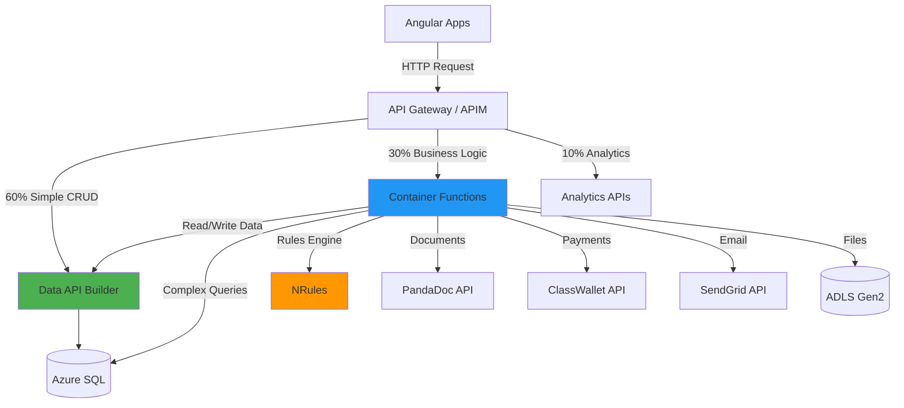

# API-02: Container Functions Business Logic Implementation

**Status:** Proposed
**Last Updated:** 2025-11-24
**Target Audience:** Backend Developers, Business Analysts
**Related ADRs:** [ADR-PROP-001](../../adr/ADR-PROP-001-container-functions.md), [ADR-005](../../adr/ADR-005-nrules-business-rules.md)

## Overview

This guide defines when and how to use Container Functions for the **30% of API traffic** that requires complex business logic, orchestration, or external integrations that Data API Builder (DAB) cannot handle.

### Functions vs DAB Decision Matrix

| Use Case | Use DAB | Use Functions | Reason |
|----------|---------|---------------|---------|
| Get student by ID | ✅ | ❌ | Simple CRUD |
| List schools by county | ✅ | ❌ | Simple filter |
| Create application record | ✅ | ❌ | Simple insert |
| **Evaluate eligibility** | ❌ | ✅ | **NRules engine, complex business rules** |
| **Calculate award amount** | ❌ | ✅ | **Multi-step workflow, external data** |
| **Submit application** | ❌ | ✅ | **State machine, validation, document gen** |
| **Generate PandaDoc** | ❌ | ✅ | **External API integration** |
| **ClassWallet disbursement** | ❌ | ✅ | **Financial transaction, external API** |
| Update application status | ✅ | ❌ | Simple field update |
| Get award balance | ✅ | ❌ | Simple calculation (can be SQL view) |
| **Background reconciliation** | ❌ | ✅ | **Batch job, long-running** |
| **SendGrid email** | ❌ | ✅ | **External service integration** |

### Architecture Position



## When to Use Functions

### 1. Complex Business Logic

**Scenarios:**
- Eligibility evaluation (NRules with 50+ rules)
- Award amount calculation (income tiers, household size, special circumstances)
- Application workflow state transitions (Draft → Submitted → UnderReview → Approved/Denied)
- Document validation (file types, sizes, content verification)

**Why Not DAB:**
- DAB is a thin data layer (CRUD only)
- No support for business rules engines
- Limited to simple field-level validation
- Cannot execute multi-step conditional logic

### 2. External Service Integration

**Scenarios:**
- PandaDoc document generation and e-signature
- ClassWallet payment processing and fund transfers
- SendGrid transactional email
- NC DMV/DOR/DPI state agency data exchange
- Microsoft Graph API for Entra ID operations

**Why Not DAB:**
- DAB only connects to SQL database
- No HTTP client for external APIs
- No retry/circuit breaker patterns
- Cannot handle async callbacks (webhooks)

### 3. Multi-Step Workflows

**Scenarios:**
- Application submission: Validate → Save → Notify → Audit
- Award allocation: Evaluate → Allocate → Create ClassWallet account → Disburse
- Document processing: Upload → Virus scan → OCR → Index → Notify

**Why Not DAB:**
- DAB handles single-resource operations
- No orchestration capabilities
- Cannot coordinate multiple API calls
- No transaction management across services

### 4. Background Jobs

**Scenarios:**
- Nightly reconciliation (ClassWallet transactions vs SQL)
- Daily data exports to state agencies
- Weekly compliance reports
- Monthly award balance rollups

**Why Not DAB:**
- DAB is request/response only
- No scheduled job support
- Cannot run long-running processes

## Functions → DAB Collaboration Pattern

**Key Principle:** Functions should call DAB for data access instead of directly querying SQL (avoid code duplication).

### Example: Award Allocation Function

```csharp
// ❌ BAD: Direct SQL access (duplicates DAB logic)
public async Task<Award> AllocateAward_BadPattern(AllocationRequest request)
{
    // Don't do this - bypasses DAB, no RLS, no caching
    var sql = "INSERT INTO Awards.Awards (...) VALUES (...)";
    await _sqlConnection.ExecuteAsync(sql, request);
}

// ✅ GOOD: Call DAB for data operations
public async Task<Award> AllocateAward_GoodPattern(AllocationRequest request)
{
    // 1. Complex business logic (only Functions can do this)
    var eligibility = await _nrulesEngine.EvaluateEligibility(request.StudentId);
    if (!eligibility.IsEligible)
        throw new BusinessException("Student not eligible");

    var awardAmount = CalculateAwardAmount(eligibility);

    // 2. Create award record via DAB (leverages RLS, caching, validation)
    var award = await _dabClient.PostAsync<Award>("/api/awards", new
    {
        student_id = request.StudentId,
        application_id = request.ApplicationId,
        award_amount = awardAmount,
        award_year = DateTime.Now.Year,
        status = "Pending"
    });

    // 3. External integration (only Functions can do this)
    var classWalletAccount = await _classWalletClient.CreateAccount(new
    {
        StudentId = request.StudentId,
        InitialBalance = awardAmount
    });

    // 4. Update award with external reference via DAB
    await _dabClient.PutAsync($"/api/awards/award_id/{award.AwardId}", new
    {
        classwallet_account_id = classWalletAccount.AccountId,
        status = "Active"
    });

    return award;
}
```

## Implementation Examples

### 1. Eligibility Evaluation Function

**File:** `c:/Projects/CFI/K12/k12-api-enrollment/Application/EligibilityService.cs`

```csharp
using NRules;
using NRules.Fluent;

namespace K12.Application.Services
{
    public class EligibilityService : IEligibilityService
    {
        private readonly ISessionFactory _sessionFactory;
        private readonly IDabClient _dabClient;
        private readonly ILogger<EligibilityService> _logger;

        public EligibilityService(
            ISessionFactory sessionFactory,
            IDabClient dabClient,
            ILogger<EligibilityService> logger)
        {
            _sessionFactory = sessionFactory;
            _dabClient = dabClient;
            _logger = logger;
        }

        public async Task<EligibilityResult> EvaluateEligibility(Guid studentId)
        {
            // 1. Fetch student data via DAB (not direct SQL)
            var student = await _dabClient.GetAsync<Student>(
                $"/api/students/student_id/{studentId}?$expand=household,applications,awards"
            );

            if (student == null)
                throw new NotFoundException($"Student {studentId} not found");

            // 2. Create NRules session (stateless for Functions)
            var session = _sessionFactory.CreateSession();

            // 3. Load facts into working memory
            session.Insert(student);
            session.Insert(student.Household);

            foreach (var application in student.Applications)
                session.Insert(application);

            foreach (var award in student.Awards)
                session.Insert(award);

            // 4. Fire rules
            session.Fire();

            // 5. Extract eligibility result (set by rules)
            var result = session.Query<EligibilityResult>().FirstOrDefault()
                ?? new EligibilityResult { IsEligible = false, Reason = "No rules matched" };

            // 6. Log audit trail via DAB
            await _dabClient.PostAsync("/api/audit-logs", new
            {
                student_id = studentId,
                action = "EligibilityEvaluation",
                result = result.IsEligible ? "Eligible" : "NotEligible",
                reason = result.Reason,
                timestamp = DateTime.UtcNow
            });

            return result;
        }
    }

    // NRules rule example
    public class IncomeEligibilityRule : Rule
    {
        public override void Define()
        {
            Student student = null;
            Household household = null;
            EligibilityResult result = null;

            When()
                .Match(() => student, s => s.EnrollmentStatus == "Active")
                .Match(() => household, h => h.HouseholdId == student.HouseholdId)
                .Match(() => result);

            Then()
                .Do(ctx => EvaluateIncome(ctx, student, household, result));
        }

        private void EvaluateIncome(
            IContext context,
            Student student,
            Household household,
            EligibilityResult result)
        {
            // 2025 NC ESA Income Limits (% of FPL)
            var fpl2025 = 30000m; // Federal Poverty Level for family of 4
            var householdFpl = fpl2025 * (household.HouseholdSize / 4.0m);
            var incomeLimit = householdFpl * 3.0m; // 300% of FPL

            if (household.AnnualIncome <= incomeLimit &&
                household.IncomeVerificationStatus == "Verified")
            {
                result.IsEligible = true;
                result.MaxAwardAmount = 9000m; // Full award
                result.Reason = "Income verified and within limits";
            }
            else if (household.AnnualIncome > incomeLimit)
            {
                result.IsEligible = false;
                result.Reason = $"Household income ${household.AnnualIncome:N0} exceeds limit ${incomeLimit:N0}";
            }
            else
            {
                result.IsEligible = false;
                result.Reason = "Income verification required";
            }

            context.Update(result);
        }
    }
}
```

### 2. Award Allocation Function

**File:** `c:/Projects/CFI/K12/k12-api-enrollment/Application/AwardService.cs`

```csharp
namespace K12.Application.Services
{
    public class AwardService : IAwardService
    {
        private readonly IEligibilityService _eligibilityService;
        private readonly IDabClient _dabClient;
        private readonly IClassWalletClient _classWalletClient;
        private readonly ILogger<AwardService> _logger;

        public AwardService(
            IEligibilityService eligibilityService,
            IDabClient dabClient,
            IClassWalletClient classWalletClient,
            ILogger<AwardService> logger)
        {
            _eligibilityService = eligibilityService;
            _dabClient = dabClient;
            _classWalletClient = classWalletClient;
            _logger = logger;
        }

        public async Task<Award> AllocateAward(Guid applicationId)
        {
            // 1. Get application via DAB
            var application = await _dabClient.GetAsync<Application>(
                $"/api/applications/application_id/{applicationId}?$expand=student"
            );

            if (application == null)
                throw new NotFoundException($"Application {applicationId} not found");

            if (application.Status != "Approved")
                throw new BusinessException("Application must be approved before allocation");

            // 2. Evaluate eligibility (complex business logic)
            var eligibility = await _eligibilityService.EvaluateEligibility(
                application.StudentId
            );

            if (!eligibility.IsEligible)
                throw new BusinessException($"Not eligible: {eligibility.Reason}");

            // 3. Calculate award amount (business logic)
            var awardAmount = CalculateAwardAmount(eligibility, application);

            // 4. Create award record via DAB
            var award = await _dabClient.PostAsync<Award>("/api/awards", new
            {
                application_id = applicationId,
                student_id = application.StudentId,
                award_amount = awardAmount,
                award_year = DateTime.Now.Year,
                status = "Pending",
                created_by = "System"
            });

            _logger.LogInformation(
                "Award {AwardId} created for ${Amount}",
                award.AwardId,
                awardAmount
            );

            // 5. Create ClassWallet account (external integration)
            try
            {
                var classWalletAccount = await _classWalletClient.CreateAccount(new
                {
                    StudentId = application.StudentId.ToString(),
                    FirstName = application.Student.FirstName,
                    LastName = application.Student.LastName,
                    InitialBalance = awardAmount,
                    ProgramCode = "NC_ESA_2025"
                });

                // 6. Update award with ClassWallet reference via DAB
                await _dabClient.PutAsync(
                    $"/api/awards/award_id/{award.AwardId}",
                    new
                    {
                        classwallet_account_id = classWalletAccount.AccountId,
                        status = "Active"
                    }
                );

                _logger.LogInformation(
                    "ClassWallet account {AccountId} created for award {AwardId}",
                    classWalletAccount.AccountId,
                    award.AwardId
                );
            }
            catch (Exception ex)
            {
                _logger.LogError(
                    ex,
                    "ClassWallet account creation failed for award {AwardId}",
                    award.AwardId
                );

                // Mark award as failed via DAB
                await _dabClient.PutAsync(
                    $"/api/awards/award_id/{award.AwardId}",
                    new { status = "Failed", error_message = ex.Message }
                );

                throw;
            }

            // 7. Send confirmation email (external integration)
            await SendAwardConfirmation(application.Student, award);

            return award;
        }

        private decimal CalculateAwardAmount(
            EligibilityResult eligibility,
            Application application)
        {
            // Business logic for award calculation
            var baseAmount = eligibility.MaxAwardAmount;

            // Apply special circumstances adjustments
            if (application.HasSpecialNeeds)
                baseAmount *= 1.2m; // 20% increase for special needs

            if (application.IsFirstTimeApplicant)
                baseAmount += 500m; // $500 bonus for first-time

            return Math.Min(baseAmount, 10000m); // Cap at $10,000
        }

        private async Task SendAwardConfirmation(Student student, Award award)
        {
            // SendGrid integration (external service)
            // Implementation omitted for brevity
        }
    }
}
```

### 3. Document Generation Function

**File:** `c:/Projects/CFI/K12/k12-api-enrollment/Application/DocumentService.cs`

```csharp
namespace K12.Application.Services
{
    public class DocumentService : IDocumentService
    {
        private readonly IDabClient _dabClient;
        private readonly IPandaDocClient _pandaDocClient;
        private readonly IBlobStorageClient _blobClient;
        private readonly ILogger<DocumentService> _logger;

        public DocumentService(
            IDabClient dabClient,
            IPandaDocClient pandaDocClient,
            IBlobStorageClient blobClient,
            ILogger<DocumentService> logger)
        {
            _dabClient = dabClient;
            _pandaDocClient = pandaDocClient;
            _blobClient = blobClient;
            _logger = logger;
        }

        public async Task<Document> GenerateAwardLetter(Guid awardId)
        {
            // 1. Get award data via DAB (with relationships)
            var award = await _dabClient.GetAsync<Award>(
                $"/api/awards/award_id/{awardId}?$expand=student,application"
            );

            if (award == null)
                throw new NotFoundException($"Award {awardId} not found");

            // 2. Create PandaDoc document (external integration)
            var pandaDocRequest = new
            {
                template_uuid = "nc-esa-award-letter-2025",
                name = $"Award Letter - {award.Student.LastName}",
                recipients = new[]
                {
                    new
                    {
                        email = award.Student.Email,
                        first_name = award.Student.FirstName,
                        last_name = award.Student.LastName,
                        role = "Student"
                    }
                },
                tokens = new
                {
                    student_name = $"{award.Student.FirstName} {award.Student.LastName}",
                    award_amount = $"${award.AwardAmount:N2}",
                    award_year = award.AwardYear,
                    effective_date = DateTime.Now.ToString("MMMM dd, yyyy")
                },
                metadata = new
                {
                    award_id = awardId.ToString(),
                    student_id = award.StudentId.ToString()
                }
            };

            var pandaDoc = await _pandaDocClient.CreateDocument(pandaDocRequest);

            _logger.LogInformation(
                "PandaDoc {DocumentId} created for award {AwardId}",
                pandaDoc.Id,
                awardId
            );

            // 3. Wait for document to be ready
            await _pandaDocClient.WaitForDocumentReady(pandaDoc.Id, timeout: TimeSpan.FromMinutes(2));

            // 4. Download PDF
            var pdfBytes = await _pandaDocClient.DownloadDocument(pandaDoc.Id);

            // 5. Upload to ADLS Gen2
            var blobPath = $"awards/{award.AwardYear}/{award.StudentId}/award-letter-{awardId}.pdf";
            await _blobClient.UploadAsync(blobPath, pdfBytes, "application/pdf");

            _logger.LogInformation("Award letter uploaded to {BlobPath}", blobPath);

            // 6. Create document record via DAB
            var document = await _dabClient.PostAsync<Document>("/api/documents", new
            {
                application_id = award.ApplicationId,
                document_type = "AwardLetter",
                blob_path = blobPath,
                pandadoc_id = pandaDoc.Id,
                uploaded_date = DateTime.UtcNow,
                file_size = pdfBytes.Length
            });

            return document;
        }

        public async Task<string> GetDocumentDownloadUrl(Guid documentId, Guid userId)
        {
            // 1. Get document via DAB
            var document = await _dabClient.GetAsync<Document>(
                $"/api/documents/document_id/{documentId}"
            );

            if (document == null)
                throw new NotFoundException($"Document {documentId} not found");

            // 2. Verify user has access (business logic)
            await VerifyDocumentAccess(document, userId);

            // 3. Generate SAS token (5-minute expiry)
            var sasUrl = await _blobClient.GenerateSasUrl(
                document.BlobPath,
                permissions: "r",
                expiresIn: TimeSpan.FromMinutes(5)
            );

            // 4. Log download access via DAB
            await _dabClient.PostAsync("/api/audit-logs", new
            {
                user_id = userId,
                action = "DocumentDownload",
                document_id = documentId,
                timestamp = DateTime.UtcNow
            });

            return sasUrl;
        }

        private async Task VerifyDocumentAccess(Document document, Guid userId)
        {
            // Business logic: Check if user owns the application
            // This would use RLS in production, but shown explicitly for clarity
            var application = await _dabClient.GetAsync<Application>(
                $"/api/applications/application_id/{document.ApplicationId}"
            );

            if (application == null)
                throw new NotFoundException("Associated application not found");

            // Assuming userId maps to household (simplified)
            // In production, this check is handled by RLS in DAB
            if (application.Student.HouseholdId != userId)
                throw new UnauthorizedException("Access denied to this document");
        }
    }
}
```

### 4. Application Workflow Function

**File:** `c:/Projects/CFI/K12/k12-api-enrollment/Application/ApplicationWorkflowService.cs`

```csharp
namespace K12.Application.Services
{
    public class ApplicationWorkflowService : IApplicationWorkflowService
    {
        private readonly IDabClient _dabClient;
        private readonly IEligibilityService _eligibilityService;
        private readonly IDocumentService _documentService;
        private readonly ISendGridClient _emailClient;
        private readonly ILogger<ApplicationWorkflowService> _logger;

        public async Task<Application> SubmitApplication(Guid applicationId, Guid userId)
        {
            // 1. Get application via DAB
            var application = await _dabClient.GetAsync<Application>(
                $"/api/applications/application_id/{applicationId}?$expand=student,school,documents"
            );

            if (application == null)
                throw new NotFoundException($"Application {applicationId} not found");

            // 2. Validate current state (business logic)
            if (application.Status != "Draft")
                throw new BusinessException($"Cannot submit application in {application.Status} status");

            // 3. Validate required documents (business logic)
            var requiredDocs = new[] { "BirthCertificate", "ProofOfResidency", "IncomeVerification" };
            var uploadedDocs = application.Documents.Select(d => d.DocumentType).ToHashSet();
            var missingDocs = requiredDocs.Except(uploadedDocs).ToList();

            if (missingDocs.Any())
                throw new BusinessException($"Missing required documents: {string.Join(", ", missingDocs)}");

            // 4. Perform preliminary eligibility check (business logic)
            var eligibility = await _eligibilityService.EvaluateEligibility(application.StudentId);
            if (!eligibility.IsEligible)
                throw new BusinessException($"Preliminary eligibility failed: {eligibility.Reason}");

            // 5. Update application status via DAB
            application = await _dabClient.PutAsync<Application>(
                $"/api/applications/application_id/{applicationId}",
                new
                {
                    status = "Submitted",
                    submitted_date = DateTime.UtcNow,
                    modified_by = userId
                }
            );

            _logger.LogInformation(
                "Application {ApplicationId} submitted by user {UserId}",
                applicationId,
                userId
            );

            // 6. Generate application receipt (external integration)
            await _documentService.GenerateApplicationReceipt(applicationId);

            // 7. Send confirmation email (external integration)
            await _emailClient.SendEmailAsync(new
            {
                To = application.Student.Email,
                TemplateId = "application-submitted",
                DynamicTemplateData = new
                {
                    student_name = $"{application.Student.FirstName} {application.Student.LastName}",
                    application_id = applicationId,
                    school_name = application.School?.SchoolName,
                    submitted_date = DateTime.Now.ToString("MMMM dd, yyyy")
                }
            });

            // 8. Create notification for admin review (via DAB)
            await _dabClient.PostAsync("/api/notifications", new
            {
                recipient_role = "admin",
                notification_type = "ApplicationSubmitted",
                reference_id = applicationId,
                message = $"New application submitted for {application.Student.FirstName} {application.Student.LastName}",
                created_date = DateTime.UtcNow
            });

            return application;
        }

        public async Task<Application> TransitionStatus(
            Guid applicationId,
            string newStatus,
            string comment,
            Guid reviewerId)
        {
            // State machine validation (business logic)
            var validTransitions = new Dictionary<string, string[]>
            {
                ["Submitted"] = new[] { "UnderReview", "Cancelled" },
                ["UnderReview"] = new[] { "Approved", "Denied", "MoreInfoRequired" },
                ["MoreInfoRequired"] = new[] { "UnderReview", "Cancelled" },
                ["Approved"] = new[] { "Awarded", "Cancelled" },
                ["Denied"] = new[] { },
                ["Awarded"] = new[] { }
            };

            var application = await _dabClient.GetAsync<Application>(
                $"/api/applications/application_id/{applicationId}"
            );

            if (!validTransitions.ContainsKey(application.Status))
                throw new BusinessException($"Invalid current status: {application.Status}");

            if (!validTransitions[application.Status].Contains(newStatus))
                throw new BusinessException(
                    $"Cannot transition from {application.Status} to {newStatus}"
                );

            // Update status via DAB
            application = await _dabClient.PutAsync<Application>(
                $"/api/applications/application_id/{applicationId}",
                new
                {
                    status = newStatus,
                    modified_by = reviewerId,
                    modified_date = DateTime.UtcNow
                }
            );

            // Log status change via DAB
            await _dabClient.PostAsync("/api/status-history", new
            {
                application_id = applicationId,
                from_status = application.Status,
                to_status = newStatus,
                changed_by = reviewerId,
                comment = comment,
                changed_date = DateTime.UtcNow
            });

            // Send notification email
            await SendStatusChangeEmail(application, newStatus);

            return application;
        }
    }
}
```

## DAB Client Implementation

**File:** `c:/Projects/CFI/K12/k12-api-enrollment/Infrastructure/DabClient.cs`

```csharp
namespace K12.Infrastructure.Clients
{
    public class DabClient : IDabClient
    {
        private readonly HttpClient _httpClient;
        private readonly ILogger<DabClient> _logger;

        public DabClient(HttpClient httpClient, ILogger<DabClient> logger)
        {
            _httpClient = httpClient;
            _logger = logger;
        }

        public async Task<T?> GetAsync<T>(string path)
        {
            try
            {
                var response = await _httpClient.GetAsync(path);
                response.EnsureSuccessStatusCode();

                var json = await response.Content.ReadAsStringAsync();
                return JsonSerializer.Deserialize<T>(json);
            }
            catch (HttpRequestException ex)
            {
                _logger.LogError(ex, "DAB GET request failed: {Path}", path);
                throw;
            }
        }

        public async Task<T> PostAsync<T>(string path, object body)
        {
            try
            {
                var json = JsonSerializer.Serialize(body);
                var content = new StringContent(json, Encoding.UTF8, "application/json");

                var response = await _httpClient.PostAsync(path, content);
                response.EnsureSuccessStatusCode();

                var responseJson = await response.Content.ReadAsStringAsync();
                return JsonSerializer.Deserialize<T>(responseJson)!;
            }
            catch (HttpRequestException ex)
            {
                _logger.LogError(ex, "DAB POST request failed: {Path}", path);
                throw;
            }
        }

        public async Task<T> PutAsync<T>(string path, object body)
        {
            try
            {
                var json = JsonSerializer.Serialize(body);
                var content = new StringContent(json, Encoding.UTF8, "application/json");

                var response = await _httpClient.PutAsync(path, content);
                response.EnsureSuccessStatusCode();

                var responseJson = await response.Content.ReadAsStringAsync();
                return JsonSerializer.Deserialize<T>(responseJson)!;
            }
            catch (HttpRequestException ex)
            {
                _logger.LogError(ex, "DAB PUT request failed: {Path}", path);
                throw;
            }
        }
    }
}
```

## Error Handling with Polly

**File:** `c:/Projects/CFI/K12/k12-api-enrollment/Infrastructure/HttpClientSetup.cs`

```csharp
using Polly;
using Polly.Extensions.Http;

namespace K12.Infrastructure
{
    public static class HttpClientSetup
    {
        public static IServiceCollection AddHttpClients(
            this IServiceCollection services,
            IConfiguration config)
        {
            // DAB client with retry policy
            services.AddHttpClient<IDabClient, DabClient>(client =>
            {
                client.BaseAddress = new Uri(config["DAB:BaseUrl"]!);
                client.DefaultRequestHeaders.Add("Accept", "application/json");
            })
            .AddPolicyHandler(GetRetryPolicy())
            .AddPolicyHandler(GetCircuitBreakerPolicy());

            // ClassWallet client with longer timeout
            services.AddHttpClient<IClassWalletClient, ClassWalletClient>(client =>
            {
                client.BaseAddress = new Uri(config["ClassWallet:BaseUrl"]!);
                client.Timeout = TimeSpan.FromSeconds(30);
            })
            .AddPolicyHandler(GetRetryPolicy())
            .AddPolicyHandler(GetCircuitBreakerPolicy());

            // PandaDoc client
            services.AddHttpClient<IPandaDocClient, PandaDocClient>(client =>
            {
                client.BaseAddress = new Uri(config["PandaDoc:BaseUrl"]!);
                client.DefaultRequestHeaders.Add("Authorization", $"API-Key {config["PandaDoc:ApiKey"]}");
            })
            .AddPolicyHandler(GetRetryPolicy());

            return services;
        }

        private static IAsyncPolicy<HttpResponseMessage> GetRetryPolicy()
        {
            return HttpPolicyExtensions
                .HandleTransientHttpError()
                .OrResult(msg => msg.StatusCode == System.Net.HttpStatusCode.TooManyRequests)
                .WaitAndRetryAsync(
                    retryCount: 3,
                    sleepDurationProvider: retryAttempt => TimeSpan.FromSeconds(Math.Pow(2, retryAttempt)),
                    onRetry: (outcome, timespan, retryCount, context) =>
                    {
                        Console.WriteLine($"Retry {retryCount} after {timespan.TotalSeconds}s");
                    }
                );
        }

        private static IAsyncPolicy<HttpResponseMessage> GetCircuitBreakerPolicy()
        {
            return HttpPolicyExtensions
                .HandleTransientHttpError()
                .CircuitBreakerAsync(
                    handledEventsAllowedBeforeBreaking: 5,
                    durationOfBreak: TimeSpan.FromSeconds(30),
                    onBreak: (outcome, duration) =>
                    {
                        Console.WriteLine($"Circuit breaker opened for {duration.TotalSeconds}s");
                    },
                    onReset: () =>
                    {
                        Console.WriteLine("Circuit breaker reset");
                    }
                );
        }
    }
}
```

## Performance Targets

| Operation | Target p95 | Target p99 |
|-----------|-----------|-----------|
| Eligibility evaluation | <2s | <3s |
| Award allocation | <3s | <5s |
| Document generation | <5s | <10s |
| Application submission | <1s | <2s |
| Status transition | <500ms | <1s |

## Deployment

Same Container Apps environment as Week 1:

```bash
# Deploy Functions container (existing code, just delegate CRUD to DAB)
az containerapp update \
  --name k12-functions-api \
  --resource-group rg-k12-myportal-prod \
  --image acrcfik12prod.azurecr.io/k12-functions:latest \
  --set-env-vars \
    DAB_BASE_URL=https://k12-dab-api.azurecontainerapps.io \
    ClassWallet__BaseUrl=https://api.classwallet.com \
    PandaDoc__BaseUrl=https://api.pandadoc.com

# Enable service-to-service communication with DAB
az containerapp ingress update \
  --name k12-dab-api \
  --resource-group rg-k12-myportal-prod \
  --allow-insecure false \
  --target-port 5000 \
  --type internal
```

## Testing

**File:** `c:/Projects/CFI/K12/k12-api-enrollment/tests/Integration/AwardServiceTests.cs`

```csharp
[TestClass]
public class AwardServiceIntegrationTests
{
    private IDabClient _dabClient;
    private IAwardService _awardService;

    [TestMethod]
    public async Task AllocateAward_Success()
    {
        // Arrange
        var applicationId = Guid.NewGuid();
        // Create test application via DAB
        await _dabClient.PostAsync<Application>("/api/applications", new
        {
            application_id = applicationId,
            student_id = TestData.StudentId,
            status = "Approved"
        });

        // Act
        var award = await _awardService.AllocateAward(applicationId);

        // Assert
        Assert.IsNotNull(award);
        Assert.AreEqual("Active", award.Status);
        Assert.IsTrue(award.AwardAmount > 0);
        Assert.IsNotNull(award.ClassWalletAccountId);
    }

    [TestMethod]
    public async Task AllocateAward_NotEligible_ThrowsException()
    {
        // Arrange - student with income too high
        var applicationId = Guid.NewGuid();
        await _dabClient.PostAsync<Application>("/api/applications", new
        {
            application_id = applicationId,
            student_id = TestData.IneligibleStudentId,
            status = "Approved"
        });

        // Act & Assert
        await Assert.ThrowsExceptionAsync<BusinessException>(
            () => _awardService.AllocateAward(applicationId)
        );
    }
}
```

## Monitoring

```kusto
// Functions performance
requests
| where cloud_RoleName == "k12-functions-api"
| where timestamp > ago(1h)
| summarize
    avg_duration = avg(duration),
    p95 = percentile(duration, 95),
    p99 = percentile(duration, 99),
    count = count()
  by operation_Name
| order by count desc

// Functions → DAB call frequency
dependencies
| where cloud_RoleName == "k12-functions-api"
| where target contains "k12-dab-api"
| summarize count() by operation_Name
| order by count_ desc
```

## Next Steps

1. **Setup Analytics** - [API-03: Analytics APIs](./API-03-analytics-apis.md)
2. **API Gateway Routing** - Configure 60/30/10 split in APIM
3. **Load Testing** - Validate performance targets
4. **NRules Tuning** - Optimize eligibility evaluation

## References

- [ADR-PROP-001: Container Functions](../../adr/ADR-PROP-001-container-functions.md)
- [ADR-005: NRules for Business Rules Engine](../../adr/ADR-005-nrules-business-rules.md)
- [API-01: DAB Implementation](./API-01-dab-implementation.md)
- [RULES-01: NRules Implementation](../../03-business-rules/RULES-01-nrules-implementation-guide.md)
