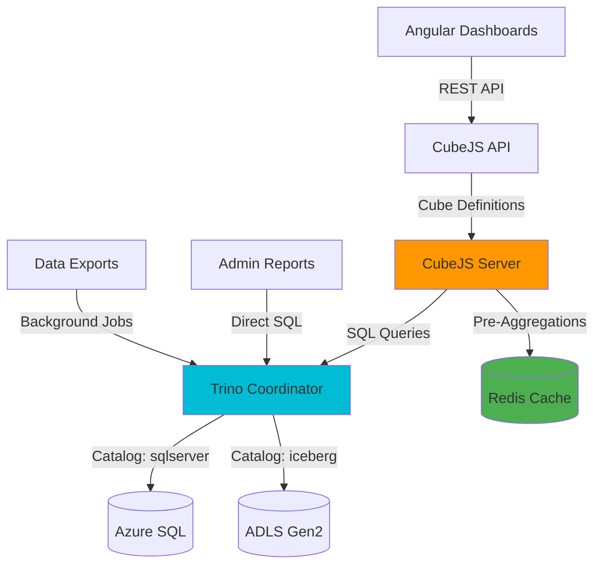

# API-03: Analytics APIs Implementation (Trino + CubeJS)

**Status:** Proposed
**Last Updated:** 2025-11-24
**Target Audience:** Data Engineers, Analytics Developers, Frontend Developers
**Related ADRs:** [ADR-PROP-004](../../adr/ADR-PROP-004-trino.md), [ADR-PROP-005](../../adr/ADR-PROP-005-cubejs.md)

## Overview

This guide implements analytics APIs for the **10% of traffic** dedicated to dashboards, reports, and executive KPIs. Trino provides SQL query federation across Azure SQL + ADLS Gen2, while CubeJS offers pre-aggregated metrics with REST/GraphQL APIs.

### Analytics Architecture



### When to Use Analytics APIs

| Use Case | Use DAB/Functions | Use Analytics | Reason |
|----------|-------------------|---------------|--------|
| Student detail page | ✅ | ❌ | Transactional data, single record |
| List active awards | ✅ | ❌ | Simple filter, real-time |
| **Enrollment pipeline dashboard** | ❌ | ✅ | **Aggregations, time series, trends** |
| **Award utilization chart** | ❌ | ✅ | **Sum balances, group by month** |
| **School compliance report** | ❌ | ✅ | **Count documents, percentages** |
| **Executive KPI dashboard** | ❌ | ✅ | **Cross-system metrics, historical** |
| Application status | ✅ | ❌ | Single record lookup |
| **Provider analytics** | ❌ | ✅ | **Product performance, usage trends** |

## Trino Configuration

### Installation

**File:** `c:/Projects/CFI/K12/k12-trino/docker-compose.yml`

```yaml
version: '3.8'

services:
  trino:
    image: trinodb/trino:432
    ports:
      - "8080:8080"
    volumes:
      - ./etc:/etc/trino
      - ./catalog:/etc/trino/catalog
    environment:
      - JAVA_HEAP_SIZE=4G
    networks:
      - k12-analytics

  postgres:
    image: postgres:15-alpine
    environment:
      POSTGRES_DB: trino_metadata
      POSTGRES_USER: trino
      POSTGRES_PASSWORD: ${POSTGRES_PASSWORD}
    volumes:
      - postgres-data:/var/lib/postgresql/data
    networks:
      - k12-analytics

volumes:
  postgres-data:

networks:
  k12-analytics:
```

### Trino Configuration Files

**File:** `c:/Projects/CFI/K12/k12-trino/etc/config.properties`

```properties
coordinator=true
node-scheduler.include-coordinator=true
http-server.http.port=8080
discovery.uri=http://localhost:8080

query.max-memory=4GB
query.max-memory-per-node=2GB
query.max-total-memory-per-node=3GB

# Spill to disk for large queries
spill-enabled=true
spiller-spill-path=/tmp/trino-spill
```

**File:** `c:/Projects/CFI/K12/k12-trino/etc/node.properties`

```properties
node.environment=production
node.id=k12-trino-001
node.data-dir=/var/trino/data
```

**File:** `c:/Projects/CFI/K12/k12-trino/etc/jvm.config`

```
-server
-Xmx4G
-XX:+UseG1GC
-XX:G1HeapRegionSize=32M
-XX:+ExplicitGCInvokesConcurrent
-XX:+HeapDumpOnOutOfMemoryError
-XX:+ExitOnOutOfMemoryError
-Djdk.attach.allowAttachSelf=true
```

### Catalog Configuration

**File:** `c:/Projects/CFI/K12/k12-trino/catalog/sqlserver.properties`

```properties
connector.name=sqlserver
connection-url=jdbc:sqlserver://${SQL_SERVER}:1433;database=K12_MyPortal;encrypt=true;trustServerCertificate=false
connection-user=${SQL_USER}
connection-password=${SQL_PASSWORD}

# Performance tuning
sqlserver.bulk-copy-for-write.enabled=true
sqlserver.snapshot-isolation.disabled=false

# Connection pooling
jdbc.connection-pool.max-size=50
jdbc.connection-pool.max-lifetime=60m
```

**File:** `c:/Projects/CFI/K12/k12-trino/catalog/iceberg.properties`

```properties
connector.name=iceberg
iceberg.catalog.type=hive_metastore
hive.metastore.uri=thrift://postgres:9083

# ADLS Gen2 access
fs.azure.account.auth.type=OAuth
fs.azure.account.oauth.provider.type=org.apache.hadoop.fs.azurebfs.oauth2.ClientCredsTokenProvider
fs.azure.account.oauth2.client.id=${AZURE_CLIENT_ID}
fs.azure.account.oauth2.client.secret=${AZURE_CLIENT_SECRET}
fs.azure.account.oauth2.client.endpoint=https://login.microsoftonline.com/${AZURE_TENANT_ID}/oauth2/token

# Iceberg table location
iceberg.file-format=PARQUET
iceberg.compression-codec=SNAPPY
```

## Trino SQL Queries

### 1. Enrollment Trends

```sql
-- Enrollment pipeline by month (applications → evaluations → awards)
WITH monthly_metrics AS (
    SELECT
        DATE_TRUNC('month', a.submitted_date) AS month,
        COUNT(DISTINCT a.application_id) AS applications_submitted,
        COUNT(DISTINCT CASE WHEN a.status IN ('UnderReview', 'Approved', 'Awarded') THEN a.application_id END) AS applications_reviewed,
        COUNT(DISTINCT CASE WHEN a.status = 'Approved' THEN a.application_id END) AS applications_approved,
        COUNT(DISTINCT aw.award_id) AS awards_created,
        SUM(aw.award_amount) AS total_award_amount
    FROM sqlserver.dbo.applications AS a
    LEFT JOIN sqlserver.dbo.awards AS aw
        ON a.application_id = aw.application_id
    WHERE a.submitted_date >= DATE '2024-01-01'
    GROUP BY DATE_TRUNC('month', a.submitted_date)
)
SELECT
    month,
    applications_submitted,
    applications_reviewed,
    applications_approved,
    awards_created,
    total_award_amount,
    ROUND(100.0 * applications_approved / NULLIF(applications_submitted, 0), 2) AS approval_rate_pct,
    ROUND(100.0 * awards_created / NULLIF(applications_approved, 0), 2) AS award_fulfillment_pct
FROM monthly_metrics
ORDER BY month DESC;
```

**Example Output:**
```
month       | applications_submitted | applications_reviewed | applications_approved | awards_created | total_award_amount | approval_rate_pct | award_fulfillment_pct
------------|-----------------------|-----------------------|-----------------------|----------------|--------------------|--------------------|----------------------
2025-11-01  | 1,523                 | 1,487                 | 1,201                 | 1,156          | 10,404,000.00      | 78.86              | 96.25
2025-10-01  | 2,034                 | 2,001                 | 1,678                 | 1,645          | 14,805,000.00      | 82.49              | 98.03
2025-09-01  | 3,456                 | 3,398                 | 2,890                 | 2,834          | 25,506,000.00      | 83.62              | 98.06
```

### 2. Award Utilization

```sql
-- Award utilization by month (balances, disbursements, transactions)
WITH award_balances AS (
    SELECT
        DATE_TRUNC('month', aw.created_date) AS award_month,
        aw.award_year,
        COUNT(DISTINCT aw.award_id) AS total_awards,
        SUM(aw.award_amount) AS total_allocated,
        SUM(d.amount) AS total_disbursed,
        SUM(aw.award_amount) - COALESCE(SUM(d.amount), 0) AS total_remaining
    FROM sqlserver.dbo.awards AS aw
    LEFT JOIN sqlserver.dbo.disbursements AS d
        ON aw.award_id = d.award_id
    WHERE aw.status = 'Active'
    GROUP BY DATE_TRUNC('month', aw.created_date), aw.award_year
),
classwallet_transactions AS (
    SELECT
        DATE_TRUNC('month', transaction_date) AS transaction_month,
        COUNT(*) AS transaction_count,
        SUM(transaction_amount) AS total_spent
    FROM iceberg.k12.classwallet_transactions
    WHERE transaction_date >= DATE '2024-01-01'
    GROUP BY DATE_TRUNC('month', transaction_date)
)
SELECT
    ab.award_month,
    ab.total_awards,
    ab.total_allocated,
    ab.total_disbursed,
    ab.total_remaining,
    ROUND(100.0 * ab.total_disbursed / NULLIF(ab.total_allocated, 0), 2) AS utilization_pct,
    cw.transaction_count,
    cw.total_spent,
    ROUND(cw.total_spent / NULLIF(cw.transaction_count, 0), 2) AS avg_transaction_amount
FROM award_balances AS ab
LEFT JOIN classwallet_transactions AS cw
    ON ab.award_month = cw.transaction_month
ORDER BY ab.award_month DESC;
```

### 3. School Compliance

```sql
-- School compliance report (document submissions, deadlines)
WITH school_apps AS (
    SELECT
        s.school_id,
        s.school_name,
        s.county,
        COUNT(DISTINCT a.application_id) AS total_applications,
        COUNT(DISTINCT CASE WHEN a.status = 'Approved' THEN a.application_id END) AS approved_applications
    FROM sqlserver.dbo.schools AS s
    LEFT JOIN sqlserver.dbo.applications AS a
        ON s.school_id = a.school_id
    WHERE a.submitted_date >= DATE '2025-01-01'
    GROUP BY s.school_id, s.school_name, s.county
),
document_submissions AS (
    SELECT
        a.school_id,
        COUNT(DISTINCT d.document_id) AS documents_submitted,
        COUNT(DISTINCT CASE WHEN d.document_type = 'AccreditationCert' THEN d.document_id END) AS accreditation_certs,
        COUNT(DISTINCT CASE WHEN d.document_type = 'W9Form' THEN d.document_id END) AS w9_forms
    FROM sqlserver.dbo.applications AS a
    INNER JOIN sqlserver.dbo.documents AS d
        ON a.application_id = d.application_id
    WHERE a.submitted_date >= DATE '2025-01-01'
    GROUP BY a.school_id
)
SELECT
    sa.school_name,
    sa.county,
    sa.total_applications,
    sa.approved_applications,
    ROUND(100.0 * sa.approved_applications / NULLIF(sa.total_applications, 0), 2) AS approval_rate_pct,
    ds.documents_submitted,
    ds.accreditation_certs,
    ds.w9_forms,
    CASE
        WHEN ds.accreditation_certs >= 1 AND ds.w9_forms >= 1 THEN 'Compliant'
        WHEN ds.accreditation_certs >= 1 THEN 'Missing W9'
        WHEN ds.w9_forms >= 1 THEN 'Missing Accreditation'
        ELSE 'Non-Compliant'
    END AS compliance_status
FROM school_apps AS sa
LEFT JOIN document_submissions AS ds
    ON sa.school_id = ds.school_id
ORDER BY sa.total_applications DESC;
```

### 4. Provider Performance

```sql
-- Provider performance (product approvals, usage, revenue)
WITH provider_products AS (
    SELECT
        pv.provider_id,
        pv.provider_name,
        pv.category,
        COUNT(DISTINCT pr.product_id) AS total_products,
        COUNT(DISTINCT CASE WHEN pr.is_active = true THEN pr.product_id END) AS active_products
    FROM sqlserver.dbo.providers AS pv
    LEFT JOIN sqlserver.dbo.products AS pr
        ON pv.provider_id = pr.provider_id
    GROUP BY pv.provider_id, pv.provider_name, pv.category
),
provider_usage AS (
    SELECT
        pr.provider_id,
        COUNT(DISTINCT a.application_id) AS applications_using,
        COUNT(DISTINCT a.student_id) AS unique_students
    FROM sqlserver.dbo.products AS pr
    INNER JOIN sqlserver.dbo.applications AS a
        ON pr.provider_id = a.provider_id
    WHERE a.status IN ('Approved', 'Awarded')
    GROUP BY pr.provider_id
),
provider_revenue AS (
    SELECT
        provider_id,
        SUM(transaction_amount) AS total_revenue,
        COUNT(*) AS transaction_count
    FROM iceberg.k12.classwallet_transactions
    WHERE transaction_date >= DATE '2025-01-01'
    GROUP BY provider_id
)
SELECT
    pp.provider_name,
    pp.category,
    pp.total_products,
    pp.active_products,
    pu.applications_using,
    pu.unique_students,
    pr.total_revenue,
    pr.transaction_count,
    ROUND(pr.total_revenue / NULLIF(pr.transaction_count, 0), 2) AS avg_transaction_size
FROM provider_products AS pp
LEFT JOIN provider_usage AS pu
    ON pp.provider_id = pu.provider_id
LEFT JOIN provider_revenue AS pr
    ON pp.provider_id = pr.provider_id
ORDER BY pr.total_revenue DESC NULLS LAST;
```

## CubeJS Configuration

### Installation

```bash
# Install CubeJS CLI
npm install -g cubejs-cli

# Create CubeJS project
cd c:/Projects/CFI/K12
cubejs create k12-cubejs -d trino

cd k12-cubejs
npm install
```

### CubeJS Configuration

**File:** `c:/Projects/CFI/K12/k12-cubejs/.env`

```env
CUBEJS_DB_TYPE=trino
CUBEJS_DB_HOST=localhost
CUBEJS_DB_PORT=8080
CUBEJS_DB_NAME=sqlserver
CUBEJS_DB_USER=trino
CUBEJS_DB_PASS=

# API configuration
CUBEJS_API_SECRET=${CUBEJS_API_SECRET}
CUBEJS_WEB_SOCKETS=true

# Redis cache
CUBEJS_REDIS_URL=redis://localhost:6379

# Pre-aggregations storage
CUBEJS_PRE_AGGREGATIONS_SCHEMA=pre_aggregations
CUBEJS_CACHE_AND_QUEUE_DRIVER=redis

# Dev mode
CUBEJS_DEV_MODE=false
NODE_ENV=production
```

## CubeJS Data Models

### 1. EnrollmentStats Cube

**File:** `c:/Projects/CFI/K12/k12-cubejs/schema/EnrollmentStats.js`

```javascript
cube('EnrollmentStats', {
  sql: `
    SELECT
      a.application_id,
      a.student_id,
      a.school_id,
      a.status,
      a.application_type,
      a.submitted_date,
      a.created_date,
      aw.award_id,
      aw.award_amount,
      aw.award_year,
      s.county,
      s.school_name
    FROM sqlserver.dbo.applications AS a
    LEFT JOIN sqlserver.dbo.awards AS aw
      ON a.application_id = aw.application_id
    LEFT JOIN sqlserver.dbo.schools AS s
      ON a.school_id = s.school_id
    WHERE a.submitted_date >= DATE '2024-01-01'
  `,

  measures: {
    count: {
      type: 'count',
      title: 'Total Applications'
    },

    applicationsSubmitted: {
      type: 'count',
      title: 'Applications Submitted',
      filters: [
        { sql: `${CUBE}.status IN ('Submitted', 'UnderReview', 'Approved', 'Denied', 'Awarded')` }
      ]
    },

    applicationsApproved: {
      type: 'count',
      title: 'Applications Approved',
      filters: [
        { sql: `${CUBE}.status = 'Approved'` }
      ]
    },

    applicationsAwarded: {
      type: 'count',
      title: 'Applications Awarded',
      filters: [
        { sql: `${CUBE}.status = 'Awarded'` }
      ]
    },

    approvalRate: {
      type: 'number',
      sql: `ROUND(100.0 * ${applicationsApproved} / NULLIF(${applicationsSubmitted}, 0), 2)`,
      title: 'Approval Rate (%)'
    },

    totalAwardAmount: {
      type: 'sum',
      sql: 'award_amount',
      title: 'Total Award Amount'
    },

    averageAwardAmount: {
      type: 'avg',
      sql: 'award_amount',
      title: 'Average Award Amount'
    }
  },

  dimensions: {
    applicationId: {
      sql: 'application_id',
      type: 'string',
      primaryKey: true
    },

    status: {
      sql: 'status',
      type: 'string',
      title: 'Application Status'
    },

    applicationType: {
      sql: 'application_type',
      type: 'string',
      title: 'Application Type'
    },

    county: {
      sql: 'county',
      type: 'string',
      title: 'County'
    },

    schoolName: {
      sql: 'school_name',
      type: 'string',
      title: 'School Name'
    },

    submittedDate: {
      sql: 'submitted_date',
      type: 'time',
      title: 'Submitted Date'
    },

    createdDate: {
      sql: 'created_date',
      type: 'time',
      title: 'Created Date'
    },

    awardYear: {
      sql: 'award_year',
      type: 'number',
      title: 'Award Year'
    }
  },

  preAggregations: {
    dailyStats: {
      measures: [
        EnrollmentStats.applicationsSubmitted,
        EnrollmentStats.applicationsApproved,
        EnrollmentStats.totalAwardAmount
      ],
      dimensions: [EnrollmentStats.status, EnrollmentStats.county],
      timeDimension: EnrollmentStats.submittedDate,
      granularity: 'day',
      refreshKey: {
        every: '1 hour'
      }
    },

    monthlyStats: {
      measures: [
        EnrollmentStats.count,
        EnrollmentStats.applicationsApproved,
        EnrollmentStats.totalAwardAmount,
        EnrollmentStats.averageAwardAmount
      ],
      dimensions: [EnrollmentStats.status, EnrollmentStats.applicationType],
      timeDimension: EnrollmentStats.submittedDate,
      granularity: 'month',
      refreshKey: {
        every: '6 hours'
      }
    }
  }
});
```

### 2. AwardUtilization Cube

**File:** `c:/Projects/CFI/K12/k12-cubejs/schema/AwardUtilization.js`

```javascript
cube('AwardUtilization', {
  sql: `
    SELECT
      aw.award_id,
      aw.student_id,
      aw.application_id,
      aw.award_amount,
      aw.award_year,
      aw.status,
      aw.created_date,
      d.disbursement_id,
      d.amount AS disbursement_amount,
      d.disbursement_date,
      d.classwallet_transaction_id
    FROM sqlserver.dbo.awards AS aw
    LEFT JOIN sqlserver.dbo.disbursements AS d
      ON aw.award_id = d.award_id
    WHERE aw.created_date >= DATE '2024-01-01'
  `,

  measures: {
    count: {
      type: 'count',
      title: 'Total Awards'
    },

    totalAllocated: {
      type: 'sum',
      sql: 'award_amount',
      title: 'Total Allocated'
    },

    totalDisbursed: {
      type: 'sum',
      sql: 'disbursement_amount',
      title: 'Total Disbursed'
    },

    totalRemaining: {
      type: 'number',
      sql: `${totalAllocated} - ${totalDisbursed}`,
      title: 'Total Remaining'
    },

    utilizationRate: {
      type: 'number',
      sql: `ROUND(100.0 * ${totalDisbursed} / NULLIF(${totalAllocated}, 0), 2)`,
      title: 'Utilization Rate (%)'
    },

    avgAwardAmount: {
      type: 'avg',
      sql: 'award_amount',
      title: 'Average Award Amount'
    },

    disbursementCount: {
      type: 'count',
      sql: 'disbursement_id',
      title: 'Disbursement Count'
    }
  },

  dimensions: {
    awardId: {
      sql: 'award_id',
      type: 'string',
      primaryKey: true
    },

    status: {
      sql: 'status',
      type: 'string',
      title: 'Award Status'
    },

    awardYear: {
      sql: 'award_year',
      type: 'number',
      title: 'Award Year'
    },

    createdDate: {
      sql: 'created_date',
      type: 'time',
      title: 'Created Date'
    },

    disbursementDate: {
      sql: 'disbursement_date',
      type: 'time',
      title: 'Disbursement Date'
    }
  },

  preAggregations: {
    monthlyUtilization: {
      measures: [
        AwardUtilization.count,
        AwardUtilization.totalAllocated,
        AwardUtilization.totalDisbursed,
        AwardUtilization.utilizationRate
      ],
      dimensions: [AwardUtilization.awardYear, AwardUtilization.status],
      timeDimension: AwardUtilization.createdDate,
      granularity: 'month',
      refreshKey: {
        every: '1 hour'
      }
    }
  }
});
```

### 3. SchoolCompliance Cube

**File:** `c:/Projects/CFI/K12/k12-cubejs/schema/SchoolCompliance.js`

```javascript
cube('SchoolCompliance', {
  sql: `
    SELECT
      s.school_id,
      s.school_name,
      s.county,
      s.accreditation_status,
      a.application_id,
      a.status AS application_status,
      a.submitted_date,
      d.document_id,
      d.document_type,
      d.uploaded_date
    FROM sqlserver.dbo.schools AS s
    LEFT JOIN sqlserver.dbo.applications AS a
      ON s.school_id = a.school_id
    LEFT JOIN sqlserver.dbo.documents AS d
      ON a.application_id = d.application_id
    WHERE a.submitted_date >= DATE '2025-01-01'
  `,

  measures: {
    schoolCount: {
      type: 'countDistinct',
      sql: 'school_id',
      title: 'School Count'
    },

    applicationCount: {
      type: 'countDistinct',
      sql: 'application_id',
      title: 'Application Count'
    },

    documentCount: {
      type: 'countDistinct',
      sql: 'document_id',
      title: 'Document Count'
    },

    accreditationCerts: {
      type: 'countDistinct',
      sql: 'CASE WHEN document_type = \'AccreditationCert\' THEN document_id END',
      title: 'Accreditation Certificates'
    },

    w9Forms: {
      type: 'countDistinct',
      sql: 'CASE WHEN document_type = \'W9Form\' THEN document_id END',
      title: 'W9 Forms'
    },

    avgDocumentsPerApplication: {
      type: 'number',
      sql: `${documentCount} / NULLIF(${applicationCount}, 0)`,
      title: 'Avg Documents per Application'
    }
  },

  dimensions: {
    schoolId: {
      sql: 'school_id',
      type: 'string'
    },

    schoolName: {
      sql: 'school_name',
      type: 'string',
      title: 'School Name'
    },

    county: {
      sql: 'county',
      type: 'string',
      title: 'County'
    },

    accreditationStatus: {
      sql: 'accreditation_status',
      type: 'string',
      title: 'Accreditation Status'
    },

    applicationStatus: {
      sql: 'application_status',
      type: 'string',
      title: 'Application Status'
    },

    documentType: {
      sql: 'document_type',
      type: 'string',
      title: 'Document Type'
    },

    submittedDate: {
      sql: 'submitted_date',
      type: 'time',
      title: 'Submitted Date'
    }
  },

  preAggregations: {
    schoolComplianceDaily: {
      measures: [
        SchoolCompliance.applicationCount,
        SchoolCompliance.documentCount,
        SchoolCompliance.accreditationCerts,
        SchoolCompliance.w9Forms
      ],
      dimensions: [SchoolCompliance.county, SchoolCompliance.accreditationStatus],
      timeDimension: SchoolCompliance.submittedDate,
      granularity: 'day',
      refreshKey: {
        every: '6 hours'
      }
    }
  }
});
```

### 4. ExecutiveKPIs Cube

**File:** `c:/Projects/CFI/K12/k12-cubejs/schema/ExecutiveKPIs.js`

```javascript
cube('ExecutiveKPIs', {
  sql: `
    SELECT
      'enrollment' AS metric_category,
      DATE_TRUNC('month', a.submitted_date) AS metric_month,
      COUNT(DISTINCT a.application_id) AS value
    FROM sqlserver.dbo.applications AS a
    WHERE a.submitted_date >= DATE '2024-01-01'
    GROUP BY DATE_TRUNC('month', a.submitted_date)

    UNION ALL

    SELECT
      'awards' AS metric_category,
      DATE_TRUNC('month', aw.created_date) AS metric_month,
      SUM(aw.award_amount) AS value
    FROM sqlserver.dbo.awards AS aw
    WHERE aw.created_date >= DATE '2024-01-01'
    GROUP BY DATE_TRUNC('month', aw.created_date)

    UNION ALL

    SELECT
      'disbursements' AS metric_category,
      DATE_TRUNC('month', d.disbursement_date) AS metric_month,
      SUM(d.amount) AS value
    FROM sqlserver.dbo.disbursements AS d
    WHERE d.disbursement_date >= DATE '2024-01-01'
    GROUP BY DATE_TRUNC('month', d.disbursement_date)
  `,

  measures: {
    totalValue: {
      type: 'sum',
      sql: 'value',
      title: 'Total Value'
    },

    avgValue: {
      type: 'avg',
      sql: 'value',
      title: 'Average Value'
    }
  },

  dimensions: {
    metricCategory: {
      sql: 'metric_category',
      type: 'string',
      title: 'Metric Category'
    },

    metricMonth: {
      sql: 'metric_month',
      type: 'time',
      title: 'Metric Month'
    }
  },

  preAggregations: {
    monthlyKPIs: {
      measures: [ExecutiveKPIs.totalValue, ExecutiveKPIs.avgValue],
      dimensions: [ExecutiveKPIs.metricCategory],
      timeDimension: ExecutiveKPIs.metricMonth,
      granularity: 'month',
      refreshKey: {
        every: '12 hours'
      }
    }
  }
});
```

## CubeJS REST API Usage

### Start CubeJS Server

```bash
cd c:/Projects/CFI/K12/k12-cubejs
npm run dev  # Development
# OR
npm run prod  # Production (port 4000)
```

### API Endpoint Structure

```
POST http://localhost:4000/cubejs-api/v1/load
Authorization: Bearer ${CUBEJS_API_SECRET}
Content-Type: application/json

{
  "query": {
    "measures": ["EnrollmentStats.applicationsSubmitted"],
    "dimensions": ["EnrollmentStats.status"],
    "timeDimensions": [{
      "dimension": "EnrollmentStats.submittedDate",
      "granularity": "month",
      "dateRange": "last 12 months"
    }]
  }
}
```

### Example Queries

#### 1. Enrollment Pipeline Dashboard

```json
{
  "query": {
    "measures": [
      "EnrollmentStats.applicationsSubmitted",
      "EnrollmentStats.applicationsApproved",
      "EnrollmentStats.applicationsAwarded",
      "EnrollmentStats.approvalRate",
      "EnrollmentStats.totalAwardAmount"
    ],
    "timeDimensions": [
      {
        "dimension": "EnrollmentStats.submittedDate",
        "granularity": "month",
        "dateRange": "last 6 months"
      }
    ],
    "order": {
      "EnrollmentStats.submittedDate": "asc"
    }
  }
}
```

**Response:**
```json
{
  "data": [
    {
      "EnrollmentStats.submittedDate.month": "2025-06-01T00:00:00.000",
      "EnrollmentStats.applicationsSubmitted": 2034,
      "EnrollmentStats.applicationsApproved": 1678,
      "EnrollmentStats.applicationsAwarded": 1645,
      "EnrollmentStats.approvalRate": 82.49,
      "EnrollmentStats.totalAwardAmount": 14805000
    },
    {
      "EnrollmentStats.submittedDate.month": "2025-07-01T00:00:00.000",
      "EnrollmentStats.applicationsSubmitted": 3456,
      "EnrollmentStats.applicationsApproved": 2890,
      "EnrollmentStats.applicationsAwarded": 2834,
      "EnrollmentStats.approvalRate": 83.62,
      "EnrollmentStats.totalAwardAmount": 25506000
    }
  ],
  "lastRefreshTime": "2025-11-24T15:30:00.000Z"
}
```

#### 2. Award Utilization Chart

```json
{
  "query": {
    "measures": [
      "AwardUtilization.totalAllocated",
      "AwardUtilization.totalDisbursed",
      "AwardUtilization.totalRemaining",
      "AwardUtilization.utilizationRate"
    ],
    "dimensions": ["AwardUtilization.awardYear"],
    "timeDimensions": [
      {
        "dimension": "AwardUtilization.createdDate",
        "granularity": "month",
        "dateRange": "this year"
      }
    ]
  }
}
```

#### 3. School Compliance Report

```json
{
  "query": {
    "measures": [
      "SchoolCompliance.schoolCount",
      "SchoolCompliance.applicationCount",
      "SchoolCompliance.documentCount",
      "SchoolCompliance.accreditationCerts",
      "SchoolCompliance.w9Forms"
    ],
    "dimensions": [
      "SchoolCompliance.county",
      "SchoolCompliance.accreditationStatus"
    ],
    "filters": [
      {
        "member": "SchoolCompliance.submittedDate",
        "operator": "inDateRange",
        "values": ["2025-01-01", "2025-12-31"]
      }
    ],
    "order": {
      "SchoolCompliance.applicationCount": "desc"
    }
  }
}
```

## Angular Integration

### CubeJS Service

**File:** `c:/Projects/CFI/K12/k12-web-enrollment/projects/admin/src/app/services/cubejs.service.ts`

```typescript
import { Injectable } from '@angular/core';
import { HttpClient, HttpHeaders } from '@angular/common/http';
import { Observable } from 'rxjs';
import { environment } from '../../environments/environment';

export interface CubeQuery {
  measures?: string[];
  dimensions?: string[];
  timeDimensions?: Array<{
    dimension: string;
    granularity?: 'day' | 'week' | 'month' | 'year';
    dateRange?: string | string[];
  }>;
  filters?: Array<{
    member: string;
    operator: string;
    values: any[];
  }>;
  order?: Record<string, 'asc' | 'desc'>;
  limit?: number;
}

export interface CubeResponse<T = any> {
  data: T[];
  lastRefreshTime: string;
}

@Injectable({ providedIn: 'root' })
export class CubeJSService {
  private apiUrl = environment.cubeJsApiUrl; // https://k12-cubejs.azurecontainerapps.io/cubejs-api/v1
  private apiSecret = environment.cubeJsApiSecret;

  constructor(private http: HttpClient) {}

  query<T = any>(query: CubeQuery): Observable<CubeResponse<T>> {
    const headers = new HttpHeaders({
      'Authorization': `Bearer ${this.apiSecret}`,
      'Content-Type': 'application/json'
    });

    return this.http.post<CubeResponse<T>>(
      `${this.apiUrl}/load`,
      { query },
      { headers }
    );
  }

  getEnrollmentPipeline(dateRange: string = 'last 6 months'): Observable<CubeResponse> {
    return this.query({
      measures: [
        'EnrollmentStats.applicationsSubmitted',
        'EnrollmentStats.applicationsApproved',
        'EnrollmentStats.applicationsAwarded',
        'EnrollmentStats.approvalRate'
      ],
      timeDimensions: [{
        dimension: 'EnrollmentStats.submittedDate',
        granularity: 'month',
        dateRange
      }],
      order: { 'EnrollmentStats.submittedDate': 'asc' }
    });
  }

  getAwardUtilization(awardYear: number): Observable<CubeResponse> {
    return this.query({
      measures: [
        'AwardUtilization.totalAllocated',
        'AwardUtilization.totalDisbursed',
        'AwardUtilization.utilizationRate'
      ],
      dimensions: ['AwardUtilization.status'],
      timeDimensions: [{
        dimension: 'AwardUtilization.createdDate',
        granularity: 'month'
      }],
      filters: [{
        member: 'AwardUtilization.awardYear',
        operator: 'equals',
        values: [awardYear]
      }]
    });
  }

  getSchoolCompliance(county?: string): Observable<CubeResponse> {
    const filters: any[] = [];
    if (county) {
      filters.push({
        member: 'SchoolCompliance.county',
        operator: 'equals',
        values: [county]
      });
    }

    return this.query({
      measures: [
        'SchoolCompliance.schoolCount',
        'SchoolCompliance.applicationCount',
        'SchoolCompliance.accreditationCerts',
        'SchoolCompliance.w9Forms'
      ],
      dimensions: ['SchoolCompliance.schoolName', 'SchoolCompliance.accreditationStatus'],
      filters,
      order: { 'SchoolCompliance.applicationCount': 'desc' },
      limit: 50
    });
  }
}
```

### Dashboard Component

**File:** `c:/Projects/CFI/K12/k12-web-enrollment/projects/admin/src/app/components/enrollment-dashboard.component.ts`

```typescript
import { Component, OnInit } from '@angular/core';
import { CubeJSService } from '../services/cubejs.service';
import { Chart } from 'chart.js';

@Component({
  selector: 'app-enrollment-dashboard',
  template: `
    <div class="dashboard-container">
      <h2>Enrollment Pipeline</h2>
      <canvas #enrollmentChart></canvas>
      <div class="stats-grid">
        <div class="stat-card" *ngFor="let stat of stats">
          <h3>{{ stat.label }}</h3>
          <p class="stat-value">{{ stat.value | number }}</p>
          <span class="stat-change" [class.positive]="stat.change > 0">
            {{ stat.change }}%
          </span>
        </div>
      </div>
    </div>
  `,
  styles: [`
    .dashboard-container { padding: 2rem; }
    .stats-grid { display: grid; grid-template-columns: repeat(4, 1fr); gap: 1rem; margin-top: 2rem; }
    .stat-card { background: #fff; padding: 1.5rem; border-radius: 8px; box-shadow: 0 2px 4px rgba(0,0,0,0.1); }
    .stat-value { font-size: 2rem; font-weight: bold; margin: 0.5rem 0; }
    .stat-change { font-size: 0.9rem; color: #dc3545; }
    .stat-change.positive { color: #28a745; }
  `]
})
export class EnrollmentDashboardComponent implements OnInit {
  @ViewChild('enrollmentChart') chartCanvas!: ElementRef<HTMLCanvasElement>;
  chart?: Chart;
  stats: Array<{ label: string; value: number; change: number }> = [];

  constructor(private cubeJS: CubeJSService) {}

  ngOnInit() {
    this.loadEnrollmentData();
  }

  loadEnrollmentData() {
    this.cubeJS.getEnrollmentPipeline('last 12 months').subscribe(response => {
      const data = response.data;

      // Extract chart data
      const labels = data.map(d => new Date(d['EnrollmentStats.submittedDate.month']).toLocaleDateString('en-US', { month: 'short', year: 'numeric' }));
      const submitted = data.map(d => d['EnrollmentStats.applicationsSubmitted']);
      const approved = data.map(d => d['EnrollmentStats.applicationsApproved']);
      const awarded = data.map(d => d['EnrollmentStats.applicationsAwarded']);

      // Create chart
      this.chart = new Chart(this.chartCanvas.nativeElement, {
        type: 'line',
        data: {
          labels,
          datasets: [
            {
              label: 'Submitted',
              data: submitted,
              borderColor: '#007bff',
              backgroundColor: 'rgba(0, 123, 255, 0.1)'
            },
            {
              label: 'Approved',
              data: approved,
              borderColor: '#28a745',
              backgroundColor: 'rgba(40, 167, 69, 0.1)'
            },
            {
              label: 'Awarded',
              data: awarded,
              borderColor: '#ffc107',
              backgroundColor: 'rgba(255, 193, 7, 0.1)'
            }
          ]
        },
        options: {
          responsive: true,
          plugins: {
            title: { display: true, text: 'Enrollment Pipeline (Last 12 Months)' }
          },
          scales: {
            y: { beginAtZero: true }
          }
        }
      });

      // Calculate stats
      const latest = data[data.length - 1];
      const previous = data[data.length - 2];

      this.stats = [
        {
          label: 'Applications Submitted',
          value: latest['EnrollmentStats.applicationsSubmitted'],
          change: this.calculateChange(
            latest['EnrollmentStats.applicationsSubmitted'],
            previous['EnrollmentStats.applicationsSubmitted']
          )
        },
        {
          label: 'Approval Rate',
          value: latest['EnrollmentStats.approvalRate'],
          change: this.calculateChange(
            latest['EnrollmentStats.approvalRate'],
            previous['EnrollmentStats.approvalRate']
          )
        },
        {
          label: 'Awards Created',
          value: latest['EnrollmentStats.applicationsAwarded'],
          change: this.calculateChange(
            latest['EnrollmentStats.applicationsAwarded'],
            previous['EnrollmentStats.applicationsAwarded']
          )
        },
        {
          label: 'Total Award Amount',
          value: latest['EnrollmentStats.totalAwardAmount'],
          change: this.calculateChange(
            latest['EnrollmentStats.totalAwardAmount'],
            previous['EnrollmentStats.totalAwardAmount']
          )
        }
      ];
    });
  }

  calculateChange(current: number, previous: number): number {
    return Math.round(((current - previous) / previous) * 100);
  }
}
```

## Caching Strategy

| Query Type | TTL | Refresh Strategy |
|-----------|-----|------------------|
| Real-time dashboards | 15 min | On-demand + scheduled |
| Daily reports | 6 hours | Scheduled (6am, 12pm, 6pm) |
| Monthly reports | 24 hours | Scheduled (daily at 2am) |
| Executive KPIs | 12 hours | Scheduled (8am, 8pm) |

## Performance Targets

| Metric | Target |
|--------|--------|
| Cached query response | <500ms p95 |
| Trino direct query | <10s p95 |
| Pre-aggregation refresh | <5 min |
| Dashboard load time | <2s |

## Deployment

### Docker Compose (Development)

```bash
cd c:/Projects/CFI/K12/k12-trino
docker-compose up -d

cd c:/Projects/CFI/K12/k12-cubejs
npm run prod
```

### Azure Container Apps (Production)

```bash
# Deploy Trino
az containerapp create \
  --name k12-trino \
  --resource-group rg-k12-myportal-prod \
  --environment k12-containerapp-env \
  --image trinodb/trino:432 \
  --target-port 8080 \
  --cpu 4.0 \
  --memory 8Gi \
  --min-replicas 1 \
  --max-replicas 3

# Deploy CubeJS
az containerapp create \
  --name k12-cubejs \
  --resource-group rg-k12-myportal-prod \
  --environment k12-containerapp-env \
  --image <your-registry>/k12-cubejs:latest \
  --target-port 4000 \
  --cpu 2.0 \
  --memory 4Gi \
  --min-replicas 2 \
  --max-replicas 5 \
  --env-vars \
    CUBEJS_DB_HOST=k12-trino.internal \
    CUBEJS_REDIS_URL=redis://k12-redis:6379
```

## Monitoring

```kusto
// CubeJS query performance
requests
| where cloud_RoleName == "k12-cubejs"
| where timestamp > ago(1h)
| summarize
    avg_duration = avg(duration),
    p95 = percentile(duration, 95),
    cache_hits = countif(customDimensions.cached == "true"),
    cache_misses = countif(customDimensions.cached == "false")
  by operation_Name
| extend cache_hit_rate = (cache_hits * 100.0) / (cache_hits + cache_misses)
```

## Next Steps

1. **Configure API Gateway** - Route 10% traffic to CubeJS
2. **Setup Scheduled Refreshes** - Automate pre-aggregation updates
3. **Create Additional Cubes** - Financial reports, compliance metrics
4. **Load Testing** - Validate performance under load

## References

- [ADR-PROP-004: Trino Query Engine](../../adr/ADR-PROP-004-trino.md)
- [ADR-PROP-005: CubeJS Analytics](../../adr/ADR-PROP-005-cubejs.md)
- [API-01: DAB Implementation](./API-01-dab-implementation.md)
- [API-02: Functions Business Logic](./API-02-functions-business-logic.md)
- [Trino Docs](https://trino.io/docs/current/)
- [CubeJS Docs](https://cube.dev/docs/)
