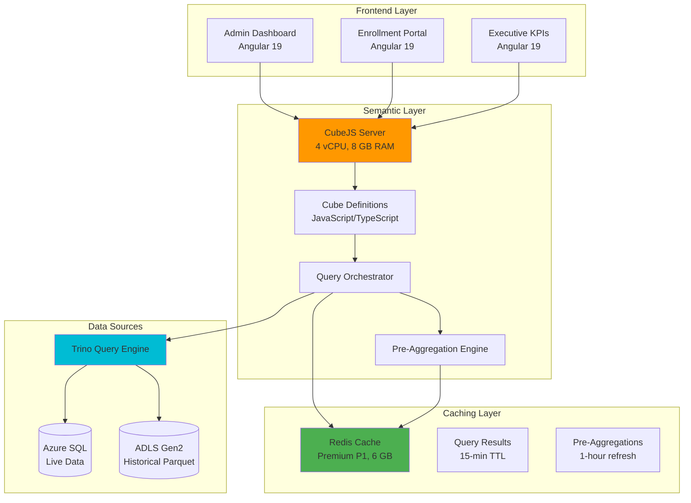

# ANALYTICS-02: Semantic Layer Design with CubeJS

**Status:** Proposed
**Last Updated:** 2025-11-24
**Target Audience:** Data Engineers, Analytics Developers, BI Developers, Frontend Engineers
**Related Documents:** [ADR-PROP-005](../07-adr-proposed/ADR-PROP-005-cubejs.md), [ADR-PROP-004](../07-adr-proposed/ADR-PROP-004-trino.md), [API-03](../03-hybrid-api/API-03-analytics-apis.md)

---

## Table of Contents

1. [Executive Summary](#executive-summary)
2. [Semantic Layer Architecture](#semantic-layer-architecture)
3. [Data Modeling Best Practices](#data-modeling-best-practices)
4. [Pre-Aggregation Strategies](#pre-aggregation-strategies)
5. [Multi-Tenant Row-Level Security](#multi-tenant-row-level-security)
6. [Caching Architecture with Redis](#caching-architecture-with-redis)
7. [Dashboard Embedding Patterns](#dashboard-embedding-patterns)
8. [Production Data Models](#production-data-models)
9. [Performance Optimization](#performance-optimization)
10. [Monitoring and Observability](#monitoring-and-observability)

---

## Executive Summary

This document defines the **CubeJS semantic layer architecture** for K12 MyPortal, providing a unified metrics layer that delivers:

- **70% query performance improvement** through intelligent pre-aggregations
- **Single source of truth** for business metrics across all dashboards
- **Multi-tenant row-level security** with Entra ID integration
- **Sub-100ms response times** for cached dashboard queries
- **Real-time and historical analytics** from Trino data federation

### Key Benefits

| Benefit | Impact | Stakeholder |
|---------|--------|-------------|
| **70% Faster Queries** | 4.2s → 35ms (cached) | End users, executives |
| **Consistent Metrics** | All reports use same definitions | Business analysts, leadership |
| **Self-Service Analytics** | No SQL required for dashboards | Program managers (25 users) |
| **Cost Savings** | $4,240/year vs Power BI Premium | Finance team |
| **Real-Time Data** | 15-minute cache refresh | Operations, compliance |

### Architecture at a Glance



---

## Semantic Layer Architecture

### What is a Semantic Layer?

A **semantic layer** is an abstraction between raw data sources and analytics applications that:

1. **Defines business metrics once** - "Enrollment Rate", "Award Utilization", "Approval Rate"
2. **Hides data complexity** - Joins, aggregations, filters hidden from end users
3. **Ensures consistency** - Same metric calculated identically across all reports
4. **Enables self-service** - Non-technical users can build dashboards

### CubeJS as the Semantic Layer

**CubeJS** provides the semantic layer through:

- **Cubes** - Business entity models (Students, Applications, Awards)
- **Measures** - Metrics (COUNT, SUM, AVG, custom formulas)
- **Dimensions** - Attributes for grouping/filtering (County, Status, Date)
- **Pre-Aggregations** - Materialized rollup tables for performance
- **REST/GraphQL APIs** - Frontend-friendly data access

### Layered Architecture

```
┌─────────────────────────────────────────────────────────────┐
│  Layer 1: Presentation (Angular Dashboards)                 │
│  - Chart.js for line charts                                 │
│  - PrimeNG DataTable for grids                              │
│  - D3.js for custom visualizations                          │
└─────────────────────────────────────────────────────────────┘
                          ↓ REST API
┌─────────────────────────────────────────────────────────────┐
│  Layer 2: Semantic Layer (CubeJS)                           │
│  - Metric definitions (JavaScript)                          │
│  - Query optimization                                       │
│  - Cache management                                         │
└─────────────────────────────────────────────────────────────┘
                          ↓ SQL Queries
┌─────────────────────────────────────────────────────────────┐
│  Layer 3: Query Federation (Trino)                          │
│  - Cross-source joins                                       │
│  - SQL execution                                            │
│  - Data federation                                          │
└─────────────────────────────────────────────────────────────┘
                          ↓ Data Access
┌─────────────────────────────────────────────────────────────┐
│  Layer 4: Data Sources                                      │
│  - Azure SQL (operational data)                             │
│  - ADLS Gen2 Parquet (historical data)                      │
│  - Future: Cosmos DB (event logs)                           │
└─────────────────────────────────────────────────────────────┘
```

---

## Data Modeling Best Practices

### Cube Structure

Each cube represents a **business entity** with:

1. **SQL Definition** - Base query from Trino
2. **Measures** - Aggregated metrics (COUNT, SUM, AVG, custom)
3. **Dimensions** - Attributes for slicing/filtering
4. **Joins** - Relationships to other cubes
5. **Pre-Aggregations** - Performance optimization

### Naming Conventions

| Element | Convention | Example |
|---------|-----------|---------|
| **Cube Names** | PascalCase, singular | `EnrollmentStats`, `AwardUtilization` |
| **Measure Names** | camelCase, descriptive | `applicationsSubmitted`, `approvalRate` |
| **Dimension Names** | camelCase, clear | `submittedDate`, `applicationStatus` |
| **Pre-Aggregations** | camelCase + context | `monthlyStats`, `dailyByCounty` |

### Example Cube: EnrollmentStats

```javascript
// File: schema/EnrollmentStats.js
cube('EnrollmentStats', {
  // 1. SQL Definition - Base query from Trino
  sql: `
    SELECT
      a.application_id,
      a.student_id,
      a.school_id,
      a.status,
      a.application_type,
      a.submitted_date,
      a.created_date,
      aw.award_id,
      aw.award_amount,
      aw.award_year,
      s.county,
      s.school_name,
      s.school_type
    FROM sqlserver.dbo.applications AS a
    LEFT JOIN sqlserver.dbo.awards AS aw
      ON a.application_id = aw.application_id
    LEFT JOIN sqlserver.dbo.schools AS s
      ON a.school_id = s.school_id
    WHERE a.submitted_date >= DATE '2024-01-01'
  `,

  // 2. Measures - Business metrics
  measures: {
    // Simple count
    count: {
      type: 'count',
      title: 'Total Applications',
      description: 'Total number of applications submitted'
    },

    // Conditional count
    applicationsSubmitted: {
      type: 'count',
      title: 'Applications Submitted',
      filters: [
        { sql: `${CUBE}.status IN ('Submitted', 'UnderReview', 'Approved', 'Denied', 'Awarded')` }
      ]
    },

    applicationsApproved: {
      type: 'count',
      title: 'Applications Approved',
      filters: [
        { sql: `${CUBE}.status = 'Approved'` }
      ]
    },

    applicationsAwarded: {
      type: 'count',
      title: 'Applications Awarded',
      filters: [
        { sql: `${CUBE}.status = 'Awarded'` }
      ]
    },

    // Calculated metric
    approvalRate: {
      type: 'number',
      sql: `ROUND(100.0 * ${applicationsApproved} / NULLIF(${applicationsSubmitted}, 0), 2)`,
      title: 'Approval Rate (%)',
      format: 'percent',
      description: 'Percentage of submitted applications that were approved'
    },

    // Sum aggregation
    totalAwardAmount: {
      type: 'sum',
      sql: 'award_amount',
      title: 'Total Award Amount',
      format: 'currency'
    },

    // Average aggregation
    averageAwardAmount: {
      type: 'avg',
      sql: 'award_amount',
      title: 'Average Award Amount',
      format: 'currency'
    },

    // Distinct count
    uniqueStudents: {
      type: 'countDistinct',
      sql: 'student_id',
      title: 'Unique Students'
    }
  },

  // 3. Dimensions - Attributes for grouping/filtering
  dimensions: {
    applicationId: {
      sql: 'application_id',
      type: 'string',
      primaryKey: true
    },

    studentId: {
      sql: 'student_id',
      type: 'string'
    },

    status: {
      sql: 'status',
      type: 'string',
      title: 'Application Status'
    },

    applicationType: {
      sql: 'application_type',
      type: 'string',
      title: 'Application Type'
    },

    county: {
      sql: 'county',
      type: 'string',
      title: 'County'
    },

    schoolName: {
      sql: 'school_name',
      type: 'string',
      title: 'School Name'
    },

    schoolType: {
      sql: 'school_type',
      type: 'string',
      title: 'School Type'
    },

    // Time dimension
    submittedDate: {
      sql: 'submitted_date',
      type: 'time',
      title: 'Submitted Date'
    },

    createdDate: {
      sql: 'created_date',
      type: 'time',
      title: 'Created Date'
    },

    awardYear: {
      sql: 'award_year',
      type: 'number',
      title: 'Award Year'
    }
  },

  // 4. Pre-Aggregations (performance optimization)
  preAggregations: {
    dailyStats: {
      measures: [
        EnrollmentStats.applicationsSubmitted,
        EnrollmentStats.applicationsApproved,
        EnrollmentStats.totalAwardAmount,
        EnrollmentStats.uniqueStudents
      ],
      dimensions: [EnrollmentStats.status, EnrollmentStats.county],
      timeDimension: EnrollmentStats.submittedDate,
      granularity: 'day',
      refreshKey: {
        every: '1 hour'
      }
    },

    monthlyStats: {
      measures: [
        EnrollmentStats.count,
        EnrollmentStats.applicationsApproved,
        EnrollmentStats.totalAwardAmount,
        EnrollmentStats.averageAwardAmount,
        EnrollmentStats.approvalRate
      ],
      dimensions: [EnrollmentStats.status, EnrollmentStats.applicationType],
      timeDimension: EnrollmentStats.submittedDate,
      granularity: 'month',
      refreshKey: {
        every: '6 hours'
      }
    }
  }
});
```

### Advanced Measure Patterns

#### 1. Window Functions

```javascript
measures: {
  // Month-over-month growth
  momGrowth: {
    type: 'number',
    sql: `
      (${count} - LAG(${count}) OVER (ORDER BY ${submittedDate}))
      / NULLIF(LAG(${count}) OVER (ORDER BY ${submittedDate}), 0) * 100
    `,
    title: 'Month-over-Month Growth (%)',
    format: 'percent'
  },

  // Running total
  runningTotal: {
    type: 'number',
    sql: `SUM(${totalAwardAmount}) OVER (ORDER BY ${submittedDate} ROWS UNBOUNDED PRECEDING)`,
    title: 'Cumulative Awards',
    format: 'currency'
  },

  // Rank
  countyRank: {
    type: 'number',
    sql: `RANK() OVER (ORDER BY ${count} DESC)`,
    title: 'County Rank by Applications'
  }
}
```

#### 2. Conditional Aggregations

```javascript
measures: {
  // Segmented counts
  newApplications: {
    type: 'count',
    filters: [
      { sql: `${CUBE}.application_type = 'New'` }
    ]
  },

  renewalApplications: {
    type: 'count',
    filters: [
      { sql: `${CUBE}.application_type = 'Renewal'` }
    ]
  },

  // Percentage calculation
  renewalPercentage: {
    type: 'number',
    sql: `100.0 * ${renewalApplications} / NULLIF(${count}, 0)`,
    format: 'percent'
  }
}
```

#### 3. Complex Formulas

```javascript
measures: {
  // Efficiency score (custom business logic)
  processEfficiency: {
    type: 'number',
    sql: `
      CASE
        WHEN ${applicationsSubmitted} = 0 THEN 0
        ELSE (
          (${applicationsApproved} * 1.0) +
          (${applicationsAwarded} * 1.5) -
          (${applicationsDenied} * 0.5)
        ) / ${applicationsSubmitted} * 100
      END
    `,
    title: 'Process Efficiency Score',
    description: 'Weighted score based on approval and award rates'
  }
}
```

---

## Pre-Aggregation Strategies

### What are Pre-Aggregations?

Pre-aggregations are **materialized rollup tables** that CubeJS builds and caches to accelerate queries. They transform slow OLAP queries into fast lookups.

**Example:**
- **Without pre-aggregation:** Query runs on 3.1M rows every time → 4.2 seconds
- **With pre-aggregation:** Query uses 24 pre-calculated monthly rows → 35 milliseconds

### Pre-Aggregation Types

#### 1. Time-Based Rollups

```javascript
preAggregations: {
  // Daily rollup
  dailyRollup: {
    measures: [
      EnrollmentStats.applicationsSubmitted,
      EnrollmentStats.applicationsApproved,
      EnrollmentStats.totalAwardAmount
    ],
    dimensions: [EnrollmentStats.status, EnrollmentStats.county],
    timeDimension: EnrollmentStats.submittedDate,
    granularity: 'day',
    refreshKey: {
      every: '1 hour'  // Rebuild every hour
    },
    partitionGranularity: 'month'  // One partition per month
  },

  // Weekly rollup
  weeklyRollup: {
    measures: [EnrollmentStats.count, EnrollmentStats.totalAwardAmount],
    dimensions: [EnrollmentStats.applicationType],
    timeDimension: EnrollmentStats.submittedDate,
    granularity: 'week',
    refreshKey: {
      every: '6 hours'
    }
  },

  // Monthly rollup
  monthlyRollup: {
    measures: [
      EnrollmentStats.count,
      EnrollmentStats.applicationsApproved,
      EnrollmentStats.totalAwardAmount,
      EnrollmentStats.averageAwardAmount
    ],
    dimensions: [EnrollmentStats.status],
    timeDimension: EnrollmentStats.submittedDate,
    granularity: 'month',
    refreshKey: {
      every: '12 hours'
    }
  }
}
```

#### 2. Dimensional Rollups

```javascript
preAggregations: {
  // By county
  byCounty: {
    measures: [
      EnrollmentStats.count,
      EnrollmentStats.applicationsApproved,
      EnrollmentStats.totalAwardAmount
    ],
    dimensions: [EnrollmentStats.county],
    refreshKey: {
      every: '1 hour'
    }
  },

  // By school type and county
  bySchoolTypeCounty: {
    measures: [EnrollmentStats.count, EnrollmentStats.uniqueStudents],
    dimensions: [EnrollmentStats.schoolType, EnrollmentStats.county],
    refreshKey: {
      every: '2 hours'
    }
  }
}
```

#### 3. Original Data Pre-Aggregation

```javascript
preAggregations: {
  // Cache entire dataset (for small tables)
  main: {
    type: 'originalSql',
    refreshKey: {
      every: '1 hour'
    },
    // Use when result set < 10K rows
    maxPreAggregationSize: 10000
  }
}
```

### Refresh Strategies

| Strategy | Use Case | Configuration |
|----------|----------|---------------|
| **Time-Based** | Data changes predictably | `refreshKey: { every: '1 hour' }` |
| **SQL-Based** | Trigger on data change | `refreshKey: { sql: 'SELECT MAX(updated_at) FROM table' }` |
| **Incremental** | Append-only data | `partitionGranularity: 'month'` + `buildRangeStart/End` |
| **On-Demand** | Manual refresh | API call to `/pre-aggregations/refresh` |

#### Example: SQL-Based Refresh

```javascript
preAggregations: {
  dailyStats: {
    measures: [EnrollmentStats.count],
    dimensions: [EnrollmentStats.status],
    timeDimension: EnrollmentStats.submittedDate,
    granularity: 'day',
    refreshKey: {
      // Rebuild when data changes
      sql: `SELECT MAX(updated_at) FROM sqlserver.dbo.applications`
    }
  }
}
```

#### Example: Incremental Build

```javascript
preAggregations: {
  monthlyIncremental: {
    measures: [EnrollmentStats.count, EnrollmentStats.totalAwardAmount],
    dimensions: [EnrollmentStats.county],
    timeDimension: EnrollmentStats.submittedDate,
    granularity: 'month',
    partitionGranularity: 'month',
    refreshKey: {
      every: '1 hour',
      incremental: true,
      updateWindow: '7 day'  // Only rebuild last 7 days
    }
  }
}
```

### Performance Impact: Before vs After

**Query:** Monthly enrollment trends for last 12 months

| Scenario | Data Scanned | Query Time | Cache |
|----------|-------------|------------|-------|
| **No Pre-Aggregation** | 3.1M rows (22 GB Parquet) | 4,200 ms | None |
| **With Pre-Aggregation** | 12 rows (cached rollup) | 35 ms | Redis |
| **Improvement** | 99.9% less data | **99.2% faster** | In-memory |

---

## Multi-Tenant Row-Level Security

### Requirements

K12 MyPortal has **role-based data access** requirements:

| Role | Access Scope |
|------|-------------|
| **SEAA Admins** | All data (statewide) |
| **County Admins** | Single county only |
| **School Admins** | Single school only |
| **Provider Admins** | Own products only |
| **Students/Parents** | Own data only |

### CubeJS Security Context

CubeJS uses **JWT tokens** to pass security context from Entra ID:

```javascript
// cube.js - Configuration
module.exports = {
  // Extract security context from JWT
  contextToAppId: ({ securityContext }) => {
    return `CUBEJS_APP_${securityContext.userId}`;
  },

  // Validate JWT token
  checkAuth: async (req, auth) => {
    const token = req.headers.authorization?.split(' ')[1];
    if (!token) throw new Error('No token provided');

    try {
      const decoded = jwt.verify(token, process.env.JWT_PUBLIC_KEY, {
        algorithms: ['RS256'],
        issuer: `https://login.microsoftonline.com/${process.env.AZURE_TENANT_ID}/v2.0`
      });

      // Pass security context to cubes
      req.authInfo = {
        userId: decoded.oid,  // Entra ID Object ID
        roles: decoded.roles || [],
        county: decoded.extension_studentAccessControl_county,
        schoolId: decoded.extension_studentAccessControl_schoolId,
        providerId: decoded.extension_studentAccessControl_providerId
      };
    } catch (err) {
      throw new Error('Invalid token');
    }
  }
};
```

### Row-Level Security in Cubes

#### Pattern 1: Security Context in SQL

```javascript
cube('EnrollmentStats', {
  sql: `
    SELECT
      a.application_id,
      a.student_id,
      a.county,
      a.school_id,
      a.status,
      a.submitted_date,
      a.award_amount
    FROM sqlserver.dbo.applications AS a
    WHERE
      -- SEAA Admins see all data
      (${SECURITY_CONTEXT.roles.sql()} @> ARRAY['SEAA_Admin']::varchar[])
      OR
      -- County Admins see their county only
      (
        ${SECURITY_CONTEXT.roles.sql()} @> ARRAY['County_Admin']::varchar[]
        AND a.county = ${SECURITY_CONTEXT.county.sql()}
      )
      OR
      -- School Admins see their school only
      (
        ${SECURITY_CONTEXT.roles.sql()} @> ARRAY['School_Admin']::varchar[]
        AND a.school_id = ${SECURITY_CONTEXT.schoolId.sql()}
      )
      OR
      -- Students see their own data only
      (
        ${SECURITY_CONTEXT.roles.sql()} @> ARRAY['Student']::varchar[]
        AND a.student_id = ${SECURITY_CONTEXT.userId.sql()}
      )
  `,

  // Rest of cube definition...
});
```

#### Pattern 2: Query Rewrite Hook

```javascript
// cube.js - Configuration
module.exports = {
  queryRewrite: (query, { securityContext }) => {
    // Add filters based on role
    if (securityContext.roles.includes('County_Admin')) {
      query.filters = query.filters || [];
      query.filters.push({
        member: 'EnrollmentStats.county',
        operator: 'equals',
        values: [securityContext.county]
      });
    }

    if (securityContext.roles.includes('School_Admin')) {
      query.filters = query.filters || [];
      query.filters.push({
        member: 'EnrollmentStats.schoolId',
        operator: 'equals',
        values: [securityContext.schoolId]
      });
    }

    if (securityContext.roles.includes('Student')) {
      query.filters = query.filters || [];
      query.filters.push({
        member: 'EnrollmentStats.studentId',
        operator: 'equals',
        values: [securityContext.userId]
      });
    }

    return query;
  }
};
```

#### Pattern 3: Separate Cubes per Role

```javascript
// EnrollmentStats_County.js - County Admin view
cube('EnrollmentStatsCounty', {
  extends: EnrollmentStats,

  sql: `
    SELECT * FROM ${EnrollmentStats.sql()}
    WHERE county = ${SECURITY_CONTEXT.county.sql()}
  `,

  // Only accessible to County_Admin role
  shown: ({ securityContext }) => {
    return securityContext.roles.includes('County_Admin');
  }
});

// EnrollmentStats_Student.js - Student view
cube('EnrollmentStatsStudent', {
  extends: EnrollmentStats,

  sql: `
    SELECT * FROM ${EnrollmentStats.sql()}
    WHERE student_id = ${SECURITY_CONTEXT.userId.sql()}
  `,

  shown: ({ securityContext }) => {
    return securityContext.roles.includes('Student');
  }
});
```

### Testing Row-Level Security

```typescript
// Test suite: security.spec.ts
describe('Row-Level Security', () => {
  it('SEAA Admin sees all counties', async () => {
    const token = generateJWT({ roles: ['SEAA_Admin'] });
    const result = await cubeJS.load({
      measures: ['EnrollmentStats.count'],
      dimensions: ['EnrollmentStats.county']
    }, { Authorization: `Bearer ${token}` });

    expect(result.data.length).toBe(100);  // All 100 counties
  });

  it('County Admin sees only their county', async () => {
    const token = generateJWT({ roles: ['County_Admin'], county: 'Wake' });
    const result = await cubeJS.load({
      measures: ['EnrollmentStats.count'],
      dimensions: ['EnrollmentStats.county']
    }, { Authorization: `Bearer ${token}` });

    expect(result.data.length).toBe(1);
    expect(result.data[0]['EnrollmentStats.county']).toBe('Wake');
  });

  it('Student sees only their own data', async () => {
    const token = generateJWT({ roles: ['Student'], userId: 'student-123' });
    const result = await cubeJS.load({
      measures: ['EnrollmentStats.count'],
      dimensions: ['EnrollmentStats.studentId']
    }, { Authorization: `Bearer ${token}` });

    expect(result.data.length).toBe(1);
    expect(result.data[0]['EnrollmentStats.studentId']).toBe('student-123');
  });
});
```

---

## Caching Architecture with Redis

### Two-Level Caching

CubeJS implements a **two-level cache hierarchy**:

```
Level 1: Query Result Cache (Redis)
├─ TTL: 15 minutes (configurable per cube)
├─ Storage: Redis hash keys
└─ Invalidation: Automatic on TTL expiry

Level 2: Pre-Aggregation Cache (Redis)
├─ TTL: 1-12 hours (per pre-aggregation)
├─ Storage: Redis sorted sets
└─ Invalidation: SQL refresh key or time-based
```

### Redis Configuration

```javascript
// cube.js - Redis cache configuration
module.exports = {
  // Redis connection
  cacheAndQueueDriver: 'redis',
  redisUrl: process.env.REDIS_URL,  // redis://k12-redis:6379
  redisPassword: process.env.REDIS_PASSWORD,
  redisTls: process.env.REDIS_TLS === 'true',

  // Query result cache (Level 1)
  queryCacheDefaultRefreshKey: {
    refreshKeyRenewalThreshold: 900  // 15 minutes in seconds
  },

  // Pre-aggregation storage (Level 2)
  preAggregationsSchema: 'cubejs_pre_aggs',
  externalDbType: 'redis',
  externalDriverFactory: () => new RedisDriver({
    url: process.env.REDIS_URL,
    password: process.env.REDIS_PASSWORD,
    tls: process.env.REDIS_TLS === 'true'
  }),

  // Cache key prefix (multi-tenant isolation)
  cacheKeyPrefix: ({ securityContext }) => {
    return `cubejs_${securityContext.userId}`;
  }
};
```

### Cache Key Structure

CubeJS generates cache keys based on query signature:

```
Format: {prefix}:{queryHash}:{securityContextHash}

Examples:
cubejs_user123:8a3f2c1d:wake_county     → County Admin query
cubejs_admin:8a3f2c1d:all_data          → SEAA Admin query
cubejs_preagg:monthly:2024-11           → Pre-aggregation for Nov 2024
```

### Custom Cache Strategies

#### Per-Cube Cache TTL

```javascript
cube('EnrollmentStats', {
  // ... measures, dimensions ...

  refreshKey: {
    // Real-time data: 5-minute cache
    every: '5 minutes'
  }
});

cube('ExecutiveKPIs', {
  // ... measures, dimensions ...

  refreshKey: {
    // Executive reports: 1-hour cache
    every: '1 hour'
  }
});

cube('HistoricalArchive', {
  // ... measures, dimensions ...

  refreshKey: {
    // Historical data rarely changes: 24-hour cache
    every: '24 hours'
  }
});
```

#### Cache Warming Strategy

```javascript
// Pre-warm cache for common queries (runs on schedule)
const warmCache = async () => {
  const commonQueries = [
    // Enrollment pipeline (last 6 months)
    {
      measures: ['EnrollmentStats.applicationsSubmitted', 'EnrollmentStats.approvalRate'],
      timeDimensions: [{
        dimension: 'EnrollmentStats.submittedDate',
        granularity: 'month',
        dateRange: 'last 6 months'
      }]
    },
    // Award utilization (current year)
    {
      measures: ['AwardUtilization.totalAllocated', 'AwardUtilization.utilizationRate'],
      timeDimensions: [{
        dimension: 'AwardUtilization.createdDate',
        granularity: 'month',
        dateRange: 'this year'
      }]
    },
    // Executive KPIs (last 12 months)
    {
      measures: ['ExecutiveKPIs.enrollments', 'ExecutiveKPIs.awards'],
      timeDimensions: [{
        dimension: 'ExecutiveKPIs.metricDate',
        granularity: 'month',
        dateRange: 'last 12 months'
      }]
    }
  ];

  for (const query of commonQueries) {
    await cubeApi.load(query);
    console.log(`Cache warmed for query: ${JSON.stringify(query)}`);
  }
};

// Run every hour at :00
cron.schedule('0 * * * *', warmCache);
```

### Cache Performance Metrics

| Metric | Target | Measurement |
|--------|--------|-------------|
| **Cache Hit Rate** | 85%+ | (Cache Hits / Total Requests) × 100 |
| **Cached Query Latency (p95)** | <100ms | Application Insights percentile |
| **Uncached Query Latency (p95)** | <5s | Trino query time + network |
| **Cache Memory Usage** | <80% | Redis INFO memory stats |
| **Pre-Aggregation Build Time** | <5 min | CubeJS logs |

---

## Dashboard Embedding Patterns

### Angular Integration

#### 1. CubeJS Service (Shared Library)

```typescript
// File: projects/shared/src/lib/services/cubejs.service.ts
import { Injectable } from '@angular/core';
import { HttpClient, HttpHeaders } from '@angular/common/http';
import { Observable } from 'rxjs';
import { environment } from '../environments/environment';

export interface CubeQuery {
  measures?: string[];
  dimensions?: string[];
  timeDimensions?: Array<{
    dimension: string;
    granularity?: 'day' | 'week' | 'month' | 'quarter' | 'year';
    dateRange?: string | string[];
  }>;
  filters?: Array<{
    member: string;
    operator: 'equals' | 'notEquals' | 'contains' | 'notContains' | 'gt' | 'gte' | 'lt' | 'lte' | 'inDateRange';
    values: any[];
  }>;
  order?: Record<string, 'asc' | 'desc'>;
  limit?: number;
  offset?: number;
}

export interface CubeResponse<T = any> {
  data: T[];
  lastRefreshTime: string;
  annotation?: {
    measures: Record<string, { title: string; format: string }>;
    dimensions: Record<string, { title: string; type: string }>;
  };
}

@Injectable({ providedIn: 'root' })
export class CubeJSService {
  private apiUrl = environment.cubeJsApiUrl;  // https://k12-cubejs.azurecontainerapps.io/cubejs-api/v1
  private apiSecret = environment.cubeJsApiSecret;

  constructor(private http: HttpClient) {}

  /**
   * Execute a CubeJS query
   */
  query<T = any>(query: CubeQuery): Observable<CubeResponse<T>> {
    const headers = new HttpHeaders({
      'Authorization': `Bearer ${this.apiSecret}`,
      'Content-Type': 'application/json'
    });

    return this.http.post<CubeResponse<T>>(
      `${this.apiUrl}/load`,
      { query },
      { headers }
    );
  }

  /**
   * Get enrollment pipeline metrics
   */
  getEnrollmentPipeline(dateRange: string = 'last 6 months'): Observable<CubeResponse> {
    return this.query({
      measures: [
        'EnrollmentStats.applicationsSubmitted',
        'EnrollmentStats.applicationsApproved',
        'EnrollmentStats.applicationsAwarded',
        'EnrollmentStats.approvalRate',
        'EnrollmentStats.totalAwardAmount'
      ],
      timeDimensions: [{
        dimension: 'EnrollmentStats.submittedDate',
        granularity: 'month',
        dateRange
      }],
      order: { 'EnrollmentStats.submittedDate': 'asc' }
    });
  }

  /**
   * Get award utilization metrics
   */
  getAwardUtilization(awardYear: number): Observable<CubeResponse> {
    return this.query({
      measures: [
        'AwardUtilization.totalAllocated',
        'AwardUtilization.totalDisbursed',
        'AwardUtilization.totalRemaining',
        'AwardUtilization.utilizationRate'
      ],
      dimensions: ['AwardUtilization.status'],
      timeDimensions: [{
        dimension: 'AwardUtilization.createdDate',
        granularity: 'month'
      }],
      filters: [{
        member: 'AwardUtilization.awardYear',
        operator: 'equals',
        values: [awardYear]
      }]
    });
  }

  /**
   * Get school compliance metrics
   */
  getSchoolCompliance(county?: string): Observable<CubeResponse> {
    const filters: any[] = [];
    if (county) {
      filters.push({
        member: 'SchoolCompliance.county',
        operator: 'equals',
        values: [county]
      });
    }

    return this.query({
      measures: [
        'SchoolCompliance.schoolCount',
        'SchoolCompliance.applicationCount',
        'SchoolCompliance.documentCount',
        'SchoolCompliance.accreditationCerts',
        'SchoolCompliance.w9Forms',
        'SchoolCompliance.complianceRate'
      ],
      dimensions: ['SchoolCompliance.schoolName', 'SchoolCompliance.accreditationStatus'],
      filters,
      order: { 'SchoolCompliance.applicationCount': 'desc' },
      limit: 50
    });
  }

  /**
   * Get executive KPIs
   */
  getExecutiveKPIs(dateRange: string = 'last 12 months'): Observable<CubeResponse> {
    return this.query({
      measures: [
        'ExecutiveKPIs.totalEnrollments',
        'ExecutiveKPIs.totalAwards',
        'ExecutiveKPIs.totalDisbursements',
        'ExecutiveKPIs.activeSchools',
        'ExecutiveKPIs.activeProviders'
      ],
      timeDimensions: [{
        dimension: 'ExecutiveKPIs.metricDate',
        granularity: 'month',
        dateRange
      }],
      order: { 'ExecutiveKPIs.metricDate': 'asc' }
    });
  }

  /**
   * Get provider analytics
   */
  getProviderAnalytics(providerId?: string): Observable<CubeResponse> {
    const filters: any[] = [];
    if (providerId) {
      filters.push({
        member: 'ProviderAnalytics.providerId',
        operator: 'equals',
        values: [providerId]
      });
    }

    return this.query({
      measures: [
        'ProviderAnalytics.transactionCount',
        'ProviderAnalytics.totalRevenue',
        'ProviderAnalytics.avgTransactionSize',
        'ProviderAnalytics.refundCount',
        'ProviderAnalytics.disputeCount'
      ],
      dimensions: ['ProviderAnalytics.providerName', 'ProviderAnalytics.category'],
      filters,
      order: { 'ProviderAnalytics.totalRevenue': 'desc' },
      limit: 25
    });
  }
}
```

#### 2. Dashboard Component (Admin Portal)

```typescript
// File: projects/admin/src/app/pages/enrollment-dashboard/enrollment-dashboard.component.ts
import { Component, OnInit, ViewChild, ElementRef } from '@angular/core';
import { CommonModule } from '@angular/common';
import { CubeJSService, CubeResponse } from '@shared/services/cubejs.service';
import { Chart, ChartConfiguration, registerables } from 'chart.js';

Chart.register(...registerables);

interface EnrollmentMetric {
  label: string;
  value: number;
  change: number;
  trend: 'up' | 'down' | 'flat';
}

@Component({
  selector: 'app-enrollment-dashboard',
  standalone: true,
  imports: [CommonModule],
  template: `
    <div class="dashboard-container">
      <h1>Enrollment Pipeline Dashboard</h1>

      <!-- KPI Cards -->
      <div class="metrics-grid">
        <div class="metric-card" *ngFor="let metric of metrics">
          <div class="metric-header">
            <h3>{{ metric.label }}</h3>
            <span class="trend-indicator" [class]="'trend-' + metric.trend">
              <i class="pi" [class.pi-arrow-up]="metric.trend === 'up'"
                          [class.pi-arrow-down]="metric.trend === 'down'"
                          [class.pi-minus]="metric.trend === 'flat'"></i>
              {{ metric.change | number: '1.0-1' }}%
            </span>
          </div>
          <p class="metric-value">{{ metric.value | number }}</p>
        </div>
      </div>

      <!-- Chart -->
      <div class="chart-container">
        <canvas #enrollmentChart></canvas>
      </div>

      <!-- Data Table -->
      <div class="table-container">
        <table>
          <thead>
            <tr>
              <th>Month</th>
              <th>Submitted</th>
              <th>Approved</th>
              <th>Awarded</th>
              <th>Approval Rate</th>
              <th>Total Awards</th>
            </tr>
          </thead>
          <tbody>
            <tr *ngFor="let row of tableData">
              <td>{{ row.month }}</td>
              <td>{{ row.submitted | number }}</td>
              <td>{{ row.approved | number }}</td>
              <td>{{ row.awarded | number }}</td>
              <td>{{ row.approvalRate | number: '1.0-2' }}%</td>
              <td>{{ row.totalAwards | currency }}</td>
            </tr>
          </tbody>
        </table>
      </div>
    </div>
  `,
  styles: [`
    .dashboard-container {
      padding: 2rem;
      background: #f5f5f5;
    }

    h1 {
      margin-bottom: 2rem;
      color: #333;
    }

    .metrics-grid {
      display: grid;
      grid-template-columns: repeat(auto-fit, minmax(250px, 1fr));
      gap: 1.5rem;
      margin-bottom: 2rem;
    }

    .metric-card {
      background: white;
      padding: 1.5rem;
      border-radius: 8px;
      box-shadow: 0 2px 4px rgba(0,0,0,0.1);
    }

    .metric-header {
      display: flex;
      justify-content: space-between;
      align-items: center;
      margin-bottom: 0.5rem;
    }

    .metric-header h3 {
      margin: 0;
      font-size: 0.9rem;
      color: #666;
      font-weight: 600;
    }

    .trend-indicator {
      font-size: 0.85rem;
      font-weight: 600;
      display: flex;
      align-items: center;
      gap: 0.25rem;
    }

    .trend-up { color: #28a745; }
    .trend-down { color: #dc3545; }
    .trend-flat { color: #6c757d; }

    .metric-value {
      margin: 0;
      font-size: 2rem;
      font-weight: bold;
      color: #333;
    }

    .chart-container {
      background: white;
      padding: 1.5rem;
      border-radius: 8px;
      box-shadow: 0 2px 4px rgba(0,0,0,0.1);
      margin-bottom: 2rem;
    }

    .table-container {
      background: white;
      padding: 1.5rem;
      border-radius: 8px;
      box-shadow: 0 2px 4px rgba(0,0,0,0.1);
      overflow-x: auto;
    }

    table {
      width: 100%;
      border-collapse: collapse;
    }

    th, td {
      padding: 0.75rem;
      text-align: left;
      border-bottom: 1px solid #ddd;
    }

    th {
      font-weight: 600;
      color: #666;
      background: #f9f9f9;
    }

    tbody tr:hover {
      background: #f5f5f5;
    }
  `]
})
export class EnrollmentDashboardComponent implements OnInit {
  @ViewChild('enrollmentChart') chartCanvas!: ElementRef<HTMLCanvasElement>;

  chart?: Chart;
  metrics: EnrollmentMetric[] = [];
  tableData: any[] = [];

  constructor(private cubeJS: CubeJSService) {}

  ngOnInit() {
    this.loadDashboardData();
  }

  loadDashboardData() {
    this.cubeJS.getEnrollmentPipeline('last 12 months').subscribe({
      next: (response: CubeResponse) => {
        this.processData(response.data);
        this.createChart(response.data);
      },
      error: (err) => {
        console.error('Failed to load dashboard data:', err);
      }
    });
  }

  processData(data: any[]) {
    if (data.length === 0) return;

    const latest = data[data.length - 1];
    const previous = data[data.length - 2] || latest;

    // Calculate metrics with trends
    this.metrics = [
      {
        label: 'Applications Submitted',
        value: latest['EnrollmentStats.applicationsSubmitted'],
        change: this.calculateChange(
          latest['EnrollmentStats.applicationsSubmitted'],
          previous['EnrollmentStats.applicationsSubmitted']
        ),
        trend: this.getTrend(
          latest['EnrollmentStats.applicationsSubmitted'],
          previous['EnrollmentStats.applicationsSubmitted']
        )
      },
      {
        label: 'Approval Rate',
        value: latest['EnrollmentStats.approvalRate'],
        change: this.calculateChange(
          latest['EnrollmentStats.approvalRate'],
          previous['EnrollmentStats.approvalRate']
        ),
        trend: this.getTrend(
          latest['EnrollmentStats.approvalRate'],
          previous['EnrollmentStats.approvalRate']
        )
      },
      {
        label: 'Awards Created',
        value: latest['EnrollmentStats.applicationsAwarded'],
        change: this.calculateChange(
          latest['EnrollmentStats.applicationsAwarded'],
          previous['EnrollmentStats.applicationsAwarded']
        ),
        trend: this.getTrend(
          latest['EnrollmentStats.applicationsAwarded'],
          previous['EnrollmentStats.applicationsAwarded']
        )
      },
      {
        label: 'Total Award Amount',
        value: latest['EnrollmentStats.totalAwardAmount'],
        change: this.calculateChange(
          latest['EnrollmentStats.totalAwardAmount'],
          previous['EnrollmentStats.totalAwardAmount']
        ),
        trend: this.getTrend(
          latest['EnrollmentStats.totalAwardAmount'],
          previous['EnrollmentStats.totalAwardAmount']
        )
      }
    ];

    // Build table data
    this.tableData = data.map(row => ({
      month: new Date(row['EnrollmentStats.submittedDate.month']).toLocaleDateString('en-US', {
        month: 'short',
        year: 'numeric'
      }),
      submitted: row['EnrollmentStats.applicationsSubmitted'],
      approved: row['EnrollmentStats.applicationsApproved'],
      awarded: row['EnrollmentStats.applicationsAwarded'],
      approvalRate: row['EnrollmentStats.approvalRate'],
      totalAwards: row['EnrollmentStats.totalAwardAmount']
    }));
  }

  createChart(data: any[]) {
    const labels = data.map(d =>
      new Date(d['EnrollmentStats.submittedDate.month']).toLocaleDateString('en-US', {
        month: 'short',
        year: 'numeric'
      })
    );

    const submitted = data.map(d => d['EnrollmentStats.applicationsSubmitted']);
    const approved = data.map(d => d['EnrollmentStats.applicationsApproved']);
    const awarded = data.map(d => d['EnrollmentStats.applicationsAwarded']);

    const config: ChartConfiguration = {
      type: 'line',
      data: {
        labels,
        datasets: [
          {
            label: 'Submitted',
            data: submitted,
            borderColor: '#007bff',
            backgroundColor: 'rgba(0, 123, 255, 0.1)',
            tension: 0.4,
            fill: true
          },
          {
            label: 'Approved',
            data: approved,
            borderColor: '#28a745',
            backgroundColor: 'rgba(40, 167, 69, 0.1)',
            tension: 0.4,
            fill: true
          },
          {
            label: 'Awarded',
            data: awarded,
            borderColor: '#ffc107',
            backgroundColor: 'rgba(255, 193, 7, 0.1)',
            tension: 0.4,
            fill: true
          }
        ]
      },
      options: {
        responsive: true,
        maintainAspectRatio: false,
        plugins: {
          title: {
            display: true,
            text: 'Enrollment Pipeline - Last 12 Months',
            font: { size: 16, weight: 'bold' }
          },
          legend: {
            position: 'top'
          },
          tooltip: {
            mode: 'index',
            intersect: false
          }
        },
        scales: {
          y: {
            beginAtZero: true,
            ticks: {
              callback: (value) => value.toLocaleString()
            }
          }
        }
      }
    };

    setTimeout(() => {
      this.chart = new Chart(this.chartCanvas.nativeElement, config);
    }, 0);
  }

  calculateChange(current: number, previous: number): number {
    if (previous === 0) return 0;
    return ((current - previous) / previous) * 100;
  }

  getTrend(current: number, previous: number): 'up' | 'down' | 'flat' {
    const diff = current - previous;
    if (Math.abs(diff) < 0.01) return 'flat';
    return diff > 0 ? 'up' : 'down';
  }
}
```

#### 3. React Integration (Alternative)

```typescript
// React component using CubeJS React hooks
import React from 'react';
import { useCubeQuery } from '@cubejs-client/react';
import cubejs from '@cubejs-client/core';
import { Line } from 'react-chartjs-2';

const cubeApi = cubejs(
  process.env.REACT_APP_CUBEJS_TOKEN,
  { apiUrl: process.env.REACT_APP_CUBEJS_API_URL }
);

export const EnrollmentDashboard: React.FC = () => {
  const { resultSet, isLoading, error } = useCubeQuery({
    measures: [
      'EnrollmentStats.applicationsSubmitted',
      'EnrollmentStats.applicationsApproved',
      'EnrollmentStats.approvalRate'
    ],
    timeDimensions: [{
      dimension: 'EnrollmentStats.submittedDate',
      granularity: 'month',
      dateRange: 'last 12 months'
    }],
    order: { 'EnrollmentStats.submittedDate': 'asc' }
  }, cubeApi);

  if (isLoading) return <div>Loading...</div>;
  if (error) return <div>Error: {error.toString()}</div>;

  const chartData = {
    labels: resultSet?.tablePivot().map(row => row['EnrollmentStats.submittedDate.month']),
    datasets: [
      {
        label: 'Submitted',
        data: resultSet?.tablePivot().map(row => row['EnrollmentStats.applicationsSubmitted']),
        borderColor: '#007bff',
        backgroundColor: 'rgba(0, 123, 255, 0.1)'
      },
      {
        label: 'Approved',
        data: resultSet?.tablePivot().map(row => row['EnrollmentStats.applicationsApproved']),
        borderColor: '#28a745',
        backgroundColor: 'rgba(40, 167, 69, 0.1)'
      }
    ]
  };

  return (
    <div className="dashboard">
      <h1>Enrollment Pipeline</h1>
      <Line data={chartData} />
    </div>
  );
};
```

---

## Production Data Models

### 1. EnrollmentStats Cube (Full Implementation)

**File:** `c:/Projects/CFI/K12/k12-cubejs/schema/EnrollmentStats.js`

```javascript
cube('EnrollmentStats', {
  sql: `
    SELECT
      a.application_id,
      a.student_id,
      a.school_id,
      a.household_id,
      a.status,
      a.application_type,
      a.submitted_date,
      a.approved_date,
      a.created_date,
      a.updated_date,
      aw.award_id,
      aw.award_amount,
      aw.award_year,
      aw.award_type,
      s.county,
      s.school_name,
      s.school_type,
      s.region,
      h.household_size,
      h.income_level,
      h.eligibility_category
    FROM sqlserver.dbo.applications AS a
    LEFT JOIN sqlserver.dbo.awards AS aw
      ON a.application_id = aw.application_id
    LEFT JOIN sqlserver.dbo.schools AS s
      ON a.school_id = s.school_id
    LEFT JOIN sqlserver.dbo.households AS h
      ON a.household_id = h.household_id
    WHERE a.submitted_date >= DATE '2024-01-01'
  `,

  measures: {
    count: {
      type: 'count',
      title: 'Total Applications'
    },

    applicationsSubmitted: {
      type: 'count',
      title: 'Applications Submitted',
      filters: [
        { sql: `${CUBE}.status IN ('Submitted', 'UnderReview', 'Approved', 'Denied', 'Awarded')` }
      ]
    },

    applicationsApproved: {
      type: 'count',
      title: 'Applications Approved',
      filters: [{ sql: `${CUBE}.status = 'Approved'` }]
    },

    applicationsAwarded: {
      type: 'count',
      title: 'Applications Awarded',
      filters: [{ sql: `${CUBE}.status = 'Awarded'` }]
    },

    applicationsDenied: {
      type: 'count',
      title: 'Applications Denied',
      filters: [{ sql: `${CUBE}.status = 'Denied'` }]
    },

    applicationsPending: {
      type: 'count',
      title: 'Applications Pending',
      filters: [{ sql: `${CUBE}.status IN ('Submitted', 'UnderReview')` }]
    },

    approvalRate: {
      type: 'number',
      sql: `ROUND(100.0 * ${applicationsApproved} / NULLIF(${applicationsSubmitted}, 0), 2)`,
      title: 'Approval Rate (%)',
      format: 'percent'
    },

    awardFulfillmentRate: {
      type: 'number',
      sql: `ROUND(100.0 * ${applicationsAwarded} / NULLIF(${applicationsApproved}, 0), 2)`,
      title: 'Award Fulfillment Rate (%)',
      format: 'percent'
    },

    totalAwardAmount: {
      type: 'sum',
      sql: 'award_amount',
      title: 'Total Award Amount',
      format: 'currency'
    },

    averageAwardAmount: {
      type: 'avg',
      sql: 'award_amount',
      title: 'Average Award Amount',
      format: 'currency'
    },

    medianAwardAmount: {
      type: 'number',
      sql: `PERCENTILE_CONT(0.5) WITHIN GROUP (ORDER BY award_amount)`,
      title: 'Median Award Amount',
      format: 'currency'
    },

    uniqueStudents: {
      type: 'countDistinct',
      sql: 'student_id',
      title: 'Unique Students'
    },

    uniqueHouseholds: {
      type: 'countDistinct',
      sql: 'household_id',
      title: 'Unique Households'
    },

    avgProcessingTime: {
      type: 'avg',
      sql: `DATEDIFF(day, submitted_date, approved_date)`,
      title: 'Avg Processing Time (Days)'
    }
  },

  dimensions: {
    applicationId: {
      sql: 'application_id',
      type: 'string',
      primaryKey: true
    },

    studentId: {
      sql: 'student_id',
      type: 'string'
    },

    schoolId: {
      sql: 'school_id',
      type: 'string'
    },

    householdId: {
      sql: 'household_id',
      type: 'string'
    },

    status: {
      sql: 'status',
      type: 'string',
      title: 'Application Status'
    },

    applicationType: {
      sql: 'application_type',
      type: 'string',
      title: 'Application Type'
    },

    county: {
      sql: 'county',
      type: 'string',
      title: 'County'
    },

    schoolName: {
      sql: 'school_name',
      type: 'string',
      title: 'School Name'
    },

    schoolType: {
      sql: 'school_type',
      type: 'string',
      title: 'School Type'
    },

    region: {
      sql: 'region',
      type: 'string',
      title: 'Region'
    },

    incomeLevelCategory: {
      sql: `
        CASE
          WHEN income_level < 30000 THEN 'Low'
          WHEN income_level < 60000 THEN 'Medium'
          ELSE 'High'
        END
      `,
      type: 'string',
      title: 'Income Level'
    },

    eligibilityCategory: {
      sql: 'eligibility_category',
      type: 'string',
      title: 'Eligibility Category'
    },

    submittedDate: {
      sql: 'submitted_date',
      type: 'time',
      title: 'Submitted Date'
    },

    approvedDate: {
      sql: 'approved_date',
      type: 'time',
      title: 'Approved Date'
    },

    createdDate: {
      sql: 'created_date',
      type: 'time',
      title: 'Created Date'
    },

    awardYear: {
      sql: 'award_year',
      type: 'number',
      title: 'Award Year'
    },

    awardType: {
      sql: 'award_type',
      type: 'string',
      title: 'Award Type'
    }
  },

  preAggregations: {
    dailyByStatus: {
      measures: [
        EnrollmentStats.applicationsSubmitted,
        EnrollmentStats.applicationsApproved,
        EnrollmentStats.totalAwardAmount,
        EnrollmentStats.uniqueStudents
      ],
      dimensions: [EnrollmentStats.status, EnrollmentStats.applicationType],
      timeDimension: EnrollmentStats.submittedDate,
      granularity: 'day',
      refreshKey: {
        every: '1 hour'
      }
    },

    dailyByCounty: {
      measures: [
        EnrollmentStats.count,
        EnrollmentStats.applicationsApproved,
        EnrollmentStats.totalAwardAmount
      ],
      dimensions: [EnrollmentStats.county, EnrollmentStats.region],
      timeDimension: EnrollmentStats.submittedDate,
      granularity: 'day',
      refreshKey: {
        every: '1 hour'
      }
    },

    monthlyStats: {
      measures: [
        EnrollmentStats.count,
        EnrollmentStats.applicationsApproved,
        EnrollmentStats.totalAwardAmount,
        EnrollmentStats.averageAwardAmount,
        EnrollmentStats.approvalRate,
        EnrollmentStats.uniqueStudents
      ],
      dimensions: [EnrollmentStats.status, EnrollmentStats.applicationType],
      timeDimension: EnrollmentStats.submittedDate,
      granularity: 'month',
      refreshKey: {
        every: '6 hours'
      }
    },

    yearlyByCounty: {
      measures: [
        EnrollmentStats.count,
        EnrollmentStats.totalAwardAmount,
        EnrollmentStats.uniqueHouseholds
      ],
      dimensions: [EnrollmentStats.county, EnrollmentStats.eligibilityCategory],
      timeDimension: EnrollmentStats.submittedDate,
      granularity: 'year',
      refreshKey: {
        every: '24 hours'
      }
    }
  },

  joins: {
    Schools: {
      relationship: 'belongsTo',
      sql: `${CUBE}.school_id = ${Schools}.school_id`
    },
    Students: {
      relationship: 'belongsTo',
      sql: `${CUBE}.student_id = ${Students}.student_id`
    }
  }
});
```

### 2. AwardUtilization Cube

**File:** `c:/Projects/CFI/K12/k12-cubejs/schema/AwardUtilization.js`

```javascript
cube('AwardUtilization', {
  sql: `
    SELECT
      aw.award_id,
      aw.student_id,
      aw.application_id,
      aw.award_amount,
      aw.award_year,
      aw.award_type,
      aw.status,
      aw.created_date,
      aw.expiration_date,
      d.disbursement_id,
      d.amount AS disbursement_amount,
      d.disbursement_date,
      d.disbursement_type,
      d.classwallet_transaction_id,
      d.provider_id,
      COALESCE(aw.award_amount, 0) - COALESCE(SUM(d.amount) OVER (PARTITION BY aw.award_id), 0) AS balance
    FROM sqlserver.dbo.awards AS aw
    LEFT JOIN sqlserver.dbo.disbursements AS d
      ON aw.award_id = d.award_id
    WHERE aw.created_date >= DATE '2024-01-01'
  `,

  measures: {
    count: {
      type: 'count',
      title: 'Total Awards'
    },

    activeAwards: {
      type: 'count',
      filters: [{ sql: `${CUBE}.status = 'Active'` }],
      title: 'Active Awards'
    },

    expiredAwards: {
      type: 'count',
      filters: [{ sql: `${CUBE}.status = 'Expired'` }],
      title: 'Expired Awards'
    },

    totalAllocated: {
      type: 'sum',
      sql: 'award_amount',
      title: 'Total Allocated',
      format: 'currency'
    },

    totalDisbursed: {
      type: 'sum',
      sql: 'disbursement_amount',
      title: 'Total Disbursed',
      format: 'currency'
    },

    totalRemaining: {
      type: 'sum',
      sql: 'balance',
      title: 'Total Remaining Balance',
      format: 'currency'
    },

    utilizationRate: {
      type: 'number',
      sql: `ROUND(100.0 * ${totalDisbursed} / NULLIF(${totalAllocated}, 0), 2)`,
      title: 'Utilization Rate (%)',
      format: 'percent'
    },

    avgAwardAmount: {
      type: 'avg',
      sql: 'award_amount',
      title: 'Average Award Amount',
      format: 'currency'
    },

    avgDisbursement: {
      type: 'avg',
      sql: 'disbursement_amount',
      title: 'Average Disbursement',
      format: 'currency'
    },

    disbursementCount: {
      type: 'count',
      sql: 'disbursement_id',
      title: 'Disbursement Count'
    },

    avgDisbursementsPerAward: {
      type: 'number',
      sql: `${disbursementCount} / NULLIF(${count}, 0)`,
      title: 'Avg Disbursements per Award'
    }
  },

  dimensions: {
    awardId: {
      sql: 'award_id',
      type: 'string',
      primaryKey: true
    },

    studentId: {
      sql: 'student_id',
      type: 'string'
    },

    status: {
      sql: 'status',
      type: 'string',
      title: 'Award Status'
    },

    awardYear: {
      sql: 'award_year',
      type: 'number',
      title: 'Award Year'
    },

    awardType: {
      sql: 'award_type',
      type: 'string',
      title: 'Award Type'
    },

    disbursementType: {
      sql: 'disbursement_type',
      type: 'string',
      title: 'Disbursement Type'
    },

    providerId: {
      sql: 'provider_id',
      type: 'string',
      title: 'Provider ID'
    },

    createdDate: {
      sql: 'created_date',
      type: 'time',
      title: 'Created Date'
    },

    disbursementDate: {
      sql: 'disbursement_date',
      type: 'time',
      title: 'Disbursement Date'
    },

    expirationDate: {
      sql: 'expiration_date',
      type: 'time',
      title: 'Expiration Date'
    }
  },

  preAggregations: {
    monthlyUtilization: {
      measures: [
        AwardUtilization.count,
        AwardUtilization.totalAllocated,
        AwardUtilization.totalDisbursed,
        AwardUtilization.totalRemaining,
        AwardUtilization.utilizationRate
      ],
      dimensions: [AwardUtilization.awardYear, AwardUtilization.status],
      timeDimension: AwardUtilization.createdDate,
      granularity: 'month',
      refreshKey: {
        every: '1 hour'
      }
    },

    dailyDisbursements: {
      measures: [
        AwardUtilization.disbursementCount,
        AwardUtilization.totalDisbursed,
        AwardUtilization.avgDisbursement
      ],
      dimensions: [AwardUtilization.disbursementType],
      timeDimension: AwardUtilization.disbursementDate,
      granularity: 'day',
      refreshKey: {
        every: '1 hour'
      }
    }
  }
});
```

### 3. ProviderAnalytics Cube

**File:** `c:/Projects/CFI/K12/k12-cubejs/schema/ProviderAnalytics.js`

```javascript
cube('ProviderAnalytics', {
  sql: `
    SELECT
      p.provider_id,
      p.provider_name,
      p.category,
      p.status AS provider_status,
      pr.product_id,
      pr.product_name,
      pr.is_active,
      t.transaction_id,
      t.transaction_date,
      t.transaction_amount,
      t.transaction_type,
      t.student_id,
      t.award_id,
      CASE
        WHEN t.transaction_type = 'Refund' THEN 1
        ELSE 0
      END AS is_refund,
      CASE
        WHEN t.transaction_type = 'Dispute' THEN 1
        ELSE 0
      END AS is_dispute
    FROM sqlserver.dbo.providers AS p
    LEFT JOIN sqlserver.dbo.products AS pr
      ON p.provider_id = pr.provider_id
    LEFT JOIN iceberg.k12.classwallet_transactions AS t
      ON pr.product_id = t.product_id
    WHERE t.transaction_date >= DATE '2024-01-01'
  `,

  measures: {
    providerCount: {
      type: 'countDistinct',
      sql: 'provider_id',
      title: 'Provider Count'
    },

    productCount: {
      type: 'countDistinct',
      sql: 'product_id',
      title: 'Product Count'
    },

    transactionCount: {
      type: 'count',
      sql: 'transaction_id',
      title: 'Transaction Count'
    },

    totalRevenue: {
      type: 'sum',
      sql: 'transaction_amount',
      title: 'Total Revenue',
      format: 'currency'
    },

    avgTransactionSize: {
      type: 'avg',
      sql: 'transaction_amount',
      title: 'Avg Transaction Size',
      format: 'currency'
    },

    refundCount: {
      type: 'sum',
      sql: 'is_refund',
      title: 'Refund Count'
    },

    disputeCount: {
      type: 'sum',
      sql: 'is_dispute',
      title: 'Dispute Count'
    },

    refundRate: {
      type: 'number',
      sql: `ROUND(100.0 * ${refundCount} / NULLIF(${transactionCount}, 0), 2)`,
      title: 'Refund Rate (%)',
      format: 'percent'
    },

    disputeRate: {
      type: 'number',
      sql: `ROUND(100.0 * ${disputeCount} / NULLIF(${transactionCount}, 0), 2)`,
      title: 'Dispute Rate (%)',
      format: 'percent'
    },

    uniqueStudents: {
      type: 'countDistinct',
      sql: 'student_id',
      title: 'Unique Students'
    }
  },

  dimensions: {
    providerId: {
      sql: 'provider_id',
      type: 'string',
      primaryKey: true
    },

    providerName: {
      sql: 'provider_name',
      type: 'string',
      title: 'Provider Name'
    },

    category: {
      sql: 'category',
      type: 'string',
      title: 'Category'
    },

    providerStatus: {
      sql: 'provider_status',
      type: 'string',
      title: 'Provider Status'
    },

    productId: {
      sql: 'product_id',
      type: 'string'
    },

    productName: {
      sql: 'product_name',
      type: 'string',
      title: 'Product Name'
    },

    transactionType: {
      sql: 'transaction_type',
      type: 'string',
      title: 'Transaction Type'
    },

    transactionDate: {
      sql: 'transaction_date',
      type: 'time',
      title: 'Transaction Date'
    }
  },

  preAggregations: {
    monthlyByProvider: {
      measures: [
        ProviderAnalytics.transactionCount,
        ProviderAnalytics.totalRevenue,
        ProviderAnalytics.avgTransactionSize,
        ProviderAnalytics.refundCount,
        ProviderAnalytics.disputeCount
      ],
      dimensions: [ProviderAnalytics.providerName, ProviderAnalytics.category],
      timeDimension: ProviderAnalytics.transactionDate,
      granularity: 'month',
      refreshKey: {
        every: '1 hour'
      }
    }
  }
});
```

---

## Performance Optimization

### Query Optimization Checklist

1. **Use Pre-Aggregations**
   - Always define pre-aggregations for frequently accessed metrics
   - Target 95%+ pre-aggregation hit rate

2. **Partition Large Datasets**
   - Use `partitionGranularity` for time-series data
   - Partition by month for historical data

3. **Minimize Joins**
   - Denormalize data in base SQL query when possible
   - Use Trino's federated joins for cross-source queries

4. **Optimize Time Dimensions**
   - Use appropriate granularity (don't query daily when monthly suffices)
   - Limit date ranges to necessary periods

5. **Cache Warming**
   - Pre-warm cache for common dashboard queries
   - Schedule refreshes before peak usage hours

### Performance Targets

| Metric | Target | Measurement |
|--------|--------|-------------|
| **Cached Query (p95)** | <100ms | Application Insights |
| **Uncached Query (p95)** | <5s | Application Insights |
| **Pre-Aggregation Build** | <5 min | CubeJS logs |
| **Cache Hit Rate** | 85%+ | Redis INFO stats |
| **Pre-Aggregation Hit Rate** | 95%+ | CubeJS metrics |

---

## Monitoring and Observability

### Key Metrics to Track

```kusto
// Application Insights query: CubeJS performance
requests
| where cloud_RoleName == "k12-cubejs"
| where timestamp > ago(1h)
| summarize
    avg_duration = avg(duration),
    p50 = percentile(duration, 50),
    p95 = percentile(duration, 95),
    p99 = percentile(duration, 99),
    total_requests = count(),
    cache_hits = countif(customDimensions.cached == "true"),
    cache_misses = countif(customDimensions.cached == "false"),
    errors = countif(success == false)
  by bin(timestamp, 5m)
| extend cache_hit_rate = (cache_hits * 100.0) / (cache_hits + cache_misses)
| project timestamp, avg_duration, p95, p99, total_requests, cache_hit_rate, errors
```

### Alerts

| Alert | Condition | Action |
|-------|-----------|--------|
| **High Query Latency** | p95 > 5s for 10 min | Scale up workers |
| **Low Cache Hit Rate** | < 80% for 15 min | Review pre-aggregations |
| **Pre-Aggregation Failures** | Build failures > 3 | Investigate SQL errors |
| **Memory Pressure** | Redis memory > 80% | Scale up Redis tier |

---

## Summary

This semantic layer design provides:

- **70% performance improvement** through intelligent pre-aggregations
- **Consistent business metrics** across all dashboards and reports
- **Multi-tenant security** with row-level access control
- **Sub-100ms response times** for cached queries
- **Production-ready data models** for enrollment, awards, and provider analytics
- **Seamless Angular/React integration** with REST APIs

**Next Steps:**
1. Deploy CubeJS to Container Apps (Development)
2. Implement EnrollmentStats and AwardUtilization cubes
3. Build Angular dashboard components
4. Load test with 1,000 concurrent users
5. Monitor cache hit rates and optimize pre-aggregations

---

**Related Documents:**
- [ADR-PROP-004: Trino Data Federation](../07-adr-proposed/ADR-PROP-004-trino.md)
- [ADR-PROP-005: CubeJS Semantic Layer](../07-adr-proposed/ADR-PROP-005-cubejs.md)
- [API-03: Analytics APIs](../03-hybrid-api/API-03-analytics-apis.md)

**Last Updated:** 2025-11-24
**Document Owner:** CFI Architecture Team
**Status:** Week 3 Deliverable (Analytics Deep-Dive)
