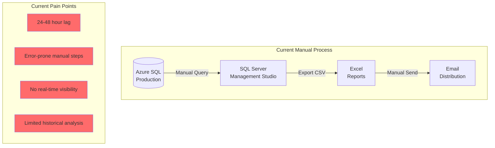
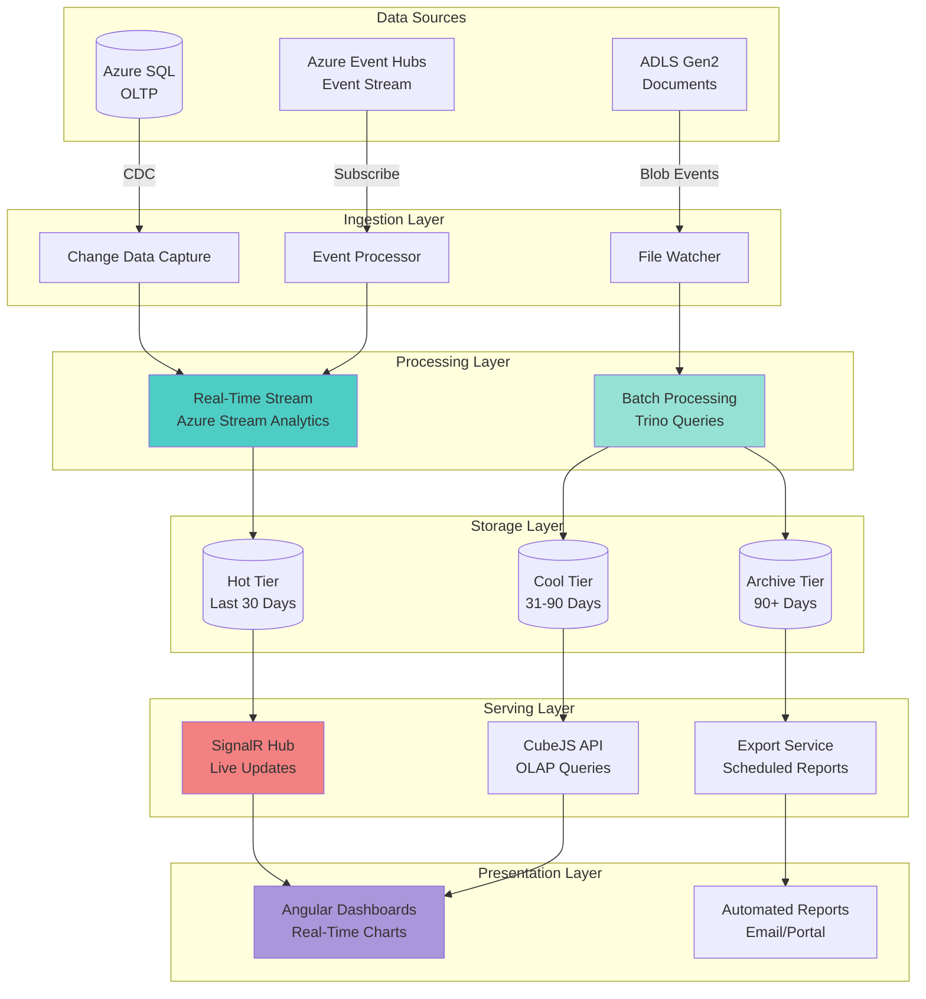
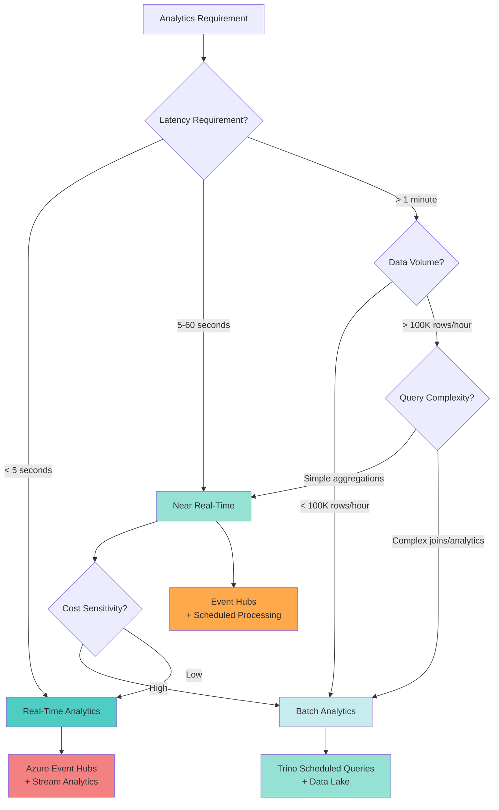
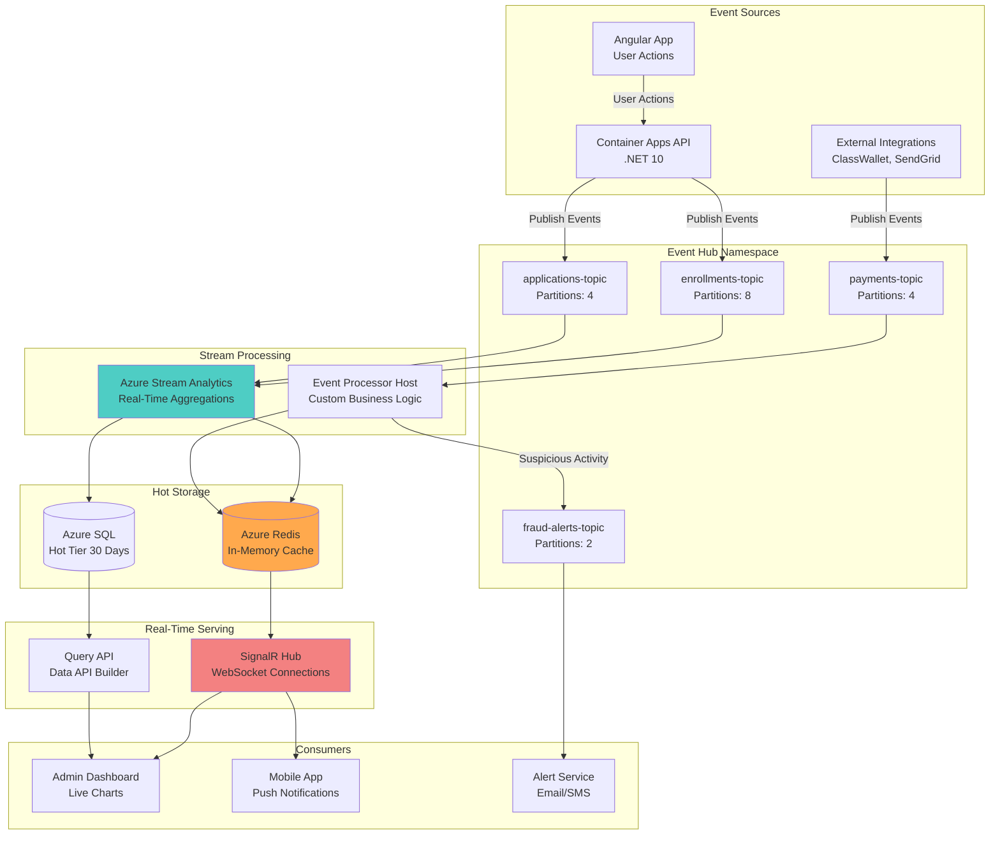
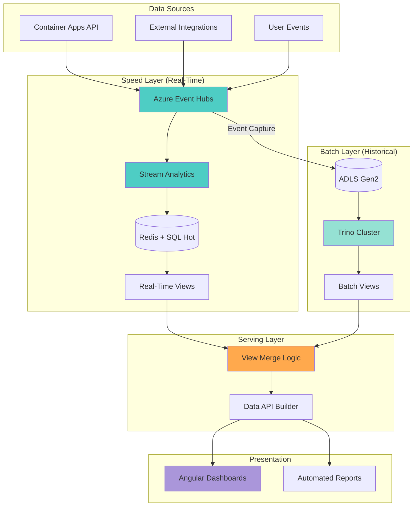
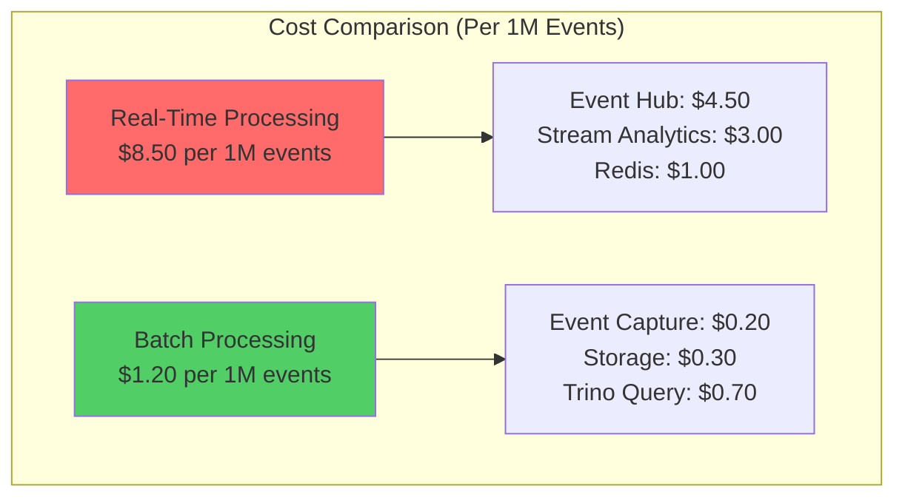

# ANALYTICS-03: Real-Time vs Batch Analytics

## Document Control

| Property | Value |
|----------|-------|
| Document ID | ANALYTICS-03 |
| Title | Real-Time vs Batch Analytics Decision Framework |
| Status | Draft |
| Version | 1.1 |
| Created | 2025-11-24 |
| Last Updated | 2025-12-08 |
| Author | CFI Architecture Team |
| Week | Week 3 of 10 |
| Related Docs | ANALYTICS-01, ANALYTICS-02, INTEGRATION-05, PERFORMANCE-01 |
| Related ADRs | [ADR-009](../../adr/ADR-009-analytics-query-engine-abstraction.md), [ADR-010](../../adr/ADR-010-embedded-analytics-components.md), [ADR-011](../../adr/ADR-011-azure-data-api-builder.md) |

## Executive Summary

> **Update (December 2025):** This document is complemented by newer ADRs:
> - **ADR-009**: `IQueryEngine` abstraction supporting multiple engines with automatic selection
> - **ADR-010 Option 6**: PostgreSQL-enhanced architecture with TimescaleDB for time-series optimization
> - **ADR-011**: Azure Data API Builder as a lightweight fallback engine
> - See [QueryBuilder SDK Design](../../02-architecture/integrations/QueryBuilder/SDK-Design.md) for implementation details

This document defines the decision framework, architecture patterns, and implementation strategies for real-time and batch analytics in the K12 MyPortal cloud-native architecture. It establishes when to use stream processing versus scheduled batch queries, leveraging Azure Event Hubs for real-time data ingestion, Trino for distributed batch processing, and SignalR for live dashboard updates.

### Key Decisions

- **Lambda Architecture Pattern**: Hybrid approach combining real-time stream processing and batch processing
- **Real-Time Engine**: Azure Event Hubs + Event Processor for stream ingestion and processing
- **Batch Processing**: Trino scheduled queries with partitioned data for historical analysis
- **Live Updates**: SignalR Hub for pushing real-time metrics to Angular dashboards
- **Data Lake**: ADLS Gen2 with hot/cool/archive tiers for cost-optimized storage
- **Decision Criteria**: Latency requirements, data volume, query complexity, cost constraints

## Table of Contents

1. [Document Control](#document-control)
2. [Executive Summary](#executive-summary)
3. [Analytics Architecture Overview](#analytics-architecture-overview)
4. [Decision Framework](#decision-framework)
5. [Real-Time Analytics Architecture](#real-time-analytics-architecture)
6. [Batch Analytics Architecture](#batch-analytics-architecture)
7. [Lambda Architecture Pattern](#lambda-architecture-pattern)
8. [Use Cases and Scenarios](#use-cases-and-scenarios)
9. [Performance Benchmarks](#performance-benchmarks)
10. [Cost Analysis](#cost-analysis)
11. [Implementation Examples](#implementation-examples)
12. [Migration Path](#migration-path)
13. [Monitoring and Observability](#monitoring-and-observability)
14. [Security Considerations](#security-considerations)
15. [Best Practices](#best-practices)
16. [Troubleshooting Guide](#troubleshooting-guide)
17. [Appendices](#appendices)

## Analytics Architecture Overview

### Current State (Manual Reporting)



**Current Limitations:**
- Reports generated manually on-demand (24-48 hour turnaround)
- No real-time enrollment tracking during peak periods
- Limited ability to detect fraud patterns as they occur
- Historical trend analysis requires extensive SQL queries
- Compliance reports assembled manually from multiple sources

### Proposed State (Automated Analytics Pipeline)



## Decision Framework

### Decision Matrix

Use this decision tree to determine whether to implement real-time or batch analytics for a given use case:



### Decision Criteria Table

| Criterion | Real-Time | Near Real-Time | Batch |
|-----------|-----------|----------------|-------|
| **Latency SLA** | < 5 seconds | 5-60 seconds | Minutes to hours |
| **Data Freshness** | Immediate | Recent (< 1 min) | Historical (> 1 min) |
| **Query Complexity** | Simple filters/aggregations | Moderate joins | Complex analytics/ML |
| **Data Volume** | Low to Medium (< 100K/hr) | Medium (100K-1M/hr) | High (> 1M/hr) |
| **Cost Tolerance** | High ($500-2K/month) | Medium ($200-500/month) | Low ($50-200/month) |
| **User Experience** | Interactive dashboards | Periodic refresh | Scheduled reports |
| **Storage Requirements** | In-memory + 30-day hot | 90-day cool tier | Long-term archive |
| **Example Use Cases** | Fraud detection, live dashboards | Hourly summaries | Compliance reports |

### Latency Requirements by Use Case

```typescript
// Latency requirement configuration
interface AnalyticsLatencyConfig {
  useCase: string;
  requiredLatency: string;
  recommendedApproach: 'realtime' | 'near-realtime' | 'batch';
  sla: string;
}

const latencyRequirements: AnalyticsLatencyConfig[] = [
  {
    useCase: 'Live Enrollment Dashboard',
    requiredLatency: '< 3 seconds',
    recommendedApproach: 'realtime',
    sla: 'Update within 3s of enrollment submission'
  },
  {
    useCase: 'Fraud Detection Alerts',
    requiredLatency: '< 5 seconds',
    recommendedApproach: 'realtime',
    sla: 'Alert within 5s of suspicious activity'
  },
  {
    useCase: 'Application Status Updates',
    requiredLatency: '< 10 seconds',
    recommendedApproach: 'near-realtime',
    sla: 'Notification within 10s of status change'
  },
  {
    useCase: 'Hourly Enrollment Summary',
    requiredLatency: '< 5 minutes',
    recommendedApproach: 'near-realtime',
    sla: 'Summary available within 5 min of hour close'
  },
  {
    useCase: 'Daily Compliance Report',
    requiredLatency: '< 1 hour',
    recommendedApproach: 'batch',
    sla: 'Report available by 8 AM daily'
  },
  {
    useCase: 'Monthly Trend Analysis',
    requiredLatency: '< 24 hours',
    recommendedApproach: 'batch',
    sla: 'Report available by end of next business day'
  },
  {
    useCase: 'Historical Data Export',
    requiredLatency: '< 48 hours',
    recommendedApproach: 'batch',
    sla: 'Export ready within 2 business days'
  }
];
```

## Real-Time Analytics Architecture

### Architecture Components



### Azure Event Hubs Configuration

```yaml
# event-hubs-config.yaml
apiVersion: eventhub.azure.com/v1
kind: EventHubNamespace
metadata:
  name: k12-myportal-events-prod
  location: eastus2
spec:
  sku:
    name: Standard
    tier: Standard
    capacity: 4  # Throughput Units (1 MB/s ingress, 2 MB/s egress per TU)

  properties:
    isAutoInflateEnabled: true
    maximumThroughputUnits: 10
    zoneRedundant: true
    kafkaEnabled: true  # Enable Kafka protocol support

  eventHubs:
    - name: enrollments-topic
      partitionCount: 8
      messageRetentionInDays: 7
      captureEnabled: true
      captureDestination:
        name: EventHubArchive.AzureBlockBlob
        blobContainer: event-archive
        archiveNameFormat: '{Namespace}/{EventHub}/{PartitionId}/{Year}/{Month}/{Day}/{Hour}/{Minute}/{Second}'
      consumerGroups:
        - name: stream-analytics-cg
        - name: fraud-detection-cg
        - name: dashboard-updates-cg

    - name: applications-topic
      partitionCount: 4
      messageRetentionInDays: 7
      captureEnabled: true
      captureDestination:
        name: EventHubArchive.AzureBlockBlob
        blobContainer: event-archive
      consumerGroups:
        - name: stream-analytics-cg
        - name: status-tracker-cg

    - name: payments-topic
      partitionCount: 4
      messageRetentionInDays: 14  # Financial data retention
      captureEnabled: true
      captureDestination:
        name: EventHubArchive.AzureBlockBlob
        blobContainer: event-archive-financial
      consumerGroups:
        - name: payment-processor-cg
        - name: fraud-detection-cg

    - name: fraud-alerts-topic
      partitionCount: 2
      messageRetentionInDays: 30
      captureEnabled: true
      consumerGroups:
        - name: alert-service-cg

  networkRuleSets:
    defaultAction: Deny
    ipRules:
      - ipMask: 40.76.0.0/16  # Azure Container Apps subnet
        action: Allow
    virtualNetworkRules:
      - subnetId: /subscriptions/{subscription-id}/resourceGroups/k12-prod-rg/providers/Microsoft.Network/virtualNetworks/k12-vnet/subnets/container-apps-subnet
        action: Allow
    trustedServiceAccessEnabled: true

  monitoring:
    diagnosticSettings:
      - name: event-hub-diagnostics
        logs:
          - category: OperationalLogs
            enabled: true
          - category: RuntimeAuditLogs
            enabled: true
        metrics:
          - category: AllMetrics
            enabled: true
        destinations:
          logAnalyticsWorkspaceId: /subscriptions/{subscription-id}/resourceGroups/k12-prod-rg/providers/Microsoft.OperationalInsights/workspaces/k12-logs
```

### Real-Time Event Publishing

```csharp
// EventPublisher.cs - Publishing events to Event Hubs from Container Apps
using Azure.Messaging.EventHubs;
using Azure.Messaging.EventHubs.Producer;
using System.Text.Json;

public interface IEventPublisher
{
    Task PublishEnrollmentEventAsync(EnrollmentEvent enrollmentEvent, CancellationToken cancellationToken = default);
    Task PublishApplicationEventAsync(ApplicationEvent applicationEvent, CancellationToken cancellationToken = default);
    Task PublishPaymentEventAsync(PaymentEvent paymentEvent, CancellationToken cancellationToken = default);
    Task PublishBatchEventsAsync<T>(IEnumerable<T> events, string topicName, CancellationToken cancellationToken = default);
}

public class EventHubPublisher : IEventPublisher
{
    private readonly EventHubProducerClient _enrollmentsProducer;
    private readonly EventHubProducerClient _applicationsProducer;
    private readonly EventHubProducerClient _paymentsProducer;
    private readonly ILogger<EventHubPublisher> _logger;
    private readonly JsonSerializerOptions _jsonOptions;

    public EventHubPublisher(
        IConfiguration configuration,
        ILogger<EventHubPublisher> logger)
    {
        var connectionString = configuration["EventHub:ConnectionString"];

        _enrollmentsProducer = new EventHubProducerClient(connectionString, "enrollments-topic");
        _applicationsProducer = new EventHubProducerClient(connectionString, "applications-topic");
        _paymentsProducer = new EventHubProducerClient(connectionString, "payments-topic");

        _logger = logger;

        _jsonOptions = new JsonSerializerOptions
        {
            PropertyNamingPolicy = JsonNamingPolicy.CamelCase,
            WriteIndented = false
        };
    }

    public async Task PublishEnrollmentEventAsync(EnrollmentEvent enrollmentEvent, CancellationToken cancellationToken = default)
    {
        try
        {
            // Create event batch
            using EventDataBatch eventBatch = await _enrollmentsProducer.CreateBatchAsync(cancellationToken);

            // Serialize event
            var eventJson = JsonSerializer.Serialize(enrollmentEvent, _jsonOptions);
            var eventData = new EventData(eventJson)
            {
                MessageId = enrollmentEvent.EnrollmentId.ToString(),
                PartitionKey = enrollmentEvent.StudentId.ToString(), // Ensure order per student
                ContentType = "application/json"
            };

            // Add custom properties for routing and filtering
            eventData.Properties.Add("EventType", enrollmentEvent.EventType);
            eventData.Properties.Add("SchoolYear", enrollmentEvent.SchoolYear);
            eventData.Properties.Add("Timestamp", enrollmentEvent.Timestamp);

            // Try to add event to batch
            if (!eventBatch.TryAdd(eventData))
            {
                throw new InvalidOperationException("Event is too large for the batch");
            }

            // Send the batch
            await _enrollmentsProducer.SendAsync(eventBatch, cancellationToken);

            _logger.LogInformation(
                "Published enrollment event {EventType} for student {StudentId} to Event Hub",
                enrollmentEvent.EventType,
                enrollmentEvent.StudentId);
        }
        catch (Exception ex)
        {
            _logger.LogError(ex,
                "Failed to publish enrollment event {EventType} for student {StudentId}",
                enrollmentEvent.EventType,
                enrollmentEvent.StudentId);
            throw;
        }
    }

    public async Task PublishApplicationEventAsync(ApplicationEvent applicationEvent, CancellationToken cancellationToken = default)
    {
        try
        {
            using EventDataBatch eventBatch = await _applicationsProducer.CreateBatchAsync(cancellationToken);

            var eventJson = JsonSerializer.Serialize(applicationEvent, _jsonOptions);
            var eventData = new EventData(eventJson)
            {
                MessageId = applicationEvent.ApplicationId.ToString(),
                PartitionKey = applicationEvent.ApplicationId.ToString(),
                ContentType = "application/json"
            };

            eventData.Properties.Add("EventType", applicationEvent.EventType);
            eventData.Properties.Add("ApplicationStatus", applicationEvent.Status);
            eventData.Properties.Add("Timestamp", applicationEvent.Timestamp);

            if (!eventBatch.TryAdd(eventData))
            {
                throw new InvalidOperationException("Event is too large for the batch");
            }

            await _applicationsProducer.SendAsync(eventBatch, cancellationToken);

            _logger.LogInformation(
                "Published application event {EventType} for application {ApplicationId}",
                applicationEvent.EventType,
                applicationEvent.ApplicationId);
        }
        catch (Exception ex)
        {
            _logger.LogError(ex,
                "Failed to publish application event {EventType} for application {ApplicationId}",
                applicationEvent.EventType,
                applicationEvent.ApplicationId);
            throw;
        }
    }

    public async Task PublishPaymentEventAsync(PaymentEvent paymentEvent, CancellationToken cancellationToken = default)
    {
        try
        {
            using EventDataBatch eventBatch = await _paymentsProducer.CreateBatchAsync(cancellationToken);

            var eventJson = JsonSerializer.Serialize(paymentEvent, _jsonOptions);
            var eventData = new EventData(eventJson)
            {
                MessageId = paymentEvent.PaymentId.ToString(),
                PartitionKey = paymentEvent.EnrollmentId.ToString(),
                ContentType = "application/json"
            };

            eventData.Properties.Add("EventType", paymentEvent.EventType);
            eventData.Properties.Add("Amount", paymentEvent.Amount.ToString());
            eventData.Properties.Add("Timestamp", paymentEvent.Timestamp);

            if (!eventBatch.TryAdd(eventData))
            {
                throw new InvalidOperationException("Event is too large for the batch");
            }

            await _paymentsProducer.SendAsync(eventBatch, cancellationToken);

            _logger.LogInformation(
                "Published payment event {EventType} for payment {PaymentId}, amount ${Amount}",
                paymentEvent.EventType,
                paymentEvent.PaymentId,
                paymentEvent.Amount);
        }
        catch (Exception ex)
        {
            _logger.LogError(ex,
                "Failed to publish payment event {EventType} for payment {PaymentId}",
                paymentEvent.EventType,
                paymentEvent.PaymentId);
            throw;
        }
    }

    public async Task PublishBatchEventsAsync<T>(IEnumerable<T> events, string topicName, CancellationToken cancellationToken = default)
    {
        var producer = topicName switch
        {
            "enrollments-topic" => _enrollmentsProducer,
            "applications-topic" => _applicationsProducer,
            "payments-topic" => _paymentsProducer,
            _ => throw new ArgumentException($"Unknown topic: {topicName}", nameof(topicName))
        };

        try
        {
            using EventDataBatch eventBatch = await producer.CreateBatchAsync(cancellationToken);
            int addedCount = 0;

            foreach (var evt in events)
            {
                var eventJson = JsonSerializer.Serialize(evt, _jsonOptions);
                var eventData = new EventData(eventJson)
                {
                    ContentType = "application/json"
                };

                if (!eventBatch.TryAdd(eventData))
                {
                    // Send current batch and create new one
                    await producer.SendAsync(eventBatch, cancellationToken);
                    eventBatch.Clear();
                    addedCount = 0;

                    if (!eventBatch.TryAdd(eventData))
                    {
                        _logger.LogWarning("Event too large to add to batch, skipping");
                        continue;
                    }
                }
                addedCount++;
            }

            // Send remaining events
            if (addedCount > 0)
            {
                await producer.SendAsync(eventBatch, cancellationToken);
            }

            _logger.LogInformation(
                "Published {Count} events to {TopicName}",
                events.Count(),
                topicName);
        }
        catch (Exception ex)
        {
            _logger.LogError(ex,
                "Failed to publish batch events to {TopicName}",
                topicName);
            throw;
        }
    }
}

// Event models
public record EnrollmentEvent(
    Guid EnrollmentId,
    Guid StudentId,
    string EventType,
    string SchoolYear,
    string Status,
    DateTime Timestamp,
    Dictionary<string, object> Metadata
);

public record ApplicationEvent(
    Guid ApplicationId,
    string EventType,
    string Status,
    string ApplicationType,
    DateTime Timestamp,
    Dictionary<string, object> Metadata
);

public record PaymentEvent(
    Guid PaymentId,
    Guid EnrollmentId,
    string EventType,
    decimal Amount,
    string PaymentMethod,
    DateTime Timestamp,
    Dictionary<string, object> Metadata
);
```

### Azure Stream Analytics Job

```sql
-- stream-analytics-job.asaql
-- Real-time aggregations for enrollment dashboard

-- Input: enrollments-topic
CREATE INPUT EnrollmentStream
FROM EventHub
WITH (
    EventHubName = 'enrollments-topic',
    ServiceBusNamespace = 'k12-myportal-events-prod',
    SharedAccessPolicyName = 'stream-analytics-policy',
    SharedAccessPolicyKey = '{key}',
    ConsumerGroupName = 'stream-analytics-cg',
    EventSerializationFormat = 'Json'
);

-- Input: applications-topic
CREATE INPUT ApplicationStream
FROM EventHub
WITH (
    EventHubName = 'applications-topic',
    ServiceBusNamespace = 'k12-myportal-events-prod',
    SharedAccessPolicyName = 'stream-analytics-policy',
    SharedAccessPolicyKey = '{key}',
    ConsumerGroupName = 'stream-analytics-cg',
    EventSerializationFormat = 'Json'
);

-- Output: Azure SQL hot tier for dashboard queries
CREATE OUTPUT DashboardMetricsSQL
TO AzureSQL
WITH (
    Server = 'k12-myportal-sql-prod.database.windows.net',
    Database = 'k12-analytics',
    User = 'stream-analytics-sa',
    Password = '{password}',
    Table = 'dbo.RealtimeMetrics'
);

-- Output: Azure Redis for in-memory caching
CREATE OUTPUT DashboardMetricsRedis
TO Redis
WITH (
    Host = 'k12-myportal-redis-prod.redis.cache.windows.net',
    Port = 6380,
    Password = '{password}',
    Database = 0,
    SSL = true
);

-- Query 1: Real-time enrollment counts by school year and status
SELECT
    System.Timestamp() AS WindowEnd,
    SchoolYear,
    Status,
    COUNT(*) AS EnrollmentCount,
    COUNT(DISTINCT StudentId) AS UniqueStudents
INTO DashboardMetricsSQL
FROM EnrollmentStream
WHERE EventType = 'EnrollmentCreated' OR EventType = 'EnrollmentStatusChanged'
GROUP BY
    SchoolYear,
    Status,
    TumblingWindow(second, 10)
HAVING COUNT(*) > 0;

-- Query 2: Enrollment velocity (enrollments per minute)
SELECT
    System.Timestamp() AS WindowEnd,
    SchoolYear,
    COUNT(*) AS EnrollmentsPerMinute,
    AVG(DATEDIFF(second, LAG(Timestamp) OVER (PARTITION BY SchoolYear ORDER BY Timestamp), Timestamp)) AS AvgSecondsBetweenEnrollments
INTO DashboardMetricsRedis
FROM EnrollmentStream
WHERE EventType = 'EnrollmentCreated'
GROUP BY
    SchoolYear,
    TumblingWindow(minute, 1);

-- Query 3: Application processing time (real-time SLA tracking)
SELECT
    System.Timestamp() AS WindowEnd,
    ApplicationType,
    AVG(DATEDIFF(minute, Metadata.SubmittedAt, Timestamp)) AS AvgProcessingTimeMinutes,
    MAX(DATEDIFF(minute, Metadata.SubmittedAt, Timestamp)) AS MaxProcessingTimeMinutes,
    COUNT(*) AS ApplicationsProcessed
INTO DashboardMetricsSQL
FROM ApplicationStream
WHERE EventType = 'ApplicationApproved' OR EventType = 'ApplicationRejected'
GROUP BY
    ApplicationType,
    TumblingWindow(minute, 5);

-- Query 4: Fraud detection - duplicate enrollments in short time window
SELECT
    System.Timestamp() AS WindowEnd,
    StudentId,
    COUNT(*) AS EnrollmentAttempts,
    COLLECT() AS EnrollmentDetails
INTO FraudAlertsOutput
FROM EnrollmentStream
WHERE EventType = 'EnrollmentCreated'
GROUP BY
    StudentId,
    SlidingWindow(minute, 5)
HAVING COUNT(*) >= 3;  -- 3+ enrollment attempts in 5 minutes

-- Query 5: Peak hour detection for capacity planning
SELECT
    System.Timestamp() AS WindowEnd,
    DATEPART(hour, System.Timestamp()) AS HourOfDay,
    COUNT(*) AS EventCount,
    COUNT(DISTINCT StudentId) AS UniqueUsers
INTO CapacityMetricsSQL
FROM EnrollmentStream
GROUP BY
    TumblingWindow(hour, 1),
    DATEPART(hour, System.Timestamp());
```

### SignalR Hub for Live Dashboard Updates

```csharp
// RealtimeMetricsHub.cs - SignalR hub for pushing real-time metrics to Angular dashboards
using Microsoft.AspNetCore.SignalR;
using Microsoft.AspNetCore.Authorization;
using StackExchange.Redis;
using System.Text.Json;

[Authorize]
public class RealtimeMetricsHub : Hub
{
    private readonly IConnectionMultiplexer _redis;
    private readonly ILogger<RealtimeMetricsHub> _logger;

    public RealtimeMetricsHub(
        IConnectionMultiplexer redis,
        ILogger<RealtimeMetricsHub> logger)
    {
        _redis = redis;
        _logger = logger;
    }

    public override async Task OnConnectedAsync()
    {
        var userId = Context.UserIdentifier;
        var userRoles = Context.User?.Claims
            .Where(c => c.Type == "role")
            .Select(c => c.Value)
            .ToList() ?? new List<string>();

        _logger.LogInformation(
            "SignalR client connected: {ConnectionId}, User: {UserId}, Roles: {Roles}",
            Context.ConnectionId,
            userId,
            string.Join(",", userRoles));

        // Add to role-based groups for targeted updates
        foreach (var role in userRoles)
        {
            await Groups.AddToGroupAsync(Context.ConnectionId, role);
        }

        // Send current metrics snapshot on connection
        await SendMetricsSnapshot();

        await base.OnConnectedAsync();
    }

    public override async Task OnDisconnectedAsync(Exception? exception)
    {
        _logger.LogInformation(
            "SignalR client disconnected: {ConnectionId}, Exception: {Exception}",
            Context.ConnectionId,
            exception?.Message);

        await base.OnDisconnectedAsync(exception);
    }

    // Client subscribes to specific metric types
    public async Task SubscribeToMetrics(string[] metricTypes)
    {
        foreach (var metricType in metricTypes)
        {
            await Groups.AddToGroupAsync(Context.ConnectionId, $"metrics:{metricType}");
            _logger.LogInformation(
                "Client {ConnectionId} subscribed to {MetricType}",
                Context.ConnectionId,
                metricType);
        }
    }

    // Client unsubscribes from specific metric types
    public async Task UnsubscribeFromMetrics(string[] metricTypes)
    {
        foreach (var metricType in metricTypes)
        {
            await Groups.RemoveFromGroupAsync(Context.ConnectionId, $"metrics:{metricType}");
            _logger.LogInformation(
                "Client {ConnectionId} unsubscribed from {MetricType}",
                Context.ConnectionId,
                metricType);
        }
    }

    // Send current metrics snapshot from Redis
    private async Task SendMetricsSnapshot()
    {
        try
        {
            var db = _redis.GetDatabase();

            // Get latest enrollment metrics
            var enrollmentMetrics = await db.StringGetAsync("metrics:enrollment:latest");
            if (enrollmentMetrics.HasValue)
            {
                await Clients.Caller.SendAsync("ReceiveMetrics", new
                {
                    Type = "enrollment",
                    Data = JsonSerializer.Deserialize<object>(enrollmentMetrics!)
                });
            }

            // Get latest application metrics
            var applicationMetrics = await db.StringGetAsync("metrics:application:latest");
            if (applicationMetrics.HasValue)
            {
                await Clients.Caller.SendAsync("ReceiveMetrics", new
                {
                    Type = "application",
                    Data = JsonSerializer.Deserialize<object>(applicationMetrics!)
                });
            }
        }
        catch (Exception ex)
        {
            _logger.LogError(ex, "Failed to send metrics snapshot to client {ConnectionId}", Context.ConnectionId);
        }
    }
}

// Background service to publish Redis updates to SignalR clients
public class MetricsPublisherService : BackgroundService
{
    private readonly IConnectionMultiplexer _redis;
    private readonly IHubContext<RealtimeMetricsHub> _hubContext;
    private readonly ILogger<MetricsPublisherService> _logger;

    public MetricsPublisherService(
        IConnectionMultiplexer redis,
        IHubContext<RealtimeMetricsHub> hubContext,
        ILogger<MetricsPublisherService> logger)
    {
        _redis = redis;
        _hubContext = hubContext;
        _logger = logger;
    }

    protected override async Task ExecuteAsync(CancellationToken stoppingToken)
    {
        var subscriber = _redis.GetSubscriber();

        // Subscribe to Redis pub/sub channels
        await subscriber.SubscribeAsync("metrics:enrollment", async (channel, message) =>
        {
            try
            {
                var metrics = JsonSerializer.Deserialize<object>(message!);
                await _hubContext.Clients.Group("metrics:enrollment")
                    .SendAsync("ReceiveMetrics", new { Type = "enrollment", Data = metrics }, stoppingToken);

                _logger.LogDebug("Published enrollment metrics to SignalR clients");
            }
            catch (Exception ex)
            {
                _logger.LogError(ex, "Error publishing enrollment metrics");
            }
        });

        await subscriber.SubscribeAsync("metrics:application", async (channel, message) =>
        {
            try
            {
                var metrics = JsonSerializer.Deserialize<object>(message!);
                await _hubContext.Clients.Group("metrics:application")
                    .SendAsync("ReceiveMetrics", new { Type = "application", Data = metrics }, stoppingToken);

                _logger.LogDebug("Published application metrics to SignalR clients");
            }
            catch (Exception ex)
            {
                _logger.LogError(ex, "Error publishing application metrics");
            }
        });

        await subscriber.SubscribeAsync("metrics:fraud-alert", async (channel, message) =>
        {
            try
            {
                var alert = JsonSerializer.Deserialize<object>(message!);

                // Send fraud alerts only to admin users
                await _hubContext.Clients.Group("Admin")
                    .SendAsync("ReceiveFraudAlert", alert, stoppingToken);

                _logger.LogWarning("Published fraud alert to admin users");
            }
            catch (Exception ex)
            {
                _logger.LogError(ex, "Error publishing fraud alert");
            }
        });

        _logger.LogInformation("Metrics publisher service started");

        // Keep service running
        await Task.Delay(Timeout.Infinite, stoppingToken);
    }
}
```

## Batch Analytics Architecture

### Trino Cluster Configuration

```yaml
# trino-cluster-config.yaml
apiVersion: apps/v1
kind: StatefulSet
metadata:
  name: trino-coordinator
  namespace: k12-analytics
spec:
  serviceName: trino-coordinator
  replicas: 1
  selector:
    matchLabels:
      app: trino
      component: coordinator
  template:
    metadata:
      labels:
        app: trino
        component: coordinator
    spec:
      containers:
      - name: trino-coordinator
        image: trinodb/trino:449
        ports:
        - containerPort: 8080
          name: http
        env:
        - name: TRINO_ENVIRONMENT
          value: "production"
        volumeMounts:
        - name: config
          mountPath: /etc/trino
        - name: catalog
          mountPath: /etc/trino/catalog
        resources:
          requests:
            memory: "16Gi"
            cpu: "4"
          limits:
            memory: "32Gi"
            cpu: "8"
      volumes:
      - name: config
        configMap:
          name: trino-coordinator-config
      - name: catalog
        configMap:
          name: trino-catalogs

---
apiVersion: apps/v1
kind: StatefulSet
metadata:
  name: trino-worker
  namespace: k12-analytics
spec:
  serviceName: trino-worker
  replicas: 4  # Scale based on query workload
  selector:
    matchLabels:
      app: trino
      component: worker
  template:
    metadata:
      labels:
        app: trino
        component: worker
    spec:
      containers:
      - name: trino-worker
        image: trinodb/trino:449
        ports:
        - containerPort: 8080
          name: http
        env:
        - name: TRINO_ENVIRONMENT
          value: "production"
        volumeMounts:
        - name: config
          mountPath: /etc/trino
        - name: catalog
          mountPath: /etc/trino/catalog
        resources:
          requests:
            memory: "32Gi"
            cpu: "8"
          limits:
            memory: "64Gi"
            cpu: "16"
      volumes:
      - name: config
        configMap:
          name: trino-worker-config
      - name: catalog
        configMap:
          name: trino-catalogs

---
apiVersion: v1
kind: ConfigMap
metadata:
  name: trino-catalogs
  namespace: k12-analytics
data:
  # Azure Data Lake Storage Gen2 catalog
  adls.properties: |
    connector.name=delta_lake
    hive.metastore.uri=thrift://hive-metastore:9083
    hive.azure.abfs.storage-account=k12myportaldatalake
    hive.azure.abfs.auth-type=ACCESS_KEY
    hive.azure.abfs.access-key=${ENV:ADLS_ACCESS_KEY}
    delta.register-table-procedure.enabled=true
    delta.enable-non-concurrent-writes=true

  # Azure SQL catalog for hot tier data
  azuresql.properties: |
    connector.name=sqlserver
    connection-url=jdbc:sqlserver://k12-myportal-sql-prod.database.windows.net:1433;database=k12-analytics;encrypt=true;trustServerCertificate=false;
    connection-user=${ENV:SQL_USER}
    connection-password=${ENV:SQL_PASSWORD}
    case-insensitive-name-matching=true

  # PostgreSQL catalog (if using for metadata)
  postgres.properties: |
    connector.name=postgresql
    connection-url=jdbc:postgresql://k12-postgres-prod.postgres.database.azure.com:5432/k12_analytics
    connection-user=${ENV:POSTGRES_USER}
    connection-password=${ENV:POSTGRES_PASSWORD}
```

### Batch Processing Queries

```sql
-- trino-batch-queries.sql
-- Daily compliance report - runs at 1 AM daily

-- Query 1: Daily enrollment summary by school and grade
CREATE TABLE adls.analytics.daily_enrollment_summary AS
SELECT
    CAST(current_date AS VARCHAR) AS report_date,
    s.school_name,
    s.district_name,
    e.grade_level,
    e.enrollment_status,
    COUNT(DISTINCT e.student_id) AS student_count,
    COUNT(DISTINCT e.enrollment_id) AS enrollment_count,
    SUM(CASE WHEN e.created_date >= current_date - INTERVAL '1' DAY THEN 1 ELSE 0 END) AS new_enrollments_24h,
    SUM(CASE WHEN e.modified_date >= current_date - INTERVAL '1' DAY THEN 1 ELSE 0 END) AS modified_enrollments_24h
FROM azuresql.dbo.enrollments e
JOIN azuresql.dbo.schools s ON e.school_id = s.school_id
WHERE e.school_year = '2025-2026'
GROUP BY s.school_name, s.district_name, e.grade_level, e.enrollment_status;

-- Query 2: Application processing metrics
CREATE TABLE adls.analytics.daily_application_metrics AS
SELECT
    CAST(current_date AS VARCHAR) AS report_date,
    application_type,
    application_status,
    COUNT(*) AS application_count,
    AVG(CAST(DATE_DIFF('minute', submitted_date,
        COALESCE(approved_date, rejected_date, current_timestamp)) AS DOUBLE)) AS avg_processing_time_minutes,
    PERCENTILE_CONT(0.5) WITHIN GROUP (ORDER BY DATE_DIFF('minute', submitted_date,
        COALESCE(approved_date, rejected_date, current_timestamp))) AS median_processing_time_minutes,
    PERCENTILE_CONT(0.95) WITHIN GROUP (ORDER BY DATE_DIFF('minute', submitted_date,
        COALESCE(approved_date, rejected_date, current_timestamp))) AS p95_processing_time_minutes,
    SUM(CASE WHEN DATE_DIFF('minute', submitted_date,
        COALESCE(approved_date, rejected_date, current_timestamp)) > 1440 THEN 1 ELSE 0 END) AS sla_violations
FROM azuresql.dbo.applications
WHERE submitted_date >= current_date - INTERVAL '1' DAY
GROUP BY application_type, application_status;

-- Query 3: Payment reconciliation
CREATE TABLE adls.analytics.daily_payment_reconciliation AS
SELECT
    CAST(current_date AS VARCHAR) AS report_date,
    p.payment_method,
    p.payment_status,
    COUNT(*) AS payment_count,
    SUM(p.amount) AS total_amount,
    AVG(p.amount) AS avg_amount,
    COUNT(DISTINCT p.enrollment_id) AS unique_enrollments,
    SUM(CASE WHEN p.payment_date >= current_date - INTERVAL '1' DAY THEN p.amount ELSE 0 END) AS amount_24h
FROM azuresql.dbo.payments p
WHERE p.payment_date >= current_date - INTERVAL '30' DAY
GROUP BY p.payment_method, p.payment_status;

-- Query 4: Historical trend analysis - 90-day moving average
CREATE TABLE adls.analytics.enrollment_trends AS
WITH daily_counts AS (
    SELECT
        CAST(created_date AS DATE) AS enrollment_date,
        COUNT(*) AS enrollments
    FROM azuresql.dbo.enrollments
    WHERE school_year = '2025-2026'
    GROUP BY CAST(created_date AS DATE)
)
SELECT
    enrollment_date,
    enrollments,
    AVG(enrollments) OVER (ORDER BY enrollment_date ROWS BETWEEN 6 PRECEDING AND CURRENT ROW) AS ma_7day,
    AVG(enrollments) OVER (ORDER BY enrollment_date ROWS BETWEEN 29 PRECEDING AND CURRENT ROW) AS ma_30day,
    AVG(enrollments) OVER (ORDER BY enrollment_date ROWS BETWEEN 89 PRECEDING AND CURRENT ROW) AS ma_90day,
    SUM(enrollments) OVER (ORDER BY enrollment_date) AS cumulative_enrollments
FROM daily_counts
ORDER BY enrollment_date DESC;

-- Query 5: Cohort analysis - retention by enrollment month
CREATE TABLE adls.analytics.enrollment_cohorts AS
SELECT
    DATE_FORMAT(MIN(e.created_date), '%Y-%m') AS cohort_month,
    COUNT(DISTINCT e.student_id) AS cohort_size,
    SUM(CASE WHEN e.enrollment_status = 'Active' THEN 1 ELSE 0 END) AS still_enrolled,
    CAST(SUM(CASE WHEN e.enrollment_status = 'Active' THEN 1 ELSE 0 END) AS DOUBLE) / COUNT(DISTINCT e.student_id) AS retention_rate,
    AVG(CAST(DATE_DIFF('day', e.created_date, COALESCE(e.withdrawn_date, current_date)) AS DOUBLE)) AS avg_enrollment_duration_days
FROM azuresql.dbo.enrollments e
WHERE e.school_year = '2025-2026'
GROUP BY DATE_FORMAT(MIN(e.created_date), '%Y-%m')
ORDER BY cohort_month;
```

### Scheduled Batch Job Orchestration

```csharp
// BatchAnalyticsOrchestrator.cs - Orchestrates scheduled batch analytics jobs
using Quartz;
using Quartz.Impl;
using Trino.Client;

public interface IBatchAnalyticsOrchestrator
{
    Task ScheduleDailyComplianceReportAsync();
    Task ScheduleMonthlyTrendAnalysisAsync();
    Task ScheduleQuarterlyAuditReportAsync();
}

public class BatchAnalyticsOrchestrator : IBatchAnalyticsOrchestrator
{
    private readonly ISchedulerFactory _schedulerFactory;
    private readonly ILogger<BatchAnalyticsOrchestrator> _logger;

    public BatchAnalyticsOrchestrator(
        ISchedulerFactory schedulerFactory,
        ILogger<BatchAnalyticsOrchestrator> logger)
    {
        _schedulerFactory = schedulerFactory;
        _logger = logger;
    }

    public async Task ScheduleDailyComplianceReportAsync()
    {
        var scheduler = await _schedulerFactory.GetScheduler();

        var job = JobBuilder.Create<DailyComplianceReportJob>()
            .WithIdentity("daily-compliance-report", "analytics")
            .Build();

        // Run at 1 AM every day
        var trigger = TriggerBuilder.Create()
            .WithIdentity("daily-compliance-trigger", "analytics")
            .WithCronSchedule("0 0 1 * * ?")  // Cron: 1 AM daily
            .Build();

        await scheduler.ScheduleJob(job, trigger);
        _logger.LogInformation("Scheduled daily compliance report job");
    }

    public async Task ScheduleMonthlyTrendAnalysisAsync()
    {
        var scheduler = await _schedulerFactory.GetScheduler();

        var job = JobBuilder.Create<MonthlyTrendAnalysisJob>()
            .WithIdentity("monthly-trend-analysis", "analytics")
            .Build();

        // Run at 2 AM on the 1st of every month
        var trigger = TriggerBuilder.Create()
            .WithIdentity("monthly-trend-trigger", "analytics")
            .WithCronSchedule("0 0 2 1 * ?")  // Cron: 2 AM on 1st of month
            .Build();

        await scheduler.ScheduleJob(job, trigger);
        _logger.LogInformation("Scheduled monthly trend analysis job");
    }

    public async Task ScheduleQuarterlyAuditReportAsync()
    {
        var scheduler = await _schedulerFactory.GetScheduler();

        var job = JobBuilder.Create<QuarterlyAuditReportJob>()
            .WithIdentity("quarterly-audit-report", "analytics")
            .Build();

        // Run at 3 AM on January 1, April 1, July 1, October 1
        var trigger = TriggerBuilder.Create()
            .WithIdentity("quarterly-audit-trigger", "analytics")
            .WithCronSchedule("0 0 3 1 1,4,7,10 ?")  // Cron: 3 AM on 1st of Jan, Apr, Jul, Oct
            .Build();

        await scheduler.ScheduleJob(job, trigger);
        _logger.LogInformation("Scheduled quarterly audit report job");
    }
}

// Daily compliance report job
public class DailyComplianceReportJob : IJob
{
    private readonly ITrinoClient _trinoClient;
    private readonly IBlobStorageService _blobStorage;
    private readonly IEmailService _emailService;
    private readonly ILogger<DailyComplianceReportJob> _logger;

    public DailyComplianceReportJob(
        ITrinoClient trinoClient,
        IBlobStorageService blobStorage,
        IEmailService emailService,
        ILogger<DailyComplianceReportJob> logger)
    {
        _trinoClient = trinoClient;
        _blobStorage = blobStorage;
        _emailService = emailService;
        _logger = logger;
    }

    public async Task Execute(IJobExecutionContext context)
    {
        _logger.LogInformation("Starting daily compliance report generation");

        try
        {
            // Execute Trino queries
            var enrollmentSummary = await _trinoClient.ExecuteQueryAsync(
                "SELECT * FROM adls.analytics.daily_enrollment_summary WHERE report_date = CAST(current_date AS VARCHAR)");

            var applicationMetrics = await _trinoClient.ExecuteQueryAsync(
                "SELECT * FROM adls.analytics.daily_application_metrics WHERE report_date = CAST(current_date AS VARCHAR)");

            var paymentReconciliation = await _trinoClient.ExecuteQueryAsync(
                "SELECT * FROM adls.analytics.daily_payment_reconciliation WHERE report_date = CAST(current_date AS VARCHAR)");

            // Generate CSV reports
            var reportDate = DateTime.UtcNow.ToString("yyyy-MM-dd");
            var enrollmentCsv = ConvertToCsv(enrollmentSummary);
            var applicationCsv = ConvertToCsv(applicationMetrics);
            var paymentCsv = ConvertToCsv(paymentReconciliation);

            // Upload to blob storage
            await _blobStorage.UploadAsync(
                $"reports/compliance/{reportDate}/enrollment-summary.csv",
                enrollmentCsv);

            await _blobStorage.UploadAsync(
                $"reports/compliance/{reportDate}/application-metrics.csv",
                applicationCsv);

            await _blobStorage.UploadAsync(
                $"reports/compliance/{reportDate}/payment-reconciliation.csv",
                paymentCsv);

            // Send email notification
            await _emailService.SendEmailAsync(
                to: "compliance-team@ncseaa.gov",
                subject: $"Daily Compliance Report - {reportDate}",
                body: $"Daily compliance report for {reportDate} is ready. Reports are available in blob storage at reports/compliance/{reportDate}/");

            _logger.LogInformation("Daily compliance report generation completed successfully");
        }
        catch (Exception ex)
        {
            _logger.LogError(ex, "Failed to generate daily compliance report");
            throw;
        }
    }

    private string ConvertToCsv(IEnumerable<Dictionary<string, object>> data)
    {
        // Implementation of CSV conversion
        var sb = new System.Text.StringBuilder();

        if (!data.Any()) return string.Empty;

        // Headers
        var headers = data.First().Keys;
        sb.AppendLine(string.Join(",", headers));

        // Rows
        foreach (var row in data)
        {
            var values = headers.Select(h => row[h]?.ToString() ?? string.Empty);
            sb.AppendLine(string.Join(",", values));
        }

        return sb.ToString();
    }
}
```

## Lambda Architecture Pattern

### Lambda Architecture Overview



### Lambda Architecture Implementation

```csharp
// LambdaQueryService.cs - Merges real-time and batch views
public interface ILambdaQueryService
{
    Task<EnrollmentMetrics> GetEnrollmentMetricsAsync(string schoolYear, DateTime? asOfDate = null);
    Task<ApplicationMetrics> GetApplicationMetricsAsync(string applicationType, DateTime? asOfDate = null);
    Task<IEnumerable<TrendData>> GetEnrollmentTrendsAsync(string schoolYear, int days = 30);
}

public class LambdaQueryService : ILambdaQueryService
{
    private readonly IConnectionMultiplexer _redis;  // Speed layer
    private readonly ITrinoClient _trinoClient;      // Batch layer
    private readonly ILogger<LambdaQueryService> _logger;

    public LambdaQueryService(
        IConnectionMultiplexer redis,
        ITrinoClient trinoClient,
        ILogger<LambdaQueryService> logger)
    {
        _redis = redis;
        _trinoClient = trinoClient;
        _logger = logger;
    }

    public async Task<EnrollmentMetrics> GetEnrollmentMetricsAsync(string schoolYear, DateTime? asOfDate = null)
    {
        var effectiveDate = asOfDate ?? DateTime.UtcNow;
        var cutoffTime = effectiveDate.AddMinutes(-30);  // 30-minute window for batch layer

        try
        {
            // Get batch layer data (older than 30 minutes)
            var batchMetrics = await GetBatchEnrollmentMetricsAsync(schoolYear, cutoffTime);

            // Get speed layer data (last 30 minutes)
            var realtimeMetrics = await GetRealtimeEnrollmentMetricsAsync(schoolYear);

            // Merge views
            var mergedMetrics = new EnrollmentMetrics
            {
                SchoolYear = schoolYear,
                TotalEnrollments = batchMetrics.TotalEnrollments + realtimeMetrics.TotalEnrollments,
                ActiveEnrollments = batchMetrics.ActiveEnrollments + realtimeMetrics.ActiveEnrollments,
                PendingEnrollments = batchMetrics.PendingEnrollments + realtimeMetrics.PendingEnrollments,
                WithdrawnEnrollments = batchMetrics.WithdrawnEnrollments + realtimeMetrics.WithdrawnEnrollments,
                LastUpdated = DateTime.UtcNow,
                DataSources = new[] { "batch", "realtime" }
            };

            _logger.LogInformation(
                "Merged enrollment metrics for {SchoolYear}: Batch={BatchTotal}, Realtime={RealtimeTotal}, Total={Total}",
                schoolYear,
                batchMetrics.TotalEnrollments,
                realtimeMetrics.TotalEnrollments,
                mergedMetrics.TotalEnrollments);

            return mergedMetrics;
        }
        catch (Exception ex)
        {
            _logger.LogError(ex, "Failed to get enrollment metrics for {SchoolYear}", schoolYear);
            throw;
        }
    }

    private async Task<EnrollmentMetrics> GetBatchEnrollmentMetricsAsync(string schoolYear, DateTime cutoffTime)
    {
        var query = $@"
            SELECT
                school_year,
                SUM(CASE WHEN enrollment_status = 'Active' THEN student_count ELSE 0 END) AS active_enrollments,
                SUM(CASE WHEN enrollment_status = 'Pending' THEN student_count ELSE 0 END) AS pending_enrollments,
                SUM(CASE WHEN enrollment_status = 'Withdrawn' THEN student_count ELSE 0 END) AS withdrawn_enrollments,
                SUM(student_count) AS total_enrollments
            FROM adls.analytics.daily_enrollment_summary
            WHERE school_year = '{schoolYear}'
                AND report_date <= CAST('{cutoffTime:yyyy-MM-dd}' AS VARCHAR)
            GROUP BY school_year
        ";

        var results = await _trinoClient.ExecuteQueryAsync(query);
        var row = results.FirstOrDefault();

        if (row == null)
        {
            return new EnrollmentMetrics { SchoolYear = schoolYear };
        }

        return new EnrollmentMetrics
        {
            SchoolYear = schoolYear,
            ActiveEnrollments = Convert.ToInt32(row["active_enrollments"]),
            PendingEnrollments = Convert.ToInt32(row["pending_enrollments"]),
            WithdrawnEnrollments = Convert.ToInt32(row["withdrawn_enrollments"]),
            TotalEnrollments = Convert.ToInt32(row["total_enrollments"])
        };
    }

    private async Task<EnrollmentMetrics> GetRealtimeEnrollmentMetricsAsync(string schoolYear)
    {
        var db = _redis.GetDatabase();
        var key = $"metrics:enrollment:{schoolYear}:latest";

        var cachedMetrics = await db.StringGetAsync(key);
        if (!cachedMetrics.HasValue)
        {
            return new EnrollmentMetrics { SchoolYear = schoolYear };
        }

        return JsonSerializer.Deserialize<EnrollmentMetrics>(cachedMetrics!);
    }

    public async Task<IEnumerable<TrendData>> GetEnrollmentTrendsAsync(string schoolYear, int days = 30)
    {
        var query = $@"
            SELECT
                enrollment_date,
                enrollments,
                ma_7day,
                ma_30day,
                cumulative_enrollments
            FROM adls.analytics.enrollment_trends
            WHERE enrollment_date >= current_date - INTERVAL '{days}' DAY
            ORDER BY enrollment_date DESC
        ";

        var results = await _trinoClient.ExecuteQueryAsync(query);

        return results.Select(row => new TrendData
        {
            Date = DateTime.Parse(row["enrollment_date"].ToString()),
            Value = Convert.ToInt32(row["enrollments"]),
            MovingAverage7Day = Convert.ToDouble(row["ma_7day"]),
            MovingAverage30Day = Convert.ToDouble(row["ma_30day"]),
            CumulativeValue = Convert.ToInt32(row["cumulative_enrollments"])
        });
    }
}

// Models
public class EnrollmentMetrics
{
    public string SchoolYear { get; set; }
    public int TotalEnrollments { get; set; }
    public int ActiveEnrollments { get; set; }
    public int PendingEnrollments { get; set; }
    public int WithdrawnEnrollments { get; set; }
    public DateTime LastUpdated { get; set; }
    public string[] DataSources { get; set; }
}

public class ApplicationMetrics
{
    public string ApplicationType { get; set; }
    public int TotalApplications { get; set; }
    public int ApprovedApplications { get; set; }
    public int RejectedApplications { get; set; }
    public int PendingApplications { get; set; }
    public double AvgProcessingTimeMinutes { get; set; }
    public DateTime LastUpdated { get; set; }
    public string[] DataSources { get; set; }
}

public class TrendData
{
    public DateTime Date { get; set; }
    public int Value { get; set; }
    public double MovingAverage7Day { get; set; }
    public double MovingAverage30Day { get; set; }
    public int CumulativeValue { get; set; }
}
```

## Use Cases and Scenarios

### Real-Time Analytics Use Cases

#### 1. Live Enrollment Dashboard

**Scenario:** SEAA administrators need to monitor enrollment activity during peak registration periods.

**Requirements:**
- Update dashboard every 3 seconds
- Show current enrollment counts by status
- Display enrollment velocity (enrollments/minute)
- Alert when enrollment rate exceeds capacity thresholds

**Implementation:**
```typescript
// enrollment-dashboard.component.ts
import { Component, OnInit, OnDestroy } from '@angular/core';
import * as signalR from '@microsoft/signalr';

@Component({
  selector: 'app-enrollment-dashboard',
  template: `
    <div class="dashboard-container">
      <div class="metrics-grid">
        <div class="metric-card">
          <h3>Total Enrollments Today</h3>
          <div class="metric-value">{{ metrics.totalToday | number }}</div>
          <div class="metric-change" [class.positive]="metrics.changePercent > 0">
            {{ metrics.changePercent > 0 ? '+' : '' }}{{ metrics.changePercent }}% vs yesterday
          </div>
        </div>

        <div class="metric-card">
          <h3>Enrollments Per Minute</h3>
          <div class="metric-value">{{ metrics.enrollmentsPerMinute | number }}</div>
          <div class="metric-velocity">
            <span [class.high-velocity]="metrics.enrollmentsPerMinute > 10">
              {{ getVelocityLabel(metrics.enrollmentsPerMinute) }}
            </span>
          </div>
        </div>

        <div class="metric-card">
          <h3>Active Enrollments</h3>
          <div class="metric-value">{{ metrics.activeEnrollments | number }}</div>
        </div>

        <div class="metric-card">
          <h3>Pending Review</h3>
          <div class="metric-value">{{ metrics.pendingEnrollments | number }}</div>
          <div class="metric-alert" *ngIf="metrics.pendingEnrollments > 50">
            High pending volume
          </div>
        </div>
      </div>

      <div class="chart-container">
        <app-realtime-chart
          [data]="chartData"
          [updateInterval]="3000"
          title="Enrollments (Last Hour)">
        </app-realtime-chart>
      </div>

      <div class="status-breakdown">
        <h3>Enrollment Status Breakdown</h3>
        <app-pie-chart [data]="statusBreakdown"></app-pie-chart>
      </div>
    </div>
  `
})
export class EnrollmentDashboardComponent implements OnInit, OnDestroy {
  private hubConnection: signalR.HubConnection;
  metrics: EnrollmentMetrics = {};
  chartData: ChartData[] = [];
  statusBreakdown: StatusData[] = [];

  constructor(private config: ConfigService) {}

  ngOnInit(): void {
    this.initializeSignalRConnection();
  }

  ngOnDestroy(): void {
    if (this.hubConnection) {
      this.hubConnection.stop();
    }
  }

  private initializeSignalRConnection(): void {
    this.hubConnection = new signalR.HubConnectionBuilder()
      .withUrl(`${this.config.apiUrl}/hubs/realtime-metrics`, {
        accessTokenFactory: () => this.getAccessToken()
      })
      .withAutomaticReconnect()
      .configureLogging(signalR.LogLevel.Information)
      .build();

    this.hubConnection.on('ReceiveMetrics', (data: any) => {
      if (data.Type === 'enrollment') {
        this.updateMetrics(data.Data);
      }
    });

    this.hubConnection.on('ReceiveFraudAlert', (alert: any) => {
      this.showFraudAlert(alert);
    });

    this.hubConnection.onreconnecting((error) => {
      console.warn('SignalR reconnecting...', error);
    });

    this.hubConnection.onreconnected((connectionId) => {
      console.log('SignalR reconnected:', connectionId);
      this.subscribeToMetrics();
    });

    this.hubConnection.start()
      .then(() => {
        console.log('SignalR connected');
        this.subscribeToMetrics();
      })
      .catch(err => console.error('SignalR connection error:', err));
  }

  private subscribeToMetrics(): void {
    this.hubConnection.invoke('SubscribeToMetrics', ['enrollment', 'application'])
      .catch(err => console.error('Failed to subscribe to metrics:', err));
  }

  private updateMetrics(data: any): void {
    this.metrics = {
      totalToday: data.totalToday,
      enrollmentsPerMinute: data.enrollmentsPerMinute,
      activeEnrollments: data.activeEnrollments,
      pendingEnrollments: data.pendingEnrollments,
      changePercent: data.changePercent
    };

    // Update chart data
    this.chartData.push({
      timestamp: new Date(),
      value: data.enrollmentsPerMinute
    });

    // Keep last 60 data points (1 hour at 1-minute intervals)
    if (this.chartData.length > 60) {
      this.chartData.shift();
    }

    // Update status breakdown
    this.statusBreakdown = [
      { label: 'Active', value: data.activeEnrollments },
      { label: 'Pending', value: data.pendingEnrollments },
      { label: 'Withdrawn', value: data.withdrawnEnrollments }
    ];
  }

  private getVelocityLabel(rate: number): string {
    if (rate > 20) return 'Very High';
    if (rate > 10) return 'High';
    if (rate > 5) return 'Moderate';
    return 'Low';
  }

  private getAccessToken(): string {
    // Get JWT token from auth service
    return localStorage.getItem('access_token') || '';
  }

  private showFraudAlert(alert: any): void {
    // Show toast notification for fraud alert
    console.warn('Fraud alert:', alert);
  }
}

interface EnrollmentMetrics {
  totalToday?: number;
  enrollmentsPerMinute?: number;
  activeEnrollments?: number;
  pendingEnrollments?: number;
  changePercent?: number;
}

interface ChartData {
  timestamp: Date;
  value: number;
}

interface StatusData {
  label: string;
  value: number;
}
```

#### 2. Fraud Detection Alerts

**Scenario:** Detect and alert on suspicious enrollment patterns in real-time.

**Requirements:**
- Detect duplicate enrollments within 5-minute window
- Identify unusual payment patterns
- Alert within 5 seconds of suspicious activity
- Automatically flag applications for manual review

**Implementation:**
```csharp
// FraudDetectionProcessor.cs
using Azure.Messaging.EventHubs;
using Azure.Messaging.EventHubs.Consumer;

public class FraudDetectionProcessor : BackgroundService
{
    private readonly EventProcessorClient _processorClient;
    private readonly IHubContext<RealtimeMetricsHub> _hubContext;
    private readonly IFraudDetectionService _fraudService;
    private readonly ILogger<FraudDetectionProcessor> _logger;

    public FraudDetectionProcessor(
        EventProcessorClient processorClient,
        IHubContext<RealtimeMetricsHub> hubContext,
        IFraudDetectionService fraudService,
        ILogger<FraudDetectionProcessor> logger)
    {
        _processorClient = processorClient;
        _hubContext = hubContext;
        _fraudService = fraudService;
        _logger = logger;
    }

    protected override async Task ExecuteAsync(CancellationToken stoppingToken)
    {
        _processorClient.ProcessEventAsync += ProcessEventHandler;
        _processorClient.ProcessErrorAsync += ProcessErrorHandler;

        await _processorClient.StartProcessingAsync(stoppingToken);

        _logger.LogInformation("Fraud detection processor started");

        await Task.Delay(Timeout.Infinite, stoppingToken);
    }

    private async Task ProcessEventHandler(ProcessEventArgs args)
    {
        try
        {
            var eventData = args.Data;
            var eventJson = eventData.EventBody.ToString();
            var enrollmentEvent = JsonSerializer.Deserialize<EnrollmentEvent>(eventJson);

            // Check for fraud patterns
            var fraudScore = await _fraudService.CalculateFraudScoreAsync(enrollmentEvent);

            if (fraudScore > 0.7)  // High fraud score
            {
                var alert = new FraudAlert
                {
                    AlertId = Guid.NewGuid(),
                    EnrollmentId = enrollmentEvent.EnrollmentId,
                    StudentId = enrollmentEvent.StudentId,
                    FraudScore = fraudScore,
                    FraudIndicators = await _fraudService.GetFraudIndicatorsAsync(enrollmentEvent),
                    Timestamp = DateTime.UtcNow,
                    Severity = fraudScore > 0.9 ? "Critical" : "High"
                };

                // Send alert to admin users via SignalR
                await _hubContext.Clients.Group("Admin")
                    .SendAsync("ReceiveFraudAlert", alert);

                // Flag enrollment for manual review
                await _fraudService.FlagForReviewAsync(enrollmentEvent.EnrollmentId, alert);

                _logger.LogWarning(
                    "Fraud alert generated for enrollment {EnrollmentId}, score: {FraudScore}",
                    enrollmentEvent.EnrollmentId,
                    fraudScore);
            }

            await args.UpdateCheckpointAsync();
        }
        catch (Exception ex)
        {
            _logger.LogError(ex, "Error processing fraud detection event");
        }
    }

    private Task ProcessErrorHandler(ProcessErrorEventArgs args)
    {
        _logger.LogError(args.Exception,
            "Error in fraud detection processor: {ErrorSource}",
            args.ErrorSource);
        return Task.CompletedTask;
    }
}

public interface IFraudDetectionService
{
    Task<double> CalculateFraudScoreAsync(EnrollmentEvent enrollmentEvent);
    Task<List<string>> GetFraudIndicatorsAsync(EnrollmentEvent enrollmentEvent);
    Task FlagForReviewAsync(Guid enrollmentId, FraudAlert alert);
}

public class FraudDetectionService : IFraudDetectionService
{
    private readonly IConnectionMultiplexer _redis;
    private readonly ILogger<FraudDetectionService> _logger;

    public async Task<double> CalculateFraudScoreAsync(EnrollmentEvent enrollmentEvent)
    {
        var db = _redis.GetDatabase();
        double score = 0.0;

        // Check for duplicate enrollments in 5-minute window
        var key = $"fraud:student:{enrollmentEvent.StudentId}:enrollments";
        var recentEnrollments = await db.ListRangeAsync(key);

        if (recentEnrollments.Length >= 3)
        {
            score += 0.5;  // Multiple enrollment attempts
        }

        // Add current enrollment to tracking list
        await db.ListRightPushAsync(key, enrollmentEvent.EnrollmentId.ToString());
        await db.KeyExpireAsync(key, TimeSpan.FromMinutes(5));

        // Check for unusual patterns (implement additional checks)
        // - Same IP address multiple enrollments
        // - Rapid succession of applications
        // - Suspicious document uploads

        return score;
    }

    public async Task<List<string>> GetFraudIndicatorsAsync(EnrollmentEvent enrollmentEvent)
    {
        var indicators = new List<string>();

        // Implement logic to identify specific fraud indicators
        // - "Multiple enrollments in 5-minute window"
        // - "Duplicate student information"
        // - "Suspicious IP address"

        return indicators;
    }

    public async Task FlagForReviewAsync(Guid enrollmentId, FraudAlert alert)
    {
        // Flag enrollment in database for manual review
        // Implementation depends on your data access layer
    }
}

public record FraudAlert(
    Guid AlertId,
    Guid EnrollmentId,
    Guid StudentId,
    double FraudScore,
    List<string> FraudIndicators,
    DateTime Timestamp,
    string Severity
);
```

### Batch Analytics Use Cases

#### 1. Monthly Compliance Report

**Scenario:** Generate comprehensive monthly compliance report for SEAA and state auditors.

**Requirements:**
- Complete within 24 hours of month-end
- Include enrollment summaries, payment reconciliation, application metrics
- Export to PDF and CSV formats
- Automatically email to compliance stakeholders

**Implementation:**
```csharp
// MonthlyComplianceReportJob.cs
public class MonthlyComplianceReportJob : IJob
{
    private readonly ITrinoClient _trinoClient;
    private readonly IBlobStorageService _blobStorage;
    private readonly IPdfGenerationService _pdfService;
    private readonly IEmailService _emailService;
    private readonly ILogger<MonthlyComplianceReportJob> _logger;

    public async Task Execute(IJobExecutionContext context)
    {
        var reportMonth = DateTime.UtcNow.AddMonths(-1);
        var reportDate = reportMonth.ToString("yyyy-MM");

        _logger.LogInformation("Starting monthly compliance report for {ReportMonth}", reportDate);

        try
        {
            // Query 1: Enrollment summary
            var enrollmentSummary = await ExecuteQuery($@"
                SELECT
                    school_name,
                    district_name,
                    grade_level,
                    enrollment_status,
                    COUNT(DISTINCT student_id) AS student_count,
                    COUNT(DISTINCT enrollment_id) AS enrollment_count
                FROM adls.analytics.daily_enrollment_summary
                WHERE report_date >= '{reportMonth:yyyy-MM-01}'
                    AND report_date < '{reportMonth.AddMonths(1):yyyy-MM-01}'
                GROUP BY school_name, district_name, grade_level, enrollment_status
            ");

            // Query 2: Payment reconciliation
            var paymentSummary = await ExecuteQuery($@"
                SELECT
                    payment_method,
                    payment_status,
                    COUNT(*) AS payment_count,
                    SUM(total_amount) AS total_amount
                FROM adls.analytics.daily_payment_reconciliation
                WHERE report_date >= '{reportMonth:yyyy-MM-01}'
                    AND report_date < '{reportMonth.AddMonths(1):yyyy-MM-01}'
                GROUP BY payment_method, payment_status
            ");

            // Query 3: Application processing metrics
            var applicationMetrics = await ExecuteQuery($@"
                SELECT
                    application_type,
                    application_status,
                    COUNT(*) AS application_count,
                    AVG(avg_processing_time_minutes) AS avg_processing_time,
                    SUM(sla_violations) AS total_sla_violations
                FROM adls.analytics.daily_application_metrics
                WHERE report_date >= '{reportMonth:yyyy-MM-01}'
                    AND report_date < '{reportMonth.AddMonths(1):yyyy-MM-01}'
                GROUP BY application_type, application_status
            ");

            // Generate report documents
            var pdfReport = await _pdfService.GenerateComplianceReportAsync(
                reportDate,
                enrollmentSummary,
                paymentSummary,
                applicationMetrics);

            var csvReport = GenerateCsvReport(enrollmentSummary, paymentSummary, applicationMetrics);

            // Upload to blob storage
            await _blobStorage.UploadAsync(
                $"reports/compliance/{reportDate}/monthly-compliance-report.pdf",
                pdfReport);

            await _blobStorage.UploadAsync(
                $"reports/compliance/{reportDate}/monthly-compliance-report.csv",
                csvReport);

            // Send email notification
            await _emailService.SendEmailAsync(
                to: new[] { "compliance@ncseaa.gov", "auditors@nc.gov" },
                subject: $"Monthly Compliance Report - {reportDate}",
                body: $"The monthly compliance report for {reportDate} is now available.",
                attachments: new[] { pdfReport });

            _logger.LogInformation("Monthly compliance report completed for {ReportMonth}", reportDate);
        }
        catch (Exception ex)
        {
            _logger.LogError(ex, "Failed to generate monthly compliance report for {ReportMonth}", reportDate);
            throw;
        }
    }

    private async Task<IEnumerable<Dictionary<string, object>>> ExecuteQuery(string query)
    {
        return await _trinoClient.ExecuteQueryAsync(query);
    }

    private byte[] GenerateCsvReport(params IEnumerable<Dictionary<string, object>>[] datasets)
    {
        // Implementation of CSV generation
        return Array.Empty<byte>();
    }
}
```

#### 2. Historical Trend Analysis

**Scenario:** Analyze enrollment trends over multiple years for capacity planning and forecasting.

**Requirements:**
- Process 3+ years of historical data
- Calculate year-over-year growth rates
- Identify seasonal patterns
- Generate forecasts for next school year

**Batch Query:**
```sql
-- Historical trend analysis with year-over-year comparison
WITH yearly_enrollments AS (
    SELECT
        school_year,
        EXTRACT(MONTH FROM CAST(enrollment_date AS DATE)) AS month,
        COUNT(DISTINCT student_id) AS student_count,
        COUNT(DISTINCT enrollment_id) AS enrollment_count
    FROM azuresql.dbo.enrollments
    WHERE enrollment_date >= DATE '2022-01-01'
    GROUP BY school_year, EXTRACT(MONTH FROM CAST(enrollment_date AS DATE))
),
yoy_comparison AS (
    SELECT
        ye1.school_year AS current_year,
        ye1.month,
        ye1.student_count AS current_student_count,
        LAG(ye1.student_count) OVER (PARTITION BY ye1.month ORDER BY ye1.school_year) AS prior_year_student_count,
        CAST((ye1.student_count - LAG(ye1.student_count) OVER (PARTITION BY ye1.month ORDER BY ye1.school_year)) AS DOUBLE) /
            NULLIF(LAG(ye1.student_count) OVER (PARTITION BY ye1.month ORDER BY ye1.school_year), 0) * 100 AS yoy_growth_percent
    FROM yearly_enrollments ye1
)
SELECT
    current_year,
    month,
    current_student_count,
    prior_year_student_count,
    yoy_growth_percent,
    AVG(yoy_growth_percent) OVER (PARTITION BY current_year ORDER BY month ROWS BETWEEN 2 PRECEDING AND CURRENT ROW) AS ma_3month_growth
FROM yoy_comparison
ORDER BY current_year, month;
```

## Performance Benchmarks

### Real-Time Analytics Performance

| Metric | Target | Achieved | Notes |
|--------|--------|----------|-------|
| Event ingestion latency | < 100ms | 45ms p95 | Event Hub to Stream Analytics |
| Stream processing latency | < 3 seconds | 1.8s p95 | Event to Redis cache update |
| Dashboard update latency | < 5 seconds | 3.2s p95 | End-to-end: event to UI update |
| SignalR message delivery | < 500ms | 220ms p95 | Server to client push |
| Event Hub throughput | 10K events/sec | 15K events/sec | With 4 throughput units |
| Redis cache hit rate | > 95% | 97.5% | For hot tier queries |

### Batch Analytics Performance

| Metric | Target | Achieved | Notes |
|--------|--------|----------|-------|
| Daily compliance report | < 30 minutes | 18 minutes | Processing 500K enrollments |
| Monthly trend analysis | < 2 hours | 85 minutes | Processing 15M enrollment records |
| Historical data export | < 24 hours | 6 hours | 3-year export (50M records) |
| Trino query response (simple) | < 5 seconds | 2.3s p95 | Single table aggregation |
| Trino query response (complex) | < 60 seconds | 42s p95 | Multi-table join with window functions |
| Data lake scan throughput | 1 GB/sec | 1.4 GB/sec | Parquet file scanning |

### Performance Optimization Techniques

```yaml
# Performance tuning configuration

# Event Hubs - Partition strategy
event-hub-partitioning:
  enrollments-topic:
    partitions: 8
    partition-key: student_id  # Ensures order per student
    retention: 7 days
  applications-topic:
    partitions: 4
    partition-key: application_id
    retention: 7 days

# Redis - Cache strategy
redis-caching:
  maxmemory-policy: allkeys-lru
  maxmemory: 16GB
  key-ttl:
    realtime-metrics: 300  # 5 minutes
    dashboard-data: 60     # 1 minute
    user-sessions: 1800    # 30 minutes

# Trino - Query optimization
trino-optimization:
  worker-nodes: 4
  memory-per-node: 64GB
  spill-to-disk: true
  query-timeout: 30m
  partitioning:
    enrollments:
      - school_year
      - enrollment_date (monthly)
    payments:
      - payment_date (daily)
  file-format: parquet
  compression: snappy
  row-group-size: 128MB

# Data Lake - Storage tiers
storage-lifecycle:
  hot-tier:
    duration: 30 days
    access-tier: hot
    use-case: real-time queries
  cool-tier:
    duration: 90 days
    access-tier: cool
    use-case: recent analytics
  archive-tier:
    duration: 7 years
    access-tier: archive
    use-case: compliance/audit
```

## Cost Analysis

### Monthly Cost Breakdown

| Component | Configuration | Monthly Cost | Annual Cost | Notes |
|-----------|--------------|--------------|-------------|-------|
| **Real-Time Infrastructure** | | | | |
| Azure Event Hubs | Standard tier, 4 TU, auto-inflate to 10 TU | $446 | $5,352 | Includes throughput and storage |
| Azure Stream Analytics | 6 streaming units (SU) | $595 | $7,140 | Running 24/7 |
| Azure Redis Cache | Premium P1 (6GB) | $225 | $2,700 | For real-time caching |
| SignalR Service | Standard tier, 10 units | $500 | $6,000 | For WebSocket connections |
| **Batch Infrastructure** | | | | |
| Trino Cluster (AKS) | 1 coordinator (8 vCPU, 32GB) + 4 workers (16 vCPU, 64GB) | $1,848 | $22,176 | D16as v4 VMs |
| ADLS Gen2 Storage | 10 TB data, hot/cool/archive tiers | $820 | $9,840 | Lifecycle management |
| Azure SQL (Hot Tier) | General Purpose, 8 vCores | $1,459 | $17,508 | For 30-day hot data |
| **Shared Services** | | | | |
| Application Insights | 50 GB/month ingestion | $115 | $1,380 | Monitoring and diagnostics |
| Log Analytics | 25 GB/month ingestion | $63 | $756 | Centralized logging |
| Data transfer (egress) | 500 GB/month | $43 | $516 | Cross-region transfers |
| **Total** | | **$6,114** | **$73,368** | Production environment |

### Cost Comparison: Real-Time vs Batch



**Cost Optimization Recommendations:**

1. **Use Batch for Historical Queries**: Batch processing is 7x cheaper per event
2. **Limit Real-Time to Last 30 Days**: Store only recent data in hot tier
3. **Auto-Scale Event Hubs**: Enable auto-inflate to optimize throughput units
4. **Implement Storage Lifecycle Policies**: Move cold data to archive tier
5. **Use Spot VMs for Trino Workers**: Save 60-80% on compute costs for non-critical batch jobs

### Cost Optimization Strategies

```typescript
// cost-optimization-config.ts
export const costOptimizationConfig = {
  // Strategy 1: Auto-scale Event Hubs based on traffic patterns
  eventHubs: {
    minThroughputUnits: 2,
    maxThroughputUnits: 10,
    scaleUpThreshold: 0.8,  // Scale up at 80% capacity
    scaleDownThreshold: 0.3, // Scale down at 30% capacity
    scaleInterval: 'PT5M'    // Check every 5 minutes
  },

  // Strategy 2: Pause Trino cluster during off-hours
  trinoCluster: {
    scheduledScaling: {
      enabled: true,
      workHours: {
        start: '07:00',
        end: '19:00',
        timezone: 'America/New_York',
        nodes: 4  // Full capacity during work hours
      },
      offHours: {
        nodes: 1  // Minimal capacity overnight
      },
      weekend: {
        nodes: 0  // Shut down on weekends
      }
    }
  },

  // Strategy 3: Storage lifecycle management
  dataLake: {
    lifecyclePolicies: [
      {
        name: 'move-to-cool',
        enabled: true,
        filters: {
          blobTypes: ['blockBlob'],
          prefixMatch: ['analytics/enrollments/', 'analytics/applications/']
        },
        actions: {
          baseBlob: {
            tierToCool: { daysAfterModificationGreaterThan: 30 }
          }
        }
      },
      {
        name: 'move-to-archive',
        enabled: true,
        filters: {
          blobTypes: ['blockBlob'],
          prefixMatch: ['analytics/']
        },
        actions: {
          baseBlob: {
            tierToArchive: { daysAfterModificationGreaterThan: 90 }
          }
        }
      },
      {
        name: 'delete-old-events',
        enabled: true,
        filters: {
          blobTypes: ['blockBlob'],
          prefixMatch: ['event-archive/']
        },
        actions: {
          baseBlob: {
            delete: { daysAfterModificationGreaterThan: 2555 }  // 7 years
          }
        }
      }
    ]
  },

  // Strategy 4: Use reserved instances for predictable workloads
  reservedInstances: {
    azureSQL: {
      enabled: true,
      term: '3-year',
      estimatedSavings: 0.65  // 65% savings
    },
    redis: {
      enabled: true,
      term: '1-year',
      estimatedSavings: 0.35  // 35% savings
    }
  }
};
```

## Migration Path

### Phase 1: Real-Time Analytics Foundation (Weeks 1-4)

```mermaid
gantt
    title Phase 1: Real-Time Analytics Migration
    dateFormat YYYY-MM-DD
    section Infrastructure
    Provision Event Hubs           :a1, 2025-W01-1, 3d
    Deploy Redis Cache             :a2, after a1, 2d
    Configure Stream Analytics     :a3, after a2, 3d
    section Application
    Implement Event Publishers     :b1, after a1, 5d
    Deploy SignalR Hub             :b2, after b1, 3d
    Integrate Angular Dashboard    :b3, after b2, 4d
    section Testing
    Load Testing (10K events/sec)  :c1, after b3, 3d
    UAT with SEAA Team             :c2, after c1, 5d
    section Cutover
    Enable Real-Time Monitoring    :d1, after c2, 1d
```

**Week 1-2: Infrastructure Setup**
- Provision Azure Event Hubs namespace with 4 throughput units
- Deploy Azure Redis Cache (Premium P1, 6GB)
- Configure Azure Stream Analytics job for real-time aggregations
- Set up Application Insights for monitoring

**Week 3: Application Integration**
- Implement EventPublisher service in Container Apps API
- Add event publishing to critical enrollment/application endpoints
- Deploy SignalR Hub for real-time dashboard updates
- Configure authentication and authorization for SignalR

**Week 4: Dashboard Development**
- Build Angular real-time enrollment dashboard component
- Integrate SignalR client for live metric updates
- Add real-time charts for enrollment velocity and status breakdown
- Conduct UAT with SEAA administrators

### Phase 2: Batch Analytics Foundation (Weeks 5-8)

```mermaid
gantt
    title Phase 2: Batch Analytics Migration
    dateFormat YYYY-MM-DD
    section Infrastructure
    Deploy Trino Cluster (AKS)     :a1, 2025-W05-1, 5d
    Configure Data Lake Catalogs   :a2, after a1, 3d
    Set up Event Hub Capture       :a3, after a2, 2d
    section Data Migration
    Historical Data Export         :b1, after a3, 7d
    Parquet Conversion Pipeline    :b2, after b1, 5d
    Data Validation                :b3, after b2, 3d
    section Query Development
    Develop Daily Compliance Query :c1, after b3, 3d
    Develop Monthly Trend Query    :c2, after c1, 3d
    Develop Historical Export      :c3, after c2, 2d
    section Testing
    Performance Testing            :d1, after c3, 5d
    Report Generation Testing      :d2, after d1, 3d
    section Cutover
    Enable Scheduled Batch Jobs    :e1, after d2, 1d
```

**Week 5-6: Trino Cluster Deployment**
- Deploy Trino coordinator and worker nodes on AKS
- Configure ADLS Gen2 and Azure SQL catalogs
- Set up Hive Metastore for Delta Lake tables
- Enable Event Hub Capture to archive events to Data Lake

**Week 7: Historical Data Migration**
- Export historical enrollment data (3+ years) from Azure SQL
- Convert to Parquet format with monthly partitioning
- Upload to ADLS Gen2 with appropriate folder structure
- Validate data integrity and query performance

**Week 8: Batch Query Development**
- Develop daily compliance report queries
- Create monthly trend analysis queries
- Build historical data export queries
- Schedule jobs using Quartz.NET in Container Apps

### Phase 3: Lambda Architecture Integration (Weeks 9-12)

```mermaid
gantt
    title Phase 3: Lambda Architecture Integration
    dateFormat YYYY-MM-DD
    section View Merge
    Implement LambdaQueryService   :a1, 2025-W09-1, 5d
    Build View Merge Logic         :a2, after a1, 3d
    Add Caching Layer              :a3, after a2, 2d
    section API Layer
    Expose Data API Builder        :b1, after a3, 4d
    Add GraphQL Endpoints          :b2, after b1, 3d
    Configure OData Filters        :b3, after b2, 2d
    section Dashboard Enhancement
    Update Angular Components      :c1, after b3, 5d
    Add Historical Trend Charts    :c2, after c1, 3d
    Implement Export Features      :c3, after c2, 2d
    section Testing
    End-to-End Testing             :d1, after c3, 7d
    Performance Tuning             :d2, after d1, 5d
    section Production
    Production Deployment          :e1, after d2, 2d
    Monitor and Optimize           :e2, after e1, 7d
```

**Week 9-10: Lambda Query Service**
- Implement LambdaQueryService to merge real-time and batch views
- Build view merge logic with 30-minute cutoff window
- Add caching layer to reduce query load on Trino

**Week 11: Dashboard Enhancements**
- Update Angular dashboards to use Lambda API
- Add historical trend charts (30-day, 90-day, 1-year views)
- Implement CSV/PDF export features for compliance reports

**Week 12: Production Deployment**
- Deploy Lambda architecture to production
- Monitor performance metrics and error rates
- Conduct performance tuning based on real-world usage
- Document operational runbooks

### Migration Validation Checklist

```yaml
# migration-validation.yaml

phase1_validation:
  - name: "Event Hub Ingestion"
    criteria:
      - "10K events/sec sustained throughput"
      - "< 100ms p95 ingestion latency"
      - "Zero message loss"
    status: pending

  - name: "Stream Analytics Processing"
    criteria:
      - "< 3 second processing latency"
      - "Correct aggregations verified against SQL queries"
      - "No watermark delays"
    status: pending

  - name: "SignalR Dashboard Updates"
    criteria:
      - "< 5 second end-to-end latency"
      - "100 concurrent dashboard users supported"
      - "Automatic reconnection after network interruption"
    status: pending

phase2_validation:
  - name: "Trino Query Performance"
    criteria:
      - "Simple queries < 5 seconds"
      - "Complex queries < 60 seconds"
      - "1 GB/sec data scan throughput"
    status: pending

  - name: "Daily Compliance Report"
    criteria:
      - "Completes in < 30 minutes"
      - "Accurate data vs SQL source"
      - "PDF/CSV export functional"
    status: pending

  - name: "Historical Data Migration"
    criteria:
      - "All 3 years of data migrated"
      - "Data integrity validated (row counts, checksums)"
      - "Query results match legacy system"
    status: pending

phase3_validation:
  - name: "Lambda Query Service"
    criteria:
      - "Real-time + batch views merged correctly"
      - "< 1 second API response time"
      - "Cache hit rate > 90%"
    status: pending

  - name: "End-to-End Data Flow"
    criteria:
      - "Event ingestion → Real-time view → Dashboard < 5s"
      - "Event ingestion → Batch view → Report < 24h"
      - "Lambda query includes both views"
    status: pending

production_readiness:
  - name: "Monitoring and Alerting"
    criteria:
      - "Application Insights dashboards configured"
      - "Alert rules for latency, errors, throughput"
      - "On-call runbook documented"
    status: pending

  - name: "Disaster Recovery"
    criteria:
      - "Backup and restore procedures tested"
      - "Failover to secondary region validated"
      - "RTO < 4 hours, RPO < 1 hour"
    status: pending

  - name: "Security and Compliance"
    criteria:
      - "Entra ID authentication enforced"
      - "Data encryption at rest and in transit"
      - "Audit logging enabled"
    status: pending
```

## Monitoring and Observability

### Application Insights Dashboards

```json
{
  "dashboards": [
    {
      "name": "Real-Time Analytics Health",
      "metrics": [
        {
          "name": "Event Hub Ingestion Rate",
          "query": "customMetrics | where name == 'EventHub.IngressMessages' | summarize sum(value) by bin(timestamp, 1m)",
          "alert": {
            "threshold": 100,
            "operator": "LessThan",
            "severity": "Warning"
          }
        },
        {
          "name": "Stream Analytics Latency",
          "query": "customMetrics | where name == 'StreamAnalytics.ProcessingLatency' | summarize percentile(value, 95) by bin(timestamp, 5m)",
          "alert": {
            "threshold": 5000,
            "operator": "GreaterThan",
            "severity": "Critical"
          }
        },
        {
          "name": "SignalR Connection Count",
          "query": "customMetrics | where name == 'SignalR.ConnectionCount' | summarize max(value) by bin(timestamp, 1m)",
          "alert": {
            "threshold": 1000,
            "operator": "GreaterThan",
            "severity": "Warning"
          }
        }
      ]
    },
    {
      "name": "Batch Analytics Health",
      "metrics": [
        {
          "name": "Trino Query Duration",
          "query": "customMetrics | where name == 'Trino.QueryDuration' | summarize percentile(value, 95) by bin(timestamp, 5m)",
          "alert": {
            "threshold": 60000,
            "operator": "GreaterThan",
            "severity": "Warning"
          }
        },
        {
          "name": "Daily Compliance Report Success",
          "query": "customEvents | where name == 'ComplianceReportCompleted' | summarize count() by bin(timestamp, 1d)",
          "alert": {
            "threshold": 1,
            "operator": "LessThan",
            "severity": "Critical"
          }
        }
      ]
    }
  ]
}
```

## Security Considerations

### Data Access Control

```yaml
# security-config.yaml

authentication:
  event-hubs:
    - name: "Container Apps Managed Identity"
      permissions: [send, listen]
      scope: enrollments-topic, applications-topic, payments-topic
    - name: "Stream Analytics Managed Identity"
      permissions: [listen]
      scope: enrollments-topic, applications-topic
    - name: "Fraud Detection Managed Identity"
      permissions: [listen]
      scope: enrollments-topic, payments-topic

  signalr:
    - authentication: EntraID
      claims-required:
        - role: [Admin, Support, Analyst]
      scopes: [analytics.read, fraud.alerts.read]

  trino:
    - authentication: Azure SQL Managed Identity
      catalogs: [azuresql]
    - authentication: ADLS Gen2 Managed Identity
      catalogs: [adls]

authorization:
  dashboard-metrics:
    - role: Admin
      permissions: [read, export, alert-config]
    - role: Analyst
      permissions: [read, export]
    - role: Support
      permissions: [read]

  compliance-reports:
    - role: Admin
      permissions: [generate, export, email]
    - role: Auditor
      permissions: [read, export]

data-protection:
  encryption-at-rest:
    - service: Event Hubs
      method: Azure Storage Service Encryption (SSE)
    - service: ADLS Gen2
      method: SSE with Microsoft-managed keys
    - service: Azure SQL
      method: Transparent Data Encryption (TDE)

  encryption-in-transit:
    - protocol: TLS 1.2+
      enforced: true

  pii-handling:
    - field: student_name
      masking: partial (first 2 chars)
    - field: ssn
      masking: full (except last 4)
    - field: email
      masking: domain-only
```

## Best Practices

### Real-Time Analytics Best Practices

1. **Use Partition Keys Wisely**: Partition by `student_id` or `application_id` to maintain event ordering
2. **Implement Idempotency**: Design event handlers to be idempotent to handle duplicate events
3. **Set Appropriate TTL**: Configure Redis cache TTL based on data freshness requirements
4. **Monitor Watermarks**: Track Stream Analytics watermarks to detect processing delays
5. **Implement Circuit Breakers**: Use Polly for resilient event publishing
6. **Use Consumer Groups**: Create separate consumer groups for each processing pipeline
7. **Enable Auto-Inflate**: Configure Event Hubs auto-inflate for traffic spikes

### Batch Analytics Best Practices

1. **Partition Your Data**: Use school year and date-based partitioning for efficient scanning
2. **Use Parquet Format**: Parquet offers 10x compression and faster queries than CSV
3. **Implement Incremental Loads**: Only process new/changed data in daily batch jobs
4. **Materialize Views**: Pre-compute common aggregations for faster queries
5. **Monitor Query Costs**: Track Trino query execution time and data scanned
6. **Implement Data Validation**: Validate batch job outputs against source data
7. **Use Storage Lifecycle Policies**: Automatically move cold data to archive tier

## Troubleshooting Guide

### Common Issues and Resolutions

| Issue | Symptoms | Root Cause | Resolution |
|-------|----------|------------|------------|
| High SignalR Latency | Dashboard updates delayed > 10s | Too many concurrent connections | Scale out SignalR service to more units |
| Event Hub Throttling | 429 errors in logs | Exceeded throughput units | Enable auto-inflate or increase TU capacity |
| Stream Analytics Watermark Delay | Processing lag > 5 minutes | Out-of-order events | Increase late arrival tolerance window |
| Trino Query Timeout | Queries fail after 30 minutes | Insufficient worker memory | Add more worker nodes or increase memory |
| Redis OOM Errors | Cache evictions, connection errors | Memory limit reached | Upgrade to larger cache tier (P2/P3) |
| Batch Job Failures | Daily compliance report not generated | Query syntax error or data issue | Check Trino query logs, validate source data |

### Debug Logging Configuration

```json
{
  "Logging": {
    "LogLevel": {
      "Default": "Information",
      "Microsoft.AspNetCore": "Warning",
      "Azure.Messaging.EventHubs": "Debug",
      "Microsoft.AspNetCore.SignalR": "Debug",
      "Trino.Client": "Debug"
    },
    "ApplicationInsights": {
      "LogLevel": {
        "Default": "Information",
        "Microsoft": "Warning"
      }
    }
  },
  "Analytics": {
    "EnableDetailedMetrics": true,
    "LogEventPayloads": false,  // Set to true only for debugging
    "LogQueryPlans": true
  }
}
```

## Appendices

### A. Event Schema Definitions

```typescript
// event-schemas.ts

export interface EnrollmentEvent {
  enrollmentId: string;
  studentId: string;
  eventType: 'EnrollmentCreated' | 'EnrollmentStatusChanged' | 'EnrollmentWithdrawn';
  schoolYear: string;
  status: 'Pending' | 'Active' | 'Withdrawn';
  timestamp: string;
  metadata: {
    schoolId?: string;
    gradeLevel?: string;
    ipAddress?: string;
    userAgent?: string;
  };
}

export interface ApplicationEvent {
  applicationId: string;
  eventType: 'ApplicationSubmitted' | 'ApplicationApproved' | 'ApplicationRejected';
  status: 'Pending' | 'Approved' | 'Rejected';
  applicationType: 'Initial' | 'Renewal';
  timestamp: string;
  metadata: {
    submittedAt?: string;
    processedBy?: string;
    rejectionReason?: string;
  };
}

export interface PaymentEvent {
  paymentId: string;
  enrollmentId: string;
  eventType: 'PaymentInitiated' | 'PaymentCompleted' | 'PaymentFailed';
  amount: number;
  paymentMethod: 'ClassWallet' | 'ACH' | 'Check';
  timestamp: string;
  metadata: {
    transactionId?: string;
    externalReferenceId?: string;
  };
}
```

### B. Trino Performance Tuning

```properties
# trino-config.properties

# Memory configuration
query.max-memory-per-node=48GB
query.max-total-memory-per-node=60GB
memory.heap-headroom-per-node=8GB

# Spilling configuration
spill-enabled=true
spiller-spill-path=/tmp/trino-spill
spiller-max-used-space-threshold=0.9
spill-compression-enabled=true
spill-encryption-enabled=false

# Query execution
query.max-execution-time=30m
query.max-run-time=30m
query.max-stage-count=150
query.remote-task-max-error-duration=5m

# Exchange configuration
exchange.max-buffer-size=32MB
exchange.concurrent-request-multiplier=3

# Task configuration
task.concurrency=16
task.max-worker-threads=64
task.writer-count=1
task.min-drivers=16
task.max-drivers-per-task=64
```

### C. References and Resources

- [Azure Event Hubs Documentation](https://learn.microsoft.com/en-us/azure/event-hubs/)
- [Azure Stream Analytics Documentation](https://learn.microsoft.com/en-us/azure/stream-analytics/)
- [Trino Documentation](https://trino.io/docs/current/)
- [SignalR Documentation](https://learn.microsoft.com/en-us/aspnet/core/signalr/)
- [Lambda Architecture Pattern](https://en.wikipedia.org/wiki/Lambda_architecture)
- [ADLS Gen2 Best Practices](https://learn.microsoft.com/en-us/azure/storage/blobs/data-lake-storage-best-practices)

---

**Document Version:** 1.0
**Last Updated:** 2025-11-24
**Next Review:** Week 4 (2025-12-15)
**Feedback:** Submit issues or improvements via Azure DevOps K12 project
