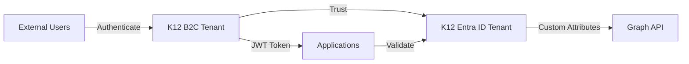

# ADR-003: Entra ID B2C for Customer Identity and Access Management

**Status:** Accepted
**Date:** 2024-07-20
**Deciders:** CFI Architecture Team, SEAA IT Security
**Technical Story:** Secure authentication for external users (parents, schools, providers)

## Context and Problem Statement

The K12 MyPortal system must authenticate and authorize multiple external user types:
- **Parents/Guardians**: 100,000+ users applying for scholarships
- **School Administrators**: 1,000+ schools managing enrollments
- **Service Providers**: 5,000+ vendors offering educational services

These external users need:
- Self-service registration and profile management
- Social login options (Google, Facebook, etc.)
- Multi-factor authentication (MFA)
- Password reset capabilities
- Custom security attributes for fine-grained authorization
- Integration with backend APIs

## Decision Drivers

* **Government Cloud Requirement**: Must run in Azure Government Cloud
* **Scale**: Handle 100,000+ external users
* **Security**: MFA, custom attributes, audit logging
* **User Experience**: Social login, self-service capabilities
* **Integration**: Seamless with Azure Functions and APIM
* **Compliance**: FedRAMP, FERPA, NIST 800-53
* **Cost**: Reasonable cost for user volume

## Considered Options

1. **Azure Entra ID B2C** - Microsoft's CIAM platform
2. **Auth0** - Popular third-party CIAM service
3. **Okta Customer Identity** - Enterprise CIAM platform
4. **Custom Authentication** - Build our own

## Decision Outcome

**Chosen option:** "Azure Entra ID B2C", because:
1. Native Azure Government Cloud support
2. Seamless integration with Azure services
3. Custom security attributes for attribute-driven authorization
4. Cost-effective at scale (monthly active users pricing)
5. FedRAMP High compliance out-of-the-box
6. Microsoft Graph API for attribute management

### Consequences

#### Good
- FedRAMP High compliance inherited
- Runs in Azure Government Cloud (no data sovereignty issues)
- Native JWT integration with APIM and Azure Functions
- Custom security attributes enable Hub & Spoke security model
- Social login (Google, Facebook, Apple) supported
- Self-service registration and password reset
- MFA built-in
- Microsoft Graph API for programmatic user management
- Cost-effective: Only pay for monthly active users
- No infrastructure to manage

#### Bad
- Learning curve for B2C-specific concepts (user flows, custom policies)
- Custom UI requires HTML/CSS customization
- Some advanced features require custom policies (XML)
- Limited to Microsoft ecosystem

#### Neutral
- Requires separate B2C tenant from internal Entra ID
- Trust relationship between B2C and main Entra ID

## Pros and Cons of the Options

### Azure Entra ID B2C (Chosen)

* **Pro:** Azure Government Cloud support (FedRAMP High)
* **Pro:** Custom security attributes for fine-grained access
* **Pro:** Social login providers supported
* **Pro:** Seamless Azure integration
* **Pro:** Cost-effective ($0.00325 per MAU for 100K+ users)
* **Pro:** No infrastructure management
* **Pro:** Microsoft Graph API
* **Pro:** MFA built-in
* **Con:** Custom policies are complex (XML)
* **Con:** Limited UI customization without custom HTML/CSS
* **Con:** Learning curve for B2C-specific features

### Auth0

* **Pro:** Excellent developer experience
* **Pro:** Rich feature set
* **Pro:** Great documentation and community
* **Pro:** Flexible customization
* **Con:** ❌ No Azure Government Cloud support
* **Con:** ❌ Data sovereignty issues (not in Gov Cloud)
* **Con:** ❌ Would need separate FedRAMP assessment
* **Con:** ❌ Higher cost at scale
* **Con:** ❌ Another vendor to manage
* **Con:** ❌ No custom security attributes

### Okta Customer Identity

* **Pro:** Enterprise-grade CIAM
* **Pro:** Feature-rich platform
* **Pro:** Good scalability
* **Con:** ❌ No Azure Government Cloud support
* **Con:** ❌ FedRAMP compliance unclear
* **Con:** ❌ Higher cost
* **Con:** ❌ Separate ecosystem from Azure
* **Con:** ❌ No custom security attributes

### Custom Authentication

* **Pro:** Complete control
* **Pro:** Exactly what we need
* **Con:** ❌ Massive development effort
* **Con:** ❌ Security risks (rolling our own auth)
* **Con:** ❌ Ongoing maintenance burden
* **Con:** ❌ Would still need FedRAMP assessment
* **Con:** ❌ Social login integration complex

## Technical Details

### B2C Tenant Configuration

**Tenant:** `k12portal.b2c.onmicrosoft.us` (Azure Government)

**User Flows:**
- Sign-up and sign-in
- Profile editing
- Password reset

**Custom Policies:**
- Social login with attribute collection
- MFA enforcement for admins
- Custom security attribute assignment on registration

### Hub and Spoke Integration



**How it works:**
1. External user authenticates with B2C
2. B2C issues JWT token with user claims
3. Application validates token with B2C
4. Application queries Entra ID for custom security attributes
5. Custom attributes drive authorization decisions

### Custom Security Attributes

**Student Access Control:**
```json
{
  "customSecurityAttributes": {
    "studentAccessControl": {
      "parentReadWrite": ["parent-oid-1", "parent-oid-2"],
      "proxyReadOnly": ["proxy-oid-1"],
      "enrolledSchoolId": "school-group-oid",
      "enrolledVendorId": "vendor-group-oid"
    }
  }
}
```

**Managed via Microsoft Graph API:**
```csharp
await _graphClient.Users[userId]
    .CustomSecurityAttributes
    .PatchAsync(new CustomSecurityAttributesValue
    {
        AdditionalData = new Dictionary<string, object>
        {
            ["studentAccessControl"] = new
            {
                parentReadWrite = new[] { parentObjectId },
                proxyReadOnly = new string[] { },
                enrolledSchoolId = schoolGroupId,
                enrolledVendorId = vendorGroupId
            }
        }
    });
```

### Social Login Configuration

**Supported Providers:**
- Google
- Facebook
- Apple
- Microsoft Account

**Configuration Example (Google):**
```xml
<ClaimsProvider>
  <Domain>google.com</Domain>
  <DisplayName>Google</DisplayName>
  <TechnicalProfiles>
    <TechnicalProfile Id="Google-OAuth2">
      <DisplayName>Google</DisplayName>
      <Protocol Name="OAuth2" />
      <Metadata>
        <Item Key="ProviderName">google</Item>
        <Item Key="authorization_endpoint">https://accounts.google.com/o/oauth2/auth</Item>
        <Item Key="AccessTokenEndpoint">https://accounts.google.com/o/oauth2/token</Item>
        <Item Key="ClaimsEndpoint">https://www.googleapis.com/oauth2/v1/userinfo</Item>
        <Item Key="client_id">{ClientId}</Item>
      </Metadata>
    </TechnicalProfile>
  </TechnicalProfiles>
</ClaimsProvider>
```

### Angular Integration

**MSAL Library:**
```typescript
import { MsalModule, MsalInterceptor } from '@azure/msal-angular';
import { PublicClientApplication, InteractionType } from '@azure/msal-browser';

export const msalConfig = {
  auth: {
    clientId: 'k12-enrollment-dev-client-id',
    authority: 'https://login.microsoftonline.us/k12portal.b2c.onmicrosoft.us/B2C_1_SignUpSignIn',
    knownAuthorities: ['k12portal.b2c.onmicrosoft.us'],
    redirectUri: 'https://victorious-cliff-0c5f7690f-dev.eastus2.5.azurestaticapps.net/',
  },
  cache: {
    cacheLocation: 'localStorage',
    storeAuthStateInCookie: false,
  }
};

@NgModule({
  imports: [
    MsalModule.forRoot(
      new PublicClientApplication(msalConfig),
      {
        interactionType: InteractionType.Redirect,
        authRequest: {
          scopes: ['openid', 'profile', 'email']
        }
      },
      {
        interactionType: InteractionType.Redirect,
        protectedResourceMap: new Map([
          ['https://k12-api-prod.azure-api.us/api/*', ['api://k12-api-prod/user_impersonation']]
        ])
      }
    )
  ],
  providers: [
    { provide: HTTP_INTERCEPTORS, useClass: MsalInterceptor, multi: true }
  ]
})
export class AppModule { }
```

### Cost Analysis

**Pricing (Azure Government):**
- First 50,000 MAU: $0.00325/MAU
- Next 50,000 MAU: $0.0016/MAU
- Next 400,000 MAU: $0.0008/MAU

**K12 Estimate (100,000 MAU):**
- First 50K: 50,000 × $0.00325 = $162.50
- Next 50K: 50,000 × $0.0016 = $80.00
- **Total Monthly:** $242.50

**Compare to Auth0:**
- 100,000 MAU: ~$2,500/month (10x more expensive)

## Validation

Success measured by:
- 100% of external users can self-register
- Social login working for Google, Facebook
- MFA enforced for school and provider admins
- Custom security attributes queryable via Graph API
- Zero authentication-related security incidents
- FedRAMP compliance maintained

## Related Decisions

* [ADR-001: Azure Government Cloud](ADR-001-azure-government-cloud.md) - B2C must run in Gov Cloud
* [SEC-01: Entra ID Configuration](../02-architecture/security/SEC-01-entra-id-configuration.md) - Hub & Spoke model
* [SEC-02: Authorization Model](../02-architecture/security/SEC-02-authorization-model.md) - Custom attributes usage

## References

* [Azure AD B2C Documentation](https://learn.microsoft.com/en-us/azure/active-directory-b2c/)
* [B2C Custom Policies](https://learn.microsoft.com/en-us/azure/active-directory-b2c/custom-policy-overview)
* [MSAL Angular](https://github.com/AzureAD/microsoft-authentication-library-for-js/tree/dev/lib/msal-angular)
* [B2C Pricing](https://azure.microsoft.com/en-us/pricing/details/active-directory-b2c/)

---

**Decision Made:** July 20, 2024
**Implemented:** August 2024
